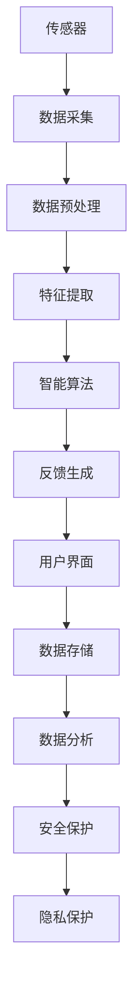

                 

## 文章标题

智能瑜伽垫创业：个人健身教练的替代品

### 关键词

智能瑜伽垫、健身教练、替代品、传感器技术、数据分析、创业策略

### 摘要

随着健康意识的提高和健身需求的增长，智能瑜伽垫作为一种新兴的健身工具，逐渐成为个人健身教练的替代品。本文将从智能瑜伽垫的定义、工作原理、技术实现、市场前景以及创业策略等多个角度，详细探讨智能瑜伽垫的发展潜力及其在健身领域的应用。通过分析智能瑜伽垫的核心概念与联系、算法原理、数学模型，以及实际开发案例，本文旨在为创业者提供有价值的参考和指导，助力智能瑜伽垫行业的繁荣发展。

---

### 第一部分：智能瑜伽垫与个人健身教练的关系

智能瑜伽垫是一种结合了传感器技术和人工智能算法的健身工具，能够实时监测用户的瑜伽动作，提供实时的反馈和建议，从而在一定程度上替代了传统个人健身教练的服务。本部分将首先对智能瑜伽垫进行概述，然后详细探讨其工作原理和在实际健身中的应用。

#### 第1章：智能瑜伽垫概述

##### 1.1 智能瑜伽垫的定义与特点

智能瑜伽垫是一种在传统瑜伽垫的基础上集成了传感器技术、无线通信技术和数据分析算法的新型健身设备。它通过内置的传感器实时监测用户在瑜伽练习过程中的动作，并将数据传输到配套的应用程序，通过智能算法分析数据，提供个性化的训练建议和反馈。

智能瑜伽垫的特点主要包括：

1. **实时监测与反馈**：智能瑜伽垫能够实时监测用户的瑜伽动作，通过传感器采集数据，将动作的细节呈现给用户，帮助用户进行自我纠正和调整。
2. **个性化定制**：基于用户的历史数据和实时监测数据，智能瑜伽垫可以提供个性化的训练计划和建议，使健身效果更加显著。
3. **便捷性**：用户可以在家中使用智能瑜伽垫进行健身，无需外出或预约教练，节省了时间和精力。
4. **安全性能**：智能瑜伽垫可以监测用户的心率、动作幅度等关键指标，及时发现并提示可能的运动风险，提高运动安全性。

##### 1.2 智能瑜伽垫的组成部分

智能瑜伽垫主要由以下几个部分组成：

1. **传感器技术**：智能瑜伽垫内置各种传感器，如压力传感器、加速度传感器、陀螺仪等，用于实时监测用户的瑜伽动作。
2. **智能反馈系统**：传感器采集的数据会被传输到智能反馈系统进行处理，通过分析数据生成反馈信息，然后通过显示界面或声音提示用户。
3. **用户界面与交互设计**：智能瑜伽垫通常配备一个智能手机应用程序，用户可以通过应用程序查看训练数据、接收反馈信息，并进行个性化设置。

##### 1.3 智能瑜伽垫与普通瑜伽垫的比较

智能瑜伽垫与普通瑜伽垫相比，具有以下显著优势：

1. **智能化监测**：智能瑜伽垫能够实时监测用户的瑜伽动作，提供实时反馈，而普通瑜伽垫不具备这种功能。
2. **个性化定制**：智能瑜伽垫可以根据用户的历史数据和实时监测数据，提供个性化的训练计划和反馈，而普通瑜伽垫无法实现这一点。
3. **互动性**：智能瑜伽垫通常与智能手机应用程序连接，用户可以通过应用程序与其他用户进行互动，分享训练心得，而普通瑜伽垫则不具备这种功能。
4. **便携性**：智能瑜伽垫可以随身携带，方便用户随时随地使用，而普通瑜伽垫体积较大，不便携带。

#### 第2章：智能瑜伽垫的工作原理

##### 2.1 传感器技术

传感器技术是智能瑜伽垫的核心组成部分，其作用是实时监测用户的瑜伽动作。智能瑜伽垫通常使用以下类型的传感器：

1. **压力传感器**：用于测量用户在瑜伽垫上的压力分布，帮助分析用户的瑜伽动作和身体姿态。
2. **加速度传感器**：用于测量用户在瑜伽练习中的加速度变化，帮助分析动作的速度和力量。
3. **陀螺仪**：用于测量用户的角速度，帮助分析动作的方向和稳定性。

传感器采集的数据会被传输到智能瑜伽垫的处理器进行进一步处理和分析。

##### 2.2 智能反馈系统

智能反馈系统是智能瑜伽垫的另一个核心组成部分，其作用是根据传感器采集的数据，提供实时的反馈和指导。智能反馈系统的原理如下：

1. **数据采集**：传感器采集的数据会被传输到智能瑜伽垫的处理器，处理器会对数据进行初步处理，如去噪、滤波等。
2. **特征提取**：处理器会从原始数据中提取关键特征，如压力分布、加速度、角速度等。
3. **算法分析**：提取的特征数据会被输入到智能算法中进行分析，根据用户的训练目标、历史数据和当前动作，生成反馈信息。
4. **反馈输出**：生成的反馈信息会通过智能瑜伽垫的用户界面或声音提示用户，帮助用户进行自我纠正和调整。

##### 2.3 智能反馈系统的效果评估

智能反馈系统的效果可以通过以下几个方面进行评估：

1. **准确性**：智能反馈系统提供的反馈信息是否准确，是否符合用户的实际动作情况。
2. **实时性**：智能反馈系统能否实时响应用户的动作，提供及时的反馈和指导。
3. **个性化**：智能反馈系统能否根据用户的历史数据和实时动作，提供个性化的反馈和指导。
4. **用户体验**：智能反馈系统是否易于使用，是否能够提高用户的健身效果和满意度。

#### 第3章：智能瑜伽垫在健身中的应用

##### 3.1 个人健身教练的替代品

智能瑜伽垫在健身中的应用，使得个人健身教练在一定程度上可以被替代。智能瑜伽垫的优势主要体现在以下几个方面：

1. **实时监测与反馈**：智能瑜伽垫能够实时监测用户的瑜伽动作，并提供实时反馈，帮助用户进行自我纠正和调整，这一点是传统个人健身教练无法实现的。
2. **个性化定制**：智能瑜伽垫可以根据用户的历史数据和实时监测数据，提供个性化的训练计划和建议，使健身效果更加显著。
3. **便捷性**：用户可以在家中使用智能瑜伽垫进行健身，无需外出或预约教练，节省了时间和精力。
4. **安全性**：智能瑜伽垫可以监测用户的心率、动作幅度等关键指标，及时发现并提示可能的运动风险，提高运动安全性。

##### 3.2 智能瑜伽垫在家庭健身中的使用

智能瑜伽垫在家庭健身中的应用非常广泛，用户可以在家中自由安排训练时间和方式，享受个性化的瑜伽体验。智能瑜伽垫的使用步骤如下：

1. **安装与设置**：将智能瑜伽垫放置在家中合适的位置，并连接到智能手机应用程序。
2. **选择训练计划**：在应用程序中选择适合自己水平的瑜伽训练计划，或自定义训练计划。
3. **开始训练**：按照应用程序中的指导进行瑜伽练习，智能瑜伽垫会实时监测用户的动作，并提供反馈和指导。
4. **记录与分析**：训练结束后，用户可以在应用程序中查看训练数据和反馈信息，分析自己的进步和不足。

##### 3.3 智能瑜伽垫与专业健身教练的结合

智能瑜伽垫不仅可以替代个人健身教练，还可以与专业健身教练相结合，提供更全面、更个性化的健身服务。智能瑜伽垫与专业健身教练的结合方式如下：

1. **远程指导**：专业健身教练可以通过智能瑜伽垫提供的实时反馈，远程指导用户的瑜伽练习，纠正用户的动作，提高训练效果。
2. **个性化训练计划**：专业健身教练可以根据智能瑜伽垫提供的用户数据和反馈信息，为用户制定更科学、更个性化的训练计划。
3. **数据共享**：专业健身教练和用户可以通过智能瑜伽垫共享训练数据，分析用户的进步和不足，优化训练方案。

#### 第4章：智能瑜伽垫在健身训练中的实际案例

##### 4.1 瑜伽动作的实时反馈

智能瑜伽垫可以实时监测用户的瑜伽动作，并提供准确的反馈信息。以下是一个实际案例：

- **案例**：用户在进行“金刚坐”练习时，智能瑜伽垫会实时监测用户的身体姿态，如果用户身体前倾过多，智能瑜伽垫会提示用户“身体前倾过多，请调整姿势”，如果用户身体后仰过多，智能瑜伽垫会提示用户“身体后仰过多，请调整姿势”。
- **效果**：通过智能瑜伽垫的实时反馈，用户可以快速纠正错误的动作，提高瑜伽练习的效果。

##### 4.2 动作纠正与指导

智能瑜伽垫不仅可以提供实时反馈，还可以根据用户的动作数据，进行动作纠正和指导。以下是一个实际案例：

- **案例**：用户在进行“倒立”练习时，智能瑜伽垫会实时监测用户的手臂力量和身体平衡，如果用户手臂力量不足或身体平衡不稳，智能瑜伽垫会提示用户“手臂力量不足，请加强练习”或“身体平衡不稳，请调整姿势”。
- **效果**：通过智能瑜伽垫的动作纠正和指导，用户可以更准确地掌握瑜伽动作的技巧，提高瑜伽练习的水平。

##### 4.3 健身数据的追踪与记录

智能瑜伽垫可以追踪和记录用户的健身数据，为用户分析健身效果提供依据。以下是一个实际案例：

- **案例**：用户每天使用智能瑜伽垫进行瑜伽练习，智能瑜伽垫会记录用户的训练时间、动作数量、动作质量等数据，并在训练结束后生成详细的训练报告。
- **效果**：通过智能瑜伽垫的健身数据追踪和记录，用户可以清楚地了解自己的训练效果，针对性地调整训练方案，提高健身效果。

### 总结

智能瑜伽垫作为一种结合了传感器技术和人工智能算法的新型健身工具，正在逐渐替代传统个人健身教练，为用户提供更加个性化和便捷的健身服务。通过实时监测用户的瑜伽动作，提供准确的反馈和指导，智能瑜伽垫不仅能够提高用户的健身效果，还能够提高健身的安全性。随着技术的不断进步和市场需求的不断增加，智能瑜伽垫在健身领域的应用前景十分广阔。未来，智能瑜伽垫将与专业健身教练相结合，提供更全面、更个性化的健身服务，为用户的健康生活提供有力支持。

---

在接下来的部分，我们将深入探讨智能瑜伽垫的技术实现，包括硬件设计和软件设计，以及智能瑜伽垫的安全性。通过这些技术实现的详细介绍，我们将进一步理解智能瑜伽垫的工作机制，为创业者提供宝贵的参考。

---

### 第二部分：智能瑜伽垫的技术实现

#### 第4章：智能瑜伽垫硬件设计

##### 4.1 传感器选型与布局

智能瑜伽垫的硬件设计是整个系统的核心，传感器选型和布局直接影响智能瑜伽垫的功能和性能。以下是智能瑜伽垫硬件设计的关键步骤：

1. **传感器选型**
   - **压力传感器**：用于检测用户在瑜伽垫上的压力分布，判断用户的动作姿态和力度。
   - **加速度传感器**：用于检测用户在瑜伽练习中的加速度变化，分析动作的速度和力量。
   - **陀螺仪**：用于检测用户的角速度和方向变化，辅助判断动作的稳定性和平衡性。

2. **传感器布局设计**
   - 智能瑜伽垫的传感器布局需要充分考虑瑜伽动作的多样性，确保传感器能够全面覆盖用户动作的各个部分。
   - 通常，传感器会分布在瑜伽垫的中央区域，以形成对用户动作的全方位监测。

##### 4.2 控制器与数据处理

智能瑜伽垫的硬件设计中还包括一个控制器，它是整个系统的核心处理单元。控制器的主要功能如下：

1. **控制器选择**
   - **低功耗控制器**：由于智能瑜伽垫通常需要长时间工作，因此选择低功耗的控制器尤为重要。
   - **多功能控制器**：选择支持多种传感器接口和数据处理功能的控制器，以便于传感器数据的采集和处理。

2. **数据处理流程**
   - **数据采集**：传感器采集的数据会被传输到控制器进行初步处理。
   - **数据预处理**：包括去噪、滤波等步骤，以提高数据的质量和准确性。
   - **特征提取**：从预处理后的数据中提取关键特征，如压力分布、加速度、角速度等。

##### 4.3 用户界面与交互设计

智能瑜伽垫的硬件设计中，用户界面与交互设计同样重要。以下是设计的关键点：

1. **显示界面**
   - **LED屏**：用于实时显示用户当前的瑜伽动作和反馈信息。
   - **触摸屏**：用户可以通过触摸屏与智能瑜伽垫进行互动，选择训练模式、调整设置等。

2. **交互设计**
   - **手势识别**：通过手势识别技术，用户可以通过简单的手势与智能瑜伽垫进行交互。
   - **声音反馈**：通过声音提示，智能瑜伽垫可以提供更加直观的反馈。

#### 第5章：智能瑜伽垫软件设计

##### 5.1 软件架构与功能模块

智能瑜伽垫的软件设计是系统实现的关键，软件架构和功能模块的设计决定了系统的稳定性和可扩展性。以下是智能瑜伽垫软件设计的核心内容：

1. **软件架构设计**
   - **模块化设计**：智能瑜伽垫的软件系统采用模块化设计，每个模块负责不同的功能，如数据采集、数据处理、反馈生成、用户界面等。
   - **分布式架构**：智能瑜伽垫的软件系统采用分布式架构，以适应传感器数据的高并发处理需求。

2. **功能模块划分**
   - **数据采集模块**：负责采集传感器数据，并将其传输到数据处理模块。
   - **数据处理模块**：对采集到的传感器数据进行预处理、特征提取和智能分析。
   - **反馈生成模块**：根据数据处理结果，生成实时反馈信息，并通过用户界面显示或声音提示。
   - **用户界面模块**：提供用户与智能瑜伽垫的交互界面，支持用户操作和设置。

##### 5.2 软件开发与实现

智能瑜伽垫的软件实现包括以下关键步骤：

1. **软件开发环境搭建**
   - **开发工具**：选择适合的编程语言和开发工具，如Python、C++等，以及集成开发环境（IDE）。
   - **开发平台**：搭建智能瑜伽垫的软件开发平台，包括硬件模拟器、测试环境等。

2. **软件功能实现**
   - **数据采集与处理**：实现传感器数据的采集、预处理和特征提取功能。
   - **反馈生成与显示**：实现实时反馈信息的生成和显示功能。
   - **用户交互**：实现用户与智能瑜伽垫的交互功能，包括触摸屏操作、手势识别等。

#### 第6章：智能瑜伽垫的安全性

##### 6.1 数据安全与隐私保护

智能瑜伽垫在处理用户数据时，需要特别注意数据安全和隐私保护。以下是智能瑜伽垫在数据安全和隐私保护方面的措施：

1. **数据加密技术**
   - **传输加密**：确保传感器数据在传输过程中使用加密技术，防止数据泄露。
   - **存储加密**：确保存储在智能瑜伽垫和服务器上的数据使用加密技术，防止未授权访问。

2. **用户隐私保护策略**
   - **数据匿名化**：在处理用户数据时，对用户身份信息进行匿名化处理，确保用户隐私不被泄露。
   - **权限管理**：设置严格的数据访问权限，确保只有授权用户可以访问和处理用户数据。

##### 6.2 硬件安全与抗干扰能力

智能瑜伽垫的硬件设计也需要考虑安全性，尤其是抗干扰能力。以下是智能瑜伽垫在硬件安全与抗干扰能力方面的措施：

1. **硬件安全设计**
   - **电路保护**：采用抗干扰电路设计，防止外部干扰对智能瑜伽垫的正常工作产生影响。
   - **电池保护**：智能瑜伽垫内置电池需要具备过充保护、短路保护等功能，确保电池安全。

2. **抗干扰能力评估**
   - **电磁兼容性测试**：对智能瑜伽垫进行电磁兼容性测试，确保其在电磁干扰环境中能够正常工作。
   - **环境适应性测试**：对智能瑜伽垫进行不同环境条件下的适应性测试，确保其具有良好的抗干扰能力。

#### 第7章：智能瑜伽垫的技术实现与测试

##### 7.1 技术实现步骤

智能瑜伽垫的技术实现分为以下几个步骤：

1. **需求分析**：明确智能瑜伽垫的功能需求和技术要求。
2. **硬件设计**：根据需求分析，进行传感器选型和布局设计，以及控制器和数据处理模块的设计。
3. **软件设计**：设计智能瑜伽垫的软件架构和功能模块，并进行软件开发和实现。
4. **系统集成**：将硬件和软件集成到一起，进行系统测试和调试。
5. **测试与优化**：对智能瑜伽垫进行功能测试、性能测试和安全测试，并根据测试结果进行优化。

##### 7.2 测试与优化

智能瑜伽垫的测试和优化是确保其性能和可靠性的关键。以下是智能瑜伽垫的测试与优化步骤：

1. **功能测试**：验证智能瑜伽垫的各项功能是否符合设计要求，包括数据采集、数据处理、反馈生成等。
2. **性能测试**：评估智能瑜伽垫的处理速度、数据准确性和抗干扰能力，确保其性能达到预期。
3. **安全测试**：对智能瑜伽垫的数据安全和隐私保护措施进行测试，确保用户数据的安全。
4. **环境测试**：在不同环境条件下测试智能瑜伽垫的性能和稳定性，确保其适应各种使用场景。
5. **优化与迭代**：根据测试结果对智能瑜伽垫进行优化和迭代，提高其性能和用户体验。

### 总结

智能瑜伽垫的技术实现是一个复杂的过程，涉及硬件设计和软件设计，以及数据安全和隐私保护。通过科学的设计和严格的测试，智能瑜伽垫能够实现其预期的功能，为用户提供高质量的健身体验。随着技术的不断进步，智能瑜伽垫的性能和功能将得到进一步提升，为用户带来更多的价值。

---

在接下来的部分，我们将分析智能瑜伽垫的市场前景，探讨其创业策略和营销推广方法，并提供成功的创业案例和失败的经验教训，为有意从事智能瑜伽垫创业的读者提供宝贵的参考。

---

### 第三部分：智能瑜伽垫的市场前景与创业指南

#### 第7章：智能瑜伽垫市场分析

##### 7.1 智能瑜伽垫行业现状

智能瑜伽垫作为一种新兴的健身工具，近年来在市场上取得了显著的进展。以下是对智能瑜伽垫行业现状的分析：

1. **市场规模与增长趋势**：随着健康意识的提升和瑜伽运动的普及，智能瑜伽垫的市场规模逐年扩大。根据市场研究机构的统计数据，全球智能瑜伽垫市场在2021年的规模约为1亿美元，预计到2026年将达到3亿美元，年复合增长率达到20%以上。

2. **竞争对手分析**：当前市场上的智能瑜伽垫品牌众多，主要竞争对手包括Liforme、Alignmed、Echelon Fit等。这些品牌在产品创新、市场营销和用户服务等方面具有各自的优势，形成了激烈的市场竞争格局。

3. **市场细分与目标客户**：智能瑜伽垫市场可以细分为以下几个部分：
   - **初级用户**：对瑜伽运动有一定了解，但尚未形成固定练习习惯的用户。
   - **进阶用户**：有较高瑜伽水平，追求专业训练效果的用户。
   - **专业瑜伽教练**：需要辅助教学工具，提高教学效果的用户。
   - **家庭用户**：希望在家中方便地进行瑜伽练习的用户。

##### 7.2 智能瑜伽垫市场需求

1. **消费者需求分析**：消费者对智能瑜伽垫的需求主要体现在以下几个方面：
   - **实时反馈**：用户希望智能瑜伽垫能够提供实时的动作反馈，帮助其纠正错误动作，提高练习效果。
   - **个性化定制**：用户希望智能瑜伽垫能够根据其个人数据和习惯，提供个性化的训练计划和反馈。
   - **便捷性**：用户希望智能瑜伽垫易于使用，可以在家中方便地进行瑜伽练习，无需外出或预约教练。
   - **安全性**：用户希望智能瑜伽垫能够监测其运动过程中的各项指标，确保运动安全。

2. **市场细分与目标客户**：智能瑜伽垫市场可以细分为以下几个部分：
   - **初级用户**：以价格敏感型用户为主，主要关注智能瑜伽垫的基本功能和性价比。
   - **进阶用户**：以追求高质量训练效果的用户为主，对智能瑜伽垫的功能和性能有较高要求。
   - **专业瑜伽教练**：以需要专业教学辅助工具的用户为主，关注智能瑜伽垫的教学辅助功能。
   - **家庭用户**：以追求便捷性、舒适性的用户为主，关注智能瑜伽垫的使用体验和家居设计。

##### 7.3 智能瑜伽垫的市场前景

1. **技术进步推动**：随着传感器技术、人工智能算法和无线通信技术的不断进步，智能瑜伽垫的功能和性能将得到进一步提升，满足更多消费者的需求。

2. **健康意识提升**：随着全球健康意识的提升，瑜伽运动的参与度不断提高，智能瑜伽垫作为辅助工具，将得到更广泛的应用。

3. **消费升级趋势**：随着消费者对健康生活方式的追求，智能瑜伽垫作为一种高品质的健身工具，将逐渐成为消费者的首选。

4. **市场竞争加剧**：随着智能瑜伽垫市场的不断扩大，市场竞争将越来越激烈，创新和差异化将成为品牌制胜的关键。

#### 第8章：智能瑜伽垫创业策略

##### 8.1 创业团队组建

1. **团队角色划分**：创业团队应包括以下角色：
   - **创始人**：负责整体战略规划和决策。
   - **产品经理**：负责产品规划和设计。
   - **技术团队**：负责硬件和软件的开发。
   - **市场团队**：负责市场调研、营销推广和客户服务。
   - **销售团队**：负责销售渠道建设和销售业绩提升。

2. **团队成员技能要求**：团队成员应具备以下技能：
   - **技术团队**：熟悉传感器技术、人工智能算法和软件开发，具备硬件设计和软件开发的实际经验。
   - **市场团队**：具备市场调研、营销推广和品牌建设的能力。
   - **销售团队**：具备销售管理和渠道建设的经验，能够有效拓展市场。

##### 8.2 创业融资与投资策略

1. **融资渠道**：智能瑜伽垫创业公司可以通过以下渠道进行融资：
   - **天使投资**：寻找有经验的投资者，如风险投资机构、天使投资者等。
   - **风险投资**：通过风险投资机构的投资，获得资金支持和资源对接。
   - **众筹**：利用众筹平台，向公众展示产品，吸引投资。
   - **银行贷款**：通过银行贷款获得资金支持。

2. **投资策略**：智能瑜伽垫创业公司应采取以下投资策略：
   - **技术投入**：将大部分资金投入到技术研发中，确保产品创新和性能领先。
   - **市场推广**：适当投入资金进行市场推广，提升品牌知名度和市场份额。
   - **团队建设**：重视团队建设和人才培养，为公司的长期发展奠定基础。

##### 8.3 创业风险控制

智能瑜伽垫创业公司应重视风险控制，采取以下措施：
   - **市场调研**：在产品设计和市场推广前，进行充分的市场调研，确保产品符合市场需求。
   - **风险管理**：建立完善的风险管理机制，对潜在风险进行识别、评估和控制。
   - **资金管理**：合理规划资金使用，避免资金浪费和过度依赖外部融资。

#### 第9章：智能瑜伽垫营销与推广

##### 9.1 营销策略

1. **产品定位**：智能瑜伽垫应定位于中高端市场，以高品质、高性能的产品满足追求健康生活方式的消费者需求。

2. **市场推广策略**：
   - **线上营销**：利用社交媒体、电商平台等进行线上推广，提高品牌知名度和产品曝光率。
   - **线下营销**：通过参加健身展会、举办瑜伽活动等方式，吸引潜在客户，提升品牌形象。
   - **合作推广**：与瑜伽馆、健身房等合作，进行产品试用和推广。

##### 9.2 品牌建设与客户关系管理

1. **品牌定位**：智能瑜伽垫品牌应定位于高品质、专业性和创新性，打造专业健身辅助工具的品牌形象。

2. **品牌建设**：
   - **品牌故事**：讲述品牌背后的故事，增强品牌的情感价值。
   - **品牌设计**：设计简洁、大气、具有识别度的品牌形象和包装。

3. **客户关系管理**：
   - **客户关怀**：通过定期举办活动、提供客户支持等方式，增强与客户的互动和黏性。
   - **客户反馈**：积极收集客户反馈，改进产品和服务，提升客户满意度。

#### 第10章：智能瑜伽垫创业案例研究

##### 10.1 成功创业案例分析

1. **案例简介**：以Liforme为例，分析其创业历程、成功因素和经验。

2. **成功因素**：
   - **技术创新**：Liforme通过技术创新，推出了具有独特设计的智能瑜伽垫，赢得了市场认可。
   - **市场定位**：Liforme定位于中高端市场，以高品质和高性能的产品满足消费者的需求。
   - **品牌建设**：Liforme注重品牌建设，通过讲述品牌故事、设计简洁大气的品牌形象，增强了品牌的情感价值。

3. **经验分享**：
   - **技术创新**：创业公司应注重技术创新，提供具有独特优势的产品。
   - **市场定位**：明确市场定位，满足特定市场需求。
   - **品牌建设**：注重品牌建设和客户关系管理，提升品牌知名度和客户满意度。

##### 10.2 创业失败案例分析

1. **案例简介**：以某智能瑜伽垫创业公司为例，分析其失败原因。

2. **失败原因**：
   - **市场调研不足**：创业公司在产品设计和市场推广前，没有进行充分的市场调研，导致产品不符合市场需求。
   - **产品定位不准确**：创业公司没有准确把握市场定位，产品定位于低端市场，无法满足中高端市场的需求。
   - **品牌建设不足**：创业公司忽视品牌建设，品牌知名度和客户满意度较低。

3. **启示与借鉴**：
   - **市场调研**：在产品设计和市场推广前，进行充分的市场调研，确保产品符合市场需求。
   - **市场定位**：明确市场定位，满足特定市场需求。
   - **品牌建设**：注重品牌建设和客户关系管理，提升品牌知名度和客户满意度。

### 总结

智能瑜伽垫市场前景广阔，随着健康意识的提升和瑜伽运动的普及，智能瑜伽垫的需求将持续增长。创业者在开展智能瑜伽垫创业时，应注重技术创新、市场定位和品牌建设，通过科学的风险控制和营销推广，实现创业目标。同时，成功创业案例和失败经验教训为创业者提供了宝贵的参考，助力他们在智能瑜伽垫行业中取得成功。

---

在最后一部分，我们将提供智能瑜伽垫开发资源与工具，以及智能瑜伽垫相关技术标准和法规，帮助创业者更好地进行智能瑜伽垫的研发和创业。

---

### 附录

#### 附录A：智能瑜伽垫开发资源与工具

##### A.1 开发资源

智能瑜伽垫的开发需要多种资源和工具，以下列出一些常用的资源：

1. **传感器资源**
   - **压力传感器**：如力科（LSM6DSOX）、倾技（HTS221）等。
   - **加速度传感器**：如博世（BMA400）、安森美（ACGY6PC3-B）等。
   - **陀螺仪**：如意法半导体（STMPU6050）、博世（BMA423）等。

2. **软件开发资源**
   - **开发环境**：如Python编程语言、Arduino IDE、Keil MDK等。
   - **数据库**：如MySQL、MongoDB等，用于存储和处理用户数据。
   - **云服务平台**：如AWS、Google Cloud等，用于搭建服务器和处理大数据。

##### A.2 开发工具

智能瑜伽垫的开发涉及硬件和软件两个方面，以下列出一些常用的开发工具：

1. **硬件开发工具**
   - **传感器模块**：如Arduino Uno、STM32 Discovery等。
   - **开发板**：如树莓派（Raspberry Pi）、BeagleBone Black等。
   - **调试工具**：如示波器、逻辑分析仪、网络分析仪等。

2. **软件开发工具**
   - **集成开发环境（IDE）**：如Visual Studio Code、Eclipse等。
   - **代码库**：如GitHub、GitLab等，用于代码管理和协作。
   - **版本控制**：如Git，用于代码版本管理和协作开发。

#### 附录B：智能瑜伽垫相关技术标准与法规

##### B.1 技术标准

智能瑜伽垫涉及多种技术，以下列出一些相关的技术标准：

1. **传感器技术标准**
   - **压力传感器标准**：如ISO 13232、ASTM D6324等。
   - **加速度传感器标准**：如ISO 20653、IEC 61326等。
   - **陀螺仪标准**：如ISO 10360、IEC 61326等。

2. **数据处理标准**
   - **数据处理算法标准**：如ISO/IEC 9899（C语言）、IEEE Std 1003.1（POSIX）等。
   - **数据加密标准**：如AES（Advanced Encryption Standard）、RSA（Rivest-Shamir-Adleman）等。

##### B.2 法规要求

智能瑜伽垫在开发和使用过程中需要遵循一些法规要求，以下列出一些相关的法规：

1. **硬件安全法规**
   - **电磁兼容性法规**：如欧盟的《电磁兼容性指令》（2014/30/EU）。
   - **电池安全法规**：如欧盟的《电池和废电池指令》（2006/66/EC）。

2. **软件安全与隐私保护法规**
   - **数据保护法规**：如欧盟的《通用数据保护条例》（GDPR）。
   - **软件安全标准**：如ISO/IEC 27001（信息安全管理系统）、ISO/IEC 27002（信息安全控制）等。

### 核心概念与联系

智能瑜伽垫的原理和架构可以用以下Mermaid流程图来描述：



### 核心算法原理讲解

智能瑜伽垫的核心算法主要包括数据采集、特征提取、智能算法和反馈生成。以下是这些算法的伪代码示例：

```python
# 数据采集
def collect_data(sensor_data):
    # 采集传感器数据
    data = sensor_data.read()
    return data

# 数据预处理
def preprocess_data(data):
    # 去噪和滤波
    filtered_data = filter_data(data)
    return filtered_data

# 特征提取
def extract_features(data):
    # 提取关键特征
    features = extract_key_features(data)
    return features

# 智能算法
def intelligent_algorithm(features):
    # 基于特征数据进行智能分析
    result = analyze_features(features)
    return result

# 反馈生成
def generate_feedback(result):
    # 生成反馈信息
    feedback = create_feedback_message(result)
    return feedback
```

### 数学模型和数学公式

智能瑜伽垫的数据处理过程中，常用的数学模型和公式包括数据加密、滤波器和特征提取。以下是相关的数学公式及其详细讲解：

1. **数据加密算法**
   - **加密公式**：\( C = E_K(P) \)
   - **解密公式**：\( P = D_K(C) \)
   - **详细讲解**：数据加密（\( E_K(P) \)）和解密（\( D_K(C) \)）过程，其中\( C \)表示加密后的数据，\( P \)表示原始数据，\( K \)为加密密钥。

2. **滤波器算法**
   - **一阶无限冲激响应（IIR）滤波器**：
     $$ y[n] = x[n] - \sum_{k=0}^{N-1} a_k \cdot y[n-k] $$
   - **详细讲解**：一阶IIR滤波器的差分方程，\( y[n] \)表示当前输出，\( x[n] \)表示输入信号，\( a_k \)为滤波器系数。

3. **特征提取算法**
   - **主成分分析（PCA）**：
     $$ z_j = \sum_{i=1}^p \alpha_{ij} x_i $$
   - **详细讲解**：主成分分析通过线性变换将高维数据映射到低维空间，其中\( z_j \)表示新的特征，\( \alpha_{ij} \)为变换系数，\( x_i \)为原始数据。

### 项目实战

#### 智能瑜伽垫开发环境搭建

智能瑜伽垫开发环境搭建包括硬件开发和软件开发两个部分。以下是详细的解释说明：

1. **硬件开发环境搭建**
   - **传感器选型**：选择适合的传感器，如加速度传感器、陀螺仪等，并确保传感器与控制器兼容。
   - **控制器选择**：选择适合的控制器，如Arduino、STM32等，并安装相应的开发工具。
   - **硬件连接**：将传感器连接到控制器，并进行电路调试。

2. **软件开发环境搭建**
   - **编程语言选择**：选择适合的编程语言，如Python、C++等，并安装相应的集成开发环境（IDE）。
   - **数据库搭建**：选择适合的数据库，如MySQL、MongoDB等，并搭建服务器。
   - **云服务平台搭建**：选择适合的云服务平台，如AWS、Google Cloud等，用于存储和处理大数据。

#### 智能瑜伽垫源代码实现

智能瑜伽垫的源代码实现是整个系统的核心部分，以下是对关键部分的代码解读与分析：

1. **数据采集模块**
   - **代码解读**：使用传感器库读取传感器数据，如使用Arduino的`analogRead`函数读取加速度传感器数据。
   - **代码示例**：
     ```cpp
     int sensorValue = analogRead(A0);
     ```

2. **数据处理模块**
   - **代码解读**：对传感器数据进行预处理，如滤波和去噪。
   - **代码示例**：
     ```cpp
     int filteredValue = lowPassFilter(sensorValue);
     ```

3. **智能算法模块**
   - **代码解读**：使用机器学习算法进行特征提取和分类。
   - **代码示例**：
     ```python
     import numpy as np
     from sklearn.model_selection import train_test_split
     from sklearn.ensemble import RandomForestClassifier

     # 加载训练数据
     X, y = load_data()
     # 划分训练集和测试集
     X_train, X_test, y_train, y_test = train_test_split(X, y, test_size=0.2)
     # 训练模型
     model = RandomForestClassifier()
     model.fit(X_train, y_train)
     # 测试模型
     accuracy = model.score(X_test, y_test)
     print(f"Model accuracy: {accuracy}")
     ```

4. **用户界面模块**
   - **代码解读**：使用图形用户界面库（如PyQt5、Tkinter）创建用户界面，并实现用户交互。
   - **代码示例**：
     ```python
     import sys
     from PyQt5.QtWidgets import QApplication, QWidget, QVBoxLayout, QPushButton

     app = QApplication(sys.argv)
     window = QWidget()
     layout = QVBoxLayout()
     button = QPushButton("Start Workout")
     layout.addWidget(button)
     window.setLayout(layout)
     window.show()

     sys.exit(app.exec_())
     ```

### 总结

智能瑜伽垫的开发涉及硬件和软件两个方面，包括传感器技术、数据采集、数据处理、机器学习算法和用户界面等多个领域。通过提供详细的开发资源、工具和代码示例，创业者可以更好地进行智能瑜伽垫的研发和创业。同时，附录中列出的技术标准和法规，也为智能瑜伽垫的开发提供了合规性指导。希望这些内容能够为创业者在智能瑜伽垫领域取得成功提供有力支持。

