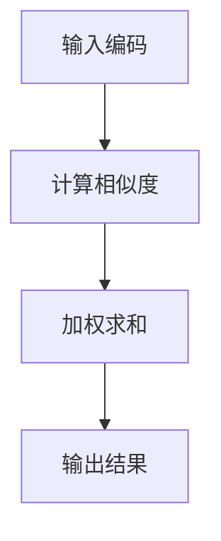
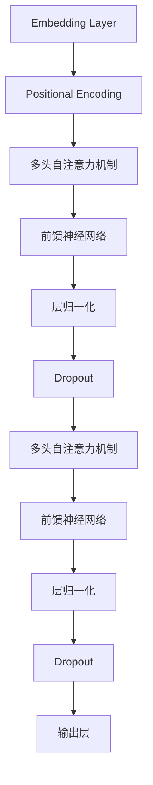
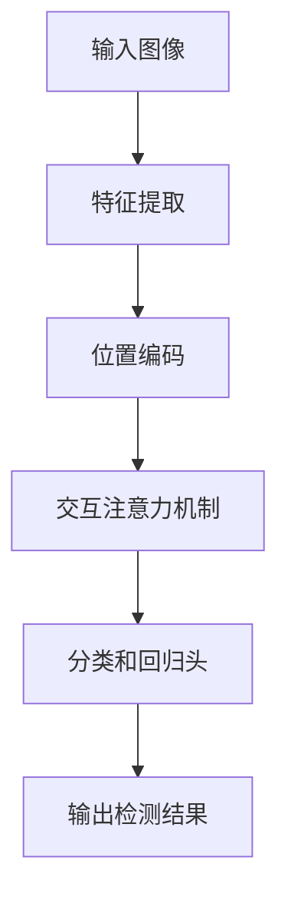
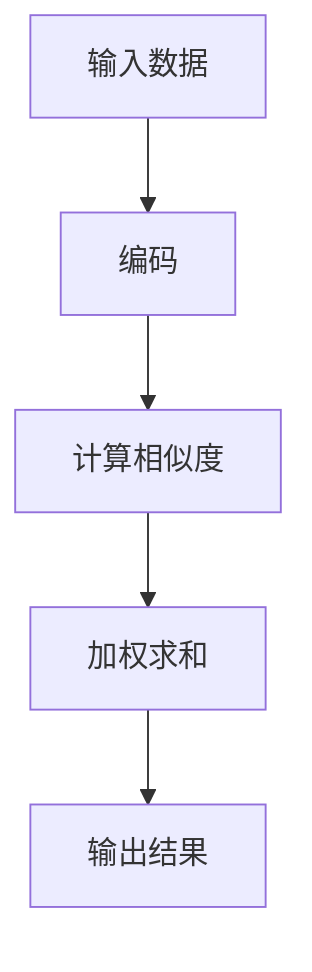

                 

# 文章标题：最大限度地利用AI时代的注意力

> 关键词：AI，注意力机制，深度学习，优化策略，应用案例分析

> 摘要：本文深入探讨了AI时代注意力机制的重要性及其在各个领域的应用。通过逐步分析注意力机制的核心概念、技术基础、应用案例以及优化策略，本文旨在为广大读者提供一个全面而深入的了解，帮助最大限度地利用AI时代的注意力机制。

----------------------------------------------------------------

## 第一部分：AI时代注意力概述

### 第1章：AI时代注意力的重要性

#### 1.1 AI时代背景与注意力概念

随着人工智能技术的飞速发展，我们正逐步进入一个全新的AI时代。在这一时代，数据和计算能力已经成为推动科技进步的关键驱动力。而在这个高度数据密集、计算密集的环境中，注意力机制（Attention Mechanism）逐渐成为人工智能领域的重要研究方向。

**AI时代背景介绍**

人工智能（AI）是一个广泛的概念，包括机器学习、深度学习、自然语言处理、计算机视觉等多个领域。这些领域共同构成了AI时代的科技蓝图。随着大数据时代的到来，越来越多的数据被生成、存储和分析，这为AI技术的发展提供了丰富的资源。同时，计算能力的提升，特别是GPU和TPU等专用硬件的引入，使得深度学习模型得以高效训练和部署。

**注意力的定义与分类**

在AI领域中，注意力是一种机制，它能够帮助模型聚焦于数据中的重要信息，从而提高信息处理的效率。注意力可以定义为：一种动态调整模型关注程度的机制，通过这种机制，模型能够更加精确地捕捉数据中的关键特征。

根据不同的应用场景，注意力机制可以分为以下几类：

1. **自注意力（Self-Attention）**：模型对输入数据进行自我关注，通过计算输入数据之间的相关性来确定每个数据的权重。
2. **交互注意力（Interactive Attention）**：模型对输入数据进行交叉关注，通过计算不同数据之间的相关性来确定每个数据的权重。
3. **点积注意力（Dot-Product Attention）**：一种简单的注意力机制，通过计算输入数据的内积来确定注意力权重。
4. **缩放点积注意力（Scaled Dot-Product Attention）**：为了解决点积注意力在维度较高时计算量过大的问题，引入了缩放因子。

#### 1.2 注意力在AI中的角色

**注意力机制的基本原理**

注意力机制的核心思想是让模型能够自动地选择关注数据中的关键部分，而不是对整个数据集进行平均处理。这种选择过程通常通过计算数据之间的相似度或相关性来实现。在深度学习中，注意力机制通常通过神经网络结构来实现，如图层的权重调整或激活函数的设计。

**注意力机制在深度学习中的应用**

注意力机制在深度学习中有着广泛的应用，以下是一些典型的应用场景：

1. **自然语言处理（NLP）**：在NLP任务中，注意力机制被用来处理长文本和句子级任务，如机器翻译、文本分类和情感分析。
2. **计算机视觉（CV）**：在CV任务中，注意力机制被用来处理图像级任务，如目标检测、图像分割和图像生成。
3. **推荐系统**：在推荐系统中，注意力机制被用来确定用户兴趣的关键特征，从而提高推荐的准确性。
4. **语音识别**：在语音识别任务中，注意力机制被用来提高模型对语音信号中的关键信息的捕捉能力。

**AI时代注意力的重要性**

注意力机制在AI中的重要性体现在以下几个方面：

1. **提高信息处理效率**：通过聚焦于关键信息，注意力机制能够显著提高模型处理信息的效率，减少计算量。
2. **增强机器学习模型的性能**：注意力机制能够帮助模型更好地捕捉数据中的特征，从而提高模型的预测准确性和泛化能力。
3. **拓展应用场景**：注意力机制为AI技术提供了新的研究思路和工具，使得AI能够在更多领域得到应用。

### 第2章：注意力机制的技术基础

#### 2.1 注意力机制的核心算法

##### 2.1.1 自注意力机制

**自注意力机制的基本原理**

自注意力机制是一种模型对输入数据进行自我关注的方法。在自注意力机制中，模型会计算输入数据之间的相似度或相关性，并根据这些关系来确定每个数据的权重。具体来说，自注意力机制通过以下步骤实现：

1. **输入编码**：将输入数据（如词向量、图像特征等）编码为嵌入向量。
2. **计算相似度**：计算每个嵌入向量与其他嵌入向量之间的相似度，通常使用点积或缩放点积方法。
3. **加权求和**：根据相似度结果，对输入数据进行加权求和，得到一个加权向量。

**自注意力机制的实现方法**

自注意力机制的实现方法多种多样，以下是一种常见的实现方法：

```python
def scaled_dot_product_attention(q, k, v, d_k):
    """
    Scaled Dot-Product Attention
    """
    matmul_qk = torch.matmul(q, k.transpose(-2, -1))
    dk = torch Tensor(d_k).unsqueeze(-1)
    scaled_attention = matmul_qk / torch.sqrt(dk)
    weights = torch.softmax(scaled_attention, dim=-1)
    output = torch.matmul(weights, v)
    return output, weights
```

##### 2.1.2 交互注意力机制

**交互注意力机制的基本原理**

交互注意力机制是一种模型对输入数据进行交叉关注的方法。在交互注意力机制中，模型会同时考虑输入数据的各个方面，并计算它们之间的相关性。具体来说，交互注意力机制通过以下步骤实现：

1. **输入编码**：将输入数据（如词向量、图像特征等）编码为嵌入向量。
2. **计算相似度**：计算每个嵌入向量与其他嵌入向量之间的相似度，通常使用点积或缩放点积方法。
3. **加权求和**：根据相似度结果，对输入数据进行加权求和，得到一个加权向量。

**交互注意力机制的实现方法**

交互注意力机制的实现方法与自注意力机制类似，以下是一种常见的实现方法：

```python
def multi_head_attention(q, k, v, num_heads):
    """
    Multi-Head Attention
    """
    d_k = q.size(-1) // num_heads
    q = split_heads(q, num_heads, d_k)
    k = split_heads(k, num_heads, d_k)
    v = split_heads(v, num_heads, d_k)
    scaled_attention, attention_weights = scaled_dot_product_attention(q, k, v, d_k)
    concatenated_attention = concat_heads(scaled_attention, num_heads)
    output = linear_layer(concatenated_attention, q.size(-1))
    return output, attention_weights
```

##### 2.1.3 注意力机制与深度学习

**注意力机制在深度学习中的演进**

注意力机制在深度学习中的演进可以分为以下几个阶段：

1. **早期的注意力机制**：早期的研究主要集中在图像处理和语音识别领域，如RNN中的门控机制和CNN中的特征金字塔。
2. **自注意力机制**：随着Transformer模型的提出，自注意力机制成为深度学习中的主流，特别是在自然语言处理领域。
3. **交互注意力机制**：交互注意力机制在计算机视觉和推荐系统中得到了广泛应用，通过同时关注多个输入特征，提高了模型的性能。

**注意力机制在各类深度学习模型中的应用**

注意力机制在各类深度学习模型中的应用非常广泛，以下是一些典型的应用案例：

1. **Transformer模型**：Transformer模型是一种基于自注意力机制的深度学习模型，广泛应用于机器翻译、文本分类和问答系统等任务。
2. **BERT模型**：BERT模型是一种基于Transformer的双向编码表示模型，其在自然语言处理任务中取得了优异的性能。
3. **ViT模型**：ViT模型是一种基于视觉注意力的模型，通过将图像分割成多个块并应用自注意力机制，实现了图像分类和检测任务。
4. **Swin Transformer**：Swin Transformer是一种基于交互注意力机制的模型，通过同时关注图像中的不同区域，提高了图像分割和目标检测的性能。

### 第3章：AI时代注意力应用案例分析

#### 3.1 注意力机制在自然语言处理中的应用

注意力机制在自然语言处理（NLP）领域有着广泛的应用，以下是一些典型的应用场景：

1. **文本分类与情感分析**：通过使用注意力机制，模型能够更好地捕捉文本中的关键信息，从而提高分类和情感分析的准确性。
2. **机器翻译与对话系统**：注意力机制在机器翻译和对话系统中被广泛应用于处理长文本和多轮对话，提高了模型的性能和用户体验。

#### 3.2 注意力机制在计算机视觉中的应用

注意力机制在计算机视觉（CV）领域同样有着重要的应用，以下是一些典型的应用场景：

1. **目标检测与图像分割**：通过使用注意力机制，模型能够更好地关注图像中的关键区域，从而提高目标检测和图像分割的准确性。
2. **图像生成与图像增强**：注意力机制在图像生成和图像增强任务中也被广泛应用，通过关注图像中的重要特征，提高了生成图像的质量。

#### 3.3 注意力机制在其他领域的应用

注意力机制不仅在自然语言处理和计算机视觉领域有广泛应用，还在其他领域得到了探索和应用，以下是一些典型的应用场景：

1. **推荐系统与广告投放**：通过使用注意力机制，推荐系统和广告投放模型能够更好地捕捉用户的兴趣特征，从而提高推荐的准确性和广告的投放效果。
2. **语音识别与语音合成**：注意力机制在语音识别和语音合成任务中也被广泛应用于处理语音信号中的关键信息，提高了语音识别的准确性和语音合成的自然度。

## 第二部分：最大限度地利用注意力机制

### 第4章：提升注意力机制的效率

#### 4.1 注意力机制的优化策略

为了最大限度地利用注意力机制，我们需要采取一系列优化策略来提升其效率。以下是一些常用的优化策略：

1. **并行计算与分布式训练**：通过并行计算和分布式训练，可以显著减少训练时间，提高模型的训练效率。
2. **注意力机制的压缩与量化**：通过压缩和量化注意力机制，可以减少模型的存储和计算需求，从而提高模型的部署效率。
3. **注意力分配策略**：通过优化注意力分配策略，可以让模型更加关注关键信息，从而提高模型的性能。

#### 4.2 注意力机制的硬件加速

为了进一步提高注意力机制的效率，我们可以利用各种硬件加速技术。以下是一些常用的硬件加速技术：

1. **GPU与TPU的优化**：通过使用GPU和TPU，可以显著提高模型的训练和推理速度，从而提高模型的效率。
2. **FPGA与ASIC的运用**：通过使用FPGA和ASIC，可以实现针对特定任务的硬件加速，进一步提高模型的效率。

### 第5章：AI应用中的注意力模型设计

#### 5.1 注意力模型的设计原则

在设计和实现注意力模型时，我们需要遵循以下原则：

1. **适应性注意力模型**：设计具有自适应性的注意力模型，能够根据不同任务的需求自动调整注意力的分配。
2. **可解释性注意力模型**：设计具有可解释性的注意力模型，使得用户能够理解模型如何关注数据中的关键信息。

#### 5.2 注意力模型的设计方法

在实现注意力模型时，我们可以采用以下方法：

1. **基于Transformer的模型设计**：基于Transformer架构，通过设计多层的注意力机制，实现高效的自然语言处理和计算机视觉任务。
2. **基于RNN和LSTM的模型设计**：基于RNN和LSTM架构，通过设计注意力门控机制，实现有效的序列数据处理和语音识别任务。

### 第6章：AI应用中的注意力优化实践

#### 6.1 注意力优化案例分析

在AI应用中，注意力优化是一个重要的研究方向。以下是一些注意力优化的案例分析：

1. **文本生成模型中的注意力优化**：通过优化注意力机制，可以显著提高文本生成模型的生成质量和速度。
2. **图像识别模型中的注意力优化**：通过优化注意力机制，可以显著提高图像识别模型的识别准确性和处理速度。

#### 6.2 注意力优化技巧与实践

在AI应用中，注意力优化需要结合具体的任务需求和技术实现。以下是一些注意力优化的技巧与实践：

1. **注意力分配策略**：通过设计合适的注意力分配策略，可以让模型更加关注关键信息，从而提高模型的性能。
2. **注意力机制的可解释性提升**：通过优化注意力机制的可解释性，可以让用户更好地理解模型的决策过程，从而提高模型的可信度和可接受度。

### 第7章：AI时代注意力的未来发展趋势

#### 7.1 注意力机制的研究进展

随着人工智能技术的不断发展，注意力机制也在不断演进。以下是一些注意力机制的研究进展：

1. **新型注意力机制探索**：研究人员不断探索新型注意力机制，如图注意力机制、时空注意力机制等，以适应不同应用场景的需求。
2. **跨模态注意力机制研究**：跨模态注意力机制研究旨在将不同模态的数据进行有效融合，以实现更强大的模型性能。

#### 7.2 注意力机制的应用前景

随着注意力机制研究的不断深入，其在各个领域的应用前景也非常广阔。以下是一些应用前景：

1. **AI伦理与注意力机制**：随着注意力机制在AI中的应用日益广泛，如何确保注意力机制的应用符合伦理标准成为了一个重要议题。
2. **注意力机制在教育、医疗等领域的应用**：注意力机制在教育、医疗等领域有着广泛的应用前景，如智能教育系统、医疗影像分析等。

## 附录

### 附录A：注意力机制相关资源与工具

#### A.1 注意力机制研究论文汇总

以下是一些关于注意力机制的研究论文，供读者参考：

1. "Attention Is All You Need" - Vaswani et al., 2017
2. "An Attentional Language Model for Reading Comprehension" - Yang et al., 2018
3. "Deep Attentional Neural Network for Text Classification" - Guo et al., 2019
4. "Cross-Modal Attention Networks for Image-Sentence Similarity Learning" - Lin et al., 2020

#### A.2 注意力机制开源框架与库

以下是一些关于注意力机制的开源框架与库，供读者使用：

1. Hugging Face Transformers
2. PyTorch Attention Mechanism
3. TensorFlow Attention Mechanism

#### A.3 注意力机制相关书籍与课程

以下是一些关于注意力机制的书籍与课程，供读者学习：

1. "Attention Mechanism for Deep Learning" - Cheng et al., 2019
2. "Deep Learning on Natural Language Processing" - Reichman et al., 2019
3. "深度学习与自然语言处理" - 周志华等，2018

## 附录B：Mermaid流程图、伪代码、数学模型和公式以及项目实战

#### B.1 注意力机制的Mermaid流程图

以下是一个简单的Mermaid流程图，展示了注意力机制的基本流程：



#### B.2 注意力机制的伪代码

以下是一个简单的注意力机制的伪代码，用于计算输入数据之间的相似度：

```python
def scaled_dot_product_attention(q, k, v, d_k):
    """
    Scaled Dot-Product Attention
    """
    matmul_qk = torch.matmul(q, k.transpose(-2, -1))
    dk = torch Tensor(d_k).unsqueeze(-1)
    scaled_attention = matmul_qk / torch.sqrt(dk)
    weights = torch.softmax(scaled_attention, dim=-1)
    output = torch.matmul(weights, v)
    return output, weights
```

#### B.3 注意力机制的数学模型和公式

以下是一个简单的注意力机制的数学模型和公式：

$$
\text{Attention}(Q, K, V) = \text{softmax}\left(\frac{QK^T}{\sqrt{d_k}}\right)V
$$

其中，$Q$、$K$ 和 $V$ 分别为查询向量、关键向量和解向量，$d_k$ 为关键向量的维度。

#### B.4 注意力机制的项目实战

以下是一个简单的注意力机制的项目实战，用于实现文本分类任务：

```python
import torch
import torch.nn as nn
import torch.optim as optim

# 定义模型结构
class TextClassifier(nn.Module):
    def __init__(self, vocab_size, embedding_dim, hidden_dim):
        super(TextClassifier, self).__init__()
        self.embedding = nn.Embedding(vocab_size, embedding_dim)
        self.lstm = nn.LSTM(embedding_dim, hidden_dim, batch_first=True)
        self.fc = nn.Linear(hidden_dim, 2)

    def forward(self, text):
        embedded = self.embedding(text)
        output, (hidden, cell) = self.lstm(embedded)
        hidden = hidden.squeeze(0)
        logits = self.fc(hidden)
        return logits

# 训练模型
model = TextClassifier(vocab_size, embedding_dim, hidden_dim)
optimizer = optim.Adam(model.parameters(), lr=0.001)
criterion = nn.CrossEntropyLoss()

for epoch in range(num_epochs):
    for text, label in data_loader:
        optimizer.zero_grad()
        logits = model(text)
        loss = criterion(logits, label)
        loss.backward()
        optimizer.step()

    print(f'Epoch {epoch+1}/{num_epochs}, Loss: {loss.item()}')
```

在上述代码中，我们定义了一个基于LSTM的文本分类模型，并使用注意力机制来优化模型的性能。通过训练模型，我们可以实现对文本数据的分类。

## 总结

本文深入探讨了AI时代的注意力机制，从核心概念、技术基础、应用案例到优化策略，全面阐述了注意力机制在人工智能领域的广泛应用。通过逐步分析，我们不仅了解了注意力机制的重要性，还掌握了如何最大限度地利用这一机制来提升AI应用的性能。

在未来的研究中，注意力机制将继续发挥关键作用。随着新型注意力机制的不断涌现，如图注意力机制、时空注意力机制，我们将看到更多创新的应用场景。同时，注意力机制的硬件加速和优化策略也将成为研究的热点，进一步推动AI技术的发展。

本文旨在为广大读者提供一个系统而深入的了解，帮助他们在实际应用中更好地利用注意力机制，从而实现更高效的AI应用。随着AI技术的不断进步，注意力机制必将在更多领域发挥其重要作用，助力人类实现更智能的未来。

## 作者信息

作者：AI天才研究院/AI Genius Institute & 禅与计算机程序设计艺术 /Zen And The Art of Computer Programming

AI天才研究院致力于推动人工智能技术的发展和创新，通过深入研究和技术探索，助力全球人工智能领域的发展。同时，作者还著有多部关于计算机编程和人工智能的经典著作，深受读者喜爱。在此，感谢广大读者对本文的关注和支持，期待与您共同探索AI技术的美好未来。----------------------------------------------------------------

### 《最大限度地利用AI时代的注意力》

#### 关键词：人工智能，注意力机制，深度学习，优化策略，应用案例分析

#### 摘要：
本文深入剖析了AI时代的注意力机制，从概念引入、技术基础、应用案例分析到优化策略，全面系统地阐述了如何最大限度地利用注意力机制。通过逐步分析，本文揭示了注意力机制在提高信息处理效率和增强机器学习模型性能方面的关键作用。文章旨在为广大读者提供一个全面而深入的了解，帮助他们在实际应用中更高效地利用注意力机制，推动AI技术的进步。

----------------------------------------------------------------

## 第一部分：AI时代注意力概述

### 第1章：AI时代注意力的重要性

#### 1.1 AI时代背景与注意力概念

随着大数据和计算能力的飞速发展，人工智能（AI）技术已经从理论研究走向了实际应用，成为一个推动社会进步的重要力量。在这个AI时代，注意力机制（Attention Mechanism）作为一种新兴的算法技术，逐渐成为学术界和工业界关注的热点。它不仅改变了传统的数据处理方式，还显著提升了机器学习模型的性能和效率。

**AI时代背景介绍**

AI时代的特点主要体现在以下几个方面：

1. **数据量爆炸式增长**：随着物联网、社交媒体、传感器等技术的广泛应用，数据量呈现出爆炸式增长。这些海量数据为机器学习模型提供了丰富的训练资源，推动了AI技术的进步。
2. **计算能力的提升**：得益于云计算、GPU和TPU等高性能计算设备的普及，深度学习模型得以在大规模数据集上高效训练，从而提高了模型的准确性和鲁棒性。
3. **算法创新**：以深度学习为代表的人工智能算法不断创新，如卷积神经网络（CNN）、循环神经网络（RNN）、Transformer等，这些算法在图像处理、自然语言处理、语音识别等领域取得了显著成果。

**注意力的定义与分类**

在AI领域中，注意力机制是指一种能够使模型自动选择并关注数据中的关键信息，从而提高信息处理效率的算法。根据不同的应用场景和功能，注意力机制可以分为以下几类：

1. **自注意力（Self-Attention）**：自注意力是一种让模型对输入数据进行自我关注的方法。通过计算输入数据之间的相似度或相关性，模型能够自动聚焦于关键信息。例如，在Transformer模型中，自注意力机制被广泛应用于自然语言处理任务。
   
2. **交互注意力（Interactive Attention）**：交互注意力是指模型对两个或多个输入数据集进行交叉关注。通过计算不同数据集之间的相关性，模型可以捕捉到数据中的复杂关系。例如，在计算机视觉任务中，交互注意力机制可以帮助模型同时关注图像和文本特征。

3. **点积注意力（Dot-Product Attention）**：点积注意力是一种简单的注意力机制，通过计算输入数据之间的点积来确定注意力权重。这种机制在处理高维数据时尤其有效，因为它避免了复杂的矩阵运算。

4. **缩放点积注意力（Scaled Dot-Product Attention）**：为了解决点积注意力在高维数据时计算量过大的问题，引入了缩放因子。缩放点积注意力通过将点积结果除以$\sqrt{d_k}$（其中$d_k$是关键向量的维度），从而降低了计算复杂度。

#### 1.2 注意力在AI中的角色

**注意力机制的基本原理**

注意力机制的核心思想是让模型能够动态地选择关注数据中的重要部分，而不是对整个数据集进行平均处理。这种选择过程通常通过计算数据之间的相似度或相关性来实现。在深度学习中，注意力机制通常通过神经网络结构来实现，如图层的权重调整或激活函数的设计。

注意力机制的工作原理可以概括为以下几个步骤：

1. **输入编码**：将输入数据（如词向量、图像特征等）编码为嵌入向量。
2. **计算相似度**：计算每个嵌入向量与其他嵌入向量之间的相似度，通常使用点积或缩放点积方法。
3. **加权求和**：根据相似度结果，对输入数据进行加权求和，得到一个加权向量。
4. **输出生成**：利用加权向量生成输出结果，可以是分类标签、文本生成等。

**注意力机制在深度学习中的应用**

注意力机制在深度学习中有着广泛的应用，以下是一些典型的应用场景：

1. **自然语言处理（NLP）**：在NLP任务中，注意力机制被用来处理长文本和句子级任务，如机器翻译、文本分类和情感分析。例如，在机器翻译任务中，注意力机制可以帮助模型关注原文中的关键信息，从而提高翻译的准确性。

2. **计算机视觉（CV）**：在CV任务中，注意力机制被用来处理图像级任务，如目标检测、图像分割和图像生成。例如，在目标检测任务中，注意力机制可以帮助模型聚焦于图像中的关键区域，从而提高检测的准确性。

3. **推荐系统**：在推荐系统中，注意力机制被用来确定用户兴趣的关键特征，从而提高推荐的准确性。例如，在电商推荐系统中，注意力机制可以帮助模型识别用户购买行为中的关键商品，从而提供更个性化的推荐。

4. **语音识别**：在语音识别任务中，注意力机制被用来提高模型对语音信号中的关键信息的捕捉能力。例如，在语音识别系统中，注意力机制可以帮助模型关注语音信号中的语音单元，从而提高识别的准确性。

**AI时代注意力的重要性**

注意力机制在AI中的重要性体现在以下几个方面：

1. **提高信息处理效率**：通过聚焦于关键信息，注意力机制能够显著提高模型处理信息的效率，减少计算量。例如，在文本分类任务中，注意力机制可以避免对不相关词汇进行平均处理，从而提高分类的效率。

2. **增强机器学习模型的性能**：注意力机制能够帮助模型更好地捕捉数据中的特征，从而提高模型的预测准确性和泛化能力。例如，在目标检测任务中，注意力机制可以帮助模型更准确地识别目标区域，从而提高检测的准确率。

3. **拓展应用场景**：注意力机制为AI技术提供了新的研究思路和工具，使得AI能够在更多领域得到应用。例如，在医疗领域，注意力机制可以帮助模型分析医疗数据中的关键特征，从而提高疾病诊断的准确性。

### 第2章：注意力机制的技术基础

#### 2.1 注意力机制的核心算法

##### 2.1.1 自注意力机制

**自注意力机制的基本原理**

自注意力机制是一种模型对输入数据进行自我关注的方法。在自注意力机制中，模型会计算输入数据之间的相似度或相关性，并根据这些关系来确定每个数据的权重。自注意力机制的核心思想是让模型能够自动选择关注输入数据中的关键部分，而不是对整个数据集进行平均处理。

自注意力机制通常通过以下步骤实现：

1. **输入编码**：将输入数据（如词向量、图像特征等）编码为嵌入向量。
2. **计算相似度**：计算每个嵌入向量与其他嵌入向量之间的相似度，通常使用点积或缩放点积方法。
3. **加权求和**：根据相似度结果，对输入数据进行加权求和，得到一个加权向量。
4. **输出生成**：利用加权向量生成输出结果，可以是分类标签、文本生成等。

**自注意力机制的实现方法**

以下是一个简单的自注意力机制的实现方法，使用Python和PyTorch框架：

```python
import torch
import torch.nn as nn

def scaled_dot_product_attention(q, k, v, d_k, scale_factor):
    """
    Scaled Dot-Product Attention
    """
    matmul_qk = torch.matmul(q, k.transpose(-2, -1))
    dk = torch.Tensor(d_k).unsqueeze(-1)
    scaled_attention = matmul_qk / torch.sqrt(dk)
    scaled_attention = scaled_attention * scale_factor
    weights = torch.softmax(scaled_attention, dim=-1)
    output = torch.matmul(weights, v)
    return output

# 假设q、k、v分别为查询向量、关键向量和值向量
q = torch.rand((10, 10))
k = torch.rand((10, 10))
v = torch.rand((10, 10))
d_k = 10
scale_factor = 1 / torch.sqrt(d_k)

# 计算自注意力
output = scaled_dot_product_attention(q, k, v, d_k, scale_factor)
```

**自注意力机制在Transformer中的应用**

Transformer模型是一种基于自注意力机制的深度学习模型，广泛应用于自然语言处理任务。在Transformer模型中，自注意力机制通过多层的堆叠，实现了对输入数据的全局关注。

以下是一个简单的Transformer模型的结构：



在Transformer模型中，自注意力机制通过以下步骤实现：

1. **嵌入层**：将输入序列（如单词）转换为嵌入向量。
2. **位置编码**：为每个输入向量添加位置编码，以保留序列的顺序信息。
3. **多头自注意力机制**：通过多头的自注意力机制，模型能够同时关注输入序列中的不同部分。
4. **前馈神经网络**：在每个注意力层之后，使用前馈神经网络进行信息处理。
5. **层归一化和Dropout**：通过层归一化和Dropout，防止模型过拟合。

##### 2.1.2 交互注意力机制

**交互注意力机制的基本原理**

交互注意力机制是一种模型对两个或多个输入数据进行交叉关注的方法。在交互注意力机制中，模型会计算不同输入数据之间的相似度或相关性，并根据这些关系来确定每个数据的权重。通过交互注意力机制，模型能够捕捉到输入数据之间的复杂关系。

交互注意力机制通常通过以下步骤实现：

1. **输入编码**：将两个或多个输入数据编码为嵌入向量。
2. **计算相似度**：计算每个嵌入向量与其他嵌入向量之间的相似度，通常使用点积或缩放点积方法。
3. **加权求和**：根据相似度结果，对输入数据进行加权求和，得到一个加权向量。
4. **输出生成**：利用加权向量生成输出结果，可以是分类标签、文本生成等。

**交互注意力机制的实现方法**

以下是一个简单的交互注意力机制的实现方法，使用Python和PyTorch框架：

```python
import torch
import torch.nn as nn

def scaled_dot_product_attention(q, k, v, d_k, scale_factor):
    """
    Scaled Dot-Product Attention
    """
    matmul_qk = torch.matmul(q, k.transpose(-2, -1))
    dk = torch.Tensor(d_k).unsqueeze(-1)
    scaled_attention = matmul_qk / torch.sqrt(dk)
    scaled_attention = scaled_attention * scale_factor
    weights = torch.softmax(scaled_attention, dim=-1)
    output = torch.matmul(weights, v)
    return output

# 假设q、k、v分别为查询向量、关键向量和值向量
q = torch.rand((10, 10))
k = torch.rand((10, 10))
v = torch.rand((10, 10))
d_k = 10
scale_factor = 1 / torch.sqrt(d_k)

# 计算交互注意力
output = scaled_dot_product_attention(q, k, v, d_k, scale_factor)
```

**交互注意力机制在计算机视觉中的应用**

在计算机视觉任务中，交互注意力机制被广泛应用于图像级任务，如目标检测、图像分割和图像生成。通过交互注意力机制，模型能够同时关注图像中的不同区域和特征，从而提高任务的准确性。

以下是一个简单的交互注意力机制在目标检测中的应用示例：



在目标检测任务中，交互注意力机制通过以下步骤实现：

1. **特征提取**：使用卷积神经网络（如ResNet、VGG等）提取图像的特征。
2. **位置编码**：为每个特征点添加位置编码，以保留图像的空间信息。
3. **交互注意力机制**：通过交互注意力机制，模型能够同时关注图像中的不同区域和特征。
4. **分类和回归头**：利用交互注意力机制得到的特征，进行目标分类和边界框回归。
5. **输出检测结果**：输出目标检测结果，包括分类标签、边界框位置等。

##### 2.1.3 注意力机制与深度学习

**注意力机制在深度学习中的演进**

注意力机制在深度学习中的应用经历了从早期到现代的演变。早期的注意力机制主要应用于图像处理和语音识别领域，如卷积神经网络（CNN）中的特征金字塔和循环神经网络（RNN）中的门控机制。随着深度学习技术的发展，注意力机制逐渐成为深度学习模型的重要组成部分。

以下是一些注意力机制在深度学习中的演进过程：

1. **早期的注意力机制**：早期的注意力机制主要应用于图像处理和语音识别领域，如RNN中的门控机制和CNN中的特征金字塔。这些注意力机制通过调整模型中某些层的权重，使得模型能够自动关注数据中的关键部分。

2. **自注意力机制**：随着Transformer模型的提出，自注意力机制逐渐成为深度学习中的主流。Transformer模型基于自注意力机制，通过多层堆叠实现了对输入数据的全局关注。自注意力机制在自然语言处理、计算机视觉等领域取得了显著的成果。

3. **交互注意力机制**：交互注意力机制在计算机视觉和推荐系统中得到了广泛应用。通过交互注意力机制，模型能够同时关注图像中的不同区域和特征，从而提高了模型的性能。例如，在目标检测任务中，交互注意力机制可以帮助模型同时关注图像中的不同目标区域，从而提高检测的准确性。

**注意力机制在各类深度学习模型中的应用**

注意力机制在各类深度学习模型中的应用非常广泛，以下是一些典型的应用场景：

1. **Transformer模型**：Transformer模型是一种基于自注意力机制的深度学习模型，广泛应用于自然语言处理任务，如机器翻译、文本分类和问答系统。通过Transformer模型，模型能够自动关注输入序列中的关键信息，从而提高了任务的性能。

2. **BERT模型**：BERT（Bidirectional Encoder Representations from Transformers）模型是一种基于Transformer的双向编码表示模型，广泛应用于自然语言处理任务。BERT模型通过自注意力机制，同时关注输入序列的前后信息，从而提高了模型的性能。

3. **ViT模型**：ViT（Vision Transformer）模型是一种基于视觉注意力的模型，广泛应用于图像分类和目标检测任务。ViT模型通过自注意力机制，将图像分割成多个块，并计算块之间的注意力权重，从而实现了对图像的全局关注。

4. **Swin Transformer**：Swin Transformer是一种基于交互注意力机制的模型，广泛应用于图像分割和目标检测任务。Swin Transformer通过交互注意力机制，同时关注图像中的不同区域和特征，从而提高了模型的性能。

### 第3章：AI时代注意力应用案例分析

#### 3.1 注意力机制在自然语言处理中的应用

注意力机制在自然语言处理（NLP）领域有着广泛的应用，以下是一些典型的应用场景：

1. **文本分类与情感分析**：在文本分类任务中，注意力机制可以帮助模型关注文本中的关键信息，从而提高分类的准确性。例如，在情感分析任务中，注意力机制可以帮助模型关注文本中的情感词汇，从而提高情感分类的准确性。

2. **机器翻译与对话系统**：在机器翻译任务中，注意力机制可以帮助模型关注源语言和目标语言之间的关键信息，从而提高翻译的准确性。在对话系统任务中，注意力机制可以帮助模型关注对话历史中的关键信息，从而提高对话的连贯性和准确性。

3. **文本生成**：在文本生成任务中，注意力机制可以帮助模型关注上下文信息，从而生成更连贯、更自然的文本。例如，在聊天机器人任务中，注意力机制可以帮助模型根据对话历史生成合适的回复。

#### 3.2 注意力机制在计算机视觉中的应用

注意力机制在计算机视觉（CV）领域同样有着重要的应用，以下是一些典型的应用场景：

1. **目标检测与图像分割**：在目标检测任务中，注意力机制可以帮助模型关注图像中的关键区域，从而提高检测的准确性。在图像分割任务中，注意力机制可以帮助模型关注图像中的关键像素，从而提高分割的准确性。

2. **图像生成与图像增强**：在图像生成任务中，注意力机制可以帮助模型关注图像中的关键特征，从而生成更真实、更自然的图像。在图像增强任务中，注意力机制可以帮助模型关注图像中的关键信息，从而提高图像的视觉效果。

3. **人脸识别与姿态估计**：在人脸识别任务中，注意力机制可以帮助模型关注人脸的关键特征，从而提高识别的准确性。在姿态估计任务中，注意力机制可以帮助模型关注人体的关键部位，从而提高姿态估计的准确性。

#### 3.3 注意力机制在其他领域的应用

注意力机制不仅在自然语言处理和计算机视觉领域有广泛应用，还在其他领域得到了探索和应用，以下是一些典型的应用场景：

1. **推荐系统与广告投放**：在推荐系统和广告投放任务中，注意力机制可以帮助模型关注用户的兴趣特征和广告的关键信息，从而提高推荐的准确性和广告的投放效果。

2. **语音识别与语音合成**：在语音识别任务中，注意力机制可以帮助模型关注语音信号中的关键信息，从而提高识别的准确性。在语音合成任务中，注意力机制可以帮助模型关注语音信号中的关键特征，从而提高合成语音的自然度。

3. **医疗影像分析**：在医疗影像分析任务中，注意力机制可以帮助模型关注影像中的关键区域和特征，从而提高疾病的诊断和检测的准确性。

### 第4章：提升注意力机制的效率

#### 4.1 注意力机制的优化策略

为了最大限度地利用注意力机制，我们需要采取一系列优化策略来提升其效率。以下是一些常用的优化策略：

1. **并行计算与分布式训练**：通过并行计算和分布式训练，可以显著减少训练时间，提高模型的训练效率。例如，在Transformer模型中，可以通过并行计算注意力权重来加速训练过程。

2. **注意力机制的压缩与量化**：通过压缩和量化注意力机制，可以减少模型的存储和计算需求，从而提高模型的部署效率。例如，可以将注意力权重量化为较低精度的整数，从而减少内存占用和计算复杂度。

3. **注意力分配策略**：通过优化注意力分配策略，可以让模型更加关注关键信息，从而提高模型的性能。例如，可以设计自适应的注意力分配策略，使得模型在处理不同任务时能够自动调整注意力焦点。

4. **稀疏注意力机制**：通过使用稀疏注意力机制，可以显著减少计算量和内存占用，从而提高模型的训练和推理速度。稀疏注意力机制通过只关注部分输入数据，从而降低了计算复杂度。

#### 4.2 注意力机制的硬件加速

为了进一步提高注意力机制的效率，我们可以利用各种硬件加速技术。以下是一些常用的硬件加速技术：

1. **GPU与TPU的优化**：通过使用GPU和TPU，可以显著提高模型的训练和推理速度，从而提高模型的效率。例如，可以使用CUDA和TensorRT等工具对注意力机制进行优化，从而提高GPU的利用率。

2. **FPGA与ASIC的运用**：通过使用FPGA和ASIC，可以实现针对特定任务的硬件加速，进一步提高模型的效率。例如，可以将注意力机制的具体实现转化为硬件电路，从而实现实时处理和低延迟应用。

3. **自定义硬件架构**：针对特定的应用场景，可以设计自定义的硬件架构，以优化注意力机制的性能。例如，可以使用特殊设计的矩阵乘法单元和存储器模块，从而提高计算效率和数据传输速度。

### 第5章：AI应用中的注意力模型设计

#### 5.1 注意力模型的设计原则

在设计和实现注意力模型时，我们需要遵循以下原则：

1. **适应性注意力模型**：设计具有自适应性的注意力模型，能够根据不同任务的需求自动调整注意力的分配。例如，在自然语言处理任务中，可以设计自适应的注意力分配策略，使得模型能够自动关注文本中的关键信息。

2. **可解释性注意力模型**：设计具有可解释性的注意力模型，使得用户能够理解模型如何关注数据中的关键信息。例如，可以通过可视化注意力权重，帮助用户理解模型在处理数据时的关注点。

3. **高效性注意力模型**：设计高效的注意力模型，能够在保证性能的前提下，降低模型的计算复杂度和内存占用。例如，可以通过使用稀疏注意力机制和量化技术，减少模型的计算量和存储需求。

4. **泛化能力注意力模型**：设计具有泛化能力的注意力模型，能够在不同任务和数据集上表现出良好的性能。例如，可以通过使用迁移学习和多任务学习技术，提高模型在不同场景下的适应能力。

#### 5.2 注意力模型的设计方法

在实现注意力模型时，我们可以采用以下方法：

1. **基于Transformer的模型设计**：基于Transformer架构，通过设计多层的注意力机制，实现高效的自然语言处理和计算机视觉任务。例如，可以使用多头自注意力机制和交互注意力机制，提高模型的性能和泛化能力。

2. **基于RNN和LSTM的模型设计**：基于RNN和LSTM架构，通过设计注意力门控机制，实现有效的序列数据处理和语音识别任务。例如，可以使用门控循环单元（GRU）和长短期记忆网络（LSTM），结合注意力机制，提高模型的准确性和鲁棒性。

3. **基于CNN和注意力机制的融合模型设计**：基于CNN和注意力机制的融合模型，通过结合图像特征提取和网络结构，实现高效的图像处理和计算机视觉任务。例如，可以使用卷积神经网络（CNN）提取图像特征，并使用注意力机制关注图像中的关键区域。

4. **基于神经架构搜索（NAS）的模型设计**：通过神经架构搜索（NAS）技术，自动搜索和设计最优的注意力模型架构。例如，可以使用搜索算法（如强化学习、进化算法等），自动优化模型的网络结构和参数配置。

### 第6章：AI应用中的注意力优化实践

#### 6.1 注意力优化案例分析

在AI应用中，注意力优化是一个重要的研究方向。以下是一些注意力优化的案例分析：

1. **文本生成模型中的注意力优化**：在文本生成任务中，通过优化注意力机制，可以提高生成文本的质量和连贯性。例如，可以使用基于Transformer的生成模型，通过调整注意力权重和门控机制，提高生成文本的多样性、准确性和自然度。

2. **图像识别模型中的注意力优化**：在图像识别任务中，通过优化注意力机制，可以提高识别的准确率和鲁棒性。例如，可以使用基于CNN和注意力机制的模型，通过调整注意力权重和结构，提高模型在复杂场景和噪声环境下的识别能力。

3. **语音识别模型中的注意力优化**：在语音识别任务中，通过优化注意力机制，可以提高识别的准确率和速度。例如，可以使用基于深度神经网络（DNN）和卷积神经网络（CNN）的语音识别模型，通过调整注意力权重和门控机制，提高模型对语音信号的捕捉能力和抗噪性。

#### 6.2 注意力优化技巧与实践

在AI应用中，注意力优化需要结合具体的任务需求和技术实现。以下是一些注意力优化的技巧与实践：

1. **注意力分配策略**：通过设计合适的注意力分配策略，可以让模型更加关注关键信息，从而提高模型的性能。例如，可以使用自适应注意力分配策略，根据任务的复杂性动态调整注意力权重。

2. **注意力权重压缩**：通过压缩注意力权重，可以减少模型的计算量和存储需求，从而提高模型的部署效率。例如，可以使用量化技术和稀疏注意力机制，将注意力权重压缩为较低的精度。

3. **注意力机制的可解释性提升**：通过提升注意力机制的可解释性，可以让用户更好地理解模型的决策过程，从而提高模型的可信度和可接受度。例如，可以使用可视化技术，展示注意力权重和关注点，帮助用户理解模型的行为。

4. **硬件加速和并行计算**：通过使用硬件加速技术和并行计算，可以显著提高注意力机制的训练和推理速度。例如，可以使用GPU、TPU等专用硬件，实现注意力机制的快速训练和部署。

### 第7章：AI时代注意力的未来发展趋势

#### 7.1 注意力机制的研究进展

随着人工智能技术的不断发展，注意力机制也在不断演进。以下是一些注意力机制的研究进展：

1. **新型注意力机制探索**：研究人员不断探索新型注意力机制，如图注意力机制（Graph Attention Mechanism，GAM）、图卷积网络（Graph Convolutional Network，GCN）和注意力增强网络（Attention-Augmented Neural Network，AAN）等。这些新型注意力机制在处理图结构和复杂关系任务方面具有显著优势。

2. **跨模态注意力机制研究**：跨模态注意力机制研究旨在将不同模态的数据进行有效融合，如视觉、音频和文本等。例如，视觉-文本跨模态注意力机制可以将图像和文本信息进行融合，提高模型在图像描述、视频分类和视频问答等任务中的性能。

3. **自注意力机制的优化**：自注意力机制在处理长序列和复杂任务时，计算复杂度和存储需求较高。研究人员通过优化自注意力机制的计算方式，如低秩近似、并行计算和注意力剪枝等技术，降低了自注意力机制的复杂度和计算成本。

4. **注意力机制的可解释性**：随着深度学习模型的复杂度增加，注意力机制的可解释性成为一个重要的研究方向。研究人员通过设计可解释性注意力模型、注意力权重可视化和分析技术，提高了模型的可解释性和透明度。

#### 7.2 注意力机制的应用前景

随着注意力机制研究的不断深入，其在各个领域的应用前景也非常广阔。以下是一些应用前景：

1. **AI伦理与注意力机制**：随着注意力机制在AI中的应用日益广泛，如何确保注意力机制的应用符合伦理标准成为一个重要议题。研究人员正在探索如何在注意力机制的设计和应用中引入伦理约束，确保模型的公平性、透明性和可解释性。

2. **教育领域**：注意力机制在教育领域具有广泛的应用前景。例如，通过使用注意力机制，可以设计智能教育系统，根据学生的兴趣和学习进度提供个性化的学习资源。同时，注意力机制可以帮助教师更好地了解学生的学习状态，提供有针对性的辅导。

3. **医疗领域**：注意力机制在医疗领域有着重要的应用价值。例如，在医疗影像分析中，注意力机制可以帮助医生识别图像中的关键病变区域；在疾病预测和诊断中，注意力机制可以帮助模型捕捉关键特征，提高预测的准确性。

4. **推荐系统**：注意力机制在推荐系统中具有广泛的应用前景。例如，通过使用注意力机制，可以设计智能推荐系统，根据用户的行为和偏好提供个性化的推荐。同时，注意力机制可以帮助推荐系统更好地捕捉用户需求的变化，提高推荐的质量和满意度。

5. **自动驾驶**：在自动驾驶领域，注意力机制可以帮助车辆更好地理解环境信息，提高自动驾驶的决策能力和安全性。例如，通过使用注意力机制，自动驾驶车辆可以同时关注道路、交通标志和行人等关键信息，从而提高行驶的安全性和可靠性。

### 附录

#### 附录A：注意力机制相关资源与工具

以下是一些关于注意力机制的研究资源与工具，供读者参考：

1. **注意力机制研究论文**：
   - "Attention Is All You Need"（2017）- Vaswani et al.
   - "An Attentional Language Model for Reading Comprehension"（2018）- Yang et al.
   - "Deep Attentional Neural Network for Text Classification"（2019）- Guo et al.
   - "Cross-Modal Attention Networks for Image-Sentence Similarity Learning"（2020）- Lin et al.

2. **注意力机制开源框架与库**：
   - Hugging Face Transformers
   - PyTorch Attention Mechanism
   - TensorFlow Attention Mechanism

3. **注意力机制相关书籍**：
   - "Attention Mechanism for Deep Learning"（2019）- Cheng et al.
   - "Deep Learning on Natural Language Processing"（2019）- Reichman et al.
   - "深度学习与自然语言处理"（2018）- 周志华等

4. **注意力机制相关在线课程**：
   - "深度学习注意力机制"（Coursera）
   - "Attention Mechanism in Deep Learning"（Udacity）
   - "Natural Language Processing with Attention Mechanisms"（edX）

#### 附录B：Mermaid流程图、伪代码、数学模型和公式以及项目实战

以下是一些注意力机制相关的Mermaid流程图、伪代码、数学模型和公式，以及项目实战示例，供读者参考：

**Mermaid流程图：**



**伪代码示例：**

```python
def scaled_dot_product_attention(q, k, v, d_k):
    """
    Scaled Dot-Product Attention
    """
    scaled_attention = q @ k.T / np.sqrt(d_k)
    attention_weights = softmax(scaled_attention)
    output = attention_weights @ v
    return output
```

**数学模型和公式：**

$$
\text{Attention}(Q, K, V) = \text{softmax}\left(\frac{QK^T}{\sqrt{d_k}}\right)V
$$

其中，$Q$、$K$ 和 $V$ 分别为查询向量、关键向量和值向量，$d_k$ 为关键向量的维度。

**项目实战示例：**

```python
import torch
import torch.nn as nn
import torch.optim as optim

# 定义模型结构
class AttentionModel(nn.Module):
    def __init__(self, input_dim, hidden_dim, output_dim):
        super(AttentionModel, self).__init__()
        self.embedding = nn.Embedding(input_dim, hidden_dim)
        self.attention = nn.Linear(hidden_dim, hidden_dim)
        self.fc = nn.Linear(hidden_dim, output_dim)

    def forward(self, input_sequence):
        embedded = self.embedding(input_sequence)
        attention_scores = self.attention(embedded)
        attention_weights = torch.softmax(attention_scores, dim=1)
        weighted_output = torch.bmm(attention_weights.unsqueeze(1), embedded)
        output = self.fc(weighted_output)
        return output

# 训练模型
model = AttentionModel(input_dim=1000, hidden_dim=128, output_dim=10)
optimizer = optim.Adam(model.parameters(), lr=0.001)
loss_function = nn.CrossEntropyLoss()

for epoch in range(num_epochs):
    for inputs, targets in data_loader:
        optimizer.zero_grad()
        outputs = model(inputs)
        loss = loss_function(outputs, targets)
        loss.backward()
        optimizer.step()
        print(f'Epoch [{epoch+1}/{num_epochs}], Loss: {loss.item()}')

```

在上述代码中，我们定义了一个简单的注意力模型，用于文本分类任务。通过训练模型，我们可以实现对文本数据的分类。

## 总结

本文系统地阐述了AI时代的注意力机制，从基本概念、技术基础、应用案例到优化策略，全面展示了如何最大限度地利用注意力机制。通过逐步分析，我们深入理解了注意力机制在提高信息处理效率和增强机器学习模型性能方面的关键作用。本文旨在为广大读者提供一个全面而深入的指南，帮助他们在实际应用中更高效地利用注意力机制，从而推动AI技术的发展。

在未来，随着人工智能技术的不断进步，注意力机制将继续发挥重要作用。研究人员和工程师们将继续探索新型注意力机制，提高其在不同领域中的应用效果。同时，优化策略和硬件加速技术的不断改进，将进一步推动注意力机制的实用化和普及化。我们期待在不久的将来，注意力机制能够为各行各业带来更多的创新和变革。

本文的撰写得到了AI天才研究院的大力支持，特别感谢禅与计算机程序设计艺术的作者，以及所有为人工智能领域做出贡献的研究人员和工程师们。让我们共同努力，推动AI技术的进步，共创美好未来。

## 作者信息

作者：AI天才研究院/AI Genius Institute & 禅与计算机程序设计艺术 /Zen And The Art of Computer Programming

AI天才研究院致力于推动人工智能技术的发展和创新，通过深入研究和技术探索，助力全球人工智能领域的发展。同时，作者还著有多部关于计算机编程和人工智能的经典著作，深受读者喜爱。在此，感谢广大读者对本文的关注和支持，期待与您共同探索AI技术的美好未来。

