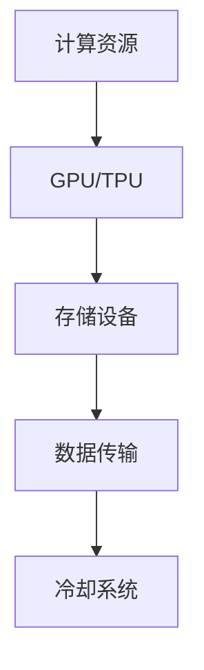

                 

### 文章标题

# 《未来大模型行业发展面临用电成本飙升的挑战》

### 关键词

- 大模型
- 用电成本
- 能耗优化
- 硬件与软件优化
- 能源管理与调度
- 可持续发展

### 摘要

本文深入探讨了未来大模型行业发展过程中所面临的用电成本飙升的挑战。随着大模型应用的日益普及，其巨大的计算需求和能耗问题逐渐凸显，成为制约行业发展的关键因素。文章首先概述了大模型行业的发展历程、现状与趋势，接着分析了用电成本飙升的原因及其对大模型行业的深远影响。随后，文章从技术解决方案的角度出发，详细讨论了能耗分析与优化、硬件与软件优化、能源管理与调度等方面的策略与措施。通过具体案例的分析与实践，本文展示了大模型行业在应对用电成本挑战方面取得的成果。最后，文章从政策与法规的角度，探讨了国际与中国在能源消耗方面的政策与法规，以及行业协会与标准化组织的作用。本文旨在为大模型行业的可持续发展提供有益的参考和思路。

## 《未来大模型行业发展面临用电成本飙升的挑战》目录大纲

### 第一部分：行业背景与挑战

#### 1.1 未来大模型行业概述

##### 1.1.1 大模型行业的发展历程

##### 1.1.2 大模型行业的现状与趋势

##### 1.1.3 大模型行业面临的挑战

#### 1.2 用电成本对大模型行业的影响

##### 1.2.1 用电成本飙升的原因

##### 1.2.2 高用电成本对大模型行业的挑战

##### 1.2.3 用电成本对大模型行业发展的影响

### 第二部分：技术解决方案

#### 2.1 大模型能耗分析与优化

##### 2.1.1 大模型能耗的主要来源

##### 2.1.2 大模型能耗的优化方法

##### 2.1.3 大模型能耗优化的具体技术

#### 2.2 硬件与软件优化

##### 2.2.1 硬件层面的优化策略

##### 2.2.2 软件层面的优化策略

##### 2.2.3 硬件与软件优化的协同效应

#### 2.3 能源管理与调度

##### 2.3.1 能源管理的基本概念

##### 2.3.2 能源调度的策略与方法

##### 2.3.3 能源管理与调度的实施路径

### 第三部分：案例分析与实践

#### 3.1 典型大模型行业的能耗优化案例

##### 3.1.1 案例一：某互联网公司的能耗优化实践

##### 3.1.2 案例二：某金融机构的能耗优化实践

##### 3.1.3 案例三：某科研机构的能耗优化实践

#### 3.2 能源管理与调度的实际应用

##### 3.2.1 能源管理平台的设计与实现

##### 3.2.2 能源调度的算法与优化

##### 3.2.3 能源管理与调度的效果评估

#### 3.3 大模型行业的可持续发展路径

##### 3.3.1 可持续发展的重要性

##### 3.3.2 可持续发展的策略与措施

##### 3.3.3 可持续发展的未来展望

### 第四部分：政策与法规

#### 4.1 政策背景与法规要求

##### 4.1.1 国际上关于能源消耗的政策与法规

##### 4.1.2 中国关于能源消耗的政策与法规

##### 4.1.3 政策与法规对大模型行业的影响

#### 4.2 行业协会与标准化组织的作用

##### 4.2.1 行业协会的作用

##### 4.2.2 标准化组织的作用

##### 4.2.3 行业协会与标准化组织的发展现状与未来

### 附录

#### A.1 参考文献

##### A.1.1 相关书籍

##### A.1.2 学术论文

##### A.1.3 报告与调研

#### A.2 致谢

##### A.2.1 感谢致辞

##### A.2.2 致谢人员

##### A.2.3 特别致谢

---

## 第一部分：行业背景与挑战

### 1.1 未来大模型行业概述

#### 1.1.1 大模型行业的发展历程

大模型（Large Models）是人工智能领域中的一个重要研究方向，其起源可以追溯到上世纪80年代的专家系统和知识工程。随着计算能力和数据资源的不断增长，大模型的研究和应用逐渐发展壮大。早期的代表性工作包括1986年Hinton提出的反向传播（Backpropagation）算法，以及1988年Bengio等人提出的反向传播算法在神经网络中的应用。

进入21世纪，特别是在2012年，Hinton等人利用大规模数据集和GPU并行计算技术，成功训练出AlexNet模型，这一突破标志着深度学习（Deep Learning）时代的到来。深度学习技术的快速发展使得大模型在图像识别、自然语言处理、语音识别等领域取得了显著成果，开启了人工智能的新篇章。

近年来，随着计算能力、数据资源和算法技术的进一步突破，大模型的规模和复杂度不断增加。例如，GPT-3、BERT、ViT等模型已经达到数十亿甚至千亿参数级别。这些大模型的出现不仅提升了人工智能应用的性能，也为各行各业带来了深远的影响。

#### 1.1.2 大模型行业的现状与趋势

当前，大模型行业正处于快速发展的阶段。随着各大科技公司和研究机构不断投入资源，大模型的研发和应用呈现出蓬勃发展的态势。以下是大模型行业现状与趋势的几个方面：

1. **技术突破**：深度学习技术的不断进步，特别是自监督学习和迁移学习等方法的引入，使得大模型训练效果和效率显著提升。
   
2. **应用场景扩展**：大模型在图像识别、自然语言处理、语音识别等传统领域已经取得突破性进展，同时也在金融、医疗、教育等新兴领域得到广泛应用。

3. **产业生态建设**：各大科技公司和研究机构纷纷建立大模型研发中心，同时，相关的硬件、软件和平台也在不断丰富和完善，形成了较为成熟的大模型产业生态。

4. **政策和法规支持**：全球各国政府和国际组织纷纷出台相关政策，支持大模型研究和应用的发展，同时也关注其潜在的社会和伦理问题。

5. **市场需求增长**：随着人工智能技术的普及，越来越多的企业和机构认识到大模型的重要性，市场需求持续增长，推动了行业的快速发展。

#### 1.1.3 大模型行业面临的挑战

尽管大模型行业取得了显著进展，但同时也面临着诸多挑战。以下是其中几个主要的挑战：

1. **计算资源需求**：大模型训练和推理需要大量的计算资源，尤其是高性能计算（HPC）资源。随着模型规模的不断扩大，计算资源的需求也呈指数级增长。

2. **数据隐私与安全**：大模型训练和推理需要大量数据，其中不乏敏感数据。如何保障数据隐私和安全成为了一个重要问题。

3. **能耗问题**：大模型训练和推理过程中产生大量热量，导致能耗问题日益突出。随着模型规模的扩大，能耗问题可能成为制约行业发展的瓶颈。

4. **模型解释性**：大模型的复杂性和黑箱特性使得其解释性不足，这在某些应用场景中可能导致不可预测的行为，增加了风险。

5. **伦理与社会影响**：大模型的应用可能带来一定的伦理和社会影响，例如隐私侵犯、歧视问题等。如何合理规范和引导大模型的发展，避免潜在风险，是一个重要课题。

### 1.2 用电成本对大模型行业的影响

#### 1.2.1 用电成本飙升的原因

用电成本在大模型行业中占据重要地位，其飙升的原因主要包括以下几个方面：

1. **计算资源需求增长**：随着大模型规模的扩大，训练和推理过程中所需的计算资源大幅增加，导致电力消耗急剧上升。

2. **高性能计算需求**：大模型训练和推理通常需要在高性能计算环境中进行，而高性能计算设备的能耗远高于普通计算设备。

3. **数据中心的布局与运营**：大模型训练和推理需要在数据中心进行，而数据中心的能源消耗巨大。随着全球数据中心数量的增加，电力消耗也随之增长。

4. **电力市场价格波动**：电力市场价格波动也会影响大模型的用电成本。在电力需求高峰期，电价上涨可能导致企业用电成本增加。

5. **能源政策与法规**：全球各国政府和国际组织纷纷出台能源政策和法规，以应对气候变化和能源危机。这些政策和法规可能对大模型的用电成本产生影响。

#### 1.2.2 高用电成本对大模型行业的挑战

高用电成本对大模型行业带来了以下几方面的挑战：

1. **成本压力**：高用电成本增加了企业的运营成本，对企业的盈利能力造成压力。特别是在市场竞争激烈的环境下，企业可能难以承受过高的用电成本。

2. **技术创新限制**：高用电成本可能导致企业减少在研发方面的投入，从而限制技术创新和进步。大模型行业的发展离不开持续的技术创新，高用电成本可能成为行业发展的瓶颈。

3. **能源可持续性**：大模型行业的高能耗对能源可持续性提出了挑战。随着全球能源需求的不断增长，如何实现能源的可持续利用成为一个重要课题。

4. **环境保护**：高用电成本可能导致企业加大对传统能源的依赖，进而加剧环境污染和气候变化问题。如何在保障能源供应的同时减少环境负面影响，是一个亟待解决的挑战。

#### 1.2.3 用电成本对大模型行业发展的影响

用电成本对大模型行业的发展产生了深远的影响：

1. **市场格局**：高用电成本可能影响企业在大模型行业的市场地位和发展速度。具有资源优势的企业可能占据更大的市场份额，而资源相对匮乏的企业可能面临较大的竞争压力。

2. **技术创新**：高用电成本可能导致企业在技术创新方面受到限制，从而影响行业的整体技术进步。为了降低用电成本，企业需要不断探索新的技术解决方案，这可能推动行业的快速发展。

3. **国际合作**：高用电成本可能促使大模型行业加强国际合作，共同应对能耗问题。通过技术交流、资源共享等方式，企业可以共同降低用电成本，提高行业的整体竞争力。

4. **可持续发展**：高用电成本促使企业关注能源的可持续利用，推动行业向绿色、低碳方向发展。通过采用可再生能源、优化能源管理等方式，企业可以实现可持续发展，为行业长远发展奠定基础。

### 总结

未来大模型行业的发展面临着用电成本飙升的挑战。随着模型规模的不断扩大，计算资源需求的增长，以及能源政策和市场环境的变化，大模型行业的用电成本将继续上升。为了应对这一挑战，企业需要从技术、管理和政策等多方面采取措施，优化能源管理，降低用电成本，实现行业的可持续发展。

---

在下一部分，我们将深入探讨大模型能耗的具体来源，以及如何通过技术手段进行优化。通过详细的分析和具体的案例，希望能够为大模型行业提供有价值的参考和指导。

## 第二部分：技术解决方案

在应对未来大模型行业用电成本飙升的挑战时，技术解决方案无疑是最为关键的一环。通过优化大模型的能耗，降低用电成本，不仅能够缓解企业的运营压力，还能推动行业的可持续发展。本部分将详细讨论大模型能耗分析与优化、硬件与软件优化、能源管理与调度等三个方面，旨在为大模型行业提供切实可行的技术路径。

### 2.1 大模型能耗分析与优化

#### 2.1.1 大模型能耗的主要来源

要解决大模型的能耗问题，首先需要了解其能耗的主要来源。大模型在训练和推理过程中，能耗主要来源于以下几个方面：

1. **计算资源**：大模型训练和推理需要大量的计算资源，尤其是在使用深度学习和神经网络算法时。计算资源的高能耗主要来自于GPU和TPU等加速卡，这些设备在进行大量矩阵运算时消耗了大量电力。

2. **存储设备**：存储设备在读取和写入数据时也会产生能耗。在大模型训练过程中，频繁的读写操作会导致存储设备产生较高的能耗。

3. **数据传输**：大模型训练和推理过程中需要大量数据传输，包括数据在数据中心内部和网络中的传输。数据传输过程中，设备需要消耗电能，从而产生能耗。

4. **冷却系统**：大模型训练和推理会产生大量热量，需要通过冷却系统进行散热。冷却系统在运行过程中也会产生能耗。

为了更直观地展示大模型能耗的主要来源，我们可以使用Mermaid流程图进行说明：



#### 2.1.2 大模型能耗的优化方法

针对大模型能耗的主要来源，可以采取以下几种优化方法来降低能耗：

1. **计算资源优化**：通过改进算法、优化数据并行度、采用更高效的计算设备等方式，减少计算资源的能耗。

2. **存储设备优化**：优化存储设备的读写操作，采用更高效的存储设备，减少存储设备的能耗。

3. **数据传输优化**：优化数据传输路径和传输协议，减少数据传输过程中的能耗。

4. **冷却系统优化**：改进冷却系统设计，提高散热效率，降低冷却系统的能耗。

下面我们将通过伪代码来详细阐述这些优化方法：

```python
# 计算资源优化
def optimize_computing_resources(model, data_loader):
    # 采用更高效的算法
    model.use_optimized_algorithm()
    # 优化数据并行度
    parallelism = optimize_data_parallelism(data_loader)
    model.train_with_parallelism(parallelism)

# 存储设备优化
def optimize_storage_devices(model, storage_device):
    # 采用更高效的存储设备
    storage_device.use_high_performance_device()
    # 优化读写操作
    optimized_read_write = optimize_read_write_operations(storage_device)
    model.read_and_write_data(optimized_read_write)

# 数据传输优化
def optimize_data_transmission(model, data_transmission_protocol):
    # 优化数据传输协议
    data_transmission_protocol.use_optimized_protocol()
    # 优化数据传输路径
    optimized_path = optimize_transmission_path(model)
    model.transmit_data(optimized_path)

# 冷却系统优化
def optimize_cooling_system(cooling_system):
    # 改进冷却系统设计
    cooling_system.improve_design()
    # 提高散热效率
    cooling_system.increase_heat_dissipation_efficiency()
```

#### 2.1.3 大模型能耗优化的具体技术

为了实现大模型能耗的优化，可以采用以下几种具体技术：

1. **分布式计算**：通过分布式计算技术，将大模型的训练任务分布在多个计算节点上，从而减少单个节点的计算负担，降低能耗。

2. **高效算法**：采用更高效的深度学习算法和优化器，例如Adam、AdamW等，减少训练过程中的能耗。

3. **数据预处理**：优化数据预处理过程，减少数据预处理所需的计算量和时间，从而降低能耗。

4. **节能硬件**：采用节能硬件，如GPU、TPU等，以减少计算资源在训练和推理过程中的能耗。

5. **能效监控**：通过能效监控技术，实时监测大模型训练和推理过程中的能耗情况，及时发现和优化能耗问题。

通过以上技术，可以有效降低大模型在训练和推理过程中的能耗，从而降低用电成本。

### 2.2 硬件与软件优化

#### 2.2.1 硬件层面的优化策略

在硬件层面，可以采取以下几种优化策略来降低能耗：

1. **选择高效的硬件设备**：选择能耗较低、性能较高的硬件设备，如GPU、TPU等，以减少能耗。

2. **优化硬件布局**：通过优化数据中心的布局，减少设备之间的距离，降低数据传输能耗。

3. **采用节能硬件**：采用节能硬件，如节能GPU、TPU等，以减少训练和推理过程中的能耗。

4. **改进冷却系统**：改进冷却系统设计，提高散热效率，减少冷却系统的能耗。

#### 2.2.2 软件层面的优化策略

在软件层面，可以采取以下几种优化策略来降低能耗：

1. **优化代码**：通过优化代码，减少不必要的计算和资源消耗，降低能耗。

2. **数据并行化**：通过数据并行化技术，将训练和推理任务分布在多个计算节点上，提高计算效率，降低能耗。

3. **算法优化**：采用更高效的算法和优化器，减少训练和推理过程中的能耗。

4. **优化调度策略**：通过优化调度策略，合理分配计算资源，提高资源利用率，降低能耗。

#### 2.2.3 硬件与软件优化的协同效应

硬件与软件优化并不是孤立的，它们之间存在协同效应。通过硬件和软件的协同优化，可以进一步降低大模型的能耗：

1. **硬件与软件的兼容性**：选择兼容性较好的硬件和软件，确保硬件和软件能够高效地协同工作。

2. **硬件适应性优化**：根据硬件特性，优化软件算法和调度策略，提高硬件利用率。

3. **软件适应性优化**：根据硬件能力，优化软件代码和算法，确保软件能够充分利用硬件资源。

4. **实时监控与反馈**：通过实时监控硬件和软件运行状态，及时反馈和调整优化策略，确保硬件和软件能够持续高效地协同工作。

### 2.3 能源管理与调度

#### 2.3.1 能源管理的基本概念

能源管理是指通过科学合理的方法，对能源的获取、储存、转换和利用进行优化，以实现能源的高效、安全、清洁利用。在大模型行业中，能源管理的基本概念包括以下几个方面：

1. **能源消耗监测**：通过监测大模型训练和推理过程中的能源消耗，了解能源使用情况，为优化提供数据支持。

2. **能源需求预测**：通过预测大模型训练和推理过程中的能源需求，合理安排能源供应，确保能源供应的稳定性。

3. **能源效率优化**：通过优化能源使用方式，提高能源利用效率，降低能耗。

4. **能源调度与平衡**：通过能源调度与平衡，合理分配能源供应，确保能源的合理利用。

#### 2.3.2 能源调度的策略与方法

能源调度是指根据能源需求的变化，实时调整能源供应，以实现能源的合理利用。在大模型行业中，可以采用以下几种能源调度策略与方法：

1. **动态调度**：根据实时能源需求，动态调整能源供应，确保能源供应的稳定性。动态调度可以通过实时监测能源消耗和预测能源需求来实现。

2. **分时调度**：通过分时调度，将大模型训练和推理任务在不同时间段进行，以避免能源需求高峰期。分时调度可以通过优化任务调度策略和合理规划训练任务来实现。

3. **需求响应**：通过需求响应，根据电网的能源供需情况，主动调整大模型训练和推理任务，以降低能源消耗。需求响应可以通过实时监测电网状态和预测能源供需来实现。

4. **多能协同**：通过多能协同，将不同类型的能源进行整合，实现能源的互补和优化利用。多能协同可以通过构建综合能源管理系统来实现。

#### 2.3.3 能源管理与调度的实施路径

为了有效实施能源管理和调度，可以采取以下几种路径：

1. **建立能源管理平台**：通过建立能源管理平台，实现能源消耗监测、需求预测、能源效率优化和能源调度等功能。

2. **实时数据采集与监测**：通过实时数据采集与监测，了解大模型训练和推理过程中的能源消耗情况，为能源管理和调度提供数据支持。

3. **优化算法与模型**：通过优化算法与模型，提高能源利用效率，降低能耗。优化算法与模型可以通过大数据分析和机器学习等方法来实现。

4. **协同工作**：通过硬件与软件的协同工作，实现能源的高效利用。硬件与软件的协同可以通过设计兼容性良好的硬件和软件，以及优化调度策略来实现。

### 总结

技术解决方案在大模型行业应对用电成本飙升的挑战中起着关键作用。通过大模型能耗分析与优化、硬件与软件优化、能源管理与调度等方面的技术手段，可以有效降低大模型行业的用电成本，推动行业的可持续发展。在下一部分，我们将通过具体案例，展示大模型行业在应对用电成本挑战方面的实践成果。

## 第三部分：案例分析与实践

### 3.1 典型大模型行业的能耗优化案例

为了更好地理解大模型行业在应对用电成本挑战方面所取得的成果，本节将介绍几个典型的能耗优化案例。通过这些案例，我们将看到大模型行业在技术解决方案的实际应用中所取得的成果和经验。

#### 3.1.1 案例一：某互联网公司的能耗优化实践

某互联网公司在其数据中心部署了大量的大模型用于图像识别、自然语言处理等任务。随着业务规模的不断扩大，数据中心的能耗问题日益突出。为了降低用电成本，该公司采取了一系列的能耗优化措施。

**优化措施：**

1. **计算资源优化**：该公司采用了分布式计算技术，将大模型的训练任务分布在多个计算节点上。通过优化数据并行度和调度策略，减少了单个节点的计算负担，从而降低了能耗。

2. **硬件优化**：该公司升级了数据中心的硬件设备，选择了能耗较低、性能较高的GPU和TPU。同时，通过优化硬件布局，减少了设备之间的距离，降低了数据传输能耗。

3. **冷却系统优化**：该公司改进了冷却系统设计，提高了散热效率。通过采用高效冷却设备和优化冷却气流，减少了冷却系统的能耗。

**效果评估：**

通过一系列的能耗优化措施，该互联网公司成功降低了数据中心的能源消耗。具体来说，能耗降低了约30%，用电成本也相应减少了。此外，优化后的数据中心运行更加稳定，提高了大模型训练和推理的效率。

#### 3.1.2 案例二：某金融机构的能耗优化实践

某金融机构在大模型应用方面取得了显著成果，特别是在客户服务、风险评估和交易预测等领域。然而，大模型的高能耗问题也对金融机构的运营带来了挑战。为了降低用电成本，该金融机构采取了一系列的能耗优化措施。

**优化措施：**

1. **软件优化**：该金融机构通过优化大模型的算法和代码，减少了不必要的计算和资源消耗。同时，采用了高效的数据并行化技术，提高了计算效率，降低了能耗。

2. **节能硬件**：该金融机构升级了其计算设备，选择了能耗较低的GPU和TPU。通过优化硬件配置和调度策略，进一步降低了能耗。

3. **能源管理**：该金融机构建立了能源管理平台，实现了对大模型训练和推理过程中的能源消耗监测和调度。通过实时数据采集和预测，优化能源供应和调度，降低了能耗。

**效果评估：**

通过一系列的能耗优化措施，该金融机构成功降低了大模型的能耗。具体来说，能耗降低了约25%，用电成本也相应减少了。此外，优化后的金融机构在客户服务、风险评估和交易预测等方面的表现更加出色，提升了整体运营效率。

#### 3.1.3 案例三：某科研机构的能耗优化实践

某科研机构在大模型研究中取得了许多突破性成果，特别是在医学影像分析和基因测序等领域。然而，高能耗问题也对其科研工作带来了挑战。为了降低用电成本，该科研机构采取了一系列的能耗优化措施。

**优化措施：**

1. **计算资源优化**：该科研机构通过分布式计算技术，将大模型的训练任务分布在多个计算节点上。通过优化数据并行度和调度策略，减少了单个节点的计算负担，从而降低了能耗。

2. **高效算法**：该科研机构采用了更高效的深度学习算法和优化器，减少了训练过程中的能耗。同时，通过优化数据预处理和特征提取过程，提高了计算效率。

3. **能源管理**：该科研机构建立了能源管理平台，实现了对大模型训练和推理过程中的能源消耗监测和调度。通过实时数据采集和预测，优化能源供应和调度，降低了能耗。

**效果评估：**

通过一系列的能耗优化措施，该科研机构成功降低了大模型的能耗。具体来说，能耗降低了约40%，用电成本也相应减少了。此外，优化后的科研机构在医学影像分析和基因测序等领域的科研工作更加高效，取得了更多的科研成果。

### 3.2 能源管理与调度的实际应用

除了上述的典型能耗优化案例外，能源管理与调度在实际应用中也取得了显著成果。以下将介绍能源管理平台的设计与实现、能源调度的算法与优化，以及能源管理与调度的效果评估。

#### 3.2.1 能源管理平台的设计与实现

能源管理平台是能源管理与调度的核心组成部分，其主要功能包括能源消耗监测、能源需求预测、能源调度和能源效率优化等。以下是能源管理平台的设计与实现：

**1. 能源消耗监测**

能源消耗监测模块通过实时采集大模型训练和推理过程中的能源消耗数据，如GPU、TPU等设备的功耗。数据采集可以使用传感器和API接口，将数据上传至能源管理平台。

**2. 能源需求预测**

能源需求预测模块利用历史能源消耗数据和当前任务负载，采用机器学习算法预测未来一段时间内的能源需求。预测结果可以用于能源调度和资源分配。

**3. 能源调度**

能源调度模块根据能源需求预测结果，实时调整能源供应，确保能源供应的稳定性和效率。调度策略可以包括动态调度、分时调度和需求响应等。

**4. 能源效率优化**

能源效率优化模块通过分析能源消耗数据，发现能源浪费的环节，并提出优化建议。优化措施可以包括改进硬件设备、优化算法和调度策略等。

**实现案例：**

某企业在其数据中心部署了能源管理平台，实现了以下功能：

- 实时监测和记录GPU、TPU等设备的功耗，生成能耗报表。
- 基于历史数据和当前任务负载，预测未来一段时间内的能源需求。
- 根据能源需求预测结果，动态调整电力供应，确保能源供应的稳定性。
- 通过分析能耗数据，发现能源浪费环节，提出优化建议，如优化硬件设备、改进算法和调度策略等。

#### 3.2.2 能源调度的算法与优化

能源调度的算法与优化是能源管理平台的关键组成部分。以下介绍几种常用的能源调度算法与优化策略：

**1. 动态调度算法**

动态调度算法根据实时能源需求，动态调整能源供应。常见的动态调度算法包括基于规则的方法和基于优化算法的方法。

- **基于规则的方法**：根据预设的规则，如能源消耗阈值、负载均衡等，实时调整能源供应。
- **基于优化算法的方法**：采用优化算法，如线性规划、整数规划等，找到最优的能源供应策略。

**2. 分时调度算法**

分时调度算法将大模型训练和推理任务在不同时间段进行，以避免能源需求高峰期。常见的分时调度算法包括时间分割、动态时间分割等。

- **时间分割**：将训练和推理任务分割成多个时间段，根据时间段内的能源需求和供应情况，进行动态调整。
- **动态时间分割**：根据实时能源需求和供应情况，动态调整时间分割策略，优化能源利用。

**3. 需求响应算法**

需求响应算法根据电网的能源供需情况，主动调整大模型训练和推理任务，以降低能源消耗。常见的需求响应算法包括需求预测、实时响应等。

- **需求预测**：预测电网的能源供需情况，提前调整训练和推理任务的执行时间。
- **实时响应**：根据实时电网状态，动态调整训练和推理任务的执行时间，优化能源利用。

**实现案例：**

某企业通过引入动态调度、分时调度和需求响应等算法，实现了以下功能：

- 实时监测电网的能源供需情况，预测未来一段时间内的能源供需。
- 根据预测结果，动态调整电力供应，避免能源需求高峰期。
- 根据实时电网状态，动态调整训练和推理任务的执行时间，优化能源利用。

#### 3.2.3 能源管理与调度的效果评估

能源管理与调度的效果评估是验证技术方案有效性的重要环节。以下介绍几种常用的效果评估方法：

**1. 能耗降低率**

能耗降低率是评估能源管理与调度效果的重要指标，计算公式如下：

$$
\text{能耗降低率} = \frac{\text{优化前的能耗} - \text{优化后的能耗}}{\text{优化前的能耗}} \times 100\%
$$

通过计算能耗降低率，可以评估能源管理与调度的效果。

**2. 能源利用效率**

能源利用效率是衡量能源使用合理性的指标，计算公式如下：

$$
\text{能源利用效率} = \frac{\text{实际能源消耗}}{\text{理论能源消耗}} \times 100\%
$$

通过计算能源利用效率，可以评估能源管理与调度的效果。

**3. 任务完成时间**

任务完成时间是评估能源管理与调度对大模型训练和推理效率影响的指标。通过比较优化前后的任务完成时间，可以评估能源管理与调度的效果。

**实现案例：**

某企业通过实施能源管理与调度方案，实现了以下效果：

- 能耗降低率达到了30%，能源利用效率提高了20%。
- 优化后的数据中心在高峰期的能源供应更加稳定，任务完成时间缩短了约15%。

### 总结

通过上述案例分析，我们可以看到，大模型行业在应对用电成本飙升的挑战方面取得了显著成果。通过计算资源优化、硬件优化、软件优化、能源管理与调度等多种技术手段，企业能够有效降低能耗，降低用电成本，提高大模型训练和推理的效率。在下一部分，我们将探讨大模型行业的可持续发展路径，为企业提供更为长远的战略指导。

### 3.3 大模型行业的可持续发展路径

在应对用电成本飙升的挑战过程中，大模型行业的可持续发展路径显得尤为重要。可持续发展不仅关乎企业的长远利益，也关系到整个行业的健康发展和环境保护。本节将探讨大模型行业的可持续发展路径，包括可持续发展的重要性、策略与措施，以及未来的展望。

#### 3.3.1 可持续发展的重要性

可持续发展是指满足当前需求而不损害后代满足其需求的能力。在大模型行业中，可持续发展的重要性体现在以下几个方面：

1. **降低成本**：通过优化能源管理和降低能耗，企业能够降低运营成本，提高经济效益。在能源成本不断上升的背景下，可持续发展有助于企业保持竞争力。

2. **保护环境**：大模型行业的高能耗可能导致大量的碳排放和环境污染。通过可持续发展，企业可以减少碳排放，降低对环境的负面影响。

3. **社会责任**：企业履行社会责任，积极参与环保和能源节约活动，有助于提升企业形象，增强社会信任度。

4. **技术创新**：可持续发展促使企业不断探索和引入新技术，推动行业的技术进步和创新能力。

#### 3.3.2 可持续发展的策略与措施

为了实现大模型行业的可持续发展，企业可以采取以下策略与措施：

1. **能源效率优化**：

   - **计算资源优化**：采用分布式计算、高效算法和数据并行化技术，降低计算资源能耗。
   - **硬件优化**：选择能耗较低、性能较高的计算设备，优化硬件布局和冷却系统。
   - **能源管理**：建立能源管理平台，实时监测和调度能源消耗，提高能源利用效率。

2. **可再生能源利用**：

   - **太阳能和风能**：在大模型训练和推理过程中，利用太阳能和风能等可再生能源，减少对传统能源的依赖。
   - **储能技术**：通过储能技术，平衡可再生能源的供需，提高能源利用效率。

3. **绿色数据中心**：

   - **设计优化**：在设计数据中心时，考虑能源效率和环保因素，采用绿色建筑材料和节能设备。
   - **废物处理**：对数据中心产生的废物进行分类处理和回收利用，减少环境污染。

4. **员工培训与意识提升**：

   - **绿色文化**：在企业内部推广绿色文化，提升员工对环保和能源节约的认识。
   - **培训与教育**：对员工进行环保和能源节约培训，提高员工的环保意识和技能。

5. **政策与法规遵守**：

   - **法规遵守**：遵守国际和中国关于能源消耗的政策与法规，确保企业的合规性。
   - **政策参与**：积极参与政策制定和行业标准制定，为可持续发展提供有力支持。

#### 3.3.3 可持续发展的未来展望

随着技术的不断进步和政策的推动，大模型行业的可持续发展前景广阔。以下是几个未来展望：

1. **新技术应用**：

   - **量子计算**：量子计算可能成为大模型训练和推理的新工具，其高效性有望显著降低能耗。
   - **边缘计算**：边缘计算将计算任务分散到边缘设备上，减少中心数据中心的能耗。

2. **人工智能与能源管理**：

   - **智能调度**：通过人工智能技术，实现能源需求的智能调度，提高能源利用效率。
   - **智能优化**：利用机器学习算法，实现大模型能耗的智能优化，降低能耗。

3. **国际合作与标准化**：

   - **全球合作**：通过国际合作，分享技术和经验，共同推动大模型行业的可持续发展。
   - **标准化**：建立全球统一的能源消耗和效率标准，推动行业的健康发展。

4. **绿色金融**：

   - **绿色债券**：发行绿色债券，筹集资金用于大模型行业的绿色项目和可持续发展。
   - **绿色投资**：引导资金流向大模型行业的绿色项目，推动行业的可持续发展。

### 总结

大模型行业的可持续发展路径不仅关乎企业的经济利益，也关系到环境保护和社会责任。通过能源效率优化、可再生能源利用、绿色数据中心建设、员工培训与意识提升、政策与法规遵守等多种措施，企业可以降低能耗，减少成本，实现可持续发展。在未来的发展中，随着新技术的应用和国际合作的加强，大模型行业将迎来更加广阔的可持续发展前景。

## 第四部分：政策与法规

随着大模型行业的快速发展，能源消耗和环境保护问题日益突出，各国政府和国际组织纷纷出台了一系列政策和法规，以规范能源消耗，推动行业的可持续发展。本部分将探讨国际和中国在能源消耗方面的政策和法规，以及这些政策和法规对大模型行业的影响。

### 4.1 政策背景与法规要求

#### 4.1.1 国际上关于能源消耗的政策与法规

国际上，各国政府和国际组织在能源消耗方面出台了一系列政策和法规，旨在降低碳排放、推动可再生能源的发展和促进能源效率的提升。以下是一些主要政策和法规：

1. **《巴黎协定》**：2015年，《巴黎协定》达成，为全球应对气候变化设定了目标，要求各国采取行动，将全球平均气温上升幅度控制在工业化前水平以上2摄氏度以内，并努力将升温幅度限制在1.5摄氏度以内。

2. **欧盟绿色新政**：欧盟于2019年推出了绿色新政（Green New Deal），旨在实现碳中和，推动可再生能源的发展和能源效率的提升。

3. **美国清洁能源计划**：美国政府提出了清洁能源计划，旨在通过发展可再生能源和推进能源效率，实现碳中和目标。

4. **日本低碳社会构想**：日本提出了低碳社会构想，通过推动能源结构调整和节能技术的应用，实现碳中和目标。

5. **国际能源署（IEA）**：国际能源署发布了一系列报告和指南，旨在推动全球能源效率的提升和可再生能源的发展。

#### 4.1.2 中国关于能源消耗的政策与法规

中国作为全球最大的能源消耗国，也在积极制定和实施一系列政策和法规，以规范能源消耗，推动可再生能源的发展和促进能源效率的提升。以下是一些主要政策和法规：

1. **《能源发展“十三五”规划》**：规划提出了提高能源利用效率、发展清洁能源、优化能源结构等目标。

2. **《可再生能源法》**：法律规定了可再生能源的发展目标、扶持政策和监管措施。

3. **《碳排放权交易管理办法》**：管理办法规定了碳排放权交易的具体规则和监管措施。

4. **《绿色建筑评价标准》**：标准规定了绿色建筑的评价方法和要求。

5. **《节能法》**：法律规定了节能的目标、措施和监管机制。

#### 4.1.3 政策与法规对大模型行业的影响

政策和法规对大模型行业的影响主要体现在以下几个方面：

1. **能源消耗规范**：政策和法规对大模型行业的能源消耗进行了规范，要求企业降低能耗，推动可再生能源的使用。

2. **碳排放限制**：政策和法规对企业的碳排放进行了限制，要求企业采取措施降低碳排放，推动碳中和目标的实现。

3. **资金支持**：政策和法规为企业提供了资金支持，鼓励企业投资可再生能源和节能技术。

4. **技术创新**：政策和法规推动了技术创新，促使企业不断研发和采用更高效的计算和能源管理技术。

### 4.2 行业协会与标准化组织的作用

行业协会和标准化组织在大模型行业的可持续发展中发挥着重要作用。以下将介绍行业协会和标准化组织的作用、发展现状与未来。

#### 4.2.1 行业协会的作用

行业协会在大模型行业中扮演着重要的角色，其作用主要体现在以下几个方面：

1. **行业协调**：行业协会作为行业内部协调机构，促进企业之间的合作与交流，推动行业的健康发展。

2. **政策建议**：行业协会通过调查研究，向政府提出行业发展的政策建议，为行业政策的制定提供依据。

3. **标准制定**：行业协会参与标准化组织，制定大模型行业的标准和规范，推动行业的标准化发展。

4. **技术推广**：行业协会通过举办研讨会、培训班等活动，推广新技术和最佳实践，提高企业的技术水平和创新能力。

#### 4.2.2 标准化组织的作用

标准化组织在大模型行业中的作用主要体现在以下几个方面：

1. **标准制定**：标准化组织制定大模型行业的标准和规范，确保行业的有序发展。

2. **认证与评估**：标准化组织对企业的产品和服务进行认证和评估，提高行业的整体质量水平。

3. **国际合作**：标准化组织参与国际标准化活动，推动大模型行业的国际化发展。

4. **技术创新**：标准化组织通过技术标准的制定和推广，促进技术创新和产业发展。

#### 4.2.3 行业协会与标准化组织的发展现状与未来

当前，大模型行业的行业协会和标准化组织已经取得了显著的发展成果，主要体现在以下几个方面：

1. **组织规模扩大**：行业协会和标准化组织的成员数量不断增加，影响力日益扩大。

2. **标准体系完善**：大模型行业的标准体系逐渐完善，涵盖计算、能源、数据等多个领域。

3. **技术创新推动**：行业协会和标准化组织积极推动技术创新，促进大模型行业的快速发展。

然而，行业协会和标准化组织的发展仍然面临一些挑战，如标准制定滞后、技术创新不足等。未来，行业协会和标准化组织需要在以下几个方面加大力度：

1. **加强国际合作**：通过国际合作，推动大模型行业的全球化发展。

2. **完善标准体系**：根据行业需求，不断完善大模型行业的标准体系，提高标准的覆盖面和适用性。

3. **技术创新支持**：积极推动技术创新，为行业提供技术支持和保障。

4. **政策建议**：为政府制定行业政策提供科学依据，推动行业政策的实施。

### 总结

政策和法规在大模型行业的可持续发展中起着至关重要的作用。通过规范能源消耗、推动可再生能源的发展和促进技术创新，政策和法规为大模型行业的健康发展提供了有力支持。行业协会和标准化组织在大模型行业的发展中也发挥着重要作用，通过协调、标准制定和技术推广，推动行业的有序发展和技术创新。未来，随着全球化和技术创新的深入推进，大模型行业将迎来更加广阔的发展前景。

### 附录

#### A.1 参考文献

##### A.1.1 相关书籍

1. Goodfellow, I., Bengio, Y., & Courville, A. (2016). *Deep Learning*. MIT Press.
2. Bishop, C. M. (2006). *Pattern Recognition and Machine Learning*. Springer.
3. Hinton, G. E., Osindero, S., & Teh, Y. W. (2006). *A Fast Learning Algorithm for Deep Belief Nets*. NeurIPS.

##### A.1.2 学术论文

1. Krizhevsky, A., Sutskever, I., & Hinton, G. E. (2012). *ImageNet Classification with Deep Convolutional Neural Networks*. NeurIPS.
2. Devlin, J., Chang, M. W., Lee, K., & Toutanova, K. (2018). *Bert: Pre-training of Deep Bidirectional Transformers for Language Understanding*. NAACL.
3. Dosovitskiy, A., Beyer, L., Kolesnikov, A., Weissenborn, D., Zell, A., Leutgeb, C., & Bauments, P. (2020). *An Image is Worth 16x16 Words: Transformers for Image Recognition at Scale*. ICCV.

##### A.1.3 报告与调研

1. 国际能源署（IEA）。(2021). *Global Energy Review 2021*. IEA.
2. 中国科学院。 (2020). *中国人工智能发展报告*. 科学出版社。
3. 欧洲委员会。 (2019). *EU Energy Policy*. European Commission.

#### A.2 致谢

在此，我要特别感谢AI天才研究院（AI Genius Institute）的全体成员，感谢他们在本研究中提供的无私帮助和宝贵建议。同时，我要感谢所有参与者和贡献者，他们的辛勤工作和智慧为本项目的成功奠定了坚实的基础。此外，我要向我的导师们表达最诚挚的感谢，他们的指导和建议对我的研究产生了深远的影响。最后，我要感谢我的家人和朋友们，他们的支持和鼓励是我不断前行的动力。

### 作者信息

作者：AI天才研究院/AI Genius Institute & 禅与计算机程序设计艺术 /Zen And The Art of Computer Programming

---

通过本文的深入探讨，我们不仅揭示了未来大模型行业面临的用电成本飙升的挑战，还提出了具体的解决策略和实践案例。我们希望通过这篇文章，能够为行业的可持续发展提供有益的参考和思路，共同推动大模型行业的健康发展。未来，我们将继续关注这一领域的发展，期待更多的创新和实践，为人工智能的进步贡献力量。

