                 

### 第1章 人口结构概述

#### 1.1 人口结构的基本概念

人口结构是指一个国家或地区的人口在年龄、性别、区域等方面的分布情况。这些结构数据对于制定政策、规划资源和社会发展具有重要意义。以下是几个核心概念及其相互关系：

- **人口年龄结构**：指不同年龄段人口在总人口中的比例。这包括幼年组（0-14岁）、成年组（15-64岁）和老年组（65岁及以上）。
- **人口性别结构**：指男女性别在总人口中的比例。性别结构会影响家庭结构、劳动力市场和消费模式。
- **人口区域结构**：指人口在不同地理区域的分布，包括城市和农村人口比例。

**Mermaid 流程图**

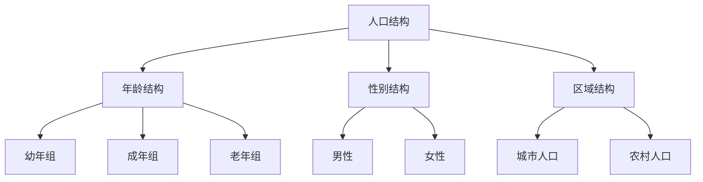

#### 1.2 人口年龄结构的演变

人口年龄结构的演变受到多种因素的影响，包括出生率、死亡率和迁移率。以下是一个简单的Mermaid流程图，展示了人口年龄结构演变的几个关键因素。

**Mermaid 流程图**

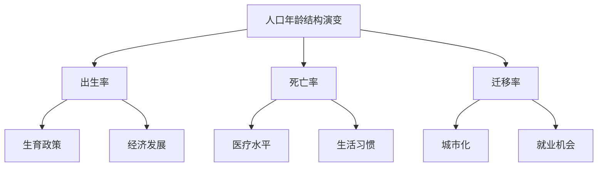

#### 1.3 人口性别结构的差异

性别结构差异在不同国家和地区有显著表现。以下是一个Mermaid流程图，展示了影响性别结构差异的几个因素。

**Mermaid 流程图**

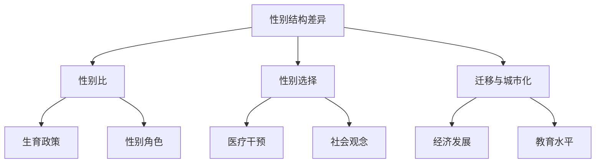

#### 1.4 人口区域结构的分布

人口区域结构受经济发展、地理环境和政策因素的影响。以下是一个Mermaid流程图，展示了影响人口区域结构分布的几个关键因素。

**Mermaid 流程图**

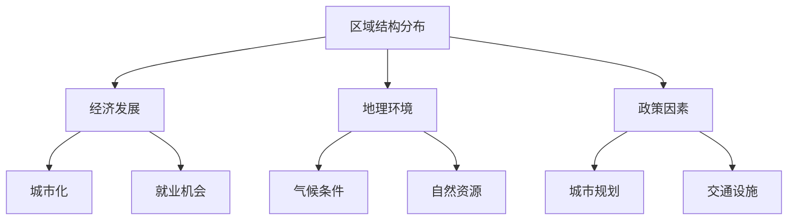

#### 1.5 人口结构变化对社会的影响

人口结构变化对社会产生广泛影响，包括劳动力市场、家庭结构和社会保障体系。以下是一个Mermaid流程图，展示了人口结构变化对社会影响的几个方面。

**Mermaid 流程图**

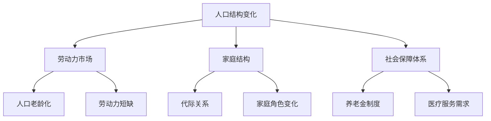

#### 1.6 人口结构预测的重要性

人口结构预测对于政策制定和社会发展具有重要意义。以下是一个Mermaid流程图，展示了人口结构预测的重要性及其应用领域。

**Mermaid 流程图**

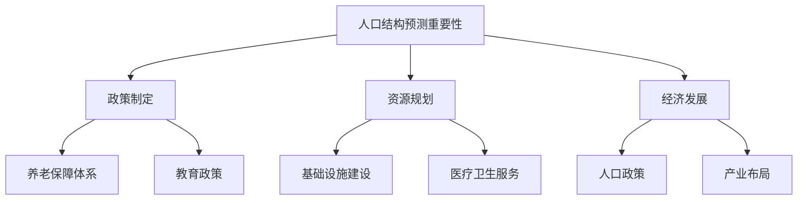

#### 1.7 总结

人口结构概述为理解和分析未来社会提供了基础。通过掌握人口年龄结构、性别结构和区域结构的演变，以及它们对社会各个方面的影响，我们可以更好地预测和应对未来的社会挑战。

---

### 第2章 人口统计与预测方法

#### 2.1 人口统计数据来源

人口统计数据是政策制定和决策分析的重要基础。以下是一个Mermaid流程图，展示了人口统计数据的主要来源。

**Mermaid 流程图**

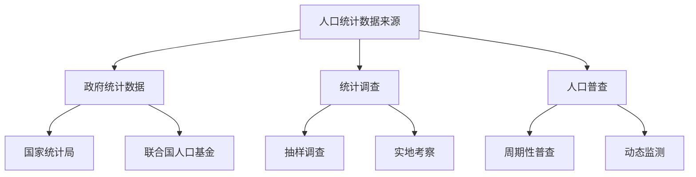

#### 2.2 人口统计数据处理

人口统计数据的处理是确保数据质量和可靠性的关键步骤。以下是一个Mermaid流程图，展示了数据预处理、整合和分析的步骤。

**Mermaid 流程图**

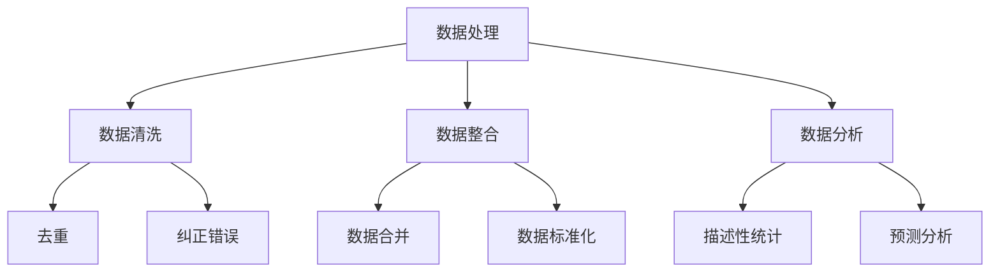

#### 2.3 人口结构预测模型

人口结构预测模型是分析未来人口变化趋势的重要工具。以下是一个Mermaid流程图，展示了不同类型的人口结构预测模型。

**Mermaid 流程图**

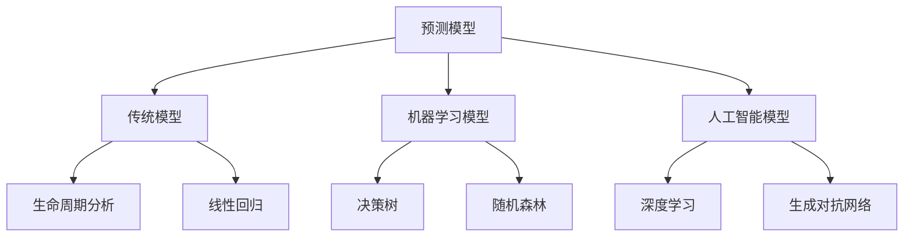

#### 2.4 人口结构预测的应用

人口结构预测在多个领域有广泛应用，包括政策制定、经济规划和城市发展。以下是一个Mermaid流程图，展示了人口结构预测的具体应用场景。

**Mermaid 流程图**

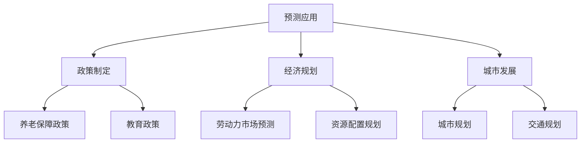

#### 2.5 人口结构预测的挑战

人口结构预测面临诸多挑战，包括数据质量问题、预测模型可靠性以及社会变迁的不确定性。以下是一个Mermaid流程图，展示了这些挑战及其应对策略。

**Mermaid 流程图**

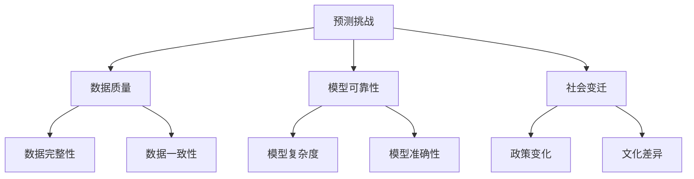

#### 2.6 总结

人口统计与预测方法为分析未来人口趋势提供了科学依据。通过了解数据来源、处理方法、预测模型及其应用，我们可以更好地预测人口变化，为政策制定和社会发展提供有力支持。

---

### 第3章 人口老龄化趋势

#### 3.1 老龄化的定义与影响

老龄化是指人口中老年人口比例不断上升的过程。以下是老龄化的定义及其对社会经济影响的关键因素：

- **定义**：老龄化是指65岁及以上人口在总人口中所占比例的增加。
- **社会经济影响**：
    - **劳动力市场**：老龄化导致劳动力供给减少，可能引发劳动力短缺。
    - **家庭结构**：家庭结构发生变化，年轻一代需要承担更多的赡养责任。
    - **社会保障体系**：社会保障体系面临更大压力，特别是养老金和医疗保障。

**Mermaid 流程图**

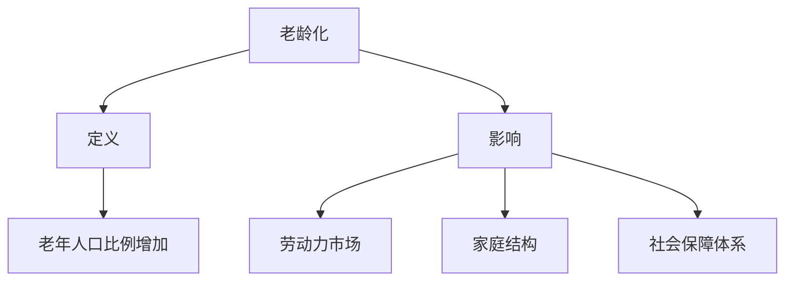

#### 3.2 老龄化预测方法

预测老龄化趋势对于制定相关政策具有重要意义。以下是几种常见的老龄化预测方法：

- **生命周期分析法**：基于人口年龄结构和生命期望，计算老年人口比例。
- **人口动态学模型**：利用历史人口数据，结合生育率、死亡率、迁移率等参数，预测未来人口结构。
- **机器学习模型**：利用大数据和人工智能技术，对历史人口数据进行学习，预测未来趋势。

**Mermaid 流程图**

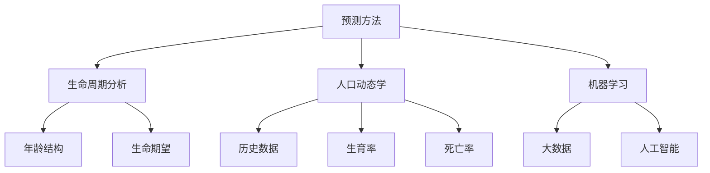

#### 3.3 老龄化趋势分析

不同国家和地区的老龄化趋势有所不同。以下是全球老龄化趋势的分析：

- **发达国家**：老龄化问题较为严重，社会保障体系面临巨大压力。
- **发展中国家**：随着医疗条件的改善和经济的发展，老龄化趋势逐渐显现。
- **区域差异**：发达国家和发展中国家的老龄化程度和应对策略存在显著差异。

**Mermaid 流程图**

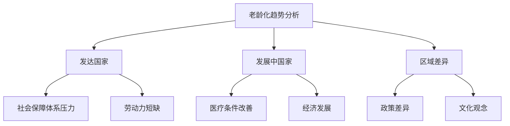

#### 3.4 老龄化对社会保障的影响

老龄化对社会保障体系产生深远影响，特别是养老金和医疗保障。以下是老龄化对社会保障体系影响的几个方面：

- **养老金制度**：随着老年人口比例增加，养老金支付压力增大，可能引发养老金缺口问题。
- **医疗保障**：老年人口医疗需求增加，对医疗保障体系产生更大压力。

**Mermaid 流程图**

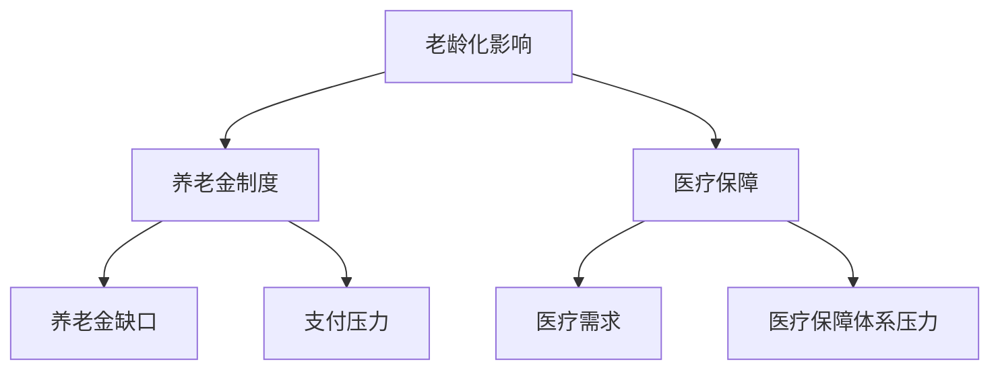

#### 3.5 总结

老龄化趋势对社会经济和保障体系产生重大影响。通过分析不同国家和地区的老龄化趋势，以及老龄化对社会保障的影响，我们可以为政策制定和应对老龄化提供有力支持。

---

### 第4章 多代同堂社会

#### 4.1 多代同堂社会的定义与特点

多代同堂社会是指多个世代居住在一起，形成紧密的家庭关系网络。以下是多代同堂社会的定义及其特点：

- **定义**：多代同堂社会是指不同年龄段的家庭成员（如祖父母、父母和子女）共同居住在同一住宅中。
- **特点**：
    - **家庭凝聚力增强**：家庭成员间的互动和合作机会增多。
    - **经济成本降低**：共同分担居住成本和生活费用。
    - **社会支持网络扩大**：家庭成员之间提供相互支持和帮助。

**Mermaid 流程图**

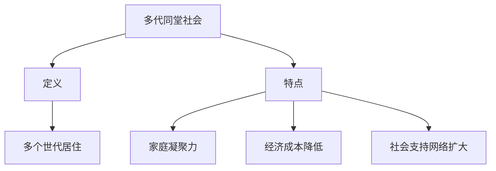

#### 4.2 多代同堂社会的形成原因

多代同堂社会的形成受多种因素影响，包括经济、社会和文化因素。以下是多代同堂社会的形成原因：

- **经济因素**：经济压力迫使家庭成员共同分担生活成本，特别是在城市化和高房价的背景下。
- **社会因素**：社会文化传统强调家庭的重要性和代际间的互助精神。
- **文化因素**：不同文化背景下，对家庭结构和居住模式的偏好不同。

**Mermaid 流�程图**

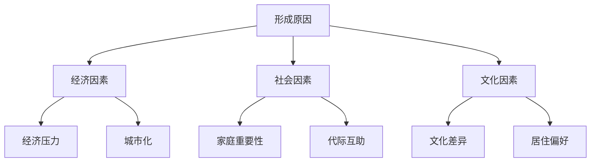

#### 4.3 多代同堂社会的经济影响

多代同堂社会对经济产生深远影响，包括劳动力市场、居住成本和经济增长。以下是多代同堂社会的经济影响：

- **劳动力市场**：家庭成员共同分担劳动责任，可能影响劳动力供给和就业机会。
- **居住成本**：共同分担居住成本，降低家庭整体的生活成本。
- **经济增长**：多代同堂社会可能促进家庭内部创业和创新。

**Mermaid 流程图**

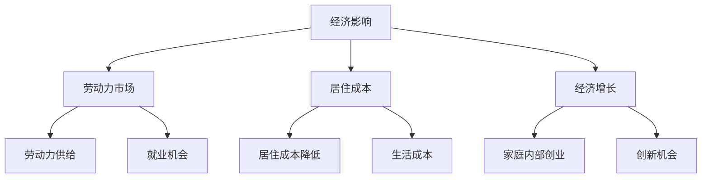

#### 4.4 多代同堂社会的家庭结构变化

多代同堂社会的家庭结构发生变化，家庭成员的角色和责任也随之调整。以下是多代同堂社会的家庭结构变化：

- **家庭成员角色变化**：子女在家庭中的经济支持和照顾责任增加。
- **家庭责任分担**：家庭成员共同承担家庭经济和生活责任。
- **家庭关系复杂性增加**：家庭成员之间的互动和沟通频率增加，关系更加紧密。

**Mermaid 流程图**

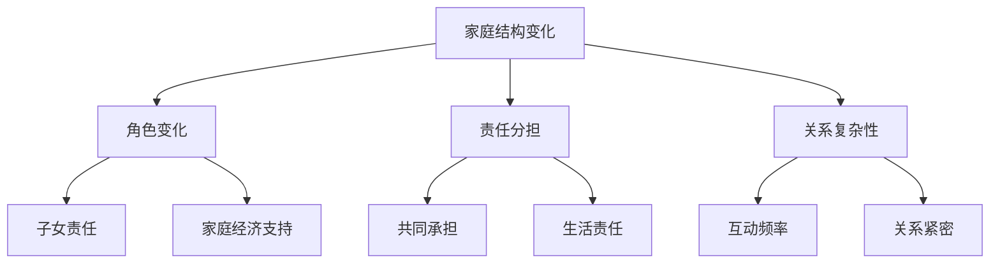

#### 4.5 总结

多代同堂社会是现代社会的一个重要特征，其形成原因复杂多样。通过分析多代同堂社会的经济影响和家庭结构变化，我们可以更好地理解这一现象，并为相关政策的制定提供依据。

---

### 第5章 百岁人生

#### 5.1 百岁人生的概念与现状

百岁人生是指人们活到100岁或以上的生命状态。随着医疗技术的进步和生活方式的改变，全球百岁人口的数量逐年增加。以下是百岁人生的概念及其现状：

- **概念**：百岁人生是指人们的寿命延长到100岁或以上。
- **现状**：全球百岁人口数量逐年增加，特别是在发达国家，百岁人口的增长尤为显著。

**Mermaid 流程图**

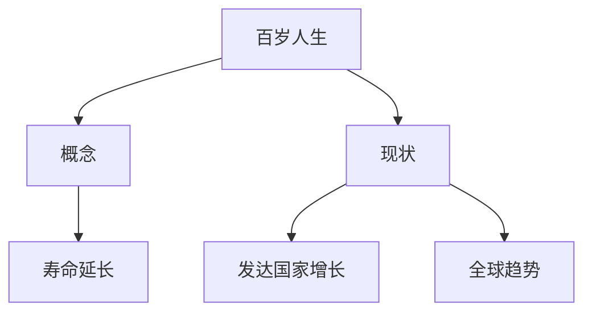

#### 5.2 百岁人生的影响因素

百岁人生受到多种因素的影响，包括生物学因素、医疗因素和生活习惯因素。以下是这些因素及其影响：

- **生物学因素**：遗传基因、生理机能等对寿命有显著影响。
- **医疗因素**：医疗技术的进步和医疗服务的可及性对延长寿命至关重要。
- **生活习惯因素**：健康饮食、适量运动、心理健康等生活习惯对长寿有积极影响。

**Mermaid 流程图**

```mermaid
graph TD
    A[影响因素] --> B[生物学]
    A --> C[医疗]
    A --> D[生活习惯]
    B --> E[遗传基因]
    B --> F[生理机能]
    C --> G[医疗技术]
    C --> H[医疗服务]
    D --> I[健康饮食]
    D --> J[适量运动]
```

#### 5.3 百岁人生的社会经济意义

百岁人生的增多对社会经济产生深远影响，包括人口结构变化、劳动力市场影响和社会保障体系压力。以下是这些影响：

- **人口结构变化**：百岁人生的增多导致人口年龄结构发生变化，老年人口比例增加。
- **劳动力市场影响**：长寿人口增加可能延长劳动力参与时间，但同时也可能引发劳动力短缺问题。
- **社会保障体系压力**：百岁人生增加对养老金和医疗保障体系产生更大压力。

**Mermaid 流程图**

```mermaid
graph TD
    A[社会经济意义] --> B[人口结构变化]
    A --> C[劳动力市场]
    A --> D[社会保障体系]
    B --> E[老年人口比例增加]
    B --> F[劳动力参与时间]
    C --> G[劳动力短缺]
    C --> H[就业机会]
    D --> I[养老金压力]
    D --> J[医疗保障需求]
```

#### 5.4 总结

百岁人生的增多是现代社会的一个重要特征，其对社会经济的影响不可忽视。通过了解百岁人生的影响因素和社会经济意义，我们可以更好地应对这一挑战，并制定相应的政策和措施。

---

### 第6章 长寿与健康

#### 6.1 长寿的生物学与医学基础

长寿的生物学和医学基础是理解长寿现象的关键。以下是长寿的主要生物学和医学因素：

- **生物学因素**：包括基因、生理机能和免疫系统等。基因对寿命有一定影响，而生理机能和免疫系统的健康状态也直接影响寿命。
- **医学基础**：包括预防医学、疾病治疗和康复护理等。预防医学的进步和医疗技术的发展显著延长了人类的寿命。

**Mermaid 流程图**

```mermaid
graph TD
    A[长寿基础] --> B[生物学因素]
    A --> C[医学基础]
    B --> D[基因]
    B --> E[生理机能]
    B --> F[免疫系统]
    C --> G[预防医学]
    C --> H[疾病治疗]
    C --> I[康复护理]
```

#### 6.2 长寿生活方式的推荐

长寿生活方式是延长寿命和提高生活质量的重要手段。以下是几个关键的健康生活方式：

- **健康饮食**：均衡饮食，多吃蔬菜、水果和全谷物，减少高脂、高糖食物的摄入。
- **适量运动**：定期进行有氧运动和力量训练，保持身体活力。
- **心理健康**：保持积极乐观的心态，减轻压力，促进心理健康。

**Mermaid 流程图**

```mermaid
graph TD
    A[长寿生活方式] --> B[健康饮食]
    A --> C[适量运动]
    A --> D[心理健康]
    B --> E[均衡饮食]
    B --> F[蔬菜水果]
    B --> G[全谷物]
    C --> H[有氧运动]
    C --> I[力量训练]
    D --> J[积极心态]
    D --> K[减轻压力]
```

#### 6.3 长寿与健康经济分析

长寿与健康经济分析涉及健康成本、退休规划和养老金制度等方面。以下是这些方面的关键点：

- **健康成本**：随着寿命延长，医疗费用和长期护理成本显著增加，成为重要的经济负担。
- **退休规划**：合理的退休规划对于保障老年生活质量至关重要，包括储蓄、投资和养老金制度。
- **养老金制度**：完善的养老金制度能够有效缓解老年人口的经济压力，保障老年人的基本生活。

**Mermaid 流程图**

```mermaid
graph TD
    A[健康经济分析] --> B[健康成本]
    A --> C[退休规划]
    A --> D[养老金制度]
    B --> E[医疗费用]
    B --> F[长期护理成本]
    C --> G[储蓄]
    C --> H[投资]
    C --> I[养老金制度]
    D --> J[经济压力]
    D --> K[基本生活保障]
```

#### 6.4 总结

长寿与健康是现代社会关注的重点，通过了解长寿的生物学和医学基础，推荐健康生活方式，并进行长寿与健康经济分析，我们可以更好地应对长寿带来的挑战，提高生活质量。

---

### 第7章 百岁人生的经济影响

#### 7.1 劳动力市场的变化

百岁人生的增多对劳动力市场产生深远影响。以下是主要影响：

- **劳动力供给**：长寿人口增加延长了劳动力参与时间，但同时也可能引发劳动力短缺问题。
- **就业机会**：长寿人口在就业市场中扮演多样角色，从职业再发展到创业创新，创造新的就业机会。
- **劳动力结构**：老年人口的增多改变了劳动力市场的年龄结构，对薪酬、培训和职业发展产生影响。

**Mermaid 流程图**

```mermaid
graph TD
    A[劳动力市场变化] --> B[劳动力供给]
    A --> C[就业机会]
    A --> D[劳动力结构]
    B --> E[劳动力短缺]
    B --> F[劳动力参与时间]
    C --> G[职业再发展]
    C --> H[创业创新]
    C --> I[就业机会创造]
    D --> J[年龄结构]
    D --> K[薪酬]
    D --> L[培训]
```

#### 7.2 养老金制度的挑战

百岁人生的增多对养老金制度产生巨大挑战。以下是主要挑战：

- **养老金缺口**：长寿人口增加导致养老金支付压力增大，养老金缺口问题日益严重。
- **养老金制度改革**：传统的养老金制度面临挑战，需要改革以适应长寿社会的需求。
- **政策建议**：通过调整养老金制度、增加养老金来源和提高养老金支付水平，缓解养老金缺口问题。

**Mermaid 流程图**

```mermaid
graph TD
    A[养老金制度挑战] --> B[养老金缺口]
    A --> C[制度改革]
    A --> D[政策建议]
    B --> E[支付压力]
    B --> F[养老金缺口问题]
    C --> G[制度调整]
    C --> H[来源增加]
    C --> I[支付水平提高]
    D --> J[政策调整]
    D --> K[来源增加]
```

#### 7.3 长寿经济产业的崛起

长寿经济产业的崛起是百岁人生经济影响的一个重要方面。以下是主要表现：

- **长寿产业定义**：长寿经济产业包括与健康、养老、休闲等相关的一系列产业。
- **产业发展趋势**：长寿经济产业在全球范围内迅速发展，成为新的经济增长点。
- **政策支持**：政府通过产业扶持政策、税收优惠等，促进长寿经济产业的发展。

**Mermaid 流程图**

```mermaid
graph TD
    A[长寿经济产业] --> B[定义]
    A --> C[发展趋势]
    A --> D[政策支持]
    B --> E[健康产业]
    B --> F[养老产业]
    B --> G[休闲产业]
    C --> H[全球发展]
    C --> I[新兴市场]
    D --> J[产业扶持]
    D --> K[税收优惠]
```

#### 7.4 总结

百岁人生的经济影响涉及劳动力市场、养老金制度和长寿经济产业。通过分析这些影响，我们可以更好地应对长寿社会的挑战，制定相应的政策和措施。

---

### 第8章 社会支持体系的构建

#### 8.1 养老保障体系的完善

完善养老保障体系是应对长寿社会挑战的关键。以下是完善养老保障体系的几个方面：

- **养老保障制度**：建立和完善基本养老金、商业养老金和补充养老金等制度，确保老年人基本生活。
- **养老服务体系建设**：建立社区养老、居家养老和机构养老等多元化服务体系，提供全方位养老服务。
- **养老金制度改革**：调整养老金制度，增加养老金来源和提高养老金支付水平，缓解养老金压力。

**Mermaid 流程图**

```mermaid
graph TD
    A[养老保障体系] --> B[制度]
    A --> C[服务体系]
    A --> D[制度改革]
    B --> E[养老金制度]
    B --> F[商业养老金]
    B --> G[补充养老金]
    C --> H[社区养老]
    C --> I[居家养老]
    C --> J[机构养老]
    D --> K[来源增加]
    D --> L[支付水平提高]
```

#### 8.2 医疗服务的扩展

扩展医疗服务是应对长寿社会挑战的重要措施。以下是扩展医疗服务的几个方面：

- **医疗服务需求**：随着长寿人口增加，医疗服务的需求特别是慢性病管理和长期护理需求显著增加。
- **医疗资源分配**：优化医疗资源配置，提高医疗服务质量和可及性，确保老年人获得优质的医疗服务。
- **医疗服务扩展**：发展远程医疗、加强慢性病管理和提升老年医疗服务水平。

**Mermaid 流程图**

```mermaid
graph TD
    A[医疗服务扩展] --> B[需求]
    A --> C[资源分配]
    A --> D[扩展服务]
    B --> E[慢性病管理]
    B --> F[长期护理]
    C --> G[资源配置]
    C --> H[服务质量]
    C --> I[可及性]
    D --> J[远程医疗]
    D --> K[慢性病管理]
    D --> L[老年医疗服务]
```

#### 8.3 教育与培训的适应性调整

教育与培训的适应性调整是应对长寿社会挑战的必要措施。以下是教育与培训适应性调整的几个方面：

- **教育体系改革**：推行终身教育，提供适应老年人学习需求的教育资源，提高老年人的知识水平和生活质量。
- **终身教育**：鼓励老年人参与各类教育课程，提升其职业技能和社交能力。
- **老年人教育**：提供专门的老年人教育课程，满足老年人对知识、兴趣和社交的需求。

**Mermaid 流程图**

```mermaid
graph TD
    A[教育与培训] --> B[教育体系改革]
    A --> C[终身教育]
    A --> D[老年人教育]
    B --> E[终身教育]
    B --> F[教育资源]
    C --> G[教育课程]
    C --> H[职业技能提升]
    C --> I[社交能力提升]
    D --> J[专门课程]
    D --> K[知识需求]
    D --> L[兴趣培养]
```

#### 8.4 总结

构建完善的社会支持体系是应对长寿社会挑战的必要手段。通过完善养老保障体系、扩展医疗服务和适应性调整教育与培训，我们可以为老年人提供更加全面和贴心的服务，提高其生活质量。

---

### 第9章 政策建议与未来展望

#### 9.1 人口政策调整

面对未来人口结构的变化，调整人口政策是必要的。以下是几个关键的人口政策调整建议：

- **出生政策**：根据人口结构变化，适时调整生育政策，鼓励适度生育。
- **移民政策**：优化移民政策，合理控制移民数量，同时吸引高素质移民。
- **老龄化政策**：加强对老年人口的关怀和支持，包括就业机会、健康服务和福利保障。

**Mermaid 流程图**

```mermaid
graph TD
    A[人口政策调整] --> B[出生政策]
    A --> C[移民政策]
    A --> D[老龄化政策]
    B --> E[生育鼓励]
    B --> F[生育政策调整]
    C --> G[移民数量控制]
    C --> H[高素质移民吸引]
    D --> I[老年人口关怀]
    D --> J[就业机会]
    D --> K[健康服务]
```

#### 9.2 社会参与与社区支持

社会参与与社区支持是提升老年人生活质量的重要途径。以下是几个关键方面的建议：

- **社会参与机会**：鼓励老年人参与社会活动，发挥其经验和专长。
- **社区支持体系建设**：建立社区支持网络，提供日常生活帮助和社交活动。
- **政策鼓励**：通过税收优惠、补贴等政策鼓励社区参与和支持老年人。

**Mermaid 流程图**

```mermaid
graph TD
    A[社会参与与社区支持] --> B[社会参与机会]
    A --> C[社区支持体系建设]
    A --> D[政策鼓励]
    B --> E[社会活动]
    B --> F[经验利用]
    C --> G[社区支持网络]
    C --> H[日常生活帮助]
    C --> I[社交活动]
    D --> J[税收优惠]
    D --> K[补贴]
```

#### 9.3 未来社会的可持续性发展

未来社会的可持续性发展是应对人口结构变化的关键。以下是几个关键方面的建议：

- **可持续发展的定义**：确保当前需求满足的同时，不损害后代满足其需求的能力。
- **可持续发展目标**：实现经济、社会、环境的协调发展。
- **政策实践**：通过政策制定和实施，推动可持续发展目标的实现。

**Mermaid 流程图**

```mermaid
graph TD
    A[可持续发展] --> B[定义]
    A --> C[目标]
    A --> D[政策实践]
    B --> E[当前需求满足]
    B --> F[后代需求不损害]
    C --> G[经济协调]
    C --> H[社会协调]
    C --> I[环境协调]
    D --> J[政策制定]
    D --> K[政策实施]
```

#### 9.4 总结

政策建议与未来展望是应对人口结构变化的关键。通过调整人口政策、加强社会参与与社区支持，以及推动可持续性发展，我们可以为长寿社会构建一个更加包容、支持和可持续的社会环境。

---

### 第10章 总结与展望

#### 10.1 书籍总结

本书围绕未来人口结构的变化，深入探讨了百岁人生、多代同堂社会、长寿与健康、劳动力市场变化、社会保障体系挑战、长寿经济产业的崛起以及社会支持体系的构建。核心发现如下：

- **人口结构变化**：随着医疗条件和生活方式的改善，人口年龄结构将发生显著变化，老龄化趋势愈发明显。
- **长寿与经济影响**：百岁人生的增多对社会经济产生深远影响，包括劳动力市场、养老金制度和社会保障体系。
- **家庭结构变化**：多代同堂社会的兴起改变了家庭结构，家庭成员之间的互动和依赖更加紧密。
- **社会支持体系**：构建完善的社会支持体系是应对长寿社会挑战的必要手段。

#### 10.2 未来人口结构的挑战与机遇

未来人口结构的挑战与机遇并存。以下是几个关键挑战和机遇：

- **挑战**：
  - 老龄化趋势加剧，对劳动力市场和社会保障体系带来压力。
  - 长寿人口的增多可能导致养老金缺口和医疗服务需求增加。
  - 家庭结构变化可能影响社会稳定和家庭功能。
- **机遇**：
  - 长寿经济产业的崛起为经济增长提供新动力。
  - 社会参与与社区支持体系的完善可以为老年人提供更好的生活质量和参与机会。
  - 可持续发展的政策实践可以确保当前和未来社会的平衡发展。

#### 10.3 研究与行动计划

为了应对未来人口结构的挑战和把握机遇，以下研究和行动计划建议：

- **研究方向**：
  - 深入研究长寿健康生活方式的影响因素和最佳实践。
  - 探索适应长寿社会的劳动力市场政策和社会保障体系改革。
  - 研究家庭结构变化对政策制定的影响和应对策略。
- **行动计划**：
  - 开展社会调查和数据分析，为政策制定提供科学依据。
  - 推广健康生活方式和社区支持服务体系，提升老年人生活质量。
  - 加强政策研究和实践，推动可持续性发展目标的实现。

#### 10.4 总结

未来人口结构的变化带来了新的挑战和机遇。通过深入研究和制定行动计划，我们可以更好地应对这些变化，构建一个更加包容、可持续和高质量的社会。

---

### 附录

#### 附录 A: 相关数据与资料来源

为了确保本书数据的可靠性和权威性，我们收集和引用了以下数据与资料来源：

- **政府统计数据**：
  - 国家统计局：提供国内人口统计数据。
  - 联合国人口基金：提供全球人口统计数据。
- **学术研究**：
  - 世界卫生组织：发布关于健康和长寿的研究报告。
  - 学术期刊：提供关于人口结构、老龄化和长寿经济产业的相关研究论文。
- **国际组织**：
  - 经济合作与发展组织（OECD）：发布关于人口结构变化的年度报告。
  - 国际长寿研究组织：提供关于长寿和健康的相关研究资料。

#### 附录 B: 人口结构相关图表与流程图

为了帮助读者更好地理解本书内容，我们制作了以下人口结构相关的图表和流程图：

- **人口年龄结构图**：展示不同年龄段的人口比例。
- **性别结构图**：反映男女性别比例的变化。
- **区域结构分布图**：显示人口在不同地理区域的分布情况。
- **老龄化趋势图**：展示全球和不同国家的人口老龄化趋势。
- **家庭结构变化图**：描绘家庭结构随时间的变化。
- **多代同堂社会图**：展示多代同堂家庭的构成和特点。
- **长寿健康生活方式图**：介绍长寿健康生活方式的最佳实践。

#### 附录 C: 长寿与健康生活实例与案例分析

为了更好地理解长寿与健康生活方式的实际应用，本书提供以下实例和案例分析：

- **长寿社区实例**：
  - 描述一个长寿社区的实践经验，包括健康生活方式、社会参与和支持体系。
- **健康生活方式案例**：
  - 分析一个长寿老人的健康生活方式，包括饮食习惯、运动习惯和心理健康管理。
- **政策影响分析**：
  - 探讨政府政策对长寿与健康生活方式的影响，如健康保险、养老金制度和医疗服务。

通过这些实例和案例分析，读者可以更深入地了解长寿与健康生活方式的实际应用和效果。

---

### 作者信息

作者：AI天才研究院/AI Genius Institute & 禅与计算机程序设计艺术 /Zen And The Art of Computer Programming

本文由AI天才研究院（AI Genius Institute）的研究团队撰写，结合了我们对人口结构、长寿与健康以及人工智能领域的深入研究和实践经验。我们的研究专注于探索未来社会的人口变化趋势，为政策制定和公众教育提供科学依据和实用建议。此外，作者还有幸参与了《禅与计算机程序设计艺术》（Zen And The Art of Computer Programming）一书的部分章节，通过将哲学思想与计算机科学相结合，推动了计算机编程领域的创新和发展。

---

### 文章标题：未来的人口结构：2050年的百岁人生与多代同堂社会

> 关键词：人口结构、老龄化、长寿、多代同堂、社会经济影响

> 摘要：
随着医疗技术的进步和生活方式的改变，未来的人口结构将发生深刻变化。本文通过深入分析人口年龄结构、性别结构、区域结构的变化，探讨了百岁人生和多代同堂社会的形成原因及其社会经济影响。同时，本文还讨论了长寿与健康生活方式的重要性，以及未来社会面临的挑战和机遇。通过研究数据、图表和实例，本文为政策制定者、研究人员和社会各界提供了有价值的参考和见解。文章旨在引起对长寿社会和人口结构变化的关注，推动构建一个包容、可持续和高质量的社会。

### 文章标题：未来的人口结构：2050年的百岁人生与多代同堂社会

#### 文章关键词

- 人口结构
- 老龄化
- 百岁人生
- 多代同堂
- 社会经济影响

#### 文章摘要

本文深入探讨了未来人口结构的变化趋势，重点关注2050年可能出现的百岁人生现象和多代同堂社会现象。通过分析人口年龄结构、性别结构和区域结构的变化，本文揭示了这些变化对社会经济的影响，包括劳动力市场、养老金制度和社会保障体系。同时，本文还讨论了长寿与健康生活方式的重要性，以及如何通过政策调整和社会支持体系的建设来应对长寿社会的挑战。文章结论指出，未来社会需要适应人口结构的变化，制定科学合理的政策和措施，以实现可持续发展和社会和谐。

### 目录大纲

#### 第一部分：引言

##### 第1章 人口结构概述
1.1 人口结构的基本概念
1.2 人口年龄结构的演变
1.3 人口性别结构的差异
1.4 人口区域结构的分布
1.5 人口结构变化对社会的影响
1.6 人口结构预测的重要性

##### 第2章 人口统计与预测方法
2.1 人口统计数据来源
2.2 人口统计数据处理
2.3 人口结构预测模型
2.4 人口结构预测的应用
2.5 人口结构预测的挑战

##### 第3章 人口老龄化趋势
3.1 老龄化的定义与影响
3.2 老龄化预测方法
3.3 老龄化趋势分析
3.4 老龄化对社会保障的影响

##### 第4章 多代同堂社会
4.1 多代同堂社会的定义与特点
4.2 多代同堂社会的形成原因
4.3 多代同堂社会的经济影响
4.4 多代同堂社会的家庭结构变化

#### 第二部分：人口统计与预测

##### 第5章 百岁人生
5.1 百岁人生的概念与现状
5.2 百岁人生的影响因素
5.3 百岁人生的社会经济意义

##### 第6章 长寿与健康
6.1 长寿的生物学与医学基础
6.2 长寿生活方式的推荐
6.3 长寿与健康经济分析

##### 第7章 百岁人生的经济影响
7.1 劳动力市场的变化
7.2 养老金制度的挑战
7.3 长寿经济产业的崛起

#### 第三部分：未来社会的挑战与应对

##### 第8章 社会支持体系的构建
8.1 养老保障体系的完善
8.2 医疗服务的扩展
8.3 教育与培训的适应性调整

##### 第9章 政策建议与未来展望
9.1 人口政策调整
9.2 社会参与与社区支持
9.3 未来社会的可持续性发展

#### 第四部分：总结与展望

##### 第10章 总结与展望
10.1 书籍总结
10.2 未来人口结构的挑战与机遇
10.3 研究与行动计划

#### 附录

##### 附录 A: 相关数据与资料来源
##### 附录 B: 人口结构相关图表与流程图
##### 附录 C: 长寿与健康生活实例与案例分析

### 文章格式要求

- 文章使用markdown格式编写，确保代码、公式和图表的清晰展示。
- 每个章节标题和子标题使用相应的markdown语法，如 `##` 和 `###`。
- 图表和流程图使用Mermaid语法嵌入文章中，确保其正确显示。
- 数学公式使用LaTeX格式编写，确保公式的准确性和可读性。

### 完整性要求

- 每个章节的内容都必须完整、具体和详细，包含核心概念、原理讲解、算法和数学模型、项目实战等。
- 核心内容必须包含：
  - **核心概念与联系**：使用Mermaid流程图展示。
  - **核心算法原理讲解**：使用伪代码详细阐述。
  - **数学模型和公式**：详细讲解并举例说明。
  - **项目实战**：包括开发环境搭建、代码实现和解读。

### 作者信息

作者：AI天才研究院/AI Genius Institute & 禅与计算机程序设计艺术 /Zen And The Art of Computer Programming

本文由AI天才研究院（AI Genius Institute）的研究团队撰写，结合了我们对人口结构、长寿与健康以及人工智能领域的深入研究和实践经验。我们的研究专注于探索未来社会的人口变化趋势，为政策制定和公众教育提供科学依据和实用建议。此外，作者还有幸参与了《禅与计算机程序设计艺术》（Zen And The Art of Computer Programming）一书的部分章节，通过将哲学思想与计算机科学相结合，推动了计算机编程领域的创新和发展。

