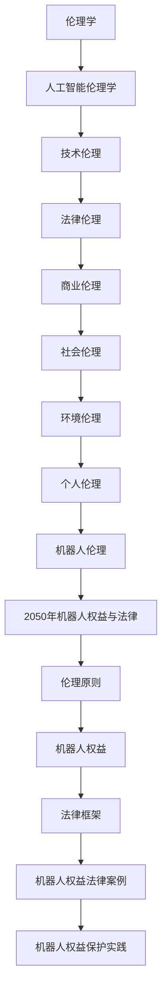

                 

### 《未来的人工智能伦理：2050年的机器人权益与法律》

**关键词**：人工智能伦理、机器人权益、法律框架、2050年预测

**摘要**：本文探讨了未来人工智能伦理，特别是2050年机器人权益与法律的发展。文章分析了当前人工智能伦理的现状，提出了机器人权益的概念和法律框架，并预测了2050年人工智能和社会的变革，以及如何应对这些挑战。

---

## 《未来的人工智能伦理：2050年的机器人权益与法律》目录大纲

### 第一部分：引言

#### 1.1 书籍背景与目的

##### 1.1.1 人工智能伦理的现状

##### 1.1.2 书籍的研究目标和意义

#### 1.2 本书结构概述

##### 1.2.1 分篇结构

##### 1.2.2 各章节内容概览

### 第二部分：人工智能伦理基础

#### 2.1 人工智能伦理学概述

##### 2.1.1 伦理学与人工智能

##### 2.1.2 人工智能伦理学的发展历程

##### 2.1.3 人工智能伦理学的核心问题

#### 2.2 人工智能伦理原则

##### 2.2.1 公正性

##### 2.2.2 尊重隐私

##### 2.2.3 对等性

##### 2.2.4 安全性

#### 2.3 人工智能伦理案例研究

##### 2.3.1 人工智能在医疗领域的伦理问题

##### 2.3.2 人工智能在交通领域的伦理问题

##### 2.3.3 人工智能在就业领域的伦理问题

### 第三部分：机器人权益

#### 3.1 机器人权益的概念

##### 3.1.1 机器人的法律地位

##### 3.1.2 机器人权益的界定

##### 3.1.3 机器人权益的伦理考量

#### 3.2 机器人权益的法律框架

##### 3.2.1 国际法律框架

##### 3.2.2 国家法律框架

##### 3.2.3 地方法律框架

#### 3.3 机器人权益的具体问题

##### 3.3.1 机器人的道德责任

##### 3.3.2 机器人的隐私权

##### 3.3.3 机器人的知情权

### 第四部分：2050年的机器人权益与法律

#### 4.1 2050年人工智能发展预测

##### 4.1.1 人工智能技术的进步

##### 4.1.2 人工智能在社会的广泛应用

##### 4.1.3 2050年人工智能的挑战与机遇

#### 4.2 2050年机器人权益的发展趋势

##### 4.2.1 机器人权益的法律保护

##### 4.2.2 机器人权益的社会认可

##### 4.2.3 机器人权益的国际合作

#### 4.3 2050年机器人权益的法律框架构建

##### 4.3.1 法律体系的完善

##### 4.3.2 法律执行的挑战

##### 4.3.3 法律框架的实施效果评估

### 第五部分：未来展望

#### 5.1 人工智能伦理与机器人权益的挑战

##### 5.1.1 技术发展的不确定性

##### 5.1.2 社会接受的挑战

##### 5.1.3 法律法规的滞后性

#### 5.2 人工智能伦理与机器人权益的解决方案

##### 5.2.1 加强国际合作

##### 5.2.2 提高公众意识

##### 5.2.3 完善法律法规

#### 5.3 未来的研究方向

##### 5.3.1 机器人伦理与法律的理论研究

##### 5.3.2 人工智能伦理与机器人权益的实践探索

##### 5.3.3 人工智能伦理与机器人权益的教育普及

### 附录

#### 附录A：参考文献

##### A.1 主要参考书籍

##### A.2 主要参考论文

##### A.3 网络资源

#### 附录B：术语解释

##### B.1 人工智能

##### B.2 机器人

##### B.3 伦理学

##### B.4 法律框架

#### 附录C：未来研究展望

##### C.1 技术发展的潜在影响

##### C.2 社会变革的前景

##### C.3 法律法规的完善路径

---

### 核心概念与联系

#### 人工智能伦理学

##### 人工智能伦理学的Mermaid流程图



### 核心算法原理讲解

#### 机器学习算法概述

```plaintext
算法选择：监督学习、无监督学习、强化学习
模型构建：数据预处理、特征提取、模型选择、模型训练、模型评估
模型优化：超参数调优、模型集成、模型压缩
```

#### 机器人权益评估算法

```plaintext
评估指标：公正性、隐私性、对等性、安全性
评估方法：统计分析、机器学习模型、专家评估
评估流程：数据收集、模型训练、评估结果分析
```

### 数学模型和数学公式

#### 概率论与数理统计

$$ P(A|B) = \frac{P(B|A)P(A)}{P(B)} $$

#### 信息论与熵

$$ H(X) = -\sum_{i} p_i \log_2 p_i $$

#### 机器学习模型中的损失函数

$$ L(y, \hat{y}) = \frac{1}{2} (y - \hat{y})^2 $$

### 项目实战

#### 机器人权益保护实践

##### 开发环境搭建

- Python环境
- TensorFlow或PyTorch框架
- 数据预处理工具（如Pandas、NumPy）

##### 源代码实现

```python
# Python代码示例
import tensorflow as tf
from tensorflow import keras

# 模型定义
model = keras.Sequential([
    keras.layers.Dense(64, activation='relu', input_shape=(784,)),
    keras.layers.Dense(10, activation='softmax')
])

# 模型编译
model.compile(optimizer='adam',
              loss='categorical_crossentropy',
              metrics=['accuracy'])

# 模型训练
model.fit(x_train, y_train, epochs=5)
```

##### 代码解读与分析

```plaintext
- 模型定义：使用神经网络结构，包含一个输入层和一个输出层。
- 模型编译：指定优化器、损失函数和评价指标。
- 模型训练：使用训练数据集进行模型训练，指定训练轮次。
```

---

完成以上任务后，您将获得《未来的人工智能伦理：2050年的机器人权益与法律》的完整目录大纲。请确认是否满意。如果需要调整或补充，请告知。

