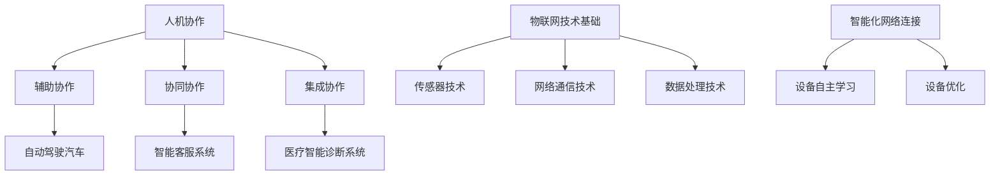

                 

# 文章标题：未来的就业趋势：2050年的人机协作与万物智联时代的新职业

> 关键词：未来就业趋势、人机协作、万物智联、人工智能、新职业

> 摘要：本文将探讨2050年的人机协作与万物智联时代下的未来就业趋势。通过分析核心概念、算法原理、数学模型以及实际项目案例，本文旨在为读者揭示即将到来的新职业，并提出相关研究方向。

## 引言与背景

### 1.1 未来的就业趋势概述

在21世纪，随着科技的迅猛发展，尤其是人工智能、自动化和物联网技术的普及，未来的就业市场将发生巨大的变革。传统行业正逐渐被自动化和智能化取代，而新兴职业正在不断涌现。根据麦肯锡全球研究院的预测，到2030年，全球将有8亿个工作岗位受到自动化和人工智能的影响，其中约4亿人需要重新学习和适应新的工作环境。

### 1.2 人机协作与万物智联时代

人机协作是指人类与机器共同完成工作任务的过程。在万物智联时代，这种协作将达到一个新的高度。物联网技术使得设备之间能够无缝连接，大数据和人工智能则能够对这些数据进行智能分析和处理。这种趋势将催生出许多新的职业，如数据分析师、智能系统工程师、物联网应用开发人员等。

### 1.3 本书结构

本文将分为以下几个部分：

- **第2章 核心概念与联系**：介绍人工智能与自动化、人机协作机制以及万物智联时代的架构。
- **第3章 核心算法原理讲解**：详细讲解监督学习、无监督学习和人机协作中的算法原理。
- **第4章 数学模型和数学公式详细讲解**：解析机器学习中的基本数学公式以及人机协作中的数学模型。
- **第5章 项目实战**：通过实际案例展示人工智能在教育行业和万物智联时代的企业运营中的应用。
- **第6章 总结与展望**：总结未来就业趋势，探讨新职业以及未来的研究方向。

## 第2章 核心概念与联系

### 2.1 人工智能与自动化

#### 2.1.1 人工智能的基本原理

人工智能（Artificial Intelligence，简称AI）是模拟人类智能行为的计算机科学分支。它包括机器学习、深度学习、自然语言处理、计算机视觉等多个领域。人工智能的基本原理是基于数据的学习和推理，通过算法模型实现人类智能的功能。

#### 2.1.2 自动化的演化与未来

自动化（Automation）是指利用机器或设备替代人类完成重复性、高危或繁琐的任务。随着人工智能技术的发展，自动化设备的能力不断增强，从最初的工业机器人到智能家庭设备，再到自动驾驶汽车，自动化正深刻地改变着我们的生活方式。

### 2.2 人机协作机制

#### 2.2.1 人机协作模式

人机协作可以分为三个层次：辅助协作、协同协作和集成协作。辅助协作是指机器辅助人类完成任务，如自动驾驶汽车中的辅助驾驶系统；协同协作是指机器和人类共同完成任务，如智能客服系统中的对话管理；集成协作是指机器和人类深度融合，共同完成复杂任务，如医疗领域的智能诊断系统。

#### 2.2.2 人机协作的挑战与机遇

人机协作面临着诸多挑战，如算法模型的可靠性、数据隐私保护、人机交互体验等。但同时，人机协作也带来了许多机遇，如提高工作效率、减少人力成本、增强创新能力等。

### 2.3 万物智联时代的架构

#### 2.3.1 物联网技术基础

物联网（Internet of Things，简称IoT）是通过互联网将各种设备互联起来，实现设备之间的数据交换和智能控制。物联网技术基础包括传感器技术、网络通信技术、数据处理技术等。

#### 2.3.2 智能化网络连接

智能化网络连接是指利用人工智能技术对物联网设备进行智能管理和控制，实现设备的自主学习和优化。这种连接方式将极大地提高物联网系统的效率和可靠性。

### **图2.1 人机协作与万物智联架构图**



## 第3章 核心算法原理讲解

### 3.1 人工智能算法简介

人工智能算法主要包括监督学习、无监督学习和强化学习。每种学习方式都有其独特的应用场景和算法原理。

#### 3.1.1 监督学习

监督学习是一种从标记数据中学习的方法。其基本原理是通过输入数据（特征）和对应的输出数据（标签），训练出一个预测模型。常见的监督学习算法有线性回归、决策树、支持向量机等。

##### 3.1.1.1 线性回归算法伪代码

```python
# Linear Regression Algorithm
# Pseudocode
x = input_data
y = target_values
w = initialize_weights()
b = initialize_bias()
for epoch in range(num_epochs):
  for each sample in x:
    prediction = w * x + b
    error = prediction - y
    w = w + learning_rate * (error * x)
    b = b + learning_rate * error
return w, b
```

##### 3.1.1.2 决策树算法

```python
# Decision Tree Algorithm
# Pseudocode
def build_tree(data, features, target):
  if all_values_equal(data, target):
    return leaf_node
  if no_more_features:
    return majority_vote_node(data, target)
  best_feature, best_value = select_best_feature(data, features, target)
  left_data = split_data(data, best_feature, best_value)
  right_data = split_data(data, best_feature, not best_value)
  tree = TreeNode(best_feature, best_value)
  tree.left = build_tree(left_data, features, target)
  tree.right = build_tree(right_data, features, target)
  return tree
```

#### 3.1.2 无监督学习

无监督学习是一种从未标记数据中学习的方法。其基本原理是通过分析数据的内在结构和模式，发现数据的分布和特征。常见的无监督学习算法有K均值聚类、主成分分析、自编码器等。

##### 3.1.2.1 K均值聚类算法

```python
# K-Means Clustering Algorithm
# Pseudocode
initialize centroids
for each iteration:
  assign each data point to the nearest centroid
  update centroids
```

##### 3.1.2.2 自编码器

```python
# Autoencoder Algorithm
# Pseudocode
initialize encoder and decoder networks
for each training sample:
  x = input_data
  encoded = encoder(x)
  decoded = decoder(encoded)
  loss = calculate_loss(x, decoded)
  update network weights
```

#### 3.1.3 增强学习

增强学习是一种通过试错和学习来最大化奖励的方法。其基本原理是智能体（agent）在环境中采取行动，根据环境的反馈调整策略，以最大化长期奖励。常见的增强学习算法有Q学习、深度Q网络（DQN）、策略梯度算法等。

##### 3.1.3.1 Q学习算法

```python
# Q-Learning Algorithm
# Pseudocode
Q = initialize_Q_values()
for each episode:
  state = initial_state
  while not end_state:
    action = select_action(state, Q)
    next_state, reward = take_action(action)
    Q[state, action] = Q[state, action] + learning_rate * (reward + gamma * max(Q[next_state, :]) - Q[state, action])
    state = next_state
return Q
```

##### 3.1.3.2 模拟退火算法

```python
# Simulated Annealing Algorithm
# Pseudocode
initialize_state()
initialize_solution()
initialize_temperature()
while temperature > termination_threshold:
  next_state = generate_random_state()
  cost_difference = cost(next_state) - cost(current_state)
  if cost_difference < 0 or exp(-cost_difference / temperature) > random_number():
    current_state = next_state
    solution = current_state
  temperature = temperature * cooling_rate
return solution
```

### 3.2 人机协作中的算法

在人机协作中，算法的应用至关重要。以下将介绍几种常见的算法及其在协作中的具体应用。

#### 3.2.1 增强学习

增强学习在智能客服系统、自动驾驶汽车等领域有着广泛的应用。通过模拟退火算法，系统可以在复杂环境中找到最优策略。

##### 3.2.1.1 模拟退火算法

```python
# Simulated Annealing Algorithm
# Pseudocode
initialize_state()
initialize_solution()
initialize_temperature()
while temperature > termination_threshold:
  next_state = generate_random_state()
  cost_difference = cost(next_state) - cost(current_state)
  if cost_difference < 0 or exp(-cost_difference / temperature) > random_number():
    current_state = next_state
    solution = current_state
  temperature = temperature * cooling_rate
return solution
```

#### 3.2.2 Q学习算法

Q学习算法在智能诊断系统、游戏人工智能等领域有着广泛的应用。通过不断学习和优化，系统可以逐步提高诊断和决策的准确性。

```python
# Q-Learning Algorithm
# Pseudocode
Q = initialize_Q_values()
for each episode:
  state = initial_state
  while not end_state:
    action = select_action(state, Q)
    next_state, reward = take_action(action)
    Q[state, action] = Q[state, action] + learning_rate * (reward + gamma * max(Q[next_state, :]) - Q[state, action])
    state = next_state
return Q
```

## 第4章 数学模型和数学公式详细讲解

### 4.1 机器学习中的基本数学公式

机器学习中的基本数学公式是理解和应用各种算法的基础。以下将介绍概率论基础、线性代数基础以及最优化方法中的基本公式。

#### 4.1.1 概率论基础

##### 4.1.1.1 贝叶斯定理

贝叶斯定理是概率论中的一个重要公式，用于计算条件概率。

$$
P(A|B) = \frac{P(B|A)P(A)}{P(B)}
$$

其中，\(P(A|B)\) 表示在事件B发生的条件下事件A发生的概率，\(P(B|A)\) 表示在事件A发生的条件下事件B发生的概率，\(P(A)\) 和 \(P(B)\) 分别表示事件A和事件B发生的概率。

##### 4.1.1.2 条件概率

条件概率是指事件A在事件B发生的条件下的概率。其公式为：

$$
P(A|B) = \frac{P(A \cap B)}{P(B)}
$$

其中，\(P(A \cap B)\) 表示事件A和事件B同时发生的概率，\(P(B)\) 表示事件B发生的概率。

#### 4.1.2 线性代数基础

##### 4.1.2.1 矩阵乘法

矩阵乘法是线性代数中的基本运算。两个矩阵 \(A\) 和 \(B\) 的乘积 \(C\) 满足以下公式：

$$
C = A \cdot B
$$

其中，\(A\) 和 \(B\) 分别表示两个矩阵，\(C\) 表示它们的乘积。

##### 4.1.2.2 矩阵求逆

矩阵求逆是线性代数中的一个重要操作。一个方阵 \(A\) 的逆矩阵 \(A^{-1}\) 满足以下公式：

$$
A^{-1} = \frac{(adj(A))}{det(A)}
$$

其中，\(adj(A)\) 表示矩阵 \(A\) 的伴随矩阵，\(det(A)\) 表示矩阵 \(A\) 的行列式。

#### 4.1.3 最优化方法

##### 4.1.3.1 梯度下降法

梯度下降法是最优化方法中最常用的算法之一。其基本思想是通过不断调整参数，使损失函数的值最小。其公式为：

$$
\theta_{\text{new}} = \theta_{\text{old}} - \alpha \cdot \nabla_{\theta}J(\theta)
$$

其中，\(\theta\) 表示参数，\(\theta_{\text{new}}\) 表示新的参数值，\(\theta_{\text{old}}\) 表示旧的参数值，\(\alpha\) 表示学习率，\(\nabla_{\theta}J(\theta)\) 表示损失函数关于参数的梯度。

### 4.2 人机协作中的数学模型

在人机协作中，数学模型用于描述系统的行为和性能。以下将介绍强化学习中的回报函数及其估计方法。

#### 4.2.1 强化学习中的回报函数

强化学习中的回报函数是评估系统行为的重要指标。常见的回报函数有蒙特卡洛回报估计和时序差分回报估计。

##### 4.2.1.1 蒙特卡洛回报估计

蒙特卡洛回报估计是一种基于随机抽样的方法，用于估计回报函数。其公式为：

$$
R(s, a) = \sum_{t=0}^T r_t
$$

其中，\(R(s, a)\) 表示在状态 \(s\) 和行动 \(a\) 下的回报，\(r_t\) 表示在第 \(t\) 次行动后的即时回报，\(T\) 表示行动的次数。

##### 4.2.1.2 时序差分回报估计

时序差分回报估计是一种基于状态转移的方法，用于估计回报函数。其公式为：

$$
R(s, a) = r_t + \gamma \cdot R(s', a')
$$

其中，\(R(s, a)\) 表示在状态 \(s\) 和行动 \(a\) 下的回报，\(r_t\) 表示在第 \(t\) 次行动后的即时回报，\(s'\) 和 \(a'\) 分别表示下一状态和下一行动，\(\gamma\) 表示折扣因子。

## 第5章 项目实战

### 5.1 实际案例介绍

#### 5.1.1 人工智能在教育行业的应用

人工智能在教育行业的应用主要体现在个性化学习系统和智能教育平台上。

##### 5.1.1.1 个性化学习系统的设计

个性化学习系统通过对学生学习数据的分析，为学生提供个性化的学习建议和资源。其设计包括以下步骤：

1. **数据收集**：收集学生的学习行为数据，如学习时间、学习内容、测试成绩等。
2. **数据分析**：利用机器学习算法分析学生的学习数据，识别学生的学习习惯、优势和弱点。
3. **个性化推荐**：根据分析结果，为学生推荐合适的学习资源，如教材、练习题、视频教程等。
4. **反馈调整**：根据学生的学习反馈，调整个性化推荐策略，提高推荐效果。

#### 5.1.2 万物智联时代的企业运营

万物智联时代的企业运营主要体现在智能供应链管理系统和智能办公系统中。

##### 5.1.2.1 智能供应链管理系统

智能供应链管理系统通过物联网技术和人工智能算法，实现供应链的智能化管理和优化。其设计包括以下步骤：

1. **数据采集**：通过传感器和物联网设备收集供应链各环节的数据，如库存信息、物流状态、产品质量等。
2. **数据处理**：利用大数据分析和机器学习算法，对采集到的数据进行分析和处理，识别供应链中的潜在问题和优化机会。
3. **决策支持**：根据分析结果，为企业提供供应链优化建议和决策支持，如库存调整、物流调度、产品质量监控等。
4. **反馈调整**：根据企业的实际运营情况，调整供应链管理系统，提高供应链的整体效率。

### 5.2 开发环境搭建

在开展人工智能项目实战之前，需要搭建合适的开发环境。以下将介绍深度学习环境的搭建步骤。

#### 5.2.1 深度学习环境搭建

深度学习环境搭建主要包括安装深度学习框架和依赖库。以下以 TensorFlow 和 PyTorch 为例，介绍其安装过程。

##### 5.2.1.1 TensorFlow安装

1. 安装 Python 和 pip
```shell
pip install python==3.8
```

2. 安装 TensorFlow
```shell
pip install tensorflow==2.5
```

##### 5.2.1.2 PyTorch安装

1. 安装 Python 和 pip
```shell
pip install python==3.8
```

2. 安装 PyTorch
```shell
pip install torch==1.8 torchvision==0.9
```

### 5.3 源代码实现

#### 5.3.1 个性化学习系统代码实现

以下是一个简单的个性化学习系统代码实现，用于分析学生的学习行为数据并推荐学习资源。

##### 5.3.1.1 数据预处理

```python
import pandas as pd

# 读取学习行为数据
data = pd.read_csv('learning_data.csv')

# 数据预处理
data = data.drop(['unnamed'], axis=1)
```

##### 5.3.1.2 模型训练

```python
from sklearn.linear_model import LinearRegression

# 准备训练数据
X = data[['study_time', 'practice_time']]
y = data['test_score']

# 训练线性回归模型
model = LinearRegression()
model.fit(X, y)
```

#### 5.3.2 智能供应链管理系统代码实现

以下是一个简单的智能供应链管理系统代码实现，用于分析供应链数据并优化库存。

##### 5.3.2.1 数据采集

```python
import requests

# 采集供应链数据
response = requests.get('https://api.example.com/supply_chain_data')
data = response.json()
```

##### 5.3.2.2 数据处理

```python
def process_data(data):
    # 数据处理
    return processed_data

# 处理供应链数据
processed_data = process_data(data)
```

## 第6章 总结与展望

### 6.1 未来的就业趋势总结

未来就业趋势将受到人工智能、自动化和物联网技术的影响，传统的劳动密集型岗位将逐渐减少，而技术密集型岗位将增多。人机协作和万物智联时代将带来许多新的职业机会，如数据分析师、智能系统工程师、物联网应用开发人员等。

### 6.2 万物智联时代的新职业

万物智联时代将催生出许多新的职业，如：

- **智能系统工程师**：负责设计和开发智能系统和应用程序。
- **物联网应用开发人员**：负责开发和维护物联网设备和系统。
- **数据分析师**：负责分析和解读大数据，为决策提供支持。
- **AI伦理师**：负责确保人工智能系统的安全性和道德性。

### 6.3 未来研究方向

未来研究方向包括：

- **人机协作机制**：如何更好地实现人机协作，提高工作效率。
- **算法优化**：如何优化算法，提高其性能和鲁棒性。
- **AI伦理**：如何确保人工智能系统的安全性和道德性。
- **教育改革**：如何通过教育改革，培养适应未来就业市场的劳动力。

## 附录

### 附录 A: 相关资源与工具

#### A.1 人工智能开源框架

- **TensorFlow**：Google开发的开源深度学习框架。
- **PyTorch**：Facebook开发的开源深度学习框架。
- **Keras**：Python的深度学习库，基于TensorFlow和Theano。

### 附录 B: 参考文献

#### B.1 引用文献

- 《人工智能：一种现代方法》， Stuart Russell & Peter Norvig 著。
- 《深度学习》， Ian Goodfellow, Yoshua Bengio & Aaron Courville 著。
- 《Python机器学习》， Sebastian Raschka 著。

