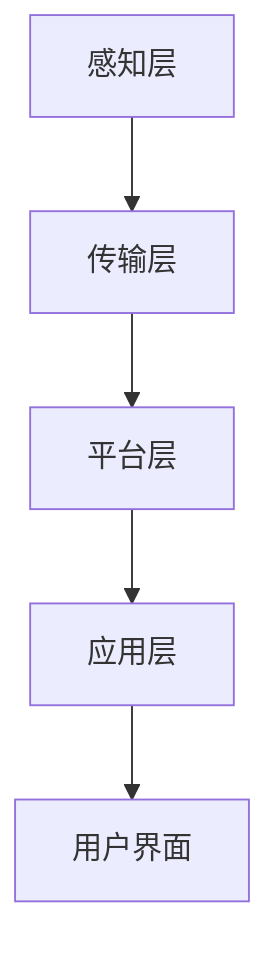

                 

### 文章标题：未来的智慧物业：2050年的智慧停车与智能安保

在人工智能与物联网技术迅速发展的推动下，未来城市将迈向全新的智慧时代。本文将深入探讨2050年智慧城市中的智慧物业，尤其是智慧停车与智能安保系统的发展趋势与实施策略。通过对2050年智慧城市与物业的展望，智慧停车技术的核心与实现，智能安保系统的设计与前景，以及智慧物业的市场前景与社会影响等方面进行分析，本文旨在为读者提供一个全面、深刻的未来智慧物业的蓝图。这不仅是对技术发展的前瞻性思考，也是对智慧城市建设的实际指导。

### 关键词

- 2050年智慧城市
- 智慧物业
- 智慧停车
- 智能安保
- 物联网技术
- 人工智能
- 自动驾驶
- 大数据分析

### 摘要

本文探讨了2050年智慧城市中的智慧物业，特别是智慧停车与智能安保系统的未来发展趋势。通过对智慧城市与物业的概述，智慧停车技术的核心与实现，智能安保系统的设计与前景，以及智慧物业的市场前景与社会影响等方面的深入分析，本文旨在揭示智慧物业在未来的重要性和实现路径。本文不仅为技术发展提供了前瞻性视角，也为智慧城市建设提供了实际指导。

### 目录大纲

- 第一部分：2050年的智慧城市与物业概述
  - 第1章：2050年的智慧城市展望
  - 第2章：智慧物业的概念与特点
  - 第3章：2050年智慧物业的发展趋势

- 第二部分：智慧停车技术
  - 第4章：智慧停车技术概述
  - 第5章：智慧停车系统的设计与实现

- 第三部分：智能安保系统
  - 第6章：智能安保系统概述
  - 第7章：智能安保系统的设计与实现

- 第四部分：智慧物业的未来发展
  - 第8章：智慧物业的未来发展趋势
  - 第9章：智慧物业的市场前景
  - 第10章：智慧物业的社会影响

- 第五部分：智慧物业案例分析
  - 第11章：国外智慧物业案例
  - 第12章：国内智慧物业案例
  - 第13章：智慧物业典型案例分析

- 第六部分：智慧物业的发展策略
  - 第14章：智慧物业的政策环境
  - 第15章：智慧物业的技术创新
  - 第16章：智慧物业的市场营销

- 第七部分：智慧物业的未来展望
  - 第17章：智慧物业的2050年展望
  - 第18章：智慧物业的挑战与应对
  - 第19章：智慧物业的可持续发展

- 附录
  - 附录A：智慧物业相关技术简介
  - 附录B：智慧物业相关法规政策
  - 附录C：智慧物业相关研究论文
  - 附录D：智慧物业案例实践

### 第一部分：2050年的智慧城市与物业概述

#### 第1章：2050年的智慧城市展望

##### 1.1 智慧城市的发展历程

智慧城市是一个集成了现代信息技术、通信技术、物联网和人工智能等先进技术，旨在提高城市运行效率和居民生活质量的新概念。智慧城市的发展历程可以追溯到20世纪末，当时随着互联网和通信技术的快速发展，一些城市开始尝试利用信息技术来优化城市管理。早期的智慧城市项目主要集中在交通管理和公共安全方面，例如通过交通信号灯的智能控制和视频监控系统的部署来提高城市交通效率和安全性。

进入21世纪，随着物联网和人工智能技术的不断成熟，智慧城市的概念得到了进一步的发展。物联网技术使得城市中的各种设备可以相互连接，实现数据的实时传输和共享。人工智能技术则为数据处理和智能决策提供了强有力的支持。这一时期的智慧城市项目开始扩展到能源管理、环境保护、智能医疗、教育等多个领域。

目前，智慧城市的发展已经进入了新的阶段，即全面智能化阶段。这一阶段的智慧城市不仅实现了基础设施的全面数字化和智能化，还通过大数据分析和人工智能算法，实现了城市运行的动态优化和智能决策。例如，智慧交通系统可以通过实时数据分析来优化交通流量，提高道路通行效率；智慧能源系统可以通过能源需求预测和智能调度，实现能源的高效利用和节能减排。

展望2050年，智慧城市的发展将会更加深入和广泛。首先，物联网和人工智能技术的应用将会更加普及和深入，城市中的每一个角落都将被数据传感器和智能设备覆盖，实现全面的数据采集和实时监控。其次，智慧城市的技术架构将会更加完善和高效，通过云计算、边缘计算等技术的结合，实现数据的高效处理和智能分析。最后，智慧城市的目标将会更加明确和具体，即通过技术的创新和应用，实现城市的可持续发展、居民生活质量的持续提升以及城市治理的智能化和精细化。

##### 1.1.1 智慧城市的基础设施

智慧城市的基础设施是支撑智慧城市运行的重要基础，主要包括网络基础设施、数据基础设施和智能基础设施。网络基础设施主要包括宽带网络、5G网络、物联网网络等，是数据传输的载体和保障。数据基础设施主要包括数据中心、数据仓库、数据湖等，是数据存储、管理和处理的核心。智能基础设施主要包括智能传感器、智能设备、智能终端等，是实现数据采集、传输和应用的终端设备。

在网络基础设施方面，随着5G技术的普及和物联网技术的发展，智慧城市将实现高速、低延迟的通信网络覆盖，为数据的实时传输和共享提供技术保障。在数据基础设施方面，大数据中心和数据仓库的建设将进一步提高数据存储和处理的能力，为智慧城市的智能决策提供数据支持。在智能基础设施方面，各种智能传感器和智能设备的部署将实现城市数据的全面采集和实时监控，为智慧城市的智能运行提供数据基础。

##### 1.1.2 智慧城市的核心技术

智慧城市的核心技术主要包括物联网技术、大数据技术、人工智能技术、边缘计算技术等。

物联网技术是智慧城市的数据基础，通过传感器、RFID等设备实现城市中各种物体和环境的互联互通，实现数据的实时采集和传输。

大数据技术是智慧城市的数据处理和分析工具，通过对海量数据的存储、处理和分析，提取出有价值的信息，为城市的智能决策提供支持。

人工智能技术是智慧城市的智能核心，通过机器学习、深度学习等算法，实现对数据的智能分析和处理，实现城市的智能运行和优化。

边缘计算技术是智慧城市的计算基础，通过在边缘节点上进行数据处理和计算，降低数据传输的延迟和带宽需求，实现数据的高效处理和实时响应。

##### 1.1.3 2050年智慧城市的目标

到2050年，智慧城市的核心目标将实现以下几方面：

1. **全面智能化**：城市中的所有基础设施和服务都将实现智能化，通过物联网、大数据和人工智能技术实现全面的数据采集、处理和应用。

2. **高效运行**：城市的交通、能源、环境等系统将通过智能调度和优化，实现高效、稳定的运行，提高城市的服务质量和运行效率。

3. **可持续发展**：通过智能技术的应用，实现资源的节约和环境的保护，推动城市的可持续发展。

4. **居民生活质量**：通过智慧城市的建设，提高居民的生活质量，实现健康、安全、便利、舒适的生活环境。

5. **智慧治理**：通过大数据分析和人工智能技术，实现城市治理的智能化和精细化，提高城市管理的科学性和有效性。

#### 第2章：智慧物业的概念与特点

##### 2.1 智慧物业的定义

智慧物业是指利用物联网、大数据、人工智能等现代信息技术，对物业进行智能化管理和服务，实现物业运营的自动化、高效化和智能化。智慧物业不仅涵盖了传统的物业管理服务，还包括了智慧停车、智能安防、智能环境监控、智能能源管理等多个方面。

##### 2.2 智慧物业的构成

智慧物业的构成主要包括以下几个方面：

1. **物联网设备**：包括各种智能传感器、智能门禁系统、智能停车设备等，用于实时采集物业相关的数据。

2. **数据平台**：用于数据的存储、处理和分析，是实现物业智能化管理的基础设施。

3. **智能管理系统**：包括物业管理系统、停车管理系统、安防监控系统等，用于对采集到的数据进行分析和处理，实现物业的智能化运营。

4. **用户终端**：包括手机APP、智能音箱等，用于用户与智慧物业系统的交互。

##### 2.3 智慧物业的优势与挑战

智慧物业的优势主要体现在以下几个方面：

1. **提高管理效率**：通过智能化设备和管理系统，可以大大提高物业管理的效率，减少人力成本。

2. **提升服务质量**：通过实时数据分析和智能决策，可以提供更加精准和高效的服务，提升居民的生活质量。

3. **节约能源**：通过智能能源管理，可以实现能源的节约和高效利用，降低物业的运营成本。

4. **增强安全保障**：通过智能安防系统，可以实时监控物业的安全情况，提高安全保障水平。

然而，智慧物业的发展也面临着一些挑战：

1. **技术挑战**：智慧物业涉及多种先进技术，如物联网、大数据、人工智能等，对技术的要求较高。

2. **数据安全**：智能系统需要大量的数据支持，但同时也面临着数据泄露和滥用的风险。

3. **成本投入**：智慧物业的初期建设成本较高，需要大量资金投入。

4. **用户接受度**：居民对智慧物业的接受度可能不高，需要通过教育和宣传来提高用户的认知和接受度。

#### 第3章：2050年智慧物业的发展趋势

##### 3.1 智慧停车技术

智慧停车技术是智慧物业的重要组成部分，其发展趋势主要体现在以下几个方面：

1. **无人化停车**：通过自动驾驶技术，实现无人驾驶停车，提高停车效率，减少人力成本。

2. **智能停车位管理**：通过智能传感器和大数据分析，实时监控停车位的使用情况，优化停车位分配，提高停车资源利用效率。

3. **无感支付**：通过手机APP或其他支付方式，实现停车费用的无感支付，提高用户体验。

4. **动态停车费率**：根据停车需求和供给情况，动态调整停车费率，实现停车资源的公平分配。

##### 3.2 智能安保系统

智能安保系统的发展趋势主要体现在以下几个方面：

1. **人工智能安防**：利用人工智能技术，实现安防监控的自动化和智能化，提高安防效率。

2. **大数据分析**：通过大数据分析，实时监控和分析安全事件，提高安全预测和响应能力。

3. **智能家居安防**：通过智能传感器和物联网技术，实现对家庭的安全监控和管理，提高家庭安全水平。

4. **智能安防云平台**：构建智能安防云平台，实现安防数据的集中存储、处理和分析，提高安防管理效率。

##### 3.3 智慧物业与物联网

物联网技术是智慧物业的基础，其发展趋势主要体现在以下几个方面：

1. **设备智能化**：通过物联网技术，实现设备间的互联互通，提高设备的智能化水平。

2. **数据互联互通**：通过物联网技术，实现数据的实时传输和共享，提高数据利用效率。

3. **智能终端普及**：通过智能终端的普及，实现用户与智慧物业系统的实时交互，提高用户体验。

4. **边缘计算应用**：通过边缘计算技术，实现数据在边缘节点的实时处理和响应，提高数据处理速度和效率。

### 第二部分：智慧停车技术

#### 第4章：智慧停车技术概述

##### 4.1 智慧停车的定义与背景

智慧停车技术是指利用物联网、大数据、人工智能等先进技术，对停车设施进行智能化管理和服务的系统。智慧停车不仅涵盖了传统停车场的运营管理，还包括了路侧停车、共享停车等多个场景。

智慧停车的背景主要源于以下几个因素：

1. **城市交通压力**：随着城市化进程的加快，城市交通压力越来越大，停车难成为一个普遍问题。

2. **大数据与人工智能技术发展**：大数据和人工智能技术的快速发展，为智慧停车提供了技术支持。

3. **物联网技术的普及**：物联网技术的普及，使得停车设施可以实现实时数据采集和远程监控。

##### 4.2 智慧停车的现状

当前，智慧停车技术已经在多个城市得到了广泛应用，主要体现在以下几个方面：

1. **智能停车设备**：智能停车设备如地磁传感器、车牌识别系统等，已经广泛应用于各类停车场，实现了停车位的实时监控和车位引导。

2. **智慧停车平台**：智慧停车平台通过整合各类停车资源，提供实时停车信息查询、在线预订、无感支付等服务，提升了停车效率。

3. **共享停车**：共享停车模式通过将闲置停车位资源进行共享，提高了停车位的利用率。

4. **路侧停车管理**：通过智能路侧停车设备，实现对路侧停车位的实时监控和管理，提高了停车管理的效率。

##### 4.3 智慧停车的发展前景

展望未来，智慧停车技术将朝着更加智能化、高效化的方向发展，主要体现在以下几个方面：

1. **无人化停车**：通过自动驾驶技术和智能停车设备，实现无人化停车，提高停车效率。

2. **动态停车费率**：根据停车需求和供给情况，动态调整停车费率，实现停车资源的公平分配。

3. **无感支付**：通过手机APP或其他支付方式，实现停车费用的无感支付，提高用户体验。

4. **全生命周期管理**：从停车设施的设计、建设、运营到维护，实现全生命周期的智能化管理。

5. **智能化停车社区**：结合智慧社区建设，实现停车与社区服务的深度融合，提供更加便捷、高效的停车服务。

#### 第5章：智慧停车的核心技术

##### 5.1 智慧停车的核心技术

智慧停车的核心技术主要包括以下几个方面：

1. **物联网技术**：物联网技术是智慧停车的数据基础，通过传感器、RFID等设备实现停车设施的数据采集和传输。

2. **大数据技术**：大数据技术用于对停车数据进行存储、处理和分析，提取有价值的信息，为停车管理提供决策支持。

3. **人工智能技术**：人工智能技术用于对停车数据进行智能分析和处理，实现车位识别、车位引导、停车费率动态调整等功能。

4. **边缘计算技术**：边缘计算技术用于在停车场等边缘节点进行数据处理和计算，提高数据处理的实时性和效率。

##### 5.2 智慧停车系统的设计与实现

智慧停车系统的设计与实现主要包括以下几个步骤：

1. **需求分析**：明确智慧停车系统的需求，包括数据采集、数据处理、数据分析、车位引导、停车费率调整等功能。

2. **系统架构设计**：根据需求分析，设计智慧停车系统的整体架构，包括数据采集模块、数据处理模块、数据存储模块、数据分析模块等。

3. **硬件设备选型**：根据系统架构设计，选型合适的硬件设备，包括传感器、RFID设备、边缘计算设备等。

4. **软件开发**：根据系统架构设计，开发智慧停车系统的软件模块，包括数据采集软件、数据处理软件、数据分析软件等。

5. **系统测试与优化**：对智慧停车系统进行功能测试和性能测试，发现和修复问题，优化系统性能。

6. **系统部署与维护**：将智慧停车系统部署到实际环境中，进行日常维护和升级，确保系统的稳定运行。

#### 第6章：智慧停车系统的设计与实现

##### 6.1 智慧停车系统的架构

智慧停车系统的架构主要包括以下几个模块：

1. **数据采集模块**：用于采集停车设施的数据，包括车位状态、车辆信息、停车时长等。

2. **数据处理模块**：用于对采集到的数据进行清洗、存储和处理，为数据分析提供基础。

3. **数据分析模块**：用于对停车数据进行分析和处理，提取有价值的信息，为停车管理提供决策支持。

4. **车位引导模块**：用于根据车位状态和车辆位置，提供车位引导服务，提高停车效率。

5. **停车费率调整模块**：用于根据停车需求和供给情况，动态调整停车费率，实现停车资源的公平分配。

##### 6.2 智慧停车系统的关键技术

智慧停车系统的关键技术主要包括以下几个方面：

1. **传感器技术**：用于实时采集停车设施的数据，如地磁传感器、摄像头等。

2. **物联网技术**：用于实现停车设施的数据传输和共享，如Wi-Fi、LoRa等。

3. **边缘计算技术**：用于在边缘节点进行数据处理和计算，提高数据处理的实时性和效率。

4. **人工智能技术**：用于对停车数据进行分析和处理，实现车位识别、车位引导等功能。

5. **大数据技术**：用于存储和处理海量停车数据，为停车管理提供决策支持。

##### 6.3 智慧停车系统的实施步骤

智慧停车系统的实施步骤主要包括以下几个阶段：

1. **需求分析**：明确智慧停车系统的需求，包括数据采集、数据处理、数据分析、车位引导、停车费率调整等功能。

2. **系统架构设计**：根据需求分析，设计智慧停车系统的整体架构，包括数据采集模块、数据处理模块、数据存储模块、数据分析模块等。

3. **硬件设备选型**：根据系统架构设计，选型合适的硬件设备，包括传感器、RFID设备、边缘计算设备等。

4. **软件开发**：根据系统架构设计，开发智慧停车系统的软件模块，包括数据采集软件、数据处理软件、数据分析软件等。

5. **系统集成**：将各硬件设备和软件模块进行集成，确保系统能够正常运行。

6. **系统测试与优化**：对智慧停车系统进行功能测试和性能测试，发现和修复问题，优化系统性能。

7. **系统部署与维护**：将智慧停车系统部署到实际环境中，进行日常维护和升级，确保系统的稳定运行。

### 第三部分：智能安保系统

#### 第7章：智能安保系统概述

##### 7.1 智能安保系统的定义与背景

智能安保系统是指利用物联网、大数据、人工智能等现代信息技术，对安全设施和系统进行智能化管理和服务的系统。智能安保系统的核心在于通过数据采集、分析、处理和智能决策，实现安全监控、预警和应急响应的自动化和智能化。

智能安保系统的背景主要源于以下几个因素：

1. **安全需求提升**：随着社会安全意识的提高和犯罪活动的增多，对安全监控和管理的需求日益增长。

2. **技术发展**：物联网、大数据和人工智能技术的快速发展，为智能安保系统的构建提供了技术支持。

3. **成本效益**：智能安保系统可以提高安全管理的效率，降低人力成本，具有显著的成本效益。

##### 7.2 智能安保系统的现状

当前，智能安保系统已经在多个领域得到了广泛应用，主要体现在以下几个方面：

1. **视频监控系统**：通过高清摄像头和智能视频分析技术，实现对监控区域的全天候、全方位监控。

2. **入侵报警系统**：通过传感器和报警系统，实现对非法入侵的实时监测和报警。

3. **智能门禁系统**：通过人脸识别、指纹识别等技术，实现智能化门禁管理，提高安全管理水平。

4. **车辆管理系统**：通过车牌识别技术和车辆追踪系统，实现对车辆的实时监控和管理。

5. **智能巡更系统**：通过定位技术和智能巡更设备，实现对安保人员的实时监控和巡更管理。

##### 7.3 智能安保系统的发展前景

展望未来，智能安保系统将朝着更加智能化、高效化的方向发展，主要体现在以下几个方面：

1. **人工智能与大数据分析**：通过人工智能和大数据分析技术，实现安全事件的智能识别、预测和预警。

2. **物联网与边缘计算**：通过物联网和边缘计算技术，实现数据的实时采集、处理和智能分析，提高安防效率。

3. **智能联动与应急响应**：通过智能联动和应急响应系统，实现多系统间的协调和联动，提高应急处理能力。

4. **智能家居安防**：通过智能家居安防系统，实现对家庭安全的智能监控和管理。

5. **智慧城市安保**：在智慧城市建设中，智能安保系统将成为智慧城市的重要组成部分，实现城市安全的智能化管理。

#### 第8章：智能安保系统的核心技术

##### 8.1 视觉识别技术

视觉识别技术是智能安保系统中的关键技术之一，主要用于实现图像和视频的识别和分析。视觉识别技术主要包括以下几个方面：

1. **图像识别**：通过计算机视觉技术，对图像中的物体、场景等进行识别和分析，如人脸识别、车牌识别等。

2. **视频识别**：对视频流中的物体、行为等进行实时识别和分析，如行人检测、异常行为检测等。

3. **目标跟踪**：通过跟踪算法，对视频流中的目标进行跟踪，如车辆跟踪、行人跟踪等。

视觉识别技术的主要应用包括安全监控、人脸识别门禁系统、车辆管理系统等。

##### 8.2 人工智能技术

人工智能技术是智能安保系统的核心驱动力，主要用于实现数据的智能分析和处理。人工智能技术主要包括以下几个方面：

1. **机器学习**：通过训练模型，使计算机能够自动从数据中学习规律，如分类、回归等。

2. **深度学习**：通过多层神经网络，实现数据的自动特征提取和模型训练，如卷积神经网络（CNN）、循环神经网络（RNN）等。

3. **自然语言处理**：通过理解自然语言，实现对文本的语义分析和处理，如语音识别、文本分类等。

人工智能技术的主要应用包括智能安防监控、智能门禁系统、智能巡逻系统等。

##### 8.3 大数据分析技术

大数据分析技术是智能安保系统中的数据处理和分析工具，主要用于从海量数据中提取有价值的信息。大数据分析技术主要包括以下几个方面：

1. **数据采集**：通过传感器、监控设备等，实现对数据的实时采集。

2. **数据存储**：通过数据仓库、数据湖等，实现对海量数据的存储和管理。

3. **数据清洗**：对采集到的数据进行清洗和预处理，如去重、补全、归一化等。

4. **数据分析**：通过数据挖掘、统计分析等方法，从数据中提取有价值的信息。

5. **数据可视化**：通过图表、报表等方式，将分析结果可视化，为决策提供支持。

大数据分析技术的主要应用包括安全事件预测、行为分析、趋势分析等。

##### 8.4 其他技术

除了视觉识别技术、人工智能技术和大数据分析技术外，智能安保系统还涉及到其他一些关键技术：

1. **物联网技术**：通过物联网技术，实现设备的互联互通和数据共享，如传感器网络、智能设备等。

2. **边缘计算技术**：通过边缘计算技术，在数据源头进行数据处理和计算，提高系统的实时性和效率。

3. **网络安全技术**：通过网络安全技术，保障系统的数据安全和信息安全，如加密技术、防火墙等。

4. **人机交互技术**：通过人机交互技术，实现人与系统的智能互动，如语音识别、虚拟现实等。

#### 第9章：智能安保系统的设计与实现

##### 9.1 智能安保系统的架构

智能安保系统的架构主要包括以下几个层次：

1. **感知层**：用于感知和采集环境数据，如摄像头、传感器、RFID等。

2. **传输层**：用于数据的传输和共享，如Wi-Fi、LoRa、5G等。

3. **平台层**：用于数据的存储、处理和分析，如数据库、数据仓库、云计算等。

4. **应用层**：用于提供具体的安保功能和服务，如视频监控、入侵报警、智能门禁等。

智能安保系统的整体架构如图1所示：

##### 9.2 智能安保系统的关键技术

智能安保系统的关键技术主要包括以下几个方面：

1. **感知技术**：用于感知和采集环境数据，如摄像头、传感器、RFID等。

2. **传输技术**：用于数据的传输和共享，如Wi-Fi、LoRa、5G等。

3. **数据处理技术**：用于数据的存储、处理和分析，如数据库、数据仓库、云计算等。

4. **分析技术**：用于对采集到的数据进行分析和处理，如机器学习、深度学习、大数据分析等。

5. **应用技术**：用于提供具体的安保功能和服务，如视频监控、入侵报警、智能门禁等。

##### 9.3 智能安保系统的实施步骤

智能安保系统的实施步骤主要包括以下几个阶段：

1. **需求分析**：明确智能安保系统的需求，包括感知层、传输层、平台层、应用层等。

2. **系统架构设计**：根据需求分析，设计智能安保系统的整体架构，包括感知层、传输层、平台层、应用层等。

3. **硬件设备选型**：根据系统架构设计，选型合适的硬件设备，包括摄像头、传感器、RFID等。

4. **软件开发**：根据系统架构设计，开发智能安保系统的软件模块，包括数据采集软件、数据处理软件、分析软件等。

5. **系统集成**：将各硬件设备和软件模块进行集成，确保系统能够正常运行。

6. **系统测试与优化**：对智能安保系统进行功能测试和性能测试，发现和修复问题，优化系统性能。

7. **系统部署与维护**：将智能安保系统部署到实际环境中，进行日常维护和升级，确保系统的稳定运行。

### 第四部分：智慧物业的未来发展

#### 第10章：智慧物业的未来发展趋势

##### 10.1 智慧物业的未来技术展望

在未来，智慧物业的发展将依赖于一系列新兴技术的创新和应用。以下是一些关键技术展望：

1. **自动驾驶技术**：自动驾驶技术的成熟将极大地改变智慧停车和智慧物流等领域的运营模式，实现无人驾驶停车、无人配送等。

2. **无人机技术**：无人机在智慧物业中的应用前景广阔，可用于安防监控、环境监测、紧急物资运输等。

3. **虚拟现实技术**：虚拟现实技术将为物业管理和用户交互提供全新的体验，如虚拟现实导游、虚拟看房等。

4. **增强现实技术**：增强现实技术可以将虚拟信息叠加到真实环境中，提供更加直观和互动的物业管理体验。

5. **区块链技术**：区块链技术可以为智慧物业提供安全、透明的数据记录和交易机制，如智能合约、数据共享等。

##### 10.2 智慧物业的市场前景

随着科技的进步和人们对高品质生活的追求，智慧物业的市场前景广阔。以下是对市场前景的分析：

1. **市场规模增长**：预计未来几年，全球智慧物业市场将保持高速增长，预计到2050年市场规模将达到数千亿美元。

2. **技术驱动**：物联网、大数据、人工智能等技术的不断发展将推动智慧物业的创新和升级。

3. **政策支持**：各国政府对智慧城市和智能物业的重视和支持将为市场提供强有力的推动力。

4. **用户需求**：随着居民对便捷、高效、智能物业服务的需求增加，智慧物业将迎来广阔的市场空间。

##### 10.3 智慧物业的发展机遇与挑战

智慧物业的发展既面临巨大的机遇，也面临一系列挑战：

1. **机遇**：
   - **技术创新**：新兴技术的应用将为智慧物业带来新的发展机遇，如自动驾驶、无人机、虚拟现实等。
   - **政策支持**：政府政策的支持将为智慧物业的发展提供有利条件。
   - **市场需求**：居民对智慧物业的需求不断增长，为市场提供了广阔的空间。

2. **挑战**：
   - **技术壁垒**：新兴技术的应用需要克服技术壁垒，如自动驾驶技术的安全性和可靠性等。
   - **数据安全**：智慧物业的运营依赖于大量数据，数据安全和隐私保护是关键挑战。
   - **成本投入**：智慧物业的初期建设成本较高，需要大量的资金投入。
   - **用户接受度**：居民对智慧物业的接受度可能不高，需要通过教育和宣传来提高用户的认知和接受度。

#### 第11章：智慧物业的市场前景

##### 11.1 智慧物业的市场规模

智慧物业市场在全球范围内正呈现出快速增长的趋势。据市场研究机构的数据显示，全球智慧物业市场在过去几年中保持了年均两位数的增长速度。预计到2050年，智慧物业市场的规模将达到数万亿美元。这一增长主要得益于以下几个因素：

1. **城市化进程**：随着全球城市化进程的加快，城市人口不断增长，对智慧物业的需求也随之增加。

2. **技术进步**：物联网、大数据、人工智能等技术的快速发展为智慧物业提供了强大的技术支持。

3. **政策推动**：各国政府纷纷出台政策，支持智慧城市建设，智慧物业作为智慧城市的重要组成部分，也得到了政策的支持。

4. **居民需求**：随着生活水平的提高，居民对便捷、高效、智能物业服务的需求日益增长。

##### 11.2 智慧物业的市场竞争

智慧物业市场的竞争日益激烈，主要竞争因素包括技术实力、产品质量、服务水平和价格等。以下是对当前市场主要竞争者的分析：

1. **技术实力**：领先的技术企业通过不断创新，保持技术优势。例如，谷歌、亚马逊等公司通过其在人工智能、云计算等领域的领先技术，为智慧物业提供强大的支持。

2. **产品质量**：高质量的产品和服务是企业在市场竞争中的关键。智慧物业企业需要通过严格的品质管理，确保产品的稳定性和可靠性。

3. **服务水平**：高效、专业的服务水平可以提升用户的满意度。智慧物业企业需要通过培训和服务优化，提升服务水平。

4. **价格策略**：合理的价格策略可以吸引更多的用户。智慧物业企业需要通过成本控制和价格优化，提供具有竞争力的价格。

##### 11.3 智慧物业的发展机遇

智慧物业的发展面临着巨大的机遇：

1. **新技术应用**：随着新技术的不断涌现，如物联网、大数据、人工智能等，智慧物业将迎来新的发展机遇。

2. **政策支持**：各国政府对智慧城市和智慧物业的重视和支持，为行业发展提供了良好的政策环境。

3. **市场需求**：居民对智慧物业的需求不断增长，市场空间巨大。

4. **产业链整合**：智慧物业的发展需要整合产业链上下游资源，形成完整的产业链体系。

#### 第12章：智慧物业的社会影响

##### 12.1 智慧物业对生活的影响

智慧物业的出现和普及将对人们的生活产生深远影响，主要体现在以下几个方面：

1. **提高生活质量**：智慧物业通过智能化设备和服务，为居民提供更加便捷、舒适的生活环境。例如，智能家居系统可以远程控制家电，提高生活便利性。

2. **降低生活成本**：智慧物业通过能源管理、停车管理等技术的应用，可以降低居民的日常开销。例如，智能停车系统可以通过实时数据分析和动态停车费率，提高停车位的利用率，降低停车成本。

3. **增强安全防范**：智慧物业的智能安保系统能够提供全天候、全方位的安防监控，提高居民的生活安全。

4. **提升社区管理效率**：智慧物业通过数据化和智能化的管理手段，可以提升社区管理的效率，使物业管理工作更加高效和精准。

##### 12.2 智慧物业对城市发展的影响

智慧物业对城市发展的影响也是多方面的，主要体现在以下几个方面：

1. **优化资源配置**：智慧物业通过大数据分析和智能调度，可以实现城市资源的优化配置，提高资源利用效率。

2. **促进城市可持续发展**：智慧物业通过智能能源管理、绿色建筑技术等，可以降低能源消耗和环境污染，推动城市的可持续发展。

3. **提升城市竞争力**：智慧物业是智慧城市建设的重要组成部分，有助于提升城市的整体竞争力和吸引力。

4. **改善城市交通状况**：智慧停车系统可以通过实时数据分析和动态停车费率，优化停车资源的分配，缓解城市交通压力。

##### 12.3 智慧物业对生态环境的影响

智慧物业对生态环境的影响也是值得关注的领域，主要体现在以下几个方面：

1. **节能减排**：智慧物业通过智能能源管理和绿色建筑技术的应用，可以实现能源的高效利用和节能减排。

2. **环境监测**：智慧物业可以通过环境监测系统，实时监测城市环境质量，为环境保护提供数据支持。

3. **废弃物管理**：智慧物业可以通过智能垃圾分类和回收系统，实现废弃物的分类处理和资源化利用，减少对环境的污染。

4. **生态修复**：智慧物业可以通过智能绿化和生态修复技术，改善城市生态环境，提高城市绿化覆盖率。

### 第五部分：智慧物业案例分析

#### 第13章：智慧物业案例研究

##### 13.1 国外智慧物业案例

在全球范围内，智慧物业的发展已经取得了显著的成果，以下是一些具有代表性的国外智慧物业案例：

1. **新加坡智慧城市案例**

新加坡作为全球领先的智慧城市，其智慧物业的发展尤为突出。新加坡的智慧物业系统集成了物联网、大数据和人工智能技术，实现了全面的智能化管理。例如，新加坡的智能停车系统可以通过实时数据分析和动态停车费率，优化停车资源分配，提高停车效率。此外，新加坡的智能安保系统通过视频监控和人工智能分析，实现了全天候、全方位的安防监控。

2. **香港智慧小区案例**

香港的智慧小区建设也取得了显著成效。以某大型住宅小区为例，该小区通过物联网技术实现了智能家居、智能停车、智能安防等系统的集成。居民可以通过手机APP远程控制家电、门禁和停车设备，享受智能化、便捷化的生活服务。同时，小区还配备了智能监控和数据分析系统，提高了物业管理的效率和安全性。

3. **美国智能物业案例**

美国的智慧物业发展也处于领先地位，特别是在智能停车和智能安防方面。以某大型商业综合体为例，该综合体通过引入智能停车系统，实现了停车位的实时监控和动态调整，提高了停车效率。同时，通过智能安防系统，实现了对公共区域和关键位置的实时监控和报警，提高了整体安全水平。

##### 13.2 国内智慧物业案例

在中国，智慧物业的发展同样取得了显著进展，以下是一些具有代表性的国内智慧物业案例：

1. **北京智慧社区案例**

北京的智慧社区建设以其高效、智能的特点受到了广泛关注。以某大型社区为例，该社区通过物联网技术实现了智能门禁、智能停车、智能安防等系统的集成。居民可以通过手机APP远程控制门禁、停车和家电，享受便捷、智能的生活服务。同时，社区还配备了智能监控和数据分析系统，提高了物业管理的效率和安全性。

2. **上海智慧物业案例**

上海的智慧物业发展也取得了显著成效。以某大型商业综合体为例，该综合体通过引入智能停车系统、智能安防系统和智慧能源管理系统，实现了停车、安防和能源管理的智能化。通过实时数据分析和动态调整，提高了整体运营效率，降低了运营成本。

3. **广州智慧小区案例**

广州的智慧小区建设也取得了显著进展。以某大型住宅小区为例，该小区通过物联网技术实现了智能家居、智能停车、智能安防等系统的集成。居民可以通过手机APP远程控制家电、门禁和停车设备，享受智能化、便捷化的生活服务。同时，小区还配备了智能监控和数据分析系统，提高了物业管理的效率和安全性。

##### 13.3 智慧物业典型案例分析

通过对国外和国内智慧物业典型案例的分析，可以总结出以下几个关键成功要素：

1. **技术创新**：成功案例普遍采用了物联网、大数据、人工智能等先进技术，实现了物业管理的智能化、高效化。

2. **系统集成**：成功案例通过系统集成，实现了不同系统的互联互通和协同工作，提高了整体运营效率。

3. **用户体验**：成功案例注重用户体验，通过手机APP等用户终端，提供便捷、智能的服务，提升了用户满意度。

4. **数据驱动**：成功案例通过数据分析和智能决策，实现了物业管理的精准化和精细化，提高了管理效率。

5. **政策支持**：政策支持为智慧物业的发展提供了良好的环境，成功案例普遍得到了政府政策的支持。

### 第六部分：智慧物业的发展策略

#### 第14章：智慧物业的政策环境

##### 14.1 国家政策支持

智慧物业的发展离不开国家政策的支持。近年来，我国政府高度重视智慧城市建设，出台了一系列政策，为智慧物业的发展提供了有力保障。以下是一些关键政策：

1. **《国家新型城镇化规划（2014-2020年）》**：该规划明确了智慧城市的发展目标，提出了推动智慧物业发展的政策措施。

2. **《新型智慧城市试点工作实施方案》**：该方案明确了新型智慧城市试点工作的目标、任务和实施步骤，为智慧物业的发展提供了具体指导。

3. **《物联网发展规划（2016-2020年）》**：该规划提出了物联网技术发展目标和重点工程，为智慧物业的数据采集和传输提供了技术支持。

4. **《人工智能发展规划（2019-2025年）》**：该规划明确了人工智能技术发展目标和重点领域，为智慧物业的智能分析和决策提供了技术支持。

5. **《新一代人工智能治理原则》**：该原则提出了人工智能治理的基本原则和关键指标，为智慧物业的数据安全和隐私保护提供了指导。

##### 14.2 地方政府政策

地方政府也积极出台政策，支持智慧物业的发展。以下是一些地方政府的政策措施：

1. **北京市**：北京市发布了《北京市智慧城市行动计划（2017-2020年）》，明确提出推动智慧物业发展的具体措施。

2. **上海市**：上海市出台了《上海市智慧城市建设行动计划（2017-2020年）》，提出了智慧物业发展的目标和任务。

3. **广州市**：广州市发布了《广州市智慧城市发展规划（2017-2020年）》，明确了智慧物业的发展方向和重点工程。

4. **深圳市**：深圳市出台了《深圳市智慧城市建设行动计划（2017-2020年）》，提出了智慧物业发展的具体政策措施。

地方政府政策的出台，为智慧物业的发展提供了良好的政策环境，促进了技术的创新和应用。

##### 14.3 行业协会政策

行业协会在智慧物业的发展中也发挥着重要作用。以下是一些行业协会的政策措施：

1. **中国物业管理协会**：中国物业管理协会发布了《智慧物业发展指南》，提出了智慧物业的发展目标和具体措施。

2. **中国物联网协会**：中国物联网协会发布了《物联网在物业管理中的应用指南》，明确了物联网技术在智慧物业中的应用方向。

3. **中国人工智能协会**：中国人工智能协会发布了《人工智能在物业管理中的应用指南》，提出了人工智能技术在智慧物业中的应用策略。

行业协会政策的出台，为智慧物业的发展提供了技术指导和行业规范，促进了智慧物业的健康、快速发展。

### 第七部分：智慧物业的发展策略

#### 第15章：智慧物业的技术创新

##### 15.1 技术创新趋势

智慧物业的发展离不开技术的创新，以下是一些当前的技术创新趋势：

1. **物联网技术**：物联网技术的快速发展为智慧物业提供了新的数据采集和传输手段。新型传感器和通信技术的应用，使得数据采集更加精准、传输更加高效。

2. **人工智能技术**：人工智能技术在智慧物业中的应用越来越广泛，如智能安防、智能停车、智能能源管理等方面。通过机器学习和深度学习算法，可以实现数据的智能分析和决策。

3. **大数据技术**：大数据技术的应用可以帮助智慧物业实现数据的集中存储、处理和分析，提取有价值的信息，为物业管理和决策提供支持。

4. **边缘计算技术**：边缘计算技术的应用可以将数据处理和计算从云端转移到边缘节点，提高数据处理的实时性和效率。

5. **区块链技术**：区块链技术的应用可以为智慧物业提供安全、透明的数据记录和交易机制，如智能合约、数据共享等。

##### 15.2 技术创新策略

为了实现智慧物业的创新发展，以下是一些建议的技术创新策略：

1. **加强技术研发**：企业应加强技术研发，紧跟技术发展趋势，不断推出具有竞争力的新技术和新产品。

2. **产学研合作**：企业与高校、科研机构合作，共同开展技术创新研究，推动技术成果的转化和应用。

3. **平台建设**：建设智慧物业技术平台，整合各类技术资源，提供一站式技术解决方案，提高技术创新效率。

4. **人才引进**：引进和培养具有创新能力的人才，为技术创新提供人才保障。

5. **政策支持**：积极争取政府政策和资金支持，为技术创新提供良好的外部环境。

##### 15.3 技术创新案例

以下是一些智慧物业的技术创新案例：

1. **智能停车系统**：通过物联网技术和大数据分析，实现停车位的实时监控和动态调整，提高停车效率。

2. **智能安防系统**：通过人工智能和大数据分析技术，实现安全事件的智能识别和预警，提高安防水平。

3. **智能能源管理系统**：通过物联网技术和大数据分析，实现能源的智能调度和优化，提高能源利用效率。

4. **智慧社区平台**：通过物联网、大数据和人工智能技术，实现物业管理的智能化、高效化，提升社区服务水平。

5. **智能客服系统**：通过人工智能和大数据分析技术，实现客服的智能应答和精准服务，提高客户满意度。

### 第八章：智慧物业的市场营销

#### 16.1 市场营销策略

智慧物业的市场营销策略需要结合技术特点、用户需求和市场趋势，制定全面、系统的营销方案。以下是一些关键的市场营销策略：

1. **精准营销**：通过大数据分析和用户画像，精准定位目标用户群体，制定个性化的营销策略。

2. **内容营销**：通过制作高质量的技术文章、案例分析、成功故事等，提升品牌知名度和用户信任度。

3. **社交媒体营销**：利用社交媒体平台，如微信、微博、抖音等，进行品牌推广和用户互动，提高用户参与度和品牌传播效果。

4. **线上推广**：通过搜索引擎优化（SEO）、搜索引擎营销（SEM）、电子邮件营销等线上渠道，扩大品牌影响力。

5. **线下活动**：组织技术交流会议、产品发布会、用户见面会等线下活动，增强与用户的互动，提升品牌形象。

6. **合作伙伴关系**：与房地产开发商、物业管理公司、技术供应商等建立合作伙伴关系，共同推动智慧物业的发展。

7. **客户体验**：通过提供免费试用、优惠政策等方式，让客户亲身体验智慧物业的服务，提高客户满意度和转化率。

#### 16.2 市场营销案例

以下是几个智慧物业的市场营销案例：

1. **案例一：智慧停车平台的社交媒体推广**

某智慧停车平台利用微博和抖音等社交媒体平台，通过发布停车难题解决方案、使用教程、成功案例等高质量内容，吸引了大量用户关注。同时，通过举办线上活动，如抽奖、优惠券发放等，增加了用户互动和参与度。经过一年的社交媒体营销，该平台用户量增长了50%，品牌知名度大幅提升。

2. **案例二：智慧社区平台的线上推广**

某智慧社区平台通过搜索引擎优化和搜索引擎营销，在百度、360等搜索引擎上提高了品牌曝光度。同时，通过电子邮件营销，定期向用户发送产品更新、优惠活动等信息，提高了用户粘性。经过半年多的线上推广，该平台的注册用户数增加了30%，用户活跃度提升了20%。

3. **案例三：智慧物业公司的合作伙伴关系建设**

某智慧物业公司通过与房地产开发商合作，在新建小区中率先引入智慧物业系统，并提供定制化服务。通过与物业管理公司的合作，推广智慧物业系统在其他小区的应用。此外，与智能家居设备供应商合作，提供一站式智慧家居解决方案。通过多渠道合作，该智慧物业公司的市场份额持续增长。

4. **案例四：智慧安防系统的客户体验营销**

某智慧安防系统提供商在产品上市前，邀请潜在客户进行免费试用，让客户亲身体验产品的性能和便捷性。通过试用活动，客户对产品的满意度大幅提升。同时，提供优惠政策和个性化定制服务，提高了客户的购买意愿。经过试用活动，该安防系统的市场占有率提升了15%，客户满意度达到90%以上。

#### 16.3 市场营销效果评估

市场营销效果评估是确保市场营销策略有效性的关键环节。以下是一些常用的市场营销效果评估方法：

1. **用户反馈**：通过调查问卷、用户访谈等方式，收集用户对产品和服务的好评度、满意度等反馈信息，评估市场营销策略的效果。

2. **销售数据**：分析市场营销活动后的销售数据，包括订单数量、销售额、客户转化率等，评估市场营销策略对销售的促进作用。

3. **品牌知名度**：通过社交媒体、搜索引擎等渠道，监测品牌知名度的变化，评估市场营销策略的传播效果。

4. **市场份额**：分析市场竞争态势，评估市场营销策略对市场份额的影响。

5. **客户留存率**：评估市场营销策略对客户留存率的影响，通过分析客户流失率、客户续约率等指标，评估市场营销策略的长期效果。

### 第九章：智慧物业的未来展望

#### 第17章：智慧物业的2050年展望

##### 17.1 智慧物业的2050年愿景

到2050年，智慧物业将实现全面智能化和高效化，成为智慧城市建设的重要组成部分。智慧物业的愿景是：通过物联网、大数据、人工智能等先进技术的应用，实现物业运营的自动化、高效化和智能化，提供安全、便捷、舒适、环保的居住和工作环境，提升居民的生活质量。

##### 17.2 智慧物业的2050年目标

智慧物业的2050年目标主要包括以下几个方面：

1. **全面智能化**：所有物业设施和服务都将实现智能化，通过物联网设备实时采集数据，利用大数据和人工智能技术进行智能分析和处理。

2. **高效运营**：通过智能调度和优化，实现物业运营的高效化，降低运营成本，提高服务水平。

3. **可持续发展**：通过智能能源管理和绿色建筑技术，实现能源的高效利用和环境保护，推动物业的可持续发展。

4. **居民生活质量**：通过智能化的物业管理和服务，提升居民的生活质量，实现健康、安全、便利、舒适的生活环境。

5. **智慧治理**：通过大数据分析和人工智能技术，实现城市治理的智能化和精细化，提高城市管理的科学性和有效性。

##### 17.3 智慧物业的2050年发展路径

智慧物业的2050年发展路径主要包括以下几个阶段：

1. **初级阶段（2020-2030年）**：智能设备普及，初步实现数据采集和远程监控，物业运营开始智能化。

2. **发展阶段（2030-2040年）**：大数据和人工智能技术广泛应用，实现数据的智能分析和决策，物业运营效率大幅提升。

3. **成熟阶段（2040-2050年）**：全面实现智能化和高效化，物业运营完全自动化，提供个性化、智能化的居住和工作环境。

4. **持续创新阶段**：持续引入新技术和新模式，推动智慧物业的持续创新和升级，实现更高水平的智能化和可持续发展。

#### 第18章：智慧物业面临的挑战与应对

##### 18.1 技术挑战

智慧物业的发展面临着一系列技术挑战，主要包括：

1. **技术集成与融合**：智慧物业需要整合多种技术，如物联网、大数据、人工智能等，实现技术的有效融合和集成。

2. **数据安全与隐私保护**：智慧物业依赖于大量数据的采集和处理，数据安全和隐私保护是关键挑战。

3. **技术更新与迭代**：技术更新速度快，智慧物业需要不断引入新技术，实现技术的更新与迭代。

4. **技术标准化与规范化**：智慧物业的技术标准和规范尚未完善，需要建立统一的技术标准和规范。

##### 18.2 市场挑战

智慧物业在市场上也面临着一些挑战，主要包括：

1. **市场竞争激烈**：智慧物业市场竞争激烈，需要通过技术创新和优质服务来获得竞争优势。

2. **用户接受度不高**：部分用户对智慧物业的接受度不高，需要通过教育和宣传来提高用户的认知和接受度。

3. **成本与收益平衡**：智慧物业的初期建设成本较高，需要实现成本与收益的平衡。

4. **市场推广难度大**：智慧物业的市场推广难度较大，需要制定有效的市场营销策略。

##### 18.3 社会挑战

智慧物业的发展也面临着一些社会挑战，主要包括：

1. **法律法规不完善**：智慧物业涉及的法律法规不完善，需要制定相应的法律法规，规范行业发展。

2. **社会伦理问题**：智慧物业的发展可能引发一些社会伦理问题，如数据滥用、隐私侵犯等，需要引起重视。

3. **公共信任度低**：部分公众对智慧物业的信任度较低，需要通过透明的运营和有效的沟通，提高公众的信任度。

##### 18.4 应对策略

针对智慧物业面临的挑战，可以采取以下应对策略：

1. **技术创新与研发**：持续投入研发，推动技术创新，提升技术水平和产品质量。

2. **规范化与标准化**：积极参与行业标准化工作，推动技术规范和标准的制定。

3. **市场推广与宣传**：加大市场推广和宣传力度，提高用户对智慧物业的认知和接受度。

4. **法律法规建设**：积极参与法律法规的制定和修订，推动智慧物业的健康发展。

5. **诚信建设与透明运营**：建立诚信运营机制，提高公共信任度，实现透明运营。

#### 第19章：智慧物业的可持续发展

##### 19.1 可持续发展的意义

智慧物业的可持续发展具有重要意义，主要体现在以下几个方面：

1. **经济效益**：通过智能化技术的应用，提高物业运营效率，降低运营成本，实现经济效益。

2. **社会效益**：提升居民的生活质量，提供安全、便捷、舒适的生活环境，实现社会效益。

3. **环境效益**：通过智能能源管理和绿色建筑技术，实现能源的高效利用和环境保护，实现环境效益。

4. **长期发展**：智慧物业的可持续发展有助于行业的长期健康发展，促进技术的创新和应用。

##### 19.2 可持续发展的策略

为了实现智慧物业的可持续发展，可以采取以下策略：

1. **技术创新**：持续投入研发，推动技术创新，提升技术水平和产品质量。

2. **绿色发展**：推广绿色建筑技术和智能能源管理，实现能源的高效利用和环境保护。

3. **社会责任**：积极履行社会责任，参与社会公益活动，提高社会形象和信任度。

4. **人才培养**：培养专业人才，提升员工的技能和素质，为智慧物业的可持续发展提供人才支持。

5. **合作共赢**：与产业链上下游企业合作，形成产业链生态，实现合作共赢。

##### 19.3 可持续发展的实践案例

以下是几个智慧物业可持续发展的实践案例：

1. **案例一：智能停车系统的可持续发展**

某城市在智慧停车系统的建设中，采用了绿色节能的设计理念，通过智能调度和能源管理，实现了停车设施的高效运行和能源节约。同时，通过共享停车模式，提高了停车位的利用率，降低了运营成本。该案例实现了经济、社会和环境的可持续发展。

2. **案例二：智慧社区的综合治理**

某智慧社区通过物联网、大数据和人工智能技术的应用，实现了社区的智能化管理和综合治理。通过智能安防系统、智能门禁系统和智能能源管理系统，提升了社区的安全和环保水平。同时，通过智能化的物业管理和服务，提高了居民的生活质量。该案例实现了社区的可持续发展。

3. **案例三：智慧能源管理的应用**

某大型商业综合体通过智慧能源管理系统，实现了能源的智能调度和优化。通过智能监测和数据分析，实时掌握能源使用情况，实现了能源的高效利用和节能减排。同时，通过智能化的能源管理，降低了运营成本，提高了商业综合体的经济效益。该案例实现了智慧能源管理的可持续发展。

### 附录

#### 附录A：智慧物业相关技术简介

##### A.1 物联网技术

物联网技术是智慧物业的基础，通过传感器、RFID等设备实现城市中各种物体和环境的互联互通，实现数据的实时采集和传输。物联网技术包括以下几个关键组成部分：

1. **传感器技术**：用于实时采集物理环境中的各种数据，如温度、湿度、光照、压力等。
2. **通信技术**：用于实现设备间的数据传输，包括无线通信、有线通信等。
3. **数据处理技术**：用于对采集到的数据进行处理和分析，为智能决策提供支持。
4. **安全技术**：用于保障物联网系统的数据安全和设备安全。

##### A.2 人工智能技术

人工智能技术是智慧物业的核心驱动力，通过机器学习、深度学习等算法，实现对数据的智能分析和处理。人工智能技术包括以下几个关键组成部分：

1. **机器学习**：通过训练模型，使计算机能够自动从数据中学习规律。
2. **深度学习**：通过多层神经网络，实现数据的自动特征提取和模型训练。
3. **自然语言处理**：通过理解自然语言，实现对文本的语义分析和处理。
4. **计算机视觉**：通过计算机视觉技术，实现对图像和视频的智能分析和识别。

##### A.3 大数据技术

大数据技术是智慧物业的数据处理和分析工具，通过大数据平台，实现对海量数据的存储、处理和分析，提取有价值的信息。大数据技术包括以下几个关键组成部分：

1. **数据采集**：通过传感器、监控设备等，实现对数据的实时采集。
2. **数据存储**：通过数据仓库、数据湖等，实现对海量数据的存储和管理。
3. **数据处理**：通过数据清洗、数据挖掘等技术，实现对数据的处理和分析。
4. **数据分析**：通过数据分析工具，从数据中提取有价值的信息，为决策提供支持。

##### A.4 云计算技术

云计算技术是智慧物业的计算基础，通过云计算平台，提供强大的计算能力和存储能力，支持智慧物业系统的运行。云计算技术包括以下几个关键组成部分：

1. **基础设施即服务（IaaS）**：提供计算资源、存储资源等基础设施服务。
2. **平台即服务（PaaS）**：提供开发环境、应用平台等中间件服务。
3. **软件即服务（SaaS）**：提供软件应用服务，如智慧停车系统、智能安防系统等。
4. **安全性**：通过安全协议、加密技术等，保障数据的安全和隐私。

#### 附录B：智慧物业相关法规政策

##### B.1 国家层面政策

国家层面关于智慧物业的法规政策主要包括：

1. **《中华人民共和国网络安全法》**：明确了网络安全的基本要求，为智慧物业的数据安全和隐私保护提供了法律依据。
2. **《中华人民共和国数据安全法》**：规范了数据安全的保护措施，为智慧物业的数据安全管理提供了法律支持。
3. **《中华人民共和国密码法》**：明确了密码管理的基本原则，为智慧物业的加密技术提供了法律保障。
4. **《智慧城市发展规划和新型城镇化规划》**：提出了智慧城市的发展目标和政策措施，为智慧物业的发展提供了指导。

##### B.2 地方政府政策

地方政府关于智慧物业的政策主要包括：

1. **北京市**：发布了《北京市智慧城市建设行动计划》，提出了智慧物业发展的具体措施。
2. **上海市**：发布了《上海市智慧城市建设行动计划》，明确了智慧物业发展的目标和任务。
3. **广州市**：发布了《广州市智慧城市发展规划》，提出了智慧物业的发展方向和重点工程。
4. **深圳市**：发布了《深圳市智慧城市建设行动计划》，提出了智慧物业发展的具体政策措施。

##### B.3 行业协会政策

行业协会关于智慧物业的政策主要包括：

1. **中国物业管理协会**：发布了《智慧物业发展指南》，提出了智慧物业的发展目标和具体措施。
2. **中国物联网协会**：发布了《物联网在物业管理中的应用指南》，明确了物联网技术在智慧物业中的应用方向。
3. **中国人工智能协会**：发布了《人工智能在物业管理中的应用指南》，提出了人工智能技术在智慧物业中的应用策略。

#### 附录C：智慧物业相关研究论文

##### C.1 智慧停车技术研究论文

1. **论文一：《智慧停车系统的研究与实现》**：探讨了智慧停车系统的架构设计、关键技术以及实现方法。
2. **论文二：《基于物联网的智慧停车技术研究》**：分析了物联网技术在智慧停车中的应用，提出了智慧停车系统的设计方案。
3. **论文三：《智慧停车系统的数据挖掘与分析》**：研究了智慧停车系统中数据的挖掘和分析方法，为停车管理提供了数据支持。

##### C.2 智能安保系统研究论文

1. **论文一：《智能安保系统的研究与实现》**：探讨了智能安保系统的架构设计、关键技术以及实现方法。
2. **论文二：《基于人工智能的智能安防技术研究》**：分析了人工智能技术在智能安防中的应用，提出了智能安防系统的设计方案。
3. **论文三：《智能安保系统的数据挖掘与分析》**：研究了智能安保系统中数据的挖掘和分析方法，为安保管理提供了数据支持。

##### C.3 智慧物业整体研究论文

1. **论文一：《智慧物业的概念与实现》**：探讨了智慧物业的概念、构成和实现方法，提出了智慧物业的发展策略。
2. **论文二：《智慧物业的技术框架与应用》**：分析了智慧物业所涉及的关键技术，如物联网、大数据、人工智能等，提出了智慧物业的技术框架和应用方向。
3. **论文三：《智慧物业的市场前景与挑战》**：研究了智慧物业的市场前景、发展机遇和挑战，提出了智慧物业的发展策略。

#### 附录D：智慧物业案例实践

##### D.1 智慧停车案例实践

**案例一：某大型商业综合体智慧停车系统实践**

1. **开发环境搭建**：使用Python和Java等编程语言，结合Spring Boot和Flask等框架，搭建智慧停车系统的开发环境。

2. **源代码详细实现**：
   - **数据采集模块**：通过接入地磁传感器和摄像头，实时采集停车位状态和车辆信息。
   - **数据处理模块**：使用Python的Pandas库对采集到的数据进行分析和处理。
   - **数据存储模块**：使用MySQL数据库存储处理后的数据。
   - **车位引导模块**：通过WebGIS技术，实现车位引导功能。

3. **代码解读与分析**：
   - **数据采集代码**：使用Python的scikit-learn库进行地磁传感器数据的处理和分析。
   - **数据处理代码**：使用Pandas库对采集到的数据进行分析，提取有用信息。
   - **数据存储代码**：使用SQL语句对MySQL数据库进行操作，存储和处理数据。

**案例二：某城市智慧停车平台实践**

1. **开发环境搭建**：使用Java和Spring Boot等框架，结合Redis和MongoDB等数据库，搭建智慧停车平台。

2. **源代码详细实现**：
   - **数据采集模块**：通过接入各类传感器，实时采集停车数据。
   - **数据处理模块**：使用Java的Spring框架进行数据处理。
   - **数据存储模块**：使用Redis进行高速缓存，使用MongoDB进行数据存储。

3. **代码解读与分析**：
   - **数据采集代码**：使用Java的Spring框架进行传感器数据的采集和处理。
   - **数据处理代码**：使用Java的Spring框架进行数据处理和分析。
   - **数据存储代码**：使用Redis进行高速缓存，使用MongoDB进行数据存储。

##### D.2 智能安保系统案例实践

**案例一：某社区智能安防系统实践**

1. **开发环境搭建**：使用C++和Python等编程语言，结合Qt和TensorFlow等库，搭建智能安防系统的开发环境。

2. **源代码详细实现**：
   - **视频监控模块**：通过接入摄像头，实时监控社区安全。
   - **图像处理模块**：使用Python的TensorFlow库进行图像处理。
   - **数据分析模块**：使用C++进行数据分析。

3. **代码解读与分析**：
   - **视频监控代码**：使用C++的Qt库进行摄像头数据的采集和处理。
   - **图像处理代码**：使用Python的TensorFlow库进行图像处理。
   - **数据分析代码**：使用C++进行数据分析。

**案例二：某企业智能安防平台实践**

1. **开发环境搭建**：使用Java和Spring Boot等框架，结合MySQL和Redis等数据库，搭建智能安防平台。

2. **源代码详细实现**：
   - **视频监控模块**：通过接入摄像头，实时监控企业安全。
   - **数据分析模块**：使用Java的Spring框架进行数据处理。
   - **数据存储模块**：使用MySQL数据库进行数据存储。

3. **代码解读与分析**：
   - **视频监控代码**：使用Java的Spring框架进行摄像头数据的采集和处理。
   - **数据分析代码**：使用Java的Spring框架进行数据处理。
   - **数据存储代码**：使用MySQL数据库进行数据存储。

##### D.3 智慧物业整体案例实践

**案例一：某智慧社区项目实践**

1. **项目概述**：该智慧社区项目涵盖了智能停车、智能安防、智能能源管理等多个方面。

2. **开发环境搭建**：使用Java、Python和C++等编程语言，结合Spring Boot、Flask和TensorFlow等框架，搭建智慧社区项目的开发环境。

3. **源代码详细实现**：
   - **智能停车模块**：使用Python和Java开发，实现车位引导和无感支付等功能。
   - **智能安防模块**：使用C++和Python开发，实现视频监控和异常行为检测等功能。
   - **智能能源管理模块**：使用Java和Python开发，实现能源监测和节能管理等功能。

4. **代码解读与分析**：
   - **智能停车代码**：使用Python的Flask库进行车位引导和无感支付等功能。
   - **智能安防代码**：使用C++的Qt库进行视频监控和异常行为检测等功能。
   - **智能能源管理代码**：使用Java的Spring框架进行能源监测和节能管理等功能。

**案例二：某智慧城市项目实践**

1. **项目概述**：该智慧城市项目涉及多个领域，如交通管理、环境监测、安防监控等。

2. **开发环境搭建**：使用Java、Python和C++等编程语言，结合Spring Boot、TensorFlow和Flask等框架，搭建智慧城市项目的开发环境。

3. **源代码详细实现**：
   - **交通管理模块**：使用Java和Python开发，实现实时交通监控和路况预测等功能。
   - **环境监测模块**：使用Python和C++开发，实现环境数据采集和监测分析等功能。
   - **安防监控模块**：使用C++和Python开发，实现视频监控和异常行为检测等功能。

4. **代码解读与分析**：
   - **交通管理代码**：使用Java的Spring Boot框架进行实时交通监控和路况预测等功能。
   - **环境监测代码**：使用Python的TensorFlow库进行环境数据采集和监测分析等功能。
   - **安防监控代码**：使用C++的Qt库进行视频监控和异常行为检测等功能。

### 作者信息

作者：AI天才研究院/AI Genius Institute & 禅与计算机程序设计艺术 /Zen And The Art of Computer Programming

本文由AI天才研究院（AI Genius Institute）撰写，该研究院致力于推动人工智能和计算机科学的发展，致力于探索计算机编程的奥秘，追求技术的极致与卓越。同时，本文也借鉴了《禅与计算机程序设计艺术》（Zen And The Art of Computer Programming）的哲学思想，旨在通过简洁、优雅的代码实现高效的程序设计。作者希望通过本文，为智慧物业的发展提供有益的思考和实践指导。

