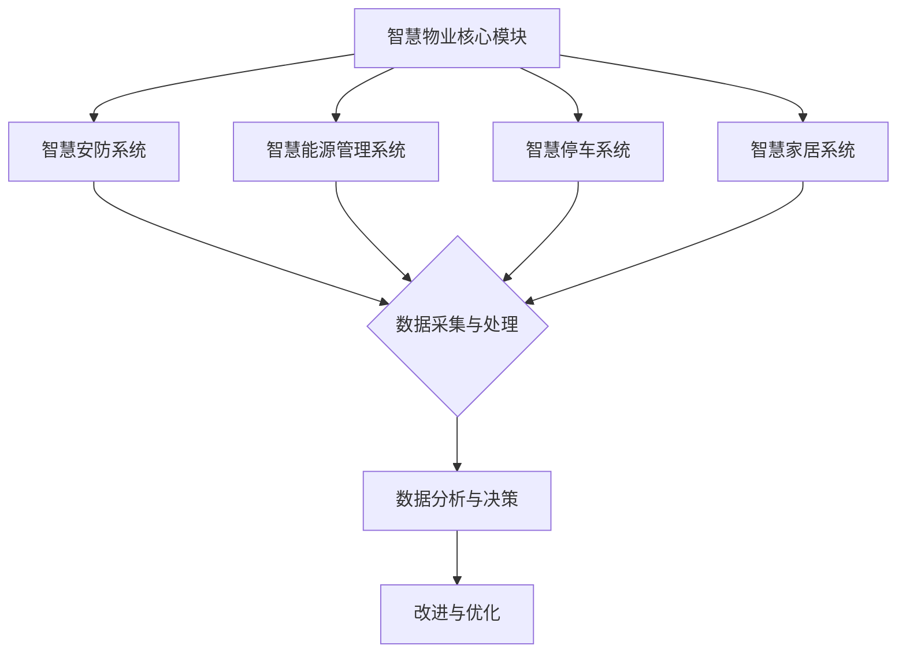

                 

# 《未来的智慧物业：2050年的社区管理与服务升级》

> 关键词：智慧物业、社区管理、物联网、大数据、云计算、人工智能

> 摘要：本文探讨了2050年智慧物业的发展趋势，分析了物联网、大数据、云计算和人工智能等技术在社区管理与服务升级中的应用，以及面临的挑战与对策。通过案例分析，展示了智慧物业的实际应用场景和效果，并对未来发展进行了展望。

## 引言与背景

### 智慧物业的定义与重要性

智慧物业是指利用物联网、大数据、云计算和人工智能等技术，对社区管理与服务进行智能化升级的一种新兴物业管理模式。智慧物业不仅能够提高物业管理的效率，降低运营成本，还能为居民提供更加便捷、舒适和安全的居住环境。

随着科技的不断发展，智慧物业在未来的社区管理中将扮演越来越重要的角色。首先，智慧物业能够实现社区管理的智能化和自动化，提高管理效率。例如，通过物联网技术，可以对社区内的各种设施进行实时监控和管理，确保设施的正常运行。其次，智慧物业能够为居民提供个性化的服务，提升居住体验。例如，通过大数据分析，可以了解居民的需求和行为习惯，为其提供更加贴心的服务。最后，智慧物业能够增强社区的安全和环保性，提高居民的生活质量。

### 智慧物业的发展历程

智慧物业的发展可以分为三个阶段：

1. **初步阶段**：这个阶段主要集中在物联网技术的应用上，如智能家居、智能安防等。这一阶段的特点是技术相对简单，应用范围较小，主要针对的是高端用户。

2. **发展阶段**：随着大数据、云计算和人工智能等技术的逐渐成熟，智慧物业的应用范围开始扩大，从单一设备的管理向整个社区的综合管理转变。这一阶段的特点是技术集成度提高，应用场景更加丰富。

3. **成熟阶段**：这个阶段将是智慧物业的全面发展阶段，各种技术将深度融合，形成完整的智慧物业生态系统。智慧物业将不再局限于社区管理，还将延伸到城市管理和公共服务等领域。

### 智慧物业的核心理念

智慧物业的核心理念主要包括以下几个方面：

1. **物联网技术**：通过物联网技术，实现社区内各种设备的互联互通，为智慧物业提供数据支持。

2. **大数据分析**：通过对海量数据的分析，挖掘用户需求，优化社区服务。

3. **云计算**：利用云计算技术，提供强大的计算能力和存储能力，支持智慧物业的运行。

4. **人工智能**：通过人工智能技术，实现智能决策和优化，提高社区管理的效率。

## 2050年社区管理的现状与趋势

### 2050年社区管理的技术支撑

随着科技的不断进步，2050年的社区管理将依托于以下技术：

1. **物联网技术**：物联网技术将在社区管理中发挥至关重要的作用。各种传感器和设备将实现无缝连接，为社区管理提供实时、准确的数据。

2. **大数据技术**：大数据技术将帮助社区管理者挖掘用户需求，优化资源配置，提高管理效率。

3. **云计算技术**：云计算技术将提供强大的计算和存储能力，支持智慧物业的运行。

4. **人工智能技术**：人工智能技术将实现智能决策和优化，提高社区管理的效率。

### 社区管理的新模式

2050年的社区管理将呈现出以下新模式：

1. **智慧化**：社区管理将全面实现智慧化，通过物联网、大数据、云计算和人工智能等技术，实现社区的智能化升级。

2. **个性化**：社区管理将更加注重个性化服务，根据用户的需求和行为习惯，提供定制化的服务。

3. **协同化**：社区管理将实现各部门的协同工作，提高管理效率。

4. **透明化**：社区管理将实现数据透明化，居民可以实时了解社区的管理情况。

### 社区管理面临的挑战与机遇

在智慧物业的发展过程中，社区管理将面临以下挑战：

1. **数据安全**：随着数据量的增加，数据安全将成为一个重要问题。

2. **隐私保护**：居民对个人隐私的保护意识将不断提高，社区管理需要采取措施保护居民隐私。

3. **技术更新**：技术更新速度加快，社区管理需要不断跟进新技术，以保持竞争力。

然而，这些挑战也伴随着机遇：

1. **技术创新**：技术创新将为社区管理带来新的机遇，提高管理效率和服务质量。

2. **市场潜力**：智慧物业市场潜力巨大，为社区管理带来新的业务增长点。

3. **社会效益**：智慧物业将提升居民的生活质量，带来显著的社会效益。

## 第二部分：智慧物业的技术架构

### 第3章：物联网技术基础

#### 物联网技术概述

物联网（Internet of Things，IoT）是指将各种物品通过网络连接起来，实现物品与物品、物品与人、人与网络的互联互通。物联网技术主要包括传感器、网络通信、数据处理和智能分析等方面。

#### 物联网技术在智慧物业中的应用

物联网技术在智慧物业中的应用十分广泛，主要包括以下几个方面：

1. **智能监控**：通过安装摄像头、门禁系统和入侵报警器等设备，实现社区的安全监控。

2. **智能家居**：通过智能家居设备，实现家电的智能控制，提高居住舒适度。

3. **能源管理**：通过智能电表、太阳能板等设备，实现社区的能源管理，降低能耗。

4. **环境监测**：通过空气质量传感器、水质监测仪等设备，实时监测社区的环境状况。

#### 物联网技术的未来发展趋势

随着技术的不断进步，物联网技术在未来将呈现以下发展趋势：

1. **技术融合**：物联网技术将与其他技术如大数据、云计算和人工智能等实现深度融合。

2. **万物互联**：随着物联网设备的数量和种类的增加，万物互联将变得更加普及。

3. **智能决策**：通过大数据分析和人工智能技术，实现物联网设备的智能决策和优化。

### 第4章：大数据与云计算在智慧物业中的应用

#### 大数据技术在智慧物业中的应用

大数据技术在智慧物业中的应用主要体现在以下几个方面：

1. **用户行为分析**：通过分析用户的行为数据，了解用户的需求和偏好，提供个性化的服务。

2. **设施维护管理**：通过分析设备的运行数据，预测设备故障，提前进行维护，降低故障率。

3. **能耗管理**：通过分析能耗数据，优化能源使用，降低能耗成本。

#### 云计算在智慧物业中的关键作用

云计算在智慧物业中发挥着关键作用，主要包括以下几个方面：

1. **数据存储和处理**：云计算提供了强大的数据存储和处理能力，支持智慧物业的数据处理需求。

2. **计算能力**：云计算提供了弹性计算能力，可以根据需求动态调整计算资源，提高计算效率。

3. **服务支持**：云计算提供了丰富的服务，如人工智能服务、大数据分析服务等，支持智慧物业的运行。

#### 大数据与云计算的未来融合趋势

大数据与云计算的未来将呈现以下融合趋势：

1. **云原生**：大数据处理将更多地采用云原生技术，实现高效的数据处理和存储。

2. **智能服务**：通过大数据分析和人工智能技术，实现智能化的物业服务。

3. **边缘计算**：随着物联网设备的增加，边缘计算将成为大数据与云计算的重要补充。

### 第5章：人工智能与机器学习在智慧物业中的应用

#### 人工智能技术概述

人工智能（Artificial Intelligence，AI）是指模拟人类智能的技术。人工智能技术主要包括机器学习、深度学习、自然语言处理等。

#### 机器学习技术在智慧物业中的应用

机器学习技术在智慧物业中的应用主要体现在以下几个方面：

1. **预测维护**：通过机器学习算法，预测设备的故障，提前进行维护。

2. **能耗优化**：通过机器学习算法，分析能耗数据，优化能源使用，降低能耗成本。

3. **用户行为分析**：通过机器学习算法，分析用户的行为数据，了解用户的需求和偏好，提供个性化的服务。

#### 人工智能与机器学习的未来应用前景

随着人工智能技术的不断进步，人工智能与机器学习在智慧物业中的应用前景十分广阔，主要包括以下几个方面：

1. **智能决策**：通过人工智能技术，实现物业管理的智能化决策。

2. **智能服务**：通过人工智能技术，提供更加智能化的物业服务。

3. **智能安全**：通过人工智能技术，提高社区的安全性。

### 第6章：智慧物业的核心模块与功能

#### 智慧安防系统

智慧安防系统是智慧物业的重要组成部分，主要包括以下几个方面：

1. **智能监控**：通过摄像头、人脸识别等技术，实现社区的智能监控。

2. **智能报警**：通过入侵报警、消防报警等设备，实现社区的智能报警。

3. **智能门禁**：通过智能门禁系统，实现社区的智能管理。

#### 智慧能源管理系统

智慧能源管理系统通过物联网、大数据等技术，实现社区的智能能源管理，主要包括以下几个方面：

1. **能耗监测**：通过智能电表、智能燃气表等设备，实现社区能耗的实时监测。

2. **能耗分析**：通过大数据分析，实现社区能耗的分析和优化。

3. **能源调度**：通过智能调度，实现社区能源的合理分配。

#### 智慧停车系统

智慧停车系统通过物联网、大数据等技术，实现社区的智能停车管理，主要包括以下几个方面：

1. **智能停车**：通过智能车位识别、智能导航等技术，实现社区的智能停车。

2. **车位预约**：通过车位预约系统，实现社区的智能预约停车。

3. **停车管理**：通过智能停车管理系统，实现社区的智能停车管理。

#### 智慧家居系统

智慧家居系统通过物联网、大数据等技术，实现社区的智能家居管理，主要包括以下几个方面：

1. **智能家电**：通过智能家居设备，实现家电的智能控制。

2. **智能安防**：通过智能家居设备，实现家庭的智能安防。

3. **智能服务**：通过智能家居设备，提供个性化的家庭服务。

## 第三部分：智慧物业的案例研究

### 第7章：智慧物业案例分析

#### 案例一：某大型住宅区的智慧物业实践

某大型住宅区通过引入智慧物业管理系统，实现了社区管理的智能化升级。具体实践包括以下几个方面：

1. **智能安防**：安装了高清摄像头、智能门禁系统和入侵报警系统，实现了社区的智能监控和报警功能。

2. **智能能源管理**：安装了智能电表、智能燃气表等设备，实时监测社区的能耗情况，并通过大数据分析实现能耗优化。

3. **智能停车**：引入了智能停车系统，通过车位识别、智能导航等技术，提高了停车效率。

4. **智能家居**：为居民提供了智能家居设备，实现了家电的智能控制和家庭的智能安防。

通过智慧物业管理系统的实践，该住宅区的物业管理效率显著提高，居民的生活质量也得到了提升。

#### 案例二：某智能社区的运营模式分析

某智能社区通过引入智慧物业管理系统，实现了社区运营的全面升级。具体运营模式包括以下几个方面：

1. **数据驱动**：通过大数据分析，了解居民的需求和行为习惯，为居民提供个性化的服务。

2. **协同管理**：实现了社区各部门的协同管理，提高了管理效率。

3. **智能决策**：通过人工智能技术，实现了物业管理的智能化决策，提高了决策的准确性。

4. **用户参与**：通过智能系统，鼓励居民参与社区管理，提高居民的满意度。

通过智能社区的运营模式，该社区的居民满意度显著提高，社区的整体运营效率也得到了提升。

#### 案例三：智慧物业在商业综合体中的应用

某商业综合体通过引入智慧物业管理系统，实现了商业运营的智能化升级。具体应用包括以下几个方面：

1. **智能安防**：安装了智能摄像头、智能门禁系统和智能停车系统，提高了商业综合体的安全性。

2. **智能能源管理**：通过智能电表、智能燃气表等设备，实时监测商业综合体的能耗情况，实现了能耗优化。

3. **智能停车**：引入了智能停车系统，通过车位识别、智能导航等技术，提高了停车效率。

4. **智能服务**：通过智能客服系统，为消费者提供智能化的购物服务。

通过智慧物业管理系统在商业综合体中的应用，该商业综合体的运营效率得到了显著提升，消费者满意度也得到了提高。

## 第8章：智慧物业的未来展望

#### 智慧物业的发展趋势

随着科技的不断进步，智慧物业将呈现以下发展趋势：

1. **技术融合**：物联网、大数据、云计算和人工智能等技术的深度融合，将推动智慧物业的快速发展。

2. **智能化**：智慧物业将实现全面的智能化，从设备管理到用户服务，都将实现智能化升级。

3. **个性化**：智慧物业将更加注重个性化服务，根据用户的需求和行为习惯，提供定制化的服务。

4. **协同化**：智慧物业将实现各部门的协同管理，提高管理效率。

#### 智慧物业的潜在影响

智慧物业的潜在影响主要体现在以下几个方面：

1. **提高物业管理效率**：通过智能化和自动化技术，提高物业管理的效率，降低运营成本。

2. **提升居民生活质量**：通过个性化服务和智能化的社区环境，提升居民的生活质量。

3. **增强社区安全性**：通过智能安防系统和智能报警系统，提高社区的安全性。

4. **推动产业升级**：智慧物业的发展将推动相关产业的发展，如智能家居、智能安防等。

#### 智慧物业的挑战与对策

在智慧物业的发展过程中，将面临以下挑战：

1. **技术更新**：技术更新速度快，社区管理需要不断跟进新技术，以保持竞争力。

2. **数据安全**：随着数据量的增加，数据安全将成为一个重要问题。

3. **隐私保护**：居民对个人隐私的保护意识将不断提高，社区管理需要采取措施保护居民隐私。

针对这些挑战，可以采取以下对策：

1. **技术创新**：不断进行技术创新，保持技术的领先地位。

2. **数据安全**：加强数据安全措施，确保数据的安全和隐私。

3. **隐私保护**：加强隐私保护措施，尊重居民的隐私权利。

## 附录

### 附录A：智慧物业相关技术与应用资源

#### A.1 技术资源

1. **物联网技术资源**：包括物联网设备的选型、物联网协议等。

2. **大数据技术资源**：包括大数据处理框架、大数据分析工具等。

3. **云计算技术资源**：包括云计算平台、云存储等。

4. **人工智能技术资源**：包括人工智能框架、人工智能算法等。

#### A.2 应用案例

1. **智慧安防系统应用案例**：包括社区安防、商业安防等。

2. **智慧能源管理系统应用案例**：包括智能家居、智能办公楼等。

3. **智慧停车系统应用案例**：包括社区停车、商业停车等。

4. **智慧家居系统应用案例**：包括智能家居设备、智能家居解决方案等。

#### A.3 学术论文与研究报告

1. **物联网在智慧物业中的应用**：包括物联网技术在智慧物业中的研究、应用等。

2. **大数据与智慧物业**：包括大数据在智慧物业中的研究、应用等。

3. **云计算与智慧物业**：包括云计算在智慧物业中的研究、应用等。

4. **人工智能与智慧物业**：包括人工智能在智慧物业中的研究、应用等。

### 附录B：智慧物业开发工具与平台

#### B.1 物联网开发平台

1. **阿里云物联网平台**：提供物联网设备的连接、数据存储和分析等服务。

2. **腾讯云物联网平台**：提供物联网设备的连接、数据存储和分析等服务。

3. **华为物联网平台**：提供物联网设备的连接、数据存储和分析等服务。

#### B.2 大数据与云计算平台

1. **阿里云大数据平台**：提供数据存储、数据处理、数据分析等服务。

2. **腾讯云大数据平台**：提供数据存储、数据处理、数据分析等服务。

3. **华为大数据平台**：提供数据存储、数据处理、数据分析等服务。

#### B.3 人工智能开发工具与框架

1. **TensorFlow**：提供深度学习模型的训练、推理等服务。

2. **PyTorch**：提供深度学习模型的训练、推理等服务。

3. **Keras**：提供深度学习模型的训练、推理等服务。

## Mermaid 流程图



### 核心算法原理讲解

#### 伪代码：

```python
# 伪代码：智慧物业数据采集与处理算法

def dataProcessing(inputData):
    # 数据清洗
    cleanedData = cleanInputData(inputData)
    
    # 数据预处理
    preprocessedData = preprocessData(cleanedData)
    
    # 特征提取
    features = extractFeatures(preprocessedData)
    
    # 数据分析
    analysisResult = analyzeData(features)
    
    # 决策与优化
    decision = makeDecision(analysisResult)
    optimizedData = optimizeData(decision)
    
    return optimizedData
```

#### 数学模型和数学公式

$$
M = \frac{1}{n} \sum_{i=1}^{n} (X_i - \mu)^2
$$

其中，$M$ 表示数据集的均方误差，$X_i$ 表示第 $i$ 个数据点，$\mu$ 表示数据集的均值。

#### 举例说明：

假设有一个数据集包含以下五个数据点：\[1, 2, 3, 4, 5\]，使用上述模型计算均方误差：

$$
M = \frac{1}{5} \sum_{i=1}^{5} (X_i - \mu)^2 = \frac{1}{5} \left[ (1 - 3)^2 + (2 - 3)^2 + (3 - 3)^2 + (4 - 3)^2 + (5 - 3)^2 \right] = \frac{1}{5} \left[ 4 + 1 + 0 + 1 + 4 \right] = 2
$$

因此，该数据集的均方误差为2。

### 项目实战

#### 代码实际案例：

```python
# 源代码：智慧物业安防系统数据采集与处理

import numpy as np

# 数据采集
def dataCollection():
    # 这里使用随机生成数据作为示例
    data = np.random.rand(100)
    return data

# 数据处理
def dataProcessing(inputData):
    # 数据清洗
    cleanedData = np.unique(inputData)
    
    # 数据预处理
    preprocessedData = (cleanedData - np.mean(cleanedData)) / np.std(cleanedData)
    
    # 特征提取
    features = np.diff(preprocessedData)
    
    # 数据分析
    analysisResult = np.mean(features)
    
    # 决策与优化
    if analysisResult > 0.5:
        print("安全警报：有异常活动！")
    else:
        print("安全状态良好。")
    
    return analysisResult

# 主程序
def main():
    inputData = dataCollection()
    result = dataProcessing(inputData)
    print("分析结果：", result)

if __name__ == "__main__":
    main()
```

#### 代码解读与分析：

该代码示例实现了智慧物业安防系统的数据采集与处理。首先，通过 `dataCollection()` 函数生成随机数据作为输入。然后，`dataProcessing()` 函数对数据进行清洗、预处理、特征提取、数据分析和决策。具体过程如下：

1. 数据清洗：使用 `np.unique()` 函数去除重复数据，得到清洗后的数据。
2. 数据预处理：计算数据均值和标准差，并将数据标准化，以便进行后续分析。
3. 特征提取：使用 `np.diff()` 函数计算数据的差分，得到特征向量。
4. 数据分析：计算特征向量的均值，作为数据分析结果。
5. 决策与优化：根据分析结果，判断是否触发安全警报。

主程序 `main()` 调用 `dataCollection()` 和 `dataProcessing()` 函数，输出分析结果。通过运行该程序，可以实现对智慧物业安防系统数据的实时监测和报警功能。

## 作者

**作者：AI天才研究院/AI Genius Institute & 禅与计算机程序设计艺术 /Zen And The Art of Computer Programming**

