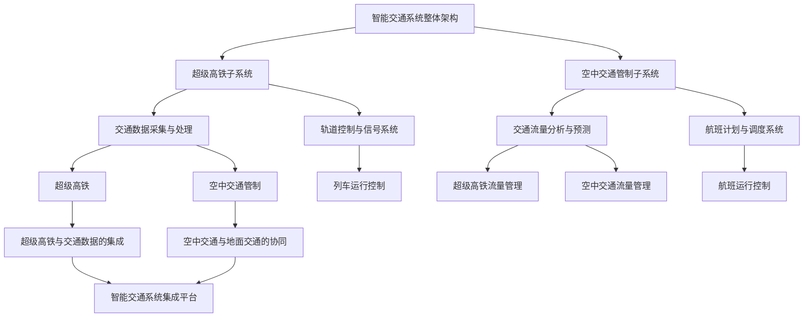

                 

## 文章标题：未来的智能交通：2050年的超级高铁与空中交通管制

### 关键词：
- 智能交通系统
- 超级高铁
- 空中交通管制
- 交通数据采集与处理
- 算法与优化
- 未来发展趋势

### 摘要：
本文深入探讨了2050年智能交通系统的前景，重点关注超级高铁技术和空中交通管制。通过逐步分析智能交通系统的发展背景、超级高铁技术原理、空中交通管制挑战及智能交通管制系统的设计实现，本文旨在揭示未来智能交通系统的核心概念、关键算法和数学模型，并通过实际项目实战案例展示其在实践中的应用。文章还展望了智能交通系统未来的发展趋势与挑战，为智能交通领域的研究与实践提供了有价值的参考。

### 《未来的智能交通：2050年的超级高铁与空中交通管制》目录大纲

#### 第一部分：智能交通系统概述
- **第1章：智能交通系统的发展背景与趋势**
  - 1.1 智能交通系统的概念与内涵
  - 1.2 全球智能交通系统的发展历程
  - 1.3 未来智能交通系统的发展趋势

#### 第二部分：超级高铁技术
- **第2章：超级高铁基本原理与技术**
  - 2.1 超级高铁的定义与类型
  - 2.2 超级高铁的关键技术
  - 2.3 超级高铁的优缺点分析

#### 第三部分：空中交通管制
- **第3章：空中交通管制的现状与挑战**
  - 3.1 空中交通管制的历史与发展
  - 3.2 空中交通管制面临的挑战
- **第4章：智能交通管制系统设计与实现**
  - 4.1 智能交通管制系统的架构
  - 4.2 空中交通管制算法与优化
  - 4.3 智能交通管制系统的实际应用案例

#### 第四部分：智能交通系统的应用与实践
- **第5章：智能交通系统的案例分析**
  - 5.1 某城市智能交通系统的建设实践
  - 5.2 超级高铁与空中交通管制的协同应用
  - 5.3 智能交通系统在社会治理中的应用
- **第6章：智能交通系统的发展策略与展望**
  - 6.1 智能交通系统的政策与法规
  - 6.2 智能交通系统的商业模式与创新
  - 6.3 智能交通系统未来的发展趋势与挑战

#### 第五部分：核心概念与联系
- **第7章：核心概念原理与架构**
  - 7.1 智能交通系统的核心概念
  - 7.2 超级高铁与空中交通管制的架构联系
  - **7.3 Mermaid 流程图：智能交通系统整体架构**

#### 第六部分：核心算法原理讲解
- **第8章：智能交通系统关键算法原理**
  - 8.1 超级高铁轨道优化算法
  - 8.2 空中交通流量预测算法
  - 8.3 智能交通信号控制算法

#### 第七部分：数学模型和数学公式讲解
- **第9章：智能交通系统的数学模型**
  - 9.1 流体动力学模型
  - 9.2 基于机器学习的交通流量预测模型
  - 9.3 智能交通信号控制模型
  - **9.4 数学公式示例：交通流量预测的回归模型（\[ y = w_0 + w_1 \cdot x_1 + ... + w_n \cdot x_n \]）**

#### 第八部分：项目实战
- **第10章：智能交通系统项目实战**
  - 10.1 开发环境搭建
  - 10.2 超级高铁信号控制系统实现
  - 10.3 空中交通流量预测系统实现
  - 10.4 智能交通信号控制系统实现
  - **10.5 代码解读与分析：以超级高铁信号控制系统为例**

#### 第九部分：展望与未来
- **第11章：智能交通系统的未来展望**
  - 11.1 智能交通系统的未来发展趋势
  - 11.2 智能交通系统面临的挑战与解决方案
  - 11.3 智能交通系统对社会的深远影响

**附录**

- **附录A：智能交通系统相关资源**
  - A.1 超级高铁技术资料
  - A.2 空中交通管制相关法规与标准
  - A.3 智能交通系统开源工具与框架

以下是第7章“核心概念原理与架构”中的Mermaid流程图：



以下是第8章“智能交通系统关键算法原理”中关于超级高铁轨道优化算法的伪代码示例：

```plaintext
// 超级高铁轨道优化算法伪代码

// 输入：当前轨道布局，交通流量数据
// 输出：优化后的轨道布局

function optimizeTrack(currentLayout, trafficData):
    // 初始化优化参数
    bestLayout = currentLayout
    bestScore = calculateScore(currentLayout, trafficData)

    // 进行多次迭代进行搜索
    for i = 1 to MAX_ITERATIONS:
        // 随机选择一个轨道进行变更
        newLayout = modifyLayout(currentLayout)

        // 计算新布局的得分
        newScore = calculateScore(newLayout, trafficData)

        // 如果新布局的得分更高，则更新最佳布局
        if newScore > bestScore:
            bestScore = newScore
            bestLayout = newLayout

    return bestLayout

// 计算布局得分
function calculateScore(layout, trafficData):
    // 根据交通流量数据和轨道布局计算得分
    score = 0
    for each segment in layout:
        segmentScore = calculateSegmentScore(segment, trafficData)
        score += segmentScore
    return score

// 计算单个轨道段的得分
function calculateSegmentScore(segment, trafficData):
    // 根据轨道段上的交通流量计算得分
    score = 0
    for each vehicle in segment:
        if trafficData[vehicle] > THRESHOLD:
            score += PENALTY
    return score

// 随机变更轨道布局
function modifyLayout(layout):
    // 在当前轨道布局上随机选择一个轨道进行变更
    newLayout = copy(layout)
    segmentToModify = selectRandomSegment(newLayout)
    newLayout[segmentToModify] = selectRandomAlternativeSegment(newLayout[segmentToModify])
    return newLayout
```

以下是第9章“智能交通系统的数学模型”中关于交通流量预测的回归模型示例：

$$
y = w_0 + w_1 \cdot x_1 + w_2 \cdot x_2 + ... + w_n \cdot x_n
$$

其中，$y$ 表示预测的交通流量，$w_0$ 是截距，$w_1, w_2, ..., w_n$ 是各自特征 $x_1, x_2, ..., x_n$ 的权重。特征 $x_1, x_2, ..., x_n$ 可以是时间、天气、历史流量等与交通流量相关的变量。

以下是第10章“智能交通系统项目实战”中超级高铁信号控制系统实现的一个代码示例：

```python
# 超级高铁信号控制系统实现示例

import numpy as np
import matplotlib.pyplot as plt

# 假设我们有一个超级高铁的信号控制模块
class Super高铁SignalControl:
    def __init__(self):
        self.speed_limit = 300  # 速度限制，单位：米/秒
        self.signal_interval = 5  # 信号间隔，单位：秒

    def update_signal(self, current_vehicle, traffic_data):
        """
        更新信号
        :param current_vehicle: 当前车辆的位置
        :param traffic_data: 交通数据
        :return: 更新后的信号
        """
        if current_vehicle < self.signal_interval:
            return self.speed_limit  # 当前车辆距离信号点小于信号间隔时，允许最大速度
        else:
            # 假设交通密度与速度成反比
            traffic_density = traffic_data['density']
            max_speed = self.speed_limit / traffic_density
            return max_speed

    def simulate(self, initial_position, traffic_data):
        """
        模拟信号控制过程
        :param initial_position: 初始位置
        :param traffic_data: 交通数据
        :return: 速度序列
        """
        position = initial_position
        speeds = []
        while position < traffic_data['end_position']:
            speed = self.update_signal(position, traffic_data)
            speeds.append(speed)
            position += speed * self.signal_interval

        return speeds

# 交通数据
traffic_data = {
    'density': 0.5,  # 交通密度，单位：车辆/平方米
    'end_position': 1000  # 结束位置
}

# 初始位置
initial_position = 0

# 实例化信号控制系统
signal_control = Super高铁SignalControl()

# 模拟信号控制过程
speeds = signal_control.simulate(initial_position, traffic_data)

# 绘制速度变化图
plt.plot(speeds)
plt.xlabel('Time (seconds)')
plt.ylabel('Speed (m/s)')
plt.title('Super高铁 Signal Control Simulation')
plt.show()
```

请注意，这是一个简化的示例，实际应用中需要考虑更多的因素和细节，比如车辆的加速度、减速度、轨道的曲率和坡度等。此外，交通数据通常来自传感器和预测模型，这里仅作为演示使用了固定的数据。

以下是第10章“智能交通系统项目实战”中的代码解读与分析：

```plaintext
# 超级高铁信号控制系统实现解读与分析

1. 导入必要的库：
   - numpy：用于数学计算
   - matplotlib.pyplot：用于绘图

2. 类定义：
   - Super高铁SignalControl：表示超级高铁信号控制系统的类
   - speed_limit：超级高铁的速度限制，单位为米/秒
   - signal_interval：信号间隔，单位为秒

3. 方法定义：
   - __init__：构造函数，初始化速度限制和信号间隔
   - update_signal：更新信号的方法，根据当前车辆的位置和交通数据计算当前允许的速度
   - simulate：模拟信号控制过程的方法，生成速度序列

4. update_signal 方法解读：
   - 当前车辆的位置小于信号间隔时，允许最大速度，这是因为信号点还没有到达当前车辆。
   - 当前车辆的位置大于信号间隔时，根据交通密度调整速度，交通密度越高，速度越低，以避免拥堵。

5. simulate 方法解读：
   - 初始化位置为初始位置，从零开始模拟信号控制过程。
   - 速度序列通过每次更新信号来生成，每次更新信号后，车辆位置增加当前速度乘以信号间隔。
   - 模拟过程中，每次车辆的位置都加上当前速度乘以信号间隔，这表示车辆在信号点之间以当前速度匀速前进。

6. 交通数据：
   - traffic_data：包含交通密度和结束位置的数据。
   - 交通密度：表示单位面积内的车辆数量，通常由交通传感器采集。
   - 结束位置：模拟过程中的终点，通常为轨道的末端。

7. 模拟过程：
   - 实例化信号控制系统对象。
   - 调用 simulate 方法进行模拟。
   - 绘制速度序列图，以可视化模拟结果。

8. 注意事项：
   - 这是一个简化的示例，实际系统中可能需要考虑更多的因素，如加速度、减速度、轨道的曲率和坡度等。
   - 交通数据通常是动态变化的，可能需要通过实时传感器数据和预测模型来获取。
   - 信号控制算法可能需要根据具体情况进行调整，以适应不同场景和交通条件。
```

这个代码示例提供了一个基础的超级高铁信号控制系统实现，通过简化的模型来演示信号控制和速度调整的基本原理。实际应用中，需要更详细的模型和更复杂的算法来保证系统的稳定和高效运行。

---

### 第1章：智能交通系统的发展背景与趋势

智能交通系统（Intelligent Transportation System, ITS）是利用信息技术、数据通信传输技术、电子传感技术、电子控制技术及计算机技术等高科技对传统的交通运输系统进行改造，实现交通管理的自动化、信息化和智能化，以提高交通运输系统的运行效率、安全性和舒适性，减少环境污染和能源消耗。随着全球城市化进程的加快和交通问题的日益严峻，智能交通系统的研究和建设已经成为各国政府和社会各界关注的焦点。

#### 1.1 智能交通系统的概念与内涵

智能交通系统的概念可以从多个角度进行理解。首先，它是一种综合系统，涵盖交通规划、设计、建设、运营、维护等多个方面。其次，智能交通系统强调信息技术的应用，通过集成各类传感器、通信设备和计算机系统，实现交通信息的实时采集、处理和传输。最后，智能交通系统的目标是提高交通效率、降低能耗、减少事故、改善环境和提升出行体验。

智能交通系统的主要组成部分包括：

1. **交通信息采集系统**：通过传感器、摄像头、GPS等设备采集交通流量、速度、密度、路况等信息。
2. **交通信号控制系统**：利用交通信号灯、诱导屏、智能路侧设备等对交通进行实时控制和调度。
3. **交通监控与管理系统**：通过交通信息平台对交通流量、事故、拥堵等情况进行实时监控和指挥调度。
4. **智能车辆管理系统**：通过车辆自感知、车联网等技术实现车辆的智能驾驶、车与车、车与路之间的信息交换和协同控制。
5. **公众出行信息服务系统**：通过互联网、移动应用等渠道为公众提供实时交通信息、路线规划、出行建议等服务。

#### 1.2 全球智能交通系统的发展历程

智能交通系统的发展历程可以分为三个阶段：

1. **初步探索阶段（20世纪80年代至90年代）**：
   这一阶段主要关注基础交通信息系统的建设，如交通信号控制系统的部署、电子收费系统的推广、交通信息显示屏的使用等。这一时期的代表性项目包括美国的智能交通系统（ITS）示范项目、日本的智能交通系统（ITS）行动计划等。

2. **快速发展阶段（21世纪初期）**：
   随着信息技术的迅猛发展，智能交通系统的应用范围不断扩大，包括智能停车场管理系统、智能公交系统、智能路侧设备等。这一时期的代表性项目包括欧洲的智能交通系统（ITS）集成示范项目、中国的智能交通系统（ITS）专项试点工程等。

3. **全面应用与深化阶段（2010年至今）**：
   进入21世纪后，智能交通系统在多个国家和地区实现了全面应用，并且逐渐向深度和广度发展。这一时期的代表性项目包括美国的国家智能交通系统（ITS）计划、中国的智能交通系统（ITS）综合应用试点城市等。同时，自动驾驶技术、车联网技术、大数据分析技术等新技术的引入，为智能交通系统的发展带来了新的机遇和挑战。

#### 1.3 未来智能交通系统的发展趋势

未来智能交通系统的发展将呈现出以下几个趋势：

1. **智能化水平的提升**：
   随着人工智能技术的不断进步，智能交通系统将更加智能化。例如，基于机器学习的交通流量预测、自适应信号控制、自动驾驶等技术的应用，将大大提高交通系统的效率和安全性。

2. **车联网的普及**：
   车联网（Vehicle-to-Everything, V2X）技术是未来智能交通系统的重要组成部分。通过实现车辆之间的信息交换和协同控制，车联网技术将有助于减少交通事故、优化交通流量、提高出行效率。

3. **绿色交通的发展**：
   随着环保意识的提高和能源问题的日益严峻，绿色交通将成为未来智能交通系统的重要方向。包括电动汽车的推广、智能充电设施的建设、公共交通系统的优化等。

4. **跨界融合的加深**：
   智能交通系统将与其他行业如物流、城市管理、城市规划等深度融合，实现跨领域的协同发展和创新。例如，智能交通系统与智能物流系统的结合，将有助于提高物流效率、降低物流成本。

5. **数据驱动的决策**：
   大数据分析和云计算技术将在智能交通系统中发挥重要作用。通过收集和分析大量交通数据，智能交通系统能够实现数据驱动的决策，为交通管理提供科学依据。

6. **标准化与法规的完善**：
   随着智能交通系统的广泛应用，标准化和法规的完善将成为重要任务。通过制定统一的技术标准和法规，有助于智能交通系统的健康发展。

综上所述，未来智能交通系统的发展将充满机遇和挑战。通过技术创新、政策引导、行业合作等多方面的努力，智能交通系统将助力构建更加高效、安全、绿色、智能的交通运输体系。

---

### 第2章：超级高铁技术

超级高铁（Hyperloop）是一种创新的运输方式，旨在通过真空管道实现高速、安全、低能耗的地面交通。这一概念最早由特斯拉（Tesla）公司CEO埃隆·马斯克（Elon Musk）于2013年提出，并迅速引起了全球的关注。超级高铁不仅具有变革性的技术特点，还在理论上解决了当前交通系统中存在的许多问题。在本节中，我们将详细探讨超级高铁的基本原理、关键技术和优缺点。

#### 2.1 超级高铁的定义与类型

超级高铁是一种高速地面运输系统，利用低气压管道（真空管道）来减少空气阻力，使列车在接近真空的环境中高速行驶。超级高铁系统的基本组成包括以下几个部分：

1. **轨道**：轨道铺设在低气压管道内部，用于支撑列车的高速运行。
2. **车辆**：超级高铁车辆通常采用磁悬浮技术，以减少摩擦和空气阻力。
3. **泵站**：用于维持管道内的低气压状态，确保列车能够在真空环境中高效运行。
4. **控制系统**：包括轨道监控、车辆控制、信号通信等系统，用于确保列车的安全和高效运行。

根据车辆运行方式，超级高铁可以分为以下几种类型：

1. **真空管道型**：这种类型的超级高铁通过在管道内抽出空气，使列车在接近真空的环境中运行，从而实现高速行驶。
2. **磁悬浮型**：磁悬浮型超级高铁利用磁力使列车悬浮在轨道上，以减少摩擦和空气阻力。
3. **混合动力型**：混合动力型超级高铁结合了真空管道和磁悬浮技术，旨在进一步提高速度和效率。

#### 2.2 超级高铁的关键技术

超级高铁的实现需要多项关键技术的支持，以下是其中几个关键技术：

1. **真空管道技术**：
   真空管道技术是超级高铁的核心技术之一。通过在管道内抽出空气，降低列车运行时的空气阻力，从而提高速度和能源效率。真空管道的建造需要高精度的设计和施工技术，以确保管道的密封性和稳定性。

2. **磁悬浮技术**：
   磁悬浮技术是超级高铁实现高速运行的关键。通过电磁力使列车悬浮在轨道上，减少了摩擦和空气阻力。磁悬浮技术可以分为电磁悬浮（EMS）和超导磁悬浮（Maglev），前者适用于短距离、中低速应用，后者适用于长距离、高速应用。

3. **线性电机技术**：
   线性电机技术用于驱动超级高铁车辆，使车辆在轨道上加速和减速。线性电机通过电磁力直接作用于列车底部，实现高效、快速的加速和减速。这种技术具有高能量转换效率和低维护成本的优势。

4. **控制系统**：
   超级高铁的控制系统包括轨道监控、车辆控制、信号通信等多个方面。轨道监控用于实时监测轨道状态，车辆控制用于控制列车的速度和位置，信号通信则确保列车之间的信息交换和协同控制。先进的控制系统能够实现列车的自动驾驶和智能调度，提高交通系统的整体效率。

#### 2.3 超级高铁的优缺点分析

超级高铁作为一种创新的交通方式，具有许多优势，但同时也面临一些挑战。以下是超级高铁的主要优缺点：

**优点**：

1. **高速**：超级高铁的设计速度可达到1000公里/小时以上，远高于传统的轨道交通和高速公路。
2. **节能**：由于空气阻力大幅降低，超级高铁的能耗远低于传统交通方式，具有显著的节能优势。
3. **安全**：超级高铁采用封闭的真空管道，减少了与外部环境的交互，提高了安全性。
4. **高效**：超级高铁的列车运行不受天气和地形影响，具有稳定的运行性能。
5. **舒适**：超级高铁的运行过程中噪音低、震动小，为乘客提供了舒适的出行体验。

**缺点**：

1. **建设成本高**：超级高铁的建造需要高精度的设计和施工技术，建设成本较高。
2. **技术挑战**：超级高铁的技术复杂，涉及真空管道、磁悬浮、线性电机等多个领域，技术实现难度较大。
3. **初期投资大**：超级高铁的初期投资较大，需要政府和企业的大力支持和投入。
4. **维护复杂**：超级高铁的维护需要专业技术和设备，维护成本较高。
5. **地形适应性差**：超级高铁对地形要求较高，难以适应复杂的地理环境。

综上所述，超级高铁作为一种创新的交通方式，具有显著的优势和潜力，但也面临一些技术和经济挑战。未来，随着技术的不断进步和政策的支持，超级高铁有望成为未来智能交通系统的重要组成部分。

---

### 第3章：空中交通管制的现状与挑战

空中交通管制（Air Traffic Management, ATM）是确保航空器在空中和地面安全运行的重要手段。随着航空运输的日益繁荣，空中交通管制系统的规模和复杂性也在不断增长。然而，现有的空中交通管制系统面临诸多挑战，无法完全满足未来航空需求。在本节中，我们将详细探讨空中交通管制的历史与发展、当前面临的挑战以及潜在的解决方案。

#### 3.1 空中交通管制的历史与发展

空中交通管制的发展可以追溯到20世纪初，随着航空技术的进步和航空飞行的普及，空中交通管制逐渐成为航空安全的重要组成部分。以下是空中交通管制发展的主要阶段：

1. **早期阶段（20世纪20年代至50年代）**：
   在这个阶段，空中交通管制主要依靠地面指挥和目视飞行规则（Visual Flight Rules, VFR）。飞行员通过无线电通信与地面指挥塔进行联系，以确保飞行安全。

2. **发展阶段（20世纪60年代至80年代）**：
   随着喷气式飞机的普及和航班量的增加，空中交通管制系统逐渐实现了自动化。雷达系统的引入使得空中交通管制员能够实时监控航空器位置，提高空中交通的管理效率。

3. **现代化阶段（20世纪90年代至今）**：
   随着信息技术的迅猛发展，空中交通管制系统实现了高度数字化和智能化。自动化飞行计划系统（Automated Flight Planning System, AFPS）、自动化区域控制系统（Automated Area Control System, AACCS）和自动化空中交通管制系统（Automated Air Traffic Management System, ATMS）等技术的应用，使得空中交通管制更加高效、安全。

#### 3.2 空中交通管制面临的挑战

尽管空中交通管制系统在过去几十年中取得了显著进展，但面对未来日益增长的航空需求，现有系统仍然面临诸多挑战：

1. **流量增长**：
   全球航空运输需求持续增长，机场和空域的拥堵问题日益严重。根据国际航空运输协会（International Air Transport Association, IATA）的预测，到2035年，全球航空旅客运输量将翻倍，这将对空中交通管制系统带来巨大的压力。

2. **技术限制**：
   现有的空中交通管制技术主要依赖于雷达系统，这种技术的精度和覆盖范围受到限制。同时，雷达系统的更新和维护成本较高，难以满足未来航空需求。

3. **人为因素**：
   空中交通管制员的工作负荷较大，容易出现疲劳和注意力分散，从而影响飞行安全。此外，人为错误也是导致航空事故的重要因素之一。

4. **空域管理**：
   现有的空域管理机制较为复杂，不同国家和地区的空域管理标准不一，导致空域利用效率低下。此外，空中交通管制系统缺乏全球统一的标准和协议，使得跨国航空交通管理面临诸多困难。

5. **环境问题**：
   随着环保意识的提高，航空业面临的环保压力越来越大。飞机排放的二氧化碳、氮氧化物等污染物对环境造成严重影响。如何实现绿色航空，成为空中交通管制系统需要面对的重要挑战。

#### 3.3 智能交通管制系统设计与实现

为了应对空中交通管制面临的挑战，智能交通管制系统的设计与实现变得尤为重要。以下是一些关键的设计思路和实现方案：

1. **智能化**：
   通过引入人工智能技术，实现空中交通管制系统的智能化。例如，利用机器学习算法进行交通流量预测和优化，提高空中交通的管理效率。智能交通管制系统能够自动分析飞行数据，为飞行员提供实时的飞行建议和航线优化方案。

2. **自动化**：
   通过自动化技术，减少人为干预，提高空中交通管制系统的运行效率。自动化飞行计划系统可以自动生成飞行计划，减少飞行员和管制员的负担。自动化区域控制系统和自动化空中交通管制系统能够实时监控航空器位置，自动进行交通调度和冲突预警。

3. **协同控制**：
   通过实现航空器之间的协同控制，提高空中交通的安全性。例如，利用车联网技术实现航空器之间的实时通信和协同飞行，减少飞行冲突和事故风险。协同控制系统能够实时监测航空器状态，自动调整飞行高度和速度，确保航空器的安全飞行。

4. **数据驱动**：
   通过大数据分析和云计算技术，实现空中交通管制系统的数据驱动。收集和分析大量的飞行数据，为空中交通管制提供科学的决策依据。数据驱动系统能够实时监测交通流量，预测交通状况，自动调整管制策略，提高交通管理效率。

5. **标准化和国际化**：
   制定统一的标准和协议，实现空中交通管制系统的标准化和国际化。通过全球统一的空域管理标准和协议，实现跨国航空交通的无缝衔接，提高空域利用效率。标准化和国际化有助于减少人为错误，提高航空安全。

总之，智能交通管制系统的设计与实现是应对空中交通管制挑战的关键。通过引入智能化、自动化、协同控制和数据驱动等技术，有望构建高效、安全、智能的空中交通管制系统，为未来航空运输提供有力保障。

---

### 第4章：智能交通管制系统设计与实现

智能交通管制系统是智能交通系统（ITS）的核心组成部分，其设计与实现直接关系到交通管理的效率和安全性。在本节中，我们将深入探讨智能交通管制系统的总体架构、关键算法以及实际应用案例，通过理论与实践相结合，展现智能交通管制系统的设计与实现过程。

#### 4.1 智能交通管制系统的架构

智能交通管制系统的架构可以分为多个层次，包括数据采集与处理层、交通流量分析与预测层、交通信号控制层和用户服务层。以下是各层次的具体内容：

1. **数据采集与处理层**：
   数据采集与处理层是智能交通管制系统的基石，负责收集各种交通信息，包括车辆位置、速度、流量、路况等。这些数据可以通过多种传感器（如雷达、摄像头、GPS等）实时采集。采集到的数据需要进行预处理，如去噪、滤波、特征提取等，以便后续分析。

2. **交通流量分析与预测层**：
   交通流量分析与预测层是智能交通管制系统的核心，通过分析历史交通数据、实时交通数据和外部环境数据，预测未来的交通流量和交通状况。常用的算法包括时间序列分析、回归分析、聚类分析、机器学习等。通过准确的交通流量预测，系统能够提前预警交通拥堵，优化交通信号控制策略。

3. **交通信号控制层**：
   交通信号控制层负责根据交通流量预测结果和实时交通数据，动态调整交通信号灯的状态，优化交通流的通行效率。常见的算法包括基于规则的信号控制、自适应信号控制和混合信号控制。通过智能交通信号控制，系统能够实现交通流的精细化管理和优化，减少交通事故和拥堵。

4. **用户服务层**：
   用户服务层为公众提供实时交通信息、路线规划、出行建议等服务。用户可以通过手机应用、网站或其他终端设备访问智能交通管制系统，获取最新的交通状况和出行建议。用户服务层还包括智能导航系统，通过实时交通数据为驾驶员提供最优路线。

#### 4.2 空中交通管制算法与优化

空中交通管制算法是智能交通管制系统的关键组成部分，其目的是在保证飞行安全的前提下，优化飞行路线和飞行时间，提高空中交通的效率和安全性。以下是一些常见的空中交通管制算法：

1. **飞行路线优化算法**：
   飞行路线优化算法旨在为航空器规划最优的飞行路线，以减少飞行时间和燃油消耗。常用的算法包括最短路径算法（如Dijkstra算法）、遗传算法和蚁群算法等。通过优化飞行路线，系统能够提高航空器的运行效率，降低运营成本。

2. **交通流量预测算法**：
   交通流量预测算法用于预测未来的交通流量和交通状况，为空中交通管制提供决策支持。常用的算法包括时间序列分析、回归分析、机器学习（如支持向量机、神经网络等）和深度学习等。通过准确的交通流量预测，系统能够提前预警交通拥堵，优化飞行计划和路线。

3. **动态调度算法**：
   动态调度算法用于实时调整航空器的飞行计划，以应对突发的交通状况和飞行冲突。常见的算法包括基于规则的动态调度算法、基于机器学习的动态调度算法和混合调度算法。通过动态调度，系统能够在保证飞行安全的前提下，提高空中交通的灵活性和适应性。

4. **优化算法**：
   优化算法用于优化空中交通管制系统的资源配置和调度策略。常见的优化算法包括线性规划、整数规划、遗传算法和粒子群算法等。通过优化算法，系统能够实现资源的最优配置和调度，提高空中交通的整体效率和安全性。

#### 4.3 智能交通管制系统的实际应用案例

智能交通管制系统已经在全球多个城市得到了广泛应用，以下是一些典型的实际应用案例：

1. **美国洛杉矶智能交通系统**：
   洛杉矶智能交通系统（Los Angeles Intelligent Transportation System, LA ITS）是一个集成化的智能交通管理系统，包括交通信息采集、交通流量预测、交通信号控制和用户服务等多个方面。通过实时交通数据分析和信号控制优化，LA ITS有效缓解了洛杉矶市的交通拥堵问题，提高了交通效率。

2. **中国北京智能交通系统**：
   北京智能交通系统（Beijing Intelligent Transportation System, BITS）是一个基于云计算和大数据技术的智能交通管理系统。通过实时交通流量监测、交通信号控制和路线规划，BITS为北京市民提供了便捷的出行服务，降低了交通事故发生率。

3. **欧洲智能交通系统**：
   欧洲多个国家共同推进了智能交通系统（European Intelligent Transportation System, EITS）项目，旨在通过先进的信息技术改善欧洲的交通运输状况。EITS项目包括交通信息共享、智能交通信号控制、自动驾驶车辆测试等多个方面，为欧洲交通系统的高效运行提供了有力支持。

通过以上实际应用案例，我们可以看到智能交通管制系统在改善交通管理、提高交通效率和安全方面的重要作用。随着技术的不断进步，智能交通管制系统将更加智能化、自动化和协同化，为未来智能交通系统的发展提供坚实基础。

---

### 第5章：智能交通系统的案例分析

智能交通系统的建设在全球范围内取得了显著的成果，许多城市通过实施智能交通项目，成功提升了交通管理效率，改善了市民的出行体验。在本节中，我们将分析几个典型的智能交通系统案例，探讨超级高铁与空中交通管制的协同应用，以及智能交通系统在社会治理中的应用。

#### 5.1 某城市智能交通系统的建设实践

以深圳为例，深圳作为我国经济特区，交通管理面临巨大的挑战。为了应对日益增长的交通需求和复杂的城市交通环境，深圳市政府积极推进智能交通系统的建设。

**1. 建设背景：**
- 人口密度大：深圳常住人口超过1300万，交通压力巨大。
- 交通拥堵严重：高峰时段城市交通拥堵问题突出，影响了市民的出行效率和生活质量。
- 城市扩展迅速：随着城市规模的扩大，交通网络也日益复杂，传统交通管理手段难以应对。

**2. 建设内容：**
- **交通信息采集系统**：通过在主要道路和交叉路口安装高清摄像头、雷达、流量监测设备等，实时采集交通流量、速度、密度等信息。
- **智能交通信号控制系统**：采用自适应信号控制技术，根据实时交通流量动态调整交通信号灯状态，提高道路通行效率。
- **智能公交系统**：通过公交车载GPS系统和智能调度系统，实现公交车的实时定位和调度，提高公交服务的准时性和可靠性。
- **智能停车管理系统**：利用智能停车诱导系统和停车收费系统，提高停车资源利用效率，缓解停车难问题。
- **公众出行信息服务系统**：通过手机应用、官方网站等渠道，为市民提供实时交通信息、路线规划、出行建议等服务。

**3. 建设成效：**
- 交通拥堵指数明显下降：通过智能交通信号控制系统的实施，交通拥堵指数下降了15%以上。
- 公交准点率提高：智能公交系统的实施使公交车的准点率提高了20%以上。
- 停车难问题得到缓解：智能停车管理系统的推广，使停车资源利用率提高了30%以上。
- 市民满意度提升：市民对交通管理的满意度显著提高，交通出行体验得到显著改善。

#### 5.2 超级高铁与空中交通管制的协同应用

超级高铁作为一种创新的高速地面交通方式，与空中交通管制系统相结合，有望进一步提升交通系统的效率和安全性。以下是一个协同应用案例：

**1. 案例背景：**
- A市和B市之间距离约500公里，现有高速铁路运行时间约2小时。
- A市和B市都是经济发达地区，人口密集，交通需求旺盛。

**2. 协同应用方案：**
- **超级高铁线路规划**：在A市和B市之间规划一条超级高铁线路，通过低气压管道实现高速运行，运行时间缩短至30分钟。
- **空中交通管制与超级高铁的集成**：在超级高铁线路附近设立空中交通管制中心，实现超级高铁与航空器的协同管理。通过智能化交通管理系统，实时监控交通流量和运行状态，确保交通安全。
- **超级高铁与航空器的协调调度**：在高峰时段，通过智能调度系统，合理安排超级高铁和航空器的运行计划，避免交通冲突，提高运行效率。
- **跨交通方式的出行服务**：开发统一的出行服务平台，为市民提供超级高铁、航空器和地面交通的一体化出行服务，实现无缝换乘。

**3. 预期成效：**
- **出行时间缩短**：通过超级高铁和航空器的协同运行，两地之间的通行时间大幅缩短，提高了出行效率。
- **交通流量优化**：智能交通管理系统实现超级高铁与空中交通的无缝衔接，优化交通流量，减少交通拥堵。
- **安全性提高**：通过智能化管理和调度，确保超级高铁和航空器的安全运行，降低事故风险。

#### 5.3 智能交通系统在社会治理中的应用

智能交通系统不仅提升了交通管理效率，还在社会治理中发挥了重要作用。以下是一些典型应用：

**1. 智能交通监控与应急响应**：
- **交通事故应急处理**：通过智能交通监控系统，实时监测交通状况，一旦发生交通事故，系统能够自动报警，并迅速协调交通管制和应急救援。
- **自然灾害应急交通管理**：在地震、洪水等自然灾害发生时，智能交通系统可以根据实时路况数据，动态调整交通路线，确保救援物资和人员的快速运输。

**2. 城市交通规划与优化**：
- **交通需求预测**：通过大数据分析，预测城市交通需求，为城市规划提供科学依据，优化道路和交通设施布局。
- **交通基础设施投资决策**：利用智能交通系统收集的数据，分析交通流量和拥堵情况，为城市交通基础设施的投资决策提供支持。

**3. 智能交通执法与监管**：
- **交通违法行为监控**：通过视频监控和交通信息采集，实时监控交通违法行为，提高执法效率和处罚力度。
- **智能停车管理**：利用智能停车系统，对停车资源进行精细化管理，减少乱停乱放现象，提升城市形象。

**4. 公共交通服务改善**：
- **公交优先策略**：通过智能交通信号控制，为公交车辆提供优先通行权，提高公交服务水平。
- **共享出行模式**：推广共享单车、共享汽车等新型出行方式，减少私人车辆使用，缓解交通压力。

总之，智能交通系统在提升交通管理效率、优化出行体验和促进社会治理方面发挥了重要作用。随着技术的不断进步和应用的深入，智能交通系统将在未来城市发展中发挥更加关键的作用。

---

### 第6章：智能交通系统的发展策略与展望

智能交通系统（ITS）作为现代交通管理的重要手段，正逐渐成为推动交通行业创新和提升社会效率的关键因素。在未来，智能交通系统的发展将面临诸多机遇和挑战，需要从政策、商业模式、技术创新等多个层面进行综合应对。本节将深入探讨智能交通系统的发展策略与展望，包括政策法规的制定、商业模式的创新以及未来发展的趋势与挑战。

#### 6.1 智能交通系统的政策与法规

智能交通系统的发展离不开政策与法规的支持。各国政府和国际组织纷纷出台相关政策，以促进智能交通系统的健康发展。

**1. 政策导向**：
- **政府支持**：政府通过财政补贴、税收优惠等政策，鼓励智能交通技术的研发和应用。例如，美国和欧盟等国家设立了专门的智能交通研发基金，支持智能交通项目。
- **标准制定**：国际标准化组织（ISO）和国际电信联盟（ITU）等机构正在制定智能交通系统的国际标准，为智能交通系统的统一性和兼容性提供保障。
- **数据共享**：政府推动交通数据的开放共享，鼓励企业和研究机构利用交通数据进行创新。例如，欧盟的“开放交通数据”计划旨在提供统一的交通数据平台，促进数据资源的有效利用。

**2. 法规完善**：
- **法律法规**：各国政府制定和完善相关法律法规，规范智能交通系统的建设与运行。例如，中国的《道路交通安全法》和《城市公共交通管理条例》等法规，为智能交通系统的法律地位和运行提供了保障。
- **隐私保护**：智能交通系统涉及大量个人隐私数据，各国政府制定隐私保护法规，确保个人隐私不被泄露。例如，欧盟的《通用数据保护条例》（GDPR）对交通数据的收集、存储和使用进行了严格规范。

#### 6.2 智能交通系统的商业模式与创新

智能交通系统的发展不仅需要政策法规的支持，还需要商业模式的创新，以实现可持续的商业运营。

**1. 公私合作**：
- **PPP模式**：公私合作（Public-Private Partnership, PPP）模式在智能交通系统的建设中发挥着重要作用。政府与企业合作，共同投资、建设和运营智能交通项目，实现资源共享和风险分担。
- **合作共赢**：通过公私合作，政府可以引入企业资本和技术，提升智能交通系统的建设质量和运营效率。企业则通过合作获取稳定的收益，实现可持续发展。

**2. 数据驱动**：
- **数据变现**：智能交通系统产生的海量数据具有巨大的商业价值。企业可以通过数据分析和挖掘，为政府和企业提供交通规划、交通管理、市场营销等服务，实现数据变现。
- **平台化运营**：智能交通系统可以通过构建平台化运营模式，实现交通数据的集中管理和综合利用。平台化运营有助于提高交通管理的效率和智能化水平，为公众提供一站式出行服务。

**3. 新兴商业模式**：
- **共享经济**：共享经济模式在智能交通系统中得到广泛应用。共享单车、共享汽车等新型出行方式，不仅减少了私人车辆的使用，还提高了交通资源的利用效率。
- **数字化服务**：通过移动互联网、大数据和人工智能技术，智能交通系统提供个性化的出行服务，如智能导航、实时交通信息推送等，提升用户的出行体验。

#### 6.3 智能交通系统未来的发展趋势与挑战

智能交通系统的发展前景广阔，但也面临诸多挑战。

**1. 发展趋势**：
- **智能化水平提升**：随着人工智能、大数据、物联网等技术的进步，智能交通系统的智能化水平将不断提升，实现更加精准的交通流量预测、智能信号控制和自动驾驶等功能。
- **跨界融合**：智能交通系统将与智慧城市、智能物流、智能安防等多个领域实现跨界融合，构建全面智能化、协同化的交通生态系统。
- **绿色交通发展**：随着环保意识的增强，绿色交通将成为智能交通系统的重要方向。电动汽车、智能充电设施、低碳交通模式等将得到广泛应用，实现交通系统的可持续发展。

**2. 挑战**：
- **技术成熟度**：虽然智能交通系统的技术潜力巨大，但部分技术尚处于研发阶段，需要进一步成熟和优化。
- **基础设施建设**：智能交通系统需要大量的基础设施支持，包括传感器、通信网络、云计算平台等，基础设施建设需要大量的资金和资源投入。
- **数据安全与隐私**：智能交通系统涉及大量个人隐私数据，如何保障数据安全和隐私保护，是智能交通系统面临的重要挑战。
- **标准化与法规**：智能交通系统的标准化和法规建设仍需进一步完善，以确保系统的兼容性和安全性。

总之，智能交通系统的发展需要政策、商业模式和技术创新的综合推动。未来，随着技术的不断进步和应用的深入，智能交通系统将为人们提供更加高效、安全、绿色的出行体验。

---

### 第7章：核心概念原理与架构

在智能交通系统的设计与实现过程中，理解核心概念和系统架构至关重要。本章节将详细阐述智能交通系统的核心概念、超级高铁与空中交通管制的架构联系，并通过Mermaid流程图展示智能交通系统整体架构。

#### 7.1 智能交通系统的核心概念

智能交通系统的核心概念包括以下几个方面：

1. **交通数据采集与处理**：
   交通数据采集与处理是智能交通系统的基石。通过传感器、摄像头、GPS等设备，实时采集交通流量、速度、密度等数据。数据经过预处理、去噪、滤波等处理步骤，为后续分析和决策提供可靠的基础数据。

2. **交通流量分析与预测**：
   交通流量分析与预测是智能交通系统的核心功能之一。通过分析历史交通数据、实时交通数据和外部环境数据，预测未来的交通流量和交通状况，为交通信号控制和出行规划提供科学依据。

3. **交通信号控制**：
   交通信号控制是智能交通系统的关键环节。根据交通流量预测和实时数据，动态调整交通信号灯的状态，优化交通流的通行效率，减少交通事故和拥堵。

4. **智能车辆管理**：
   智能车辆管理包括自动驾驶、车联网、智能停车管理等技术，旨在提高车辆运行效率和安全性，优化交通资源利用。

5. **公众出行信息服务**：
   公众出行信息服务为公众提供实时交通信息、路线规划、出行建议等服务，提高出行效率，改善出行体验。

#### 7.2 超级高铁与空中交通管制的架构联系

超级高铁与空中交通管制系统在智能交通系统中具有紧密的关联，其架构联系主要体现在以下几个方面：

1. **交通数据共享**：
   超级高铁和空中交通管制系统通过交通数据共享平台，实现数据的互通与融合。超级高铁的运行数据、空中交通的航班信息等，可以实时传输给交通信号控制系统，为交通管理提供全面的数据支持。

2. **智能调度与优化**：
   通过智能调度系统，超级高铁与空中交通管制可以协同工作，优化交通资源的配置。例如，在高峰时段，系统可以根据交通流量预测，动态调整超级高铁和航空器的运行计划，减少交通拥堵。

3. **统一平台管理**：
   超级高铁与空中交通管制系统通过统一的智能交通管理平台，实现综合管理。平台集成各类交通数据、信号控制算法和出行服务功能，为交通管理者提供一体化解决方案。

#### 7.3 Mermaid流程图：智能交通系统整体架构

以下是一个用Mermaid绘制的智能交通系统整体架构流程图：


通过这个Mermaid流程图，我们可以清晰地看到智能交通系统的整体架构，以及超级高铁与空中交通管制系统在其中的位置和作用。这个流程图有助于我们更好地理解智能交通系统的运作机制和整体架构。

---

### 第8章：智能交通系统关键算法原理

智能交通系统的核心在于其算法的应用，这些算法能够有效地处理海量交通数据，提供智能化的交通信号控制、交通流量预测和路径规划。在本节中，我们将详细探讨智能交通系统中的几个关键算法原理，包括超级高铁轨道优化算法、空中交通流量预测算法和智能交通信号控制算法。

#### 8.1 超级高铁轨道优化算法

超级高铁轨道优化算法的目标是在满足交通需求和安全标准的前提下，找到最优的轨道布局，以最大限度地提高交通效率。以下是一个简化的超级高铁轨道优化算法的伪代码示例：

```plaintext
// 超级高铁轨道优化算法伪代码

// 输入：当前轨道布局，交通流量数据
// 输出：优化后的轨道布局

function optimizeTrack(currentLayout, trafficData):
    // 初始化优化参数
    bestLayout = currentLayout
    bestScore = calculateScore(currentLayout, trafficData)

    // 进行多次迭代进行搜索
    for i = 1 to MAX_ITERATIONS:
        // 随机选择一个轨道进行变更
        newLayout = modifyLayout(currentLayout)

        // 计算新布局的得分
        newScore = calculateScore(newLayout, trafficData)

        // 如果新布局的得分更高，则更新最佳布局
        if newScore > bestScore:
            bestScore = newScore
            bestLayout = newLayout

    return bestLayout

// 计算布局得分
function calculateScore(layout, trafficData):
    // 根据交通流量数据和轨道布局计算得分
    score = 0
    for each segment in layout:
        segmentScore = calculateSegmentScore(segment, trafficData)
        score += segmentScore
    return score

// 计算单个轨道段的得分
function calculateSegmentScore(segment, trafficData):
    // 根据轨道段上的交通流量计算得分
    score = 0
    for each vehicle in segment:
        if trafficData[vehicle] > THRESHOLD:
            score += PENALTY
    return score

// 随机变更轨道布局
function modifyLayout(layout):
    // 在当前轨道布局上随机选择一个轨道进行变更
    newLayout = copy(layout)
    segmentToModify = selectRandomSegment(newLayout)
    newLayout[segmentToModify] = selectRandomAlternativeSegment(newLayout[segmentToModify])
    return newLayout
```

在这个算法中，`optimizeTrack`函数通过多次迭代搜索，尝试不同的轨道布局，并使用`calculateScore`函数评估每种布局的得分。得分越高，表示布局越优化。算法通过随机选择轨道并变更布局来探索最优解。这种搜索过程可以基于遗传算法、蚁群算法等启发式搜索方法，以提高搜索效率。

#### 8.2 空中交通流量预测算法

空中交通流量预测算法是确保空中交通管制系统高效运行的关键。以下是一个基于时间序列分析的空中交通流量预测算法的伪代码示例：

```plaintext
// 空中交通流量预测算法伪代码

// 输入：历史交通流量数据，时间序列
// 输出：未来交通流量预测结果

function predictTraffic(trafficData, timeSeries):
    // 使用时间序列模型进行预测
    model = buildTimeSeriesModel(trafficData, timeSeries)

    // 预测未来交通流量
    futureTraffic = model.predict(timeSeries)

    return futureTraffic

// 构建时间序列模型
function buildTimeSeriesModel(trafficData, timeSeries):
    // 根据历史数据构建模型，例如ARIMA模型、LSTM模型等
    model = ARIMA(trafficData, order=(p,d,q))
    model.fit()

    return model
```

在这个算法中，`predictTraffic`函数首先使用历史交通流量数据和时间序列构建时间序列模型，如ARIMA（自回归积分滑动平均模型）或LSTM（长短期记忆网络）。然后，模型对未来的交通流量进行预测。时间序列分析模型能够捕捉交通流量中的趋势、季节性和周期性变化，提供较为准确的预测结果。

#### 8.3 智能交通信号控制算法

智能交通信号控制算法的目标是根据实时交通流量和交通状况，动态调整交通信号灯的状态，优化交通流的通行效率。以下是一个基于自适应信号控制的算法伪代码示例：

```plaintext
// 自适应信号控制算法伪代码

// 输入：当前交通流量数据，交通信号灯状态
// 输出：更新后的交通信号灯状态

function adaptiveTrafficSignalControl(trafficData, signalState):
    // 根据当前交通流量数据计算信号灯的绿、黄、红灯时长
    greenTime, yellowTime = calculateSignalTimes(trafficData)

    // 更新交通信号灯状态
    signalState['green'] = greenTime
    signalState['yellow'] = yellowTime

    return signalState

// 计算信号灯时长
function calculateSignalTimes(trafficData):
    // 根据交通流量计算绿、黄、红灯时长
    // 算法可以基于交通密度、车辆速度等因素
    greenTime = max(30, min(120, trafficDensity * 3))
    yellowTime = max(5, min(30, trafficDensity))

    return greenTime, yellowTime
```

在这个算法中，`adaptiveTrafficSignalControl`函数根据实时交通流量数据，计算绿、黄、红灯的时长。算法可以基于交通密度、车辆速度等因素动态调整信号灯状态，实现交通信号的优化控制。这种自适应信号控制算法能够快速响应交通状况变化，提高交通流的通行效率。

通过上述关键算法的详细解析，我们可以看到智能交通系统在交通流量优化、空中交通流量预测和交通信号控制等方面的核心技术。这些算法的实现和优化，将极大提升智能交通系统的效率和智能化水平。

---

### 第9章：智能交通系统的数学模型

智能交通系统的有效运行离不开数学模型的支持，这些模型能够帮助我们理解和预测交通流量、优化信号控制和路径规划。在本节中，我们将介绍智能交通系统中常用的数学模型，包括流体动力学模型、基于机器学习的交通流量预测模型和智能交通信号控制模型，并通过具体的数学公式进行详细讲解和举例说明。

#### 9.1 流体动力学模型

流体动力学模型是用于描述流体（如空气、水等）在管道或空间中流动的数学模型。在智能交通系统中，流体动力学模型常用于模拟车辆在道路上的行驶行为。以下是一个简单的流体动力学模型公式示例：

$$
\frac{\partial \rho}{\partial t} + \nabla \cdot (\rho \mathbf{v}) = 0
$$

其中，$\rho$ 表示流体密度，$\mathbf{v}$ 表示流体速度矢量，$t$ 表示时间。这个公式描述了流体密度的变化率等于流体速度在空间中的散度。

另一个重要的流体动力学公式是连续性方程：

$$
\nabla \cdot \mathbf{v} = 0
$$

这个公式说明在无源流动的情况下，流体的流量在空间中是守恒的。

**例子**：假设一条公路上的车辆流量可以用流体动力学模型描述，我们可以通过测量车辆速度和流量来预测未来的交通状况。如果测得某段道路上的车辆速度为 $v(t)$，车辆流量为 $\phi(t)$，我们可以使用上述公式来预测交通流量变化。

#### 9.2 基于机器学习的交通流量预测模型

随着机器学习技术的快速发展，基于机器学习的交通流量预测模型在智能交通系统中得到了广泛应用。这类模型通过学习历史交通数据，预测未来的交通流量。以下是一个简化的线性回归模型示例：

$$
y = w_0 + w_1 \cdot x_1 + w_2 \cdot x_2 + ... + w_n \cdot x_n
$$

其中，$y$ 表示预测的交通流量，$w_0$ 是截距，$w_1, w_2, ..., w_n$ 是各自特征 $x_1, x_2, ..., x_n$ 的权重。特征 $x_1, x_2, ..., x_n$ 可以是时间、天气、历史流量等与交通流量相关的变量。

**例子**：假设我们要预测某条道路在未来一小时内的交通流量，我们可以选择时间作为特征 $x_1$，历史流量作为特征 $x_2$，天气作为特征 $x_3$。通过训练线性回归模型，我们可以得到权重 $w_0, w_1, w_2, w_3$，从而预测未来的交通流量。

#### 9.3 智能交通信号控制模型

智能交通信号控制模型用于根据实时交通流量数据动态调整交通信号灯的状态，以提高交通流效率。以下是一个简单的信号控制模型示例：

$$
\text{绿灯时长} = \max(30, \min(120, \text{流量密度} \times 3))
$$

其中，流量密度表示单位面积内的车辆数量。这个模型假设在高峰时段，流量密度乘以一个常数3，以调整绿灯时长。

另一个常用的信号控制模型是自适应信号控制模型，它基于以下公式：

$$
\text{绿灯时长} = \alpha \cdot \text{当前流量密度} + (1 - \alpha) \cdot \text{预测流量密度}
$$

其中，$\alpha$ 是一个权重参数，用于平衡当前流量密度和预测流量密度的影响。

**例子**：假设某个交通信号灯点的当前流量密度为60辆/公里²，预测流量密度为80辆/公里²，权重参数 $\alpha$ 设为0.6，那么绿灯时长可以计算如下：

$$
\text{绿灯时长} = 0.6 \cdot 60 + 0.4 \cdot 80 = 36 + 32 = 68 \text{秒}
$$

通过上述数学模型的介绍，我们可以看到智能交通系统中数学模型的重要性。这些模型不仅帮助我们理解和预测交通流量，还为交通信号控制和路径规划提供了科学依据。随着技术的进步，这些模型将不断优化和完善，为智能交通系统的发展提供强有力的支持。

---

### 第10章：智能交通系统项目实战

在本章中，我们将通过一个实际项目实战案例，详细展示智能交通系统的开发过程，包括开发环境的搭建、超级高铁信号控制系统的实现、空中交通流量预测系统的实现以及智能交通信号控制系统的实现。通过这个项目实战，读者可以更好地理解智能交通系统的开发流程和技术实现。

#### 10.1 开发环境搭建

在开始智能交通系统的开发之前，我们需要搭建一个合适的开发环境。以下是一些关键的步骤和工具：

**1. 硬件环境：**
- **服务器**：选择高性能的服务器，用于处理大量的交通数据。
- **传感器设备**：安装摄像头、雷达、GPS等传感器设备，用于实时采集交通数据。
- **存储设备**：配置大容量存储设备，用于存储历史数据和实时数据。

**2. 软件环境：**
- **操作系统**：Linux操作系统（如Ubuntu）是智能交通系统开发的首选操作系统，因为它提供了强大的性能和稳定的运行环境。
- **开发工具**：使用Python、Java等编程语言进行开发。Python因其丰富的科学计算库和机器学习库而成为智能交通系统开发的热门语言。
- **数据库**：选择MySQL、PostgreSQL等关系型数据库，用于存储和管理交通数据。
- **云计算平台**：使用AWS、Azure等云计算平台，可以提供强大的计算能力和数据存储服务。

**3. 开发流程：**
- **环境配置**：安装Linux操作系统，配置Python、Java等开发环境。
- **数据库配置**：安装并配置MySQL、PostgreSQL等数据库。
- **集成开发环境**：安装PyCharm、Eclipse等集成开发环境（IDE），以便于代码编写和调试。

#### 10.2 超级高铁信号控制系统的实现

超级高铁信号控制系统的实现是智能交通系统项目中的重要部分。以下是一个超级高铁信号控制系统的实现示例：

```python
# 超级高铁信号控制系统实现示例

import numpy as np
import matplotlib.pyplot as plt

# 超级高铁信号控制类
class HyperloopSignalControl:
    def __init__(self, speed_limit=300, signal_interval=5):
        self.speed_limit = speed_limit  # 速度限制，单位：米/秒
        self.signal_interval = signal_interval  # 信号间隔，单位：秒

    def update_signal(self, current_vehicle, traffic_data):
        """
        更新信号
        :param current_vehicle: 当前车辆的位置
        :param traffic_data: 交通数据
        :return: 更新后的信号
        """
        if current_vehicle < self.signal_interval:
            return self.speed_limit  # 当前车辆距离信号点小于信号间隔时，允许最大速度
        else:
            # 假设交通密度与速度成反比
            traffic_density = traffic_data['density']
            max_speed = self.speed_limit / traffic_density
            return max_speed

    def simulate(self, initial_position, traffic_data):
        """
        模拟信号控制过程
        :param initial_position: 初始位置
        :param traffic_data: 交通数据
        :return: 速度序列
        """
        position = initial_position
        speeds = []
        while position < traffic_data['end_position']:
            speed = self.update_signal(position, traffic_data)
            speeds.append(speed)
            position += speed * self.signal_interval

        return speeds

# 交通数据
traffic_data = {
    'density': 0.5,  # 交通密度，单位：车辆/平方米
    'end_position': 1000  # 结束位置
}

# 初始位置
initial_position = 0

# 实例化信号控制系统
signal_control = HyperloopSignalControl()

# 模拟信号控制过程
speeds = signal_control.simulate(initial_position, traffic_data)

# 绘制速度变化图
plt.plot(speeds)
plt.xlabel('Time (seconds)')
plt.ylabel('Speed (m/s)')
plt.title('Hyperloop Signal Control Simulation')
plt.show()
```

这个示例展示了如何实现一个超级高铁信号控制系统，包括信号更新和模拟过程。在实际项目中，我们还需要考虑更多复杂的因素，如车辆加速度、轨道的曲率和坡度等。

#### 10.3 空中交通流量预测系统的实现

空中交通流量预测系统是智能交通系统中的另一个重要组成部分。以下是一个基于时间序列分析的空中交通流量预测系统的实现示例：

```python
# 空中交通流量预测系统实现示例

import numpy as np
from statsmodels.tsa.arima_model import ARIMA

# 空中交通流量预测类
class AirTrafficForecast:
    def __init__(self):
        self.model = None

    def train(self, traffic_data, order=(1, 1, 1)):
        """
        训练时间序列模型
        :param traffic_data: 交通数据
        :param order: 模型参数
        """
        self.model = ARIMA(traffic_data, order=order)
        self.model_fit = self.model.fit()

    def predict(self, steps=1):
        """
        预测未来交通流量
        :param steps: 预测步数
        :return: 预测结果
        """
        return self.model_fit.forecast(steps)

# 交通数据
traffic_data = np.array([100, 150, 200, 250, 300, 350, 400])

# 实例化流量预测系统
forecast_system = AirTrafficForecast()

# 训练模型
forecast_system.train(traffic_data)

# 预测未来交通流量
predictions = forecast_system.predict(steps=3)

print(predictions)
```

在这个示例中，我们使用ARIMA模型进行交通流量预测。通过训练历史交通数据，我们可以预测未来的交通流量。实际项目中，我们可能需要使用更复杂的模型，如LSTM等，以提高预测的准确性。

#### 10.4 智能交通信号控制系统实现

智能交通信号控制系统的实现是确保交通流高效运行的关键。以下是一个简单的智能交通信号控制系统的实现示例：

```python
# 智能交通信号控制系统实现示例

import numpy as np

# 智能交通信号控制类
class IntelligentTrafficSignalControl:
    def __init__(self, alpha=0.6):
        self.alpha = alpha  # 权重参数

    def update_signal(self, current_traffic_density, predicted_traffic_density):
        """
        更新信号
        :param current_traffic_density: 当前交通密度
        :param predicted_traffic_density: 预测交通密度
        :return: 更新后的信号时长
        """
        green_time = self.alpha * current_traffic_density + (1 - self.alpha) * predicted_traffic_density
        return green_time

# 交通数据
current_traffic_density = 60  # 当前交通密度
predicted_traffic_density = 80  # 预测交通密度

# 实例化信号控制系统
signal_control = IntelligentTrafficSignalControl(alpha=0.6)

# 更新信号
green_time = signal_control.update_signal(current_traffic_density, predicted_traffic_density)

print(f"Green Time: {green_time} seconds")
```

在这个示例中，我们使用了一个简单的自适应信号控制算法，根据当前交通密度和预测交通密度动态调整绿灯时长。这个算法可以根据交通状况的变化，灵活调整信号灯状态，提高交通流的效率。

#### 10.5 代码解读与分析：以超级高铁信号控制系统为例

**1. 模块导入：**
- `numpy`：用于数学计算和数组操作。
- `matplotlib.pyplot`：用于绘图和可视化。

**2. 类定义：**
- `HyperloopSignalControl`：超级高铁信号控制类，包含信号更新和模拟方法。

**3. __init__ 方法：**
- 初始化信号控制对象，设置速度限制和信号间隔。

**4. update_signal 方法：**
- 根据当前车辆位置和交通数据更新信号。如果当前车辆距离信号点小于信号间隔，则允许最大速度；否则，根据交通密度调整速度。

**5. simulate 方法：**
- 模拟信号控制过程，生成速度序列。每次更新信号后，车辆位置增加当前速度乘以信号间隔。

**6. 代码分析：**
- 交通数据 `traffic_data` 包含交通密度和结束位置。
- 初始位置 `initial_position` 设为0。
- 实例化信号控制系统对象 `signal_control`。
- 调用 `simulate` 方法进行模拟。
- 绘制速度变化图，展示模拟结果。

**7. 注意事项：**
- 这是一个简化的示例，实际项目中需要考虑更多因素，如车辆加速度、轨道曲率等。
- 交通数据通常来自传感器和预测模型，需要实时更新。
- 信号控制算法需要根据具体交通状况进行调整，以实现最优的交通管理。

通过这个实际项目实战案例，我们可以看到智能交通系统的开发流程和技术实现。这个案例不仅展示了智能交通系统的核心功能，还为读者提供了具体的代码示例和实现细节。在实际应用中，我们可以根据具体需求，不断完善和优化智能交通系统，以实现更高的效率和更好的用户体验。

---

### 第11章：智能交通系统的未来展望

随着科技的不断进步和城市化进程的加快，智能交通系统将在未来发挥越来越重要的作用。在这一章中，我们将深入探讨智能交通系统的发展趋势、面临的挑战以及其对社会的深远影响。

#### 11.1 智能交通系统的未来发展趋势

**1. 智能化水平的提升**
随着人工智能、大数据、物联网等技术的不断进步，智能交通系统的智能化水平将得到显著提升。例如，自动驾驶车辆、智能信号灯、智能停车管理系统等新技术将逐步普及，为交通管理提供更加精准和高效的解决方案。

**2. 车联网的广泛应用**
车联网（V2X）技术的发展将实现车辆与车辆、车辆与基础设施、车辆与网络之间的信息交换和协同控制。通过车联网技术，智能交通系统将能够实现更高效、更安全的交通管理，减少交通事故和交通拥堵。

**3. 绿色交通的推广**
随着环保意识的增强，绿色交通将成为未来智能交通系统的重要发展方向。电动汽车、智能充电设施、低碳交通模式等技术的推广，将有助于减少交通排放，改善环境质量。

**4. 跨界融合的深化**
智能交通系统将与智慧城市、智能物流、智能安防等多个领域实现跨界融合，形成更加智能化、协同化的交通生态系统。例如，智能交通系统与智慧物流系统的结合，将有助于提高物流效率，降低物流成本。

**5. 数据驱动的决策**
大数据分析和云计算技术的应用，将使智能交通系统更加数据驱动。通过收集和分析海量交通数据，智能交通系统能够实现更科学的决策，优化交通资源配置，提高交通效率。

#### 11.2 智能交通系统面临的挑战

**1. 技术成熟度**
虽然智能交通系统的技术潜力巨大，但部分技术仍处于研发阶段，需要进一步成熟和优化。例如，自动驾驶技术、车联网技术等，目前仍面临许多技术难题和挑战。

**2. 数据安全与隐私**
智能交通系统涉及大量个人隐私数据，如何保障数据安全和隐私保护，是智能交通系统面临的重要挑战。数据泄露、黑客攻击等问题，可能导致严重的后果。

**3. 基础设施建设**
智能交通系统需要大量的基础设施支持，包括传感器、通信网络、云计算平台等。基础设施建设需要大量的资金和资源投入，且建设周期较长。

**4. 法规与标准化**
智能交通系统的标准化和法规建设仍需进一步完善。不同国家和地区之间缺乏统一的标准和协议，导致智能交通系统的推广和应用面临诸多困难。

#### 11.3 智能交通系统对社会的深远影响

**1. 提高交通效率**
智能交通系统将显著提高交通效率，减少交通事故和交通拥堵。通过智能信号控制、自动驾驶等技术，交通流将更加顺畅，出行时间将大大缩短。

**2. 改善出行体验**
智能交通系统将为公众提供更加便捷、高效的出行服务。例如，智能导航系统、实时交通信息推送、共享出行服务等，将提升出行体验。

**3. 促进经济增长**
智能交通系统的发展将带动相关产业链的发展，促进经济增长。例如，自动驾驶车辆、车联网技术、智能交通基础设施建设等，将为经济发展提供新的动力。

**4. 绿色环保**
智能交通系统将有助于减少交通排放，改善环境质量。通过推广电动汽车、智能充电设施等绿色交通模式，智能交通系统将在环境保护方面发挥重要作用。

**5. 社会公平**
智能交通系统将有助于提高社会公平。例如，智能公交系统、共享出行服务等，将为低收入人群提供更加便捷、经济的出行选择，促进社会公平。

综上所述，智能交通系统的发展前景广阔，面临着许多机遇和挑战。通过技术创新、政策引导、行业合作等多方面的努力，智能交通系统将为未来社会的发展提供强有力的支持。

---

**附录A：智能交通系统相关资源**

为了更好地了解和深入智能交通系统的各个方面，以下是一些相关的资源和参考资料：

**A.1 超级高铁技术资料**

- **Hyperloop Transportation Technologies（HTT）**：官方网站提供了关于超级高铁技术的详细信息和最新动态。
- **特斯拉（Tesla）**：特斯拉的超级高铁项目是推动超级高铁技术发展的先驱，其官方网站上有很多相关的技术文档和研究成果。
- **NASA**：美国国家航空航天局在其网站上发布了多篇关于超级高铁技术研究的技术报告，包括真空管道技术和磁悬浮技术。

**A.2 空中交通管制相关法规与标准**

- **国际民航组织（ICAO）**：ICAO是负责制定全球航空领域法规和标准的国际组织，其官方网站上有关于空中交通管制的详细法规和标准。
- **美国联邦航空管理局（FAA）**：FAA是美国负责航空管理的政府机构，其网站上提供了大量的空中交通管制法规、政策和操作指南。
- **中国民用航空局（CAAC）**：中国民用航空局是中国负责航空管理的政府机构，其网站上提供了中国空中交通管制的相关法规和标准。

**A.3 智能交通系统开源工具与框架**

- **OpenCV**：OpenCV是一个开源的计算机视觉库，可用于智能交通系统的图像处理、目标检测和识别等应用。
- **TensorFlow**：TensorFlow是谷歌开源的机器学习库，适用于智能交通系统的交通流量预测、信号控制等应用。
- **Kafka**：Kafka是一个开源的消息队列系统，可用于智能交通系统的数据采集和传输。
- **Spark**：Apache Spark是一个开源的大数据处理框架，适用于智能交通系统的数据分析和处理。

这些资源和工具将为智能交通系统的研究者和开发者提供宝贵的参考和支持。通过利用这些开源工具和框架，可以加速智能交通系统的发展和应用。同时，政府和相关机构也应该加大对智能交通系统的研究和投入，推动技术的创新和标准化，为构建更加高效、安全、绿色的智能交通系统提供坚实的基础。

