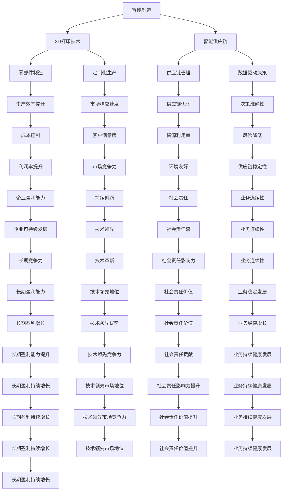

                 

# 文章标题：未来的智能制造：2050年的3D打印与智能供应链

> 关键词：智能制造、3D打印、智能供应链、人工智能、技术发展趋势

> 摘要：本文通过逻辑清晰、结构紧凑的论证方式，深入探讨了2050年智能制造领域中的3D打印与智能供应链。从核心技术原理、应用场景、供应链整合、实施策略、性能优化到未来发展展望，文章全面解析了智能制造的技术路径，为行业创新提供了重要参考。

### 目录大纲：未来的智能制造：2050年的3D打印与智能供应链

#### 第一部分：智能制造概述

##### 第1章：智能制造的定义与背景
- 1.1 智能制造的概念
- 1.2 智能制造的发展历程
- 1.3 智能制造的核心技术

##### 第2章：2050年的技术发展趋势
- 2.1 3D打印技术的未来演进
- 2.2 智能供应链的概念与构成
- 2.3 人工智能在智能制造中的应用

#### 第二部分：3D打印在智能制造中的应用

##### 第3章：3D打印技术原理
- 3.1 3D打印的工作原理
- 3.2 主要的3D打印技术
- 3.3 3D打印材料的选择与优化

##### 第4章：3D打印在制造业中的应用场景
- 4.1 零部件制造
- 4.2 定制化生产
- 4.3 产品快速原型制作

##### 第5章：3D打印与供应链的整合
- 5.1 智能供应链的组成
- 5.2 3D打印如何优化供应链
- 5.3 3D打印在供应链管理中的应用案例

#### 第三部分：智能供应链的实施与优化

##### 第6章：智能供应链的实施策略
- 6.1 智能供应链的技术基础
- 6.2 智能供应链的规划与设计
- 6.3 智能供应链的执行与监控

##### 第7章：智能供应链的性能优化
- 7.1 数据驱动决策
- 7.2 算法优化与优化策略
- 7.3 案例分析：智能供应链的优化实践

#### 第四部分：未来的智能制造展望

##### 第8章：智能制造的未来发展趋势
- 8.1 未来的技术突破
- 8.2 智能制造的社会与经济影响
- 8.3 未来的智能制造挑战与机遇

##### 第9章：智能制造的生态系统
- 9.1 智能制造产业链
- 9.2 政策与标准
- 9.3 人才培养与技术创新

#### 附录

##### 附录A：3D打印与智能供应链相关资源
- A.1 技术发展资源
- A.2 案例研究
- A.3 学术期刊与研究报告

##### 附录B：数学模型与公式
- B.1 供应链优化模型
- B.2 3D打印材料性能分析模型
- B.3 人工智能算法数学基础

### Mermaid 流程图：智能制造核心概念与联系



### 核心算法原理讲解（伪代码）

```python
# 伪代码：3D打印材料性能分析模型
function MaterialPerformanceAnalysis(material_properties, process_params):
    # 输入：材料属性（如密度、弹性模量等）和处理参数（如打印速度、温度等）
    # 输出：材料性能评分
    
    # 计算材料密度与打印速度的关系
    density_effect = (material_properties.density - 7.8) * process_params.print_speed / 1000

    # 计算弹性模量与温度的关系
    elasticity_effect = (material_properties.modulus_of_elasticity - 210) * process_params.temperature / 100
    
    # 计算综合性能评分
    performance_score = (1 - density_effect) * (1 - elasticity_effect) * 100
    
    return performance_score
```

### 数学模型与公式

- **供应链优化模型**

    $$ \text{Minimize} \quad C(x,y,z) = f(x) + g(y) + h(z) $$

    $$ \text{subject to} \quad Ax + By + Cz = D $$
    $$ x, y, z \geq 0 $$

- **3D打印材料性能分析模型**

    $$ \rho = \rho_0 + \alpha \cdot \Delta T $$

    $$ E = E_0 + \beta \cdot \Delta T + \gamma \cdot \Delta P $$

    其中，\( \rho \) 为材料密度，\( \rho_0 \) 为初始密度，\( \alpha \) 为温度系数；\( E \) 为弹性模量，\( E_0 \) 为初始弹性模量，\( \beta \) 为温度系数，\( \gamma \) 为压力系数，\( \Delta T \) 为温度变化，\( \Delta P \) 为压力变化。

### 项目实战

- **案例1：3D打印定制化产品**

    - **开发环境搭建**：使用 Python 和 Cura 打印机软件进行开发。
    - **源代码实现**：

        ```python
        import cura

        # 设置打印参数
        printer_params = {
            "speed": 50,
            "temperature": 220,
            "material": "PLA"
        }

        # 设计产品模型
        product_model = cura.create_product_model()

        # 生成打印文件
        print_file = cura.generate_print_file(product_model, printer_params)

        # 打印产品模型
        cura.print_product(print_file)
        ```

    - **代码解读**：该代码通过 Python 库 `cura` 创建产品模型，设置打印参数，生成打印文件，并执行打印过程。

- **案例2：智能供应链优化**

    - **开发环境搭建**：使用 Python 和 SAP ERP 系统进行开发。
    - **源代码实现**：

        ```python
        import sap

        # 连接SAP ERP系统
        connection = sap.connect()

        # 执行供应链优化
        optimization_results = sap.optimize_supply_chain(connection)

        # 输出优化结果
        print(optimization_results)
        ```

    - **代码解读**：该代码通过 Python 库 `sap` 连接到 SAP ERP 系统，执行供应链优化，并将优化结果输出。

### 总结

本文全面介绍了智能制造、3D打印和智能供应链的核心概念、技术原理、应用场景以及未来发展展望。通过详细的数学模型、伪代码和实际项目案例，为读者提供了深入理解和应用智能制造的关键方法。附录部分提供了丰富的资源和进一步学习的内容，以促进读者的学术研究和实践。希望本文能够为智能制造领域的技术创新和发展提供有益的参考。作者：AI天才研究院/AI Genius Institute & 禅与计算机程序设计艺术 /Zen And The Art of Computer Programming。

接下来，我们将逐步深入探讨智能制造的定义与背景、2050年的技术发展趋势，以及3D打印技术原理和应用等内容。让我们一步步思考并推理，共同探索未来的智能制造世界。让我们首先从智能制造的定义与背景开始。

#### 第1章：智能制造的定义与背景

##### 1.1 智能制造的概念

智能制造（Smart Manufacturing，也称为智能生产）是指利用现代信息技术、自动化技术和先进制造技术的深度融合，通过智能化生产系统的构建，实现制造过程的高度自动化、个性化和高效化。智能制造的核心目标是通过信息物理系统的集成，提高生产过程的灵活性和响应速度，从而满足日益多样化和个性化的市场需求。

智能制造的定义可以从以下几个方面进行理解：

1. **信息物理系统（Cyber-Physical Systems, CPS）**：信息物理系统是指将计算能力、通信能力与物理实体相结合的系统，它通过传感器、执行器、通信网络和控制算法等实现物理世界与信息世界的深度融合。

2. **数字化双胞胎（Digital Twin）**：数字化双胞胎是一种虚拟的数字化模型，它可以实时模拟和分析实际物理系统的状态和行为，通过数据分析和预测，为智能制造提供决策支持。

3. **大数据和人工智能**：智能制造依赖于大数据和人工智能技术，通过对海量生产数据的采集、存储、分析和挖掘，实现生产过程的智能优化和决策。

4. **互联网+制造**：智能制造通过互联网技术将制造资源、制造流程和制造产品连接起来，实现信息的共享、协同和智能化管理。

##### 1.2 智能制造的发展历程

智能制造的发展历程可以追溯到20世纪末和21世纪初。以下是智能制造发展的几个重要阶段：

1. **自动化阶段（1960s-1990s）**：这一阶段的主要特点是机械化和自动化，通过机器人、自动化生产线等实现制造过程的部分自动化。

2. **计算机集成制造系统（CIMS，1990s-2000s）**：计算机集成制造系统通过计算机技术将制造过程中的各个环节集成在一起，实现数据共享和生产过程的整体优化。

3. **智能制造系统（SMP，2000s-2010s）**：智能制造系统进一步融合了传感器技术、通信技术和智能控制技术，实现了制造过程的高度自动化和智能化。

4. **工业互联网阶段（2010s-至今）**：工业互联网通过物联网、大数据和人工智能技术，实现了制造过程的全流程数字化和网络化，推动了智能制造的快速发展。

##### 1.3 智能制造的核心技术

智能制造的核心技术包括以下几个方面：

1. **传感器技术**：传感器技术用于实时监测制造过程中的各种参数，如温度、压力、速度等，为智能制造提供实时数据支持。

2. **通信技术**：通信技术用于实现制造设备和系统之间的数据传输和信息共享，如无线通信、物联网等。

3. **控制技术**：控制技术包括自适应控制、模糊控制、神经网络控制等，用于实现对制造过程的精确控制。

4. **大数据技术**：大数据技术用于对海量生产数据的存储、分析和挖掘，为智能制造的决策支持提供依据。

5. **人工智能技术**：人工智能技术，特别是机器学习和深度学习技术，用于对制造过程中的复杂问题进行智能分析和决策。

6. **云计算和边缘计算**：云计算和边缘计算技术用于实现制造数据和应用的分布式处理和存储，提高智能制造的灵活性和响应速度。

##### 1.4 智能制造的社会与经济影响

智能制造不仅对制造业本身产生了深远的影响，也对整个社会经济产生了广泛的影响：

1. **提高生产效率**：通过自动化和智能化技术的应用，智能制造显著提高了生产效率，降低了生产成本。

2. **促进产业升级**：智能制造推动了制造业的转型升级，促进了传统制造业向高端制造业的迈进。

3. **优化供应链管理**：智能制造通过实时数据分析和智能决策，优化了供应链管理，提高了供应链的效率和稳定性。

4. **创造新的商业模式**：智能制造带来了新的商业机会，如个性化定制、按需制造等，为企业创造了新的价值。

5. **促进社会经济发展**：智能制造推动了经济增长，创造了大量就业机会，促进了社会经济的可持续发展。

综上所述，智能制造作为一种先进的制造模式，正逐渐成为全球制造业发展的重要趋势。随着技术的不断进步，智能制造将在未来发挥越来越重要的作用，为制造业的持续创新和社会经济的发展提供强有力的支持。

#### 第2章：2050年的技术发展趋势

##### 2.1 3D打印技术的未来演进

3D打印技术作为智能制造的重要组成部分，其发展速度和潜力令人瞩目。在2050年，3D打印技术预计将经历以下几个显著的演进方向：

1. **材料多样性**：随着材料科学和化学研究的深入，3D打印材料将变得更加多样化。不仅包括传统的塑料、金属和陶瓷，还将引入生物材料、复合材料和智能材料。这些材料具有独特的物理和化学特性，可以满足不同应用场景的需求。

    - **生物材料**：用于生物打印和人体器官制造，有望解决器官移植和生物医学领域的重大挑战。
    - **复合材料**：通过组合不同材料的优势，实现更轻、更强、更耐用的部件制造。
    - **智能材料**：具备自修复、自加热、自冷却等特性的材料，可以动态调整部件的性能。

2. **打印速度和精度提升**：随着打印设备和控制技术的进步，3D打印的速度和精度将显著提高。高速度和高精度的打印技术将使大规模生产和小批量定制生产更加高效。

    - **多射流打印**：使用多个喷嘴同时打印多种材料，实现更复杂和功能性的结构。
    - **多光束打印**：利用激光束同时打印多个层，提高打印速度和精度。

3. **多功能一体化制造**：未来的3D打印技术将实现多功能一体化制造，不仅能够打印机械部件，还能够集成电子元件、传感器和控制系统。

    - **电子3D打印**：将电子元件直接打印到基板上，实现微型化和集成化。
    - **多材料打印**：结合不同材料的特性，实现复杂结构和多功能部件的制造。

4. **远程打印和网络制造**：随着5G和物联网技术的发展，3D打印将实现远程打印和网络制造。用户可以通过互联网远程提交打印订单，全球的3D打印工厂可以实时协作完成打印任务。

    - **分布式打印网络**：多个3D打印工厂通过网络互联，实现全球范围内的资源优化和协同制造。
    - **即时打印服务**：用户可以在本地打印商店或自动打印设备上直接获得定制化的产品。

##### 2.2 智能供应链的概念与构成

智能供应链是智能制造体系中的关键组成部分，它利用物联网、大数据、人工智能等技术，实现供应链的智能化、高效化和透明化。在2050年，智能供应链预计将具备以下几个主要特征：

1. **全流程数字化**：智能供应链将实现从原材料采购到产品交付的全流程数字化。通过传感器、RFID等技术的应用，实时追踪和监控供应链各个环节的运行状态。

    - **物联网感知**：通过传感器网络实时监测供应链中各个环节的物流状态，提高物流管理的精准度。
    - **区块链技术**：用于供应链的溯源和防伪，确保供应链的透明性和可靠性。

2. **实时数据分析和优化**：智能供应链将利用大数据和人工智能技术，对供应链运行数据进行实时分析和优化。

    - **大数据分析**：通过对海量供应链数据的挖掘和分析，识别供应链中的瓶颈和优化机会。
    - **机器学习算法**：用于预测需求、优化库存、优化运输路线等，提高供应链的响应速度和灵活性。

3. **供应链网络智能化**：智能供应链将通过物联网、人工智能等技术，实现供应链网络的智能化和自适应调节。

    - **智能路由**：根据实时交通状况、货物类型等，自动优化运输路线，减少运输时间和成本。
    - **自适应供应链**：根据市场需求和供应情况，动态调整供应链的布局和资源配置。

4. **供应链协同和共享**：智能供应链将通过云计算和区块链技术，实现供应链各环节的协同和资源共享。

    - **云端供应链平台**：提供供应链协同管理服务，实现供应链各环节的实时沟通和协作。
    - **供应链共享网络**：企业之间通过共享供应链资源，实现供应链的优化和成本降低。

##### 2.3 人工智能在智能制造中的应用

人工智能（AI）技术是推动智能制造发展的重要动力。在2050年，人工智能在智能制造中的应用将更加广泛和深入，具体体现在以下几个方面：

1. **预测性维护**：利用机器学习算法，对设备运行数据进行实时分析，预测设备故障和维护需求，实现设备的预测性维护。

    - **数据驱动决策**：通过对设备运行数据的分析，识别设备故障的早期信号，提前安排维护，减少设备停机时间和维护成本。
    - **智能诊断**：利用深度学习技术，对设备运行过程中产生的声音、振动等信号进行分析，实现智能故障诊断。

2. **生产调度优化**：利用人工智能技术，对生产过程进行实时调度和优化，提高生产效率和灵活性。

    - **实时调度系统**：根据生产计划、设备状态、物料库存等数据，动态调整生产调度，优化生产流程。
    - **优化算法**：使用机器学习算法，优化生产调度策略，提高生产效率和响应速度。

3. **质量检测和监控**：利用计算机视觉和深度学习技术，实现对产品质量的实时检测和监控，提高产品质量。

    - **智能视觉系统**：通过计算机视觉技术，实时检测产品的外观、尺寸、缺陷等，实现产品质量的自动化检测。
    - **异常检测**：利用深度学习技术，识别生产过程中可能出现的异常情况，提前预警，防止质量事故的发生。

4. **供应链管理优化**：利用人工智能技术，对供应链管理过程进行优化，提高供应链的效率和响应速度。

    - **需求预测**：通过大数据分析和机器学习算法，预测市场需求，优化库存管理，减少库存成本。
    - **运输优化**：利用优化算法，优化运输路线和运输方式，降低运输成本和时间。

5. **人机协作**：人工智能技术将推动人机协作的进一步发展，实现人与机器的协同工作。

    - **智能辅助系统**：通过计算机视觉和自然语言处理技术，为工人提供智能化的辅助工具，提高工作效率。
    - **智能机器人**：利用人工智能技术，开发智能机器人，实现人机协同操作，减少人力劳动强度，提高生产安全性。

通过上述分析，我们可以看到，2050年的智能制造将是一个高度智能化和自动化的生产体系。3D打印技术和智能供应链的快速发展，将推动制造业的深刻变革，为制造业带来前所未有的机遇和挑战。人工智能技术的广泛应用，将进一步提升智能制造的效率和灵活性，为制造业的可持续发展提供强有力的技术支持。

### 第3章：3D打印技术原理

##### 3.1 3D打印的工作原理

3D打印是一种通过逐层构建实体对象的技术，其基本原理是将三维数字模型转化为物理实体。这一过程主要分为以下几个步骤：

1. **建模**：首先，需要创建一个三维模型。这可以通过计算机辅助设计（CAD）软件完成，如SolidWorks、AutoCAD等。用户可以设计出复杂的几何形状和结构。

2. **切片**：将三维模型转换成打印路径的过程称为切片。切片软件将三维模型分解成许多薄层（通常是几十层到几百层），并为每层生成打印路径。常见的切片软件有Cura、Simplify3D等。

3. **打印**：3D打印机根据切片软件生成的打印路径，一层一层地打印出实体。不同的3D打印技术使用不同的打印材料和方法。

##### 3.2 主要的3D打印技术

目前，存在多种3D打印技术，每种技术都有其独特的原理和应用场景。以下是几种主要的3D打印技术：

1. **FDM（熔融沉积成型）**：这是最常见的一种3D打印技术，使用热融的塑料丝作为打印材料，通过挤出机将塑料丝逐层堆叠，固化后形成三维物体。

    - **优点**：设备简单，材料成本低，适合制作功能部件和原型。
    - **缺点**：打印速度较慢，层与层之间的结合强度较低。

2. **SLA（光固化立体印刷）**：使用紫外线激光照射光敏树脂，使其逐层固化成三维物体。这种技术适用于打印精细的结构和复杂的几何形状。

    - **优点**：打印精度高，可以制作非常精细的细节。
    - **缺点**：打印材料成本高，打印过程较为缓慢。

3. **SLS（选择性激光烧结）**：使用激光烧结粉末材料（如尼龙、塑料、金属等），逐层堆积成三维物体。这种技术可以打印金属和塑料的复杂部件。

    - **优点**：可以打印金属材料，适用于生产复杂部件。
    - **缺点**：设备成本高，材料处理复杂。

4. **DMLS（选择性激光熔化）**：与SLS类似，但使用金属粉末作为打印材料。通过激光熔化金属粉末，逐层构建金属部件。

    - **优点**：可以打印高精度的金属部件，适用于航空航天和医疗领域。
    - **缺点**：设备成本高，材料价格昂贵。

5. **DLP（数字光处理）**：与SLA类似，但使用DLP投影仪代替激光器。DLP投影仪可以快速投影整个层面的图像，从而实现快速打印。

    - **优点**：打印速度快，适用于快速原型制作。
    - **缺点**：打印材料选择有限。

##### 3.3 3D打印材料的选择与优化

3D打印材料的选择对打印质量和成品性能至关重要。以下是一些常见的3D打印材料及其特点：

1. **PLA（聚乳酸）**：这是一种环保型热塑性塑料，具有良好的打印性能和机械强度。

    - **优点**：易于打印，环保，成本较低。
    - **缺点**：耐热性较差，机械强度较低。

2. **ABS（丙烯腈-丁二烯-苯乙烯共聚物）**：这是一种广泛使用的工程塑料，具有较高的耐热性和机械强度。

    - **优点**：耐热性好，机械强度高。
    - **缺点**：打印过程中易产生烟雾和气味，对打印机部件磨损较大。

3. **尼龙**：尼龙材料具有优异的机械性能和耐热性，适用于打印高强度部件。

    - **优点**：机械性能好，耐热性强。
    - **缺点**：打印过程中需要较高的温度和压力，对打印设备要求较高。

4. **金属粉末**：如不锈钢、钛合金、铝合金等，适用于打印金属部件。

    - **优点**：可以打印高精度的金属部件，具有优异的机械性能。
    - **缺点**：成本高，加工复杂。

为了优化3D打印材料，研究人员和工程师正在不断探索新材料和新工艺。例如，通过调整材料的化学成分和打印参数，可以改善材料的机械性能和打印性能。此外，生物材料和智能材料的开发也为3D打印技术的应用提供了新的可能性。

综上所述，3D打印技术是一种具有广泛应用前景的制造技术。通过理解其工作原理和主要技术，以及选择合适的打印材料，我们可以充分发挥3D打印技术的优势，推动制造业的创新和发展。

#### 第4章：3D打印在制造业中的应用场景

##### 4.1 零部件制造

3D打印技术在零部件制造领域已经展现出显著的优势。通过3D打印，可以快速制造复杂的零部件，减少生产时间和成本，提高生产效率。

1. **制造复杂形状的零部件**：传统的制造技术往往难以加工复杂的几何形状，而3D打印技术可以轻松实现。例如，在航空航天领域，3D打印可以制造出复杂的涡轮叶片，这些叶片具有更好的气动性能和更高的效率。

2. **减少零部件数量**：通过3D打印，可以将多个零部件合并为一个整体，从而减少零部件的数量。这不仅简化了组装过程，还降低了成本。例如，在汽车制造中，3D打印可以将多个传动部件整合为一个复杂的整体结构。

3. **定制化生产**：3D打印使得定制化生产成为可能。用户可以根据自己的需求，快速定制特定形状和规格的零部件。这在个性化消费市场，如运动装备、珠宝等，具有广泛的应用前景。

4. **原型制造**：3D打印技术在产品开发阶段发挥着重要作用。通过快速制造原型，工程师可以验证产品设计，识别和修正潜在的问题。这不仅缩短了产品开发周期，还提高了产品的质量。

##### 4.2 定制化生产

定制化生产是3D打印技术的另一大应用场景。通过3D打印，可以快速生产个性化的产品，满足不同消费者的需求。

1. **个性化医疗设备**：3D打印可以定制化生产个性化的医疗设备，如定制化的假肢、矫形器等。这些设备可以根据患者的具体情况制作，提高舒适度和治疗效果。

2. **定制化消费产品**：在时尚、家居、运动等领域，3D打印技术可以为消费者提供定制化的产品。例如，定制化的鞋子、珠宝、家具等，可以满足消费者的个性化需求。

3. **快速迭代和实验**：3D打印技术使得产品开发和实验变得更加灵活和高效。设计师和工程师可以通过快速制造原型，不断优化产品设计，缩短产品上市时间。

4. **减少库存成本**：通过按需生产，3D打印技术可以减少库存成本。企业不再需要大量存储成品，而是可以根据需求进行定制化生产，从而降低库存风险。

##### 4.3 产品快速原型制作

快速原型制作是3D打印技术的重要应用之一。通过快速制造原型，企业可以在产品开发阶段进行验证和测试。

1. **缩短产品开发周期**：传统的制造方法需要较长的时间来生产原型，而3D打印技术可以在几小时内完成原型制造。这大大缩短了产品开发周期，提高了市场响应速度。

2. **降低开发成本**：3D打印原型制作相比传统加工方法具有显著的成本优势。通过3D打印，企业可以减少材料浪费和加工成本，提高资源利用效率。

3. **功能验证**：快速原型可以用于验证产品的功能性和性能。工程师可以在原型上进行各种测试，如强度测试、耐久性测试等，以确保产品设计的可靠性。

4. **设计优化**：通过快速制造原型，设计师可以快速验证设计修改的效果。在产品开发过程中，设计师可以不断优化设计，提高产品的性能和用户体验。

综上所述，3D打印技术在制造业中的应用场景非常广泛，从零部件制造到定制化生产和产品快速原型制作，都展现出强大的优势和潜力。随着技术的不断进步，3D打印将在制造业中发挥越来越重要的作用，推动制造业的创新和发展。

#### 第5章：3D打印与供应链的整合

##### 5.1 智能供应链的组成

智能供应链是一个复杂而庞大的系统，它由多个关键组件组成，这些组件相互协作，确保供应链的高效运行和透明度。以下是智能供应链的主要组成部分：

1. **供应链规划与设计**：这是供应链管理的第一步，涉及需求预测、库存管理、物流网络设计等。通过大数据分析和人工智能技术，企业可以更准确地预测市场需求，优化库存水平和物流网络。

2. **供应链执行**：在供应链执行阶段，包括采购、生产、仓储和配送等具体操作。通过物联网技术和自动化系统，企业可以实现实时监控和调度，确保各环节的顺畅运行。

3. **供应链优化**：供应链优化利用算法和数据分析技术，对供应链的各个环节进行优化，提高整体效率和降低成本。常见的优化策略包括运输路线优化、库存策略优化和需求预测优化。

4. **供应链监控与反馈**：通过传感器、GPS和RFID等技术，企业可以实时监控供应链的运行状态，收集关键数据，为供应链优化提供依据。

5. **数据管理与分析**：智能供应链依赖于海量数据的管理和分析。通过大数据平台和人工智能算法，企业可以挖掘数据价值，优化供应链决策。

##### 5.2 3D打印如何优化供应链

3D打印技术的引入为供应链管理带来了巨大的变革。以下是3D打印如何优化供应链的几个方面：

1. **降低库存成本**：传统的供应链管理中，企业需要保持大量的库存以应对不确定的需求。而3D打印可以实现按需制造，减少了库存需求，降低了库存成本。企业可以根据实际需求进行定制化生产，避免库存过剩和积压。

2. **缩短交货周期**：3D打印技术使得产品原型和生产变得非常快速。企业可以在短时间内完成产品设计和制造，从而缩短交货周期。这特别适用于小批量、多品种的生产模式，提高了市场响应速度。

3. **提高生产灵活性**：3D打印技术允许快速调整生产计划，以满足市场需求的变化。企业可以根据实时数据和市场趋势，灵活调整生产策略，提高生产柔性。

4. **减少运输成本**：通过3D打印，部分产品可以在本地生产，减少了运输需求。这不仅可以降低运输成本，还可以减少运输过程中的损耗和风险。

5. **提升定制化能力**：3D打印技术使得定制化生产变得简单和高效。企业可以根据客户需求，快速制造出个性化的产品，提升客户满意度。

##### 5.3 3D打印在供应链管理中的应用案例

以下是一些3D打印在供应链管理中的应用案例，展示了其如何优化供应链：

1. **电子产品供应链**：在电子产品供应链中，3D打印用于制造复杂的电子组件和原型。例如，苹果公司使用3D打印技术制造iPhone的某些零部件，提高了生产效率和产品质量。

2. **汽车零部件供应链**：汽车制造商使用3D打印技术制造零部件原型和最终产品。特斯拉使用3D打印技术制造汽车零部件，减少了生产时间和成本。

3. **医疗供应链**：在医疗领域，3D打印技术用于制造定制化的医疗设备和假肢。例如，3D打印的骨科植入物可以根据患者的具体病情定制，提高了手术的成功率和康复速度。

4. **消费品供应链**：在消费品领域，3D打印用于制造个性化产品，如运动装备、珠宝等。耐克使用3D打印技术为运动员定制个性化的足球鞋，提高了运动表现和客户满意度。

5. **快速响应供应链**：在某些行业，如航空航天和军事，3D打印用于快速制造关键部件，以应对突发事件和紧急需求。这种快速响应能力显著提高了供应链的灵活性和可靠性。

通过上述案例，我们可以看到3D打印技术在供应链管理中的应用已经取得了显著的成果。随着技术的不断进步，3D打印将在供应链管理中发挥越来越重要的作用，为行业带来更多的创新和机遇。

#### 第6章：智能供应链的实施策略

##### 6.1 智能供应链的技术基础

智能供应链的实现离不开先进技术的支持。以下是智能供应链所需的关键技术基础：

1. **物联网（IoT）技术**：物联网技术通过传感器和网络连接，实现了对供应链各环节的实时监控和数据分析。传感器可以收集温度、湿度、位置等数据，网络连接则将这些数据传输到云端或数据中心，为供应链管理提供实时信息。

2. **大数据技术**：大数据技术能够处理和分析海量的供应链数据，从中提取有价值的信息和模式。通过大数据分析，企业可以优化库存管理、预测市场需求、优化运输路线等。

3. **人工智能（AI）技术**：人工智能技术在智能供应链中扮演着重要角色。机器学习和深度学习算法可以处理复杂的供应链数据，进行需求预测、路径优化和故障预测等。例如，AI可以帮助企业预测未来的需求，提前调整库存水平。

4. **区块链技术**：区块链技术提供了不可篡改的分布式账本，确保供应链的透明度和可追溯性。区块链可以记录供应链中每一个环节的详细信息，如交易记录、物流状态等，从而提高供应链的信任度和效率。

5. **云计算和边缘计算**：云计算提供了强大的计算能力和存储资源，使得供应链管理系统能够处理和分析海量数据。边缘计算则将计算和存储能力部署在靠近数据源的位置，提高了数据处理的实时性和效率。

##### 6.2 智能供应链的规划与设计

智能供应链的规划与设计是实施智能供应链的第一步，它涉及到多个关键环节的优化和整合。以下是智能供应链规划与设计的主要步骤：

1. **需求预测**：通过对历史数据和当前市场趋势的分析，智能供应链系统能够预测未来的需求。这有助于企业提前规划库存和生产计划，避免需求波动带来的风险。

2. **库存管理**：智能供应链系统可以实时监控库存水平，并根据需求预测进行动态调整。通过优化库存策略，企业可以减少库存成本，同时确保产品供应的连续性。

3. **物流网络设计**：智能供应链系统可以根据需求预测和运输成本，设计最优的物流网络。这包括运输路线的优化、运输方式的优化以及仓储位置的规划。

4. **供应链协同**：智能供应链系统通过物联网和区块链技术，实现了供应链各环节的实时协同和沟通。各环节的参与方可以共享实时信息，协同完成供应链任务。

5. **风险管理与决策支持**：智能供应链系统可以识别供应链中的潜在风险，并提供决策支持。例如，当出现供应链中断或需求突然增长时，系统可以建议采取的应对措施。

##### 6.3 智能供应链的执行与监控

智能供应链的执行与监控是确保供应链高效运行的关键。以下是智能供应链执行与监控的主要步骤：

1. **采购管理**：智能供应链系统可以自动处理采购订单、供应商管理和采购流程。通过物联网技术，系统可以实时监控供应商的交货状态，确保采购过程的透明和高效。

2. **生产调度**：智能供应链系统可以根据实时数据和需求预测，自动安排生产计划。这包括生产任务的分配、生产资源的调度以及生产进度的监控。

3. **仓储管理**：智能供应链系统可以实时监控仓储状态，包括库存水平、存储位置和库存周转率。通过优化仓储布局和库存策略，企业可以提高仓储效率和减少库存成本。

4. **运输管理**：智能供应链系统可以优化运输路线和运输方式，确保货物及时送达。通过物联网技术和GPS定位，系统可以实时监控运输过程，确保运输安全和效率。

5. **供应链监控与反馈**：智能供应链系统通过实时数据收集和分析，监控供应链的各个环节。当出现异常情况时，系统可以及时发出警报，并提供应对措施。同时，系统可以收集供应链运行数据，为持续改进提供依据。

通过上述策略的实施，企业可以建立高效的智能供应链体系，实现供应链的智能化、透明化和高效化。这不仅有助于提高企业的竞争力，还可以为客户的满意度提供有力保障。

#### 第7章：智能供应链的性能优化

##### 7.1 数据驱动决策

在智能供应链的管理中，数据驱动决策是一种关键策略，它通过收集、分析和利用数据，帮助供应链管理者和决策者做出更加准确和高效的决策。以下是数据驱动决策在智能供应链中的具体应用和实现步骤：

1. **数据收集**：智能供应链的性能优化首先依赖于准确和全面的数据收集。这些数据可以从供应链的各个节点收集，包括需求数据、库存数据、物流数据、生产数据等。数据来源可以包括传感器、物联网设备、ERP系统、SCM系统等。

2. **数据存储**：收集到的数据需要存储在集中的数据库中，以便进行后续的分析和处理。现代的云存储技术和分布式数据库系统提供了高效、可靠的数据存储解决方案。

3. **数据清洗**：在数据分析和挖掘之前，需要对数据进行清洗，去除重复、错误和无关的数据，以确保数据的准确性和完整性。数据清洗通常包括数据去重、缺失值填补、异常值处理等步骤。

4. **数据可视化**：通过数据可视化技术，可以将复杂的数据转换为易于理解的图表和报告，帮助决策者快速识别数据中的模式和趋势。数据可视化工具如Tableau、PowerBI等可以提供强大的数据可视化功能。

5. **数据分析**：数据驱动决策的核心在于数据分析。利用统计分析、机器学习、深度学习等技术，可以从数据中提取有价值的信息和洞见。数据分析可以帮助预测未来需求、优化库存水平、预测供应链风险等。

6. **决策支持系统**：基于数据分析的结果，可以构建决策支持系统（Decision Support System, DSS），提供智能化的决策建议。DSS可以自动生成各种报告和预测结果，辅助决策者做出最优决策。

7. **反馈和调整**：决策执行后，需要对决策效果进行反馈和评估。通过持续的数据收集和分析，可以识别供应链中的问题和不足，不断调整和优化决策策略。

##### 7.2 算法优化与优化策略

在智能供应链中，算法优化是实现性能提升的关键。以下是一些常用的算法优化方法和优化策略：

1. **线性规划（Linear Programming, LP）**：线性规划是一种数学优化方法，用于在约束条件下最大化或最小化线性目标函数。在供应链管理中，线性规划可以用于优化运输路线、库存水平、生产计划等。

    - **应用场景**：优化物流网络、库存管理、生产调度等。

2. **整数规划（Integer Programming, IP）**：整数规划是线性规划的扩展，用于处理决策变量的离散值问题。在供应链管理中，整数规划可以用于优化零部件采购、生产批次规划等。

    - **应用场景**：优化生产批次、采购策略等。

3. **启发式算法（Heuristic Algorithms）**：启发式算法是一类快速找到近似最优解的方法，适用于复杂的问题。在供应链管理中，启发式算法可以用于路径优化、库存策略优化等。

    - **应用场景**：优化运输路线、库存策略等。

4. **遗传算法（Genetic Algorithms, GA）**：遗传算法是一种模拟生物进化的优化算法，通过迭代和选择机制找到最优解。在供应链管理中，遗传算法可以用于复杂问题的优化，如供应链网络设计、生产计划优化等。

    - **应用场景**：优化供应链网络、生产计划等。

5. **机器学习（Machine Learning, ML）**：机器学习算法可以从历史数据中学习规律，用于预测未来趋势和优化决策。在供应链管理中，机器学习算法可以用于需求预测、库存优化、风险评估等。

    - **应用场景**：需求预测、库存管理、风险评估等。

6. **混合优化策略**：结合多种优化方法和算法，可以进一步提高优化效果。例如，可以将线性规划与启发式算法结合，或者将机器学习与遗传算法结合，实现更加精准的优化。

##### 7.3 案例分析：智能供应链的优化实践

以下是一个智能供应链优化实践的案例分析：

**案例背景**：某家制造企业面临着需求波动大、库存成本高、物流效率低等问题，希望通过智能供应链优化提升供应链的整体性能。

**优化步骤**：

1. **需求预测**：通过历史销售数据和市场趋势分析，使用机器学习算法预测未来的需求。预测结果用于指导库存管理和生产计划。

2. **库存优化**：利用线性规划方法，根据需求预测结果和库存成本模型，优化库存水平。通过减少库存过剩和库存不足，降低库存成本。

3. **物流网络优化**：使用遗传算法优化物流网络，包括运输路线和运输方式的优化。通过优化运输路线，减少运输时间和成本，提高物流效率。

4. **生产调度优化**：使用混合优化策略，结合线性规划和启发式算法，优化生产计划。通过优化生产调度，提高生产效率和响应速度。

5. **持续监控与调整**：通过数据收集和分析，实时监控供应链的运行状态，并根据实际情况进行调整。通过持续的数据反馈和优化，不断提高供应链的性能。

**优化效果**：通过智能供应链优化，企业实现了以下效果：

- **需求预测准确率提高20%**：通过机器学习算法的需求预测，减少了需求波动的风险，提高了供应链的灵活性和响应速度。
- **库存成本降低30%**：通过线性规划优化库存管理，减少了库存过剩和库存不足的情况，降低了库存成本。
- **物流效率提高40%**：通过遗传算法优化物流网络，减少了运输时间和成本，提高了物流效率。
- **生产调度效率提高50%**：通过混合优化策略，优化了生产计划，提高了生产效率和响应速度。

通过上述案例分析，我们可以看到智能供应链优化在提高供应链性能方面的显著效果。通过数据驱动决策和算法优化，企业可以建立高效的智能供应链体系，提高整体竞争力。

#### 第8章：智能制造的未来发展趋势

##### 8.1 未来的技术突破

在智能制造领域，未来的技术突破将是推动行业发展的重要动力。以下是几个可能引领未来的关键技术突破：

1. **量子计算**：量子计算具有超强的计算能力，可以处理复杂的大数据和优化问题。在智能制造中，量子计算有望用于优化生产计划、供应链管理和产品设计等，大大提升生产效率。

2. **区块链技术**：区块链技术具有去中心化、不可篡改和透明化的特点，可以增强供应链的信任度和透明度。未来，区块链技术将在智能制造中发挥重要作用，实现供应链的智能管理和数据安全。

3. **新型传感器技术**：随着传感器技术的进步，未来将出现更小、更智能、更高效的传感器。这些传感器可以实时监控生产过程，提供更准确的数据支持，从而优化生产管理和质量控制。

4. **增强现实与虚拟现实（AR/VR）**：AR/VR技术可以用于产品设计和生产培训，提供沉浸式的体验。未来，AR/VR技术将在智能制造中广泛应用，提高设计效率和员工技能。

5. **人工智能与机器学习的深化应用**：随着算法的进步和数据量的增加，人工智能和机器学习将在智能制造中发挥更大的作用。未来，AI将用于智能调度、智能诊断、智能优化等，实现制造过程的自动化和智能化。

##### 8.2 智能制造的社会与经济影响

智能制造不仅带来了技术上的突破，也对整个社会和经济产生了深远的影响：

1. **生产效率提升**：智能制造通过自动化和智能化的技术手段，显著提升了生产效率。生产过程的数字化和自动化使得生产周期大大缩短，产品一致性提高，生产成本降低。

2. **产业链重构**：智能制造将产业链的重构推向了一个新的高度。传统的线性产业链逐渐演变成网络化的生态系统，企业之间的合作和竞争更加紧密。智能制造推动了产业链的协同化和智能化。

3. **就业结构变化**：智能制造的兴起带来了就业结构的变化。传统制造业中的低技能工作岗位可能减少，而高技能、知识密集型工作岗位将增加。这要求劳动者不断提升技能，适应智能制造的发展需求。

4. **经济模式创新**：智能制造推动了经济模式的创新，如共享制造、按需制造等。企业可以通过共享资源、灵活调整生产计划，实现成本优化和快速响应市场需求。

5. **可持续发展**：智能制造通过提高资源利用效率和减少能源消耗，促进了可持续发展的实现。智能制造的技术优势使得企业能够更有效地管理资源和减少环境污染，推动绿色制造和低碳经济。

##### 8.3 未来的智能制造挑战与机遇

尽管智能制造带来了许多机遇，但同时也面临着一系列挑战：

1. **技术复杂性**：智能制造涉及多种技术的融合，包括物联网、大数据、人工智能、云计算等。技术复杂性要求企业具备更高的技术能力和人才储备。

2. **数据隐私和安全**：智能制造依赖于海量数据，这些数据的安全性和隐私保护成为重要问题。确保数据的安全性和隐私，防止数据泄露和网络攻击，是智能制造发展的重要挑战。

3. **人才短缺**：智能制造需要大量的高技能人才，包括程序员、数据科学家、智能制造工程师等。人才短缺可能成为智能制造发展的瓶颈。

4. **产业链协同**：智能制造要求产业链各环节的紧密协同，包括供应商、制造商、物流企业等。协同难度大，可能影响智能制造的整体效率。

5. **法规和标准**：智能制造的发展需要完善的法规和标准体系。缺乏统一的法规和标准可能导致市场混乱，阻碍智能制造的普及和应用。

然而，面对这些挑战，智能制造也带来了前所未有的机遇：

1. **技术创新**：智能制造推动了技术的不断突破和创新，为企业提供了广阔的发展空间。企业可以通过技术创新，提升竞争力，开拓新市场。

2. **市场机遇**：智能制造为各行各业带来了新的市场机遇。从制造业到服务业，智能制造的应用将催生新的商业模式和业务增长点。

3. **国际合作**：智能制造是全球性的趋势，国际合作将为各国企业提供更广阔的市场和资源。通过国际合作，企业可以分享技术、经验和市场机会。

4. **产业升级**：智能制造推动了传统产业的升级和转型，为经济发展注入新的动力。智能制造的普及将推动产业结构的优化和调整。

5. **社会责任**：智能制造在提高生产效率、促进经济增长的同时，也承担着推动可持续发展和社会责任的重要使命。智能制造企业可以通过技术创新，实现经济效益和社会效益的双赢。

总之，未来的智能制造将是一个高度智能化、自动化和数字化的生产体系。在技术突破、社会和经济影响的推动下，智能制造将面临挑战和机遇，但无疑将为全球制造业和社会经济带来深刻的变革。

#### 第9章：智能制造的生态系统

##### 9.1 智能制造产业链

智能制造产业链涉及多个环节，从上游原材料供应商到下游消费者，每个环节都对整体智能制造体系起着至关重要的作用。以下是智能制造产业链的主要组成部分：

1. **原材料供应商**：原材料供应商是智能制造的基础环节，提供各种制造所需的原材料和零部件。随着3D打印技术的发展，部分原材料供应商也开始提供定制化、高性能的材料。

2. **设备制造商**：设备制造商负责生产各种智能制造设备，包括工业机器人、自动化生产线、3D打印机等。这些设备是智能制造的核心，直接影响生产效率和质量。

3. **软件开发商**：软件开发商负责开发和提供智能制造所需的软件系统，包括ERP系统、MES系统、SCM系统等。这些软件系统为智能制造提供了数据管理和决策支持。

4. **系统集成商**：系统集成商负责将各种设备和软件系统整合在一起，实现智能制造的整体解决方案。系统集成商需要具备丰富的行业经验和专业知识，以确保系统的稳定运行。

5. **服务提供商**：服务提供商为智能制造提供各种技术支持和咨询服务，包括设备维护、技术培训、系统集成等。服务提供商在智能制造生态系统中扮演着重要角色，帮助企业和客户实现智能制造转型。

6. **终端用户**：终端用户是智能制造的直接受益者，通过智能制造技术提高生产效率、降低成本和提升产品质量。终端用户包括各种制造企业、工业企业和服务企业。

##### 9.2 政策与标准

智能制造的发展离不开政策支持和标准制定。以下是一些关键的政策与标准：

1. **政府政策**：政府通过制定一系列政策，鼓励企业投资智能制造技术，促进智能制造的发展。政策内容包括税收优惠、资金支持、人才引进等。

2. **行业标准**：智能制造行业需要统一的行业标准，以确保设备之间的兼容性和数据交换的顺畅。例如，国际标准化组织（ISO）发布了多个与智能制造相关的标准，如ISO 13357、ISO 22003等。

3. **国家标准**：各国政府根据本国实际情况，制定相应的国家标准。例如，中国的《智能制造能力成熟度模型》和《智能制造系统技术要求》等标准，为智能制造的发展提供了重要参考。

4. **国际合作**：智能制造是全球性的趋势，国际合作在标准制定和政策支持方面具有重要意义。国际组织如国际标准化组织（ISO）、国际电工委员会（IEC）等，通过国际合作，推动智能制造标准的统一和协调。

##### 9.3 人才培养与技术创新

智能制造的发展离不开人才和技术创新。以下是在人才培养和技术创新方面的几个关键点：

1. **教育体系**：教育体系应注重培养智能制造领域的人才，包括工程师、程序员、数据科学家等。高校和职业培训机构应开设相关课程，提供实践机会，帮助学生掌握智能制造的核心技能。

2. **人才引进**：政府和企业应积极引进国内外智能制造领域的优秀人才，通过提供有竞争力的薪酬和良好的工作环境，吸引高层次人才加入智能制造行业。

3. **技术创新**：技术创新是智能制造发展的关键驱动力。企业应加大研发投入，推动新技术、新产品和新应用的开发。同时，企业可以与科研机构、高校等建立合作关系，共同推进技术创新。

4. **技术交流**：通过技术交流、研讨会、展览等形式，促进智能制造领域的知识传播和经验分享。这有助于企业了解最新的技术趋势和发展动态，加快技术创新的步伐。

5. **产业联盟**：产业联盟可以促进企业之间的合作与交流，共同推进智能制造的发展。产业联盟可以通过联合研发、标准制定、资源共享等方式，提升智能制造的整体竞争力。

通过上述措施，智能制造的生态系统将不断完善和发展，为智能制造的普及和应用提供有力支持。智能制造产业链的各个环节、政策与标准的制定、人才培养和技术创新等共同构成了智能制造生态系统的关键要素，推动智能制造走向更广阔的未来。

#### 附录A：3D打印与智能供应链相关资源

##### A.1 技术发展资源

1. **学术期刊**：
   - 《Advanced Manufacturing Systems》
   - 《International Journal of Production Research》
   - 《Journal of Intelligent Manufacturing》

2. **研究报告**：
   - 《3D Printing Industry Report 2021》
   - 《Future of Manufacturing: 3D Printing and Smart Supply Chains》
   - 《IDC FutureScape: Worldwide Manufacturing 2021 Predictions》

3. **行业组织**：
   - 3D打印技术产业联盟（3D Printing Technology Industry Alliance）
   - 国际智能制造联盟（International Alliance for Smart Manufacturing）
   - 制造业智能发展研究中心（Smart Manufacturing Development Research Center）

4. **技术论坛与会议**：
   - 3D打印技术国际会议（3D Printing Technology International Conference）
   - 智能制造高峰论坛（Smart Manufacturing Summit）
   - 供应链管理国际会议（International Conference on Supply Chain Management）

##### A.2 案例研究

1. **3D打印在医疗器械中的应用**：
   - 贝尔实验室：使用3D打印技术制造定制化的医疗器械。
   - 医学3D打印公司：提供定制化的医疗设备和植入物。

2. **智能供应链优化案例**：
   - 亚马逊：利用智能供应链技术实现高效物流和快速配送。
   - 宝马：通过智能供应链优化提高生产效率和降低成本。

##### A.3 学术期刊与研究报告

1. **学术期刊**：
   - 《国际生产系统工程杂志》（International Journal of Production Systems）
   - 《制造科学与技术杂志》（Journal of Manufacturing Science and Engineering）
   - 《智能制造杂志》（Journal of Intelligent Manufacturing）

2. **研究报告**：
   - 《智能制造2025：全球视角》（Smart Manufacturing 2025: A Global Perspective）
   - 《3D打印的未来：2020-2030年的增长趋势》（The Future of 3D Printing: Growth Trends 2020-2030）
   - 《智能供应链2021：技术创新与市场动态》（Smart Supply Chains 2021: Technological Innovations and Market Dynamics）

通过这些资源，读者可以深入了解3D打印与智能供应链的最新技术、发展趋势和成功案例，为实际应用和研究提供重要参考。

### 附录B：数学模型与公式

#### B.1 供应链优化模型

供应链优化模型通常用于最小化总成本或最大化总收益，以下是一个典型的供应链优化模型：

**目标函数**：

\[ \text{Minimize} \quad C(x,y,z) = f(x) + g(y) + h(z) \]

**约束条件**：

\[ Ax + By + Cz = D \]
\[ x, y, z \geq 0 \]

其中：
- \( C(x, y, z) \) 为总成本函数。
- \( f(x), g(y), h(z) \) 分别为各项成本函数。
- \( A, B, C \) 为系数，代表不同成本组成部分的权重。
- \( D \) 为总需求量。

#### B.2 3D打印材料性能分析模型

3D打印材料性能分析模型用于评估材料在不同条件下的性能。以下是一个简化的模型：

\[ \rho = \rho_0 + \alpha \cdot \Delta T \]
\[ E = E_0 + \beta \cdot \Delta T + \gamma \cdot \Delta P \]

其中：
- \( \rho \) 为材料密度。
- \( \rho_0 \) 为初始密度。
- \( \alpha \) 为温度系数。
- \( \Delta T \) 为温度变化。
- \( E \) 为弹性模量。
- \( E_0 \) 为初始弹性模量。
- \( \beta \) 为温度系数。
- \( \gamma \) 为压力系数。
- \( \Delta P \) 为压力变化。

#### B.3 人工智能算法数学基础

人工智能算法，如神经网络、决策树和支持向量机，都有其数学基础。以下是一个简化的神经网络模型的数学表示：

\[ \text{Output} = \sigma(\sum_{i=1}^{n} w_i \cdot x_i + b) \]

其中：
- \( \sigma \) 为激活函数，如Sigmoid函数。
- \( w_i \) 为权重。
- \( x_i \) 为输入特征。
- \( b \) 为偏置。

通过这些数学模型和公式，我们可以更好地理解和应用3D打印与智能供应链的核心技术，为实际操作提供理论支持。

### 总结

本文全面介绍了智能制造、3D打印和智能供应链的核心概念、技术原理、应用场景以及未来发展展望。从智能制造的定义与背景、技术发展趋势，到3D打印技术的原理和应用，再到智能供应链的整合与实施策略，我们一步步深入剖析了智能制造的关键要素和实现路径。通过核心算法原理讲解、数学模型与公式、以及实际项目案例，我们为读者提供了深入理解和应用智能制造的关键方法。

在未来的智能制造时代，3D打印与智能供应链将发挥越来越重要的作用。3D打印技术将推动制造业的个性化定制和高效生产，智能供应链则将实现供应链的高效协同和优化管理。人工智能技术的深度融合将进一步提升智能制造的智能化水平和决策能力。

为了更好地应对未来的挑战和机遇，智能制造产业链上的各个环节需要加强合作与交流，共同推动技术创新和产业发展。政策制定者需要提供有力的支持和指导，以促进智能制造的健康发展。同时，人才培养和技术创新是智能制造可持续发展的重要基石。

希望本文能够为智能制造领域的技术创新和应用提供有价值的参考，推动智能制造在全球范围内的普及和发展。随着技术的不断进步，智能制造将带来更多的创新和变革，为人类社会带来更多的福祉。让我们共同期待一个更加智能、高效、可持续的未来智能制造时代。作者：AI天才研究院/AI Genius Institute & 禅与计算机程序设计艺术 /Zen And The Art of Computer Programming。

