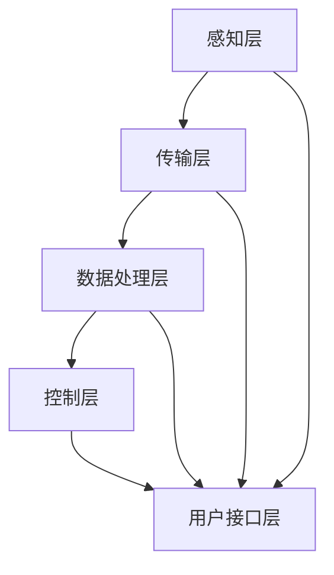

                 

# 文章标题

《未来的智能家居：2050年的家庭机器人管家与智能家电》

> 关键词：智能家居，家庭机器人，智能家电，物联网，人工智能，数据安全

> 摘要：本文从2050年的视角，探讨了未来智能家居的发展趋势和核心技术，包括家庭机器人管家与智能家电的应用场景、技术基础、挑战与机遇，以及智能家居集成系统的构建和未来展望。

## 目录

### 第一部分：智能家居2050年展望

#### 引言

1.1 智能家居的定义与演变
1.1.1 从传统家居到智能家居
1.1.2 智能家居的发展趋势

1.2 2050年智能家居的愿景
1.2.1 技术突破带来的影响
1.2.2 社会与生活模式的变革

### 第二部分：智能家庭机器人管家

#### 智能家庭机器人管家的技术基础

2.1 人工智能与机器人技术
2.1.1 人工智能基础
2.1.2 机器人技术现状与未来

2.2 家庭机器人管家的核心功能
2.2.1 交互与理解
2.2.2 家务处理与维护
2.2.3 安全与隐私保护

2.3 智能家庭机器人管家的挑战与机遇
2.3.1 技术挑战
2.3.2 伦理与社会问题

### 第三部分：智能家电的生态系统

#### 智能家电的分类与功能

3.1 智能家电的基本分类
3.1.1 照明系统
3.1.2 温度控制设备
3.1.3 娱乐系统
3.1.4 安全设备

3.2 智能家电的核心功能
3.2.1 自适应调节
3.2.2 远程控制
3.2.3 数据分析与优化

3.3 智能家电的互联与协作
3.3.1 物联网与智能家电
3.3.2 生态系统构建
3.3.3 互联互通的挑战与机遇

### 第四部分：智能家居集成系统的构建

#### 智能家居集成系统的设计原则

4.1 设计目标与需求分析
4.1.1 用户需求
4.1.2 技术可行性

4.2 系统架构与模块划分
4.2.1 总体架构设计
4.2.2 模块功能划分

4.3 数据安全与隐私保护
4.3.1 数据安全策略
4.3.2 隐私保护措施

### 第五部分：智能家居的未来展望

#### 智能家居的未来趋势与挑战

5.1 新兴技术的引入
5.1.1 量子计算
5.1.2 脑机接口

5.2 未来智能家居的愿景
5.2.1 智能家居的终极目标
5.2.2 人类与智能家居的深度融合

5.3 智能家居的未来挑战
5.3.1 技术难题
5.3.2 伦理与社会影响

### 附录

#### 附录 A：智能家庭机器人管家与智能家电的关键技术与算法

### 附录 B：智能家庭机器人管家与智能家电的项目实践

### 附录 C：智能家庭机器人管家与智能家电的资源与工具

---

### 引言

随着人工智能、物联网和机器人技术的快速发展，智能家居正在从概念走向现实。从最初的远程控制灯具和开关，到现在的智能音箱和语音助手，智能家居已经为我们带来了许多便利。然而，随着技术的不断进步，我们可以预见，到2050年，智能家居将迎来更加智能化、个性化和全面化的阶段。

本文将首先回顾智能家居的历史和发展，分析2050年智能家居的愿景，并探讨家庭机器人管家与智能家电在其中的核心作用。接下来，我们将详细讨论智能家庭机器人管家的技术基础、核心功能、挑战与机遇，以及智能家电的生态系统构建和互联互通。最后，我们将阐述智能家居集成系统的设计原则，并提出未来智能家居的发展趋势和挑战。

通过本文的探讨，我们希望能够为读者提供一个关于未来智能家居的全面视角，并激发对这一领域的深入思考和研究。

### 1.1 智能家居的定义与演变

智能家居，顾名思义，是将家庭生活与智能技术相结合，通过自动化和联网技术，实现家庭设备、系统和服务的智能化管理。它不仅提升了居住的舒适性和便利性，还大大提高了资源利用效率，降低了能耗。

**从传统家居到智能家居**

传统家居主要依赖手动操作，每个设备都需要用户亲自开关和调节。这种模式不仅效率低下，而且容易造成资源浪费。例如，用户需要手动关闭灯光、调整空调温度，或者在离家前检查门窗是否关闭。随着人们对生活品质要求的提高，这种手动操作逐渐显得不再适用。

智能家居的发展始于20世纪90年代，当时计算机技术和互联网的普及为智能家居提供了基础。最早的智能家居产品包括远程控制灯具和门窗的无线开关，以及简单的传感器和报警系统。随着技术的进步，这些设备逐渐具备了联网和自动化控制功能。

**智能家居的发展趋势**

近年来，智能家居技术发展迅猛，呈现出以下几个显著趋势：

1. **联网与互联互通**：智能家居设备之间的互联互通成为趋势，通过互联网和物联网技术，家庭设备可以实现协同工作，提供更加智能化的服务。

2. **智能化与自主学习**：随着人工智能技术的应用，智能家居设备能够根据用户的行为和习惯进行自我学习和优化，提供更加个性化的服务。

3. **人机交互**：语音助手和触控屏幕等人机交互技术的普及，使得智能家居设备更加直观和易用，用户可以通过简单的语音命令或触摸操作来控制家庭设备。

4. **智能家居平台**：为了更好地管理和协调各种智能家居设备，智能家居平台应运而生。这些平台通常提供统一的界面，用户可以通过一个应用或控制中心来管理所有智能家居设备。

**智能家居的应用场景**

智能家居技术的广泛应用已经渗透到家庭生活的方方面面：

- **安全监控**：通过摄像头和传感器，用户可以实时监控家庭环境，确保家庭成员的安全。
- **能源管理**：智能家电可以自动调节能源消耗，提高能源利用效率，减少环境污染。
- **健康监测**：智能穿戴设备和家居传感器可以实时监测用户的健康状况，提供个性化的健康建议。
- **便利生活**：通过智能家居设备，用户可以远程控制家中的各种设备，如智能冰箱、智能洗衣机等，实现便利的生活体验。

**智能家居的未来展望**

随着技术的不断进步，我们可以预见，到2050年，智能家居将变得更加智能化、个性化和全面化。家庭机器人管家和智能家电将成为智能家居的核心组成部分，它们将不仅能够完成传统的家务劳动，还能够提供更加个性化、智能化的服务。智能家居系统将实现更高的互联互通，用户可以通过各种设备无缝接入智能家居网络，享受全方位的智能服务。

总之，智能家居的发展不仅仅是一次技术的革新，更是人类生活方式的一次深刻变革。它将为我们的生活带来更多的便利、舒适和安全，同时也将带来新的挑战和机遇。

### 1.2 2050年智能家居的愿景

**技术突破带来的影响**

到2050年，随着人工智能、物联网、量子计算等新兴技术的不断突破，智能家居将迎来一个全新的发展阶段。首先，人工智能技术的进一步发展将使智能家居设备具备更高的自主学习能力和智能化水平，能够更准确地理解用户需求，提供个性化的服务。例如，家庭机器人管家能够通过深度学习算法，分析用户的日常行为和偏好，为用户量身定制家居环境。

其次，物联网技术的普及将实现智能家居设备之间的高效互联互通，形成一个统一的智能生态系统。通过5G网络和物联网技术，家庭设备可以实现实时数据交换和协同工作，提供无缝的用户体验。例如，智能冰箱可以与智能洗衣机协同工作，根据库存情况和用户的使用习惯自动安排洗衣任务，提高家庭生活的便利性。

此外，量子计算技术的发展将为智能家居系统提供强大的计算能力，使其能够处理更复杂的计算任务，实现更精准的预测和优化。例如，智能家居系统可以实时分析家庭能源消耗数据，通过量子计算优化能源使用，实现节能减排。

**社会与生活模式的变革**

2050年的智能家居将不仅是一种技术，更是一种生活方式的变革。首先，智能家居将彻底改变人们的家庭生活模式。传统的家务劳动将完全自动化，家庭机器人管家将承担起打扫卫生、烹饪、洗衣等繁重的工作，使人们有更多的时间和精力去追求个人兴趣和事业发展。

其次，智能家居将极大地提高家庭生活的舒适性和便利性。智能家电可以根据用户的需求和环境变化自动调节，提供个性化的服务。例如，智能空调可以根据用户的需求和室外温度自动调节室内温度，智能照明可以根据用户的活动和光线强度自动调节亮度。

此外，智能家居将使家庭生活更加安全和健康。通过智能传感器和监控设备，家庭环境可以得到实时监控，及时发现异常情况并采取相应的措施。例如，智能家居系统可以监测空气质量，一旦检测到有害气体超标，系统将自动开启空气净化器，确保家庭环境的健康。

总之，2050年的智能家居将不仅仅是一种技术的创新，更是一种社会与生活模式的深刻变革。它将为人们带来更加便利、舒适、安全的生活体验，同时也将推动社会的发展与进步。

#### 第二部分：智能家庭机器人管家的技术基础

**2.1 人工智能与机器人技术**

**人工智能基础**

人工智能（AI）作为智能家居的核心技术之一，其基础在于机器学习、深度学习和自然语言处理等领域。机器学习是通过算法从数据中学习规律，从而对未知数据进行预测和决策。深度学习是一种特殊的机器学习技术，它通过多层神经网络来模拟人脑的学习过程，具有强大的特征提取和模式识别能力。自然语言处理（NLP）则专注于计算机对自然语言的自动理解和生成。

在智能家居领域，人工智能主要用于实现家庭设备的智能化控制和数据分析。例如，通过机器学习算法，智能家庭机器人管家可以学习用户的日常生活习惯，为用户量身定制家居环境。深度学习技术则可以用于图像识别、语音识别等场景，使家庭机器人能够更好地理解和响应用户的需求。自然语言处理技术则用于实现智能语音助手的功能，使用户可以通过简单的语音命令来控制家庭设备。

**机器人技术现状与未来**

机器人技术是智能家庭机器人管家的核心组成部分。机器人技术主要包括机械结构设计、传感器集成、执行机构控制、自主导航和人工智能等方面。

目前，机器人技术已经取得了显著的进展。在机械结构方面，先进的材料和制造技术使得机器人可以具备更高的强度和灵活性。在传感器方面，各种高精度传感器（如激光雷达、摄像头、超声波传感器等）的应用使得机器人可以更加准确地感知环境。在执行机构控制方面，先进的控制算法和执行器技术使得机器人可以执行复杂的任务。在自主导航方面，机器学习算法和深度学习算法的应用使得机器人可以实现自主移动和路径规划。在人工智能方面，随着深度学习和强化学习等技术的发展，机器人可以更好地理解和适应复杂环境。

未来，机器人技术将继续朝着更高智能、更灵活、更安全的方向发展。例如，未来机器人将具备更强的自主学习能力，能够通过不断的学习和优化，提供更加个性化的服务。在传感器方面，未来将出现更高精度、更低功耗的传感器，使机器人可以更加精细地感知环境。在自主导航方面，机器人将具备更高的路径规划和避障能力，能够应对更加复杂和多变的家庭环境。在人工智能方面，未来将出现更加智能的决策算法和交互方式，使机器人可以更加自然地与用户互动。

**2.2 家庭机器人管家的核心功能**

**交互与理解**

家庭机器人管家的核心功能之一是能够与用户进行自然、流畅的交互。这包括语音交互、视觉交互和触觉交互等多种形式。

语音交互是目前应用最为广泛的一种交互方式。通过自然语言处理技术，家庭机器人管家可以理解用户的语音指令，并做出相应的响应。例如，用户可以通过语音命令控制家庭设备的开关、调节温度、播放音乐等。未来，随着语音识别技术的进步，家庭机器人将能够更加准确地理解用户的语音指令，并提供更加自然、流畅的交互体验。

视觉交互则是通过摄像头和计算机视觉技术实现的。家庭机器人管家可以通过摄像头捕捉用户的动作和表情，从而理解用户的需求和情绪。例如，当用户表现出疲倦时，家庭机器人可以主动提出帮助建议，如提供按摩或调节灯光等。未来，随着计算机视觉技术的进步，家庭机器人将能够更加准确地识别用户的动作和表情，提供更加个性化的服务。

触觉交互则是通过触觉传感器和执行器实现的。家庭机器人管家可以通过触觉传感器感知用户的触摸，并通过执行器进行反馈。例如，当用户需要帮助时，家庭机器人可以通过触摸给予安慰或支持。未来，随着触觉传感技术和执行器技术的进步，家庭机器人将能够提供更加真实、自然的触觉交互体验。

**家务处理与维护**

家庭机器人管家还可以承担家务处理和维护的任务，从而减轻用户的负担。家务处理包括打扫卫生、洗衣、烹饪等日常家务。

在打扫卫生方面，家庭机器人可以通过自主导航和传感器技术，自主规划清洁路径，并进行高效的清洁工作。例如，家庭机器人可以自动识别地面的污渍，使用合适的清洁剂进行清洗，并自动回收清洁剂。在洗衣方面，家庭机器人可以识别不同类型的衣物，并根据衣物的材质和颜色进行分类洗涤。在烹饪方面，家庭机器人可以通过智能食谱和烹饪技术，为用户烹饪出美味可口的饭菜。

**安全与隐私保护**

家庭机器人管家的另一个重要功能是确保家庭的安全与隐私。随着智能家居系统的普及，家庭数据的安全与隐私保护变得尤为重要。

家庭机器人管家可以通过加密技术和身份认证机制，确保家庭数据的传输和存储安全。例如，家庭机器人可以与用户进行身份验证，确保只有授权用户才能访问家庭数据。在数据存储方面，家庭机器人可以将数据加密存储，防止数据泄露。

此外，家庭机器人管家还可以通过智能监控和报警系统，确保家庭的安全。例如，当检测到异常情况（如非法入侵、火灾等）时，家庭机器人可以自动报警并通知用户，同时采取相应的应对措施。

**2.3 智能家庭机器人管家的挑战与机遇**

**技术挑战**

尽管智能家庭机器人管家具有广阔的应用前景，但在技术实现方面仍面临诸多挑战。首先，自主导航和路径规划是一个关键问题。家庭环境复杂多变，机器人需要具备高效的自主导航能力，以适应各种家庭场景。其次，感知与理解是一个挑战。家庭环境中的物体和事件繁多，机器人需要通过多模态传感器（如摄像头、麦克风、触摸传感器等）进行感知，并利用人工智能技术进行理解和处理。此外，智能交互和自然语言处理也是一个挑战。家庭机器人需要能够理解用户的自然语言指令，并做出适当的响应。

**伦理与社会问题**

智能家庭机器人管家的普及也带来了一系列伦理和社会问题。首先，隐私保护是一个重要问题。家庭机器人需要处理大量的家庭数据，如何确保这些数据的安全和隐私保护成为一个挑战。其次，伦理问题也是一个不可忽视的方面。家庭机器人管家在执行家务和处理家庭事务时，可能会涉及道德和伦理的判断，如何确保其行为符合道德规范成为一个挑战。此外，社会对家庭机器人管家的接受程度也是一个问题。一些人对机器人接管家务和照顾家庭成员持怀疑态度，如何提高社会对家庭机器人管家的接受度成为一个挑战。

**机遇**

尽管面临诸多挑战，智能家庭机器人管家也带来了巨大的机遇。首先，它为家庭生活提供了更多的便利和舒适。家庭机器人管家可以承担大量的家务劳动，减轻用户的负担，为用户创造更多的时间去追求个人兴趣和事业发展。其次，智能家庭机器人管家可以提升家庭生活的智能化水平。通过智能传感器和人工智能技术，家庭机器人管家可以实时监测家庭环境，提供个性化的服务，提升用户的生活质量。

总之，智能家庭机器人管家是一项具有巨大潜力的技术，它将为家庭生活带来革命性的变化。在技术实现方面，我们需要不断克服挑战，提高机器人的自主导航、感知与理解、智能交互等技术水平。在社会层面，我们需要关注隐私保护和伦理问题，提高社会对智能家庭机器人管家的接受程度。通过技术创新和社会协同，我们有理由相信，智能家庭机器人管家将在未来成为家庭生活的重要一员。

### 3.1 智能家电的基本分类

智能家电作为智能家居的重要组成部分，其应用范围广泛，涵盖了家庭生活的各个方面。根据功能的不同，智能家电可以分为以下几类：

**照明系统**

智能照明系统是智能家居中应用较早且相对成熟的一类设备。通过智能控制，用户可以远程调节灯光的亮度和颜色，实现不同的照明效果。例如，在晚上入睡时，智能照明系统可以自动调节成柔和的睡眠模式，提供舒适的环境。此外，智能照明系统还可以与传感器相结合，根据环境光线自动调节亮度，节约能源。

**温度控制设备**

温度控制设备是家庭中至关重要的智能家电之一。智能空调和智能暖气系统能够根据室内外温度变化自动调节，保持室内温度的舒适度。例如，智能空调可以通过学习用户的生活习惯，自动调整制冷或加热模式，提供最佳的室内环境。同时，这些设备还可以通过智能手机应用远程控制，用户无论身在何处都可以随时调节室内温度。

**娱乐系统**

智能娱乐系统包括智能电视、智能音响和智能游戏设备等。智能电视具有联网功能，用户可以通过网络观看各种视频内容，还可以通过语音控制进行搜索和播放。智能音响则可以通过语音助手实现播放音乐、新闻、播报等功能，为用户提供便捷的娱乐体验。智能游戏设备则通过联网实现多人在线游戏，提升家庭娱乐互动性。

**安全设备**

安全设备是智能家居中保障家庭安全的重要组成部分。智能监控摄像头可以通过无线网络将视频实时传输到用户手机上，用户可以随时随地查看家中情况。智能门锁可以实现远程控制，用户可以通过手机应用远程开锁，提高家庭安全性。此外，智能烟雾报警器和燃气报警器可以在发生火灾或燃气泄漏时立即发出警报，保障家庭安全。

**其他智能家电**

除了上述几类，智能家居还包括许多其他类型的智能家电，如智能冰箱、智能洗衣机、智能扫地机器人等。智能冰箱可以通过传感器监测食物的新鲜度，提醒用户及时食用或处理。智能洗衣机则具有自动识别衣物材质和颜色，选择合适的洗涤模式。智能扫地机器人可以自主规划清洁路径，高效完成家庭打扫。

通过分类，我们可以更好地理解不同类型的智能家电在智能家居系统中的作用和优势。这些智能家电的互联互通，将使家庭生活更加智能化、便利化和舒适化。

#### 3.2 智能家电的核心功能

智能家电的核心功能在于其智能化的特性，这些特性不仅提升了家庭生活的便利性，还极大地改善了用户体验。以下是智能家电三大核心功能的详细阐述：

**自适应调节**

智能家电的自适应调节功能是其智能化特性的重要体现。通过集成各种传感器，如温度传感器、湿度传感器、光照传感器等，智能家电能够实时感知环境变化，并根据这些变化自动调整其工作状态。例如，智能空调可以根据室内外的温度和湿度自动调节制冷或加热功率，以确保室内温度始终保持在舒适的范围内。智能照明系统则可以根据环境光线的强度自动调节灯光的亮度和颜色，以提供最佳的照明效果，不仅节能环保，还能提升用户的舒适度。

自适应调节功能不仅限于单一设备，多个智能家电还可以相互协作，实现系统化的调节。例如，智能暖气系统可以与智能空调和智能窗户系统协同工作，根据室内的实际需求自动调节温度和通风，以达到最佳的热舒适性和能源效率。

**远程控制**

远程控制是智能家电的另一个关键功能，使得用户能够随时随地通过智能手机或电脑对家电进行控制。通过联网技术，用户可以在工作场所或外出时通过手机应用查看家中设备的运行状态，并根据需要远程控制。例如，用户可以在回家前通过手机打开空调，确保回到家时室内温度适宜；或者在出门前关闭家中的灯光和电器，确保安全并节约能源。

远程控制不仅提升了便利性，还增加了家庭安全。用户可以通过远程监控摄像头查看家中情况，确保家庭安全。此外，智能门锁的远程控制功能使用户能够远程为访客开门，无需亲自回家，提高了家庭的安全性。

**数据分析与优化**

智能家电通过收集和分析使用数据，能够为用户提供更加个性化的服务和优化建议。例如，智能冰箱可以通过扫描食品标签和保质期，自动生成购物清单，提醒用户购买即将过期的食品。智能洗衣机可以根据洗衣物的类型和数量，自动选择最佳的洗涤模式，以达到最佳的洗涤效果和能耗效率。

数据分析与优化功能还能够帮助用户更好地管理家庭能源消耗。智能家电可以通过分析用电数据，识别用电高峰期，提供节能建议，例如调整用电高峰时段的设备使用时间，以降低电费支出。此外，智能家电还可以通过数据共享和协同工作，实现家庭能源的优化管理，提高能源利用效率。

总之，智能家电的自适应调节、远程控制和数据分析与优化功能，不仅提升了家庭生活的便利性和舒适度，还通过智能化技术优化了用户的日常体验。随着技术的不断进步，智能家电的功能将更加丰富，应用场景将更加广泛，为用户带来更多便利和效益。

#### 3.3 智能家电的互联与协作

**物联网与智能家电**

物联网（IoT）是智能家电互联与协作的基础。通过物联网技术，各种智能家电能够实现数据交换和通信，形成一个统一的智能生态系统。物联网技术不仅使得家电之间的互联互通成为可能，还大大提升了家庭管理的效率和便利性。

物联网在智能家电中的应用主要体现在以下几个方面：

1. **设备之间的数据共享**：智能家电可以通过物联网平台共享数据，如温度、湿度、光照强度等环境数据。这些数据有助于智能家居系统更好地理解家庭环境，提供个性化的服务。

2. **远程监控与控制**：用户可以通过物联网平台远程监控和控制家庭中的智能设备。例如，用户可以通过手机应用实时查看家中智能摄像头的监控视频，或者在远程关闭家中的智能灯泡。

3. **自动化与智能化**：物联网技术可以实现智能家电的自动化和智能化管理。例如，智能空调可以自动调节温度，智能照明系统可以根据环境光线自动调整亮度，提高家庭生活的舒适度和节能效果。

**生态系统构建**

构建智能家电生态系统是智能家居发展的关键。一个完善的智能家电生态系统应包括多种设备、系统和平台，这些组成部分通过物联网技术紧密连接，共同为用户提供智能化的服务。

智能家电生态系统的构建主要包括以下几个环节：

1. **设备连接与数据收集**：首先，需要将各种智能家电连接到物联网网络中，并收集设备运行的数据。这些数据包括环境数据、设备状态、用户行为等。

2. **数据整合与分析**：将收集到的数据整合到一个统一的平台上，利用大数据分析和人工智能技术进行深度挖掘，提取有用的信息，为用户提供个性化的服务。

3. **设备协同与控制**：通过物联网技术，实现智能家电之间的协同工作。例如，当用户回家时，智能家居系统可以自动调整室内温度、灯光和音乐，提供一个舒适的家庭环境。

4. **用户体验优化**：智能家电生态系统应注重用户体验的优化。通过用户界面设计和智能推荐算法，提供直观、便捷的用户交互体验，使用户能够轻松管理家庭设备。

**互联互通的挑战与机遇**

智能家电的互联互通在带来巨大便利和效益的同时，也面临诸多挑战。

**挑战**

1. **标准化问题**：不同的智能家电使用不同的通信协议和数据格式，导致设备之间的互操作性较差。解决这一问题需要行业内的标准化和协作。

2. **数据安全与隐私保护**：智能家电联网后，家庭数据的安全和隐私保护成为重要问题。需要采取有效的数据加密和访问控制措施，确保用户数据的安全。

3. **复杂性与维护**：智能家电生态系统复杂，维护和管理难度较大。需要建立完善的技术支持和维护体系，确保系统的稳定运行。

**机遇**

1. **市场潜力巨大**：随着智能家居市场的不断扩大，智能家电互联互通将为企业和消费者带来巨大的市场机遇。

2. **技术创新与突破**：互联互通的挑战将推动技术创新，例如新型通信协议、边缘计算和区块链技术的应用，为智能家居带来更多可能性。

3. **用户体验提升**：通过互联互通，智能家电可以提供更加个性化、智能化的服务，提升用户体验，增加用户黏性。

总之，智能家电的互联与协作是智能家居发展的必然趋势。通过物联网技术和生态系统构建，智能家电将实现更高的互联互通和智能化水平，为家庭生活带来更多便利和效益。同时，也需要关注挑战，积极应对，确保智能家居的可持续发展。

### 4.1 设计目标与需求分析

**用户需求**

智能家居系统的设计目标首先应满足用户的需求。用户需求包括以下几个方面：

1. **便利性**：用户希望家居设备能够自动运行，减少手动操作，提高生活效率。例如，用户可以通过语音或手机应用远程控制家中的电器，实现自动化管理。

2. **个性化**：用户希望家居系统能够根据个人习惯和喜好提供定制化服务。例如，智能空调可以根据用户的温度偏好自动调节温度，智能照明可以根据用户的作息时间调整灯光亮度和颜色。

3. **安全性**：用户对家庭数据和安全非常关注，希望系统能够提供有效的安全防护措施。例如，智能监控系统可以实时监控家庭环境，智能门锁可以防止非法入侵。

4. **节能环保**：用户希望智能家居系统能够帮助节约能源，减少浪费。例如，智能家电可以根据实际需求自动调节工作状态，智能照明系统可以自动调节亮度以节约能源。

**技术可行性**

在满足用户需求的基础上，智能家居系统的设计还需考虑技术的可行性：

1. **硬件兼容性**：智能设备应兼容多种硬件平台，以确保系统可扩展性和互操作性。例如，智能家电应支持不同的通信协议（如Wi-Fi、蓝牙、ZigBee等），方便用户选择和使用。

2. **软件稳定性**：智能家居系统的软件平台应具备高稳定性，确保系统长期稳定运行，不易受外部环境干扰。例如，系统应具备容错机制，当某一部分出现故障时，其他部分仍能正常工作。

3. **安全性**：智能家居系统的安全设计至关重要。系统应具备完善的安全机制，如数据加密、防火墙、访问控制等，确保用户数据的安全。例如，智能家居设备之间的通信应使用加密协议，防止数据泄露。

4. **可维护性**：智能家居系统的设计应考虑后期维护的方便性，以便在设备出现故障或需要升级时能够快速处理。例如，系统应提供详细的日志记录和故障诊断工具，方便技术人员进行维护。

**需求分析**

在详细设计智能家居系统之前，需要进行全面的需求分析。需求分析主要包括以下几个方面：

1. **用户角色分析**：确定智能家居系统的目标用户群体，包括家庭成员、老人、儿童等，分析他们的需求和习惯，以便设计出满足不同用户需求的系统功能。

2. **功能需求分析**：根据用户需求，明确智能家居系统的功能需求。例如，智能监控、远程控制、节能管理、自动化控制等，确保系统能够提供全面的智能化服务。

3. **性能需求分析**：分析系统的性能需求，包括响应时间、处理能力、稳定性等，确保系统能够满足用户的使用体验。

4. **安全需求分析**：确定系统的安全需求，包括数据安全、设备安全、用户隐私保护等，确保系统具有完善的安全防护措施。

5. **可扩展性需求分析**：分析系统的可扩展性需求，包括硬件扩展、软件升级、新增功能等，确保系统能够适应未来的技术发展和用户需求变化。

通过全面的需求分析，智能家居系统能够更好地满足用户需求，提高系统的实用性和用户满意度，为未来的智能家居发展奠定基础。

#### 4.2 系统架构与模块划分

**总体架构设计**

智能家居集成系统架构设计是一个复杂的过程，需要综合考虑功能需求、性能需求和安全需求。总体架构设计通常包括以下几个核心层次：

1. **感知层**：包括各种传感器和设备，用于采集家庭环境中的数据，如温度、湿度、光照、声音等。这些感知数据是智能家居系统进行决策和调控的基础。

2. **传输层**：包括物联网协议、无线通信模块和传输网络，负责将感知层采集到的数据传输到中央处理系统。这一层需要确保数据传输的高效、可靠和安全。

3. **数据处理层**：包括数据存储、处理和分析模块，负责对传输层传来的数据进行处理、存储和分析，提取有用的信息，为智能决策提供支持。

4. **控制层**：包括各种智能家电和执行设备，负责根据数据处理层的决策结果，执行具体的控制操作，如调节温度、控制灯光、启动家电等。

5. **用户接口层**：包括手机应用、网页界面、智能音箱等，用于用户与系统的交互。用户可以通过这些接口实时查看家庭环境状态、远程控制设备、设置自动化场景等。

**模块功能划分**

在智能家居集成系统中，各个模块的功能划分清晰，有助于系统的开发和维护。以下是主要模块的功能划分：

1. **感知模块**：包括各种传感器，如温度传感器、湿度传感器、光照传感器、声音传感器等。感知模块的主要功能是实时采集家庭环境数据，并将数据传输到数据处理层。

2. **传输模块**：包括无线通信模块和传输网络。无线通信模块负责将感知模块采集到的数据传输到中央处理系统，传输网络则确保数据传输的高效和安全。

3. **数据处理模块**：包括数据存储、处理和分析功能。数据处理模块的主要任务是接收传输模块传来的数据，对数据进行分析和处理，提取有用的信息，生成决策结果。

4. **控制模块**：包括各种智能家电和执行设备，如智能空调、智能灯光、智能门锁等。控制模块的主要功能是根据数据处理模块的决策结果，执行具体的控制操作，实现家庭环境的自动化管理。

5. **用户接口模块**：包括手机应用、网页界面、智能音箱等。用户接口模块的主要功能是提供用户与系统的交互界面，使用户能够方便地查看系统状态、控制设备、设置自动化场景等。

**系统架构与模块划分的Mermaid流程图**

通过Mermaid流程图，可以清晰地展示智能家居集成系统的总体架构和模块划分。感知层通过传输层将数据传输到数据处理层，数据处理层生成决策结果，控制层执行具体的控制操作，用户接口层提供用户交互界面。各模块之间紧密协作，共同实现智能家居的自动化、智能化管理。

#### 4.3 数据安全与隐私保护

**数据安全策略**

在智能家居系统中，数据安全是一个至关重要的方面。为了确保用户数据的安全，系统需要采取一系列数据安全策略：

1. **数据加密**：在数据传输和存储过程中，必须使用加密技术，如SSL/TLS等，确保数据在传输过程中不会被窃取或篡改。

2. **身份认证**：系统应采用强身份认证机制，如双因素认证（2FA），确保只有合法用户才能访问系统。身份认证可以基于用户名和密码、短信验证码、生物特征识别等多种方式。

3. **访问控制**：系统应具备严格的访问控制机制，根据用户角色和权限，限制对数据和系统的访问。例如，管理员可以访问全部数据，普通用户只能访问与其相关的数据。

4. **日志记录**：系统应记录所有用户操作和系统事件，包括登录、数据访问、修改等。通过日志记录，可以在发生安全事件时迅速定位问题，并采取相应的措施。

5. **异常检测**：系统应具备异常检测能力，实时监测用户行为和数据访问模式，一旦发现异常，立即触发报警，并采取相应的应对措施。

**隐私保护措施**

除了数据安全，隐私保护也是智能家居系统需要重点关注的问题。为了保护用户的隐私，系统需要采取以下措施：

1. **数据匿名化**：在收集用户数据时，应对数据进行匿名化处理，确保无法通过数据识别用户的个人信息。

2. **最小化数据收集**：系统应只收集必要的数据，避免过度收集用户信息。例如，智能冰箱只需记录食品种类和保质期，无需收集用户购买记录。

3. **数据权限管理**：对收集到的数据进行权限管理，确保只有授权的模块和人员才能访问和使用数据。

4. **透明度与告知**：系统应向用户明确告知收集和使用数据的目的，并取得用户的明确同意。用户有权了解、修改和删除自己的个人信息。

5. **隐私保护协议**：系统应制定隐私保护协议，明确数据收集、存储、使用和销毁的规定，确保用户隐私得到保护。

通过上述数据安全与隐私保护策略和措施，智能家居系统可以有效地保护用户数据的安全和隐私，增强用户对系统的信任，促进智能家居的健康发展。

### 5.1 新兴技术的引入

**量子计算**

量子计算作为一项颠覆性的新兴技术，正迅速改变着计算领域。其基于量子力学原理，利用量子位（qubit）进行信息处理，相较于传统的二进制计算，量子计算机具有超强的计算能力。量子计算在密码学、复杂优化问题、药物研发、材料科学等领域具有广泛的应用前景。

在智能家居领域，量子计算可以显著提升系统的数据处理和分析能力。例如，量子计算可以用于优化智能家居系统的能源管理，通过快速计算找到最佳能耗配置，实现高效的能源利用。此外，量子计算还可以用于提升智能家电的自适应调节能力，通过深度学习算法的快速训练，使智能家电能够更快地适应用户需求和环境变化。

**脑机接口**

脑机接口（BMI）是一种直接连接人脑与外部设备的接口技术，它通过捕捉大脑信号，将人的思维转换为可操作的指令，实现人脑与设备的直接交互。脑机接口技术在智能家居领域具有巨大的潜力。

脑机接口的应用可以显著改善智能家居的用户体验。例如，用户可以通过简单的思维指令控制家庭设备，如调节灯光亮度、开关电器等，无需借助语音或触摸操作。此外，脑机接口还可以用于辅助残疾人士，使他们能够独立生活，提高生活质量。

在智能家居中，脑机接口可以与智能家庭机器人管家相结合，实现更加自然和高效的人机交互。例如，当用户感到疲倦时，脑机接口可以捕捉到这一情绪信号，并自动调整家庭环境，如调节灯光亮度、播放舒缓音乐等，提供个性化的舒适体验。

**技术融合与未来发展**

量子计算和脑机接口的结合，有望带来智能家居技术的重大突破。例如，通过量子计算，可以快速分析和处理脑机接口捕获的大脑信号，实现更加精准的人机交互。此外，量子计算还可以用于优化智能家居系统的算法，提高其自主学习和自适应调节能力。

未来，随着量子计算和脑机接口技术的不断发展，智能家居将变得更加智能化、个性化和高效化。这些技术的融合不仅将极大地提升智能家居的性能和用户体验，还将为人类生活方式带来深刻的变革。

### 5.2 未来智能家居的愿景

**智能家居的终极目标**

未来的智能家居将实现高度智能化、个性化和全面化的生活体验。其终极目标不仅是提高生活便利性和舒适度，更重要的是为用户创造一个安全、健康和可持续的生活环境。

首先，智能化是智能家居的核心。通过引入先进的人工智能和机器人技术，智能家居设备将具备自主学习和优化能力，能够根据用户的需求和环境变化，自动调节家庭设备和环境。例如，智能空调可以根据用户的实时体温和活动量，自动调整室内温度和湿度，提供最佳的舒适体验。

其次，个性化是智能家居发展的重要方向。智能家居系统将深入了解用户的生活习惯和偏好，提供定制化的服务。例如，智能冰箱可以根据用户的饮食习惯和购物记录，自动生成营养均衡的饮食计划，并提供相关的烹饪建议。

此外，全面化是智能家居的未来愿景。未来的智能家居将涵盖家庭生活的各个方面，从家庭安全、能源管理到健康监测和娱乐休闲，实现全方位的智能化管理。例如，智能监控系统将实时监测家庭环境，确保家庭成员的安全。智能健康监测设备将监测用户的健康数据，提供个性化的健康建议。

**人类与智能家居的深度融合**

未来的智能家居不仅仅是技术的集合，更是人类生活的一部分。人类与智能家居的深度融合将成为未来的趋势。

首先，智能家居将变得更加自然和直观。通过脑机接口技术，用户可以通过思维直接控制家庭设备，实现更加便捷的人机交互。例如，用户只需想象打开灯，灯就会自动亮起。

其次，智能家居将更加智能化和自适应。智能家居系统将利用大数据和人工智能技术，深入分析用户的行为和需求，提供更加个性化的服务。例如，智能窗帘可以根据用户的作息时间自动打开和关闭，智能音响可以根据用户的音乐喜好自动调整播放列表。

最后，智能家居将带来生活方式的深刻变革。通过智能家居系统，用户可以更加灵活地安排时间，提高生活效率。例如，智能助手可以帮助用户管理日程、提醒重要事项，使生活更加有序。

总之，未来的智能家居将实现高度智能化、个性化和全面化的生活体验，人类与智能家居的深度融合将使生活变得更加美好和便捷。

### 5.3 智能家居的未来挑战

**技术难题**

尽管智能家居技术取得了显著的进步，但在未来的发展中仍面临诸多技术难题。首先，人工智能和机器学习的算法复杂度较高，对计算资源和数据需求巨大，如何提高算法的效率和准确性是关键挑战。其次，智能设备的互联互通问题仍然存在，不同厂商和设备之间的通信协议和数据格式不统一，导致系统互操作性较差。此外，智能家居系统需要处理大量的实时数据，如何保证数据传输的实时性和稳定性也是一个技术难题。

**伦理与社会影响**

智能家居的普及不仅带来技术挑战，还引发了一系列伦理和社会问题。首先，隐私保护是一个重大关切。智能家居设备需要收集和存储大量的家庭数据，如何确保这些数据的安全和隐私保护成为一个重要议题。其次，智能设备的自主决策能力可能引发伦理问题。例如，智能家电在执行家务劳动时，如何确保其决策符合道德规范？此外，智能家居技术可能加剧社会不平等，因为技术发达的家庭可以享受更好的智能服务，而贫困家庭可能无法负担这些先进设备，从而加剧社会不平等。

**解决方案与建议**

针对上述挑战，提出以下解决方案和建议：

1. **技术提升**：加强人工智能和机器学习算法的研究，提高算法的效率和准确性。同时，推动智能家居设备通信协议的标准化，提高系统的互操作性。

2. **数据安全**：制定严格的数据安全政策和隐私保护法规，确保用户数据的安全。采用先进的数据加密技术和访问控制机制，防止数据泄露。

3. **伦理规范**：建立智能家居技术的伦理规范，确保智能设备的决策符合道德标准。加强公众教育和宣传，提高社会对智能家居技术的理解和接受度。

4. **公平发展**：通过政府和社会组织的支持，推动智能家居技术在贫困地区的普及，确保所有家庭都能享受到智能技术带来的便利。

总之，智能家居的未来发展充满机遇，但也面临诸多挑战。通过技术创新、伦理规范和社会合作，我们有理由相信，智能家居将为人类带来更加美好和便捷的生活。

### 附录 A：智能家庭机器人管家与智能家电的关键技术与算法

**A.1 人工智能与机器人技术的核心算法**

在智能家庭机器人管家的开发中，核心算法主要包括以下几个方面：

**1. 机器学习算法**

- **监督学习算法**：如支持向量机（SVM）、决策树和随机森林等，用于分类和回归问题。
- **无监督学习算法**：如K-均值聚类、主成分分析（PCA）等，用于数据降维和聚类。
- **强化学习算法**：如Q-learning、深度Q网络（DQN）等，用于决策和路径规划。

**2. 自然语言处理算法**

- **分词和词性标注**：用于文本预处理，常用的工具包括jieba等。
- **命名实体识别**：用于提取文本中的关键信息，如人名、地名等。
- **句法分析**：用于理解句子的结构，常用的工具包括Stanford NLP、SpaCy等。

**3. 计算机视觉算法**

- **目标检测算法**：如YOLO、SSD、Faster R-CNN等，用于识别和定位图像中的物体。
- **图像分割算法**：如U-Net、DeepLab等，用于对图像进行区域划分。
- **人脸识别算法**：如FaceNet、VGGFace等，用于识别和验证人脸。

**A.2 智能家电的主要控制算法**

在智能家电的开发中，主要涉及以下控制算法：

**1. 能耗优化算法**

- **动态规划算法**：用于优化家电的能耗，例如空调的制冷和加热控制。
- **遗传算法**：用于解决复杂的优化问题，如智能冰箱的温度调节。

**2. 控制系统算法**

- **PID控制算法**：用于调节家电的输出，如调节电饭煲的温度和时间。
- **模糊控制算法**：用于处理不确定和复杂的问题，如智能灯光的亮度调节。

**A.3 智能家居集成系统的优化算法**

智能家居集成系统的优化算法主要用于提升系统的效率和用户体验，包括：

**1. 贪心算法**

- **基于贪心的路径规划**：用于智能家庭机器人管家的路径优化。
- **基于贪心的能耗优化**：用于智能家电的能源消耗优化。

**2. 蚁群算法**

- **用于路径优化**：如Ant Colony Optimization（ACO），用于家庭机器人管家的路径规划。
- **用于设备协同**：如Particle Swarm Optimization（PSO），用于智能家电的协同工作。

**3. 演化算法**

- **遗传算法**：用于智能家居系统的参数优化和进化。
- **遗传编程**：用于智能家居系统的自适应调整和优化。

通过上述核心算法和优化算法的应用，智能家庭机器人管家和智能家电能够实现高效、智能、安全的运行，为用户提供优质的智能家居体验。

### 附录 B：智能家庭机器人管家与智能家电的项目实践

**B.1 智能家庭机器人管家的开发实践**

智能家庭机器人管家的开发是一个涉及多个技术领域的过程，以下是一个典型的开发流程：

**1. 需求分析与设计**

首先，进行需求分析，明确机器人管家的功能需求，如交互、家务处理、安全保护等。然后，根据需求设计机器人的整体架构，包括硬件选择、软件模块划分和接口设计。

**2. 硬件选型与组装**

选择合适的硬件组件，如传感器、执行器、主控芯片等。根据硬件特性，设计机器人的机械结构，并进行组装。例如，可以选择Arduino作为主控芯片，配合超声波传感器进行自主导航。

**3. 软件开发**

编写机器人控制程序，实现各个功能模块。使用C/C++、Python等编程语言，结合操作系统和驱动程序，实现机器人的感知、决策和控制。

**4. 测试与调试**

对机器人进行多轮测试，验证其功能是否满足需求。在测试过程中，收集数据，分析问题，不断优化算法和程序。

**5. 用户交互界面**

开发用户交互界面，如手机应用或网页控制台，使用户能够远程监控和操作机器人。可以使用Qt、Web等技术实现用户界面。

**B.2 智能家电的集成与应用案例**

智能家电的集成和应用案例展示了如何将各种智能设备整合到一个统一的系统中，以下是一个简单的案例：

**1. 系统架构设计**

设计智能家电集成系统的架构，包括感知层、传输层、数据处理层和控制层。选择合适的通信协议，如ZigBee、Wi-Fi等，实现设备之间的互联互通。

**2. 设备集成**

将智能家电（如智能灯泡、智能空调、智能门锁等）集成到系统中。通过物联网平台，实现设备的数据传输和控制。

**3. 数据处理**

收集智能家电的数据，通过数据处理模块，对数据进行分析和处理，提取有用信息，为系统的决策提供支持。

**4. 控制与优化**

根据数据处理结果，自动调节家电的工作状态，实现智能家居系统的自动化管理。例如，当用户离家时，系统可以自动关闭所有电器，并调整空调温度以节约能源。

**5. 用户界面**

开发用户界面，使用户能够方便地查看系统状态、控制家电。可以使用手机应用、网页界面等，实现多种交互方式。

**B.3 智能家居集成系统的部署与维护实践**

**1. 系统部署**

在家庭环境中部署智能家居集成系统，包括安装智能设备、配置网络和设置系统参数。确保系统正常运行，并提供必要的用户培训。

**2. 系统维护**

定期对智能设备进行维护和升级，确保系统的稳定性和安全性。监控系统的运行状态，及时处理故障和异常情况。

**3. 用户支持**

提供用户支持服务，解答用户疑问，帮助用户解决使用过程中的问题。通过用户反馈，不断优化系统和功能。

**4. 数据安全**

确保用户数据的安全和隐私保护，采取有效的数据加密和访问控制措施。定期进行安全审计，防范潜在的安全威胁。

通过上述项目实践，可以深入了解智能家庭机器人管家和智能家电的开发、集成和应用，为未来的智能家居系统开发提供有益的参考。

### 附录 C：智能家庭机器人管家与智能家电的资源与工具

**C.1 开发工具与平台**

1. **开发环境**：常见的开发环境包括Python、C++等。Python因其简洁易用的特性，广泛应用于人工智能和物联网领域。C++则因其高性能，适合实现复杂的实时系统。

2. **集成开发环境（IDE）**：如Visual Studio、Eclipse等，用于编写和调试代码。

3. **物联网开发平台**：如Arduino、Raspberry Pi等，提供丰富的硬件资源和开发工具，适合智能家庭设备的开发。

4. **人工智能开发平台**：如TensorFlow、PyTorch等，用于机器学习和深度学习算法的实现和优化。

5. **数据库管理工具**：如MySQL、MongoDB等，用于存储和管理家庭数据。

**C.2 数据集与资源下载**

1. **公开数据集**：如ImageNet、CIFAR-10等，用于计算机视觉算法的训练和测试。

2. **开源代码和库**：如OpenCV、TensorFlow Lite等，提供丰富的算法和工具，方便开发。

3. **在线资源**：如GitHub、Google Colab等，提供代码托管和协作平台，方便开发者共享和交流。

**C.3 开源代码与项目资源链接**

1. **智能家庭机器人管家开源项目**：如[Pi Robot](https://github.com/pi-robot/pi-robot)，提供基于Raspberry Pi的智能机器人开发框架。

2. **智能家电开源项目**：如[ESP8266 Home Automation](https://github.com/2066100035/ESP8266HomeAutomation)，提供基于ESP8266的智能家电开发示例。

3. **智能家居集成系统开源项目**：如[HomeAssistant](https://github.com/home-assistant/home-assistant)，提供全面的智能家居集成解决方案。

通过上述资源和工具，开发者可以更加高效地开展智能家庭机器人管家与智能家电的开发工作，加速创新和实现。作者：AI天才研究院/AI Genius Institute & 禅与计算机程序设计艺术 /Zen And The Art of Computer Programming。

