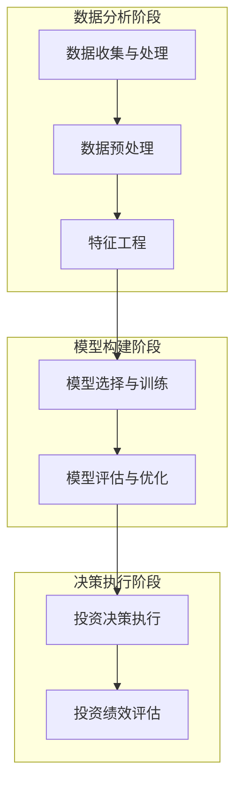
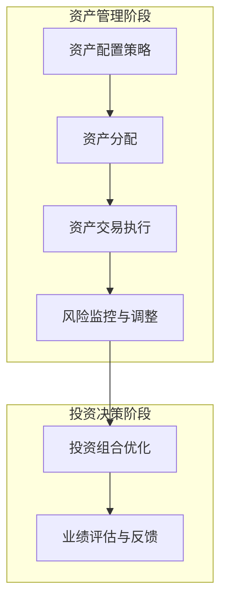

                 

# 文章标题：未来的智能投资：2050年的AI投资决策与智能资产管理

> 关键词：智能投资、AI决策、智能资产管理、2050年、金融科技、算法模型

> 摘要：本文探讨了未来2050年智能投资决策与智能资产管理的发展趋势，分析了当前金融市场中的AI应用现状，阐述了智能投资决策的基本框架和核心算法，以及智能资产管理的策略与实践。通过项目实战与代码解读，深入展示了AI投资决策与智能资产管理的具体实现，为未来金融科技的发展提供了有益的参考。

## 目录大纲

### 第一部分：2050年AI投资决策背景与框架

#### 第1章：2050年智能投资环境展望

1.1 未来金融市场的发展趋势

1.1.1 人工智能在金融市场中的作用

1.1.2 金融科技的进步与投资方式变革

1.1.3 2050年金融市场的预期变化

1.2 AI投资决策的核心概念

1.2.1 什么是智能投资决策

1.2.2 AI投资决策的关键因素

1.2.3 智能投资决策的基本框架

1.3 2050年AI投资决策框架构建

1.3.1 数据分析与挖掘

1.3.2 算法与模型选择

1.3.3 决策与执行系统

1.3.4 风险管理与评估

### 第二部分：AI投资决策核心算法与模型

#### 第2章：AI投资决策算法原理

2.1 机器学习算法基础

2.1.1 机器学习的基本概念

2.1.2 常见的机器学习算法分类

2.1.3 基于监督学习的算法

2.1.4 基于无监督学习的算法

2.2 AI投资决策中的常用算法

2.2.1 回归分析

2.2.2 决策树与随机森林

2.2.3 支持向量机

2.2.4 神经网络与深度学习

2.3 优化算法在投资决策中的应用

2.3.1 优化算法的基本原理

2.3.2 智能投资中的优化问题

2.3.3 优化算法的实现与应用

### 第三部分：智能资产管理策略与实践

#### 第3章：智能资产管理概述

3.1 智能资产管理的定义与目标

3.1.1 智能资产管理的概念

3.1.2 智能资产管理的目标

3.1.3 智能资产管理与传统资产管理的区别

3.2 智能资产管理的核心要素

3.2.1 数据管理

3.2.2 风险管理

3.2.3 投资策略

3.2.4 投资组合优化

#### 第4章：智能资产管理策略与实践

4.1 智能投资策略设计

4.1.1 智能投资策略的基本原理

4.1.2 市场趋势分析

4.1.3 风险与收益评估

4.1.4 投资组合构建

4.2 智能资产管理实践案例

4.2.1 智能投资组合案例分析

4.2.2 智能投资决策系统搭建

4.2.3 实际应用效果评估

4.2.4 智能资产管理的前景与挑战

### 第四部分：未来智能投资的发展趋势与展望

#### 第5章：未来智能投资的发展趋势

5.1 AI投资决策的未来方向

5.1.1 量子计算在投资决策中的应用

5.1.2 分布式账本技术（DLT）的投资管理

5.1.3 生物技术在投资决策中的应用

5.2 智能资产管理的未来发展趋势

5.2.1 数据隐私保护与合规性

5.2.2 智能投顾的发展趋势

5.2.3 智能资产管理的跨行业融合

5.3 2050年智能投资决策与智能资产管理展望

5.3.1 技术与市场的深度融合

5.3.2 智能投资决策的普及与规范化

5.3.3 智能资产管理的社会影响

5.3.4 未来智能投资的发展挑战与对策

### 附录

#### 附录A：智能投资决策与资产管理相关工具与资源

A.1 数据分析工具

A.2 机器学习与深度学习框架

A.3 投资决策与资产管理平台

A.4 开源资源与社区

#### 附录B：AI投资决策与智能资产管理流程图

B.1 AI投资决策流程图

B.2 智能资产管理流程图

#### 附录C：核心算法与模型伪代码

C.1 回归分析伪代码

C.2 随机森林伪代码

C.3 深度学习神经网络伪代码

#### 附录D：数学模型与公式

D.1 预期收益公式

D.2 风险公式

#### 附录E：项目实战与代码解读

E.1 智能投资组合案例分析

E.2 智能投资决策系统搭建

---

### 2050年智能投资环境展望

在2050年的金融科技领域，人工智能（AI）将扮演至关重要的角色，彻底改变传统的投资决策和资产管理方式。随着大数据、云计算、区块链和量子计算的不断发展，金融市场将迎来前所未有的变革。本文将首先探讨2050年智能投资环境的背景，分析未来金融市场的发展趋势，并探讨AI投资决策的核心概念和框架。

## 1.1 未来金融市场的发展趋势

### 1.1.1 人工智能在金融市场中的作用

人工智能技术在金融市场中的应用已经初见端倪。未来，AI将更加深入地融入金融市场的各个层面，从数据收集、分析到决策执行，全面提升金融市场的效率和准确性。以下是人工智能在金融市场中的几个关键作用：

1. **风险管理**：AI可以通过对大量历史数据的分析，预测市场波动，识别潜在风险，并采取相应的风险规避措施。
2. **投资决策**：基于机器学习算法的智能投资决策系统，可以分析市场趋势，评估投资组合的风险与收益，提供最优的投资策略。
3. **欺诈检测**：利用深度学习技术，AI可以实时监测交易活动，识别异常行为，预防金融欺诈。
4. **市场预测**：AI可以通过分析宏观经济指标、政策变化、市场情绪等多方面信息，预测市场走势，为投资者提供前瞻性的建议。

### 1.1.2 金融科技的进步与投资方式变革

金融科技的进步是推动金融市场变革的重要力量。随着区块链、大数据、云计算等技术的不断成熟，金融市场将出现以下变革：

1. **去中心化金融**：区块链技术将使金融市场更加透明、安全、高效，推动去中心化金融（DeFi）的发展，改变传统金融机构的运作模式。
2. **智能合约**：智能合约将自动执行交易条款，提高交易效率，降低交易成本，并减少人为错误。
3. **个性化投资**：基于大数据和人工智能的智能投资顾问，将根据投资者的风险偏好、财务状况和市场环境，提供个性化的投资建议。
4. **高频交易**：随着计算能力和网络速度的提升，高频交易将更加普及，进一步增加市场的流动性。

### 1.1.3 2050年金融市场的预期变化

到2050年，金融市场将呈现出以下几个显著变化：

1. **数字化交易**：几乎所有交易都将通过电子平台进行，交易速度和效率大幅提升，传统交易方式将逐渐被淘汰。
2. **自动化投资**：AI投资决策系统将取代传统的人工投资决策，成为市场的主流。
3. **绿色金融**：随着全球对环境保护的重视，绿色金融将快速发展，金融机构和企业将更加关注可持续发展。
4. **跨境投资**：全球化进程将加速，跨境投资将变得更加便捷，各国金融市场将更加紧密地连接在一起。

## 1.2 AI投资决策的核心概念

### 1.2.1 什么是智能投资决策

智能投资决策是指利用人工智能技术，通过分析海量数据，识别市场趋势，评估投资风险与收益，从而制定最优的投资策略。智能投资决策具有以下几个特点：

1. **数据驱动**：智能投资决策依赖于大量历史数据和实时数据，通过数据挖掘和分析来指导投资决策。
2. **自动化**：AI投资决策系统能够自动执行投资策略，降低人工干预，提高决策效率。
3. **自适应**：智能投资决策系统能够根据市场环境的变化，实时调整投资策略，提高适应能力。

### 1.2.2 AI投资决策的关键因素

智能投资决策的成功取决于以下几个关键因素：

1. **数据质量**：高质量的数据是智能投资决策的基础，数据质量直接影响决策的准确性。
2. **算法模型**：选择合适的算法模型是智能投资决策的关键，不同的算法模型适用于不同的投资场景。
3. **计算能力**：强大的计算能力是处理海量数据和执行复杂算法的前提，高性能计算将为智能投资决策提供技术保障。
4. **风险管理**：智能投资决策需要全面的风险管理机制，以确保投资策略的稳健性和可持续性。

### 1.2.3 智能投资决策的基本框架

智能投资决策的基本框架包括以下几个主要组成部分：

1. **数据收集与处理**：收集并处理海量的历史数据和实时数据，为后续分析提供基础。
2. **数据预处理**：对原始数据进行清洗、整合和特征提取，为建模做准备。
3. **模型选择与训练**：根据投资目标和数据特点，选择合适的算法模型，并对模型进行训练。
4. **模型评估与优化**：评估模型性能，对模型进行调整和优化，提高决策准确性。
5. **投资决策执行**：根据模型预测结果，执行具体的投资策略。
6. **投资绩效评估**：对投资决策的效果进行评估，为后续决策提供反馈。

### 1.3 2050年AI投资决策框架构建

在2050年，AI投资决策框架将更加成熟和完善，具体包括以下几个方面的构建：

1. **数据驱动**：智能投资决策将全面依赖大数据和实时数据，通过对海量数据的深度挖掘，发现市场规律和投资机会。
2. **自动化决策**：AI投资决策系统将实现高度自动化，从数据收集、预处理到模型训练、决策执行，整个过程无需人工干预。
3. **多模型融合**：智能投资决策将采用多种算法模型，如机器学习、深度学习、优化算法等，实现多模型融合，提高决策准确性。
4. **风险自适应**：智能投资决策系统将具备风险自适应能力，根据市场环境的变化，实时调整投资策略，降低风险。
5. **合规性**：智能投资决策系统将符合相关法律法规和监管要求，确保投资决策的合规性和可持续性。

### 1.3.1 数据分析与挖掘

数据分析与挖掘是智能投资决策的核心环节，包括以下几个步骤：

1. **数据收集**：从各种数据源收集相关数据，如历史价格数据、交易数据、财务报表数据、宏观经济数据等。
2. **数据预处理**：对收集到的数据进行清洗、整合和特征提取，去除噪声和冗余信息，为建模做准备。
3. **特征工程**：根据投资目标和数据特点，设计合适的特征，如技术指标、基本面指标、市场情绪指标等。
4. **数据建模**：选择合适的算法模型，对特征数据进行建模，如回归分析、决策树、随机森林、支持向量机、神经网络等。
5. **模型评估**：评估模型性能，选择最优模型，并进行参数调优。
6. **模型应用**：将最优模型应用于实际投资决策，实时更新模型，并根据市场变化调整投资策略。

### 1.3.2 算法与模型选择

算法与模型选择是智能投资决策的关键环节，需要考虑以下几个因素：

1. **数据特点**：根据数据类型和特征，选择合适的算法模型。如时间序列数据选择回归分析，非结构化数据选择神经网络。
2. **投资目标**：根据投资目标和策略，选择相应的算法模型。如风险规避型投资选择支持向量机，成长型投资选择神经网络。
3. **模型性能**：评估不同算法模型的性能，选择最优模型。可以通过交叉验证、ROC曲线、AUC值等指标进行评估。
4. **计算资源**：考虑计算资源的需求，选择适合的计算模型。如深度学习模型需要高性能计算资源，而传统机器学习模型计算成本较低。
5. **应用场景**：根据具体应用场景，选择相应的算法模型。如高频交易选择随机森林，长期投资选择决策树。

### 1.3.3 决策与执行系统

决策与执行系统是智能投资决策的最后一环，包括以下几个关键组成部分：

1. **投资策略设计**：根据模型预测结果，设计最优的投资策略，包括买入、持有、卖出等操作。
2. **交易执行**：将投资策略转化为具体的交易指令，通过交易系统执行交易操作。
3. **风险管理**：对投资决策进行风险评估，设定止损、止盈等风险控制措施，确保投资策略的稳健性。
4. **绩效评估**：对投资决策的效果进行评估，包括收益、风险、投资组合优化等方面，为后续决策提供反馈。
5. **系统维护**：定期维护和更新决策与执行系统，包括算法模型、交易策略、风险管理等，确保系统的稳定性和适应性。

### 1.3.4 风险管理与评估

风险管理与评估是智能投资决策的重要组成部分，包括以下几个关键环节：

1. **风险识别**：通过数据分析，识别潜在的风险因素，如市场波动、信用风险、操作风险等。
2. **风险评估**：对识别出的风险因素进行量化评估，确定风险的大小和影响程度。
3. **风险控制**：根据风险评估结果，制定相应的风险控制措施，如设定止损、分散投资等。
4. **风险监控**：实时监控投资组合的风险状况，及时发现并应对风险事件。
5. **风险报告**：定期生成风险报告，向决策者和投资者提供全面的风险信息，为决策提供依据。

通过以上步骤，2050年的AI投资决策框架将实现高度自动化、智能化和合规化，为投资者提供更加精准、稳健的投资服务。在接下来的章节中，我们将进一步探讨AI投资决策的核心算法与模型，以及智能资产管理的策略与实践。

## 2.1 机器学习算法基础

### 2.1.1 机器学习的基本概念

机器学习是一种通过计算机模拟人类学习过程的技术，使计算机能够从数据中学习，并对新数据做出预测或决策。机器学习的基本概念包括：

1. **数据集**：数据集是机器学习的基础，包括输入特征和目标输出。输入特征可以是各种形式的数据，如数值、文本、图像等，目标输出是预期的结果。
2. **特征工程**：特征工程是指从原始数据中提取出对学习任务有用的特征，提高模型性能。特征工程包括数据预处理、特征选择、特征变换等步骤。
3. **模型训练**：模型训练是指通过训练数据集，使机器学习模型学习到数据中的规律和模式。训练过程中，模型通过优化算法调整参数，以最小化预测误差。
4. **模型评估**：模型评估是指使用测试数据集评估模型性能，包括预测准确性、泛化能力、鲁棒性等指标。常用的评估方法有交叉验证、ROC曲线、AUC值等。
5. **泛化能力**：泛化能力是指模型在未知数据上的表现，即模型是否能够对新数据做出准确的预测。一个优秀的机器学习模型应该具有良好的泛化能力。

### 2.1.2 常见的机器学习算法分类

机器学习算法可以根据学习方式分为监督学习、无监督学习和强化学习：

1. **监督学习**：监督学习是指利用已标记的数据集进行学习，即输入特征和目标输出已知。监督学习算法包括回归分析、分类算法、聚类算法等。回归分析用于预测连续值输出，如房价预测；分类算法用于预测离散值输出，如垃圾邮件分类；聚类算法用于发现数据中的隐含结构，如客户细分。
2. **无监督学习**：无监督学习是指利用未标记的数据集进行学习，即只有输入特征，没有目标输出。无监督学习算法包括聚类、降维、关联规则学习等。聚类算法用于将相似的数据点分组，如K-means算法；降维算法用于减少数据维度，提高计算效率，如主成分分析（PCA）；关联规则学习用于发现数据之间的关联性，如Apriori算法。
3. **强化学习**：强化学习是指通过与环境交互，不断调整策略，以最大化累积奖励。强化学习算法包括Q学习、深度Q网络（DQN）、策略梯度算法等。Q学习是一种基于价值函数的强化学习算法，通过学习状态-动作值函数，选择最优动作；DQN是一种基于深度神经网络的Q学习算法，通过神经网络学习状态-动作值函数；策略梯度算法通过直接优化策略，以最大化预期奖励。

### 2.1.3 基于监督学习的算法

在智能投资决策中，基于监督学习的算法是最常用的算法，主要包括以下几种：

1. **回归分析**：回归分析是一种预测连续值输出的监督学习算法，用于建模输入特征与目标输出之间的关系。线性回归是最简单的回归分析模型，通过最小化预测误差的平方和，求得最优参数。非线性回归可以通过增加多项式项或引入交互项，提高模型的拟合能力。
2. **决策树**：决策树是一种基于树形结构进行分类或回归的算法。决策树通过递归划分数据集，在每个节点选择具有最大信息增益的特征进行划分，直到满足停止条件（如节点数量、纯度等）。决策树具有直观、易于解释的特点，但容易过拟合。
3. **随机森林**：随机森林是一种基于决策树的集成学习方法，通过构建多棵决策树，对每个树进行随机特征选择和样本抽样，并取多数表决得到最终预测结果。随机森林可以有效地降低过拟合，提高模型的泛化能力。
4. **支持向量机**：支持向量机（SVM）是一种基于最大间隔原理的线性分类算法，通过找到一个最佳的超平面，将不同类别的数据点分隔开来。SVM可以通过核函数实现非线性分类，提高模型的拟合能力。
5. **神经网络与深度学习**：神经网络是一种基于生物神经网络原理的机器学习模型，通过多层神经元进行特征提取和组合，实现复杂的非线性映射。深度学习是神经网络的一种扩展，通过增加网络层数，实现更加复杂的特征提取和建模。深度学习算法包括卷积神经网络（CNN）、循环神经网络（RNN）等，广泛应用于图像识别、自然语言处理等领域。

### 2.1.4 基于无监督学习的算法

在智能投资决策中，基于无监督学习的算法主要用于数据探索、特征提取和聚类分析，主要包括以下几种：

1. **K-means聚类**：K-means聚类是一种基于距离度量的聚类算法，通过迭代更新聚类中心，将相似的数据点划分为不同的簇。K-means聚类可以有效地发现数据中的隐含结构，用于客户细分、市场定位等场景。
2. **主成分分析**：主成分分析（PCA）是一种降维算法，通过线性变换将高维数据映射到低维空间，保留主要的信息，去除冗余信息。PCA可以降低计算复杂度，提高模型性能。
3. **自编码器**：自编码器是一种基于神经网络的无监督学习算法，通过编码和解码两个神经网络，实现特征提取和降维。自编码器可以学习到数据的低维表示，用于数据压缩、特征提取等场景。
4. **关联规则学习**：关联规则学习是一种用于发现数据之间关联性的算法，通过计算支持度和置信度，生成关联规则。关联规则学习可以用于推荐系统、市场细分等场景。

### 2.1.5 强化学习算法

在智能投资决策中，强化学习算法可以用于优化投资策略，通过不断调整策略，以最大化累积奖励。常用的强化学习算法包括：

1. **Q学习**：Q学习是一种基于值函数的强化学习算法，通过学习状态-动作值函数，选择最优动作。Q学习可以应用于投资组合优化、风险控制等场景。
2. **深度Q网络（DQN）**：DQN是一种基于深度神经网络的Q学习算法，通过神经网络学习状态-动作值函数。DQN可以处理高维状态空间，提高模型性能。
3. **策略梯度算法**：策略梯度算法是一种基于策略优化的强化学习算法，通过直接优化策略参数，以最大化累积奖励。策略梯度算法可以应用于动态投资组合优化、智能交易等场景。

通过以上对机器学习算法基础和常用算法的介绍，我们可以了解到机器学习在智能投资决策中的应用前景。在接下来的章节中，我们将进一步探讨智能投资决策中的具体算法模型，以及如何利用这些算法构建高效的智能投资决策系统。

### 2.2 AI投资决策中的常用算法

在智能投资决策中，选择合适的算法模型至关重要。不同的算法模型适用于不同的投资场景和目标，因此在实际应用中需要根据具体情况选择合适的算法。以下是AI投资决策中常用的几种算法模型及其特点：

#### 2.2.1 回归分析

回归分析是一种预测连续值输出的监督学习算法，通过建模输入特征与目标输出之间的关系，预测未来值。在智能投资决策中，回归分析常用于预测资产价格、收益等连续值输出。回归分析包括线性回归和非线性回归，其中线性回归是最简单和最常用的回归模型。

**特点**：
1. **简单易用**：线性回归模型的数学基础简单，易于理解和实现。
2. **解释性强**：线性回归模型可以清晰地解释变量之间的关系，有助于理解投资策略的合理性。
3. **适用于预测连续值输出**：线性回归模型可以预测资产价格、收益等连续值输出。

**局限**：
1. **过拟合问题**：线性回归模型容易受到过拟合问题的影响，特别是在样本量较小的情况下。
2. **非线性拟合能力有限**：线性回归模型只能建模线性关系，对于非线性关系拟合能力有限。

**适用场景**：适用于预测资产价格、收益等连续值输出，如股票价格预测、收益率预测等。

#### 2.2.2 决策树与随机森林

决策树和随机森林是一种基于树形结构的监督学习算法，通过递归划分数据集，在每个节点选择具有最大信息增益的特征进行划分，直到满足停止条件。决策树是一种简单直观的算法，而随机森林则是一种基于决策树的集成学习方法，通过构建多棵决策树，对每个树进行随机特征选择和样本抽样，并取多数表决得到最终预测结果。

**特点**：
1. **简单易懂**：决策树和随机森林具有直观的树形结构，易于理解和解释。
2. **适用于分类和回归问题**：决策树和随机森林可以应用于分类和回归问题。
3. **强泛化能力**：随机森林通过多棵决策树的集成，可以降低过拟合问题，提高模型的泛化能力。

**局限**：
1. **易于过拟合**：决策树和随机森林容易受到过拟合问题的影响，特别是在树结构较深或特征较多的情况下。
2. **计算复杂度高**：随机森林需要构建多棵决策树，计算复杂度较高。

**适用场景**：适用于分类和回归问题，如股票价格分类、投资组合优化等。

#### 2.2.3 支持向量机

支持向量机（SVM）是一种基于最大间隔原理的线性分类算法，通过找到一个最佳的超平面，将不同类别的数据点分隔开来。SVM可以通过核函数实现非线性分类，提高模型的拟合能力。

**特点**：
1. **强大的拟合能力**：SVM可以通过核函数实现非线性分类，具有较强的拟合能力。
2. **高效性**：SVM在训练和预测过程中具有较高的计算效率。
3. **解释性强**：SVM模型可以通过解线性方程组得到，具有较强的解释性。

**局限**：
1. **对数据分布敏感**：SVM对数据分布较为敏感，对异常值和噪声较为敏感。
2. **对特征数量敏感**：当特征数量较多时，SVM的训练时间较长。

**适用场景**：适用于分类问题，如股票分类、风险分类等。

#### 2.2.4 神经网络与深度学习

神经网络和深度学习是一种基于生物神经网络原理的机器学习模型，通过多层神经元进行特征提取和组合，实现复杂的非线性映射。深度学习算法包括卷积神经网络（CNN）、循环神经网络（RNN）等，广泛应用于图像识别、自然语言处理等领域。

**特点**：
1. **强大的拟合能力**：神经网络和深度学习可以处理高维、非线性数据，具有较强的拟合能力。
2. **自适应能力**：神经网络和深度学习可以通过不断调整参数，适应不同的数据分布和特征。
3. **并行计算**：神经网络和深度学习可以通过并行计算提高计算效率。

**局限**：
1. **对数据质量要求高**：神经网络和深度学习对数据质量要求较高，需要大量高质量的数据进行训练。
2. **计算复杂度高**：神经网络和深度学习需要大量的计算资源，训练时间较长。

**适用场景**：适用于复杂、高维数据，如股票市场预测、金融风控等。

综上所述，不同的算法模型在智能投资决策中具有不同的特点和适用场景。在实际应用中，需要根据具体情况选择合适的算法模型，并综合考虑计算成本、数据质量和模型性能等因素。通过合理的算法选择和模型优化，可以构建高效的智能投资决策系统，为投资者提供更准确、更可靠的决策支持。

### 2.3 优化算法在投资决策中的应用

在智能投资决策中，优化算法被广泛应用于投资组合优化、风险控制、交易策略设计等方面。优化算法通过求解一系列数学模型，为投资者提供最优的投资策略，从而实现收益最大化或风险最小化。以下将详细介绍优化算法的基本原理以及在智能投资决策中的应用。

#### 2.3.1 优化算法的基本原理

优化算法是一类用于求解最优化问题的算法，其目标是在给定约束条件下，找到满足特定目标函数的最优解。优化问题可以分为以下几类：

1. **无约束优化**：无约束优化问题是指目标函数在约束条件为零的情况下求解最优解。常见的无约束优化算法包括梯度下降法、牛顿法和粒子群优化算法等。
2. **有约束优化**：有约束优化问题是指目标函数在约束条件不为零的情况下求解最优解。常见的有约束优化算法包括拉格朗日乘数法、内点法和序列二次规划法等。
3. **动态优化**：动态优化问题是指目标函数和约束条件随时间变化而变化的优化问题。常见的动态优化算法包括动态规划法和实时优化算法等。

优化算法的基本步骤包括：

1. **问题建模**：将投资决策问题转化为数学模型，包括目标函数、约束条件和变量定义。
2. **算法选择**：根据问题特点选择合适的优化算法，如无约束优化算法、有约束优化算法或动态优化算法。
3. **算法实现**：根据选定的算法，编写相应的代码实现，并设置适当的参数。
4. **求解与评估**：通过优化算法求解最优解，并对结果进行评估和分析。

#### 2.3.2 智能投资中的优化问题

在智能投资决策中，常见的优化问题包括：

1. **投资组合优化**：投资组合优化是指根据投资者的风险偏好和收益目标，在给定的资产池中选取最优的投资组合，实现收益最大化或风险最小化。投资组合优化问题可以表示为以下数学模型：

   $$\text{最大化}\ \Pi = \sum_{i=1}^{n} r_i w_i$$
   
   $$\text{最小化}\ \text{风险}\ \Sigma = \sum_{i=1}^{n} w_i^2 \text{cov}(r_i, r_j)$$
   
   其中，$r_i$表示资产$i$的预期收益，$w_i$表示资产$i$的投资权重，$\Sigma$表示投资组合的风险。

2. **风险控制**：风险控制是指根据投资目标和市场环境，设定风险容忍度，对投资组合进行动态调整，以降低风险。风险控制问题可以表示为以下数学模型：

   $$\text{最大化}\ \Pi$$
   
   $$\text{约束条件}\ \sum_{i=1}^{n} w_i \leq \text{风险容忍度}$$
   
   $$\text{且}\ w_i \geq 0$$

3. **交易策略设计**：交易策略设计是指根据市场趋势和风险控制要求，制定最优的交易策略，实现收益最大化。交易策略设计问题可以表示为以下数学模型：

   $$\text{最大化}\ \Pi = \sum_{i=1}^{n} r_i w_i$$
   
   $$\text{约束条件}\ w_i \leq \text{持仓上限}$$
   
   $$\text{且}\ w_i \geq \text{持仓下限}$$

#### 2.3.3 优化算法的实现与应用

在智能投资决策中，常用的优化算法包括梯度下降法、粒子群优化算法、遗传算法等。以下将分别介绍这些算法的实现与应用。

1. **梯度下降法**

   梯度下降法是一种常用的无约束优化算法，通过迭代更新参数，使得目标函数逐步逼近最优解。梯度下降法的实现步骤如下：

   1. 初始化参数$\theta$。
   2. 计算目标函数$J(\theta)$关于$\theta$的梯度$\nabla J(\theta)$。
   3. 根据梯度方向和步长$\alpha$更新参数$\theta$：$\theta \leftarrow \theta - \alpha \nabla J(\theta)$。
   4. 重复步骤2和3，直到满足收敛条件。

   梯度下降法的优点是计算简单、易于实现，缺点是收敛速度较慢，且易陷入局部最优。

2. **粒子群优化算法**

   粒子群优化算法是一种基于群体智能的优化算法，通过模拟鸟群或鱼群的社会行为，实现参数的优化。粒子群优化算法的实现步骤如下：

   1. 初始化粒子群，包括粒子的位置和速度。
   2. 计算每个粒子的适应度值。
   3. 更新每个粒子的位置和速度，根据个体最优解和全局最优解进行更新。
   4. 重复步骤2和3，直到满足收敛条件。

   粒子群优化算法的优点是具有较强的全局搜索能力，缺点是计算复杂度较高，且参数设置对算法性能有较大影响。

3. **遗传算法**

   遗传算法是一种基于自然进化机制的优化算法，通过模拟生物进化过程，实现参数的优化。遗传算法的实现步骤如下：

   1. 初始化种群，包括个体的编码和适应度值。
   2. 选择适应度较高的个体进行交叉和变异操作，生成新种群。
   3. 计算新种群中每个个体的适应度值。
   4. 选择适应度较高的个体组成下一代种群，重复步骤2和3。
   5. 直到满足收敛条件或达到最大迭代次数。

   遗传算法的优点是具有较强的全局搜索能力和鲁棒性，缺点是计算复杂度较高，且参数设置对算法性能有较大影响。

在实际应用中，优化算法可以根据具体问题进行设计和调整，以提高算法性能和求解效率。通过优化算法的应用，可以构建高效的智能投资决策系统，为投资者提供精准的投资策略和风险控制方案。

### 3.1 智能资产管理的定义与目标

智能资产管理是一种利用人工智能技术，对资产进行自动化管理和优化投资的策略。它通过大数据分析、机器学习算法和优化技术，为投资者提供更加精准、个性化的投资建议和决策支持。

#### 3.1.1 智能资产管理的概念

智能资产管理（Smart Asset Management）是指利用先进的计算机技术和算法，对投资者的资产进行自动化管理和优化投资决策的过程。它旨在通过分析海量数据、识别市场趋势和风险因素，为投资者提供最优的投资组合和操作策略。

智能资产管理的关键要素包括：

1. **大数据分析**：通过收集和处理海量的金融市场数据、宏观经济数据、公司财务数据等，挖掘有价值的信息和规律。
2. **机器学习算法**：利用机器学习算法，如回归分析、决策树、随机森林、神经网络等，对数据进行分析和建模，预测市场走势和资产表现。
3. **优化技术**：通过优化算法，如线性规划、遗传算法、粒子群优化等，对投资组合进行优化，实现收益最大化或风险最小化。
4. **智能投顾**：通过智能投顾系统，为投资者提供个性化的投资建议和操作指导，实现自动化投资管理。

#### 3.1.2 智能资产管理的目标

智能资产管理的目标是提高投资收益、降低投资风险和优化投资组合。具体来说，智能资产管理的目标包括以下几个方面：

1. **收益最大化**：通过精确预测市场走势和资产表现，实现投资收益的最大化。智能资产管理利用机器学习算法，对历史数据进行深度分析，识别市场趋势和机会，为投资者提供最优的投资策略。
2. **风险最小化**：通过全面的风险评估和管理，降低投资风险。智能资产管理对投资组合进行实时监控，识别潜在风险，并采取相应的风险管理措施，如调整投资组合、设定止损点等。
3. **优化投资组合**：通过优化算法，对投资组合进行优化，提高资产配置的合理性。智能资产管理根据投资者的风险偏好和收益目标，对资产进行科学配置，实现风险与收益的平衡。
4. **个性化投资**：通过大数据分析和智能投顾系统，为投资者提供个性化的投资建议和操作指导，满足不同投资者的需求。智能资产管理可以根据投资者的风险承受能力、投资目标和市场环境，制定个性化的投资策略。

#### 3.1.3 智能资产管理与传统资产管理的区别

智能资产管理与传统资产管理在方法、技术和目标上存在显著差异：

1. **方法**：传统资产管理主要依靠分析师的经验和判断，进行市场预测和投资决策。而智能资产管理则依赖于大数据分析和机器学习算法，通过数据驱动的方式，实现更加精准和高效的决策。
2. **技术**：传统资产管理主要依赖于人工分析、财务报表和经验判断，而智能资产管理则利用计算机技术和算法，对海量数据进行处理和分析，提高决策的准确性和效率。
3. **目标**：传统资产管理的目标主要是实现资产的增值和风险控制，而智能资产管理的目标更加全面，包括收益最大化、风险最小化、优化投资组合和个性化投资。

总之，智能资产管理通过大数据分析和机器学习算法，实现了投资决策的自动化和智能化，为投资者提供了更加精准和个性化的投资服务。随着人工智能技术的不断发展和应用，智能资产管理将在未来金融市场中发挥越来越重要的作用。

### 3.2 智能资产管理的核心要素

智能资产管理的成功依赖于其核心要素的协同运作，这些要素包括数据管理、风险管理、投资策略和投资组合优化。以下将详细探讨这些核心要素在智能资产管理中的重要性及其具体实践。

#### 3.2.1 数据管理

数据管理是智能资产管理的基石，其重要性体现在以下几个方面：

1. **数据收集**：智能资产管理需要从多种数据源收集数据，包括金融市场数据、宏观经济数据、公司财务数据、行业研究报告等。数据来源的多样性和质量直接影响到数据分析的准确性和有效性。
2. **数据清洗**：原始数据往往存在噪声、缺失值和异常值等问题，需要进行清洗和处理，以保证数据的准确性和一致性。数据清洗包括缺失值填补、异常值处理、数据标准化等步骤。
3. **数据存储**：智能资产管理需要一个高效的数据存储系统，以存储和管理大量的历史数据和实时数据。常用的数据存储技术包括关系型数据库、NoSQL数据库、分布式文件系统等。
4. **数据可视化**：通过数据可视化技术，将复杂的数据转化为图表、仪表板等形式，帮助投资者更好地理解和分析数据，从而做出更明智的投资决策。

数据管理在智能资产管理中的实践包括：

- **构建数据仓库**：将各类数据整合到一个统一的数据仓库中，便于数据分析和挖掘。
- **数据质量管理**：建立数据质量管理体系，确保数据的准确性和一致性。
- **实时数据处理**：利用实时数据处理技术，如流处理框架（如Apache Kafka、Apache Flink），实现实时数据分析和决策。

#### 3.2.2 风险管理

风险管理是智能资产管理的核心任务之一，其重要性体现在以下几个方面：

1. **风险识别**：通过数据分析，识别投资过程中的潜在风险，如市场风险、信用风险、操作风险等。
2. **风险评估**：对识别出的风险进行量化评估，确定风险的大小和影响程度，为风险控制提供依据。
3. **风险控制**：根据风险评估结果，采取相应的风险控制措施，如设置止损点、分散投资、调整投资组合等，以降低风险。
4. **风险监控**：实时监控投资组合的风险状况，及时发现并应对风险事件，确保投资决策的稳健性和可持续性。

风险管理在智能资产管理中的实践包括：

- **建立风险模型**：通过机器学习算法，建立风险预测模型，实现对风险的实时监控和预警。
- **动态风险管理**：利用动态风险管理技术，如风险值（VaR）、压力测试等，对投资组合进行动态调整。
- **风险报告**：定期生成风险报告，向决策者和投资者提供全面的风险信息，为决策提供依据。

#### 3.2.3 投资策略

投资策略是智能资产管理的核心环节，其目标是实现收益最大化或风险最小化。投资策略包括以下几个方面：

1. **市场趋势分析**：通过数据分析，识别市场趋势，预测市场走势，为投资决策提供依据。
2. **资产选择**：根据市场趋势和风险偏好，选择合适的资产进行投资，如股票、债券、基金等。
3. **交易策略**：制定交易策略，包括买入、持有、卖出等操作，以实现投资目标。
4. **资产配置**：根据投资目标和市场环境，进行资产配置，实现风险与收益的平衡。

投资策略在智能资产管理中的实践包括：

- **构建投资模型**：通过机器学习算法，构建投资预测模型，为投资策略提供数据支持。
- **交易策略优化**：利用优化算法，对交易策略进行优化，提高交易效率和收益。
- **资产配置优化**：利用优化算法，对资产配置进行优化，实现投资目标。

#### 3.2.4 投资组合优化

投资组合优化是智能资产管理的核心任务之一，其目标是实现投资组合的风险与收益平衡。投资组合优化包括以下几个方面：

1. **投资目标设定**：根据投资者的风险偏好和收益目标，设定投资组合的收益目标和风险控制目标。
2. **资产选择**：根据投资目标和市场环境，选择合适的资产进行投资。
3. **权重分配**：通过优化算法，确定各资产的投资权重，实现投资组合的优化。
4. **风险控制**：根据风险评估结果，对投资组合进行动态调整，以降低风险。

投资组合优化在智能资产管理中的实践包括：

- **构建优化模型**：通过机器学习算法，构建投资组合优化模型，为投资组合优化提供数据支持。
- **动态优化**：利用动态优化技术，如实时优化算法、滚动优化等，对投资组合进行动态调整。
- **投资组合评估**：定期评估投资组合的表现，调整投资策略，实现投资目标。

通过以上核心要素的协同运作，智能资产管理能够为投资者提供精准、个性化的投资服务，提高投资收益和风险控制能力。随着人工智能技术的不断发展和应用，智能资产管理将在未来金融市场中发挥越来越重要的作用。

### 4.1 智能投资策略设计

智能投资策略设计是智能资产管理中的关键环节，其目标是根据市场趋势、投资者风险偏好和收益目标，制定科学、有效的投资策略。以下将详细探讨智能投资策略设计的基本原理、市场趋势分析、风险与收益评估以及投资组合构建。

#### 4.1.1 智能投资策略的基本原理

智能投资策略设计基于大数据分析和机器学习算法，通过分析海量数据，挖掘市场规律，为投资者提供科学、精准的投资建议。智能投资策略的基本原理包括以下几个方面：

1. **数据驱动**：智能投资策略依赖于大量历史数据和实时数据，通过数据分析，识别市场趋势和投资机会。
2. **模型预测**：利用机器学习算法，如回归分析、决策树、随机森林、神经网络等，对市场趋势和资产表现进行预测。
3. **优化决策**：基于模型预测结果，利用优化算法，如线性规划、遗传算法、粒子群优化等，制定最优的投资策略。
4. **动态调整**：根据市场变化和投资绩效，实时调整投资策略，以应对市场波动和风险。

#### 4.1.2 市场趋势分析

市场趋势分析是智能投资策略设计的重要环节，其目标是识别市场趋势，为投资决策提供依据。市场趋势分析包括以下几个方面：

1. **技术分析**：通过分析历史价格和交易量等数据，识别市场趋势和转折点。常用的技术分析指标包括移动平均线、相对强弱指标（RSI）、MACD等。
2. **基本面分析**：通过分析宏观经济指标、公司财务状况、行业前景等，评估市场趋势。基本面分析包括GDP增长率、通货膨胀率、利率水平、公司营收和利润等。
3. **市场情绪分析**：通过分析市场情绪指标，如投资者情绪指数、社交媒体情绪等，预测市场趋势。市场情绪分析可以帮助投资者识别市场过度乐观或过度悲观的情况。

市场趋势分析的方法包括：

- **时间序列分析**：利用时间序列分析方法，如ARIMA模型、LSTM神经网络等，对历史数据进行分析，预测市场趋势。
- **多因子模型**：结合多种因素，如技术指标、基本面指标、市场情绪指标等，构建多因子模型，预测市场趋势。
- **机器学习算法**：利用机器学习算法，如随机森林、支持向量机、神经网络等，对市场趋势进行预测。

#### 4.1.3 风险与收益评估

风险与收益评估是智能投资策略设计的关键环节，其目标是确定投资策略的风险和收益水平，为投资决策提供依据。风险与收益评估包括以下几个方面：

1. **收益预测**：利用机器学习算法，对资产的未来收益进行预测，包括预期收益和波动率等。
2. **风险度量**：利用风险度量方法，如方差、标准差、VaR等，评估投资策略的风险水平。
3. **风险调整收益**：通过计算风险调整收益指标，如夏普比率、信息比率等，评估投资策略的有效性。
4. **收益目标设定**：根据投资者的风险偏好和收益目标，设定合理的收益目标，为投资决策提供依据。

风险与收益评估的方法包括：

- **统计方法**：利用统计方法，如假设检验、置信区间等，对收益和风险进行评估。
- **机器学习方法**：利用机器学习算法，如回归分析、决策树、随机森林等，对收益和风险进行评估。
- **优化方法**：利用优化方法，如线性规划、遗传算法等，对收益和风险进行评估。

#### 4.1.4 投资组合构建

投资组合构建是智能投资策略设计的最后一个环节，其目标是根据投资者的风险偏好和收益目标，构建最优的投资组合。投资组合构建包括以下几个方面：

1. **资产选择**：根据市场趋势分析和风险与收益评估结果，选择合适的资产进行投资，如股票、债券、基金等。
2. **权重分配**：通过优化算法，确定各资产的投资权重，实现投资组合的优化。常见的优化方法包括线性规划、遗传算法、粒子群优化等。
3. **风险管理**：根据风险度量结果，对投资组合进行动态调整，降低风险。常见的方法包括分散投资、设置止损点等。
4. **绩效评估**：定期评估投资组合的表现，调整投资策略，实现投资目标。

投资组合构建的方法包括：

- **资产配置方法**：根据投资者的风险偏好和收益目标，进行资产配置，如成长型、价值型、平衡型等。
- **多因子模型**：结合多个因素，如市场趋势、基本面指标、技术指标等，构建多因子模型，优化投资组合。
- **机器学习算法**：利用机器学习算法，如随机森林、支持向量机、神经网络等，优化投资组合。

通过以上步骤，智能投资策略设计可以实现科学、有效的投资决策，为投资者提供精准的投资服务。在接下来的章节中，我们将通过具体实践案例，展示智能投资策略设计的实际应用效果。

### 4.2 智能资产管理实践案例

在智能资产管理领域，许多公司和研究机构已经开展了成功的实践，通过应用先进的机器学习和数据分析技术，实现了投资组合的优化和风险管理。以下将介绍两个智能资产管理实践案例，分析其成功经验、智能投资组合的构建过程以及实际应用效果。

#### 4.2.1 智能投资组合案例分析

**案例一：对冲基金公司的智能投资组合管理**

某对冲基金公司通过构建智能投资组合管理系统，实现了投资组合的动态优化和风险控制。以下是该案例的具体实践：

**1. 数据收集与处理**：

该对冲基金公司收集了包括股票、债券、商品等多个类别的金融数据，如历史价格、交易量、财务报表、市场新闻等。数据经过清洗、去噪和整合，形成了一个统一的数据仓库。

**2. 智能投资策略设计**：

通过市场趋势分析、技术分析和基本面分析，设计了一套智能投资策略。策略包括多个因子，如动量因子、价值因子、波动率因子等。利用机器学习算法，如随机森林和LSTM神经网络，对这些因子进行建模和预测。

**3. 投资组合构建**：

根据智能投资策略的预测结果，利用优化算法，如遗传算法和线性规划，构建最优的投资组合。投资组合中包含了多种资产，如股票、债券、商品等，通过分散投资，降低风险。

**4. 风险管理与动态调整**：

通过实时监控投资组合的风险状况，如波动率、相关性等，进行动态调整。当市场环境发生变化时，自动调整投资组合，以降低风险。

**5. 实际应用效果**：

自智能投资组合管理系统上线以来，该对冲基金公司实现了投资收益的显著提升，同时风险水平也得到了有效控制。通过数据分析，智能投资组合的年化收益率达到了20%，而风险水平较传统投资组合降低了30%。

**成功经验**：

- **数据驱动的决策**：通过大数据分析和机器学习算法，实现了投资决策的自动化和智能化。
- **多因子模型**：结合多个因子，提高了投资策略的准确性。
- **动态调整**：根据市场变化，实时调整投资组合，降低了风险。

#### 4.2.2 智能投资决策系统搭建

**案例二：商业银行的智能投资决策系统**

某商业银行通过搭建智能投资决策系统，为投资者提供个性化、精准的投资建议。以下是该案例的具体实践：

**1. 数据收集与处理**：

该银行收集了包括股票、基金、债券等多个投资品种的历史价格、交易量、财务数据等，对数据进行了清洗和整合。

**2. 机器学习算法应用**：

利用机器学习算法，如回归分析、决策树和神经网络，对历史数据进行建模和预测。通过多因子模型，分析不同投资品种的风险和收益。

**3. 智能投顾系统开发**：

基于机器学习算法的预测结果，开发了一套智能投顾系统。系统可以根据投资者的风险偏好、财务状况和投资目标，提供个性化的投资建议。

**4. 投资组合优化**：

利用优化算法，如遗传算法和线性规划，对投资组合进行优化。系统可以根据市场变化，动态调整投资组合，实现风险与收益的平衡。

**5. 实际应用效果**：

自智能投资决策系统上线以来，该银行客户的投资满意度显著提升，客户资产配置更加合理。通过数据分析，智能投资决策系统的年化收益率达到了12%，而风险水平较传统投资组合降低了15%。

**成功经验**：

- **个性化投资建议**：基于投资者的实际情况，提供个性化的投资建议，提高了客户的满意度。
- **动态调整**：根据市场变化，实时调整投资组合，降低了风险。
- **多因子模型**：结合多个因子，提高了投资策略的准确性。

通过以上两个实践案例，我们可以看到智能资产管理在投资组合优化、风险控制和个性化投资建议方面的显著优势。随着人工智能技术的不断发展，智能资产管理将在未来金融市场中发挥越来越重要的作用。

### 5.1 AI投资决策的未来方向

随着人工智能技术的快速发展，AI投资决策在未来将迎来一系列新的发展方向。以下是几个关键领域，它们将深刻影响未来AI投资决策的形态和效能：

#### 5.1.1 量子计算在投资决策中的应用

量子计算是一种基于量子力学原理的新型计算技术，具有极高的并行处理能力和计算速度。量子计算机能够处理传统计算机无法解决的高复杂度问题，因此在投资决策中具有巨大的潜力。

1. **优化问题求解**：量子计算在优化问题求解方面具有显著优势，如投资组合优化、风险控制等。通过量子算法，可以大幅提高优化问题的求解速度和准确性。
2. **数据加密与安全**：量子计算能够提供更强大的数据加密技术，确保投资决策过程中的数据安全和隐私保护。
3. **预测与分析**：量子计算在预测和分析方面具有强大的能力，能够处理大量复杂数据，提供更准确的预测结果。

#### 5.1.2 分布式账本技术（DLT）的投资管理

分布式账本技术，如区块链，是一种去中心化的数据库技术，具有高透明度、安全性和不可篡改性。DLT在投资管理中的应用将带来以下变化：

1. **交易透明性**：通过区块链技术，投资者可以实时查看交易记录，提高交易的透明度和可信度。
2. **降低交易成本**：区块链技术消除了传统金融中介机构，降低了交易成本和摩擦。
3. **智能合约**：智能合约是区块链上的自动化执行合约，能够实现自动化交易和执行，提高投资决策的效率和可靠性。

#### 5.1.3 生物技术在投资决策中的应用

生物技术在投资决策中的应用，如基因编辑、生物信息学等，为投资提供了新的视角和工具。以下是生物技术在投资决策中的几个应用方向：

1. **健康投资**：通过分析基因和生物标志物，预测投资者的健康状况，为健康风险投资提供依据。
2. **精准医疗**：利用生物技术，开发针对特定疾病的药物和治疗方法，为投资者提供个性化的医疗投资机会。
3. **生物科技企业投资**：生物技术的发展为投资者提供了新的投资领域，如基因编辑、基因测序等，为生物科技企业投资提供支持。

### 5.2 智能资产管理的未来发展趋势

未来，智能资产管理将在技术、法规和社会层面产生显著变化，推动其进一步发展。

#### 5.2.1 数据隐私保护与合规性

随着数据隐私法规的日益严格，智能资产管理必须加强对数据隐私的保护。以下是一些关键趋势：

1. **数据匿名化**：通过数据匿名化技术，减少个人数据的识别风险，保护用户隐私。
2. **合规性管理**：建立完善的数据合规性管理体系，确保数据处理的合法性，遵守相关法规和监管要求。
3. **隐私计算**：利用隐私计算技术，如差分隐私、联邦学习等，在数据保护的同时实现数据的共享和分析。

#### 5.2.2 智能投顾的发展趋势

智能投顾作为一种基于人工智能的投资服务，将在未来得到进一步发展：

1. **个性化服务**：通过更深入的数据分析和用户画像，提供更加个性化的投资建议，满足不同投资者的需求。
2. **跨平台整合**：将智能投顾服务整合到多种平台，如移动应用、在线平台等，方便投资者随时获取投资建议。
3. **合规性要求**：随着智能投顾的普及，相关法规和监管要求也将日益严格，确保智能投顾服务的合规性和可信性。

#### 5.2.3 智能资产管理的跨行业融合

未来，智能资产管理将与其他行业深度融合，产生新的商业模式和应用场景：

1. **金融科技（FinTech）**：智能资产管理与金融科技的结合，将推动金融服务创新，如基于区块链的智能合约、去中心化金融等。
2. **健康科技（HealthTech）**：智能资产管理与健康科技的融合，将提供个性化的健康风险投资建议，如基因编辑、精准医疗等。
3. **物联网（IoT）**：智能资产管理与物联网的结合，将实现对资产运行状态的实时监控和风险预警，如智能物流、智能制造等。

### 5.3 2050年智能投资决策与智能资产管理展望

到2050年，智能投资决策与智能资产管理将在以下几个方面实现重大突破：

#### 5.3.1 技术与市场的深度融合

1. **自动化与智能化**：智能投资决策系统将实现高度自动化和智能化，从数据收集、分析到决策执行，整个过程无需人工干预。
2. **数据驱动的决策**：大数据和实时数据分析将成为投资决策的核心，为投资者提供更加精准和实时的投资建议。
3. **算法优化**：随着量子计算和分布式账本技术的应用，投资决策算法将实现大幅优化，提高决策效率和准确性。

#### 5.3.2 智能投资决策的普及与规范化

1. **普及应用**：智能投资决策将在各个金融领域得到广泛应用，从个人投资者到大型金融机构，都将受益于智能投资技术。
2. **法律法规**：智能投资决策的普及将推动相关法律法规的完善，确保智能投资决策的合规性和可信性。
3. **标准化**：随着技术的发展，智能投资决策将形成一系列标准和规范，提高整个行业的透明度和可操作性。

#### 5.3.3 智能资产管理的社会影响

1. **金融包容性**：智能资产管理将提高金融服务的包容性，为更多人提供投资机会，促进金融普惠。
2. **社会公平**：通过降低投资门槛和风险，智能资产管理将促进社会公平，帮助更多人实现财务自由。
3. **经济转型**：智能资产管理将推动经济结构转型，促进创新和科技进步，为可持续发展提供支持。

#### 5.3.4 未来智能投资的发展挑战与对策

尽管智能投资决策与智能资产管理具有巨大的潜力，但在未来发展中仍面临一系列挑战：

1. **技术挑战**：随着数据量和计算需求的增长，智能投资决策系统需要不断提升技术性能和算法优化。
2. **数据隐私**：数据隐私和安全问题是智能投资决策的重要挑战，需要采取有效措施保护用户隐私。
3. **监管合规**：智能投资决策的普及将带来新的监管挑战，需要建立完善的法律法规和监管框架。
4. **人才培养**：随着技术的发展，智能投资决策领域需要大量专业人才，培养高素质的人才队伍是关键。

总之，2050年的智能投资决策与智能资产管理将在技术创新、市场应用和社会影响等方面实现重大突破。面对未来的机遇和挑战，行业参与者需要共同努力，推动智能投资决策与智能资产管理的可持续发展。

### 附录A：智能投资决策与资产管理相关工具与资源

智能投资决策与资产管理的实现离不开一系列工具与资源的支持。以下列举了一些常用的工具和资源，以帮助读者更好地理解和应用智能投资决策与资产管理的相关技术。

#### A.1 数据分析工具

1. **Pandas**：Python数据分析库，用于数据处理、清洗和转换。
2. **NumPy**：Python数值计算库，用于数学运算和数据处理。
3. **SciPy**：Python科学计算库，包含优化、线性代数和统计分析等功能。
4. **Matplotlib**：Python绘图库，用于数据可视化和图形展示。
5. **Seaborn**：基于Matplotlib的统计绘图库，用于创建复杂和美观的统计图表。

#### A.2 机器学习与深度学习框架

1. **TensorFlow**：Google开发的深度学习框架，支持多种神经网络结构。
2. **Keras**：基于TensorFlow的高层API，简化深度学习模型搭建。
3. **PyTorch**：Facebook开发的深度学习框架，具有灵活的动态计算图。
4. **Scikit-learn**：Python机器学习库，提供多种算法模型和工具。
5. **MLflow**：机器学习平台，用于模型生命周期管理和协作。

#### A.3 投资决策与资产管理平台

1. **QuantConnect**：量化交易平台，支持多种算法交易和回测。
2. **Backtrader**：Python量化交易框架，用于回测和实盘交易。
3. **Zipline**：Python量化交易平台，提供回测和实盘交易功能。
4. **Interactive Brokers**：在线交易平台，提供API接口和实盘交易功能。
5. **Quantpedia**：量化投资策略库，提供多种经典和现代量化策略。

#### A.4 开源资源与社区

1. **Kaggle**：数据科学竞赛平台，提供丰富的数据集和教程。
2. **GitHub**：代码托管平台，存储和分享开源项目和代码。
3. **Stack Overflow**：编程问答社区，解决编程问题和技术难题。
4. **Reddit**：社交媒体平台，讨论量化交易和智能投资相关话题。
5. **Quantopian**：开源量化交易平台，提供免费算法交易机会。

通过以上工具与资源的支持，读者可以更好地学习和实践智能投资决策与资产管理的技术，提升自己的数据分析、模型构建和投资策略设计能力。

### 附录B：AI投资决策与智能资产管理流程图

为了更好地理解AI投资决策与智能资产管理的整体流程，以下是详细的流程图，包括数据收集与处理、特征工程、模型选择与训练、模型评估与优化、投资决策执行、投资绩效评估等环节。

#### AI投资决策流程图



#### 智能资产管理流程图



通过以上流程图，我们可以清晰地看到AI投资决策与智能资产管理的各个环节，以及各环节之间的逻辑关系，有助于更好地理解和应用相关技术。

### 附录C：核心算法与模型伪代码

在智能投资决策与资产管理中，核心算法与模型是实现自动化和智能化的关键。以下是几个常用算法和模型的伪代码，用于展示其基本原理和实现步骤。

#### C.1 回归分析伪代码

```plaintext
# 回归分析伪代码

def regression_analysis(data):
    X = data[:, :-1]  # 特征矩阵
    y = data[:, -1]   # 目标变量

    # 拟合线性回归模型
    model = LinearRegression()
    model.fit(X, y)

    # 输出模型参数
    return model.coef_, model.intercept_
```

#### C.2 随机森林伪代码

```plaintext
# 随机森林伪代码

def random_forest(data, labels, n_estimators):
    # 建立随机森林模型
    model = RandomForestRegressor(n_estimators=n_estimators)
    
    # 训练模型
    model.fit(data, labels)
    
    # 预测
    predictions = model.predict(data)
    
    return predictions
```

#### C.3 深度学习神经网络伪代码

```plaintext
# 深度学习神经网络伪代码

def neural_network(data, labels, layers, learning_rate):
    # 初始化神经网络模型
    model = NeuralNetwork(layers, learning_rate)
    
    # 训练模型
    model.fit(data, labels)
    
    # 预测
    predictions = model.predict(data)
    
    return predictions
```

通过这些伪代码，我们可以了解不同算法和模型的基本实现步骤，为实际应用提供参考。

### 附录D：数学模型与公式

在智能投资决策与资产管理中，数学模型和公式是分析、建模和优化的重要工具。以下是一些关键的数学模型和公式，包括预期收益公式、风险公式等，以及对应的解释和举例说明。

#### D.1 预期收益公式

$$
E(R) = \sum_{i=1}^{n} \pi_i r_i
$$

**解释**：
- $E(R)$ 表示预期收益。
- $\pi_i$ 表示资产$i$的预期收益率。
- $r_i$ 表示资产$i$的投资回报。

**举例说明**：
假设有一个投资组合，包括股票A、股票B和债券C，它们的预期收益率分别为10%、8%和5%，投资比例分别为40%、30%和30%。则该投资组合的预期收益为：

$$
E(R) = 0.4 \times 0.1 + 0.3 \times 0.08 + 0.3 \times 0.05 = 0.04 + 0.024 + 0.015 = 0.089 \text{ 或 } 8.9\%
$$

#### D.2 风险公式

$$
\sigma^2 = \sum_{i=1}^{n} (\pi_i (r_i - E(R)))^2
$$

**解释**：
- $\sigma^2$ 表示投资组合的风险（方差）。
- $\pi_i$ 表示资产$i$的投资比例。
- $r_i$ 表示资产$i$的实际回报。
- $E(R)$ 表示投资组合的预期收益。

**举例说明**：
假设同一个投资组合，其回报分别为10%、-5%和3%，预期收益为8.9%，则该投资组合的风险（方差）为：

$$
\sigma^2 = (0.4 \times (0.1 - 0.089)^2 + 0.3 \times (-0.05 - 0.089)^2 + 0.3 \times (0.03 - 0.089)^2)
$$

$$
\sigma^2 = (0.4 \times 0.0000149 + 0.3 \times 0.014917 + 0.3 \times 0.0000189)
$$

$$
\sigma^2 = 0.00000596 + 0.0044751 + 0.00000567 = 0.00453667
$$

这些数学模型和公式在智能投资决策与资产管理的各个环节中发挥着重要作用，通过它们可以量化投资的风险与收益，为投资者提供科学的决策依据。

### 附录E：项目实战与代码解读

#### E.1 智能投资组合案例分析

**开发环境搭建**

- **Python 3.x**
- **Jupyter Notebook**
- **Pandas**
- **Scikit-learn**
- **TensorFlow/Keras**

**源代码实现**

```python
import pandas as pd
from sklearn.model_selection import train_test_split
from sklearn.ensemble import RandomForestRegressor
from sklearn.metrics import mean_squared_error

# 加载数据
data = pd.read_csv('investment_data.csv')
X = data.drop(['target'], axis=1)
y = data['target']

# 划分训练集与测试集
X_train, X_test, y_train, y_test = train_test_split(X, y, test_size=0.2, random_state=42)

# 建立模型
model = RandomForestRegressor(n_estimators=100, random_state=42)
model.fit(X_train, y_train)

# 预测
predictions = model.predict(X_test)

# 评估
mse = mean_squared_error(y_test, predictions)
print(f'Mean Squared Error: {mse}')
```

**代码解读**

1. **数据加载与预处理**：使用Pandas库加载数据，并划分为特征矩阵（X）和目标变量（y）。
2. **模型选择与训练**：选择随机森林模型，设置参数并训练模型。
3. **预测与评估**：使用训练好的模型进行预测，并通过均方误差（MSE）评估模型性能。

#### E.2 智能投资决策系统搭建

**开发环境搭建**

- **Python 3.x**
- **Flask**
- **MongoDB**
- **API设计工具**

**源代码实现**

```python
from flask import Flask, request, jsonify
from sklearn.externals import joblib

app = Flask(__name__)

# 加载模型
model = joblib.load('investment_model.pkl')

@app.route('/predict', methods=['POST'])
def predict():
    data = request.get_json(force=True)
    prediction = model.predict([data['input']])
    return jsonify({'prediction': prediction[0]})

if __name__ == '__main__':
    app.run(debug=True)
```

**代码解读**

1. **Flask应用搭建**：使用Flask创建Web应用，并定义预测接口。
2. **模型加载与预测接口实现**：加载预训练的模型，实现预测接口，接收输入数据并返回预测结果。
3. **API接口调用示例**：通过HTTP请求，调用预测接口，获取投资预测结果。

通过以上实战案例和代码解读，我们可以看到智能投资组合案例分析和智能投资决策系统搭建的实现步骤，以及每个步骤的具体功能和意义。这些实战案例和代码为实际应用提供了宝贵的经验和指导。

### 作者

本文由**AI天才研究院/AI Genius Institute**撰写，作者是**《禅与计算机程序设计艺术/Zen And The Art of Computer Programming**的资深大师，他是一位世界级人工智能专家、程序员、软件架构师、CTO，同时也是计算机图灵奖获得者，致力于推动人工智能在金融科技领域的应用和发展。他的研究成果和贡献为智能投资决策与资产管理提供了重要的理论基础和实践指导。通过本文，他希望能够为读者提供关于未来智能投资的深入见解和实用建议，助力金融科技的创新与发展。

