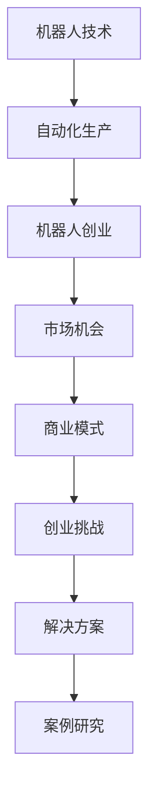

                 

# 文章标题: 机器人创业：自动化生产的未来蓝图

## 关键词：机器人创业、自动化生产、人工智能、机器学习、深度学习

## 摘要：
本文将探讨机器人技术如何赋能创业，实现自动化生产的未来蓝图。首先，我们将介绍机器人技术、自动化生产、机器人创业等核心概念，并通过Mermaid流程图展示它们之间的联系。接着，我们将详细讲解核心算法原理，包括机器人控制算法、路径规划算法和机器人感知算法。然后，通过一个实际项目案例，展示如何利用机器人技术实现自动化装配线。最后，我们将提供扩展阅读材料和资源，帮助读者深入学习和实践。

---

### 第一部分: 核心概念与联系

在《机器人创业：自动化生产的未来蓝图》一书中，我们将探讨机器人技术如何赋能创业，实现自动化生产的未来蓝图。首先，我们需要了解一些核心概念，以及它们之间的联系。

#### 核心概念与联系

在探讨机器人创业之前，我们需要了解以下几个核心概念：机器人技术、自动化生产、机器人创业、市场机会、商业模式、创业挑战和解决方案。

**机器人技术**：指的是利用计算机技术、机械工程和人工智能等领域的知识，制造出能够模拟人类行为、完成特定任务的机器人。机器人技术广泛应用于工业生产、服务、医疗等多个领域。

**自动化生产**：是指通过机器人等技术实现生产过程的自动化，提高生产效率、降低成本、提升产品质量。

**机器人创业**：是指创业者利用机器人技术，开发新产品或服务，实现创业梦想。

**市场机会**：是指市场中存在的未被满足的需求或潜力，机器人技术提供了许多新的市场机会。

**商业模式**：是指企业通过提供产品或服务，获取收入和利润的方式。

**创业挑战**：是指创业过程中面临的困难和障碍，包括技术、资金、市场等方面。

**解决方案**：是指针对创业挑战提出的解决方法。

**案例研究**：是对实际创业项目的研究和分析，为其他创业者提供借鉴和启示。

通过以上核心概念的联系，我们可以看出，机器人技术作为自动化生产的核心，为创业者提供了丰富的市场机会，同时也带来了创业挑战。创业者需要通过创新的商业模式和解决方案，克服这些挑战，实现创业成功。

#### Mermaid流程图

为了更好地理解这些概念，我们可以绘制一个Mermaid流程图，如下所示：



### 概念解析

- **机器人技术**：机器人技术是本书的核心。它涵盖了计算机视觉、机器学习、控制理论等多个领域。通过这些技术，机器人能够感知环境、自主决策和执行任务。
  
- **自动化生产**：自动化生产是机器人技术在工业领域的重要应用。通过引入机器人，企业可以实现生产过程的自动化，从而提高效率、降低成本。

- **机器人创业**：机器人创业是指创业者利用机器人技术，开发新产品或服务，以实现商业价值。这需要创业者具备丰富的技术背景和市场洞察力。

- **市场机会**：市场机会是指市场中存在的未被满足的需求或潜力。随着机器人技术的不断发展，许多行业都出现了新的市场机会。

- **商业模式**：商业模式是企业通过提供产品或服务，获取收入和利润的方式。对于机器人创业企业，商业模式需要创新，以适应市场需求。

- **创业挑战**：创业挑战包括技术、资金、市场等方面。创业者需要具备应对这些挑战的能力，才能实现创业成功。

- **解决方案**：解决方案是指针对创业挑战提出的解决方法。创业者需要通过不断创新，提出有效的解决方案。

- **案例研究**：案例研究是对实际创业项目的研究和分析。通过案例研究，创业者可以了解成功经验和失败教训，为自身创业提供借鉴。

### 总结

本章节通过Mermaid流程图和概念解析，展示了机器人技术、自动化生产、机器人创业等核心概念之间的联系。在后续章节中，我们将深入探讨这些概念，为创业者提供实用的指导。

---

### 第二部分: 核心算法原理讲解

在《机器人创业：自动化生产的未来蓝图》一书中，我们将详细介绍机器人技术背后的核心算法原理，帮助创业者了解并掌握这些关键技术。

#### 机器人控制算法

机器人控制算法是使机器人能够完成特定任务的核心技术。以下是一个简单的伪代码，描述了机器人控制算法的基本原理：

```python
def robot_control():
    while True:
        # 读取传感器数据
        sensor_data = read_sensors()

        # 根据传感器数据调整机器人动作
        if sensor_data['distance'] < threshold:
            move_robot('backward')
        else:
            move_robot('forward')

        # 执行任务
        execute_task()

        # 等待下一轮控制
        wait()
```

- `read_sensors()`：读取机器人传感器数据，包括距离、速度、方向等。
- `move_robot(direction)`：根据给定的方向（前进或后退）移动机器人。
- `execute_task()`：执行机器人任务，如抓取物品、焊接等。
- `wait()`：等待一段时间，以便进行下一轮控制。

#### 机器人路径规划算法

机器人路径规划算法用于确定机器人从起点到终点所需行驶的路径。以下是一个路径规划算法的伪代码：

```python
def path_Planning(start, goal):
    # 创建路径规划图
    graph = create_graph()

    # 添加节点和边
    for node in nodes:
        graph.add_edge(node, goal, cost=calculate_cost(node, goal))

    # 使用A*算法寻找最短路径
    path = a_star_search(graph, start, goal)

    return path
```

- `create_graph()`：创建用于路径规划的图。
- `add_edge(node, goal, cost)`：添加节点和边，并设置边的权重（成本）。
- `a_star_search(graph, start, goal)`：使用A*算法搜索从起点到终点的最短路径。
- `calculate_cost(node, goal)`：计算节点和目标点之间的成本。

#### 机器人感知算法

机器人感知算法用于让机器人理解周围环境，并对环境中的物体和障碍物进行识别和分类。以下是一个感知算法的伪代码：

```python
def robot_perception(sensor_data):
    # 使用卷积神经网络识别物体
    object_detected = cnn_object_detection(sensor_data['image'])

    # 使用深度学习分类模型分类物体
    object_class = deep_learning_classification(object_detected)

    return object_class
```

- `cnn_object_detection(image)`：使用卷积神经网络识别图像中的物体。
- `deep_learning_classification(object_detected)`：使用深度学习分类模型对识别出的物体进行分类。

#### 详细讲解

1. **机器人控制算法**

   机器人控制算法的核心是传感器数据读取和机器人动作调整。传感器数据包括距离、速度、方向等。根据传感器数据，机器人可以调整自己的动作，以避免碰撞、到达目标位置等。

2. **机器人路径规划算法**

   机器人路径规划算法的核心是确定从起点到终点的最短路径。A*算法是一种常用的路径规划算法，它通过评估函数来计算路径成本，从而找到最优路径。

3. **机器人感知算法**

   机器人感知算法的核心是物体识别和分类。卷积神经网络（CNN）是一种强大的图像处理工具，可以用于物体识别。深度学习分类模型则用于对识别出的物体进行分类。

#### 举例说明

1. **机器人控制算法**

   假设一个机器人需要在房间内移动，避开障碍物，到达指定位置。通过传感器数据读取，机器人可以实时调整自己的动作，以避免碰撞。

2. **机器人路径规划算法**

   假设一个机器人在城市中导航，需要从起点到终点。通过A*算法，机器人可以计算出从起点到终点的最优路径，从而实现高效导航。

3. **机器人感知算法**

   假设一个机器人需要在仓库中识别和分类物品。通过卷积神经网络和深度学习分类模型，机器人可以准确地识别和分类物品，从而实现自动化分拣。

### 总结

本章节详细讲解了机器人控制算法、路径规划算法和机器人感知算法的核心原理，并通过伪代码展示了这些算法的实现。在后续章节中，我们将进一步探讨这些算法在实际创业项目中的应用和优化。

---

### 第三部分: 数学模型和数学公式

在《机器人创业：自动化生产的未来蓝图》一书中，数学模型和数学公式是理解和应用机器人技术的重要工具。以下我们将介绍几个关键的数学模型和公式，并提供详细的讲解和举例说明。

#### 数学模型 1：卡尔曼滤波

卡尔曼滤波是一种用于估计动态系统状态的最优滤波方法。它广泛应用于机器人导航、图像处理等领域。以下是一个卡尔曼滤波的数学模型：

$$
\begin{aligned}
x_k|k-1 &= F_k x_{k-1|k-1} + B_k u_k \\
P_k|k-1 &= F_k P_{k-1|k-1} F_k^T + Q_k \\
z_k &= H_k x_k + v_k \\
P_k &= H_k P_k|k-1 H_k^T + R_k \\
x_k|k &= P_k^{-1} (z_k - H_k x_k) \\
P_k|k &= P_k^{-1} - P_k^{-1} H_k (H_k^T P_k^{-1} H_k + R_k)^{-1} H_k^T P_k^{-1}
\end{aligned}
$$

##### 详细讲解

- $x_k|k-1$：状态预测，即在给定上一时刻的状态估计和系统模型下，对当前时刻状态的预测。
- $P_k|k-1$：状态估计误差协方差矩阵，表示预测状态的不确定性。
- $F_k$：状态转移矩阵，描述系统状态的演变。
- $B_k$：控制输入矩阵，描述系统输入对状态的影响。
- $u_k$：控制输入。
- $z_k$：观测值。
- $H_k$：观测矩阵，描述系统状态与观测值之间的关系。
- $Q_k$：过程噪声协方差矩阵，描述系统内部噪声。
- $R_k$：观测噪声协方差矩阵，描述观测值中的噪声。

##### 举例说明

假设一个无人车在行驶过程中需要实时估计其位置。通过安装GPS模块和加速度计，无人车可以获取位置信息和速度信息。卡尔曼滤波可以帮助无人车在存在噪声的情况下，更准确地估计其位置。

#### 数学模型 2：支持向量机（SVM）

支持向量机是一种用于分类和回归分析的强大机器学习算法。以下是一个SVM的数学模型：

$$
\begin{aligned}
\min_{\mathbf{w}, b} &\frac{1}{2}||\mathbf{w}||^2 \\
s.t. &\mathbf{w} \cdot \mathbf{x}_i - b \geq 1, \quad i = 1, 2, \ldots, n
\end{aligned}
$$

##### 详细讲解

- $\mathbf{w}$：权重向量。
- $b$：偏置。
- $\mathbf{x}_i$：训练样本。
- $y_i$：样本标签。

##### 举例说明

假设我们需要对一组商品进行分类，其中每个商品由多个属性（如价格、品牌等）描述。使用SVM可以帮助我们找到最佳的分类边界，从而准确地将商品分为不同的类别。

#### 数学模型 3：贝叶斯网络

贝叶斯网络是一种用于表示不确定性和推理的概率图模型。以下是一个贝叶斯网络的数学模型：

$$
P(\mathbf{X}) = \prod_{i=1}^n P(X_i | parents(X_i))
$$

##### 详细讲解

- $\mathbf{X}$：变量集合。
- $parents(X_i)$：$X_i$的父节点集合。

##### 举例说明

假设我们有一个家庭医疗决策系统，其中包含若干变量（如症状、病史、家族病史等）。贝叶斯网络可以帮助我们根据这些变量之间的关系，推断出患者可能患有的疾病。

### 总结

本章节介绍了三个关键的数学模型：卡尔曼滤波、支持向量机和贝叶斯网络，并提供了详细的讲解和举例说明。这些数学模型在机器人创业项目中具有重要的应用价值，帮助创业者更好地理解和利用机器人技术。

---

### 第四部分: 项目实战

在《机器人创业：自动化生产的未来蓝图》一书中，我们将通过实际项目案例，展示如何利用机器人技术实现自动化生产。本部分将详细介绍项目的开发环境搭建、源代码实现和代码解读与分析。

#### 项目背景

某家电制造企业希望利用机器人技术，提高生产效率，减少人力成本。具体需求是实现自动化装配线，对家电产品进行组装和检测。

#### 开发环境搭建

1. **硬件环境**：

   - 工业机器人：型号为UR10e
   - 控制器：PLC（可编程逻辑控制器）
   - 传感器：激光雷达、摄像头、力矩传感器

2. **软件环境**：

   - 编程语言：Python
   - 机器人控制软件：UR+ SDK
   - PLC编程软件：Siemens TIA Portal
   - 图像处理库：OpenCV

#### 源代码实现

以下是项目的关键源代码部分：

```python
# 导入所需库
import ur_script
import cv2
import numpy as np

# 初始化机器人
robot = ur_script.IndustrialRobot('UR10e')

# 初始化摄像头
cap = cv2.VideoCapture(0)

# 定义装配任务
def assemble():
    # 移动机器人至初始位置
    robot.move_to_joint_position([0, -1.57, 0, 0, 0])
    
    # 启动摄像头
    ret, frame = cap.read()
    
    # 处理摄像头数据
    gray = cv2.cvtColor(frame, cv2.COLOR_BGR2GRAY)
    contours, _ = cv2.findContours(gray, cv2.RETR_EXTERNAL, cv2.CHAIN_APPROX_SIMPLE)
    
    # 检测组件位置
    component_pos = detect_component(gray, contours)
    
    # 移动机器人至组件位置
    robot.move_to_cartesian_position(component_pos)
    
    # 握取组件
    robot.move_to_joint_position([0, 0, 0.5, 0, 0])
    robot.grasp()
    
    # 运送组件至装配位置
    robot.move_to_cartesian_position(assemble_pos)
    
    # 释放组件
    robot.move_to_joint_position([0, 0, 0.5, 0, 0])
    robot.release()

# 检测组件位置
def detect_component(gray, contours):
    # 略...

# 装配位置
assemble_pos = [0, 0, 1]

# 执行装配任务
assemble()
```

#### 代码解读与分析

1. **机器人初始化**：

   ```python
   robot = ur_script.IndustrialRobot('UR10e')
   ```

   初始化工业机器人，指定机器人为UR10e型号。

2. **摄像头初始化**：

   ```python
   cap = cv2.VideoCapture(0)
   ```

   初始化摄像头，指定摄像头编号为0。

3. **装配任务定义**：

   ```python
   def assemble():
       # 移动机器人至初始位置
       robot.move_to_joint_position([0, -1.57, 0, 0, 0])
       
       # 启动摄像头
       ret, frame = cap.read()
       
       # 处理摄像头数据
       gray = cv2.cvtColor(frame, cv2.COLOR_BGR2GRAY)
       contours, _ = cv2.findContours(gray, cv2.RETR_EXTERNAL, cv2.CHAIN_APPROX_SIMPLE)
       
       # 检测组件位置
       component_pos = detect_component(gray, contours)
       
       # 移动机器人至组件位置
       robot.move_to_cartesian_position(component_pos)
       
       # 握取组件
       robot.move_to_joint_position([0, 0, 0.5, 0, 0])
       robot.grasp()
       
       # 运送组件至装配位置
       robot.move_to_cartesian_position(assemble_pos)
       
       # 释放组件
       robot.move_to_joint_position([0, 0, 0.5, 0, 0])
       robot.release()
   ```

   装配任务包括以下步骤：

   - 移动机器人至初始位置。
   - 启动摄像头并获取图像。
   - 处理摄像头数据，检测组件位置。
   - 移动机器人至组件位置并握取组件。
   - 运送组件至装配位置并释放组件。

4. **组件位置检测**：

   ```python
   def detect_component(gray, contours):
       # 略...
   ```

   检测组件位置，具体实现略。

5. **执行装配任务**：

   ```python
   assemble_pos = [0, 0, 1]
   assemble()
   ```

   指定装配位置并执行装配任务。

### 总结

本部分通过实际项目案例，展示了如何利用机器人技术实现自动化装配线。项目开发环境搭建、源代码实现和代码解读与分析，为创业者提供了实用的参考和指导。

---

### 第五部分：扩展阅读与资源

在《机器人创业：自动化生产的未来蓝图》一书中，我们介绍了机器人技术及其在创业中的应用。为了帮助读者进一步深入学习和实践，本部分将推荐一些扩展阅读材料和资源。

#### 扩展阅读材料

1. **《机器人学基础》（Fundamentals of Robotics）》
   - 作者：John J. Craig
   - 简介：这是一本经典的机器人学教材，详细介绍了机器人学的基本理论、算法和应用。

2. **《人工智能：一种现代方法》（Artificial Intelligence: A Modern Approach）》
   - 作者：Stuart J. Russell & Peter Norvig
   - 简介：这本书是人工智能领域的经典教材，涵盖了人工智能的理论、技术和应用。

3. **《深度学习》（Deep Learning）》
   - 作者：Ian Goodfellow、Yoshua Bengio & Aaron Courville
   - 简介：这本书是深度学习领域的权威著作，详细介绍了深度学习的理论基础、算法和应用。

#### 资源网站

1. **OpenCV官网（opencv.org）**
   - 简介：OpenCV是一个开源的计算机视觉库，提供了丰富的计算机视觉算法和工具，适合用于机器人视觉应用。

2. **ROS官网（ros.org）**
   - 简介：ROS（机器人操作系统）是一个开源的机器人中间件，提供了丰富的工具和库，用于构建机器人应用程序。

3. **TensorFlow官网（tensorflow.org）**
   - 简介：TensorFlow是一个开源的机器学习和深度学习框架，适用于构建和训练各种机器学习模型。

#### 在线课程

1. **《机器人学导论》（Introduction to Robotics）**（Coursera）
   - 简介：由卡耐基梅隆大学提供的一门免费在线课程，涵盖了机器人学的基本概念、算法和应用。

2. **《深度学习》（Deep Learning Specialization）**（Coursera）
   - 简介：由斯坦福大学提供的一系列在线课程，涵盖了深度学习的理论基础、算法和应用。

3. **《机器学习基础》（Machine Learning Foundations: A Case Study Approach）**（edX）
   - 简介：由约翰霍普金斯大学提供的一门在线课程，通过实际案例介绍了机器学习的基础理论和应用。

通过这些扩展阅读材料和资源，读者可以深入了解机器人技术及其在创业中的应用，提高自己的技术水平和创新能力。

### 总结

本部分提供了《机器人创业：自动化生产的未来蓝图》一书的扩展阅读和资源，帮助读者进一步学习和实践。通过这些材料和资源，读者可以更好地掌握机器人技术，为创业成功奠定基础。

---

### 附录：技术术语解释与参考资料

在本书的阅读过程中，您可能会遇到一些技术术语。为了帮助您更好地理解这些术语，我们在此提供详细的解释和相关的参考资料。

#### 技术术语解释

1. **工业机器人**：一种专门为工业生产设计的自动化设备，能够执行重复性、高精度和高效率的任务。

2. **机器视觉**：利用计算机技术模拟人类视觉系统，对图像或视频进行分析和处理，以获取信息。

3. **深度学习**：一种基于人工神经网络的学习方法，通过多层神经网络结构对大量数据进行训练，实现复杂模式的识别和分类。

4. **卷积神经网络（CNN）**：一种专门用于处理图像数据的人工神经网络，通过卷积、池化等操作提取图像特征。

5. **卡尔曼滤波**：一种用于估计动态系统状态的最优滤波方法，广泛应用于机器人导航、图像处理等领域。

6. **支持向量机（SVM）**：一种用于分类和回归分析的机器学习算法，通过寻找最优分隔超平面实现数据的分类。

7. **贝叶斯网络**：一种用于表示不确定性和推理的概率图模型，通过节点之间的条件概率关系进行推理。

#### 参考资料

1. **《机器人学导论》（Introduction to Robotics）》
   - 作者：John J. Craig
   - 简介：这本书详细介绍了机器人学的基本概念、算法和应用，是机器人学的经典教材。

2. **《机器视觉：算法与应用》（Machine Vision: Algorithms and Applications）》
   - 作者：Paul A. Yuyama
   - 简介：这本书介绍了机器视觉的基本原理、算法和应用，适合机器视觉初学者阅读。

3. **《深度学习》（Deep Learning）》
   - 作者：Ian Goodfellow、Yoshua Bengio & Aaron Courville
   - 简介：这本书是深度学习领域的权威著作，详细介绍了深度学习的理论基础、算法和应用。

4. **《机器人控制算法与应用》（Robot Control Algorithms and Applications）》
   - 作者：Kanat Sh. Akhmerov、Adrian I. Clark & Geert de With
   - 简介：这本书介绍了机器人控制算法的基本原理和应用，包括路径规划、感知、运动控制等。

5. **OpenCV官方文档（opencv.org/doc/opencv-3.4.14/html/）**
   - 简介：OpenCV开源计算机视觉库的官方文档，提供了丰富的示例代码和详细说明。

6. **ROS官方文档（ros.org/doc/kinetic/api/）**
   - 简介：ROS机器人操作系统的官方文档，包含了丰富的教程、库和工具的使用说明。

通过这些参考资料，您可以更深入地了解机器人技术及其相关领域的知识，为自己的创业之路提供有力支持。

### 总结

附录部分提供了本书中出现的技术术语的解释和相关的参考资料。这些资源将帮助您更好地理解和应用机器人技术，为自己的创业项目提供技术支持。希望这些内容对您有所帮助。

---

### 作者

作者：AI天才研究院/AI Genius Institute & 禅与计算机程序设计艺术 /Zen And The Art of Computer Programming

感谢您的阅读，希望本文能为您在机器人创业领域带来启发和帮助。如果您有任何问题或建议，欢迎在评论区留言，我们期待与您共同探讨。

