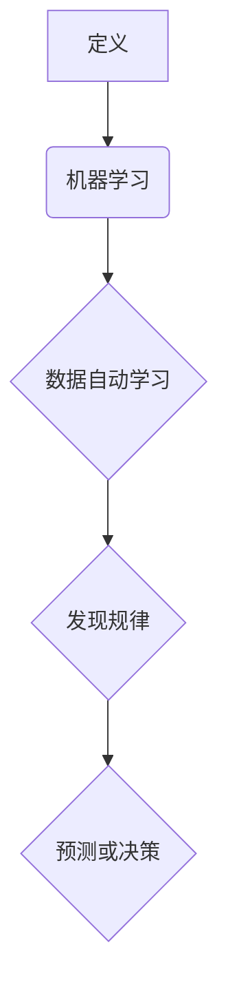
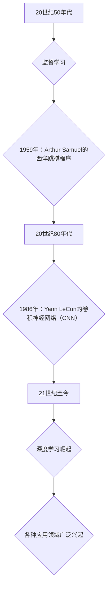
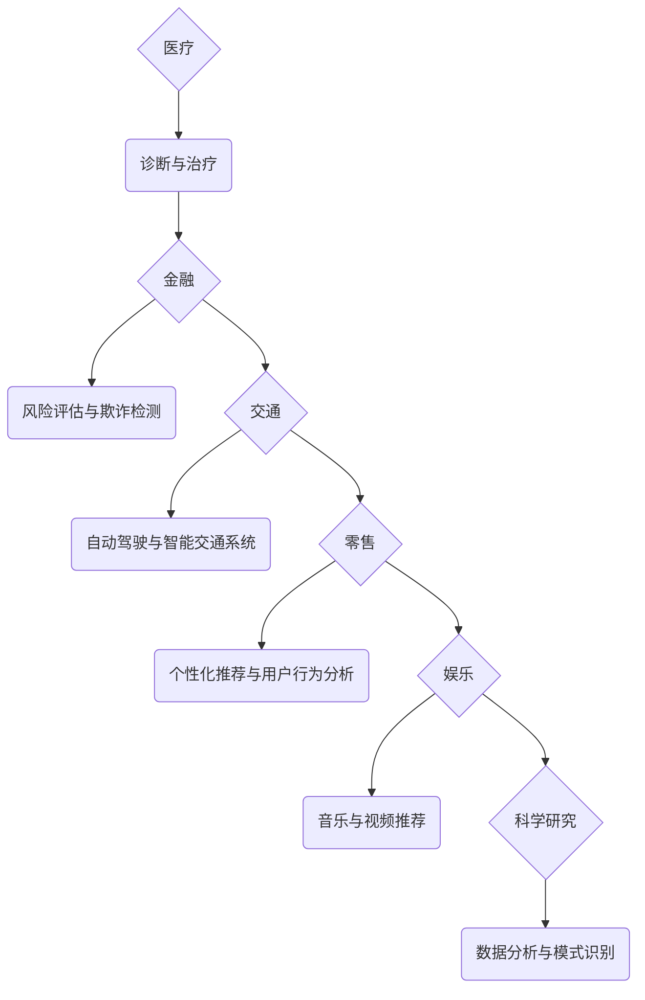
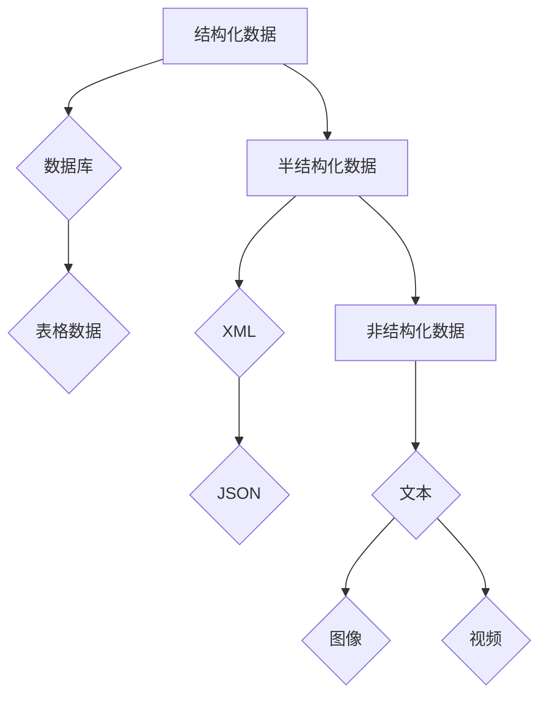
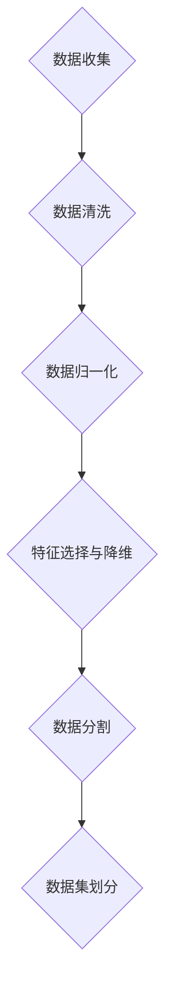
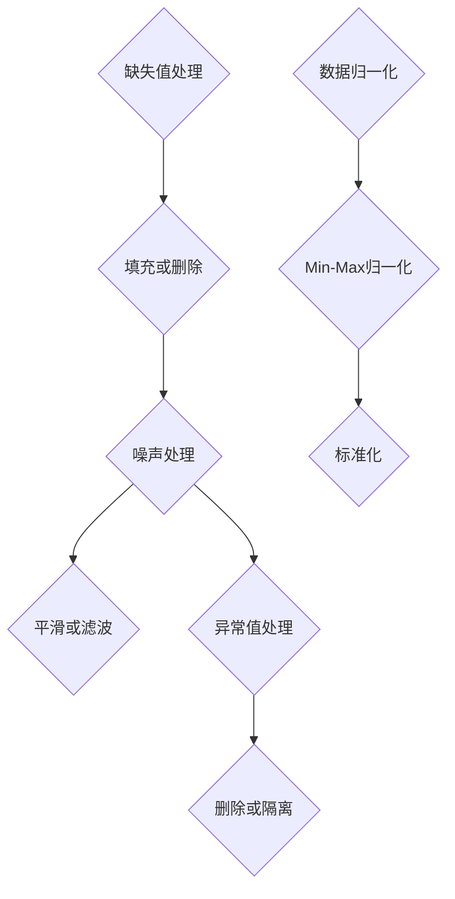
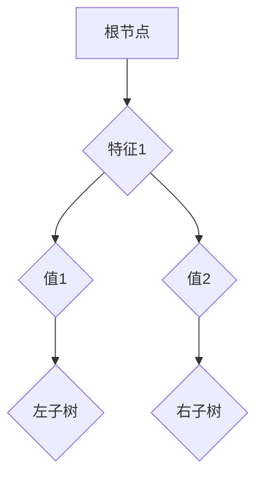
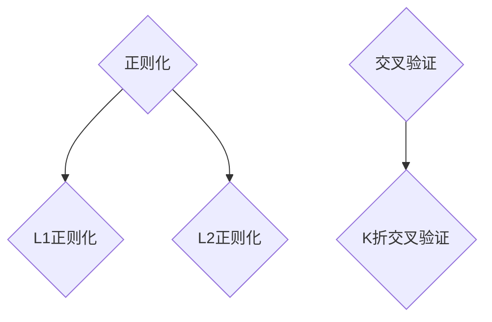
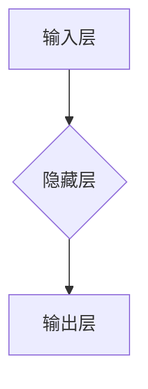

                 

### 文章标题

# 机器学习（Machine Learning） - 原理与代码实例讲解

机器学习是人工智能（AI）的核心技术之一，其通过构建能够自动学习、推理和决策的模型，大大提高了计算机处理复杂任务的能力。本文将深入探讨机器学习的原理，并辅以丰富的代码实例，帮助读者全面理解这一重要领域。

> **关键词**：机器学习、算法、深度学习、神经网络、Python实现

**摘要**：
本文将系统性地介绍机器学习的核心概念、基础理论和常用算法，并结合实际代码实例，对每个算法进行深入讲解。通过本文的学习，读者将掌握机器学习的基本原理和实现方法，为后续的研究和应用奠定坚实基础。

### 第一部分：机器学习的概述与基础

#### 第1章：机器学习基础

##### 1.1 机器学习的定义与历史发展

###### 1.1.1 机器学习的定义

机器学习是指通过算法让计算机从数据中自动学习和发现规律，从而进行预测或决策的过程。它不同于传统的编程方法，不需要手动编写规则，而是通过训练模型，让模型从数据中学习到相应的规律。



###### 1.1.2 机器学习的历史与发展

机器学习的历史可以追溯到20世纪50年代，当时计算机科学刚刚起步。随着时间的推移，机器学习经历了多个发展阶段，从早期的简单模型到现代复杂的深度学习模型，应用领域也越来越广泛。



###### 1.1.3 机器学习的重要性和应用领域

机器学习的重要性在于它使得计算机能够处理越来越复杂的问题，如图像识别、自然语言处理、推荐系统等。它的应用领域非常广泛，几乎涵盖了所有需要数据分析和决策的领域。



##### 1.2 数据准备与预处理

###### 1.2.1 数据来源与类型

数据是机器学习的基础，数据来源可以是公开数据集、公司内部数据、传感器数据等。数据的类型包括结构化数据（如数据库）、半结构化数据（如XML、JSON）和非结构化数据（如文本、图像、视频）。



###### 1.2.2 数据预处理流程

数据预处理是确保数据质量、提高模型性能的关键步骤，包括数据清洗、归一化、降维等操作。



###### 1.2.3 数据清洗与归一化

数据清洗包括处理缺失值、噪声和异常值等。归一化是将数据转换到相同的尺度，以便算法能够更好地处理。



##### 1.3 统计学习基础

###### 2.1 统计学习理论

统计学习理论是机器学习的基础，它提供了构建学习模型的理论框架。主要概念包括最大似然估计和贝叶斯估计。

```latex
最大似然估计（MLE）:
\hat{θ} = \arg\max_{θ} P(X|\theta)

贝叶斯估计（BCE）:
\hat{θ} = \arg\max_{θ} P(\theta)P(X|\theta)
```

###### 2.2 线性回归

线性回归是一种常用的统计学习方法，用于预测连续值。其模型公式为：

```latex
y = \beta_0 + \beta_1x_1 + \beta_2x_2 + ... + \beta_nx_n + \epsilon
```

###### 2.3 分类与决策树

分类是将数据分为不同类别的问题，常用的算法有决策树、随机森林等。决策树的模型公式为：



##### 2.4 模型评估与优化

###### 3.1 模型评估方法

模型评估是评估模型性能的关键步骤，常用的评估指标有准确率、召回率、F1分数等。

```mermaid
graph TD
A[准确率] --> B{TP + TN / (TP + TN + FP + FN)}
A --> C{召回率} --> D{TP / (TP + FN)}
C --> E{F1分数} --> F{2TP / (2TP + FP + FN)}
```

###### 3.2 模型优化技巧

模型优化是提高模型性能的重要手段，常用的方法有正则化、交叉验证等。



### 第二部分：机器学习算法与实现

#### 第4章：监督学习算法

##### 4.1 K近邻算法

K近邻算法是一种简单而有效的分类算法，其原理是：一个样本的分类结果由其K个最近的邻居样本的分类结果决定。

```python
from sklearn.neighbors import KNeighborsClassifier

# 创建K近邻分类器
knn = KNeighborsClassifier(n_neighbors=3)

# 训练模型
knn.fit(X_train, y_train)

# 预测
y_pred = knn.predict(X_test)
```

##### 4.2 支持向量机

支持向量机（SVM）是一种强大的分类算法，其目标是找到最佳的超平面，将不同类别的数据点分开。

```python
from sklearn.svm import SVC

# 创建SVM分类器
svm = SVC()

# 训练模型
svm.fit(X_train, y_train)

# 预测
y_pred = svm.predict(X_test)
```

##### 4.3 随机森林

随机森林是一种基于决策树集成的分类算法，具有较高的准确率和泛化能力。

```python
from sklearn.ensemble import RandomForestClassifier

# 创建随机森林分类器
rf = RandomForestClassifier(n_estimators=100)

# 训练模型
rf.fit(X_train, y_train)

# 预测
y_pred = rf.predict(X_test)
```

#### 第5章：无监督学习算法

##### 5.1 聚类算法

K均值聚类是一种常用的聚类算法，其原理是将数据点分为K个聚类，并不断调整聚类中心，直至收敛。

```python
from sklearn.cluster import KMeans

# 创建K均值聚类器
kmeans = KMeans(n_clusters=3)

# 训练模型
kmeans.fit(X)

# 预测
y_clusters = kmeans.predict(X)
```

##### 5.2 主成分分析

主成分分析（PCA）是一种降维技术，其原理是找到数据的主要成分，从而减少数据维度，同时保留主要信息。

```python
from sklearn.decomposition import PCA

# 创建PCA对象
pca = PCA(n_components=2)

# 应用PCA
X_pca = pca.fit_transform(X)

# 可视化
plt.scatter(X_pca[:, 0], X_pca[:, 1])
plt.show()
```

##### 5.3 自编码器

自编码器是一种无监督学习算法，其原理是通过编码和解码过程，将输入数据映射到低维空间，同时保持数据的结构信息。

```python
from keras.models import Model
from keras.layers import Input, Dense

# 定义自编码器模型
input_layer = Input(shape=(input_shape,))
encoded = Dense(64, activation='relu')(input_layer)
decoded = Dense(input_shape, activation='sigmoid')(encoded)

# 构建模型
autoencoder = Model(input_layer, decoded)

# 编译模型
autoencoder.compile(optimizer='adam', loss='binary_crossentropy')

# 训练模型
autoencoder.fit(X, X, epochs=100, batch_size=256, shuffle=True, validation_data=(X_val, X_val))
```

### 第三部分：深度学习原理与应用

#### 第6章：深度学习基础

##### 6.1 神经网络基础

神经网络是一种模拟人脑工作原理的计算模型，其基本结构包括输入层、隐藏层和输出层。



##### 6.2 深度学习框架

深度学习框架如TensorFlow和PyTorch提供了方便的API，用于构建和训练深度学习模型。

```python
import tensorflow as tf

# 创建TensorFlow模型
model = tf.keras.Sequential([
    tf.keras.layers.Dense(128, activation='relu', input_shape=(784,)),
    tf.keras.layers.Dropout(0.2),
    tf.keras.layers.Dense(10, activation='softmax')
])

# 编译模型
model.compile(optimizer='adam',
              loss='categorical_crossentropy',
              metrics=['accuracy'])

# 训练模型
model.fit(x_train, y_train, epochs=5, batch_size=32)
```

##### 6.3 神经网络训练

神经网络训练包括前向传播和反向传播两个过程。前向传播计算输出，反向传播更新权重。

```python
# 定义损失函数和优化器
loss_fn = tf.keras.losses.SparseCategoricalCrossentropy(from_logits=True)
optimizer = tf.keras.optimizers.Adam()

# 前向传播
with tf.GradientTape() as tape:
  logits = model(phi)
  loss_value = loss_fn(y, logits)

# 反向传播
grads = tape.gradient(loss_value, model.trainable_variables)
optimizer.apply_gradients(zip(grads, model.trainable_variables))
```

#### 第7章：深度学习应用实例

##### 7.1 卷积神经网络（CNN）

卷积神经网络（CNN）是一种专门用于处理图像数据的深度学习模型，其基本结构包括卷积层、池化层和全连接层。

```python
from tensorflow.keras.models import Model
from tensorflow.keras.layers import Input, Conv2D, MaxPooling2D, Flatten, Dense

# 创建CNN模型
input_tensor = Input(shape=(28, 28, 1))
x = Conv2D(32, (3, 3), activation='relu')(input_tensor)
x = MaxPooling2D((2, 2))(x)
x = Conv2D(64, (3, 3), activation='relu')(x)
x = MaxPooling2D((2, 2))(x)
x = Flatten()(x)
output_tensor = Dense(10, activation='softmax')(x)

model = Model(inputs=input_tensor, outputs=output_tensor)

# 编译模型
model.compile(optimizer='adam', loss='categorical_crossentropy', metrics=['accuracy'])

# 训练模型
model.fit(x_train, y_train, epochs=5, batch_size=64)
```

##### 7.2 循环神经网络（RNN）

循环神经网络（RNN）是一种能够处理序列数据的深度学习模型，其基本结构包括输入层、隐藏层和输出层。

```python
from tensorflow.keras.models import Sequential
from tensorflow.keras.layers import LSTM, Dense

# 创建RNN模型
model = Sequential()
model.add(LSTM(128, activation='relu', input_shape=(timesteps, features)))
model.add(Dense(1, activation='sigmoid'))

# 编译模型
model.compile(optimizer='adam', loss='binary_crossentropy', metrics=['accuracy'])

# 训练模型
model.fit(X_train, y_train, epochs=10, batch_size=64)
```

##### 7.3 生成对抗网络（GAN）

生成对抗网络（GAN）是一种通过对抗训练生成数据的深度学习模型，其基本结构包括生成器和判别器。

```python
from tensorflow.keras.models import Sequential
from tensorflow.keras.layers import Dense, Flatten, Reshape

# 创建生成器
generator = Sequential()
generator.add(Dense(128, input_shape=(100,), activation='relu'))
generator.add(Dense(256, activation='relu'))
generator.add(Dense(512, activation='relu'))
generator.add(Flatten())
generator.add(Reshape((28, 28, 1)))

# 创建判别器
discriminator = Sequential()
discriminator.add(Flatten(input_shape=(28, 28, 1)))
discriminator.add(Dense(512, activation='relu'))
discriminator.add(Dense(256, activation='relu'))
discriminator.add(Dense(128, activation='relu'))
discriminator.add(Dense(1, activation='sigmoid'))

# 编译模型
discriminator.compile(optimizer='adam', loss='binary_crossentropy')
generator.compile(optimizer='adam', loss='binary_crossentropy')

# 训练模型
for epoch in range(100):
  noise = np.random.normal(0, 1, (batch_size, 100))
  generated_images = generator.predict(noise)
  real_images = X_train[:batch_size]
  labels = np.array([1] * batch_size + [0] * batch_size)

  discriminator.train_on_batch(real_images, labels[:batch_size])
  discriminator.train_on_batch(generated_images, labels[-batch_size:])
  generator.train_on_batch(noise, labels[:batch_size])
```

### 第四部分：机器学习实践项目

#### 第8章：机器学习项目实践

##### 8.1 项目介绍

该项目的目标是使用机器学习算法预测股票价格。通过收集历史股票价格数据，使用监督学习算法训练预测模型，并对未来股票价格进行预测。

##### 8.2 环境搭建

在开始项目之前，需要安装Python环境和相关库，如NumPy、Pandas、Scikit-learn、TensorFlow等。

```bash
pip install numpy pandas scikit-learn tensorflow
```

##### 8.3 模型设计与实现

首先，从历史数据中提取特征，然后使用线性回归模型进行训练。以下是模型实现的关键代码：

```python
import pandas as pd
from sklearn.model_selection import train_test_split
from sklearn.linear_model import LinearRegression

# 读取数据
data = pd.read_csv('stock_price_data.csv')

# 提取特征
X = data[['open', 'high', 'low', 'volume']]
y = data['close']

# 数据分割
X_train, X_test, y_train, y_test = train_test_split(X, y, test_size=0.2, random_state=42)

# 创建线性回归模型
model = LinearRegression()

# 训练模型
model.fit(X_train, y_train)

# 预测
y_pred = model.predict(X_test)
```

##### 8.4 项目部署与上线

模型训练完成后，可以将其部署到服务器，以便实时预测股票价格。以下是一个简单的部署示例：

```python
from flask import Flask, request, jsonify

# 创建Flask应用
app = Flask(__name__)

# 加载训练好的模型
model = LinearRegression()
model.load_weights('model_weights.h5')

@app.route('/predict', methods=['POST'])
def predict():
  data = request.get_json()
  features = [[float(feature) for feature in data['features']]]
  prediction = model.predict(features)
  return jsonify({'prediction': float(prediction[0])})

if __name__ == '__main__':
  app.run()
```

### 第五部分：机器学习中的挑战与展望

#### 第9章：机器学习中的挑战

##### 9.1 数据隐私保护

数据隐私保护是机器学习面临的重要挑战之一。为了保护用户隐私，可以采取以下措施：

- 数据加密
- 数据匿名化
- 数据去标识化

##### 9.2 可解释性

可解释性是机器学习的另一个重要挑战。为了提高模型的可解释性，可以采取以下措施：

- 使用简单模型
- 解释模型决策
- 可视化模型结构

##### 9.3 模型泛化能力

模型泛化能力是评估模型性能的关键指标。为了提高模型泛化能力，可以采取以下措施：

- 数据增强
- 调整模型复杂度
- 使用正则化技术

#### 第10章：机器学习的未来展望

##### 10.1 机器学习与人工智能的发展趋势

机器学习和人工智能（AI）的发展趋势包括：

- 深度学习模型的广泛应用
- 自主系统的开发
- AI伦理和法规的制定

##### 10.2 机器学习的未来研究方向

机器学习的未来研究方向包括：

- 小样本学习
- 迁移学习
- 强化学习与混合智能系统

### 附录

##### 附录A：常用工具与资源

- **Python机器学习库**：NumPy、Pandas、Scikit-learn、TensorFlow、PyTorch
- **深度学习框架**：TensorFlow、PyTorch、Keras
- **数据集获取与预处理工具**：Kaggle、UCI机器学习库、OpenML
- **机器学习社区与资源链接**：Kaggle、Reddit、Stack Overflow、Google Research

### 结论

机器学习是一个充满挑战和机遇的领域。通过本文的讲解，读者可以全面了解机器学习的原理、算法和应用。希望本文能为读者的研究和应用提供有力支持。让我们一起探索机器学习的无限可能！

### 作者

**作者：** AI天才研究院 / AI Genius Institute

**书名：** 《禅与计算机程序设计艺术》

在机器学习的道路上，我们永不止步。让我们携手前行，共同开创更加智能的未来！

