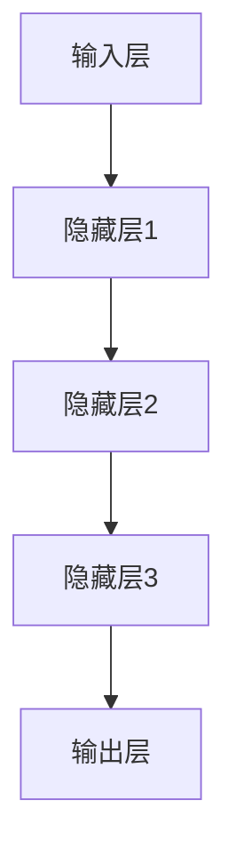

                 

# 文章标题：李开复：AI 2.0 时代的产业

> 关键词：AI 2.0、产业变革、深度学习、自然语言处理、伦理挑战

> 摘要：本文将深入探讨AI 2.0时代的产业变革，从技术基础到应用场景，再到管理与伦理问题，全面解析AI 2.0对各个行业带来的深远影响。通过逻辑清晰的分析与实例讲解，帮助读者理解AI 2.0的核心特征及其在产业中的广泛应用。

## 目录大纲

- **第一部分：AI 2.0 时代概述**
  - **1. AI 2.0 时代的来临**
    - 1.1 AI 2.0 与传统AI的区别
    - 1.2 AI 2.0 的核心特征与应用领域
    - 1.3 AI 2.0 对产业变革的影响
  - **2. AI 2.0 技术基础**
    - **2.1 深度学习与神经网络基础**
      - 2.1.1 神经网络的基本结构
      - 2.1.2 常见的深度学习架构
      - 2.1.3 深度学习优化算法
    - **2.2 自然语言处理技术概览**
      - 2.2.1 词嵌入技术
      - 2.2.2 序列模型与注意力机制
      - 2.2.3 转换器架构详解
    - **2.3 大规模预训练模型原理**
      - 2.3.1 预训练的概念与意义
      - 2.3.2 自监督学习方法
      - 2.3.3 迁移学习与微调技术

- **第二部分：AI 2.0 在产业中的应用**
  - **3. AI 2.0 在金融行业的应用**
    - 3.1 金融行业的AI应用现状
    - 3.2 AI在风险管理中的应用
    - 3.3 AI在投资决策中的应用
  - **4. AI 2.0 在医疗健康领域的应用**
    - 4.1 医疗健康领域的AI应用现状
    - 4.2 AI在疾病诊断中的应用
    - 4.3 AI在精准医疗中的应用
  - **5. AI 2.0 在制造业的应用**
    - 5.1 制造业的AI应用现状
    - 5.2 AI在供应链管理中的应用
    - 5.3 AI在产品质量控制中的应用
  - **6. AI 2.0 在零售行业的应用**
    - 6.1 零售行业的AI应用现状
    - 6.2 AI在智能推荐系统中的应用
    - 6.3 AI在客户服务中的应用
  - **7. AI 2.0 在农业和食品工业的应用**
    - 7.1 农业和食品工业的AI应用现状
    - 7.2 AI在精准农业中的应用
    - 7.3 AI在食品质量检测中的应用

- **第三部分：AI 2.0 时代的管理与伦理**
  - **8. AI 2.0 时代的管理变革**
    - 8.1 企业在AI时代的管理模式
    - 8.2 AI驱动的决策与战略规划
    - 8.3 AI在人力资源管理中的应用
  - **9. AI 2.0 时代的伦理挑战**
    - 9.1 AI伦理的基本原则
    - 9.2 AI偏见与歧视问题
    - 9.3 AI隐私保护与数据安全
  - **10. AI 2.0 时代的法律法规与政策**
    - 10.1 全球AI法律法规现状
    - 10.2 中国AI法律法规概述
    - 10.3 AI产业发展政策分析

- **附录**
  - **附录 A: AI 2.0 开发工具与资源**
    - 10.1 主流深度学习框架对比
    - 10.2 AI开发工具与环境搭建
    - 10.3 AI社区与学习资源

---

### 第一部分：AI 2.0 时代概述

#### 1. AI 2.0 时代的来临

在技术发展的长河中，人工智能（AI）正经历着从1.0到2.0的转变。AI 1.0时代主要依赖于规则的制定和有限的数据处理能力，而AI 2.0时代则标志着深度学习、大规模预训练模型和自监督学习的崛起。AI 2.0的到来不仅使得机器能够处理复杂数据，还赋予了它们自主学习、推理和决策的能力。

##### 1.1 AI 2.0 与传统AI的区别

传统AI以规则导向和统计方法为主，其适用范围较为狭窄，主要应用于特定任务和静态数据集。相比之下，AI 2.0更加强调模型的灵活性和泛化能力，能够处理大规模、动态和不确定的数据。这种变化主要体现在以下几个方面：

- **数据处理能力提升**：AI 2.0利用深度学习和大规模预训练模型，可以处理海量数据，提取更复杂的特征。
- **自主学习与泛化**：AI 2.0通过自监督学习和迁移学习，能够从少量数据中学习，并在新的任务和数据集上表现出色。
- **推理与决策**：AI 2.0不仅能够执行特定的任务，还能进行推理和决策，具备一定程度的智能性。

##### 1.2 AI 2.0 的核心特征与应用领域

AI 2.0的核心特征包括：

- **深度学习**：通过多层神经网络进行数据建模和特征提取，提高模型的准确性和泛化能力。
- **自然语言处理**：利用词嵌入、序列模型和注意力机制，实现高效的自然语言理解和生成。
- **大规模预训练模型**：通过在大规模数据集上进行预训练，提升模型在特定领域的表现。
- **自监督学习**：利用无监督学习技术，从原始数据中自动提取标签和特征。
- **迁移学习**：通过在源域学习后，将知识迁移到目标域，提高模型在新任务上的性能。

AI 2.0的应用领域广泛，包括但不限于：

- **金融行业**：风险控制、投资决策、客户服务自动化。
- **医疗健康领域**：疾病诊断、药物研发、个性化治疗。
- **制造业**：智能制造、质量控制、供应链优化。
- **零售行业**：智能推荐、库存管理、客户服务。
- **农业和食品工业**：精准农业、食品质量检测、供应链管理。

##### 1.3 AI 2.0 对产业变革的影响

AI 2.0对产业变革的影响是深远且全面的。首先，它推动了传统产业的数字化转型，提高了生产效率和产品质量。其次，AI 2.0创造了新的商业模式和就业机会，促进了创新和创业。最后，AI 2.0带来了数据驱动的决策和战略规划，为企业提供了更加精准和高效的管理工具。

#### 2. AI 2.0 技术基础

##### 2.1 深度学习与神经网络基础

深度学习是AI 2.0的核心技术之一。它通过构建多层神经网络，对数据进行层次化的特征提取和抽象，从而实现复杂的模式识别和预测。以下是深度学习和神经网络的一些基础概念：

- **神经网络的基本结构**：神经网络由多个层次组成，包括输入层、隐藏层和输出层。每层包含多个神经元，神经元之间通过权重连接。
- **前向传播与反向传播**：在前向传播过程中，数据从输入层传递到输出层，经过各个神经元的非线性变换。在反向传播过程中，利用梯度下降算法更新权重，以最小化损失函数。
- **激活函数**：激活函数用于引入非线性因素，常见的激活函数包括Sigmoid、ReLU和Tanh。
- **损失函数**：损失函数用于评估模型的预测结果与实际结果之间的差距，常见的损失函数包括均方误差（MSE）和交叉熵损失。

##### 2.1.1 神经网络的基本结构

##### 2.1.2 常见的深度学习架构

深度学习的架构种类繁多，以下介绍几种常见的架构：

- **卷积神经网络（CNN）**：适用于图像处理，通过卷积层、池化层和全连接层提取图像特征。
- **循环神经网络（RNN）**：适用于序列数据处理，通过隐藏状态和循环连接实现长时依赖学习。
- **长短期记忆网络（LSTM）**：是RNN的一种变体，通过引入门控机制解决长时依赖问题。
- **生成对抗网络（GAN）**：通过生成器和判别器的对抗训练，实现高质量数据的生成。

##### 2.1.3 深度学习优化算法

深度学习的优化算法主要基于梯度下降，以下介绍几种常见的优化算法：

- **随机梯度下降（SGD）**：每次更新使用一个样本的梯度。
- **批量梯度下降（BGD）**：每次更新使用所有样本的梯度。
- **小批量梯度下降（MBGD）**：每次更新使用一部分样本的梯度，是SGD和BGD的折中。
- **Adam优化器**：结合了SGD和Adam的优点，自适应地调整学习率。

##### 2.2 自然语言处理技术概览

自然语言处理（NLP）是AI 2.0的重要应用领域之一。以下是NLP的一些基础技术：

- **词嵌入**：将词汇映射到高维向量空间，以便进行计算和建模。常见的词嵌入技术包括Word2Vec、GloVe和BERT。
- **序列模型**：用于处理序列数据，如RNN和LSTM。通过捕捉序列中的依赖关系，实现语言理解和生成。
- **注意力机制**：用于模型在不同位置分配不同的重要性，提高序列模型的性能。
- **转换器架构**：是一种基于注意力机制的序列到序列模型，广泛应用于机器翻译、文本摘要等任务。

##### 2.2.1 词嵌入技术

词嵌入是将词汇映射到高维向量空间的技术。以下是几种常见的词嵌入技术：

- **Word2Vec**：基于神经网络的词嵌入方法，通过训练上下文向量表示词的语义。
- **GloVe**：基于全局上下文的词嵌入方法，通过训练单词的共现矩阵进行特征提取。
- **BERT**：基于大规模预训练的语言模型，通过无监督学习获得高质量的词嵌入。

##### 2.2.2 序列模型与注意力机制

序列模型是NLP中常用的模型，以下介绍几种常见的序列模型：

- **RNN**：通过隐藏状态和循环连接实现序列数据处理，但存在长时依赖问题。
- **LSTM**：是RNN的一种变体，通过引入门控机制解决长时依赖问题。
- **Transformer**：是基于注意力机制的序列到序列模型，通过多头自注意力实现高效的语言理解。

##### 2.2.3 转换器架构详解

转换器（Transformer）是一种基于注意力机制的序列到序列模型，以下介绍其基本原理：

- **多头自注意力**：通过计算序列中每个位置对其他位置的注意力权重，实现位置信息的整合。
- **位置编码**：将位置信息编码到向量中，以便在自注意力机制中考虑序列的顺序。
- **前馈神经网络**：在自注意力层之后添加两个全连接层，用于提取更高层次的特征。

##### 2.3 大规模预训练模型原理

大规模预训练模型是AI 2.0的关键技术之一，以下介绍其基本原理：

- **预训练的概念与意义**：预训练是指在大规模数据集上对模型进行无监督训练，以学习通用特征。预训练的意义在于提高模型在特定任务上的性能。
- **自监督学习方法**：自监督学习是一种无监督学习方法，通过利用未标记的数据进行训练，提高模型的泛化能力。
- **迁移学习与微调技术**：迁移学习是指将预训练模型的知识迁移到新的任务和数据集上，微调是指在预训练模型的基础上进行少量数据的有监督训练，以适应特定任务。

##### 2.3.1 预训练的概念与意义

预训练是指在大规模数据集上对模型进行无监督训练，以学习通用特征。这种无监督训练使得模型能够自动捕捉语言、图像等数据中的高层次结构和规律，从而提高模型在特定任务上的性能。预训练的意义在于：

- **提高模型性能**：通过预训练，模型可以学习到大量的通用特征，从而在下游任务中表现出色。
- **减少数据需求**：预训练模型可以利用未标记的数据进行训练，减少对大规模标注数据的依赖。
- **促进泛化能力**：预训练模型通过在多样化数据集上训练，提高了模型的泛化能力。

##### 2.3.2 自监督学习方法

自监督学习方法是一种无监督学习方法，通过利用未标记的数据进行训练，提高模型的泛化能力。自监督学习方法的主要思想是利用数据中的内在结构，自动提取有用的特征和模式。以下是几种常见的自监督学习方法：

- **Masked Language Model (MLM)**：通过随机遮盖输入文本中的部分词或子词，预测被遮盖的部分。这种方法能够学习到词汇的上下文关系和语法结构。
- ** masked Object Detection (MOM)**：通过遮盖图像中的部分对象，训练模型进行对象检测。这种方法能够学习到图像中对象的布局和关系。
- ** Generative Adversarial Network (GAN)**：通过生成器和判别器的对抗训练，生成高质量的数据。这种方法能够学习到数据的分布和生成新的数据。

##### 2.3.3 迁移学习与微调技术

迁移学习是指将预训练模型的知识迁移到新的任务和数据集上，以减少对新数据的标注需求和提升模型性能。迁移学习的主要步骤包括：

- **预训练**：在大量未标记的数据集上对模型进行预训练，学习到通用特征。
- **微调**：在新的任务和数据集上对模型进行少量有监督训练，调整模型参数以适应特定任务。

微调技术是一种快速适应新任务的方法，通过在预训练模型的基础上进行少量数据的有监督训练，可以显著提高模型在新任务上的性能。微调的关键在于选择合适的数据集和调整训练策略，以最大化迁移效果。

### 第二部分：AI 2.0 在产业中的应用

#### 3. AI 2.0 在金融行业的应用

金融行业是AI 2.0技术的早期应用领域之一。AI 2.0在金融行业的应用范围广泛，涵盖了风险控制、投资决策和客户服务等多个方面。

##### 3.1 金融行业的AI应用现状

随着AI 2.0技术的不断发展，金融行业的AI应用逐渐成熟。目前，金融行业的AI应用主要集中在以下几个方面：

- **智能投顾**：通过AI技术，为投资者提供个性化的投资建议，提高投资回报率。
- **风险管理**：利用AI技术进行风险评估和预测，降低金融风险。
- **信用评估**：通过分析个人和企业的信用历史，利用AI技术进行信用评估和贷款审批。
- **反欺诈**：利用AI技术识别和防范金融欺诈行为，保护金融机构和客户的利益。
- **智能客服**：通过自然语言处理技术，实现自动化客户服务，提高客户满意度。

##### 3.2 AI在风险管理中的应用

风险管理是金融行业的重要环节，AI 2.0技术的应用为风险管理带来了新的方法和工具。以下是AI在风险管理中的一些应用：

- **风险预测**：通过分析历史数据和实时数据，利用AI技术预测潜在的风险事件。
- **风险监控**：利用AI技术实时监控金融市场和交易行为，及时发现风险信号。
- **风险分散**：通过分析风险分布和相关性，利用AI技术进行投资组合优化，降低风险集中度。
- **风险评估模型**：构建基于AI的风险评估模型，对客户和投资项目的风险进行量化评估。

##### 3.3 AI在投资决策中的应用

投资决策是金融行业的核心任务之一，AI 2.0技术的应用为投资决策提供了新的方法和工具。以下是AI在投资决策中的一些应用：

- **市场预测**：通过分析历史数据和实时数据，利用AI技术预测市场走势，为投资决策提供参考。
- **资产配置**：通过分析风险和收益特征，利用AI技术进行资产配置，实现风险收益的最优化。
- **交易策略**：通过分析市场数据和交易数据，利用AI技术制定高效的交易策略。
- **风险评估与调整**：通过分析市场变化和客户需求，利用AI技术对投资组合进行风险评估和调整。

##### 3.4 AI在金融行业的未来发展趋势

随着AI 2.0技术的不断进步，金融行业的AI应用将迎来更多的发展机遇。以下是AI在金融行业的未来发展趋势：

- **更深入的自动化**：AI技术将进一步提升金融行业的自动化水平，减少人力成本，提高运营效率。
- **更智能的风险管理**：AI技术将进一步提高风险管理的智能化水平，降低金融风险，保障客户利益。
- **更精准的投资决策**：AI技术将进一步提高投资决策的精准度，提升投资回报率。
- **更广泛的场景应用**：AI技术将应用于金融行业的更多场景，如保险、支付、区块链等。

#### 4. AI 2.0 在医疗健康领域的应用

医疗健康领域是AI 2.0技术的另一个重要应用领域。AI 2.0技术在医疗健康领域的应用，为疾病的诊断、治疗和预防提供了新的方法和工具。

##### 4.1 医疗健康领域的AI应用现状

目前，AI 2.0技术在医疗健康领域的应用已经取得了一些显著成果。以下是AI在医疗健康领域的一些应用：

- **疾病诊断**：通过分析医学图像、病例数据和基因数据，利用AI技术进行疾病诊断，提高诊断准确率和效率。
- **药物研发**：利用AI技术进行药物筛选、分子模拟和临床试验设计，加速药物研发进程。
- **个性化治疗**：通过分析患者的基因、病史和治疗方案，利用AI技术为患者提供个性化的治疗方案。
- **健康监测**：利用AI技术对患者的健康数据进行分析和预测，及时发现健康问题，提供预防措施。
- **医疗管理**：通过AI技术优化医疗资源的配置和利用，提高医疗服务的质量和效率。

##### 4.2 AI在疾病诊断中的应用

AI 2.0技术在疾病诊断中的应用，主要体现在以下几个方面：

- **医学影像分析**：通过分析医学影像，如X光、CT和MRI等，利用AI技术进行病灶检测、分割和诊断。
- **病理分析**：通过分析病理切片，利用AI技术进行癌症等疾病的诊断。
- **病例数据挖掘**：通过挖掘病例数据，利用AI技术发现疾病的诊断规律和治疗策略。
- **基因分析**：通过分析基因数据，利用AI技术进行疾病的预测和诊断。

##### 4.3 AI在精准医疗中的应用

精准医疗是近年来医疗健康领域的一个热点，AI 2.0技术在精准医疗中的应用，为个体化医疗提供了新的可能性。以下是AI在精准医疗中的一些应用：

- **个体化治疗**：通过分析患者的基因、病史和治疗方案，利用AI技术为患者制定个性化的治疗方案。
- **药物基因组学**：通过分析患者的基因数据，利用AI技术筛选最适合患者的药物。
- **疾病预测**：通过分析患者的健康数据，利用AI技术预测疾病的发生和发展。
- **风险评估**：通过分析患者的健康数据，利用AI技术评估疾病的风险，提供预防措施。

##### 4.4 AI在医疗健康领域的未来发展趋势

随着AI 2.0技术的不断进步，医疗健康领域的AI应用将迎来更多的发展机遇。以下是AI在医疗健康领域的未来发展趋势：

- **更广泛的场景应用**：AI技术将应用于医疗健康领域的更多场景，如辅助手术、健康管理等。
- **更高的诊断准确率**：通过不断优化算法和增加数据集，AI技术的诊断准确率将不断提高。
- **更深入的个性化治疗**：AI技术将进一步提升个性化治疗的能力，为患者提供更加精准和有效的治疗方案。
- **更智能的医疗管理**：AI技术将优化医疗资源的配置和利用，提高医疗服务的质量和效率。

#### 5. AI 2.0 在制造业的应用

制造业是国民经济的重要支柱，AI 2.0技术的应用为制造业的转型升级提供了新的动力。

##### 5.1 制造业的AI应用现状

目前，AI 2.0技术在制造业的应用已经取得了一些显著成果。以下是AI在制造业的一些应用：

- **智能制造**：通过AI技术实现生产过程的自动化和智能化，提高生产效率和质量。
- **质量控制**：通过AI技术对产品质量进行实时监测和评估，提高产品质量。
- **供应链管理**：通过AI技术优化供应链的各个环节，提高供应链的效率和响应速度。
- **设备预测维护**：通过AI技术对设备进行预测性维护，减少设备故障和停机时间。
- **产品设计**：通过AI技术优化产品设计，提高产品的创新性和市场竞争力。

##### 5.2 AI在供应链管理中的应用

供应链管理是制造业的核心环节之一，AI 2.0技术在供应链管理中的应用，为供应链的优化和效率提升提供了新的方法和工具。以下是AI在供应链管理中的一些应用：

- **需求预测**：通过分析历史销售数据和市场趋势，利用AI技术预测未来的需求，优化生产计划和库存管理。
- **物流优化**：通过分析物流数据，利用AI技术优化运输路线和物流网络，提高物流效率和降低成本。
- **库存管理**：通过分析库存数据，利用AI技术实现精准的库存管理，降低库存成本和缺货风险。
- **供应链监控**：通过实时监控供应链的各个环节，利用AI技术及时发现潜在问题和风险，确保供应链的稳定运行。

##### 5.3 AI在产品质量控制中的应用

产品质量是制造业的核心竞争力之一，AI 2.0技术在产品质量控制中的应用，为产品质量的提升提供了新的手段。以下是AI在产品质量控制中的一些应用：

- **质量监测**：通过实时监测生产过程中的关键质量指标，利用AI技术发现潜在的质量问题，及时采取措施进行纠正。
- **质量评估**：通过对产品进行质量检测和分析，利用AI技术评估产品的质量水平，为产品改进提供依据。
- **缺陷检测**：通过对产品进行缺陷检测和分析，利用AI技术识别和分类缺陷，提高产品质量。
- **质量预测**：通过对历史质量数据进行分析和预测，利用AI技术预测未来的质量趋势，提前采取预防措施。

##### 5.4 AI在制造业的未来发展趋势

随着AI 2.0技术的不断进步，制造业的AI应用将迎来更多的发展机遇。以下是AI在制造业的未来发展趋势：

- **更广泛的场景应用**：AI技术将应用于制造业的更多场景，如设备维护、生产规划等。
- **更高的生产效率**：通过不断优化算法和增加数据集，AI技术的生产效率将不断提高。
- **更智能的设备维护**：AI技术将进一步提升设备维护的智能化水平，减少设备故障和停机时间。
- **更优化的供应链管理**：AI技术将优化供应链的各个环节，提高供应链的效率和响应速度。

### 第三部分：AI 2.0 时代的管理与伦理

#### 8. AI 2.0 时代的管理变革

随着AI 2.0技术的快速发展，企业管理模式也面临着深刻的变革。AI 2.0时代的管理变革主要体现在以下几个方面：

##### 8.1 企业在AI时代的管理模式

在AI 2.0时代，企业的管理模式将发生以下变化：

- **数据驱动的决策**：企业将更加依赖数据分析和预测模型进行决策，提高决策的准确性和效率。
- **智能化的运营管理**：企业将利用AI技术优化生产、物流、销售等各个环节，提高运营效率。
- **团队协作与知识共享**：企业将利用AI技术实现团队协作和知识共享，提高团队的工作效率和创新能力。
- **人才培养与激励机制**：企业将更加注重人才的培养和激励，鼓励员工积极学习和创新。

##### 8.2 AI驱动的决策与战略规划

AI驱动的决策和战略规划是企业在AI时代的重要能力。以下是AI在决策和战略规划中的应用：

- **市场预测与趋势分析**：通过分析市场数据，利用AI技术预测市场趋势，为企业制定战略规划提供依据。
- **客户需求分析**：通过分析客户数据，利用AI技术识别客户需求，为企业产品开发和市场营销提供指导。
- **竞争对手分析**：通过分析竞争对手的数据，利用AI技术了解竞争对手的动态，为企业制定竞争策略提供参考。
- **风险管理**：通过分析风险数据，利用AI技术预测潜在风险，为企业制定风险管理策略提供支持。

##### 8.3 AI在人力资源管理中的应用

AI技术在人力资源管理中的应用，将提高企业的人力资源管理效率和效果。以下是AI在人力资源管理中的应用：

- **人才招聘与选拔**：通过分析求职者的简历和面试表现，利用AI技术进行人才招聘和选拔。
- **员工绩效评估**：通过分析员工的工作数据和行为数据，利用AI技术进行员工绩效评估。
- **培训与发展**：通过分析员工的培训需求和表现，利用AI技术制定个性化的培训计划。
- **员工福利与激励**：通过分析员工的需求和行为，利用AI技术为员工提供个性化的福利和激励。

#### 9. AI 2.0 时代的伦理挑战

随着AI 2.0技术的广泛应用，伦理问题也日益凸显。以下是AI 2.0时代面临的几个重要伦理挑战：

##### 9.1 AI伦理的基本原则

AI伦理的基本原则包括：

- **公平性**：AI系统应公平对待所有用户，避免歧视和偏见。
- **透明度**：AI系统的决策过程应透明，用户可以理解系统的决策逻辑。
- **隐私保护**：AI系统应保护用户的隐私，避免泄露用户的个人信息。
- **责任归属**：当AI系统出现问题时，应明确责任归属，确保受害者得到合理的赔偿。

##### 9.2 AI偏见与歧视问题

AI偏见与歧视问题是AI 2.0时代面临的重要伦理挑战之一。以下是偏见与歧视问题的几个方面：

- **数据偏见**：AI系统在训练过程中，如果使用了有偏见的数据，可能会导致系统在决策过程中产生偏见。
- **算法偏见**：AI系统在设计过程中，如果算法存在偏见，可能会导致系统在决策过程中产生偏见。
- **技术偏见**：AI系统的应用场景可能存在偏见，如某些技术更适用于某些群体，而忽视其他群体。

##### 9.3 AI隐私保护与数据安全

AI隐私保护与数据安全是AI 2.0时代的重要伦理问题。以下是隐私保护与数据安全的几个方面：

- **数据收集与使用**：在收集和使用用户数据时，应遵循合法、正当、必要的原则，确保用户知情并同意。
- **数据存储与传输**：在存储和传输用户数据时，应采取加密和安全防护措施，确保数据的安全性。
- **用户隐私权利**：用户应享有隐私权利，包括访问、更正、删除和撤回同意等权利。
- **数据泄露与应急响应**：在发生数据泄露事件时，应采取应急响应措施，及时通知用户并采取措施减少损失。

#### 10. AI 2.0 时代的法律法规与政策

随着AI 2.0技术的快速发展，各国政府和国际组织纷纷制定相应的法律法规和政策，以规范AI技术的发展和应用。

##### 10.1 全球AI法律法规现状

以下是全球一些主要国家和国际组织在AI领域制定的法律法规和政策：

- **欧盟**：欧盟制定了《人工智能伦理准则》和《人工智能法案》，旨在规范AI技术的应用，保障用户权益。
- **美国**：美国制定了《美国人工智能倡议》，旨在推动AI技术的发展，提高国家竞争力。
- **中国**：中国制定了《新一代人工智能发展规划》和《人工智能发展行动计划》，旨在推动AI技术的创新和应用。
- **国际组织**：国际标准化组织（ISO）和国际电信联盟（ITU）等国际组织制定了多项AI相关标准，以规范AI技术的发展和应用。

##### 10.2 中国AI法律法规概述

以下是中国的AI法律法规概述：

- **《新一代人工智能发展规划》**：这是中国首个针对人工智能的发展规划，旨在推动人工智能的创新和应用。
- **《人工智能发展行动计划（2018-2020年）》**：这是中国针对人工智能发展的行动计划，明确了人工智能的发展目标和重点任务。
- **《人工智能标准化行动计划（2018-2020年）》**：这是中国针对人工智能标准化的发展计划，旨在推动人工智能标准化工作的开展。

##### 10.3 AI产业发展政策分析

以下是AI产业发展政策分析：

- **政府支持**：各国政府纷纷出台政策，支持AI技术的发展和应用，如资金扶持、税收优惠、人才引进等。
- **产业联盟**：产业联盟在推动AI产业发展中发挥着重要作用，如欧洲人工智能联盟、中国人工智能产业发展联盟等。
- **国际合作**：国际组织和企业积极推动AI领域的国际合作，共同应对AI带来的挑战和机遇。

## 附录

### 附录 A: AI 2.0 开发工具与资源

为了更好地理解和应用AI 2.0技术，以下是几种主流的深度学习框架、开发工具和学习资源：

##### A.1 主流深度学习框架对比

以下是几种主流的深度学习框架及其特点：

- **TensorFlow**：由Google开发，是目前最流行的深度学习框架之一，具有强大的生态系统和丰富的资源。
- **PyTorch**：由Facebook开发，以其动态计算图和易于使用的API而著称，适合快速原型开发和研究。
- **JAX**：由Google开发，提供了自动微分和高性能计算等功能，适用于大规模数据集和复杂模型。

| 框架 | 特点 | 优点 | 缺点 |
| --- | --- | --- | --- |
| TensorFlow | 强大的生态系统、易于部署 | 易于使用、强大的工具支持 | 相对较重、需要一定的学习成本 |
| PyTorch | 动态计算图、易于使用 | 适合快速原型开发、易于调试 | 性能优化要求较高、生态系统较小 |
| JAX | 自动微分、高性能计算 | 高性能、易于优化 | 学习曲线较陡、适用场景有限 |

##### A.2 AI开发工具与环境搭建

以下是AI开发中常用的工具和环境搭建步骤：

- **Anaconda**：用于环境管理和包安装，便于管理不同项目的依赖。
- **Docker**：用于容器化部署，便于创建和管理开发环境。
- **Jupyter Notebook**：用于交互式开发，便于代码和结果的展示。
- **GPU支持**：对于深度学习项目，需要安装CUDA和cuDNN，以利用GPU加速计算。

##### A.3 AI社区与学习资源

以下是AI领域的一些社区和学习资源：

- **AI教程网**：提供丰富的AI教程和课程，适合不同层次的学习者。
- **Kaggle**：一个数据科学竞赛平台，适合练习和实践AI项目。
- **Reddit AI**：一个AI讨论社区，可以获取最新的AI动态和资源。
- **GitHub**：一个代码托管平台，可以找到大量的AI开源项目和代码库。

---

在本文中，我们深入探讨了AI 2.0时代的产业变革，从技术基础到应用场景，再到管理与伦理问题，全面解析了AI 2.0对各个行业带来的深远影响。通过逻辑清晰的分析与实例讲解，我们帮助读者理解了AI 2.0的核心特征及其在产业中的广泛应用。

展望未来，AI 2.0技术将继续推动各行业的创新与发展，为人类带来更多的便利和机遇。然而，随着AI技术的广泛应用，我们也需要关注并解决伦理、隐私和安全等问题。只有在确保AI技术可持续发展和社会福祉的前提下，AI 2.0才能真正发挥其巨大潜力。

最后，本文的撰写离不开众多专家学者的智慧与贡献。在此，我们对所有为AI技术发展做出贡献的学者、工程师和开发者表示衷心的感谢。让我们共同期待AI 2.0时代的到来，创造一个更加智能、高效和美好的未来。

**作者：AI天才研究院/AI Genius Institute & 禅与计算机程序设计艺术 /Zen And The Art of Computer Programming**

