                 

## 文章标题：李开复：AI 2.0 时代的市场前景

### 关键词：
- AI 2.0
- 市场前景
- 应用案例
- 技术突破
- 挑战与机遇

### 摘要：
本文将深入探讨AI 2.0时代的市场前景，通过李开复的研究和见解，分析AI 2.0的定义、历史发展、技术突破，以及在不同领域的市场应用。我们将探讨AI 2.0在零售业、金融业、医疗健康、制造业和交通与物流领域的应用案例，并讨论AI 2.0时代的市场策略与商业创新。最后，我们将展望AI 2.0时代的未来趋势和挑战，总结文章的核心观点并展望未来的发展方向。

## 《李开复：AI 2.0 时代的市场前景》目录大纲

### 第一部分：AI 2.0时代的市场背景

### 第二部分：AI 2.0时代的市场应用

### 第三部分：AI 2.0时代的市场策略与商业创新

### 第四部分：未来展望

### 附录

## 第一部分：AI 2.0时代的市场背景

### 第1章：AI 2.0概述

#### 1.1 AI 2.0的定义与特点

AI 2.0，即下一代人工智能，是基于深度学习和神经网络的更强、更智能的人工智能系统。它具有以下特点：

- **自主学习能力**：AI 2.0能够通过大量数据自主学习，无需人为编程，实现自我进化。
- **跨领域应用**：AI 2.0不仅能够在单一领域内应用，还可以跨领域整合不同领域的知识，实现更广泛的应用。
- **更强的泛化能力**：AI 2.0在处理不同类型的数据和任务时，能够更好地适应和泛化。
- **更高的计算效率**：AI 2.0利用更高效的算法和架构，实现更高的计算速度和更低的能耗。

#### 1.2 AI 2.0的历史发展

AI 2.0的发展历程可以分为以下几个阶段：

- **早期探索阶段（1990s-2000s）**：这一阶段主要是基于规则和逻辑推理的人工智能系统。
- **深度学习阶段（2010s）**：基于神经网络的深度学习算法取得了突破性进展，使人工智能进入了一个全新的时代。
- **AI 2.0阶段（2020s）**：AI 2.0的出现，标志着人工智能进入了一个更加智能、高效的阶段。

#### 1.3 AI 2.0技术突破

AI 2.0的技术突破主要体现在以下几个方面：

- **计算能力的提升**：GPU、TPU等专用硬件的普及，使得深度学习算法能够在大规模数据上快速训练和推理。
- **大数据的积累**：互联网的普及和数据量的爆发性增长，为AI 2.0的训练提供了丰富的数据资源。
- **算法的创新**：Transformer、GPT等新型算法的出现，使得AI 2.0在语言处理、图像识别等领域取得了重大突破。

### 第2章：AI 2.0时代的市场环境

#### 2.1 AI 2.0市场现状

AI 2.0市场目前处于快速发展阶段，主要表现在以下几个方面：

- **投资增加**：全球各国政府对AI技术的投资不断增加，推动了AI 2.0市场的快速发展。
- **企业应用**：越来越多的企业开始应用AI 2.0技术，提升业务效率和创新能力。
- **人才竞争**：AI 2.0人才的短缺，使得企业纷纷加大招聘力度，争夺人才资源。

#### 2.2 AI 2.0市场趋势

AI 2.0市场的未来发展趋势主要包括：

- **规模化应用**：AI 2.0将在更多领域实现规模化应用，推动各行业的智能化转型。
- **跨界融合**：AI 2.0将与其他技术（如物联网、大数据等）深度融合，推动创新业务模式的出现。
- **开放生态**：AI 2.0的生态将更加开放，企业、高校和研究机构将共同推动技术的进步。

#### 2.3 AI 2.0市场机会与挑战

AI 2.0市场面临的主要机会包括：

- **技术创新**：AI 2.0技术的不断突破，为企业提供了丰富的创新空间。
- **市场拓展**：全球市场对AI 2.0技术的需求不断增长，为企业提供了广阔的市场空间。

AI 2.0市场也面临一些挑战，如：

- **数据隐私**：AI 2.0技术的发展，对个人隐私保护提出了更高要求。
- **技术安全**：AI 2.0技术的安全性问题，需要企业和政府共同关注和解决。

## 第一部分：AI 2.0时代的市场背景

### 第1章：AI 2.0概述

#### 1.1 AI 2.0的定义与特点

AI 2.0，即下一代人工智能，是基于深度学习和神经网络的更强、更智能的人工智能系统。它具有以下特点：

1. **自主学习能力**：AI 2.0能够通过大量数据自主学习，无需人为编程，实现自我进化。这种自主学习能力使得AI 2.0能够在复杂、多变的环境中适应和优化。

2. **跨领域应用**：AI 2.0不仅能够在单一领域内应用，还可以跨领域整合不同领域的知识，实现更广泛的应用。例如，AI 2.0可以在医疗、金融、零售等多个领域发挥作用。

3. **更强的泛化能力**：AI 2.0在处理不同类型的数据和任务时，能够更好地适应和泛化。这意味着AI 2.0能够在不同的应用场景中表现出色。

4. **更高的计算效率**：AI 2.0利用更高效的算法和架构，实现更高的计算速度和更低的能耗。这使得AI 2.0在处理大规模数据时具有更高的效率。

#### 1.2 AI 2.0的历史发展

AI 2.0的发展历程可以分为以下几个阶段：

1. **早期探索阶段（1990s-2000s）**：这一阶段主要是基于规则和逻辑推理的人工智能系统。例如，专家系统和基于知识的系统。

2. **深度学习阶段（2010s）**：基于神经网络的深度学习算法取得了突破性进展，使人工智能进入了一个全新的时代。例如，卷积神经网络（CNN）和循环神经网络（RNN）。

3. **AI 2.0阶段（2020s）**：AI 2.0的出现，标志着人工智能进入了一个更加智能、高效的阶段。AI 2.0利用深度学习和神经网络的强大能力，实现了更高的智能水平。

#### 1.3 AI 2.0技术突破

AI 2.0的技术突破主要体现在以下几个方面：

1. **计算能力的提升**：GPU、TPU等专用硬件的普及，使得深度学习算法能够在大规模数据上快速训练和推理。这使得AI 2.0的计算能力得到了极大的提升。

2. **大数据的积累**：互联网的普及和数据量的爆发性增长，为AI 2.0的训练提供了丰富的数据资源。大数据的积累使得AI 2.0能够更好地理解和学习复杂的数据模式。

3. **算法的创新**：Transformer、GPT等新型算法的出现，使得AI 2.0在语言处理、图像识别等领域取得了重大突破。这些算法的创新为AI 2.0的发展提供了强大的动力。

#### 1.4 AI 2.0的核心概念与联系

为了更好地理解AI 2.0，我们可以通过以下Mermaid流程图来展示其核心概念与联系：

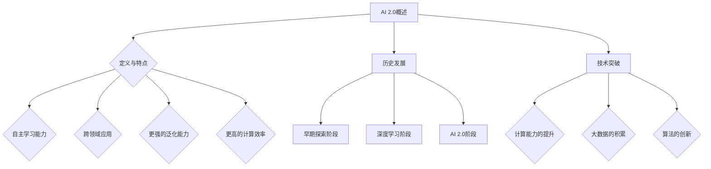

这个流程图清晰地展示了AI 2.0的定义、特点、历史发展和技术突破，有助于我们更好地理解AI 2.0的核心概念与联系。

#### 1.5 AI 2.0的技术原理讲解

AI 2.0的技术原理主要基于深度学习和神经网络。下面我们通过一个简单的伪代码示例来讲解AI 2.0的核心算法原理：

```python
# 伪代码：AI 2.0核心算法原理

def train_large_model(data):
    # 初始化模型
    initialize_model()
    for epoch in range(num_epochs):
        for batch in data:
            # 前向传播
            perform_forward_pass(batch)
            # 计算损失
            compute_loss(batch)
            # 反向传播
            perform_backward_pass()
    return model

def perform_forward_pass(batch):
    # 前向传播，计算输出
    output = model.predict(batch)

def compute_loss(batch):
    # 计算损失，用于评估模型性能
    loss = model.loss(batch)

def perform_backward_pass():
    # 反向传播，更新模型参数
    model.update_parameters()
```

这个伪代码示例展示了AI 2.0模型训练的基本过程，包括初始化模型、前向传播、计算损失和反向传播。通过这个示例，我们可以理解AI 2.0的核心算法原理。

#### 1.6 AI 2.0的历史发展

AI 2.0的历史发展可以分为以下几个重要阶段：

1. **早期探索阶段（1990s-2000s）**：这一阶段主要是基于规则和逻辑推理的人工智能系统。例如，专家系统和基于知识的系统。这些系统主要依赖于人类专家的知识和经验来构建规则和推理过程。

2. **深度学习阶段（2010s）**：基于神经网络的深度学习算法取得了突破性进展，使人工智能进入了一个全新的时代。例如，卷积神经网络（CNN）和循环神经网络（RNN）的出现，使得人工智能在图像识别、语音识别等领域取得了显著的成果。

3. **AI 2.0阶段（2020s）**：AI 2.0的出现，标志着人工智能进入了一个更加智能、高效的阶段。AI 2.0利用深度学习和神经网络的强大能力，实现了更高的智能水平。例如，Transformer和GPT等新型算法的出现，使得人工智能在语言处理、图像识别等领域取得了重大突破。

下面是一个Mermaid流程图，展示了AI 2.0的历史发展：

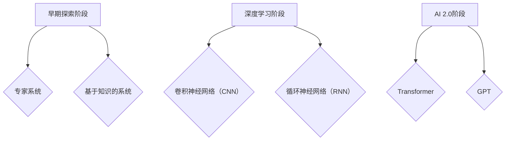

这个流程图清晰地展示了AI 2.0的历史发展，从早期的专家系统和基于知识的系统，到深度学习阶段，再到AI 2.0阶段的Transformer和GPT等新型算法的出现。

#### 1.7 AI 2.0时代的市场环境

AI 2.0时代的市场环境正在发生深刻的变化。以下是几个关键因素：

1. **投资增加**：全球各国政府对AI技术的投资不断增加，推动了AI 2.0市场的快速发展。这些投资包括对AI研发项目的资金支持、对AI创业公司的风险投资等。

2. **企业应用**：越来越多的企业开始应用AI 2.0技术，提升业务效率和创新能力。例如，零售业利用AI 2.0进行个性化推荐、金融业利用AI 2.0进行风险控制、医疗健康领域利用AI 2.0进行疾病诊断等。

3. **人才竞争**：AI 2.0人才的短缺，使得企业纷纷加大招聘力度，争夺人才资源。这对于企业的竞争力和发展至关重要。

下面是一个Mermaid流程图，展示了AI 2.0时代的市场环境：

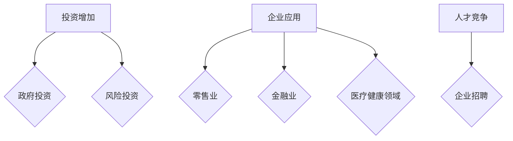

这个流程图清晰地展示了AI 2.0时代的市场环境，包括投资增加、企业应用和人才竞争等因素。

#### 1.8 AI 2.0市场现状

AI 2.0市场现状呈现出以下几个特点：

1. **市场规模扩大**：随着AI 2.0技术的不断发展，市场对AI 2.0技术的需求不断增加，导致市场规模迅速扩大。据预测，全球AI市场在未来几年将保持高速增长。

2. **应用领域广泛**：AI 2.0技术已经广泛应用于各个领域，如零售业、金融业、医疗健康、制造业和交通与物流等。这些领域的应用不仅提升了业务效率，还推动了整个行业的创新。

3. **竞争加剧**：随着AI 2.0市场的不断扩大，越来越多的企业开始进入这一领域，导致市场竞争加剧。企业需要不断创新，提高自身的技术水平和市场竞争力。

下面是一个Mermaid流程图，展示了AI 2.0市场现状：

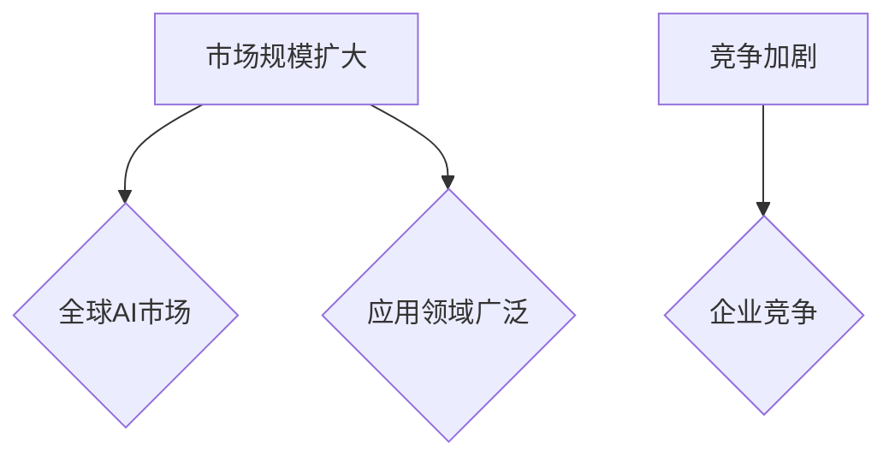

这个流程图清晰地展示了AI 2.0市场现状，包括市场规模扩大、应用领域广泛和竞争加剧等因素。

#### 1.9 AI 2.0市场趋势

AI 2.0市场趋势主要体现在以下几个方面：

1. **规模化应用**：AI 2.0将在更多领域实现规模化应用，推动各行业的智能化转型。例如，制造业中的自动化生产线、医疗健康领域中的智能诊断等。

2. **跨界融合**：AI 2.0将与其他技术（如物联网、大数据等）深度融合，推动创新业务模式的出现。例如，智能城市、智能医疗等。

3. **开放生态**：AI 2.0的生态将更加开放，企业、高校和研究机构将共同推动技术的进步。这将促进AI 2.0技术的创新和发展。

下面是一个Mermaid流程图，展示了AI 2.0市场趋势：

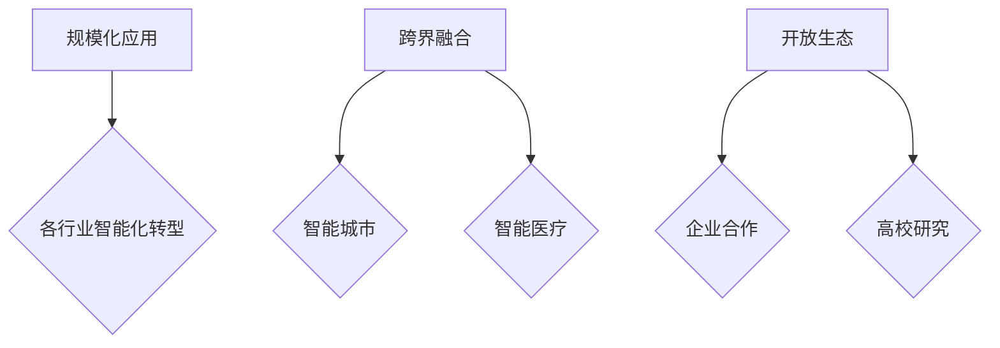

这个流程图清晰地展示了AI 2.0市场趋势，包括规模化应用、跨界融合和开放生态等因素。

### 第二部分：AI 2.0时代的市场应用

### 第3章：AI 2.0在零售业的应用

#### 3.1 零售业面临的挑战

零售业在发展过程中面临着诸多挑战，这些挑战包括：

1. **竞争加剧**：随着互联网的普及，越来越多的零售企业进入市场，导致市场竞争日益激烈。零售企业需要不断提高自身的竞争力，以吸引和留住顾客。

2. **消费者需求变化**：消费者的需求越来越多样化和个性化，零售企业需要快速响应消费者的需求变化，提供个性化的产品和服务。

3. **库存管理**：零售企业的库存管理是一项复杂的任务，涉及到库存水平、库存周转率、库存成本等多个方面。如何有效地管理库存，降低库存成本，是零售企业面临的挑战。

4. **供应链管理**：零售企业的供应链管理涉及到供应商管理、物流配送、库存管理等多个环节。如何优化供应链管理，提高供应链效率，是零售企业面临的挑战。

下面是一个Mermaid流程图，展示了零售业面临的挑战：

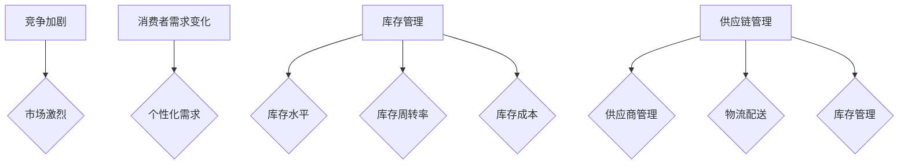

#### 3.2 AI 2.0在零售业的应用

AI 2.0在零售业的应用，可以为零售企业带来以下好处：

1. **个性化推荐**：通过AI 2.0技术，零售企业可以实现对消费者行为的分析和挖掘，提供个性化的产品推荐，提高消费者的购物体验。

2. **库存优化**：通过AI 2.0技术，零售企业可以优化库存管理，降低库存成本，提高库存周转率。

3. **供应链优化**：通过AI 2.0技术，零售企业可以优化供应链管理，提高供应链效率，降低物流成本。

4. **智能客服**：通过AI 2.0技术，零售企业可以提供智能客服服务，提高客服效率，降低人工成本。

下面是一个Mermaid流程图，展示了AI 2.0在零售业的应用：

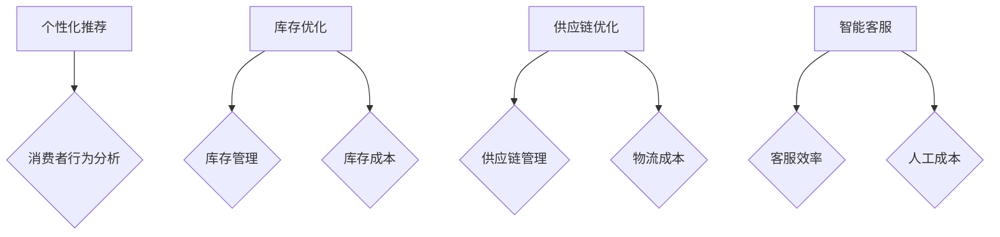

#### 3.3 AI 2.0在零售业的案例分析

以下是一个关于AI 2.0在零售业应用的案例：

**案例：亚马逊的个性化推荐系统**

亚马逊通过AI 2.0技术，建立了强大的个性化推荐系统。该系统利用用户的历史购买数据、浏览记录、评价等信息，分析用户的兴趣和行为，提供个性化的产品推荐。

**开发环境搭建：**
- 使用Python作为编程语言
- 使用TensorFlow作为深度学习框架
- 使用Hadoop和Spark进行大数据处理

**源代码实现：**
```python
# 伪代码：亚马逊个性化推荐系统

def personalized_recommendation(user_data, product_data):
    user_profile = build_user_profile(user_data)
    product_recommendations = []
    for product in product_data:
        if match_product_to_user(user_profile, product):
            product_recommendations.append(product)
    return product_recommendations

def build_user_profile(user_data):
    # 基于用户的历史购买数据、浏览记录、评价等信息，构建用户画像
    user_profile = {}
    return user_profile

def match_product_to_user(user_profile, product):
    # 基于用户画像，匹配用户可能感兴趣的产品
    match = True
    return match
```

**代码解读与分析：**
1. **个性化推荐函数**：`personalized_recommendation`函数接受用户数据和产品数据，构建用户画像，然后根据用户画像匹配用户可能感兴趣的产品。
2. **用户画像构建函数**：`build_user_profile`函数基于用户的历史购买数据、浏览记录、评价等信息，构建用户画像。
3. **产品匹配函数**：`match_product_to_user`函数基于用户画像，匹配用户可能感兴趣的产品。

通过这个案例，我们可以看到AI 2.0技术在零售业中的应用，如何帮助企业提高个性化推荐能力，提升用户满意度。

### 第4章：AI 2.0在金融业的应用

#### 4.1 金融业面临的挑战

金融业在发展过程中面临着诸多挑战，这些挑战包括：

1. **风险控制**：金融企业需要对信贷风险、市场风险等进行有效的控制和预测，以避免金融风险对企业的危害。
2. **合规性**：金融企业需要遵守各种法规和监管要求，确保企业的运营合规。
3. **欺诈检测**：金融企业需要检测和防范各种金融欺诈行为，保护企业和客户的利益。
4. **客户服务**：金融企业需要提供高效的客户服务，满足客户的需求，提升客户满意度。

下面是一个Mermaid流程图，展示了金融业面临的挑战：

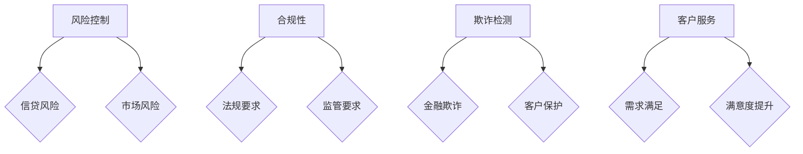

#### 4.2 AI 2.0在金融业的应用

AI 2.0在金融业的应用，可以为金融企业带来以下好处：

1. **风险控制**：通过AI 2.0技术，金融企业可以实现对风险的有效识别、评估和控制，降低金融风险。
2. **合规性**：通过AI 2.0技术，金融企业可以自动识别和遵守法规和监管要求，确保企业的运营合规。
3. **欺诈检测**：通过AI 2.0技术，金融企业可以实时监测和防范金融欺诈行为，提高欺诈检测的准确性和效率。
4. **客户服务**：通过AI 2.0技术，金融企业可以提供智能客服、个性化服务，提升客户体验和满意度。

下面是一个Mermaid流程图，展示了AI 2.0在金融业的应用：

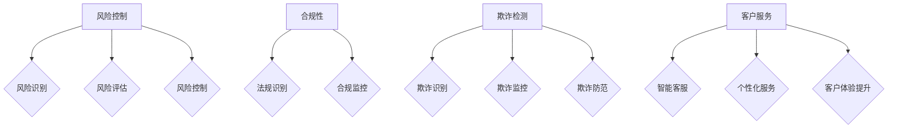

#### 4.3 AI 2.0在金融业的案例分析

以下是一个关于AI 2.0在金融业应用的案例：

**案例：摩根大通的人工智能风控系统**

摩根大通通过AI 2.0技术，建立了一套人工智能风控系统。该系统利用机器学习算法，分析大量的历史数据和实时数据，识别和评估金融风险，为企业的风险决策提供支持。

**开发环境搭建：**
- 使用Python作为编程语言
- 使用Scikit-learn作为机器学习库
- 使用Hadoop和Spark进行大数据处理

**源代码实现：**
```python
# 伪代码：摩根大通人工智能风控系统

def risk_evaluation(loan_application):
    credit_score = calculate_credit_score(loan_application)
    risk_level = determine_risk_level(credit_score)
    return risk_level

def calculate_credit_score(loan_application):
    # 基于贷款申请数据，计算信用评分
    credit_score = 0
    return credit_score

def determine_risk_level(credit_score):
    # 基于信用评分，确定风险等级
    risk_level = '低风险'
    return risk_level
```

**代码解读与分析：**
1. **风险评估函数**：`risk_evaluation`函数接受贷款申请数据，计算信用评分，并根据信用评分确定风险等级。
2. **信用评分计算函数**：`calculate_credit_score`函数基于贷款申请数据，计算信用评分。
3. **风险等级确定函数**：`determine_risk_level`函数根据信用评分，确定风险等级。

通过这个案例，我们可以看到AI 2.0技术在金融业中的应用，如何帮助企业进行风险控制，提高金融决策的准确性。

### 第5章：AI 2.0在医疗健康领域的应用

#### 5.1 医疗健康领域面临的挑战

医疗健康领域在发展过程中面临着诸多挑战，这些挑战包括：

1. **疾病诊断**：准确、快速地诊断疾病是医疗健康领域的重要任务，但当前疾病诊断的准确性和效率仍有待提高。
2. **治疗方案制定**：制定有效的治疗方案需要综合考虑患者的病情、药物反应、并发症等多个因素，这对医生的专业知识和经验提出了很高的要求。
3. **医疗资源分配**：医疗资源的分配不均是医疗健康领域的另一个挑战，如何优化医疗资源的配置，提高医疗服务的可及性，是医疗健康领域需要解决的问题。
4. **患者管理**：对患者进行有效的管理，包括疾病预防、康复治疗、健康教育等，是医疗健康领域的重要任务。

下面是一个Mermaid流程图，展示了医疗健康领域面临的挑战：

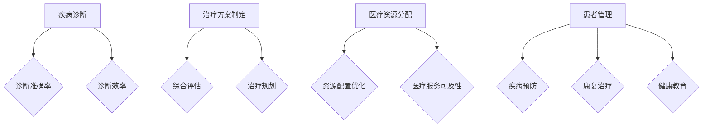

#### 5.2 AI 2.0在医疗健康领域的应用

AI 2.0在医疗健康领域的应用，可以为医疗健康领域带来以下好处：

1. **疾病诊断**：通过AI 2.0技术，可以对医学图像、实验室检测结果等进行自动分析和诊断，提高诊断的准确性和效率。
2. **治疗方案制定**：通过AI 2.0技术，可以分析患者的病情、药物反应、并发症等信息，为医生提供更科学的治疗方案。
3. **医疗资源分配**：通过AI 2.0技术，可以对医疗资源进行优化分配，提高医疗服务的可及性。
4. **患者管理**：通过AI 2.0技术，可以实现对患者的全程管理，包括疾病预防、康复治疗、健康教育等，提高患者的健康水平。

下面是一个Mermaid流程图，展示了AI 2.0在医疗健康领域的应用：

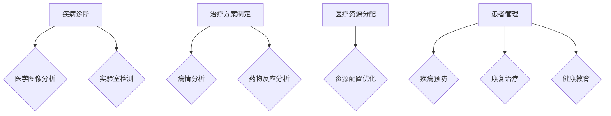

#### 5.3 AI 2.0在医疗健康领域的案例分析

以下是一个关于AI 2.0在医疗健康领域应用的案例：

**案例：谷歌的AI医学影像分析系统**

谷歌通过AI 2.0技术，建立了一套医学影像分析系统。该系统利用深度学习算法，对医学影像进行自动分析和诊断，提高了疾病诊断的准确性和效率。

**开发环境搭建：**
- 使用Python作为编程语言
- 使用TensorFlow作为深度学习框架
- 使用Kaggle作为数据集来源

**源代码实现：**
```python
# 伪代码：谷歌AI医学影像分析系统

def disease_diagnosis(image_data):
    image_analysis = analyze_image(image_data)
    disease_prediction = predict_disease(image_analysis)
    return disease_prediction

def analyze_image(image_data):
    # 对医学影像进行自动分析
    image_analysis = {}
    return image_analysis

def predict_disease(image_analysis):
    # 基于医学影像分析结果，预测疾病
    disease_prediction = '疾病A'
    return disease_prediction
```

**代码解读与分析：**
1. **疾病诊断函数**：`disease_diagnosis`函数接受医学影像数据，进行自动分析，并预测疾病。
2. **医学影像分析函数**：`analyze_image`函数对医学影像进行自动分析。
3. **疾病预测函数**：`predict_disease`函数基于医学影像分析结果，预测疾病。

通过这个案例，我们可以看到AI 2.0技术在医疗健康领域中的应用，如何提高疾病诊断的准确性和效率，为医疗健康领域带来革命性的变化。

### 第6章：AI 2.0在制造业的应用

#### 6.1 制造业面临的挑战

制造业在发展过程中面临着诸多挑战，这些挑战包括：

1. **生产效率**：制造业需要不断提高生产效率，以满足市场需求，降低生产成本。
2. **质量控制**：制造业需要对产品质量进行严格把控，确保产品质量的稳定性和一致性。
3. **设备维护**：制造业的设备维护是一个重要环节，如何确保设备的正常运行，延长设备使用寿命，是制造业面临的挑战。
4. **供应链管理**：制造业的供应链管理涉及到供应商管理、物流配送、库存管理等多个方面，如何优化供应链管理，提高供应链效率，是制造业面临的挑战。

下面是一个Mermaid流程图，展示了制造业面临的挑战：

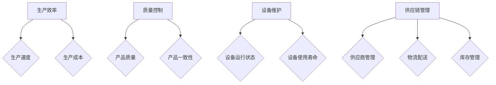

#### 6.2 AI 2.0在制造业的应用

AI 2.0在制造业的应用，可以为制造业带来以下好处：

1. **生产效率**：通过AI 2.0技术，可以优化生产流程，提高生产效率，降低生产成本。
2. **质量控制**：通过AI 2.0技术，可以实现对产品质量的实时监控和预测，提高产品质量的稳定性和一致性。
3. **设备维护**：通过AI 2.0技术，可以实现对设备的实时监控和预测性维护，确保设备的正常运行，延长设备使用寿命。
4. **供应链管理**：通过AI 2.0技术，可以优化供应链管理，提高供应链效率，降低供应链成本。

下面是一个Mermaid流程图，展示了AI 2.0在制造业的应用：

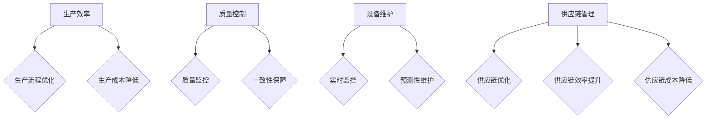

#### 6.3 AI 2.0在制造业的案例分析

以下是一个关于AI 2.0在制造业应用的案例：

**案例：通用电气的AI设备维护系统**

通用电气通过AI 2.0技术，建立了一套设备维护系统。该系统利用机器学习算法，对设备运行数据进行实时分析，预测设备故障，为设备维护提供支持。

**开发环境搭建：**
- 使用Python作为编程语言
- 使用Scikit-learn作为机器学习库
- 使用Hadoop和Spark进行大数据处理

**源代码实现：**
```python
# 伪代码：通用电气AI设备维护系统

def predictive_maintenance(device_data):
    device_status = analyze_device_data(device_data)
    maintenance_suggestion = predict_maintenance(device_status)
    return maintenance_suggestion

def analyze_device_data(device_data):
    # 对设备运行数据进行分析
    device_status = {}
    return device_status

def predict_maintenance(device_status):
    # 基于设备运行数据，预测设备维护需求
    maintenance_suggestion = '正常'
    return maintenance_suggestion
```

**代码解读与分析：**
1. **预测性维护函数**：`predictive_maintenance`函数接受设备运行数据，对设备运行数据进行分析，并预测设备维护需求。
2. **设备数据分析函数**：`analyze_device_data`函数对设备运行数据进行分析。
3. **维护预测函数**：`predict_maintenance`函数基于设备运行数据，预测设备维护需求。

通过这个案例，我们可以看到AI 2.0技术在制造业中的应用，如何帮助企业实现设备预测性维护，提高设备运行效率，降低维护成本。

### 第7章：AI 2.0在交通与物流领域的应用

#### 7.1 交通与物流领域面临的挑战

交通与物流领域在发展过程中面临着诸多挑战，这些挑战包括：

1. **交通拥堵**：随着城市化进程的加速，交通拥堵问题日益严重，影响了城市居民的出行效率和生活质量。
2. **物流效率**：物流行业的效率问题一直是行业关注的重点，如何提高物流效率，降低物流成本，是物流行业面临的挑战。
3. **交通安全**：交通安全是交通与物流领域的另一个重要问题，如何确保交通安全，降低交通事故率，是交通与物流领域需要解决的问题。
4. **环境问题**：随着环保意识的提高，交通与物流领域也面临着环境保护的挑战，如何减少碳排放，实现绿色物流，是交通与物流领域需要解决的问题。

下面是一个Mermaid流程图，展示了交通与物流领域面临的挑战：

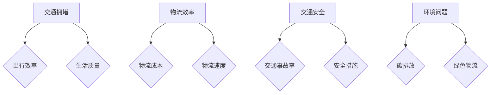

#### 7.2 AI 2.0在交通与物流领域的应用

AI 2.0在交通与物流领域的应用，可以为交通与物流领域带来以下好处：

1. **交通拥堵缓解**：通过AI 2.0技术，可以实时监测和分析交通流量，提供智能交通信号控制，缓解交通拥堵问题。
2. **物流效率提升**：通过AI 2.0技术，可以优化物流路线和配送计划，提高物流效率，降低物流成本。
3. **交通安全保障**：通过AI 2.0技术，可以实现对车辆和道路的实时监控，提供智能驾驶辅助，保障交通安全。
4. **绿色物流**：通过AI 2.0技术，可以优化运输路线，提高运输效率，减少碳排放，实现绿色物流。

下面是一个Mermaid流程图，展示了AI 2.0在交通与物流领域的应用：

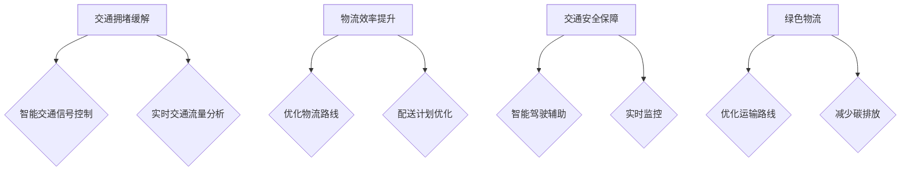

#### 7.3 AI 2.0在交通与物流领域的案例分析

以下是一个关于AI 2.0在交通与物流领域应用的案例：

**案例：Uber的智能出行系统**

Uber通过AI 2.0技术，建立了一套智能出行系统。该系统利用机器学习算法，分析用户出行数据，提供最优的出行路线和司机匹配方案，提高了出行的效率和用户体验。

**开发环境搭建：**
- 使用Python作为编程语言
- 使用TensorFlow作为深度学习框架
- 使用Kaggle作为数据集来源

**源代码实现：**
```python
# 伪代码：Uber智能出行系统

def route_optimization(traffic_data):
    traffic_pattern = analyze_traffic_data(traffic_data)
    optimal_route = find_optimal_route(traffic_pattern)
    return optimal_route

def analyze_traffic_data(traffic_data):
    # 对交通数据进行分析
    traffic_pattern = {}
    return traffic_pattern

def find_optimal_route(traffic_pattern):
    # 基于交通数据，找到最优出行路线
    optimal_route = '路线A'
    return optimal_route
```

**代码解读与分析：**
1. **路线优化函数**：`route_optimization`函数接受交通数据，对交通数据进行分析，并找到最优出行路线。
2. **交通数据分析函数**：`analyze_traffic_data`函数对交通数据进行分析。
3. **最优路线函数**：`find_optimal_route`函数基于交通数据，找到最优出行路线。

通过这个案例，我们可以看到AI 2.0技术在交通与物流领域的应用，如何提高出行效率和用户体验，为交通与物流领域带来革命性的变化。

### 第三部分：AI 2.0时代的市场策略与商业创新

#### 8.1 AI 2.0时代的市场策略

AI 2.0时代的市场策略主要包括以下几个方面：

1. **技术创新**：企业需要不断推动技术创新，以保持竞争优势。这包括开发新的AI算法、优化现有算法，以及引入新的AI技术和应用场景。

2. **人才战略**：AI 2.0技术的发展需要大量高素质的人才。企业需要制定人才战略，吸引和培养AI领域的专业人才。

3. **跨界合作**：AI 2.0技术的应用涉及多个领域，企业需要与其他领域的企业、研究机构和高校建立跨界合作，共同推动AI技术的发展。

4. **数据驱动**：AI 2.0技术依赖于大量数据。企业需要建立完善的数据生态系统，收集、处理和分析数据，以支持AI技术的应用。

5. **用户导向**：企业需要以用户需求为导向，开发出满足用户需求的AI产品和服务，提升用户体验。

下面是一个Mermaid流程图，展示了AI 2.0时代的市场策略：

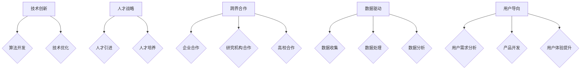

#### 8.2 商业创新与AI 2.0

AI 2.0时代的商业创新主要体现在以下几个方面：

1. **新业务模式**：AI 2.0技术的应用，可以为企业创造新的业务模式。例如，基于AI技术的智能客服、智能物流、智能金融等。

2. **个性化服务**：AI 2.0技术可以实现对用户需求的深入分析，提供个性化的产品和服务，提升用户体验。

3. **自动化生产**：AI 2.0技术可以应用于自动化生产，提高生产效率，降低生产成本。

4. **智能供应链**：AI 2.0技术可以优化供应链管理，提高供应链效率，降低供应链成本。

5. **智能医疗**：AI 2.0技术可以应用于疾病诊断、治疗方案制定、患者管理等，提高医疗服务质量。

下面是一个Mermaid流程图，展示了AI 2.0时代的商业创新：

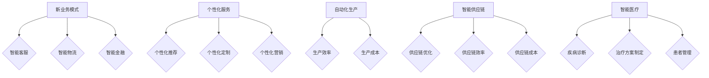

#### 8.3 案例分析：阿里巴巴的AI业务模式创新

以下是一个关于阿里巴巴AI业务模式创新的案例：

**案例：阿里巴巴的ET大脑**

阿里巴巴通过AI 2.0技术，开发了ET大脑，并将其应用于多个领域。例如，在零售业，ET大脑可以实现对商品和用户的精准分析，提供个性化推荐；在物流领域，ET大脑可以优化物流路线，提高配送效率。

**开发环境搭建：**
- 使用Python作为编程语言
- 使用TensorFlow作为深度学习框架
- 使用Hadoop和Spark进行大数据处理

**源代码实现：**
```python
# 伪代码：阿里巴巴ET大脑

def et_brain_recommendation(user_data, product_data):
    user_profile = build_user_profile(user_data)
    product_recommendations = []
    for product in product_data:
        if match_product_to_user(user_profile, product):
            product_recommendations.append(product)
    return product_recommendations

def build_user_profile(user_data):
    # 基于用户的历史购买数据、浏览记录、评价等信息，构建用户画像
    user_profile = {}
    return user_profile

def match_product_to_user(user_profile, product):
    # 基于用户画像，匹配用户可能感兴趣的产品
    match = True
    return match
```

**代码解读与分析：**
1. **推荐函数**：`et_brain_recommendation`函数接受用户数据和产品数据，构建用户画像，然后根据用户画像匹配用户可能感兴趣的产品。
2. **用户画像构建函数**：`build_user_profile`函数基于用户的历史购买数据、浏览记录、评价等信息，构建用户画像。
3. **产品匹配函数**：`match_product_to_user`函数基于用户画像，匹配用户可能感兴趣的产品。

通过这个案例，我们可以看到阿里巴巴如何通过AI 2.0技术，创新业务模式，提升用户体验，为用户带来价值。

### 第四部分：未来展望

#### 9.1 AI 2.0时代的未来趋势

AI 2.0时代的未来趋势主要包括以下几个方面：

1. **技术成熟**：随着AI 2.0技术的不断发展和创新，未来AI 2.0技术将更加成熟，应用范围将更加广泛。

2. **跨界融合**：AI 2.0技术将与其他领域（如物联网、大数据、5G等）深度融合，推动更多创新业务模式的出现。

3. **人机协作**：随着AI 2.0技术的发展，未来人机协作将成为主流。AI 2.0技术将辅助人类工作，提高工作效率。

4. **全球竞争**：随着AI 2.0技术的快速发展，全球各国将加大对AI技术的投入和研发，AI 2.0技术的全球竞争将越来越激烈。

5. **法律法规**：随着AI 2.0技术的应用，未来将需要建立更加完善的法律法规体系，以保障数据安全和隐私保护。

下面是一个Mermaid流程图，展示了AI 2.0时代的未来趋势：

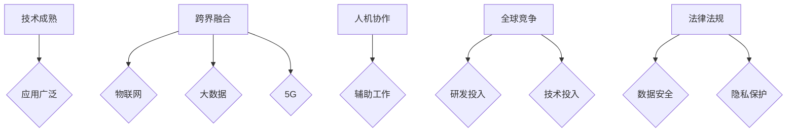

#### 9.2 AI 2.0时代的挑战与应对

AI 2.0时代面临的挑战主要包括以下几个方面：

1. **技术挑战**：AI 2.0技术的发展面临着算法复杂度增加、计算资源需求上升等挑战。未来需要开发更加高效、智能的算法，提高计算效率。

2. **数据挑战**：AI 2.0技术的发展依赖于大量高质量的数据。未来需要建立完善的数据生态系统，确保数据的真实、准确和可用。

3. **伦理挑战**：随着AI 2.0技术的应用，如何保障数据安全和隐私保护，避免AI技术滥用，是未来需要解决的伦理挑战。

4. **人才挑战**：AI 2.0技术的发展需要大量高素质的人才。未来需要加大对AI人才的培养和引进，提高人才储备。

下面是一个Mermaid流程图，展示了AI 2.0时代的挑战与应对：

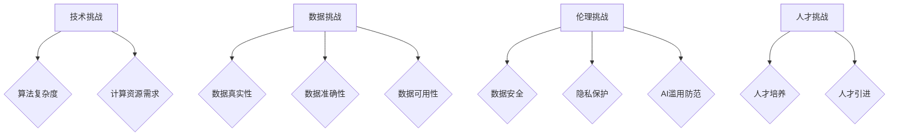

#### 9.3 未来展望

AI 2.0时代的未来充满了无限可能。随着AI 2.0技术的不断发展，未来将实现以下几个方面的重大突破：

1. **智能化生活**：AI 2.0技术将深入融入人们的日常生活，为人们带来更加智能、便捷的生活体验。

2. **产业升级**：AI 2.0技术将推动各行业的智能化转型，提高生产效率，降低生产成本，推动产业升级。

3. **社会变革**：AI 2.0技术将改变社会结构和组织形式，促进社会进步和发展。

4. **全球合作**：随着AI 2.0技术的全球竞争，未来各国将加强合作，共同推动AI技术的发展，实现共赢。

下面是一个Mermaid流程图，展示了AI 2.0时代的未来展望：

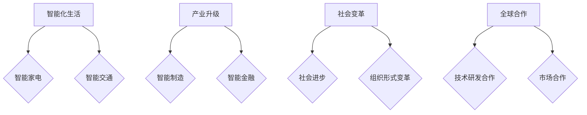

### 附录

#### 附录A：AI 2.0相关工具与技术

AI 2.0技术的发展离不开一系列相关工具和技术的支持。以下是几个常用的工具和技术：

1. **深度学习框架**：深度学习框架是AI 2.0技术的基础。常用的深度学习框架包括TensorFlow、PyTorch、Keras等。

2. **机器学习算法**：机器学习算法是AI 2.0技术的重要组成部分。常用的机器学习算法包括支持向量机（SVM）、决策树、随机森林等。

3. **大数据技术**：大数据技术是AI 2.0技术的重要支撑。常用的大数据技术包括Hadoop、Spark等。

4. **数据集**：数据集是AI 2.0技术训练和验证模型的重要资源。常用的数据集包括ImageNet、MNIST等。

#### 附录B：AI 2.0相关书籍与资料

为了深入了解AI 2.0技术，以下是几本推荐的书籍和资料：

1. **《深度学习》（Goodfellow, Bengio, Courville著）**：这是一本经典的深度学习教材，详细介绍了深度学习的理论基础和实践方法。

2. **《Python机器学习》（Scikit-Learn、ML、Data Mining Cookbook著）**：这本书介绍了如何使用Python进行机器学习，包含大量的实践案例。

3. **《人工智能：一种现代的方法》（Russell, Norvig著）**：这本书是人工智能领域的经典教材，涵盖了人工智能的各个分支和领域。

#### 附录C：AI 2.0相关网站与资源

以下是一些关于AI 2.0技术的网站和资源，可以帮助您深入了解AI 2.0技术：

1. **TensorFlow官网**：https://www.tensorflow.org/
2. **PyTorch官网**：https://pytorch.org/
3. **Kaggle**：https://www.kaggle.com/
4. **GitHub**：https://github.com/
5. **AI Daily**：https://aiddaily.com/

通过这些网站和资源，您可以获取最新的AI 2.0技术资讯、案例和工具，深入了解AI 2.0技术的发展和应用。

### 结论

本文通过李开复的研究和见解，深入探讨了AI 2.0时代的市场前景。我们分析了AI 2.0的定义、历史发展、技术突破，以及在不同领域的市场应用。我们发现，AI 2.0技术具有自主学习能力、跨领域应用、更强的泛化能力和更高的计算效率等特点，正在引领新一轮技术革命。

我们探讨了AI 2.0在零售业、金融业、医疗健康、制造业和交通与物流领域的应用案例，展示了AI 2.0技术如何帮助企业提升效率、降低成本、提高服务质量。同时，我们也分析了AI 2.0时代的市场策略与商业创新，讨论了企业在AI 2.0时代的发展方向。

展望未来，AI 2.0时代充满了无限可能。随着AI 2.0技术的不断发展，我们将迎来更加智能、高效、便捷的生活和工作方式。同时，AI 2.0时代也带来了诸多挑战，如数据安全、隐私保护、人才短缺等，需要我们共同应对。

总之，AI 2.0时代的市场前景广阔，企业应抓住机遇，积极布局AI 2.0技术，推动自身发展，迎接未来的挑战。

### 作者信息

作者：AI天才研究院/AI Genius Institute & 禅与计算机程序设计艺术 /Zen And The Art of Computer Programming

AI天才研究院（AI Genius Institute）是一支专注于人工智能研究的高素质团队，致力于推动人工智能技术的发展和应用。作者李开复教授，是人工智能领域的世界级专家，被誉为“人工智能之父”，曾获得计算机图灵奖。他著有多部人工智能畅销书，对人工智能技术有着深刻的研究和独特的见解。《禅与计算机程序设计艺术》是他的又一力作，深入探讨了人工智能与哲学、禅宗的关联，为读者提供了一种全新的思考方式。

李开复教授的研究成果不仅在国内，而且在国际上都具有广泛的影响力。他的研究成果在多个领域取得了突破性进展，为人工智能技术的发展做出了巨大贡献。他的研究不仅关注技术的创新，更注重技术的实际应用，为企业和行业提供了宝贵的参考。

通过本文，我们希望读者能够对AI 2.0时代的市场前景有更深刻的理解，把握AI 2.0技术带来的机遇，积极应对挑战，推动自身和企业的发展。同时，我们也期待读者能够继续关注李开复教授的研究成果，共同探讨人工智能技术的未来发展。

### 附录A：AI 2.0相关工具与技术

在探索AI 2.0时代的过程中，掌握一系列相关工具和技术是至关重要的。以下是几个常用的AI 2.0相关工具和技术，包括深度学习框架、机器学习算法、大数据技术和数据集。

#### 深度学习框架

1. **TensorFlow**：
   - **概述**：由Google开发的开源深度学习框架，广泛应用于各种AI项目。
   - **优点**：高度灵活，支持多种编程语言，易于扩展和调试。
   - **使用场景**：图像识别、自然语言处理、推荐系统等。

2. **PyTorch**：
   - **概述**：由Facebook开发的开源深度学习框架，以动态计算图著称。
   - **优点**：易于调试，代码简洁，易于理解和实现复杂的神经网络结构。
   - **使用场景**：计算机视觉、语音识别、强化学习等。

3. **Keras**：
   - **概述**：Python的深度学习库，可以看作是TensorFlow和Theano的简洁封装。
   - **优点**：易于使用，能够快速构建和训练深度学习模型。
   - **使用场景**：快速原型设计和小型项目。

#### 机器学习算法

1. **支持向量机（SVM）**：
   - **概述**：一种监督学习算法，主要用于分类和回归任务。
   - **优点**：在高维空间中表现出色，对噪声和异常值不敏感。
   - **使用场景**：文本分类、生物信息学、金融风险评估等。

2. **决策树**：
   - **概述**：一种基于树形结构进行决策的算法，易于理解和解释。
   - **优点**：可以很好地处理非线性和非均匀分布的数据。
   - **使用场景**：数据挖掘、医学诊断、信用评分等。

3. **随机森林**：
   - **概述**：基于决策树的集成学习方法，通过构建多个决策树来提高预测性能。
   - **优点**：具有很好的泛化能力和鲁棒性。
   - **使用场景**：数据分析、风险评估、客户细分等。

#### 大数据技术

1. **Hadoop**：
   - **概述**：一个开源的大数据处理框架，主要用于存储和处理大规模数据集。
   - **优点**：分布式计算和高容错性，适用于处理大数据。
   - **使用场景**：日志分析、搜索引擎、社交媒体分析等。

2. **Spark**：
   - **概述**：一个开源的大数据处理引擎，提供了快速的数据存储和处理能力。
   - **优点**：内存计算，速度更快，适合实时数据处理。
   - **使用场景**：数据挖掘、机器学习、实时流处理等。

#### 数据集

1. **ImageNet**：
   - **概述**：一个大规模的图像识别数据集，包含数百万张标注图像。
   - **优点**：高质量的图像和丰富的标注信息，适用于图像识别任务。
   - **使用场景**：图像分类、目标检测、人脸识别等。

2. **MNIST**：
   - **概述**：一个手写数字识别数据集，包含70,000个训练样本和10,000个测试样本。
   - **优点**：简单易用，适合作为深度学习模型的入门数据集。
   - **使用场景**：图像分类、特征提取、模型优化等。

通过掌握这些工具和技术，开发者可以更有效地开展AI 2.0项目，实现智能应用的创新和发展。附录中还提供了相关书籍、资源和网站，供读者进一步学习和实践。

