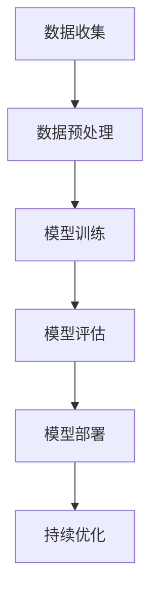

                 

# 文章标题：李开复：AI 2.0 时代的开发者

> 关键词：AI 2.0、开发者、技术趋势、核心算法、应用实践、伦理与职业素养

> 摘要：本文将深入探讨AI 2.0时代的技术发展趋势、开发者角色与技能要求，以及核心算法原理和应用实践。通过分析李开复的著作，本文旨在为开发者提供全面的技术指南和成长路径。

---

## 引言

在当今世界，人工智能（AI）已经成为技术革新的驱动力。从自动驾驶汽车到智能家居，从医疗诊断到金融分析，AI的应用场景不断扩展，影响力日益深远。李开复，作为世界著名的人工智能专家，他的著作《李开复：AI 2.0时代的开发者》为我们揭示了AI 2.0时代的核心特征和开发者所需面临的挑战与机遇。

AI 2.0，被广泛认为是继AI 1.0之后的下一个重大变革。AI 1.0主要侧重于基于规则的专家系统和简单的机器学习模型，而AI 2.0则强调大数据、深度学习和自主决策能力。AI 2.0时代，开发者不仅需要掌握传统的编程技能，更需要理解复杂的数据处理和深度学习算法。

本文将从以下几个部分进行探讨：

1. **AI 2.0时代的概述与背景**
2. **AI 2.0时代的开发者**
3. **核心概念与算法原理**
4. **AI 2.0应用实践**
5. **AI 2.0时代的开发者成长**

通过这些内容，我们将深入理解AI 2.0时代的技术本质和开发者的角色定位。

### 第一部分：AI 2.0时代的概述与背景

#### 第1章：AI 2.0时代的到来

##### **1.1 AI 2.0的定义与特征**

AI 2.0是对第一代人工智能（AI 1.0）的升级与拓展。AI 1.0主要依赖于规则和符号逻辑，而AI 2.0则基于深度学习和大数据。AI 2.0的定义可以从以下几个方面来理解：

- **自主性**：AI 2.0系统能够在无需人类干预的情况下自主学习和决策。
- **智能化**：通过深度学习和自我优化，AI 2.0能够处理复杂任务，并具备一定的智能水平。
- **泛用性**：AI 2.0不仅可以应用于特定领域，还可以跨领域应用，具有更广泛的适应性。

AI 2.0与AI 1.0的主要区别在于：

- **数据量**：AI 2.0依赖于大规模数据，而AI 1.0则受限于可用数据的数量和质量。
- **算法复杂性**：AI 2.0使用复杂的深度学习算法，而AI 1.0主要依赖于简单的规则系统。
- **应用领域**：AI 2.0能够应用于更多领域，包括医疗、金融、教育等，而AI 1.0则主要用于某些特定领域。

##### **1.2 AI 2.0的技术发展趋势**

AI 2.0的技术发展趋势主要体现在以下几个方面：

- **大模型（Megamodels）的兴起**：随着计算能力和数据量的增加，大模型（如GPT-3）成为了AI 2.0的核心。这些大模型具有强大的表示能力和泛化能力，能够处理复杂任务。
- **自监督学习（Self-supervised Learning）**：自监督学习是一种无需人工标注数据的学习方法，它通过利用数据本身的结构来训练模型。自监督学习在语音识别、自然语言处理等领域取得了显著成果。
- **多模态学习（Multimodal Learning）**：多模态学习是指将不同类型的数据（如文本、图像、声音等）进行融合，以提升模型的性能。多模态学习在图像识别、语音合成等领域具有重要意义。

##### **1.3 AI 2.0时代的机遇与挑战**

AI 2.0时代为开发者带来了前所未有的机遇：

- **新的商业模式**：AI 2.0使得企业能够以更高效的方式提供产品和服务，从而创造新的商业机会。
- **领先企业的布局**：许多领先企业已经在AI 2.0领域进行了大量投资，通过建立竞争优势来抢占市场先机。

然而，AI 2.0时代也带来了新的挑战：

- **AI伦理与法规问题**：随着AI技术的广泛应用，伦理和法规问题日益突出。如何确保AI系统的透明性、公平性和安全性成为了重要的议题。
- **技术人才培养**：AI 2.0需要开发者具备更广泛的技能和更深入的知识。然而，当前的技术人才培养速度难以满足AI 2.0时代的需求。

#### 第2章：AI 2.0时代的开发者

##### **2.1 AI 2.0时代开发者的角色**

在AI 2.0时代，开发者不仅需要具备传统的编程技能，还需要具备以下几方面的能力：

- **数据工程能力**：AI 2.0依赖于大规模数据，因此开发者需要具备数据采集、处理和存储的能力。
- **算法设计能力**：开发者需要掌握深度学习和自监督学习等先进算法，能够设计和优化模型。
- **多模态处理能力**：开发者需要能够处理不同类型的数据，并实现数据的融合和交互。

##### **2.2 AI 2.0时代的开发者工具与平台**

AI 2.0时代的开发者需要使用一系列工具和平台来支持他们的工作：

- **深度学习框架**：如TensorFlow、PyTorch等，提供了丰富的算法和模型库，方便开发者进行研究和开发。
- **开发平台**：如Google Colab、AWS等，提供了强大的计算资源和云服务，支持大规模数据分析和模型训练。
- **数据可视化工具**：如Matplotlib、Seaborn等，帮助开发者更好地理解和分析数据。

##### **2.3 AI 2.0时代的开发流程与方法论**

AI 2.0时代的开发流程与传统开发流程有所不同，更加强调数据驱动和迭代优化：

- **数据收集**：开发者需要从不同的数据源收集数据，并进行预处理。
- **模型设计**：根据任务需求，设计合适的模型结构，并选择适当的算法。
- **模型训练**：使用预处理后的数据训练模型，并通过调参优化模型性能。
- **模型评估**：评估模型的性能，包括准确率、召回率、F1值等指标。
- **模型部署**：将训练好的模型部署到生产环境中，并提供API接口供其他系统调用。

在实际开发过程中，开发者还可以采用以下方法论：

- **敏捷开发**：通过快速迭代和持续交付，提高开发效率和产品质量。
- **DevOps**：将开发、测试和运维结合起来，实现自动化部署和持续集成。
- **MLOps**：将机器学习流程与运维流程结合起来，确保模型在生产环境中的稳定运行。

### 第二部分：核心概念与算法原理

#### 第3章：人工智能基础

##### **3.1 机器学习与深度学习基础**

机器学习和深度学习是AI 2.0时代的核心技术。机器学习是使计算机能够从数据中学习并做出决策的一种技术，而深度学习则是机器学习的一个分支，使用多层神经网络来模拟人类大脑的决策过程。

- **机器学习的基本概念**：机器学习主要包括监督学习、无监督学习和强化学习。监督学习有标记数据，无监督学习没有标记数据，而强化学习通过与环境的交互来学习。
- **深度学习的发展历程**：深度学习起源于20世纪40年代，经历了多个发展阶段，包括多层感知机、卷积神经网络和循环神经网络等。
- **常见的深度学习架构**：常见的深度学习架构包括卷积神经网络（CNN）、循环神经网络（RNN）和变换器架构（Transformer）等，它们在图像识别、语音识别和自然语言处理等领域具有广泛应用。

##### **3.2 神经网络原理**

神经网络是深度学习的基础，它由一系列相互连接的节点（或称神经元）组成。每个神经元接收输入信号，通过权重和偏置进行加权求和，然后通过激活函数产生输出。

- **神经网络的基本结构**：神经网络包括输入层、隐藏层和输出层。输入层接收外部输入，隐藏层进行数据处理和特征提取，输出层产生最终输出。
- **激活函数与优化算法**：激活函数（如ReLU、Sigmoid和Tanh）用于引入非线性特性，优化算法（如梯度下降和Adam）用于调整模型参数，以最小化损失函数。
- **神经网络的训练与优化**：神经网络通过反向传播算法进行训练和优化。在训练过程中，模型根据输入数据调整权重和偏置，以减少预测误差。

##### **3.3 自然语言处理基础**

自然语言处理（NLP）是深度学习在文本数据分析领域的重要应用。NLP涉及到文本的预处理、词嵌入、语言模型和序列模型等。

- **词嵌入技术**：词嵌入将词汇映射到高维空间中，使文本数据具备数学结构，便于模型处理。
- **语言模型与序列模型**：语言模型用于预测下一个词的概率，序列模型（如RNN和Transformer）用于处理序列数据，如文本和语音。

#### 第4章：AI 2.0时代的算法与模型

##### **4.1 大模型（Megamodels）**

大模型是AI 2.0时代的重要特征，它指的是具有数十亿甚至数万亿参数的模型。大模型通过海量数据和强大的计算能力，实现了前所未有的性能。

- **大模型的特点与应用**：大模型具有强大的表示能力和泛化能力，可以处理复杂任务。例如，GPT-3在大规模文本生成和翻译任务中取得了显著成果。
- **常见的大模型介绍**：GPT-3、BERT、Transformer-XL等大模型在各个领域具有广泛应用，它们的架构和训练方法也不断更新和优化。

##### **4.2 自监督学习**

自监督学习是一种无需人工标注数据的学习方法，它通过利用数据本身的结构来训练模型。自监督学习在语音识别、自然语言处理和图像识别等领域具有广泛应用。

- **自监督学习的原理与应用**：自监督学习利用数据中的内在结构，如冗余信息、对应关系等，来训练模型。例如，在语音识别中，自监督学习可以用来学习语音信号与文字的映射关系。
- **自监督学习的方法与算法**：常见的自监督学习方法包括预测掩码、自编码器和对比学习等。这些方法通过不同的策略，使模型能够利用未标注的数据进行训练。

##### **4.3 多模态学习**

多模态学习是指将不同类型的数据（如文本、图像、声音等）进行融合，以提升模型的性能。多模态学习在图像识别、语音合成和自然语言处理等领域具有重要意义。

- **多模态数据的融合方法**：多模态数据的融合方法包括直接融合、特征融合和模型融合等。直接融合将不同类型的数据直接输入到同一个模型中；特征融合将不同类型的数据的特征进行融合；模型融合分别训练多个模型，然后通过融合策略生成最终输出。
- **多模态学习的应用场景**：多模态学习在图像识别、语音合成和自然语言处理等领域具有广泛应用。例如，在图像识别中，结合文本描述可以提升模型的性能；在语音合成中，结合文本和音频信号可以提升语音的自然度和准确性。

### 第三部分：AI 2.0应用实践

#### 第5章：AI 2.0在企业的应用

AI 2.0技术的应用为企业带来了革命性的变化，推动了产业升级和业务创新。以下分别介绍AI 2.0在金融、医疗健康和制造业等领域的应用。

##### **5.1 AI 2.0在金融行业的应用**

金融行业是AI 2.0技术的早期应用领域之一。AI 2.0技术在金融领域的应用主要包括以下几个方面：

- **金融风控**：AI 2.0技术通过大数据分析和机器学习算法，可以实时监测金融市场的风险，并预测潜在的风险事件。例如，银行可以使用AI 2.0技术来识别欺诈行为，提高资金的安全性和流通效率。
- **量化交易**：量化交易是指利用数学模型和计算机算法进行投资决策。AI 2.0技术通过分析大量的市场数据，可以识别出潜在的投资机会，并制定相应的交易策略。量化交易在金融市场中具有广泛的应用，如高频交易、算法交易等。
- **金融服务个性化**：AI 2.0技术可以根据客户的历史行为数据，为其提供个性化的金融服务。例如，银行可以通过AI 2.0技术为客户提供定制化的贷款方案、投资组合建议等，提高客户满意度和忠诚度。

##### **5.2 AI 2.0在医疗健康领域的应用**

医疗健康领域是AI 2.0技术的另一个重要应用领域。AI 2.0技术在医疗健康领域的应用主要包括以下几个方面：

- **疾病诊断与预测**：AI 2.0技术可以通过分析医学影像、电子健康记录等数据，协助医生进行疾病诊断。例如，AI 2.0技术可以辅助医生识别肺癌、乳腺癌等疾病的早期征兆，提高诊断的准确性和效率。
- **医疗影像分析**：AI 2.0技术可以对医学影像进行自动分析和识别，帮助医生更快速地发现病变区域。例如，AI 2.0技术可以自动分析X光片、CT扫描等影像数据，识别骨折、肿瘤等病变。
- **医疗服务智能化**：AI 2.0技术可以通过智能客服、智能导诊等应用，提高医疗服务的效率。例如，医院可以通过AI 2.0技术为客户提供在线咨询、预约挂号等服务，减少客户的等待时间，提高就医体验。

##### **5.3 AI 2.0在制造业的应用**

制造业是AI 2.0技术的又一重要应用领域。AI 2.0技术在制造业的应用主要包括以下几个方面：

- **智能制造**：AI 2.0技术可以通过数据分析和预测，优化生产过程，提高生产效率。例如，通过AI 2.0技术，企业可以实时监测设备的运行状态，预测设备的维护需求，避免设备故障，提高生产线的稳定性。
- **质量控制**：AI 2.0技术可以通过对产品进行自动检测和分析，确保产品质量。例如，在汽车制造业中，AI 2.0技术可以对汽车零部件进行自动检测，识别潜在的质量问题，提高产品的质量稳定性。
- **生产效率优化**：AI 2.0技术可以通过对生产数据进行分析，优化生产流程，降低生产成本。例如，通过AI 2.0技术，企业可以实时分析生产数据，识别生产过程中的瓶颈，提出改进措施，提高生产效率。

#### 第6章：AI 2.0开发实战

##### **6.1 AI项目实战：智能客服系统开发**

智能客服系统是AI 2.0技术在客服领域的重要应用之一。以下是一个智能客服系统的开发实战案例。

**项目背景与目标**：某电商平台希望开发一款智能客服系统，以提供24/7的在线客服服务，提高客户满意度。

**系统架构设计**：智能客服系统主要由三个部分组成：前端界面、后端服务端和数据库。

- **前端界面**：用户通过网页或移动应用与智能客服系统进行交互，输入问题和接收回答。
- **后端服务端**：后端服务端负责接收用户输入，调用自然语言处理模型进行对话生成，并将结果返回给前端界面。
- **数据库**：数据库存储用户的对话记录、用户信息和产品信息等数据。

**代码实现与解释**：

```python
import tensorflow as tf
from tensorflow.keras.models import Sequential
from tensorflow.keras.layers import Dense, Embedding, LSTM, Dense

# 数据预处理
# ...（略）

# 构建模型
model = Sequential([
    Embedding(input_dim=vocab_size, output_dim=embedding_dim),
    LSTM(units=128, return_sequences=True),
    LSTM(units=128),
    Dense(units=1, activation='sigmoid')
])

# 编译模型
model.compile(optimizer='adam', loss='binary_crossentropy', metrics=['accuracy'])

# 训练模型
model.fit(x_train, y_train, epochs=10, batch_size=32)
```

**代码解读与分析**：

1. **数据预处理**：对对话文本进行预处理，包括分词、词嵌入等操作，为模型训练做准备。
2. **模型构建**：使用序列模型（LSTM）进行对话生成，模型包括嵌入层、两个LSTM层和一个输出层。
3. **编译模型**：指定优化器、损失函数和评价指标，为模型训练做好准备。
4. **训练模型**：使用训练数据训练模型，设置训练轮次和批大小。

通过以上实战案例，开发者可以了解到智能客服系统的开发过程和关键步骤，为实际项目提供参考。

##### **6.2 AI项目实战：智能推荐系统开发**

智能推荐系统是AI 2.0技术在推荐领域的重要应用之一。以下是一个智能推荐系统的开发实战案例。

**项目背景与目标**：某电商网站希望开发一款智能推荐系统，以提高用户的购买转化率和满意度。

**系统架构设计**：智能推荐系统主要由三个部分组成：数据收集、推荐算法和前端展示。

- **数据收集**：收集用户的历史行为数据，如浏览记录、购买记录、评价等。
- **推荐算法**：使用协同过滤、基于内容的推荐等算法，根据用户历史行为和商品属性生成推荐结果。
- **前端展示**：将推荐结果展示在前端界面，引导用户进行购买。

**代码实现与解释**：

```python
import pandas as pd
from sklearn.model_selection import train_test_split
from sklearn.metrics.pairwise import cosine_similarity

# 数据收集
# ...（略）

# 数据预处理
# ...（略）

# 构建推荐系统
# 基于协同过滤的推荐系统
def collaborative_filter(data):
    # 计算用户之间的相似度
    user_similarity = cosine_similarity(data)

    # 为每个用户生成推荐列表
    recommendations = {}
    for user in data:
        similarity_scores = user_similarity[user]
        recommended_items = []
        for other_user, score in enumerate(similarity_scores):
            if other_user != user:
                recommended_items.extend(data[other_user])
        recommendations[user] = recommended_items
    return recommendations

# 训练和测试推荐系统
train_data, test_data = train_test_split(data, test_size=0.2)
recommendations = collaborative_filter(train_data)

# 评估推荐系统
# ...（略）
```

**代码解读与分析**：

1. **数据收集**：收集用户的历史行为数据，如浏览记录、购买记录、评价等。
2. **数据预处理**：对数据进行处理，如去重、填充缺失值等。
3. **构建推荐系统**：使用基于协同过滤的推荐算法，计算用户之间的相似度，为每个用户生成推荐列表。
4. **训练和测试推荐系统**：使用训练数据进行训练，评估推荐系统的效果。

通过以上实战案例，开发者可以了解到智能推荐系统的开发过程和关键步骤，为实际项目提供参考。

##### **6.3 AI项目实战：图像识别系统开发**

图像识别系统是AI 2.0技术在计算机视觉领域的重要应用之一。以下是一个图像识别系统的开发实战案例。

**项目背景与目标**：某电商平台希望开发一款图像识别系统，用于自动识别产品图片，提高分类效率和准确性。

**系统架构设计**：图像识别系统主要由三个部分组成：数据收集、图像预处理和模型训练。

- **数据收集**：收集大量的产品图片，用于训练模型。
- **图像预处理**：对图像进行预处理，如调整大小、裁剪、增强等，以适应模型输入。
- **模型训练**：使用卷积神经网络（CNN）训练图像识别模型，提高模型的分类准确率。

**代码实现与解释**：

```python
import tensorflow as tf
from tensorflow.keras.models import Sequential
from tensorflow.keras.layers import Conv2D, MaxPooling2D, Flatten, Dense

# 数据收集
# ...（略）

# 数据预处理
# ...（略）

# 构建模型
model = Sequential([
    Conv2D(filters=32, kernel_size=(3, 3), activation='relu', input_shape=(64, 64, 3)),
    MaxPooling2D(pool_size=(2, 2)),
    Conv2D(filters=64, kernel_size=(3, 3), activation='relu'),
    MaxPooling2D(pool_size=(2, 2)),
    Flatten(),
    Dense(units=128, activation='relu'),
    Dense(units=num_classes, activation='softmax')
])

# 编译模型
model.compile(optimizer='adam', loss='categorical_crossentropy', metrics=['accuracy'])

# 训练模型
model.fit(x_train, y_train, epochs=10, batch_size=32)
```

**代码解读与分析**：

1. **数据收集**：收集大量的产品图片，用于训练模型。
2. **数据预处理**：对图像进行预处理，如调整大小、裁剪、增强等，以适应模型输入。
3. **构建模型**：使用卷积神经网络（CNN）进行图像识别，模型包括卷积层、池化层和全连接层。
4. **编译模型**：指定优化器、损失函数和评价指标，为模型训练做好准备。
5. **训练模型**：使用训练数据训练模型，设置训练轮次和批大小。

通过以上实战案例，开发者可以了解到图像识别系统的开发过程和关键步骤，为实际项目提供参考。

### 第四部分：AI 2.0时代的开发者成长

##### **7.1 AI知识体系与学习路径**

AI 2.0时代的开发者需要具备全面的AI知识体系，以便在复杂的应用场景中游刃有余。以下是一个推荐的AI知识体系和学习路径：

- **基础知识**：数学基础（线性代数、概率论、微积分）、编程基础（Python、数据结构与算法）
- **核心理论**：机器学习（监督学习、无监督学习、强化学习）、深度学习（神经网络、卷积神经网络、循环神经网络、变换器架构）
- **应用领域**：自然语言处理、计算机视觉、语音识别、推荐系统
- **工具与平台**：深度学习框架（TensorFlow、PyTorch）、数据预处理工具（Pandas、Scikit-learn）、开发平台（Google Colab、AWS）

学习路径：

1. **基础阶段**：学习数学基础和编程基础，了解机器学习和深度学习的基本概念。
2. **进阶阶段**：深入学习深度学习算法，掌握卷积神经网络、循环神经网络和变换器架构。
3. **实践阶段**：通过项目实战，将所学知识应用于实际问题，提高解决复杂问题的能力。

##### **7.2 开发者的软技能培养**

除了专业知识，开发者还需要具备一系列软技能，以适应快速变化的AI领域。以下是一些关键软技能：

- **沟通与协作**：在团队合作中，清晰、有效的沟通和协作至关重要。开发者需要学会如何表达自己的想法，理解他人的需求，并共同解决问题。
- **创新思维与问题解决**：AI领域不断涌现新的技术和应用，开发者需要具备创新思维，勇于尝试新方法，并能够灵活应对各种问题。
- **持续学习**：AI技术发展迅速，开发者需要不断学习新知识、新技能，以保持竞争力。

##### **7.3 AI伦理与职业素养**

AI伦理和职业素养是开发者不可或缺的一部分。以下是一些关键点：

- **透明性与公平性**：开发者需要确保AI系统的透明性，使其决策过程可解释，避免歧视和不公平现象。
- **安全性与隐私保护**：开发者需要关注AI系统的安全性和隐私保护，防止数据泄露和恶意攻击。
- **社会责任**：开发者需要认识到自己的社会责任，确保AI技术为人类带来积极的影响，避免对环境和社会造成负面影响。

### 附录

#### 附录A：常用开发工具与资源

- **深度学习框架**：
  - TensorFlow
  - PyTorch
  - Keras
- **机器学习与数据处理库**：
  - Scikit-learn
  - Pandas
  - NumPy
  - Matplotlib
  - Seaborn
- **开发平台**：
  - Google Colab
  - AWS
  - Azure
  - Google Cloud Platform
- **数据集与资源**：
  - Kaggle
  - UCI机器学习库
  - ImageNet
  - Common Crawl

#### 附录B：参考资料与拓展阅读

- **书籍推荐**：
  - 《深度学习》（Ian Goodfellow、Yoshua Bengio、Aaron Courville）
  - 《Python深度学习》（François Chollet）
  - 《人工智能：一种现代的方法》（Stuart Russell、Peter Norvig）
- **学术论文与报告**：
  - arXiv
  - Google AI Blog
  - DeepMind Research Papers
  - OpenAI Research Papers
- **在线课程与讲座**：
  - 吴恩达的机器学习课程
  - Andrew Ng的深度学习专项课程
  - 李开复的人工智能课程

#### 核心概念与联系

**Mermaid流程图：AI 2.0开发流程**



#### 核心算法原理讲解

**3.2 神经网络原理**

- **神经网络的基本结构**：

```python
# 前向传播伪代码
for each layer l from 1 to L:
    z[l] = W[l] * a[l-1] + b[l]
    a[l] = activation(z[l])
```

- **激活函数与优化算法**：

```python
# 激活函数（Sigmoid）
def sigmoid(x):
    return 1 / (1 + exp(-x))

# 优化算法（梯度下降）
for epoch in range(EPOCHS):
    for x, y in dataset:
        # 前向传播
        z = W * x + b
        a = sigmoid(z)
        # 计算损失
        loss = (y - a)^2
        # 反向传播
        dZ = a - y
        dW = dZ * x
        db = dZ
        # 更新权重和偏置
        W -= LEARNING_RATE * dW
        b -= LEARNING_RATE * db
```

#### 数学模型和数学公式

**3.1 机器学习与深度学习基础**

- **损失函数（均方误差）**：

$$
J(\theta) = \frac{1}{2m}\sum_{i=1}^{m}(h_\theta(x^{(i)}) - y^{(i)})^2
$$

- **梯度下降**：

$$
\theta_j := \theta_j - \alpha \frac{\partial}{\partial \theta_j} J(\theta)
$$

#### 项目实战

**6.1 AI项目实战：智能客服系统开发**

- **开发环境搭建**：

  - 安装Python环境
  - 安装TensorFlow库
  - 安装NLP相关库（如NLTK、spaCy等）

- **源代码实现**：

  ```python
  import tensorflow as tf
  from tensorflow.keras.models import Sequential
  from tensorflow.keras.layers import Embedding, LSTM, Dense
  
  # 定义模型
  model = Sequential([
      Embedding(input_dim=vocab_size, output_dim=embedding_dim),
      LSTM(units=128, return_sequences=True),
      LSTM(units=128),
      Dense(units=1, activation='sigmoid')
  ])

  # 编译模型
  model.compile(optimizer='adam', loss='binary_crossentropy', metrics=['accuracy'])

  # 训练模型
  model.fit(x_train, y_train, epochs=10, batch_size=32)
  ```

- **代码解读与分析**：

  - **模型构建**：定义输入层、隐藏层和输出层，使用LSTM进行对话生成。
  - **编译模型**：指定优化器、损失函数和评价指标，为模型训练做好准备。
  - **训练模型**：使用训练数据训练模型，设置训练轮次和批大小。

### 结束语

AI 2.0时代为开发者带来了前所未有的机遇和挑战。本文通过深入分析李开复的著作，探讨了AI 2.0时代的核心特征、开发者角色、核心算法原理和应用实践，并提出了开发者成长和职业素养的建议。希望本文能为开发者提供有益的指导和启示，助力他们在AI 2.0时代取得成功。

---

**作者：AI天才研究院/AI Genius Institute & 禅与计算机程序设计艺术 /Zen And The Art of Computer Programming**

