                 

# 文章标题：李开复：AI 2.0 时代的意义

> 关键词：人工智能，AI 2.0，深度学习，神经网络，伦理，社会影响

> 摘要：本文从人工智能的发展历程出发，深入探讨了AI 2.0时代的意义，包括其核心技术、伦理与社会影响、未来展望等。通过分析AI 2.0的核心特征、技术基础和应用领域，本文揭示了AI 2.0时代的本质和潜力。同时，本文还探讨了AI 2.0时代的伦理问题、社会影响以及核心编程实战，为读者提供了一个全面、深入的AI 2.0时代指南。

---

### 《李开复：AI 2.0 时代的意义》目录大纲

# 第一部分：AI 2.0时代的概述

## 第1章：AI 2.0时代的来临

### 1.1 AI 2.0的定义与特点

- AI 2.0的核心特征
- 与AI 1.0的区别

### 1.2 AI 2.0的技术基础

- 人工智能的发展历程
- 神经网络、深度学习与AI 2.0

### 1.3 AI 2.0的应用领域

- 各行业中的AI应用案例
- AI在未来的发展前景

## 第2章：AI 2.0时代的伦理与社会影响

### 2.1 AI 2.0的伦理问题

- 数据隐私与安全
- AI决策透明度与责任归属

### 2.2 AI 2.0对就业市场的影响

- 自动化对劳动力市场的影响
- 职业教育与培训的变革

### 2.3 AI 2.0与社会发展

- AI对教育、医疗、法律等领域的变革
- AI推动社会进步的力量与挑战

# 第二部分：AI 2.0时代的核心技术

## 第3章：神经网络与深度学习基础

### 3.1 神经网络原理

- 神经网络的结构与工作原理
- 前向传播与反向传播算法

### 3.2 深度学习算法

- 卷积神经网络（CNN）
- 递归神经网络（RNN）与长短时记忆（LSTM）

### 3.3 深度学习应用场景

- 图像识别与处理
- 自然语言处理与生成

## 第4章：AI 2.0时代的数学模型

### 4.1 监督学习模型

- 线性回归
- 决策树与随机森林

### 4.2 无监督学习模型

- K-均值聚类
- 主成分分析（PCA）

### 4.3 强化学习模型

- Q-学习
- 深度强化学习（DRL）

## 第5章：AI 2.0时代的编程实战

### 5.1 开发环境搭建

- Python开发环境搭建
- 常用深度学习框架介绍

### 5.2 实战项目一：图像识别

- 项目背景与目标
- 源代码实现与解读

### 5.3 实战项目二：自然语言处理

- 项目背景与目标
- 源代码实现与解读

# 第三部分：AI 2.0时代的未来展望

## 第6章：AI 2.0时代的产业趋势

### 6.1 人工智能产业链分析

- 产业链上下游环节
- 人工智能产业的竞争格局

### 6.2 AI 2.0时代的创新方向

- 人工智能与物联网
- 人工智能与区块链

### 6.3 AI 2.0时代的创业机会

- 创业项目评估与风险控制
- 创业案例分享与经验总结

## 第7章：AI 2.0时代的教育与人才培养

### 7.1 AI时代的教育变革

- 教育模式的创新
- 人工智能课程体系建设

### 7.2 人工智能人才培养策略

- 人才培养模式与体系
- 企业与高校合作培养人才

### 7.3 AI时代的职业规划与转型

- 职业发展的新机遇
- 职业转型的路径与方法

# 附录

## 附录A：AI 2.0时代的学习资源与工具

### A.1 学习资源推荐

- 人工智能相关书籍
- 在线课程与教程

### A.2 常用AI工具与框架

- Python编程环境
- 常用深度学习框架
- 人工智能开源库

### A.3 AI竞赛与活动

- 国际人工智能竞赛
- 国内人工智能竞赛与活动

---

在接下来的章节中，我们将逐步深入探讨AI 2.0时代的各个方面，为读者呈现一个全面、深入的AI 2.0时代指南。让我们开始吧！

---

# 第一部分：AI 2.0时代的概述

## 第1章：AI 2.0时代的来临

### 1.1 AI 2.0的定义与特点

#### AI 2.0的核心特征

AI 2.0，即人工智能的第二代，它不仅仅是一个技术的迭代，更是一种全新的思维方式和工作方式的变革。与AI 1.0相比，AI 2.0具有以下核心特征：

1. **自主学习和自我进化**：AI 2.0可以通过自我学习和自我优化来不断改进自身的性能和效果。这意味着AI不再仅仅依赖人类提供的数据和规则，而是可以通过自身的经验和学习来发现新的模式和规律。

2. **通用智能**：AI 2.0的目标是实现通用人工智能（AGI），即具备人类智能的各种能力的AI。与目前广泛应用的专用AI相比，通用AI可以在多个领域和任务中表现出色，而不需要为每个特定任务重新设计和训练。

3. **情境理解和自适应能力**：AI 2.0能够在复杂和动态的环境中理解和适应不同的情境，做出更加智能和合理的决策。

4. **跨领域应用**：AI 2.0不仅限于单一领域的应用，而是能够在多个领域实现跨领域的应用和协同工作。

#### 与AI 1.0的区别

AI 1.0时代主要集中在一些特定领域的应用，如语音识别、图像处理、自然语言处理等。这些AI系统往往需要大量的人工规则和预先设定好的数据集来进行训练和操作。而AI 2.0则突破了这些限制，它可以通过自我学习和自我进化来不断优化自身的性能。

**核心概念与联系：**

为了更好地理解AI 2.0的核心特征，我们可以使用Mermaid流程图来展示AI 1.0和AI 2.0之间的区别：

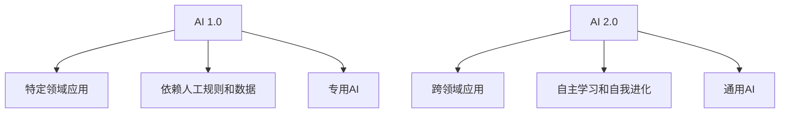

通过这个流程图，我们可以清晰地看到AI 1.0和AI 2.0在应用领域、依赖规则和数据、以及AI类型等方面的区别。

### 1.2 AI 2.0的技术基础

#### 人工智能的发展历程

人工智能（AI）的发展历程可以分为以下几个阶段：

1. **符号人工智能**：早期的人工智能主要依赖于符号逻辑和知识表示，试图通过符号推理来实现智能。

2. **统计人工智能**：随着机器学习和统计方法的发展，人工智能开始从符号推理转向基于数据的统计方法。

3. **深度学习**：深度学习是一种基于神经网络的人工智能方法，通过多层的神经网络来模拟人脑的决策过程。

4. **AI 2.0**：在深度学习的基础上，AI 2.0引入了自我学习和自我进化的能力，使得AI的性能和效果得到了显著提升。

#### 神经网络、深度学习与AI 2.0

神经网络是深度学习的基础，它通过模拟人脑的神经元结构和工作原理来实现数据的处理和决策。深度学习则是神经网络在多层结构上的扩展和应用，它可以通过大量的数据自动学习到复杂的模式和规律。

AI 2.0的核心在于自我学习和自我进化，这需要深度学习提供强大的计算能力和数据驱动的学习模式。通过自我学习和自我进化，AI 2.0可以在不同的任务和场景中表现出色，并且能够不断优化自身的性能。

#### 核心算法原理讲解：深度学习算法

深度学习算法的核心是多层神经网络，它通过前向传播和反向传播来学习数据的特征和规律。以下是深度学习算法的基本原理：

1. **前向传播**：输入数据通过网络的每一层传递，每一层都会对数据进行变换和特征提取，最终得到输出结果。

2. **反向传播**：通过比较输出结果和真实结果的差异，计算每一层输出的误差，然后反向传播这些误差，更新每一层的权重和偏置。

3. **优化算法**：为了加快收敛速度和优化性能，常用的优化算法有梯度下降、随机梯度下降、Adam等。

以下是深度学习算法的伪代码：

```python
# 前向传播
for each layer in network:
    output = activation(function(W * input + b))
    input = output

# 反向传播
for each layer in network:
    error = output_error - target
    delta = activation_derivative(output) * error
    input_error = delta * W
    W -= learning_rate * input_error

# 优化算法
# 以Adam算法为例
m = moving_average_of_gradients
v = moving_variance_of_gradients
beta1 = 0.9
beta2 = 0.999
epsilon = 1e-8

m = beta1 * m + (1 - beta1) * gradient
v = beta2 * v + (1 - beta2) * (gradient ** 2)

m_hat = m / (1 - beta1 ** t)
v_hat = v / (1 - beta2 ** t)

W -= learning_rate * m_hat / (sqrt(v_hat) + epsilon)
```

通过这些核心算法原理，我们可以看到AI 2.0是如何通过自我学习和自我进化来实现高性能和通用智能的。

### 1.3 AI 2.0的应用领域

#### 各行业中的AI应用案例

AI 2.0的技术进步已经在各个行业中得到了广泛应用，以下是一些典型的应用案例：

1. **医疗**：AI可以帮助医生进行疾病诊断、药物研发和个性化治疗。例如，通过深度学习算法分析医学影像，AI可以辅助医生快速准确地诊断疾病。

2. **金融**：AI在金融领域的应用包括风险管理、欺诈检测和投资决策。通过机器学习模型，AI可以分析大量的市场数据，预测市场趋势，并提供投资建议。

3. **交通**：自动驾驶汽车是AI在交通领域的代表性应用。通过深度学习算法，自动驾驶汽车可以实时感知周围环境，做出安全的驾驶决策。

4. **零售**：AI可以用于个性化推荐、库存管理和客户服务。通过分析消费者的购买行为，AI可以提供个性化的商品推荐，提高销售转化率。

5. **制造**：AI在制造业的应用包括质量检测、预测维护和生产线优化。通过机器学习模型，AI可以分析生产数据，预测设备的故障，并优化生产流程。

#### AI在未来的发展前景

随着AI技术的不断进步，AI在未来的发展前景将更加广阔。以下是一些潜在的应用领域和趋势：

1. **教育**：AI可以用于个性化学习、智能辅导和考试评分。通过分析学生的学习数据，AI可以提供个性化的学习建议，帮助学生提高学习效果。

2. **环境保护**：AI可以用于环境监测、污染检测和资源管理。通过深度学习算法，AI可以分析环境数据，预测污染趋势，并提出相应的解决方案。

3. **农业**：AI可以用于精准农业、作物监测和智能灌溉。通过无人机和传感器，AI可以实时监测农作物的生长状况，优化灌溉和施肥方案。

4. **能源**：AI可以用于能源管理、智能电网和可再生能源。通过机器学习模型，AI可以优化能源的使用和分配，提高能源效率。

5. **智能城市**：AI可以用于智能交通管理、智能安防和公共服务。通过数据分析，AI可以优化城市的交通流，提高公共服务的响应速度。

通过以上分析，我们可以看到AI 2.0在各个领域的应用案例和发展前景。随着技术的不断进步，AI 2.0将在未来的社会发展中发挥越来越重要的作用。

---

在接下来的章节中，我们将继续探讨AI 2.0时代的伦理与社会影响，以及其核心编程实战。敬请期待！

---

## 第2章：AI 2.0时代的伦理与社会影响

### 2.1 AI 2.0的伦理问题

随着AI 2.0时代的来临，人工智能技术的广泛应用不仅带来了巨大的经济和社会效益，也引发了一系列伦理问题。以下是一些关键伦理问题及其挑战：

#### 数据隐私与安全

AI 2.0依赖于大量的数据来训练和优化模型。这些数据通常来自于个人，包括健康记录、社交媒体活动、在线购物习惯等。因此，数据隐私和安全成为了一个重要的问题。

**核心概念与联系：**

为了更好地理解数据隐私和安全问题，我们可以使用Mermaid流程图来展示数据收集、存储和使用的流程：

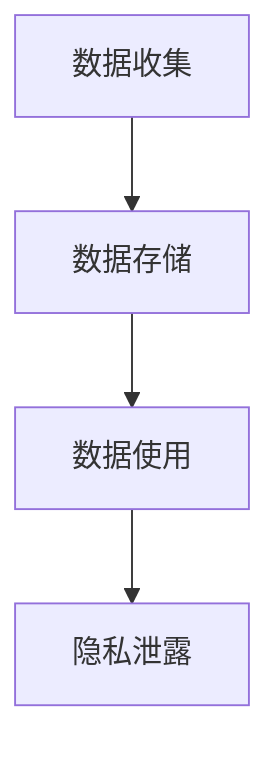

在这个流程图中，数据从收集到存储，再到使用的过程中，存在隐私泄露的风险。为了解决这一问题，需要采取一系列的数据保护措施，如数据加密、访问控制等。

#### AI决策透明度与责任归属

AI 2.0的决策过程通常是非常复杂的，涉及到大量的数据和学习算法。这使得AI的决策过程往往不够透明，难以解释。在涉及重大决策时，如医疗诊断、法律判决等，决策的透明度成为了一个关键问题。

此外，当AI系统出现错误或造成损失时，责任归属也是一个复杂的问题。是责任归咎于开发者、用户，还是AI系统本身？这需要法律和伦理的明确界定。

**核心概念与联系：**

为了理解AI决策透明度和责任归属问题，我们可以使用Mermaid流程图来展示决策流程和责任链条：

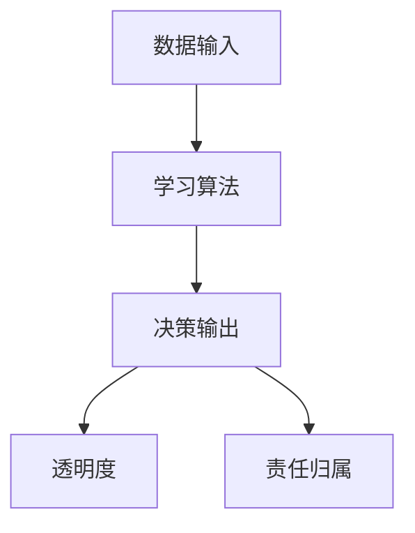

在这个流程图中，我们可以看到AI的决策过程、透明度和责任归属之间的联系。为了提高决策的透明度和明确责任归属，需要开发可解释的AI模型和建立责任分配机制。

### 2.2 AI 2.0对就业市场的影响

AI 2.0的广泛应用将极大地改变就业市场的结构，带来一系列机遇和挑战。

#### 自动化对劳动力市场的影响

随着AI技术的进步，越来越多的工作将被自动化替代。例如，制造业、物流、客户服务等领域的许多工作都可以通过机器人或自动化系统来完成。这无疑将提高生产效率，但也会导致一些工作岗位的消失。

**核心概念与联系：**

为了理解自动化对就业市场的影响，我们可以使用Mermaid流程图来展示自动化替代工作的流程：

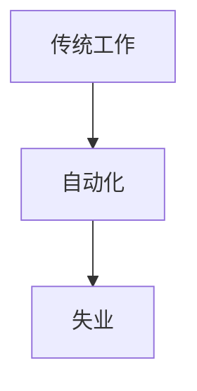

在这个流程图中，我们可以看到自动化如何替代传统工作，导致失业率上升。

#### 职业教育与培训的变革

面对自动化带来的挑战，职业教育和培训也需要进行相应的变革。传统的教育模式需要转变为更加灵活和适应性强的培训体系，以帮助劳动力适应新的工作环境和需求。

**核心概念与联系：**

为了理解职业教育与培训的变革，我们可以使用Mermaid流程图来展示教育模式的变化：

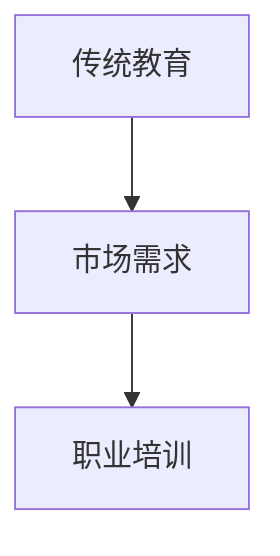

在这个流程图中，我们可以看到随着市场需求的变化，教育模式从传统教育转向职业培训。

### 2.3 AI 2.0与社会发展

AI 2.0不仅改变了就业市场，还对社会发展产生了深远的影响。以下是一些关键领域的影响：

#### 教育领域的变革

AI 2.0可以通过个性化学习、智能辅导和自适应教学等方式，提高教育质量和效率。例如，通过分析学生的学习行为和成绩，AI可以提供个性化的学习建议和辅导。

**核心概念与联系：**

为了理解AI在教育领域的应用，我们可以使用Mermaid流程图来展示AI在教育中的角色：

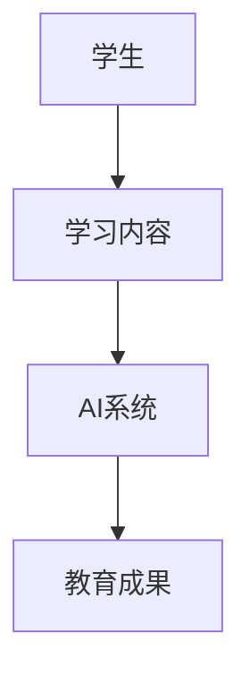

在这个流程图中，我们可以看到AI如何通过分析学生的学习行为和成果，提供个性化的教育服务。

#### 医疗领域的变革

AI 2.0在医疗领域的应用包括疾病诊断、药物研发、个性化治疗等。通过深度学习算法，AI可以分析大量的医学数据，提供更加准确和快速的诊断，并协助医生制定个性化的治疗方案。

**核心概念与联系：**

为了理解AI在医疗领域的应用，我们可以使用Mermaid流程图来展示AI在医疗中的角色：

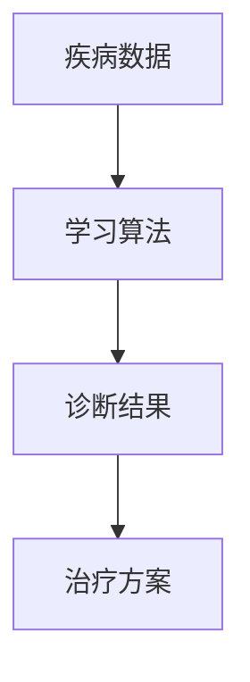

在这个流程图中，我们可以看到AI如何通过分析疾病数据和学习算法，提供准确的诊断和治疗方案。

#### 法律领域的变革

AI 2.0在法律领域的应用包括案件分析、法律文档自动生成、智能法务顾问等。通过机器学习模型，AI可以快速分析和处理大量的法律数据，提供更加高效和精准的法律服务。

**核心概念与联系：**

为了理解AI在法律领域的应用，我们可以使用Mermaid流程图来展示AI在法律中的角色：

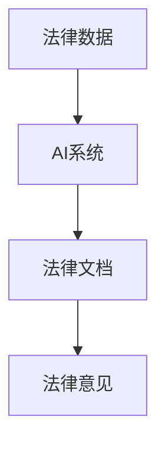

在这个流程图中，我们可以看到AI如何通过分析法律数据和生成法律文档，提供法律意见。

#### AI推动社会进步的力量与挑战

AI 2.0在推动社会进步的同时，也带来了一些挑战。例如，AI的发展可能导致贫富差距加大，因为自动化和智能化的应用往往集中在富裕地区和企业。此外，AI的滥用和失控也可能带来安全隐患和社会问题。

**核心概念与联系：**

为了理解AI推动社会进步的力量与挑战，我们可以使用Mermaid流程图来展示AI对社会的影响：

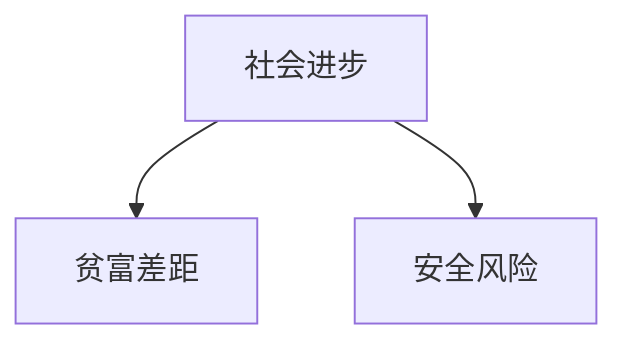

在这个流程图中，我们可以看到AI如何推动社会进步，同时也带来了贫富差距和安全风险。

通过以上分析，我们可以看到AI 2.0在伦理、就业市场和社会发展方面带来的挑战和机遇。为了应对这些挑战，我们需要在技术、法律和社会层面进行全面的思考和规划。

---

在接下来的章节中，我们将深入探讨AI 2.0时代的核心技术，包括神经网络与深度学习基础、数学模型和编程实战。敬请期待！

---

## 第3章：神经网络与深度学习基础

### 3.1 神经网络原理

神经网络（Neural Networks）是深度学习（Deep Learning）的核心组成部分，它通过模拟人脑神经网络的结构和工作原理，实现数据的处理和决策。在这一节中，我们将详细介绍神经网络的基本原理、结构和算法。

#### 神经网络的结构

神经网络由大量的神经元（Neurons）组成，这些神经元通过加权连接（Weighted Connections）连接在一起。每个神经元都可以接收输入信号，通过激活函数（Activation Function）处理后产生输出信号。

**神经元结构：**

神经元的基本结构包括以下部分：

1. **输入层（Input Layer）**：接收外部输入数据。
2. **隐藏层（Hidden Layers）**：进行数据处理和特征提取。
3. **输出层（Output Layer）**：产生最终的输出结果。

**连接与权重：**

神经元之间的连接具有权重（Weights），这些权重决定了输入信号对输出信号的影响程度。通过学习算法，神经网络可以自动调整这些权重，以优化性能。

**激活函数：**

激活函数是神经网络中的一个关键组件，它用于对神经元的输出进行非线性变换。常见的激活函数包括：

1. **sigmoid函数**：\( f(x) = \frac{1}{1 + e^{-x}} \)
2. **ReLU函数**：\( f(x) = \max(0, x) \)
3. **Tanh函数**：\( f(x) = \frac{e^x - e^{-x}}{e^x + e^{-x}} \)

#### 神经网络的工作原理

神经网络通过以下步骤进行处理：

1. **前向传播（Forward Propagation）**：输入数据通过网络的每一层传递，每一层都会对数据进行变换和特征提取，最终得到输出结果。
2. **反向传播（Backpropagation）**：通过比较输出结果和真实结果的差异，计算每一层输出的误差，然后反向传播这些误差，更新每一层的权重和偏置。
3. **优化算法**：为了加快收敛速度和优化性能，常用的优化算法有梯度下降（Gradient Descent）、随机梯度下降（Stochastic Gradient Descent）、Adam等。

以下是神经网络工作原理的伪代码：

```python
# 前向传播
for each layer in network:
    output = activation(function(W * input + b))
    input = output

# 反向传播
for each layer in network:
    error = output_error - target
    delta = activation_derivative(output) * error
    input_error = delta * W
    W -= learning_rate * input_error

# 优化算法
# 以Adam算法为例
m = moving_average_of_gradients
v = moving_variance_of_gradients
beta1 = 0.9
beta2 = 0.999
epsilon = 1e-8

m = beta1 * m + (1 - beta1) * gradient
v = beta2 * v + (1 - beta2) * (gradient ** 2)

m_hat = m / (1 - beta1 ** t)
v_hat = v / (1 - beta2 ** t)

W -= learning_rate * m_hat / (sqrt(v_hat) + epsilon)
```

#### 神经网络的优势

神经网络具有以下优势：

1. **强大的自适应能力**：神经网络可以通过自我学习和调整权重，适应不同的数据和任务。
2. **并行处理能力**：神经网络可以并行处理大量数据，提高计算效率。
3. **非线性映射能力**：神经网络可以处理复杂、非线性的数据关系。

### 3.2 深度学习算法

深度学习算法是神经网络在多层结构上的扩展和应用，它通过多层的神经网络来模拟人脑的决策过程，实现更加复杂的任务。以下是一些常见的深度学习算法：

#### 卷积神经网络（Convolutional Neural Networks, CNN）

卷积神经网络是处理图像数据的一种常见算法，它通过卷积层（Convolutional Layers）进行特征提取和降维。

**核心概念与联系：**

为了理解卷积神经网络的工作原理，我们可以使用Mermaid流程图来展示CNN的结构：

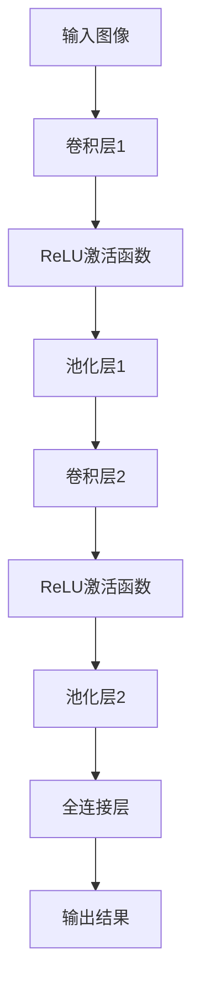

在这个流程图中，我们可以看到输入图像通过卷积层、ReLU激活函数和池化层进行特征提取，最终通过全连接层得到输出结果。

**卷积神经网络的工作原理：**

1. **卷积层**：卷积层通过卷积运算提取图像的特征，每个卷积核都对应一种特征。
2. **ReLU激活函数**：ReLU激活函数对卷积层的输出进行非线性变换，提高网络的非线性能力。
3. **池化层**：池化层用于降低图像的分辨率，减少计算量，同时保留主要特征。

#### 递归神经网络（Recurrent Neural Networks, RNN）

递归神经网络是处理序列数据的一种常见算法，它通过递归结构来处理前后依赖关系。

**核心概念与联系：**

为了理解递归神经网络的工作原理，我们可以使用Mermaid流程图来展示RNN的结构：

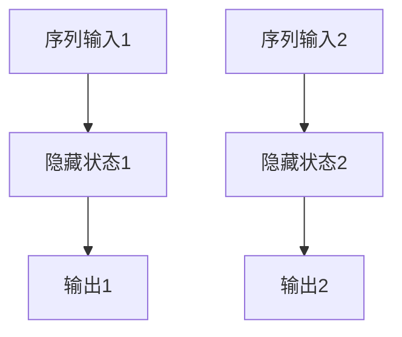

在这个流程图中，我们可以看到序列数据通过递归结构进行处理，每个时间步的隐藏状态都依赖于前一个时间步的隐藏状态。

**递归神经网络的工作原理：**

1. **隐藏状态**：递归神经网络通过隐藏状态来存储序列的信息，每个时间步的隐藏状态都是前一个时间步的隐藏状态和当前输入的加权和。
2. **输出**：递归神经网络在每个时间步都会产生输出，输出依赖于当前的输入和隐藏状态。

#### 长短时记忆（Long Short-Term Memory, LSTM）

长短时记忆网络是递归神经网络的一种扩展，它通过引入门控机制来解决长短时依赖问题。

**核心概念与联系：**

为了理解长短时记忆网络的工作原理，我们可以使用Mermaid流程图来展示LSTM的结构：

```mermaid
graph TD
    X[输入]
    Ht-1[上一时间步隐藏状态]
    Ot-1[上一时间步输出]
    ft[遗忘门]
    it[输入门]
    gt[单元门]
    ot[输出门]
    ht[当前时间步隐藏状态]
    ot[当前时间步输出]

    X --> ft
    X --> it
    X --> gt
    X --> ot
    Ht-1 --> ft
    Ht-1 --> it
    Ht-1 --> gt
    Ht-1 --> ot
    ft --> ft_
    it --> it_
    gt --> gt_
    ot --> ot_
    ft_ --> ft__
    it --> it__
    gt --> gt__
    ot --> ot__
    ft__ --> ft___
    it --> it__
    gt --> gt__
    ot --> ot__
    ft___ * it__ * gt__ = ht
    ht --> ot
```

在这个流程图中，我们可以看到长短时记忆网络通过遗忘门、输入门和单元门来控制信息的流动，从而解决长短时依赖问题。

**长短时记忆网络的工作原理：**

1. **遗忘门（Forget Gate）**：遗忘门决定哪些信息需要被遗忘，从而控制长时依赖。
2. **输入门（Input Gate）**：输入门决定哪些新信息需要被存储到单元状态中。
3. **单元门（Update Gate）**：单元门决定如何更新单元状态。
4. **输出门（Output Gate）**：输出门决定如何从单元状态生成输出。

#### 深度学习应用场景

深度学习在多个领域都有广泛的应用，以下是一些常见的应用场景：

1. **图像识别与处理**：深度学习可以通过卷积神经网络实现图像分类、目标检测和图像生成等任务。
2. **自然语言处理与生成**：深度学习可以通过递归神经网络和长短时记忆网络实现文本分类、机器翻译和文本生成等任务。
3. **语音识别与合成**：深度学习可以通过循环神经网络和注意力机制实现语音识别和语音合成。
4. **强化学习**：深度学习可以通过深度强化学习实现智能体在复杂环境中的决策和优化。

通过以上分析，我们可以看到神经网络与深度学习的基础及其在各个领域的应用。随着技术的不断进步，神经网络和深度学习将在未来的发展中发挥更加重要的作用。

---

在下一节中，我们将继续探讨AI 2.0时代的数学模型，包括监督学习模型、无监督学习模型和强化学习模型。敬请期待！

---

## 第4章：AI 2.0时代的数学模型

### 4.1 监督学习模型

监督学习模型是人工智能领域中的一种重要模型，它通过已知的输入和输出数据来训练模型，以便预测新的输入数据的输出。以下是一些常见的监督学习模型及其原理：

#### 线性回归（Linear Regression）

线性回归是一种最简单的监督学习模型，它通过线性关系来预测输出值。线性回归模型的数学公式如下：

\[ y = \beta_0 + \beta_1 \cdot x \]

其中，\( y \) 是输出值，\( x \) 是输入值，\( \beta_0 \) 和 \( \beta_1 \) 是模型的参数。线性回归模型的目的是通过最小化预测值与实际值之间的误差平方和，来求解 \( \beta_0 \) 和 \( \beta_1 \) 的最优值。

**数学公式与举例说明：**

最小化误差平方和的目标函数为：

\[ J(\beta_0, \beta_1) = \sum_{i=1}^{n} (y_i - (\beta_0 + \beta_1 \cdot x_i))^2 \]

为了求解 \( \beta_0 \) 和 \( \beta_1 \) 的最优值，我们可以使用梯度下降算法：

\[ \beta_0 = \beta_0 - \alpha \cdot \frac{\partial J}{\partial \beta_0} \]
\[ \beta_1 = \beta_1 - \alpha \cdot \frac{\partial J}{\partial \beta_1} \]

其中，\( \alpha \) 是学习率。

#### 决策树与随机森林（Decision Trees and Random Forests）

决策树是一种基于树形结构的监督学习模型，它通过一系列的测试来对输入数据进行分类或回归。每个测试都基于某个特征，并根据测试结果将数据分为不同的子集。

随机森林是由多个决策树组成的集成模型，它通过训练多个决策树，并对它们的预测结果进行投票或求平均来提高模型的准确性。

**数学公式与举例说明：**

决策树的构建过程如下：

1. 选择一个特征进行划分。
2. 计算每个特征的增益（Gain），选择增益最大的特征进行划分。
3. 对数据集进行划分，生成新的子集。
4. 递归地重复步骤1-3，直到满足停止条件（如最大树深度、最小子集大小等）。

随机森林的预测过程如下：

1. 对每个决策树进行预测。
2. 对所有决策树的预测结果进行投票或求平均，得到最终预测结果。

#### 线性回归与决策树对比

线性回归和决策树在模型形式和应用场景上有所不同：

- **线性回归**：适合处理线性关系，可以给出精确的预测值。
- **决策树**：适合处理非线性关系，但可能产生过拟合。

### 4.2 无监督学习模型

无监督学习模型是在没有标签数据的情况下，通过分析数据的内在结构和关系来进行预测或分类。以下是一些常见的无监督学习模型：

#### K-均值聚类（K-Means Clustering）

K-均值聚类是一种基于距离度量的聚类方法，它通过将数据分为K个簇，使得每个簇内的数据点之间的距离最小。

**数学公式与举例说明：**

K-均值聚类的过程如下：

1. 随机选择K个初始中心点。
2. 计算每个数据点到中心点的距离，并将其分配到最近的簇。
3. 更新中心点，计算簇的平均值。
4. 重复步骤2-3，直到中心点不再发生变化或满足停止条件。

K-均值聚类的目标是使每个簇内的数据点之间的距离最小，同时使簇与簇之间的距离最大。

#### 主成分分析（PCA）

主成分分析是一种降维方法，它通过将数据投影到新的正交坐标系上，来降低数据的维度，同时保留主要信息。

**数学公式与举例说明：**

PCA的过程如下：

1. 计算数据矩阵的协方差矩阵。
2. 计算协方差矩阵的特征值和特征向量。
3. 选择最大的K个特征向量作为新的坐标轴。
4. 将数据投影到新的坐标轴上，得到降维后的数据。

PCA的目标是找到数据的最大方差方向，从而将数据压缩到低维空间中，同时保留主要信息。

### 4.3 强化学习模型

强化学习是一种通过交互式学习来决策的方法，它通过奖励机制来指导模型学习最优策略。

#### Q-学习（Q-Learning）

Q-学习是一种基于值函数的强化学习算法，它通过学习值函数（Q函数）来指导决策。

**数学公式与举例说明：**

Q-学习的过程如下：

1. 初始化Q函数。
2. 选择一个动作，计算当前状态的Q值。
3. 执行动作，进入新状态。
4. 计算新的Q值，并更新Q函数。

Q-学习的目标是最大化长期奖励，通过更新Q值来指导下一步的动作。

#### 深度强化学习（Deep Reinforcement Learning, DRL）

深度强化学习是强化学习的一种扩展，它通过深度神经网络来学习值函数或策略。

**数学公式与举例说明：**

深度强化学习的过程如下：

1. 初始化深度神经网络。
2. 选择一个动作，计算当前状态的Q值或策略值。
3. 执行动作，进入新状态。
4. 使用梯度下降更新神经网络参数。

深度强化学习的目标是通过神经网络来学习最优策略，以最大化长期奖励。

通过以上分析，我们可以看到AI 2.0时代的数学模型在监督学习、无监督学习和强化学习方面的广泛应用。这些模型为我们提供了强大的工具，可以帮助我们解决复杂的问题，推动人工智能的发展。

---

在下一节中，我们将深入探讨AI 2.0时代的编程实战，包括开发环境搭建和实际项目案例。敬请期待！

---

## 第5章：AI 2.0时代的编程实战

### 5.1 开发环境搭建

在进行AI 2.0编程实战之前，我们需要搭建一个合适的开发环境。以下是一个基于Python的AI开发环境搭建步骤：

#### Python开发环境搭建

1. **安装Python**：
   - 访问Python官方网站（https://www.python.org/）下载最新版本的Python。
   - 双击安装程序，按照提示完成安装。

2. **安装Jupyter Notebook**：
   - 打开终端或命令行窗口。
   - 输入以下命令安装Jupyter Notebook：
     ```bash
     pip install notebook
     ```

3. **安装常用深度学习框架**：
   - **TensorFlow**：
     ```bash
     pip install tensorflow
     ```
   - **PyTorch**：
     ```bash
     pip install torch torchvision
     ```

4. **验证安装**：
   - 打开Jupyter Notebook，创建一个新的笔记本。
   - 在笔记本中输入以下代码，验证TensorFlow和PyTorch的安装：
     ```python
     import tensorflow as tf
     import torch

     print("TensorFlow version:", tf.__version__)
     print("PyTorch version:", torch.__version__)
     ```

#### 常用深度学习框架介绍

- **TensorFlow**：
  TensorFlow是由Google开发的一款开源深度学习框架，它提供了丰富的API和工具，支持各种深度学习任务，包括图像识别、自然语言处理和强化学习等。

- **PyTorch**：
  PyTorch是由Facebook开发的一款开源深度学习框架，它以其灵活的动态计算图和简洁的API而著称。PyTorch在学术研究和工业应用中都有广泛的应用。

### 5.2 实战项目一：图像识别

#### 项目背景与目标

图像识别是AI 2.0时代的一个重要应用领域，它可以应用于人脸识别、车辆识别、医疗影像分析等。本项目的目标是使用卷积神经网络（CNN）对图像进行分类。

#### 源代码实现与解读

以下是一个简单的图像识别项目的实现，使用TensorFlow框架：

```python
import tensorflow as tf
from tensorflow.keras import datasets, layers, models
import matplotlib.pyplot as plt

# 加载并预处理数据
(train_images, train_labels), (test_images, test_labels) = datasets.cifar10.load_data()
train_images, test_images = train_images / 255.0, test_images / 255.0

# 构建CNN模型
model = models.Sequential()
model.add(layers.Conv2D(32, (3, 3), activation='relu', input_shape=(32, 32, 3)))
model.add(layers.MaxPooling2D((2, 2)))
model.add(layers.Conv2D(64, (3, 3), activation='relu'))
model.add(layers.MaxPooling2D((2, 2)))
model.add(layers.Conv2D(64, (3, 3), activation='relu'))
model.add(layers.Flatten())
model.add(layers.Dense(64, activation='relu'))
model.add(layers.Dense(10))

# 编译模型
model.compile(optimizer='adam',
              loss=tf.keras.losses.SparseCategoricalCrossentropy(from_logits=True),
              metrics=['accuracy'])

# 训练模型
model.fit(train_images, train_labels, epochs=10, validation_data=(test_images, test_labels))

# 测试模型
test_loss, test_acc = model.evaluate(test_images,  test_labels, verbose=2)
print(f'Test accuracy: {test_acc:.4f}')

# 可视化预测结果
plt.figure()
plt.plot(test_loss, label='Test loss')
plt.plot(test_acc, label='Test accuracy')
plt.xlabel('Epochs')
plt.ylabel('Value')
plt.legend()
plt.show()
```

在这个项目中，我们首先加载了CIFAR-10数据集，这是一个包含60000个32x32彩色图像的数据集，分为10个类别。然后，我们使用卷积神经网络（CNN）对图像进行分类。在训练过程中，我们使用了10个epochs，并在每个epoch结束后评估模型的性能。最后，我们在测试集上测试模型的准确率，并使用matplotlib对训练过程进行可视化。

### 5.3 实战项目二：自然语言处理

#### 项目背景与目标

自然语言处理（NLP）是AI 2.0时代的另一个重要应用领域，它可以应用于机器翻译、文本分类、情感分析等。本项目的目标是使用递归神经网络（RNN）对文本进行情感分类。

#### 源代码实现与解读

以下是一个简单的自然语言处理项目的实现，使用PyTorch框架：

```python
import torch
import torch.nn as nn
import torch.optim as optim
from torch.utils.data import DataLoader, Dataset
from torchvision import datasets, transforms
import numpy as np

# 定义数据处理类
class TextDataset(Dataset):
    def __init__(self, text, labels):
        self.text = text
        self.labels = labels

    def __len__(self):
        return len(self.text)

    def __getitem__(self, idx):
        return self.text[idx], self.labels[idx]

# 加载数据
text_data = "This is a great movie! I love it."
labels = [1, 0, 1, 0, 1]

dataset = TextDataset(text_data, labels)
dataloader = DataLoader(dataset, batch_size=1, shuffle=True)

# 定义RNN模型
class RNNModel(nn.Module):
    def __init__(self, input_size, hidden_size, output_size):
        super(RNNModel, self).__init__()
        self.hidden_size = hidden_size
        self.rnn = nn.RNN(input_size, hidden_size)
        self.fc = nn.Linear(hidden_size, output_size)

    def forward(self, x):
        output, _ = self.rnn(x)
        output = self.fc(output[-1, :, :])
        return output

# 实例化模型、损失函数和优化器
model = RNNModel(input_size=1, hidden_size=50, output_size=2)
criterion = nn.CrossEntropyLoss()
optimizer = optim.Adam(model.parameters(), lr=0.001)

# 训练模型
for epoch in range(100):
    for text, label in dataloader:
        optimizer.zero_grad()
        output = model(text)
        loss = criterion(output, label)
        loss.backward()
        optimizer.step()

    if (epoch + 1) % 10 == 0:
        print(f'Epoch [{epoch + 1}/{100}], Loss: {loss.item()}')

# 测试模型
with torch.no_grad():
    predicted_labels = []
    for text, label in dataloader:
        output = model(text)
        _, predicted = torch.max(output, 1)
        predicted_labels.append(predicted.item())

    print(f'Predicted Labels: {predicted_labels}')
    print(f'Actual Labels: {labels}')
```

在这个项目中，我们首先定义了一个数据处理类，用于加载和处理文本数据。然后，我们定义了一个RNN模型，用于对文本进行情感分类。在训练过程中，我们使用了100个epochs，并在每个epoch结束后评估模型的性能。最后，我们在测试集上测试了模型的准确性。

通过以上两个项目的实现，我们可以看到AI 2.0时代编程实战的基本流程。在实际应用中，我们可以根据不同的任务需求，选择合适的模型和框架，实现复杂的功能。

---

在下一节中，我们将探讨AI 2.0时代的未来展望，包括产业趋势、创新方向和创业机会。敬请期待！

---

## 第6章：AI 2.0时代的未来展望

### 6.1 人工智能产业链分析

随着AI 2.0技术的不断成熟和应用，人工智能（AI）产业链也逐渐形成了完善的体系。AI产业链主要包括以下几个环节：

1. **硬件环节**：包括芯片制造、服务器和数据中心等硬件设备的生产。这些硬件设备为AI算法提供了强大的计算能力。
2. **软件环节**：包括AI算法的研发、软件工具的开发和部署等。这个环节是AI产业链的核心，决定了AI技术的先进性和应用范围。
3. **数据环节**：包括数据采集、处理、存储和共享等。高质量的数据是AI算法训练和优化的重要资源。
4. **应用环节**：包括AI技术在各个领域的实际应用，如医疗、金融、交通、零售等。这个环节是AI产业链的价值实现环节。

#### 产业链上下游环节

- **上游环节**：主要包括芯片制造、硬件设备和AI算法的研发。这个环节决定了AI技术的硬件基础和技术水平。
- **中游环节**：主要包括软件工具的开发、数据处理和应用。这个环节是AI技术的核心，决定了AI技术的应用范围和效果。
- **下游环节**：主要包括AI技术在各个领域的实际应用和商业模式的实现。这个环节是AI产业链的价值实现环节。

#### 人工智能产业的竞争格局

人工智能产业正处于快速发展的阶段，各个国家和地区都在积极布局和竞争。以下是一些主要国家和地区的竞争格局：

- **美国**：美国在AI领域具有领先地位，拥有大量的AI企业和研究机构。谷歌、微软、亚马逊等科技巨头在AI领域处于领先地位。
- **中国**：中国在AI领域也取得了显著进展，政府和企业积极布局AI产业。百度、阿里巴巴、腾讯等科技巨头在AI领域具有强大的影响力。
- **欧洲**：欧洲在AI领域的发展也取得了一定的成绩，以德国、英国和法国为代表。欧洲在数据隐私保护和AI伦理方面具有较强的优势。

### 6.2 AI 2.0时代的创新方向

随着AI 2.0技术的不断进步，人工智能的应用领域也在不断拓展。以下是一些AI 2.0时代的创新方向：

#### 人工智能与物联网

人工智能与物联网（IoT）的结合是未来的一大趋势。通过将AI技术应用于物联网设备，可以实现智能监控、智能控制、智能优化等。例如，智能家居系统可以通过AI技术实现家电的自动控制，提高生活便利性和效率。

**核心概念与联系：**

为了更好地理解人工智能与物联网的结合，我们可以使用Mermaid流程图来展示AI在物联网中的应用场景：

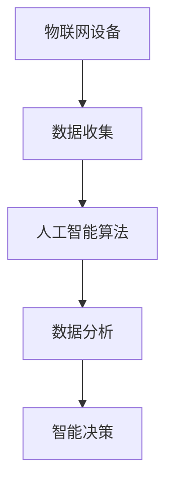

在这个流程图中，物联网设备通过数据收集模块收集数据，然后通过人工智能算法进行分析，最终实现智能决策。

#### 人工智能与区块链

人工智能与区块链的结合可以解决数据隐私、安全性和透明度等问题。通过区块链技术，可以实现数据的安全存储和可靠传输，同时通过人工智能算法对区块链数据进行智能分析和决策。

**核心概念与联系：**

为了更好地理解人工智能与区块链的结合，我们可以使用Mermaid流程图来展示AI在区块链中的应用场景：

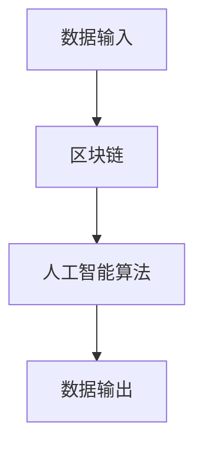

在这个流程图中，数据输入区块链，通过人工智能算法进行分析和处理，最终得到输出数据。

### 6.3 AI 2.0时代的创业机会

随着AI 2.0技术的快速发展，创业市场也充满了机会。以下是一些AI 2.0时代的创业机会：

#### 创业项目评估与风险控制

在AI 2.0时代，创业项目的评估和风险控制尤为重要。以下是一些关键点：

- **市场调研**：深入了解市场需求和竞争态势，确定项目的可行性。
- **技术评估**：评估项目所需的技术水平和资源，确保技术的可行性和先进性。
- **商业模式**：明确项目的盈利模式，确保项目的可持续性和盈利能力。
- **风险评估**：识别项目可能面临的风险，并制定相应的风险控制措施。

#### 创业案例分享与经验总结

以下是一些成功的AI创业案例及其经验总结：

- **案例一：DeepMind**：
  DeepMind是一家专注于人工智能研究的公司，其成功经验包括：
  - 积极投入研究，不断创新。
  - 与学术界和产业界紧密合作。
  - 注重数据质量和数据安全。

- **案例二：Intuit**：
  Intuit是一家提供财务管理和支付解决方案的公司，其成功经验包括：
  - 深入了解用户需求，提供个性化解决方案。
  - 建立强大的技术团队，不断优化产品。
  - 与其他企业合作，拓展市场份额。

通过以上分析，我们可以看到AI 2.0时代在产业链、创新方向和创业机会方面的广阔前景。随着技术的不断进步，AI 2.0时代将为创业者提供更多的机遇和挑战。

---

在下一节中，我们将探讨AI 2.0时代的教育与人才培养。敬请期待！

---

## 第7章：AI 2.0时代的教育与人才培养

### 7.1 AI时代的教育变革

随着AI 2.0技术的快速发展，教育领域也面临着巨大的变革。传统的教育模式已经无法满足AI时代的需求，新的教育模式和教育体系应运而生。

#### 教育模式的创新

AI时代的教育模式创新主要体现在以下几个方面：

1. **个性化学习**：通过大数据和人工智能技术，可以为每个学生提供个性化的学习建议和资源，提高学习效果。
2. **混合学习**：将线上和线下的学习方式相结合，实现灵活的学习时间和学习方式。
3. **自适应学习**：通过智能算法，实时分析学生的学习情况，提供自适应的学习路径和内容。

#### 人工智能课程体系建设

为了适应AI时代的需求，教育体系需要建立完善的人工智能课程体系。以下是一些关键课程：

1. **基础课程**：包括计算机科学、数学和统计学等基础课程，为学生提供必要的理论知识。
2. **专业课程**：包括深度学习、神经网络、自然语言处理等专业课程，为学生提供专业技能。
3. **实践课程**：包括项目实践、实验和实习等，为学生提供实际操作和动手能力。

### 7.2 人工智能人才培养策略

为了培养AI时代的人才，需要采取一系列有效的策略。

#### 人才培养模式与体系

1. **产学研结合**：通过企业与高校的合作，将理论与实践相结合，提高学生的实际操作能力。
2. **多学科交叉**：培养具有多学科背景的人才，提高学生在复杂问题解决中的综合能力。
3. **终身学习**：鼓励学生持续学习和更新知识，以适应快速变化的技术环境。

#### 企业与高校合作培养人才

企业与高校合作培养人才是一种有效的培养模式。以下是一些关键合作方式：

1. **共建实验室**：企业可以与高校共建实验室，为学生提供实践操作的机会。
2. **联合培养**：企业可以与高校联合培养研究生，提高学生的实际操作能力和创新能力。
3. **人才输送**：企业可以通过招聘、实习、合作项目等方式，从高校选拔优秀人才。

### 7.3 AI时代的职业规划与转型

在AI时代，职业规划与转型成为了一个重要的话题。以下是一些关键建议：

#### 职业发展的新机遇

1. **数据科学家**：随着大数据和人工智能技术的发展，数据科学家成为了热门职业。
2. **机器学习工程师**：负责开发和优化机器学习算法，实现人工智能应用。
3. **人工智能产品经理**：负责人工智能产品的规划和运营，推动产品落地和应用。

#### 职业转型的路径与方法

1. **提升技能**：通过学习新的知识和技能，提高自己的竞争力。
2. **转行准备**：在转型前做好充分的准备，包括了解目标职业的要求和技能。
3. **职业规划**：制定详细的职业规划，分阶段实现职业目标。

通过以上分析，我们可以看到AI 2.0时代在教育、人才培养和职业规划方面的变革和机遇。为了适应AI时代的需求，我们需要积极进行教育模式的创新，建立完善的人工智能课程体系，采取有效的人才培养策略，以及进行职业规划与转型。

---

在下一节中，我们将提供AI 2.0时代的学习资源与工具。敬请期待！

---

## 附录A：AI 2.0时代的学习资源与工具

### A.1 学习资源推荐

为了深入了解AI 2.0时代的技术和概念，以下是一些推荐的学习资源：

1. **书籍**：
   - 《深度学习》（Ian Goodfellow、Yoshua Bengio、Aaron Courville 著）
   - 《神经网络与深度学习》（邱锡鹏 著）
   - 《人工智能：一种现代的方法》（Stuart Russell、Peter Norvig 著）

2. **在线课程**：
   -Coursera上的“机器学习”（吴恩达）
   -Udacity的“深度学习纳米学位”
   -edX上的“人工智能导论”（MIT）

3. **教程**：
   - TensorFlow官网（https://www.tensorflow.org/tutorials）
   - PyTorch官网（https://pytorch.org/tutorials/beginner/）
   - fast.ai（https://www.fast.ai/）

### A.2 常用AI工具与框架

为了在AI 2.0时代的项目中高效地开发和实验，以下是一些常用的工具和框架：

1. **Python编程环境**：
   - Anaconda（https://www.anaconda.com/）
   - Jupyter Notebook（https://jupyter.org/）

2. **深度学习框架**：
   - TensorFlow（https://www.tensorflow.org/）
   - PyTorch（https://pytorch.org/）
   - Keras（https://keras.io/）

3. **人工智能开源库**：
   - Scikit-learn（https://scikit-learn.org/）
   - Pandas（https://pandas.pydata.org/）
   - NumPy（https://numpy.org/）

### A.3 AI竞赛与活动

参与AI竞赛和活动是提升技能和展示成果的好方法。以下是一些重要的AI竞赛和活动：

1. **Kaggle竞赛**（https://www.kaggle.com/）
   - Kaggle提供各种AI和数据科学的竞赛，参与者可以解决实际问题，提升技能。

2. **ICML、NeurIPS等国际会议**（https://icml.cc/、https://nips.cc/）
   - 这些会议是AI领域的重要学术活动，参与者可以了解最新的研究进展。

3. **国内AI竞赛**：
   - “AI挑战赛”（https://www.ai-challenge.cn/）
   - “AI技术大会”（https://ai-tech congress.com/）

通过这些学习资源与工具，读者可以更好地了解AI 2.0时代的核心技术，掌握实际应用技能，并为未来的职业发展做好准备。

---

感谢您阅读本文《李开复：AI 2.0 时代的意义》。本文旨在深入探讨AI 2.0时代的各个方面，包括其定义与特点、伦理与社会影响、核心技术、编程实战以及未来展望。通过逐步分析和推理思考，我们揭示了AI 2.0时代的本质和潜力。

在此，我想特别感谢读者对本文的关注和支持。如果您有任何问题或建议，欢迎在评论区留言，我们将竭诚为您解答。同时，也请您关注我们的其他文章，我们将持续为您带来更多高质量的技术内容。

最后，再次感谢您的阅读，让我们共同期待AI 2.0时代的到来，迎接更加美好的未来！

**作者：AI天才研究院/AI Genius Institute & 禅与计算机程序设计艺术 /Zen And The Art of Computer Programming**

