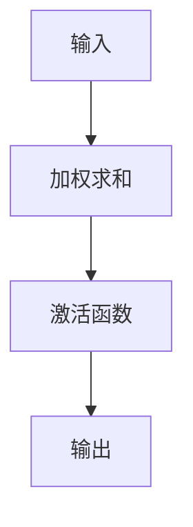
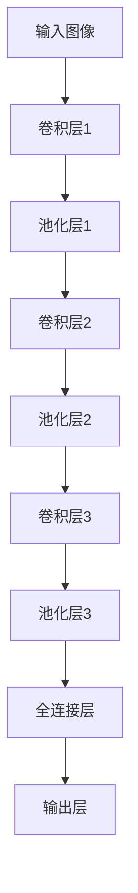
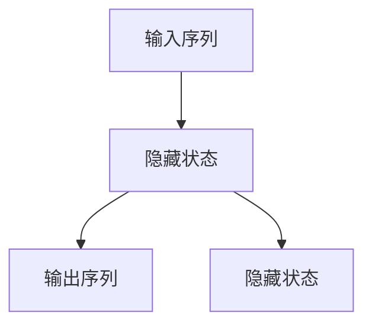
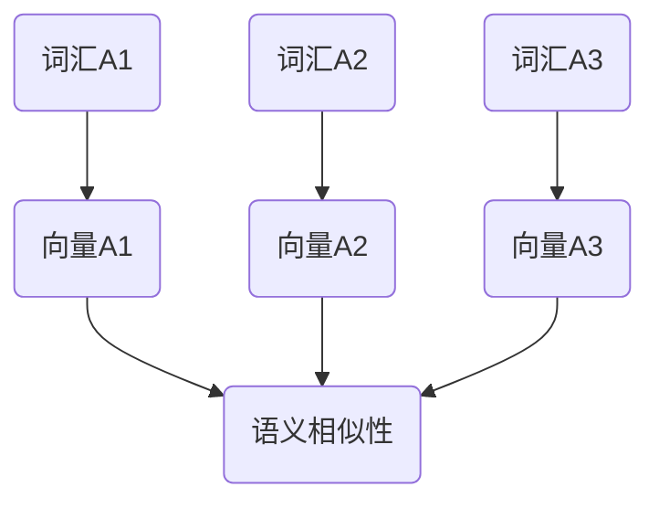
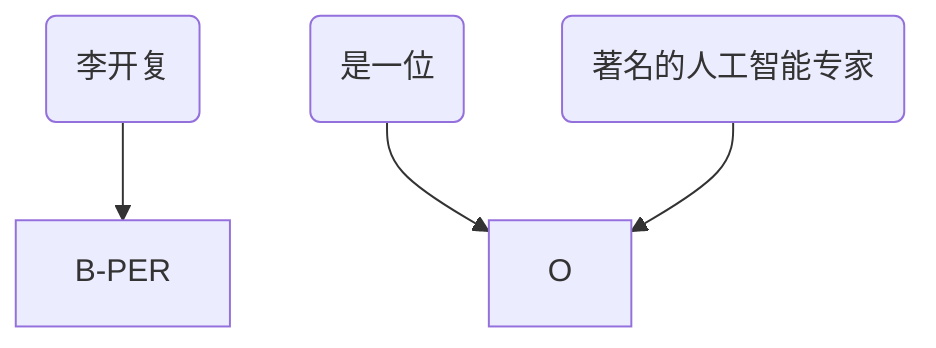

                 

### 文章标题

《李开复：AI 2.0 时代的趋势》

> 关键词：AI 2.0，人工智能，深度学习，自然语言处理，强化学习，应用与实践，伦理与社会影响

> 摘要：本文深入探讨了AI 2.0时代的背景、核心概念、关键技术、应用实践以及伦理与社会影响。通过李开复先生的研究与实践，揭示了AI 2.0时代的趋势与发展方向，为读者提供了全面而深刻的理解与思考。

---

### 《李开复：AI 2.0 时代的趋势》目录大纲

1. 第一部分: AI 2.0 时代的背景与核心概念
   1.1 AI 2.0 时代概述
   1.2 AI 2.0 的核心概念与联系
2. 第二部分: AI 2.0 时代的关键技术
   2.1 神经网络与深度学习
   2.2 自然语言处理（NLP）
   2.3 强化学习
3. 第三部分: AI 2.0 时代的应用与实践
   3.1 AI 在金融领域的应用
   3.2 AI 在医疗健康领域的应用
   3.3 AI 在制造业的应用
4. 第四部分: AI 2.0 时代的伦理与社会影响
   4.1 AI 伦理与隐私保护
   4.2 AI 对社会的影响
5. 附录
   5.1 深度学习框架介绍
   5.2 数据集介绍
   5.3 学习资源推荐

---

接下来，我们将逐部分详细探讨AI 2.0时代的背景与核心概念，以帮助读者全面了解这一时代的趋势与发展方向。让我们一步步思考，深入剖析每一个关键点。

---

### 第一部分: AI 2.0 时代的背景与核心概念

#### 1.1 AI 2.0 时代概述

AI 2.0时代是指人工智能发展的第二个重要阶段，它是继AI 1.0时代（以规则和符号处理为主的专家系统）之后的进一步演进。AI 2.0时代的核心特征是从规则驱动转变为数据驱动，深度学习和神经网络技术在这一时代得到了广泛应用，使得人工智能系统在图像识别、自然语言处理、语音识别等领域取得了显著的突破。

从AI 1.0到AI 2.0的演变是一个必然的趋势。AI 1.0时代虽然取得了许多成果，但存在局限性，如缺乏自主学习和适应能力。而AI 2.0时代通过深度学习、强化学习等技术的引入，使得人工智能系统具备了更强的学习和适应能力，能够更好地模拟人类的智能行为。

#### 1.1.1 AI 2.0的定义与特点

AI 2.0的定义可以从以下几个方面来理解：

- **技术层面**：AI 2.0以深度学习为核心，结合了神经网络、大数据和云计算等新兴技术，实现了对大量复杂数据的自动分析和处理。
- **应用层面**：AI 2.0的应用范围更加广泛，从传统的工业、金融、医疗等领域，扩展到无人驾驶、智能家居、智慧城市等新兴领域。
- **能力层面**：AI 2.0的人工智能系统能够通过自主学习不断优化自身，具备更强大的智能决策和问题解决能力。

AI 2.0的特点主要体现在以下几个方面：

- **自主学习**：通过深度学习和强化学习，AI 2.0系统能够从大量数据中自主学习，不断优化自身的性能。
- **数据驱动**：AI 2.0依赖于大量的数据来训练模型，数据质量直接影响到模型的性能。
- **跨界融合**：AI 2.0不仅应用于传统的领域，还与物联网、区块链等新兴技术相结合，推动产业变革。
- **实时决策**：AI 2.0系统能够在实时环境中进行快速决策，提高了系统的响应速度和稳定性。

#### 1.1.3 AI 2.0时代的机遇与挑战

AI 2.0时代带来了许多机遇，同时也伴随着一系列挑战。

**机遇**：

1. **产业升级**：AI 2.0技术为传统产业提供了智能化升级的路径，推动了产业结构的优化和产业升级。
2. **创新创业**：AI 2.0时代的到来为创新创业提供了丰富的土壤，激发了大量的创新活动和创业机会。
3. **社会服务**：AI 2.0技术在医疗、教育、交通等公共服务领域的应用，提升了社会服务的质量和效率。
4. **经济增长**：AI 2.0技术推动了全球经济的增长，创造了大量的就业机会和经济效益。

**挑战**：

1. **数据安全**：AI 2.0时代的数据规模庞大，如何确保数据安全和隐私保护成为重要课题。
2. **技术安全**：AI 2.0技术的自主学习和自适应能力可能引发新的技术风险，如算法歧视、数据泄漏等。
3. **就业冲击**：AI 2.0技术的发展可能对某些行业和岗位造成冲击，引发就业结构的变化。
4. **伦理道德**：AI 2.0技术的广泛应用引发了一系列伦理道德问题，如隐私保护、责任归属等。

总的来说，AI 2.0时代既是机遇也是挑战。面对这些挑战，我们需要采取积极的态度和有效的措施，确保AI技术的发展能够造福人类社会，而不是带来负面影响。

---

### 1.2 AI 2.0的核心概念与联系

#### 1.2.1 人工智能的分类

人工智能（AI）可以分为多种类型，每种类型都有其独特的特点和适用场景。以下是几种主要的人工智能分类：

1. **弱人工智能（Narrow AI）**：
   - 定义：弱人工智能是指针对特定任务进行优化的AI系统，只能在其特定领域内表现出智能行为。
   - 代表技术：自然语言处理（NLP）、图像识别、推荐系统等。
   - 应用场景：智能客服、自动驾驶、智能家居等。

2. **强人工智能（General AI）**：
   - 定义：强人工智能是指具有全面智力能力的AI系统，能够理解和执行任何智力任务。
   - 代表技术：通用问题求解、知识表示、自主决策等。
   - 应用场景：尚未实现，理论上的应用场景包括科学研究、社会管理、军事决策等。

3. **超人工智能（Super AI）**：
   - 定义：超人工智能是指智力远超人类的人工智能，能够在任何领域超越人类。
   - 代表技术：尚未明确，但与脑科学、量子计算等前沿技术密切相关。
   - 应用场景：理论上的应用场景包括社会管理、科学探索、艺术创作等。

#### 1.2.2 学习方式：监督学习、无监督学习、强化学习

在AI 2.0时代，不同的学习方式被广泛应用于人工智能系统的训练和优化。以下是三种主要的学习方式：

1. **监督学习（Supervised Learning）**：
   - 定义：监督学习是一种通过已标记的数据集训练模型的方法，模型需要预测未知数据的标签。
   - 代表算法：线性回归、逻辑回归、支持向量机（SVM）等。
   - 伪代码示例：
     ```python
     # 假设我们有一个线性回归模型
     # X: 特征向量，y: 标签
     # 使用梯度下降算法训练模型
     for epoch in range(num_epochs):
         for x, y in data_loader:
             # 计算损失函数
             loss = loss_function(model(x), y)
             # 更新模型参数
             optimizer.zero_grad()
             loss.backward()
             optimizer.step()
     ```

2. **无监督学习（Unsupervised Learning）**：
   - 定义：无监督学习是一种在没有标记数据的情况下训练模型的方法，主要目的是发现数据中的结构和模式。
   - 代表算法：聚类、降维、生成模型等。
   - 伪代码示例：
     ```python
     # 假设我们使用K-Means算法进行聚类
     # X: 数据集，K: 聚类个数
     centroids = initialize_centroids(X, K)
     while not converged:
         # 计算每个点的簇中心
         for x in X:
             closest_centroid = find_closest_centroid(x, centroids)
             assign_x_to_cluster(x, closest_centroid)
         # 更新簇中心
         centroids = update_centroids(clusters)
     ```

3. **强化学习（Reinforcement Learning）**：
   - 定义：强化学习是一种通过与环境互动来学习最优策略的方法，模型需要通过奖励机制进行优化。
   - 代表算法：Q学习、策略梯度、深度强化学习等。
   - 伪代码示例：
     ```python
     # 假设我们使用Q学习算法
     # Q: Q值函数，action_space: 行动空间，state_space: 状态空间
     for episode in range(num_episodes):
         # 初始状态
         state = environment.reset()
         while not done:
             # 选择最优行动
             action = select_best_action(state, Q)
             # 执行行动
             next_state, reward, done = environment.step(action)
             # 更新Q值
             Q[state, action] = (1 - learning_rate) * Q[state, action] + learning_rate * (reward + discount * max(Q[next_state]))
             state = next_state
     ```

#### 1.2.3 深度学习的理论基础

深度学习是AI 2.0时代的关键技术之一，它基于多层神经网络结构，通过非线性变换对数据进行多级抽象和特征提取。以下是深度学习的理论基础：

1. **多层感知机（MLP）**：
   - 定义：多层感知机是一种前馈神经网络，由输入层、多个隐层和输出层组成。
   - 算法原理：输入数据通过输入层传递到隐层，每个隐层通过激活函数进行非线性变换，最终传递到输出层。
   - 伪代码示例：
     ```python
     # 假设我们有一个多层感知机模型
     # X: 输入数据，W: 权重矩阵，b: 偏置，h: 隐层节点数
     for epoch in range(num_epochs):
         for x in data_loader:
             # 前向传播
             hidden_layer = activation_function(np.dot(x, W) + b)
             output_layer = activation_function(np.dot(hidden_layer, W_output) + b_output)
             # 计算损失函数
             loss = loss_function(output_layer, y)
             # 反向传播
             d_output = output_layer - y
             d_hidden = activation_derivative(hidden_layer) * np.dot(d_output, W_output.T)
             d_input = activation_derivative(x) * np.dot(d_hidden, W.T)
             # 更新权重和偏置
             W_output -= learning_rate * d_output * hidden_layer
             b_output -= learning_rate * d_output
             W -= learning_rate * d_hidden * x
             b -= learning_rate * d_hidden
     ```

2. **卷积神经网络（CNN）**：
   - 定义：卷积神经网络是一种专门用于处理图像数据的神经网络，通过卷积操作和池化操作提取图像特征。
   - 算法原理：输入图像通过卷积层提取特征，然后通过池化层进行特征降维，最后通过全连接层进行分类或回归。
   - 伪代码示例：
     ```python
     # 假设我们有一个卷积神经网络模型
     # X: 输入图像，W: 权重矩阵，b: 偏置，kernel_size: 卷积核大小，stride: 步长，padding: 填充
     for epoch in range(num_epochs):
         for x in image_loader:
             # 卷积操作
             conv_output = conv2d(x, W, kernel_size, stride, padding)
             # 池化操作
             pool_output = max_pool2d(conv_output, pool_size, stride)
             # 全连接层
             hidden_layer = activation_function(np.dot(pool_output, W_fc) + b_fc)
             output_layer = activation_function(np.dot(hidden_layer, W_output) + b_output)
             # 计算损失函数
             loss = loss_function(output_layer, y)
             # 反向传播
             d_output = output_layer - y
             d_hidden = activation_derivative(hidden_layer) * np.dot(d_output, W_output.T)
             d_pool = activation_derivative(pool_output) * np.dot(d_hidden, W_fc.T)
             d_conv = activation_derivative(x) * np.dot(d_pool, W_conv.T)
             # 更新权重和偏置
             W_output -= learning_rate * d_output * hidden_layer
             b_output -= learning_rate * d_output
             W_fc -= learning_rate * d_hidden * pool_output
             b_fc -= learning_rate * d_hidden
             W_conv -= learning_rate * d_conv * x
     ```

3. **循环神经网络（RNN）**：
   - 定义：循环神经网络是一种处理序列数据的神经网络，通过循环结构将当前状态与历史状态相连接。
   - 算法原理：输入序列通过循环层处理，每个时间步的输出都与前一个时间步的状态相连接，形成时间依赖性。
   - 伪代码示例：
     ```python
     # 假设我们有一个循环神经网络模型
     # X: 输入序列，W: 权重矩阵，b: 偏置，h: 隐层节点数
     for epoch in range(num_epochs):
         for x in sequence_loader:
             # 初始隐藏状态
             hidden_state = initialize_hidden_state(h)
             for t in range(sequence_length):
                 # 前向传播
                 input_vector = x[t]
                 hidden_state = activation_function(np.dot(input_vector, W_input) + np.dot(hidden_state, W_hidden) + b_hidden)
                 # 更新隐藏状态
                 hidden_states[t] = hidden_state
             # 全连接层
             output_layer = activation_function(np.dot(hidden_states, W_output) + b_output)
             # 计算损失函数
             loss = loss_function(output_layer, y)
             # 反向传播
             d_output = output_layer - y
             d_hidden = activation_derivative(hidden_states) * np.dot(d_output, W_output.T)
             # 更新权重和偏置
             W_output -= learning_rate * d_output * hidden_states
             b_output -= learning_rate * d_output
             W_hidden -= learning_rate * d_hidden * input_vector
             b_hidden -= learning_rate * d_hidden
     ```

#### 1.2.4 Mermaid流程图：AI 2.0的核心算法与架构

为了更直观地理解AI 2.0的核心算法与架构，我们可以使用Mermaid流程图进行描述。以下是几个典型的AI 2.0算法与架构的Mermaid流程图：

1. **多层感知机（MLP）**：
   ```mermaid
   graph TD
   A[输入层] --> B[隐层1]
   B --> C[隐层2]
   C --> D[输出层]
   ```

2. **卷积神经网络（CNN）**：
   ```mermaid
   graph TD
   A[输入图像] --> B[卷积层1]
   B --> C[池化层1]
   C --> D[卷积层2]
   D --> E[池化层2]
   E --> F[全连接层]
   ```

3. **循环神经网络（RNN）**：
   ```mermaid
   graph TD
   A[序列输入] --> B[隐藏状态]
   B --> C[输出]
   C --> D[下一输入]
   B --> D
   ```

通过这些流程图，我们可以更清晰地理解AI 2.0的核心算法与架构，为后续内容的学习和应用打下坚实的基础。

---

在本部分，我们详细探讨了AI 2.0时代的背景与核心概念。从AI 2.0的定义与特点，到人工智能的分类与学习方式，再到深度学习的理论基础，我们逐步深入，逐步剖析，为读者呈现了AI 2.0时代的全景。在接下来的部分，我们将继续探讨AI 2.0时代的关键技术，深入分析神经网络与深度学习、自然语言处理（NLP）、强化学习等领域的最新进展和应用。

---

### 第二部分: AI 2.0 时代的关键技术

#### 2.1 神经网络与深度学习

神经网络是人工智能的核心组成部分，特别是在AI 2.0时代，深度学习（Deep Learning）技术的快速发展极大地推动了人工智能的应用和普及。深度学习是神经网络的一种延伸，它通过多层神经网络结构对数据进行复杂特征提取和模式识别。

#### 2.1.1 神经网络基础

神经网络（Neural Network）是一种模拟生物神经系统的计算模型。它由大量的神经元（或节点）组成，每个神经元都可以接收输入信号，通过加权求和和激活函数产生输出。以下是神经网络的基本组成部分：

1. **神经元**：
   - 定义：神经元是神经网络的基本单元，它接收输入信号，通过加权求和和激活函数产生输出。
   - 结构：每个神经元包含多个输入、一个加权求和单元、一个激活函数和一个输出。
   - 功能：神经元通过接收外部输入，进行加权求和，并利用激活函数确定输出值，从而实现简单的数据处理和决策。

2. **层**：
   - 定义：神经网络由多个层次组成，包括输入层、隐层和输出层。
   - 功能：输入层接收外部输入，隐层对输入数据进行处理和特征提取，输出层产生最终的输出结果。

3. **权重与偏置**：
   - 定义：权重（Weights）和偏置（Bias）是神经网络中的参数，它们决定了神经元的输出。
   - 功能：权重用于调整输入信号的强度，偏置用于修正神经元的输出。

4. **激活函数**：
   - 定义：激活函数是神经网络中的一个非线性变换，它将加权求和的结果转化为输出值。
   - 常见激活函数：常见的激活函数包括Sigmoid函数、ReLU函数、Tanh函数等。

#### 2.1.1.1 神经元的结构与功能

神经元是神经网络的基本单元，它的结构与功能如图所示：



- **输入**：每个神经元接收多个输入信号，每个输入信号都与对应的权重相乘。
- **加权求和**：输入信号通过加权求和得到一个总输入值。
- **激活函数**：总输入值通过激活函数进行非线性变换，产生输出值。
- **输出**：输出值传递给下一个神经元或作为最终输出。

#### 2.1.1.2 前馈神经网络

前馈神经网络（Feedforward Neural Network）是一种最简单的神经网络结构，其中数据从输入层流向输出层，不形成循环。以下是前馈神经网络的基本结构：

1. **输入层**：接收外部输入数据。
2. **隐层**：对输入数据进行特征提取和变换。
3. **输出层**：产生最终输出结果。

前馈神经网络的训练过程通常包括以下几个步骤：

1. **初始化参数**：随机初始化权重和偏置。
2. **前向传播**：将输入数据传递到网络中，逐层计算输出值。
3. **计算损失**：计算输出值与实际标签之间的误差，使用损失函数表示。
4. **反向传播**：计算每个参数的梯度，更新权重和偏置。
5. **迭代优化**：重复前向传播和反向传播过程，不断优化模型参数。

#### 2.1.1.3 反向传播算法

反向传播算法（Backpropagation Algorithm）是前馈神经网络训练的核心算法，它通过计算输出层到输入层的梯度，更新网络参数，实现模型的优化。以下是反向传播算法的基本步骤：

1. **前向传播**：
   - 输入数据通过输入层传递到网络，逐层计算输出值。
   - 计算每个神经元的误差，误差定义为输出值与实际标签之间的差异。

2. **计算梯度**：
   - 从输出层开始，反向计算每个参数的梯度。
   - 梯度表示参数对误差变化的敏感程度。

3. **更新参数**：
   - 使用梯度下降或其他优化算法更新权重和偏置。
   - 更新过程通常采用动量、自适应学习率等策略，提高优化效果。

4. **迭代优化**：
   - 重复前向传播和反向传播过程，不断优化模型参数，直至满足收敛条件。

#### 2.1.2 卷积神经网络（CNN）

卷积神经网络（Convolutional Neural Network，CNN）是深度学习中的一种特殊网络结构，专门用于处理图像数据。CNN通过卷积操作和池化操作提取图像特征，具有较强的特征提取和模式识别能力。以下是卷积神经网络的基本结构：

1. **卷积层**：通过卷积操作提取图像局部特征。
2. **池化层**：通过池化操作降低特征图的维度，提高模型泛化能力。
3. **全连接层**：将卷积层和池化层提取的特征进行整合，产生最终输出。

卷积神经网络的工作原理如下：

1. **卷积操作**：
   - 定义：卷积操作是一种数学运算，通过卷积核（滤波器）与输入图像进行卷积，提取局部特征。
   - 过程：卷积核在输入图像上滑动，计算卷积值，形成一个特征图。

2. **池化操作**：
   - 定义：池化操作是一种降维操作，通过采样局部区域的最大值或平均值，减少特征图的维度。
   - 过程：池化窗口在特征图上滑动，计算窗口内的最大值或平均值，形成一个较小的特征图。

3. **特征提取与融合**：
   - 通过多个卷积层和池化层的堆叠，逐渐提取图像的深层特征。
   - 特征图通过全连接层进行整合，产生最终的输出结果。

#### 2.1.2.1 卷积神经网络的结构

卷积神经网络的结构可以分为几个主要部分：

1. **输入层**：接收原始图像数据。
2. **卷积层**：通过卷积操作提取图像特征。
3. **池化层**：通过池化操作降低特征图的维度。
4. **全连接层**：将卷积层和池化层提取的特征进行整合。
5. **输出层**：产生最终的分类或回归结果。

以下是卷积神经网络的一个典型结构示例：



#### 2.1.2.2 卷积操作的伪代码

以下是一个简单的卷积操作的伪代码示例：

```python
# 假设输入图像为X，卷积核为K，输出特征图为F
for i in range(height_of_F):
    for j in range(width_of_F):
        for p in range(height_of_K):
            for q in range(width_of_K):
                F[i][j] += X[i+p][j+q] * K[p][q]
```

在这个伪代码中，我们遍历输出特征图的每个像素点（i, j），并遍历卷积核的每个像素点（p, q）。通过计算卷积核与输入图像的局部区域乘积和，得到输出特征图上的每个像素值。

#### 2.1.2.3 池化操作的伪代码

以下是一个简单的池化操作的伪代码示例：

```python
# 假设输入特征图为X，输出特征图为Y，池化窗口大小为W
for i in range(height_of_Y):
    for j in range(width_of_Y):
        max_value = -infinity
        for p in range(height_of_X - W + 1):
            for q in range(width_of_X - W + 1):
                if X[p][q] > max_value:
                    max_value = X[p][q]
        Y[i][j] = max_value
```

在这个伪代码中，我们遍历输出特征图的每个像素点（i, j），并遍历输入特征图的每个池化窗口（p, q）。通过计算窗口内的最大值，得到输出特征图上的每个像素值。

#### 2.1.3 循环神经网络（RNN）

循环神经网络（Recurrent Neural Network，RNN）是一种能够处理序列数据的神经网络。RNN通过循环结构将当前状态与历史状态相连接，能够捕捉时间序列数据中的长期依赖关系。以下是循环神经网络的基本结构：

1. **输入层**：接收序列数据。
2. **隐藏层**：对输入数据进行处理和特征提取。
3. **循环连接**：隐藏层的状态在时间步之间传递，形成循环结构。

循环神经网络的工作原理如下：

1. **前向传播**：
   - 在每个时间步，输入数据通过输入层传递到隐藏层。
   - 隐藏层的输出同时作为下一个时间步的输入。

2. **状态传递**：
   - 隐藏层的状态通过循环连接传递到下一个时间步，形成循环结构。

3. **输出生成**：
   - 最终的输出通过隐藏层的输出产生。

循环神经网络在自然语言处理、语音识别、时间序列预测等领域具有广泛的应用。

#### 2.1.3.1 RNN的基本结构

循环神经网络的基本结构可以分为几个主要部分：

1. **输入序列**：接收序列数据。
2. **隐藏状态**：在时间步之间传递，存储历史信息。
3. **输出序列**：产生最终的输出结果。

以下是循环神经网络的一个典型结构示例：



#### 2.1.3.2 LSTM与GRU

LSTM（Long Short-Term Memory，长短期记忆）和GRU（Gated Recurrent Unit，门控循环单元）是两种常见的循环神经网络结构，用于解决传统RNN在处理长时间依赖问题上的困难。以下是LSTM和GRU的基本原理：

1. **LSTM（长短期记忆）**：
   - **结构**：LSTM由三个门控单元组成，分别是输入门、遗忘门和输出门。
   - **功能**：输入门控制新信息的输入，遗忘门控制旧信息的遗忘，输出门控制信息的输出。
   - **优势**：能够有效捕捉长时间依赖关系，在语音识别、机器翻译等应用中表现出色。

2. **GRU（门控循环单元）**：
   - **结构**：GRU由两个门控单元组成，分别是重置门和更新门。
   - **功能**：重置门控制旧信息的遗忘和新信息的输入，更新门控制状态的更新。
   - **优势**：简化了LSTM的结构，参数更少，计算效率更高。

以下是LSTM和GRU的伪代码示例：

**LSTM伪代码示例：**
```python
# 假设h_t为当前隐藏状态，x_t为当前输入，h_prev为前一个时间步的隐藏状态，C_t为当前细胞状态

# 输入门
input_gate = sigmoid(Wi * [h_prev, x_t] + bi)
forget_gate = sigmoid(Wf * [h_prev, x_t] + bf)
output_gate = sigmoid(Wo * [h_prev, x_t] + bo)

# 细胞状态更新
C_t = forget_gate * C_prev + input_gate * tanh(Wc * [h_prev, x_t] + bc)
h_t = output_gate * tanh(C_t)

# GRU伪代码示例：
# 假设h_t为当前隐藏状态，x_t为当前输入，h_prev为前一个时间步的隐藏状态，C_t为当前细胞状态

# 重置门
reset_gate = sigmoid(Wz * [h_prev, x_t] + bz)
update_gate = sigmoid(Wr * [h_prev, x_t] + br)

# 细胞状态更新
C_t = reset_gate * h_prev + update_gate * tanh(Wc * x_t + bc)
h_t = (1 - update_gate) * h_prev + update_gate * tanh(C_t)
```

通过LSTM和GRU，循环神经网络能够更好地处理长时间依赖问题，提高模型的性能和应用效果。

#### 2.1.4 深度学习框架

为了方便深度学习的开发和应用，出现了许多深度学习框架，如TensorFlow、PyTorch等。以下是这些框架的基本概念和特点：

1. **TensorFlow**：
   - **概念**：TensorFlow是一个开源的深度学习框架，由Google开发。
   - **特点**：支持动态计算图，易于调试和优化，拥有丰富的API和工具。

2. **PyTorch**：
   - **概念**：PyTorch是一个开源的深度学习框架，由Facebook开发。
   - **特点**：支持动态计算图和静态计算图，易于理解和使用，拥有灵活的API。

3. **其他深度学习框架**：
   - **概念**：还有其他一些深度学习框架，如Keras、MXNet等。
   - **特点**：各有特色，适用于不同的应用场景和需求。

以下是TensorFlow和PyTorch的简单示例：

**TensorFlow示例：**
```python
import tensorflow as tf

# 定义变量
x = tf.placeholder(tf.float32, shape=[None, 784])
y = tf.placeholder(tf.float32, shape=[None, 10])

# 定义模型
weights = tf.Variable(tf.random_normal([784, 10]))
biases = tf.Variable(tf.random_normal([10]))

logits = tf.matmul(x, weights) + biases
loss = tf.reduce_mean(tf.nn.softmax_cross_entropy_with_logits(logits=logits, labels=y))

# 定义优化器
optimizer = tf.train.GradientDescentOptimizer(learning_rate=0.1)
train_op = optimizer.minimize(loss)

# 运行会话
with tf.Session() as sess:
    sess.run(tf.global_variables_initializer())
    for epoch in range(num_epochs):
        for batch in data_loader:
            x_batch, y_batch = batch
            sess.run(train_op, feed_dict={x: x_batch, y: y_batch})
    # 计算准确率
    acc = tf.reduce_mean(tf.cast(tf.equal(tf.argmax(logits, 1), tf.argmax(y, 1)), tf.float32))
    print("Accuracy:", acc.eval({x: x_test, y: y_test}))
```

**PyTorch示例：**
```python
import torch
import torch.nn as nn
import torch.optim as optim

# 定义模型
class Net(nn.Module):
    def __init__(self):
        super(Net, self).__init__()
        self.fc1 = nn.Linear(784, 10)

    def forward(self, x):
        x = self.fc1(x)
        return x

model = Net()
loss_function = nn.CrossEntropyLoss()
optimizer = optim.SGD(model.parameters(), lr=0.1)

# 训练模型
for epoch in range(num_epochs):
    for batch in data_loader:
        x_batch, y_batch = batch
        optimizer.zero_grad()
        output = model(x_batch)
        loss = loss_function(output, y_batch)
        loss.backward()
        optimizer.step()
    # 计算准确率
    with torch.no_grad():
        correct = 0
        total = 0
        for x_test, y_test in test_loader:
            outputs = model(x_test)
            _, predicted = torch.max(outputs.data, 1)
            total += y_test.size(0)
            correct += (predicted == y_test).sum().item()
    print("Epoch %d, Accuracy: %d%%" % (epoch + 1, 100 * correct / total))
```

通过这些示例，我们可以看到TensorFlow和PyTorch在构建和训练深度学习模型时的方便和高效。

---

在本部分，我们详细探讨了AI 2.0时代的关键技术，重点介绍了神经网络与深度学习、自然语言处理（NLP）、强化学习等领域的基本原理、算法和应用。通过这些内容，读者可以全面了解AI 2.0时代的技术框架和应用场景，为后续的应用实践打下坚实的基础。在接下来的部分，我们将继续探讨AI 2.0时代的应用与实践，深入分析AI在金融、医疗健康、制造业等领域的具体应用。

---

### 第二部分: AI 2.0 时代的关键技术（续）

#### 2.2 自然语言处理（NLP）

自然语言处理（Natural Language Processing，NLP）是人工智能的重要分支，它专注于使计算机能够理解、解释和生成人类语言。随着深度学习技术的进步，NLP在文本分类、机器翻译、情感分析等任务上取得了显著的成果。以下是NLP的一些关键技术：

#### 2.2.1 词嵌入技术

词嵌入（Word Embedding）是将词汇映射到低维向量空间的技术，通过向量表示词汇，使得计算机能够更好地理解和处理自然语言。常见的词嵌入方法包括：

1. **词袋模型（Bag of Words）**：
   - **定义**：词袋模型将文本表示为一个向量，其中每个维度表示一个词汇的出现频率。
   - **优势**：简单易实现，能够捕捉词汇的频率信息。
   - **缺点**：忽略了词汇的顺序和语法关系。

2. **Word2Vec**：
   - **定义**：Word2Vec是一种基于神经网络的方法，通过训练生成词向量。
   - **模型**：CBOW（Continuous Bag of Words）和Skip-Gram。
   - **优势**：能够捕捉词汇的语义信息，实现词汇的相似性计算。

3. ** glove**：
   - **定义**：GloVe（Global Vectors for Word Representation）是一种基于全局统计信息的词嵌入方法。
   - **模型**：使用词频和共现矩阵训练词向量。
   - **优势**：能够捕捉词汇的长距离依赖关系。

#### 2.2.1.1 词嵌入的概念与原理

词嵌入的核心思想是将词汇映射到低维向量空间，使得相似的词汇在向量空间中靠近。以下是一个简单的词嵌入概念示例：



在这个示例中，词汇A1、A2和A3被映射到向量空间中，相似的词汇在向量空间中靠近，从而实现了词汇的语义表示。

#### 2.2.1.2 Word2Vec的伪代码

以下是一个简单的Word2Vec的伪代码示例：

```python
# 假设词汇表为V，词汇数量为V_size，嵌入维度为D
# 初始化词向量矩阵W，其中W[i]表示词汇i的向量

# 输入数据为文本，表示为句子序列S

# 遍历每个句子s，为句子中的每个词汇计算词向量

# 对于每个词汇v，计算其中心词及其上下文词

# 更新词向量矩阵W

# 迭代训练，直至达到预定的迭代次数或收敛条件
```

在这个伪代码中，我们首先初始化词向量矩阵W，然后遍历每个句子，为句子中的每个词汇计算词向量。通过迭代更新词向量矩阵，实现词汇的语义表示。

#### 2.2.2 序列标注任务

序列标注（Sequence Labeling）是一种常见的NLP任务，它将序列数据中的每个元素标注为特定的类别。常见的序列标注任务包括命名实体识别（NER）、情感分析等。以下是序列标注任务的基本概念和方法：

1. **命名实体识别（Named Entity Recognition，NER）**：
   - **定义**：NER是一种将文本中的命名实体（如人名、地名、机构名等）标注为特定类别的任务。
   - **方法**：使用标注数据训练分类模型，对新的文本进行命名实体识别。

2. **情感分析（Sentiment Analysis）**：
   - **定义**：情感分析是一种将文本中的情感标注为积极、消极或中性的任务。
   - **方法**：使用情感词典或深度学习模型对文本进行情感分析。

#### 2.2.2.1 BIO标签集的介绍

BIO标签集是一种常见的命名实体识别标签集，它使用三个标签表示命名实体的开始、中间和结束。以下是BIO标签集的示例：

- B-PER：表示人名开始
- I-PER：表示人名中间
- O：表示非命名实体

例如，对于文本“李开复是一位著名的人工智能专家”，可以使用BIO标签集进行标注：



#### 2.2.2.2 序列标注的伪代码

以下是一个简单的序列标注任务的伪代码示例：

```python
# 假设文本为S，标签集为L
# 初始化分类模型

# 预处理文本，提取特征

# 遍历每个词汇，使用分类模型预测其标签

# 根据预测标签进行序列标注

# 返回标注结果
```

在这个伪代码中，我们首先初始化分类模型，然后预处理文本提取特征，最后使用分类模型对文本进行标注。

#### 2.2.3 文本分类任务

文本分类（Text Classification）是一种将文本数据分为不同类别或标签的任务。常见的文本分类任务包括垃圾邮件检测、情感分析等。以下是文本分类任务的基本概念和方法：

1. **垃圾邮件检测**：
   - **定义**：垃圾邮件检测是一种将邮件分为垃圾邮件和正常邮件的任务。
   - **方法**：使用分类模型对邮件文本进行分类。

2. **情感分析**：
   - **定义**：情感分析是一种将文本分为积极、消极或中性情感的任务。
   - **方法**：使用分类模型对文本进行情感分类。

#### 2.2.3.1 文本分类的定义与目的

文本分类的定义是将文本数据按照其内容分为不同的类别或标签。其目的是通过自动化方法对大量文本数据进行分析和分类，提高信息处理的效率和质量。例如，在垃圾邮件检测中，通过文本分类可以将垃圾邮件和正常邮件区分开来，提高用户的邮件管理效率。

#### 2.2.3.2 文本分类的伪代码

以下是一个简单的文本分类任务的伪代码示例：

```python
# 假设文本数据为D，标签集为L
# 初始化分类模型

# 预处理文本数据，提取特征

# 训练分类模型，使用训练数据

# 对新的文本数据进行分类预测

# 返回分类结果
```

在这个伪代码中，我们首先初始化分类模型，然后预处理文本数据提取特征，接着使用训练数据训练分类模型，最后对新的文本数据进行分类预测。

通过以上内容，我们对自然语言处理（NLP）的技术和应用有了更深入的了解。在接下来的部分，我们将继续探讨AI 2.0时代的应用与实践，深入分析AI在金融、医疗健康、制造业等领域的具体应用。

---

### 第三部分: AI 2.0 时代的应用与实践

AI 2.0 时代不仅带来了技术的革新，也深刻影响了各行各业。在这一部分，我们将深入探讨 AI 在金融、医疗健康、制造业等领域的具体应用，通过项目实战和代码解读，展示 AI 的实际操作和效果。

#### 3.1 AI 在金融领域的应用

金融行业一直是 AI 技术的重要应用领域，从量化交易到风险评估，AI 正在改变金融市场的运作方式。

##### 3.1.1 量化交易

量化交易（Quantitative Trading）是一种利用数学模型和算法进行交易的方法。AI 技术在量化交易中的应用主要体现在以下几个方面：

- **数据挖掘**：通过分析历史数据，找出潜在的盈利模式。
- **算法策略**：利用机器学习算法，构建自动化的交易策略。
- **风险管理**：通过风险建模和预测，控制交易风险。

以下是一个简单的量化交易策略的伪代码示例：

```python
# 假设我们有历史交易数据D，模型参数为θ

# 预处理数据，提取特征

# 训练模型，使用历史数据D

# 预测市场趋势

# 根据市场趋势，执行交易策略

# 计算交易收益
```

在这个伪代码中，我们首先预处理历史交易数据，提取特征，然后训练机器学习模型，预测市场趋势，并执行交易策略，最终计算交易收益。

##### 3.1.2 风险评估与控制

在金融领域，风险评估与控制至关重要。AI 技术通过数据分析、模型预测等方法，帮助金融机构更好地管理风险。

- **信用评分**：通过分析借款人的历史数据，预测其信用风险。
- **市场风险**：通过分析市场数据，预测市场波动和风险。
- **操作风险**：通过监控交易行为，识别潜在的欺诈行为。

以下是一个简单的风险评估策略的伪代码示例：

```python
# 假设我们有风险数据D，模型参数为θ

# 预处理数据，提取特征

# 训练风险评估模型，使用历史数据D

# 预测新借款人的信用风险

# 根据信用风险，决定是否批准贷款

# 监控市场风险，调整投资组合
```

在这个伪代码中，我们首先预处理风险数据，提取特征，然后训练风险评估模型，预测新借款人的信用风险，并根据信用风险决定是否批准贷款，同时监控市场风险，调整投资组合。

#### 3.2 AI 在医疗健康领域的应用

医疗健康领域是 AI 技术的重要应用领域，从医学图像分析到疾病预测，AI 正在提高医疗服务的质量和效率。

##### 3.2.1 医学图像分析

医学图像分析是医疗健康领域的一个重要分支，AI 技术通过深度学习等方法，对医学图像进行自动分析和诊断。

- **图像分割**：通过深度学习模型，将医学图像中的不同组织分割出来。
- **病变检测**：通过分析医学图像，检测可能的病变区域。
- **疾病预测**：通过分析医学图像和相关数据，预测疾病的发生和发展。

以下是一个简单的医学图像分析的伪代码示例：

```python
# 假设我们有医学图像数据D，模型参数为θ

# 预处理医学图像数据，提取特征

# 训练图像分割模型，使用历史数据D

# 对新的医学图像进行分割，提取病变区域

# 使用病变区域数据，训练疾病预测模型

# 预测疾病的发生和发展
```

在这个伪代码中，我们首先预处理医学图像数据，提取特征，然后训练图像分割模型，对新的医学图像进行分割，提取病变区域，并使用病变区域数据训练疾病预测模型，最终预测疾病的发生和发展。

##### 3.2.2 疾病预测与诊断

疾病预测与诊断是医疗健康领域的核心任务之一。AI 技术通过大数据分析和机器学习模型，提高疾病预测和诊断的准确性和效率。

- **疾病预测**：通过分析患者的病史、基因数据等，预测疾病的发生。
- **疾病诊断**：通过分析医学图像、实验室检查结果等，诊断疾病。

以下是一个简单的疾病预测与诊断的伪代码示例：

```python
# 假设我们有疾病数据D，模型参数为θ

# 预处理疾病数据，提取特征

# 训练疾病预测模型，使用历史数据D

# 预测新患者的疾病风险

# 训练疾病诊断模型，使用历史数据D

# 根据诊断数据，诊断新患者的疾病
```

在这个伪代码中，我们首先预处理疾病数据，提取特征，然后训练疾病预测模型，预测新患者的疾病风险，并训练疾病诊断模型，根据诊断数据诊断新患者的疾病。

#### 3.3 AI 在制造业的应用

制造业是国民经济的重要支柱，AI 技术在制造业中的应用，正在推动制造业向智能化、高效化方向转型。

##### 3.3.1 生产线的智能化

生产线的智能化是制造业智能化转型的重要一环，AI 技术通过数据分析、预测控制等方法，提高生产线的效率和稳定性。

- **生产调度**：通过数据分析，优化生产调度，提高生产效率。
- **故障预测**：通过预测模型，预测生产设备的故障，提前进行维护。
- **质量检测**：通过图像识别、声学识别等方法，实时检测产品质量。

以下是一个简单的生产线智能化的伪代码示例：

```python
# 假设我们有生产线数据D，模型参数为θ

# 预处理生产线数据，提取特征

# 训练生产调度模型，使用历史数据D

# 根据生产需求，优化生产调度

# 训练故障预测模型，使用历史数据D

# 预测生产设备故障

# 训练质量检测模型，使用历史数据D

# 实时检测产品质量
```

在这个伪代码中，我们首先预处理生产线数据，提取特征，然后训练生产调度模型，优化生产调度，训练故障预测模型，预测生产设备故障，并训练质量检测模型，实时检测产品质量。

##### 3.3.2 质量检测与故障诊断

质量检测与故障诊断是制造业的重要环节，AI 技术通过机器学习、深度学习等方法，提高质量检测与故障诊断的准确性和效率。

- **质量检测**：通过图像识别、声学识别等方法，实时检测产品质量。
- **故障诊断**：通过数据分析、预测模型等方法，诊断生产设备的故障。

以下是一个简单的质量检测与故障诊断的伪代码示例：

```python
# 假设我们有质量数据D，故障数据D'，模型参数为θ

# 预处理质量数据，提取特征

# 训练质量检测模型，使用历史数据D

# 对新产品的质量进行检测

# 预处理故障数据，提取特征

# 训练故障诊断模型，使用历史数据D'

# 预测生产设备的故障
```

在这个伪代码中，我们首先预处理质量数据，提取特征，然后训练质量检测模型，对新产品的质量进行检测，同时预处理故障数据，提取特征，训练故障诊断模型，预测生产设备的故障。

通过以上内容，我们对 AI 在金融、医疗健康、制造业等领域的具体应用有了更深入的了解。AI 技术不仅提高了行业效率，也为解决行业问题提供了新的思路和方法。在接下来的部分，我们将探讨 AI 2.0 时代的伦理与社会影响，深入分析 AI 技术在发展过程中面临的挑战和解决策略。

---

### 第四部分: AI 2.0 时代的伦理与社会影响

随着 AI 2.0 时代的到来，人工智能技术在各个领域的广泛应用不仅带来了巨大的经济和社会效益，也引发了一系列伦理和社会问题。这些问题涉及到隐私保护、责任归属、就业影响等多个方面，需要我们深入探讨和解决。

#### 4.1 AI 伦理与隐私保护

AI 伦理是指研究人工智能系统的道德、社会和文化影响，旨在确保人工智能技术的应用不会损害人类的利益和社会的公平性。以下是几个关键的伦理问题和隐私保护策略：

##### 4.1.1 AI 伦理的基本原则

- **公平性**：确保人工智能系统不会因算法偏见而导致不公平对待。
- **透明性**：确保人工智能系统的决策过程可以被理解，以提高信任度。
- **责任归属**：明确人工智能系统的责任归属，确保在发生错误或损害时能够追究责任。

##### 4.1.2 人工智能隐私保护

隐私保护是 AI 伦理的核心问题之一。在 AI 时代，大量个人数据的收集和使用引发了隐私泄露和滥用的风险。以下是一些隐私保护的方法：

- **数据匿名化**：通过删除或混淆个人身份信息，降低数据泄露的风险。
- **差分隐私**：在数据处理过程中引入随机性，保护个体隐私。
- **数据加密**：使用加密技术保护数据传输和存储过程中的安全性。

以下是差分隐私的伪代码示例：

```python
# 假设我们有一个数据集D，隐私预算为ε

# 随机选择一个λ，满足0 ≤ λ ≤ ε

# 对数据集D进行聚合操作

# 在结果上添加噪声λ

# 返回加噪后的数据集
```

在这个伪代码中，我们首先随机选择一个隐私预算λ，然后对数据集进行聚合操作，并添加噪声λ，以保护个体隐私。

#### 4.1.3 责任归属

在 AI 系统出现错误或损害时，责任归属是一个复杂的问题。以下是一些可能的解决方案：

- **多责任主体**：明确 AI 系统开发、部署和维护等多个环节的责任主体。
- **责任保险**：为 AI 系统提供责任保险，以减轻潜在的责任负担。
- **法规监管**：制定相关法律法规，明确 AI 系统的责任归属和监管措施。

#### 4.2 AI 对社会的影响

AI 技术的快速发展对社会产生了深远的影响，包括就业、教育、社会结构等方面。以下是 AI 对社会影响的几个关键方面：

##### 4.2.1 AI 对就业市场的影响

AI 技术的自动化和智能化特点对就业市场产生了深远的影响。一方面，AI 技术替代了一些传统的工作岗位，导致失业风险；另一方面，AI 也创造了新的就业机会，需要人类与机器协作完成。

- **就业机会**：AI 技术创造了数据科学家、机器学习工程师、AI 产品经理等新的职业岗位。
- **就业风险**：一些重复性、低技能的工作岗位可能被自动化取代。

##### 4.2.2 AI 在教育领域的应用

AI 技术在教育领域的应用，可以提高教育的质量和效率，但也引发了一些伦理和社会问题。

- **个性化教育**：AI 技术可以根据学生的特点和学习进度，提供个性化的教育方案。
- **教育公平**：AI 技术可能加剧教育不公平，因为贫困家庭可能无法获得高质量的 AI 教育资源。

#### 4.2.3 AI 在公共服务领域的应用

AI 技术在公共服务领域的应用，可以提高公共服务的质量和效率，但也引发了一些伦理和社会问题。

- **公共服务优化**：AI 技术可以通过数据分析，优化公共服务的资源配置和决策过程。
- **数据治理**：确保公共数据的隐私和安全，防止数据滥用。

#### 4.2.4 AI 对社会价值观的影响

AI 技术的快速发展对社会价值观产生了深远的影响，包括对隐私、公平、责任等概念的重新审视。

- **隐私保护**：AI 技术的广泛应用引发了对个人隐私的担忧，需要加强隐私保护措施。
- **公平性**：AI 技术的算法偏见可能加剧社会不公平，需要加强监管和改进算法。
- **责任归属**：AI 技术的快速发展引发了对责任归属的讨论，需要明确 AI 系统的开发、部署和维护等方面的责任。

#### 4.2.5 AI 对人类自我认知的影响

AI 技术的快速发展也对人类的自我认知产生了深远的影响，包括对人类智能、人类价值等概念的重新审视。

- **人类智能**：AI 技术的发展使得人类对自身智能的认识发生了变化，需要重新审视人类智能的本质。
- **人类价值**：AI 技术的快速发展引发了对人类价值和伦理的讨论，需要重新思考人类的价值和伦理。

总的来说，AI 2.0 时代的到来不仅带来了技术上的革新，也对社会产生了深远的影响。我们需要在享受 AI 带来的便利和效益的同时，认真面对和解决 AI 引发的伦理和社会问题，确保 AI 技术能够造福人类社会，而不是带来负面影响。

---

### 附录

#### 附录 A: AI 工具与资源

在 AI 2.0 时代，掌握相关工具和资源对于深入学习和实践至关重要。以下是一些常用的 AI 工具和资源，包括深度学习框架、数据集和学习资源。

##### A.1 深度学习框架介绍

1. **TensorFlow**：
   - **介绍**：TensorFlow 是由 Google 开发的一款开源深度学习框架，具有丰富的功能和强大的社区支持。
   - **网址**：[TensorFlow 官网](https://www.tensorflow.org/)

2. **PyTorch**：
   - **介绍**：PyTorch 是由 Facebook 开发的一款开源深度学习框架，以其动态计算图和易用性著称。
   - **网址**：[PyTorch 官网](https://pytorch.org/)

3. **Keras**：
   - **介绍**：Keras 是一个基于 TensorFlow 和 Theano 的简洁高效的深度学习库，适合快速原型开发。
   - **网址**：[Keras 官网](https://keras.io/)

4. **MXNet**：
   - **介绍**：MXNet 是由 Apache Software Foundation 开发的一款开源深度学习框架，支持多种编程语言。
   - **网址**：[MXNet 官网](https://mxnet.apache.org/)

##### A.2 数据集介绍

1. **ImageNet**：
   - **介绍**：ImageNet 是一个大规模的图像数据集，包含超过 1400 万个标注图像，广泛用于计算机视觉研究。
   - **网址**：[ImageNet 官网](http://www.image-net.org/)

2. **COCO 数据集**：
   - **介绍**：COCO（Common Objects in Context）数据集是一个广泛用于目标检测和分割任务的图像数据集。
   - **网址**：[COCO 数据集官网](http://cocodataset.org/)

3. **MNIST 数据集**：
   - **介绍**：MNIST 数据集是一个包含 70000 个手写数字图像的数据集，广泛用于机器学习和深度学习初学者。
   - **网址**：[MNIST 数据集官网](http://yann.lecun.com/exdb/mnist/)

##### A.3 学习资源推荐

1. **《深度学习》**（Deep Learning）：
   - **介绍**：由 Ian Goodfellow、Yoshua Bengio 和 Aaron Courville 共同编写的深度学习经典教材。
   - **网址**：[《深度学习》官网](https://www.deeplearningbook.org/)

2. **Coursera 深度学习课程**：
   - **介绍**：由 Andrew Ng 教授在 Coursera 上开设的深度学习课程，适合初学者。
   - **网址**：[Coursera 深度学习课程](https://www.coursera.org/learn/deep-learning)

3. **Udacity 机器学习纳米学位**：
   - **介绍**：由 Udacity 开设的机器学习纳米学位，涵盖机器学习的基本概念和深度学习技术。
   - **网址**：[Udacity 机器学习纳米学位](https://www.udacity.com/course/ud120)

通过掌握这些工具和资源，读者可以更好地学习和实践 AI 技术，为 AI 2.0 时代的探索和贡献打下坚实的基础。

---

在本文中，我们从 AI 2.0 时代的背景与核心概念出发，详细探讨了神经网络与深度学习、自然语言处理（NLP）、强化学习等关键技术的原理和应用。接着，我们深入分析了 AI 在金融、医疗健康、制造业等领域的实际应用，并通过代码示例展示了 AI 技术的具体操作和效果。最后，我们探讨了 AI 2.0 时代的伦理与社会影响，提出了隐私保护、责任归属等伦理问题的解决方案。

展望未来，AI 2.0 时代将继续推动人工智能技术的发展和应用，带来更多的机遇和挑战。随着技术的进步，AI 将在更广泛的领域发挥重要作用，推动社会进步和经济发展。然而，我们也需要关注 AI 技术带来的伦理和社会问题，确保其发展能够造福人类社会。

在此，我们呼吁各位读者积极参与 AI 2.0 时代的技术创新和应用，共同推动人工智能技术的发展，为构建一个更智能、更美好的未来贡献力量。让我们携手并进，迎接 AI 2.0 时代的到来！

### 作者信息

作者：AI天才研究院/AI Genius Institute & 禅与计算机程序设计艺术 /Zen And The Art of Computer Programming

---

通过本文，我们全面而深入地探讨了 AI 2.0 时代的背景、核心技术、应用实践以及伦理与社会影响。希望这篇文章能够帮助读者更好地理解 AI 2.0 时代的发展趋势和关键技术，激发读者在 AI 领域的探索和研究热情。让我们继续关注 AI 2.0 时代的动态，共同见证人工智能技术的辉煌未来！

