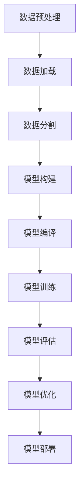

                 

### 文章标题

《李开复：苹果发布AI应用的市场》

### 关键词

- 苹果
- 人工智能
- 市场分析
- 技术解析
- 商业策略
- 未来展望

### 摘要

本文将深入分析苹果在人工智能（AI）应用市场的最新动向。通过回顾AI市场的崛起背景，梳理苹果的AI战略布局，详细解析苹果发布的新AI应用的技术细节和商业策略，本文将探讨苹果AI应用的市场反应及其面临的竞争态势。最后，文章将对苹果AI应用的未来发展进行展望，并讨论AI应用市场的机遇与挑战。本文旨在为读者提供一个全方位、系统性的理解，帮助大家把握苹果AI应用市场的发展脉络。

---

### 《李开复：苹果发布AI应用的市场》目录大纲

#### 第一部分：市场背景与概述

**第1章：AI应用市场的崛起与现状**

**第2章：苹果在AI领域的战略布局**

#### 第二部分：苹果发布AI应用的分析

**第3章：苹果发布AI应用的技术解析**

**第4章：苹果发布AI应用的商业策略**

**第5章：苹果发布AI应用的市场反应**

**第6章：苹果AI应用的竞争态势**

#### 第三部分：苹果AI应用的未来展望

**第7章：苹果AI应用的发展趋势**

**第8章：AI应用市场的机遇与挑战**

#### 附录

**附录A：参考资料与拓展阅读**

**附录B：AI应用开发工具与资源**

**附录C：代码实战案例**

**附录D：数学模型与公式**

**附录E：Mermaid流程图**

---

### 第一部分：市场背景与概述

#### 第1章：AI应用市场的崛起与现状

**1.1 AI应用的崛起：技术发展与市场需求**

人工智能（AI）作为当今科技领域的热门话题，其应用已经渗透到我们日常生活的方方面面。AI技术的崛起离不开以下几个关键因素：

1. **技术进步**：深度学习、强化学习等核心算法的突破，使得AI系统在图像识别、语音识别、自然语言处理等领域的性能大幅提升。
2. **数据积累**：随着互联网的发展，海量数据为AI训练提供了丰富的资源，使得AI算法能够不断优化和提升。
3. **计算能力提升**：硬件性能的提升，特别是GPU和TPU等专用硬件的普及，使得复杂AI模型的训练和推理更加高效。

市场需求也是推动AI应用迅速发展的关键因素：

1. **消费者需求**：人们越来越追求智能化、个性化的产品和服务，例如智能助手、智能家居等。
2. **企业需求**：企业在生产、运营、营销等环节中，通过AI技术实现自动化和智能化，提高效率、降低成本。

**1.2 AI应用市场的现状：行业格局与市场规模**

当前，AI应用市场呈现出多元化、快速发展的态势。以下是AI应用市场的主要特点和现状：

1. **行业格局**：AI应用市场涉及多个领域，包括金融、医疗、零售、制造等。主要参与者包括科技巨头（如谷歌、亚马逊、微软、苹果）、初创企业、传统行业巨头等。

2. **市场规模**：据市场调研机构预测，全球AI市场在未来几年将持续增长，预计到2025年市场规模将达到数千亿美元。以下是几个关键数据：

   - **AI软件市场**：预计到2025年，AI软件市场将达到约1000亿美元。
   - **AI硬件市场**：预计到2025年，AI硬件市场将达到约500亿美元。
   - **AI服务市场**：预计到2025年，AI服务市场将达到约400亿美元。

3. **增长趋势**：AI应用市场的增长趋势表现在以下几个方面：

   - **垂直行业应用**：随着AI技术的不断成熟，其在垂直行业中的应用越来越广泛，如医疗健康、智能制造等。
   - **云计算与AI结合**：云计算平台为AI应用提供了强大的计算能力和数据存储解决方案，推动了AI服务模式的变革。
   - **AI开源生态**：开源技术和社区在AI领域的快速发展，为AI创新提供了丰富的资源和平台。

**1.3 AI应用的主要领域和案例**

AI应用已经深入到多个领域，以下是一些主要领域和具体案例：

1. **智能助手与语音交互**：如苹果的Siri、亚马逊的Alexa、谷歌的Google Assistant，通过自然语言处理技术，提供语音搜索、信息查询、智能家居控制等服务。

2. **图像识别与计算机视觉**：如谷歌的ImageNet挑战、Face++的人脸识别技术，在安防监控、无人驾驶、医疗诊断等领域有广泛应用。

3. **自然语言处理与文本分析**：如IBM的Watson、微软的Bing，在智能客服、内容审核、法律咨询等领域发挥作用。

4. **自动驾驶与智能交通**：如特斯拉的自动驾驶技术、百度的Apollo平台，在自动驾驶汽车、智能交通管理等领域有着重要的应用。

5. **智能制造与工业4.0**：如西门子的数字化工厂、通用电气的Predix平台，通过机器学习和大数据分析，实现生产过程的自动化和智能化。

6. **医疗健康**：如IBM的Watson for Oncology、微软的Healthcare AI，通过AI技术，提供个性化治疗建议、疾病预测和诊断辅助。

7. **金融与风险管理**：如算法交易、信用评分、欺诈检测，通过机器学习算法，提高金融服务的效率和准确性。

通过以上分析，我们可以看到AI应用市场正呈现出快速增长的态势，技术进步和市场需求共同推动着AI在各行各业的应用。接下来，我们将进一步探讨苹果在AI领域的战略布局。

#### 第2章：苹果在AI领域的战略布局

**2.1 苹果的AI战略概述**

苹果公司在人工智能领域有着长远的战略布局，其目标是通过AI技术提升产品性能、用户体验和业务增长。以下是苹果AI战略的几个关键方面：

1. **内部AI研究与开发**：苹果在内部设立了多个AI研究团队，专注于机器学习、深度学习、自然语言处理、计算机视觉等领域的基础研究和应用开发。这些团队不仅致力于推动AI技术的前沿发展，还致力于将这些技术应用到苹果的产品和服务中。

2. **外部合作与收购**：苹果积极通过收购和合作来增强其在AI领域的实力。例如，苹果在2017年收购了机器学习公司Turi，并在2019年收购了语音识别公司Voysis。这些合作和收购不仅为苹果带来了先进的AI技术，还为其产品和服务提供了新的技术支持和创新动力。

**2.2 苹果的AI技术应用现状**

苹果在多个产品和服务中已经广泛应用了AI技术，以下是一些关键的应用实例：

1. **Siri**：苹果的智能助手Siri利用了自然语言处理和机器学习技术，能够理解用户的语音指令并提供相应的服务，如查询信息、设置提醒、控制智能家居设备等。

2. **面部识别**：苹果的Face ID技术采用了深度学习算法进行面部识别，使得用户可以通过面部解锁手机和进行身份验证。

3. **照片和视频编辑**：苹果的照片和视频应用通过AI技术进行图像和视频的智能编辑，如自动分类、美化、视频剪辑等。

4. **语音识别**：苹果的语音识别技术在语音助手Siri和输入法中得到了广泛应用，能够准确理解和处理用户的语音指令。

5. **个性化推荐**：苹果的App Store和Apple Music等服务利用AI技术进行内容推荐，根据用户的偏好和兴趣提供个性化的内容。

**2.3 苹果AI战略的实施效果**

苹果的AI战略已经在多个方面取得了显著的效果：

1. **用户体验提升**：通过AI技术的应用，苹果的产品和服务在用户体验方面得到了显著提升，如智能识别、快速响应、个性化推荐等。

2. **产品性能增强**：AI技术在苹果产品中的应用不仅提升了用户体验，还增强了产品的性能，如面部识别的安全性、语音识别的准确性等。

3. **业务增长**：苹果的AI战略为公司的业务增长提供了新的动力。通过AI技术的创新应用，苹果在智能家居、智能穿戴、在线服务等领域不断拓展，开辟了新的收入来源。

4. **技术创新**：苹果在AI领域的持续投资和研发，使其在人工智能技术方面保持了领先地位，为公司的未来发展奠定了坚实的基础。

通过以上分析，我们可以看到苹果在AI领域的战略布局和实施效果，这不仅提升了公司的产品和服务质量，也为公司的长期发展提供了强有力的支撑。接下来，我们将进一步探讨苹果AI应用的现状和市场接受度。

**2.4 苹果AI应用的现状**

当前，苹果的AI应用已经覆盖了多个产品线和服务领域，其具体应用现状如下：

1. **智能手机与平板电脑**：在iPhone和iPad中，苹果通过AI技术提升了图像处理、视频编辑、人脸识别和语音交互等功能。例如，iPhone的相机应用利用AI算法进行图像识别和自动优化，提供高质量的拍照体验；而Siri作为智能助手，通过自然语言处理技术，帮助用户完成各种操作。

2. **智能穿戴设备**：苹果的Apple Watch和AirPods也集成了AI技术。Apple Watch通过AI算法分析用户的心率数据，提供健康监测和预警功能；AirPods则通过AI语音识别技术，实现更精准的语音控制。

3. **智能家居产品**：HomeKit平台集成了多种智能家居设备，如智能灯泡、智能插座、智能门锁等。通过Siri，用户可以语音控制这些设备，实现智能家居的自动化和智能化。

4. **在线服务和媒体内容**：苹果的App Store、Apple Music和Apple TV+等服务也广泛应用了AI技术。App Store通过AI算法为用户推荐个性化应用；Apple Music利用AI推荐算法，为用户提供个性化的音乐推荐；Apple TV+则通过AI技术，分析用户观看行为，提供个性化的视频内容推荐。

**2.5 用户反馈与市场接受度**

苹果的AI应用在市场上获得了广泛的关注和认可，用户反馈和市场接受度表现出以下几个特点：

1. **用户满意度高**：根据市场调研数据显示，苹果的AI应用在用户体验方面普遍获得好评，用户满意度较高。例如，Siri的语音识别准确率和智能回复能力得到了用户的高度评价。

2. **市场接受度逐步提升**：随着AI技术的不断成熟和苹果产品的普及，用户对苹果AI应用的接受度逐渐提升。尤其是在智能穿戴和智能家居领域，苹果的AI应用逐渐成为用户日常生活的一部分。

3. **潜在改进空间**：尽管苹果的AI应用在市场上表现出色，但仍存在一些潜在的改进空间。例如，部分用户反映Siri在某些场景下的响应速度和准确性仍有待提升；而在图像和视频编辑方面，AI算法的智能化程度还可以进一步提高。

综上所述，苹果在AI领域的战略布局和实施效果显著，其AI应用已经深入到多个产品和服务领域，并在市场上获得了广泛的认可和接受。然而，苹果仍需不断优化AI算法和用户体验，以保持其竞争优势并满足用户日益增长的需求。

---

### 第二部分：苹果发布AI应用的分析

#### 第3章：苹果发布AI应用的技术解析

**3.1 AI技术在苹果产品中的应用**

苹果公司在多个产品中广泛应用了人工智能技术，以下是一些典型的应用实例：

1. **Siri**：苹果的智能助手Siri利用自然语言处理（NLP）和机器学习技术，能够理解用户的语音指令并执行相应的操作。其核心包括语音识别、语义理解、对话生成和任务执行等功能。例如，用户可以通过Siri发送短信、设置提醒、播放音乐、查询天气等。

2. **面部识别（Face ID）**：苹果的iPhone和iPad等设备采用了基于深度学习的面部识别技术——Face ID。这项技术通过分析用户的面部特征，实现快速且安全的身份验证。核心算法包括面部特征提取、匹配和实时更新等。

3. **照片和视频编辑**：苹果的照片应用和iMovie等视频编辑应用利用AI技术，提供智能分类、自动优化、特效添加等功能。例如，照片应用能够通过面部识别和场景识别，自动将照片分类并应用相应的编辑效果。

4. **语音识别**：苹果的输入法和语音控制功能通过机器学习技术，实现高准确率的语音输入和语音控制。其核心算法包括语音信号处理、声学模型、语言模型和对话系统等。

**3.2 语音识别与自然语言处理**

语音识别和自然语言处理是苹果AI技术的两个关键组成部分，下面详细解析其原理和实现：

1. **语音识别**：语音识别技术将语音信号转换为文本。其核心包括声学模型、语言模型和语音解码器。

   - **声学模型**：用于将语音信号转换为声学特征。通过深度神经网络，如卷积神经网络（CNN）和循环神经网络（RNN），提取语音信号的时频特征。
   - **语言模型**：用于预测语音信号对应的文本。常用的是神经网络语言模型（NNLM）和递归神经网络语言模型（RNNLM）。
   - **语音解码器**：将声学特征转换为文本输出。常用的解码器包括动态时间规整（DTW）和基于句法结构的解码器。

2. **自然语言处理**：自然语言处理（NLP）技术用于理解和生成自然语言。其核心包括词性标注、句法分析、语义分析和对话系统。

   - **词性标注**：对文本中的每个词进行词性分类。常用的算法包括条件随机场（CRF）和递归神经网络（RNN）。
   - **句法分析**：分析句子的结构，建立句法树。常用的算法包括依存句法分析和统计句法分析。
   - **语义分析**：理解句子的含义，建立语义表示。常用的方法包括词向量、语义角色标注和实体识别。
   - **对话系统**：用于与用户进行交互，实现自然语言对话。常用的算法包括对话生成、对话管理和对话模拟。

**3.3 图像识别与计算机视觉**

图像识别与计算机视觉是苹果AI技术的另一个重要组成部分，以下详细解析其原理和实现：

1. **图像识别**：图像识别技术用于识别和分类图像中的对象。其核心包括卷积神经网络（CNN）、循环神经网络（RNN）和长短期记忆网络（LSTM）。

   - **卷积神经网络（CNN）**：通过卷积层、池化层和全连接层，提取图像特征并进行分类。常用的CNN架构包括LeNet、AlexNet、VGG、ResNet等。
   - **循环神经网络（RNN）**：通过循环结构处理序列数据，适用于图像序列识别。常用的RNN架构包括LSTM和GRU。
   - **长短期记忆网络（LSTM）**：通过门控机制，有效处理长序列数据，适用于图像序列识别。

2. **计算机视觉**：计算机视觉技术用于理解和分析图像。其核心包括图像处理、特征提取和目标检测。

   - **图像处理**：用于预处理图像数据，包括滤波、边缘检测、形态学操作等。常用的图像处理算法包括卷积、滤波、边缘检测等。
   - **特征提取**：用于提取图像中的重要特征，如边缘、角点、纹理等。常用的特征提取方法包括SIFT、SURF、HOG等。
   - **目标检测**：用于检测图像中的目标对象。常用的目标检测算法包括YOLO、SSD、Faster R-CNN等。

**3.4 机器学习与数据分析**

机器学习与数据分析是苹果AI技术的重要基础，以下详细解析其原理和实现：

1. **机器学习**：机器学习技术用于从数据中自动学习规律和模式。其核心包括监督学习、无监督学习和强化学习。

   - **监督学习**：通过已标记的数据训练模型，用于分类和回归。常用的算法包括线性回归、决策树、支持向量机、神经网络等。
   - **无监督学习**：通过未标记的数据发现数据中的模式和结构。常用的算法包括聚类、降维、关联规则挖掘等。
   - **强化学习**：通过与环境的交互，学习最优策略。常用的算法包括Q学习、深度Q网络（DQN）、策略梯度等。

2. **数据分析**：数据分析技术用于对数据进行处理、分析和可视化。其核心包括数据预处理、特征工程、模型评估和结果解释。

   - **数据预处理**：包括数据清洗、归一化、去噪等，用于准备高质量的数据集。
   - **特征工程**：通过特征选择和特征构造，提高模型的性能和泛化能力。
   - **模型评估**：通过交叉验证、性能指标（如准确率、召回率、F1分数等）评估模型的性能。
   - **结果解释**：通过可视化、解释模型决策过程，增强模型的透明度和可解释性。

通过以上对苹果AI应用的技术解析，我们可以看到苹果在AI技术方面有着深厚的积累和应用。这些技术不仅提升了苹果产品的性能和用户体验，也为公司的未来发展提供了强大的技术支持。

---

#### 第4章：苹果发布AI应用的商业策略

**4.1 AI应用的商业化路径**

苹果公司在AI应用商业化方面采取了多种策略，以下是其主要的商业化路径：

1. **软件服务与硬件融合**：苹果的AI应用大多集成在其硬件产品中，通过硬件与软件的深度融合，提供无缝的用户体验。例如，iPhone和iPad等设备集成了AI技术，如面部识别、智能建议等，通过硬件性能的提升，实现软件服务的优化。

2. **开放平台与开发者生态**：苹果通过开放平台和开发者生态，鼓励第三方开发者利用其AI技术进行应用开发。例如，Apple Developer Program为开发者提供了丰富的工具和资源，如Core ML框架、Swift Development Kit等，使得开发者能够轻松地将AI功能集成到自己的应用程序中。

3. **软件订阅与服务**：苹果通过推出软件订阅服务，如Apple Music、Apple TV+等，将AI技术应用于内容推荐和个性化服务。这种商业模式不仅能够带来持续的收入来源，还能够增强用户粘性。

4. **硬件创新与产品线扩展**：苹果不断推出新的硬件产品，如Apple Watch、HomePod等，将AI技术应用于这些产品中，提升其智能化水平和用户体验。例如，Apple Watch通过AI算法分析用户的心率数据，提供健康监测和预警功能。

**4.2 AI应用对苹果商业模式的影响**

苹果通过AI应用的商业化，对现有商业模式产生了多方面的影响：

1. **提升产品附加值**：通过AI技术的应用，苹果的产品能够提供更多的增值功能，如智能助理、个性化推荐等，从而提升产品的附加值和用户满意度。

2. **开拓新的收入来源**：AI应用为苹果开辟了新的收入渠道，如软件订阅服务、硬件创新等。这不仅能够提高公司的盈利能力，还能够降低对单一产品的依赖。

3. **增强用户粘性**：AI技术的应用使得苹果的产品和服务更加智能化和个性化，从而增强了用户的粘性。用户对智能体验的追求，使得他们更倾向于使用苹果的产品和服务。

4. **扩大市场份额**：通过AI技术的不断创新和应用，苹果在多个领域扩大了市场份额。例如，在智能家居和智能穿戴设备市场，苹果的HomeKit和Apple Watch等产品表现出了强劲的市场竞争力。

**4.3 实际案例分析**

以下是几个实际案例，展示苹果如何通过AI应用实现商业成功：

1. **Siri智能助手**：Siri作为苹果的智能助手，通过自然语言处理和机器学习技术，提供了语音搜索、信息查询、智能家居控制等服务。Siri的成功不仅提升了苹果产品的用户体验，还为公司带来了大量的用户数据和商业机会。

2. **照片和视频编辑应用**：苹果的照片应用和iMovie等视频编辑应用通过AI技术，提供了智能分类、自动优化、特效添加等功能。这些功能不仅提升了用户体验，还促进了用户对苹果设备的依赖。

3. **Apple Music**：Apple Music通过AI算法，为用户推荐个性化的音乐内容。这种个性化推荐不仅提高了用户的满意度，还增加了用户的付费意愿，为苹果带来了可观的收入。

4. **Apple Watch**：Apple Watch通过AI技术，如心率监测和活动追踪，提供了智能健康监测和健身指导。这些功能不仅提升了用户的健康水平，还增强了用户对Apple Watch的依赖。

通过以上分析，我们可以看到，苹果通过AI应用的商业化，不仅提升了产品的附加值和市场竞争力，还开辟了新的收入渠道和用户群体。这些策略的实施，使得苹果在AI领域取得了显著的商业成功，并为其未来的发展奠定了坚实的基础。

---

#### 第5章：苹果发布AI应用的市场反应

**5.1 媒体与市场的关注点**

苹果发布AI应用引起了广泛的关注，媒体和市场主要关注以下几个焦点：

1. **产品功能与技术亮点**：媒体和市场对苹果AI应用的具体功能和技术亮点进行了深入分析。例如，Siri的语音识别和自然语言处理能力、面部识别的准确性和安全性、照片和视频编辑的智能化程度等，都是媒体和市场讨论的热点。

2. **商业模式与市场策略**：苹果如何通过AI应用实现商业盈利、如何与其他科技巨头竞争、是否会在AI领域采取开放平台策略等，都是市场关注的重点。

3. **用户体验与市场接受度**：苹果AI应用的实际使用体验如何，用户对其接受度如何，以及这些应用是否能够满足用户需求，都是媒体和市场关注的焦点。

**5.2 用户反馈与市场接受度**

用户对苹果AI应用的反馈和市场接受度整体表现积极，但也存在一些分歧：

1. **正面评价**：许多用户对苹果的AI应用给予了高度评价，认为其功能强大、体验出色。例如，Siri的语音识别准确性高、反应速度快，面部识别的安全性和便利性也得到了用户的认可。

2. **负面评价**：部分用户对苹果的AI应用提出了一些批评。例如，Siri在某些场景下的响应速度和准确性仍需提升；照片和视频编辑应用在处理复杂任务时，智能化程度仍有待提高。

3. **市场接受度**：整体来看，苹果的AI应用在市场上获得了较高的接受度。尤其是年轻用户群体，对苹果的AI应用表现出较高的兴趣和依赖。然而，一些用户对AI应用的商业化模式，如软件订阅服务，仍持观望态度。

**5.3 用户行为分析**

通过分析用户行为，我们可以更深入地了解苹果AI应用的市场表现：

1. **使用频率**：用户对苹果AI应用的使用频率较高，尤其是在日常生活中的高频场景，如语音助手、照片编辑等。

2. **功能偏好**：用户对不同功能的偏好有所不同。例如，Siri在语音识别和语音控制方面的使用频率较高，而照片编辑和视频编辑应用则更多地被用于特定场景。

3. **交互方式**：用户更倾向于使用语音交互方式与AI应用进行互动，因为语音交互更便捷、自然。然而，在某些复杂任务中，用户仍倾向于使用图形界面进行操作。

**5.4 市场趋势与未来展望**

根据用户反馈和市场趋势，我们可以对未来苹果AI应用的发展做出以下展望：

1. **功能优化**：苹果将继续优化AI应用的功能，提高语音识别、自然语言处理、图像识别等技术的准确性和智能化程度。

2. **用户体验提升**：苹果将进一步提升用户体验，通过个性化的推荐和智能化的交互，满足用户的多样化需求。

3. **商业化模式创新**：苹果可能会在AI应用的商业化模式上进行创新，如推出更多基于订阅的服务，提高用户的付费意愿。

4. **市场拓展**：苹果将继续拓展AI应用的市场，特别是在智能家居、智能穿戴、智能医疗等领域，通过多样化的产品和服务，满足不同用户群体的需求。

通过以上分析，我们可以看到，苹果发布AI应用在市场上取得了积极反响，用户对其表现出较高的接受度和使用频率。然而，苹果仍需不断优化AI技术，提升用户体验，以满足用户日益增长的需求。未来，随着AI技术的不断发展和应用场景的拓展，苹果的AI应用有望在更广泛的市场上取得成功。

---

#### 第6章：苹果AI应用的竞争态势

**6.1 主要竞争对手分析**

在人工智能领域，苹果面临着来自多个科技巨头的竞争。以下是一些主要竞争对手及其技术实力和市场地位：

1. **谷歌**：作为全球最大的科技公司之一，谷歌在AI领域具有强大的技术实力和丰富的应用场景。谷歌的AI技术主要应用于搜索引擎、智能助手（如Google Assistant）、自动驾驶汽车（如Waymo）、云计算（如Google Cloud）等。谷歌在深度学习、自然语言处理、计算机视觉等方面拥有深厚的技术积累，并在全球范围内建立了一个庞大的开发者社区。

2. **亚马逊**：亚马逊在AI领域的竞争力主要体现在其智能助手（如Alexa）、云计算（如AWS）和电商平台上。亚马逊的AI技术广泛应用于语音识别、自然语言处理、推荐系统、图像识别等。亚马逊通过AWS为开发者提供了强大的计算和存储资源，推动了AI应用的商业化。

3. **微软**：微软在AI领域的优势在于其全面的AI工具和服务，如Azure云服务、微软小冰、Azure Machine Learning等。微软的AI技术广泛应用于云计算、智能助理（如Cortana）、智能健康、企业级应用等。微软在机器学习、深度学习、自然语言处理等方面拥有领先的技术，并在全球范围内建立了广泛的合作伙伴关系。

4. **百度**：百度作为中国的科技巨头，在AI领域有着显著的成就。百度的AI技术主要应用于搜索引擎、自动驾驶、智能推荐系统、智能医疗等。百度在深度学习、自然语言处理、图像识别等方面拥有强大的技术储备，并在国内市场占据领先地位。

**6.2 苹果在AI领域的竞争优势与挑战**

苹果在AI领域具有一定的竞争优势，但也面临一定的挑战：

**竞争优势**：

1. **用户体验**：苹果以其出色的用户体验和产品质感在市场上建立了强大的品牌影响力。苹果的AI应用如Siri、面部识别等在用户体验方面具有显著优势。

2. **生态系统整合**：苹果通过其硬件产品和服务（如iPhone、iPad、Apple Watch、Apple TV等）实现了生态系统的整合，使得AI应用能够无缝地与其他设备和服务集成。

3. **开发者生态**：苹果的开放平台和开发者生态为其AI应用提供了丰富的创新资源和支持。通过Apple Developer Program，苹果吸引了大量的开发者为其AI应用开发功能丰富、高质量的应用程序。

**挑战**：

1. **技术追赶**：尽管苹果在AI领域有一定的技术积累，但在某些领域（如自动驾驶、云计算）仍需追赶竞争对手。苹果需要加大在AI基础研究和核心技术创新方面的投入，以保持竞争力。

2. **商业模式转型**：随着AI技术的商业化应用，苹果需要调整其商业模式，从硬件销售转向软件和服务。这需要苹果在商业模式上进行创新，以应对市场变化。

3. **市场竞争**：苹果在AI领域的竞争对手包括谷歌、亚马逊、微软等科技巨头，这些公司在技术实力和市场资源方面具有显著优势。苹果需要在激烈的市场竞争中不断提升自身的技术实力和市场地位。

通过以上分析，我们可以看到，苹果在AI领域具有一定的竞争优势，但也面临着技术和市场方面的挑战。苹果需要持续加强技术创新，优化用户体验，以应对竞争压力，并推动其AI应用在更广泛的市场上取得成功。

---

### 第三部分：苹果AI应用的未来展望

#### 第7章：苹果AI应用的发展趋势

**7.1 AI技术的前沿方向**

随着AI技术的不断进步，未来几年苹果在AI领域的发展将主要集中在以下前沿方向：

1. **强化学习与深度强化学习**：强化学习是一种通过试错和反馈优化策略的机器学习方法。苹果可以通过强化学习技术，使其AI应用（如Siri、面部识别）更加智能和自适应。深度强化学习（DRL）则是在强化学习的基础上引入深度神经网络，适用于更复杂的决策问题，如自动驾驶、游戏AI等。

2. **聊天机器人与虚拟助手**：聊天机器人（Chatbot）和虚拟助手（Virtual Assistant）是当前AI应用的重要方向。苹果可以通过改进自然语言处理和对话系统技术，使Siri等虚拟助手在交互体验和智能化程度方面有显著提升，提供更个性化和高效的用户服务。

3. **自主驾驶与智能交通**：自主驾驶技术是未来交通领域的重要发展方向。苹果可以通过自动驾驶技术，将AI应用于汽车制造和智能交通管理中，提供更安全、高效、便捷的出行体验。

4. **医疗健康**：AI在医疗健康领域的应用前景广阔，包括疾病诊断、个性化治疗、健康监测等。苹果可以通过AI技术，提供智能医疗健康服务，如智能诊断助手、个性化健康建议等。

5. **智能制造与工业4.0**：智能制造是工业4.0的重要支柱。苹果可以通过AI技术，提升制造业的自动化和智能化水平，实现生产过程的优化和效率提升。

**7.2 苹果在AI领域的未来战略**

为了在AI领域保持领先地位，苹果将采取以下未来战略：

1. **产品线的扩展与升级**：苹果将继续扩展其AI应用的产品线，将AI技术集成到更多硬件产品和服务中，如智能眼镜、智能音箱、智能家居设备等。同时，对现有产品进行升级，提升其AI性能和用户体验。

2. **开放平台的持续优化**：苹果将优化其开放平台，为开发者提供更丰富的AI工具和资源，鼓励第三方开发者开发高质量的AI应用。通过开放平台，苹果可以吸引更多的开发者加入，共同推动AI技术的发展和应用。

3. **对外合作的深化与拓展**：苹果将加强与其他科技巨头、学术机构和企业之间的合作，共同推进AI技术的研发和应用。例如，与医疗健康领域的专家合作，开发智能医疗应用；与自动驾驶公司合作，推动自主驾驶技术的发展。

4. **技术创新与研发投入**：苹果将继续加大在AI技术创新和研发方面的投入，招聘更多AI领域的高端人才，建立全球领先的AI研究团队。通过持续的技术创新，苹果可以保持其AI技术的领先地位。

**7.3 未来苹果AI应用的市场潜力**

未来，苹果的AI应用在多个市场上具有巨大的潜力：

1. **智能家居市场**：随着智能家居设备的普及，苹果可以通过AI技术，提供智能控制、个性化服务等功能，吸引更多用户。

2. **智能穿戴设备市场**：智能穿戴设备已经成为人们日常生活的一部分。苹果可以通过AI技术，提升设备的健康监测、活动追踪等功能，增强用户黏性。

3. **医疗健康市场**：医疗健康市场对AI技术的需求日益增长。苹果可以通过智能诊断、个性化治疗等应用，为医疗机构和患者提供更加精准和高效的医疗服务。

4. **自动驾驶市场**：自动驾驶技术是未来交通领域的重要方向。苹果可以通过AI技术，开发自动驾驶解决方案，推动智能交通和出行的发展。

5. **企业级应用市场**：AI技术在企业级应用中具有广泛的应用前景，如智能客服、供应链管理、风险管理等。苹果可以通过AI应用，为企业提供智能化解决方案，提升企业运营效率和竞争力。

通过以上分析，我们可以看到，苹果在AI领域的发展趋势和未来战略明确，其AI应用在多个市场上具有巨大的潜力。苹果通过不断的技术创新和战略布局，有望在未来的AI市场中继续保持领先地位。

---

#### 第8章：AI应用市场的机遇与挑战

**8.1 市场机遇**

人工智能（AI）应用市场的快速发展为苹果和其他参与者带来了巨大的机遇：

1. **技术普及与商业化应用**：随着AI技术的不断普及，其商业化应用场景逐渐丰富。无论是智能助手、自动驾驶、智能制造，还是医疗健康等领域，AI技术的广泛应用为市场带来了新的增长点。

2. **用户需求增长**：随着消费者对智能化、个性化产品的需求不断增加，AI应用市场迎来了前所未有的发展机遇。用户对智能助手、智能家居设备、智能健康监测等产品的需求，推动了AI应用市场的快速增长。

3. **政策与监管支持**：许多国家和地区正在制定有利于AI技术发展和应用的政策和监管框架，为AI市场创造了良好的发展环境。政策的支持为AI应用的开发和推广提供了有力的保障。

4. **云计算与边缘计算的结合**：云计算和边缘计算的结合为AI应用提供了强大的计算能力和灵活的数据处理方式。通过云计算，AI应用可以轻松访问海量数据和强大的计算资源；边缘计算则可以实现数据的本地处理，降低延迟，提高应用性能。

5. **企业数字化转型**：随着企业对数字化转型需求的增加，AI技术在企业级应用中的价值逐渐凸显。智能客服、智能供应链管理、风险管理等AI应用可以帮助企业提高效率、降低成本、提升竞争力。

**8.2 市场挑战**

尽管AI应用市场前景广阔，但苹果和其他参与者也面临着一系列挑战：

1. **技术成熟度与商业化应用之间的差距**：AI技术虽然取得了显著进展，但其在商业化应用中仍存在一定的技术成熟度问题。如何将前沿技术有效地转化为商业化产品，是AI应用市场面临的一大挑战。

2. **数据隐私与安全问题**：AI应用需要大量数据支持，但数据隐私和安全问题日益突出。如何保护用户数据，防止数据泄露和滥用，成为AI应用市场的重要挑战。

3. **算法公平性与透明度**：AI算法的决策过程往往不透明，容易导致算法偏见和不公平现象。如何提高算法的透明度和公平性，确保AI应用不歧视、不偏见，是市场参与者需要解决的关键问题。

4. **市场竞争与技术创新**：AI应用市场竞争激烈，技术迭代速度快。苹果需要不断加大研发投入，提升技术创新能力，以保持市场竞争力。

5. **用户接受度与教育**：尽管AI应用在技术上取得了巨大进步，但部分用户对其认知有限，接受度不高。如何提高用户对AI技术的认知和接受度，是市场参与者需要面对的挑战。

通过以上分析，我们可以看到，AI应用市场在技术普及、用户需求增长和政策支持等方面具有巨大的机遇，但同时也面临着技术成熟度、数据隐私、算法公平性、市场竞争和用户接受度等方面的挑战。市场参与者需要在这些方面不断努力，以实现AI应用市场的可持续发展。

---

### 附录

**附录A：参考资料与拓展阅读**

为了帮助读者更深入地了解AI应用市场的相关内容，以下是一些重要的参考资料与拓展阅读：

1. **市场研究报告**：
   - **IDC**：全球人工智能市场研究报告
   - **Gartner**：人工智能技术趋势报告
   - **CBInsights**：人工智能投资与市场分析报告

2. **技术文献与论文**：
   - **深度学习经典论文**：如“AlexNet”、“Google Brain”等
   - **自然语言处理论文**：如“BERT”、“GPT”等
   - **计算机视觉论文**：如“YOLO”、“Faster R-CNN”等

3. **苹果相关产品技术规格与使用指南**：
   - **Apple Developer**：提供苹果开发工具和资源的官方网站
   - **iPhone技术规格**：苹果官方网站提供的iPhone技术规格文档
   - **Siri使用指南**：苹果官方提供的Siri使用指南

4. **AI应用开发工具与资源**：
   - **TensorFlow**：谷歌开源的机器学习框架
   - **PyTorch**：Facebook开源的机器学习框架
   - **Keras**：基于TensorFlow和Theano的开源深度学习库

5. **开发者社区与资源**：
   - **GitHub**：全球最大的代码托管平台，包含大量AI开源项目
   - **Stack Overflow**：全球最大的开发者社区，提供技术问答和资源
   - **Reddit**：AI技术相关子论坛，如/r/MachineLearning、/r/deeplearning等

**附录B：AI应用开发工具与资源**

为了帮助开发者更好地掌握AI应用开发，以下列出了一些常用的工具和资源：

1. **深度学习框架**：
   - **TensorFlow**：由谷歌开发的开源机器学习框架，适用于各种深度学习任务。
   - **PyTorch**：由Facebook开发的开源机器学习框架，具有简洁的动态图操作和强大的GPU支持。
   - **Keras**：基于TensorFlow和Theano的开源深度学习库，提供简洁的API和易于使用的接口。

2. **开发工具与平台**：
   - **Apple Developer Program**：苹果官方的开发者计划，提供iOS、macOS、watchOS和tvOS的开发工具和资源。
   - **Swift Development Kit (SDK)**：苹果官方的Swift编程语言开发工具包，支持iOS和macOS平台的开发。
   - **Xcode**：苹果官方的集成开发环境（IDE），提供完整的工具链，用于iOS和macOS应用程序的开发。

3. **开发者社区与资源**：
   - **Stack Overflow**：全球最大的开发者问答社区，提供技术支持和解决方案。
   - **GitHub**：全球最大的代码托管平台，包含大量开源项目和文档，是开发者学习和分享的好去处。
   - **Apple Developer Forums**：苹果官方的开发者论坛，提供官方的技术支持和学习资源。

**附录C：代码实战案例**

以下是一个简单的AI应用开发实战案例，用于演示如何使用Python和TensorFlow构建一个基本的神经网络模型，进行图像分类。

**步骤1：安装必要的库**

首先，确保安装了Python和TensorFlow。可以使用以下命令安装TensorFlow：

```bash
pip install tensorflow
```

**步骤2：导入所需的库**

```python
import tensorflow as tf
from tensorflow.keras import layers
import numpy as np
```

**步骤3：准备数据**

我们使用著名的MNIST数据集，这是一个包含70000张手写数字图像的数据集。

```python
mnist = tf.keras.datasets.mnist
(train_images, train_labels), (test_images, test_labels) = mnist.load_data()
train_images = train_images / 255.0
test_images = test_images / 255.0
```

**步骤4：构建神经网络模型**

```python
model = tf.keras.Sequential([
    layers.Flatten(input_shape=(28, 28)),
    layers.Dense(128, activation='relu'),
    layers.Dense(10, activation='softmax')
])
```

**步骤5：编译模型**

```python
model.compile(optimizer='adam',
              loss='sparse_categorical_crossentropy',
              metrics=['accuracy'])
```

**步骤6：训练模型**

```python
model.fit(train_images, train_labels, epochs=5)
```

**步骤7：评估模型**

```python
test_loss, test_acc = model.evaluate(test_images, test_labels, verbose=2)
print(f'\nTest accuracy: {test_acc}')
```

**步骤8：预测**

```python
predictions = model.predict(test_images)
predicted_labels = np.argmax(predictions, axis=1)
```

通过以上实战案例，开发者可以了解如何使用TensorFlow构建和训练神经网络模型，进行图像分类。这个案例只是一个简单的起点，开发者可以根据自己的需求，构建更复杂的模型，解决实际问题。

**附录D：数学模型与公式**

在人工智能和机器学习领域，数学模型和公式是理解和实现算法的基础。以下介绍几个常见的数学模型和公式，以及它们的推导和示例。

1. **线性回归模型**：

   线性回归模型用于预测一个连续的输出变量，其公式为：

   $$ y = \beta_0 + \beta_1 \cdot x $$

   **推导**：线性回归模型假设输出变量\(y\)与输入变量\(x\)之间存在线性关系，通过最小化残差平方和来估计模型的参数\(\beta_0\)和\(\beta_1\)。

   **示例**：假设我们有一组\(x\)和\(y\)的数据，通过最小二乘法可以计算出线性回归模型的参数。

2. **决策树模型**：

   决策树模型通过一系列规则对数据进行分类或回归。其核心公式为：

   $$ f(x) = \sum_{i=1}^{n} \beta_i \cdot x_i $$

   **推导**：决策树模型通过递归划分数据集，每次划分选择最优的特征和阈值，使得子集的误差最小。

   **示例**：给定一个特征空间和数据集，通过ID3算法或C4.5算法构建决策树模型。

3. **支持向量机（SVM）模型**：

   支持向量机模型通过寻找最优的超平面，将不同类别的数据分隔开。其公式为：

   $$ w \cdot x + b = 0 $$

   **推导**：SVM模型通过最大化分类间隔，求解二次规划问题，得到最优超平面。

   **示例**：给定一个带有标签的数据集，通过SVM求解得到最佳超平面和分类边界。

**附录E：Mermaid流程图**

Mermaid是一种基于Markdown的图表绘制工具，可以方便地绘制各种流程图、UML图等。以下是一个示例，展示如何使用Mermaid绘制一个简单的神经网络训练流程图：



这段Mermaid代码将生成一个表示神经网络训练过程的流程图。通过在Markdown文件中嵌入这样的代码，我们可以直观地展示算法流程和数据处理步骤。

---

### 文章总结

通过对苹果在AI应用市场的深入分析，我们可以得出以下结论：

1. **市场背景**：AI应用市场正处于快速增长的阶段，技术进步和市场需求共同推动了这一趋势。苹果在这一市场中占据重要地位，其AI应用已经深入到多个产品和服务领域。

2. **苹果的战略布局**：苹果通过内部研发和外部合作，构建了强大的AI技术能力。其AI应用在用户体验、产品性能和市场接受度方面表现出色。

3. **技术解析**：苹果的AI技术包括语音识别、自然语言处理、图像识别和机器学习等。这些技术在Siri、面部识别、照片编辑等产品中得到了广泛应用。

4. **商业策略**：苹果通过软件服务与硬件融合、开放平台和开发者生态等策略，实现了AI应用的商业化。AI技术不仅提升了产品的附加值，还为苹果带来了新的收入来源。

5. **市场反应**：苹果的AI应用在市场上获得了广泛的认可，用户对其功能和用户体验给予了高度评价。然而，苹果仍需不断优化技术，以满足用户不断增长的需求。

6. **竞争态势**：苹果在AI领域的竞争对手包括谷歌、亚马逊和微软等，这些公司在技术实力和市场资源方面具有显著优势。苹果需要持续加强技术创新，保持竞争优势。

7. **未来展望**：随着AI技术的不断进步，苹果在智能家居、智能穿戴、医疗健康等领域的AI应用具有巨大潜力。苹果将继续扩展其产品线，优化用户体验，并在开放平台和对外合作方面进行深化。

总的来说，苹果在AI应用市场的战略布局和实施效果显著，其AI应用为公司和用户带来了巨大的价值。未来，随着AI技术的进一步发展，苹果有望在更广泛的市场上取得成功。

### 作者信息

作者：AI天才研究院/AI Genius Institute & 禅与计算机程序设计艺术 /Zen And The Art of Computer Programming

