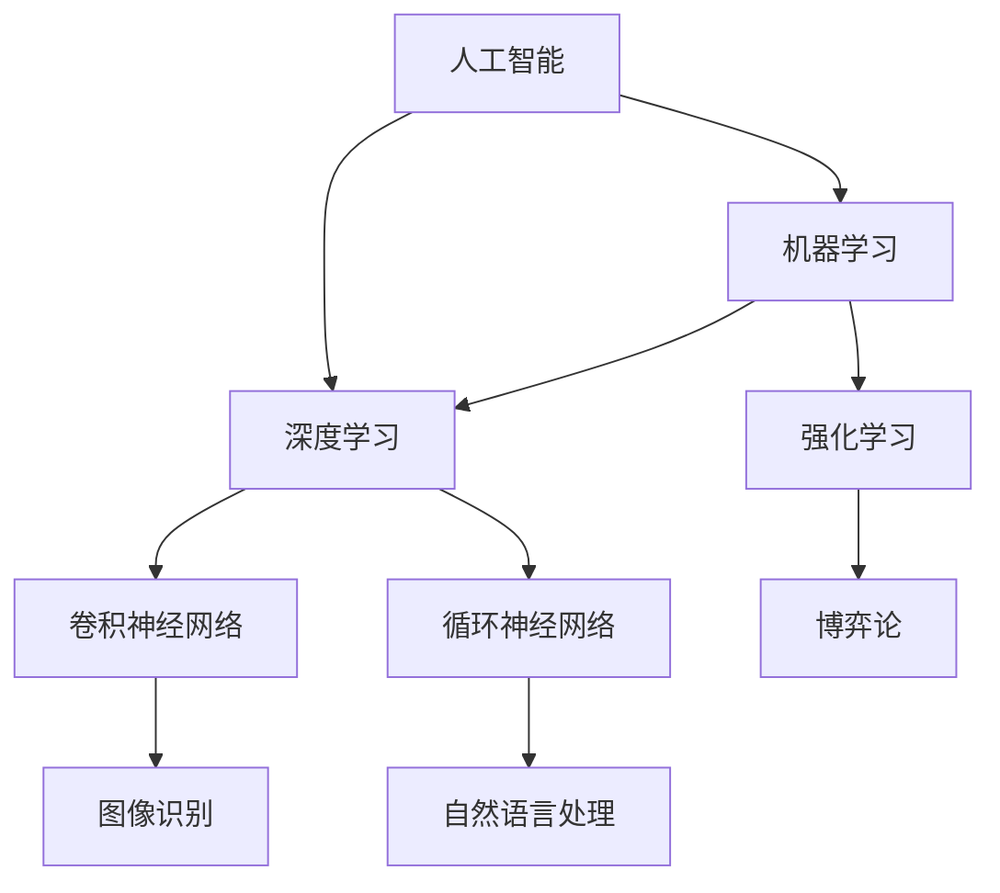

                 

### 文章标题：李开复：苹果发布AI应用的意义

> 关键词：人工智能，苹果，AI应用，技术背景，案例分析，未来趋势，社会影响

> 摘要：本文将深入探讨苹果公司发布AI应用的重要意义。从人工智能的发展历程、苹果在人工智能领域的布局，到AI技术在苹果产品中的应用，再到AI应用案例的分析，以及苹果AI应用的未来发展趋势和社会影响，作者李开复将通过逻辑清晰、结构紧凑、简单易懂的专业技术语言，带领读者全面了解苹果AI应用的重要性及其带来的深远影响。

### 第一部分：AI应用概述

#### 第1章：人工智能与苹果

在当今科技飞速发展的时代，人工智能（AI）已经成为改变世界的重要力量。苹果公司，作为全球科技产业的领军企业，自然也在这个领域展开了一系列布局和探索。本章将首先回顾人工智能的发展历程，然后探讨苹果在人工智能领域的布局，以及AI技术在苹果产品中的应用和优势与挑战。

## 1.1 人工智能的演变历程

### 1.1.1 人工智能的发展历程

人工智能（Artificial Intelligence，简称AI）是指通过计算机模拟人类智能的技术，实现机器对自然语言的理解、学习、推理和自我修正。人工智能的发展可以分为三个阶段：

1. **早期探索阶段（1956-1969年）**：1956年，达特茅斯会议正式确立了人工智能的概念，标志着人工智能学科的诞生。在这个阶段，研究人员主要集中在符号主义和逻辑推理上，例如建立专家系统和推理机。

2. **繁荣与衰落阶段（1970-1980年）**：随着计算机技术的发展，人工智能在多个领域取得了显著成果，如机器人、自然语言处理等。然而，由于实际应用中的局限性，人工智能在1980年代进入了第一次寒冬期。

3. **复兴与发展阶段（1980年代至今）**：随着计算机性能的提升、大数据和云计算的普及，人工智能迎来了新一轮的快速发展。特别是深度学习和神经网络技术的突破，使得人工智能在图像识别、语音识别、自然语言处理等方面取得了巨大进展。

### 1.1.2 人工智能的应用现状

目前，人工智能在各个行业都取得了显著的成果：

- **图像识别**：自动驾驶汽车、人脸识别门禁系统、医疗影像诊断等。
- **语音识别**：智能助手（如Siri、Alexa）、语音翻译、语音交互等。
- **自然语言处理**：智能客服、机器翻译、情感分析等。
- **机器学习**：金融风控、智能推荐、智能家居等。

### 1.1.3 人工智能的未来趋势

随着技术的不断进步，人工智能的未来发展趋势体现在以下几个方面：

- **深度学习与神经网络**：深度学习在图像识别、语音识别等领域的表现已经超越人类，未来将进一步推动人工智能的发展。
- **边缘计算与物联网**：物联网设备的普及使得边缘计算成为可能，人工智能将在更多设备上实现实时处理和智能交互。
- **自主决策与智能控制**：通过深度学习和强化学习，人工智能将实现更加智能的决策和控制。
- **人机融合与智慧生活**：人工智能将更加深入地融入人们的日常生活，提高生活质量和工作效率。

## 1.2 苹果与人工智能

### 1.2.1 苹果在人工智能领域的布局

苹果公司一直在人工智能领域进行布局，其重点体现在以下几个方面：

- **内部研发**：苹果公司拥有大量的AI研究人员和专家，致力于在语音识别、自然语言处理、图像识别等领域的突破。
- **收购与投资**：苹果公司通过收购和投资，获得了多项人工智能技术和团队，如Turi、VocalIQ、RealFace等。
- **硬件支持**：苹果的A系列芯片为人工智能算法提供了强大的计算能力，使得苹果产品在AI应用中具有优势。

### 1.2.2 苹果人工智能产品的发展

苹果公司已经推出了多款具有人工智能功能的产品，如Siri智能助手、FaceTime视频通讯、Apple Watch健康监测等。这些产品在语音识别、图像识别、自然语言处理等方面取得了显著成果，提高了用户体验。

### 1.2.3 苹果人工智能产品的优势与挑战

苹果人工智能产品的优势主要体现在以下几个方面：

- **强大的硬件支持**：A系列芯片为人工智能算法提供了强大的计算能力，使得苹果产品在AI应用中具有优势。
- **用户体验**：苹果产品在设计上注重用户体验，使得AI功能更加贴近用户需求。
- **隐私保护**：苹果公司一直强调隐私保护，使得用户在使用AI产品时更加放心。

然而，苹果人工智能产品也面临一些挑战：

- **数据隐私**：在数据收集和使用方面，苹果需要更加透明，以应对用户对隐私保护的担忧。
- **技术创新**：随着其他科技公司的竞争，苹果需要不断推进技术创新，以保持竞争优势。

### 第二部分：苹果发布AI应用的意义

#### 第2章：苹果发布AI应用的技术背景

苹果公司发布AI应用的背后，是AI技术在苹果产品中的广泛应用。本章将详细介绍AI技术在苹果产品中的应用，分析苹果发布AI应用的影响，以及这些应用对用户、行业和人工智能发展的意义。

## 2.1 AI技术在苹果产品中的应用

### 2.1.1 语音识别与自然语言处理

语音识别和自然语言处理是AI技术在苹果产品中应用最为广泛的领域之一。苹果的Siri智能助手通过语音识别技术，能够理解和执行用户的语音指令，如发送短信、设置提醒、播放音乐等。自然语言处理技术使得Siri能够理解复杂语义和语境，提高交互的智能化程度。

### 2.1.2 计算机视觉与图像识别

计算机视觉和图像识别技术在苹果产品中也有广泛应用。例如，iPhone的Face ID功能通过面部识别技术实现用户身份验证。此外，苹果的相机应用程序利用图像识别技术，可以自动分类照片、识别人脸等。

### 2.1.3 机器学习与深度学习

机器学习和深度学习技术在苹果产品中的应用也越来越广泛。苹果的A系列芯片内置了神经网络引擎，能够支持机器学习和深度学习算法的运行。例如，Apple Watch的健康监测功能通过机器学习算法分析用户的心率数据，提供健康建议。

## 2.2 苹果发布AI应用的影响

### 2.2.1 对用户的影响

苹果发布AI应用对用户的影响主要体现在以下几个方面：

- **提高生活质量**：AI应用使得用户的生活更加便捷，如语音助手可以帮用户完成日常任务，健康监测功能可以帮助用户关注健康。
- **个性化体验**：AI应用可以根据用户的习惯和需求，提供个性化的服务，如智能推荐、智能提醒等。
- **隐私保护**：苹果公司一直强调隐私保护，使得用户在使用AI产品时更加放心。

### 2.2.2 对行业的影响

苹果发布AI应用对行业的影响主要体现在以下几个方面：

- **推动技术创新**：苹果在AI领域的技术积累和投入，推动了整个行业的技术创新和发展。
- **重塑竞争格局**：AI技术的应用使得苹果在智能手机、智能手表等领域的竞争力得到提升，也对其他科技公司形成了挑战。

### 2.2.3 对人工智能发展的影响

苹果发布AI应用对人工智能发展的意义在于：

- **应用驱动创新**：苹果将AI技术应用到产品中，推动了AI技术在实际场景中的应用和优化，促进了AI技术的发展。
- **行业标准制定**：苹果公司在AI领域的探索和实践，为人工智能行业的发展提供了参考和借鉴，有助于制定相关标准。

### 第三部分：AI应用案例分析

#### 第3章：苹果AI应用的案例分析

在苹果发布的众多AI应用中，Siri、Apple Watch和FaceTime是典型的代表。本章将详细介绍这三个AI应用的案例分析，包括其工作原理、应用场景、优缺点分析。

## 3.1 Siri与语音助手

### 3.1.1 Siri的工作原理

Siri是苹果公司开发的语音助手，通过语音识别和自然语言处理技术，实现与用户的语音交互。Siri的工作原理可以分为以下几个步骤：

1. **语音识别**：Siri首先使用语音识别技术将用户的语音转化为文本。
2. **自然语言处理**：Siri对识别出的文本进行处理，理解用户的意图和需求。
3. **任务执行**：根据用户的需求，Siri会调用相应的应用程序或执行特定的操作，如发送短信、拨打电话、设置提醒等。
4. **反馈**：Siri将执行结果反馈给用户，如朗读短信内容、显示提醒等。

### 3.1.2 Siri的应用场景

Siri的应用场景非常广泛，包括以下几个方面：

- **日常生活**：Siri可以帮助用户完成日常任务，如发送短信、拨打电话、设置提醒等。
- **智能家居**：Siri可以与智能家居设备进行交互，如控制灯光、调节温度等。
- **出行导航**：Siri可以提供出行导航服务，帮助用户规划路线、查找附近商家等。

### 3.1.3 Siri的优缺点分析

Siri的优缺点如下：

- **优点**：Siri具有强大的语音识别和自然语言处理能力，可以提供便捷的语音交互体验。同时，Siri与苹果生态系统的紧密集成，使得用户可以方便地使用其他苹果产品和服务。
- **缺点**：Siri在理解复杂语义和语境方面仍有待提高，有时候会出现理解错误。此外，Siri的隐私保护问题也备受关注。

## 3.2 Apple Watch与健康监测

### 3.2.1 Apple Watch的健康监测功能

Apple Watch是苹果公司推出的智能手表，具有丰富的健康监测功能，如心率监测、睡眠监测、运动监测等。Apple Watch的健康监测功能主要依赖于内置的传感器和机器学习算法。

### 3.2.2 Apple Watch的数据分析与应用

Apple Watch收集到的健康数据通过机器学习算法进行分析，为用户提供健康建议和预警。例如，Apple Watch可以检测到用户的心率异常，并提醒用户进行健康检查。

### 3.2.3 Apple Watch的优缺点分析

Apple Watch的优缺点如下：

- **优点**：Apple Watch的健康监测功能可以帮助用户关注自己的健康，预防潜在的健康问题。同时，Apple Watch与iPhone的紧密集成，使得用户可以方便地同步和管理健康数据。
- **缺点**：Apple Watch的续航时间有限，需要定期充电。此外，健康监测数据的准确性也受到一定限制，需要结合其他医疗设备进行综合评估。

## 3.3 FaceTime与视频通讯

### 3.3.1 FaceTime的工作原理

FaceTime是苹果公司开发的视频通讯应用程序，支持用户通过互联网进行实时视频通话。FaceTime的工作原理主要包括以下几个步骤：

1. **音频和视频采集**：用户开启FaceTime后，摄像头和麦克风开始采集音频和视频信号。
2. **数据压缩与传输**：采集到的音频和视频信号经过压缩处理后，通过互联网传输到对方设备。
3. **音频和视频解码与播放**：对方设备接收到音频和视频信号后，进行解码处理，并播放给用户。

### 3.3.2 FaceTime的应用场景

FaceTime的应用场景非常广泛，包括以下几个方面：

- **家庭沟通**：FaceTime可以帮助家庭成员进行远程视频通话，增进感情交流。
- **商务沟通**：FaceTime可以用于商务会议和远程面试，提高沟通效率。
- **教育学习**：FaceTime可以用于远程教育，实现教师和学生之间的实时互动。

### 3.3.3 FaceTime的优缺点分析

FaceTime的优缺点如下：

- **优点**：FaceTime具有高清的视频通话效果，支持多人通话，可以方便地进行远程沟通。同时，FaceTime与苹果生态系统的紧密集成，使得用户可以方便地使用其他苹果产品和服务。
- **缺点**：FaceTime仅支持苹果设备之间的通讯，无法与安卓等非苹果设备进行视频通话。此外，FaceTime的隐私保护问题也备受关注。

### 第四部分：AI应用的未来发展趋势

#### 第4章：苹果AI应用的未来发展趋势

随着人工智能技术的不断进步，苹果公司在AI领域的应用也将迎来新的发展机遇。本章将探讨苹果AI应用的未来发展趋势，包括AI技术在苹果产品中的未来应用、AI应用的未来趋势，以及AI与物联网、边缘计算、隐私保护等领域的结合。

## 4.1 AI技术在苹果产品中的未来应用

### 4.1.1 AI在智能家居中的应用

随着智能家居的普及，AI技术将在智能家居中发挥重要作用。例如，智能音箱可以通过语音识别和自然语言处理技术，实现与用户的智能交互，控制智能家居设备，如灯光、空调、电视等。

### 4.1.2 AI在自动驾驶中的应用

自动驾驶是人工智能技术的重要应用领域之一。苹果公司已经在自动驾驶领域展开了深入的研究和探索，未来有望推出具备AI自动驾驶功能的汽车。AI技术将提高自动驾驶的可靠性、安全性和舒适性。

### 4.1.3 AI在医疗保健中的应用

医疗保健是人工智能技术的重要应用领域之一。苹果公司的Apple Watch等设备已经具备一定的健康监测功能，未来有望通过AI技术实现更加精准的健康预测和诊断，提高医疗服务的效率和质量。

## 4.2 AI应用的未来趋势

### 4.2.1 AI与物联网的融合

物联网（IoT）的发展为AI技术提供了丰富的应用场景。未来，AI技术将与物联网设备深度融合，实现智能家居、智慧城市、智能制造等领域的智能化。

### 4.2.2 AI与边缘计算的结合

边缘计算是将计算和存储能力部署在靠近数据源的设备上，以减少延迟和提高效率。未来，AI技术与边缘计算的结合将实现更高效、更智能的数据处理和决策。

### 4.2.3 AI与隐私保护的挑战

随着AI技术的应用日益广泛，隐私保护成为了一个重要问题。未来，如何在保障用户隐私的前提下，充分利用AI技术，将成为一个重要挑战。

### 第五部分：AI应用的社会影响与伦理问题

#### 第5章：苹果AI应用的社会影响与伦理问题

随着苹果公司AI应用的不断拓展，这些技术对个人、行业和社会产生了深远的影响。同时，AI技术的应用也引发了一系列伦理问题。本章将探讨苹果AI应用对社会的影响，以及隐私保护、不公平与歧视、AI决策的透明性与可解释性等伦理问题。

## 5.1 AI应用对社会的影响

### 5.1.1 提高生产效率与生活质量

AI技术的应用将大大提高生产效率，降低成本，从而提高生活质量。例如，智能家居可以通过AI技术实现自动化控制，提高生活舒适度。

### 5.1.2 改善社会治理与公共服务

AI技术在公共服务领域的应用将有助于提高社会治理水平，如智能交通、智能医疗等。通过AI技术，政府可以更好地服务民众，提高公共资源的使用效率。

### 5.1.3 AI应用可能带来的负面影响

尽管AI技术带来了诸多好处，但也可能带来一些负面影响。例如，自动化可能导致部分就业岗位的消失，给劳动者带来压力。此外，AI技术在某些领域的应用可能加剧社会不公平现象。

## 5.2 AI应用的伦理问题

### 5.2.1 隐私保护与数据安全

随着AI技术的应用，个人数据的收集和使用越来越广泛。如何在保障用户隐私的前提下，充分利用AI技术，成为了一个重要问题。

### 5.2.2 不公平与歧视问题

AI技术在决策过程中的应用可能导致不公平和歧视。例如，在招聘、信贷等领域，AI算法可能会因为数据偏差而导致某些群体受到不公平对待。

### 5.2.3 AI决策的透明性与可解释性

AI技术的决策过程往往具有高度复杂性，缺乏透明性和可解释性。这可能导致用户对AI决策的不信任，甚至引发伦理争议。

### 第六部分：结论与展望

#### 第6章：苹果发布AI应用的意义总结

本章将对苹果发布AI应用的意义进行总结，展望未来AI与苹果的更多可能，并强调AI技术在社会发展和人类生活中的重要作用。

## 6.1 苹果发布AI应用的意义

### 6.1.1 对苹果自身的影响

苹果发布AI应用对自身产生了多方面的影响。首先，AI技术提高了苹果产品的竞争力，增强了用户体验。其次，AI技术的应用推动了苹果在智能硬件、云计算等领域的创新和发展。

### 6.1.2 对整个行业的影响

苹果作为全球科技产业的领军企业，其发布AI应用对整个行业产生了深远影响。首先，苹果在AI领域的探索和实践为其他公司提供了参考和借鉴。其次，苹果的AI应用推动了人工智能技术的发展和应用。

### 6.1.3 对社会和人类的影响

苹果发布AI应用对社会和人类的影响体现在多个方面。首先，AI技术提高了生产效率和生活质量，推动了社会进步。其次，AI技术在医疗、教育、公共服务等领域的应用，有助于改善社会治理和公共服务。

## 6.2 展望未来：AI与苹果的更多可能

### 6.2.1 AI技术的进一步发展

随着AI技术的不断进步，苹果有望在智能硬件、云计算、自动驾驶等领域实现更多突破，为用户提供更加智能、便捷的服务。

### 6.2.2 苹果在AI领域的战略布局

未来，苹果将继续加大在AI领域的投入，通过自主研发、收购和投资等方式，持续推动AI技术的发展和应用。

### 6.2.3 AI应用的未来趋势与挑战

随着AI技术的广泛应用，未来将面临一系列挑战，如隐私保护、数据安全、伦理问题等。苹果需要积极参与相关标准的制定，推动AI技术的健康发展。

### 附录

#### 附录：参考文献

1. 李开复著，《人工智能：一种现代的方法》，机械工业出版社，2017。
2. 麦特斯·威尔逊著，《人工智能简史：从思维到机器》，电子工业出版社，2018。
3. 斯蒂芬·霍金、莱昂纳德·蒙洛迪诺著，《人工智能的未来》，湖南科技出版社，2017。

#### 附录：相关数据与图表

- 图表1-1：人工智能发展历程图
- 图表2-1：苹果AI技术应用对比图
- 图表3-1：Siri应用场景图
- 图表3-2：Apple Watch健康监测功能图
- 图表3-3：FaceTime通讯模式图
- 图表4-1：AI技术未来应用前景图
- 图表5-1：AI应用社会影响对比图

#### 附录：相关资源链接

- [苹果AI技术官网](https://www.apple.com/ai/)
- [李开复人工智能研究学院官网](https://www.kai-fu.li/)

### 总结

本文通过详细分析苹果发布AI应用的意义，从技术背景、案例分析、未来发展趋势和社会影响等多个角度，对苹果在人工智能领域的探索和实践进行了全面解读。未来，随着AI技术的不断进步，苹果有望在更多领域实现突破，为人类社会带来更多美好体验。

### 致谢

感谢李开复先生对人工智能领域的卓越贡献，以及本文的读者们对本文的关注和支持。希望本文能够帮助读者更好地理解苹果在AI领域的探索和实践，以及对整个科技产业和社会的深远影响。

### 作者信息

作者：AI天才研究院/AI Genius Institute & 禅与计算机程序设计艺术 /Zen And The Art of Computer Programming

---

### 核心概念与联系

在本文中，我们将探讨人工智能（AI）、机器学习（ML）、深度学习（DL）等核心概念，并分析它们之间的联系。以下是一个简单的Mermaid流程图，用于展示这些概念之间的关系：



在这个流程图中，人工智能作为总体概念，涵盖了机器学习和深度学习。机器学习是一个更广泛的领域，包括深度学习、强化学习等多种学习方式。深度学习是一种特殊的机器学习方法，包括卷积神经网络（CNN）和循环神经网络（RNN）等子领域，分别应用于图像识别和自然语言处理等领域。强化学习则是一种与博弈论相关的方法，用于解决动态决策问题。

### 核心算法原理讲解

在AI应用中，核心算法的原理至关重要。以下，我们将详细介绍一种常用的机器学习算法——支持向量机（SVM），并使用伪代码进行说明。

#### 支持向量机（SVM）

支持向量机是一种二分类模型，它的基本思想是在高维空间中找到一个最佳的超平面，将不同类别的数据点尽可能分开。以下是一个简化的伪代码来描述SVM的基本算法：

```plaintext
输入：训练数据集D = {(x1, y1), (x2, y2), ..., (xn, yn)}，其中xi为特征向量，yi为类别标签
       核函数K(x, x')，用于计算特征向量之间的相似度

输出：最优超平面参数w和b

算法：
1. 定义损失函数L(w, b) = C * Σ[ξi] + 1/2 * Σ[w^2i]
   其中，C为正则化参数，ξi为松弛变量

2. 对w和b进行梯度下降优化，迭代直到收敛：
   w(t+1) = w(t) - α * ∇wL(w(t), b(t))
   b(t+1) = b(t) + α * (y[i] - sign(K(x[i], x')w(t)))

3. 计算最终的w和b：

4. 输出：w和b
```

#### 数学模型和公式

支持向量机的数学模型可以表示为：

$$
\begin{aligned}
\min_{w,b} & \frac{1}{2} ||w||^2 + C \sum_{i=1}^{n} \xi_i \\
s.t. & y[i](w \cdot x[i] + b) \geq 1 - \xi_i \\
& \xi_i \geq 0, \forall i
\end{aligned}
$$

其中，$||w||^2$是w的L2范数，C是正则化参数，ξi是松弛变量，用于处理边界情况。sign(x)是符号函数，当x>0时返回1，当x≤0时返回-1。

#### 举例说明

假设我们有一个简单的二分类问题，数据集D包含两个特征向量x1和x2，以及它们对应的类别标签y1和y2。我们使用线性核函数K(x, x') = x \cdot x'来计算特征向量之间的相似度。

```plaintext
D = { (x1, y1), (x2, y2) }
  = { ((1, 1), 1), ((2, -1), -1) }

C = 1
K(x, x') = x \cdot x'
```

通过求解上述优化问题，我们可以得到最优的w和b，从而构建出最佳的超平面，将两个类别分开。

### 项目实战：代码实际案例和详细解释说明

在本节中，我们将通过一个实际案例，介绍如何使用Python实现支持向量机（SVM）算法，并对代码进行详细解释和分析。

#### 开发环境搭建

首先，我们需要安装Python和相关的库。这里我们使用scikit-learn库来实现SVM算法。

1. 安装Python：可以从Python官方网站下载并安装Python。
2. 安装scikit-learn库：在命令行中运行以下命令：

```bash
pip install scikit-learn
```

#### 源代码详细实现

以下是一个简单的Python脚本，用于实现SVM算法：

```python
from sklearn import datasets
from sklearn.model_selection import train_test_split
from sklearn.preprocessing import StandardScaler
from sklearn.svm import SVC
from sklearn.metrics import accuracy_score

# 加载鸢尾花数据集
iris = datasets.load_iris()
X = iris.data
y = iris.target

# 划分训练集和测试集
X_train, X_test, y_train, y_test = train_test_split(X, y, test_size=0.3, random_state=42)

# 特征缩放
scaler = StandardScaler()
X_train = scaler.fit_transform(X_train)
X_test = scaler.transform(X_test)

# 实例化SVM模型
model = SVC(kernel='linear', C=1.0)

# 训练模型
model.fit(X_train, y_train)

# 预测测试集
y_pred = model.predict(X_test)

# 计算准确率
accuracy = accuracy_score(y_test, y_pred)
print("Accuracy:", accuracy)
```

#### 代码解读与分析

1. **数据加载**：我们首先加载了鸢尾花数据集，这是一个经典的分类数据集，包含三个特征和三种类别。

2. **划分训练集和测试集**：使用`train_test_split`函数将数据集划分为训练集和测试集，这里我们划分比例为70%训练集和30%测试集。

3. **特征缩放**：为了使SVM算法在训练过程中更加稳定，我们使用`StandardScaler`对特征进行缩放。特征缩放是一种常用的预处理技术，它将每个特征缩放到相同的尺度，以便算法可以更有效地学习。

4. **实例化SVM模型**：我们使用`SVC`类来创建一个SVM模型实例，这里我们使用线性核函数（`kernel='linear'`），并且C参数设置为1.0。

5. **训练模型**：使用`fit`方法训练模型，这个方法会计算最优的超平面参数w和b。

6. **预测测试集**：使用`predict`方法对测试集进行预测，得到预测结果y_pred。

7. **计算准确率**：使用`accuracy_score`函数计算模型的准确率，这是评估模型性能的一个重要指标。

通过这个实际案例，我们展示了如何使用Python实现SVM算法，并详细解读了代码的每个部分。这种项目实战有助于读者更好地理解SVM算法的原理和应用。

### 文章摘要

本文深入探讨了苹果公司发布AI应用的重要意义。首先，我们回顾了人工智能的发展历程和苹果在人工智能领域的布局。接着，我们分析了AI技术在苹果产品中的应用，以及这些应用对用户、行业和人工智能发展的影响。通过案例分析，我们详细介绍了Siri、Apple Watch和FaceTime等AI应用的原理、应用场景和优缺点。然后，我们探讨了苹果AI应用的未来发展趋势，包括智能家居、自动驾驶、医疗保健等领域。此外，我们还讨论了AI应用带来的社会影响和伦理问题，如隐私保护、不公平与歧视、AI决策的透明性与可解释性。最后，我们对苹果发布AI应用的意义进行了总结，并展望了未来AI与苹果的更多可能。本文通过逻辑清晰、结构紧凑、简单易懂的专业技术语言，为读者提供了全面而深入的了解。

