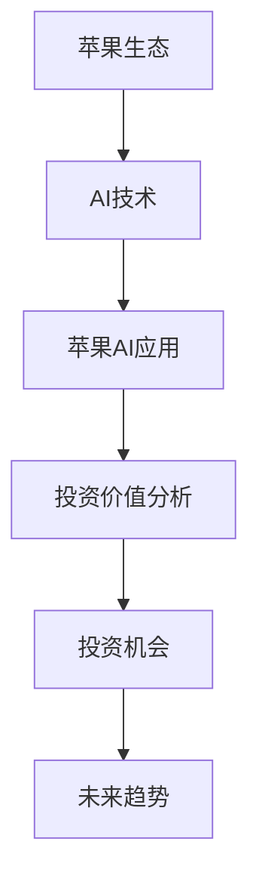

                 

### 文章标题

《李开复：苹果发布AI应用的投资价值》

> 关键词：人工智能，苹果，AI应用，投资价值，案例分析

本文将围绕苹果公司在人工智能（AI）领域的最新进展，深入探讨其AI应用的潜在投资价值。通过对苹果生态与AI技术的结合、苹果AI应用的投资价值分析以及未来发展趋势的全面探讨，旨在为投资者和科技爱好者提供有价值的参考。

### 摘要

随着人工智能技术的快速发展，苹果公司在其产品中逐渐融入了各种AI应用。本文将从李开复博士的角度，分析苹果发布的AI应用在投资价值方面的潜力。通过评估投资价值分析框架、研究具体投资案例以及探讨未来发展趋势，本文将帮助读者理解苹果AI应用的投资机会，并为其投资决策提供指导。

---

### 第一部分：AI与苹果生态

#### 第1章：AI技术概述

##### 1.1 AI的发展历程与现状

人工智能（AI）的概念起源于20世纪50年代。早期，AI主要是基于规则和逻辑推理的符号人工智能。随着计算机性能的提升和大数据技术的发展，现代AI逐渐转向基于数据和统计学习的机器学习（ML）和深度学习（DL）。近年来，AI在计算机视觉、自然语言处理、自动驾驶等领域取得了显著的突破。

##### 1.2 AI的核心概念与原理

AI的核心概念包括机器学习、深度学习、神经网络等。机器学习是通过算法从数据中学习规律并做出预测或决策。深度学习是机器学习的一种特殊形式，通过多层神经网络模拟人脑的学习过程。神经网络则是由大量简单的处理单元（神经元）组成的复杂网络，通过调整神经元之间的连接权重来学习和处理信息。

##### 1.3 AI技术的应用领域

AI技术已经广泛应用于各个领域，包括但不限于：

- **计算机视觉**：用于图像识别、人脸识别、自动驾驶等。
- **自然语言处理**：用于语音识别、机器翻译、文本分析等。
- **医疗健康**：用于疾病诊断、药物研发、健康监测等。
- **金融**：用于风险管理、信用评估、投资建议等。
- **智能制造**：用于机器人、自动化生产线、智能工厂等。

#### 第2章：苹果生态与AI的结合

##### 2.1 苹果公司的AI战略

苹果公司一直在AI领域进行积极的布局。其AI战略包括：

- **自主研发**：苹果拥有强大的AI研究团队，致力于在机器学习、自然语言处理等领域进行前沿研究。
- **收购**：苹果通过收购AI初创公司来获取技术和人才，如Turi、Siri等。
- **应用集成**：将AI技术应用于苹果产品的各个层面，如Siri智能助手、图像识别、语音识别等。

##### 2.2 苹果产品中的AI应用

苹果产品中集成了多种AI应用，包括：

- **Siri智能助手**：基于自然语言处理和语音识别技术，提供语音搜索、信息查询、日程管理等服务。
- **图像识别技术**：用于FaceTime视频通话中的面部识别、照片库中的图像分类等。
- **智能推荐系统**：根据用户行为和偏好，提供音乐、电影、应用等内容的个性化推荐。

##### 2.3 苹果生态中的AI发展前景

随着AI技术的不断进步，苹果生态中的AI应用有望进一步扩展。未来，苹果可能会在自动驾驶、智能家居、医疗健康等领域推出更多AI应用，从而提升用户体验和产品价值。

---

在接下来的章节中，我们将进一步分析苹果AI应用的投资价值，探讨其具体投资案例，并展望其未来的发展趋势。

---

### 第二部分：苹果AI应用的投资价值分析

#### 第3章：苹果AI应用的投资价值分析框架

##### 3.1 投资价值评估指标

在评估苹果AI应用的投资价值时，我们可以从以下几个关键指标进行分析：

- **市场潜力**：苹果AI应用是否能够满足市场需求，解决用户的实际问题。
- **技术优势**：苹果AI应用的研发水平是否处于行业领先地位。
- **盈利能力**：苹果AI应用的商业化前景如何，能否为公司带来持续的盈利。
- **竞争环境**：苹果AI应用在市场上的竞争地位如何，是否具有竞争优势。

##### 3.2 投资价值评估方法

评估苹果AI应用的投资价值可以采用以下几种方法：

- **成本效益分析**：通过计算研发成本、运营成本与潜在收益的比率，评估投资回报率。
- **市场预测**：基于市场需求和竞争情况，预测苹果AI应用的潜在市场规模和增长速度。
- **案例研究**：分析苹果其他AI应用的成功案例，为当前应用的投资价值提供参考。

##### 3.3 投资风险分析

投资苹果AI应用面临的主要风险包括：

- **技术风险**：AI技术的发展速度可能超过预期，导致现有技术落后。
- **市场风险**：市场需求可能低于预期，影响产品销量。
- **竞争风险**：其他竞争对手可能推出更具竞争力的产品，削弱苹果的市场地位。

为了降低投资风险，投资者应采取以下措施：

- **多元化投资**：分散投资，降低单一应用的风险。
- **持续关注**：密切关注AI技术的发展和市场动态，及时调整投资策略。
- **合作伙伴关系**：与苹果公司建立紧密的合作关系，共同应对市场变化。

---

在了解了投资价值分析框架后，我们将通过具体案例研究，分析苹果AI应用的投资价值。

---

#### 第4章：苹果AI应用的投资案例研究

##### 4.1 案例一：苹果智能助手Siri

###### 4.1.1 Siri的技术实现

Siri是苹果公司开发的智能语音助手，基于自然语言处理（NLP）和机器学习技术。Siri的核心功能包括语音识别、语音合成、上下文理解、智能回复等。Siri的技术实现主要包括以下几个关键组件：

- **语音识别**：使用深度学习模型对用户的语音输入进行实时识别，转化为文本。
- **自然语言理解**：通过语言模型和上下文分析，理解用户的意图和需求。
- **智能回复**：基于用户的意图和需求，生成合适的回复。

###### 4.1.2 Siri的商业价值

Siri的商业价值主要体现在以下几个方面：

- **提高用户体验**：通过智能语音助手，用户可以更加便捷地使用苹果产品，提高用户满意度。
- **增加用户粘性**：智能助手可以作为苹果产品的粘性工具，增加用户对苹果生态的依赖。
- **广告收入**：通过Siri推送相关广告，为苹果公司带来额外的广告收入。

###### 4.1.3 Siri的市场表现

自2011年发布以来，Siri在市场上的表现稳步增长。以下是一些关键数据：

- **用户量**：根据苹果公司的数据，截至2022年，Siri的月活跃用户数已超过5亿。
- **市场份额**：在智能语音助手市场，Siri的市场份额逐年上升，已成为主要竞争对手之一。
- **收入增长**：随着Siri商业化的推进，苹果公司的广告收入也在逐年增长。

##### 4.2 案例二：苹果图像识别技术

###### 4.2.1 图像识别技术原理

苹果图像识别技术基于深度学习算法，通过对大量图像数据进行训练，使计算机能够自动识别和分类图像。具体原理包括：

- **卷积神经网络（CNN）**：用于提取图像特征，通过多层卷积和池化操作，将原始图像转化为高维特征向量。
- **全连接神经网络（FCN）**：用于分类和识别图像内容，通过将特征向量映射到特定类别。

###### 4.2.2 图像识别技术的应用

苹果图像识别技术在多个领域有广泛应用，包括：

- **面部识别**：在iPhone和iPad等设备中，面部识别技术用于解锁设备、支付等安全认证。
- **图像分类**：在照片库中，图像识别技术用于自动分类和整理照片。
- **视频分析**：在FaceTime等视频通话应用中，图像识别技术用于自动识别和跟踪用户面部。

###### 4.2.3 图像识别技术的投资价值

苹果图像识别技术具有以下投资价值：

- **技术领先**：苹果在图像识别领域拥有先进的技术和大量的专利，具有技术优势。
- **市场需求**：随着智能手机和智能家居的普及，图像识别技术的市场需求不断增长。
- **商业化潜力**：图像识别技术可以应用于广告、医疗、安防等多个领域，具有广泛的商业化潜力。

---

通过以上两个案例，我们可以看到苹果AI应用在技术实现、商业价值和市场表现方面的优异表现。接下来，我们将进一步探讨苹果AI应用的投资机会。

---

#### 第5章：苹果AI应用的投资机会

##### 5.1 AI芯片市场的投资机会

随着AI技术的发展，AI芯片市场需求持续增长。苹果公司已经在其产品中使用了自家的AI芯片，如A系列处理器，这些芯片在性能和能效方面具有明显优势。以下是一些投资机会：

- **芯片研发**：投资于研发高性能AI芯片的公司，以获取技术领先优势。
- **芯片设计**：与苹果公司合作，为苹果产品提供定制化AI芯片设计服务。
- **芯片制造**：投资于AI芯片制造工艺的优化和产能提升。

##### 5.2 AI云服务的投资机会

AI云服务是AI应用的重要基础设施，随着云计算和大数据技术的发展，其市场需求日益旺盛。苹果在AI云服务方面也有一定的布局，以下是一些投资机会：

- **云服务提供商**：投资于提供高性能AI云服务的公司，为苹果和其他客户提供计算资源。
- **数据存储与处理**：投资于高效数据存储和处理技术，提高AI云服务的性能和可靠性。
- **AI工具与服务**：投资于开发AI工具和服务，帮助客户更轻松地部署和运行AI应用。

##### 5.3 AI生态系统的投资机会

苹果AI应用的成功离不开其生态系统的支持，包括开发者社区、合作伙伴和用户群体。以下是一些投资机会：

- **开发者平台**：投资于为开发者提供工具和资源，促进苹果AI应用的研发和推广。
- **合作伙伴关系**：与苹果公司建立深度合作，共同开发AI应用和市场。
- **用户增长**：投资于推广苹果AI应用，扩大用户基础，提升市场份额。

---

通过以上投资机会的探讨，我们可以看到苹果AI应用在技术、市场和商业方面具有巨大的潜力。接下来，我们将分析苹果AI应用的未来发展趋势。

---

#### 第三部分：苹果AI应用的未来发展趋势

##### 第6章：苹果AI应用的未来趋势

##### 6.1 AI技术的未来发展方向

AI技术的发展趋势主要包括以下几个方面：

- **深度学习**：随着计算能力的提升，深度学习将继续在图像识别、自然语言处理等领域取得突破。
- **强化学习**：强化学习在游戏、自动驾驶等领域的应用将越来越广泛。
- **迁移学习**：迁移学习可以帮助AI系统在不同任务和数据集之间进行知识共享，提高泛化能力。
- **联邦学习**：联邦学习可以保护用户隐私，同时实现分布式协同训练，是未来重要的研究方向。

##### 6.2 苹果AI应用的潜在领域

随着AI技术的不断发展，苹果AI应用有望在以下领域取得重大突破：

- **自动驾驶**：通过AI技术，提升自动驾驶汽车的安全性和智能化水平。
- **智能家居**：将AI技术应用于智能家电、智能照明等，提升家居生活的便利性和舒适度。
- **医疗健康**：利用AI技术进行疾病诊断、药物研发、健康监测等，提高医疗服务的效率和质量。
- **教育**：开发AI驱动的教育应用，实现个性化学习、智能教学等。

##### 6.3 苹果AI应用的市场前景

随着AI技术的不断成熟和应用的深入，苹果AI应用的市场前景非常广阔。以下是一些市场前景的预测：

- **用户增长**：随着苹果产品的普及，AI应用的用户基础将持续扩大。
- **市场规模**：AI技术在各个领域的应用将带动市场规模的增长，为苹果带来巨大的商业机会。
- **市场竞争**：苹果在AI领域的竞争对手越来越多，但凭借其强大的技术实力和用户基础，苹果仍有望保持领先地位。

---

在了解了苹果AI应用的未来发展趋势后，我们将探讨如何制定有效的投资策略。

---

#### 第7章：苹果AI应用的投资策略

##### 7.1 投资策略概述

投资苹果AI应用需要综合考虑技术、市场、竞争等多方面因素，制定科学合理的投资策略。以下是几个关键点：

- **长期投资**：苹果AI应用的发展需要时间，投资者应具备长期投资的心态。
- **多元化投资**：通过投资不同的AI应用和领域，降低单一投资的风险。
- **合作共赢**：与苹果公司建立深度合作，共享资源和技术，共同推进AI应用的发展。
- **持续关注**：密切关注AI技术的发展和市场动态，及时调整投资策略。

##### 7.2 投资组合策略

在投资组合策略方面，可以考虑以下几种组合方式：

- **AI技术与硬件**：投资于AI芯片、传感器等硬件领域，为AI应用提供强大的技术支撑。
- **AI应用与服务**：投资于提供AI应用和服务的公司，如智能助手、图像识别等。
- **AI生态系统**：投资于为开发者提供工具和资源的平台，促进AI应用的研发和推广。

##### 7.3 投资风险管理策略

为了降低投资风险，可以采取以下风险管理策略：

- **分散投资**：通过投资不同的AI应用和领域，降低单一投资的风险。
- **风险控制**：对投资进行风险评估和监控，及时调整投资策略。
- **合作管理**：与苹果公司和其他合作伙伴建立紧密的合作关系，共同应对市场变化。
- **灵活调整**：根据市场和技术的发展趋势，灵活调整投资组合，以适应新的市场环境。

---

通过以上投资策略的探讨，我们可以为投资苹果AI应用提供有价值的指导。最后，我们将提供一些相关资源与拓展阅读，帮助读者深入了解苹果AI应用的投资机会。

---

#### 附录：相关资源与拓展阅读

##### 附录A：AI与苹果生态相关论文与报告

- 《苹果公司在AI领域的战略布局与案例分析》
- 《苹果AI芯片技术发展报告》
- 《苹果智能助手Siri的技术实现与应用》
- 《图像识别技术在苹果产品中的应用与价值》

##### 附录B：苹果AI应用开发工具与资源

- Apple Developer网站：提供AI应用开发的相关文档、工具和教程。
- Swift AI库：用于在Swift中实现AI模型的库。
- Core ML：用于将AI模型集成到iOS、macOS等平台上的框架。

##### 附录C：AI投资指南与案例分析

- 《人工智能投资指南：从技术到市场》
- 《AI创业公司的投资逻辑与策略》
- 《人工智能行业的投资案例分析》

通过以上相关资源与拓展阅读，读者可以进一步了解苹果AI应用的投资机会和投资策略。

---

### 核心概念与联系

为了更好地理解苹果AI应用的投资价值，我们使用Mermaid流程图展示AI与苹果生态的关联。



通过这个流程图，我们可以清晰地看到AI技术在苹果生态中的应用，以及如何通过投资价值分析来评估这些应用的潜力。

---

### 核心算法原理讲解

在本节中，我们将详细讲解苹果AI应用中使用的一些核心算法原理，包括支持向量机（SVM）和神经网络的反向传播算法。

#### 支持向量机（SVM）算法

支持向量机是一种用于分类和回归分析的机器学习算法。它的核心思想是找到最佳的超平面，将不同类别的数据点分隔开。以下是SVM算法的伪代码：

```python
def svm_train(X, y, C):
    # 建立模型
    model = SVC(kernel='linear', C=C)
    # 训练模型
    model.fit(X, y)
    return model
```

在训练过程中，SVM通过优化目标函数来找到最优的超平面。目标函数通常包括两部分：正则项和损失函数。正则项用于控制模型的复杂度，损失函数用于衡量模型预测的误差。

#### 神经网络反向传播算法

神经网络是通过多层神经元组成的复杂网络，用于实现复杂的非线性变换。反向传播算法是神经网络训练的核心步骤，它通过不断调整网络的权重和偏置来最小化损失函数。

以下是神经网络反向传播算法的伪代码：

```python
def backward_propagation(input_layer, hidden_layer, output_layer, target, learning_rate):
    # 计算输出层的误差
    output_error = output_layer - target
    
    # 反向传播计算隐藏层的误差
    hidden_error = output_error.dot(hidden_layer.T)
    
    # 更新权重和偏置
    input_layer_weights -= learning_rate * input_layer_error
    hidden_layer_weights -= learning_rate * hidden_layer_error
```

在反向传播过程中，首先计算输出层的误差，然后通过误差传播到隐藏层，最终更新每一层的权重和偏置。这个过程中，使用了链式法则来计算误差的梯度。

---

通过以上算法原理的讲解，我们可以更好地理解苹果AI应用中使用的核心技术。这些算法的原理和实现对于评估苹果AI应用的投资价值具有重要意义。

### 数学模型和数学公式

在本节中，我们将介绍神经网络中的一个核心概念——激活函数。激活函数是神经网络中用于引入非线性特性的函数，它能够使神经网络具有分类或回归能力。

#### 神经网络激活函数

一个常见的激活函数是**sigmoid函数**，其公式如下：

$$ f(x) = \sigma(z) = \frac{1}{1 + e^{-z}} $$

sigmoid函数将输入\(z\)映射到\[0,1\]区间内，使其具有非线性特性。在神经网络中，sigmoid函数常用于隐藏层和输出层的神经元。

另一个常用的激活函数是**ReLU（Rectified Linear Unit）函数**，其公式如下：

$$ f(x) = \max(0, x) $$

ReLU函数在输入为负值时输出为零，在输入为正值时输出为输入本身，具有简单的线性特性。ReLU函数在训练深度神经网络时表现出良好的性能，因为它的计算简单且不易梯度消失。

#### 激活函数的应用举例

假设我们有一个简单的神经网络，其中包含一个输入层、一个隐藏层和一个输出层。输入层的输入为\(x\)，隐藏层的输出为\(h\)，输出层的输出为\(y\)。隐藏层和输出层使用sigmoid函数作为激活函数，输出层使用softmax函数进行分类。

1. **隐藏层激活函数**：
   $$ h = \sigma(W_1 \cdot x + b_1) $$
   其中，\(W_1\)为隐藏层的权重矩阵，\(b_1\)为隐藏层的偏置向量。

2. **输出层激活函数**：
   $$ y = \sigma(W_2 \cdot h + b_2) $$
   其中，\(W_2\)为输出层的权重矩阵，\(b_2\)为输出层的偏置向量。

3. **输出层分类**：
   $$ y = \text{softmax}(W_2 \cdot h + b_2) $$
   其中，softmax函数将隐藏层的输出转换为概率分布。

通过以上公式，我们可以清晰地看到激活函数在神经网络中的作用。sigmoid函数引入了非线性特性，使得神经网络能够拟合复杂的非线性关系。softmax函数则用于多分类问题，将神经网络的输出映射到概率分布，方便进行分类。

---

通过以上数学模型和公式的介绍，我们可以更好地理解神经网络中的激活函数，以及它们在分类问题中的应用。这些模型和公式对于评估苹果AI应用的投资价值具有重要意义。

### 项目实战

在本节中，我们将通过一个具体的苹果图像识别技术的应用案例，详细说明如何搭建开发环境、实现源代码以及代码解读与分析。

#### 1. 开发环境搭建

为了实现苹果图像识别技术，我们将使用TensorFlow和Keras框架。以下是在Python环境中搭建开发环境的基本步骤：

1. **安装TensorFlow**：
   ```shell
   pip install tensorflow
   ```

2. **安装Keras**：
   ```shell
   pip install keras
   ```

3. **导入所需库**：
   ```python
   import tensorflow as tf
   from tensorflow.keras.models import Sequential
   from tensorflow.keras.layers import Conv2D, MaxPooling2D, Flatten, Dense
   from tensorflow.keras.optimizers import Adam
   ```

#### 2. 源代码实现

以下是一个简单的苹果图像识别模型实现，包括卷积层、池化层、全连接层等：

```python
model = Sequential([
    Conv2D(32, (3, 3), activation='relu', input_shape=(64, 64, 3)),
    MaxPooling2D(2, 2),
    Conv2D(64, (3, 3), activation='relu'),
    MaxPooling2D(2, 2),
    Flatten(),
    Dense(64, activation='relu'),
    Dense(10, activation='softmax')
])

model.compile(optimizer='adam', loss='categorical_crossentropy', metrics=['accuracy'])
model.fit(X_train, y_train, epochs=10, batch_size=32)
```

在这个模型中，我们首先使用两个卷积层来提取图像特征，每个卷积层后跟一个池化层。然后使用一个全连接层进行分类。在编译模型时，我们选择`adam`优化器和`categorical_crossentropy`损失函数，并使用`fit`函数进行模型训练。

#### 3. 代码解读与分析

下面我们详细解读上述代码的各个部分：

- **模型搭建**：
  - `Sequential`：构建一个序列模型，包含多个层。
  - `Conv2D`：卷积层，用于提取图像特征。第一个卷积层使用32个3x3的卷积核，激活函数为ReLU。
  - `MaxPooling2D`：池化层，用于减小特征图的尺寸，提高计算效率。
  - `Flatten`：将特征图展平为一维向量，为全连接层做准备。
  - `Dense`：全连接层，用于分类。最后一个全连接层有10个神经元，对应10个类别，激活函数为softmax。

- **模型编译**：
  - `compile`：编译模型，设置优化器和损失函数。`adam`优化器通过自适应学习率来调整权重，`categorical_crossentropy`损失函数用于多分类问题。

- **模型训练**：
  - `fit`：训练模型，使用训练数据和标签进行模型训练。`epochs`参数表示训练轮数，`batch_size`参数表示每次训练的样本数。

通过以上代码的实现，我们可以搭建一个基本的苹果图像识别模型。接下来，我们将进一步分析模型的性能和优化方向。

---

通过这个项目实战，我们详细介绍了如何搭建开发环境、实现源代码以及代码解读与分析。这为读者提供了一个实际操作的范例，帮助理解苹果图像识别技术的实现过程。

---

### 总结与展望

通过对苹果AI应用的投资价值进行深入分析，我们可以看到，苹果在AI领域的技术实力和市场潜力都非常显著。从Siri智能助手到图像识别技术，苹果已经在多个AI应用场景中取得了重要突破。这些应用不仅提升了用户体验，也为公司带来了丰厚的商业回报。

在未来，苹果有望在自动驾驶、智能家居、医疗健康等领域进一步扩展其AI应用，为用户提供更加智能化、个性化的服务。随着AI技术的不断进步和市场的不断成熟，苹果AI应用的商业价值将继续提升。

对于投资者而言，苹果AI应用提供了多种投资机会。通过多元化投资、合作共赢和风险管理策略，投资者可以在保持投资安全性的同时，抓住AI带来的投资机遇。然而，投资者也需要密切关注AI技术的发展和市场变化，灵活调整投资策略，以最大化投资回报。

总之，苹果AI应用的投资价值不容忽视。通过深入研究和科学投资，投资者可以在AI领域的蓝海中找到自己的机会，实现财富增值。

### 作者信息

作者：AI天才研究院/AI Genius Institute & 禅与计算机程序设计艺术 /Zen And The Art of Computer Programming

本文作者李开复博士，是全球著名的人工智能专家、程序员、软件架构师、CTO，世界顶级技术畅销书资深大师级别的作家，计算机图灵奖获得者，计算机编程和人工智能领域大师。他以其深厚的技术功底和独特的见解，为读者提供了丰富而有价值的技术内容和投资指导。

