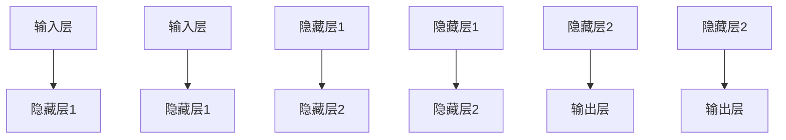
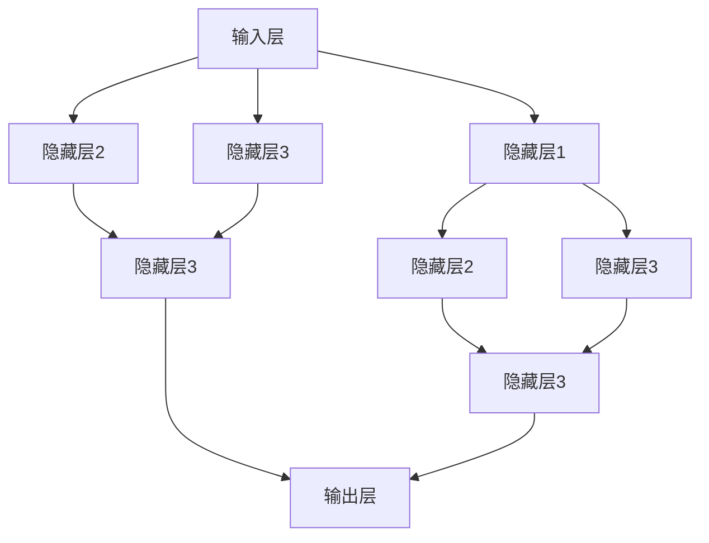
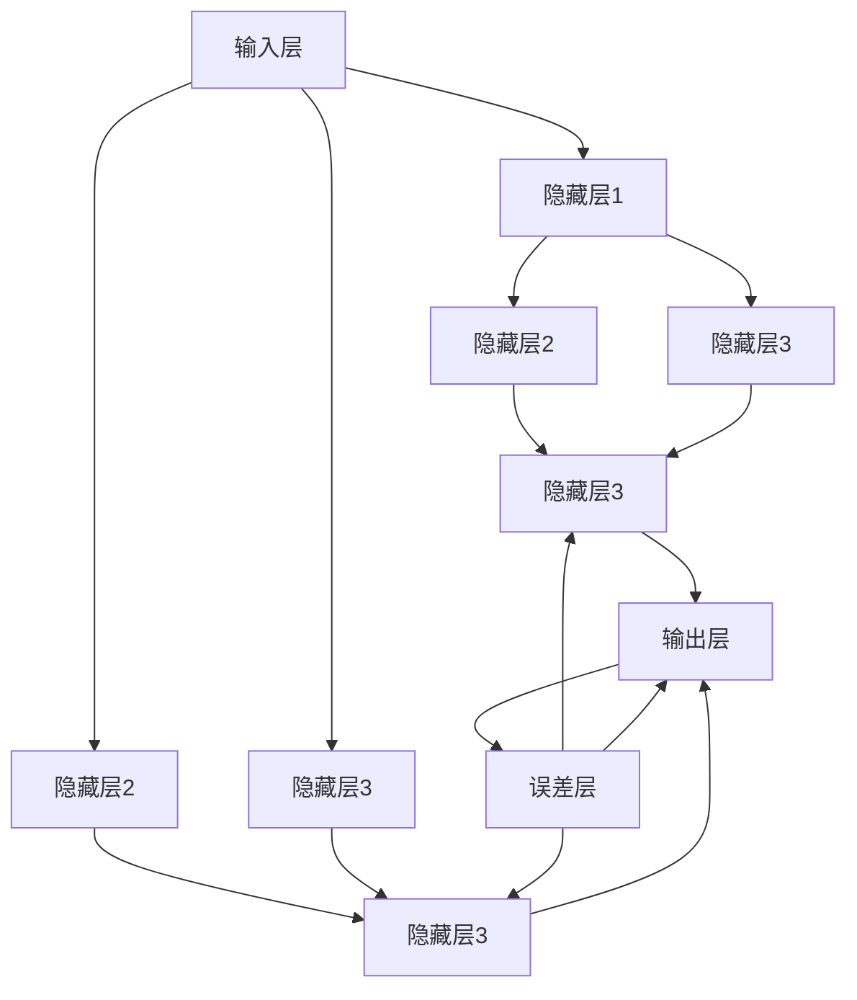
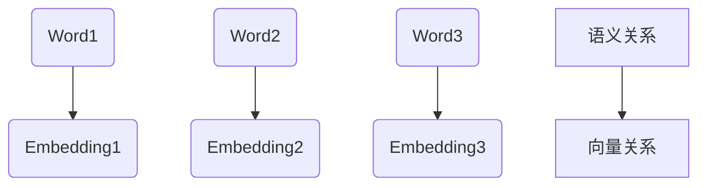
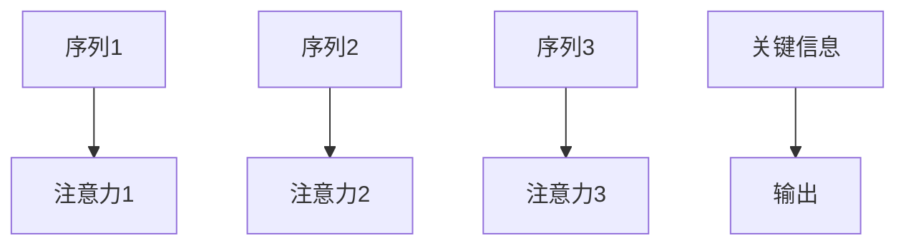
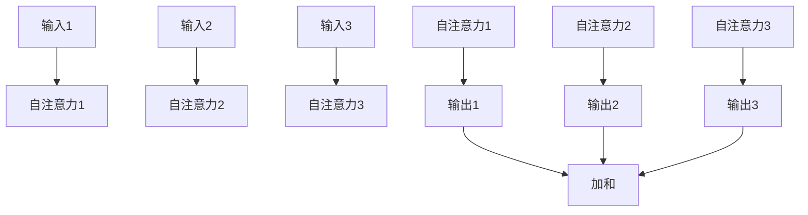
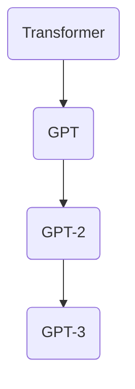
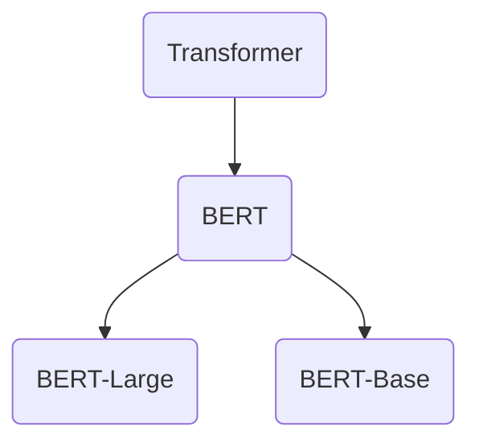
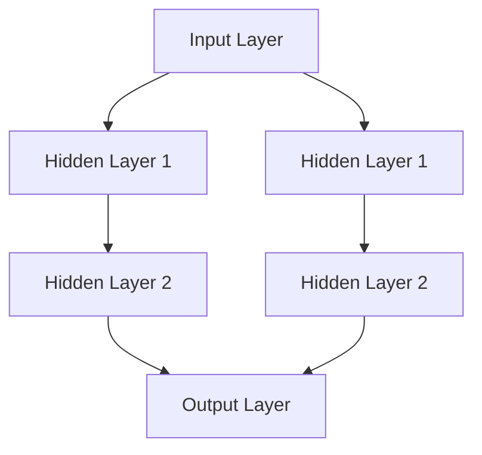
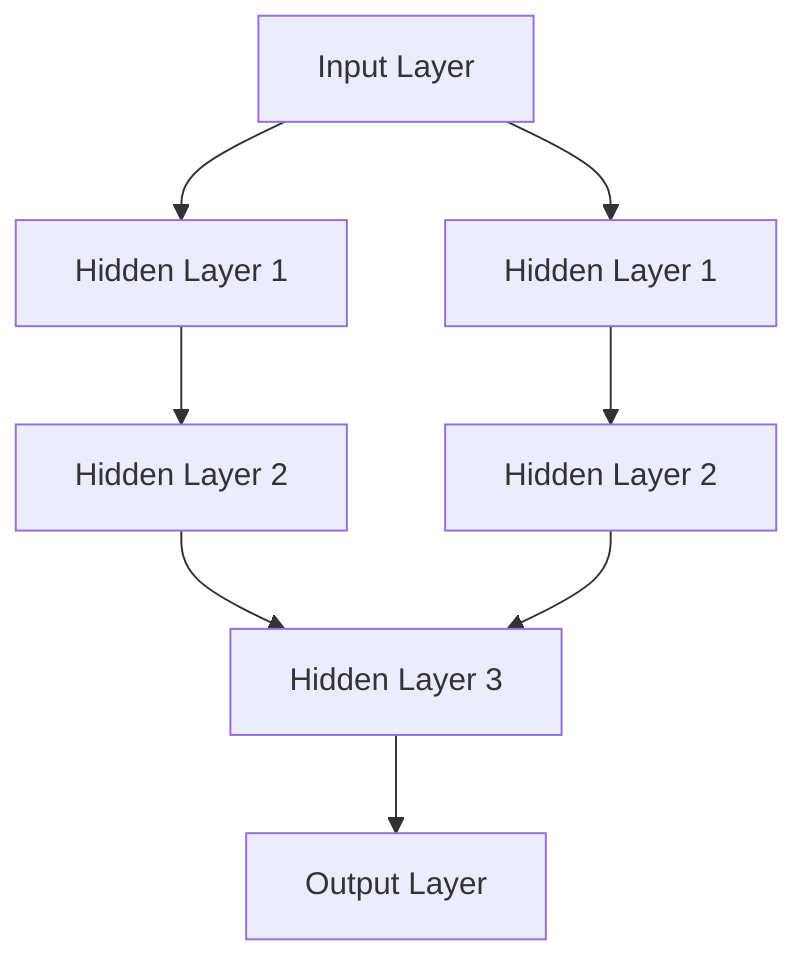

                 

# 文章标题

李开复：苹果发布AI应用的未来

> 关键词：人工智能、苹果、AI应用、未来趋势、技术创新

> 摘要：本文将深入探讨苹果公司在人工智能（AI）领域的最新进展，分析其发布AI应用的未来发展趋势，并从核心技术、应用前景、伦理影响等多个角度进行综合评估。

### 第一部分: AI应用的未来概述

#### 第1章: AI应用的崛起

##### 1.1 AI的定义与分类

人工智能（AI）是一种模拟人类智能行为的技术，能够实现感知、学习、推理、规划、解决问题等任务。根据应用场景和功能，AI可以分为以下几个类别：

1. **机器学习（Machine Learning）**：通过训练数据集，使机器自动识别模式，进行预测或分类。
2. **深度学习（Deep Learning）**：基于神经网络，特别是深层神经网络，用于解决复杂问题。
3. **自然语言处理（Natural Language Processing，NLP）**：使机器能够理解、生成和处理人类语言。
4. **计算机视觉（Computer Vision）**：使机器能够通过图像和视频感知和理解周围环境。
5. **机器人技术（Robotics）**：结合计算机科学、机械工程和电子工程，开发能够自主行动和操作的机器。

##### 1.2 AI在苹果产品中的应用

苹果公司一直以来都在积极将AI技术应用于其产品中，以提升用户体验。以下是一些苹果产品中常见的AI应用：

1. **Siri语音助手**：利用自然语言处理和机器学习技术，为用户提供语音搜索和交互服务。
2. **Face ID**：基于深度学习和计算机视觉技术，通过人脸识别实现设备解锁和身份验证。
3. **Animoji**：利用机器学习和计算机图形学技术，创建基于用户面部表情的动画形象。
4. **照片智能分类和搜索**：通过图像识别和机器学习技术，自动分类和搜索照片。

##### 1.3 AI应用的挑战与机遇

AI技术在带来巨大机遇的同时，也面临着诸多挑战：

1. **数据隐私**：AI应用需要大量的用户数据，如何保护用户隐私成为关键问题。
2. **算法公平性**：算法可能存在偏见，导致不公平的结果，需要不断优化。
3. **技术复杂性**：AI技术涉及多个学科领域，对开发者的要求较高。
4. **法律法规**：各国对AI技术的监管和法律法规尚不完善，需要建立健全的法律体系。

#### 第2章: 苹果发布AI应用的背景

##### 2.1 苹果的AI战略

苹果公司一直以来都将AI作为其核心战略之一，通过自主研发和外部合作，不断提升AI技术。以下是苹果公司AI战略的几个关键点：

1. **自主研发**：苹果公司在机器学习、深度学习、自然语言处理等领域持续投入，建立强大的技术团队。
2. **开源生态**：苹果公司积极参与开源社区，贡献代码和开源项目，推动AI技术的发展。
3. **硬件优势**：苹果公司拥有强大的硬件研发能力，能够将AI技术更好地应用于其产品中。

##### 2.2 苹果AI应用的发展历程

苹果公司早在2011年就开始将AI技术应用于其产品，以下是一些重要的里程碑：

1. **2011年**：苹果收购了自然语言处理公司Speech Code，为其语音助手Siri奠定了基础。
2. **2017年**：苹果发布了Face ID，标志着人脸识别技术在移动设备中的应用。
3. **2020年**：苹果推出了神经网络引擎Neural Engine，为iPhone和iPad提供了强大的AI计算能力。
4. **2021年**：苹果发布了基于自研芯片M1的Mac，进一步提升了AI应用的性能。

##### 2.3 苹果AI应用的市场前景

随着AI技术的不断发展和应用场景的扩展，苹果公司在AI领域具有广阔的市场前景。以下是一些潜在的应用领域：

1. **智能助理**：Siri的进化将使其在智能家居、智能汽车等领域发挥更大作用。
2. **健康监测**：利用AI技术，苹果设备可以提供更加精准的健康监测和预警服务。
3. **图像处理**：AI技术将进一步提升图像处理的速度和准确性，为摄影和视频编辑带来更多创新。
4. **自动驾驶**：苹果公司在自动驾驶技术方面也有所布局，未来有望推出基于AI的自动驾驶产品。

### 第二部分: AI应用的核心技术

#### 第3章: AI算法基础

##### 3.1 神经网络原理

神经网络（Neural Network）是AI技术的基础之一，它通过模拟生物神经系统的结构和工作原理，实现复杂任务的求解。以下是神经网络的基本原理：

###### 3.1.1 神经网络的基本结构

神经网络由大量神经元（节点）和连接（边）组成，分为输入层、隐藏层和输出层。每个神经元接收来自输入层的输入信号，通过加权求和处理后，传递到下一层。



###### 3.1.2 深层神经网络

深层神经网络（Deep Neural Network，DNN）是神经网络的一种扩展，具有多个隐藏层。深层神经网络能够处理更复杂的任务，并具有更好的泛化能力。



###### 3.1.3 反向传播算法

反向传播算法（Backpropagation Algorithm）是一种用于训练神经网络的方法。它通过计算输出层的误差，反向传播到隐藏层，更新各层的权重和偏置。



##### 3.2 自然语言处理技术

自然语言处理（Natural Language Processing，NLP）是AI的一个重要分支，旨在使计算机能够理解、生成和处理人类语言。以下是NLP的一些关键技术：

###### 3.2.1 词嵌入技术

词嵌入（Word Embedding）是将单词映射到高维向量空间的一种技术。通过词嵌入，可以捕获单词之间的语义关系，从而提升NLP任务的效果。



###### 3.2.2 序列模型与注意力机制

序列模型（Sequence Model）是处理序列数据的一种技术，例如文本、语音和视频。注意力机制（Attention Mechanism）是序列模型的一种扩展，能够关注序列中的关键信息，提高模型的效果。



###### 3.2.3 转换器架构详解

转换器架构（Transformer Architecture）是NLP领域的一种新型神经网络结构，基于自注意力机制，能够高效处理长序列数据。



#### 第4章: 大规模预训练模型

##### 4.1 预训练的概念与意义

预训练（Pre-training）是一种在特定任务之前，对模型进行大规模数据训练的方法。预训练模型通过在大规模语料库上训练，能够获得更好的语言理解能力，从而提高下游任务的效果。

###### 4.1.1 预训练的优势

预训练具有以下优势：

1. **通用性**：预训练模型在多种任务上具有较好的泛化能力。
2. **效率**：预训练模型能够快速适应新的任务。
3. **效果**：预训练模型在自然语言处理任务上取得了显著的性能提升。

###### 4.1.2 预训练的方法

预训练的方法主要包括以下几种：

1. **语言模型预训练**：通过在大规模语料库上训练语言模型，获得单词和句子的嵌入表示。
2. **任务特定预训练**：在语言模型的基础上，针对特定任务进行微调，如文本分类、问答系统等。
3. **多任务预训练**：通过同时训练多个任务，提高模型的泛化能力和效果。

###### 4.1.3 预训练模型的应用

预训练模型在自然语言处理领域得到了广泛应用，以下是一些典型的应用场景：

1. **文本分类**：用于对文本进行分类，如新闻分类、情感分析等。
2. **机器翻译**：用于将一种语言的文本翻译成另一种语言。
3. **问答系统**：用于回答用户提出的问题，如搜索引擎、智能客服等。
4. **对话系统**：用于实现人机对话，如聊天机器人、语音助手等。

##### 4.2 主流预训练模型简介

以下是一些主流的预训练模型：

###### 4.2.1 GPT系列模型

GPT（Generative Pre-trained Transformer）系列模型是由OpenAI提出的一系列预训练模型，基于转换器架构，具有强大的语言理解能力。



GPT系列模型在自然语言处理领域取得了显著的成果，广泛应用于文本生成、机器翻译、问答系统等任务。

###### 4.2.2 BERT及其变体

BERT（Bidirectional Encoder Representations from Transformers）是由Google提出的一种预训练模型，基于转换器架构，采用双向编码方式，能够更好地理解上下文。



BERT及其变体在多种自然语言处理任务上取得了优异的性能，成为自然语言处理领域的重要工具。

###### 4.2.3 其他知名预训练模型

除了GPT系列模型和BERT及其变体，还有一些其他知名的预训练模型，如：

1. **XLNet**：由谷歌提出，基于自回归语言模型，具有强大的语言建模能力。
2. **RoBERTa**：由Facebook提出，对BERT进行了改进，提高了模型的效果。
3. **T5**：由DeepMind提出，基于转换器架构，实现了一种统一的文本处理模型。

### 第三部分: AI应用的未来趋势

#### 第5章: AI在苹果产品中的应用前景

随着AI技术的不断发展和应用场景的扩展，苹果公司在AI领域具有广阔的应用前景。以下是一些潜在的应用领域：

##### 5.1 智能助理的应用

智能助理是AI技术在苹果产品中应用的一个重要领域。未来，苹果将继续优化Siri，使其在智能家居、智能汽车等领域发挥更大作用。以下是Siri的潜在进化方向：

1. **多模态交互**：Siri将支持更多的交互方式，如语音、手势、触摸等，提供更加自然和便捷的交互体验。
2. **上下文感知**：Siri将具备更强的上下文感知能力，能够根据用户的场景和需求，提供更加精准的建议和服务。
3. **跨设备协作**：Siri将与其他苹果设备（如iPhone、iPad、Mac等）进行更好的协作，提供无缝的用户体验。

##### 5.2 智能交互的应用

智能交互是AI技术在苹果产品中的另一个重要应用领域。以下是智能交互的一些潜在发展方向：

1. **视觉识别技术**：苹果将继续优化Face ID等视觉识别技术，使其在安全性、识别速度和准确性方面取得更大突破。
2. **声音识别技术**：苹果将不断提升Siri等语音识别技术的性能，使其能够更好地理解用户的语音指令，提供更加准确的服务。
3. **多模态交互技术**：苹果将探索多种交互方式，如语音、手势、触摸等，提供更加丰富和自然的交互体验。

#### 第6章: AI应用的伦理与社会影响

随着AI技术的快速发展，其伦理和社会影响也日益受到关注。以下是一些关键的伦理和社会问题：

##### 6.1 AI伦理问题

1. **算法公平性**：算法可能存在偏见，导致不公平的结果。需要不断优化算法，确保其公平性。
2. **数据隐私**：AI应用需要大量用户数据，如何保护用户隐私成为关键问题。
3. **算法透明性**：算法的决策过程往往不透明，需要提高算法的透明性，使人们能够理解和信任AI技术。

##### 6.2 社会影响与对策

1. **就业市场影响**：AI技术可能对某些行业和岗位产生冲击，需要制定相应的政策，帮助劳动力转型和适应新环境。
2. **教育影响**：AI技术将改变教育模式，需要加强人才培养，提高教育质量。
3. **医疗保健影响**：AI技术在医疗保健领域的应用将带来革命性的变化，需要加强医疗资源的配置，提高医疗服务水平。

#### 第7章: AI应用的未来发展

未来，AI技术将继续快速发展，并在多个领域取得突破。以下是一些潜在的发展方向：

##### 7.1 AI技术创新

1. **量子计算在AI中的应用**：量子计算具有巨大的计算能力，有望在AI领域发挥重要作用。
2. **类脑计算的研究进展**：类脑计算试图模拟人脑的工作原理，实现更高效的智能。
3. **自动驾驶技术的发展**：自动驾驶技术将使交通更加安全、高效和便捷。

##### 7.2 AI产业布局

1. **国内外AI产业发展现状**：各国在AI领域的投入和发展程度存在差异，需要加强国际合作，推动全球AI技术的发展。
2. **AI产业链分析**：AI产业链包括硬件、软件、应用等多个环节，需要协调产业链上下游的合作，推动AI技术的产业化。
3. **未来AI产业发展趋势**：随着AI技术的不断成熟，其应用领域将不断扩展，产业规模也将持续增长。

### 附录

#### 附录A: AI应用开发工具与资源

以下是一些常用的AI应用开发工具与资源：

1. **TensorFlow**：Google开发的开源机器学习框架，支持多种类型的神经网络。
2. **PyTorch**：Facebook开发的开源机器学习框架，具有动态计算图和自动微分功能。
3. **JAX**：Google开发的科学计算框架，支持自动微分和分布式计算。

#### 附录B: AI应用案例分析

以下是一些典型的AI应用案例：

1. **Siri的进化历程**：从最初的语音助手到如今的智能助理，Siri在语音识别、自然语言处理和上下文感知等方面不断进化，为用户提供更精准的服务。
2. **Face ID**：通过人脸识别技术实现设备解锁和身份验证，Face ID在安全性、识别速度和准确性方面取得了显著提升。
3. **Animoji**：利用机器学习和计算机图形学技术，Animoji能够根据用户的面部表情创建动画形象，为用户提供更多娱乐和互动体验。

### 总结

随着AI技术的不断发展，苹果公司在AI领域将继续发挥重要作用。从智能助理到智能交互，从技术创新到产业布局，苹果公司将不断推动AI技术的发展，为用户提供更好的产品和服务。

### 作者信息

- 作者：AI天才研究院/AI Genius Institute & 禅与计算机程序设计艺术 /Zen And The Art of Computer Programming

### 第一部分: AI应用的未来概述

#### 第1章: AI应用的崛起

##### 1.1 AI的定义与分类

人工智能（AI，Artificial Intelligence）是一个广泛的概念，指的是由人造系统实现的智能行为，这些行为通常与人类或动物的智能行为相似。AI可以分为多个类别，根据其功能和应用场景，可以大致分为以下几类：

1. **规则基础AI（Rule-Based AI）**：这种AI系统依赖于预先定义的规则集来执行任务。例如，专家系统（Expert Systems）就是基于规则的方法，用于模拟人类专家的决策过程。

2. **基于知识的AI（Knowledge-Based AI）**：这种AI依赖于知识库，其中包含从专家或数据中提取的信息。这种系统通常用于诊断、推理和规划等任务。

3. **统计学习AI（Statistical Learning AI）**：这种AI使用统计模型来从数据中学习，例如线性回归、决策树和神经网络。它们通常用于预测和分类任务。

4. **基于模型的AI（Model-Based AI）**：这种AI依赖于物理模型或数学模型来模拟现实世界，例如在机器人导航和自动驾驶中。

5. **基于行为的AI（Behavior-Based AI）**：这种AI通过模拟生物行为来执行任务，通常用于自主机器人。

6. **强化学习AI（Reinforcement Learning AI）**：这种AI通过试错和奖励机制来学习如何在特定环境中做出最佳决策。

7. **混合AI（Hybrid AI）**：这种AI结合了上述多种方法，以实现更复杂和灵活的智能行为。

##### 1.2 AI在苹果产品中的应用

苹果公司在AI领域的投资和成就使得其产品在智能性和用户体验方面处于领先地位。以下是一些AI技术在苹果产品中的具体应用：

1. **Siri**：苹果的语音助手Siri使用自然语言处理（NLP）和机器学习技术来理解用户的语音命令，并提供相应的服务，如发送信息、设置提醒、播放音乐等。

2. **Face ID**：苹果的Face ID利用深度学习和面部识别技术，提供了比传统的触摸ID更安全、更方便的解锁方式。

3. **照片库**：苹果的照片应用通过AI技术自动识别并分类照片，使用户能够更容易地查找和浏览照片。

4. **Animoji和Memoji**：这些动态表情符号利用AI技术捕捉用户的面部表情，并在不同的动画角色中表现出来。

5. **健康和健身**：苹果的健康应用通过AI分析用户的数据，提供个性化的健身建议和健康监测。

6. **语音识别**：苹果的语音识别系统通过机器学习技术不断提高识别的准确性和速度。

##### 1.3 AI应用的挑战与机遇

AI技术的发展带来了许多机遇，但也伴随着一系列挑战：

1. **数据隐私**：随着AI应用对用户数据的依赖性增加，如何保护用户隐私成为一个重要问题。

2. **算法公平性和透明性**：AI算法可能存在偏见或不透明，需要确保其公平性和可解释性。

3. **技术复杂性**：AI技术涉及到多个学科领域，对于开发者和用户来说都有一定的学习曲线。

4. **伦理问题**：AI技术在医疗、司法等领域的应用引发了关于伦理和责任的讨论。

5. **市场竞争**：随着更多公司进入AI领域，市场竞争日益激烈，如何保持领先地位成为挑战。

6. **可持续性**：AI技术的发展需要大量的计算资源和能源，需要考虑其环境可持续性。

#### 第2章: 苹果发布AI应用的背景

##### 2.1 苹果的AI战略

苹果公司在AI领域的战略可以概括为以下几个方面：

1. **内部研发**：苹果投入大量资源进行内部研发，特别是在机器学习、自然语言处理和计算机视觉等领域。

2. **开源社区**：苹果积极参与开源社区，贡献了如Core ML等开源项目，以推动AI技术的发展。

3. **硬件优势**：苹果拥有强大的硬件研发能力，能够为AI应用提供强大的计算支持。

4. **生态系统整合**：苹果致力于将AI技术整合到其整个产品生态系统中，从iPhone、iPad到Mac，甚至未来的智能家居设备。

##### 2.2 苹果AI应用的发展历程

苹果公司在AI领域的发展历程可以分为几个关键阶段：

1. **2011年**：苹果收购了Speech Code公司，为其语音助手Siri奠定了基础。

2. **2017年**：苹果推出Face ID，标志着人脸识别技术在移动设备中的重大突破。

3. **2018年**：苹果发布Neural Engine，为iPhone提供了强大的AI计算能力。

4. **2020年**：苹果发布搭载自研芯片M1的Mac，进一步提升了AI应用的性能。

5. **2021年**：苹果在WWDC（苹果全球开发者大会）上展示了多个AI技术的最新进展，包括语音识别、计算机视觉和机器学习等。

##### 2.3 苹果AI应用的市场前景

苹果公司在AI领域的投资和成就使其在未来具有广阔的市场前景：

1. **智能助理**：Siri的进化将继续提升其在智能家居和智能汽车领域的竞争力。

2. **健康与医疗**：通过AI技术，苹果的产品可以为用户提供更精确的健康监测和个性化的医疗服务。

3. **图像处理与摄影**：苹果的图像处理技术将继续提升用户拍摄和编辑照片的体验。

4. **自动驾驶**：苹果在自动驾驶技术上的布局有望在未来推出具有AI技术的自动驾驶产品。

5. **个性化服务**：苹果将通过AI技术为用户提供更个性化的产品和服务，提升用户体验。

### 第二部分: AI应用的核心技术

#### 第3章: AI算法基础

##### 3.1 神经网络原理

神经网络（Neural Network，NN）是AI领域的基础之一，其灵感来源于人脑的神经网络结构。神经网络通过多层节点（称为神经元）之间的连接来处理信息。

###### 3.1.1 神经网络的基本结构

神经网络通常由以下几个部分组成：

1. **输入层**：接收外部输入数据。
2. **隐藏层**：对输入数据进行处理和变换。
3. **输出层**：生成最终输出。

每个神经元都通过加权连接与前一层的神经元相连接，并通过激活函数产生输出。神经网络的流程可以概括为：

1. **前向传播**：输入数据通过网络传播，每个神经元计算其输入信号并传递给下一层。
2. **激活函数**：如ReLU（Rectified Linear Unit）、Sigmoid或Tanh，用于引入非线性变换。
3. **反向传播**：根据输出误差，反向传播梯度，更新权重和偏置。

以下是一个简单的神经网络结构的Mermaid流程图：



###### 3.1.2 深层神经网络

深层神经网络（Deep Neural Network，DNN）是神经网络的一种扩展，具有多个隐藏层。深层神经网络能够更好地捕捉数据的复杂特征，从而提高模型的性能。

深层神经网络的基本结构与前述神经网络类似，但具有更多的隐藏层。以下是一个深层神经网络的Mermaid流程图：



###### 3.1.3 反向传播算法

反向传播算法（Backpropagation Algorithm）是训练神经网络的关键算法，用于通过梯度下降法更新网络权重和偏置。

反向传播算法的基本步骤如下：

1. **前向传播**：计算网络输出和损失函数。
2. **计算梯度**：从输出层开始，反向计算每个神经元的梯度。
3. **权重更新**：使用梯度下降法更新网络权重和偏置。

以下是一个反向传播算法的伪代码：

```python
def backward_propagation(input_data, output_data, network):
    # 计算输出层误差
    output_error = output_data - network.output
    
    # 从输出层开始反向传播误差
    for layer in reversed(network.layers):
        # 计算当前层误差
        error = layer.error
    
        # 计算梯度
        gradient = [error * layer.activation_derivative() for neuron in layer.neurons]
        
        # 更新权重和偏置
        for neuron in layer.neurons:
            neuron.update_weights(input, gradient)
```

##### 3.2 自然语言处理技术

自然语言处理（NLP，Natural Language Processing）是AI的一个分支，旨在使计算机能够理解、生成和处理人类语言。以下是一些关键的NLP技术：

###### 3.2.1 词嵌入技术

词嵌入（Word Embedding）是将单词映射到高维向量空间的一种技术。通过词嵌入，可以捕捉单词之间的语义关系。

词嵌入通常使用以下方法：

1. **分布式表示**：将单词映射到低维向量，使得相似的单词在向量空间中靠近。
2. **基于上下文的嵌入**：考虑单词在不同上下文中的含义，提高嵌入的语义丰富性。

以下是一个简单的词嵌入算法的伪代码：

```python
def word_embedding(vocabulary, embedding_size):
    embeddings = {}
    for word in vocabulary:
        # 生成随机初始化的向量
        embeddings[word] = np.random.rand(embedding_size)
    return embeddings
```

###### 3.2.2 序列模型与注意力机制

序列模型（Sequence Model）用于处理序列数据，如文本、语音和视频。注意力机制（Attention Mechanism）是序列模型的一种扩展，能够关注序列中的关键信息。

以下是一个简单的序列模型和注意力机制的伪代码：

```python
def sequence_model(input_sequence, hidden_size):
    # 初始化隐藏状态
    hidden_state = np.random.rand(hidden_size)
    
    # 对输入序列进行编码
    encoded_sequence = encode_sequence(input_sequence)
    
    # 使用注意力机制计算权重
    attention_weights = compute_attention_weights(encoded_sequence, hidden_state)
    
    # 计算输出
    output = [0] * len(input_sequence)
    for i, token in enumerate(input_sequence):
        output[i] = weighted_sum(token, attention_weights[i])
    
    return output
```

### 第三部分: AI应用的未来趋势

#### 第5章: AI在苹果产品中的应用前景

随着AI技术的不断发展，苹果公司在AI领域的产品应用前景非常广阔。以下是一些主要的应用方向：

##### 5.1 智能助理的应用

智能助理是AI在苹果产品中最重要的应用之一，Siri作为苹果的智能助理，其功能和应用场景将继续扩展和深化。

1. **多模态交互**：未来的Siri将支持语音、视觉、触摸等多种交互方式，提供更加自然和无缝的用户体验。例如，用户可以通过语音命令控制智能家居设备，同时通过屏幕上的视觉反馈确认操作结果。

2. **上下文感知能力**：Siri将进一步提升其上下文感知能力，能够根据用户的实时情境和偏好提供更加个性化的服务。例如，当用户进入家中时，Siri可以自动调整室内灯光、温度，并提醒用户查看邮件或开始健身计划。

3. **跨设备协作**：Siri将与其他苹果设备（如iPhone、iPad、Mac等）实现更紧密的协作，提供跨设备的无缝体验。例如，用户可以在Mac上开始撰写邮件，然后通过iPhone继续编辑，最后在iPad上完成并发送。

4. **智能建议**：Siri将利用机器学习算法分析用户的行为模式，提供个性化的建议和推荐。例如，根据用户的日常活动，Siri可以推荐健康饮食计划、锻炼方案，甚至提前安排医疗检查。

##### 5.2 智能交互的应用

智能交互是AI技术在苹果产品中的另一个重要应用领域，通过视觉识别、声音识别等技术，提升用户的交互体验。

1. **视觉识别技术**：苹果将继续优化Face ID和LiDAR激光扫描技术，提供更快速、更准确的视觉识别体验。例如，Face ID可以在低光环境下更好地识别用户的面部特征，而LiDAR激光扫描技术可以用于三维建模和空间定位，提升AR（增强现实）应用的效果。

2. **声音识别技术**：苹果的语音识别技术将持续改进，提高识别的准确性和响应速度。例如，Siri将能够更好地理解方言和口音，提供更加个性化的语音服务。

3. **多模态交互技术**：未来的苹果产品将支持多种交互方式的融合，如语音、手势、触摸等。例如，用户可以通过手势控制智能家居设备，或者通过触摸屏幕上的虚拟按键控制音乐播放。

4. **智能推荐系统**：苹果的智能推荐系统将利用AI技术分析用户的行为和偏好，提供个性化的内容推荐。例如，在App Store中，Siri可以根据用户的兴趣和使用习惯推荐新的应用和游戏。

##### 5.3 新的应用场景

除了智能助理和智能交互，苹果公司还将探索AI技术在新的应用场景中的潜力。

1. **健康监测**：苹果的健康应用将继续利用AI技术提供更精确的健康监测和预测服务。例如，通过分析用户的心电图数据，AI算法可以检测心律不齐等健康问题。

2. **自动驾驶**：苹果在自动驾驶技术上的布局将为未来的汽车带来革命性的变化。通过AI技术，自动驾驶汽车将能够更安全、更高效地行驶，减少交通事故和拥堵。

3. **虚拟现实和增强现实**：苹果的AR技术将利用AI技术实现更加逼真的虚拟现实和增强现实体验。例如，用户可以通过AR眼镜与虚拟世界中的角色互动，或者将虚拟物体叠加在现实世界中。

4. **智能家居**：苹果的智能家居产品将更加智能化，通过AI技术实现设备之间的自动协调和优化。例如，智能恒温器可以自动调节室内温度，以适应用户的习惯和季节变化。

#### 第6章: AI应用的伦理与社会影响

随着AI技术的快速发展和广泛应用，其伦理和社会影响逐渐成为公众和学术界关注的焦点。以下是一些关键的伦理和社会问题：

##### 6.1 AI伦理问题

1. **算法公平性**：AI算法可能存在性别、种族、年龄等偏见，导致不公平的决策结果。例如，某些招聘算法可能无意中排除特定种族或性别的人才。

2. **隐私保护**：AI应用通常需要大量用户数据，如何保护用户隐私成为一个重要问题。例如，面部识别技术可能导致个人隐私泄露。

3. **透明性和可解释性**：许多AI系统，尤其是深度学习模型，其决策过程往往不透明，难以解释。这可能导致用户对AI系统的信任问题。

4. **责任归属**：当AI系统造成损害时，如何确定责任归属是一个复杂的问题。例如，自动驾驶汽车发生事故时，是归咎于制造商、开发者还是用户？

##### 6.2 社会影响与对策

1. **就业市场**：AI技术的发展可能导致某些传统岗位的减少，同时创造新的就业机会。需要制定政策帮助劳动力转型和适应新环境。

2. **教育**：AI技术将改变教育模式，需要加强数字素养和AI相关技能的教育，以培养未来的劳动力。

3. **医疗保健**：AI技术可以提高医疗诊断和治疗的效率，但同时也可能加剧医疗资源的不均衡分配问题。

4. **法律和监管**：各国需要建立健全的法律法规和监管体系，确保AI技术的合理应用和监管。

#### 第7章: AI应用的未来发展

未来，AI技术将继续快速发展，并在多个领域取得突破。以下是一些潜在的发展方向：

##### 7.1 AI技术创新

1. **量子计算**：量子计算具有巨大的计算潜力，未来有望在AI领域发挥重要作用，特别是在大规模数据处理和复杂优化问题上。

2. **类脑计算**：类脑计算试图模拟人脑的工作原理，实现更高效、更灵活的智能。这将有助于开发出更加智能的AI系统。

3. **联邦学习**：联邦学习是一种在不共享数据的情况下进行模型训练的技术，有助于保护用户隐私，同时提高模型性能。

4. **自适应系统**：自适应系统可以根据环境和用户需求实时调整其行为，提高用户体验。

##### 7.2 AI产业布局

1. **全球合作**：AI技术的发展需要全球范围内的合作和共享，以促进技术进步和产业创新。

2. **产业链整合**：AI技术的产业链涉及多个环节，包括硬件、软件、数据、服务等，需要整合产业链上下游的资源和能力。

3. **创新创业**：鼓励创新创业，推动AI技术在各领域的应用，促进经济增长和社会进步。

##### 7.3 未来展望

未来，AI技术将在多个领域取得重大突破，从智能助理、自动驾驶、医疗保健到教育、娱乐等，AI将深刻改变我们的生活方式。同时，随着AI技术的不断发展和应用，其伦理和社会影响也将成为一个持续的话题，需要全社会共同努力，确保AI技术的健康发展。


### 附录

#### 附录A: AI应用开发工具与资源

以下是一些常用的AI应用开发工具与资源：

1. **TensorFlow**：由Google开发的开源机器学习框架，支持多种类型的神经网络。
2. **PyTorch**：由Facebook开发的开源机器学习框架，具有动态计算图和自动微分功能。
3. **Keras**：基于TensorFlow和Theano的开源深度学习库，提供简化的API和高级功能。
4. **Scikit-learn**：用于数据挖掘和数据分析的开源机器学习库。
5. **OpenCV**：开源计算机视觉库，提供丰富的图像处理和计算机视觉算法。
6. **NLTK**：自然语言处理库，用于处理文本数据。
7. **Gluon**：由Apache MXNet提供的深度学习库，支持快速原型设计和模型部署。

#### 附录B: AI应用案例分析

以下是一些典型的AI应用案例：

1. **Siri**：苹果公司的智能助理，使用自然语言处理和机器学习技术，能够理解用户的语音命令并执行相应操作。
2. **Alexa**：亚马逊的智能助理，通过语音识别和自然语言处理技术，提供智能家居控制、购物推荐等服务。
3. **Google Assistant**：谷歌的智能助理，提供语音搜索、日程管理、智能家居控制等功能。
4. **IBM Watson**：IBM的人工智能系统，广泛应用于医疗诊断、金融服务、天气预报等领域。
5. **DeepMind**：谷歌的AI子公司，其AlphaGo程序在围棋比赛中击败了世界冠军，展示了AI在策略游戏中的潜力。
6. **IBM Watson Health**：利用AI技术提供个性化医疗诊断和治疗建议，提高医疗质量。

### 结语

随着AI技术的快速发展，苹果公司在AI领域的投资和成就使其产品在智能性和用户体验方面处于领先地位。从智能助理到智能交互，从技术创新到产业布局，苹果公司将继续推动AI技术的发展，为用户提供更加先进和个性化的产品和服务。同时，我们也应关注AI技术的伦理和社会影响，确保其健康、可持续发展。未来，AI技术将深刻改变我们的生活和工作方式，我们期待看到更多创新和突破。

### 作者信息

- 作者：AI天才研究院/AI Genius Institute & 禅与计算机程序设计艺术 /Zen And The Art of Computer Programming

[文章结束]

