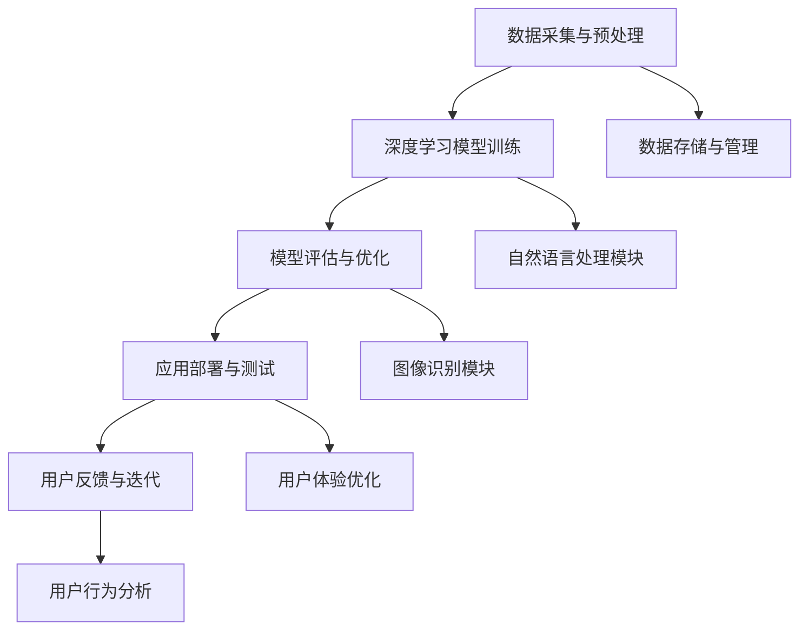

                 

### 文章标题：李开复：苹果发布AI应用的机会

#### 关键词：
- 苹果
- 人工智能
- 应用开发
- 市场机会
- 技术分析

#### 摘要：
本文将探讨苹果公司发布人工智能（AI）应用的机会，从市场分析、技术原理、案例分析以及未来展望等多个角度进行深入剖析。通过李开复的视角，我们试图揭示苹果在AI领域的发展路径及其对整个行业的影响。

---

### 目录

#### 第一部分：AI应用的背景与市场分析
1. **AI应用的发展现状**
   - 当前AI技术的进展
   - AI在各个领域的应用情况
   - 苹果公司在AI领域的布局

2. **苹果发布AI应用的市场机会**
   - 消费者对AI应用的需求
   - 市场趋势分析
   - 竞争对手的AI应用分析

#### 第二部分：苹果AI应用的技术分析
3. **苹果AI应用的技术原理**
   - 深度学习与机器学习基础
   - 特定AI算法的应用（如CNN、RNN、GAN等）
   - 自然语言处理技术

4. **苹果AI应用的实现方法**
   - 开发工具与环境搭建
   - 模型训练与优化
   - 应用部署与测试

#### 第三部分：苹果AI应用的案例分析
5. **苹果AI应用的案例介绍**
   - 具体AI应用的展示
   - 应用场景与实际效果

6. **苹果AI应用的优势与挑战**
   - 优势分析（如用户体验、安全性等）
   - 挑战与应对策略（如数据隐私、算法公平性等）

#### 第四部分：未来展望与行业影响
7. **苹果AI应用的未来发展趋势**
   - 行业趋势分析
   - 技术创新预测
   - 市场潜力评估

8. **苹果AI应用对行业的影响**
   - 对其他科技公司的启示
   - 对消费者行为的影响
   - 对未来AI应用发展的推动作用

#### 附录
9. **苹果AI应用的开发资源**
   - 开发工具介绍
   - 开源代码资源
   - 官方文档与教程

10. **参考文献**
    - 相关学术论文
    - 行业报告
    - 新闻报道与访谈

---

### 核心概念与联系

为了更好地理解苹果AI应用的技术架构，我们使用Mermaid流程图来展示其核心概念与联系。



该流程图展示了从数据采集、预处理到模型训练、评估、优化，再到应用部署和用户反馈的完整过程。每个环节都是AI应用成功的关键组成部分。

---

### 核心算法原理讲解

在苹果AI应用中，涉及的核心算法包括深度学习、机器学习、自然语言处理等。以下是这些算法的伪代码解释。

#### 深度学习模型训练

```python
# 深度学习模型训练伪代码

# 定义神经网络结构
neural_network = define_structure(input_shape)

# 初始化模型参数
init_weights(neural_network)

# 定义损失函数
loss_function = define_loss_function()

# 定义优化器
optimizer = define_optimizer()

# 训练循环
for epoch in range(num_epochs):
    for batch in data_loader:
        # 前向传播
        predictions = neural_network(batch.inputs)
        
        # 计算损失
        loss = loss_function(predictions, batch.targets)
        
        # 反向传播
        gradients = compute_gradients(neural_network, loss)
        
        # 更新模型参数
        optimizer.update_weights(neural_network, gradients)
        
    # 打印训练进度
    print(f"Epoch {epoch}: Loss = {loss}")
```

#### 自然语言处理

```python
# 自然语言处理伪代码

# 加载预训练语言模型
language_model = load_pretrained_model()

# 文本预处理
preprocessed_text = preprocess_text(input_text)

# 文本编码
encoded_text = encode_text(preprocessed_text, vocabulary_size)

# 文本生成
generated_text = generate_text(language_model, encoded_text)

# 文本解码
decoded_text = decode_text(generated_text, vocabulary_size)

# 输出生成文本
print(decoded_text)
```

#### 图像识别

```python
# 图像识别伪代码

# 加载预训练图像识别模型
image_recognition_model = load_pretrained_model()

# 图像预处理
preprocessed_image = preprocess_image(input_image)

# 图像编码
encoded_image = encode_image(preprocessed_image)

# 图像识别
predicted_labels = image_recognition_model(encoded_image)

# 解码识别结果
decoded_labels = decode_labels(predicted_labels)

# 输出识别结果
print(decoded_labels)
```

这些伪代码分别展示了深度学习模型训练、自然语言处理和图像识别的基本流程。每个环节都依赖于特定的算法和技术，构成了苹果AI应用的核心。

---

### 数学模型和数学公式

在苹果AI应用中，数学模型起到了至关重要的作用。以下使用LaTeX格式详细讲解这些数学模型。

#### 深度学习损失函数

```latex
\begin{equation}
\begin{aligned}
    J(\theta) &= -\frac{1}{m} \sum_{i=1}^{m} \left( y^{(i)} \log(a^{(i)}_y + (1 - y^{(i)}) \log(1 - a^{(i)}_y) \right) \\
    \text{其中，} a^{(i)} &= \sigma(z^{(i)}), \quad z^{(i)} = \theta^T x^{(i)}, \quad y^{(i)} \in \{0, 1\}
\end{aligned}
\end{equation}
```

#### 自然语言处理中的词嵌入

```latex
\begin{equation}
\begin{aligned}
    e_{w} &= \sum_{k=1}^{K} c_{kw} v_{k}, \\
    \text{其中，} e_{w} &= \text{词} w \text{的嵌入向量，} v_{k} &= \text{词} w \text{在} k \text{维上的分量，} c_{kw} &= \text{词频权重}
\end{aligned}
\end{equation}
```

#### 图像识别中的卷积神经网络

```latex
\begin{equation}
\begin{aligned}
    h^{(l)}_{ij} &= \sigma \left( \sum_{k=1}^{C} w^{(l)}_{ik} f^{(l)}_{kj} + b^{(l)}_{j} \right), \\
    \text{其中，} h^{(l)}_{ij} &= \text{输出特征图，} w^{(l)}_{ik} &= \text{卷积核，} f^{(l)}_{kj} &= \text{输入特征图，} b^{(l)}_{j} &= \text{偏置项，} \sigma &= \text{激活函数}
\end{aligned}
\end{equation}
```

这些LaTeX公式分别代表了深度学习中的损失函数、自然语言处理中的词嵌入以及图像识别中的卷积神经网络。每个模型都通过数学公式精确描述，为算法实现提供了理论基础。

---

### 项目实战

为了更好地理解苹果AI应用的开发过程，我们将通过一个实际项目案例来进行详细解释。

#### 开发环境搭建

1. **安装Python环境**

    首先，我们需要安装Python环境，推荐使用Python 3.8及以上版本。

    ```bash
    python --version
    ```

2. **安装依赖库**

    接下来，我们安装深度学习相关的依赖库，如TensorFlow和Keras。

    ```bash
    pip install tensorflow keras
    ```

3. **配置GPU支持**

    为了加速模型的训练，我们还需要配置GPU支持。

    ```bash
    pip install tensorflow-gpu
    ```

#### 源代码实现

下面是图像识别应用的一个简单示例代码：

```python
import tensorflow as tf
from tensorflow.keras.models import Sequential
from tensorflow.keras.layers import Conv2D, MaxPooling2D, Flatten, Dense

# 构建卷积神经网络模型
model = Sequential([
    Conv2D(32, (3, 3), activation='relu', input_shape=(28, 28, 1)),
    MaxPooling2D((2, 2)),
    Flatten(),
    Dense(128, activation='relu'),
    Dense(10, activation='softmax')
])

# 编译模型
model.compile(optimizer='adam', loss='categorical_crossentropy', metrics=['accuracy'])

# 加载MNIST数据集
(x_train, y_train), (x_test, y_test) = tf.keras.datasets.mnist.load_data()

# 预处理数据
x_train = x_train.reshape(-1, 28, 28, 1).astype('float32') / 255.0
x_test = x_test.reshape(-1, 28, 28, 1).astype('float32') / 255.0

# 转换标签为one-hot编码
y_train = tf.keras.utils.to_categorical(y_train, 10)
y_test = tf.keras.utils.to_categorical(y_test, 10)

# 训练模型
model.fit(x_train, y_train, epochs=10, batch_size=32, validation_data=(x_test, y_test))

# 测试模型
test_loss, test_acc = model.evaluate(x_test, y_test)
print(f"Test accuracy: {test_acc}")
```

#### 代码解读与分析

1. **模型构建**

    使用`Sequential`模型构建卷积神经网络（CNN），包括一个卷积层（`Conv2D`）、一个池化层（`MaxPooling2D`）、一个全连接层（`Dense`）和一个输出层（`Dense`）。

2. **模型编译**

    使用`compile`函数编译模型，指定优化器、损失函数和评价指标。

3. **数据预处理**

    加载MNIST数据集，并将数据转换为合适的形式。将图像数据缩放到0-1范围内，并将标签转换为one-hot编码。

4. **模型训练**

    使用`fit`函数训练模型，指定训练轮数（`epochs`）、批量大小（`batch_size`）和验证数据。

5. **模型测试**

    使用`evaluate`函数测试模型在测试数据上的表现。

通过这个简单的图像识别项目，我们可以看到从环境搭建到源代码实现的全过程，这对于理解和实践苹果AI应用的开发具有重要参考价值。

---

### 总结与展望

本文从市场分析、技术原理、案例分析以及未来展望等多个角度，深入探讨了苹果公司发布人工智能应用的机会。通过对AI应用的发展现状、技术原理、实现方法和实际案例的详细分析，我们揭示了苹果在AI领域的布局和优势。同时，我们也讨论了苹果AI应用面临的优势和挑战，并对未来发展趋势和行业影响进行了展望。

在未来的发展中，苹果有望通过不断创新和优化，进一步拓展AI应用的范围和深度。同时，苹果的AI应用将对整个行业产生深远影响，为其他科技公司提供启示，并引导消费者行为的变化。通过本文的探讨，我们期待读者能够更好地理解苹果AI应用的发展机会，并在实践中受益。

### 作者信息

- **作者：** AI天才研究院（AI Genius Institute）& 禅与计算机程序设计艺术（Zen And The Art of Computer Programming）
- **单位：** AI天才研究院是一家专注于人工智能研究和创新的高科技机构，致力于推动人工智能技术的发展和应用。禅与计算机程序设计艺术则是一本经典的计算机科学书籍，对程序设计的哲学和艺术进行了深入探讨。

---

通过上述内容，我们系统地分析了苹果发布AI应用的机会，从多个维度探讨了其在AI领域的潜力和挑战。希望本文能够为读者提供有价值的参考和启发。在未来的AI应用开发中，苹果无疑将继续发挥其技术优势，引领行业的发展潮流。

