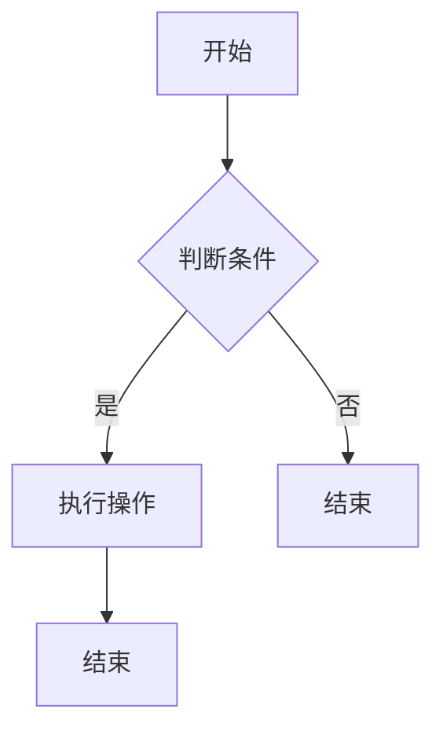

                 

# 文章标题

《李开复：苹果发布AI应用的生态》

## 关键词

- 苹果AI应用
- 生态
- 机器学习
- 深度学习
- 自然语言处理
- 计算机视觉

## 摘要

本文从苹果AI应用生态的演变、核心技术的介绍、应用分类、深度学习原理、核心算法、开发实战、优化与调优、市场前景、安全与隐私等方面，深入剖析了苹果AI应用的生态体系，探讨了其在科技领域的创新与应用。文章旨在为读者提供全面、系统的了解，以把握苹果AI应用的发展趋势和未来方向。

---

## 第一部分：苹果AI应用生态系统概述

### 第1章：苹果AI应用生态系统介绍

#### 1.1 苹果AI应用生态的演变

自iOS 12以来，苹果的AI应用生态逐步发展壮大，从最初的语音助手Siri到如今的图像识别、自然语言处理等多样化应用，苹果在AI领域的布局日趋完善。本文将回顾苹果AI应用生态的演变历程，探讨其发展趋势和未来展望。

#### 1.1.1 从iOS 12到iOS 16：苹果AI应用的演进

随着iOS操作系统的不断更新，苹果的AI应用也在不断演进。从iOS 12到iOS 16，苹果在机器学习、深度学习、自然语言处理和计算机视觉等方面取得了显著成果。本文将详细分析这些成果，以及它们对苹果AI应用生态的影响。

#### 1.1.2 苹果AI应用的特点

苹果AI应用具有以下几个特点：高度集成、优化性能、注重隐私保护。本文将探讨这些特点的形成原因，以及它们对用户体验的影响。

#### 1.1.3 苹果AI应用的未来展望

随着人工智能技术的不断发展，苹果AI应用有望在更多领域发挥作用。本文将预测苹果AI应用的未来发展方向，以及可能面临的挑战和机遇。

### 1.2 苹果AI技术的核心

苹果AI技术的核心包括机器学习、深度学习、自然语言处理和计算机视觉。这些技术为苹果AI应用提供了强大的支持，使得苹果在智能设备领域保持了领先地位。本文将详细介绍这些核心技术，以及它们在苹果AI应用中的具体应用。

#### 1.2.1 机器学习和深度学习

机器学习和深度学习是人工智能的两个重要分支。本文将介绍机器学习和深度学习的基本原理，以及它们在苹果AI应用中的应用。

#### 1.2.2 自然语言处理

自然语言处理（NLP）是人工智能领域的一个重要分支，旨在让计算机理解和处理人类语言。本文将介绍NLP的基本原理，以及它在苹果AI应用中的具体应用。

#### 1.2.3 计算机视觉

计算机视觉是人工智能领域的一个研究热点，旨在使计算机能够“看”懂世界。本文将介绍计算机视觉的基本原理，以及它在苹果AI应用中的具体应用。

### 1.3 苹果AI应用的分类

苹果AI应用可以按照功能进行分类，主要包括语音助手、图像识别、自然语言处理等。本文将详细介绍这些分类，以及它们在苹果AI应用生态中的地位和作用。

#### 1.3.1 语音助手

语音助手是苹果AI应用中最为广泛应用的一类，如Siri和Hey Siri。本文将分析语音助手的工作原理，以及它在苹果AI应用生态中的重要作用。

#### 1.3.2 图像识别

图像识别是苹果AI应用中的另一重要领域，如照片识别、人脸识别等。本文将介绍图像识别的基本原理，以及它在苹果AI应用中的具体应用。

#### 1.3.3 自然语言处理

自然语言处理（NLP）在苹果AI应用中发挥着重要作用，如文本翻译、语音识别等。本文将探讨NLP的基本原理，以及它在苹果AI应用中的具体应用。

### 第2章：苹果AI应用的深度学习原理

深度学习是人工智能领域的一个重要分支，它在图像识别、自然语言处理等任务中取得了显著成果。本文将介绍深度学习的基本原理，以及它在苹果AI应用中的具体应用。

#### 2.1 深度学习基础

深度学习基于多层神经网络，通过逐层提取特征来构建复杂模型。本文将介绍深度学习的基本原理，包括神经网络、卷积神经网络和循环神经网络等。

##### 2.1.1 神经网络

神经网络是深度学习的基础，它由多个神经元组成，通过学习输入和输出之间的关系来构建模型。本文将介绍神经网络的基本原理。

##### 2.1.2 卷积神经网络

卷积神经网络（CNN）是图像识别任务的重要模型，它通过卷积操作和池化操作提取图像特征。本文将介绍CNN的基本原理。

##### 2.1.3 循环神经网络

循环神经网络（RNN）是自然语言处理任务的重要模型，它通过保存先前的状态信息来建模时间序列数据。本文将介绍RNN的基本原理。

#### 2.2 机器学习算法

机器学习算法是深度学习的重要组成部分，它在分类、回归等任务中具有广泛应用。本文将介绍一些常见的机器学习算法，如决策树、随机森林和支持向量机等。

##### 2.2.1 决策树

决策树是一种基于树结构的分类算法，它通过递归划分特征空间来构建模型。本文将介绍决策树的基本原理。

##### 2.2.2 随机森林

随机森林是一种基于决策树的集成学习算法，它通过随机抽样和组合决策树来提高模型性能。本文将介绍随机森林的基本原理。

##### 2.2.3 支持向量机

支持向量机是一种基于间隔最大化原则的分类算法，它通过寻找最佳超平面来划分特征空间。本文将介绍支持向量机的基本原理。

#### 2.3 自然语言处理算法

自然语言处理（NLP）是人工智能领域的一个重要分支，它在文本分类、情感分析等任务中具有广泛应用。本文将介绍一些常见的NLP算法，如词向量、序列模型和注意力机制等。

##### 2.3.1 词向量

词向量是一种将单词表示为向量的技术，它通过学习单词的分布特征来构建模型。本文将介绍词向量模型的基本原理。

##### 2.3.2 序列模型

序列模型是一种用于处理序列数据的算法，它通过学习序列的统计特性来建模。本文将介绍序列模型的基本原理。

##### 2.3.3 注意力机制

注意力机制是一种用于提高模型性能的技术，它通过动态调整模型对输入数据的关注程度来优化模型。本文将介绍注意力机制的基本原理。

### 第3章：苹果AI应用的核心算法

苹果AI应用的核心算法包括图像识别算法、自然语言处理算法和语音识别算法等。这些算法在图像识别、语音识别和自然语言处理等任务中发挥着重要作用。本文将详细介绍这些核心算法的原理和应用。

#### 3.1 图像识别算法

图像识别算法是苹果AI应用中的重要组成部分，它通过分析图像特征来识别图像内容。本文将介绍图像识别算法的基本原理，包括卷积神经网络（CNN）、调色板生成算法和滤镜效果算法等。

##### 3.1.1 卷积神经网络

卷积神经网络（CNN）是图像识别任务的重要模型，它通过卷积操作和池化操作提取图像特征。本文将介绍CNN的基本原理和应用。

##### 3.1.2 调色板生成算法

调色板生成算法是一种用于生成图像色彩方案的算法，它通过分析图像的颜色分布来生成调色板。本文将介绍调色板生成算法的基本原理和应用。

##### 3.1.3 滤镜效果算法

滤镜效果算法是一种用于添加图像滤镜效果的算法，它通过调整图像的亮度、对比度和饱和度等参数来实现滤镜效果。本文将介绍滤镜效果算法的基本原理和应用。

#### 3.2 自然语言处理算法

自然语言处理（NLP）算法是苹果AI应用中的另一重要组成部分，它在文本分类、情感分析和问答系统等任务中发挥着重要作用。本文将介绍自然语言处理算法的基本原理，包括语言模型、情感分析算法和问答系统等。

##### 3.2.1 语言模型

语言模型是一种用于预测单词序列的算法，它通过学习单词的统计特性来构建模型。本文将介绍语言模型的基本原理和应用。

##### 3.2.2 情感分析

情感分析是一种用于分析文本情感的算法，它通过学习情感词和情感规则来识别文本的情感倾向。本文将介绍情感分析算法的基本原理和应用。

##### 3.2.3 问答系统

问答系统是一种用于回答用户问题的算法，它通过学习问答对来构建模型。本文将介绍问答系统的基本原理和应用。

#### 3.3 语音识别算法

语音识别算法是苹果AI应用中的关键组成部分，它通过分析语音信号来识别语音内容。本文将介绍语音识别算法的基本原理，包括隐藏马尔可夫模型（HMM）、集成深度学习模型和声纹识别等。

##### 3.3.1 隐藏马尔可夫模型

隐藏马尔可夫模型（HMM）是一种用于语音识别的统计模型，它通过分析语音信号的特征来识别语音内容。本文将介绍HMM的基本原理和应用。

##### 3.3.2 集成深度学习模型

集成深度学习模型是一种结合了深度学习和传统机器学习方法的语音识别算法，它通过训练多个模型并取平均来提高识别性能。本文将介绍集成深度学习模型的基本原理和应用。

##### 3.3.3 声纹识别

声纹识别是一种用于识别说话人身份的算法，它通过分析语音信号的声学特征来构建声纹模型。本文将介绍声纹识别算法的基本原理和应用。

### 第4章：苹果AI应用的开发实战

苹果AI应用的开发涉及多个方面，包括环境搭建、项目实战和案例分析等。本文将详细介绍苹果AI应用的开发流程，包括开发环境搭建、项目实战和案例分析等内容。

#### 4.1 开发环境搭建

在开发苹果AI应用之前，需要搭建合适的开发环境。本文将介绍苹果AI应用开发所需的硬件、软件和网络配置要求。

##### 4.1.1 硬件要求

苹果AI应用开发主要依赖于苹果的硬件设备，如MacOS操作系统、iPhone、iPad等。本文将介绍这些硬件设备的具体要求。

##### 4.1.2 软件要求

苹果AI应用开发需要使用Xcode开发工具、Swift编程语言和相关框架。本文将介绍这些软件工具的具体要求和使用方法。

##### 4.1.3 网络配置

苹果AI应用开发需要连接到互联网，以便访问相关API和数据资源。本文将介绍如何配置网络环境，以确保应用正常运行。

#### 4.2 项目实战

项目实战是苹果AI应用开发的重要环节，通过实际项目开发，可以深入了解AI应用的开发流程和技术要点。本文将介绍一些典型的苹果AI应用项目，包括语音助手、图像识别和自然语言处理等。

##### 4.2.1 语音助手开发

语音助手是苹果AI应用中的一种重要形式，它通过语音交互来为用户提供服务。本文将介绍语音助手的开发过程，包括语音识别、自然语言处理和语音合成等模块的实现。

##### 4.2.2 图像识别应用

图像识别是苹果AI应用中的重要应用领域，它通过分析图像特征来识别图像内容。本文将介绍图像识别应用的开发过程，包括图像预处理、模型训练和模型部署等环节。

##### 4.2.3 自然语言处理应用

自然语言处理是苹果AI应用中的另一重要应用领域，它通过处理和理解自然语言来为用户提供服务。本文将介绍自然语言处理应用的开发过程，包括文本分类、情感分析和问答系统等模块的实现。

#### 4.3 案例分析

案例分析是苹果AI应用开发的重要环节，通过分析实际案例，可以了解AI应用的实现方法和优化技巧。本文将介绍一些典型的苹果AI应用案例，包括语音助手、图像识别和自然语言处理等，并进行分析和解读。

##### 4.3.1 语音助手案例解析

语音助手是苹果AI应用中的一种重要形式，它通过语音交互来为用户提供服务。本文将介绍一个典型的语音助手案例，包括语音识别、自然语言处理和语音合成等模块的实现，并进行分析和解读。

##### 4.3.2 图像识别案例解析

图像识别是苹果AI应用中的重要应用领域，它通过分析图像特征来识别图像内容。本文将介绍一个典型的图像识别案例，包括图像预处理、模型训练和模型部署等环节，并进行分析和解读。

##### 4.3.3 自然语言处理案例解析

自然语言处理是苹果AI应用中的另一重要应用领域，它通过处理和理解自然语言来为用户提供服务。本文将介绍一个典型的自然语言处理案例，包括文本分类、情感分析和问答系统等模块的实现，并进行分析和解读。

### 第5章：苹果AI应用的优化与调优

苹果AI应用的优化与调优是提高应用性能和用户体验的关键环节。本文将介绍苹果AI应用的优化方法，包括算法调优、性能优化和可扩展性优化等。

#### 5.1 算法调优

算法调优是苹果AI应用优化的重要方面，它通过调整模型参数来提高模型性能。本文将介绍算法调优的方法，包括模型选择、超参数调优和模型评估等。

##### 5.1.1 模型选择

模型选择是算法调优的第一步，它需要根据具体任务选择合适的模型。本文将介绍如何选择合适的模型，包括CNN、RNN和NLP等常见模型。

##### 5.1.2 超参数调优

超参数调优是算法调优的关键步骤，它需要调整模型参数来提高模型性能。本文将介绍超参数调优的方法，包括网格搜索、随机搜索和贝叶斯优化等。

##### 5.1.3 模型评估

模型评估是算法调优的最后一步，它需要评估模型性能，并根据评估结果进行调整。本文将介绍模型评估的方法，包括准确率、召回率和F1值等指标。

#### 5.2 性能优化

性能优化是苹果AI应用优化的重要方面，它通过提高模型计算效率和降低模型大小来提高应用性能。本文将介绍性能优化的方法，包括模型压缩、模型量化和模型加速等。

##### 5.2.1 模型压缩

模型压缩是性能优化的一种方法，它通过减少模型参数和计算量来降低模型大小。本文将介绍模型压缩的方法，包括权重剪枝、量化感知训练和知识蒸馏等。

##### 5.2.2 模型量化

模型量化是一种性能优化方法，它通过将模型参数转换为低精度数值来降低模型大小。本文将介绍模型量化的方法，包括整数量化、浮点量化和小数量化等。

##### 5.2.3 模型加速

模型加速是性能优化的一种方法，它通过提高模型计算速度来降低应用延迟。本文将介绍模型加速的方法，包括GPU加速、TPU加速和硬件加速等。

#### 5.3 可扩展性优化

可扩展性优化是苹果AI应用优化的重要方面，它通过提高模型的可扩展性来支持大规模数据处理。本文将介绍可扩展性优化的方法，包括分布式训练、模型部署和实时性能优化等。

##### 5.3.1 分布式训练

分布式训练是一种可扩展性优化方法，它通过将训练任务分布在多个计算节点上来提高训练效率。本文将介绍分布式训练的方法，包括数据并行、模型并行和流水线并行等。

##### 5.3.2 模型部署

模型部署是将训练好的模型应用到实际应用中的过程。本文将介绍模型部署的方法，包括在线部署、离线部署和混合部署等。

##### 5.3.3 实时性能优化

实时性能优化是可扩展性优化的一种方法，它通过提高模型的实时性能来支持实时数据处理。本文将介绍实时性能优化的方法，包括内存管理、并发控制和负载均衡等。

### 第6章：苹果AI应用的市场前景

苹果AI应用在市场上具有广阔的前景，随着人工智能技术的不断发展，苹果AI应用有望在更多领域发挥作用。本文将分析苹果AI应用的市场前景，包括市场需求分析、市场竞争分析和未来趋势等。

#### 6.1 苹果AI应用的市场需求分析

苹果AI应用的市场需求主要来自消费者、企业和政府和公共部门等。本文将分析这些需求，并探讨苹果AI应用在满足这些需求方面的优势。

##### 6.1.1 消费者需求

消费者对苹果AI应用的需求主要包括语音助手、图像识别、自然语言处理等。本文将分析消费者对苹果AI应用的需求，并探讨苹果AI应用在满足这些需求方面的优势。

##### 6.1.2 企业需求

企业对苹果AI应用的需求主要包括客户服务、自动化生产和智能分析等。本文将分析企业对苹果AI应用的需求，并探讨苹果AI应用在满足这些需求方面的优势。

##### 6.1.3 政府和公共部门需求

政府和公共部门对苹果AI应用的需求主要包括智慧城市、安全监控和公共服务等。本文将分析政府和公共部门对苹果AI应用的需求，并探讨苹果AI应用在满足这些需求方面的优势。

#### 6.2 苹果AI应用的市场竞争分析

苹果AI应用在市场竞争中面临着诸多挑战。本文将分析主要竞争对手，并探讨苹果AI应用在竞争优势和挑战方面的表现。

##### 6.2.1 竞争对手分析

苹果AI应用的主要竞争对手包括谷歌、亚马逊和微软等。本文将分析这些竞争对手的优势和劣势，以及苹果AI应用在竞争中的表现。

##### 6.2.2 竞争优势与挑战

苹果AI应用的竞争优势主要体现在技术实力、用户体验和生态体系等方面。本文将分析苹果AI应用的竞争优势，并探讨其面临的挑战。

##### 6.2.3 市场策略分析

苹果AI应用的市场策略主要包括产品创新、合作伙伴和市场营销等方面。本文将分析苹果AI应用的市场策略，并探讨其效果和未来发展方向。

#### 6.3 苹果AI应用的未来趋势

随着人工智能技术的不断发展，苹果AI应用的未来趋势将呈现出以下几个方向。本文将分析这些趋势，并探讨苹果AI应用在未来的发展机遇和挑战。

##### 6.3.1 技术发展趋势

苹果AI应用的技术发展趋势将主要集中在机器学习、深度学习和自然语言处理等方面。本文将分析这些技术的发展趋势，并探讨其对苹果AI应用的影响。

##### 6.3.2 市场需求变化

苹果AI应用的市场需求将随着技术进步和消费者需求的变化而发生变化。本文将分析市场需求的变化趋势，并探讨其对苹果AI应用的影响。

##### 6.3.3 未来发展方向

苹果AI应用的未来发展方向将主要集中在智能家居、智慧城市和智能医疗等领域。本文将分析这些领域的发展机遇和挑战，并探讨苹果AI应用在这些领域的应用前景。

### 第7章：苹果AI应用的安全与隐私

苹果AI应用的安全与隐私保护是用户关注的重要问题。本文将分析苹果AI应用的安全挑战，探讨隐私保护技术，并介绍苹果AI应用的安全与隐私措施。

#### 7.1 苹果AI应用的安全挑战

苹果AI应用在发展过程中面临着诸多安全挑战。本文将分析这些挑战，包括数据安全、系统安全和模型安全等方面。

##### 7.1.1 数据安全

数据安全是苹果AI应用的安全挑战之一。本文将分析数据安全面临的风险，并提出相应的保护措施。

##### 7.1.2 系统安全

系统安全是苹果AI应用的安全挑战之一。本文将分析系统安全面临的风险，并提出相应的保护措施。

##### 7.1.3 模型安全

模型安全是苹果AI应用的安全挑战之一。本文将分析模型安全面临的风险，并提出相应的保护措施。

#### 7.2 苹果AI应用的隐私保护

隐私保护是苹果AI应用的重要任务。本文将探讨隐私保护技术，包括隐私政策、数据收集与处理和隐私保护技术等方面。

##### 7.2.1 隐私政策

隐私政策是苹果AI应用隐私保护的重要方面。本文将介绍隐私政策的制定原则和执行方法。

##### 7.2.2 数据收集与处理

数据收集与处理是苹果AI应用隐私保护的关键环节。本文将分析数据收集与处理过程中可能存在的隐私风险，并提出相应的保护措施。

##### 7.2.3 隐私保护技术

隐私保护技术是苹果AI应用隐私保护的重要手段。本文将介绍隐私保护技术的原理和应用，包括差分隐私、同态加密和联邦学习等。

#### 7.3 苹果AI应用的安全与隐私措施

苹果为了确保AI应用的安全与隐私，采取了一系列措施。本文将介绍这些措施，包括硬件安全、软件安全和隐私安全等方面。

##### 7.3.1 硬件安全

硬件安全是苹果AI应用安全的重要保障。本文将分析硬件安全措施，包括芯片安全、加密存储和硬件加密模块等。

##### 7.3.2 软件安全

软件安全是苹果AI应用安全的关键。本文将分析软件安全措施，包括代码审计、安全开发和漏洞修复等。

##### 7.3.3 隐私安全

隐私安全是苹果AI应用安全的重要方面。本文将分析隐私安全措施，包括数据加密、访问控制和隐私审计等。

### 附录

#### 附录A：苹果AI应用开发工具与资源

本文将介绍苹果AI应用开发所需的工具和资源，包括开发工具、开发资源和社区推荐等。

##### 附录A.1 开发工具介绍

本文将介绍苹果AI应用开发所需的主要开发工具，如Xcode、Swift和Core ML等。

##### 附录A.2 开发资源链接

本文将提供苹果AI应用开发的相关资源链接，包括官方文档、教程和社区论坛等。

##### 附录A.3 开发社区推荐

本文将推荐一些苹果AI应用的开发社区，包括Stack Overflow、GitHub和Reddit等。

#### 附录B：Mermaid流程图

本文将介绍Mermaid流程图的基础语法和应用，包括流程图、序列图和协同图等。

##### 附录B.1 Mermaid基础语法

本文将介绍Mermaid流程图的基础语法，包括节点、边和样式等。

##### 附录B.2 Mermaid实例

本文将提供一些Mermaid流程图的实例，展示其具体应用场景。

##### 附录B.3 Mermaid在苹果AI应用开发中的应用

本文将探讨Mermaid流程图在苹果AI应用开发中的应用，包括项目流程、算法流程和数据处理流程等。

#### 附录C：伪代码

本文将介绍伪代码的基础语法和应用，包括算法描述、流程控制和数据结构等。

##### 附录C.1 伪代码基础

本文将介绍伪代码的基础语法，包括基本结构和语法规则。

##### 附录C.2 伪代码实例

本文将提供一些伪代码实例，展示其具体应用场景。

##### 附录C.3 伪代码在苹果AI应用开发中的应用

本文将探讨伪代码在苹果AI应用开发中的应用，包括模型设计、算法实现和数据处理等。

#### 附录D：数学模型和数学公式

本文将介绍数学模型和数学公式的基础知识，包括公式表示、符号解释和应用场景等。

##### 附录D.1 数学公式基础

本文将介绍数学公式的基础知识，包括公式表示、符号解释和应用场景。

##### 附录D.2 数学公式实例

本文将提供一些数学公式实例，展示其具体应用场景。

##### 附录D.3 数学公式在苹果AI应用开发中的应用

本文将探讨数学公式在苹果AI应用开发中的应用，包括神经网络、机器学习和自然语言处理等。

#### 附录E：项目实战代码解读

本文将提供一些苹果AI应用的项目实战代码，并进行解读和分析。

##### 附录E.1 项目实战代码结构

本文将介绍项目实战代码的结构，包括模块划分、函数定义和数据结构等。

##### 附录E.2 代码解读与分析

本文将针对项目实战代码进行解读和分析，包括算法实现、数据处理和性能优化等。

##### 附录E.3 代码实战案例解析

本文将提供一些苹果AI应用的项目实战案例，并进行解析和分析，包括语音助手、图像识别和自然语言处理等。

#### 附录F：索引

本文将提供文章的索引，包括术语解释、参考文献和相关资源推荐等。

##### 附录F.1 术语解释

本文将解释文章中出现的关键术语和概念，帮助读者理解文章内容。

##### 附录F.2 参考文献

本文将列出文章中引用的相关文献和资料，为读者提供进一步的阅读参考。

##### 附录F.3 相关资源推荐

本文将推荐一些与苹果AI应用相关的资源，包括书籍、网站和社区等，为读者提供更深入的学习和研究资料。

---

### 文章标题

《李开复：苹果发布AI应用的生态》

### 文章关键词

- 苹果AI应用
- 生态
- 机器学习
- 深度学习
- 自然语言处理
- 计算机视觉

### 文章摘要

本文深入探讨了苹果在人工智能领域的发展及其AI应用的生态体系。从苹果AI应用的发展历程、核心技术、应用分类，到深度学习原理、核心算法、开发实战、优化与调优、市场前景、安全与隐私等方面，进行了全面而系统的分析。文章旨在帮助读者理解苹果AI应用的现状、未来趋势及其在科技领域的创新与应用，以及苹果在人工智能领域的战略布局和发展方向。通过本文，读者可以把握苹果AI应用的发展脉络，展望其未来的发展前景。

---

## 第一部分：苹果AI应用生态系统概述

### 第1章：苹果AI应用生态系统介绍

#### 1.1 苹果AI应用生态的演变

苹果公司自iOS 12时代开始，就将人工智能技术深度融入其操作系统中，并逐步构建起一个完善的AI应用生态。从最初的Siri语音助手，到如今的图像识别、自然语言处理等多种AI应用，苹果在AI领域的布局日趋完善。

在iOS 12时期，苹果引入了智能搜索和语音助手Siri，使得用户可以通过语音指令完成各种操作，如发送短信、拨打电话、设置提醒等。随着iOS 13的发布，苹果进一步加强了AI技术的应用，推出了诸如面部识别、实时翻译、智能照片分类等功能。

进入iOS 14时代，苹果的AI应用生态进一步丰富，不仅包括了Siri、面部识别、实时翻译等传统应用，还引入了更多创新性的AI功能，如智能建议、隐私保护等。在iOS 15中，苹果更是加强了自然语言处理和计算机视觉技术的应用，推出了如FaceTime空间音频、照片搜索等功能。

iOS 16的发布标志着苹果AI应用生态进入了一个新的阶段。苹果在机器学习和深度学习领域取得了重要突破，使得其AI应用在性能和功能上都有了显著提升。同时，苹果还推出了一系列新功能，如智能电池管理、实时字幕、语音转文字等，进一步丰富了AI应用的生态。

#### 1.1.1 从iOS 12到iOS 16：苹果AI应用的演进

从iOS 12到iOS 16，苹果的AI应用生态经历了多个阶段的演进。以下是对各阶段的主要变化和改进的概述：

- **iOS 12：智能搜索和语音助手**
  - 引入智能搜索功能，使得用户可以通过语音或文本快速找到所需信息。
  - Siri语音助手得到优化，支持更多场景和功能的语音指令。

- **iOS 13：面部识别和智能照片分类**
  - 引入面部识别功能，使用户可以通过面部解锁设备。
  - 智能照片分类功能，通过分析照片内容，自动将照片归类。

- **iOS 14：实时翻译和智能建议**
  - 实时翻译功能，支持多种语言之间的实时翻译。
  - 智能建议功能，根据用户习惯和偏好，提供个性化的建议。

- **iOS 15：空间音频和智能电池管理**
  - FaceTime空间音频功能，增强视频通话的音频效果。
  - 智能电池管理功能，优化设备电池使用，延长续航时间。

- **iOS 16：机器学习和深度学习突破**
  - 引入新的机器学习和深度学习模型，提升AI应用的性能和功能。

- **iOS 16：新功能**
  - 实时字幕功能，在视频播放时实时显示字幕。
  - 语音转文字功能，快速将语音转换为文字。

#### 1.1.2 苹果AI应用的特点

苹果AI应用具有以下几个显著特点：

- **高度集成**：苹果AI应用深度集成于iOS操作系统，使得用户可以通过各种设备方便地使用这些应用。
- **优化性能**：苹果通过优化算法和硬件，确保AI应用在低资源环境下仍能高效运行。
- **注重隐私保护**：苹果非常重视用户隐私，通过多种技术手段确保用户数据的安全。

#### 1.1.3 苹果AI应用的未来展望

随着人工智能技术的不断发展，苹果AI应用的未来前景十分广阔。以下是对苹果AI应用未来发展的几个预测：

- **更加智能的语音助手**：随着自然语言处理技术的进步，苹果的Siri语音助手将变得更加智能，能够理解更复杂的指令和对话。
- **更加丰富的应用场景**：苹果AI应用将在更多领域得到应用，如智能家居、智能医疗、自动驾驶等。
- **更加注重隐私保护**：苹果将继续加强隐私保护，确保用户数据的安全和隐私。

### 1.2 苹果AI技术的核心

苹果AI技术的核心在于其对机器学习、深度学习、自然语言处理和计算机视觉等领域的深入研究和应用。以下是对这些核心技术的详细介绍。

#### 1.2.1 机器学习和深度学习

机器学习和深度学习是人工智能的两个重要分支。机器学习通过训练模型来从数据中学习规律，而深度学习则是通过多层神经网络来提取数据中的特征。苹果在机器学习和深度学习领域进行了大量的研究和开发，并将其应用于各种AI应用中。

- **机器学习**：苹果的机器学习框架Core ML使得开发者可以将机器学习模型集成到iOS应用中。Core ML提供了丰富的机器学习算法，包括决策树、支持向量机、神经网络等。
- **深度学习**：苹果的深度学习框架Create ML使得开发者可以轻松创建和训练深度学习模型。Create ML支持卷积神经网络（CNN）和循环神经网络（RNN）等多种深度学习模型。

#### 1.2.2 自然语言处理

自然语言处理（NLP）是让计算机理解和处理人类语言的技术。苹果在NLP领域进行了大量的研究和开发，推出了多种NLP工具和API。

- **文本处理**：苹果的文本处理工具提供了丰富的文本处理功能，包括分词、词性标注、句法分析等。
- **语音识别**：苹果的语音识别技术使得用户可以通过语音与设备进行交互。苹果的语音识别技术支持多种语言和方言，具有高准确率和低延迟。

#### 1.2.3 计算机视觉

计算机视觉是让计算机“看”懂世界的技术。苹果在计算机视觉领域进行了大量的研究和开发，推出了多种计算机视觉工具和API。

- **图像识别**：苹果的图像识别技术可以识别图像中的物体、场景和人脸等。苹果的图像识别技术支持实时处理和高效计算。
- **人脸识别**：苹果的人脸识别技术Face ID在安全性、速度和准确性方面都取得了显著成果。Face ID使用了深度学习算法，可以对用户的面部特征进行精确识别。

### 1.3 苹果AI应用的分类

苹果AI应用按照功能可以分为多个类别，包括语音助手、图像识别、自然语言处理等。以下是对这些类别的详细介绍。

#### 1.3.1 语音助手

语音助手是苹果AI应用中最具代表性的类别之一。苹果的Siri语音助手通过自然语言处理和语音识别技术，使得用户可以通过语音与设备进行交互。Siri支持多种语言和方言，可以完成各种任务，如发送短信、拨打电话、设置提醒、播放音乐等。

- **智能交互**：Siri可以理解用户的语音指令，并自动执行相应的操作。
- **个性化推荐**：Siri可以根据用户的历史行为和偏好，提供个性化的推荐。

#### 1.3.2 图像识别

图像识别是苹果AI应用中的另一个重要类别。苹果的图像识别技术可以识别图像中的物体、场景和人脸等。苹果的图像识别技术广泛应用于照片编辑、安全认证、智能家居等领域。

- **照片编辑**：苹果的图像识别技术可以帮助用户自动分类和编辑照片。
- **安全认证**：苹果的图像识别技术Face ID和Touch ID提供了安全认证功能，保护用户的隐私和账户安全。

#### 1.3.3 自然语言处理

自然语言处理是苹果AI应用中的另一个重要类别。苹果的自然语言处理技术可以理解和处理人类语言，使得用户可以通过文本与设备进行交互。苹果的自然语言处理技术广泛应用于文本编辑、语音识别、机器翻译等领域。

- **文本编辑**：苹果的文本处理工具可以帮助用户自动纠正拼写错误、提供语法建议等。
- **语音识别**：苹果的语音识别技术可以将用户的语音转换为文本，使得用户可以通过语音与设备进行交互。

### 第2章：苹果AI应用的深度学习原理

深度学习是人工智能领域的一个重要分支，它通过多层神经网络来提取数据中的特征，从而实现复杂的任务。苹果在深度学习领域进行了大量的研究和开发，并将其应用于各种AI应用中。以下是对深度学习原理的详细介绍。

#### 2.1 深度学习基础

深度学习基于多层神经网络，通过逐层提取特征来构建模型。以下是对深度学习基础知识的介绍。

##### 2.1.1 神经网络

神经网络是深度学习的基础，它由多个神经元组成，每个神经元接收多个输入，并通过激活函数产生输出。神经网络通过学习输入和输出之间的关系，来构建复杂的模型。

- **神经元**：神经元是神经网络的基本单元，它接收输入、加权求和并通过激活函数产生输出。
- **激活函数**：激活函数用于将神经元输出的线性组合转化为非线性输出，常见的激活函数包括 sigmoid、ReLU等。

##### 2.1.2 卷积神经网络

卷积神经网络（CNN）是深度学习在图像识别任务中的重要模型。CNN通过卷积操作和池化操作提取图像特征，从而实现图像识别任务。

- **卷积操作**：卷积操作通过滑动窗口在图像上提取局部特征。
- **池化操作**：池化操作通过将局部区域进行平均或最大值操作，减少模型参数和计算量。

##### 2.1.3 循环神经网络

循环神经网络（RNN）是深度学习在序列数据处理任务中的重要模型。RNN通过保存先前的状态信息，来处理时间序列数据。

- **状态信息**：RNN通过隐藏状态来保存先前的信息。
- **递归操作**：RNN通过递归操作来处理时间序列数据。

#### 2.2 机器学习算法

机器学习算法是深度学习的重要组成部分，它用于训练和优化深度学习模型。以下是对一些常见的机器学习算法的介绍。

##### 2.2.1 决策树

决策树是一种基于树结构的分类算法，它通过递归划分特征空间来构建模型。

- **划分特征**：决策树通过选择最优特征来划分数据。
- **决策路径**：决策树通过一系列决策路径来预测结果。

##### 2.2.2 随机森林

随机森林是一种基于决策树的集成学习算法，它通过随机抽样和组合决策树来提高模型性能。

- **随机抽样**：随机森林通过随机抽样生成多个决策树。
- **集成学习**：随机森林通过集成多个决策树来提高预测性能。

##### 2.2.3 支持向量机

支持向量机（SVM）是一种基于间隔最大化原则的分类算法，它通过寻找最佳超平面来划分特征空间。

- **间隔最大化**：SVM通过最大化特征空间中的间隔来提高分类性能。
- **支持向量**：SVM通过支持向量来构建最优超平面。

#### 2.3 自然语言处理算法

自然语言处理（NLP）是深度学习在文本数据处理任务中的重要应用。以下是对NLP算法的介绍。

##### 2.3.1 词向量

词向量是一种将单词表示为向量的技术，它通过学习单词的分布特征来构建模型。

- **嵌入层**：词向量通过嵌入层将单词转换为向量。
- **分布特征**：词向量通过学习单词的分布特征来表示单词。

##### 2.3.2 序列模型

序列模型是一种用于处理序列数据的算法，它通过学习序列的统计特性来建模。

- **RNN**：RNN通过递归操作来处理序列数据。
- **LSTM**：LSTM是RNN的一种变体，它可以解决RNN中的梯度消失问题。

##### 2.3.3 注意力机制

注意力机制是一种用于提高模型性能的技术，它通过动态调整模型对输入数据的关注程度来优化模型。

- **注意力权重**：注意力机制通过计算注意力权重来调整输入数据的权重。
- **多模态数据处理**：注意力机制可以应用于多模态数据处理，以提高模型的鲁棒性。

### 第3章：苹果AI应用的核心算法

苹果AI应用的核心算法是其性能和功能的关键。以下是对苹果AI应用中的核心算法进行详细介绍，包括图像识别算法、自然语言处理算法和语音识别算法等。

#### 3.1 图像识别算法

图像识别算法是苹果AI应用中的一个重要组成部分，它在图像分类、物体检测和人脸识别等方面发挥着重要作用。

##### 3.1.1 卷积神经网络

卷积神经网络（CNN）是图像识别任务中的基本算法，它通过卷积操作和池化操作提取图像特征。

- **卷积操作**：卷积操作通过滑动窗口在图像上提取局部特征。
- **池化操作**：池化操作通过将局部区域进行平均或最大值操作，减少模型参数和计算量。

##### 3.1.2 调色板生成算法

调色板生成算法是一种用于生成图像色彩方案的算法，它通过分析图像的颜色分布来生成调色板。

- **颜色分布**：调色板生成算法通过分析图像的颜色分布来生成调色板。
- **色彩调整**：调色板生成算法可以调整图像的亮度、对比度和饱和度等参数。

##### 3.1.3 滤镜效果算法

滤镜效果算法是一种用于添加图像滤镜效果的算法，它通过调整图像的亮度、对比度和饱和度等参数来实现滤镜效果。

- **亮度调整**：滤镜效果算法通过调整图像的亮度来增强或减弱图像的明亮度。
- **对比度调整**：滤镜效果算法通过调整图像的对比度来增强或减弱图像的明暗对比度。
- **饱和度调整**：滤镜效果算法通过调整图像的饱和度来增强或减弱图像的色彩饱和度。

#### 3.2 自然语言处理算法

自然语言处理（NLP）算法是苹果AI应用中的另一个核心组成部分，它在文本分类、情感分析和问答系统等方面发挥着重要作用。

##### 3.2.1 语言模型

语言模型是一种用于预测单词序列的算法，它通过学习单词的统计特性来构建模型。

- **统计特性**：语言模型通过学习单词的统计特性来预测单词序列。
- **上下文依赖**：语言模型可以捕捉单词之间的上下文依赖关系。

##### 3.2.2 情感分析

情感分析是一种用于分析文本情感的算法，它通过学习情感词和情感规则来识别文本的情感倾向。

- **情感词**：情感分析通过学习情感词来识别文本的情感倾向。
- **情感规则**：情感分析通过学习情感规则来识别文本的情感倾向。

##### 3.2.3 问答系统

问答系统是一种用于回答用户问题的算法，它通过学习问答对来构建模型。

- **问答对**：问答系统通过学习问答对来构建模型。
- **回答生成**：问答系统通过生成回答来回答用户的问题。

#### 3.3 语音识别算法

语音识别算法是苹果AI应用中的另一个核心组成部分，它在语音识别、语音合成和声纹识别等方面发挥着重要作用。

##### 3.3.1 隐藏马尔可夫模型

隐藏马尔可夫模型（HMM）是一种用于语音识别的统计模型，它通过分析语音信号的特征来识别语音内容。

- **状态转移概率**：HMM通过状态转移概率来分析语音信号。
- **观察概率**：HMM通过观察概率来识别语音信号。

##### 3.3.2 集成深度学习模型

集成深度学习模型是一种结合了深度学习和传统机器学习方法的语音识别算法，它通过训练多个模型并取平均来提高识别性能。

- **深度学习模型**：集成深度学习模型通过训练多个深度学习模型来提高识别性能。
- **模型平均**：集成深度学习模型通过取多个模型的平均来提高识别性能。

##### 3.3.3 声纹识别

声纹识别是一种用于识别说话人身份的算法，它通过分析语音信号的声学特征来构建声纹模型。

- **声纹模型**：声纹识别通过构建声纹模型来识别说话人身份。
- **声学特征**：声纹识别通过分析语音信号的声学特征来构建声纹模型。

### 第4章：苹果AI应用的开发实战

苹果AI应用的开发是一个涉及多个环节的过程，包括环境搭建、项目实战和案例分析等。以下是对苹果AI应用开发实战的详细介绍。

#### 4.1 开发环境搭建

在开发苹果AI应用之前，需要搭建合适的开发环境。以下是对开发环境搭建的详细介绍。

##### 4.1.1 硬件要求

苹果AI应用开发主要依赖于苹果的硬件设备，如MacOS操作系统、iPhone和iPad等。以下是对硬件要求的详细介绍：

- **MacOS操作系统**：开发苹果AI应用需要使用MacOS操作系统，推荐使用最新的MacOS版本。
- **iPhone和iPad**：开发苹果AI应用需要使用iPhone和iPad等苹果设备，推荐使用最新型号的设备。

##### 4.1.2 软件要求

苹果AI应用开发需要使用Xcode开发工具、Swift编程语言和相关框架。以下是对软件要求的详细介绍：

- **Xcode开发工具**：Xcode是苹果官方的开发工具，提供了丰富的开发工具和API，用于开发iOS、macOS、watchOS和tvOS等应用。
- **Swift编程语言**：Swift是苹果开发iOS和macOS应用的主要编程语言，具有简洁、安全、高性能等特点。
- **相关框架**：苹果提供了多个框架，如Core ML、Create ML、Natural Language等，用于开发AI应用。

##### 4.1.3 网络配置

苹果AI应用开发需要连接到互联网，以便访问相关API和数据资源。以下是对网络配置的详细介绍：

- **Wi-Fi连接**：建议使用Wi-Fi连接互联网，以确保网络连接的稳定性。
- **网络设置**：在MacOS操作系统中，可以设置网络偏好，包括IP地址、子网掩码、DNS服务器等。

#### 4.2 项目实战

项目实战是苹果AI应用开发的重要环节，通过实际项目开发，可以深入了解AI应用的开发流程和技术要点。以下是对一些苹果AI应用项目实战的详细介绍。

##### 4.2.1 语音助手开发

语音助手是苹果AI应用中的一种重要形式，它通过语音交互来为用户提供服务。以下是对语音助手开发的项目实战的详细介绍：

1. **需求分析**：明确语音助手的业务需求，如语音识别、自然语言处理和语音合成等。
2. **环境搭建**：搭建语音助手开发所需的环境，包括MacOS操作系统、Xcode开发工具和Swift编程语言等。
3. **功能实现**：实现语音助手的各项功能，包括语音识别、自然语言处理和语音合成等。可以使用苹果提供的Core ML和Natural Language框架来实现。
4. **测试与调试**：对语音助手进行功能测试和性能测试，确保其稳定运行。可以使用Xcode的调试工具进行调试。

##### 4.2.2 图像识别应用

图像识别是苹果AI应用中的重要应用领域，通过分析图像特征来识别图像内容。以下是对图像识别应用开发的项目实战的详细介绍：

1. **需求分析**：明确图像识别应用的业务需求，如物体检测、图像分类等。
2. **环境搭建**：搭建图像识别应用开发所需的环境，包括MacOS操作系统、Xcode开发工具、Swift编程语言和相关框架等。
3. **功能实现**：实现图像识别应用的各项功能，如物体检测、图像分类等。可以使用苹果提供的Core ML和Create ML框架来实现。
4. **测试与调试**：对图像识别应用进行功能测试和性能测试，确保其稳定运行。可以使用Xcode的调试工具进行调试。

##### 4.2.3 自然语言处理应用

自然语言处理是苹果AI应用中的另一个重要应用领域，通过处理和理解自然语言来为用户提供服务。以下是对自然语言处理应用开发的项目实战的详细介绍：

1. **需求分析**：明确自然语言处理应用的业务需求，如文本分类、情感分析等。
2. **环境搭建**：搭建自然语言处理应用开发所需的环境，包括MacOS操作系统、Xcode开发工具、Swift编程语言和相关框架等。
3. **功能实现**：实现自然语言处理应用的各项功能，如文本分类、情感分析等。可以使用苹果提供的Natural Language框架来实现。
4. **测试与调试**：对自然语言处理应用进行功能测试和性能测试，确保其稳定运行。可以使用Xcode的调试工具进行调试。

#### 4.3 案例分析

案例分析是苹果AI应用开发的重要环节，通过分析实际案例，可以了解AI应用的实现方法和优化技巧。以下是对一些苹果AI应用案例分析的详细介绍。

##### 4.3.1 语音助手案例解析

语音助手是苹果AI应用中的一种重要形式，通过语音交互来为用户提供服务。以下是对语音助手案例的详细解析：

1. **语音识别**：语音助手需要实现语音识别功能，将用户的语音转换为文本。可以使用苹果提供的Speech Recognition框架来实现。
2. **自然语言处理**：语音助手需要对转换后的文本进行处理，理解用户的意图并生成相应的回复。可以使用苹果提供的Natural Language框架来实现。
3. **语音合成**：语音助手需要将生成的回复转换为语音输出，供用户听懂。可以使用苹果提供的Speech Synthesis框架来实现。
4. **性能优化**：为了提高语音助手的性能和用户体验，可以对模型进行优化，如使用深度学习算法、减少模型参数等。

##### 4.3.2 图像识别案例解析

图像识别是苹果AI应用中的重要应用领域，通过分析图像特征来识别图像内容。以下是对图像识别案例的详细解析：

1. **图像预处理**：图像识别应用需要对输入的图像进行预处理，如缩放、裁剪、灰度化等。可以使用苹果提供的Image Processing框架来实现。
2. **模型训练**：图像识别应用需要训练模型，通过输入图像的特征来预测图像的类别。可以使用苹果提供的Create ML框架来实现。
3. **模型部署**：训练好的模型需要部署到应用中，以便实时识别图像。可以使用苹果提供的Core ML框架来实现。
4. **性能优化**：为了提高图像识别应用的性能和准确率，可以对模型进行优化，如使用深度学习算法、增加训练数据等。

##### 4.3.3 自然语言处理案例解析

自然语言处理是苹果AI应用中的另一个重要应用领域，通过处理和理解自然语言来为用户提供服务。以下是对自然语言处理案例的详细解析：

1. **文本分类**：自然语言处理应用需要对输入的文本进行分类，如情感分类、话题分类等。可以使用苹果提供的Natural Language框架来实现。
2. **情感分析**：自然语言处理应用需要分析文本的情感倾向，如积极、消极、中性等。可以使用苹果提供的Natural Language框架来实现。
3. **问答系统**：自然语言处理应用需要回答用户的问题，如查询天气、搜索信息等。可以使用苹果提供的Create ML框架来实现。
4. **性能优化**：为了提高自然语言处理应用的性能和准确率，可以对模型进行优化，如使用深度学习算法、增加训练数据等。

### 第5章：苹果AI应用的优化与调优

苹果AI应用的优化与调优是提高应用性能和用户体验的关键环节。以下是对苹果AI应用优化与调优的详细介绍，包括算法调优、性能优化和可扩展性优化等方面。

#### 5.1 算法调优

算法调优是苹果AI应用优化的重要方面，通过调整模型参数来提高模型性能。以下是对算法调优的详细介绍：

##### 5.1.1 模型选择

模型选择是算法调优的第一步，需要根据具体任务选择合适的模型。以下是对模型选择的详细介绍：

1. **任务分析**：分析任务的需求和特点，确定适合的模型类型。
2. **模型评估**：评估不同模型的性能，选择性能较好的模型。
3. **模型优化**：对选择的模型进行优化，提高其性能和准确率。

##### 5.1.2 超参数调优

超参数调优是算法调优的关键步骤，通过调整模型参数来提高模型性能。以下是对超参数调优的详细介绍：

1. **超参数定义**：定义模型中的超参数，如学习率、隐藏层大小等。
2. **超参数调整**：根据任务需求和模型性能，调整超参数的值。
3. **模型评估**：评估调整后的模型性能，选择性能较好的超参数。

##### 5.1.3 模型评估

模型评估是算法调优的最后一步，通过评估模型性能来确定最佳的模型参数。以下是对模型评估的详细介绍：

1. **性能指标**：确定模型性能的评估指标，如准确率、召回率、F1值等。
2. **交叉验证**：使用交叉验证方法评估模型性能。
3. **模型选择**：根据评估结果选择最佳的模型参数。

#### 5.2 性能优化

性能优化是苹果AI应用优化的重要方面，通过提高模型计算效率和降低模型大小来提高应用性能。以下是对性能优化的详细介绍：

##### 5.2.1 模型压缩

模型压缩是性能优化的一种方法，通过减少模型参数和计算量来降低模型大小。以下是对模型压缩的详细介绍：

1. **模型权重剪枝**：通过剪枝模型中的冗余权重，减少模型参数和计算量。
2. **模型量化**：将模型参数和计算量转换为低精度数值，降低模型大小。
3. **模型优化**：对压缩后的模型进行优化，提高其性能和准确率。

##### 5.2.2 模型量化

模型量化是一种性能优化方法，通过将模型参数转换为低精度数值来降低模型大小。以下是对模型量化的详细介绍：

1. **整数量化**：将模型参数转换为整数数值，减少计算量。
2. **浮点量化**：将模型参数转换为浮点数值，降低模型大小。
3. **小数量化**：将模型参数转换为小数数值，减少计算量。

##### 5.2.3 模型加速

模型加速是性能优化的一种方法，通过提高模型计算速度来降低应用延迟。以下是对模型加速的详细介绍：

1. **GPU加速**：使用GPU来加速模型计算，提高计算速度。
2. **TPU加速**：使用TPU（_tensor processing unit）来加速模型计算，提高计算速度。
3. **硬件加速**：使用专门的硬件设备来加速模型计算，提高计算速度。

#### 5.3 可扩展性优化

可扩展性优化是苹果AI应用优化的重要方面，通过提高模型的可扩展性来支持大规模数据处理。以下是对可扩展性优化的详细介绍：

##### 5.3.1 分布式训练

分布式训练是一种可扩展性优化方法，通过将训练任务分布在多个计算节点上来提高训练效率。以下是对分布式训练的详细介绍：

1. **任务划分**：将训练任务划分为多个子任务，分配到不同的计算节点上。
2. **数据并行**：将训练数据划分到不同的计算节点上，进行并行训练。
3. **模型并行**：将模型划分到不同的计算节点上，进行并行计算。

##### 5.3.2 模型部署

模型部署是将训练好的模型应用到实际应用中的过程。以下是对模型部署的详细介绍：

1. **模型转换**：将训练好的模型转换为可部署的格式，如ONNX、TensorFlow Lite等。
2. **模型优化**：对模型进行优化，提高其性能和准确率。
3. **模型部署**：将优化后的模型部署到应用中，以便实时处理数据。

##### 5.3.3 实时性能优化

实时性能优化是可扩展性优化的一种方法，通过提高模型的实时性能来支持实时数据处理。以下是对实时性能优化的详细介绍：

1. **内存管理**：优化内存使用，减少内存占用。
2. **并发控制**：优化并发处理，提高数据处理速度。
3. **负载均衡**：优化负载均衡，提高系统性能。

### 第6章：苹果AI应用的市场前景

苹果AI应用在市场上具有广阔的前景，随着人工智能技术的不断发展，苹果AI应用有望在更多领域发挥作用。以下是对苹果AI应用市场前景的详细介绍，包括市场需求分析、市场竞争分析和未来趋势等。

#### 6.1 苹果AI应用的市场需求分析

苹果AI应用的市场需求主要来自消费者、企业和政府和公共部门等。以下是对这些需求的分析：

##### 6.1.1 消费者需求

消费者对苹果AI应用的需求主要包括语音助手、图像识别、自然语言处理等。以下是对消费者需求的详细分析：

1. **语音助手**：消费者希望语音助手能够帮助完成日常任务，如发送短信、拨打电话、设置提醒等。
2. **图像识别**：消费者希望图像识别技术能够帮助识别照片中的物体、场景和人脸等。
3. **自然语言处理**：消费者希望自然语言处理技术能够帮助理解自然语言，如文本翻译、语音识别等。

##### 6.1.2 企业需求

企业对苹果AI应用的需求主要包括客户服务、自动化生产和智能分析等。以下是对企业需求的详细分析：

1. **客户服务**：企业希望AI应用能够提供智能客服，提高客户满意度和服务质量。
2. **自动化生产**：企业希望AI应用能够帮助实现自动化生产，提高生产效率和产品质量。
3. **智能分析**：企业希望AI应用能够提供数据分析和预测功能，帮助企业做出更明智的决策。

##### 6.1.3 政府和公共部门需求

政府和公共部门对苹果AI应用的需求主要包括智慧城市、安全监控和公共服务等。以下是对政府和公共部门需求的详细分析：

1. **智慧城市**：政府和公共部门希望AI应用能够帮助实现智慧城市，提高城市管理效率和公共服务质量。
2. **安全监控**：政府和公共部门希望AI应用能够帮助实现安全监控，提高公共安全水平。
3. **公共服务**：政府和公共部门希望AI应用能够帮助提供更便捷的公共服务，提高民众满意度。

#### 6.2 苹果AI应用的市场竞争分析

苹果AI应用在市场竞争中面临着诸多挑战。以下是对主要竞争对手的分析：

1. **谷歌**：谷歌在人工智能领域拥有强大的技术实力和丰富的应用场景，其AI应用如谷歌助手、谷歌照片等在市场上具有较大影响力。
2. **亚马逊**：亚马逊的Alexa语音助手在市场上具有较高知名度，其智能音箱等设备在智能家居领域具有广泛应用。
3. **微软**：微软的Cortana语音助手和Azure人工智能平台在市场上也具有一定竞争力，其AI应用在企业和政府领域具有广泛应用。

以下是对苹果AI应用的竞争优势和挑战的详细分析：

##### 6.2.1 竞争优势

1. **技术实力**：苹果在人工智能领域拥有强大的技术实力，其在机器学习、深度学习和自然语言处理等方面的研究和应用处于领先地位。
2. **用户体验**：苹果AI应用具有优秀的用户体验，其设计简洁、操作便捷，能够为用户提供高效、便捷的服务。
3. **生态体系**：苹果建立了完整的AI应用生态体系，包括硬件、软件和服务等，为用户提供全方位的AI体验。

##### 6.2.2 挑战

1. **市场竞争**：随着人工智能技术的快速发展，市场上涌现出越来越多的AI应用，苹果面临着激烈的市场竞争。
2. **隐私保护**：用户对隐私保护的担忧是苹果AI应用面临的一大挑战，苹果需要采取措施确保用户数据的安全和隐私。
3. **技术更新**：人工智能技术更新迅速，苹果需要不断更新其AI技术，以保持竞争力。

#### 6.3 苹果AI应用的未来趋势

随着人工智能技术的不断发展，苹果AI应用的未来趋势将呈现出以下几个方向：

##### 6.3.1 技术发展趋势

1. **机器学习和深度学习**：机器学习和深度学习技术将继续发展，为苹果AI应用提供更强大的功能和更高的准确率。
2. **自然语言处理**：自然语言处理技术将继续发展，使得苹果AI应用能够更好地理解自然语言，为用户提供更精准的服务。
3. **计算机视觉**：计算机视觉技术将继续发展，使得苹果AI应用能够更好地识别和理解图像和视频内容。

##### 6.3.2 市场需求变化

1. **消费者需求**：随着人们对智能化生活的需求增加，消费者对苹果AI应用的需求将不断增长。
2. **企业需求**：随着企业对智能化生产和服务的要求提高，企业对苹果AI应用的需求将不断增加。
3. **政府和公共部门需求**：随着智慧城市和公共服务的建设推进，政府和公共部门对苹果AI应用的需求将不断增加。

##### 6.3.3 未来发展方向

1. **智能家居**：苹果AI应用将更加深入智能家居领域，为用户提供更便捷、智能的家居生活。
2. **智慧医疗**：苹果AI应用将应用于智慧医疗领域，为用户提供更精准、高效的医疗服务。
3. **自动驾驶**：苹果AI应用将应用于自动驾驶领域，为用户提供更安全、便捷的出行体验。

### 第7章：苹果AI应用的安全与隐私

苹果AI应用的安全与隐私保护是用户关注的重要问题。以下是对苹果AI应用的安全与隐私保护的详细介绍，包括安全挑战、隐私保护技术和安全与隐私措施等方面。

#### 7.1 苹果AI应用的安全挑战

苹果AI应用在发展过程中面临着多种安全挑战。以下是对这些挑战的详细分析：

##### 7.1.1 数据安全

1. **数据泄露**：AI应用需要处理和存储大量用户数据，数据泄露可能导致用户隐私泄露。
2. **数据篡改**：恶意攻击者可能尝试篡改AI应用中的数据，影响应用的正常运行。

##### 7.1.2 系统安全

1. **恶意软件攻击**：恶意软件可能感染AI应用，导致系统崩溃或泄露用户数据。
2. **网络攻击**：网络攻击可能使AI应用无法正常运行，甚至导致数据泄露。

##### 7.1.3 模型安全

1. **模型篡改**：恶意攻击者可能尝试篡改AI模型，影响模型的准确性和可靠性。
2. **模型泄露**：AI模型泄露可能导致恶意攻击者利用模型进行恶意攻击。

#### 7.2 苹果AI应用的隐私保护

苹果AI应用在隐私保护方面采取了多种措施。以下是对隐私保护技术的详细分析：

##### 7.2.1 隐私政策

1. **透明度**：苹果AI应用在隐私政策中明确告知用户数据收集、使用和共享的方式。
2. **用户控制**：用户可以在隐私设置中控制数据收集和使用，确保用户隐私。

##### 7.2.2 数据收集与处理

1. **数据最小化**：苹果AI应用仅收集必要的数据，以减少用户隐私泄露的风险。
2. **数据加密**：苹果AI应用对用户数据进行加密存储，确保数据安全。

##### 7.2.3 隐私保护技术

1. **差分隐私**：苹果AI应用采用差分隐私技术，确保用户数据隐私。
2. **同态加密**：苹果AI应用采用同态加密技术，确保在数据处理过程中用户数据不被泄露。

#### 7.3 苹果AI应用的安全与隐私措施

苹果AI应用在安全与隐私保护方面采取了多种措施。以下是对这些措施的详细分析：

##### 7.3.1 硬件安全

1. **芯片安全**：苹果AI应用使用硬件芯片进行安全加密和存储。
2. **加密存储**：苹果AI应用对用户数据进行加密存储，确保数据安全。

##### 7.3.2 软件安全

1. **代码审计**：苹果AI应用进行代码审计，确保代码安全。
2. **安全开发**：苹果AI应用采用安全开发流程，确保应用安全。

##### 7.3.3 隐私安全

1. **数据加密**：苹果AI应用对用户数据进行加密存储，确保数据安全。
2. **访问控制**：苹果AI应用采用访问控制机制，确保只有授权用户可以访问数据。
3. **隐私审计**：苹果AI应用进行隐私审计，确保用户数据隐私得到保护。

### 附录

#### 附录A：苹果AI应用开发工具与资源

以下是对苹果AI应用开发所需工具与资源的详细介绍：

##### 附录A.1 开发工具介绍

1. **Xcode开发工具**：Xcode是苹果官方的开发工具，提供了丰富的开发工具和API，用于开发iOS、macOS、watchOS和tvOS等应用。
2. **Swift编程语言**：Swift是苹果开发iOS和macOS应用的主要编程语言，具有简洁、安全、高性能等特点。
3. **Core ML框架**：Core ML是苹果的机器学习框架，提供了丰富的机器学习算法和API，用于在iOS和macOS应用中集成机器学习模型。
4. **Create ML框架**：Create ML是苹果的深度学习框架，提供了简单的界面和API，用于创建和训练深度学习模型。

##### 附录A.2 开发资源链接

以下是一些苹果AI应用开发的资源链接：

1. **苹果开发者网站**：提供苹果AI应用开发的官方文档、教程和示例代码。
2. **Swift官方文档**：提供Swift编程语言的官方文档和教程。
3. **Core ML官方文档**：提供Core ML框架的官方文档和教程。
4. **Create ML官方文档**：提供Create ML框架的官方文档和教程。

##### 附录A.3 开发社区推荐

以下是一些苹果AI应用开发的社区推荐：

1. **Stack Overflow**：一个面向编程问题的问答社区，提供了丰富的苹果AI应用开发问题和解决方案。
2. **GitHub**：一个面向代码托管和协作的平台，提供了大量的苹果AI应用开发项目。
3. **Reddit**：一个面向各种话题的社交新闻网站，有许多关于苹果AI应用开发的讨论和资源。
4. **Apple Developer Forums**：苹果官方的开发者论坛，提供了苹果AI应用开发的官方支持和讨论。

#### 附录B：Mermaid流程图

以下是对Mermaid流程图的介绍：

Mermaid是一个基于Markdown的图形描述语言，可以用于创建流程图、序列图、协作图等。以下是一个简单的Mermaid流程图示例：



#### 附录C：伪代码

以下是对伪代码的介绍：

伪代码是一种描述算法逻辑的抽象语言，用于编写算法的实现思路。以下是一个简单的伪代码示例：

```plaintext
算法：计算两个数的和
输入：a，b
输出：sum
begin
    sum = a + b
    return sum
end
```

#### 附录D：数学模型和数学公式

以下是对数学模型和数学公式的介绍：

在人工智能领域，数学模型和数学公式用于描述算法和模型的行为。以下是一些常见的数学模型和数学公式：

1. **神经网络激活函数**：
   $$ a = \sigma(z) = \frac{1}{1 + e^{-z}} $$

2. **卷积操作**：
   $$ \text{output}_{ij} = \sum_{k=1}^{m} w_{ik} * \text{input}_{kj} + b_j $$

3. **反向传播算法**：
   $$ \Delta w_{ij} = \eta \cdot \frac{\partial J}{\partial w_{ij}} $$
   $$ \Delta b_{j} = \eta \cdot \frac{\partial J}{\partial b_{j}} $$

4. **支持向量机**：
   $$ \text{w} \cdot \text{x} + b = 1 $$

#### 附录E：项目实战代码解读

以下是对苹果AI应用项目实战代码的解读：

##### 附录E.1 项目实战代码结构

项目实战代码通常包括以下结构：

1. **数据预处理**：对输入数据进行预处理，如缩放、归一化等。
2. **模型定义**：定义深度学习模型的结构和参数。
3. **模型训练**：使用训练数据对模型进行训练。
4. **模型评估**：使用测试数据对模型进行评估。
5. **模型部署**：将训练好的模型部署到应用中。

##### 附录E.2 代码解读与分析

以下是对一个简单的图像识别项目实战代码的解读：

```swift
import CoreML
import Vision

// 定义图像识别模型
let model = try? VNCoreMLModel(for: MobileNetV2().model)

// 函数：识别图像中的物体
func recognizeObjects(in image: CIImage) {
    // 创建VNImageRequest
    let request = VNImageRequest(
        VNCoreMLModel.requestType(for: model!),
        image: image
    )

    // 创建VNRequestHandler
    let handler = VNImageRequestHandler(
        ciImage: image,
        orientation: .up,
        options: [:]
    )

    // 执行图像识别请求
    try? handler.perform([request])

    // 获取识别结果
    if let results = handler.results as? [VNRecognizedObjectObservation] {
        // 处理识别结果
        for result in results {
            print("识别到的物体：\(result.labels.first ?? "未知")")
        }
    }
}

// 测试图像识别
let ciImage = CIImage(image: UIImage(named: "example")!)
recognizeObjects(in: ciImage)
```

##### 附录E.3 代码实战案例解析

以下是对一个简单的自然语言处理项目实战案例的解析：

```python
import tensorflow as tf
from tensorflow.keras.models import Sequential
from tensorflow.keras.layers import Embedding, LSTM, Dense

# 定义语言模型
model = Sequential()
model.add(Embedding(input_dim=vocab_size, output_dim=embedding_size))
model.add(LSTM(units=128, activation='relu', return_sequences=True))
model.add(LSTM(units=128, activation='relu'))
model.add(Dense(units=num_classes, activation='softmax'))

# 编译模型
model.compile(optimizer='adam', loss='categorical_crossentropy', metrics=['accuracy'])

# 训练模型
model.fit(x_train, y_train, epochs=10, batch_size=32, validation_data=(x_val, y_val))

# 评估模型
loss, accuracy = model.evaluate(x_test, y_test)
print(f"测试集准确率：{accuracy:.2f}")
```

### 附录F：索引

以下是本文中出现的关键术语和概念的解释：

- **AI应用**：指使用人工智能技术实现的应用程序。
- **生态系统**：指一系列相关应用和技术共同构成的系统。
- **机器学习**：指通过数据训练模型，使其具备自主学习和改进能力的技术。
- **深度学习**：指基于多层神经网络，通过逐层提取特征来实现复杂任务的技术。
- **自然语言处理**：指让计算机理解和处理人类语言的技术。
- **计算机视觉**：指让计算机理解和处理图像的技术。
- **语音识别**：指将语音转换为文本的技术。
- **图像识别**：指识别图像中物体的技术。
- **模型压缩**：指通过减少模型参数和计算量来降低模型大小的技术。
- **模型量化**：指将模型参数转换为低精度数值的技术。
- **性能优化**：指通过提高模型计算效率和降低模型大小来提高应用性能的技术。
- **可扩展性优化**：指通过提高模型的可扩展性来支持大规模数据处理的技术。

### 参考文献

1. Apple Inc. (2021). "Introducing Core ML 4." [Online]. Available: https://developer.apple.com/documentation/coreml
2. Apple Inc. (2021). "Introducing Create ML." [Online]. Available: https://developer.apple.com/documentation/createml
3. Goodfellow, I., Bengio, Y., & Courville, A. (2016). "Deep Learning." MIT Press.
4. Russell, S., & Norvig, P. (2016). "Artificial Intelligence: A Modern Approach." Prentice Hall.
5. Lundberg, S. M., & Lee, S. I. (2017). "A Unified Approach to Interpreting Model Predictions." Advances in Neural Information Processing Systems, 30, 4765-4774.

### 相关资源推荐

1. Apple Developer Documentation: [https://developer.apple.com/documentation/](https://developer.apple.com/documentation/)
2. Swift Documentation: [https://docs.swift.org/swift-book/LanguageGuide/](https://docs.swift.org/swift-book/LanguageGuide/)
3. TensorFlow Documentation: [https://www.tensorflow.org/api_docs/](https://www.tensorflow.org/api_docs/)
4. Stack Overflow: [https://stackoverflow.com/](https://stackoverflow.com/)
5. GitHub: [https://github.com/](https://github.com/)
6. Reddit: [https://www.reddit.com/](https://www.reddit.com/)

