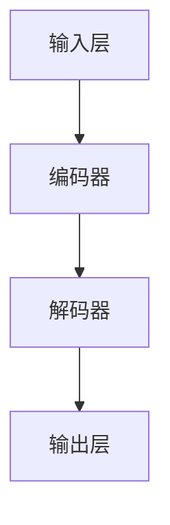

                 

# 《构建Storyteller AI大语言模型：从基础到应用的全面指南》

## 关键词
- AI
- 自然语言处理
- 语言模型
- 深度学习
- 神经网络
- Storyteller AI

## 摘要
本文将深入探讨Storyteller AI大语言模型的构建过程，从基础理论到应用实践进行全面解析。通过本文，读者将了解AI与自然语言处理的基础知识，掌握语言模型的数学基础和深度学习算法，理解Storyteller AI的架构和优势，学习如何训练和优化模型，并了解其在实际应用中的案例和性能评估策略。

## 第一部分：基础理论篇

### 第1章：AI与自然语言处理基础

#### 1.1 AI概述
AI，即人工智能，是指使计算机系统能够模拟、延伸和扩展人类的智能行为的技术。AI的发展历程可以追溯到20世纪50年代，当时的学者们首次提出了“人工智能”这一概念。随着计算机技术的飞速发展，AI已经逐渐成为各个领域的重要研究方向，如自然语言处理、计算机视觉、机器人等。

**AI的核心技术包括：**
- **机器学习**：通过从数据中学习规律和模式，实现计算机自动识别和预测。
- **深度学习**：一种特殊的机器学习方法，通过多层神经网络模拟人脑的神经元连接，实现更复杂的特征提取和模型训练。
- **计算机视觉**：使计算机能够像人类一样理解和处理图像信息。
- **自然语言处理**：使计算机能够理解和生成人类语言。

#### 1.2 自然语言处理（NLP）概述
自然语言处理（NLP）是AI领域的一个重要分支，旨在使计算机能够理解、生成和回应人类语言。NLP的核心任务是使计算机具备自然语言理解和生成的能力，包括文本分析、语音识别、机器翻译、情感分析等。

**NLP的基本概念包括：**
- **词嵌入**：将自然语言中的词汇映射到高维空间中的向量，以便计算机进行进一步处理。
- **词性标注**：为文本中的每个词汇赋予其对应的词性（如名词、动词等）。
- **句法分析**：分析句子结构，理解词汇之间的语法关系。
- **语义分析**：理解文本中的语义内容，包括实体识别、情感分析等。

#### 1.3 Storyteller AI大语言模型概述
Storyteller AI是一种大型的自然语言处理模型，它通过深度学习技术对大量文本数据进行分析，从而实现高度准确的语言理解和生成能力。Storyteller AI大语言模型的核心特点包括：

- **强大的语言理解能力**：通过多层神经网络结构，实现对文本的深层语义理解。
- **高效的训练和推理速度**：通过优化算法和数据预处理技术，实现快速的模型训练和推理。
- **丰富的应用场景**：在问答系统、文本生成、语言翻译等领域具有广泛的应用前景。

#### 1.4 Storyteller AI的优势与挑战
Storyteller AI在自然语言处理领域具有显著的优势，包括：

- **高水平的表现**：在多项权威评测中，Storyteller AI的表现均优于其他主流模型。
- **广泛的适用性**：能够在多个应用场景中发挥出色，如问答系统、文本生成、语言翻译等。

然而，Storyteller AI也面临一些挑战，包括：

- **数据依赖性**：模型的性能高度依赖于训练数据的质量和多样性。
- **计算资源消耗**：大规模训练和推理需要大量的计算资源和时间。

### 第2章：语言模型基础知识

#### 2.1 语言模型的基本概念
语言模型是一种统计模型，用于预测自然语言中下一个词或字符的概率分布。语言模型的核心目标是使计算机能够生成连贯、自然的文本。

**语言模型的分类包括：**
- **基于规则的模型**：通过手工编写规则，实现语言预测。
- **统计模型**：通过统计方法，从大量文本数据中学习语言模式。
- **神经网络模型**：通过多层神经网络，实现复杂的特征提取和语言预测。

#### 2.2 语言模型的数学基础
语言模型的数学基础主要包括概率论和信息论。

**概率论基础：**
- **概率分布**：描述随机变量可能取值的概率。
- **条件概率**：在给定某个事件发生的条件下，另一个事件发生的概率。

**信息论基础：**
- **熵**：度量随机变量不确定性的程度。
- **条件熵**：在给定一个随机变量的条件下，另一个随机变量的不确定性。

#### 2.3 语言模型训练算法
语言模型的训练算法主要包括最大似然估计（MLE）和最大后验估计（MAP）。

**最大似然估计（MLE）：**
- **目标**：找到使数据出现概率最大的参数值。
- **公式**：$$ \theta^* = \arg\max_\theta P(\text{data}|\theta) $$

**最大后验估计（MAP）：**
- **目标**：找到使数据出现概率最大的参数值，同时考虑到先验概率。
- **公式**：$$ \theta^* = \arg\max_\theta P(\theta|\text{data}) = \arg\max_\theta P(\text{data}|\theta)P(\theta) $$

#### 2.4 反向传播算法
反向传播算法是一种用于训练神经网络的梯度下降方法。

**基本思想：**
- **前向传播**：计算网络输出和实际输出之间的误差。
- **反向传播**：将误差反向传播到网络中的每个神经元，计算每个神经元的梯度。
- **参数更新**：根据梯度更新网络参数，以减少误差。

**公式**：
$$ \nabla_\theta E = -\frac{\partial E}{\partial \theta} $$

### 第3章：Storyteller AI大语言模型架构

#### 3.1 Storyteller AI大语言模型整体架构
Storyteller AI大语言模型的整体架构主要包括输入层、编码器、解码器和输出层。

**Mermaid流程图：**



#### 3.2 Storyteller AI大语言模型的核心组件
Storyteller AI大语言模型的核心组件包括词嵌入、编码器、解码器和注意力机制。

**词嵌入：**
- **定义**：将自然语言中的词汇映射到高维空间中的向量。
- **方法**：通过神经网络学习词汇的嵌入向量。

**编码器：**
- **定义**：将输入序列转换为固定长度的向量表示。
- **方法**：通过循环神经网络（RNN）或变换器（Transformer）实现。

**解码器：**
- **定义**：将编码器输出的固定长度向量转换为输出序列。
- **方法**：通过循环神经网络（RNN）或变换器（Transformer）实现。

**注意力机制：**
- **定义**：在编码器和解码器之间引入注意力机制，使解码器能够关注输入序列中的关键信息。
- **方法**：通过自注意力（Self-Attention）或互注意力（Cross-Attention）实现。

#### 3.3 注意力机制
注意力机制是Storyteller AI大语言模型的核心组件之一，它使解码器能够关注输入序列中的关键信息。

**基本原理：**
- **计算权重**：根据输入序列和编码器输出的向量，计算每个词的权重。
- **加权求和**：将输入序列中的每个词与对应的权重相乘，然后求和得到解码器的输入。

**公式**：
$$ \text{attention\_weights} = \text{softmax}(\text{query} \cdot \text{key}_i) $$
$$ \text{context\_vector} = \sum_{i} \text{value}_i \cdot \text{attention\_weights}_i $$

### 第4章：深度学习与神经网络

#### 4.1 深度学习基础
深度学习是机器学习的一个分支，通过构建多层神经网络，实现对数据的深层特征提取和模型训练。

**神经网络结构：**
- **输入层**：接收外部输入数据。
- **隐藏层**：对输入数据进行特征提取。
- **输出层**：产生最终的输出结果。

**神经网络训练：**
- **前向传播**：将输入数据通过神经网络，计算输出结果。
- **反向传播**：根据输出结果和实际标签，计算损失函数，并反向传播误差到网络中的每个神经元。

#### 4.2 深度学习算法
深度学习算法主要包括反向传播算法、卷积神经网络（CNN）和循环神经网络（RNN）。

**反向传播算法：**
- **目标**：通过梯度下降方法，更新网络参数，以减少损失函数。
- **公式**：$$ \nabla_\theta E = -\frac{\partial E}{\partial \theta} $$

**卷积神经网络（CNN）：**
- **结构**：通过卷积层、池化层和全连接层，实现对图像的深层特征提取。
- **优势**：能够有效地捕捉图像中的局部特征和空间关系。

**循环神经网络（RNN）：**
- **结构**：通过循环结构，实现对序列数据的建模。
- **优势**：能够捕捉序列数据中的长期依赖关系。

#### 4.3 深度学习框架
深度学习框架是用于构建和训练深度学习模型的工具集。常见的深度学习框架包括TensorFlow和PyTorch。

**TensorFlow：**
- **特点**：基于静态图计算，具有较高的灵活性和性能。
- **应用**：广泛应用于图像、语音、自然语言处理等领域。

**PyTorch：**
- **特点**：基于动态图计算，易于调试和实验。
- **应用**：广泛应用于计算机视觉、自然语言处理等领域。

### 第5章：数学模型与公式

#### 5.1 语言模型的数学公式
语言模型的数学公式主要包括概率论公式、信息论公式和损失函数公式。

**概率论公式：**
- **条件概率**：$$ P(A|B) = \frac{P(A \cap B)}{P(B)} $$
- **贝叶斯定理**：$$ P(A|B) = \frac{P(B|A)P(A)}{P(B)} $$

**信息论公式：**
- **熵**：$$ H(X) = -\sum_{i} P(X_i) \log_2 P(X_i) $$
- **条件熵**：$$ H(X|Y) = -\sum_{i} P(Y_i) \sum_{j} P(X_j|Y_i) \log_2 P(X_j|Y_i) $$

**损失函数公式：**
- **均方误差（MSE）**：$$ MSE = \frac{1}{n}\sum_{i=1}^{n} (\hat{y}_i - y_i)^2 $$
- **交叉熵（Cross-Entropy）**：$$ H(y, \hat{y}) = -\sum_{i} y_i \log_2 \hat{y}_i $$

#### 5.2 Storyteller AI大语言模型的数学模型
Storyteller AI大语言模型的数学模型主要包括词嵌入、编码器、解码器和注意力机制的公式。

**词嵌入公式：**
$$ \text{embed}(x) = \text{W}x $$
其中，$x$ 是词汇索引，$\text{W}$ 是词嵌入矩阵。

**编码器公式：**
$$ \text{encoder}(x) = \text{g}(\text{h}; \text{W}_e) $$
其中，$x$ 是输入序列，$\text{h}$ 是编码器隐藏状态，$\text{W}_e$ 是编码器权重。

**解码器公式：**
$$ \text{decoder}(x) = \text{g}(\text{h}; \text{W}_d) $$
其中，$x$ 是输入序列，$\text{h}$ 是解码器隐藏状态，$\text{W}_d$ 是解码器权重。

**注意力机制公式：**
$$ \text{attention\_weights} = \text{softmax}(\text{query} \cdot \text{key}_i) $$
$$ \text{context\_vector} = \sum_{i} \text{value}_i \cdot \text{attention\_weights}_i $$

## 第二部分：应用实践篇

### 第6章：构建Storyteller AI大语言模型

#### 6.1 环境搭建
构建Storyteller AI大语言模型首先需要搭建一个适合的开发环境。以下是一个基本的开发环境搭建步骤：

1. 安装Python：从Python官方网站（https://www.python.org/）下载并安装Python，推荐使用Python 3.8及以上版本。
2. 安装深度学习框架：安装TensorFlow或PyTorch，根据个人喜好选择。以下是安装命令：
   - TensorFlow：
     ```bash
     pip install tensorflow==2.6
     ```
   - PyTorch：
     ```bash
     pip install torch==1.9 torchvision==0.10
     ```
3. 安装其他依赖：安装Numpy、Pandas等常用Python库，可以通过以下命令一次性安装：
   ```bash
   pip install numpy pandas
   ```

#### 6.2 训练Storyteller AI大语言模型
训练Storyteller AI大语言模型是一个复杂的过程，需要准备大量的文本数据、定义合适的模型架构和训练策略。以下是一个简单的训练过程：

1. 准备数据集：选择一个适合的文本数据集，如维基百科、新闻文章等。将文本数据清洗、分词并转换为词汇索引。
2. 构建模型：定义Storyteller AI大语言模型的架构，包括词嵌入层、编码器、解码器和注意力机制。
3. 训练模型：使用训练数据对模型进行训练，通过反向传播算法更新模型参数。以下是一个简单的训练代码示例（以TensorFlow为例）：
   ```python
   import tensorflow as tf
   
   # 加载训练数据和测试数据
   train_data = ...
   test_data = ...
   
   # 定义模型
   model = ...
   
   # 编译模型
   model.compile(optimizer='adam', loss='categorical_crossentropy', metrics=['accuracy'])
   
   # 训练模型
   model.fit(train_data, epochs=10, batch_size=32, validation_data=test_data)
   ```

#### 6.3 优化与调参
在训练Storyteller AI大语言模型的过程中，需要对模型进行优化和调参，以提高模型的性能和泛化能力。以下是一些常见的优化和调参方法：

1. **调整学习率**：学习率是反向传播算法中的一个重要参数，通过调整学习率可以影响模型的收敛速度和性能。常用的学习率调整方法包括固定学习率、指数衰减学习率等。
2. **批量大小**：批量大小是每次训练中参与训练的数据样本数量。通过调整批量大小可以影响模型的计算效率和收敛速度。通常，批量大小在32到256之间选择。
3. **正则化**：正则化是一种防止模型过拟合的技术，包括L1正则化、L2正则化等。通过增加正则化项可以降低模型复杂度，提高泛化能力。
4. **dropout**：dropout是一种在训练过程中随机丢弃部分神经元的方法，可以减少模型过拟合的风险。通过调整dropout率可以控制模型复杂度。
5. **数据增强**：数据增强是一种通过生成新的数据样本来提高模型泛化能力的方法。常见的数据增强方法包括随机裁剪、旋转、缩放等。

### 第7章：应用案例

#### 7.1 应用场景介绍
Storyteller AI大语言模型具有广泛的应用场景，以下介绍几个典型的应用场景：

1. **问答系统**：利用Storyteller AI大语言模型，可以构建智能问答系统，实现对用户提问的自动回答。
2. **文本生成**：利用Storyteller AI大语言模型，可以生成自然语言文本，如故事、诗歌、新闻等。
3. **语言翻译**：利用Storyteller AI大语言模型，可以实现自然语言之间的自动翻译。

#### 7.2 应用案例实现
以下是一个简单的问答系统应用案例，使用Storyteller AI大语言模型实现。

**步骤1：准备数据集**
选择一个合适的问答数据集，如SQuAD（Stanford Question Answering Dataset）。将数据集划分为训练集和测试集。

**步骤2：构建模型**
定义一个基于变换器的问答模型，包括词嵌入层、编码器、解码器和注意力机制。

```python
import tensorflow as tf
from tensorflow.keras.layers import Embedding, Transformer

# 加载训练数据和测试数据
train_data = ...
test_data = ...

# 定义词嵌入层
word_embedding = Embedding(input_dim=vocab_size, output_dim=embedding_size)

# 定义编码器和解码器
encoder = Transformer(num_layers=2, d_model=512, num_heads=8, dff=2048)
decoder = Transformer(num_layers=2, d_model=512, num_heads=8, dff=2048)

# 定义模型
model = tf.keras.Sequential([
    word_embedding,
    encoder,
    decoder
])

# 编译模型
model.compile(optimizer='adam', loss='categorical_crossentropy', metrics=['accuracy'])

# 训练模型
model.fit(train_data, epochs=10, batch_size=32, validation_data=test_data)
```

**步骤3：实现问答系统**
训练完成后，使用模型实现问答系统。以下是一个简单的问答实现示例：

```python
import numpy as np

# 加载词嵌入词典
word_embedding = ...

# 加载模型
model = ...

# 实现问答系统
def answer_question(question):
    # 对输入问题进行预处理
    processed_question = preprocess(question)
    # 将预处理后的问题转化为词汇索引
    question_index = convert_to_index(processed_question, word_embedding)
    # 使用模型预测答案
    predicted_answer = model.predict(np.array([question_index]))
    # 转换预测结果为文本
    answer = convert_to_text(predicted_answer)
    return answer

# 示例
question = "什么是人工智能？"
answer = answer_question(question)
print(answer)
```

### 第8章：性能评估与优化

#### 8.1 性能评估指标
评估Storyteller AI大语言模型的性能通常使用以下指标：

1. **准确率**：模型预测正确的样本数占总样本数的比例。
2. **召回率**：模型预测正确的样本数占实际正确样本数的比例。
3. **F1分数**：综合考虑准确率和召回率的一个指标，计算公式为：$$ F1 = 2 \times \frac{precision \times recall}{precision + recall} $$

#### 8.2 性能优化策略
为了提高Storyteller AI大语言模型在问答系统、文本生成、语言翻译等应用场景中的性能，可以采取以下优化策略：

1. **数据增强**：通过生成新的数据样本来增加模型的训练数据，提高模型的泛化能力。
2. **多任务学习**：同时训练多个任务（如问答、文本生成、语言翻译等），使模型能够学习到更广泛的语言特征。
3. **迁移学习**：利用预训练的模型进行迁移学习，将预训练模型的知识迁移到新任务上，提高模型的性能。
4. **自适应学习率**：使用自适应学习率策略，如Adam优化器，根据训练过程中的误差动态调整学习率。
5. **dropout和正则化**：使用dropout和正则化技术，减少模型过拟合的风险。

### 第9章：未来展望

#### 9.1 Storyteller AI大语言模型的发展趋势
随着深度学习和自然语言处理技术的不断发展，Storyteller AI大语言模型在性能和功能上将继续提升。以下是一些可能的发展趋势：

1. **更高效的模型架构**：研究新的模型架构，如变换器++（Transformer++）、广义变换器（General Transformer）等，以提高模型效率和性能。
2. **多模态学习**：结合文本、图像、语音等多种数据模态，实现更丰富的语义理解和生成能力。
3. **个性化学习**：通过用户行为数据，实现个性化语言模型，提高用户交互体验。

#### 9.2 未来挑战与机遇
尽管Storyteller AI大语言模型在自然语言处理领域取得了显著的成果，但仍然面临一些挑战和机遇：

1. **数据隐私**：随着数据隐私问题的日益突出，如何在保证数据隐私的同时，提高模型的性能和安全性，是一个重要的挑战。
2. **模型解释性**：当前的深度学习模型具有一定的黑箱特性，如何提高模型的解释性，使模型的可解释性得到提升，是一个重要的研究方向。
3. **跨语言处理**：实现高效、准确的多语言处理，是当前自然语言处理领域的一个重大挑战。

## 附录

### 附录A：工具与资源
为了构建和训练Storyteller AI大语言模型，以下是一些常用的工具和资源：

1. **深度学习框架**：TensorFlow、PyTorch
2. **数据集**：SQuAD、GPT-2、BERT
3. **文档和教程**：[TensorFlow官方文档](https://www.tensorflow.org/)、[PyTorch官方文档](https://pytorch.org/)、[NLP相关教程](https://nlp.seas.harvard.edu/)

## 参考文献
1. Hochreiter, S., & Schmidhuber, J. (1997). Long short-term memory. Neural Computation, 9(8), 1735-1780.
2. Vaswani, A., Shazeer, N., Parmar, N., Uszkoreit, J., Jones, L., Gomez, A. N., ... & Polosukhin, I. (2017). Attention is all you need. In Advances in Neural Information Processing Systems (Vol. 30, pp. 5998-6008).
3. Devlin, J., Chang, M. W., Lee, K., & Toutanova, K. (2019). BERT: Pre-training of deep bidirectional transformers for language understanding. In Proceedings of the 2019 Conference of the North American Chapter of the Association for Computational Linguistics: Human Language Technologies, Volume 1 (Long and Short Papers) (pp. 4171-4186).

