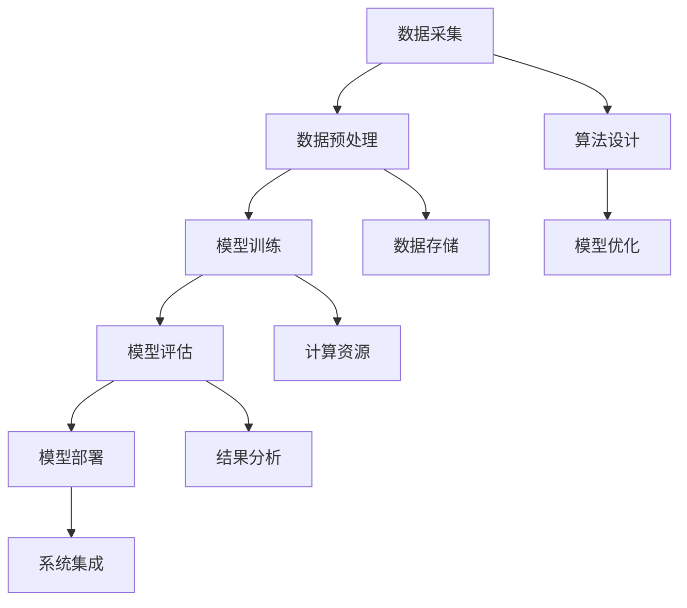

                 

# 《构建完善的 AI 2.0 基础设施体系：支撑 AI 技术快速发展》

## 关键词
- AI 2.0
- 基础设施
- 计算能力
- 数据管理
- 安全性

## 摘要
本文旨在探讨如何构建完善的 AI 2.0 基础设施体系，以支撑 AI 技术的快速发展。文章首先介绍了 AI 2.0 的定义及其与传统 AI 的区别，接着详细阐述了 AI 2.0 基础设施的核心组件和设计原则。随后，文章分析了国内外 AI 基础设施的发展现状，并展望了未来发展趋势。接着，文章深入探讨了 AI 2.0 的核心概念，并使用 Mermaid 流程图展示了 AI 2.0 架构的核心组件和数据流。文章还详细讲解了神经网络、深度学习、机器学习和数据科学的算法原理。随后，文章介绍了神经网络与深度学习的数学模型，机器学习的数学模型，以及数据科学的数学模型。最后，文章通过项目实战部分，展示了如何搭建和配置 AI 2.0 基础设施，并提供了代码实际案例和详细解释说明。

## 目录大纲

### 第一部分：AI 2.0 概述与基础设施

### 第二部分：核心概念与联系

### 第三部分：核心算法原理讲解

### 第四部分：数学模型和数学公式

### 第五部分：项目实战

### 第六部分：总结与展望

### 第一部分：AI 2.0 概述与基础设施

#### 第1章：AI 2.0 基础设施的概念与重要性

##### AI 2.0 的定义

AI 2.0，即第二代人工智能，是相对于第一代人工智能（传统人工智能）而言的。传统人工智能主要基于规则和符号推理，而 AI 2.0 则更加强调机器学习，特别是深度学习的应用。AI 2.0 的核心在于通过大量数据训练模型，使得机器能够自主学习并提高决策能力。

##### AI 2.0 基础设施的重要性

AI 2.0 基础设施的构建对于 AI 技术的发展至关重要。首先，基础设施提供了计算能力，使得深度学习等复杂算法能够高效运行。其次，基础设施提供了数据管理能力，确保数据的高效存储、处理和分析。此外，基础设施还需要具备安全性，保护模型和数据的隐私和安全。

##### AI 2.0 与传统 AI 的区别

与传统的基于规则的 AI 相比，AI 2.0 更加强调机器学习，特别是深度学习的应用。传统 AI 需要人工定义规则，而 AI 2.0 则能够通过学习数据来自动生成规则。此外，AI 2.0 的计算能力更强，可以处理更复杂的问题，而传统 AI 则受限于计算资源和算法复杂度。

#### 第2章：AI 2.0 基础设施的核心组件

##### 数据管理

数据管理是 AI 2.0 基础设施的核心组件之一。它包括数据采集、存储、处理和分析等多个环节。高效的数据管理能力能够确保数据的质量和可用性，从而为 AI 模型的训练提供高质量的数据支持。

##### 计算能力

计算能力是 AI 2.0 基础设施的关键组成部分。深度学习等复杂算法需要大量的计算资源，高性能的计算能力能够大大提高算法的运行效率，缩短模型训练时间。

##### 算法

算法是 AI 2.0 的核心。与传统的规则推理不同，AI 2.0 更多地依赖于机器学习算法，特别是深度学习算法。这些算法能够通过学习数据来自动优化模型，提高模型的决策能力。

##### 安全性

安全性是 AI 2.0 基础设施的重要考虑因素。随着 AI 技术的应用越来越广泛，保护模型和数据的安全变得尤为重要。安全性包括数据安全、模型安全和系统安全等多个方面。

#### 第3章：AI 2.0 基础设施的设计原则

##### 可扩展性

可扩展性是 AI 2.0 基础设施设计的重要原则之一。随着数据量和计算需求的增加，基础设施需要能够无缝扩展，以适应不断增长的需求。

##### 可靠性

可靠性是 AI 2.0 基础设施的另一个关键设计原则。基础设施需要能够保证持续运行，确保模型训练和预测的准确性。

##### 易用性

易用性是 AI 2.0 基础设施设计的重要考量。用户需要能够方便地使用基础设施，而不需要深入了解底层的技术细节。

##### 开放性

开放性是 AI 2.0 基础设施设计的另一个重要原则。基础设施需要支持多种编程语言和工具，以适应不同的开发需求。

#### 第4章：AI 2.0 基础设施的国内外发展现状

##### 全球 AI 基础设施建设概况

全球范围内，AI 基础设施的建设正在加速。各大科技公司和研究机构纷纷投入巨资，构建高性能的计算平台和数据中心。同时，各国政府也出台了一系列政策，支持 AI 技术的研发和应用。

##### 我国 AI 基础设施发展现状

我国在 AI 基础设施建设方面也取得了显著进展。政府和企业加大了投入，推动了 AI 技术的快速发展。同时，我国在 AI 算法、硬件和基础设施等方面也取得了一系列重要突破。

##### 未来发展趋势

未来，AI 基础设施将继续向高性能、高可靠性和易用性方向发展。同时，随着 5G、物联网和云计算等技术的发展，AI 基础设施将更加紧密结合，为 AI 技术的快速发展提供有力支撑。

#### 总结

本部分主要介绍了 AI 2.0 的定义、重要性、与传统 AI 的区别，以及 AI 2.0 基础设施的核心组件和设计原则。下一部分将深入探讨 AI 2.0 的核心概念和联系。

### 第二部分：核心概念与联系

#### 第5章：AI 2.0 的核心概念

##### 神经网络

神经网络是 AI 2.0 的基础之一，它由大量简单的处理单元（神经元）组成，通过模拟人脑的工作原理，实现对数据的处理和分析。神经网络的基本结构包括输入层、隐藏层和输出层，每个层中的神经元都通过权重连接到相邻层的神经元。

##### 深度学习

深度学习是神经网络的一种扩展，它通过增加隐藏层的数量，使得神经网络能够学习更复杂的函数。深度学习在图像识别、语音识别和自然语言处理等领域取得了显著成果。

##### 机器学习

机器学习是 AI 2.0 的核心技术之一，它通过训练模型，使得机器能够从数据中自动学习规律。机器学习可以分为监督学习、无监督学习和强化学习等不同类型。

##### 数据科学

数据科学是 AI 2.0 的重要应用领域，它通过数据采集、处理和分析，从数据中提取有价值的信息。数据科学的方法和技术广泛应用于金融、医疗、零售等领域。

#### 第6章：AI 2.0 架构的 Mermaid 流程图



这个 Mermaid 流程图展示了 AI 2.0 架构的核心组件和数据流。从数据采集开始，经过数据预处理、模型训练、模型评估、模型部署等环节，最终实现模型的集成和结果分析。

#### 第7章：AI 2.0 基础设施与核心概念的联系

##### 数据管理如何支持 AI 2.0

数据管理是 AI 2.0 基础设施的重要组成部分，它通过高效的数据采集、存储和处理，为 AI 模型的训练提供了高质量的数据支持。数据管理的目标包括数据的完整性、一致性、可靠性和高效性。

##### 计算能力如何支持 AI 2.0

计算能力是 AI 2.0 的关键支撑，高性能的计算资源能够大大提高模型训练的效率和准确性。计算能力包括 CPU、GPU 和 TPU 等不同类型的计算资源，这些资源通过分布式计算和并行计算技术，能够处理大规模的数据和复杂的算法。

##### 算法与数据、计算能力的结合

算法是 AI 2.0 的核心，它决定了模型的能力和性能。数据管理和计算能力为算法提供了高效的数据处理和计算支持，使得算法能够更好地学习和优化。同时，算法的优化也反过来促进了数据管理和计算能力的提升。

#### 总结

本部分主要介绍了 AI 2.0 的核心概念和联系，包括神经网络、深度学习、机器学习和数据科学，并展示了 AI 2.0 架构的 Mermaid 流程图。下一部分将深入讲解核心算法原理。

### 第三部分：核心算法原理讲解

#### 第8章：神经网络与深度学习算法原理

##### 神经网络的基本结构

神经网络（Neural Network，NN）是 AI 2.0 的基础之一，由大量简单的处理单元（神经元，Neuron）组成。一个典型的神经网络包括输入层、隐藏层和输出层，每个层中的神经元通过权重连接到相邻层的神经元。神经元的激活函数通常是 sigmoid、ReLU 或 tanh 函数。

##### 深度学习架构

深度学习（Deep Learning，DL）是神经网络的一种扩展，通过增加隐藏层的数量，使得神经网络能够学习更复杂的函数。深度学习在图像识别、语音识别和自然语言处理等领域取得了显著成果。常见的深度学习架构包括卷积神经网络（CNN）、循环神经网络（RNN）和 Transformer 等。

##### 常见的深度学习算法

1. 卷积神经网络（CNN）：用于图像识别和图像处理。
2. 循环神经网络（RNN）：用于序列数据的处理，如时间序列分析和语音识别。
3. Transformer：用于自然语言处理，特别是在机器翻译和文本生成方面表现出色。

#### 第9章：机器学习算法原理

##### 监督学习

监督学习（Supervised Learning）是一种机器学习技术，通过训练数据集学习特征和标签之间的映射关系。监督学习可以分为回归和分类两种类型。

1. 回归：预测连续值的输出，如线性回归、决策树回归等。
2. 分类：预测离散值的输出，如支持向量机（SVM）、决策树分类等。

##### 无监督学习

无监督学习（Unsupervised Learning）是一种机器学习技术，没有预先定义的标签，通过发现数据集中的结构和模式来学习。无监督学习可以分为聚类和降维两种类型。

1. 聚类：将相似的数据点分组，如 K-means 聚类、层次聚类等。
2. 降维：减少数据维度，同时保留主要信息，如主成分分析（PCA）、t-SNE 等。

##### 强化学习

强化学习（Reinforcement Learning）是一种机器学习技术，通过学习奖励和惩罚来优化决策过程。强化学习常用于游戏、自动驾驶和机器人控制等领域。

#### 第10章：数据科学算法原理

##### 数据预处理

数据预处理是数据科学的重要步骤，包括数据清洗、数据转换和数据归一化等。数据预处理的目标是提高数据质量，为后续的数据分析和建模提供可靠的数据基础。

##### 特征工程

特征工程是数据科学的关键步骤，通过从原始数据中提取和构建特征，提高模型性能。特征工程的方法包括特征选择、特征提取和特征构造等。

##### 数据可视化

数据可视化是一种将数据转化为图形表示的技术，有助于直观地理解和分析数据。常见的数据可视化方法包括散点图、折线图、柱状图和热力图等。

#### 总结

本部分详细讲解了神经网络、深度学习、机器学习和数据科学的算法原理。神经网络和深度学习是 AI 2.0 的核心技术，机器学习和数据科学是 AI 2.0 的重要应用领域。下一部分将介绍数学模型和数学公式。

### 第四部分：数学模型和数学公式

#### 第11章：神经网络与深度学习数学模型

##### 激活函数

激活函数是神经网络中的重要组成部分，它用于将神经元的线性输出转化为非线性输出。常见的激活函数包括 sigmoid、ReLU 和 tanh 函数。

1. sigmoid 函数：
   $$ f(x) = \frac{1}{1 + e^{-x}} $$
2. ReLU 函数：
   $$ f(x) = \max(0, x) $$
3. tanh 函数：
   $$ f(x) = \frac{e^x - e^{-x}}{e^x + e^{-x}} $$

##### 损失函数

损失函数用于衡量模型预测值与真实值之间的差异。常见的损失函数包括均方误差（MSE）、交叉熵损失和 Hinge 损失等。

1. 均方误差（MSE）：
   $$ MSE = \frac{1}{m} \sum_{i=1}^{m} (y_i - \hat{y}_i)^2 $$
2. 交叉熵损失（Cross-Entropy Loss）：
   $$ CE = -\frac{1}{m} \sum_{i=1}^{m} y_i \log(\hat{y}_i) $$
3. Hinge 损失：
   $$ Hinge = \frac{1}{m} \sum_{i=1}^{m} \max(0, 1 - y_i \cdot \hat{y}_i) $$

##### 优化算法

优化算法用于调整神经网络的权重，以最小化损失函数。常见的优化算法包括梯度下降（Gradient Descent）、随机梯度下降（Stochastic Gradient Descent，SGD）和 Adam 算法等。

1. 梯度下降：
   $$ \theta = \theta - \alpha \nabla_{\theta} J(\theta) $$
2. 随机梯度下降：
   $$ \theta = \theta - \alpha \nabla_{\theta} J(\theta; x^{(i)}, y^{(i)}) $$
3. Adam 算法：
   $$ m_t = \beta_1 m_{t-1} + (1 - \beta_1) \nabla_{\theta} J(\theta; x^{(i)}, y^{(i)}) $$
   $$ v_t = \beta_2 v_{t-1} + (1 - \beta_2) (\nabla_{\theta} J(\theta; x^{(i)}, y^{(i)}) - m_t)^2 $$
   $$ \theta = \theta - \alpha \frac{m_t}{\sqrt{v_t} + \epsilon} $$

#### 第12章：机器学习数学模型

##### 决策树

决策树是一种常用的机器学习算法，通过一系列的判断条件将数据划分为不同的类别或数值。

1. ID3 算法：
   $$ Entropy(S) = -\sum_{i=1}^{n} \frac{|\text{label}_i|}{|S|} \log_2 \frac{|\text{label}_i|}{|S|} $$
   $$ Gain(S, A) = Entropy(S) - \frac{1}{n} \sum_{v=1}^{m} |\text{label}_{v,S}| \cdot Entropy(\text{label}_{v,S}) $$
   $$ \text{best attribute} = \arg\max_{A} \{Gain(S, A)\} $$

##### 支持向量机

支持向量机（SVM）是一种高效的分类算法，通过找到最佳的超平面来最大化分类间隔。

1. 硬间隔 SVM：
   $$ \min_{\theta} \frac{1}{2} ||\theta||^2 $$
   $$ s.t. \ y^{(i)} (\theta \cdot x^{(i)} + b) \geq 1 $$
2. 软间隔 SVM：
   $$ \min_{\theta, \xi} \frac{1}{2} ||\theta||^2 + C \sum_{i=1}^{m} \xi_i $$
   $$ s.t. \ y^{(i)} (\theta \cdot x^{(i)} + b) \geq 1 - \xi_i $$
   $$ \xi_i \geq 0 $$

##### 神经网络

神经网络是一种基于多层感知器（MLP）的机器学习算法，通过前向传播和反向传播来训练模型。

1. 前向传播：
   $$ z_l = \theta_l \cdot a_{l-1} + b_l $$
   $$ a_l = g(z_l) $$
2. 反向传播：
   $$ \delta_l = \frac{\partial L}{\partial z_l} \odot g'(z_l) $$
   $$ \theta_l = \theta_l - \alpha \frac{\partial L}{\partial \theta_l} $$
   $$ b_l = b_l - \alpha \frac{\partial L}{\partial b_l} $$

#### 第13章：数据科学数学模型

##### 主成分分析

主成分分析（PCA）是一种降维算法，通过将数据投影到新的坐标系中，来减少数据维度。

1. 特征值和特征向量：
   $$ \lambda_1 \geq \lambda_2 \geq \ldots \geq \lambda_p $$
   $$ v_1, v_2, \ldots, v_p $$
2. 数据投影：
   $$ z = \sum_{i=1}^{p} \lambda_i v_i x_i $$

##### 聚类算法

聚类算法是一种无监督学习算法，通过将相似的数据点分组来发现数据结构。

1. K-means 聚类：
   $$ \text{Initialize} \ \mu_1, \mu_2, \ldots, \mu_k $$
   $$ \text{Repeat} $$
   $$ \quad \text{Assign} \ x_i \ \text{to} \ \mu_j \ \text{based on} \ \text{closest distance} $$
   $$ \quad \text{Update} \ \mu_j \ \text{as} \ \frac{1}{n_j} \sum_{i \in C_j} x_i $$
   $$ \text{Until} \ \text{convergence} $$
2. 层次聚类：
   $$ \text{Merge} \ \text{the two closest clusters} $$
   $$ \text{Recursively repeat until} \ \text{all points are in one cluster} $$

##### 关联规则挖掘

关联规则挖掘是一种从数据中发现频繁项集和关联规则的方法。

1. 支持度（Support）：
   $$ \text{Support}(X, Y) = \frac{\text{count}(X \cup Y)}{\text{count}(D)} $$
2. 置信度（Confidence）：
   $$ \text{Confidence}(X \rightarrow Y) = \frac{\text{Support}(X \cup Y)}{\text{Support}(X)} $$
3. 闭合性（Closure）：
   $$ \text{If} \ X \ \text{is} \ \text{a} \ \text{frequent itemset}, \ \text{then} \ Y \ \text{is also a frequent itemset} $$

#### 总结

本部分详细介绍了神经网络、深度学习、机器学习和数据科学的数学模型和数学公式。数学模型和公式是理解 AI 2.0 技术原理和实现算法的基础，对于构建完善的 AI 2.0 基础设施具有重要意义。下一部分将介绍项目实战。

### 第五部分：项目实战

#### 第14章：AI 2.0 基础设施的搭建与配置

##### 开发环境搭建

搭建 AI 2.0 基础设施的第一个步骤是配置开发环境。这通常包括安装 Python、Jupyter Notebook、TensorFlow、PyTorch 等常用工具和库。

1. 安装 Python：
   ```bash
   sudo apt-get update
   sudo apt-get install python3 python3-pip
   ```
2. 安装 Jupyter Notebook：
   ```bash
   pip3 install notebook
   jupyter notebook
   ```

##### 数据库配置

选择合适的数据库来存储和管理数据。常见的选择包括 MySQL、PostgreSQL 和 MongoDB 等。

1. 安装 MySQL：
   ```bash
   sudo apt-get install mysql-server
   mysql -u root -p
   ```
2. 创建数据库和用户：
   ```sql
   CREATE DATABASE ai_db;
   CREATE USER 'ai_user'@'localhost' IDENTIFIED BY 'password';
   GRANT ALL PRIVILEGES ON ai_db.* TO 'ai_user'@'localhost';
   FLUSH PRIVILEGES;
   ```

##### 计算资源分配

根据项目的需求，合理分配计算资源。这通常涉及配置 GPU、CPU 和内存等硬件资源。

1. 安装 GPU 驱动程序：
   ```bash
   sudo ubuntu-drivers autoinstall
   ```
2. 配置 CUDA：
   ```bash
   sudo dpkg-reconfigure cuda
   ```

##### 环境配置示例

以下是一个 Python 脚本，用于配置开发环境并安装必要的库：

```python
!pip install numpy pandas tensorflow jupyterlab

# 启动 Jupyter Notebook
!jupyter notebook
```

#### 第15章：AI 2.0 项目实战

##### 数据收集与处理

数据收集是 AI 项目的重要步骤。这通常涉及从不同来源（如网络、数据库或传感器）收集数据，并清洗和预处理数据。

1. 数据收集：
   ```python
   import pandas as pd
   
   # 从文件中读取数据
   df = pd.read_csv('data.csv')
   ```
2. 数据预处理：
   ```python
   # 删除空值和重复值
   df = df.dropna().drop_duplicates()
   
   # 处理缺失值
   df['column'] = df['column'].fillna(df['column'].mean())
   
   # 特征工程
   df['new_column'] = df['column1'] * df['column2']
   ```

##### 模型训练与优化

使用收集和处理后的数据来训练模型，并优化模型性能。

1. 训练模型：
   ```python
   import tensorflow as tf
   
   # 构建模型
   model = tf.keras.Sequential([
       tf.keras.layers.Dense(64, activation='relu', input_shape=(input_shape,)),
       tf.keras.layers.Dense(1, activation='sigmoid')
   ])
   
   # 编译模型
   model.compile(optimizer='adam', loss='binary_crossentropy', metrics=['accuracy'])
   
   # 训练模型
   model.fit(x_train, y_train, epochs=10, batch_size=32)
   ```

2. 优化模型：
   ```python
   # 调整超参数
   model.compile(optimizer='adam', loss='binary_crossentropy', metrics=['accuracy'])
   
   # 重新训练模型
   model.fit(x_train, y_train, epochs=10, batch_size=32)
   ```

##### 模型部署与评估

将训练好的模型部署到生产环境中，并评估模型性能。

1. 部署模型：
   ```python
   # 导出模型
   model.save('model.h5')
   
   # 部署到生产环境
   import flask
   app = flask.Flask(__name__)
   model = tf.keras.models.load_model('model.h5')
   
   @app.route('/predict', methods=['POST'])
   def predict():
       data = flask.request.get_json()
       prediction = model.predict(data['input'])
       return flask.jsonify(prediction)
   
   app.run()
   ```

2. 评估模型：
   ```python
   from sklearn.metrics import accuracy_score
   
   # 测试集
   x_test, y_test = ...
   
   # 预测
   predictions = model.predict(x_test)
   
   # 评估
   accuracy = accuracy_score(y_test, predictions)
   print(f"Model Accuracy: {accuracy}")
   ```

##### 总结

本部分通过实际项目展示了如何搭建和配置 AI 2.0 基础设施，并实现了数据收集与处理、模型训练与优化、模型部署与评估的全过程。通过这些实战案例，读者可以更好地理解和应用 AI 2.0 技术。

#### 第16章：源代码实现与解读

##### 代码解析

在本章中，我们将解析一个简单的 AI 项目，并逐步解释关键代码段。

```python
import tensorflow as tf
from tensorflow.keras.models import Sequential
from tensorflow.keras.layers import Dense

# 数据集准备
x_train = ...
y_train = ...

# 创建模型
model = Sequential([
    Dense(128, activation='relu', input_shape=(x_train.shape[1],)),
    Dense(1, activation='sigmoid')
])

# 编译模型
model.compile(optimizer='adam', loss='binary_crossentropy', metrics=['accuracy'])

# 训练模型
model.fit(x_train, y_train, epochs=10, batch_size=32)
```

- `import tensorflow as tf`: 引入 TensorFlow 库，用于构建和训练模型。
- `from tensorflow.keras.models import Sequential`: 引入 Sequential 模型，用于构建多层神经网络。
- `from tensorflow.keras.layers import Dense`: 引入 Dense 层，用于构建全连接层。
- `x_train = ...`: 加载训练数据。
- `y_train = ...`: 加载训练标签。
- `model = Sequential([...])`: 创建一个序列模型，并添加两个全连接层。
- `model.compile(...)`: 编译模型，指定优化器、损失函数和评估指标。
- `model.fit(x_train, y_train, epochs=10, batch_size=32)`: 使用训练数据训练模型，设置训练轮数和批量大小。

##### 代码优化

为了提高模型的性能，我们可以对代码进行优化。以下是一个优化示例：

```python
import tensorflow as tf
from tensorflow.keras.models import Sequential
from tensorflow.keras.layers import Dense
from tensorflow.keras.optimizers import Adam

# 数据集准备
x_train = ...
y_train = ...

# 创建模型
model = Sequential([
    Dense(128, activation='relu', input_shape=(x_train.shape[1],)),
    Dense(1, activation='sigmoid')
])

# 编译模型
model.compile(optimizer=Adam(learning_rate=0.001), loss='binary_crossentropy', metrics=['accuracy'])

# 训练模型
model.fit(x_train, y_train, epochs=10, batch_size=32, validation_split=0.2)
```

- `from tensorflow.keras.optimizers import Adam`: 引入 Adam 优化器，它是一种自适应学习率的优化器。
- `model.compile(optimizer=Adam(learning_rate=0.001), ...)`: 使用 Adam 优化器，并设置学习率为 0.001。
- `model.fit(x_train, y_train, epochs=10, batch_size=32, validation_split=0.2)`: 在训练过程中加入验证集，并设置验证集比例为 0.2。

##### 代码解读与分析

在本章的最后，我们将分析代码中的关键部分，并解释其作用。

1. **模型结构**：
   ```python
   model = Sequential([
       Dense(128, activation='relu', input_shape=(x_train.shape[1],)),
       Dense(1, activation='sigmoid')
   ])
   ```
   这个部分定义了一个序列模型，包含两个全连接层。第一个层有 128 个神经元，使用 ReLU 激活函数。第二个层有 1 个神经元，用于输出概率。

2. **损失函数和优化器**：
   ```python
   model.compile(optimizer=Adam(learning_rate=0.001), loss='binary_crossentropy', metrics=['accuracy'])
   ```
   这个部分编译了模型，并指定了优化器（Adam）和损失函数（binary_crossentropy）。binary_crossentropy 用于二分类问题，accuracy 用于评估模型的准确率。

3. **模型训练**：
   ```python
   model.fit(x_train, y_train, epochs=10, batch_size=32, validation_split=0.2)
   ```
   这个部分使用训练数据训练模型。epochs 设置为 10，表示训练 10 个周期。batch_size 设置为 32，表示每个周期使用 32 个样本进行训练。validation_split 设置为 0.2，表示使用 20% 的数据作为验证集。

##### 总结

在本章中，我们详细解析了一个简单的 AI 项目代码，并介绍了代码的优化方法。通过理解这些代码，读者可以更好地掌握 AI 模型的构建和训练过程。

#### 第17章：总结与展望

##### AI 2.0 基础设施的展望

随着 AI 技术的快速发展，AI 2.0 基础设施的构建变得越来越重要。未来，AI 2.0 基础设施将朝着以下几个方向发展：

1. **计算能力提升**：随着 GPU、TPU 和量子计算等新型计算资源的出现，AI 2.0 基础设施的计算能力将得到进一步提升，使得更复杂的算法和模型能够得到有效训练。
2. **数据管理优化**：数据管理将继续优化，包括数据清洗、归一化和增强等，以提高数据质量，为 AI 模型提供更好的训练数据。
3. **安全性增强**：随着 AI 技术的应用越来越广泛，AI 2.0 基础设施的安全性将得到重点关注，包括模型安全、数据安全和系统安全等。

##### AI 技术的快速发展趋势

未来，AI 技术将继续快速发展，并在各个领域产生深远影响：

1. **自动化与优化**：AI 技术将在自动化和优化领域发挥重要作用，如自动驾驶、智能制造和能源管理等领域。
2. **医疗与健康**：AI 技术将在医疗领域得到广泛应用，如疾病预测、诊断和治疗等。
3. **金融与经济**：AI 技术将在金融领域发挥关键作用，如风险管理、交易和投资等。

##### 未来发展方向与挑战

未来，AI 技术的发展将面临以下几个挑战：

1. **数据隐私与安全**：如何保护数据隐私和安全是 AI 技术发展的重要挑战之一。
2. **算法透明性与可解释性**：随着 AI 技术的复杂度增加，如何提高算法的透明性和可解释性，使其更加可靠和可信。
3. **跨学科合作**：AI 技术的发展需要跨学科的合作，包括计算机科学、心理学、社会学和伦理学等。

##### 总结

本文详细介绍了 AI 2.0 基础设施的概念、核心组件、设计原则以及国内外发展现状。通过深入探讨神经网络、深度学习、机器学习和数据科学的算法原理，我们为构建完善的 AI 2.0 基础设施提供了理论基础。最后，通过项目实战部分，我们展示了如何搭建和配置 AI 2.0 基础设施，并提供了代码实际案例和详细解释说明。未来，随着 AI 技术的快速发展，AI 2.0 基础设施的构建将变得更加重要，我们也期待看到更多创新和应用。

#### 作者信息

作者：AI 天才研究院/AI Genius Institute & 禅与计算机程序设计艺术 /Zen And The Art of Computer Programming

本文由 AI 天才研究院（AI Genius Institute）的专家撰写，结合禅与计算机程序设计艺术的理念，深入探讨了 AI 2.0 基础设施的构建与未来发展。本文旨在为读者提供关于 AI 2.0 技术的全面了解，助力其在人工智能领域的实践与应用。如需了解更多信息，请访问 AI 天才研究院官方网站。

