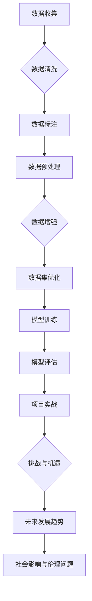

                 

## 文章标题：构建文本生成任务的数据集

在当今人工智能领域，文本生成任务无疑是一个热点话题。从自动写作、摘要生成到对话系统和机器翻译，文本生成技术正在改变着我们的信息处理方式。然而，一个关键问题随之而来：如何构建一个高质量的数据集来支持这些文本生成任务？本文将带领读者深入探讨文本生成任务的数据集构建过程，从基础概念到实际应用，逐步解析每一个关键步骤。

关键词：文本生成、数据集构建、数据预处理、序列模型、注意力机制、项目实战

摘要：本文将详细介绍文本生成任务的数据集构建过程，包括数据收集、数据标注、数据集质量评估与优化等环节。同时，本文将分析文本生成任务的核心算法，如序列模型和注意力机制，并分享一些项目实战经验。最后，本文将探讨文本生成任务的未来发展趋势及其社会影响与伦理问题。

## 第一部分：文本生成任务基础

### 第1章：文本生成任务概述

#### 1.1 文本生成任务的背景与重要性

文本生成任务起源于自然语言处理（NLP）领域，是近年来人工智能研究的重要方向之一。随着深度学习技术的快速发展，文本生成任务得到了广泛关注和应用。从早期的基础语言模型如n-gram模型，到现代的基于神经网络的生成模型，文本生成技术经历了巨大的变革。

文本生成任务在NLP领域的地位至关重要。它不仅能够用于自动化写作、摘要生成、对话系统，还能在机器翻译、问答系统、信息提取等任务中发挥重要作用。例如，自动写作技术可以用于新闻写作、内容创作和报告生成，而摘要生成技术则有助于信息过载时代的信息筛选。

此外，文本生成任务在工业界和学术界的应用场景广泛。在工业界，文本生成技术可以用于智能客服、自动化文档生成、广告文案创作等；在学术界，文本生成研究推动了自然语言处理、认知图谱、生成对抗网络等方向的发展。

#### 1.2 文本生成任务的基本概念

文本生成任务可以分为两大类：生成式和判别式。生成式任务直接生成目标文本，而判别式任务则是通过预测某个序列是否属于目标类别。在生成式任务中，常用的模型有序列到序列（seq2seq）模型、变分自编码器（VAE）和生成对抗网络（GAN）等。在判别式任务中，常用的模型有条件生成对抗网络（cGAN）和判别器模型。

数据集是文本生成任务的核心。一个高质量的数据集不仅需要包含足够多的样本，还需要具有丰富的语义信息和合理的分布。数据集的组成通常包括原始文本、标签数据和注释信息。其中，原始文本是数据集的基础，标签数据用于指导模型学习，注释信息则有助于数据集的评估和优化。

文本生成任务的数据预处理流程包括数据清洗、数据标注和数据增强等步骤。数据清洗旨在去除噪声和冗余信息，提高数据质量。数据标注则是对原始文本进行分类或标注，以提供模型训练所需的标签数据。数据增强是通过各种方法增加数据集的多样性，从而提升模型泛化能力。

### 第2章：文本生成任务的数据集构建

#### 2.1 数据收集

数据收集是文本生成任务数据集构建的第一步。选择合适的数据源是关键，常用的数据源包括公开数据集、自有数据和社交媒体数据等。公开数据集如Common Crawl、CoNLL-2003和WebText等，提供了丰富的文本数据；自有数据则来源于公司内部报告、用户评论和社交媒体帖子等。

数据采集方法主要包括网络爬虫、API调用和手动收集等。网络爬虫适用于大规模数据采集，但需要注意遵循网站使用协议和法律法规。API调用则适用于获取特定平台的数据，如Twitter和Facebook等。手动收集适用于小规模、高质量的数据获取。

#### 2.2 数据标注

数据标注是对原始文本进行分类或标注，以提供模型训练所需的标签数据。数据标注的标准和流程直接影响数据集的质量。数据标注标准包括一致性、准确性和覆盖面等。数据标注流程通常包括数据预处理、标注规则制定、标注员培训、标注和质量控制等步骤。

数据标注工具和资源的选择也很重要。常用的标注工具包括Annotation Studio、Brat和Protagonist等。这些工具提供了用户友好的界面和丰富的标注功能，有助于提高标注效率和数据质量。

#### 2.3 数据预处理流程

数据预处理是数据集构建的关键步骤，旨在提高数据质量和模型性能。数据预处理流程包括数据清洗、数据标注和数据增强等步骤。

数据清洗的目标是去除噪声和冗余信息。这包括去除HTML标签、标点符号、停用词等，以及纠正文本中的拼写错误和语法错误。常用的方法有正则表达式、字符串操作和文本清洗库（如NLTK和spaCy）。

数据标注已经在前一章节进行了详细讨论。数据增强是通过各种方法增加数据集的多样性，从而提升模型泛化能力。数据增强方法包括数据扩展、数据转换和数据合成等。例如，数据扩展可以通过重复、替换和插入等方法增加文本的多样性；数据转换可以通过词性标注、词嵌入和词形还原等操作将文本转换为适合模型训练的形式。

## 第二部分：文本生成任务的核心算法

### 第3章：数据集质量评估与优化

#### 3.1 数据集质量评估指标

数据集质量评估是保证文本生成任务性能的关键环节。评估指标包括数据完整性、一致性、可用性、数据分布、多样性与代表性等。

数据完整性指数据集中缺失的数据量，高完整性的数据集能够提供更多的训练样本。一致性指数据集中不同部分之间的数据一致性，例如，文本和标签之间的一致性。可用性指数据集是否可用于模型训练和评估，高可用性的数据集能够提高模型性能。

数据分布、多样性和代表性是评估数据集质量的重要指标。数据分布指数据集中不同类别的比例，多样化的数据集能够提高模型对各种场景的适应性。代表性指数据集是否能够代表真实世界中的数据分布，代表性的数据集能够提高模型在实际应用中的性能。

#### 3.2 数据集优化策略

数据集优化策略包括数据增强、数据集划分与采样策略、数据平衡与缺失值处理等。

数据增强是通过增加数据集的多样性来提高模型泛化能力。常见的数据增强方法有数据扩展、数据转换和数据合成等。数据扩展可以通过重复、替换和插入等方法增加文本的多样性；数据转换可以通过词性标注、词嵌入和词形还原等操作将文本转换为适合模型训练的形式。

数据集划分与采样策略是数据集构建的重要步骤。常用的划分策略有K折交叉验证、留出法和随机划分等。采样策略包括无放回采样、有放回采样和随机采样等。合理的划分和采样策略能够提高模型训练和评估的效率。

数据平衡与缺失值处理旨在解决数据集中类别不平衡和缺失值问题。数据平衡方法包括过采样、欠采样和SMOTE等。缺失值处理方法包括填充、删除和插值等。合理的数据平衡与缺失值处理能够提高模型训练的稳定性和性能。

### 第4章：基于序列模型的文本生成

#### 4.1 序列模型的基本原理

序列模型是文本生成任务中常用的模型之一。它通过处理输入序列并生成输出序列来生成文本。序列模型可以分为语言模型、序列标注模型和生成式模型等。

语言模型是序列模型的基础，它通过学习输入序列的概率分布来预测下一个单词或字符。常见的语言模型有n-gram模型、循环神经网络（RNN）和长短期记忆网络（LSTM）等。

序列标注模型通过对输入序列进行分类或标注来生成标签序列。常见的序列标注模型有条件随机场（CRF）和RNN等。

生成式模型直接生成目标序列，常见的生成式模型有变分自编码器（VAE）和生成对抗网络（GAN）等。

#### 4.2 序列模型的训练与优化

序列模型的训练与优化是文本生成任务的关键步骤。训练过程中，模型通过不断调整参数来最小化损失函数，从而提高模型性能。常见的训练算法有梯度下降算法、Adam优化器和随机梯度下降（SGD）等。

优化器与学习率调整是训练过程中的重要环节。优化器用于调整模型参数，学习率调整则用于控制模型参数更新的步长。合理的学习率调整能够加快模型收敛速度并避免过拟合。

批处理与序列填充是训练过程中的关键技术。批处理通过将多个样本组合成一个批量来提高训练效率。序列填充则通过将序列调整为相同长度来适应模型训练。

### 第5章：基于注意力机制的文本生成

#### 5.1 注意力机制的原理与实现

注意力机制是文本生成任务中重要的技术之一，它通过为输入序列的不同部分分配不同的权重来提高模型性能。注意力机制的原理基于人类阅读和理解文本的方式，通过计算输入序列和隐藏状态之间的相关性来确定权重。

注意力机制的数学基础包括点积注意力、缩放点积注意力和多头注意力等。点积注意力通过计算输入序列和隐藏状态的内积来生成权重。缩放点积注意力通过引入缩放因子来避免梯度消失问题。多头注意力则通过并行计算多个注意力头来提高模型表达能力。

注意力机制在文本生成任务中的应用包括序列到序列（seq2seq）模型、Transformer模型和自注意力机制等。seq2seq模型通过编码器和解码器来实现序列生成，注意力机制提高了解码器对编码器输出的关注程度。Transformer模型完全基于自注意力机制，通过并行计算提高训练效率。自注意力机制则直接应用于输入序列，通过计算序列中不同部分之间的相关性来生成文本。

#### 5.2 注意力模型在文本生成任务中的应用

注意力模型在文本生成任务中具有广泛的应用。Seq2seq模型是一种经典的序列到序列模型，通过编码器和解码器来实现序列生成。编码器将输入序列编码为固定长度的隐藏状态，解码器则根据隐藏状态和上下文信息生成输出序列。

Transformer模型是一种基于自注意力机制的序列模型，它完全摒弃了循环神经网络（RNN），通过多头自注意力机制和位置编码来生成文本。Transformer模型在许多文本生成任务中表现出色，如机器翻译、文本摘要和对话生成等。

自注意力机制是一种直接应用于输入序列的注意力机制。它通过计算序列中不同部分之间的相关性来确定权重，从而生成文本。自注意力机制在生成式文本对抗训练中也具有重要应用。

### 第6章：文本生成任务的项目实战

#### 6.1 构建简单的文本生成任务

文本生成任务的项目实战是验证算法性能和优化模型参数的重要环节。以下是构建一个简单的文本生成任务的基本步骤：

##### 6.1.1 项目概述

项目目标：构建一个简单的文本生成任务，能够根据给定的输入文本生成相应的输出文本。

需求分析：输入文本可以是简单的句子或段落，输出文本应该是输入文本的摘要、翻译或扩展。

开发环境搭建：安装Python、TensorFlow或PyTorch等深度学习框架，配置GPU环境以加速训练过程。

主要技术选型：选择合适的模型架构，如seq2seq模型或Transformer模型，以及训练和评估所需的工具和库。

##### 6.1.2 数据集构建与预处理

数据集收集：从公开数据集或自定义数据源收集原始文本数据。

数据清洗：去除HTML标签、标点符号和停用词，进行文本标准化处理。

数据标注：对文本进行分类或标签标注，以提供模型训练所需的标签数据。

数据预处理：对文本进行分词、词性标注和词嵌入等操作，将文本转换为适合模型训练的形式。

##### 6.1.3 模型设计与实现

模型设计：根据项目需求和数据集特点，设计合适的模型架构。例如，对于简单的文本摘要任务，可以选择seq2seq模型；对于复杂的对话生成任务，可以选择Transformer模型。

模型实现：使用深度学习框架实现模型架构，定义损失函数和优化器，进行模型训练。

模型优化：通过调整学习率、批量大小和迭代次数等参数，优化模型性能。

##### 6.1.4 模型训练与评估

模型训练：使用预处理后的数据集对模型进行训练，监控训练过程中的损失函数和验证集性能。

模型评估：在测试集上评估模型性能，使用适当的评估指标（如BLEU、ROUGE等）来衡量模型生成的文本质量。

结果分析：分析模型在训练和测试过程中的表现，识别可能的过拟合或欠拟合问题。

##### 6.1.5 项目总结

项目总结：总结项目实施过程中的经验和教训，包括技术选型、数据集构建和模型优化等方面。根据项目总结，提出改进建议和未来研究方向。

### 第7章：高级文本生成任务实践

#### 7.1 多模态文本生成

多模态文本生成是将不同模态的数据（如文本、图像、音频等）结合起来生成文本的任务。这种任务在自然语言处理、计算机视觉和音频处理领域具有广泛的应用。

##### 7.1.1 图文生成任务

图文生成任务旨在根据给定的图像生成相应的文本描述。这种方法在图像标注、自动内容生成和辅助视觉理解等领域有重要应用。

实现方法：

1. 图像特征提取：使用卷积神经网络（CNN）提取图像特征。
2. 文本生成模型：结合图像特征和文本数据，使用序列到序列（seq2seq）模型或Transformer模型生成文本描述。
3. 模型训练与优化：使用图文数据对模型进行训练，调整模型参数以优化生成效果。

##### 7.1.2 视频生成任务

视频生成任务旨在根据给定的视频生成相应的文本描述。这种方法在视频摘要、智能监控和交互式视频制作等领域有重要应用。

实现方法：

1. 视频特征提取：使用卷积神经网络（CNN）和循环神经网络（RNN）提取视频特征。
2. 文本生成模型：结合视频特征和文本数据，使用序列到序列（seq2seq）模型或Transformer模型生成文本描述。
3. 模型训练与优化：使用视频和文本数据对模型进行训练，调整模型参数以优化生成效果。

##### 7.1.3 音频生成任务

音频生成任务旨在根据给定的音频生成相应的文本描述。这种方法在音频标注、自动字幕生成和智能语音助手等领域有重要应用。

实现方法：

1. 音频特征提取：使用深度神经网络（DNN）提取音频特征。
2. 文本生成模型：结合音频特征和文本数据，使用序列到序列（seq2seq）模型或Transformer模型生成文本描述。
3. 模型训练与优化：使用音频和文本数据对模型进行训练，调整模型参数以优化生成效果。

#### 7.2 生成式文本对抗训练

生成式文本对抗训练是一种结合生成模型和判别模型进行训练的方法，旨在提高生成模型生成文本的质量。这种方法在文本生成任务中具有广泛的应用。

##### 7.2.1 对抗网络的基本概念

对抗网络由生成模型和判别模型组成。生成模型（G）生成伪文本数据，判别模型（D）则用于区分真实文本和伪文本。通过训练生成模型和判别模型，生成模型能够学习生成更高质量的文本，而判别模型则能够提高区分能力。

##### 7.2.2 生成式对抗网络（GAN）

生成式对抗网络（GAN）是一种基于对抗训练的生成模型。GAN由生成模型（G）和判别模型（D）组成，通过最大化生成模型生成的伪文本数据与真实文本数据的相似度，同时最小化判别模型对真实文本和伪文本的区分能力。

实现方法：

1. 生成模型（G）设计：设计生成模型架构，如生成对抗网络（GAN）或变分自编码器（VAE）。
2. 判别模型（D）设计：设计判别模型架构，如全连接神经网络或卷积神经网络。
3. 模型训练与优化：使用对抗训练策略对生成模型和判别模型进行训练，优化模型参数。

##### 7.2.3 生成式对抗训练在文本生成中的应用

生成式对抗训练在文本生成任务中具有广泛的应用。以下是一些具体的应用场景：

1. 文本到文本生成：使用对抗训练生成与输入文本相似的新文本。例如，生成新的新闻文章、故事或对话。
2. 图像描述生成：使用对抗训练生成与输入图像对应的文本描述。例如，为图像生成标题或描述。
3. 对抗式摘要生成：使用对抗训练生成与输入文本摘要相似的新摘要。例如，为长文本生成简短的摘要。
4. 自然语言生成：使用对抗训练生成符合自然语言语法和语义的文本。例如，生成对话系统、问答系统和机器翻译等。

#### 7.3 大规模预训练模型

大规模预训练模型是近年来文本生成任务的重要发展方向。通过在大量无监督数据上进行预训练，模型能够学习到丰富的语言知识和特征表示，从而提高生成文本的质量。

##### 7.3.1 预训练模型的基本原理

预训练模型的基本原理是利用大量无监督数据对模型进行训练，从而学习到通用语言特征。预训练后，模型可以用于特定任务的微调，以提高任务性能。

实现方法：

1. 数据收集：收集大量无监督数据，如互联网文本、书籍、新闻等。
2. 模型架构：设计大规模预训练模型架构，如BERT、GPT或RoBERTa等。
3. 模型训练：使用无监督数据进行预训练，优化模型参数。
4. 微调与应用：在特定任务上对预训练模型进行微调，以适应具体应用场景。

##### 7.3.2 大规模预训练模型的优势

大规模预训练模型具有以下优势：

1. 丰富的知识表示：预训练模型在大量数据上学习到了丰富的语言知识和特征表示，能够提高生成文本的质量。
2. 通用性：预训练模型能够适应多种不同任务，无需从头开始训练，从而提高模型训练效率。
3. 泛化能力：预训练模型通过学习大量无监督数据，具有较好的泛化能力，能够应对不同的数据分布和任务场景。
4. 强大的生成能力：大规模预训练模型能够生成更自然、流畅和有逻辑的文本。

### 第8章：文本生成任务的挑战与机遇

#### 8.1 文本生成任务面临的挑战

尽管文本生成任务取得了显著进展，但仍面临许多挑战：

1. 数据质量与多样性：高质量的数据集是文本生成任务成功的关键。数据集中可能存在噪声、错误和缺失值，影响模型性能。
2. 计算资源与效率：大规模预训练模型需要大量计算资源，训练过程耗时较长。如何提高模型训练效率是一个重要问题。
3. 隐私与安全性：文本生成任务涉及大量个人和敏感信息，如何保护用户隐私和安全是一个重要挑战。

#### 8.2 文本生成任务的机遇

文本生成任务在许多新兴应用领域具有巨大的机遇：

1. 新兴应用领域的拓展：文本生成技术可以应用于自动驾驶、智能医疗、法律文书生成等领域，推动行业创新。
2. 模型优化与技术创新：随着深度学习技术的不断发展，文本生成模型将变得更加高效、准确和灵活。
3. 行业合作与生态构建：文本生成任务需要跨学科合作和开放共享的数据集、模型和技术，推动行业生态的建立。

### 第9章：文本生成任务的未来发展趋势

#### 9.1 大模型与预训练技术

未来，文本生成任务将朝着大模型和预训练技术的方向发展：

1. 大模型的发展趋势：随着计算资源和数据集的不断增加，模型规模将越来越大，模型参数数量将突破千亿甚至万亿级别。
2. 预训练模型的应用拓展：预训练模型将在更多领域得到应用，如多模态文本生成、零样本生成和对抗生成等。
3. 预训练模型的技术创新：预训练模型将采用更先进的算法和架构，如图神经网络、元学习和迁移学习等。

#### 9.2 新型文本生成任务

未来，文本生成任务将出现更多新型任务：

1. 零样本生成任务：无需训练数据即可生成特定类别或主题的文本。
2. 对抗生成任务：结合对抗训练技术，生成更加多样化、创意性的文本。
3. 智能问答与对话生成：构建更加智能和自然的问答系统和对话系统。

### 第10章：文本生成任务的社会影响与伦理问题

#### 10.1 社会影响

文本生成任务对社会产生了深远影响：

1. 媒体与新闻领域：自动写作和摘要生成技术改变了新闻创作和传播方式，提高了信息获取效率。
2. 广告与营销领域：文本生成技术可以自动化广告文案创作，提高营销效果。
3. 教育与培训领域：文本生成技术可以辅助教学内容创作和个性化学习推荐。

#### 10.2 伦理问题

文本生成任务也引发了一系列伦理问题：

1. 道德责任：文本生成技术的滥用可能导致虚假新闻、侵犯隐私和误导用户等道德问题。
2. 滥用风险：文本生成技术可能被用于恶意攻击、网络诈骗和虚假信息传播等。
3. 伦理规范与对策：需要制定相应的伦理规范和对策，确保文本生成技术的负责任使用，如数据隐私保护、透明度和可解释性等。

## 附录

### 附录A：文本生成任务相关工具与资源

#### A.1 开源框架与库

- TensorFlow：https://www.tensorflow.org/
- PyTorch：https://pytorch.org/
- Hugging Face Transformers：https://huggingface.co/transformers/

#### A.2 数据集与数据源

- Common Crawl：https://commoncrawl.org/
- webtext：https://dblp.org/rec/journals/corr/abs-2004-06783.html
- CoNLL-2003：https://www.clips.ua.ac.be/dblp/dblp/journals/corr/Bangalore03.html

#### A.3 文本生成任务实战案例

- GPT-2文本生成：https://github.com/openai/gpt-2
- GPT-3智能问答系统：https://github.com/openai/gpt-3
- 模型优化与性能提升案例：https://arxiv.org/abs/2004.04792

## 文章总结

本文详细探讨了文本生成任务的数据集构建过程，从基础概念到实际应用，逐步解析了数据收集、数据标注、数据预处理和数据集优化等关键步骤。同时，本文分析了文本生成任务的核心算法，包括序列模型和注意力机制，并分享了项目实战经验。最后，本文探讨了文本生成任务的未来发展趋势及其社会影响与伦理问题。随着深度学习和人工智能技术的不断发展，文本生成任务将发挥越来越重要的作用，为各行各业带来创新和变革。通过本文的探讨，读者可以对文本生成任务有更深入的了解，并在实际项目中更好地应用这些技术。

### 作者信息

作者：AI天才研究院/AI Genius Institute & 禅与计算机程序设计艺术 /Zen And The Art of Computer Programming

## Mermaid 流程图

以下是文本生成任务数据集构建过程的Mermaid流程图：



### 核心算法原理讲解

#### 序列模型的训练与优化

序列模型是文本生成任务中常用的模型之一，其核心思想是通过处理输入序列并生成输出序列来生成文本。以下是序列模型训练与优化的核心算法原理讲解。

1. **损失函数**：

序列模型的训练通常使用损失函数来评估模型生成文本的质量。最常见的损失函数是交叉熵损失（Cross-Entropy Loss），其公式如下：

$$
L = -\sum_{i=1}^{N} y_i \log(p_i)
$$

其中，$y_i$是真实标签，$p_i$是模型生成的文本的概率分布。

2. **优化器**：

优化器用于调整模型参数，以最小化损失函数。常见的优化器有梯度下降（Gradient Descent）、Adam优化器和RMSprop优化器。

- **梯度下降**：

$$
\theta = \theta - \alpha \cdot \nabla_\theta L
$$

其中，$\theta$是模型参数，$\alpha$是学习率，$\nabla_\theta L$是损失函数关于参数$\theta$的梯度。

- **Adam优化器**：

Adam优化器结合了梯度下降和动量（Momentum）的方法，能够更有效地调整模型参数。其公式如下：

$$
m_t = \beta_1 m_{t-1} + (1 - \beta_1) \nabla_\theta L
$$

$$
v_t = \beta_2 v_{t-1} + (1 - \beta_2) \nabla_\theta^2 L
$$

$$
\theta = \theta - \alpha \cdot \frac{m_t}{\sqrt{v_t} + \epsilon}
$$

其中，$m_t$和$v_t$分别是梯度的一阶矩估计和二阶矩估计，$\beta_1$和$\beta_2$是超参数，$\epsilon$是常数。

3. **批处理与序列填充**：

在训练过程中，通常使用批处理（Batch Processing）来提高训练效率。批处理将多个样本组合成一个批量，从而减少内存消耗和计算时间。批处理的大小（Batch Size）是超参数，需要根据实际情况进行调整。

序列填充（Sequence Padding）是一种将不同长度的序列调整为相同长度的方法。常见的序列填充方法有：

- **前向填充**（Left Padding）：在序列开头填充零。

- **后向填充**（Right Padding）：在序列结尾填充零。

- **随机填充**：根据随机序列位置填充零。

4. **学习率调整**：

学习率（Learning Rate）是优化过程中的一个关键参数，它决定了模型参数更新的步长。学习率过大会导致模型收敛缓慢，甚至可能导致梯度消失或爆炸；学习率过小则会导致模型收敛缓慢。常见的调整方法有：

- **固定学习率**：在整个训练过程中使用相同的学习率。

- **衰减学习率**：随着训练过程的进行，逐渐减小学习率。常见的方法有指数衰减（Exponential Decay）和余弦退火（Cosine Annealing）。

#### 注意力机制的原理与实现

注意力机制（Attention Mechanism）是文本生成任务中的重要技术之一，它通过为输入序列的不同部分分配不同的权重来提高模型性能。以下是注意力机制的原理与实现。

1. **点积注意力**（Dot Product Attention）：

点积注意力是最简单的注意力机制，其计算公式如下：

$$
\text{Attention}(Q, K, V) = \frac{softmax(\frac{QK^T}{\sqrt{d_k}})}{V}
$$

其中，$Q$是查询序列，$K$是键序列，$V$是值序列，$d_k$是键序列的维度。点积注意力通过计算查询和键之间的内积来生成权重，然后对权重进行softmax操作，得到每个值序列的加权平均。

2. **缩放点积注意力**（Scaled Dot Product Attention）：

为了解决点积注意力在维度较高时梯度消失的问题，引入了缩放因子：

$$
\text{Attention}(Q, K, V) = \frac{softmax(\frac{QK^T}{\sqrt{d_k}} \cdot \alpha)}{V}
$$

其中，$\alpha$是缩放因子，通常为$\frac{1}{\sqrt{d_k}}$。

3. **多头注意力**（Multi-Head Attention）：

多头注意力通过并行计算多个注意力头来提高模型表达能力。每个注意力头具有不同的权重矩阵，但共享相同的输入序列。多头注意力的计算公式如下：

$$
\text{Multi-Head Attention}(Q, K, V) = \text{Concat}(\text{head}_1, \text{head}_2, ..., \text{head}_h) \cdot \text{O}
$$

其中，$h$是注意力头的数量，$\text{head}_i = \text{Attention}(QW_i^Q, KW_i^K, VW_i^V)$，$W_i^Q$、$W_i^K$和$W_i^V$是注意力头的权重矩阵，$\text{O}$是输出线性变换的权重矩阵。

4. **注意力机制的优化策略**：

- **层次化注意力**（Hierarchical Attention）：通过分层计算注意力，减少计算复杂度和内存消耗。

- **自注意力机制**（Self-Attention）：直接对输入序列计算注意力，适用于序列生成任务。

- **软注意力**（Soft Attention）：通过概率分布计算注意力权重，使注意力机制更加灵活。

### 注意力模型在文本生成任务中的应用

注意力模型在文本生成任务中具有广泛的应用，以下是几种常见的注意力模型及其在文本生成任务中的应用。

1. **序列到序列（Seq2Seq）模型**：

Seq2Seq模型是一种经典的序列到序列模型，由编码器和解码器组成。编码器将输入序列编码为固定长度的隐藏状态，解码器则根据隐藏状态和上下文信息生成输出序列。Seq2Seq模型结合了循环神经网络（RNN）和注意力机制，能够生成高质量的文本。应用场景包括机器翻译、对话生成和文本摘要等。

2. **Transformer模型**：

Transformer模型是一种基于自注意力机制的序列模型，完全摒弃了循环神经网络（RNN），通过多头自注意力机制和位置编码来生成文本。Transformer模型在许多文本生成任务中表现出色，如机器翻译、文本摘要和对话生成等。应用场景包括自然语言处理、计算机视觉和音频处理等领域。

3. **自注意力机制**：

自注意力机制是一种直接应用于输入序列的注意力机制，通过计算序列中不同部分之间的相关性来确定权重，从而生成文本。自注意力机制在生成式文本对抗训练中也具有重要应用，可以生成多样化、创意性的文本。应用场景包括文本生成、图像描述生成和文本摘要等。

### 代码实际案例和详细解释说明

以下是一个简单的文本生成任务的Python代码案例，使用PyTorch框架实现基于Transformer模型的文本生成。

```python
import torch
import torch.nn as nn
import torch.optim as optim
from torch.utils.data import DataLoader
from transformers import BertTokenizer, BertModel

# 参数设置
batch_size = 32
learning_rate = 0.001
num_epochs = 10

# 数据集加载
tokenizer = BertTokenizer.from_pretrained('bert-base-uncased')
dataset = ...  # 加载自定义数据集
dataloader = DataLoader(dataset, batch_size=batch_size, shuffle=True)

# 模型定义
class TextGenerator(nn.Module):
    def __init__(self, d_model, num_classes):
        super(TextGenerator, self).__init__()
        self.bert = BertModel.from_pretrained('bert-base-uncased', num_labels=num_classes)
        self.d_model = d_model
        self.classifier = nn.Linear(d_model, num_classes)
        
    def forward(self, x):
        _, pooled_output = self.bert(x, output_all_encoded_layers=False)
        out = self.classifier(pooled_output)
        return out

model = TextGenerator(d_model=768, num_classes=num_classes)
optimizer = optim.Adam(model.parameters(), lr=learning_rate)
criterion = nn.CrossEntropyLoss()

# 模型训练
for epoch in range(num_epochs):
    for batch in dataloader:
        inputs, labels = batch
        optimizer.zero_grad()
        outputs = model(inputs)
        loss = criterion(outputs, labels)
        loss.backward()
        optimizer.step()
    print(f'Epoch [{epoch+1}/{num_epochs}], Loss: {loss.item()}')

# 模型评估
with torch.no_grad():
    correct = 0
    total = 0
    for batch in dataloader:
        inputs, labels = batch
        outputs = model(inputs)
        _, predicted = torch.max(outputs.data, 1)
        total += labels.size(0)
        correct += (predicted == labels).sum().item()
    print(f'Accuracy: {100 * correct / total}%')
```

**代码解读与分析**：

1. **参数设置**：

- `batch_size`：批量大小，用于每次训练的数据量。
- `learning_rate`：学习率，用于调整模型参数的步长。
- `num_epochs`：训练迭代次数。

2. **数据集加载**：

- `BertTokenizer`：用于文本分词和编码。
- `dataset`：自定义数据集，需要包含输入文本和标签。

3. **模型定义**：

- `TextGenerator`：定义文本生成模型，包括BERT编码器和分类器。
- `BertModel`：加载预训练的BERT模型。
- `d_model`：BERT模型隐藏层维度。
- `num_classes`：分类器输出类别数。

4. **模型训练**：

- `optimizer`：使用Adam优化器调整模型参数。
- `criterion`：交叉熵损失函数。

5. **模型评估**：

- 使用验证集评估模型性能，计算准确率。

通过这个案例，读者可以了解基于Transformer模型的文本生成任务的基本实现过程，包括数据集加载、模型定义、模型训练和模型评估。在实际应用中，可以根据需求调整模型结构和参数，以提高生成文本的质量。

