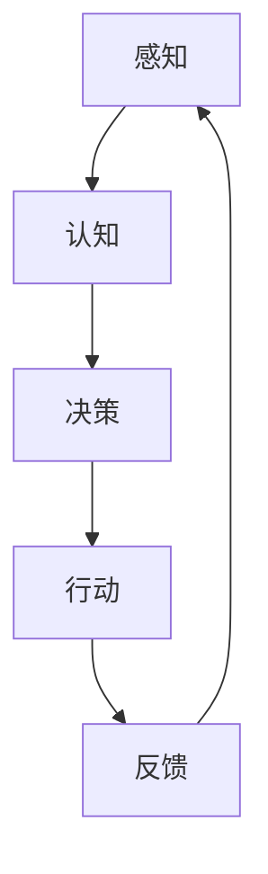
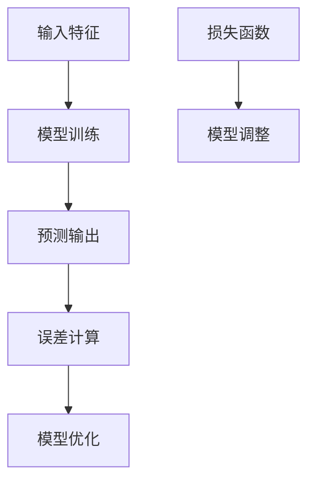
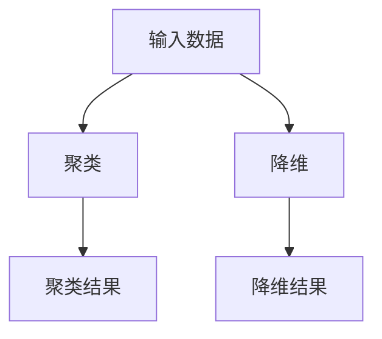
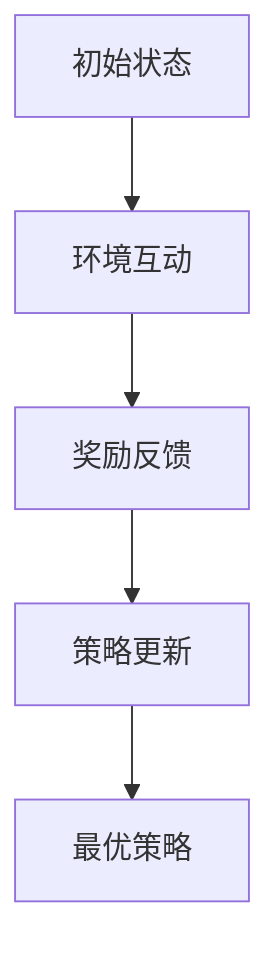
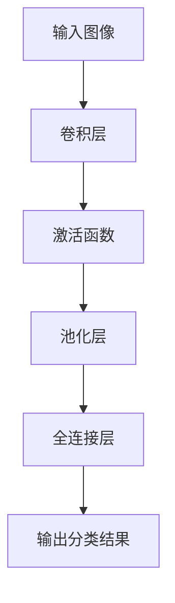
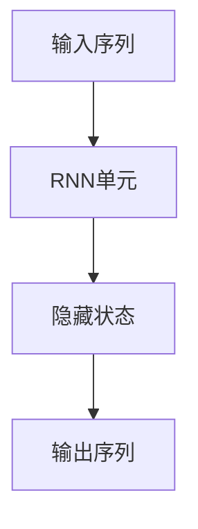
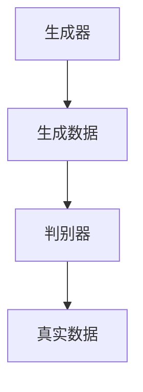

                 

# 《构建更智能的世界：人类计算的应用场景》

> 关键词：人类计算、人工智能、应用场景、核心算法、数学模型、项目实战

> 摘要：本文将从人类计算的概念、原理、应用场景、核心算法和数学模型等多个角度，深入探讨人类计算在构建更智能的世界中的应用，并通过实际项目案例，阐述其具体实现和成效。

## 第一部分：引言与背景

### 1.1 人类计算的概念

人类计算是指人类在处理信息、解决问题时所采用的方法、过程和策略。与机器计算不同，人类计算具有灵活性、创造力、情境意识和适应能力等独特特点。人类计算的核心在于人类大脑的工作原理，它涉及到感知、认知、决策、行动和反馈等环节。

### 1.2 人类计算与人工智能的关系

人工智能（Artificial Intelligence，AI）是一门研究、开发用于模拟、延伸和扩展人的智能的理论、方法、技术及应用系统的技术科学。人类计算为人工智能提供了理论基础和灵感来源。通过借鉴人类计算的方式，人工智能可以在一定程度上实现自动化、智能化和高效化。

### 1.3 人类计算的发展历程

人类计算的历史可以追溯到古希腊时期，如亚里士多德、帕普斯等学者提出的逻辑和推理理论。到了中世纪，阿拉伯学者阿尔-法拉比等人进一步发展了逻辑学。19世纪末，布尔代数的创立者乔治·布尔将逻辑运算转化为数学形式，为现代计算机科学奠定了基础。20世纪中叶，随着计算机技术的发展，人类计算逐渐与人工智能领域相结合，形成了今天的智能计算体系。

## 第二部分：核心概念与联系

### 2.1 人类计算的核心原理

人类计算的核心原理可以概括为感知、认知、决策、行动和反馈五个环节。以下是一个简单的Mermaid流程图：

### 2.2 人类计算的应用场景分类

人类计算的应用场景广泛，涵盖了教育、医疗、制造、交通、安全等多个领域。以下是对各应用场景的简要介绍：

- **教育**：个性化学习、智能辅导、教育数据分析等。
- **医疗**：医疗图像识别、智能诊断、健康数据分析等。
- **制造**：生产过程优化、质量检测、设备故障预测等。
- **交通**：无人驾驶、交通流量预测、智能交通管理等。
- **安全**：人脸识别、智能安防监控、行为分析等。

### 2.3 人类计算与传统计算的区别

传统计算依赖于固定的算法和规则，而人类计算则强调灵活性和适应性。传统计算的结果往往取决于输入数据的质量和计算模型的复杂度，而人类计算则能够根据情境和环境动态调整计算策略。以下是一个简单的对比表格：

| 特点 | 传统计算 | 人类计算 |
| --- | --- | --- |
| 灵活性 | 低 | 高 |
| 适应性 | 低 | 高 |
| 创造力 | 无 | 有 |
| 情境意识 | 无 | 有 |

## 第三部分：核心算法原理讲解

### 3.1 机器学习算法

机器学习算法是人工智能领域的重要分支，通过学习数据中的规律和模式，实现对未知数据的预测和分类。常见的机器学习算法包括监督学习、无监督学习和强化学习。

#### 3.1.1 监督学习算法原理

监督学习算法通过已有标签数据训练模型，然后利用训练好的模型对新数据进行预测。以下是一个简单的监督学习算法原理图：

#### 3.1.2 无监督学习算法原理

无监督学习算法从未标记的数据中学习规律和模式，常见的无监督学习算法包括聚类和降维。以下是一个简单的无监督学习算法原理图：

#### 3.1.3 强化学习算法原理

强化学习算法通过不断地与环境互动，学习最优策略以实现目标。强化学习算法的核心是奖励机制，以下是一个简单的强化学习算法原理图：

### 3.2 深度学习算法

深度学习算法是一种基于多层神经网络的机器学习算法，通过模拟人脑的神经网络结构，实现对复杂数据的分析和处理。常见的深度学习算法包括卷积神经网络（CNN）、循环神经网络（RNN）和生成对抗网络（GAN）。

#### 3.2.1 卷积神经网络（CNN）算法原理

卷积神经网络通过卷积操作、激活函数、池化操作等层，实现对图像等二维数据的特征提取和分类。以下是一个简单的CNN算法原理图：

#### 3.2.2 循环神经网络（RNN）算法原理

循环神经网络通过循环结构，实现对序列数据的处理。RNN可以有效地处理时间序列数据，如语音、文本等。以下是一个简单的RNN算法原理图：

#### 3.2.3 生成对抗网络（GAN）算法原理

生成对抗网络由生成器和判别器两个神经网络组成，通过对抗训练，生成器生成逼真的数据，判别器区分真实数据和生成数据。以下是一个简单的GAN算法原理图：

### 3.3 自然语言处理（NLP）算法

自然语言处理算法是人工智能领域的一个重要分支，旨在使计算机理解和处理人类自然语言。常见的NLP算法包括词嵌入技术、序列模型和注意力机制。

#### 3.3.1 词嵌入技术

词嵌入技术将词语映射为高维向量，以便于计算机处理。以下是一个简单的词嵌入技术公式：

$$
word\_embedding = \sum_{i=1}^{N} w_i \cdot v_i
$$

其中，$w_i$表示权重，$v_i$表示词向量。

## 第四部分：数学模型和数学公式

### 4.1 常见数学模型

常见的数学模型包括线性回归、逻辑回归和支持向量机（SVM）等。

#### 4.1.1 线性回归

线性回归模型通过最小二乘法，拟合输入变量和输出变量之间的线性关系。其数学模型如下：

$$
y = \theta_0 + \theta_1 \cdot x
$$

其中，$y$为输出变量，$x$为输入变量，$\theta_0$和$\theta_1$为模型参数。

#### 4.1.2 逻辑回归

逻辑回归模型通过最大似然估计，拟合输入变量和输出变量之间的逻辑关系。其数学模型如下：

$$
P(y=1|x;\theta) = \frac{1}{1 + e^{-\theta^T x}}
$$

其中，$y$为输出变量，$x$为输入变量，$\theta$为模型参数。

#### 4.1.3 支持向量机（SVM）

支持向量机模型通过寻找最佳超平面，实现输入变量和输出变量的分类。其数学模型如下：

$$
w \cdot x - b = 0
$$

其中，$w$为权重向量，$x$为输入变量，$b$为偏置。

### 4.2 数学公式

在人工智能领域，常用的数学公式包括概率论公式、信息论公式和最优化算法公式等。

#### 4.2.1 概率论公式

概率论公式在人工智能领域有着广泛的应用，如贝叶斯定理、条件概率和马尔可夫链等。以下是一个简单的贝叶斯定理公式：

$$
P(A|B) = \frac{P(B|A) \cdot P(A)}{P(B)}
$$

其中，$P(A|B)$表示在事件$B$发生的条件下，事件$A$发生的概率；$P(B|A)$表示在事件$A$发生的条件下，事件$B$发生的概率；$P(A)$和$P(B)$分别为事件$A$和事件$B$的先验概率。

#### 4.2.2 信息论公式

信息论公式主要涉及信息熵、互信息和条件熵等概念。以下是一个简单的信息熵公式：

$$
H(X) = -\sum_{i=1}^{N} p_i \cdot \log_2(p_i)
$$

其中，$H(X)$表示随机变量$X$的信息熵，$p_i$表示随机变量$X$取第$i$个值的概率。

#### 4.2.3 最优化算法公式

最优化算法公式主要用于求解优化问题，如梯度下降、牛顿法和拉格朗日乘子法等。以下是一个简单的梯度下降公式：

$$
\theta_{\text{new}} = \theta_{\text{old}} - \alpha \cdot \nabla_\theta J(\theta)
$$

其中，$\theta_{\text{new}}$和$\theta_{\text{old}}$分别为新的参数和旧的参数；$\alpha$为学习率；$J(\theta)$为损失函数。

## 第五部分：项目实战

### 5.1 教育领域的应用案例

#### 5.1.1 个性化学习系统

个性化学习系统通过分析学生的学习行为和成绩，为其推荐适合的学习资源和课程。以下是一个简单的个性化学习系统实现过程：

1. **数据收集**：收集学生的成绩、学习时间、学习频率等数据。
2. **数据处理**：对收集到的数据进行清洗、去重和预处理。
3. **特征提取**：将处理后的数据转化为特征向量。
4. **模型训练**：利用监督学习算法，如决策树、支持向量机等，训练个性化学习模型。
5. **模型评估**：利用测试数据评估模型的准确性和泛化能力。
6. **模型应用**：根据学生的特征，推荐相应的学习资源和课程。

#### 5.1.2 智能辅导系统

智能辅导系统通过分析学生的学习过程，提供实时反馈和指导。以下是一个简单的智能辅导系统实现过程：

1. **数据收集**：收集学生的学习行为、作业完成情况等数据。
2. **数据处理**：对收集到的数据进行清洗、去重和预处理。
3. **特征提取**：将处理后的数据转化为特征向量。
4. **模型训练**：利用监督学习算法，如决策树、支持向量机等，训练智能辅导模型。
5. **模型评估**：利用测试数据评估模型的准确性和泛化能力。
6. **模型应用**：根据学生的特征，提供相应的学习指导和反馈。

### 5.2 医疗领域的应用案例

#### 5.2.1 医疗图像识别

医疗图像识别系统通过分析医学图像，实现对疾病和病变的检测和诊断。以下是一个简单的医疗图像识别系统实现过程：

1. **数据收集**：收集医学图像数据，如X光片、CT片、MRI片等。
2. **数据处理**：对收集到的图像数据进行清洗、去噪和增强。
3. **特征提取**：将处理后的图像转化为特征向量。
4. **模型训练**：利用深度学习算法，如卷积神经网络（CNN）等，训练医疗图像识别模型。
5. **模型评估**：利用测试数据评估模型的准确性和泛化能力。
6. **模型应用**：根据图像特征，实现疾病和病变的自动检测和诊断。

#### 5.2.2 智能诊断系统

智能诊断系统通过分析病史、检查报告和病历数据，为医生提供诊断建议。以下是一个简单的智能诊断系统实现过程：

1. **数据收集**：收集病史、检查报告和病历数据。
2. **数据处理**：对收集到的数据进行清洗、去重和预处理。
3. **特征提取**：将处理后的数据转化为特征向量。
4. **模型训练**：利用监督学习算法，如决策树、支持向量机等，训练智能诊断模型。
5. **模型评估**：利用测试数据评估模型的准确性和泛化能力。
6. **模型应用**：根据病史和检查报告，为医生提供诊断建议。

### 5.3 制造领域的应用案例

#### 5.3.1 生产过程优化

生产过程优化系统通过分析生产数据，实现生产流程的优化。以下是一个简单的生产过程优化系统实现过程：

1. **数据收集**：收集生产过程中的各种数据，如设备运行状态、生产进度、产品质量等。
2. **数据处理**：对收集到的数据进行清洗、去噪和预处理。
3. **特征提取**：将处理后的数据转化为特征向量。
4. **模型训练**：利用监督学习算法，如决策树、支持向量机等，训练生产过程优化模型。
5. **模型评估**：利用测试数据评估模型的准确性和泛化能力。
6. **模型应用**：根据生产数据，实现生产流程的优化。

#### 5.3.2 质量检测系统

质量检测系统通过分析产品数据，实现产品质量的自动检测。以下是一个简单的质量检测系统实现过程：

1. **数据收集**：收集产品数据，如尺寸、重量、外观等。
2. **数据处理**：对收集到的数据进行清洗、去噪和预处理。
3. **特征提取**：将处理后的数据转化为特征向量。
4. **模型训练**：利用监督学习算法，如决策树、支持向量机等，训练质量检测模型。
5. **模型评估**：利用测试数据评估模型的准确性和泛化能力。
6. **模型应用**：根据产品数据，实现产品质量的自动检测。

### 5.4 交通领域的应用案例

#### 5.4.1 无人驾驶技术

无人驾驶技术通过分析交通数据和环境信息，实现车辆的自主驾驶。以下是一个简单的无人驾驶技术实现过程：

1. **数据收集**：收集车辆行驶过程中的各种数据，如速度、方向、路况等。
2. **数据处理**：对收集到的数据进行清洗、去噪和预处理。
3. **特征提取**：将处理后的数据转化为特征向量。
4. **模型训练**：利用监督学习算法，如决策树、支持向量机等，训练无人驾驶模型。
5. **模型评估**：利用测试数据评估模型的准确性和泛化能力。
6. **模型应用**：根据交通数据和环境信息，实现车辆的自主驾驶。

#### 5.4.2 交通流量预测

交通流量预测系统通过分析历史交通数据，实现对未来交通流量的预测。以下是一个简单的交通流量预测系统实现过程：

1. **数据收集**：收集历史交通数据，如路段流量、速度等。
2. **数据处理**：对收集到的数据进行清洗、去噪和预处理。
3. **特征提取**：将处理后的数据转化为特征向量。
4. **模型训练**：利用监督学习算法，如决策树、支持向量机等，训练交通流量预测模型。
5. **模型评估**：利用测试数据评估模型的准确性和泛化能力。
6. **模型应用**：根据历史交通数据，预测未来交通流量。

### 5.5 安全领域的应用案例

#### 5.5.1 人脸识别系统

人脸识别系统通过分析人脸图像，实现对人脸的自动识别。以下是一个简单的人脸识别系统实现过程：

1. **数据收集**：收集人脸图像数据。
2. **数据处理**：对收集到的人脸图像进行预处理，如人脸检测、姿态校正等。
3. **特征提取**：将处理过的人脸图像转化为特征向量。
4. **模型训练**：利用监督学习算法，如决策树、支持向量机等，训练人脸识别模型。
5. **模型评估**：利用测试数据评估模型的准确性和泛化能力。
6. **模型应用**：根据人脸特征，实现对人脸的自动识别。

#### 5.5.2 智能安防监控

智能安防监控系统通过分析视频数据，实现安全事件的自动检测和预警。以下是一个简单的智能安防监控系统实现过程：

1. **数据收集**：收集视频数据。
2. **数据处理**：对收集到的视频数据进行预处理，如去噪、增强等。
3. **特征提取**：将处理过的视频数据转化为特征向量。
4. **模型训练**：利用监督学习算法，如决策树、支持向量机等，训练安防监控模型。
5. **模型评估**：利用测试数据评估模型的准确性和泛化能力。
6. **模型应用**：根据视频特征，实现安全事件的自动检测和预警。

## 第六部分：总结与展望

### 6.1 人类计算的应用总结

人类计算在构建更智能的世界中发挥着重要作用。通过个性化学习、智能辅导、医疗图像识别、智能诊断、生产过程优化、质量检测、无人驾驶、交通流量预测、人脸识别和智能安防监控等应用，人类计算为各行业带来了显著的效率提升和创新能力。

### 6.2 人类计算的展望

未来，人类计算将继续向更高层次发展。随着深度学习、强化学习、自然语言处理等技术的不断进步，人类计算将在更广泛的应用场景中发挥作用。同时，人类计算与生物科技、物联网、区块链等领域的融合也将为构建更智能的世界提供新的契机。

### 6.3 人类计算的研究方向

未来，人类计算的研究方向将包括以下几个方面：

1. **新算法的研究**：探索更高效、更稳定的算法，以应对复杂数据和大规模计算的需求。
2. **新应用场景的探索**：挖掘人类计算在新兴领域的应用潜力，如教育、医疗、金融、环保等。
3. **新技术的发展**：结合量子计算、生物计算等前沿技术，推动人类计算向更高层次发展。

## 附录

### 附录A：常用工具与资源

#### A.1 常用深度学习框架

- TensorFlow
- PyTorch
- Keras

#### A.2 常用机器学习库

- Scikit-learn
- Pandas
- NumPy

#### A.3 常用NLP库

- NLTK
- spaCy
- gensim

#### A.4 学习资源推荐

- 线上课程：Coursera、edX、Udacity等平台提供的深度学习、机器学习、自然语言处理等课程。
- 研究论文：顶级会议和期刊，如NeurIPS、ICML、ACL等。
- 实践项目：GitHub、LeetCode、Kaggle等平台上的实际项目案例。

### 附录B：参考文献

[1] Russell, S., & Norvig, P. (2016). 《人工智能：一种现代的方法》（第3版）. 机械工业出版社。

[2] Goodfellow, I., Bengio, Y., & Courville, A. (2016). 《深度学习》（第1版）. 人民邮电出版社。

[3] Murphy, K. P. (2012). 《机器学习：一种概率视角》（第2版）. 机械工业出版社。

[4] Bishop, C. M. (2006). 《模式识别与机器学习》. 人民邮电出版社。

[5] Hastie, T., Tibshirani, R., & Friedman, J. (2009). 《统计学习基础》（第2版）. 电子工业出版社。

### 作者信息

作者：AI天才研究院/AI Genius Institute & 禅与计算机程序设计艺术 /Zen And The Art of Computer Programming

