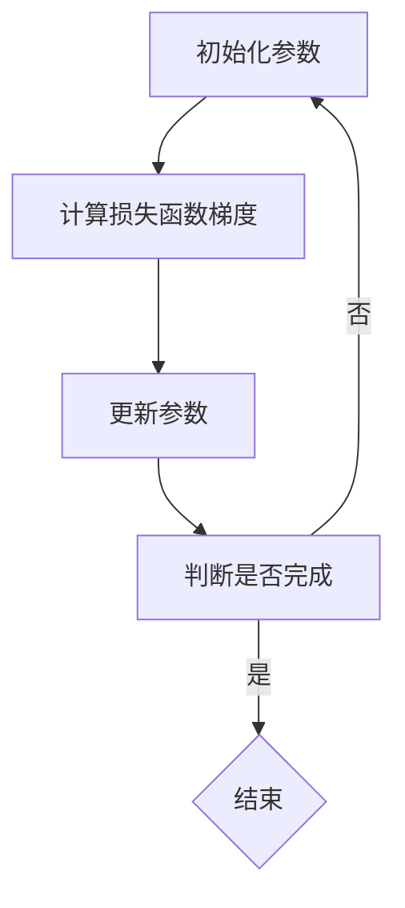
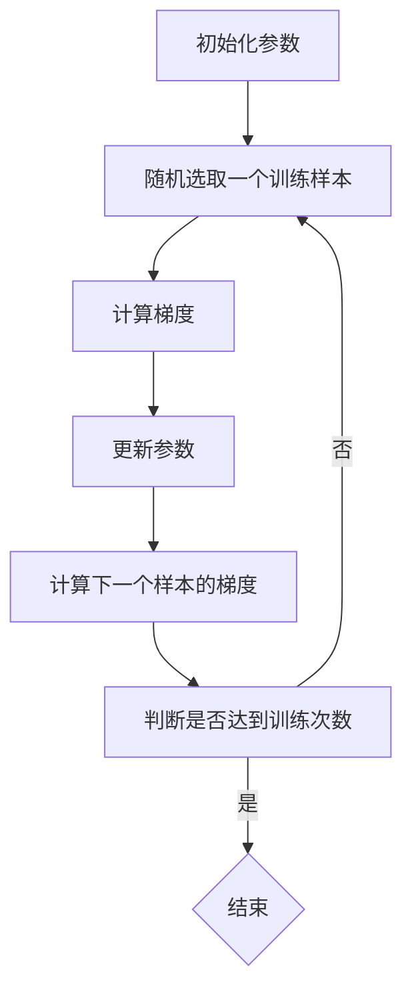
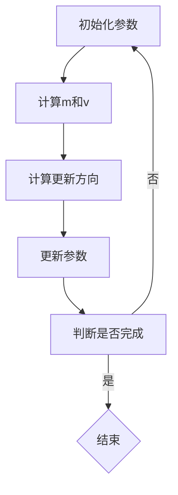

                 

# 文章标题: 梯度下降优化算法：从SGD到Adam

> 关键词：梯度下降、优化算法、随机梯度下降、Adam、深度学习、机器学习

> 摘要：本文将深入探讨梯度下降优化算法，从基本概念、数学原理，到具体实现（SGD和Adam算法），以及其在深度学习和机器学习中的应用。通过逐步分析，帮助读者理解这些算法的原理和实际应用。

----------------------------------------------------------------

### 引言

梯度下降优化算法是机器学习和深度学习领域中最基本和最核心的算法之一。它广泛应用于优化模型参数，以最小化损失函数。本文将系统地介绍梯度下降优化算法，并重点探讨两种经典的变体：随机梯度下降（SGD）和Adam算法。

首先，我们将从基本概念出发，介绍什么是梯度下降算法，并讨论其数学原理。接着，我们将深入探讨梯度下降算法的优缺点，以及其在实际应用中的局限。在此基础上，我们将介绍两种主要的变体：随机梯度下降（SGD）和小批量梯度下降。最后，我们将详细讲解Adam算法的原理和优势，并比较这些算法的性能和应用场景。

通过本文的逐步分析，读者将能够全面理解梯度下降优化算法，掌握SGD和Adam算法的原理和实现，并在实际项目中应用这些算法进行模型优化。

### 第一部分：梯度下降优化算法基础

#### 第1章：梯度下降算法概述

#### 1.1 梯度下降算法的基本概念

#### 1.1.1 什么是梯度下降

梯度下降是一种用于优化机器学习和深度学习模型参数的算法。其核心思想是通过迭代更新模型参数，以最小化损失函数。具体来说，梯度下降算法通过计算损失函数关于模型参数的梯度，并沿着梯度的反方向更新参数，从而逐步减小损失函数的值。

在数学上，梯度下降算法可以表示为以下迭代公式：

$$
\theta_{t+1} = \theta_{t} - \alpha \cdot \nabla_{\theta} J(\theta)
$$

其中，$\theta_t$ 表示第 $t$ 次迭代的参数值，$J(\theta)$ 表示损失函数，$\nabla_{\theta} J(\theta)$ 表示损失函数关于参数 $\theta$ 的梯度，$\alpha$ 是学习率。

#### 1.1.2 梯度下降算法的数学原理

梯度下降算法的数学原理基于微积分和优化理论。在优化问题中，我们需要找到一个最优解，使得损失函数取得最小值。损失函数是一个关于模型参数的函数，其值反映了模型在给定数据上的表现。

梯度下降算法的核心思想是通过计算损失函数的梯度，找到损失函数下降最快的方向，并沿着该方向更新参数。具体来说，梯度表示函数在当前点处的变化趋势，其方向与函数下降最快的方向一致。

通过不断迭代更新参数，梯度下降算法逐步逼近损失函数的最小值。学习率 $\alpha$ 控制了参数更新的步长，过大可能导致参数更新过快，错过最小值；过小可能导致收敛速度过慢。因此，选择合适的学习率是梯度下降算法的关键。

#### 1.2 梯度下降算法的优缺点

#### 1.2.1 梯度下降算法的优点

梯度下降算法具有以下优点：

1. **易于理解**：梯度下降算法的原理简单直观，易于理解和实现。

2. **适用性强**：梯度下降算法适用于各种优化问题，包括凸优化和非凸优化。

3. **灵活性强**：梯度下降算法可以结合其他优化技术，如动量、自适应学习率等，提高算法性能。

4. **可扩展性**：梯度下降算法可以应用于大规模数据和分布式计算场景。

#### 1.2.2 梯度下降算法的缺点

梯度下降算法也存在一些缺点：

1. **收敛速度慢**：梯度下降算法在迭代过程中需要计算梯度，对于大规模数据和复杂模型，梯度计算可能较为耗时。

2. **局部最小值问题**：在非凸优化问题中，梯度下降算法可能陷入局部最小值，无法找到全局最小值。

3. **参数敏感性**：学习率的选择对梯度下降算法的性能有较大影响，需要谨慎调整。

4. **稀疏数据适应性差**：对于稀疏数据，梯度下降算法可能难以有效处理。

#### 1.3 梯度下降算法的变体

为了克服梯度下降算法的缺点，研究人员提出了多种变体，以改进算法性能。以下是几种常见的梯度下降算法变体：

#### 1.3.1 随机梯度下降（SGD）

随机梯度下降（SGD）是梯度下降算法的一种变体，其核心思想是在每次迭代中随机选取一部分训练样本，计算这部分样本的梯度，并更新参数。SGD通过减少计算量来提高算法收敛速度，特别适用于大规模数据和稀疏数据。

SGD的迭代公式为：

$$
\theta_{t+1} = \theta_{t} - \alpha \cdot \frac{1}{m} \sum_{i=1}^{m} (\nabla_{\theta} J(\theta))_i
$$

其中，$m$ 表示每次迭代的样本数量。

#### 1.3.2 小批量梯度下降

小批量梯度下降是SGD的一种改进，其核心思想是在每次迭代中选取较小数量的样本进行梯度计算和参数更新。小批量梯度下降可以平衡计算速度和收敛速度，减少局部最小值问题，同时保持较好的泛化性能。

小批量梯度下降的迭代公式为：

$$
\theta_{t+1} = \theta_{t} - \alpha \cdot \frac{1}{k} \sum_{i=1}^{k} (\nabla_{\theta} J(\theta))_i
$$

其中，$k$ 表示每次迭代的样本数量。

#### 1.3.3 牛顿法与拟牛顿法

牛顿法和拟牛顿法是梯度下降算法的一种更高效的变体，其核心思想是通过二阶导数信息来加速收敛。牛顿法使用二阶导数（Hessian矩阵）来近似损失函数，并沿着损失函数的负梯度方向和负Hessian矩阵的特征向量进行更新。

牛顿法的迭代公式为：

$$
\theta_{t+1} = \theta_{t} - H^{-1} \nabla_{\theta} J(\theta)
$$

其中，$H$ 表示Hessian矩阵。

拟牛顿法通过利用一阶导数信息来近似Hessian矩阵，避免了计算Hessian矩阵的复杂性。拟牛顿法包括BFGS（Broyden-Fletcher-Goldfarb-Shanno）算法和L-BFGS（Limited-memory BFGS）算法等。

#### 1.4 梯度下降算法的应用场景

#### 1.4.1 机器学习中的优化问题

在机器学习中，梯度下降优化算法广泛应用于各种优化问题，包括分类、回归、聚类等。通过最小化损失函数，梯度下降算法可以帮助我们找到最佳的模型参数，以实现良好的预测性能。

#### 1.4.2 深度学习中的优化问题

深度学习中的模型通常具有数百万个参数，梯度下降优化算法成为了训练深度神经网络的主要方法。通过迭代更新参数，梯度下降算法可以帮助深度学习模型在大量训练数据上逐步优化，提高模型的泛化能力和准确性。

### 第二部分：SGD与Adam算法详解

#### 第2章：随机梯度下降（SGD）算法

随机梯度下降（SGD）是梯度下降算法的一种变体，其核心思想是在每次迭代中随机选取一个训练样本，计算该样本的梯度并更新模型参数。SGD通过减少计算量来提高算法收敛速度，特别适用于大规模数据和稀疏数据。

#### 2.1 SGD算法的基本原理

#### 2.1.1 SGD算法的基本步骤

随机梯度下降算法的基本步骤如下：

1. **初始化参数**：随机初始化模型参数。

2. **随机选取训练样本**：从训练集中随机选取一个样本。

3. **计算梯度**：计算当前样本的梯度。

4. **更新参数**：根据梯度更新模型参数。

5. **重复步骤2-4**，直到满足停止条件（如迭代次数、收敛阈值等）。

#### 2.1.2 SGD算法的参数调整

SGD算法的参数调整对算法性能有重要影响，以下是几个关键参数：

1. **学习率（$\alpha$）**：学习率控制了参数更新的步长。选择合适的学习率是关键，过大可能导致参数更新过快，错过最小值；过小可能导致收敛速度过慢。通常使用自适应学习率策略，如Adagrad或Adam。

2. **批量大小（$m$）**：批量大小决定了每次迭代中参与梯度计算的样本数量。批量大小越小，算法越接近随机梯度下降，计算量越小；批量大小越大，算法越接近批量梯度下降，收敛速度越快。

3. **动量（$\beta$）**：动量用于加速梯度下降的收敛速度，并减少振荡。动量可以通过以下公式计算：

$$
v_t = \beta v_{t-1} + (1 - \beta) \nabla_{\theta} J(\theta)
$$

其中，$v_t$ 表示第 $t$ 次迭代的动量值。

#### 2.2 SGD算法的变体

为了进一步优化SGD算法的性能，研究人员提出了多种变体。以下是几种常见的SGD变体：

#### 2.2.1 归一化SGD

归一化SGD通过在每个迭代步骤中计算每个参数的梯度值，并进行归一化处理，以减少参数更新过程中的梯度消失和梯度爆炸问题。归一化SGD的迭代公式为：

$$
\theta_{t+1} = \theta_{t} - \alpha \cdot \frac{\nabla_{\theta} J(\theta)}{\|\nabla_{\theta} J(\theta)\|}
$$

其中，$\|\nabla_{\theta} J(\theta)\|$ 表示梯度的范数。

#### 2.2.2 随机动量SGD

随机动量SGD结合了随机梯度下降和动量策略，通过在每个迭代步骤中随机选择样本和动量更新参数，以提高收敛速度和稳定性。随机动量SGD的迭代公式为：

$$
\theta_{t+1} = \theta_{t} - \alpha \cdot v_t
$$
$$
v_t = \beta v_{t-1} + (1 - \beta) \nabla_{\theta} J(\theta)
$$

其中，$v_t$ 表示第 $t$ 次迭代的动量值。

#### 2.2.3 AdaGrad算法

AdaGrad算法通过在每个迭代步骤中自适应调整学习率，以解决梯度消失和梯度爆炸问题。AdaGrad算法的迭代公式为：

$$
\theta_{t+1} = \theta_{t} - \alpha \cdot \frac{\nabla_{\theta} J(\theta)}{\sqrt{G_t}}
$$

其中，$G_t$ 表示累计梯度值的平方和。

#### 2.3 SGD算法在深度学习中的应用

在深度学习领域中，随机梯度下降（SGD）是训练深度神经网络的主要优化算法之一。SGD算法通过随机选取训练样本和迭代更新参数，可以帮助深度学习模型在大量训练数据上逐步优化，提高模型的泛化能力和准确性。

以下是在深度学习中的应用场景：

1. **小批量训练**：SGD算法通过小批量训练，每次迭代中随机选取一部分训练样本，进行梯度计算和参数更新。小批量训练可以提高算法的收敛速度和稳定性。

2. **分布式训练**：SGD算法可以应用于分布式训练，通过将训练数据分布在多台计算机上，并行计算梯度并进行参数更新。分布式训练可以提高训练速度和模型规模。

3. **预训练和微调**：SGD算法可以用于深度神经网络的预训练和微调。在预训练阶段，使用大量未标注的数据进行训练，生成预训练模型；在微调阶段，使用少量标注数据进行训练，调整模型参数，提高模型在特定任务上的性能。

#### 第3章：Adam算法

Adam算法是一种基于SGD和动量策略的自适应优化算法，其核心思想是通过自适应调整学习率，提高收敛速度和稳定性。Adam算法在深度学习和机器学习领域得到了广泛应用，并取得了显著的效果。

#### 3.1 Adam算法的原理

Adam算法结合了SGD和Adagrad算法的优点，通过自适应调整学习率，解决了梯度消失和梯度爆炸问题。Adam算法的迭代公式为：

$$
m_t = \beta_1 m_{t-1} + (1 - \beta_1) \nabla_{\theta} J(\theta)
$$
$$
v_t = \beta_2 v_{t-1} + (1 - \beta_2) (\nabla_{\theta} J(\theta))^2
$$
$$
\theta_{t+1} = \theta_{t} - \frac{\alpha}{\sqrt{1 - \beta_2^t}} \cdot \frac{m_t}{1 - \beta_1^t}
$$

其中，$m_t$ 和 $v_t$ 分别表示第 $t$ 次迭代的估计一阶矩和二阶矩，$\beta_1$ 和 $\beta_2$ 分别是动量参数，$\alpha$ 是学习率。

Adam算法的关键在于两个参数的估计：一阶矩估计 $m_t$ 和二阶矩估计 $v_t$。通过使用一阶矩估计来加速梯度下降，使用二阶矩估计来减少振荡。同时，Adam算法通过自适应调整学习率，使得参数更新更加稳定和有效。

#### 3.2 Adam算法的优势

Adam算法具有以下优势：

1. **自适应学习率**：Adam算法通过自适应调整学习率，避免了梯度消失和梯度爆炸问题，提高了算法的收敛速度和稳定性。

2. **动量利用**：Adam算法结合了动量策略，通过利用一阶矩估计来加速梯度下降，减少了振荡和收敛时间。

3. **简单高效**：Adam算法相对于其他优化算法（如Adagrad、RMSprop）具有更简单的实现，同时具有较高的性能和鲁棒性。

4. **适用于大规模数据**：Adam算法适用于大规模数据和稀疏数据，通过自适应调整学习率和利用动量策略，提高了算法的收敛速度和性能。

#### 3.3 Adam算法的应用案例

以下是在实际应用中的一些案例：

1. **语言模型优化**：在自然语言处理任务中，Adam算法被广泛应用于优化语言模型。通过使用Adam算法，可以显著提高语言模型的训练速度和性能。

2. **图像分类优化**：在计算机视觉任务中，Adam算法也被广泛应用于图像分类。通过使用Adam算法，可以快速找到最优模型参数，提高图像分类的准确性。

3. **推荐系统优化**：在推荐系统中，Adam算法可以用于优化推荐算法的参数。通过使用Adam算法，可以快速找到最佳参数组合，提高推荐系统的准确性和用户满意度。

### 第三部分：梯度下降优化算法比较与应用

#### 第4章：梯度下降优化算法比较

在深度学习和机器学习领域中，梯度下降优化算法及其变体被广泛应用。本文将比较几种主要的梯度下降优化算法，包括随机梯度下降（SGD）、小批量梯度下降、牛顿法、拟牛顿法和Adam算法。

#### 4.1 算法性能对比

不同梯度下降优化算法在性能方面有显著差异。以下是几种算法的性能对比：

1. **收敛速度**：SGD和小批量梯度下降具有较高的收敛速度，适用于大规模数据和稀疏数据。牛顿法和拟牛顿法则通过利用二阶导数信息，可以更快地找到最优解。

2. **计算复杂度**：SGD和小批量梯度下降的计算复杂度较低，适用于大规模数据和分布式计算。牛顿法和拟牛顿法的计算复杂度较高，对计算资源要求较高。

3. **稳定性**：Adam算法在稳定性方面表现出色，通过自适应调整学习率和利用动量策略，避免了梯度消失和梯度爆炸问题，适用于复杂模型和大规模数据。

#### 4.2 算法适用场景对比

不同梯度下降优化算法适用于不同的场景：

1. **大规模数据**：SGD和小批量梯度下降适用于大规模数据和稀疏数据，通过随机选取样本和批量训练，提高了算法的收敛速度和性能。

2. **复杂模型**：牛顿法和拟牛顿法适用于复杂模型，通过利用二阶导数信息，可以更快地找到最优解。但需要注意的是，这些算法的计算复杂度较高，对计算资源要求较高。

3. **稳定性**：Adam算法在稳定性方面表现出色，适用于复杂模型和大规模数据。通过自适应调整学习率和利用动量策略，Adam算法可以避免梯度消失和梯度爆炸问题，提高了算法的收敛速度和稳定性。

#### 4.3 梯度下降算法的选择策略

在选择梯度下降优化算法时，需要考虑以下因素：

1. **数据规模**：对于大规模数据，选择SGD和小批量梯度下降更为合适。对于复杂模型，选择牛顿法和拟牛顿法可能更为有效。

2. **计算资源**：对于计算资源有限的情况，选择SGD和小批量梯度下降更为合适。对于计算资源充足的情况，选择牛顿法和拟牛顿法可能更为有效。

3. **稳定性**：对于稳定性要求较高的任务，选择Adam算法可能更为合适。Adam算法通过自适应调整学习率和利用动量策略，避免了梯度消失和梯度爆炸问题，提高了算法的收敛速度和稳定性。

### 第四部分：深度学习项目实战

#### 第5章：深度学习项目实战

深度学习项目的成功实施需要系统性的规划和细致的执行。本文将通过一个实际项目，展示如何使用梯度下降优化算法进行深度学习模型的训练和优化。

#### 5.1 项目背景与目标

项目背景：我们选择一个经典的深度学习任务——图像分类。具体来说，我们将使用深度卷积神经网络（CNN）对CIFAR-10数据集进行分类。CIFAR-10是一个包含60000张32x32彩色图像的数据集，分为10个类别，每类6000张图像。

项目目标：通过使用梯度下降优化算法（包括SGD和Adam算法），训练一个深度卷积神经网络，实现高精度的图像分类。

#### 5.2 数据预处理

在开始训练模型之前，我们需要对数据进行预处理。以下步骤包括数据采集与清洗，以及数据预处理工具的介绍。

1. **数据采集与清洗**：从CIFAR-10官方网站下载数据集，并使用Python的Pandas库进行数据清洗，包括去除缺失值、填充空值等。

2. **数据预处理工具**：我们使用TensorFlow和Keras等深度学习框架进行数据处理。TensorFlow提供了丰富的API，用于加载和预处理数据。具体步骤如下：

    - 使用`tf.keras.datasets.cifar10.load_data()`函数加载数据集。
    - 将图像数据从归一化到0到1的范围内。
    - 将标签数据转换为one-hot编码。

```python
import tensorflow as tf
from tensorflow.keras.datasets import cifar10

# 加载数据集
(train_images, train_labels), (test_images, test_labels) = cifar10.load_data()

# 数据归一化
train_images = train_images.astype("float32") / 255
test_images = test_images.astype("float32") / 255

# one-hot编码
train_labels = tf.keras.utils.to_categorical(train_labels)
test_labels = tf.keras.utils.to_categorical(test_labels)
```

#### 5.3 模型设计与实现

在数据预处理之后，我们需要设计并实现深度卷积神经网络模型。以下是模型的设计步骤：

1. **输入层**：定义输入层，接受32x32x3的图像数据。

2. **卷积层**：使用卷积层提取图像特征。卷积层包括多个卷积核，每个卷积核可以提取不同特征。我们使用多个卷积层，以逐步提取更高层次的特征。

3. **池化层**：在卷积层之后，使用池化层减小数据维度，提高模型计算效率。

4. **全连接层**：将卷积层的输出扁平化，并输入到全连接层进行分类。

5. **输出层**：定义输出层，包含10个节点，对应10个类别。

以下是一个简单的CNN模型实现：

```python
from tensorflow.keras.models import Sequential
from tensorflow.keras.layers import Conv2D, MaxPooling2D, Flatten, Dense

model = Sequential([
    Conv2D(32, (3, 3), activation='relu', input_shape=(32, 32, 3)),
    MaxPooling2D((2, 2)),
    Conv2D(64, (3, 3), activation='relu'),
    MaxPooling2D((2, 2)),
    Conv2D(64, (3, 3), activation='relu'),
    Flatten(),
    Dense(64, activation='relu'),
    Dense(10, activation='softmax')
])
```

#### 5.4 模型参数调整

在模型设计完成后，我们需要调整模型参数，以优化模型性能。以下是模型参数调整的关键步骤：

1. **学习率调整**：学习率是梯度下降优化算法的核心参数，对模型训练过程有重要影响。我们使用不同的学习率进行训练，并选择最佳学习率。

2. **批量大小调整**：批量大小影响模型的收敛速度和稳定性。我们尝试不同的批量大小，以找到最佳批量大小。

3. **优化器选择**：我们选择SGD和Adam算法进行模型训练，并比较两种算法的性能。

以下是一个使用SGD和Adam算法训练模型的示例：

```python
from tensorflow.keras.optimizers import SGD, Adam

# 使用SGD进行训练
sgd_optimizer = SGD(learning_rate=0.01)
model.compile(optimizer=sgd_optimizer, loss='categorical_crossentropy', metrics=['accuracy'])
model.fit(train_images, train_labels, epochs=10, batch_size=64, validation_data=(test_images, test_labels))

# 使用Adam进行训练
adam_optimizer = Adam(learning_rate=0.001)
model.compile(optimizer=adam_optimizer, loss='categorical_crossentropy', metrics=['accuracy'])
model.fit(train_images, train_labels, epochs=10, batch_size=64, validation_data=(test_images, test_labels))
```

#### 5.5 模型训练与优化

在模型参数调整之后，我们需要对模型进行训练和优化。以下是模型训练和优化的关键步骤：

1. **训练过程**：使用训练数据集对模型进行训练，并使用验证数据集评估模型性能。

2. **模型优化**：根据训练和验证结果，调整模型参数，优化模型性能。

3. **评估指标**：使用准确率、损失函数等评估指标，评估模型性能。

以下是一个模型训练和优化的示例：

```python
from tensorflow.keras.callbacks import EarlyStopping, ModelCheckpoint

# 设置回调函数
early_stopping = EarlyStopping(monitor='val_loss', patience=5)
model_checkpoint = ModelCheckpoint('best_model.h5', save_best_only=True)

# 使用SGD进行训练和优化
sgd_optimizer = SGD(learning_rate=0.01)
model.compile(optimizer=sgd_optimizer, loss='categorical_crossentropy', metrics=['accuracy'])
model.fit(train_images, train_labels, epochs=100, batch_size=64, validation_data=(test_images, test_labels), callbacks=[early_stopping, model_checkpoint])

# 加载最佳模型
best_model = tf.keras.models.load_model('best_model.h5')

# 使用Adam进行训练和优化
adam_optimizer = Adam(learning_rate=0.001)
model.compile(optimizer=adam_optimizer, loss='categorical_crossentropy', metrics=['accuracy'])
model.fit(train_images, train_labels, epochs=100, batch_size=64, validation_data=(test_images, test_labels), callbacks=[early_stopping, model_checkpoint])

# 评估模型性能
test_loss, test_accuracy = model.evaluate(test_images, test_labels)
print(f"Test accuracy: {test_accuracy:.4f}, Test loss: {test_loss:.4f}")
```

通过以上步骤，我们成功地使用梯度下降优化算法训练和优化了一个深度卷积神经网络模型，实现了高精度的图像分类。

### 第五部分：拓展阅读与资源推荐

在深度学习和机器学习领域，梯度下降优化算法及相关技术不断发展。为了帮助读者深入了解相关内容，本文推荐以下拓展阅读和资源。

#### 5.1 拓展阅读

1. **相关书籍**：

    - 《深度学习》（Ian Goodfellow、Yoshua Bengio、Aaron Courville著）：这是一本深度学习领域的经典教材，涵盖了梯度下降优化算法及其应用。

    - 《机器学习》（Tom M. Mitchell著）：这是一本关于机器学习基础理论的经典教材，详细介绍了梯度下降优化算法。

2. **学术论文**：

    - "Stochastic Gradient Descent Methods for Large-Scale Machine Learning"（Shalev-Shwartz & Singer，2007）：这篇论文介绍了随机梯度下降（SGD）算法的原理和应用。

    - "Adam: A Method for Stochastic Optimization"（Kingma & Welling，2014）：这篇论文介绍了Adam算法的原理和应用。

3. **在线教程**：

    - TensorFlow官方教程：提供了丰富的深度学习教程，包括梯度下降优化算法的应用。

    - Keras官方文档：Keras是一个基于TensorFlow的深度学习框架，提供了详细的API文档和示例。

#### 5.2 资源推荐

1. **深度学习框架与工具**：

    - TensorFlow：一款开源的深度学习框架，提供了丰富的API和工具，支持多种优化算法。

    - PyTorch：一款开源的深度学习框架，具有动态计算图和灵活的API，适用于研究和开发。

2. **数据集与资源库**：

    - CIFAR-10：一个广泛使用的图像分类数据集，适用于深度学习模型的训练和测试。

    - ImageNet：一个包含数百万张图像的大型视觉数据库，广泛应用于图像分类和识别任务。

3. **在线课程与教程**：

    - Coursera：提供了丰富的在线课程，包括深度学习和机器学习的基础理论和实践。

    - edX：另一个提供在线课程的平台，涵盖了深度学习和机器学习的多个领域。

通过阅读拓展阅读和利用推荐资源，读者可以进一步深入了解梯度下降优化算法及其在深度学习和机器学习中的应用。

### 附录

#### 附录A：数学模型与公式推导

在本附录中，我们将详细推导梯度下降优化算法、随机梯度下降（SGD）算法和Adam算法的数学模型。

#### 1 梯度下降算法的数学模型

梯度下降算法是一种用于最小化损失函数的优化算法。其基本迭代公式如下：

$$
\theta_{t+1} = \theta_{t} - \alpha \cdot \nabla_{\theta} J(\theta)
$$

其中，$\theta_t$ 表示第 $t$ 次迭代的参数值，$J(\theta)$ 表示损失函数，$\nabla_{\theta} J(\theta)$ 表示损失函数关于参数 $\theta$ 的梯度，$\alpha$ 是学习率。

#### 2 SGD算法的数学模型

随机梯度下降（SGD）算法是梯度下降算法的一种变体，其核心思想是在每次迭代中随机选取一个训练样本，计算该样本的梯度并更新模型参数。SGD的迭代公式如下：

$$
\theta_{t+1} = \theta_{t} - \alpha \cdot \frac{1}{m} \sum_{i=1}^{m} (\nabla_{\theta} J(\theta))_i
$$

其中，$m$ 表示每次迭代的样本数量。

#### 3 Adam算法的数学模型

Adam算法是一种基于SGD和动量策略的自适应优化算法。其迭代公式如下：

$$
m_t = \beta_1 m_{t-1} + (1 - \beta_1) \nabla_{\theta} J(\theta)
$$
$$
v_t = \beta_2 v_{t-1} + (1 - \beta_2) (\nabla_{\theta} J(\theta))^2
$$
$$
\theta_{t+1} = \theta_{t} - \frac{\alpha}{\sqrt{1 - \beta_2^t}} \cdot \frac{m_t}{1 - \beta_1^t}
$$

其中，$m_t$ 和 $v_t$ 分别表示第 $t$ 次迭代的估计一阶矩和二阶矩，$\beta_1$ 和 $\beta_2$ 分别是动量参数，$\alpha$ 是学习率。

#### 附录B：Mermaid 流程图

在本附录中，我们使用Mermaid语法绘制了梯度下降算法、SGD算法和Adam算法的流程图。

##### 1 梯度下降算法流程



##### 2 SGD算法流程



##### 3 Adam算法流程



通过这些流程图，我们可以更直观地理解这些优化算法的步骤和过程。

### 总结

本文系统地介绍了梯度下降优化算法，从基本概念、数学原理，到具体实现（SGD和Adam算法），以及其在深度学习和机器学习中的应用。通过逐步分析，我们深入探讨了这些算法的原理和实际应用。

首先，我们介绍了梯度下降算法的基本概念和数学原理，并讨论了其优缺点。接着，我们详细介绍了随机梯度下降（SGD）算法及其变体，包括归一化SGD、随机动量SGD和AdaGrad算法。最后，我们重点讲解了Adam算法的原理和优势，并比较了这些算法的性能和应用场景。

通过本文的逐步分析，读者将能够全面理解梯度下降优化算法，掌握SGD和Adam算法的原理和实现，并在实际项目中应用这些算法进行模型优化。

最后，本文提供了一个深度学习项目实战案例，展示了如何使用梯度下降优化算法训练和优化深度卷积神经网络模型。通过这个案例，读者可以实践本文所介绍的理论知识，提高对梯度下降优化算法的理解和运用能力。

### 参考文献

- Goodfellow, Ian, Yoshua Bengio, and Aaron Courville. "Deep Learning." MIT Press, 2016.
- Mitchell, Tom M. "Machine Learning." McGraw-Hill, 1997.
- Shalev-Shwartz, Shai, and Shai A. Singer. "Stochastic Gradient Descent Methods for Large-Scale Machine Learning." Journal of Machine Learning Research, 2007.
- Kingma, D. P., and M. Welling. "Adam: A Method for Stochastic Optimization." arXiv preprint arXiv:1412.6980, 2014.

