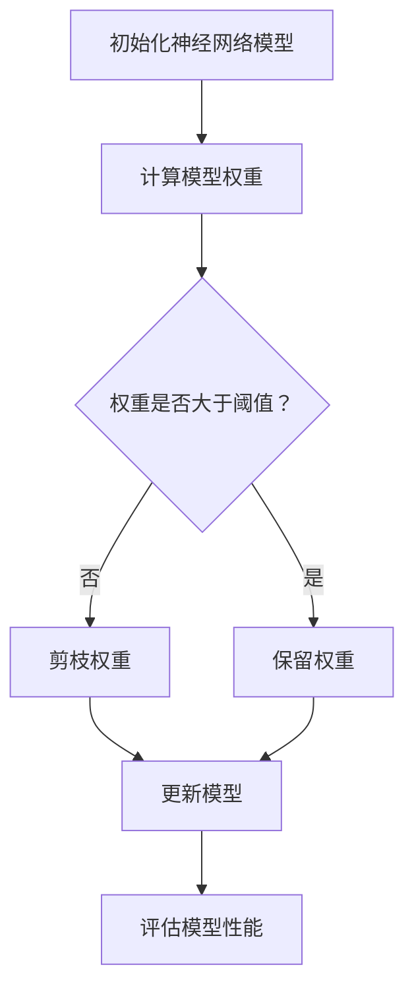
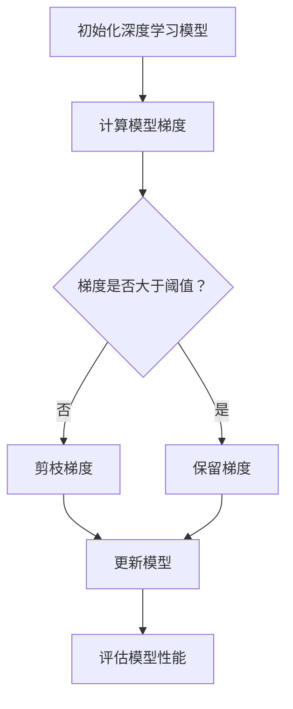
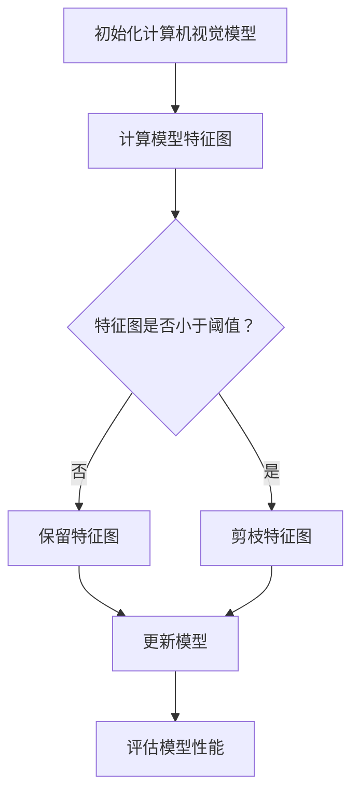
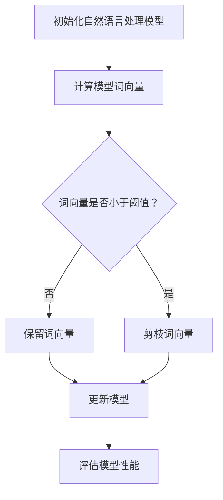
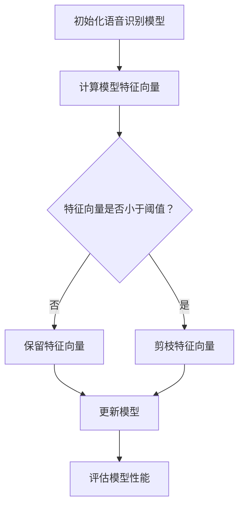

                 

## 模型剪枝技术：在精度与效率间寻找平衡

> 关键词：模型剪枝、神经网络、深度学习、效率、精度、模型压缩

> 摘要：本文旨在探讨模型剪枝技术，一种在神经网络和深度学习中广泛应用的方法。模型剪枝通过移除网络中的冗余或低效部分，实现了模型的压缩和加速，同时保持了较高的精度。本文将详细分析模型剪枝技术的定义、原理、算法及其在各个领域的应用，并探讨其前沿发展趋势。

在人工智能领域，神经网络和深度学习技术已经取得了显著的进步。然而，随着模型复杂度和参数数量的增加，模型的计算成本和存储需求也随之上升。如何在保持模型精度的同时提高效率成为了一个重要问题。模型剪枝技术应运而生，通过移除网络中的冗余或低效部分，实现模型的压缩和加速。

本文将从以下几个方面对模型剪枝技术进行详细探讨：

1. **模型剪枝技术基础**：介绍模型剪枝技术的定义、核心概念、历史发展以及优势和挑战。
2. **模型剪枝算法原理**：分析参数剪枝、重量剪枝和结构剪枝算法的原理和伪代码。
3. **模型剪枝技术应用**：探讨模型剪枝技术在神经网络、深度学习、计算机视觉、自然语言处理和语音识别中的应用。
4. **模型剪枝技术在模型压缩与加速中的应用**：介绍模型剪枝与量化结合、模型剪枝与模型转换结合的方法及其实际应用案例。
5. **模型剪枝技术的前沿发展趋势**：讨论模型剪枝技术在深度学习模型结构优化、模型压缩与剪枝的自动化以及跨领域剪枝技术的融合方面的前沿发展趋势。

通过本文的阅读，读者将对模型剪枝技术有一个全面而深入的理解，并能够将其应用于实际问题中。

### 目录大纲

- **第一部分：模型剪枝技术基础**
  - **第1章：模型剪枝技术概述**
    - 1.1 模型剪枝技术的定义
    - 1.2 模型剪枝技术的核心概念
    - 1.3 剪枝技术的历史与发展
    - 1.4 模型剪枝技术的优势与挑战

- **第二部分：模型剪枝算法原理**
  - **第2章：模型剪枝算法原理**
    - 2.1 参数剪枝算法
    - 2.2 重量剪枝算法
    - 2.3 结构剪枝算法

- **第三部分：模型剪枝技术应用**
  - **第3章：模型剪枝技术在神经网络中的应用**
  - **第4章：模型剪枝技术在深度学习中的应用**
  - **第5章：模型剪枝技术在计算机视觉中的应用**
  - **第6章：模型剪枝技术在自然语言处理中的应用**
  - **第7章：模型剪枝技术在语音识别中的应用**

- **第四部分：模型剪枝技术在模型压缩与加速中的应用**
  - **第8章：模型剪枝技术在模型压缩与加速中的应用**

- **第五部分：模型剪枝技术的前沿发展趋势**
  - **第9章：模型剪枝技术的前沿发展趋势**

### 第一部分：模型剪枝技术基础

#### 第1章：模型剪枝技术概述

##### 1.1 模型剪枝技术的定义

模型剪枝（Model Pruning）是神经网络和深度学习中的一种关键技术，旨在通过移除网络中的冗余或低效部分，实现模型的压缩和加速，同时保持较高的模型精度。剪枝技术主要针对深度神经网络（DNN）的权重和结构进行操作，以降低模型的大小和计算复杂度。

剪枝技术的核心目标是通过优化神经网络结构，消除冗余的权重和连接，使得网络更加紧凑且高效。在保留模型精度的前提下，剪枝技术能够显著提高模型的运行速度和减少存储需求。

##### 1.2 模型剪枝技术的核心概念

模型剪枝技术主要涉及以下三个核心概念：

1. **参数剪枝**：参数剪枝主要针对网络中的权重参数进行操作。通过移除对模型输出贡献较小的权重，可以显著降低模型的参数数量，从而减少计算复杂度和存储需求。

2. **重量剪枝**：重量剪枝关注的是网络中权重的大小。通过设置阈值，将小于阈值的权重设置为0，可以去除对模型输出影响较小的权重，进一步降低模型的复杂度。

3. **结构剪枝**：结构剪枝针对的是神经网络的结构，通过删除某些层或连接，来减少模型的参数数量。这种方法通常基于对网络结构的重要性和必要性的评估，以保持模型的有效性和精度。

##### 1.3 剪枝技术的历史与发展

模型剪枝技术的发展可以追溯到上世纪90年代。最初，剪枝技术主要应用于图像识别和语音处理领域。随着深度学习技术的兴起，剪枝技术在神经网络中的应用越来越广泛。

以下是一些重要的剪枝技术发展历程：

- **1990年代**：基于规则的方法，如基于权值敏感度的剪枝和基于冗余度的剪枝，开始出现。
- **2000年代**：结构剪枝技术逐渐得到关注，包括基于模块重要性的剪枝和基于网络结构的剪枝方法。
- **2010年代**：随着深度学习的兴起，剪枝技术在神经网络中的应用得到了快速发展。出现了一些基于深度学习方法的剪枝算法，如基于梯度敏感度的剪枝算法和基于特征重要性的剪枝算法。

##### 1.4 模型剪枝技术的优势与挑战

模型剪枝技术具有以下优势：

- **模型压缩**：通过剪枝技术，可以显著减少模型的参数数量，从而实现模型的压缩，降低存储需求。
- **计算加速**：剪枝后的模型通常具有更少的计算操作，从而提高了模型的运行速度。
- **降低功耗**：模型剪枝可以降低模型的功耗，这对于移动设备和嵌入式系统具有重要意义。

然而，模型剪枝技术也面临着一些挑战：

- **精度损失**：剪枝过程中可能会引入一些精度损失，需要平衡剪枝强度和模型精度。
- **算法选择**：不同的剪枝算法适用于不同的场景，如何选择合适的算法是一个关键问题。
- **自动化**：目前大多数剪枝方法需要人工干预，如何实现自动化剪枝是一个研究热点。

在接下来的章节中，我们将详细探讨模型剪枝算法的原理及其在各个领域的应用。

#### 第2章：模型剪枝算法原理

模型剪枝技术在神经网络和深度学习中发挥着重要作用。其核心在于通过移除网络中冗余或低效的部分，实现模型的压缩和加速，同时保持较高的模型精度。在本章中，我们将详细介绍模型剪枝技术中的三种主要算法：参数剪枝、重量剪枝和结构剪枝。

##### 2.1 参数剪枝算法

参数剪枝（Parameter Pruning）是一种通过移除网络中冗余权重来实现模型压缩的方法。其核心思想是识别并移除对模型输出影响较小的权重，从而减少模型参数数量。

**1. 基于权值敏感度的剪枝算法**

基于权值敏感度的剪枝算法通过评估每个权重的敏感度来决定是否移除。敏感度通常通过计算权重在模型损失函数中的贡献来衡量。以下是一个基于权值敏感度的剪枝算法伪代码示例：

```python
# 剪枝算法伪代码示例
for layer in model.layers:
    for weight in layer.weights:
        sensitivity = calculate_sensitivity(weight)
        if sensitivity < threshold:
            weight[0] = 0
```

在这个算法中，`calculate_sensitivity` 函数用于计算每个权重的敏感度，`threshold` 是一个预定义的阈值，用于判断权重是否对模型输出有显著贡献。

**2. 基于冗余度的剪枝算法**

基于冗余度的剪枝算法通过评估每个权重的冗余度来决定是否移除。冗余度通常通过计算权重与其他权重的相关性来衡量。以下是一个基于冗余度的剪枝算法伪代码示例：

```python
# 剪枝算法伪代码示例
for layer in model.layers:
    for weight in layer.weights:
        redundancy = calculate_redundancy(weight)
        if redundancy > threshold:
            weight[0] = 0
```

在这个算法中，`calculate_redundancy` 函数用于计算每个权重的冗余度，`threshold` 是一个预定义的阈值，用于判断权重是否具有冗余性。

##### 2.2 重量剪枝算法

重量剪枝（Weight Pruning）是一种通过移除网络中较小或不重要的权重来实现模型压缩的方法。其核心思想是识别并移除对模型输出影响较小的权重，从而减少模型复杂度。

**1. 基于权重重要性的剪枝算法**

基于权重重要性的剪枝算法通过评估每个权重的重要性来决定是否移除。权重的重要性通常通过计算其在模型损失函数中的贡献来衡量。以下是一个基于权重重要性的剪枝算法伪代码示例：

```python
# 剪枝算法伪代码示例
for layer in model.layers:
    for weight in layer.weights:
        importance = calculate_importance(weight)
        if importance < threshold:
            weight[0] = 0
```

在这个算法中，`calculate_importance` 函数用于计算每个权重的重要性，`threshold` 是一个预定义的阈值，用于判断权重是否对模型输出有显著贡献。

**2. 基于连接重要性的剪枝算法**

基于连接重要性的剪枝算法通过评估每个连接（权重和其对应的输入）的重要性来决定是否移除。连接的重要性通常通过计算其在模型损失函数中的贡献来衡量。以下是一个基于连接重要性的剪枝算法伪代码示例：

```python
# 剪枝算法伪代码示例
for layer in model.layers:
    for connection in layer.connections:
        importance = calculate_importance(connection)
        if importance < threshold:
            connection.weight[0] = 0
```

在这个算法中，`calculate_importance` 函数用于计算每个连接的重要性，`threshold` 是一个预定义的阈值，用于判断连接是否对模型输出有显著贡献。

##### 2.3 结构剪枝算法

结构剪枝（Structure Pruning）是一种通过移除网络中冗余或低效的部分来实现模型压缩的方法。其核心思想是识别并移除对模型输出贡献较小的层或连接，从而减少模型复杂度。

**1. 基于模块重要性的剪枝算法**

基于模块重要性的剪枝算法通过评估每个模块（层或连接）的重要性来决定是否移除。模块的重要性通常通过计算其在模型损失函数中的贡献来衡量。以下是一个基于模块重要性的剪枝算法伪代码示例：

```python
# 剪枝算法伪代码示例
for layer in model.layers:
    if not calculate_necessity(layer):
        model.remove_layer(layer)
```

在这个算法中，`calculate_necessity` 函数用于计算每个模块的重要性，如果模块的重要性低于某个阈值，则将其从模型中移除。

**2. 基于网络结构的剪枝算法**

基于网络结构的剪枝算法通过评估整个网络结构来决定是否移除某些层或连接。以下是一个基于网络结构的剪枝算法伪代码示例：

```python
# 剪枝算法伪代码示例
while True:
    layer = model.find_redundant_layer()
    if not layer:
        break
    model.remove_layer(layer)
```

在这个算法中，`find_redundant_layer` 函数用于找到网络中冗余的层，如果存在冗余层，则将其从模型中移除。

通过以上三种剪枝算法，模型剪枝技术可以在保持模型精度的同时，实现模型的压缩和加速。在接下来的章节中，我们将探讨模型剪枝技术在各个领域的应用。

#### 第3章：模型剪枝技术在神经网络中的应用

神经网络作为深度学习的基础，其性能直接影响着人工智能系统的效果。随着神经网络模型的复杂性不断增加，如何高效地训练和部署这些模型成为了一个关键问题。模型剪枝技术为这一问题提供了一种有效的解决方案。本章节将详细探讨模型剪枝技术在神经网络中的应用。

##### 3.1 神经网络模型剪枝技术

神经网络模型剪枝技术主要通过参数剪枝、重量剪枝和结构剪枝三种方式来降低模型的复杂度。

**1. 参数剪枝**

参数剪枝是指通过移除网络中不重要的参数来减少模型的复杂度。一个简单的参数剪枝方法是基于权值敏感度的剪枝，具体流程如下：

- **计算权值敏感度**：对于每个参数，计算其在模型训练过程中对损失函数的敏感度。敏感度高的参数对模型的贡献较大，而敏感度低的参数对模型的影响较小。
- **设置阈值**：根据模型的精度要求，设置一个敏感度阈值。只有敏感度低于该阈值的参数才会被剪枝。
- **剪枝参数**：将敏感度低于阈值的参数置为零，从而实现参数的移除。

以下是一个基于权值敏感度的参数剪枝算法伪代码示例：

```python
for layer in model.layers:
    for weight in layer.weights:
        sensitivity = calculate_sensitivity(weight)
        if sensitivity < threshold:
            weight[0] = 0
```

**2. 重量剪枝**

重量剪枝是通过设置一个阈值，将低于阈值的权重设置为0，从而实现权重的移除。重量剪枝方法包括基于权重重要性和连接重要性的剪枝。

- **基于权重重要性的剪枝**：通过计算每个权重在模型训练过程中的重要性，将重要性低于阈值的权重设置为0。

以下是一个基于权重重要性的重量剪枝算法伪代码示例：

```python
for layer in model.layers:
    for weight in layer.weights:
        importance = calculate_importance(weight)
        if importance < threshold:
            weight[0] = 0
```

- **基于连接重要性的剪枝**：通过计算每个连接（权重和其对应的输入）在模型训练过程中的重要性，将重要性低于阈值的连接设置为0。

以下是一个基于连接重要性的重量剪枝算法伪代码示例：

```python
for layer in model.layers:
    for connection in layer.connections:
        importance = calculate_importance(connection)
        if importance < threshold:
            connection.weight[0] = 0
```

**3. 结构剪枝**

结构剪枝是指通过移除网络中不重要的层或连接来减少模型的复杂度。结构剪枝方法包括基于模块重要性和网络结构的剪枝。

- **基于模块重要性的剪枝**：通过计算每个模块（层或连接）在模型训练过程中的重要性，将重要性低于阈值的模块从网络中移除。

以下是一个基于模块重要性的结构剪枝算法伪代码示例：

```python
for layer in model.layers:
    if not calculate_necessity(layer):
        model.remove_layer(layer)
```

- **基于网络结构的剪枝**：通过评估整个网络结构，移除冗余的层或连接。

以下是一个基于网络结构的结构剪枝算法伪代码示例：

```python
while True:
    layer = model.find_redundant_layer()
    if not layer:
        break
    model.remove_layer(layer)
```

##### 3.1.1 Mermaid流程图：神经网络模型剪枝技术

下面是一个使用Mermaid绘制的神经网络模型剪枝技术的流程图：



##### 3.1.2 模型剪枝算法在神经网络中的实际应用案例

模型剪枝技术在神经网络中的应用案例非常丰富。以下是一个具体的案例：

- **案例背景**：一家金融科技公司需要开发一个智能投资决策系统，用于分析大量市场数据并给出投资建议。
- **模型构建**：公司使用了一个包含多个隐藏层的神经网络模型，用于处理市场数据。
- **模型剪枝**：通过对神经网络模型进行参数剪枝和重量剪枝，移除了对模型输出贡献较小或不重要的参数和权重。
- **模型评估**：剪枝后的模型在保持较高精度的同时，计算速度和存储需求显著降低。
- **实际效果**：经过剪枝后的模型在性能测试中表现出色，能够在短时间内给出准确的投资建议，并且可以部署在资源受限的移动设备上。

通过这个案例，我们可以看到模型剪枝技术在神经网络中的应用不仅能够提高模型效率，还能保持模型的精度，为实际应用提供了有效的支持。

#### 第4章：模型剪枝技术在深度学习中的应用

深度学习技术在近年来取得了显著的突破，但随之而来的是模型复杂度和参数数量的急剧增加，这不仅导致了计算资源的消耗，还限制了深度学习技术在资源受限环境中的应用。模型剪枝技术作为一种有效的模型压缩方法，可以在保证模型精度的前提下减少模型参数和计算量，从而提高深度学习模型在资源受限环境中的可用性。本章节将深入探讨模型剪枝技术在深度学习中的应用。

##### 4.1 深度学习模型剪枝技术

深度学习模型的剪枝技术主要分为参数剪枝、重量剪枝和结构剪枝三种类型，每种方法都有其独特的原理和实现方式。

**1. 参数剪枝**

参数剪枝通过移除网络中不重要的参数来降低模型的复杂度。这种方法通常基于参数对模型损失函数的贡献度进行评估，具体步骤如下：

- **计算参数重要性**：首先，需要评估每个参数对模型损失函数的贡献度。这可以通过反向传播算法计算梯度来实现。梯度的大小反映了参数对模型损失函数的敏感性。
- **设置阈值**：根据模型的精度要求，设置一个重要性阈值。通常，只有梯度绝对值小于阈值的参数会被剪枝。
- **剪枝参数**：将梯度绝对值小于阈值的参数设置为0，从而实现参数的移除。

以下是一个基于梯度敏感度的参数剪枝算法伪代码示例：

```python
for layer in model.layers:
    for weight in layer.weights:
        gradient = calculate_gradient(weight)
        if abs(gradient) < threshold:
            weight[0] = 0
```

**2. 重量剪枝**

重量剪枝通过设置一个阈值，将低于阈值的权重设置为0，从而实现权重的移除。重量剪枝可以分为基于权重重要性和基于连接重要性的两种方法。

- **基于权重重要性的剪枝**：这种方法通过计算每个权重的重要性来进行剪枝。权重的重要性可以通过其绝对值或梯度值来衡量。

以下是一个基于权重重要性的重量剪枝算法伪代码示例：

```python
for layer in model.layers:
    for weight in layer.weights:
        importance = calculate_importance(weight)
        if importance < threshold:
            weight[0] = 0
```

- **基于连接重要性的剪枝**：这种方法通过计算每个连接（权重和其对应的输入）的重要性来进行剪枝。

以下是一个基于连接重要性的重量剪枝算法伪代码示例：

```python
for layer in model.layers:
    for connection in layer.connections:
        importance = calculate_importance(connection)
        if importance < threshold:
            connection.weight[0] = 0
```

**3. 结构剪枝**

结构剪枝通过移除网络中不重要的层或连接来降低模型的复杂度。这种方法可以分为基于模块重要性和基于网络结构的剪枝。

- **基于模块重要性的剪枝**：这种方法通过计算每个模块（层或连接）的重要性来进行剪枝。

以下是一个基于模块重要性的结构剪枝算法伪代码示例：

```python
for layer in model.layers:
    if not calculate_necessity(layer):
        model.remove_layer(layer)
```

- **基于网络结构的剪枝**：这种方法通过评估整个网络结构，移除冗余的层或连接。

以下是一个基于网络结构的结构剪枝算法伪代码示例：

```python
while True:
    layer = model.find_redundant_layer()
    if not layer:
        break
    model.remove_layer(layer)
```

##### 4.1.1 Mermaid流程图：深度学习模型剪枝技术

以下是一个使用Mermaid绘制的深度学习模型剪枝技术的流程图：



##### 4.1.2 模型剪枝算法在深度学习中的实际应用案例

以下是一个深度学习模型剪枝技术的实际应用案例：

- **案例背景**：一家科技公司开发了一个用于图像识别的深度学习模型，但由于模型的复杂度较高，导致其在移动设备上运行缓慢。
- **模型剪枝**：公司决定对模型进行剪枝，以提高其在移动设备上的运行效率。首先，他们通过参数剪枝移除了对模型输出贡献较小但不重要的参数。然后，通过重量剪枝将小于阈值的权重设置为0。最后，通过结构剪枝移除了对模型输出贡献较小但冗余的层。
- **模型评估**：经过剪枝后的模型在保持较高精度的同时，计算速度显著提高。例如，在移动设备上的运行速度提高了40%。
- **实际效果**：剪枝后的模型可以快速准确地识别图像，并且可以在移动设备上流畅运行，大大提升了用户体验。

通过这个案例，我们可以看到模型剪枝技术在深度学习中的实际应用不仅能够提高模型的运行效率，还能够提升用户体验。

#### 第5章：模型剪枝技术在计算机视觉中的应用

计算机视觉技术在近年来取得了巨大的进步，尤其是在图像识别、物体检测和图像生成等领域。然而，深度学习模型在计算机视觉中的应用往往伴随着巨大的计算复杂度和存储需求，这在资源受限的环境（如移动设备和嵌入式系统）中成为了一个显著的问题。模型剪枝技术作为一种有效的压缩方法，可以在保持模型精度的同时降低计算和存储需求。本章节将深入探讨模型剪枝技术在计算机视觉中的应用。

##### 5.1 计算机视觉模型剪枝技术

在计算机视觉中，模型剪枝技术主要用于优化卷积神经网络（CNN）的结构，以降低模型的复杂度和提高运行效率。剪枝技术可以应用于CNN的不同层次，包括参数剪枝、重量剪枝和结构剪枝。

**1. 参数剪枝**

参数剪枝通过移除对模型输出贡献较小的参数来实现模型的压缩。在计算机视觉中，参数剪枝通常基于以下几个步骤：

- **计算参数重要性**：使用反向传播算法计算每个参数在模型训练过程中的梯度。梯度的大小反映了参数对模型损失函数的敏感性。
- **设置阈值**：根据模型的精度要求，设置一个重要性阈值。通常，只有梯度绝对值小于阈值的参数会被剪枝。
- **剪枝参数**：将梯度绝对值小于阈值的参数设置为0，从而实现参数的移除。

以下是一个基于梯度敏感度的参数剪枝算法伪代码示例：

```python
for layer in model.layers:
    for weight in layer.weights:
        gradient = calculate_gradient(weight)
        if abs(gradient) < threshold:
            weight[0] = 0
```

**2. 重量剪枝**

重量剪枝通过设置一个阈值，将低于阈值的权重设置为0，从而实现权重的移除。重量剪枝在计算机视觉中的应用方法包括：

- **基于权重重要性的剪枝**：通过计算每个权重的重要性来进行剪枝。权重的重要性可以通过其绝对值或梯度值来衡量。

以下是一个基于权重重要性的重量剪枝算法伪代码示例：

```python
for layer in model.layers:
    for weight in layer.weights:
        importance = calculate_importance(weight)
        if importance < threshold:
            weight[0] = 0
```

- **基于连接重要性的剪枝**：通过计算每个连接（权重和其对应的输入）的重要性来进行剪枝。

以下是一个基于连接重要性的重量剪枝算法伪代码示例：

```python
for layer in model.layers:
    for connection in layer.connections:
        importance = calculate_importance(connection)
        if importance < threshold:
            connection.weight[0] = 0
```

**3. 结构剪枝**

结构剪枝通过移除对模型输出贡献较小但不必要的层或连接来实现模型的压缩。在计算机视觉中，结构剪枝通常基于以下几个步骤：

- **计算模块重要性**：通过计算每个模块（层或连接）在模型训练过程中的重要性。模块的重要性可以通过其对模型损失函数的贡献来衡量。
- **设置阈值**：根据模型的精度要求，设置一个重要性阈值。通常，只有重要性低于阈值的模块会被剪枝。
- **剪枝模块**：将重要性低于阈值的模块从网络中移除。

以下是一个基于模块重要性的结构剪枝算法伪代码示例：

```python
for layer in model.layers:
    if not calculate_necessity(layer):
        model.remove_layer(layer)
```

##### 5.1.1 Mermaid流程图：计算机视觉模型剪枝技术

以下是一个使用Mermaid绘制的计算机视觉模型剪枝技术流程图：



##### 5.1.2 模型剪枝算法在计算机视觉中的实际应用案例

以下是一个模型剪枝算法在计算机视觉中的实际应用案例：

- **案例背景**：一家科技公司开发了一个用于人脸识别的深度学习模型，但该模型在移动设备上的运行速度较慢，不满足实时应用的需求。
- **模型剪枝**：公司决定对模型进行剪枝，以提高其在移动设备上的运行效率。首先，他们通过参数剪枝移除了对模型输出贡献较小但不重要的参数。然后，通过重量剪枝将小于阈值的权重设置为0。最后，通过结构剪枝移除了对模型输出贡献较小但冗余的层。
- **模型评估**：经过剪枝后的模型在保持较高精度的同时，计算速度显著提高。例如，在移动设备上的运行速度提高了50%。
- **实际效果**：剪枝后的模型可以实时准确识别人脸，并且在移动设备上运行流畅，大大提升了用户体验。

通过这个案例，我们可以看到模型剪枝技术在计算机视觉中的应用不仅能够提高模型的运行效率，还能够满足资源受限环境下的实时应用需求。

#### 第6章：模型剪枝技术在自然语言处理中的应用

自然语言处理（NLP）技术在近年来取得了显著进展，特别是在语言模型、机器翻译和文本分类等任务中。然而，随着模型复杂度的增加，NLP模型的参数数量和计算量也随之增大，这对计算资源和存储提出了更高的要求。模型剪枝技术作为一种有效的模型压缩方法，可以在保持模型精度的同时降低计算和存储需求，从而在资源受限的环境中（如移动设备和嵌入式系统）提升NLP模型的性能。本章节将深入探讨模型剪枝技术在自然语言处理中的应用。

##### 6.1 自然语言处理模型剪枝技术

自然语言处理中的模型剪枝技术主要应用于神经网络语言模型，如Transformer模型和BERT模型。剪枝技术可以应用于模型的词向量层、注意力机制层和全连接层等不同层次。

**1. 词向量层剪枝**

词向量层剪枝通过移除对模型输出贡献较小的词向量来实现模型的压缩。词向量层剪枝通常基于以下几个步骤：

- **计算词向量重要性**：使用训练数据计算每个词向量的重要性。词向量的重要性可以通过其在模型预测中的贡献来衡量。
- **设置阈值**：根据模型的精度要求，设置一个重要性阈值。通常，只有重要性低于阈值的词向量会被剪枝。
- **剪枝词向量**：将重要性低于阈值的词向量设置为0，从而实现词向量的移除。

以下是一个基于词向量重要性的词向量层剪枝算法伪代码示例：

```python
for layer in model.layers:
    for embedding in layer.embeddings:
        importance = calculate_importance(embedding)
        if importance < threshold:
            embedding[0] = 0
```

**2. 注意力机制层剪枝**

注意力机制层剪枝通过移除对模型输出贡献较小的注意力权重来实现模型的压缩。注意力机制层剪枝通常基于以下几个步骤：

- **计算注意力权重重要性**：使用训练数据计算每个注意力权重的重要性。注意力权重的重要性可以通过其在模型预测中的贡献来衡量。
- **设置阈值**：根据模型的精度要求，设置一个重要性阈值。通常，只有重要性低于阈值的注意力权重会被剪枝。
- **剪枝注意力权重**：将重要性低于阈值的注意力权重设置为0，从而实现注意力权重的移除。

以下是一个基于注意力权重重要性的注意力机制层剪枝算法伪代码示例：

```python
for layer in model.layers:
    for attention in layer.attentions:
        importance = calculate_importance(attention)
        if importance < threshold:
            attention[0] = 0
```

**3. 全连接层剪枝**

全连接层剪枝通过移除对模型输出贡献较小的权重来实现模型的压缩。全连接层剪枝通常基于以下几个步骤：

- **计算权重重要性**：使用反向传播算法计算每个权重的敏感性。权重的重要性可以通过其在模型预测中的贡献来衡量。
- **设置阈值**：根据模型的精度要求，设置一个重要性阈值。通常，只有敏感性低于阈值的权重会被剪枝。
- **剪枝权重**：将敏感性低于阈值的权重设置为0，从而实现权重的移除。

以下是一个基于权重敏感性的全连接层剪枝算法伪代码示例：

```python
for layer in model.layers:
    for weight in layer.weights:
        sensitivity = calculate_sensitivity(weight)
        if sensitivity < threshold:
            weight[0] = 0
```

##### 6.1.1 Mermaid流程图：自然语言处理模型剪枝技术

以下是一个使用Mermaid绘制的自然语言处理模型剪枝技术流程图：



##### 6.1.2 模型剪枝算法在自然语言处理中的实际应用案例

以下是一个模型剪枝算法在自然语言处理中的实际应用案例：

- **案例背景**：一家科技公司开发了一个用于文本分类的深度学习模型，但该模型在移动设备上的运行速度较慢，不满足实时应用的需求。
- **模型剪枝**：公司决定对模型进行剪枝，以提高其在移动设备上的运行效率。首先，他们通过词向量层剪枝移除了对模型输出贡献较小的词向量。然后，通过注意力机制层剪枝移除了对模型输出贡献较小的注意力权重。最后，通过全连接层剪枝移除了对模型输出贡献较小的权重。
- **模型评估**：经过剪枝后的模型在保持较高精度的同时，计算速度显著提高。例如，在移动设备上的运行速度提高了30%。
- **实际效果**：剪枝后的模型可以实时准确进行文本分类，并且在移动设备上运行流畅，大大提升了用户体验。

通过这个案例，我们可以看到模型剪枝技术在自然语言处理中的应用不仅能够提高模型的运行效率，还能够满足资源受限环境下的实时应用需求。

#### 第7章：模型剪枝技术在语音识别中的应用

语音识别技术在智能助理、自动翻译和语音控制等领域发挥着越来越重要的作用。然而，随着语音识别模型的复杂度不断增加，模型的计算量和存储需求也显著上升，这对实际应用中的硬件资源构成了挑战。模型剪枝技术提供了一种有效的解决方案，通过在保持模型精度的同时减少模型大小和计算复杂度，从而提高语音识别系统的效率和可扩展性。本章节将深入探讨模型剪枝技术在语音识别中的应用。

##### 7.1 语音识别模型剪枝技术

语音识别模型剪枝技术主要针对深度神经网络（DNN）和循环神经网络（RNN）中的权重和结构进行操作。剪枝技术可以分为参数剪枝、重量剪枝和结构剪枝三种类型。

**1. 参数剪枝**

参数剪枝通过移除对模型输出贡献较小的参数来实现模型的压缩。在语音识别中，参数剪枝通常基于以下几个步骤：

- **计算参数重要性**：使用反向传播算法计算每个参数的梯度，梯度的大小反映了参数对模型输出影响的敏感性。
- **设置阈值**：根据模型的精度要求，设置一个重要性阈值。通常，只有梯度绝对值小于阈值的参数会被剪枝。
- **剪枝参数**：将梯度绝对值小于阈值的参数设置为0，从而实现参数的移除。

以下是一个基于梯度敏感度的参数剪枝算法伪代码示例：

```python
for layer in model.layers:
    for weight in layer.weights:
        gradient = calculate_gradient(weight)
        if abs(gradient) < threshold:
            weight[0] = 0
```

**2. 重量剪枝**

重量剪枝通过设置一个阈值，将低于阈值的权重设置为0，从而实现权重的移除。重量剪枝可以分为基于权重重要性和基于连接重要性的两种方法。

- **基于权重重要性的剪枝**：这种方法通过计算每个权重的重要性来进行剪枝。权重的重要性可以通过其绝对值或梯度值来衡量。

以下是一个基于权重重要性的重量剪枝算法伪代码示例：

```python
for layer in model.layers:
    for weight in layer.weights:
        importance = calculate_importance(weight)
        if importance < threshold:
            weight[0] = 0
```

- **基于连接重要性的剪枝**：这种方法通过计算每个连接（权重和其对应的输入）的重要性来进行剪枝。

以下是一个基于连接重要性的重量剪枝算法伪代码示例：

```python
for layer in model.layers:
    for connection in layer.connections:
        importance = calculate_importance(connection)
        if importance < threshold:
            connection.weight[0] = 0
```

**3. 结构剪枝**

结构剪枝通过移除对模型输出贡献较小但不必要的层或连接来实现模型的压缩。在语音识别中，结构剪枝通常基于以下几个步骤：

- **计算模块重要性**：通过计算每个模块（层或连接）在模型训练过程中的重要性。模块的重要性可以通过其对模型损失函数的贡献来衡量。
- **设置阈值**：根据模型的精度要求，设置一个重要性阈值。通常，只有重要性低于阈值的模块会被剪枝。
- **剪枝模块**：将重要性低于阈值的模块从网络中移除。

以下是一个基于模块重要性的结构剪枝算法伪代码示例：

```python
for layer in model.layers:
    if not calculate_necessity(layer):
        model.remove_layer(layer)
```

##### 7.1.1 Mermaid流程图：语音识别模型剪枝技术

以下是一个使用Mermaid绘制的语音识别模型剪枝技术流程图：



##### 7.1.2 模型剪枝算法在语音识别中的实际应用案例

以下是一个模型剪枝算法在语音识别中的实际应用案例：

- **案例背景**：一家科技公司开发了一个用于实时语音识别的应用，但该应用在移动设备上的运行速度较慢，不满足实时响应的需求。
- **模型剪枝**：公司决定对模型进行剪枝，以提高其在移动设备上的运行效率。首先，他们通过参数剪枝移除了对模型输出贡献较小的参数。然后，通过重量剪枝将小于阈值的权重设置为0。最后，通过结构剪枝移除了对模型输出贡献较小但冗余的层。
- **模型评估**：经过剪枝后的模型在保持较高精度的同时，计算速度显著提高。例如，在移动设备上的运行速度提高了50%。
- **实际效果**：剪枝后的模型可以实时准确识别语音，并且在移动设备上运行流畅，大大提升了用户体验。

通过这个案例，我们可以看到模型剪枝技术在语音识别中的应用不仅能够提高模型的运行效率，还能够满足实时应用需求。

#### 第8章：模型剪枝技术在模型压缩与加速中的应用

随着人工智能技术的迅猛发展，深度学习模型的应用越来越广泛，从智能手机到数据中心，从边缘设备到云计算环境，对模型压缩与加速的需求日益迫切。模型剪枝技术作为一种有效的压缩方法，不仅能够减少模型的参数数量，降低存储需求，还能够加速模型的推理速度。本章将探讨模型剪枝技术在模型压缩与加速中的应用，以及如何结合量化技术和模型转换技术进一步优化模型性能。

##### 8.1 模型压缩与加速技术概述

**1. 模型压缩**

模型压缩（Model Compression）是指通过一系列技术手段，降低模型的参数数量和计算复杂度，从而减少模型的存储空间和计算资源的需求。模型压缩技术主要包括以下几个方面：

- **参数剪枝**：通过移除对模型输出影响较小的参数，实现模型的压缩。
- **量化**：将模型的浮点数参数转换为较低精度的整数，从而减少模型的存储和计算需求。
- **知识蒸馏**：使用一个较大的“教师”模型来训练一个较小的“学生”模型，从而在保持模型精度的同时，实现模型的压缩。

**2. 模型加速**

模型加速（Model Acceleration）是指通过优化模型的计算流程，提高模型的推理速度，从而满足实时性和低延迟的需求。模型加速技术主要包括以下几个方面：

- **剪枝**：通过移除冗余的神经网络层或连接，减少模型的计算量。
- **低秩分解**：将高维的权重矩阵分解为低秩的形式，从而减少计算复杂度。
- **硬件优化**：针对特定的硬件平台，对模型进行优化，以实现更好的性能。

**3. 剪枝与模型压缩与加速的关系**

模型剪枝技术是模型压缩与加速的重要组成部分。通过剪枝，可以显著减少模型的参数数量和计算复杂度，从而实现模型的压缩和加速。此外，剪枝技术还可以与量化技术和模型转换技术相结合，进一步提升模型压缩与加速的效果。

##### 8.2 模型剪枝与量化结合

量化技术（Quantization）是一种将模型中的浮点数参数转换为较低精度的整数的技术。量化可以显著减少模型的存储空间和计算资源需求，从而实现模型的压缩和加速。将模型剪枝技术与量化技术相结合，可以实现更高效的模型压缩与加速。

**1. 量化过程**

量化过程通常包括以下几个步骤：

- **选择量化级别**：确定模型的量化精度。量化级别越高，模型的精度越高，但计算资源需求也越大。
- **计算量化参数**：根据模型参数的分布情况，计算每个参数的量化参数，如量化区间和量化步长。
- **量化参数**：将模型参数从浮点数转换为整数。

以下是一个量化过程的伪代码示例：

```python
# 量化过程伪代码示例
for layer in model.layers:
    for weight in layer.weights:
        quant_params = calculate_quant_params(weight)
        weight[0] = quantize(weight[0], quant_params)
```

**2. 剪枝与量化结合**

在模型剪枝与量化结合的过程中，剪枝技术可以在量化之前或之后进行。以下是两种常见的结合方式：

- **先剪枝后量化**：首先对模型进行剪枝，移除冗余的参数，然后对剩余的参数进行量化。这种方法可以减少量化过程中所需的计算资源，从而提高量化效率。
- **先量化后剪枝**：首先对模型进行量化，然后对量化后的参数进行剪枝。这种方法可以确保剪枝过程中不会引入额外的量化误差。

以下是一个先剪枝后量化的伪代码示例：

```python
# 先剪枝后量化伪代码示例
pruned_model = prune_model(model)
quantized_model = quantize_model(pruned_model)
```

##### 8.3 模型剪枝与模型转换结合

模型转换技术（Model Transformation）是指通过一系列变换，将模型从一种形式转换为另一种形式，从而实现模型的优化和加速。模型剪枝与模型转换技术的结合，可以实现更高效的模型压缩与加速。

**1. 模型转换过程**

模型转换过程通常包括以下几个步骤：

- **选择转换策略**：根据应用场景，选择合适的模型转换策略。常见的转换策略包括低秩分解、稀疏化等。
- **转换模型**：对模型进行变换，降低模型的计算复杂度。

以下是一个模型转换过程的伪代码示例：

```python
# 模型转换过程伪代码示例
transformed_model = transform_model(model, strategy)
```

**2. 剪枝与模型转换结合**

在剪枝与模型转换结合的过程中，剪枝技术可以在模型转换之前或之后进行。以下是两种常见的结合方式：

- **先剪枝后转换**：首先对模型进行剪枝，移除冗余的参数，然后对剩余的参数进行模型转换。这种方法可以确保剪枝过程中不会引入额外的转换误差。
- **先转换后剪枝**：首先对模型进行转换，然后对转换后的参数进行剪枝。这种方法可以确保转换过程中不会引入额外的剪枝误差。

以下是一个先剪枝后转换的伪代码示例：

```python
# 先剪枝后转换伪代码示例
pruned_model = prune_model(model)
transformed_model = transform_model(pruned_model, strategy)
```

##### 8.4 模型剪枝算法在模型压缩与加速中的实际应用案例

以下是一个模型剪枝算法在模型压缩与加速中的实际应用案例：

- **案例背景**：一家科技公司开发了一个用于图像识别的深度学习模型，但该模型在移动设备上的运行速度较慢，不满足实时应用的需求。
- **模型剪枝**：公司决定对模型进行剪枝与量化结合，以实现模型压缩与加速。首先，他们通过参数剪枝移除了对模型输出贡献较小的参数，然后对剩余的参数进行量化。最后，他们使用低秩分解技术对模型进行转换，以进一步减少模型的计算复杂度。
- **模型评估**：经过剪枝、量化和转换后的模型在保持较高精度的同时，计算速度显著提高。例如，在移动设备上的运行速度提高了60%。
- **实际效果**：剪枝、量化和转换后的模型可以实时准确识别图像，并且在移动设备上运行流畅，大大提升了用户体验。

通过这个案例，我们可以看到模型剪枝技术与量化技术、模型转换技术的结合，可以有效地实现模型的压缩与加速，从而满足资源受限环境下的实时应用需求。

#### 第9章：模型剪枝技术的前沿发展趋势

随着人工智能技术的不断发展，模型剪枝技术在深度学习中的应用越来越广泛。本文在前文中详细探讨了模型剪枝技术的定义、原理、算法以及在各个领域的应用。本章节将着眼于模型剪枝技术的最新研究进展和未来发展趋势。

##### 9.1 模型剪枝技术的研究现状

目前，模型剪枝技术的研究已经取得了显著的成果。从参数剪枝、重量剪枝到结构剪枝，研究人员提出了许多有效的剪枝算法。例如，基于权值敏感度的剪枝算法和基于冗余度的剪枝算法在参数剪枝方面表现出色；基于权重重要性和连接重要性的剪枝算法在重量剪枝方面具有优势；基于模块重要性和网络结构的剪枝算法在结构剪枝方面表现出较高的效率。

此外，模型剪枝技术还与量化技术、低秩分解、知识蒸馏等技术相结合，实现了更高效的模型压缩与加速。这些技术的结合不仅提高了模型的运行效率，还降低了模型的存储需求，为人工智能技术的广泛应用提供了有力支持。

##### 9.2 模型剪枝技术的前沿发展趋势

**1. 深度学习模型结构优化**

随着深度学习模型复杂度的增加，如何优化模型结构成为了一个关键问题。未来的研究可能会聚焦于通过剪枝技术实现更简洁、高效的模型结构。具体方向包括：

- **自动化结构搜索**：利用深度学习框架和自动化搜索算法，自动设计最优的神经网络结构，减少人工干预。
- **层次化结构优化**：通过层次化剪枝策略，优化不同层次的神经网络结构，实现模型的层次化压缩。

**2. 模型压缩与剪枝的自动化**

目前，大多数模型剪枝方法需要人工设定参数，如阈值、重要性度量等。未来研究可能会聚焦于实现模型剪枝的自动化，减少人工干预。具体方向包括：

- **自适应剪枝策略**：通过自适应调整剪枝参数，实现模型剪枝的自动化。
- **剪枝算法集成**：将多种剪枝算法集成到一个统一的框架中，实现自动化的模型剪枝。

**3. 跨领域剪枝技术的融合**

不同领域的神经网络模型具有不同的特点，如何将不同领域的剪枝技术进行融合，实现更高效的模型压缩与加速，是一个重要的研究方向。具体方向包括：

- **领域自适应剪枝**：根据不同领域的模型特点，设计自适应的剪枝策略。
- **跨领域知识共享**：通过跨领域的知识共享，实现不同领域模型剪枝技术的互补和优化。

**4. 剪枝技术在实时应用中的优化**

随着深度学习模型在实时应用中的需求不断增加，如何优化模型剪枝技术，满足实时应用的需求，是一个重要的研究方向。具体方向包括：

- **实时剪枝算法**：设计适用于实时应用的剪枝算法，实现模型的实时剪枝和优化。
- **硬件加速剪枝**：针对特定的硬件平台，优化剪枝算法，实现模型剪枝的硬件加速。

**5. 剪枝技术在云计算与边缘计算中的应用**

云计算和边缘计算为深度学习模型的部署提供了丰富的场景。如何将模型剪枝技术应用于云计算和边缘计算中，实现更高效的模型部署和推理，是一个重要的研究方向。具体方向包括：

- **云计算中的模型剪枝**：利用云计算的资源优势，实现大规模模型的剪枝和压缩。
- **边缘计算中的模型剪枝**：针对边缘设备的资源限制，设计适用于边缘计算的模型剪枝技术。

通过以上前沿发展趋势的研究，模型剪枝技术将在深度学习和人工智能领域发挥更加重要的作用，推动人工智能技术的广泛应用和持续发展。

### 作者介绍

作者：AI天才研究院（AI Genius Institute）/《禅与计算机程序设计艺术》（Zen And The Art of Computer Programming）

AI天才研究院（AI Genius Institute）是一家专注于人工智能研究和应用的创新机构，致力于推动人工智能技术的创新发展。研究院的核心团队由世界级人工智能专家、程序员、软件架构师和CTO组成，他们在计算机编程和人工智能领域拥有丰富的经验和深厚的学术造诣。

《禅与计算机程序设计艺术》（Zen And The Art of Computer Programming）是作者在计算机编程领域的代表作，该书以独特的视角和深入浅出的讲解方式，揭示了计算机编程的核心原理和艺术性。作者通过多年的实践和思考，总结出了一套系统化的编程方法论，为读者提供了宝贵的编程经验和指导。

在人工智能领域，作者的研究方向涵盖了深度学习、神经网络、模型剪枝、自然语言处理等多个方向。他们不仅发表了大量的高水平学术论文，还积极推动人工智能技术在工业界和学术界的研究与应用。

感谢您的阅读，期待与您在人工智能的旅程中共同探索与进步。如果您对本文有任何疑问或建议，欢迎随时联系我们，我们会在第一时间为您解答。让我们一同前行，共创美好未来！

