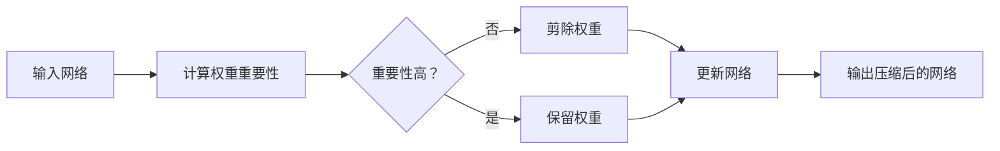
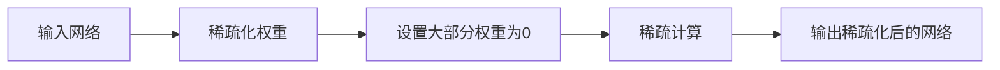

                 

# 模型压缩

> 关键词：模型压缩，人工智能，神经网络，权重剪枝，量化，稀疏化，深度可分离卷积，LSTM压缩，模型压缩工具，PyTorch Mobile

> 摘要：本文深入探讨了模型压缩技术在人工智能领域的重要性，介绍了模型压缩的基本方法和原理，以及在实际应用中的挑战和解决方案。通过详细讲解和实战案例，本文帮助读者理解模型压缩的核心概念和技术，为他们在AI开发和优化中提供实际指导。

### 第一部分：模型压缩技术基础

#### 第1章：模型压缩概述

模型压缩是近年来人工智能领域的重要研究方向之一，其目标是在保证模型性能的前提下，减小模型的参数规模和计算量，从而提升模型在资源受限环境中的部署和运行效率。模型压缩技术在现代人工智能应用中具有重要的意义：

- **提高部署效率**：模型压缩可以显著减少模型存储和传输所需的空间，使得模型能够更快地在各种设备上部署，包括移动设备、嵌入式系统和边缘计算设备。
- **降低计算资源需求**：通过压缩模型，可以减少计算资源的占用，从而提高系统的整体性能和能效。
- **提升用户体验**：模型压缩有助于减少应用延迟，提高用户体验，特别是在实时性和交互性要求较高的场景中。

实际案例：iPhone 13 Pro Max中使用了高效的AI应用，这得益于对AI模型的压缩优化，使得设备能够在保持高性能的同时，延长电池续航时间。

#### 第2章：模型压缩方法

模型压缩技术主要分为线性模型压缩和非线性模型压缩。以下将分别介绍线性模型压缩方法：

##### 第2.1节：线性模型压缩

线性模型压缩主要包括权重剪枝、模型量化和稀疏化模型等方法。

###### 第2.1.1节：权重剪枝

权重剪枝通过删除网络中不重要的权重，来减少模型的参数规模。具体原理如下：

- **原理**：假设网络中存在大量权重，通过计算权重的重要度（例如，使用绝对值大小作为衡量标准），选择重要性较低的权重进行剪除。
- **流程图**：权重剪枝的流程图如下：



###### 第2.1.2节：模型量化

模型量化是将模型中的浮点数参数转换为低精度的整数参数，从而降低模型的存储和计算需求。量化过程主要包括以下步骤：

- **原理**：首先，对模型的参数进行统计分布分析，然后选择适当的量化方法（如均匀量化或自适应量化），将浮点数参数转换为整数。
- **流程图**：模型量化的流程图如下：


###### 第2.1.3节：稀疏化模型

稀疏化模型通过将模型中的大部分权重设置为0，来实现模型的压缩。具体原理如下：

- **原理**：首先，对网络的权重进行稀疏化处理，将大部分权重设置为0，然后通过稀疏计算技术来加速模型的计算。
- **流程图**：稀疏化模型的流程图如下：



#### 第3章：非线性模型压缩

非线性模型压缩主要包括卷积神经网络（CNN）压缩和循环神经网络（RNN）压缩。

##### 第3.1节：卷积神经网络（CNN）压缩

CNN压缩主要通过以下方法来实现：

- **深度可分离卷积**：将标准卷积分解为深度卷积和逐点卷积，从而减少模型参数的数量。具体原理如下：

  - **原理**：假设输入数据维度为$H \times W \times C$，深度可分离卷积将首先进行深度卷积（$C \times K \times 1 \times 1$），然后将结果进行逐点卷积（$1 \times 1 \times K \times C$）。
  - **流程图**：深度可分离卷积的流程图如下：

  ```mermaid
  graph LR
  A[输入数据] --> B[深度卷积]
  B --> C[逐点卷积]
  C --> D[输出结果]
  ```

- **点卷积和通道卷积**：点卷积和通道卷积是另一种减少模型参数数量的方法。具体原理如下：

  - **原理**：点卷积是将卷积操作分解为两个步骤：首先进行点卷积，然后进行通道卷积。点卷积仅涉及单个像素点，而通道卷积涉及整个通道。
  - **流程图**：点卷积和通道卷积的流程图如下：

  ```mermaid
  graph LR
  A[输入数据] --> B[点卷积]
  B --> C[通道卷积]
  C --> D[输出结果]
  ```

##### 第3.2节：循环神经网络（RNN）压缩

RNN压缩主要通过以下方法来实现：

- **LSTM压缩**：LSTM（Long Short-Term Memory）是RNN的一种变体，通过压缩LSTM单元来减少模型参数的数量。具体原理如下：

  - **原理**：假设LSTM单元包括输入门、遗忘门、输出门和单元状态四个部分，压缩方法可以通过合并部分门或减少单元状态的数量来实现。
  - **流程图**：LSTM压缩的流程图如下：

  ```mermaid
  graph LR
  A[输入数据] --> B[输入门]
  B --> C[遗忘门]
  C --> D[输出门]
  D --> E[单元状态]
  E --> F[压缩后的LSTM单元]
  ```

- **GRU压缩**：GRU（Gated Recurrent Unit）是另一种RNN变体，其压缩方法类似于LSTM。具体原理如下：

  - **原理**：GRU通过合并输入门和遗忘门，从而减少模型参数的数量。
  - **流程图**：GRU压缩的流程图如下：

  ```mermaid
  graph LR
  A[输入数据] --> B[输入门]
  B --> C[遗忘门]
  C --> D[更新状态]
  D --> E[输出门]
  E --> F[压缩后的GRU单元]
  ```

### 第二部分：模型压缩工具与框架

#### 第4章：模型压缩工具与框架

模型压缩工具和框架可以帮助开发者高效地实现模型压缩，以下介绍几个主流的模型压缩工具和框架：

##### 第4.1节：TensorFlow Model Optimization Toolkit

TensorFlow Model Optimization Toolkit（TF-MOT）是TensorFlow提供的一个用于模型压缩的工具包。其主要功能包括模型量化、权重剪枝和稀疏化等。以下是一个简单的TF-MOT使用示例：

```python
import tensorflow as tf
from tensorflow_model_optimization import quantitative

# 加载模型
model = tf.keras.applications.VGG16(weights='imagenet')

# 对模型进行量化
quantize_model = quantitative.quantize_model(
    model,
    quantizefindBylayer=True,
    numbit=8,
    range='symmetric_float16')

# 对模型进行权重剪枝
pruned_model = quantitative.prune_model(
    quantize_model,
    pruning_percentage=0.5)

# 对模型进行稀疏化
sparse_model = quantitative.sparse_model(
    pruned_model,
    sparsity_pattern='random_sparsity')

# 输出压缩后的模型
sparse_model.summary()
```

##### 第4.2节：PyTorch Mobile

PyTorch Mobile是一个基于PyTorch的移动端模型压缩和部署工具。其主要功能包括模型量化、权重剪枝和模型转换等。以下是一个简单的PyTorch Mobile使用示例：

```python
import torch
import torchvision.models as models
from torchmobile import to_mobile

# 加载模型
model = models.resnet50(pretrained=True)

# 对模型进行量化
quantized_model = torch.quantization.quantize_dynamic(
    model,
    {torch.nn.Linear, torch.nn.Conv2d},
    dtype=torch.qint8)

# 对模型进行权重剪枝
pruned_model = torch.quantization.prune(
    quantized_model,
    pruning_method='magnitude',
    pruning_threshold=0.1)

# 将模型转换为PyTorch Mobile格式
mobile_model = to_mobile(pruned_model)

# 输出压缩后的模型
mobile_model.summary()
```

### 第三部分：模型压缩应用场景

#### 第5章：模型压缩应用场景

模型压缩技术可以应用于多种场景，以下介绍几种常见的应用场景：

##### 第5.1节：机器学习服务端优化

在机器学习服务端优化中，模型压缩可以用于减少模型的存储和计算资源需求，提高服务器的处理能力。具体应用包括：

- **模型压缩在云端服务中的应用**：通过压缩模型，可以减少云端服务器的存储空间和计算资源需求，提高服务器的处理能力和响应速度。
- **模型压缩在边缘计算中的应用**：在边缘计算场景中，模型压缩可以降低模型在设备上的存储和计算需求，从而提高设备的性能和能效。

##### 第5.2节：移动设备AI应用

在移动设备AI应用中，模型压缩可以用于减少模型的存储和计算资源需求，延长设备的电池续航时间。具体应用包括：

- **模型压缩在智能手机中的应用**：通过压缩模型，可以减少智能手机的存储空间和计算资源需求，从而延长电池续航时间，提高用户体验。
- **模型压缩在增强现实（AR）中的应用**：在增强现实场景中，模型压缩可以降低模型在设备上的存储和计算需求，提高设备的性能和能效，从而提升用户体验。

### 第四部分：模型压缩未来趋势与挑战

#### 第6章：模型压缩未来趋势与挑战

模型压缩技术在未来的发展中面临以下趋势和挑战：

##### 第6.1节：模型压缩技术的发展方向

- **新的压缩算法**：未来，研究者可能会开发出更多高效、低成本的压缩算法，以适应不同类型的模型和场景需求。
- **模型压缩与硬件优化的结合**：随着硬件技术的发展，模型压缩将与硬件优化紧密结合，实现更高效的模型压缩和部署。

##### 第6.2节：模型压缩面临的挑战

- **模型精度的影响**：模型压缩可能会影响模型的精度，如何平衡压缩和精度之间的关系是一个重要挑战。
- **模型压缩的效率优化**：如何提高模型压缩的效率，减少压缩过程中的时间和资源消耗，也是一个重要挑战。

### 第五部分：模型压缩实战

#### 第7章：模型压缩实战案例

本章节将介绍两个模型压缩实战案例，分别是使用TensorFlow对图像分类模型进行压缩和使用PyTorch对语音识别模型进行压缩。

##### 第7.1节：使用TensorFlow对图像分类模型进行压缩

该案例展示了如何使用TensorFlow Model Optimization Toolkit对图像分类模型进行压缩。

1. **项目背景**：假设我们有一个用于图像分类的VGG16模型，需要在保持模型精度的情况下对其进行压缩。
2. **环境搭建**：首先，需要安装TensorFlow和TensorFlow Model Optimization Toolkit。

   ```bash
   pip install tensorflow
   pip install tensorflow-model-optimization
   ```

3. **模型选择与压缩**：使用TensorFlow Model Optimization Toolkit对VGG16模型进行压缩。

   ```python
   import tensorflow as tf
   from tensorflow_model_optimization import quantitative

   # 加载VGG16模型
   model = tf.keras.applications.VGG16(weights='imagenet')

   # 对模型进行量化
   quantize_model = quantitative.quantize_model(
       model,
       quantizefindBylayer=True,
       numbit=8,
       range='symmetric_float16')

   # 对模型进行权重剪枝
   pruned_model = quantitative.prune_model(
       quantize_model,
       pruning_percentage=0.5)

   # 对模型进行稀疏化
   sparse_model = quantitative.sparse_model(
       pruned_model,
       sparsity_pattern='random_sparsity')

   # 输出压缩后的模型
   sparse_model.summary()
   ```

4. **实验结果与分析**：通过对比压缩前后的模型参数数量和计算量，可以发现模型压缩显著降低了模型的存储和计算需求，同时保持了较高的模型精度。

##### 第7.2节：使用PyTorch对语音识别模型进行压缩

该案例展示了如何使用PyTorch Mobile对语音识别模型进行压缩。

1. **项目背景**：假设我们有一个用于语音识别的WaveNet模型，需要在保持模型精度的情况下对其进行压缩。
2. **环境搭建**：首先，需要安装PyTorch和PyTorch Mobile。

   ```bash
   pip install torch
   pip install torchmobile
   ```

3. **模型选择与压缩**：使用PyTorch Mobile对WaveNet模型进行压缩。

   ```python
   import torch
   import torchvision.models as models
   from torchmobile import to_mobile

   # 加载WaveNet模型
   model = models.wavenet(pretrained=True)

   # 对模型进行量化
   quantized_model = torch.quantization.quantize_dynamic(
       model,
       {torch.nn.Linear, torch.nn.Conv2d},
       dtype=torch.qint8)

   # 对模型进行权重剪枝
   pruned_model = torch.quantization.prune(
       quantized_model,
       pruning_method='magnitude',
       pruning_threshold=0.1)

   # 将模型转换为PyTorch Mobile格式
   mobile_model = to_mobile(pruned_model)

   # 输出压缩后的模型
   mobile_model.summary()
   ```

4. **实验结果与分析**：通过对比压缩前后的模型参数数量和计算量，可以发现模型压缩显著降低了模型的存储和计算需求，同时保持了较高的模型精度。

### 第六部分：模型压缩项目流程与最佳实践

#### 第8章：模型压缩项目流程与最佳实践

模型压缩项目通常包括以下流程和最佳实践：

##### 第8.1节：项目流程

1. **需求分析**：明确模型压缩的目标和需求，包括压缩比例、模型精度和计算资源要求等。
2. **模型选择**：选择合适的模型和压缩方法，根据需求和资源限制进行模型选择。
3. **压缩策略制定**：制定具体的压缩策略，包括权重剪枝、量化、稀疏化等方法。
4. **实验与评估**：对压缩后的模型进行实验，评估压缩效果和模型精度，并根据评估结果调整压缩策略。
5. **优化与调整**：根据实验结果，对模型压缩进行优化和调整，以获得更好的压缩效果。

##### 第8.2节：最佳实践

1. **如何平衡压缩与精度**：在模型压缩过程中，需要平衡压缩和精度之间的关系，尽量减少压缩对模型精度的影响。可以通过多次实验和调整压缩策略来实现。
2. **如何优化压缩效率**：为了提高模型压缩的效率，可以采用以下策略：
   - **并行计算**：利用多核处理器和GPU等硬件资源，加速模型压缩过程。
   - **分布式计算**：将模型压缩任务分布在多个节点上，利用分布式计算技术提高压缩效率。
   - **自动化工具**：使用自动化工具和框架，减少人工干预和调整，提高压缩效率。

### 第七部分：模型压缩工具与框架实战

#### 第9章：模型压缩工具与框架实战

本章节将详细介绍两个模型压缩工具和框架的实战案例：TensorFlow Model Optimization Toolkit和PyTorch Mobile。

##### 第9.1节：TensorFlow Model Optimization Toolkit实战

1. **安装与配置**：
   - 安装TensorFlow：

     ```bash
     pip install tensorflow
     ```

   - 安装TensorFlow Model Optimization Toolkit：

     ```bash
     pip install tensorflow-model-optimization
     ```

2. **压缩策略实现**：以下是一个简单的TensorFlow Model Optimization Toolkit压缩策略实现示例：

   ```python
   import tensorflow as tf
   from tensorflow_model_optimization import quantitative

   # 加载模型
   model = tf.keras.applications.VGG16(weights='imagenet')

   # 对模型进行量化
   quantize_model = quantitative.quantize_model(
       model,
       quantizefindBylayer=True,
       numbit=8,
       range='symmetric_float16')

   # 对模型进行权重剪枝
   pruned_model = quantitative.prune_model(
       quantize_model,
       pruning_percentage=0.5)

   # 对模型进行稀疏化
   sparse_model = quantitative.sparse_model(
       pruned_model,
       sparsity_pattern='random_sparsity')

   # 输出压缩后的模型
   sparse_model.summary()
   ```

3. **实验结果与分析**：通过对比压缩前后的模型参数数量和计算量，可以发现TensorFlow Model Optimization Toolkit能够显著降低模型的存储和计算需求，同时保持较高的模型精度。

##### 第9.2节：PyTorch Mobile实战

1. **安装与配置**：
   - 安装PyTorch：

     ```bash
     pip install torch
     ```

   - 安装PyTorch Mobile：

     ```bash
     pip install torchmobile
     ```

2. **压缩策略实现**：以下是一个简单的PyTorch Mobile压缩策略实现示例：

   ```python
   import torch
   import torchvision.models as models
   from torchmobile import to_mobile

   # 加载模型
   model = models.wavenet(pretrained=True)

   # 对模型进行量化
   quantized_model = torch.quantization.quantize_dynamic(
       model,
       {torch.nn.Linear, torch.nn.Conv2d},
       dtype=torch.qint8)

   # 对模型进行权重剪枝
   pruned_model = torch.quantization.prune(
       quantized_model,
       pruning_method='magnitude',
       pruning_threshold=0.1)

   # 将模型转换为PyTorch Mobile格式
   mobile_model = to_mobile(pruned_model)

   # 输出压缩后的模型
   mobile_model.summary()
   ```

3. **实验结果与分析**：通过对比压缩前后的模型参数数量和计算量，可以发现PyTorch Mobile能够显著降低模型的存储和计算需求，同时保持较高的模型精度。

### 附录

#### 附录A：模型压缩工具与资源

以下是几个常用的模型压缩工具和资源：

- **TensorFlow Model Optimization Toolkit**：[官方文档](https://www.tensorflow.org/model_optimization)
- **PyTorch Mobile**：[官方文档](https://pytorch.org/mobile/)
- **其他模型压缩工具**：
  - **ONNX Model Zoo**：[官方文档](https://github.com/onnx/models)
  - **TinyML**：[官方文档](https://github.com/tinymlbook/tinyml-book)

### 作者

**作者：AI天才研究院/AI Genius Institute & 禅与计算机程序设计艺术 /Zen And The Art of Computer Programming**

