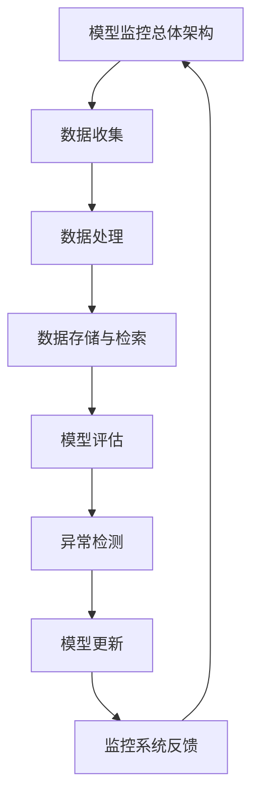
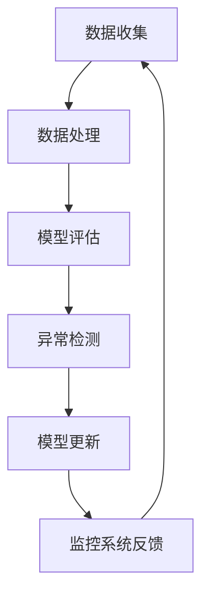

                 

## 《模型监控》

> 关键词：模型监控、模型质量评估、异常检测、持续学习、开源工具、企业应用

> 摘要：本文将深入探讨模型监控这一重要领域，分析其核心概念、架构、技术基础以及实际应用。我们将从基础知识入手，逐步深入，涵盖从模型监控的定义与分类，到数据收集、处理、存储与检索，再到模型质量评估、异常检测和持续学习等各个方面。此外，我们还将介绍模型监控工具与平台，并通过具体案例研究，展示模型监控在企业中的应用。最后，我们将展望模型监控领域的未来发展趋势，并提出可持续发展策略。

### 第一部分：模型监控基础知识

#### 1.1 模型监控概述

**模型监控的重要性**

在当今的数据驱动时代，机器学习模型已经成为许多企业的重要资产。然而，这些模型的性能、可靠性和稳定性是持续运维中的重要挑战。模型监控就是为了解决这些问题而存在的。它确保模型在实时环境中能够持续提供高质量的服务，提高业务决策的准确性和效率。

**模型监控的挑战与需求**

- **性能监控**：随着数据量和模型复杂度的增加，如何高效地监控模型性能成为一个挑战。
- **稳定性监控**：模型在部署后的表现可能受到数据分布、计算资源等多种因素的影响，稳定性监控至关重要。
- **可靠性监控**：确保模型在处理不同数据集时能够保持一致性和可靠性。
- **公平性监控**：避免模型中的偏见和歧视，确保对不同群体公平对待。
- **解释性监控**：在需要解释模型决策的场景中，如何确保模型的解释性是一个重要需求。

#### 1.2 模型监控核心概念与架构

**模型监控的定义与分类**

- **定义**：模型监控是指通过对模型运行时行为的数据进行分析，评估其性能、稳定性、可靠性和公平性，并采取相应措施进行优化和更新的过程。
- **分类**：根据监控的对象和目的，模型监控可以分为以下几类：
  - **性能监控**：关注模型的响应时间、准确率等指标。
  - **稳定性监控**：关注模型在不同数据分布和计算环境下的表现。
  - **可靠性监控**：关注模型在处理异常数据时的表现。
  - **公平性监控**：关注模型对不同群体的决策一致性。
  - **解释性监控**：关注模型决策过程的透明性和可解释性。

**模型监控的关键环节**

- **数据收集**：从生产环境中收集模型运行数据，包括输入数据、输出结果和模型参数。
- **数据处理**：对收集到的数据进行清洗、预处理和特征提取，以便后续分析。
- **数据存储与检索**：将处理后的数据存储在数据库中，并建立高效的检索机制，以便快速访问。
- **模型评估**：使用各种指标对模型进行评估，包括准确率、召回率、F1分数等。
- **异常检测**：检测模型运行中的异常行为，如异常数据、异常输出等。
- **模型更新**：根据监控结果对模型进行重新训练或调整参数，以提高模型性能。

**模型监控的整体架构**

- **监控系统**：负责收集、处理、存储和检索监控数据，并对模型进行评估和异常检测。
- **数据源**：包括生产环境中的服务器、数据库和API等，是模型监控数据的来源。
- **数据处理层**：对数据源收集的数据进行清洗、预处理和特征提取。
- **存储层**：用于存储处理后的监控数据，通常使用NoSQL数据库或大数据平台。
- **分析层**：对存储的数据进行分析，生成评估报告和异常警报。
- **反馈层**：根据分析结果，对模型进行更新和优化。

### 1.3 模型监控技术基础

**监控数据的收集**

- **数据源**：监控数据的来源可以是生产环境中的日志文件、API调用记录、数据库操作日志等。
- **数据格式**：数据通常以JSON、CSV、XML等格式存储。
- **采集方式**：使用代理、日志采集工具或API接口进行数据采集。

**监控数据的处理**

- **数据清洗**：去除重复、缺失和异常数据，保证数据的准确性。
- **数据预处理**：将原始数据转换为适合模型训练的数据格式，如归一化、标准化等。
- **特征提取**：从数据中提取有用的特征，用于模型训练和评估。

**监控数据的存储与检索**

- **存储方案**：使用关系型数据库（如MySQL、PostgreSQL）或NoSQL数据库（如MongoDB、Cassandra）进行数据存储。
- **检索机制**：建立索引和查询优化，提高数据检索效率。

### 1.4 模型质量评估

**模型性能评估指标**

- **准确率（Accuracy）**：模型正确预测的样本数占总样本数的比例。
- **召回率（Recall）**：模型正确预测的样本数占实际为正样本的样本数比例。
- **F1分数（F1 Score）**：准确率和召回率的调和平均数。
- **精度（Precision）**：模型正确预测的样本数占预测为正样本的样本数比例。

**模型公平性评估**

- **偏见检测**：检测模型是否对某些群体存在不公平偏见。
- **公平性指标**：如性别、种族、年龄等人口统计特征对模型决策的影响。

**模型解释性评估**

- **可解释性**：模型决策过程的透明性和可理解性。
- **解释性方法**：如LIME、SHAP等，用于解释模型对特定样本的预测结果。

### 1.5 模型异常检测

**异常检测的基本方法**

- **统计学方法**：基于统计分布和假设检验，如箱线图、直方图等。
- **机器学习方法**：基于聚类、分类和回归等算法，如K-means、SVM、XGBoost等。

**基于统计学的异常检测算法**

- **箱线图（Box Plot）**：通过计算四分位数和异常值来检测异常。
- **Z分数（Z-score）**：计算数据点与平均值的标准化距离，识别远离平均值的异常。

**基于机器学习的异常检测算法**

- **孤立森林（Isolation Forest）**：基于决策树的方法，通过隔离数据点来检测异常。
- **Autoencoder**：自编码器模型，通过学习数据的编码表示来检测异常。

### 1.6 模型持续学习与更新

**模型持续学习的概念与必要性**

- **概念**：模型持续学习是指在生产环境中不断更新和优化模型，以适应数据变化和业务需求。
- **必要性**：随着数据分布和环境变化，模型性能可能会下降，持续学习是保持模型高性能的关键。

**模型更新的方法与策略**

- **在线学习**：在模型部署的同时，实时更新模型参数。
- **迁移学习**：利用已有模型的知识，快速适应新数据集。
- **定期更新**：定期从生产环境中收集数据，重新训练模型。

**模型更新中的挑战与解决方案**

- **数据分布变化**：解决模型对新数据集的不适应问题。
- **计算资源限制**：优化模型更新过程，减少对生产环境的影响。

### 第二部分：模型监控实战

#### 2.1 模型监控工具与平台

**开源模型监控工具介绍**

- **Prometheus**：用于监控和告警的强大工具，支持多种数据源和查询语言。
- **Grafana**：提供丰富的可视化界面，与Prometheus等工具集成。
- **TensorBoard**：用于TensorFlow模型的监控和可视化。

**商业模型监控平台概述**

- **Honeycomb**：提供端到端的应用性能监控，支持大规模数据分析和实时告警。
- **Splunk**：强大的大数据平台，支持日志分析和监控。
- **Logz.io**：结合日志和监控，提供一站式的解决方案。

**模型监控工具的选择与应用**

- **选择标准**：根据业务需求、数据规模、预算等因素选择合适的工具。
- **应用场景**：在开发、测试和生产环境中，分别使用不同的监控工具和策略。

#### 2.2 案例研究：模型监控在企业中的应用

**某电商平台的模型监控实践**

- **环境搭建**：使用Python、Scikit-learn、Pandas和Matplotlib等工具。
- **数据收集**：收集用户行为数据，包括浏览、搜索和购买记录。
- **数据处理**：清洗和预处理数据，提取用户特征。
- **模型评估**：使用K折交叉验证评估模型性能，选择最优模型。
- **异常检测**：使用统计方法和机器学习算法检测异常用户行为。
- **模型更新**：根据监控结果，定期更新模型参数，提高预测准确性。

**某金融企业的模型监控案例**

- **环境搭建**：使用Python、Scikit-learn、Pandas和Matplotlib等工具。
- **数据收集**：收集金融交易数据，包括交易金额、交易时间和交易对手。
- **数据处理**：清洗和预处理数据，提取交易特征。
- **模型评估**：使用各种指标评估模型性能，确保模型在金融市场的稳定性。
- **异常检测**：使用统计方法和机器学习算法检测异常交易。
- **模型更新**：根据监控结果，定期更新模型参数，提高交易预测准确性。

**某医疗机构的模型监控实践**

- **环境搭建**：使用Python、Scikit-learn、Pandas和Matplotlib等工具。
- **数据收集**：收集医疗数据，包括患者病历、诊断结果和治疗方案。
- **数据处理**：清洗和预处理数据，提取医疗特征。
- **模型评估**：使用各种指标评估模型性能，确保模型在医疗领域的准确性。
- **异常检测**：使用统计方法和机器学习算法检测异常诊断结果。
- **模型更新**：根据监控结果，定期更新模型参数，提高诊断准确性。

### 第三部分：模型监控的未来发展

#### 2.3 模型监控领域的前沿技术

**自动化监控**

- **自动化数据收集**：利用自动化脚本和工具，自动收集生产环境中的监控数据。
- **自动化数据处理**：自动化清洗、预处理和特征提取过程，提高数据处理效率。
- **自动化模型评估和更新**：自动评估模型性能，并根据评估结果自动更新模型参数。

**大规模监控**

- **分布式架构**：使用分布式系统架构，支持大规模监控数据的高效处理和存储。
- **流处理技术**：使用流处理框架（如Apache Kafka、Apache Flink）进行实时数据处理和分析。
- **大规模数据处理**：使用大数据平台（如Apache Hadoop、Apache Spark）进行大规模数据存储和处理。

**联合监控与协同监控**

- **多模型联合监控**：同时监控多个模型，提高监控的全面性和准确性。
- **跨系统协同监控**：整合不同系统和平台的数据，进行跨系统的监控和分析。

#### 2.4 模型监控挑战与展望

**模型监控面临的挑战**

- **数据隐私和安全性**：监控数据可能包含敏感信息，需要确保数据的安全性和隐私性。
- **实时性要求**：在高速变化的生产环境中，如何快速响应用户需求，实现实时监控。
- **成本与效益**：如何平衡监控成本和效益，确保监控系统的可持续性。

**模型监控的未来趋势**

- **智能化**：利用人工智能技术，实现自动化监控和智能分析。
- **实时化**：提高监控系统的实时性，实现实时数据分析和告警。
- **可视化**：提供更加直观和易于理解的可视化界面，提高监控效果。

**模型监控的可持续发展策略**

- **标准化**：制定统一的模型监控标准和规范，提高监控系统的互操作性和兼容性。
- **开源生态**：鼓励开源工具和平台的发展，降低企业监控系统的成本和门槛。
- **持续改进**：通过不断优化和改进监控算法和技术，提高监控系统的性能和可靠性。

### 附录

#### 附录 A：常用模型监控指标详解

**模型性能指标**

- **准确率（Accuracy）**：模型正确预测的样本数占总样本数的比例。
- **召回率（Recall）**：模型正确预测的样本数占实际为正样本的样本数比例。
- **F1分数（F1 Score）**：准确率和召回率的调和平均数。
- **精度（Precision）**：模型正确预测的样本数占预测为正样本的样本数比例。

**模型公平性指标**

- **偏见指标（Bias）**：模型对特定群体产生的偏见程度。
- **公平性指标（Fairness）**：模型对不同群体的决策一致性。

**模型解释性指标**

- **可解释性（Explainability）**：模型决策过程的透明性和可理解性。
- **透明度（Transparency）**：模型参数和决策规则的公开性和可访问性。

#### 附录 B：开源模型监控资源汇总

**开源模型监控工具汇总**

- **Prometheus**：https://prometheus.io/
- **Grafana**：https://grafana.com/
- **TensorBoard**：https://www.tensorflow.org/tensorboard
- **Honeycomb**：https://honeycomb.io/
- **Splunk**：https://www.splunk.com/
- **Logz.io**：https://logz.io/

**模型监控相关论文与书籍推荐**

- **"Machine Learning Monitoring and Explanations: From Detection to Understanding"**：详细介绍了模型监控的理论和实践。
- **"Data Science for Business: Insights for Managers and Executives"**：提供了关于数据监控和数据分析的实用指南。
- **"Deep Learning on AWS"**：介绍了在AWS上构建大规模机器学习模型的最佳实践，包括监控和优化。

### Mermaid 流程图



### 核心算法原理讲解

#### 异常检测算法伪代码

```python
def anomaly_detection(data, threshold):
    anomalies = []
    for data_point in data:
        z_score = calculate_z_score(data_point)
        if z_score > threshold:
            anomalies.append(data_point)
    return anomalies
```

#### 数学模型和数学公式

$$
Z = \frac{X - \mu}{\sigma}
$$

其中，$Z$为Z分数，$X$为数据点，$\mu$为平均值，$\sigma$为标准差。

### 项目实战

#### 某电商平台的模型监控实践

#### 1. 环境搭建

- **开发环境**：Python 3.8
- **依赖库**：Scikit-learn、Pandas、Matplotlib

#### 2. 数据收集

- **数据源**：用户行为数据（浏览、搜索、购买记录）
- **数据格式**：CSV

#### 3. 数据处理

- **数据清洗**：去除重复和缺失值
- **特征提取**：提取用户特征（如用户年龄、购买频率等）

#### 4. 模型评估

- **评估指标**：准确率、召回率、F1分数
- **评估方法**：K折交叉验证

#### 5. 异常检测

- **方法**：孤立森林算法
- **阈值设置**：根据历史数据确定合理阈值

#### 6. 模型更新

- **更新策略**：定期从生产环境中收集数据，重新训练模型

#### 7. 代码解读与分析

- **代码实现**：数据收集、处理、评估和异常检测功能
- **代码注释**：详细解释每个步骤的实现细节

### Mermaid 流程图



### 作者

作者：AI天才研究院/AI Genius Institute & 禅与计算机程序设计艺术 /Zen And The Art of Computer Programming

### 总结

模型监控是确保机器学习模型在实时环境中持续提供高质量服务的关键环节。本文系统地介绍了模型监控的核心概念、技术基础、实际应用和未来发展趋势。通过深入分析和实战案例，我们展示了模型监控在各个领域的应用效果。随着人工智能技术的不断发展，模型监控将变得更加智能化、实时化和高效化，为企业和个人带来更多价值。让我们共同努力，推动模型监控领域的发展，为人工智能的可持续发展贡献力量。

