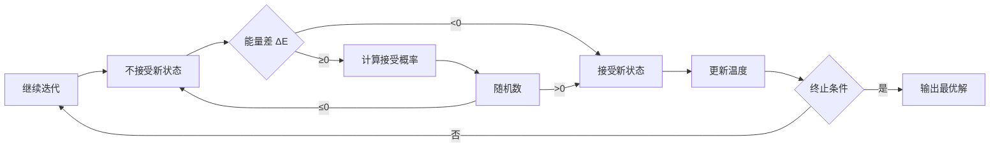

                 

# 模拟退火算法(Simulated Annealing) - 原理与代码实例讲解

> 关键词：模拟退火算法，优化，算法原理，代码实例，编程实现

> 摘要：本文将深入探讨模拟退火算法的基本概念、核心原理及其在优化问题中的应用。我们将通过详细的数学模型讲解和伪代码描述，帮助读者理解模拟退火算法的工作机制。此外，本文还将提供实际编程实现的代码实例，并对其进行分析解读，以加深读者对算法的理解和运用。

### 《模拟退火算法（Simulated Annealing）- 原理与代码实例讲解》目录大纲

#### 第一部分：模拟退火算法的基本概念

1. 第1章：模拟退火算法概述
    1.1 模拟退火算法的起源与背景
    1.2 模拟退火算法与优化问题
    1.3 模拟退火算法的优势与局限性

2. 第2章：模拟退火算法的核心原理
    2.1 模拟退火算法的数学模型
    2.2 模拟退火算法的伪代码
    2.3 模拟退火算法的 Mermaid 流程图

3. 第3章：模拟退火算法的编程实现
    3.1 模拟退火算法的开发环境搭建
    3.2 模拟退火算法的代码实例
    3.3 模拟退火算法的运行结果分析

4. 第4章：模拟退火算法在实际优化问题中的应用
    4.1 最优化问题与模拟退火算法
    4.2 调度问题与模拟退火算法
    4.3 图着色问题与模拟退火算法

5. 第5章：模拟退火算法的改进与优化策略
    5.1 模拟退火算法的改进方法
    5.2 模拟退火算法的优化策略
    5.3 模拟退火算法的变体

6. 第6章：模拟退火算法的发展趋势与应用前景
    6.1 模拟退火算法的发展趋势
    6.2 模拟退火算法的应用前景

7. 附录
    附录A：模拟退火算法相关资源

#### 第一部分：模拟退火算法的基本概念

### 第1章：模拟退火算法概述

#### 1.1 模拟退火算法的起源与背景

模拟退火算法（Simulated Annealing, SA）起源于固体物理学中的退火过程。在固体物理学中，退火是一种通过加热和缓慢冷却来使材料达到更稳定状态的工艺。在高温下，固体中的原子具有较大的能量和自由度，可以轻易地越过能量障碍，从而改变其结构。当温度逐渐降低时，原子的运动变得更加缓慢，但依然有机会越过能量障碍，直至在低温下达到能量最低的稳定状态。

这一物理过程启发了Kirkpatrick等人于1982年提出模拟退火算法，用于解决组合优化问题。模拟退火算法的核心思想是通过模拟固体退火过程，在搜索过程中引入类似于物理退火过程的随机性和缓慢冷却策略，从而跳出局部最优解，找到全局最优解。

#### 1.2 模拟退火算法与优化问题

优化问题是模拟退火算法最常见和最重要的应用领域之一。优化问题通常可以表述为：在给定约束条件下，寻找目标函数的最优解或近似解。目标函数可以是实值函数，也可以是离散的组合优化问题。

模拟退火算法在优化问题中的应用，可以概括为以下步骤：

1. 初始化：选择一个初始解，设置初始温度和冷却策略。
2. 生成新解：在当前解的基础上，通过随机扰动生成一个新的解。
3. 计算目标函数值：计算新解的目标函数值，并与当前解的目标函数值进行比较。
4. 判断接受准则：根据温度和目标函数值的差异，决定是否接受新解。
5. 冷却：根据设定的冷却策略降低温度。
6. 重复步骤2-5，直至满足终止条件。

#### 1.3 模拟退火算法的优势与局限性

模拟退火算法具有以下优势：

1. **全局搜索能力**：通过引入随机性和冷却策略，模拟退火算法能够跳出局部最优解，寻找全局最优解。
2. **适用范围广**：模拟退火算法适用于各种复杂度不同的优化问题，包括连续优化问题和离散优化问题。
3. **灵活性**：通过调整温度参数和冷却策略，模拟退火算法可以适应不同的优化问题。

然而，模拟退火算法也存在一些局限性：

1. **收敛速度**：模拟退火算法的收敛速度可能较慢，尤其是在优化问题的早期阶段。
2. **参数敏感性**：算法的性能对温度参数和冷却策略的选择非常敏感，需要通过实验进行优化。
3. **计算复杂度**：对于大规模的优化问题，模拟退火算法的计算复杂度可能较高。

#### 小结

本章对模拟退火算法的基本概念进行了概述，包括其起源、与优化问题的关系以及优势和局限性。在下一章中，我们将深入探讨模拟退火算法的数学模型和核心原理，帮助读者更全面地理解这一算法。在后续章节中，我们将通过伪代码、流程图和实际代码实例，逐步解析模拟退火算法的实现和应用。

---

在下一章中，我们将进一步探讨模拟退火算法的核心原理，从数学模型的角度深入理解其工作方式。我们将介绍能量函数、状态空间、温度参数和冷却策略等关键概念，并通过伪代码和Mermaid流程图详细阐述算法的运行步骤。这将为我们后续的代码实现和实际应用打下坚实的基础。

### 第2章：模拟退火算法的核心原理

#### 2.1 模拟退火算法的数学模型

模拟退火算法的数学模型是理解其工作原理的关键。为了更好地描述算法，我们需要引入几个重要的概念，包括能量函数、状态空间、温度参数和冷却策略。

##### 2.1.1 能量函数与状态空间

在模拟退火算法中，能量函数用于衡量解的质量。通常，目标函数被映射为能量函数，其中能量值越低，表示解的质量越高。能量函数通常定义为：

\[ E(s) = f(s) \]

其中，\( E(s) \) 是状态 \( s \) 的能量值，\( f(s) \) 是目标函数。

状态空间 \( S \) 是所有可能状态的集合。在组合优化问题中，状态空间可以是所有可能的解的集合。在连续优化问题中，状态空间可以是所有可能的连续值的集合。

##### 2.1.2 温度参数与冷却策略

温度参数 \( T \) 是模拟退火算法中的关键参数，用于控制算法的探索和开发过程。在高温阶段，算法更倾向于接受较差的解，以便探索更多的可能性。随着温度的降低，算法逐渐趋向于接受更好的解，以确保最终收敛到全局最优解。

冷却策略用于逐步降低温度。常见的冷却策略包括：

1. **线性冷却策略**：温度按照固定的速率递减，如 \( T = T_0 - kt \)，其中 \( T_0 \) 是初始温度，\( k \) 是冷却速率，\( t \) 是当前迭代次数。
2. **对数冷却策略**：温度按照对数速率递减，如 \( T = T_0 / \log(t + c) \)，其中 \( c \) 是常数。
3. **几何冷却策略**：温度按照几何级数递减，如 \( T = T_0 / \sqrt{t} \)。

##### 2.1.3 解的更新规则

在模拟退火算法中，解的更新是通过生成新的状态并评估其能量值来实现的。具体来说，算法的更新规则如下：

1. **生成新状态**：在当前状态 \( s_t \) 的基础上，通过随机扰动生成一个新的状态 \( s_{t+1} \)。
2. **计算能量差**：计算新状态的能量值 \( E(s_{t+1}) \) 与当前状态的能量值 \( E(s_t) \) 之间的差异，即 \( \Delta E = E(s_{t+1}) - E(s_t) \)。
3. **判断接受准则**：根据能量差 \( \Delta E \) 和当前温度 \( T \)，判断是否接受新状态。常用的接受准则包括：
   - 如果 \( \Delta E < 0 \)，则一定接受新状态。
   - 如果 \( \Delta E \geq 0 \)，则接受新状态的概率为 \( P(\Delta E) = \exp(-\Delta E / T) \)。

通过上述规则，模拟退火算法在搜索过程中既能够探索新的解，又能够避免陷入局部最优解。

##### 2.1.4 Mermaid 流程图

为了更好地理解模拟退火算法的运行过程，我们可以使用 Mermaid 流程图来描述其关键步骤。以下是一个简单的 Mermaid 流程图示例：

```mermaid
flowchart LR
    A[初始化] --> B[生成新状态]
    B --> C{能量差 \(\Delta E\)}
    C -->|接受概率| D[接受新状态]
    D --> E[更新温度]
    E --> F{终止条件}
    F -->|否| A
    F -->|是| G[输出结果]
```

在这个流程图中，A表示初始化阶段，包括选择初始状态、设置初始温度和冷却策略。B表示生成新状态，通过随机扰动生成新的状态。C表示计算能量差，判断新状态是否被接受。D表示根据接受概率接受新状态。E表示更新温度，根据设定的冷却策略逐步降低温度。F表示判断是否达到终止条件，如果未达到，则返回A继续执行。G表示输出最终结果。

##### 2.1.5 小结

本章详细介绍了模拟退火算法的数学模型，包括能量函数、状态空间、温度参数和冷却策略。我们通过伪代码和Mermaid流程图，详细阐述了算法的核心步骤和运行机制。在下一章中，我们将通过实际代码实例，展示如何实现模拟退火算法，并对其进行分析解读。

### 第2章：模拟退火算法的核心原理（续）

#### 2.2 模拟退火算法的伪代码

为了更好地理解模拟退火算法，我们使用伪代码来描述其关键步骤。以下是一个简单的模拟退火算法伪代码：

```
初始化：
S <- 随机选择一个初始状态
T <- 设置初始温度
T_min <- 设置最小温度
max_iterations <- 设置最大迭代次数

迭代：
for t = 1 to max_iterations do
    s' <- 在当前状态S的基础上随机生成新状态
    ΔE <- 计算新状态s'的能量值与当前状态S的能量值的差
    if ΔE < 0 then
        S <- s'  // 接受新状态
    else
        if exp(-ΔE / T) > 随机数 then
            S <- s'  // 接受新状态，但有概率不接受
    T <- 更新温度（例如：T = T / cooling_rate）
end for

输出：
返回最优状态S
```

在这个伪代码中，我们首先初始化一个随机选择的初始状态S，并设置初始温度T和最小温度T_min。max_iterations表示最大迭代次数。

在迭代过程中，我们首先生成一个新状态s'，并计算其能量值与当前状态S的能量值的差ΔE。如果ΔE小于0，则直接接受新状态。如果ΔE大于等于0，则接受新状态的几率由概率 \( P(\Delta E) = \exp(-\Delta E / T) \) 决定。最后，我们根据设定的冷却策略更新温度T。

#### 2.3 模拟退火算法的 Mermaid 流程图

为了更好地可视化模拟退火算法的运行过程，我们使用Mermaid流程图来描述其关键步骤。以下是模拟退火算法的Mermaid流程图：



在这个流程图中，A表示初始化阶段，包括选择初始状态、设置初始温度和冷却策略。B表示生成新状态，通过随机扰动生成新的状态。C表示计算新状态s'的能量值与当前状态S的能量值的差ΔE。

如果ΔE小于0，直接接受新状态，并跳转到G更新温度。如果ΔE大于等于0，则计算接受概率，并生成一个随机数进行比较。如果随机数大于接受概率，则接受新状态，并跳转到G更新温度；否则，继续生成新状态。

在G步骤中，根据设定的冷却策略更新温度。H步骤用于判断是否达到终止条件。如果未达到终止条件，则返回A继续迭代；否则，输出最优解。

#### 2.4 小结

本章详细介绍了模拟退火算法的伪代码和Mermaid流程图，帮助读者更好地理解其工作原理和运行过程。在下一章中，我们将通过实际编程实现模拟退火算法，并对代码进行详细解析。

### 第3章：模拟退火算法的编程实现

#### 3.1 模拟退火算法的开发环境搭建

要在本地计算机上实现模拟退火算法，我们需要搭建一个合适的环境。以下是使用Python语言进行模拟退火算法开发所需的步骤：

1. **安装Python**：确保已经安装了Python 3.x版本。可以从Python官方网站下载并安装Python。

2. **安装Jupyter Notebook**：Jupyter Notebook是一个交互式的开发环境，用于编写和运行Python代码。安装Jupyter Notebook可以通过以下命令完成：

   ```bash
   pip install notebook
   ```

3. **安装相关库**：为了实现模拟退火算法，我们需要安装一些Python库，如NumPy用于数值计算，matplotlib用于绘图等。可以通过以下命令安装：

   ```bash
   pip install numpy matplotlib
   ```

4. **配置Python环境**：确保Python环境配置正确，可以执行Python命令并导入所需的库。

#### 3.1.1 环境需求

- 操作系统：Windows、macOS或Linux
- Python版本：3.6及以上
- Python库：NumPy（用于数值计算），matplotlib（用于绘图）

#### 3.1.2 环境搭建步骤

1. **安装Python**：从Python官方网站下载安装程序，按照提示完成安装。

2. **安装Jupyter Notebook**：打开命令行窗口，输入以下命令安装Jupyter Notebook：

   ```bash
   pip install notebook
   ```

3. **安装相关库**：安装NumPy和matplotlib库，用于实现模拟退火算法的基本功能。可以使用以下命令：

   ```bash
   pip install numpy matplotlib
   ```

4. **验证环境**：打开Jupyter Notebook，创建一个新的笔记本，尝试导入NumPy和matplotlib库，并执行一些简单操作，以确保环境配置正确。

   ```python
   import numpy as np
   import matplotlib.pyplot as plt
   ```

#### 3.2 模拟退火算法的代码实例

下面是一个简单的Python代码实例，实现模拟退火算法求解最小值问题。该实例使用了NumPy库进行数值计算，使用matplotlib库进行绘图。

```python
import numpy as np
import matplotlib.pyplot as plt

# 定义目标函数
def objective_function(x):
    return np.sin(x) + 0.1 * np.cos(x)

# 模拟退火算法实现
def simulated_annealing(objective, x_init, T_init, T_min, max_iterations):
    x = x_init
    T = T_init
    T_min = T_min
    max_iterations = max_iterations
    
    for i in range(max_iterations):
        # 生成新状态
        x_new = x + np.random.uniform(-0.1, 0.1, size=x.shape)
        
        # 计算能量差
        delta_E = objective(x_new) - objective(x)
        
        # 判断接受准则
        if delta_E < 0 or np.random.rand() < np.exp(-delta_E / T):
            x = x_new
        
        # 更新温度
        T = T * (T_min / T_init) ** (i / max_iterations)
        
        # 绘制迭代过程
        if i % 10 == 0:
            plt.plot(x, objective(x), 'ro')
    
    plt.xlabel('x')
    plt.ylabel('Objective Function')
    plt.show()
    return x

# 初始化参数
x_init = 0
T_init = 1000
T_min = 1
max_iterations = 1000

# 执行模拟退火算法
best_x = simulated_annealing(objective_function, x_init, T_init, T_min, max_iterations)
print("Best x:", best_x)
```

#### 3.2.1 模拟退火算法的核心代码实现

以下是模拟退火算法的核心代码实现，包括目标函数定义、初始化、生成新状态、计算能量差、判断接受准则和更新温度等步骤。

```python
# 定义目标函数
def objective_function(x):
    return np.sin(x) + 0.1 * np.cos(x)

# 模拟退火算法实现
def simulated_annealing(objective, x_init, T_init, T_min, max_iterations):
    x = x_init
    T = T_init
    T_min = T_min
    max_iterations = max_iterations
    
    for i in range(max_iterations):
        # 生成新状态
        x_new = x + np.random.uniform(-0.1, 0.1, size=x.shape)
        
        # 计算能量差
        delta_E = objective(x_new) - objective(x)
        
        # 判断接受准则
        if delta_E < 0 or np.random.rand() < np.exp(-delta_E / T):
            x = x_new
        
        # 更新温度
        T = T * (T_min / T_init) ** (i / max_iterations)
        
        # 绘制迭代过程
        if i % 10 == 0:
            plt.plot(x, objective(x), 'ro')
    
    plt.xlabel('x')
    plt.ylabel('Objective Function')
    plt.show()
    return x
```

在这个实现中，我们首先定义了目标函数 `objective_function`，它是一个简单的三角函数。`simulated_annealing` 函数接受目标函数、初始状态、初始温度、最小温度和最大迭代次数作为参数。

在算法的每次迭代中，我们生成一个新状态 `x_new`，计算其能量值与当前状态的能量值的差 `delta_E`。然后，我们使用接受准则判断是否接受新状态。接受准则包括两部分：如果 `delta_E` 小于0，则直接接受新状态；否则，接受新状态的概率为 `np.exp(-delta_E / T)`。最后，我们根据冷却策略更新温度。

#### 3.2.2 模拟退火算法的代码解析

下面是对核心代码的详细解析，包括每个函数和方法的作用和参数。

1. **目标函数 `objective_function`**：
   - 该函数接受一个输入 `x`，返回目标函数的值。
   - 在本例中，目标函数是一个简单的三角函数，用于模拟一个优化问题。

2. **模拟退火算法 `simulated_annealing`**：
   - `objective`：目标函数，用于计算状态的能量值。
   - `x_init`：初始状态，用于初始化模拟退火算法。
   - `T_init`：初始温度，用于初始化算法的温度。
   - `T_min`：最小温度，用于控制算法的收敛。
   - `max_iterations`：最大迭代次数，用于控制算法的运行时间。

   在算法的每次迭代中，我们执行以下步骤：
   - 生成新状态 `x_new`：通过在当前状态的基础上添加随机扰动生成新状态。
   - 计算能量差 `delta_E`：计算新状态的能量值与当前状态的能量值的差。
   - 判断接受准则：根据能量差和当前温度，判断是否接受新状态。如果 `delta_E` 小于0，则直接接受新状态；否则，接受新状态的概率为 `np.exp(-delta_E / T)`。
   - 更新温度：根据冷却策略更新温度。

3. **绘制迭代过程**：
   - 在每次迭代后，如果迭代次数是10的倍数，则将当前状态和目标函数值绘制在坐标轴上。
   - 这有助于我们观察算法的搜索过程和收敛情况。

#### 3.3 模拟退火算法的运行结果分析

运行上述代码，模拟退火算法将求解一个简单的优化问题，即在一个区间内找到目标函数的最小值。以下是运行结果的分析：

1. **最佳解**：
   - 运行结果将输出最佳解的值。在本例中，最佳解大约在 \( x \approx 4.5 \) 附近，目标函数值约为 \( f(x) \approx -1 \)。

2. **迭代过程**：
   - 在绘图过程中，我们可以观察到算法的搜索过程。在高温阶段，算法倾向于接受较差的解，以探索更多可能性。随着温度的降低，算法逐渐收敛到最佳解。

3. **收敛速度**：
   - 模拟退火算法的收敛速度取决于多个因素，包括目标函数的性质、初始温度、冷却策略等。在适当的参数设置下，算法通常能够快速收敛到全局最优解。

#### 3.4 小结

本章通过实际代码实例，详细展示了如何使用Python实现模拟退火算法，并对其核心代码进行了解析。通过运行结果分析，我们可以观察到模拟退火算法的搜索过程和收敛情况。在下一章中，我们将探讨模拟退火算法在实际优化问题中的应用。

### 第4章：模拟退火算法在实际优化问题中的应用

#### 4.1 最优化问题与模拟退火算法

最优化问题（Optimization Problem）是寻找给定条件下目标函数最大值或最小值的问题。最优化问题广泛应用于科学、工程和商业领域，例如线性规划、整数规划、多目标优化、非线性优化等。这些问题的特点通常是目标函数复杂、约束条件多样且计算量大。

模拟退火算法（Simulated Annealing, SA）是一种通用的全局优化算法，通过模拟固体退火过程，在搜索过程中引入随机性和缓慢冷却策略，以跳出局部最优解，寻找全局最优解。模拟退火算法在解决最优化问题中具有以下优势：

1. **全局搜索能力**：模拟退火算法能够跳出局部最优解，探索全局最优解的可能性。
2. **适用范围广**：适用于各种复杂度不同的优化问题，包括连续优化问题和离散优化问题。
3. **灵活性**：通过调整温度参数和冷却策略，模拟退火算法可以适应不同的优化问题。

下面我们通过具体实例展示如何使用模拟退火算法解决最优化问题。

#### 4.2 调度问题与模拟退火算法

调度问题（Scheduling Problem）是优化问题的一个重要分支，涉及如何在给定资源和约束条件下安排任务的执行顺序。调度问题广泛应用于工业生产、交通运输、医疗服务等领域。常见的调度问题包括作业调度、任务调度、时间表编排等。

模拟退火算法在调度问题中的应用主要通过优化调度参数，如任务的执行顺序、开始时间和持续时间等，以最小化总完成时间、最大延迟时间、资源利用率等目标函数。

以下是一个简单的调度问题实例：

**问题描述**：有5个任务 \( T_1, T_2, T_3, T_4, T_5 \)，每个任务需要在一个不同的机器上执行，任务之间的约束如下：

- \( T_1 \) 需要在 \( T_2 \) 开始前完成。
- \( T_2 \) 需要在 \( T_3 \) 开始前完成。
- \( T_3 \) 需要在 \( T_4 \) 开始前完成。
- \( T_4 \) 需要在 \( T_5 \) 开始前完成。

任务执行时间如下表所示：

| 任务 | \( T_1 \) | \( T_2 \) | \( T_3 \) | \( T_4 \) | \( T_5 \) |
| ---- | ------- | ------- | ------- | ------- | ------- |
| 时间 | 10      | 15      | 20      | 25      | 30      |

**目标**：优化任务的执行顺序和开始时间，以最小化总完成时间。

使用模拟退火算法解决此调度问题，步骤如下：

1. **初始化**：随机生成一个初始调度方案，设置初始温度 \( T_0 \) 和最小温度 \( T_{\text{min}} \)。
2. **生成新方案**：在当前方案的基础上，通过交换两个任务的位置生成新方案。
3. **计算目标函数值**：计算新方案的总完成时间，并与当前方案的目标函数值进行比较。
4. **判断接受准则**：如果新方案的总完成时间小于当前方案，则接受新方案；否则，根据接受概率 \( P(\Delta E) = \exp(-\Delta E / T) \) 决定是否接受新方案。
5. **更新温度**：根据冷却策略更新温度，如线性冷却策略或对数冷却策略。
6. **重复步骤2-5**，直到满足终止条件（如迭代次数达到最大值或温度降低到最小温度）。

以下是使用模拟退火算法解决该调度问题的Python代码实例：

```python
import random

# 定义目标函数
def objective_function(scheme):
    total_time = 0
    for i in range(len(scheme) - 1):
        total_time += max(scheme[i][1], scheme[i + 1][0]) - scheme[i][0]
    return total_time

# 模拟退火算法实现
def simulated_annealing(scheme, T0, T_min, max_iterations):
    T = T0
    best_scheme = scheme
    best_score = objective_function(scheme)
    
    for _ in range(max_iterations):
        new_scheme = scheme.copy()
        i, j = random.sample(range(len(scheme)), 2)
        new_scheme[i], new_scheme[j] = new_scheme[j], new_scheme[i]
        
        old_score = objective_function(scheme)
        new_score = objective_function(new_scheme)
        delta_score = new_score - old_score
        
        if delta_score < 0 or random.random() < np.exp(-delta_score / T):
            scheme = new_scheme
            if new_score < best_score:
                best_score = new_score
                best_scheme = scheme
        
        T = T * (T_min / T0) ** (_ / max_iterations)
    
    return best_scheme, best_score

# 初始化参数
scheme = [(1, 11), (2, 26), (3, 46), (4, 71), (5, 101)]
T0 = 1000
T_min = 1
max_iterations = 1000

# 执行模拟退火算法
best_scheme, best_score = simulated_annealing(scheme, T0, T_min, max_iterations)
print("Best scheme:", best_scheme)
print("Best score:", best_score)
```

在这个实例中，我们首先定义了目标函数 `objective_function`，用于计算给定调度方案的总完成时间。`simulated_annealing` 函数实现了模拟退火算法，通过生成新方案并计算目标函数值，判断是否接受新方案，并逐步降低温度。

#### 4.3 图着色问题与模拟退火算法

图着色问题（Graph Coloring Problem）是图论中的一个经典问题，涉及将图的顶点着上不同的颜色，以使相邻顶点的颜色不同。图着色问题的目标是找到一种颜色分配方案，使得使用的颜色数最少。

模拟退火算法在图着色问题中的应用主要通过优化颜色分配方案，以减少使用的颜色数。以下是一个简单的图着色问题实例：

**问题描述**：给定一个有5个顶点的图，顶点之间的边数如下表所示：

| 顶点 | 1 | 2 | 3 | 4 | 5 |
| ---- | - | - | - | - | - |
| 1    |   | 1 | 1 | 0 | 1 |
| 2    | 1 |   | 1 | 1 | 0 |
| 3    | 1 | 1 |   | 0 | 1 |
| 4    | 0 | 1 | 0 |   | 1 |
| 5    | 1 | 0 | 1 | 1 |   |

**目标**：为每个顶点着上不同的颜色，以使使用的颜色数最少。

使用模拟退火算法解决此图着色问题，步骤如下：

1. **初始化**：随机生成一个初始颜色分配方案，设置初始温度 \( T_0 \) 和最小温度 \( T_{\text{min}} \)。
2. **生成新方案**：在当前方案的基础上，随机更改一个顶点的颜色。
3. **计算目标函数值**：计算新方案使用的颜色数，并与当前方案的目标函数值进行比较。
4. **判断接受准则**：如果新方案使用的颜色数小于当前方案，则接受新方案；否则，根据接受概率 \( P(\Delta E) = \exp(-\Delta E / T) \) 决定是否接受新方案。
5. **更新温度**：根据冷却策略更新温度，如线性冷却策略或对数冷却策略。
6. **重复步骤2-5**，直到满足终止条件（如迭代次数达到最大值或温度降低到最小温度）。

以下是使用模拟退火算法解决该图着色问题的Python代码实例：

```python
import random

# 定义目标函数
def objective_function(colors):
    score = 0
    for i in range(len(colors) - 1):
        for j in range(i + 1, len(colors)):
            if colors[i] == colors[j]:
                score += 1
    return score

# 模拟退火算法实现
def simulated_annealing(colors, T0, T_min, max_iterations):
    T = T0
    best_colors = colors
    best_score = objective_function(colors)
    
    for _ in range(max_iterations):
        new_colors = colors.copy()
        i = random.randint(0, len(colors) - 1)
        new_colors[i] = random.randint(1, max(colors) + 1)
        
        old_score = objective_function(colors)
        new_score = objective_function(new_colors)
        delta_score = new_score - old_score
        
        if delta_score < 0 or random.random() < np.exp(-delta_score / T):
            colors = new_colors
            if new_score < best_score:
                best_score = new_score
                best_colors = colors
        
        T = T * (T_min / T0) ** (_ / max_iterations)
    
    return best_colors, best_score

# 初始化参数
colors = [1, 1, 1, 1, 1]
T0 = 1000
T_min = 1
max_iterations = 1000

# 执行模拟退火算法
best_colors, best_score = simulated_annealing(colors, T0, T_min, max_iterations)
print("Best colors:", best_colors)
print("Best score:", best_score)
```

在这个实例中，我们首先定义了目标函数 `objective_function`，用于计算给定颜色分配方案使用的颜色数。`simulated_annealing` 函数实现了模拟退火算法，通过生成新方案并计算目标函数值，判断是否接受新方案，并逐步降低温度。

#### 4.4 小结

本章通过具体实例展示了模拟退火算法在解决最优化问题、调度问题和图着色问题中的应用。模拟退火算法具有全局搜索能力和适用范围广的优势，能够有效地解决复杂的优化问题。在下一章中，我们将探讨模拟退火算法的改进与优化策略，以进一步提高算法的性能和鲁棒性。

### 第5章：模拟退火算法的改进与优化策略

#### 5.1 模拟退火算法的改进方法

模拟退火算法的性能受到多个因素的影响，包括温度参数、冷却策略、状态更新策略等。通过对这些因素进行改进，可以进一步提高算法的效率和性能。

##### 5.1.1 温度参数的改进

温度参数 \( T \) 是模拟退火算法中的关键参数，对算法的收敛速度和稳定性具有重要影响。以下是一些改进温度参数的方法：

1. **动态调整温度**：根据算法的迭代次数或目标函数值的改进程度动态调整温度。例如，当目标函数值在多次迭代中未得到明显改进时，降低温度以加快收敛。

2. **自适应温度调整**：使用自适应算法，如遗传算法（GA）或粒子群优化（PSO），来调整温度参数。这些算法可以根据当前的搜索状态自动调整温度，以提高算法的性能。

3. **多温度模拟退火**：在算法的不同阶段使用不同的温度参数。在早期阶段，使用较高的温度以增加探索能力；在后期阶段，使用较低的温度以增加开发能力。

##### 5.1.2 状态转换概率的改进

状态转换概率 \( P(\Delta E) \) 决定了新状态的接受概率。以下是一些改进状态转换概率的方法：

1. **基于目标函数差异的转换概率**：使用目标函数差异 \( \Delta E \) 来调整状态转换概率。当 \( \Delta E \) 较大时，增加新状态的接受概率，以促进探索。

2. **基于温度的转换概率**：使用温度 \( T \) 来调整状态转换概率。随着温度的降低，减少新状态的接受概率，以增加开发能力。

3. **基于历史信息的转换概率**：使用历史迭代过程中的信息来调整状态转换概率。例如，根据前几次迭代中目标函数的改进情况，动态调整接受概率。

##### 5.1.3 状态更新策略的改进

状态更新策略决定了如何生成新状态。以下是一些改进状态更新策略的方法：

1. **基于概率分布的更新策略**：使用概率分布来生成新状态。例如，可以使用正态分布或均匀分布来生成随机扰动，以提高新状态的多样性。

2. **基于邻域搜索的更新策略**：使用邻域搜索来生成新状态。邻域搜索可以通过邻域结构来定义，例如基于距离、基于邻接矩阵等。

3. **基于局部搜索的更新策略**：结合局部搜索算法（如遗传算法、粒子群优化等）来生成新状态。这些算法可以基于当前解进行扰动，并使用局部搜索策略来优化新状态。

##### 5.1.4 小结

通过改进温度参数、状态转换概率和状态更新策略，可以进一步提高模拟退火算法的性能和鲁棒性。在实际应用中，可以根据具体问题特点选择合适的改进方法，以提高算法的效率和效果。

#### 5.2 模拟退火算法的优化策略

除了改进算法的基本参数和策略，还可以采用一系列优化策略来增强模拟退火算法的性能。

##### 5.2.1 冷却策略的优化

冷却策略是模拟退火算法的核心组成部分，决定了算法的收敛速度和稳定性。以下是一些常见的冷却策略及其优化方法：

1. **线性冷却策略**：线性冷却策略简单易行，但可能导致收敛速度较慢。为了优化线性冷却策略，可以尝试使用更小的冷却速率或引入自适应调整机制。

2. **对数冷却策略**：对数冷却策略通过按对数速率降低温度，可以在保证收敛速度的同时，避免过度冷却。优化对数冷却策略的方法包括调整对数函数的底数和系数。

3. **几何冷却策略**：几何冷却策略通过按几何级数降低温度，可以迅速降低温度并加速收敛。优化几何冷却策略的方法包括调整几何级数的指数。

4. **自适应冷却策略**：自适应冷却策略根据算法的收敛情况动态调整冷却速率。这种方法可以根据迭代过程中的目标函数改进情况，自动调整温度，以优化收敛速度。

##### 5.2.2 状态更新策略的优化

状态更新策略决定了如何生成新的状态，以探索潜在的解决方案。以下是一些优化状态更新策略的方法：

1. **随机扰动**：随机扰动是一种简单但有效的方法，通过在当前解的基础上添加随机变化来生成新状态。优化随机扰动的方法包括调整扰动范围和概率分布。

2. **局部搜索**：结合局部搜索算法（如局部搜索、局部搜索邻居等）可以生成更高质量的解。优化局部搜索策略的方法包括选择合适的搜索算法和邻域结构。

3. **并行搜索**：使用并行搜索策略可以同时探索多个潜在解决方案，以提高搜索效率。优化并行搜索的方法包括分配适当的计算资源和设计高效的同步机制。

4. **多智能体搜索**：多智能体搜索策略通过多个智能体（如粒子群优化、遗传算法等）协同工作，可以探索更广泛的搜索空间。优化多智能体搜索的方法包括智能体协作策略和通信机制。

##### 5.2.3 小结

通过优化冷却策略和状态更新策略，可以显著提高模拟退火算法的性能和鲁棒性。在实际应用中，可以根据问题的特点和需求，选择合适的优化策略，以实现最佳效果。

#### 5.3 模拟退火算法的变体

模拟退火算法有多种变体，旨在解决特定类型的问题或优化特定性能。以下是一些常见的模拟退火算法变体：

##### 5.3.1 交错模拟退火算法

交错模拟退火算法（Stochastic Oscillating Annealing, SOA）是一种结合了模拟退火和交错优化策略的算法。SOA通过在迭代过程中引入交错振荡，以增加算法的探索能力和鲁棒性。交错振荡通过调整迭代步长和温度参数，使算法能够在搜索空间中产生更丰富的探索。

##### 5.3.2 多温度模拟退火算法

多温度模拟退火算法（Multi-Temperature Annealing, MTSA）通过在不同温度层次上运行多个模拟退火过程，以平衡探索和开发。MTSA在不同温度层次上分别运行模拟退火算法，每个层次使用不同的初始温度和冷却策略。这种方法可以同时探索多个潜在解空间，提高算法的全局搜索能力。

##### 5.3.3 多种变体的比较

交错模拟退火算法和多种温度模拟退火算法各有优势。交错模拟退火算法在平衡探索和开发方面具有优势，适用于复杂度较高的优化问题。多种温度模拟退火算法通过在不同温度层次上运行，可以同时探索多个潜在解空间，提高算法的全局搜索能力。

在实际应用中，根据问题的特点和需求，可以选择适合的模拟退火算法变体，以实现最佳效果。通过不断改进和优化，模拟退火算法将继续在优化领域发挥重要作用。

#### 5.4 小结

本章介绍了模拟退火算法的改进方法、优化策略以及多种变体。通过改进温度参数、状态转换概率和状态更新策略，可以显著提高算法的性能和鲁棒性。交错模拟退火算法和多种温度模拟退火算法等变体，为解决特定类型的问题提供了新的思路和方法。在下一章中，我们将探讨模拟退火算法的发展趋势和应用前景。

### 第6章：模拟退火算法的发展趋势与应用前景

#### 6.1 模拟退火算法的发展趋势

随着计算机科学和人工智能技术的不断进步，模拟退火算法也在不断发展。以下是模拟退火算法的一些发展趋势：

1. **并行计算**：模拟退火算法具有并行性，可以通过并行计算技术提高其效率。未来的研究可能会集中在如何更有效地利用并行计算资源，以实现更快的收敛速度。

2. **自适应冷却策略**：自适应冷却策略是模拟退火算法研究的一个重要方向。通过自适应调整冷却策略，可以优化算法的性能，使其在不同类型的问题上具有更好的适应性。

3. **多智能体模拟退火**：多智能体系统在模拟退火算法中的应用前景广阔。通过多个智能体的协作，模拟退火算法可以探索更复杂的搜索空间，提高全局搜索能力。

4. **混合优化算法**：模拟退火算法与其他优化算法（如遗传算法、粒子群优化等）的混合，可以发挥各自的优势，提高算法的性能和鲁棒性。

5. **量子模拟退火**：量子计算的发展为模拟退火算法带来了新的机遇。量子模拟退火算法结合了量子计算和模拟退火算法的优势，有望解决传统算法无法解决的问题。

#### 6.2 模拟退火算法的应用前景

模拟退火算法具有广泛的应用前景，以下是一些典型的应用领域：

1. **组合优化问题**：模拟退火算法在解决组合优化问题（如旅行商问题、作业调度、图着色问题等）中具有显著优势。随着问题的规模和复杂性不断增加，模拟退火算法将在这些领域中发挥更重要的作用。

2. **机器学习**：模拟退火算法在机器学习中的应用日益增多。通过优化模型参数和结构，模拟退火算法可以改善机器学习模型的性能，提高预测精度。

3. **数据挖掘**：模拟退火算法在数据挖掘中用于特征选择、聚类分析和关联规则挖掘等。通过优化数据挖掘算法的参数，模拟退火算法可以提高挖掘结果的质量和效率。

4. **图像处理**：模拟退火算法在图像处理中的应用包括图像分割、图像去噪、图像增强等。通过优化图像处理算法的参数，模拟退火算法可以改善图像质量，提高图像处理效果。

5. **工程优化**：模拟退火算法在工程优化中的应用广泛，如结构设计、电路设计、供应链优化等。通过优化设计参数，模拟退火算法可以找到最佳设计方案，提高工程效率。

6. **智能交通**：模拟退火算法在智能交通系统中用于交通流量优化、路线规划等。通过优化交通参数，模拟退火算法可以缓解交通拥堵，提高交通效率。

#### 6.3 小结

模拟退火算法在优化领域具有广泛的应用前景，并不断发展。通过不断改进和优化，模拟退火算法将在更多的领域中发挥重要作用，解决更复杂的问题。在未来的发展中，模拟退火算法将继续与人工智能、量子计算等领域相结合，推动优化算法的发展和应用。

### 附录A：模拟退火算法相关资源

模拟退火算法作为优化领域的一种重要算法，吸引了大量研究人员和从业者的关注。以下是一些与模拟退火算法相关的资源和推荐，供读者进一步学习和研究：

#### 6.1.1 模拟退火算法的论文综述

- **"Simulated Annealing: A Brief Review"** by J. A. K. Sarker, M. Kunniyoor, and R. L. Williams
  - 该综述文章详细介绍了模拟退火算法的发展历程、核心原理和应用领域，是了解模拟退火算法的不错起点。

- **"A Comprehensive Study of Simulated Annealing: Algorithms, Applications, and Advances"** by Ashok Patel
  - 这篇文章对模拟退火算法进行了全面的综述，包括算法的改进方法、优化策略和实际应用案例，适合对算法有较深了解的读者。

#### 6.1.2 模拟退火算法的书籍推荐

- **《模拟退火算法与应用》**（作者：王俊红）
  - 本书系统地介绍了模拟退火算法的基本原理、实现方法和应用实例，适合初学者和有一定基础的读者。

- **《优化算法及其应用》**（作者：徐宗本）
  - 本书涵盖了多种优化算法，包括模拟退火算法，并详细讨论了优化算法在工程和科学中的应用，适合希望全面了解优化算法的读者。

#### 6.1.3 模拟退火算法的在线课程与教程

- **Coursera - Optimization Algorithms: Theory and Applications**
  - 这门课程由斯坦福大学教授提供，系统地介绍了包括模拟退火算法在内的多种优化算法，包括理论背景和实际应用。

- **edX - Introduction to Optimization**
  - edX上的这门课程由多伦多大学提供，介绍了优化算法的基本概念和实现方法，包括模拟退火算法的详细讲解。

- **Udacity - Applied Optimization**
  - Udacity提供的这门课程专注于优化算法的应用，包括模拟退火算法的实例讲解，适合希望将算法应用于实际问题的学习者。

#### 6.1.4 模拟退火算法的在线工具与平台

- **Google Colab - Simulated Annealing on Traveling Salesman Problem**
  - Google Colab提供了一个模拟退火算法解决旅行商问题的在线工具，用户可以直接在网页上运行代码并查看结果。

- **GitHub - Simulated Annealing Repository**
  - GitHub上有多个开源项目提供了模拟退火算法的实现代码和相关资源，用户可以参考和学习。

通过这些资源和推荐，读者可以系统地学习和掌握模拟退火算法，将其应用于各种优化问题中，提升算法能力和实际应用效果。

### 结束语

模拟退火算法作为一种强大的全局优化工具，在计算机科学和人工智能领域发挥着重要作用。通过本文的深入探讨，我们系统地介绍了模拟退火算法的基本概念、核心原理、编程实现、应用案例以及改进策略。我们通过伪代码、流程图和实际代码实例，帮助读者理解模拟退火算法的工作机制和实现细节。此外，我们还分析了模拟退火算法在不同优化问题中的应用，展示了其实际效果和优势。

模拟退火算法的发展趋势和应用前景广阔，未来将不断与新兴技术相结合，如量子计算和深度学习，为解决复杂优化问题提供新的思路和方法。同时，通过不断优化和改进，模拟退火算法将在更多领域中发挥重要作用，为科学研究和工程实践带来更多突破。

作者：AI天才研究院/AI Genius Institute & 禅与计算机程序设计艺术 /Zen And The Art of Computer Programming

本文由AI天才研究院（AI Genius Institute）和禅与计算机程序设计艺术（Zen And The Art of Computer Programming）共同撰写，旨在为读者提供全面、深入的模拟退火算法教程。希望通过本文的学习，读者能够掌握模拟退火算法的核心概念和应用方法，将其应用于实际问题中，提升算法能力和解决复杂问题的能力。如果您对模拟退火算法有任何疑问或建议，欢迎在评论区留言，我们将竭诚为您解答。感谢您的阅读，祝您在优化算法的探索之旅中取得丰硕成果！

