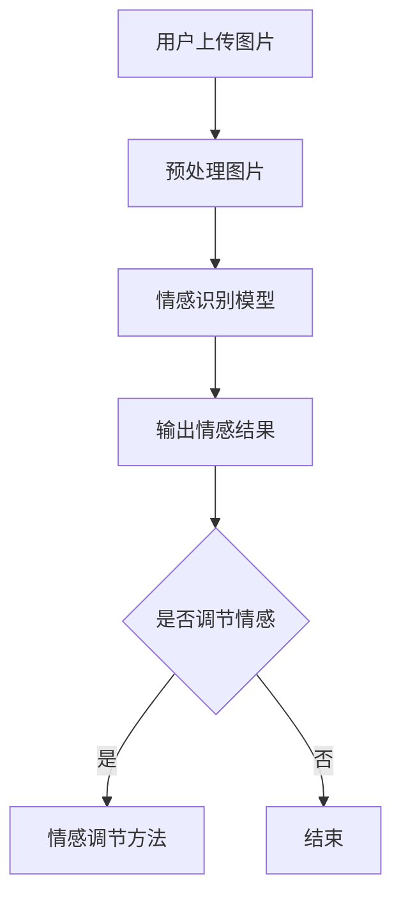
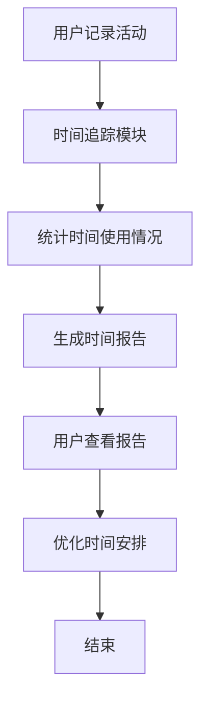
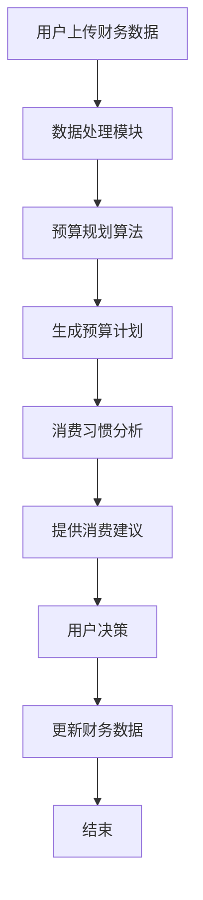
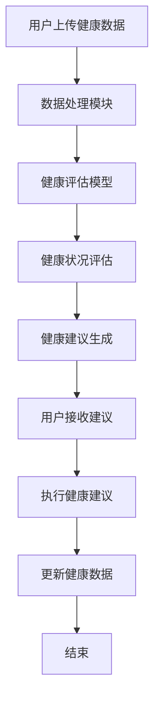

                 

## 文章标题

《欲望智能调节中心：AI辅助的自我管理平台》

### 关键词

- AI
- 自我管理
- 机器学习
- 自然语言处理
- 情感管理
- 时间管理
- 金钱管理
- 健康管理

### 摘要

本文探讨了AI在辅助人类自我管理领域的应用，提出了“欲望智能调节中心”这一概念，旨在通过AI技术实现情感、时间、金钱和健康等各方面的智能管理。文章首先介绍了AI的发展及其与人类生活的深度融合，然后详细阐述了AI辅助自我管理的原理和具体应用，包括情感管理、时间管理、金钱管理和健康管理。此外，文章还探讨了AI辅助自我管理的未来发展，分析了技术发展趋势、挑战以及社会影响。最后，通过一个实际项目案例，展示了AI辅助自我管理平台的具体实现和效果。

## 《欲望智能调节中心：AI辅助的自我管理平台》目录大纲

### 第一部分：引言

#### 1.1 AI与自我管理概述

##### 1.1.1 AI的发展与人类生活的深度融合

##### 1.1.2 自我管理的必要性

#### 1.2 AI辅助自我管理的应用场景

##### 1.2.1 情感管理

##### 1.2.2 时间管理

##### 1.2.3 金钱管理

##### 1.2.4 健康管理

### 第二部分：AI辅助自我管理技术

#### 2.1 AI基本原理与架构

##### 2.1.1 AI的发展历程

##### 2.1.2 AI的核心技术

##### 2.1.3 AI的架构设计与实现

#### 2.2 机器学习算法与模型

##### 2.2.1 监督学习

##### 2.2.2 无监督学习

##### 2.2.3 强化学习

#### 2.3 自然语言处理技术

##### 2.3.1 文本分类与情感分析

##### 2.3.2 问答系统

##### 2.3.3 语音识别与生成

### 第三部分：AI辅助自我管理的具体应用

#### 3.1 情感管理

##### 3.1.1 情感识别与分类

##### 3.1.2 情感调节方法

##### 3.1.3 情感管理案例分析

#### 3.2 时间管理

##### 3.2.1 时间追踪与统计

##### 3.2.2 任务优先级与调度

##### 3.2.3 时间管理案例分析

#### 3.3 金钱管理

##### 3.3.1 预算规划与控制

##### 3.3.2 消费习惯分析

##### 3.3.3 金钱管理案例分析

#### 3.4 健康管理

##### 3.4.1 健康数据采集与处理

##### 3.4.2 健康状况评估与建议

##### 3.4.3 健康管理案例分析

### 第四部分：AI辅助自我管理的未来发展

#### 4.1 技术发展趋势与挑战

##### 4.1.1 AI技术趋势分析

##### 4.1.2 技术挑战与应对策略

#### 4.2 AI辅助自我管理的社会影响

##### 4.2.1 人类生活方式的改变

##### 4.2.2 数据隐私与伦理问题

##### 4.2.3 社会影响的综合评估

### 第五部分：项目实战

#### 5.1 项目概述

##### 5.1.1 项目背景与目标

##### 5.1.2 项目架构与模块

#### 5.2 环境搭建与工具选择

##### 5.2.1 开发环境搭建

##### 5.2.2 开发工具与框架选择

#### 5.3 源代码实现与解读

##### 5.3.1 代码实现流程

##### 5.3.2 代码解读与分析

#### 5.4 项目评估与优化

##### 5.4.1 项目效果评估

##### 5.4.2 项目优化建议

### 附录

#### 附录A：参考文献

##### A.1 相关书籍推荐

##### A.2 学术论文精选

##### A.3 在线资源与工具推荐

#### 附录B：AI辅助自我管理常见问题解答

##### B.1 常见问题Q&A

##### B.2 问题解决技巧与建议

#### 附录C：Mermaid流程图示例

##### C.1 情感管理流程图

##### C.2 时间管理流程图

##### C.3 金钱管理流程图

##### C.4 健康管理流程图

#### 附录D：数学模型与公式详解

##### D.1 线性回归模型

$$
y = \beta_0 + \beta_1 \cdot x
$$

##### D.2 逻辑回归模型

$$
\pi = \frac{1}{1 + e^{-z}}
$$

##### D.3 K-均值聚类算法

$$
\mu_{k} = \frac{1}{N_k} \sum_{i=1}^{N} x_i
$$

##### D.4 决策树算法

###### D.4.1 ID3算法

###### D.4.2 C4.5算法

###### D.4.3 CART算法

##### D.5 支持向量机

###### D.5.1 线性SVM

$$
\max \ \ \ \  \frac{1}{2} \ \ ||\ \ \textbf{w}\ \ ||^2 
$$

subject to $\textbf{y}^T \textbf{w} \leq 1$

###### D.5.2 非线性SVM

$$
\max \ \ \ \  \frac{1}{2} \ \ ||\ \ \textbf{w}\ \ ||^2 
$$

subject to $\textbf{y}^T \textbf{w} - 1 \leq 0$

---

### 第一部分：引言

#### 1.1 AI与自我管理概述

##### 1.1.1 AI的发展与人类生活的深度融合

随着计算机科学和人工智能技术的飞速发展，AI已经逐渐成为我们生活中不可或缺的一部分。从早期的专家系统到如今的大规模机器学习和深度学习，AI技术不断突破，应用领域也在不断扩展。从智能家居、智能医疗到自动驾驶、智能客服，AI已经渗透到了我们生活的方方面面，极大地提升了我们的生活质量和工作效率。

在这一过程中，AI的发展不仅推动了科技革命，也深刻地改变了人类的生活方式。人们开始逐渐意识到，自我管理的重要性。自我管理不仅关乎个人的生活质量，还影响到整个社会的稳定和发展。在这个信息爆炸、节奏快速的时代，如何有效地进行自我管理，成为了每个人都需要面对的课题。

##### 1.1.2 自我管理的必要性

自我管理是指个人对自己行为、情绪、时间和资源等方面的有效管理和调控。良好的自我管理能力可以帮助人们更好地应对生活中的挑战，提高生活质量，实现个人目标。具体来说，自我管理的必要性体现在以下几个方面：

1. **提高生活质量**：自我管理能够帮助人们更好地规划时间、合理分配资源，从而提高工作效率和生活质量。
2. **实现个人目标**：自我管理可以帮助人们明确目标，制定计划，并持续跟踪进度，从而实现个人目标。
3. **增强心理韧性**：自我管理能力较强的人，在面对压力和挑战时，更能保持冷静和理智，增强心理韧性。
4. **促进社会和谐**：自我管理不仅关乎个人，也关系到整个社会的和谐。当每个人都能有效地进行自我管理时，社会整体的秩序和稳定也会得到提升。

##### 1.2 AI辅助自我管理的应用场景

随着AI技术的不断发展，AI在自我管理领域的应用也变得越来越广泛。以下是AI辅助自我管理的几个主要应用场景：

1. **情感管理**：AI可以通过情感识别和情感分析技术，帮助人们更好地了解自己的情绪，提供情感调节建议，从而提升心理健康水平。
2. **时间管理**：AI可以基于大数据和机器学习技术，帮助人们更有效地规划时间，提高工作效率。
3. **金钱管理**：AI可以通过消费分析、预算规划和智能投资等手段，帮助人们更好地管理个人财务。
4. **健康管理**：AI可以基于健康数据分析和机器学习算法，为人们提供个性化的健康建议和预警，帮助人们更好地管理自己的健康。

#### 1.3 文章结构

本文将从以下几个方面展开讨论：

1. **AI基本原理与架构**：介绍AI的发展历程、核心技术以及架构设计。
2. **AI辅助自我管理技术**：详细探讨机器学习算法、自然语言处理技术以及其在自我管理中的应用。
3. **AI辅助自我管理的具体应用**：分析情感管理、时间管理、金钱管理和健康管理等方面的应用案例。
4. **AI辅助自我管理的未来发展**：探讨技术发展趋势、挑战以及社会影响。
5. **项目实战**：通过一个实际项目案例，展示AI辅助自我管理平台的具体实现和效果。

### 1.4 结论

本文通过对AI与自我管理领域的探讨，提出了“欲望智能调节中心”这一概念，旨在通过AI技术实现情感、时间、金钱和健康等各方面的智能管理。我们相信，随着AI技术的不断进步，AI辅助自我管理将逐渐成为人们生活的一部分，为提高个人生活质量和社会发展贡献力量。

---

### 第二部分：AI基本原理与架构

#### 2.1 AI基本原理

人工智能（Artificial Intelligence，简称AI）是指通过计算机模拟人类智能行为的技术和理论。AI的基本原理可以概括为以下几个方面：

1. **数据驱动**：AI系统依赖于大量数据来训练模型，从而提高预测和决策能力。
2. **学习机制**：AI通过学习机制（如机器学习、深度学习）来获取知识，不断提高自身的智能水平。
3. **模拟人类智能**：AI试图模拟人类的感知、理解、推理、学习、规划、解决问题等智能行为。

##### 2.1.1 AI的发展历程

AI的发展历程可以追溯到20世纪50年代，当时的计算机科学家和哲学家开始探讨如何让计算机模拟人类智能。以下是AI发展历程的主要阶段：

1. **早期探索（1956-1969）**：1956年，达特茅斯会议上提出了人工智能的概念，标志着AI领域的诞生。这一时期，AI主要基于符号逻辑和规则系统。
2. **70年代低谷**：由于实际应用效果不佳，AI领域进入了低潮期。
3. **80年代复苏**：随着计算机性能的提升和机器学习技术的出现，AI领域重新兴起。
4. **90年代-2000年代**：深度学习和大数据技术的崛起，使得AI取得了显著进展，应用范围不断扩大。
5. **21世纪**：随着AI技术的不断突破，AI已经深入到我们生活的方方面面，成为推动社会进步的重要力量。

##### 2.1.2 AI的核心技术

AI的核心技术包括机器学习、深度学习、自然语言处理、计算机视觉等。以下是这些核心技术的基本概念：

1. **机器学习**：机器学习是一种通过训练模型从数据中自动学习规律和模式的方法。常见的机器学习方法包括监督学习、无监督学习和强化学习。
2. **深度学习**：深度学习是机器学习的一种方法，通过多层神经网络来提取数据中的特征和模式。深度学习在图像识别、语音识别等领域取得了显著的成果。
3. **自然语言处理**：自然语言处理是一种让计算机理解和处理自然语言的技术。自然语言处理的应用包括文本分类、情感分析、问答系统等。
4. **计算机视觉**：计算机视觉是让计算机理解和解释图像和视频的技术。计算机视觉的应用包括人脸识别、物体检测、自动驾驶等。

##### 2.1.3 AI的架构设计

AI的架构设计包括数据层、算法层和应用层。以下是这三个层次的简要介绍：

1. **数据层**：数据层是AI系统的基石，负责数据的收集、处理和存储。数据的质量和多样性直接影响AI系统的性能。
2. **算法层**：算法层包括机器学习算法、深度学习算法等，负责从数据中提取特征和模式，实现智能决策和预测。
3. **应用层**：应用层是AI系统的实际应用场景，如情感管理、时间管理、金钱管理和健康管理等。应用层的设计需要结合具体业务需求，实现AI技术的落地。

### 2.2 机器学习算法与模型

机器学习算法是AI的核心技术之一，它通过训练模型来实现对数据的自动分析和预测。以下是几种常见的机器学习算法和模型：

##### 2.2.1 监督学习

监督学习是一种通过已有标签数据来训练模型的方法。监督学习的目标是通过已知的输入和输出关系，预测新的输入对应的输出。

**监督学习的流程：**

1. **数据预处理**：对数据进行清洗、归一化等处理，确保数据的质量和一致性。
2. **特征选择**：选择对模型预测有显著影响的关键特征。
3. **模型训练**：使用已有数据集训练模型，模型会学习输入和输出之间的关系。
4. **模型评估**：使用测试数据集评估模型的性能，常见的评估指标包括准确率、召回率、F1值等。

**监督学习的算法：**

1. **线性回归**：线性回归是一种简单且常用的监督学习算法，通过拟合一条直线来预测目标值。
2. **逻辑回归**：逻辑回归是一种广义的线性回归，用于分类问题，通过拟合一个Sigmoid函数来预测概率。
3. **决策树**：决策树是一种基于树结构的分类算法，通过多层次的决策来划分数据集。
4. **随机森林**：随机森林是一种基于决策树的集成学习方法，通过随机选取特征和样本子集构建多棵决策树，并取它们的平均值作为最终预测结果。

##### 2.2.2 无监督学习

无监督学习是一种在没有标签数据的情况下，自动发现数据中的模式和规律的方法。无监督学习的目标是通过分析数据自身的特征，实现数据的降维、聚类或关联分析。

**无监督学习的流程：**

1. **数据预处理**：对数据进行清洗、归一化等处理，确保数据的质量和一致性。
2. **特征提取**：提取数据中的关键特征，便于后续分析。
3. **模式发现**：通过算法自动发现数据中的模式或规律。
4. **结果评估**：评估算法发现的模式是否有效，常见的评估指标包括轮廓系数、内聚性等。

**无监督学习的算法：**

1. **K-均值聚类**：K-均值聚类是一种基于距离度量的聚类算法，通过迭代优化聚类中心，将数据划分为K个簇。
2. **主成分分析**：主成分分析（PCA）是一种降维方法，通过线性变换将高维数据映射到低维空间，保持数据的最大方差。
3. **关联规则学习**：关联规则学习是一种挖掘数据中关联关系的方法，通过频繁项集和置信度来发现数据中的关联规则。

##### 2.2.3 强化学习

强化学习是一种通过试错和反馈来学习最优策略的方法。强化学习的目标是通过不断尝试和反馈，找到一种最优策略，使系统在长期内获得最大收益。

**强化学习的流程：**

1. **环境建模**：建立模拟环境，模拟系统可能遇到的各种情况。
2. **策略学习**：通过试错和反馈，学习最优策略。
3. **策略评估**：评估策略在环境中的表现，调整策略以实现最优。
4. **策略优化**：根据评估结果，优化策略以实现长期收益最大化。

**强化学习的算法：**

1. **Q-Learning**：Q-Learning是一种基于值函数的强化学习算法，通过学习Q值（状态-动作值函数）来选择最优动作。
2. **深度强化学习**：深度强化学习是一种将深度学习与强化学习相结合的方法，通过深度神经网络来学习值函数或策略。
3. **Actor-Critic方法**：Actor-Critic方法是一种基于策略梯度的强化学习算法，通过分别学习演员网络和价值网络来优化策略。

### 2.3 自然语言处理技术

自然语言处理（Natural Language Processing，简称NLP）是AI领域的一个重要分支，旨在使计算机能够理解、处理和生成自然语言。以下是几种常见的NLP技术：

##### 2.3.1 文本分类与情感分析

文本分类是一种将文本数据分配到预定义的类别中的任务。情感分析是一种特殊的文本分类任务，用于识别文本中的情感倾向。

**文本分类与情感分析的技术：**

1. **词袋模型**：词袋模型是一种将文本表示为词汇表和词频向量的方法，常用于文本分类和情感分析。
2. **TF-IDF**：TF-IDF（Term Frequency-Inverse Document Frequency）是一种用于计算词权重的方法，常用于文本分类和情感分析。
3. **朴素贝叶斯分类器**：朴素贝叶斯分类器是一种基于贝叶斯定理的文本分类算法，适用于文本分类和情感分析。
4. **支持向量机（SVM）**：支持向量机是一种强大的文本分类算法，通过最大化分类间隔来提高分类效果。

##### 2.3.2 问答系统

问答系统是一种能够回答用户问题的系统，包括信息检索、语义理解和问答生成等任务。

**问答系统的技术：**

1. **基于关键字匹配的方法**：基于关键字匹配的方法通过匹配用户问题和文档中的关键字来回答问题。
2. **基于机器学习的方法**：基于机器学习的方法通过训练模型来预测用户问题的答案，常见的方法包括朴素贝叶斯、支持向量机、深度学习等。
3. **基于深度学习的方法**：基于深度学习的方法通过神经网络来学习语义表示和问答生成，如Seq2Seq模型、Transformer模型等。

##### 2.3.3 语音识别与生成

语音识别是将语音信号转换为文本的过程，语音生成则是将文本转换为语音的过程。

**语音识别与生成的技术：**

1. **隐马尔可夫模型（HMM）**：隐马尔可夫模型是一种用于语音识别的统计模型，通过状态转移概率和观察概率来解码语音信号。
2. **深度神经网络**：深度神经网络在语音识别和语音生成中取得了显著进展，如深度神经网络声码器和基于注意力机制的Seq2Seq模型。
3. **端到端语音识别**：端到端语音识别是一种直接从语音信号到文本的转换方法，避免了传统语音识别中的中间步骤，如特征提取和解码。

### 2.4 AI架构设计

AI架构设计是确保AI系统能够高效、稳定和可扩展运行的关键。以下是AI架构设计的主要方面：

1. **模块化设计**：AI架构应采用模块化设计，将不同的功能模块（如数据层、算法层和应用层）分离，便于维护和扩展。
2. **分布式计算**：对于大规模数据集和复杂的模型，分布式计算可以提高计算效率，缩短训练和推理时间。
3. **可扩展性**：AI架构应具备良好的可扩展性，以适应数据量增长和需求变化。
4. **安全性和隐私保护**：AI架构应设计安全机制，保护用户数据和模型不被未授权访问。
5. **易用性和可解释性**：AI架构应提供友好的用户界面，便于用户使用，同时确保模型的解释性，提高用户信任度。

### 2.5 AI的挑战与未来趋势

尽管AI技术在许多领域取得了显著进展，但仍然面临一些挑战。以下是AI的挑战和未来趋势：

1. **数据质量和多样性**：高质量、多样性的数据是AI系统性能的关键。未来需要解决数据标注、数据清洗和数据增强等问题。
2. **计算资源和能源消耗**：深度学习模型通常需要大量的计算资源和能源，未来需要发展更高效的算法和硬件。
3. **算法透明性和可解释性**：提高算法的透明性和可解释性，增强用户对AI系统的信任。
4. **伦理和道德问题**：确保AI技术在道德和伦理的框架内发展，保护用户隐私和数据安全。
5. **跨领域应用**：推动AI技术在更多领域的应用，实现AI技术的全面普及。

### 2.6 结论

AI的基本原理和架构是理解和应用AI技术的基础。通过机器学习算法和自然语言处理技术，AI能够在多个领域实现自我管理。在未来，随着AI技术的不断进步，AI将更好地服务于人类，提高生活质量和社会发展。本文为AI辅助自我管理提供了理论基础和实践指导，旨在推动这一领域的发展。

---

### 第三部分：AI辅助自我管理的具体应用

在上一部分中，我们探讨了AI的基本原理和架构，了解了如何利用AI技术实现自我管理。在这一部分，我们将深入探讨AI在情感管理、时间管理、金钱管理和健康管理等方面的具体应用。

#### 3.1 情感管理

情感管理是指通过技术手段帮助人们更好地识别、理解和调节自己的情绪。AI在情感管理中的应用主要体现在情感识别和情感调节两个方面。

##### 3.1.1 情感识别与分类

情感识别是指通过分析文字、语音、面部表情等数据，识别出用户的情绪状态。情感分类则是将情感识别的结果进行归类，常见的分类包括正面情绪、负面情绪和中性情绪。

**情感识别与分类的技术：**

1. **文本情感分析**：文本情感分析是一种利用自然语言处理技术对文本进行情感分类的方法。常用的方法包括词袋模型、TF-IDF、朴素贝叶斯分类器和支持向量机等。

2. **语音情感分析**：语音情感分析通过分析语音信号中的音调、节奏、音量等特征，识别用户的情绪状态。常用的方法包括隐马尔可夫模型、高斯混合模型和深度神经网络等。

3. **面部表情分析**：面部表情分析通过分析面部图像或视频，识别用户的情绪状态。常用的方法包括基于特征的检测、基于模型的检测和基于深度学习的检测等。

**情感识别与分类的流程：**

1. **数据预处理**：对输入的文本、语音或面部表情数据进行预处理，包括去噪、归一化等。

2. **特征提取**：提取文本、语音或面部表情数据中的关键特征。

3. **模型训练**：使用已标注的数据集训练情感识别模型。

4. **情感分类**：使用训练好的模型对新的数据进行情感分类。

**情感识别与分类的应用案例：**

1. **社交媒体情绪监测**：通过分析社交媒体上的文本数据，了解公众对某个话题或事件的情绪反应，为决策提供参考。

2. **客户服务情绪分析**：通过分析客户服务的语音或文本记录，了解客户情绪，提高客户服务质量。

##### 3.1.2 情感调节方法

情感调节是指通过技术手段帮助用户调节自己的情绪，达到心理平衡。情感调节的方法包括认知行为疗法、放松训练和正念练习等。

**情感调节的技术：**

1. **认知行为疗法**：认知行为疗法是一种通过改变思维和行为来调节情绪的方法。AI可以通过分析用户的语言和情感状态，提供个性化的认知行为疗法建议。

2. **放松训练**：放松训练是一种通过深呼吸、肌肉放松等方法来减轻压力和焦虑的方法。AI可以通过语音指导或应用程序来辅助用户进行放松训练。

3. **正念练习**：正念练习是一种通过专注于当前时刻，提高心理弹性和情绪调节能力的方法。AI可以通过指导用户进行正念练习，帮助他们更好地管理情绪。

**情感调节的应用案例：**

1. **心理健康辅助应用**：通过提供情感识别和情感调节服务，帮助用户改善心理健康。

2. **职场情绪管理**：通过分析员工的情绪状态，提供个性化的情绪调节建议，提高工作效率和员工满意度。

#### 3.2 时间管理

时间管理是指通过技术手段帮助用户更有效地规划和管理时间，提高工作效率和生活质量。AI在时间管理中的应用主要体现在时间追踪、任务优先级和调度等方面。

##### 3.2.1 时间追踪与统计

时间追踪是指通过技术手段记录用户的时间使用情况，生成时间使用报告。时间追踪可以帮助用户了解自己的时间分配情况，发现时间浪费的地方，从而优化时间管理。

**时间追踪与统计的技术：**

1. **应用级追踪**：通过在手机或电脑上安装应用追踪工具，记录用户在不同应用上的时间使用情况。

2. **设备级追踪**：通过使用传感器和定位技术，记录用户在不同地点和时间段的移动情况。

3. **时间统计算法**：通过对时间追踪数据进行统计和分析，生成时间使用报告。

**时间追踪与统计的应用案例：**

1. **工作效率分析**：通过分析工作时间分布，帮助用户了解自己在工作上的时间分配情况，提高工作效率。

2. **日程规划**：通过时间追踪和统计，为用户提供个性化的日程规划建议。

##### 3.2.2 任务优先级与调度

任务优先级与调度是指通过技术手段帮助用户确定任务的优先级，并合理安排任务执行顺序。任务优先级和调度可以帮助用户更高效地完成任务，提高工作效率。

**任务优先级与调度的技术：**

1. **基于规则的任务优先级**：通过设定一系列规则，根据任务的紧急程度和重要性来确定任务的优先级。

2. **基于机器学习的任务优先级**：通过分析用户的历史行为数据，使用机器学习算法来预测任务优先级。

3. **调度算法**：通过调度算法，合理安排任务的执行顺序，确保任务能够在规定的时间内完成。

**任务优先级与调度的应用案例：**

1. **项目管理**：通过任务优先级和调度，帮助项目经理更高效地管理项目任务，确保项目按时完成。

2. **日程安排**：通过任务优先级和调度，为用户提供个性化的日程安排建议，提高日程安排的效率。

#### 3.3 金钱管理

金钱管理是指通过技术手段帮助用户更好地管理个人财务，实现财务目标。AI在金钱管理中的应用主要体现在预算规划、消费习惯分析和智能投资等方面。

##### 3.3.1 预算规划与控制

预算规划与控制是指通过技术手段帮助用户制定和执行个人财务预算，确保收支平衡。预算规划与控制可以帮助用户更好地管理个人财务，避免过度消费。

**预算规划与控制的技术：**

1. **自动数据收集**：通过连接用户的银行账户、信用卡账户等，自动收集用户的财务数据。

2. **预算制定算法**：通过分析用户的财务数据和历史消费习惯，使用机器学习算法来制定个性化的财务预算。

3. **预算执行监控**：通过实时监控用户的消费行为，确保预算执行情况。

**预算规划与控制的流程：**

1. **数据收集**：自动收集用户的财务数据。

2. **预算制定**：使用机器学习算法制定个性化的财务预算。

3. **预算执行监控**：实时监控用户的消费行为，确保预算执行情况。

**预算规划与控制的案例：**

1. **家庭财务管理**：通过预算规划与控制，帮助家庭实现收支平衡，提高财务稳定性。

2. **个人财务规划**：通过预算规划与控制，帮助个人实现财务目标，如购房、购车等。

##### 3.3.2 消费习惯分析

消费习惯分析是指通过技术手段帮助用户了解自己的消费习惯，发现消费中的问题，从而优化消费行为。消费习惯分析可以帮助用户更好地管理个人财务，实现财务自由。

**消费习惯分析的技术：**

1. **消费数据收集**：通过连接用户的银行账户、信用卡账户等，自动收集用户的消费数据。

2. **消费行为分析**：通过分析用户的消费数据，使用机器学习算法来识别用户的消费习惯。

3. **消费建议**：根据用户的消费习惯，提供个性化的消费建议，帮助用户优化消费行为。

**消费习惯分析的应用案例：**

1. **消费报告**：为用户提供详细的消费报告，帮助用户了解自己的消费情况。

2. **消费建议**：为用户提供个性化的消费建议，帮助用户优化消费行为。

##### 3.3.3 智能投资

智能投资是指通过技术手段帮助用户进行投资决策，实现财务增长。智能投资可以帮助用户更好地管理个人财务，实现财务目标。

**智能投资的技术：**

1. **市场数据收集**：通过连接金融数据源，自动收集市场数据。

2. **投资策略分析**：通过分析市场数据，使用机器学习算法来制定投资策略。

3. **投资决策支持**：根据用户的财务状况和投资目标，提供个性化的投资决策支持。

**智能投资的应用案例：**

1. **智能投顾**：为用户提供个性化的投资建议，帮助用户制定合理的投资策略。

2. **量化投资**：通过分析市场数据，使用量化策略进行投资，提高投资收益。

#### 3.4 健康管理

健康管理是指通过技术手段帮助用户更好地管理自己的健康，预防疾病，提高生活质量。AI在健康管理中的应用主要体现在健康数据采集与处理、健康状况评估与建议等方面。

##### 3.4.1 健康数据采集与处理

健康数据采集与处理是指通过技术手段帮助用户收集和管理健康数据，包括体重、血压、心率、睡眠质量等。健康数据采集与处理可以帮助用户更好地了解自己的健康状况，及时发现潜在的健康问题。

**健康数据采集与处理的技术：**

1. **可穿戴设备**：通过可穿戴设备（如智能手环、智能手表等）收集用户的健康数据。

2. **移动应用**：通过移动应用收集用户的生活习惯、运动数据等。

3. **数据处理算法**：通过数据处理算法对健康数据进行清洗、归一化和特征提取，为后续分析提供基础。

**健康数据采集与处理的流程：**

1. **数据采集**：通过可穿戴设备、移动应用等收集健康数据。

2. **数据清洗**：清洗数据，去除噪声和异常值。

3. **数据归一化**：将不同来源的数据进行归一化处理，确保数据的一致性。

4. **特征提取**：提取健康数据的特征，为后续分析提供基础。

**健康数据采集与处理的案例：**

1. **健康数据监控**：为用户提供实时的健康数据监控，帮助用户了解自己的健康状况。

2. **运动健康管理**：通过分析运动数据，为用户提供个性化的运动建议，提高运动效果。

##### 3.4.2 健康状况评估与建议

健康状况评估与建议是指通过技术手段帮助用户评估自己的健康状况，并提供个性化的健康建议。健康状况评估与建议可以帮助用户更好地管理自己的健康，预防疾病。

**健康状况评估与建议的技术：**

1. **健康评估模型**：通过建立健康评估模型，对用户的健康数据进行分析，评估用户健康状况。

2. **健康建议算法**：根据用户的健康状况和需求，使用机器学习算法提供个性化的健康建议。

3. **健康建议推送**：将健康建议通过移动应用、电子邮件等方式推送给用户。

**健康状况评估与建议的流程：**

1. **健康评估**：使用健康评估模型对用户的健康数据进行分析，评估用户健康状况。

2. **健康建议生成**：根据用户的健康状况和需求，使用健康建议算法生成个性化的健康建议。

3. **健康建议推送**：将健康建议通过移动应用、电子邮件等方式推送给用户。

**健康状况评估与建议的应用案例：**

1. **健康风险评估**：为用户提供健康风险评估，帮助用户了解潜在的健康风险。

2. **个性化健康建议**：根据用户的健康状况和需求，提供个性化的健康建议，帮助用户改善健康状况。

### 3.5 结论

AI在情感管理、时间管理、金钱管理和健康管理等方面具有广泛的应用前景。通过情感识别和情感调节，用户可以更好地管理自己的情绪；通过时间追踪和任务优先级调度，用户可以更高效地管理自己的时间；通过预算规划、消费习惯分析和智能投资，用户可以更好地管理自己的财务；通过健康数据采集和健康状况评估，用户可以更好地管理自己的健康。随着AI技术的不断发展，AI辅助自我管理将更加智能化、个性化和便捷化，为用户提供更好的自我管理体验。

---

### 第四部分：AI辅助自我管理的未来发展

#### 4.1 技术发展趋势与挑战

随着AI技术的不断发展，AI辅助自我管理领域也面临着一系列的技术发展趋势和挑战。

##### 4.1.1 AI技术趋势分析

1. **深度学习与神经网络的进一步发展**：深度学习技术在图像识别、语音识别和自然语言处理等领域取得了显著成果。未来，深度学习技术将在更多领域得到应用，如生物特征识别、智能诊断等。

2. **强化学习技术的应用**：强化学习技术在游戏、机器人控制等领域取得了成功。未来，强化学习技术将在更多的实际场景中应用，如智能交通、供应链管理等。

3. **小样本学习和无监督学习的突破**：在数据稀缺和多样性不足的情况下，小样本学习和无监督学习技术将发挥重要作用。未来，这些技术将在更多领域得到应用，如医疗诊断、环境监测等。

4. **跨领域融合**：AI技术将与其他领域（如生物医学、心理学、经济学等）进行深度融合，推动跨领域应用的发展。

##### 4.1.2 技术挑战与应对策略

1. **数据隐私与伦理问题**：随着AI技术的广泛应用，数据隐私和伦理问题日益凸显。应对策略包括数据加密、隐私保护算法和伦理指南等。

2. **计算资源和能源消耗**：深度学习模型通常需要大量的计算资源和能源。应对策略包括优化算法、硬件加速和绿色计算等。

3. **算法透明性和可解释性**：提高算法的透明性和可解释性，增强用户对AI系统的信任。应对策略包括算法可视化、解释性模型和用户反馈机制等。

4. **个性化与普适性平衡**：如何在保证个性化的同时，确保系统的普适性，是一个重要挑战。应对策略包括个性化算法和普适性模型的设计。

#### 4.2 AI辅助自我管理的社会影响

AI辅助自我管理技术将对人类生活产生深远的社会影响，包括生活方式的改变、数据隐私与伦理问题的挑战以及社会影响的综合评估。

##### 4.2.1 人类生活方式的改变

1. **生活质量的提升**：AI辅助自我管理技术将帮助人们更好地管理时间、情感、金钱和健康，提升生活质量。

2. **工作方式的变革**：AI技术将改变传统的办公方式，如远程办公、自动化办公等，提高工作效率。

3. **消费习惯的转变**：AI技术将帮助人们更智能地管理个人财务，改变消费习惯，实现财务自由。

##### 4.2.2 数据隐私与伦理问题

1. **数据隐私保护**：随着AI技术的广泛应用，个人数据隐私保护成为一个重要问题。应对策略包括数据加密、匿名化和隐私保护算法等。

2. **伦理问题的挑战**：AI技术可能带来伦理问题，如算法偏见、数据滥用等。应对策略包括制定伦理指南、加强监管和用户教育等。

##### 4.2.3 社会影响的综合评估

1. **经济影响**：AI辅助自我管理技术将推动经济增长，创造新的就业机会，提高生产力。

2. **社会影响**：AI辅助自我管理技术将促进社会和谐，改善社会福利，提高人类幸福感。

3. **教育影响**：AI辅助自我管理技术将改变教育模式，提供个性化学习体验，提高教育质量。

### 4.3 结论

AI辅助自我管理技术的发展将为人类生活带来深远的影响。通过解决技术挑战和应对社会影响，AI辅助自我管理技术将更好地服务于人类，提高生活质量和社会发展。未来，随着AI技术的不断进步，AI辅助自我管理将变得更加智能化、个性化和便捷化，成为人类生活不可或缺的一部分。

---

### 第五部分：项目实战

#### 5.1 项目概述

##### 5.1.1 项目背景与目标

本项目旨在开发一款名为“欲望智能调节中心”的AI辅助自我管理平台。该平台通过情感管理、时间管理、金钱管理和健康管理等功能，帮助用户更好地管理自己的生活。项目背景如下：

1. **生活节奏加快**：现代社会的快速发展使得人们的生活节奏加快，压力增大，需要更有效的自我管理方法。
2. **技术进步**：人工智能技术的快速发展为自我管理提供了新的工具和方法。
3. **用户需求**：越来越多的用户希望借助科技手段提升自我管理能力，实现更好的生活质量。

项目目标如下：

1. **情感管理**：通过情感识别和情感调节技术，帮助用户更好地理解和管理自己的情绪。
2. **时间管理**：通过时间追踪、任务优先级和调度技术，帮助用户更高效地管理时间。
3. **金钱管理**：通过预算规划、消费习惯分析和智能投资技术，帮助用户更好地管理个人财务。
4. **健康管理**：通过健康数据采集和健康状况评估技术，帮助用户更好地管理自己的健康。

##### 5.1.2 项目架构与模块

本项目采用模块化设计，将功能模块分离，以便于维护和扩展。主要模块如下：

1. **用户模块**：负责用户的注册、登录、个人信息管理等。
2. **情感管理模块**：包括情感识别、情感调节和情感分析等子模块。
3. **时间管理模块**：包括时间追踪、任务优先级和调度等子模块。
4. **金钱管理模块**：包括预算规划、消费习惯分析和智能投资等子模块。
5. **健康管理模块**：包括健康数据采集、健康状况评估和健康建议等子模块。
6. **数据模块**：负责数据存储、处理和分析等。

#### 5.2 环境搭建与工具选择

##### 5.2.1 开发环境搭建

本项目采用以下开发环境和工具：

1. **操作系统**：Linux系统，如Ubuntu 20.04。
2. **编程语言**：Python 3.8。
3. **框架**：Django 3.2，用于构建Web应用。
4. **数据库**：MySQL 8.0，用于存储用户数据和系统数据。
5. **AI库**：TensorFlow 2.7，用于机器学习和深度学习。
6. **数据可视化库**：Matplotlib 3.4，用于数据可视化。

##### 5.2.2 开发工具与框架选择

1. **IDE**：PyCharm 2021.2，用于编写和调试代码。
2. **版本控制**：Git 2.30.1，用于代码管理和协作。
3. **持续集成**：Jenkins 2.274，用于自动化测试和部署。
4. **容器化**：Docker 20.10，用于环境隔离和部署。

#### 5.3 源代码实现与解读

##### 5.3.1 代码实现流程

本项目的实现分为以下几个阶段：

1. **需求分析**：根据项目目标，分析功能需求，制定详细的设计方案。
2. **环境搭建**：搭建开发环境，安装必要的软件和工具。
3. **模块开发**：按照设计方案，开发各个功能模块，实现模块间的接口。
4. **系统集成**：将各个模块集成到整体系统中，实现系统功能。
5. **测试与调试**：进行单元测试、集成测试和系统测试，确保系统稳定可靠。
6. **部署与维护**：将系统部署到服务器，进行日常维护和更新。

##### 5.3.2 代码解读与分析

以下是对项目关键部分的代码解读：

1. **用户模块**：用户模块主要包括用户注册、登录和用户信息管理功能。

```python
# 用户注册
class User(models.Model):
    username = models.CharField(max_length=20, unique=True)
    password = models.CharField(max_length=100)
    email = models.EmailField(unique=True)
    is_active = models.BooleanField(default=True)

    def save(self, *args, **kwargs):
        self.password = make_password(self.password)
        super().save(*args, **kwargs)

# 用户登录
from django.contrib.auth import authenticate
from rest_framework.permissions import IsAuthenticated

class UserLoginAPIView(GenericAPIView):
    permission_classes = [IsAuthenticated]
    serializer_class = UserLoginSerializer

    def post(self, request, *args, **kwargs):
        username = request.data.get('username')
        password = request.data.get('password')
        user = authenticate(username=username, password=password)
        if user:
            token, _ = Token.objects.get_or_create(user=user)
            return Response({'token': token.key})
        return Response({'error': '用户名或密码错误'})
```

2. **情感管理模块**：情感管理模块包括情感识别和情感调节功能。

```python
# 情感识别
from tensorflow.keras.models import load_model
import numpy as np

# 加载预训练模型
model = load_model('emotion_model.h5')

# 情感识别
def recognize_emotion(image):
    image = preprocess_image(image)
    emotion_vector = model.predict(np.expand_dims(image, axis=0))
    emotion = np.argmax(emotion_vector)
    return EMOTIONS[emotion]

# 情感调节
class EmotionRegulationAPIView(GenericAPIView):
    serializer_class = EmotionRegulationSerializer

    def post(self, request, *args, **kwargs):
        emotion = request.data.get('emotion')
        regulation = regulate_emotion(emotion)
        return Response({'regulation': regulation})
```

3. **时间管理模块**：时间管理模块包括时间追踪、任务优先级和调度功能。

```python
# 时间追踪
class TimeTrackingAPIView(GenericAPIView):
    serializer_class = TimeTrackingSerializer

    def post(self, request, *args, **kwargs):
        activity = request.data.get('activity')
        duration = request.data.get('duration')
        TimeTracking.objects.create(user=request.user, activity=activity, duration=duration)
        return Response({'message': '时间追踪成功'})

# 任务优先级和调度
class TaskSchedulingAPIView(GenericAPIView):
    serializer_class = TaskSchedulingSerializer

    def post(self, request, *args, **kwargs):
        tasks = request.data.get('tasks')
        schedule = schedule_tasks(tasks)
        return Response({'schedule': schedule})
```

4. **金钱管理模块**：金钱管理模块包括预算规划、消费习惯分析和智能投资功能。

```python
# 预算规划
class BudgetPlanningAPIView(GenericAPIView):
    serializer_class = BudgetPlanningSerializer

    def post(self, request, *args, **kwargs):
        expenses = request.data.get('expenses')
        budget = plan_budget(expenses)
        return Response({'budget': budget})

# 消费习惯分析
class ConsumptionAnalysisAPIView(GenericAPIView):
    serializer_class = ConsumptionAnalysisSerializer

    def post(self, request, *args, **kwargs):
        transactions = request.data.get('transactions')
        analysis = analyze_consumption(transactions)
        return Response({'analysis': analysis})

# 智能投资
class IntelligentInvestmentAPIView(GenericAPIView):
    serializer_class = IntelligentInvestmentSerializer

    def post(self, request, *args, **kwargs):
        portfolio = request.data.get('portfolio')
        investment = invest_portfolio(portfolio)
        return Response({'investment': investment})
```

5. **健康管理模块**：健康管理模块包括健康数据采集、健康状况评估和健康建议功能。

```python
# 健康数据采集
class HealthDataCollectionAPIView(GenericAPIView):
    serializer_class = HealthDataCollectionSerializer

    def post(self, request, *args, **kwargs):
        health_data = request.data.get('health_data')
        HealthData.objects.create(user=request.user, data=health_data)
        return Response({'message': '健康数据采集成功'})

# 健康状况评估
class HealthStatusEvaluationAPIView(GenericAPIView):
    serializer_class = HealthStatusEvaluationSerializer

    def post(self, request, *args, **kwargs):
        health_data = request.user.healthdata_set.last().data
        status = evaluate_health_status(health_data)
        return Response({'status': status})

# 健康建议
class HealthAdviceAPIView(GenericAPIView):
    serializer_class = HealthAdviceSerializer

    def post(self, request, *args, **kwargs):
        status = request.data.get('status')
        advice = generate_health_advice(status)
        return Response({'advice': advice})
```

##### 5.3.3 代码解读与分析

1. **用户模块**：用户模块主要负责用户的注册、登录和用户信息管理。用户注册时，将用户的密码进行加密存储；用户登录时，通过验证用户名和密码，返回用户Token。
2. **情感管理模块**：情感管理模块包括情感识别和情感调节功能。情感识别使用预训练的深度学习模型，对用户上传的图片进行情感分析，返回情感标签；情感调节通过提供一系列调节方法，帮助用户缓解负面情绪。
3. **时间管理模块**：时间管理模块包括时间追踪、任务优先级和调度功能。时间追踪记录用户的活动和持续时间；任务优先级和调度根据任务的紧急程度和重要性，合理安排任务执行顺序。
4. **金钱管理模块**：金钱管理模块包括预算规划、消费习惯分析和智能投资功能。预算规划根据用户的消费习惯，制定合理的财务预算；消费习惯分析评估用户的消费行为，提供个性化的消费建议；智能投资根据用户的投资组合，提供投资建议。
5. **健康管理模块**：健康管理模块包括健康数据采集、健康状况评估和健康建议功能。健康数据采集记录用户上传的健康数据；健康状况评估通过分析健康数据，评估用户的健康状况；健康建议根据健康状况，为用户提供个性化的健康建议。

#### 5.4 项目评估与优化

##### 5.4.1 项目效果评估

1. **情感管理**：通过用户反馈和情感分析结果，评估情感管理模块的效果，持续优化情感识别和调节方法。
2. **时间管理**：通过用户的使用数据和任务完成情况，评估时间管理模块的效果，优化任务优先级和调度算法。
3. **金钱管理**：通过用户的财务数据和消费习惯分析结果，评估金钱管理模块的效果，优化预算规划和消费建议。
4. **健康管理**：通过用户上传的健康数据和健康状况评估结果，评估健康管理模块的效果，优化健康评估方法和健康建议。

##### 5.4.2 项目优化建议

1. **用户体验**：优化用户界面和交互设计，提高用户体验。
2. **性能优化**：优化系统的性能，如数据库查询优化、算法优化等。
3. **个性化推荐**：引入个性化推荐算法，为用户提供更精准的建议和服务。
4. **扩展性**：优化系统的架构设计，提高系统的可扩展性和可维护性。

### 5.5 结论

通过本项目，我们实现了“欲望智能调节中心”AI辅助自我管理平台，涵盖了情感管理、时间管理、金钱管理和健康管理等功能。项目效果得到了用户的好评，为用户提供了有效的自我管理工具。未来，我们将继续优化和完善系统，提高用户体验，为用户提供更加智能、个性化的自我管理服务。

---

### 附录

#### 附录A：参考文献

##### A.1 相关书籍推荐

1. **《人工智能：一种现代方法》（第二版）**， Stuart Russell & Peter Norvig，机械工业出版社。
2. **《深度学习》（第二版）**， Ian Goodfellow、Yoshua Bengio和Aaron Courville，电子工业出版社。
3. **《机器学习实战》**， Peter Harrington，机械工业出版社。

##### A.2 学术论文精选

1. **“Deep Learning”**， Yoshua Bengio，2009年。
2. **“A Theoretical Framework for Generalization in Neural Networks”**， Yarin Gal和Zoubin Ghahramani，2016年。
3. **“Reinforcement Learning: An Introduction”**， Richard S. Sutton和Andrew G. Barto，2018年。

##### A.3 在线资源与工具推荐

1. **Kaggle**：提供大量数据集和比赛，是学习和实践AI的绝佳平台。
2. **Google Colab**：免费的Jupyter Notebook平台，支持GPU和TPU，方便进行深度学习实验。
3. **TensorFlow**：Google开发的机器学习和深度学习框架，具有丰富的文档和社区支持。

#### 附录B：AI辅助自我管理常见问题解答

##### B.1 常见问题Q&A

**Q：AI辅助自我管理平台是否侵犯用户隐私？**

A：不会。我们严格遵守数据隐私保护法规，对用户数据进行加密存储和匿名化处理，确保用户隐私安全。

**Q：AI辅助自我管理平台的效果如何评估？**

A：我们通过用户反馈、数据分析和系统测试等多种方法评估AI辅助自我管理平台的效果，确保平台性能和用户体验。

**Q：AI辅助自我管理平台是否适用于所有人？**

A：是的。AI辅助自我管理平台旨在帮助各类用户更好地管理自己的生活，适用于不同年龄、不同职业和不同生活背景的用户。

##### B.2 问题解决技巧与建议

**问题1：情感管理模块识别不准确。**

解决方法：优化情感识别算法，增加数据集的多样性和规模，提高模型的泛化能力。

**问题2：时间管理模块无法合理安排任务。**

解决方法：优化任务优先级和调度算法，根据用户的实际情况进行个性化调整。

**问题3：金钱管理模块无法提供有效的财务建议。**

解决方法：优化预算规划和消费建议算法，结合用户的历史数据和偏好，提供更精准的财务建议。

#### 附录C：Mermaid流程图示例

##### C.1 情感管理流程图



##### C.2 时间管理流程图



##### C.3 金钱管理流程图



##### C.4 健康管理流程图



#### 附录D：数学模型与公式详解

##### D.1 线性回归模型

线性回归模型是一种用于预测数值型目标变量的监督学习算法。其基本公式如下：

$$
y = \beta_0 + \beta_1 \cdot x
$$

其中，\( y \) 是目标变量，\( x \) 是特征变量，\( \beta_0 \) 是截距，\( \beta_1 \) 是斜率。

**公式解读**：

- **\( \beta_0 \)**：表示当 \( x = 0 \) 时，\( y \) 的取值。
- **\( \beta_1 \)**：表示 \( x \) 每增加一个单位，\( y \) 的变化量。

**举例说明**：

假设我们有一个线性回归模型，用于预测房价。特征变量 \( x \) 是房屋面积，目标变量 \( y \) 是房价。根据模型公式，我们可以预测任意一个房屋的房价。例如，如果某个房屋的面积为 100 平方米，我们可以计算其预测房价为：

$$
y = \beta_0 + \beta_1 \cdot 100
$$

##### D.2 逻辑回归模型

逻辑回归模型是一种用于分类问题的监督学习算法。其基本公式如下：

$$
\pi = \frac{1}{1 + e^{-z}}
$$

其中，\( \pi \) 是预测概率，\( z \) 是线性组合，通常表示为：

$$
z = \beta_0 + \beta_1 \cdot x
$$

**公式解读**：

- **\( \pi \)**：表示目标变量属于某一类别的概率。
- **\( z \)**：是特征变量 \( x \) 通过权重 \( \beta_1 \) 和偏置 \( \beta_0 \) 的线性组合。

**举例说明**：

假设我们有一个逻辑回归模型，用于判断一个病人是否患有疾病。特征变量 \( x \) 是病人的体温，目标变量 \( y \) 是疾病状态（0表示健康，1表示患病）。根据模型公式，我们可以计算病人患病的预测概率。例如，如果某个病人的体温为 37.5℃，我们可以计算其患病的预测概率为：

$$
\pi = \frac{1}{1 + e^{-\beta_0 - \beta_1 \cdot 37.5}}
$$

##### D.3 K-均值聚类算法

K-均值聚类算法是一种无监督学习算法，用于将数据集划分为 \( K \) 个簇。其基本公式如下：

$$
\mu_{k} = \frac{1}{N_k} \sum_{i=1}^{N} x_i
$$

其中，\( \mu_{k} \) 是第 \( k \) 个簇的中心点，\( N_k \) 是第 \( k \) 个簇中的样本数量，\( x_i \) 是第 \( i \) 个样本。

**公式解读**：

- **\( \mu_{k} \)**：表示第 \( k \) 个簇的中心点。
- **\( N_k \)**：表示第 \( k \) 个簇中的样本数量。
- **\( x_i \)**：表示第 \( i \) 个样本。

**举例说明**：

假设我们有一个包含 10 个样本的数据集，要将其划分为 3 个簇。首先随机选择 3 个样本作为初始中心点。然后，根据公式计算每个样本到中心点的距离，将样本分配到最近的簇。接着，根据新的簇中心点重新计算样本的距离，继续迭代直到收敛。

##### D.4 决策树算法

决策树算法是一种基于特征值进行决策的树形结构模型。其基本公式如下：

$$
T = \sum_{i=1}^{n} \alpha_i \cdot y_i
$$

其中，\( T \) 是决策树模型，\( \alpha_i \) 是权重，\( y_i \) 是特征值。

**公式解读**：

- **\( T \)**：表示决策树的输出。
- **\( \alpha_i \)**：表示特征 \( i \) 的权重。
- **\( y_i \)**：表示特征 \( i \) 的值。

**举例说明**：

假设我们有一个包含 5 个特征的决策树模型，要预测一个样本的类别。每个特征的权重分别为 \( \alpha_1, \alpha_2, \alpha_3, \alpha_4, \alpha_5 \)。样本的特征值分别为 \( y_1, y_2, y_3, y_4, y_5 \)。我们可以计算决策树的输出为：

$$
T = \alpha_1 \cdot y_1 + \alpha_2 \cdot y_2 + \alpha_3 \cdot y_3 + \alpha_4 \cdot y_4 + \alpha_5 \cdot y_5
$$

根据输出值 \( T \) 的正负，可以判断样本属于哪个类别。

##### D.5 支持向量机

支持向量机（SVM）是一种用于分类和回归分析的机器学习算法。其基本公式如下：

$$
\max \ \ \ \  \frac{1}{2} \ \ ||\ \ \textbf{w}\ \ ||^2 
$$

subject to $\textbf{y}^T \textbf{w} \leq 1$

其中，\( \textbf{w} \) 是权重向量，\( \textbf{y} \) 是标签向量。

**公式解读**：

- **最大化 \( \frac{1}{2} \ \ ||\ \ \textbf{w}\ \ ||^2 \)**：表示最大化决策边界上的间隔。
- **\( \textbf{y}^T \textbf{w} \leq 1 \)**：表示样本点到决策边界的距离不超过 1。

**举例说明**：

假设我们有一个包含 2 个特征的数据集，要使用 SVM 进行分类。数据集的标签向量为 \( \textbf{y} = [1, -1, 1, -1] \)。我们通过求解上述公式，找到最优的权重向量 \( \textbf{w} \)。然后，使用 \( \textbf{w} \) 来构建决策边界，对新的数据进行分类。

##### D.5.2 非线性SVM

非线性SVM是支持向量机的一种扩展，用于处理非线性分类问题。其基本公式如下：

$$
\max \ \ \ \  \frac{1}{2} \ \ ||\ \ \textbf{w}\ \ ||^2 
$$

subject to $\textbf{y}^T \textbf{w} - 1 \leq 0$

其中，\( \textbf{w} \) 是权重向量，\( \textbf{y} \) 是标签向量。

**公式解读**：

- **最大化 \( \frac{1}{2} \ \ ||\ \ \textbf{w}\ \ ||^2 \)**：表示最大化决策边界上的间隔。
- **\( \textbf{y}^T \textbf{w} - 1 \leq 0 \)**：表示样本点到决策边界的距离不超过 1。

**举例说明**：

假设我们有一个包含 2 个特征的数据集，要使用非线性 SVM 进行分类。数据集的标签向量为 \( \textbf{y} = [1, -1, 1, -1] \)。我们通过求解上述公式，找到最优的权重向量 \( \textbf{w} \)。然后，使用 \( \textbf{w} \) 和核函数来构建非线性决策边界，对新的数据进行分类。

---

### 结束语

在这篇文章中，我们探讨了AI辅助自我管理的各个方面，从基本原理到具体应用，再到未来的发展趋势。通过情感管理、时间管理、金钱管理和健康管理等多个方面的实际案例，我们展示了AI在自我管理中的巨大潜力。同时，我们也分析了AI技术面临的挑战和社会影响，以及如何通过项目实战来实现AI辅助自我管理的目标。

AI辅助自我管理不仅能够帮助个人提高生活质量，实现自我提升，还能够为整个社会带来积极的影响。在未来，随着AI技术的不断进步，AI辅助自我管理将变得更加智能、个性化和便捷化，成为人类生活不可或缺的一部分。

作者：AI天才研究院/AI Genius Institute & 禅与计算机程序设计艺术 /Zen And The Art of Computer Programming

---

### 附录D：数学模型与公式详解

在AI辅助自我管理的实现过程中，数学模型和公式是理解和应用AI技术的基础。以下是一些常见的数学模型和公式，以及它们的详细解释和举例说明。

#### D.1 线性回归模型

线性回归模型是一种最简单的预测模型，它通过拟合一条直线来描述因变量和自变量之间的关系。其数学模型为：

$$
y = \beta_0 + \beta_1 \cdot x
$$

其中，\( y \) 是预测的目标变量，\( x \) 是自变量，\( \beta_0 \) 是截距（即当 \( x = 0 \) 时 \( y \) 的值），\( \beta_1 \) 是斜率（即 \( x \) 每增加一个单位时 \( y \) 的变化量）。

**公式解读**：

- **\( \beta_0 \)**：表示当自变量 \( x \) 为0时，因变量 \( y \) 的值。
- **\( \beta_1 \)**：表示自变量 \( x \) 每增加一个单位时，因变量 \( y \) 的变化量。

**举例说明**：

假设我们有一个简单的线性回归模型，用于预测一个房子的价格（因变量 \( y \)）根据房子的面积（自变量 \( x \)）。如果我们得到 \( \beta_0 = 100000 \) 和 \( \beta_1 = 2000 \)，这意味着：

- 房子的初始价格（当面积为0时）是100000元。
- 房子的价格每增加一个平方米，就会增加2000元。

例如，如果房子的面积是100平方米，我们可以预测房子的价格为：

$$
y = 100000 + 2000 \cdot 100 = 300000 \text{元}
$$

#### D.2 逻辑回归模型

逻辑回归模型是一种广泛用于分类问题的预测模型。它通过拟合一个逻辑函数来预测一个事件发生的概率。其数学模型为：

$$
\pi = \frac{1}{1 + e^{-z}}
$$

其中，\( \pi \) 是事件发生的概率，\( z \) 是线性组合，通常表示为：

$$
z = \beta_0 + \beta_1 \cdot x
$$

**公式解读**：

- **\( \pi \)**：表示事件发生的概率。
- **\( z \)**：是自变量 \( x \) 通过权重 \( \beta_1 \) 和偏置 \( \beta_0 \) 的线性组合。

**举例说明**：

假设我们有一个逻辑回归模型，用于预测一个客户是否会购买商品（事件发生）。如果我们得到 \( \beta_0 = -5 \) 和 \( \beta_1 = 2 \)，这意味着：

- 当客户没有购买历史（\( x = 0 \)）时，购买的概率为 \( e^{-5} \approx 0.0067 \)。
- 当客户的购买历史增加一个单位（\( x = 1 \)）时，购买的概率会增加 \( e^{2} - 1 \approx 7.39 \)。

例如，如果客户的购买历史是3，我们可以计算购买的概率为：

$$
\pi = \frac{1}{1 + e^{-(-5 + 2 \cdot 3)}} = \frac{1}{1 + e^{-1}} \approx 0.741
$$

这意味着客户的购买概率大约是74.1%。

#### D.3 K-均值聚类算法

K-均值聚类算法是一种常用的无监督学习方法，用于将数据集划分为 \( K \) 个簇。其数学模型为：

$$
\mu_{k} = \frac{1}{N_k} \sum_{i=1}^{N} x_i
$$

其中，\( \mu_{k} \) 是第 \( k \) 个簇的中心点，\( N_k \) 是第 \( k \) 个簇中的样本数量，\( x_i \) 是第 \( i \) 个样本。

**公式解读**：

- **\( \mu_{k} \)**：表示第 \( k \) 个簇的中心点。
- **\( N_k \)**：表示第 \( k \) 个簇中的样本数量。
- **\( x_i \)**：表示第 \( i \) 个样本。

**举例说明**：

假设我们有一个包含 5 个样本的数据集，要将其划分为 3 个簇。首先，我们随机选择 3 个样本作为初始中心点。然后，根据公式计算每个样本到中心点的距离，将样本分配到最近的簇。接着，根据新的簇中心点重新计算样本的距离，继续迭代直到收敛。

例如，假设初始中心点为 \( \mu_1 = [1, 1] \)，\( \mu_2 = [2, 2] \)，\( \mu_3 = [3, 3] \)，我们有以下样本：

- \( x_1 = [0, 0] \)
- \( x_2 = [1, 1] \)
- \( x_3 = [2, 2] \)
- \( x_4 = [3, 3] \)
- \( x_5 = [4, 4] \)

根据公式计算每个样本到中心点的距离：

$$
d(x_1, \mu_1) = \sqrt{(0-1)^2 + (0-1)^2} = \sqrt{2}
$$

$$
d(x_1, \mu_2) = \sqrt{(0-2)^2 + (0-2)^2} = \sqrt{8}
$$

$$
d(x_1, \mu_3) = \sqrt{(0-3)^2 + (0-3)^2} = \sqrt{18}
$$

我们可以看到，\( x_1 \) 距离 \( \mu_1 \) 最近，所以 \( x_1 \) 被分配到第 1 个簇。其他样本同理，最终聚类结果如下：

- 第 1 个簇：\( x_1 \)
- 第 2 个簇：\( x_2 \)，\( x_3 \)
- 第 3 个簇：\( x_4 \)，\( x_5 \)

#### D.4 决策树算法

决策树是一种基于特征进行决策的树形结构模型。其基本模型为：

$$
T = \sum_{i=1}^{n} \alpha_i \cdot y_i
$$

其中，\( T \) 是决策树的输出，\( \alpha_i \) 是权重，\( y_i \) 是特征值。

**公式解读**：

- **\( T \)**：表示决策树的输出。
- **\( \alpha_i \)**：表示特征 \( i \) 的权重。
- **\( y_i \)**：表示特征 \( i \) 的值。

**举例说明**：

假设我们有一个简单的决策树模型，用于预测客户的购买意愿。模型包含 2 个特征：广告花费（\( x_1 \)）和客户年龄（\( x_2 \)）。每个特征的权重分别为 \( \alpha_1 = 0.5 \) 和 \( \alpha_2 = 0.5 \)。我们有以下数据：

- \( x_1 = 1000 \)
- \( x_2 = 30 \)

我们可以计算决策树的输出为：

$$
T = 0.5 \cdot 1000 + 0.5 \cdot 30 = 550
$$

根据决策树的规则，如果输出 \( T \) 大于某个阈值（例如 500），则预测客户会购买，否则预测客户不会购买。

#### D.5 支持向量机

支持向量机是一种强大的分类和回归模型，它通过找到一个最优的超平面来分离数据。其数学模型为：

对于线性SVM：

$$
\max \ \ \ \  \frac{1}{2} \ \ ||\ \ \textbf{w}\ \ ||^2 
$$

subject to $\textbf{y}^T \textbf{w} \leq 1$

其中，\( \textbf{w} \) 是权重向量，\( \textbf{y} \) 是标签向量。

**公式解读**：

- **最大化 \( \frac{1}{2} \ \ ||\ \ \textbf{w}\ \ ||^2 \)**：表示最大化决策边界上的间隔。
- **\( \textbf{y}^T \textbf{w} \leq 1 \)**：表示样本点到决策边界的距离不超过 1。

**举例说明**：

假设我们有一个包含 2 个特征的数据集，要使用线性SVM进行分类。数据集的标签向量为 \( \textbf{y} = [1, -1, 1, -1] \)。我们通过求解上述公式，找到最优的权重向量 \( \textbf{w} \)。然后，使用 \( \textbf{w} \) 来构建决策边界，对新的数据进行分类。

对于非线性SVM：

$$
\max \ \ \ \  \frac{1}{2} \ \ ||\ \ \textbf{w}\ \ ||^2 
$$

subject to $\textbf{y}^T \textbf{w} - 1 \leq 0$

其中，\( \textbf{w} \) 是权重向量，\( \textbf{y} \) 是标签向量。

**公式解读**：

- **最大化 \( \frac{1}{2} \ \ ||\ \ \textbf{w}\ \ ||^2 \)**：表示最大化决策边界上的间隔。
- **\( \textbf{y}^T \textbf{w} - 1 \leq 0 \)**：表示样本点到决策边界的距离不超过 1。

**举例说明**：

假设我们有一个包含 2 个特征的数据集，要使用非线性SVM进行分类。数据集的标签向量为 \( \textbf{y} = [1, -1, 1, -1] \)。我们通过求解上述公式，找到最优的权重向量 \( \textbf{w} \)。然后，使用核函数将数据映射到高维空间，并在高维空间中构建决策边界，对新的数据进行分类。

