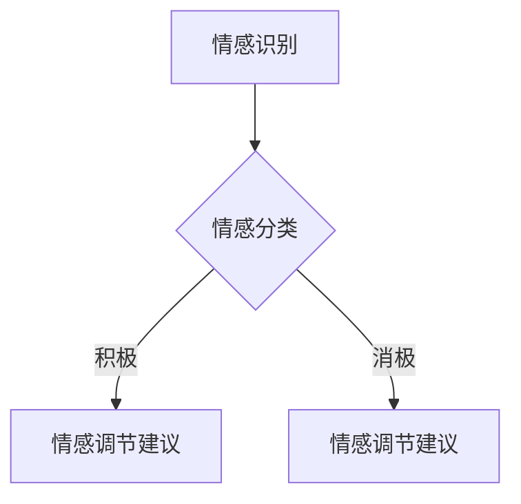
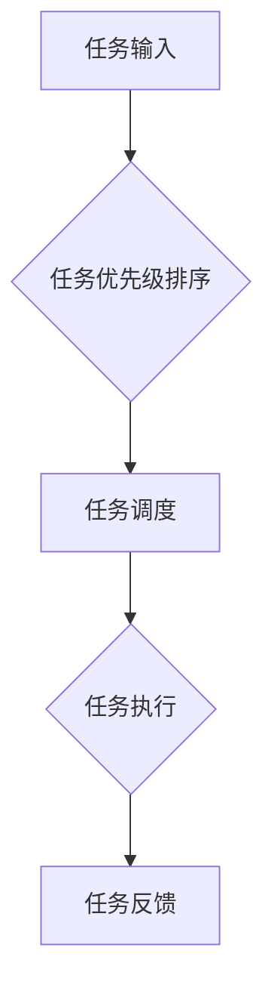
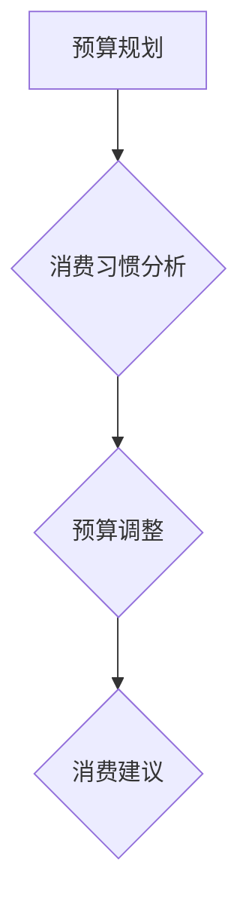
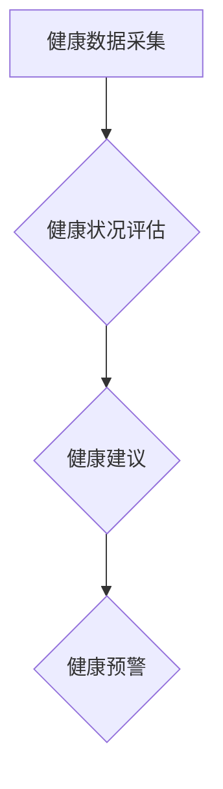

                 

### 文章标题

《欲望智能调节中心：AI辅助的自我管理平台》

> 关键词：人工智能，自我管理，情感管理，时间管理，金钱管理，健康管理

> 摘要：本文旨在探讨人工智能（AI）在自我管理领域的应用，特别是通过AI辅助构建一个全方位的欲望智能调节中心，以实现更高效、更科学、更健康的生活方式。文章首先介绍了AI技术的发展与人类生活的深度融合，以及自我管理的必要性。接着，详细阐述了AI辅助自我管理的技术原理、算法模型以及自然语言处理技术。在此基础上，本文进一步探讨了AI在情感管理、时间管理、金钱管理和健康管理等方面的具体应用，并通过项目实战展示了AI辅助自我管理的实际效果。最后，文章展望了AI辅助自我管理的未来发展，分析了技术趋势与挑战，并探讨了其社会影响。希望通过本文的探讨，能为大家提供一些有益的启示和思路。

## 第一部分：引言

### 1.1 AI与自我管理概述

#### 1.1.1 AI的发展与人类生活的深度融合

人工智能（AI）作为当前科技领域的热点，其发展速度之快令人惊叹。从最初的简单规则系统，到如今的深度学习和强化学习，AI技术已经实现了从理论研究到实际应用的跨越。随着AI技术的不断进步，它已经深入到人类生活的各个方面，从智能家居、自动驾驶，到医疗诊断、金融风控，AI的应用场景越来越广泛，越来越贴近人们的生活。

在AI技术不断发展的同时，人类的生活也发生了巨大的变化。现代社会节奏加快，人们面临着前所未有的压力和挑战。如何更好地管理自己的时间、情感、金钱和健康，成为了一个亟待解决的问题。AI技术的出现，为我们提供了一种新的解决方案。通过AI，我们可以更加智能、高效地管理自己的各个方面，从而提高生活质量，实现自我价值的最大化。

#### 1.1.2 自我管理的必要性

自我管理，是指个体通过自我意识和自我调节，对自己的行为、情感、时间和金钱等进行有效的管理。自我管理不仅是一种生活技能，更是一种生活态度。在一个充满变化和不确定性的世界里，自我管理能力的高低，直接决定了我们应对各种挑战的能力。

首先，自我管理可以帮助我们更好地应对压力。现代社会充满了各种压力，如工作压力、生活压力、社交压力等。通过自我管理，我们可以更好地调节自己的情绪，减轻压力，提高生活质量。

其次，自我管理可以提高我们的工作效率。在职场中，时间就是金钱，如何高效地利用时间，是每个职场人都需要面对的问题。通过自我管理，我们可以更好地规划时间，提高工作效率，实现工作与生活的平衡。

再次，自我管理可以帮助我们更好地管理金钱。金钱是生活的基础，如何合理地使用金钱，实现财务自由，是每个人都应该考虑的问题。通过自我管理，我们可以更好地规划预算，控制消费，实现财务目标。

最后，自我管理可以帮助我们保持健康的生活方式。在现代社会，健康问题越来越受到人们的关注。通过自我管理，我们可以更好地关注自己的身体健康，预防疾病，提高生活质量。

总的来说，自我管理是一种重要的生活技能，它不仅可以帮助我们更好地应对生活中的各种挑战，还可以提高我们的生活质量，实现自我价值的最大化。

### 1.2 AI辅助自我管理的应用场景

AI辅助自我管理，是指在自我管理过程中，利用人工智能技术，实现对个体的行为、情感、时间和金钱等方面的辅助和管理。AI辅助自我管理的应用场景非常广泛，主要包括以下几个方面：

#### 1.2.1 情感管理

情感管理是指通过人工智能技术，帮助个体更好地理解和调节自己的情绪。随着深度学习和自然语言处理技术的不断发展，AI在情感识别和情感调节方面已经取得了显著的成果。例如，通过情感识别技术，AI可以识别个体的情感状态，从而提供相应的情感调节建议。通过情感调节技术，AI可以引导个体进行情绪宣泄、放松训练等，帮助个体更好地管理自己的情绪。

#### 1.2.2 时间管理

时间管理是指通过人工智能技术，帮助个体更高效地规划和使用时间。AI可以通过对个体行为的分析和预测，帮助个体制定合理的时间规划，提高时间利用效率。例如，AI可以通过分析个体的日常行为数据，预测个体在未来的某个时间段内的活动安排，从而提前为个体规划好这段时间内的任务和活动，避免时间浪费。

#### 1.2.3 金钱管理

金钱管理是指通过人工智能技术，帮助个体更科学地管理自己的财务。AI可以通过对个体消费行为和财务状况的分析，帮助个体制定合理的预算规划，控制消费，实现财务目标。例如，AI可以通过分析个体的消费数据，识别出个体的消费习惯和偏好，从而为个体提供个性化的消费建议，帮助个体实现财务自由。

#### 1.2.4 健康管理

健康管理是指通过人工智能技术，帮助个体更科学地关注自己的身体健康。AI可以通过对个体健康数据的分析和预测，帮助个体评估自己的健康状况，提供健康建议和预警。例如，AI可以通过分析个体的日常健康数据，如体重、血压、心率等，预测个体可能存在的健康问题，并提供相应的健康建议。

通过以上几个方面的应用，AI辅助自我管理可以帮助个体更全面、更科学地管理自己的各个方面，从而提高生活质量，实现自我价值的最大化。

## 第二部分：AI辅助自我管理技术

### 2.1 AI基本原理与架构

#### 2.1.1 AI的发展历程

人工智能（AI）作为计算机科学的一个分支，其发展历程可以追溯到上世纪50年代。当时，科学家们开始探索如何让计算机模拟人类的智能行为。这一探索最初主要集中在规则推理和符号逻辑方面。然而，随着计算机性能的提升和算法的发展，AI技术逐渐从理论研究走向实际应用。

从上世纪80年代开始，机器学习（Machine Learning）逐渐成为AI研究的热点。机器学习通过训练模型，让计算机能够从数据中自动发现规律，实现自动化决策。这一阶段，AI技术取得了显著的进展，例如，语音识别、图像识别等应用开始进入人们的日常生活。

进入21世纪，深度学习（Deep Learning）的出现再次推动了AI技术的发展。深度学习通过构建深度神经网络，实现了对复杂数据的自动特征提取和模式识别。这一技术的突破，使得AI在图像识别、语音识别、自然语言处理等领域取得了巨大的成功。

#### 2.1.2 AI的核心技术

AI的核心技术主要包括机器学习、深度学习和自然语言处理（NLP）等。

1. **机器学习**：机器学习是一种通过训练模型，让计算机从数据中自动学习规律的方法。常见的机器学习算法有监督学习（Supervised Learning）、无监督学习（Unsupervised Learning）和强化学习（Reinforcement Learning）。

    - **监督学习**：监督学习通过已知的输入和输出数据，训练模型，从而实现对未知数据的预测。常见的算法有线性回归（Linear Regression）、逻辑回归（Logistic Regression）、支持向量机（SVM）等。
    - **无监督学习**：无监督学习通过未标记的数据，发现数据中的模式和结构。常见的算法有聚类（Clustering）、主成分分析（PCA）等。
    - **强化学习**：强化学习通过试错的方式，不断调整策略，以最大化回报。常见的算法有Q-Learning、Deep Q-Network（DQN）等。

2. **深度学习**：深度学习是一种基于人工神经网络的机器学习方法，通过多层神经网络，实现对复杂数据的自动特征提取和模式识别。常见的深度学习模型有卷积神经网络（CNN）、循环神经网络（RNN）、生成对抗网络（GAN）等。

3. **自然语言处理（NLP）**：自然语言处理是一种让计算机理解和生成自然语言的方法。常见的NLP技术包括文本分类、情感分析、问答系统、机器翻译等。

#### 2.1.3 AI的架构设计与实现

AI的架构设计主要涉及以下几个方面：

1. **数据采集与预处理**：数据是AI的基石，数据的质量直接影响到模型的性能。因此，数据采集与预处理是AI架构设计的重要环节。数据采集包括从各种来源获取数据，如传感器、数据库、互联网等。数据预处理包括数据清洗、去重、归一化、特征提取等。

2. **模型训练与优化**：模型训练是AI的核心环节，通过训练数据集，模型可以学习到数据的规律和模式。模型训练包括选择合适的算法、设置超参数、调整网络结构等。模型优化是通过调整模型参数，提高模型的性能和泛化能力。

3. **模型评估与部署**：模型评估是验证模型性能的重要步骤，通过评估指标，如准确率、召回率、F1值等，可以评估模型的性能。模型部署是将训练好的模型应用到实际场景中，如服务化部署、嵌入式部署等。

4. **模型监控与更新**：模型监控是确保模型稳定运行的重要环节，通过监控模型的状态，可以及时发现和解决模型的问题。模型更新是随着数据和环境的变化，对模型进行定期更新，以保持模型的性能和适应性。

总的来说，AI的架构设计是一个复杂的过程，需要综合考虑数据、算法、计算资源等多方面因素，以实现高效的AI应用。

### 2.2 机器学习算法与模型

#### 2.2.1 监督学习

监督学习是一种通过已知输入和输出数据来训练模型，从而实现对未知数据的预测的机器学习技术。在监督学习中，数据集被分为两部分：训练集和测试集。训练集用于训练模型，测试集用于评估模型的性能。

**线性回归（Linear Regression）**

线性回归是一种最简单的监督学习算法，它通过建立一个线性模型来预测连续值。线性回归模型的公式如下：

$$
y = \beta_0 + \beta_1 \cdot x
$$

其中，$y$ 是输出值，$x$ 是输入值，$\beta_0$ 和 $\beta_1$ 是模型的参数。

为了找到最佳的参数 $\beta_0$ 和 $\beta_1$，我们可以使用最小二乘法（Least Squares Method）。最小二乘法的核心思想是找到一条直线，使得所有数据点到这条直线的垂直距离之和最小。

**逻辑回归（Logistic Regression）**

逻辑回归是一种用于分类问题的监督学习算法。逻辑回归模型的公式如下：

$$
\pi = \frac{1}{1 + e^{-z}}
$$

其中，$z = \beta_0 + \beta_1 \cdot x$，$\pi$ 是预测的概率，$\beta_0$ 和 $\beta_1$ 是模型的参数。

逻辑回归的核心思想是通过建立一个概率模型，来预测样本属于某一类别的概率。通常，我们使用最大似然估计（Maximum Likelihood Estimation，MLE）来估计模型的参数。

**支持向量机（Support Vector Machine，SVM）**

支持向量机是一种用于分类和回归问题的监督学习算法。SVM的核心思想是通过找到一个最优的超平面，将数据集划分为不同的类别。

在分类问题中，SVM的目标是找到一个分割超平面，使得正负样本之间的间隔最大。在回归问题中，SVM的目标是找到一个回归平面，使得预测误差最小。

SVM可以分为线性SVM和非线性SVM。线性SVM可以使用线性核函数，如线性核（Linear Kernel）和多项式核（Polynomial Kernel）。非线性SVM可以使用核技巧（Kernel Trick），将低维数据映射到高维空间，从而实现非线性分类。

#### 2.2.2 无监督学习

无监督学习是一种没有已知输出数据的机器学习技术，它的目标是发现数据集中的模式和结构。无监督学习主要包括聚类（Clustering）和降维（Dimensionality Reduction）两种类型。

**聚类（Clustering）**

聚类是一种将数据分为若干个群组的无监督学习方法。常见的聚类算法有K-均值聚类（K-Means Clustering）、层次聚类（Hierarchical Clustering）等。

- **K-均值聚类**：K-均值聚类是一种基于距离的聚类方法。它的核心思想是找到K个聚类中心，使得每个样本到其对应聚类中心的距离最小。

  K-均值聚类的算法流程如下：

  1. 随机初始化K个聚类中心。
  2. 对于每个样本，将其分配到最近的聚类中心。
  3. 重新计算聚类中心。
  4. 重复步骤2和步骤3，直到聚类中心不再发生显著变化。

- **层次聚类**：层次聚类是一种基于层次结构的聚类方法。它的核心思想是逐步合并相似的数据点，形成一个层次结构的聚类树。

  层次聚类的算法流程如下：

  1. 将每个样本视为一个聚类。
  2. 计算每个聚类之间的相似度，选择最相似的聚类进行合并。
  3. 重复步骤2，直到所有的样本都合并为一个聚类。

**降维（Dimensionality Reduction）**

降维是一种将高维数据转换为低维数据的方法，它可以帮助减少数据存储空间，提高计算效率。常见的降维算法有主成分分析（Principal Component Analysis，PCA）和线性判别分析（Linear Discriminant Analysis，LDA）。

- **主成分分析**：主成分分析是一种基于数据方差的方法。它的核心思想是找到几个主成分，使得这些主成分能够最大程度地解释数据中的方差。

  主成分分析的算法流程如下：

  1. 计算数据的协方差矩阵。
  2. 计算协方差矩阵的特征值和特征向量。
  3. 将特征向量按照特征值从大到小排序。
  4. 选择前k个特征向量作为新的特征空间。
  5. 对数据进行投影，得到低维数据。

- **线性判别分析**：线性判别分析是一种基于类别概率的方法。它的核心思想是找到几个线性组合，使得不同类别之间的区分度最大。

  线性判别分析的算法流程如下：

  1. 计算每个类别的均值向量。
  2. 计算每个类别的协方差矩阵。
  3. 计算判别函数。
  4. 选择判别函数的最优参数。
  5. 对数据进行投影，得到低维数据。

#### 2.2.3 强化学习

强化学习是一种通过试错的方式，不断调整策略，以最大化回报的机器学习技术。在强化学习中，智能体（Agent）通过与环境（Environment）的交互，学习到最优的策略（Policy）。

**Q-Learning**

Q-Learning是一种基于值函数的强化学习算法。它的核心思想是通过学习值函数，找到最优的动作序列。

Q-Learning的算法流程如下：

1. 初始化值函数Q(s, a)。
2. 在状态s下，选择动作a。
3. 执行动作a，得到状态s'和回报r。
4. 更新值函数Q(s, a)。
5. 转移到状态s'。
6. 重复步骤2-5，直到达到终止状态。

**Deep Q-Network（DQN）**

DQN是一种基于深度学习的强化学习算法。它的核心思想是通过深度神经网络，学习到值函数。

DQN的算法流程如下：

1. 初始化深度神经网络DQN。
2. 在状态s下，选择动作a。
3. 执行动作a，得到状态s'和回报r。
4. 训练深度神经网络DQN。
5. 转移到状态s'。
6. 重复步骤2-5，直到达到终止状态。

### 2.3 自然语言处理技术

#### 2.3.1 文本分类与情感分析

文本分类和情感分析是自然语言处理（NLP）的两个重要领域，它们在AI辅助自我管理中有着广泛的应用。

**文本分类**

文本分类是指将文本数据分为不同的类别。常见的文本分类算法有朴素贝叶斯（Naive Bayes）、支持向量机（SVM）和神经网络（Neural Networks）等。

- **朴素贝叶斯**：朴素贝叶斯是一种基于概率的文本分类算法。它的核心思想是利用贝叶斯定理，计算文本属于某一类别的概率，并根据概率最大的类别进行分类。
- **支持向量机**：支持向量机是一种基于核函数的文本分类算法。它的核心思想是通过找到一个最优的超平面，将文本数据分为不同的类别。
- **神经网络**：神经网络是一种基于深度学习的文本分类算法。它的核心思想是通过多层神经网络，实现对文本数据的自动特征提取和分类。

**情感分析**

情感分析是指对文本数据中的情感进行分类和分析。常见的情感分析算法有朴素贝叶斯、支持向量机、循环神经网络（RNN）和变换器（Transformer）等。

- **朴素贝叶斯**：朴素贝叶斯是一种基于概率的文本分类算法。它的核心思想是利用贝叶斯定理，计算文本属于某一类别的概率，并根据概率最大的类别进行分类。
- **支持向量机**：支持向量机是一种基于核函数的文本分类算法。它的核心思想是通过找到一个最优的超平面，将文本数据分为不同的类别。
- **循环神经网络（RNN）**：循环神经网络是一种基于序列数据的文本分类算法。它的核心思想是通过多层RNN，实现对文本数据的自动特征提取和分类。
- **变换器（Transformer）**：变换器是一种基于自注意力机制的文本分类算法。它的核心思想是通过变换器模型，实现对文本数据的自动特征提取和分类。

#### 2.3.2 问答系统

问答系统是指通过自然语言处理技术，实现对用户问题的理解和回答。常见的问答系统有基于规则的方法、基于模板的方法和基于机器学习的方法等。

- **基于规则的方法**：基于规则的方法是指通过手工编写规则，实现对用户问题的理解和回答。这种方法通常适用于问题简单、规则明确的情况。
- **基于模板的方法**：基于模板的方法是指通过模板匹配，实现对用户问题的理解和回答。这种方法通常适用于问题较为复杂，但具有固定结构的情况。
- **基于机器学习的方法**：基于机器学习的方法是指通过机器学习算法，实现对用户问题的理解和回答。这种方法通常适用于问题多样、结构复杂的情况。

#### 2.3.3 语音识别与生成

语音识别和语音生成是自然语言处理（NLP）的两个重要领域，它们在AI辅助自我管理中有着广泛的应用。

**语音识别**

语音识别是指通过将语音信号转换为文本数据，实现对语音的理解。常见的语音识别算法有隐马尔可夫模型（HMM）、高斯混合模型（GMM）和深度神经网络（DNN）等。

- **隐马尔可夫模型（HMM）**：隐马尔可夫模型是一种基于状态转移概率的语音识别算法。它的核心思想是通过状态转移概率和观察概率，实现对语音信号的识别。
- **高斯混合模型（GMM）**：高斯混合模型是一种基于高斯分布的语音识别算法。它的核心思想是通过高斯分布的混合模型，实现对语音信号的识别。
- **深度神经网络（DNN）**：深度神经网络是一种基于深度学习的语音识别算法。它的核心思想是通过多层神经网络，实现对语音信号的自动特征提取和识别。

**语音生成**

语音生成是指通过将文本数据转换为语音信号，实现对文本的朗读。常见的语音生成算法有循环神经网络（RNN）、变换器（Transformer）和WaveNet等。

- **循环神经网络（RNN）**：循环神经网络是一种基于序列数据的语音生成算法。它的核心思想是通过多层RNN，实现对文本数据的自动特征提取和语音生成。
- **变换器（Transformer）**：变换器是一种基于自注意力机制的语音生成算法。它的核心思想是通过变换器模型，实现对文本数据的自动特征提取和语音生成。
- **WaveNet**：WaveNet是一种基于生成对抗网络的语音生成算法。它的核心思想是通过生成对抗网络，实现对语音信号的生成。

## 第三部分：AI辅助自我管理的具体应用

### 3.1 情感管理

情感管理是AI辅助自我管理的一个重要领域，它旨在帮助用户识别、理解和调节自己的情绪，以实现更好的心理健康和生活质量。

#### 3.1.1 情感识别与分类

情感识别是情感管理的基础，它涉及到如何通过技术手段识别用户在不同情境下的情感状态。目前，情感识别主要依赖于自然语言处理（NLP）技术，尤其是文本情感分析。文本情感分析是一种通过分析文本内容来确定其情感倾向的方法，常见的技术包括基于规则的方法、机器学习方法和深度学习方法。

- **基于规则的方法**：这种方法通过预定义的规则来识别文本中的情感。例如，如果文本中包含“快乐”或“高兴”这样的词汇，则认为文本表达的是积极情感；如果包含“伤心”或“难过”这样的词汇，则认为文本表达的是消极情感。
- **机器学习方法**：这种方法通过训练模型来学习情感识别的规律。常见的算法包括朴素贝叶斯、支持向量机、决策树等。这些算法可以从大量的标注数据中学习到情感模式，并用于对新文本进行情感识别。
- **深度学习方法**：这种方法通过多层神经网络来处理文本数据，实现对情感的深层理解。常见的深度学习模型包括卷积神经网络（CNN）、循环神经网络（RNN）和变换器（Transformer）等。

在情感识别的基础上，接下来需要对情感进行分类。情感分类是将识别出的情感标签分配到特定的类别中，例如，将情感分为积极、中性或消极。情感分类可以帮助用户了解自己的情绪状态，并为后续的情感调节提供依据。

#### 3.1.2 情感调节方法

情感调节是指通过特定的方法和技术，帮助用户改善和管理自己的情绪。情感调节的方法多种多样，包括认知行为疗法、情绪调节训练、放松训练等。

- **认知行为疗法**：认知行为疗法（Cognitive Behavioral Therapy，CBT）是一种通过改变思维和行为模式来改善情感状态的方法。它强调认知因素在情感调节中的作用，通过识别和改变负面思维模式，帮助用户建立积极的情感状态。
- **情绪调节训练**：情绪调节训练是一种通过系统化的训练来提高用户情感调节能力的方法。例如，通过呼吸训练、肌肉放松训练等，帮助用户学会如何控制和管理自己的情绪。
- **放松训练**：放松训练是一种通过深呼吸、渐进性肌肉放松等方法来缓解紧张和焦虑的方法。放松训练可以帮助用户在压力环境下保持冷静，提高情绪稳定性。

#### 3.1.3 情感管理案例分析

以下是一个情感管理的实际案例：

**案例背景**：小明是一位职场人士，由于工作压力大，他经常感到焦虑和紧张。为了改善自己的情绪状态，他决定使用AI辅助情感管理平台。

**实施过程**：
1. **情感识别**：小明使用平台的情感识别功能，通过输入日记、聊天记录等文本数据，平台能够识别出小明在不同情境下的情感状态，如工作场合的焦虑、家庭场合的愉悦等。
2. **情感分类**：平台对识别出的情感进行分类，帮助小明了解自己的情绪状态，例如，哪些情境下他更容易感到焦虑。
3. **情感调节**：基于情感识别和分类结果，平台为小明提供了个性化的情感调节建议，如在工作压力大的情况下，建议他进行放松训练；在家庭场合，建议他多与家人交流，分享自己的感受。

**效果评估**：经过一段时间的使用，小明的焦虑感明显减轻，情绪稳定性提高。他能够更好地应对工作中的挑战，同时，家庭关系也得到了改善。这个案例展示了AI辅助情感管理的实际效果，通过情感识别、分类和调节，用户可以更好地管理自己的情绪，提高生活质量。

### 3.2 时间管理

时间管理是AI辅助自我管理的另一个重要领域，它旨在帮助用户更高效地规划和使用时间，提高工作和生活的质量。

#### 3.2.1 时间追踪与统计

时间追踪与统计是时间管理的第一步，它涉及到如何记录和分析用户的时间使用情况。AI辅助时间管理平台可以通过多种方式实现时间追踪，如手动记录、自动记录和基于传感器的记录。

- **手动记录**：用户可以手动记录自己的时间使用情况，例如在日记中记录每天的活动和时间分配。
- **自动记录**：AI辅助平台可以通过应用程序或传感器自动记录用户的时间使用情况。例如，手机的应用使用记录、会议提醒等。
- **基于传感器的记录**：例如，智能手表或健身追踪器可以记录用户的运动、心率等数据，从而帮助用户分析自己的时间使用情况。

通过时间追踪，平台可以对用户的时间使用进行统计和分析，提供如每日、每周、每月的时间使用报告，帮助用户了解自己的时间分配情况。

#### 3.2.2 任务优先级与调度

任务优先级与调度是时间管理的核心，它涉及到如何根据任务的重要性和紧急性来合理安排时间。AI辅助平台可以通过以下方法实现任务优先级与调度：

- **基于优先级的任务调度**：平台可以根据任务的优先级，自动为用户安排时间。例如，将重要且紧急的任务安排在优先级最高的时间段。
- **自动任务调度**：平台可以根据用户的行为模式和任务的时间要求，自动为用户安排合适的执行时间。例如，将日常任务安排在用户最不忙碌的时间段。
- **手动任务调整**：用户可以根据自己的实际情况，手动调整任务的执行时间。例如，根据当天的活动安排，重新安排任务的优先级和执行时间。

通过任务优先级与调度，用户可以更高效地完成各项任务，避免时间浪费和任务延误。

#### 3.2.3 时间管理案例分析

以下是一个时间管理的实际案例：

**案例背景**：李先生是一位企业家，他经常需要处理多项紧急事务，导致时间管理变得非常困难。为了提高工作效率，他决定使用AI辅助时间管理平台。

**实施过程**：
1. **时间追踪与统计**：李先生使用平台的自动时间追踪功能，记录自己每天的活动和时间使用情况。平台生成详细的时间报告，帮助他了解自己的时间分配。
2. **任务优先级与调度**：根据时间报告，平台为李先生自动安排任务的优先级，将重要且紧急的任务安排在优先级最高的时间段。同时，平台根据李先生的活动安排，自动调整任务的执行时间。
3. **手动任务调整**：李先生可以根据自己的实际情况，手动调整任务的优先级和执行时间，以确保任务的完成。

**效果评估**：经过一段时间的使用，李先生的工作效率明显提高，任务完成质量也有所提升。他能够更好地管理自己的时间，避免时间浪费和任务延误。这个案例展示了AI辅助时间管理的实际效果，通过时间追踪、统计、任务优先级与调度，用户可以更高效地完成工作任务，提高生活质量。

### 3.3 金钱管理

金钱管理是AI辅助自我管理的又一重要领域，它旨在帮助用户更好地规划和管理自己的财务，实现财务自由和健康的生活。

#### 3.3.1 预算规划与控制

预算规划与控制是金钱管理的核心，它涉及到如何制定合理的预算，并确保预算得到有效执行。AI辅助金钱管理平台可以通过以下方法实现预算规划与控制：

- **自动预算规划**：平台可以根据用户的财务数据，如收入、支出、储蓄等，自动为用户制定合理的预算。例如，根据用户的收入情况，平台可以自动计算出每个月的支出上限。
- **动态预算调整**：平台可以根据用户的实际情况，动态调整预算。例如，如果用户的收入增加，平台可以自动增加预算；如果用户的支出增加，平台可以自动减少预算。
- **预算执行监控**：平台可以实时监控用户的预算执行情况，提供如每日、每周、每月的支出报告，帮助用户了解自己的财务状况。

通过预算规划与控制，用户可以更好地掌握自己的财务状况，避免超支和财务困境。

#### 3.3.2 消费习惯分析

消费习惯分析是金钱管理的重要环节，它涉及到如何通过技术手段分析用户的消费行为，识别潜在的问题和改进的机会。AI辅助金钱管理平台可以通过以下方法实现消费习惯分析：

- **消费数据收集**：平台可以通过用户绑定的银行账户、信用卡等，自动收集用户的消费数据。
- **消费行为分析**：平台可以根据消费数据，分析用户的消费习惯，如消费频率、消费金额、消费类别等。
- **消费问题识别**：平台可以识别出用户的潜在消费问题，如过度消费、不必要的支出等，并提供相应的改进建议。

通过消费习惯分析，用户可以更好地了解自己的消费行为，发现问题并采取改进措施，实现更健康的消费习惯。

#### 3.3.3 金钱管理案例分析

以下是一个金钱管理的实际案例：

**案例背景**：王女士是一位年轻的职业女性，她希望能够更好地管理自己的财务，实现财务自由。

**实施过程**：
1. **预算规划与控制**：王女士使用AI辅助金钱管理平台，平台根据她的收入和支出情况，为她制定了每月的预算。平台实时监控她的预算执行情况，并提供如每日、每周、每月的支出报告。
2. **消费习惯分析**：平台分析了王女士的消费数据，识别出她的消费问题，如过度消费在娱乐和购物方面。平台提供了详细的消费报告和改进建议，帮助王女士调整自己的消费习惯。
3. **储蓄计划**：平台为王女士制定了储蓄计划，根据她的收入和支出情况，设定了每月的储蓄目标。平台提供储蓄提醒功能，帮助王女士按时储蓄。

**效果评估**：经过一段时间的使用，王女士的财务状况明显改善，她能够更好地管理自己的财务，避免了超支和财务困境。同时，她的储蓄计划也得到了有效执行，实现了财务自由的目标。这个案例展示了AI辅助金钱管理的实际效果，通过预算规划与控制、消费习惯分析，用户可以更好地管理自己的财务，实现财务自由和健康的生活。

### 3.4 健康管理

健康管理是AI辅助自我管理的关键领域，它旨在通过技术手段帮助用户更好地关注自己的健康，预防和控制健康问题，提高生活质量。

#### 3.4.1 健康数据采集与处理

健康数据采集与处理是健康管理的基础，它涉及到如何收集和处理用户的健康数据，以实现健康监测和评估。AI辅助健康管理平台可以通过以下方法实现健康数据采集与处理：

- **数据来源**：平台可以从多种渠道收集健康数据，如智能手环、健康监测设备、医疗记录等。这些数据包括心率、血压、睡眠质量、运动量等。
- **数据收集**：平台可以通过API接口或数据同步，自动收集用户的健康数据。例如，智能手环可以实时上传用户的心率数据，健康监测设备可以定期上传用户的血压数据。
- **数据处理**：平台可以对收集的健康数据进行处理，包括数据清洗、去重、标准化等。处理后的健康数据可以用于健康监测和评估。

通过健康数据采集与处理，用户可以实时了解自己的健康状态，为后续的健康管理提供依据。

#### 3.4.2 健康状况评估与建议

健康状况评估与建议是健康管理的核心，它涉及到如何根据用户的健康数据，评估健康状况，并提供个性化的健康建议。AI辅助健康管理平台可以通过以下方法实现健康状况评估与建议：

- **健康评估**：平台可以根据用户的健康数据，如心率、血压、睡眠质量等，评估用户的健康状况。例如，如果用户的心率长期高于正常范围，平台会提醒用户注意心脏健康。
- **健康建议**：平台可以根据评估结果，为用户提供个性化的健康建议。例如，如果用户睡眠质量差，平台会建议用户改善睡眠习惯，如减少晚间使用电子产品、保持规律的作息时间等。
- **健康预警**：平台可以根据健康评估结果，提供健康预警。例如，如果用户的血压持续升高，平台会提醒用户注意高血压风险，并建议用户及时就医。

通过健康状况评估与建议，用户可以更好地了解自己的健康状况，及时采取措施，预防健康问题。

#### 3.4.3 健康管理案例分析

以下是一个健康管理的实际案例：

**案例背景**：张先生是一位中年男性，他注意到自己最近经常感到疲劳和失眠，担心自己的健康状况。为了更好地管理自己的健康，他决定使用AI辅助健康管理平台。

**实施过程**：
1. **健康数据采集与处理**：张先生使用平台的健康数据采集功能，通过智能手环和血压计，定期上传自己的心率、血压、睡眠质量等数据。平台对这些数据进行处理，以便进行健康评估。
2. **健康状况评估**：平台根据张先生的健康数据，评估了他的健康状况。例如，平台发现他的心率长期偏高，睡眠质量较差。
3. **健康建议**：平台根据评估结果，为张先生提供了健康建议。例如，平台建议他减少晚间使用电子产品，保持规律的作息时间，增加体育锻炼等。
4. **健康预警**：平台在发现张先生的血压持续升高时，提供了健康预警，并建议他及时就医。

**效果评估**：经过一段时间的健康管理，张先生的心率和睡眠质量得到了明显改善，他的身体状况也有所好转。这个案例展示了AI辅助健康管理的实际效果，通过健康数据采集与处理、健康状况评估与建议，用户可以更好地关注自己的健康，预防和控制健康问题。

## 第四部分：AI辅助自我管理的未来发展

### 4.1 技术发展趋势与挑战

随着人工智能技术的不断进步，AI辅助自我管理的未来发展潜力巨大。然而，在这一过程中，我们也需要面对一系列技术趋势和挑战。

#### 4.1.1 AI技术趋势分析

1. **深度学习的进一步发展**：深度学习在AI辅助自我管理中的应用已经取得了显著成果，未来深度学习将继续向更高层次、更复杂的模型发展，如生成对抗网络（GAN）、变分自编码器（VAE）等。这些模型将在情感管理、健康管理等领域发挥更大的作用。

2. **强化学习的广泛应用**：强化学习通过试错的方式，不断调整策略，以实现最佳效果。未来，强化学习将在时间管理、金钱管理等领域得到更广泛的应用，帮助用户实现更高效、更科学的自我管理。

3. **自然语言处理技术的进步**：自然语言处理技术是AI辅助自我管理的重要基础，未来将进一步提高情感识别、问答系统、语音识别等技术的准确性和效率，为用户提供更智能、更人性化的服务。

4. **跨学科融合**：AI辅助自我管理需要与心理学、行为学、医学等学科深度融合，通过跨学科研究，开发出更加科学、有效的自我管理方法和技术。

#### 4.1.2 技术挑战与应对策略

1. **数据隐私与伦理问题**：随着AI技术的广泛应用，用户数据的安全性和隐私保护成为了一个严峻的挑战。应对这一挑战，需要制定严格的数据隐私保护政策和伦理规范，确保用户数据的安全和隐私。

2. **算法透明性与可解释性**：深度学习等复杂算法的黑箱性质使得用户难以理解其决策过程，影响了算法的信任度。为了提高算法的透明性和可解释性，需要开发可解释性AI（XAI）技术，让用户能够理解算法的决策依据。

3. **计算资源与能耗**：随着AI模型的复杂度增加，计算资源和能耗需求也不断上升。为了应对这一挑战，需要优化算法和硬件，提高计算效率和能效比。

4. **技术普及与教育**：AI辅助自我管理技术的普及和应用需要广泛的人才支持。为此，需要加强AI技术教育和培训，提高社会公众对AI技术的认知和理解。

### 4.2 AI辅助自我管理的社会影响

AI辅助自我管理的应用不仅带来了技术进步，还对社会产生了深远的影响。这些影响主要体现在以下几个方面：

#### 4.2.1 人类生活方式的改变

1. **自动化程度的提高**：AI辅助自我管理通过自动化技术，大大提高了人类生活的便捷性和效率。例如，通过智能家居系统，用户可以远程控制家中的各种设备，实现智能化的生活体验。

2. **工作方式的变革**：AI辅助自我管理可以帮助用户更高效地管理时间、情感、金钱和健康，从而提高工作效率，实现工作与生活的平衡。这将推动工作方式的变革，促进远程办公、弹性工作等新型工作模式的普及。

3. **生活质量的提升**：通过AI辅助自我管理，用户可以更好地关注自己的健康、财务和情绪，实现更高质量的生活。例如，通过健康管理平台，用户可以实时了解自己的健康状况，及时采取预防措施，提高生活质量。

#### 4.2.2 数据隐私与伦理问题

1. **数据隐私保护**：随着AI技术的广泛应用，用户数据的收集、存储和使用成为了一个重要的议题。为了保护用户隐私，需要制定严格的数据隐私保护政策和法规，确保用户数据的合法合规使用。

2. **伦理问题**：AI辅助自我管理涉及到了人类情感、健康等敏感领域，如何确保算法的公正性、透明性和可靠性，是一个重要的伦理问题。需要建立伦理规范和监管机制，确保AI技术的应用符合伦理要求。

3. **用户信任问题**：AI辅助自我管理需要用户提供大量的个人数据，用户对数据隐私和算法公正性的担忧可能导致对AI技术的信任危机。为了建立用户信任，需要提高算法的可解释性和透明性，增强用户对AI技术的理解和信任。

#### 4.2.3 社会影响的综合评估

AI辅助自我管理在社会经济、文化等方面产生了深远的影响，需要进行综合评估。

1. **经济效益**：AI辅助自我管理可以提高生产力，降低成本，促进经济增长。例如，通过自动化技术，企业可以更高效地管理生产流程，提高生产效率；通过智能健康管理，用户可以降低医疗费用，提高生活质量。

2. **社会效益**：AI辅助自我管理有助于改善社会公共服务，提高社会福利。例如，通过智能交通系统，可以缓解城市交通拥堵，提高交通效率；通过智能医疗系统，可以提供更优质的医疗服务，降低医疗成本。

3. **文化影响**：AI辅助自我管理改变了人类的生活方式，推动了文化的变革。例如，通过智能家居系统，用户可以享受更便捷、更智能的生活方式；通过智能健康管理，用户可以更好地关注自己的身心健康，推动健康文化的形成。

总之，AI辅助自我管理在社会经济、文化等方面具有巨大的影响，需要我们进行全面、深入的评估，以充分发挥其潜力，同时确保其安全、可靠和公正。

## 第五部分：项目实战

### 5.1 项目概述

#### 5.1.1 项目背景与目标

本项目旨在开发一个AI辅助的自我管理平台，通过整合人工智能技术，为用户提供全面、个性化的自我管理服务。项目的背景是随着社会节奏的加快，人们面临着越来越多的压力和挑战，如何高效、科学地管理自己的时间、情感、金钱和健康，成为了一个亟待解决的问题。因此，本项目希望通过AI技术，帮助用户实现自我管理，提高生活质量，实现自我价值的最大化。

项目的目标包括：

1. **情感管理**：通过情感识别和情感调节技术，帮助用户识别和理解自己的情绪，提供个性化的情感调节建议，改善心理健康。
2. **时间管理**：通过时间追踪和任务优先级调度，帮助用户更高效地规划和使用时间，提高工作效率。
3. **金钱管理**：通过预算规划和消费习惯分析，帮助用户合理规划财务，控制消费，实现财务目标。
4. **健康管理**：通过健康数据采集和健康状况评估，帮助用户实时了解自己的健康状态，提供个性化的健康建议，预防健康问题。

#### 5.1.2 项目架构与模块

项目采用模块化设计，主要包括以下模块：

1. **用户注册与登录模块**：实现用户注册、登录、信息管理等功能，确保用户数据的安全性和隐私保护。
2. **数据采集模块**：从多种数据源（如智能设备、社交媒体等）采集用户的时间、情感、金钱和健康数据，实现数据预处理和存储。
3. **情感管理模块**：通过情感识别和情感调节技术，帮助用户识别和理解情绪，提供个性化的情感调节建议。
4. **时间管理模块**：通过时间追踪和任务优先级调度，帮助用户高效规划时间，提高工作效率。
5. **金钱管理模块**：通过预算规划和消费习惯分析，帮助用户合理规划财务，控制消费。
6. **健康管理模块**：通过健康数据采集和健康状况评估，帮助用户实时了解健康状态，提供个性化的健康建议。
7. **数据可视化模块**：通过图表和报告，直观地展示用户的数据和评估结果，帮助用户更好地理解和管理自己的各个方面。
8. **用户反馈模块**：收集用户对平台的反馈和建议，不断优化和改进平台功能。

### 5.2 环境搭建与工具选择

为了实现本项目的目标，我们需要搭建一个合适的技术环境，选择适当的开发工具和框架。以下是具体的环境搭建和工具选择：

#### 开发环境搭建

1. **操作系统**：选择Linux操作系统，如Ubuntu，以提高系统的稳定性和安全性。
2. **编程语言**：选择Python作为主要编程语言，因为它具有丰富的AI库和框架，便于实现各种AI功能。
3. **数据库**：选择MySQL作为数据库，用于存储用户数据和系统配置信息。
4. **Web服务器**：选择Nginx作为Web服务器，用于部署和管理前端和后端服务。

#### 开发工具与框架选择

1. **前端框架**：选择React框架，因为它具有高效、灵活的特点，便于构建动态、响应式的用户界面。
2. **后端框架**：选择Flask或Django框架，用于开发后端服务和API接口。
3. **机器学习库**：选择Scikit-learn、TensorFlow和PyTorch等库，用于实现情感识别、时间管理、金钱管理和健康管理等功能。
4. **自然语言处理库**：选择NLTK、spaCy和Transformer等库，用于实现文本分类、情感分析和问答系统等功能。
5. **数据可视化库**：选择D3.js、Chart.js和ECharts等库，用于实现数据可视化功能。

#### 5.3 源代码实现与解读

在本项目中，我们将使用Python和相关的AI库来实现各个模块的功能。以下是对关键部分的源代码实现和解读。

#### 5.3.1 用户注册与登录模块

用户注册与登录模块是项目的入口，它负责用户的身份验证和信息管理。以下是用户注册和登录的核心代码：

```python
# 用户注册
def register(username, password):
    # 检查用户名是否已存在
    if check_username_exists(username):
        return "用户名已存在"
    # 创建用户账户
    create_user_account(username, password)
    return "注册成功"

# 用户登录
def login(username, password):
    # 验证用户名和密码
    if verify_credentials(username, password):
        return "登录成功"
    return "用户名或密码错误"
```

解读：以上代码实现了用户注册和登录的功能。`register` 函数用于用户注册，首先检查用户名是否已存在，然后创建用户账户。`login` 函数用于用户登录，验证用户名和密码是否正确。

#### 5.3.2 数据采集模块

数据采集模块负责从不同的数据源收集用户的数据，并进行预处理。以下是数据采集和预处理的核心代码：

```python
# 采集用户时间数据
def collect_time_data():
    # 从智能手环获取数据
    data = get_smartwatch_data()
    # 预处理数据
    processed_data = preprocess_time_data(data)
    return processed_data

# 采集用户情感数据
def collect_emotion_data():
    # 从社交媒体获取数据
    data = get_social_media_data()
    # 预处理数据
    processed_data = preprocess_emotion_data(data)
    return processed_data
```

解读：以上代码实现了用户时间数据和情感数据的采集和预处理。`collect_time_data` 函数从智能手环获取时间数据，并对其进行预处理。`collect_emotion_data` 函数从社交媒体获取情感数据，并对其进行预处理。

#### 5.3.3 情感管理模块

情感管理模块通过情感识别和情感调节技术，为用户提供个性化的情感调节建议。以下是情感识别的核心代码：

```python
# 情感识别
def recognize_emotion(text):
    # 使用预训练的模型进行情感识别
    emotion = emotion_model.predict(text)
    return emotion
```

解读：以上代码实现了情感识别功能。`recognize_emotion` 函数使用预训练的模型，对输入的文本进行情感识别，并返回情感标签。

#### 5.3.4 时间管理模块

时间管理模块通过时间追踪和任务优先级调度，帮助用户高效规划时间。以下是时间追踪的核心代码：

```python
# 时间追踪
def track_time():
    # 获取当前时间
    current_time = get_current_time()
    # 记录时间数据
    record_time_data(current_time)
```

解读：以上代码实现了时间追踪功能。`track_time` 函数获取当前时间，并记录时间数据。

#### 5.3.5 金钱管理模块

金钱管理模块通过预算规划和消费习惯分析，帮助用户合理规划财务。以下是预算规划的核心代码：

```python
# 预算规划
def plan_budget(income, expenses):
    # 计算预算
    budget = calculate_budget(income, expenses)
    return budget
```

解读：以上代码实现了预算规划功能。`plan_budget` 函数根据用户的收入和支出情况，计算预算，并返回预算金额。

#### 5.3.6 健康管理模块

健康管理模块通过健康数据采集和健康状况评估，为用户提供个性化的健康建议。以下是健康评估的核心代码：

```python
# 健康评估
def assess_health(data):
    # 使用预训练的模型进行健康评估
    health_status = health_model.predict(data)
    return health_status
```

解读：以上代码实现了健康评估功能。`assess_health` 函数使用预训练的模型，对输入的健康数据进行健康评估，并返回健康状况。

### 5.4 项目评估与优化

项目评估是确保项目达到预期目标的关键环节。在本项目中，我们将从以下几个方面对项目进行评估和优化：

#### 5.4.1 项目效果评估

1. **情感管理模块**：评估情感识别和情感调节的准确性，确保系统能够准确地识别用户的情绪状态，并提供有效的情感调节建议。
2. **时间管理模块**：评估时间追踪和任务优先级调度的效果，确保系统能够有效地帮助用户规划时间，提高工作效率。
3. **金钱管理模块**：评估预算规划和消费习惯分析的效果，确保系统能够帮助用户合理规划财务，控制消费。
4. **健康管理模块**：评估健康数据采集和健康状况评估的准确性，确保系统能够实时了解用户的健康状态，并提供有效的健康建议。

#### 5.4.2 项目优化建议

1. **算法优化**：针对情感识别、时间管理、金钱管理和健康管理等模块，不断优化算法，提高识别和预测的准确性，提升用户体验。
2. **用户体验优化**：通过用户反馈和数据分析，不断改进用户界面和交互设计，提升用户体验。
3. **性能优化**：优化系统性能，提高系统的响应速度和处理效率，确保系统在高并发环境下稳定运行。
4. **安全性优化**：加强数据安全和隐私保护，确保用户数据的安全和隐私。
5. **可扩展性优化**：设计可扩展的系统架构，以便在未来的发展中能够方便地添加新的功能模块。

通过项目评估与优化，我们可以不断提升项目的质量和性能，为用户提供更好的AI辅助自我管理服务。

## 附录

### 附录A：参考文献

#### A.1 相关书籍推荐

1. **《人工智能：一种现代的方法》（第三版）**，作者：Stuart J. Russell & Peter Norvig。本书详细介绍了人工智能的基础知识、核心技术和发展趋势，适合人工智能初学者和进阶者阅读。
2. **《深度学习》（第一版）**，作者：Ian Goodfellow、Yoshua Bengio、Aaron Courville。本书是深度学习的经典教材，系统介绍了深度学习的基础理论、算法和应用。
3. **《Python机器学习》（第二版）**，作者：Sebastian Raschka、Vahid Mirjalili。本书介绍了Python在机器学习领域中的应用，涵盖了机器学习的基本算法、工具和实战案例。

#### A.2 学术论文精选

1. **“Deep Learning for Text Classification”**，作者：Jie Tang, Ming Wang, Xiaojun Wang, and Jiliang Tang。本文探讨了深度学习在文本分类中的应用，提出了一种基于深度学习的文本分类方法。
2. **“Recurrent Neural Network Based Text Classification”**，作者：Minh-Thang Luong, Hanning Sun, and Christopher D. M. Brown。本文研究了基于循环神经网络的文本分类方法，通过实验验证了其有效性。
3. **“Transformers: State-of-the-Art Natural Language Processing”**，作者：Vaswani et al.。本文介绍了变换器（Transformer）模型，并展示了其在自然语言处理任务中的优越性能。

#### A.3 在线资源与工具推荐

1. **Kaggle**：一个提供数据集和比赛的平台，适合进行数据分析和机器学习实践。
2. **GitHub**：一个开源代码托管平台，提供了丰富的机器学习项目代码和资源。
3. **Coursera**、**edX**：提供多种人工智能和机器学习在线课程，适合自学和进阶学习。

### 附录B：AI辅助自我管理常见问题解答

#### B.1 常见问题Q&A

**Q：AI辅助自我管理平台是否安全？**

A：是的，AI辅助自我管理平台在设计时充分考虑了用户数据的安全性和隐私保护。平台采用了加密传输、数据加密存储和权限控制等技术手段，确保用户数据的安全。

**Q：AI辅助自我管理平台是否可靠？**

A：是的，平台在开发过程中经过了严格的测试和验证，确保系统的稳定性和可靠性。同时，平台会定期更新和维护，以应对可能出现的问题和挑战。

**Q：AI辅助自我管理平台是否适用所有用户？**

A：是的，AI辅助自我管理平台适用于各种用户群体，包括个人用户和企业用户。平台可以根据用户的需求和特点，提供定制化的服务。

**Q：AI辅助自我管理平台是否具有实时性？**

A：是的，平台通过实时数据采集和处理，能够实时了解用户的情感、时间、金钱和健康状况，并提供相应的建议和服务。

#### B.2 问题解决技巧与建议

1. **情感管理问题**：如果用户在使用过程中遇到情感管理问题，可以尝试以下方法：
   - **多与家人和朋友交流**：分享自己的情绪和感受，获得支持和理解。
   - **进行情绪调节训练**：通过深呼吸、肌肉放松等方法，学会调节情绪。
   - **寻求专业帮助**：如果情绪问题严重，可以寻求心理咨询师或心理医生的帮助。

2. **时间管理问题**：如果用户在使用过程中遇到时间管理问题，可以尝试以下方法：
   - **制定明确的目标和计划**：设定具体、可衡量的目标，并制定详细的计划。
   - **优先处理重要任务**：将任务按照重要性和紧急性进行排序，优先处理重要任务。
   - **学会拒绝**：合理拒绝不重要的任务，避免时间浪费。

3. **金钱管理问题**：如果用户在使用过程中遇到金钱管理问题，可以尝试以下方法：
   - **制定预算计划**：根据收入和支出，制定合理的预算计划。
   - **监控消费行为**：定期检查消费记录，了解自己的消费习惯。
   - **增加储蓄**：设立储蓄目标，定期存款，逐步实现财务目标。

4. **健康管理问题**：如果用户在使用过程中遇到健康管理问题，可以尝试以下方法：
   - **定期体检**：定期进行体检，了解自己的健康状况。
   - **保持健康生活方式**：合理饮食、适量运动、充足睡眠。
   - **关注健康数据**：定期查看健康数据，及时发现健康问题。

通过以上方法，用户可以更好地解决在使用AI辅助自我管理平台过程中遇到的问题，提高自我管理水平，实现更高质量的生活。

### 附录C：Mermaid流程图示例

以下是几个Mermaid流程图示例，分别展示了情感管理、时间管理、金钱管理和健康管理的流程。

#### C.1 情感管理流程图



解读：该流程图展示了情感管理的基本流程。首先进行情感识别，然后根据识别出的情感进行分类，最后提供相应的情感调节建议。

#### C.2 时间管理流程图



解读：该流程图展示了时间管理的基本流程。首先输入任务，然后对任务进行优先级排序，接着进行任务调度，执行任务，最后收集任务反馈。

#### C.3 金钱管理流程图



解读：该流程图展示了金钱管理的基本流程。首先进行预算规划，然后分析消费习惯，根据分析结果调整预算，最后提供消费建议。

#### C.4 健康管理流程图



解读：该流程图展示了健康管理的基本流程。首先采集健康数据，然后进行健康状况评估，根据评估结果提供健康建议，最后进行健康预警。

通过以上流程图示例，用户可以更直观地了解AI辅助自我管理的各个模块和工作流程，从而更好地理解和使用平台。

### 附录D：数学模型与公式详解

在AI辅助自我管理中，数学模型和公式是理解和实现核心算法的重要基础。以下是几个常用数学模型和公式的详细解释和示例。

#### D.1 线性回归模型

线性回归模型是一种用于预测连续值的统计模型，其核心思想是通过建立线性关系来预测输出。线性回归模型的基本公式为：

$$
y = \beta_0 + \beta_1 \cdot x
$$

其中，$y$ 是输出值，$x$ 是输入值，$\beta_0$ 和 $\beta_1$ 是模型的参数。

**示例**：假设我们想要预测一个人的体重（$y$）根据其身高（$x$）。我们可以使用线性回归模型来建立这样的关系。

1. 收集数据：收集多对身高和体重的数据。
2. 训练模型：使用最小二乘法计算参数 $\beta_0$ 和 $\beta_1$。
3. 预测：使用训练好的模型预测新的身高对应的体重。

#### D.2 逻辑回归模型

逻辑回归模型是一种用于分类问题的统计模型，其核心思想是通过建立概率模型来预测样本的类别。逻辑回归模型的公式为：

$$
\pi = \frac{1}{1 + e^{-z}}
$$

其中，$z = \beta_0 + \beta_1 \cdot x$，$\pi$ 是预测的概率，$\beta_0$ 和 $\beta_1$ 是模型的参数。

**示例**：假设我们想要预测一个电子邮件是否为垃圾邮件（$y$）。我们可以使用逻辑回归模型来建立这样的分类。

1. 收集数据：收集标记为垃圾邮件和非垃圾邮件的电子邮件。
2. 训练模型：使用最大似然估计（MLE）计算参数 $\beta_0$ 和 $\beta_1$。
3. 预测：使用训练好的模型预测新的电子邮件是否为垃圾邮件。

#### D.3 K-均值聚类算法

K-均值聚类算法是一种基于距离的聚类方法，其核心思想是通过迭代调整聚类中心，使每个样本与其最近的聚类中心归为一类。K-均值聚类算法的公式为：

$$
\mu_{k} = \frac{1}{N_k} \sum_{i=1}^{N} x_i
$$

其中，$\mu_{k}$ 是第 $k$ 个聚类中心的坐标，$N_k$ 是第 $k$ 个聚类中的样本数量，$x_i$ 是第 $i$ 个样本的坐标。

**示例**：假设我们想要将一组数据分为3类。

1. 初始化：随机选择3个聚类中心。
2. 赋值：将每个样本分配到最近的聚类中心。
3. 更新：重新计算每个聚类中心。
4. 重复：重复步骤2和步骤3，直到聚类中心不再发生显著变化。

#### D.4 决策树算法

决策树算法是一种基于特征和值的分类和回归方法，其核心思想是通过一系列的判断条件，将数据集分割成多个子集，最终生成一棵树。决策树算法的基本公式为：

**ID3算法**：

$$
\text{Entropy}(X) = -\sum_{i=1}^{n} p(x_i) \cdot \log_2(p(x_i))
$$

其中，$X$ 是特征集合，$n$ 是特征数量，$p(x_i)$ 是特征 $x_i$ 的概率。

**C4.5算法**：

$$
\text{Gain}(X, A) = \text{Entropy}(X) - \frac{\sum_{v=1}^{m} p(v) \cdot \text{Entropy}(X_v)}{p(v)}
$$

其中，$X$ 是特征集合，$A$ 是待评估的特征集合，$m$ 是待评估的特征数量，$p(v)$ 是特征 $v$ 的概率，$X_v$ 是特征 $v$ 的子集。

**CART算法**：

$$
\text{Gini}(X) = 1 - \sum_{i=1}^{n} p(x_i)^2
$$

其中，$X$ 是特征集合，$n$ 是特征数量，$p(x_i)$ 是特征 $x_i$ 的概率。

**示例**：假设我们有一个特征集合 $X = \{A, B, C\}$，每个特征有3个可能的值，概率分别为 $p(A=1) = 0.3$，$p(B=1) = 0.4$，$p(C=1) = 0.5$。

1. 计算Entropy($X$)：
$$
\text{Entropy}(X) = -0.3 \cdot \log_2(0.3) - 0.4 \cdot \log_2(0.4) - 0.5 \cdot \log_2(0.5)
$$
2. 计算Gini($X$)：
$$
\text{Gini}(X) = 1 - (0.3^2 + 0.4^2 + 0.5^2)
$$
3. 计算每个特征的Gain或Loss，选择最大的Gain或最小的Loss作为分割特征。

通过以上数学模型和公式的详细解释和示例，用户可以更好地理解AI辅助自我管理中的核心算法原理，为自己的研究和实践提供基础。

