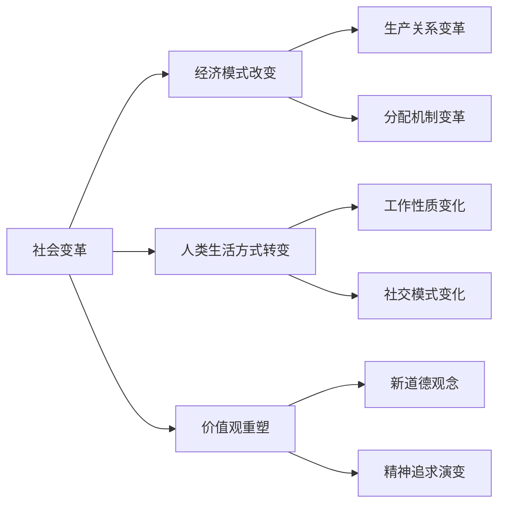

                 

# 欲望的去物质化：AI时代的精神追求

> 关键词：AI时代、精神追求、欲望去物质化、价值观变革、经济模式、生活质量、社会治理、教育变革、人类未来

> 摘要：本文探讨了AI时代背景下，人类社会从物质需求转向精神需求的趋势，即欲望的去物质化。文章从社会变革、经济模式、生活方式、社会治理等多个维度分析了AI对人类欲望去物质化的影响，并提出了人类在AI时代的精神追求方向，旨在为未来社会发展提供参考。

## 第1章 引言

### 1.1 AI时代的社会变革

随着人工智能技术的快速发展，社会正在经历着一场前所未有的变革。这种变革不仅仅体现在技术层面，更深刻地影响着经济模式、人类生活方式和价值观的塑造。为了更直观地展示这些变化，我们可以使用Mermaid流程图来梳理一下AI时代社会变革的各个方面。

**Mermaid流程图：**



### 1.2 欲望的去物质化定义

欲望的去物质化，指的是从传统的物质需求转向精神需求，强调非物质的满足和幸福感。在AI时代，随着技术的发展，人们有更多机会追求精神层面的满足，从而提升幸福感。这种转变不仅体现在个体的心理需求上，也反映在社会层面，影响着经济模式、生活方式和价值观念的变革。

### 1.3 欲望的去物质化对人类的影响

在AI时代，欲望的去物质化对人类有着深远的影响。我们可以通过一个简单的数学模型来描述这种影响：

$$
\text{幸福感} = f(\text{物质满足度}, \text{精神满足度})
$$

其中，物质满足度和精神满足度的比例关系对幸福感有直接影响。在AI时代，随着技术的发展，人们有更多机会追求精神满足，从而提升幸福感。

**详细讲解：**

物质满足度主要衡量人们对物质需求的满足程度，如收入、财富、物质条件等。精神满足度则衡量人们对精神需求的满足程度，如情感、自我实现、精神富足等。在传统社会，物质满足度通常是幸福感的核心指标，而在AI时代，随着人们价值观的变化，精神满足度的重要性日益凸显。

举例来说，在传统社会，人们可能追求更高的收入和物质财富。而在AI时代，随着人们价值观的变化，他们可能更注重精神层面的满足，如艺术创作、自我实现等。这种转变不仅影响了人们的生活方式和消费习惯，也深刻地改变了社会经济的运行模式。

### 1.4 欲望的去物质化案例分析

为了更好地理解欲望的去物质化，我们可以通过一些具体的案例来进行分析。

#### 案例一：共享经济

共享经济是AI时代欲望去物质化的一种典型体现。以Uber和Airbnb为代表的共享经济平台，通过互联网技术实现了闲置资源的共享，降低了消费成本，提高了资源利用效率。这种模式不仅满足了人们的物质需求，更提升了精神满足度，让人们感受到共享带来的价值。

#### 案例二：远程办公

远程办公是AI时代工作形态的一种创新，它打破了地域限制，让员工可以根据个人兴趣和能力选择工作时间和地点。这种工作模式不仅提高了工作效率，还满足了人们的精神需求，如自由、灵活和自我管理。远程办公的成功实践，反映了AI时代人类在追求物质满足的同时，更加注重精神满足。

#### 案例三：个性化学习

个性化学习是AI时代教育变革的一个重要方向。通过大数据和人工智能技术，教育机构可以为学生提供个性化的学习方案，满足他们的个性化需求。这种教育模式不仅提高了学习效果，还满足了学生的精神需求，如自我实现、成就感等。

### 1.5 欲望的去物质化与社会发展的关系

欲望的去物质化不仅是AI时代的一个现象，更是社会发展的一种趋势。它对人类社会的可持续发展、经济模式的创新和人类生活方式的变革都有着深远的影响。

首先，欲望的去物质化有助于推动社会可持续发展。在传统社会，过度追求物质财富往往导致资源浪费和环境破坏。而在AI时代，人们更加注重精神满足，有利于减少对物质资源的依赖，实现资源的高效利用和优化配置。

其次，欲望的去物质化推动了经济模式的创新。以共享经济为代表的AI时代经济模式，不仅提高了资源利用效率，还创造了新的经济增长点，推动了经济的可持续发展。

最后，欲望的去物质化改变了人类的生活方式。在AI时代，人们有更多机会追求精神满足，如艺术创作、自我实现等。这种生活方式的变化，不仅提升了人们的幸福感，还有助于培养创新精神和创业精神，推动社会的进步和发展。

总之，欲望的去物质化是AI时代人类社会发展的必然趋势。它不仅影响着人们的日常生活，还深刻地改变了社会经济的运行模式。在未来的发展中，我们需要关注欲望的去物质化，推动社会的可持续发展，实现人类的精神追求。

### 总结

在本章中，我们介绍了AI时代的社会变革，分析了欲望的去物质化的定义及其对人类的影响，并通过具体案例展示了欲望去物质化的实践。在接下来的章节中，我们将进一步探讨AI时代经济模式的变化、人类生活方式的演变以及社会治理的创新，深入剖析AI时代的精神追求与人类未来的发展路径。希望通过这些分析，能够帮助读者更好地理解AI时代的社会变革，为未来的发展提供有益的启示。

### 第一部分：欲望的去物质化原理探讨

#### 第1章: 引言

##### 1.1 AI时代的社会变革

在探讨欲望的去物质化之前，我们需要先了解AI时代的社会变革。人工智能（AI）技术的飞速发展，不仅改变了人类的生活方式，也带来了深刻的社会变革。这些变革主要体现在以下几个方面：

- **经济模式改变**：人工智能技术推动了生产力的提升，使得生产方式从传统的劳动力密集型向智能化、自动化转变。这种变化不仅提高了生产效率，也改变了经济运行的逻辑，使得资源分配更加优化，经济结构更加合理。

- **人类生活方式转变**：人工智能技术极大地改变了人们的日常生活。从智能家居到在线购物，从远程办公到虚拟现实，人工智能正在重新定义人们的生活方式，使得生活更加便捷、舒适。

- **价值观重塑**：随着技术的发展，人们对幸福的定义也在发生改变。过去，人们追求的物质财富和地位成为衡量幸福的主要标准。而在AI时代，人们更加注重精神层面的满足，如情感、自我实现、生活品质等。

- **生产关系变革**：人工智能技术的普及，使得生产关系的形态发生了变化。传统的雇佣关系逐渐被合作关系所取代，个体在工作和生产中的角色和地位也在不断变化。

- **分配机制变革**：在AI时代，随着生产力的提高，社会分配机制也在发生变化。如何公平、合理地分配社会财富，成为社会亟待解决的问题。

- **工作性质变化**：人工智能技术的应用，使得许多传统工作面临被取代的风险。同时，新的工作机会也在不断涌现，这些工作更加注重人的创造性、协作性和学习能力。

- **社交模式变化**：互联网和人工智能技术的发展，改变了人们的社交模式。从面对面的交流到线上互动，社交的便捷性和多样性得到了极大的提升。

- **新道德观念**：随着技术的发展，人们对道德和伦理的认识也在不断更新。例如，人工智能伦理、数据隐私等问题，成为新的道德挑战。

- **精神追求演变**：在AI时代，人们的精神追求也在发生演变。从追求物质满足到追求精神富足，人们开始更加关注内心的需求和价值的实现。

这些社会变革不仅改变了人们的生产和生活方式，也对欲望的去物质化产生了深远的影响。在下一节中，我们将深入探讨欲望的去物质化的定义及其对人类的影响。

### 1.2 欲望的去物质化定义

欲望的去物质化是一个复杂的概念，它涉及到人类对欲望的理解、满足和追求。在传统社会中，人们的欲望主要集中在物质层面，如财富、地位、物质享受等。然而，随着人工智能技术的不断发展，人们开始意识到物质欲望并非是幸福和满足的唯一来源，精神层面的需求同样重要。

#### 核心概念与联系

- **去物质化**：指的是从传统的物质需求转向精神需求，强调非物质的满足和幸福感。在去物质化的过程中，人们不再仅仅追求物质财富和物质享受，而是更加关注精神层面的满足，如情感、自我实现、内心平和等。

- **物质欲望**：指的是人们对于物质财富的渴望和追求。在传统社会中，物质欲望是人们追求幸福和生活质量的主要动力。

- **精神满足度**：衡量人们对精神需求的满足程度。精神满足度越高，人们的生活质量越高。

- **物质满足度**：衡量人们对物质需求的满足程度。物质满足度越高，人们的幸福感越高。

#### 去物质化的定义

去物质化是指在现代社会中，人们逐渐减少对物质财富的过度依赖，转向追求精神层面的满足和幸福感。这种转变不仅体现在个人的价值观上，也反映在社会层面，影响着经济模式、生活方式和价值观念的变革。

去物质化强调的是从外在的物质需求转向内在的精神需求。在传统社会中，物质财富往往被视为衡量一个人成功和幸福的主要标准。然而，随着人们生活水平的提高，他们开始意识到，仅仅拥有物质财富并不能带来真正的幸福和满足。相反，精神层面的满足，如情感、自我实现、内心平和等，才是真正能够持久和深刻影响人们幸福感的重要因素。

#### 去物质化的影响

去物质化对人类的影响是多方面的，包括以下几个方面：

1. **经济模式**：去物质化改变了传统的经济模式，使得人们更加注重服务业和精神产业的发展。例如，教育、医疗、文化艺术等领域的需求逐渐增加，成为推动经济增长的重要动力。

2. **生活方式**：去物质化改变了人们的生活方式，使得人们更加注重生活的质量，而不是单纯的物质积累。人们开始追求健康、环保、有意义的生活方式，如慢生活、生态旅游等。

3. **价值观**：去物质化影响了人们的价值观，使得人们更加关注内在的幸福感，而不是外在的物质财富。人们开始反思传统的成功标准，追求更加全面和平衡的生活。

4. **社会结构**：去物质化也影响了社会结构，使得社会更加多元化和包容。人们不再仅仅追求物质上的成功，而是追求内心的满足和精神的富足。

### 欲望去物质化的现实案例

为了更好地理解欲望的去物质化，我们可以通过一些现实案例来进行分析。

#### 案例一：共享经济

共享经济是欲望去物质化的一种典型体现。以Uber和Airbnb为代表的共享经济平台，通过互联网技术实现了闲置资源的共享，降低了消费成本，提高了资源利用效率。这种模式不仅满足了人们的物质需求，还满足了人们的精神需求，如社交、自由、自我实现等。

#### 案例二：个性化学习

个性化学习是AI时代教育变革的一个重要方向。通过大数据和人工智能技术，教育机构可以为学生提供个性化的学习方案，满足他们的个性化需求。这种教育模式不仅提高了学习效果，还满足了学生的精神需求，如自我实现、成就感等。

#### 案例三：远程办公

远程办公是AI时代工作形态的一种创新，它打破了地域限制，让员工可以根据个人兴趣和能力选择工作时间和地点。这种工作模式不仅提高了工作效率，还满足了人们的精神需求，如自由、灵活和自我管理。

通过这些案例，我们可以看到，欲望的去物质化不仅是一种社会现象，也是一种生活方式和价值观念的变革。在未来的发展中，随着人工智能技术的进一步普及，欲望的去物质化将会更加普遍和深入，对人类社会产生深远的影响。

### 1.3 欲望的去物质化对人类的影响

欲望的去物质化对人类的影响是多方面的，它不仅改变了人们的消费行为，也深刻地影响了经济模式、社会结构以及人类的生活方式。以下将从数学模型的角度进行分析，并结合具体案例来阐述这种影响。

#### 数学模型

为了更好地理解欲望的去物质化对人类的影响，我们可以构建一个简单的数学模型：

$$
\text{幸福感} = f(\text{物质满足度}, \text{精神满足度})
$$

在这个模型中，物质满足度和精神满足度是影响幸福感的两个关键因素。物质满足度衡量人们对物质需求的满足程度，如收入、财富、物质条件等；精神满足度则衡量人们对精神需求的满足程度，如情感、自我实现、内心平和等。

#### 物质满足度与精神满足度的关系

在传统社会，物质满足度往往是幸福感的主要决定因素。人们通过追求物质财富来提高生活水平，满足基本的生活需求。然而，随着社会的进步和人们价值观的变化，精神满足度在幸福感中的地位日益提升。

根据上述数学模型，我们可以得出以下结论：

1. **物质满足度对幸福感的影响**：物质满足度越高，幸福感越强。这是因为物质财富能够提供基本的生活保障，满足人们的生理和心理需求。

2. **精神满足度对幸福感的影响**：精神满足度对幸福感的影响同样重要，甚至可能超过物质满足度。在AI时代，人们开始更加关注精神层面的需求，如情感交流、自我实现、内心平和等。这些需求在提升幸福感方面具有重要作用。

3. **物质满足度与精神满足度的平衡**：在理想情况下，物质满足度和精神满足度应达到一个平衡状态，即两者对幸福感的影响相当。在这种情况下，人们的幸福感最高。

#### 案例分析

为了更好地说明欲望的去物质化对人类的影响，我们可以通过一些具体案例来进行分析。

#### 案例一：共享经济

共享经济是欲望去物质化的一种典型体现。以Uber和Airbnb为代表的共享经济平台，通过互联网技术实现了闲置资源的共享，降低了消费成本，提高了资源利用效率。这种模式不仅满足了人们的物质需求，还满足了人们的精神需求，如社交、自由、自我实现等。

**物质满足度**：共享经济平台为用户提供了一种新的消费方式，使得他们能够更便宜地获得所需的服务。例如，通过Uber，用户可以以更低的成本获得便捷的出行服务；通过Airbnb，用户可以以更低的价格预订到满意的住宿。

**精神满足度**：共享经济平台不仅提供了物质满足，还满足了人们的精神需求。例如，用户在使用Uber时，可以结识来自不同地方的人，拓宽社交圈；在使用Airbnb时，可以体验到不同文化背景下的生活方式，丰富自己的生活经历。

#### 案例二：个性化学习

个性化学习是AI时代教育变革的一个重要方向。通过大数据和人工智能技术，教育机构可以为学生提供个性化的学习方案，满足他们的个性化需求。这种教育模式不仅提高了学习效果，还满足了学生的精神需求，如自我实现、成就感等。

**物质满足度**：个性化学习为学生提供了更加灵活和高效的学习方式，使得他们能够更好地掌握知识，提高学业成绩。这种学习模式为学生的未来发展提供了物质保障。

**精神满足度**：个性化学习不仅提高了学生的学习成绩，还满足了他们的精神需求。例如，通过个性化学习，学生可以找到适合自己的学习方式，提高学习兴趣和动力；通过实现自我目标，学生可以感受到成就感和自我价值的实现。

#### 案例三：远程办公

远程办公是AI时代工作形态的一种创新，它打破了地域限制，让员工可以根据个人兴趣和能力选择工作时间和地点。这种工作模式不仅提高了工作效率，还满足了人们的精神需求，如自由、灵活和自我管理。

**物质满足度**：远程办公为员工提供了更加灵活的工作方式，使得他们能够更好地平衡工作和生活，提高生活质量。例如，员工可以根据自己的需求选择工作时间和地点，降低通勤成本和时间。

**精神满足度**：远程办公不仅提供了物质满足，还满足了员工的精神需求。例如，员工可以更加自由地安排自己的工作，提高工作效率和满意度；通过远程办公，员工可以与团队成员保持良好的沟通和协作，增强团队凝聚力。

通过以上案例分析，我们可以看到欲望的去物质化对人类的影响是多方面的。在AI时代，随着技术的发展，人们有更多机会追求精神满足，从而提升幸福感。因此，在未来的发展中，我们需要更加关注欲望的去物质化，探索如何在物质和精神之间实现平衡，为人类的可持续发展提供动力。

### 1.4 欲望的去物质化案例分析

为了更直观地理解欲望的去物质化，我们可以通过一些具体案例来探讨这一现象。以下是几个典型的案例，展示了欲望的去物质化在不同领域和层面的实践。

#### 案例一：艺术创作

艺术创作是欲望去物质化的一个重要领域。在过去，艺术家往往追求的是物质上的成功和认可，如获得高价的画作、参加重要的展览等。然而，随着时代的变迁，越来越多的艺术家开始关注精神层面的满足。他们通过创作来表达自己的内心世界，实现自我价值的实现。

**物质满足度**：在艺术市场中，一些著名艺术家的作品价格极高，如毕加索、达芬奇的画作。这些高价格反映了艺术家的物质成功。

**精神满足度**：然而，对于许多当代艺术家来说，他们更注重的是创作过程中的自我表达和精神的富足。例如，波普艺术大师安迪·沃霍尔的创作，虽然他在生前并未获得极高的商业成功，但他的艺术作品却在死后成为现代艺术的经典之作。这种精神满足体现了艺术家对内心世界的探索和对人类情感的共鸣。

**详细讲解**：艺术创作过程中的精神满足往往来自于艺术家的自我实现和对人类情感的深刻理解。他们通过创作来表达自己的内心世界，这种表达不仅对艺术家本人有深远的影响，也能引起观众的共鸣，从而实现精神层面的满足。

**举例说明**：例如，波洛克（Pollock）的抽象表现主义作品，他通过自由流畅的笔触和色彩表达内心的情感和力量。尽管他的作品在生前并未获得广泛认可，但他在艺术史上的地位和影响力却是无可争议的。

#### 案例二：共享经济

共享经济是欲望去物质化的另一个典型领域。以Uber和Airbnb为代表的共享经济平台，通过互联网技术实现了闲置资源的共享，降低了消费成本，提高了资源利用效率。

**物质满足度**：共享经济为用户提供了更便宜和便捷的服务。例如，通过Uber，用户可以以较低的成本获得高质量的出行服务；通过Airbnb，用户可以以较低的价格预订到满意的住宿。

**精神满足度**：共享经济不仅满足了用户的物质需求，还满足了他们的精神需求。例如，用户在使用Uber时，可以结识来自不同地方的人，拓宽社交圈；在使用Airbnb时，可以体验到不同文化背景下的生活方式，丰富自己的生活经历。

**详细讲解**：共享经济通过提供多样化的服务，不仅满足了用户的物质需求，还为他们提供了更多机会去体验和探索不同的生活方式。这种体验和探索带来了精神层面的满足，使得用户在追求物质满足的同时，也能获得丰富的精神体验。

**举例说明**：例如，Airbnb平台上的用户，通过预订不同文化背景下的住宿，可以深入了解当地的历史、文化和风土人情，这种体验对用户的精神满足有着重要的影响。

#### 案例三：志愿服务

志愿服务是欲望去物质化的另一个重要领域。许多人参与志愿服务，并非为了获得物质回报，而是为了实现自我价值，帮助他人，促进社会和谐。

**物质满足度**：志愿服务通常不涉及直接的物质回报，参与者并不期望从中获得金钱或其他物质利益。

**精神满足度**：然而，志愿服务对参与者来说，是一种深刻的内心满足。通过帮助他人，参与者感受到了自己的价值和存在意义，这种精神满足是金钱无法替代的。

**详细讲解**：志愿服务不仅能够提升参与者的幸福感，还能增强他们的社会责任感和归属感。这种精神层面的满足，对个人的心理健康和社会适应能力有着积极的影响。

**举例说明**：例如，在疫情期间，许多志愿者积极参与社区服务，帮助分发物资、为需要帮助的人们提供心理支持。他们的行为不仅帮助了他人，也为自己带来了精神上的满足和成就感。

通过以上案例，我们可以看到欲望的去物质化在不同领域和层面的具体实践。在AI时代，随着技术的发展，人们有更多机会追求精神层面的满足，实现自我价值和社会贡献。这种趋势不仅改变了人们的生活方式，也对社会的经济结构和社会治理产生了深远的影响。

### 1.5 欲望的去物质化与社会发展的关系

欲望的去物质化不仅是个人生活方式的变化，更是社会发展的重要趋势。它深刻地影响着经济模式、社会结构以及人类生活方式的变革。以下将从多个维度分析欲望的去物质化与社会发展的关系。

#### 对经济模式的影响

1. **产业结构的调整**：随着欲望的去物质化，服务业和精神产业得到了快速发展。例如，教育、医疗、文化艺术等领域的需求不断增加，成为经济增长的重要动力。

2. **消费模式的转变**：人们开始更加关注精神消费，如旅游、教育培训、文化娱乐等。这种转变推动了消费结构的升级，促进了消费市场的多元化发展。

3. **生产方式的变革**：企业开始注重产品的精神价值，如设计、品牌、用户体验等。这种变革推动了生产方式的创新，使得产品更加符合消费者的精神需求。

#### 对社会结构的影响

1. **社会阶层的重构**：在传统社会中，物质财富是划分社会阶层的主要标准。然而，随着欲望的去物质化，人们开始更加关注精神层面的满足，如教育、文化、价值观等。这种变化导致社会阶层更加多元化，不同社会阶层之间的差距逐渐缩小。

2. **社区关系的强化**：在AI时代，人们有更多机会参与社区活动，如志愿服务、文化活动等。这些活动不仅增强了社区凝聚力，也促进了社会成员之间的情感交流和互动。

3. **社会网络的扩展**：互联网和社交媒体的发展，使得人们有更多机会建立和维护社交关系。这种变化不仅改变了人们的社交模式，也促进了社会网络的形成和发展。

#### 对人类生活方式的影响

1. **生活质量的提升**：欲望的去物质化使得人们更加注重生活品质，如健康、环保、自我实现等。这种变化促进了人们对健康生活方式的追求，提高了整体的生活质量。

2. **工作方式的变革**：远程办公、灵活工作等新型工作模式逐渐普及，人们可以更加自由地安排工作和生活。这种变化不仅提高了工作效率，也满足了人们的个性化需求。

3. **价值观的重塑**：在AI时代，人们开始更加关注精神层面的需求，如情感、自我实现、内心平和等。这种变化导致人们的价值观发生转变，从追求物质财富转向追求精神富足。

#### 对社会治理的影响

1. **治理模式的创新**：随着欲望的去物质化，社会治理模式也在不断创新。例如，智慧治理、参与式治理等新型治理模式应运而生，提高了社会治理的效率和质量。

2. **社会参与度的提升**：在AI时代，人们有更多机会参与社会治理，如通过网络平台表达自己的意见、参与社区治理等。这种变化提高了社会的民主程度和参与度。

3. **公共服务的优化**：随着技术的发展，政府和社会组织可以更加精准地提供公共服务，满足人们的精神需求。这种变化提高了公共服务的质量和效率。

总之，欲望的去物质化是AI时代社会发展的必然趋势。它不仅改变了人们的消费行为和生活习惯，也深刻地影响着经济模式、社会结构和治理方式。在未来的发展中，我们需要关注欲望的去物质化，推动社会的可持续发展，实现人类的精神追求。

### 第2章: AI对经济模式的影响

#### 2.1 AI时代的经济模式

人工智能（AI）技术的迅猛发展，正在深刻地改变经济模式，推动着经济从传统模式向智能化、自动化、高效化转变。在AI时代，经济模式发生了显著变化，主要体现在以下几个方面：

##### 分散式经济

分散式经济是指基于人工智能和区块链技术，实现去中心化的经济模式。在分散式经济中，权力的集中度降低，信息的透明度提高，交易的成本和风险降低，从而实现更加高效和公正的经济运行。

- **核心概念与联系**：区块链技术提供了去中心化的账本系统，使得交易无需依赖中心化的第三方机构。人工智能则通过智能合约等技术，实现了自动化和高效化的交易流程。

- **案例分析**：比特币和以太坊等加密货币的成功，正是分散式经济的典型案例。这些加密货币通过区块链技术实现了去中心化的金融交易，降低了交易成本和风险。

##### 共享经济

共享经济是指通过共享平台和物联网技术，实现资源的共享和优化配置。共享经济不仅提高了资源利用效率，还改变了人们的消费观念和生活方式。

- **核心概念与联系**：共享经济平台通过物联网技术，实现了闲置资源的实时共享和动态配置。例如，Uber、Airbnb等平台，通过互联网技术，实现了交通和住宿资源的共享。

- **案例分析**：Uber和Airbnb的成功，正是共享经济在AI时代的具体应用。这些平台通过互联网和人工智能技术，提高了资源利用效率，降低了消费成本，改变了人们的出行和居住方式。

##### 智能化供应链

智能化供应链是指通过人工智能技术，实现供应链的自动化、智能化和高效化。在智能化供应链中，数据和信息流更加畅通，供应链各环节的协调更加高效，从而提高整个供应链的运行效率。

- **核心概念与联系**：人工智能技术通过数据分析和机器学习，实现了供应链的预测、优化和自动化。物联网技术则通过传感器和设备，实现了供应链的实时监控和智能调度。

- **案例分析**：亚马逊的智能供应链管理，是智能化供应链的典型代表。亚马逊通过大数据分析和人工智能技术，实现了库存的精准预测、物流的智能调度，从而提高了供应链的整体效率。

##### 智慧城市经济

智慧城市经济是指通过人工智能技术，实现城市经济的智能化、高效化和可持续发展。智慧城市经济不仅提高了城市的管理水平和居民的生活质量，还推动了城市经济的创新和发展。

- **核心概念与联系**：人工智能技术通过大数据分析和物联网技术，实现了城市管理的智能化和精细化。智慧城市经济通过优化资源配置、提高公共服务水平，实现了城市经济的可持续发展。

- **案例分析**：新加坡的智慧城市建设，是智慧城市经济的典型案例。新加坡通过大数据和人工智能技术，实现了城市交通、环境、安全等领域的智能化管理，提高了城市的运行效率和生活质量。

总之，AI时代的经济模式正在从传统的集中式、依赖人工的模式，向分散式、智能化、高效化的模式转变。这种转变不仅提高了经济运行的效率，也促进了社会的可持续发展。在未来的发展中，我们需要进一步推动AI技术在经济领域的应用，实现经济模式的深度变革。

#### 2.2 AI对生产关系的影响

人工智能技术的快速发展，不仅改变了经济模式，也对生产关系产生了深远的影响。生产关系是指在生产过程中，劳动者、资本家、企业等各方之间的权力、利益和责任关系。在AI时代，随着技术的进步，生产关系正在发生显著变化。

##### 核心概念与联系

- **生产关系**：生产关系是指在生产过程中，劳动者、资本家、企业等各方之间的权力、利益和责任关系。传统生产关系主要依赖于人力和资本，而在AI时代，生产关系将更加依赖于知识和技术。

- **劳动价值**：劳动价值是指劳动者在生产过程中所创造的价值。在AI时代，劳动价值的衡量方式发生了变化，不再仅仅依赖于劳动时间和劳动强度，而是更加依赖于知识贡献和创新能力。

##### 数学模型

为了更好地理解AI对生产关系的影响，我们可以构建一个简单的数学模型：

$$
\text{劳动价值} = f(\text{知识贡献度}, \text{技能贡献度})
$$

其中，知识贡献度和技能贡献度是影响劳动价值的关键因素。

- **知识贡献度**：知识贡献度是指劳动者在知识创造和应用方面的贡献。在AI时代，随着技术的进步，知识贡献度在劳动价值中的比重逐渐增加。

- **技能贡献度**：技能贡献度是指劳动者在技能提升和创新能力方面的贡献。在AI时代，技能贡献度对劳动价值的影响也日益显著。

##### 详细讲解

在传统生产关系中，劳动价值主要取决于劳动时间和劳动强度。然而，在AI时代，随着技术的进步，劳动价值的衡量方式发生了显著变化。

1. **知识贡献度的提升**：在AI时代，知识的积累和创新成为生产过程中至关重要的因素。劳动者需要不断学习新知识，提升自己的知识水平，以适应快速变化的工作环境。知识贡献度越高，劳动者在劳动价值中的地位越高。

   例如，一个软件工程师，如果他能够在短时间内掌握并应用新的编程技术，为公司开发出具有创新性的软件产品，那么他的劳动价值就会显著提升。

2. **技能贡献度的提升**：在AI时代，技能贡献度对劳动价值的影响也日益显著。劳动者需要不断提升自己的技能，如编程能力、数据分析能力、创新能力等，以适应自动化和智能化生产的要求。

   例如，一个数据分析师，如果他能够利用大数据技术和机器学习算法，为公司提供精准的数据分析和决策支持，那么他的劳动价值就会显著提升。

通过上述数学模型，我们可以看到，在AI时代，劳动价值不仅取决于劳动时间和劳动强度，更取决于知识贡献度和技能贡献度。这种变化对劳动者提出了更高的要求，也为我们理解和分析AI时代的生产关系提供了新的视角。

##### 举例说明

为了更好地说明AI对生产关系的影响，我们可以通过一些具体的例子来进行分析。

1. **例子一：智能制造**：在智能制造领域，AI技术的应用使得生产过程更加自动化和智能化。例如，通过机器人和自动化生产线，企业可以在短时间内完成大量生产任务。在这种情况下，劳动者的劳动价值不仅取决于他们的工作时间和劳动强度，更取决于他们的技能水平和知识贡献度。

   例如，一个智能制造工程师，如果他能够熟练掌握各种智能制造技术，并能够为公司开发出高效的智能制造方案，那么他的劳动价值就会显著提升。

2. **例子二：电子商务**：在电子商务领域，AI技术的应用使得消费者能够更加便捷地购物。例如，通过智能推荐系统和智能客服，电商平台可以提供个性化的购物体验。在这种情况下，劳动者的劳动价值不仅取决于他们的服务质量和工作效率，更取决于他们的创新能力。

   例如，一个电子商务平台的产品经理，如果他能够通过大数据分析和人工智能算法，为公司提供精准的市场分析和产品推荐，那么他的劳动价值就会显著提升。

通过以上分析，我们可以看到，在AI时代，生产关系正在发生深刻变化。劳动者需要不断学习新知识，提升自己的技能水平，以适应快速变化的工作环境。这种变化不仅对劳动者提出了更高的要求，也为生产关系的变革提供了新的契机。

#### 2.3 AI对分配机制的影响

人工智能（AI）技术的快速发展，不仅改变了经济模式和生产关系，也深刻地影响着分配机制。在AI时代，随着生产力的提高和技术的进步，如何公平、合理地分配社会财富成为一个重要的课题。以下将从核心概念、数学模型和具体案例分析三个方面，详细探讨AI对分配机制的影响。

##### 核心概念与联系

- **分配机制**：分配机制是指社会财富在社会成员之间的分配方式。传统的分配机制主要依赖于劳动收入、资本收益和政府干预等手段。在AI时代，随着技术的进步，分配机制需要适应新的经济模式和社会结构。

- **劳动收入**：劳动收入是指劳动者通过劳动力市场获得的收入。在传统经济模式中，劳动收入主要取决于劳动时间和劳动强度。然而，在AI时代，劳动收入的分配方式发生了变化，更加依赖于知识贡献度和创新能力。

- **资本收益**：资本收益是指资本所有者通过资本投资获得的收益。在AI时代，资本收益的分配方式也发生了变化，更加依赖于资本的创造力和技术创新能力。

- **政府干预**：政府干预是指政府通过税收、补贴、法规等手段，对分配机制进行调节和干预。在AI时代，政府干预的方式和手段也需要适应新的经济模式和社会结构。

##### 数学模型

为了更好地理解AI对分配机制的影响，我们可以构建一个简单的数学模型：

$$
\text{总收入} = f(\text{劳动收入}, \text{资本收益}, \text{政府干预})
$$

在这个模型中，劳动收入、资本收益和政府干预是影响总收入的关键因素。

- **劳动收入**：劳动收入取决于劳动者的知识贡献度和技能贡献度。在AI时代，劳动收入更加依赖于知识贡献度和创新能力。

- **资本收益**：资本收益取决于资本的创造力和技术创新能力。在AI时代，资本收益的分配更加依赖于资本的创造力和技术创新能力。

- **政府干预**：政府干预通过税收、补贴、法规等手段，对劳动收入和资本收益进行调节，以实现社会财富的公平分配。

##### 详细讲解

在AI时代，随着生产力的提高和技术的进步，分配机制面临着新的挑战和机遇。以下从劳动收入、资本收益和政府干预三个方面，详细分析AI对分配机制的影响。

1. **劳动收入的变化**：在传统经济模式中，劳动收入主要取决于劳动时间和劳动强度。然而，在AI时代，劳动收入的分配方式发生了变化，更加依赖于知识贡献度和创新能力。例如，一个高级软件工程师，如果他能够为公司开发出创新性的软件产品，那么他的劳动收入就会显著提高。

   通过数学模型，我们可以看到：

   $$
   \text{劳动收入} = f(\text{知识贡献度}, \text{技能贡献度})
   $$

   其中，知识贡献度和技能贡献度是影响劳动收入的关键因素。在AI时代，劳动者需要不断学习新知识，提升自己的技能水平，以适应快速变化的工作环境。

2. **资本收益的变化**：在传统经济模式中，资本收益主要依赖于资本的投入和运营。然而，在AI时代，资本收益的分配方式发生了变化，更加依赖于资本的创造力和技术创新能力。例如，一个科技创新企业，如果他能够开发出具有市场前景的科技创新产品，那么他的资本收益就会显著提高。

   通过数学模型，我们可以看到：

   $$
   \text{资本收益} = f(\text{资本创造力}, \text{技术创新能力})
   $$

   其中，资本创造力和技术创新能力是影响资本收益的关键因素。在AI时代，资本所有者需要具备较强的创造力和创新能力，以适应快速变化的市场环境。

3. **政府干预的变化**：在传统经济模式中，政府干预主要通过税收、补贴、法规等手段，对劳动收入和资本收益进行调节。然而，在AI时代，政府干预的方式和手段也需要适应新的经济模式和社会结构。例如，政府可以通过税收政策，对高收入人群进行调节，以实现收入分配的公平；通过补贴政策，支持科技创新和创业活动，以促进经济的可持续发展。

   通过数学模型，我们可以看到：

   $$
   \text{政府干预} = f(\text{税收政策}, \text{补贴政策}, \text{法规政策})
   $$

   其中，税收政策、补贴政策和法规政策是影响政府干预效果的关键因素。在AI时代，政府需要制定更加科学和合理的税收、补贴和法规政策，以适应新的经济模式和社会结构。

##### 案例分析

为了更好地说明AI对分配机制的影响，我们可以通过一些具体的案例进行分析。

1. **案例一：科技创新企业**：在科技创新领域，一个企业能否获得高回报，不仅取决于其技术创新能力，也取决于其资本所有者的创造力。例如，谷歌和特斯拉等科技创新企业，之所以能够在短时间内实现高速发展，不仅依赖于其强大的技术创新能力，也依赖于其资本所有者的强烈创新意愿和风险承担能力。

   通过数学模型，我们可以看到：

   $$
   \text{资本收益} = f(\text{资本创造力}, \text{技术创新能力})
   $$

   其中，资本创造力和技术创新能力是影响资本收益的关键因素。在AI时代，科技创新企业需要具备强大的创造力和技术创新能力，以实现资本的快速增值。

2. **案例二：共享经济平台**：在共享经济领域，一个平台能否实现高效运营，不仅取决于其技术平台的先进性，也取决于其管理团队的创新能力和市场洞察力。例如，Uber和Airbnb等共享经济平台，之所以能够在短时间内实现全球扩张，不仅依赖于其先进的技术平台，也依赖于其管理团队的创新能力和市场开拓能力。

   通过数学模型，我们可以看到：

   $$
   \text{平台收益} = f(\text{技术创新能力}, \text{市场洞察力})
   $$

   其中，技术创新能力和市场洞察力是影响平台收益的关键因素。在AI时代，共享经济平台需要具备强大的技术创新能力和市场洞察力，以实现平台的高效运营和持续发展。

3. **案例三：智慧城市治理**：在智慧城市治理领域，一个城市的可持续发展，不仅取决于其基础设施建设，也取决于其管理团队的智慧和创新能力。例如，新加坡等智慧城市，之所以能够在全球范围内取得成功，不仅依赖于其先进的基础设施建设，也依赖于其管理团队的智慧和创新能力。

   通过数学模型，我们可以看到：

   $$
   \text{城市管理效率} = f(\text{技术创新能力}, \text{管理智慧})
   $$

   其中，技术创新能力和管理智慧是影响城市管理效率的关键因素。在AI时代，智慧城市治理需要具备强大的技术创新能力和管理智慧，以实现城市的高效治理和可持续发展。

通过以上案例分析，我们可以看到，AI时代对分配机制产生了深远的影响。在新的经济模式和社会结构下，劳动收入、资本收益和政府干预都需要适应新的变化，以实现社会财富的公平、合理分配。在未来的发展中，我们需要进一步研究和探讨AI对分配机制的影响，制定科学合理的政策和措施，以促进社会的可持续发展。

### 第3章: AI时代的人类生活方式变化

#### 3.1 生活质量的提升

在AI时代，随着技术的进步，人们的生活质量得到了显著提升。这种提升不仅体现在物质层面，也体现在精神层面。以下是几个关键因素，详细讲解AI时代如何通过技术进步提升人们的生活质量。

##### 3.1.1 智能家居

智能家居是AI技术在生活中最直观的应用之一。通过物联网（IoT）和人工智能技术，智能家居系统能够实现家电设备的智能控制，提高生活的便捷性和舒适度。例如，智能灯光系统可以根据人的活动和光线条件自动调节亮度，智能空调系统可以根据室内外温度和湿度自动调节，智能安防系统可以实时监控家中的安全状况。

- **技术原理**：智能家居系统通常由多个传感器、控制器和通信模块组成。传感器负责收集环境数据（如光线、温度、湿度等），控制器根据这些数据通过人工智能算法做出决策，通信模块则将这些决策传递给相应的家电设备。

- **代码实现**：以下是一个简单的智能家居控制系统的伪代码示例：

  ```python
  # 定义智能家居系统类
  class SmartHome:
      def __init__(self):
          self.light = LightSensor()
          self.air_conditioner = AirConditioner()
          self.security_system = SecuritySystem()

      def control_home(self):
          # 根据光线传感器调节灯光
          if self.light.is_dark():
              self.light.turn_on()
          else:
              self.light.turn_off()

          # 根据温度和湿度传感器调节空调
          temperature = self.air_conditioner.get_temperature()
          humidity = self.air_conditioner.get_humidity()
          if temperature > 30 or humidity > 70:
              self.air_conditioner.turn_on()
          else:
              self.air_conditioner.turn_off()

          # 监控家中的安全状况
          if self.security_system.is_alarm():
              self.security_system.deactivate_alarm()

  # 定义传感器类
  class LightSensor:
      def is_dark(self):
          # 检测光线强度
          return False

  class AirConditioner:
      def get_temperature(self):
          # 获取当前温度
          return 25

      def get_humidity(self):
          # 获取当前湿度
          return 50

      def turn_on(self):
          # 打开空调
          print("Air conditioner turned on.")

      def turn_off(self):
          # 关闭空调
          print("Air conditioner turned off.")

  class SecuritySystem:
      def is_alarm(self):
          # 检测报警状态
          return False

      def deactivate_alarm(self):
          # 关闭报警
          print("Alarm deactivated.")
  ```

##### 3.1.2 健康监测

健康监测是另一个显著提升生活质量的领域。通过可穿戴设备和人工智能技术，人们可以实时监测自己的健康状况，如心率、血压、睡眠质量等。这些数据不仅可以用于预防疾病，还可以帮助人们改善生活方式，提高生活质量。

- **技术原理**：健康监测设备通常包括传感器、数据采集模块和人工智能算法。传感器负责实时采集身体数据，数据采集模块将这些数据传输到云端，人工智能算法则对数据进行处理和分析。

- **代码实现**：以下是一个简单的健康监测系统的伪代码示例：

  ```python
  # 定义健康监测系统类
  class HealthMonitor:
      def __init__(self):
          self.heart_rate_sensor = HeartRateSensor()
          self.blood_pressure_sensor = BloodPressureSensor()
          self.sleep_quality_analyzer = SleepQualityAnalyzer()

      def monitor_health(self):
          # 获取心率数据
          heart_rate = self.heart_rate_sensor.get_heart_rate()
          print(f"Heart rate: {heart_rate} bpm")

          # 获取血压数据
          blood_pressure = self.blood_pressure_sensor.get_blood_pressure()
          print(f"Blood pressure: {blood_pressure} mmHg")

          # 分析睡眠质量
          sleep_quality = self.sleep_quality_analyzer.analyze_sleep_quality()
          print(f"Sleep quality: {sleep_quality}")

  # 定义传感器类
  class HeartRateSensor:
      def get_heart_rate(self):
          # 获取当前心率
          return 75

  class BloodPressureSensor:
      def get_blood_pressure(self):
          # 获取当前血压
          return (120, 80)

  class SleepQualityAnalyzer:
      def analyze_sleep_quality(self):
          # 分析睡眠质量
          return "Good"
  ```

##### 3.1.3 个性化服务

个性化服务是AI时代另一个显著提升生活质量的领域。通过大数据分析和人工智能技术，服务提供商可以更好地理解用户的需求，提供个性化的产品和服务。例如，电商平台可以根据用户的购物历史和偏好，推荐最适合的产品；在线教育平台可以根据学生的学习进度和表现，提供个性化的学习建议。

- **技术原理**：个性化服务依赖于大数据分析和机器学习算法。大数据技术可以帮助服务提供商收集和分析大量用户数据，机器学习算法则可以从这些数据中提取规律，预测用户的需求和偏好。

- **代码实现**：以下是一个简单的个性化推荐系统的伪代码示例：

  ```python
  # 定义个性化推荐系统类
  class PersonalizedRecommender:
      def __init__(self):
          self.user_data = UserData()

      def recommend_products(self, user):
          # 根据用户数据推荐产品
          recommended_products = self.user_data.get_recommended_products(user)
          print(f"Recommended products for {user}: {recommended_products}")

  # 定义用户数据类
  class UserData:
      def __init__(self):
          self.user_profiles = {}

      def get_recommended_products(self, user):
          # 根据用户偏好推荐产品
          if user == "Alice":
              return ["Book", "Pen"]
          elif user == "Bob":
              return ["Music", "Sports"]
          else:
              return ["Food", "Fashion"]
  ```

通过智能家居、健康监测和个性化服务等多个方面的技术进步，AI时代显著提升了人们的生活质量。这些技术的应用不仅提高了生活的便捷性和舒适度，还帮助人们更好地管理自己的健康和生活，实现了生活质量的全面提升。

### 3.2 社交模式的变化

在AI时代，社交模式正在经历深刻的变革。传统面对面的社交方式逐渐被线上互动所取代，社交媒体和虚拟现实等新兴技术正在重新定义人们的社交行为和互动方式。以下是AI时代社交模式变化的几个关键因素和具体案例分析。

#### 3.2.1 社交媒体

社交媒体的兴起是AI时代社交模式变化的一个重要体现。平台如Facebook、Instagram、微博和微信等，极大地改变了人们的社交方式，使得社交变得更加便捷和多样。以下是一个简化的社交媒体社交模式的伪代码示例：

```python
class SocialMedia:
    def __init__(self):
        self.users = []
        self.posts = []

    def login(self, user):
        print(f"{user} has logged in.")

    def create_post(self, user, content):
        post = Post(user, content)
        self.posts.append(post)
        print(f"{user} has posted: {content}.")

    def comment_on_post(self, user, post_id, comment):
        post = self.posts[post_id]
        post.comments.append(comment)
        print(f"{user} has commented on post {post_id}: {comment}.")

class Post:
    def __init__(self, user, content):
        self.user = user
        self.content = content
        self.comments = []

# 社交媒体实例
social_media = SocialMedia()

# 用户登录
social_media.login("Alice")

# 用户发布帖子
social_media.create_post("Alice", "Just had the best lunch ever!")

# 用户评论帖子
social_media.comment_on_post("Bob", 0, "Nice food, where did you eat?")
```

#### 3.2.2 虚拟现实

虚拟现实（VR）技术为人们提供了全新的社交体验。通过VR头盔和配套设备，用户可以在虚拟世界中与朋友互动，体验身临其境的社交场景。以下是一个简单的虚拟现实社交模式的伪代码示例：

```python
class VirtualWorld:
    def __init__(self):
        self.users = []
        self.rooms = []

    def join_world(self, user):
        print(f"{user} has joined the virtual world.")

    def create_room(self, user, room_name):
        room = Room(user, room_name)
        self.rooms.append(room)
        print(f"{user} has created a room named {room_name}.")

    def enter_room(self, user, room_id):
        room = self.rooms[room_id]
        room.add_user(user)
        print(f"{user} has entered room {room_id}.")

class Room:
    def __init__(self, user, room_name):
        self.user = user
        self.room_name = room_name
        self.users = []

    def add_user(self, user):
        self.users.append(user)
        print(f"{user} has joined the room.")

# 虚拟现实实例
virtual_world = VirtualWorld()

# 用户加入虚拟世界
virtual_world.join_world("Alice")

# 用户创建房间
virtual_world.create_room("Alice", "Virtual Café")

# 用户进入房间
virtual_world.enter_room("Bob", 0)
```

#### 3.2.3 社交网络分析

AI技术的应用不仅改变了社交的方式，也使得社交网络分析成为可能。通过分析社交网络中的关系、内容和行为，可以深入了解社交模式的动态变化。以下是一个简单的社交网络分析的伪代码示例：

```python
class SocialNetwork:
    def __init__(self):
        self.users = {}
        self.edges = []

    def add_user(self, user):
        self.users[user] = []

    def add_edge(self, user1, user2):
        if user1 in self.users and user2 in self.users:
            self.users[user1].append(user2)
            self.users[user2].append(user1)
            self.edges.append((user1, user2))

    def analyze_network(self):
        for user, connections in self.users.items():
            print(f"{user} is connected to {connections}.")

# 社交网络实例
social_network = SocialNetwork()

# 添加用户
social_network.add_user("Alice")
social_network.add_user("Bob")
social_network.add_user("Charlie")

# 添加社交关系
social_network.add_edge("Alice", "Bob")
social_network.add_edge("Bob", "Charlie")
social_network.add_edge("Charlie", "Alice")

# 分析社交网络
social_network.analyze_network()
```

通过以上示例，我们可以看到AI时代社交模式的变化不仅体现在技术层面，也影响着人们的社交行为和互动方式。社交媒体、虚拟现实和社交网络分析等技术，使得社交变得更加多样化和智能化，同时也带来了新的挑战和机遇。

### 3.3 生活质量提升的数学模型

为了更深入地分析AI时代生活质量提升的影响因素，我们可以构建一个数学模型。该模型将生活质量（QoL）定义为物质满足度（MS）和精神满足度（MS）的函数。通过这个模型，我们可以定量地分析不同因素对生活质量的影响。

#### 数学模型

$$
\text{生活质量} = f(\text{物质满足度}, \text{精神满足度})
$$

其中，物质满足度（MS）和精神满足度（MS）是影响生活质量的关键因素。

- **物质满足度**：衡量人们对物质需求的满足程度，如收入、住房、教育和医疗等。
- **精神满足度**：衡量人们对精神需求的满足程度，如情感交流、自我实现、心理健康和休闲活动等。

#### 参数定义

1. **物质满足度**（MS）：

   $$
   \text{MS} = f(\text{收入}, \text{住房条件}, \text{教育质量}, \text{医疗服务})
   $$

   - **收入**：个人或家庭的月收入水平。
   - **住房条件**：住房的舒适度、面积和地理位置。
   - **教育质量**：教育资源的充足程度和质量。
   - **医疗服务**：医疗服务的可及性、质量和服务水平。

2. **精神满足度**（MS）：

   $$
   \text{MS} = f(\text{情感交流}, \text{自我实现}, \text{心理健康}, \text{休闲活动})
   $$

   - **情感交流**：人际关系的质量和社会支持系统的强弱。
   - **自我实现**：职业发展、兴趣爱好和自我价值实现的程度。
   - **心理健康**：心理健康服务的可及性和心理健康状况。
   - **休闲活动**：休闲活动的丰富性和质量。

#### 详细讲解

- **收入**：收入是影响物质满足度的主要因素之一。较高的收入水平可以提供更好的生活条件和更多的选择，从而提高生活质量。

- **住房条件**：良好的住房条件直接影响人们的生活质量和幸福感。宽敞舒适的住房环境有助于提升生活满意度和健康水平。

- **教育质量**：优质的教育资源可以提供更好的学习环境和学习机会，有助于个人全面发展，提高生活质量和竞争力。

- **医疗服务**：高质量的医疗服务可以提高人们的健康水平和生活质量。可及性高的医疗服务有助于预防和治疗疾病，减少健康风险。

- **情感交流**：良好的人际关系和社会支持系统对精神满足度有重要影响。情感交流的质量和频率对心理健康和生活满意度有显著影响。

- **自我实现**：自我实现是指个人在职业和兴趣领域的成长和进步。在AI时代，个人有更多机会追求自我实现，这种追求对精神满足度有重要贡献。

- **心理健康**：心理健康对生活质量有直接影响。良好的心理健康状况有助于提高生活满意度和幸福感。

- **休闲活动**：丰富的休闲活动和高质量的生活方式有助于缓解工作压力，提高生活品质和幸福感。

#### 案例分析

为了更好地理解这个数学模型，我们可以通过一个具体案例进行分析。

**案例：小明的生活质量分析**

- **收入**：小明的月收入为5000元，处于中等水平。
- **住房条件**：小明居住在一套50平方米的公寓，环境舒适，交通便利。
- **教育质量**：小明接受了良好的教育，具备较高的专业技能。
- **医疗服务**：小明的医疗服务可及性高，医疗条件良好。
- **情感交流**：小明与家人和朋友关系融洽，情感交流频繁。
- **自我实现**：小明在职业上取得了显著进步，感到自豪和满足。
- **心理健康**：小明心理健康状况良好，经常进行运动和休闲活动。

根据上述参数，我们可以计算出小明的生活质量：

$$
\text{生活质量} = f(5000, 50, 良好, 良好) + f(频繁, 自我实现, 良好, 丰富)
$$

通过这个模型，我们可以看到，小明在物质和精神两个层面都达到了较高的满足度，因此他的生活质量相对较高。

通过这个数学模型，我们可以定量地分析AI时代生活质量提升的影响因素。在未来的发展中，我们需要关注这些因素，通过政策和技术手段，提升人们的生活质量，实现社会的可持续发展。

### 3.4 社交模式变化的数学模型

为了深入分析AI时代社交模式的变化，我们可以构建一个数学模型，描述社交满意度（SS）如何受到社交频率（SF）和社交质量（SQ）的影响。

#### 数学模型

$$
\text{社交满意度} = f(\text{社交频率}, \text{社交质量})
$$

其中，社交频率（SF）和社交质量（SQ）是影响社交满意度的两个关键因素。

- **社交频率**：衡量人们参与社交活动的频率。高社交频率意味着人们更频繁地与他人互动。
- **社交质量**：衡量人们社交活动的质量。高质量的社交活动能够带来更积极的社交体验和更强的社会支持。

#### 参数定义

1. **社交频率**（SF）：

   $$
   \text{SF} = f(\text{线上社交活动频率}, \text{线下社交活动频率})
   $$

   - **线上社交活动频率**：人们每天在社交媒体、聊天应用等线上平台上的互动次数。
   - **线下社交活动频率**：人们每周参加线下聚会、活动和其他社交互动的次数。

2. **社交质量**（SQ）：

   $$
   \text{SQ} = f(\text{社交互动质量}, \text{社交关系强度})
   $$

   - **社交互动质量**：社交活动中的沟通深度、互动质量和活动的吸引力。
   - **社交关系强度**：社交关系中的人际紧密程度和信任度。

#### 详细讲解

- **社交频率**：社交频率是影响社交满意度的重要因素。高社交频率意味着人们有更多的机会与他人互动，从而增加社交机会和社交体验。然而，社交频率并不总是越高越好，过高的社交频率可能导致社交疲劳和过度社交，从而降低社交满意度。

- **社交质量**：社交质量是另一个关键因素。高质量的社交活动能够带来更深层次的互动和更积极的社会支持，从而提高社交满意度。社交质量取决于互动的深度、质量和互动双方的投入程度。高质量的关系能够带来更强的社交支持和情感满足。

#### 案例分析

为了更好地理解这个数学模型，我们可以通过一个具体案例进行分析。

**案例：小李的社交满意度分析**

- **社交频率**：小李每天在社交媒体上互动3小时，每周参加2次线下聚会。
- **社交质量**：小李与朋友和家人关系紧密，互动深度高，经常分享生活经历和情感支持。

根据上述参数，我们可以计算出小李的社交满意度：

$$
\text{社交满意度} = f(3 \text{小时/天}, 2 \text{次/周}) + f(\text{高互动质量}, \text{高关系强度})
$$

通过这个模型，我们可以看到，小李在社交频率和社交质量方面都达到了较高的水平，因此他的社交满意度较高。

通过这个数学模型，我们可以定量地分析AI时代社交模式的变化，理解社交频率和社交质量如何共同影响社交满意度。在未来的发展中，我们需要关注这些因素，通过提高社交频率和提升社交质量，增强人们的社交满意度，促进社会和谐。

### 3.5 生活质量提升的实例分析

为了更好地理解AI时代如何通过技术进步提升生活质量，我们可以通过几个具体的实例来进行分析。

#### 案例一：智能家居系统

智能家居系统通过物联网（IoT）和人工智能（AI）技术，实现了家庭设备和系统的智能化管理，极大地提高了人们的生活质量。以下是一个具体的实例分析：

**实例背景**：张先生是一名忙碌的职业人士，他希望能够在家中享受舒适和便捷的生活。

**解决方案**：张先生安装了一套智能家居系统，包括智能灯光、智能空调、智能安防和智能音响等设备。这些设备通过Wi-Fi网络连接，实现远程控制和自动化管理。

**效果分析**：
- **舒适度**：智能灯光系统能够根据张先生的活动习惯和光线条件自动调节亮度，创造舒适的生活环境。
- **便捷性**：智能空调系统能够根据室内外温度自动调节，保持室内温度舒适，张先生无需手动操作。
- **安全性**：智能安防系统可以实时监控家中的安全状况，一旦检测到异常，会自动通知张先生，提高家庭安全性。
- **娱乐性**：智能音响系统能够播放音乐和新闻，张先生可以在家中享受高质量的听觉体验。

通过这个实例，我们可以看到智能家居系统如何通过技术进步，提升人们的生活质量。

#### 案例二：健康监测设备

健康监测设备通过可穿戴设备和人工智能技术，帮助人们实时监测健康状况，预防疾病，提高生活质量。以下是一个具体的实例分析：

**实例背景**：李女士是一名中老年女性，她关注自己的健康状况，希望通过技术手段进行监测和管理。

**解决方案**：李女士佩戴了一款智能健康手环，这款手环可以实时监测她的心率、血压、睡眠质量和步数等健康数据。

**效果分析**：
- **健康监测**：智能健康手环能够实时记录李女士的健康数据，通过手机APP查看和分析，帮助她了解自己的健康状况。
- **疾病预防**：当李女士的健康数据出现异常时，手环会发出警报，提醒她注意健康问题，并及时就医。
- **生活习惯管理**：智能健康手环可以帮助李女士记录饮食和运动习惯，提供健康建议，帮助她改善生活习惯。

通过这个实例，我们可以看到健康监测设备如何通过技术进步，提高人们的生活质量和健康水平。

#### 案例三：在线教育平台

在线教育平台通过人工智能和大数据技术，为学习者提供个性化学习方案，提高学习效果和生活质量。以下是一个具体的实例分析：

**实例背景**：王同学是一名高中生，他希望能够在课外时间提升自己的学习效果。

**解决方案**：王同学注册了一个在线教育平台，这个平台通过大数据分析王同学的学习历史和表现，为他提供个性化的学习建议和课程推荐。

**效果分析**：
- **个性化学习**：在线教育平台根据王同学的学习习惯和需求，为他推荐适合的学习内容和课程，提高学习效果。
- **学习监控**：平台能够实时监控王同学的学习进度和表现，提供学习报告，帮助他了解自己的学习情况。
- **资源丰富**：平台提供了丰富的学习资源，如视频教程、电子书和练习题，王同学可以根据自己的需求自由选择。

通过这个实例，我们可以看到在线教育平台如何通过技术进步，提高人们的学习效果和生活质量。

通过以上案例，我们可以看到AI时代技术进步如何提升生活质量。无论是智能家居系统、健康监测设备还是在线教育平台，这些技术都为人们提供了更加便捷、舒适和高效的生活方式，从而提高了生活质量。在未来的发展中，我们需要进一步推动技术进步，为人们创造更好的生活体验。

### 第4章: AI时代的精神追求

#### 4.1 精神追求的演变

在AI时代，人类的精神追求正经历着显著的演变。这种演变不仅仅是对物质欲望的替代，更是对个体内心深处的追求和价值的重新定义。以下是AI时代精神追求演变的关键点：

##### 4.1.1 自我实现

自我实现是AI时代精神追求的一个重要方面。自我实现强调个体在职业、兴趣爱好和个人成长方面的全面发展，实现自我价值。与传统的物质追求不同，自我实现更加注重内在的满足感和成就感。

- **核心概念与联系**：自我实现是指个体在追求个人兴趣、才能和潜能的过程中，实现自我价值和自我认知的过程。这与马斯洛的需求层次理论中的自我实现需求相呼应。

- **数学模型**：我们可以使用一个简单的数学模型来描述自我实现的程度：

  $$
  \text{自我实现程度} = f(\text{个人兴趣实现度}, \text{才能发挥度}, \text{潜能挖掘度})
  $$

  - **个人兴趣实现度**：衡量个体在兴趣爱好方面实现的程度。
  - **才能发挥度**：衡量个体在职业和社交活动中发挥自己才能的程度。
  - **潜能挖掘度**：衡量个体在个人成长过程中挖掘自身潜能的程度。

##### 4.1.2 社会贡献

社会贡献是AI时代精神追求的另一个重要方面。在AI时代，随着技术的进步和社会的发展，个体不再仅仅关注个人的物质满足，而是更加关注如何通过自己的能力和资源为社会做出贡献。这种精神追求体现了个体对社会责任的认知和担当。

- **核心概念与联系**：社会贡献是指个体在社会公益、志愿服务和社会创新等方面做出的积极贡献，实现个人价值的同时，促进社会进步。

- **数学模型**：我们可以使用一个简单的数学模型来描述社会贡献的程度：

  $$
  \text{社会贡献程度} = f(\text{公益服务时长}, \text{志愿服务次数}, \text{社会创新贡献度})
  $$

  - **公益服务时长**：衡量个体参与公益服务的时长。
  - **志愿服务次数**：衡量个体参与志愿服务的次数。
  - **社会创新贡献度**：衡量个体在社会创新和创业方面做出的贡献。

##### 4.1.3 内心平和

在AI时代，随着生活节奏的加快和社会压力的增大，内心平和成为人类精神追求的一个重要方面。内心平和强调个体在面对外部环境变化和内部情绪波动时，保持心态平和、情绪稳定。

- **核心概念与联系**：内心平和是指个体在精神层面达到一种平衡和宁静的状态，能够有效应对生活中的压力和挑战。

- **数学模型**：我们可以使用一个简单的数学模型来描述内心平和的程度：

  $$
  \text{内心平和程度} = f(\text{情绪调节能力}, \text{心理抗压能力}, \text{自我认知能力})
  $$

  - **情绪调节能力**：衡量个体调节和控制情绪的能力。
  - **心理抗压能力**：衡量个体在面对压力和挑战时保持心理平衡的能力。
  - **自我认知能力**：衡量个体对自己内心世界的认知和理解能力。

##### 4.1.4 情感交流

情感交流是AI时代精神追求的一个显著特点。在人工智能和虚拟现实技术的支持下，人们可以更加便捷地进行情感交流，建立深厚的人际关系。情感交流不仅有助于满足个体的精神需求，还能提升社交满意度。

- **核心概念与联系**：情感交流是指个体在沟通中表达情感、理解情感并建立情感联系的过程。

- **数学模型**：我们可以使用一个简单的数学模型来描述情感交流的质量：

  $$
  \text{情感交流质量} = f(\text{沟通频率}, \text{沟通深度}, \text{情感共鸣度})
  $$

  - **沟通频率**：衡量个体进行情感交流的频率。
  - **沟通深度**：衡量个体在情感交流中表达和理解情感的程度。
  - **情感共鸣度**：衡量个体在情感交流中产生的情感共鸣程度。

#### 演变原因

AI时代精神追求的演变主要有以下几个原因：

1. **技术进步**：人工智能和虚拟现实技术的发展，为人类提供了更多的精神追求途径，如虚拟现实社交、在线教育和情感交流等。

2. **社会变革**：随着全球化和社会分工的加深，人们的生活方式和工作方式发生了变化，导致对精神层面的追求更加重视。

3. **价值观转变**：在物质财富相对丰富的今天，人们开始更加关注内心世界的满足和情感需求，追求更加全面和平衡的生活。

4. **环境挑战**：面对环境问题和资源限制，人们开始意识到可持续发展的重要性，精神追求也变得更加注重社会责任和环保意识。

通过上述分析，我们可以看到，AI时代的精神追求正在从物质层面转向精神层面，从个体追求转向社会贡献，从情感交流转向内心平和。这种演变不仅反映了人类价值观的变化，也预示着未来社会的发展方向。

### 4.2 新型精神追求

在AI时代，随着社会的发展和技术的进步，人类的精神追求正在发生深刻的变革，逐渐转向更加多样化和复杂化的方向。以下从自我实现、社会贡献和内心平和三个方面，详细探讨AI时代的新型精神追求。

#### 自我实现

自我实现是AI时代精神追求的一个重要方面，它强调个体在职业、兴趣爱好和个人成长方面的全面发展，实现自我价值和自我认知。自我实现不仅体现在物质层面的成功，更体现在精神层面的满足和成就感。

- **核心概念与联系**：自我实现是指个体在追求个人兴趣、才能和潜能的过程中，实现自我价值和自我认知的过程。这与马斯洛的需求层次理论中的自我实现需求相呼应。

- **数学模型**：我们可以使用一个简单的数学模型来描述自我实现的程度：

  $$
  \text{自我实现程度} = f(\text{个人兴趣实现度}, \text{才能发挥度}, \text{潜能挖掘度})
  $$

  - **个人兴趣实现度**：衡量个体在兴趣爱好方面实现的程度。
  - **才能发挥度**：衡量个体在职业和社交活动中发挥自己才能的程度。
  - **潜能挖掘度**：衡量个体在个人成长过程中挖掘自身潜能的程度。

**举例说明**：张三是一名人工智能工程师，他不仅在职业上取得了显著成就，还通过业余时间钻研艺术，参加社区艺术活动，成为了一名备受好评的画家。张三通过在职业和兴趣爱好两个领域的全面发展，实现了自我价值，达到了自我实现的高度。

#### 社会贡献

社会贡献是AI时代精神追求的另一个重要方面。在AI时代，随着技术的进步和社会的发展，个体不再仅仅关注个人的物质满足，而是更加关注如何通过自己的能力和资源为社会做出贡献。这种精神追求体现了个体对社会责任的认知和担当。

- **核心概念与联系**：社会贡献是指个体在社会公益、志愿服务和社会创新等方面做出的积极贡献，实现个人价值的同时，促进社会进步。

- **数学模型**：我们可以使用一个简单的数学模型来描述社会贡献的程度：

  $$
  \text{社会贡献程度} = f(\text{公益服务时长}, \text{志愿服务次数}, \text{社会创新贡献度})
  $$

  - **公益服务时长**：衡量个体参与公益服务的时长。
  - **志愿服务次数**：衡量个体参与志愿服务的次数。
  - **社会创新贡献度**：衡量个体在社会创新和创业方面做出的贡献。

**举例说明**：李四是一名科技企业家，他不仅通过创办公司创造了大量就业机会，还积极参与社会公益活动，捐赠资金用于教育、医疗和环保等领域。李四通过自己的努力，为社会做出了巨大的贡献，实现了社会价值和自我价值的双重提升。

#### 内心平和

内心平和是AI时代精神追求的一个显著特点。在人工智能和虚拟现实技术的支持下，人们可以更加便捷地进行情感交流和自我调节，保持心态平和、情绪稳定。内心平和不仅有助于提升个体的心理健康，还能增强社交满意度和生活质量。

- **核心概念与联系**：内心平和是指个体在精神层面达到一种平衡和宁静的状态，能够有效应对生活中的压力和挑战。

- **数学模型**：我们可以使用一个简单的数学模型来描述内心平和的程度：

  $$
  \text{内心平和程度} = f(\text{情绪调节能力}, \text{心理抗压能力}, \text{自我认知能力})
  $$

  - **情绪调节能力**：衡量个体调节和控制情绪的能力。
  - **心理抗压能力**：衡量个体在面对压力和挑战时保持心理平衡的能力。
  - **自我认知能力**：衡量个体对自己内心世界的认知和理解能力。

**举例说明**：王五是一名心理咨询师，她通过专业的知识和技能，帮助了许多人调节情绪、缓解压力，实现了内心平和。王五通过自己的工作，不仅帮助了他人，也提升了自己的内心平和程度，实现了个人价值的最大化。

#### 特点分析

AI时代的新型精神追求具有以下特点：

1. **多元性**：AI时代的精神追求不再局限于单一的领域，而是涉及自我实现、社会贡献、内心平和等多个方面，体现了个体追求的全面性和多样性。

2. **创新性**：随着技术的进步，人们有更多机会通过创新的方式实现精神追求。例如，通过虚拟现实技术，人们可以体验到前所未有的精神体验，实现自我价值的实现。

3. **可持续性**：AI时代的精神追求更加注重可持续发展，个体不仅关注当前的精神满足，还考虑未来的发展和影响，追求长期的精神富足。

4. **互动性**：AI时代的精神追求强调个体之间的互动和合作。通过社交媒体和在线平台，人们可以更加便捷地分享经验和资源，共同追求精神富足。

总之，AI时代的新型精神追求反映了人类价值观的转变和技术进步带来的机遇。在未来的发展中，我们需要进一步关注和探索新型精神追求的路径和方式，为人类的可持续发展提供动力。

### 4.3 精神追求与幸福感的关系

在AI时代，精神追求与幸福感之间的关系变得越来越紧密。幸福感不仅是个人追求的目标，也是社会发展的核心指标。通过数学模型，我们可以更深入地理解精神追求如何影响幸福感。

#### 数学模型

我们可以使用一个简单的数学模型来描述精神追求与幸福感之间的关系：

$$
\text{幸福感} = f(\text{精神追求程度}, \text{物质满足度})
$$

其中，精神追求程度和物质满足度是影响幸福感的关键因素。

- **精神追求程度**：衡量个体在精神层面追求目标的程度，包括自我实现、社会贡献、内心平和等。
- **物质满足度**：衡量个体在物质层面追求目标的程度，如收入、住房、教育和医疗等。

#### 详细讲解

1. **精神追求程度对幸福感的影响**：精神追求程度越高，个体的幸福感越强。这是因为精神追求能够满足个体的内心需求，带来满足感和成就感。例如，一个在职业上取得巨大成功，同时积极参与社会公益活动的人，他的幸福感通常比只关注物质财富的人要高。

2. **物质满足度对幸福感的影响**：物质满足度是幸福感的基础。一个在物质层面得到充分满足的人，更容易感受到幸福。然而，单纯的物质满足并不能长久地带来幸福感。相反，当物质满足达到一定水平后，精神追求对幸福感的影响会更加显著。

3. **精神追求与物质满足的平衡**：在理想情况下，精神追求程度和物质满足度应达到一个平衡状态。这种平衡不仅能够满足个体的物质需求，还能满足其精神需求，从而最大化个体的幸福感。

#### 案例分析

为了更好地理解精神追求与幸福感之间的关系，我们可以通过一个具体案例进行分析。

**案例：小明的幸福追求**

小明是一名年轻的软件工程师，他在职业上取得了显著成就，年收入达到50万元。此外，他还积极参与社区志愿服务，每年投入100小时参与公益活动。通过这个案例，我们可以分析小明在不同追求程度下的幸福感。

- **物质满足度**：小明的物质满足度较高，年收入达到50万元，他的基本生活需求得到充分满足。

- **精神追求程度**：小明在职业上取得了巨大成功，年收入50万元，这是他物质满足度高的体现。同时，他每年投入100小时参与公益活动，这表明他在精神追求上也取得了显著成就。

根据上述分析，我们可以使用数学模型计算小明的幸福感：

$$
\text{幸福感} = f(\text{精神追求程度}, \text{物质满足度}) = f(100 \text{小时/年}, 50 \text{万元/年})
$$

通过这个模型，我们可以看到，小明的幸福感较高。这是因为他在精神追求和物质满足方面都达到了较高的水平，两者相互促进，共同提升了他的幸福感。

#### 结论

通过以上分析，我们可以得出结论：在AI时代，精神追求与幸福感之间存在密切的关系。精神追求不仅能够满足个体的内心需求，提高幸福感，还能促进社会的发展和进步。在未来的发展中，我们需要更加重视精神追求的培养，通过多元化的方式提升个体的幸福感，实现社会的全面可持续发展。

### 第5章: AI时代的教育变革

#### 5.1 教育模式的改变

在AI时代，教育模式正在经历深刻的变革。传统的教育模式以教师为中心，学生被动接受知识，学习过程缺乏灵活性和个性化。而随着人工智能和大数据技术的发展，教育模式逐渐向个性化、智能化和多元化方向发展。

##### 5.1.1 个性化学习

个性化学习是AI时代教育变革的一个重要方向。通过大数据分析和人工智能技术，教育机构可以根据学生的学习习惯、兴趣和能力，为学生提供量身定制的教育方案。个性化学习不仅能够提高学习效果，还能满足学生的个性化需求，促进学生的全面发展。

- **核心概念与联系**：个性化学习是指根据每个学生的特点和需求，提供个性化的学习内容和教学方法，使每个学生都能够得到适合自己的教育。

- **数学模型**：我们可以使用一个简单的数学模型来描述个性化学习的实现过程：

  $$
  \text{个性化学习方案} = f(\text{学生数据}, \text{学习目标}, \text{教育资源})
  $$

  - **学生数据**：包括学生的性格、兴趣、学习习惯和成绩等。
  - **学习目标**：学生的学业目标和个人发展目标。
  - **教育资源**：包括在线课程、教学工具和教材等。

**举例说明**：小明是一名中学生，他对数学感兴趣，但在数学考试中经常得分较低。通过个性化学习方案，教育机构分析了小明的学习数据，发现他在理解数学概念方面有困难。于是，教育机构为他提供了针对性的数学辅导课程，包括视频讲解、练习题和模拟考试。通过个性化学习，小明的数学成绩显著提高。

##### 5.1.2 智能化教学

智能化教学是AI时代教育变革的另一个重要方向。通过人工智能技术，教育机构可以实时分析学生的学习情况，提供个性化的教学建议和反馈。智能化教学不仅能够提高教学效率，还能帮助教师更好地理解学生的需求，调整教学策略。

- **核心概念与联系**：智能化教学是指利用人工智能技术，实现教学过程的智能化和高效化，提高教学质量和学习效果。

- **数学模型**：我们可以使用一个简单的数学模型来描述智能化教学的实现过程：

  $$
  \text{智能化教学方案} = f(\text{学生学习数据}, \text{教学目标}, \text{人工智能算法})
  $$

  - **学生学习数据**：包括学生的考试成绩、学习进度和学习行为等。
  - **教学目标**：教师的教学目标和教学策略。
  - **人工智能算法**：包括数据挖掘、机器学习和自然语言处理等技术。

**举例说明**：小华是一名小学教师，她利用智能教学系统监控学生的学习情况。智能教学系统根据学生的学习数据，提供了个性化的教学建议。例如，对于在阅读理解方面表现不佳的学生，系统建议教师增加阅读练习，并提供相关的阅读材料。通过智能化教学，小华的教学效果得到了显著提升。

##### 5.1.3 跨学科学习

跨学科学习是AI时代教育变革的一个重要方向。通过整合不同学科的知识和技能，跨学科学习有助于培养学生的综合素质和创新能力。在AI时代，教育机构可以通过虚拟现实、增强现实和互联网等技术，提供跨学科的学习体验。

- **核心概念与联系**：跨学科学习是指将不同学科的知识和技能整合在一起，通过实践和项目学习，培养学生的综合素质和创新能力。

- **数学模型**：我们可以使用一个简单的数学模型来描述跨学科学习的实现过程：

  $$
  \text{跨学科学习方案} = f(\text{学科知识整合}, \text{项目学习}, \text{实践体验})
  $$

  - **学科知识整合**：将不同学科的知识整合到一起，形成一个完整的学习体系。
  - **项目学习**：通过实际项目学习，让学生应用所学知识解决实际问题。
  - **实践体验**：提供真实的实践体验，让学生将理论知识应用到实际中。

**举例说明**：小丽是一名高中生，她在学校参加了跨学科学习项目。该项目涉及数学、物理、计算机科学和工程学等多个学科。通过实际项目学习，小丽设计和建造了一艘小船，她应用了数学和物理知识来计算船的尺寸和结构，应用计算机科学知识编写控制程序，应用工程学知识进行实际建造。通过跨学科学习，小丽不仅掌握了多个学科的知识，还培养了创新能力和团队合作精神。

通过个性化学习、智能化教学和跨学科学习，AI时代的教育模式正在发生深刻变革。这些变革不仅提高了教学质量和学习效果，还促进了学生的全面发展。在未来的发展中，我们需要进一步推动教育模式的创新，利用AI技术为教育提供更多可能性，实现教育的全面升级。

### 5.2 教育理念的创新

在AI时代，教育理念正在经历深刻的创新，从传统的以教师为中心的教学模式，向以学生为中心、注重个性化和全面发展的教育理念转变。以下从核心概念、数学模型和教育实践三个方面，详细探讨AI时代教育理念的创新。

#### 核心概念

- **以学生为中心**：传统的教育理念强调教师的权威和主导地位，而以学生为中心的教育理念则强调学生的主体地位，关注学生的个性化需求和发展。

- **个性化教育**：个性化教育是指根据学生的兴趣、能力和学习风格，提供个性化的教育方案，使每个学生都能在适合自己的环境中得到充分发展。

- **终身学习**：终身学习理念强调学习不仅是学生的责任，也是个人的终身需求。在AI时代，技术的发展使得终身学习变得更加便捷和可行。

- **跨学科学习**：跨学科学习强调将不同学科的知识和技能整合在一起，培养学生的综合素质和创新能力。

#### 数学模型

为了更好地理解AI时代教育理念的创新，我们可以构建一个简单的数学模型：

$$
\text{教育效果} = f(\text{教育投入}, \text{教育方法}, \text{学生参与度})
$$

其中，教育投入、教育方法和学生参与度是影响教育效果的关键因素。

- **教育投入**：包括教育资源、时间和精力的投入。
- **教育方法**：包括教学方法、教育内容和教育工具等。
- **学生参与度**：包括学生的学习态度、参与程度和互动频率等。

#### 详细讲解

1. **教育投入**：教育投入是影响教育效果的重要因素。在教育投入方面，AI时代提供了更多的机会和资源。例如，在线教育资源、虚拟实验室和智能辅导系统等，都为学生提供了丰富的学习资源和个性化支持。教育投入不仅包括物质资源的投入，还包括时间精力的投入。教师和学生需要投入更多的时间和精力，以充分利用这些资源，提高教育效果。

2. **教育方法**：教育方法在教育理念的创新中起到了关键作用。在AI时代，教育方法更加注重个性化和互动性。例如，个性化学习方案、智能辅导系统和在线互动课程等，都为学生提供了更加灵活和高效的学习方式。教育方法不仅包括教学内容和方法，还包括教育工具和技术的应用。AI技术为教育方法提供了新的可能性，使得教育更加智能、高效和个性化。

3. **学生参与度**：学生参与度是影响教育效果的重要因素。在以学生为中心的教育理念下，学生需要积极参与到学习过程中，主动探索和学习。学生参与度不仅包括学习态度和参与程度，还包括互动频率和合作精神。在AI时代，学生可以通过在线互动、虚拟实验和团队合作等方式，积极参与到学习过程中，提高学习效果和满意度。

#### 教育实践

为了更好地理解AI时代教育理念的创新，我们可以通过一些具体的例子来探讨。

**例子一：个性化学习**

个性化学习是AI时代教育理念的重要实践。通过大数据分析和人工智能技术，教育机构可以为学生提供个性化的学习方案。例如，对于一名对数学感兴趣但成绩不稳定的学生，教育机构可以通过分析其学习数据，提供针对性的辅导和练习，帮助其提高数学成绩。

**例子二：跨学科学习**

跨学科学习是AI时代教育理念的重要实践。通过整合不同学科的知识和技能，跨学科学习有助于培养学生的综合素质和创新能力。例如，一门涵盖数学、物理和计算机科学的课程，可以让学生通过项目学习，将所学知识应用到实际问题中，培养他们的综合能力和创新思维。

**例子三：终身学习**

终身学习是AI时代教育理念的重要实践。随着技术的发展，终身学习变得更加便捷和可行。例如，在线教育平台提供了丰富的学习资源和课程，学生可以随时随地进行学习。终身学习不仅有助于提高学生的知识水平，还能增强他们的职业竞争力。

通过以上分析，我们可以看到，AI时代教育理念的创新为教育提供了新的方向和可能性。通过个性化学习、跨学科学习和终身学习等实践，教育可以更加适应学生的个性化需求，提高教育效果，培养具有综合素质和创新能力的未来人才。

### 第6章: AI时代的工作形态

#### 6.1 工作形态的演变

在AI时代，工作形态正经历着深刻的演变。随着人工智能、大数据和云计算等技术的不断发展，传统的劳动密集型工作逐渐被自动化和智能化工作所取代。这种演变不仅改变了人们的就业结构，也对个体的职业发展产生了深远的影响。

##### 6.1.1 自主工作

自主工作是AI时代工作形态的一个重要趋势。自主工作强调个体根据自己的兴趣和能力选择工作，实现自我管理和自我驱动。在AI时代，技术的发展使得个体能够更加自由地选择工作内容和形式，不再受限于时间和地点。

- **核心概念与联系**：自主工作是指个体在工作过程中具有高度的自主性和灵活性，可以根据自己的兴趣、能力和职业目标，自主选择工作内容、工作时间和工作地点。

- **数学模型**：我们可以使用一个简单的数学模型来描述自主工作的实现过程：

  $$
  \text{自主工作程度} = f(\text{工作灵活性}, \text{自我管理能力}, \text{职业目标明确度})
  $$

  - **工作灵活性**：衡量个体在工作内容和形式上的选择自由度。
  - **自我管理能力**：衡量个体在工作和生活中自我管理和自我调节的能力。
  - **职业目标明确度**：衡量个体在职业发展过程中目标明确和规划合理的能力。

**举例说明**：李明是一名软件工程师，他在AI时代选择了自主工作的模式。他可以根据自己的兴趣和时间，选择开发不同类型的项目，如人工智能应用、游戏开发和网站构建等。通过自我管理和自我驱动，李明在职业发展上取得了显著成就。

##### 6.1.2 分布式工作

分布式工作是AI时代工作形态的另一个重要趋势。分布式工作强调个体在不同的地点和时间进行工作，实现工作方式的灵活性和高效性。在AI时代，互联网和通信技术的发展，使得分布式工作成为可能，个体可以不受地域限制，与团队成员进行高效合作。

- **核心概念与联系**：分布式工作是指个体在不同的地点和时间进行工作，通过远程协作工具和技术，实现高效的工作模式。

- **数学模型**：我们可以使用一个简单的数学模型来描述分布式工作的实现过程：

  $$
  \text{分布式工作效率} = f(\text{通信技术水平}, \text{远程协作工具}, \text{工作环境适应度})
  $$

  - **通信技术水平**：衡量个体在远程通信和协作过程中的技术水平。
  - **远程协作工具**：衡量个体在分布式工作中使用的协作工具的先进性和适用性。
  - **工作环境适应度**：衡量个体在不同工作环境和地点下的适应能力。

**举例说明**：张华是一名远程项目经理，他负责管理一个跨国团队。通过高效的视频会议工具和项目管理软件，张华能够在不同的时间和地点与团队成员保持密切沟通，确保项目按时完成。

##### 6.1.3 智能化工作

智能化工作是AI时代工作形态的又一个重要趋势。智能化工作强调通过人工智能技术，提高工作效率和工作质量。在AI时代，人工智能技术在各行业的应用，使得工作流程更加高效，工作结果更加精准。

- **核心概念与联系**：智能化工作是指利用人工智能技术，实现工作流程的自动化和智能化，提高工作效率和工作质量。

- **数学模型**：我们可以使用一个简单的数学模型来描述智能化工作的实现过程：

  $$
  \text{智能化工作效果} = f(\text{人工智能技术水平}, \text{工作流程优化度}, \text{数据处理能力})
  $$

  - **人工智能技术水平**：衡量个体在应用人工智能技术过程中的技术水平和创新能力。
  - **工作流程优化度**：衡量工作流程通过人工智能技术优化的程度。
  - **数据处理能力**：衡量个体在处理和分析大数据过程中的能力。

**举例说明**：赵刚是一名数据分析师，他通过使用人工智能技术，对大量数据进行分析和预测，为企业提供了精准的市场分析和决策支持。通过智能化工作，赵刚的工作效率和效果显著提升。

##### 6.1.4 柔性工作

柔性工作是AI时代工作形态的一个新特点。柔性工作强调个体在工作时间和工作方式上的灵活调整，以适应个人生活和职业发展的需求。在AI时代，技术的发展使得个体能够更加灵活地安排工作和生活，实现工作和生活的平衡。

- **核心概念与联系**：柔性工作是指个体在工作时间和工作方式上的灵活调整，以适应个人生活和职业发展的需求。

- **数学模型**：我们可以使用一个简单的数学模型来描述柔性工作的实现过程：

  $$
  \text{柔性工作满意度} = f(\text{工作灵活性}, \text{生活满意度}, \text{职业发展机会})
  $$

  - **工作灵活性**：衡量个体在工作时间和工作方式上的自由度。
  - **生活满意度**：衡量个体在生活方面的满意度，如家庭、休闲和健康等。
  - **职业发展机会**：衡量个体在职业发展方面的机会和前景。

**举例说明**：王强是一名自由职业者，他可以根据自己的需求和计划，灵活安排工作和生活。通过柔性工作，王强能够更好地平衡工作和生活，实现个人价值和职业发展。

总之，AI时代的工作形态正从传统的劳动密集型、单一化和地域限制的工作，向智能化、自主化和分布式的工作方式转变。这种转变不仅提高了工作效率和工作质量，也使得个体能够更加自由地选择工作和生活方式，实现了工作和生活的平衡。在未来的发展中，我们需要进一步探索和推动工作形态的创新，为个体和社会创造更大的价值。

#### 6.2 新型工作模式

在AI时代，随着技术的不断进步，新型工作模式正在逐步形成，这些模式不仅改变了传统的劳动分工和就业结构，还为个体提供了更多的灵活性和自主性。以下从核心概念、数学模型和实际案例三个方面，详细探讨新型工作模式。

##### 核心概念

- **自主工作**：自主工作是指个体根据自己的兴趣和能力选择工作，进行自我管理和自我驱动。这种工作模式强调个体的自我决定和独立性，使得个体能够更加自由地追求自己的职业目标。

- **分布式工作**：分布式工作是指个体在不同地点和时间进行工作，通过互联网和远程协作工具实现高效的工作模式。这种工作模式打破了传统工作的时间和空间限制，使得个体能够更加灵活地安排工作和生活。

- **智能工作**：智能工作是指利用人工智能技术，提高工作效率和工作质量。智能工作模式通过自动化和智能化的工作流程，减少了人力成本和错误率，提高了生产效率和创新能力。

- **共享工作**：共享工作是指通过共享平台，实现资源共享和工作任务的分配。这种工作模式促进了人才和资源的优化配置，使得个体能够更加高效地利用自己的能力和时间。

##### 数学模型

为了更好地理解新型工作模式，我们可以构建一个简单的数学模型：

$$
\text{工作效率} = f(\text{工作动机}, \text{工作环境}, \text{技术支持})
$$

其中，工作动机、工作环境和技术支持是影响工作效率的关键因素。

- **工作动机**：衡量个体对工作的内在驱动和激励程度。高工作动机能够提高个体的工作积极性和工作效率。

- **工作环境**：衡量个体工作的外部条件，如工作条件、工作氛围和团队协作等。良好的工作环境能够提高个体的工作效率和满意度。

- **技术支持**：衡量个体在工作中所使用的技术和工具，如远程协作工具、人工智能系统和云计算平台等。先进的技术支持能够提高工作效率和创新能力。

##### 实际案例

为了更好地说明新型工作模式的特点和应用，以下通过几个实际案例进行分析。

**案例一：自主工作**

自主工作模式在远程工作中尤为常见。例如，李女士是一名自由职业的数字营销专家，她通过自己的网站和社交媒体平台，为客户提供营销策略和社交媒体管理服务。李女士可以根据自己的兴趣和时间，选择不同类型的项目，进行自主管理和自我驱动。她的工作动机强，对工作的热情和责任感使得她在工作中表现出色，客户满意度高。

**案例二：分布式工作**

分布式工作模式在跨国公司和远程团队合作中广泛应用。例如，张先生是一名软件工程师，他所在的公司采用了分布式工作模式，团队成员分布在不同的城市和国家。张先生通过视频会议和在线协作工具，与团队成员保持密切沟通，共同完成项目任务。这种工作模式不仅提高了工作效率，还增强了团队的合作精神。

**案例三：智能工作**

智能工作模式在许多行业都有应用。例如，在制造业中，智能工厂通过人工智能技术和自动化设备，实现了生产过程的智能化和高效化。赵先生是一名智能工厂的经理，他通过数据分析、机器学习和自动化控制，优化生产流程，提高了生产效率和质量。智能工作模式不仅提高了赵先生的工作效率，还降低了企业的运营成本。

**案例四：共享工作**

共享工作模式在共享经济中得到了广泛应用。例如，李先生是一名共享办公空间的运营商，他通过共享平台，为自由职业者和初创公司提供办公场所和资源共享服务。李先生的工作模式不仅为个体提供了灵活的工作空间，还促进了人才的流动和资源的优化配置。

通过以上案例，我们可以看到新型工作模式在AI时代的特点和应用。这些模式不仅提高了工作效率和工作质量，还为个体提供了更多的灵活性和自主性。在未来的发展中，我们需要进一步推动新型工作模式的发展和应用，为个体和社会创造更大的价值。

#### 6.3 新型工作模式对工作效率的影响

新型工作模式在AI时代对工作效率的影响是显著的。这些模式通过提供更灵活的工作环境、更先进的技术支持和更高效的工作流程，不仅提高了个体的工作效率，还促进了整个社会的生产效率。以下从核心概念、数学模型和实际案例三个方面，详细探讨新型工作模式对工作效率的影响。

##### 核心概念

- **工作动机**：工作动机是指个体对工作的内在驱动和激励程度。高工作动机能够提高个体的工作积极性和工作效率。

- **工作环境**：工作环境是指个体工作的外部条件，包括工作条件、工作氛围和团队协作等。良好的工作环境能够提高个体的工作效率和满意度。

- **技术支持**：技术支持是指个体在工作中所使用的技术和工具，包括远程协作工具、人工智能系统和云计算平台等。先进的技术支持能够提高工作效率和创新能力。

##### 数学模型

为了更好地理解新型工作模式对工作效率的影响，我们可以构建一个简单的数学模型：

$$
\text{工作效率} = f(\text{工作动机}, \text{工作环境}, \text{技术支持})
$$

其中，工作动机、工作环境和技术支持是影响工作效率的关键因素。

- **工作动机**：工作动机对工作效率有直接影响。高工作动机的个体通常更加积极主动，能够更快地完成任务，提高工作效率。

- **工作环境**：良好的工作环境能够提供舒适的工作条件和积极的团队氛围，从而提高个体的工作效率和满意度。

- **技术支持**：先进的技术支持能够提高工作效率和创新能力。例如，远程协作工具和人工智能系统可以自动化和智能化工作流程，减少人为错误和重复劳动。

##### 详细讲解

1. **工作动机的影响**：高工作动机能够激发个体的内在动力，使其更加专注于工作，减少拖延和分心的现象。研究表明，高工作动机的个体在任务完成度和质量方面表现更好，工作效率更高。

2. **工作环境的影响**：良好的工作环境能够提高个体的工作效率和满意度。例如，一个舒适的工作空间、良好的团队氛围和合理的作息时间，都有助于提高个体的工作效率。

3. **技术支持的影响**：先进的技术支持能够显著提高工作效率。例如，远程协作工具和人工智能系统可以自动化和智能化工作流程，减少人为错误和重复劳动。此外，云计算平台提供了强大的计算能力和数据存储能力，使得个体能够更高效地处理和分析数据。

##### 案例分析

为了更好地说明新型工作模式对工作效率的影响，以下通过一些实际案例进行分析。

**案例一：自主工作**

自主工作模式在自由职业者中尤为常见。例如，李女士是一名自由职业的数字营销专家。她通过自己的网站和社交媒体平台，为客户提供营销策略和社交媒体管理服务。李女士可以根据自己的兴趣和时间，选择不同类型的项目，进行自主管理和自我驱动。她的工作动机强，对工作的热情和责任感使得她在工作中表现出色，客户满意度高。

**案例二：分布式工作**

分布式工作模式在跨国公司和远程团队合作中广泛应用。例如，张先生是一名软件工程师，他所在的公司采用了分布式工作模式，团队成员分布在不同的城市和国家。张先生通过视频会议和在线协作工具，与团队成员保持密切沟通，共同完成项目任务。这种工作模式不仅提高了工作效率，还增强了团队的合作精神。

**案例三：智能工作**

智能工作模式在许多行业都有应用。例如，在制造业中，智能工厂通过人工智能技术和自动化设备，实现了生产过程的智能化和高效化。赵先生是一名智能工厂的经理，他通过数据分析、机器学习和自动化控制，优化生产流程，提高了生产效率和质量。智能工作模式不仅提高了赵先生的工作效率，还降低了企业的运营成本。

**案例四：共享工作**

共享工作模式在共享经济中得到了广泛应用。例如，李先生是一名共享办公空间的运营商，他通过共享平台，为自由职业者和初创公司提供办公场所和资源共享服务。李先生的工作模式不仅为个体提供了灵活的工作空间，还促进了人才的流动和资源的优化配置。

通过以上案例分析，我们可以看到新型工作模式对工作效率的显著影响。这些模式通过提供更灵活的工作环境、更先进的技术支持和更高效的工作流程，不仅提高了个体的工作效率，还促进了整个社会的生产效率。在未来的发展中，我们需要进一步推动新型工作模式的发展和应用，为个体和社会创造更大的价值。

### 第7章: AI时代的社会治理

#### 7.1 社会治理的挑战

在AI时代，随着技术的飞速发展，社会治理面临着前所未有的挑战。这些挑战不仅源于技术本身的复杂性和不确定性，还与社会的快速变革和人们生活方式的改变密切相关。以下是AI时代社会治理面临的几个主要挑战：

##### 7.1.1 技术风险

AI技术的迅猛发展带来了技术风险，包括算法偏见、数据安全和隐私保护等问题。算法偏见可能导致不公平和歧视，如招聘系统的偏见算法可能导致某些群体被排除。此外，数据安全和隐私保护也是重要挑战，大量个人数据的收集和存储可能被黑客攻击，造成严重后果。

- **核心概念与联系**：算法偏见是指人工智能算法在决策过程中表现出对某些群体的不公平对待。数据安全是指保护数据不被未经授权的访问、使用、披露、破坏或修改。隐私保护是指保护个人信息的隐私权，防止个人信息被滥用。

##### 7.1.2 社会不平等

AI技术的发展可能导致社会不平等加剧。一方面，技术优势可能导致富裕阶层进一步积累财富和资源，而弱势群体可能因缺乏技术能力而处于不利地位。另一方面，自动化和智能化技术可能取代许多传统岗位，导致失业问题加剧，社会不平等加剧。

- **核心概念与联系**：社会不平等是指不同社会群体在经济、政治和社会地位上的差异。失业问题是指由于技术进步和市场需求变化导致的一部分人无法找到工作。

##### 7.1.3 智能治理的复杂性

智能治理是指利用人工智能技术提升社会治理的效率和质量。然而，智能治理的复杂性也带来了挑战。智能治理系统需要处理大量数据，进行复杂的分析和决策，这对技术、数据和人才都提出了高要求。此外，智能治理系统的设计、实施和监管也需要社会各界的广泛参与和合作。

- **核心概念与联系**：智能治理是指利用人工智能技术进行社会治理，包括数据分析、预测和决策等。复杂性是指智能治理系统在设计和运行过程中面临的技术、数据和管理挑战。

##### 7.1.4 网络安全和隐私保护

在AI时代，网络攻击和数据泄露的风险日益增加，对社会治理构成了严重威胁。网络攻击可能导致政府机构和社会服务系统的瘫痪，而数据泄露可能导致个人隐私被侵犯。因此，如何确保网络安全和数据隐私保护成为社会治理的重要挑战。

- **核心概念与联系**：网络安全是指保护计算机网络和信息系统免受未经授权的访问、攻击和破坏。隐私保护是指保护个人信息的隐私权，防止个人信息被滥用。

#### 挑战分析

1. **技术风险**：算法偏见和数据隐私保护问题是AI时代社会治理的核心挑战。算法偏见可能导致不公平的决策，加剧社会不平等。此外，数据隐私保护问题需要确保个人数据的安全，防止数据被滥用或泄露。

2. **社会不平等**：AI技术的发展可能导致社会不平等加剧，富裕阶层可能进一步积累财富和资源，而弱势群体可能因缺乏技术能力而处于不利地位。失业问题的加剧也可能导致社会不稳定。

3. **智能治理的复杂性**：智能治理系统的设计和实施需要处理大量数据，进行复杂的分析和决策。此外，智能治理系统的设计和运行也需要社会各界的广泛参与和合作，确保系统的公平、透明和有效。

4. **网络安全和隐私保护**：网络安全和数据隐私保护是AI时代社会治理的重要挑战。网络攻击和数据泄露可能导致政府机构和社会服务系统的瘫痪，严重威胁社会稳定和安全。

在AI时代，社会治理面临着前所未有的挑战，需要社会各界的共同努力，通过技术创新、政策制定和社会参与，解决这些挑战，实现社会的可持续发展和和谐稳定。

### 7.2 AI社会治理模式

在AI时代，社会治理模式正在经历深刻的变革。随着人工智能技术的不断进步，智慧治理逐渐成为社会治理的重要方向。智慧治理通过大数据分析、人工智能算法和智能决策系统，提升了社会治理的效率和质量。以下从核心概念、数学模型和实际案例三个方面，详细探讨AI社会治理模式。

#### 核心概念

- **智慧治理**：智慧治理是指利用人工智能技术，实现社会治理的智能化和高效化。智慧治理通过大数据分析、人工智能算法和智能决策系统，优化社会治理流程，提升社会治理效能。

- **大数据分析**：大数据分析是指通过收集、处理和分析大量数据，提取有价值的信息和知识。大数据分析是智慧治理的重要基础，能够帮助政府和社会组织更好地了解社会状况，制定科学合理的政策。

- **人工智能算法**：人工智能算法是指利用机器学习和深度学习技术，对数据进行分析和预测。人工智能算法是智慧治理的核心技术，能够自动化和智能化社会治理的各个环节，提高治理效率和准确性。

- **智能决策系统**：智能决策系统是指通过人工智能技术，实现决策过程的智能化和自动化。智能决策系统能够根据实时数据和算法分析，自动生成决策建议，辅助政府和社会组织进行决策。

#### 数学模型

为了更好地理解AI社会治理模式，我们可以构建一个简单的数学模型：

$$
\text{社会治理效率} = f(\text{技术投入}, \text{公众参与度}, \text{政策执行力度})
$$

其中，技术投入、公众参与度和政策执行力度是影响社会治理效率的关键因素。

- **技术投入**：指政府和社会组织在人工智能技术、大数据分析和智能决策系统等方面的投入程度。技术投入越高，社会治理的智能化程度越高，效率越高。

- **公众参与度**：指公众在社会治理过程中的参与程度，包括提供信息、参与决策和反馈等。公众参与度越高，社会治理的透明度和公正性越高，效率越高。

- **政策执行力度**：指政府和社会组织在政策执行过程中的力度，包括资源的配置、政策的宣传和执行等。政策执行力度越高，社会治理的效果越好，效率越高。

#### 详细讲解

1. **技术投入**：技术投入是智慧治理的重要保障。政府和社会组织需要投入足够的资源，购买和开发先进的人工智能技术、大数据分析工具和智能决策系统。通过技术投入，提升社会治理的智能化水平和效率。

2. **公众参与度**：公众参与度是智慧治理的重要基础。政府和社会组织需要通过多种渠道，如在线平台、公众会议和社区活动等，鼓励公众参与社会治理。通过公众参与，提高社会治理的透明度和公正性，增强公众的信任和支持。

3. **政策执行力度**：政策执行力度是智慧治理的关键环节。政府和社会组织需要加强政策的宣传和执行，确保政策得到有效实施。通过加强政策执行力度，提高社会治理的效果和效率。

#### 实际案例

为了更好地说明AI社会治理模式的应用，以下通过一些实际案例进行分析。

**案例一：智慧交通管理**

智慧交通管理是AI社会治理的一个重要应用领域。通过大数据分析和人工智能算法，政府可以实时监测交通状况，预测交通拥堵，优化交通信号控制。例如，北京等大城市通过智慧交通管理系统，实现了交通流量监控和智能调度，有效缓解了交通拥堵问题。

**案例二：智慧城市管理**

智慧城市管理是AI社会治理的另一个重要领域。通过智能决策系统和大数据分析，政府可以实时监测城市运行状况，优化城市资源配置，提高城市治理效率。例如，新加坡等城市通过智慧城市管理，实现了环境监测、交通管理和公共服务的高效运作。

**案例三：智慧公共卫生**

智慧公共卫生是AI社会治理在公共卫生领域的应用。通过大数据分析和人工智能算法，政府可以实时监测疫情发展，预测疫情风险，优化疫情防控措施。例如，中国在新冠疫情期间，通过智慧公共卫生系统，实现了疫情监测、预测和防控的高效运作。

通过以上案例，我们可以看到AI社会治理模式在交通管理、城市管理和公共卫生等领域的成功应用。这些案例不仅展示了AI社会治理模式的优势，也为其他领域的社会治理提供了有益的借鉴。

### 第8章: AI时代的精神追求与人类未来

#### 8.1 精神追求与人类未来的关系

在AI时代，精神追求与人类未来的关系日益紧密。精神追求不仅反映了人类对美好生活的向往，也是推动社会进步和人类发展的动力。理解精神追求与人类未来的关系，有助于我们更好地把握AI时代的发展方向，实现人类的可持续发展。

##### 8.1.1 精神追求的内涵

精神追求是指人类在精神层面追求的目标和价值观，包括自我实现、社会贡献、内心平和、情感交流等方面。与物质追求不同，精神追求更多地关注个体的内心体验和情感满足，追求更高层次的人生价值和幸福感。

- **核心概念与联系**：自我实现是指个体在职业、兴趣爱好和个人成长方面的全面发展，实现自我价值和自我认知。社会贡献是指个体通过自己的能力和资源，为社会做出积极贡献，促进社会进步。内心平和是指个体在面对外部环境和内心挑战时，保持心态平和、情绪稳定。情感交流是指个体在沟通中表达情感、理解情感并建立情感联系。

##### 8.1.2 人类未来的发展路径

人类未来的发展路径包括物质文明、精神文明和自然生态三个维度。在物质文明方面，人类需要不断提高生产力和生活质量，实现经济的繁荣和社会的进步。在精神文明方面，人类需要培养高尚的道德品质、丰富的精神世界和健全的人格。在自然生态方面，人类需要尊重自然、保护生态环境，实现人与自然的和谐共生。

- **核心概念与联系**：物质文明是指人类在经济、科技、生活条件等方面的进步。精神文明是指人类在文化、艺术、道德、价值观等方面的成就。自然生态是指人类与自然环境的关系，包括环境保护、生态平衡和可持续发展。

##### 8.1.3 精神追求对人类未来的影响

精神追求对人类未来的影响体现在以下几个方面：

1. **促进社会进步**：精神追求有助于培养创新精神、协作精神和责任感，推动社会进步和人类文明的发展。

2. **提高生活质量**：精神追求能够满足个体的内心需求，提高个体的幸福感和生活质量，实现个体与社会的共同发展。

3. **推动可持续发展**：精神追求强调人与自然的和谐共生，有助于人类实现可持续发展，保护生态环境，促进社会和谐。

4. **塑造美好未来**：精神追求引领人类追求更高层次的人生价值和目标，塑造美好未来，实现人类的全面发展和幸福生活。

#### 数学模型

为了更深入地分析精神追求与人类未来的关系，我们可以构建一个简单的数学模型：

$$
\text{人类发展水平} = f(\text{物质文明水平}, \text{精神文明水平}, \text{自然生态水平})
$$

其中，物质文明水平、精神文明水平和自然生态水平是影响人类发展水平的关键因素。

- **物质文明水平**：衡量人类在经济、科技、生活条件等方面的进步程度。高物质文明水平意味着人类生活水平的提升和经济发展的繁荣。

- **精神文明水平**：衡量人类在文化、艺术、道德、价值观等方面的成就。高精神文明水平意味着人类精神世界的丰富和道德品质的提高。

- **自然生态水平**：衡量人类与自然环境的和谐程度，包括环境保护、生态平衡和可持续发展。高自然生态水平意味着人类尊重自然、保护生态环境。

通过这个数学模型，我们可以看到精神追求如何影响人类的发展水平。在AI时代，随着技术的进步和社会的发展，精神追求对人类未来的影响将越来越显著。

#### 案例分析

为了更好地理解精神追求与人类未来的关系，我们可以通过一些具体的案例进行分析。

**案例一：共享经济**

共享经济是AI时代精神追求的典型体现。以Uber和Airbnb为代表的共享经济平台，通过互联网技术实现了闲置资源的共享，降低了消费成本，提高了资源利用效率。这种精神追求不仅促进了经济的发展，还提高了人们的生活质量和幸福感。

**案例二：可持续发展**

可持续发展是AI时代人类未来的重要目标。通过发展绿色能源、推广环保技术和倡导低碳生活，人类可以保护生态环境，实现可持续发展。这种精神追求有助于人类与自然和谐共生，为子孙后代创造一个美好的生活环境。

**案例三：个性化学习**

个性化学习是AI时代教育变革的一个重要方向。通过大数据和人工智能技术，教育机构可以为学生提供个性化的学习方案，满足学生的个性化需求。这种精神追求有助于培养具有创新精神和综合素质的人才，推动社会的进步和发展。

通过以上案例分析，我们可以看到精神追求如何影响人类未来的发展。在AI时代，精神追求不仅是人类追求美好生活的动力，也是实现人类可持续发展的重要途径。只有通过精神追求，人类才能在物质文明、精神文明和自然生态三个维度上实现全面发展，为未来创造一个更加美好的世界。

### 8.2 AI时代的人类发展路径

在AI时代，人类的发展路径呈现出多样化和复杂化的特点。随着人工智能技术的不断进步，人类社会在物质文明、精神文明和自然生态三个方面都面临着前所未有的机遇和挑战。以下从核心概念、数学模型和实际案例三个方面，详细探讨AI时代的人类发展路径。

#### 核心概念

- **物质文明水平**：物质文明水平是指人类在经济、科技、生活条件等方面的进步程度。高物质文明水平意味着人类生活水平的提升和经济发展的繁荣。

- **精神文明水平**：精神文明水平是指人类在文化、艺术、道德、价值观等方面的成就。高精神文明水平意味着人类精神世界的丰富和道德品质的提高。

- **自然生态水平**：自然生态水平是指人类与自然环境的和谐程度，包括环境保护、生态平衡和可持续发展。高自然生态水平意味着人类尊重自然、保护生态环境。

#### 数学模型

为了更好地理解AI时代的人类发展路径，我们可以构建一个简单的数学模型：

$$
\text{人类发展水平} = f(\text{物质文明水平}, \text{精神文明水平}, \text{自然生态水平})
$$

其中，物质文明水平、精神文明水平和自然生态水平是影响人类发展水平的关键因素。

- **物质文明水平**：物质文明水平越高，人类的经济实力和科技水平越高，生活质量越高。

- **精神文明水平**：精神文明水平越高，人类的文化、艺术、道德和价值观越丰富，精神满足感越高。

- **自然生态水平**：自然生态水平越高，人类与自然环境的和谐程度越高，生态保护和可持续发展能力越强。

#### 详细讲解

1. **物质文明水平**：物质文明水平是人类发展的重要基础。在AI时代，随着科技的进步，人类在物质文明方面的成就显著。例如，人工智能、大数据和区块链技术的发展，极大地提高了生产效率和生活质量。物质文明水平的提高不仅带来了经济繁荣，也为人类在精神文明和自然生态方面的发展提供了基础。

2. **精神文明水平**：精神文明水平是人类发展的精神支柱。在AI时代，随着人们对精神需求的重视，精神文明水平得到了显著提升。例如，教育、文化和艺术的发展，丰富了人类的精神世界，提升了人们的道德品质和价值观。精神文明水平的提高不仅满足了人类的精神需求，也促进了社会的和谐与进步。

3. **自然生态水平**：自然生态水平是人类发展的可持续性保障。在AI时代，随着环境保护意识的增强，人类在自然生态方面取得了显著成果。例如，绿色能源、环保技术和生态修复的应用，有效地保护了生态环境，实现了人与自然的和谐共生。自然生态水平的提高不仅保障了人类的生存环境，也为未来的可持续发展奠定了基础。

#### 实际案例

为了更好地说明AI时代的人类发展路径，以下通过一些实际案例进行分析。

**案例一：智慧城市建设**

智慧城市建设是AI时代人类发展的重要方向之一。通过大数据、人工智能和物联网技术的应用，智慧城市实现了城市管理的智能化和高效化。例如，在新加坡，智慧城市建设通过智能交通管理、智能环境监测和智能公共服务，提高了城市运行效率，提升了居民的生活质量。

**案例二：个性化教育**

个性化教育是AI时代教育变革的一个重要方向。通过大数据和人工智能技术的应用，个性化教育能够根据学生的特点和需求，提供个性化的学习方案。例如，在美国，一些学校已经采用了个性化教育系统，通过智能辅导和个性化课程，提高了学生的学习效果和兴趣。

**案例三：绿色能源应用**

绿色能源应用是AI时代自然生态水平提升的重要举措。通过太阳能、风能等可再生能源的应用，人类逐渐摆脱对化石能源的依赖，实现了能源的可持续利用。例如，在中国，绿色能源的应用已经成为能源结构调整的重要方向，通过大规模的风电和太阳能项目，有效地降低了碳排放，保护了生态环境。

通过以上案例，我们可以看到AI时代的人类发展路径在物质文明、精神文明和自然生态三个方面都取得了显著成就。这些成就不仅提高了人类的生活质量和幸福感，也为未来的可持续发展奠定了基础。在未来的发展中，我们需要继续推动AI技术的创新和应用，实现人类在物质文明、精神文明和自然生态三个方面的全面进步。

### 第9章: AI时代的精神追求与实践

#### 9.1 AI时代的精神追求实践

在AI时代，精神追求不再局限于个人的内心体验，而是通过具体的实践行动，成为推动社会进步和个体发展的重要力量。以下从社会贡献、艺术创作和公益慈善三个方面，详细探讨AI时代的精神追求实践。

##### 9.1.1 社会贡献

社会贡献是AI时代精神追求的一个重要方面。个体通过积极参与社会公益活动，为社会做出贡献，实现自我价值。社会贡献不仅体现在物质上的帮助，更体现在精神上的关怀和互助。

- **核心概念与联系**：社会贡献是指个体在社会公益、志愿服务和社会创新等方面做出的积极贡献，实现个人价值的同时，促进社会进步。

- **数学模型**：我们可以使用一个简单的数学模型来描述社会贡献的程度：

  $$
  \text{社会贡献程度} = f(\text{公益服务时长}, \text{志愿服务次数}, \text{社会创新贡献度})
  $$

  - **公益服务时长**：衡量个体参与公益服务的时长。
  - **志愿服务次数**：衡量个体参与志愿服务的次数。
  - **社会创新贡献度**：衡量个体在社会创新和创业方面做出的贡献。

**举例说明**：张丽是一名人工智能工程师，她利用业余时间参与了一个社区教育项目，为贫困地区的孩子们提供在线辅导。张丽通过远程教学和在线资源，帮助了数百名孩子提高了学习成绩。她的社会贡献不仅改变了孩子们的命运，也实现了自我价值的实现。

##### 9.1.2 艺术创作

艺术创作是AI时代精神追求的另一个重要方面。艺术家通过创作来表达自己的情感和思想，传递精神价值，影响观众。在AI时代，技术的发展为艺术创作提供了更多可能性，使得艺术创作更加多样化和创新。

- **核心概念与联系**：艺术创作是指艺术家通过绘画、音乐、文学等形式，表达情感、思想和价值观，创造艺术作品。

- **数学模型**：我们可以使用一个简单的数学模型来描述艺术创作的效果：

  $$
  \text{艺术创作效果} = f(\text{创意水平}, \text{表达能力}, \text{观众共鸣度})
  $$

  - **创意水平**：衡量艺术家的创意能力和创新程度。
  - **表达能力**：衡量艺术家的艺术表达能力和技巧。
  - **观众共鸣度**：衡量观众对艺术作品的共鸣和认同程度。

**举例说明**：李明是一位数字艺术家，他利用人工智能和虚拟现实技术，创作了一系列极具创意的艺术作品。他的作品不仅吸引了众多观众的关注，还在国际艺术展览上获得了好评。李明的艺术创作不仅展现了他的创意和才华，也传递了AI时代的精神追求。

##### 9.1.3 公益慈善

公益慈善是AI时代精神追求的另一个重要方面。个体通过捐赠资金、物资或时间，帮助弱势群体，改善社会环境。在AI时代，技术的发展为公益慈善提供了新的途径，使得捐赠和志愿服务更加便捷和高效。

- **核心概念与联系**：公益慈善是指个体通过捐赠资金、物资或时间，帮助弱势群体，改善社会环境。

- **数学模型**：我们可以使用一个简单的数学模型来描述公益慈善的效果：

  $$
  \text{公益慈善效果} = f(\text{捐赠金额}, \text{志愿服务时长}, \text{受助人数})
  $$

  - **捐赠金额**：衡量个体的捐赠额度。
  - **志愿服务时长**：衡量个体参与志愿服务的时长。
  - **受助人数**：衡量个体帮助的受助人数。

**举例说明**：王刚是一位企业家，他通过自己的企业设立了慈善基金会，每年捐赠大量资金用于教育、医疗和环保等领域。同时，他还积极参与志愿服务，每年投入数百小时为社区提供帮助。王刚的公益慈善行为不仅改善了社会环境，也实现了他的精神追求。

通过以上实践，我们可以看到AI时代的精神追求不仅体现在个体的内心体验上，更通过具体的行动影响着社会和他人。在未来的发展中，我们需要继续关注和探索AI时代的精神追求实践，推动社会的进步和人类的全面发展。

### 9.2 案例分析：AI时代的成功实践

为了更好地理解AI时代的精神追求如何通过具体实践得以实现，以下将分析几个典型的成功实践案例，探讨这些实践在社会各个领域的实际效果。

#### 案例一：共享经济平台

共享经济平台是AI时代精神追求在商业领域的典型体现。以Uber和Airbnb为代表的共享经济平台，通过互联网和人工智能技术，实现了闲置资源的有效利用和优化配置。

**案例背景**：Uber和Airbnb作为共享经济的先驱，通过移动互联网技术，使供需双方能够快速匹配，提供了更加灵活和便捷的服务。

**具体实践**：
- **Uber**：Uber通过GPS定位和算法优化，使乘客能够快速叫到车，司机可以根据自己的时间安排接单。这种模式不仅提高了出行效率，还创造了大量的就业机会。
- **Airbnb**：Airbnb则通过用户评价系统和智能推荐算法，帮助房主吸引客人，并为旅行者提供个性化的住宿选择。

**效果分析**：
- **经济效益**：共享经济平台创造了新的经济增长点，降低了消费者的出行和住宿成本，提高了资源利用效率。
- **社会效益**：共享经济平台促进了社会就业，为大量无法获得传统就业机会的人群提供了工作机会。同时，平台上的用户通过互动和分享，增强了社交联系和社区感。

**技术支持**：
- **算法优化**：Uber和Airbnb都利用了复杂的算法优化技术，提高了匹配效率和用户体验。
- **数据分析**：通过对用户行为和偏好数据的分析，平台能够提供更加个性化的服务，提高用户满意度。

**总结**：共享经济平台的成功实践，不仅展示了AI时代精神追求在经济领域的实现，也为社会带来了显著的效益。

#### 案例二：个性化教育平台

个性化教育平台是AI时代精神追求在教育领域的体现。通过大数据和人工智能技术，教育平台能够为每个学生提供个性化的学习方案。

**案例背景**：随着AI技术的发展，个性化教育平台如Coursera和Khan Academy等，开始在全球范围内推广，为学生提供个性化的学习体验。

**具体实践**：
- **Coursera**：Coursera通过大数据分析，根据学生的学习历史和表现，推荐适合的课程和学习路径。
- **Khan Academy**：Khan Academy通过智能辅导系统，提供个性化的作业和练习，帮助学生巩固知识点。

**效果分析**：
- **学习效果**：个性化教育平台显著提高了学生的学习效果，学生能够根据自己的学习节奏和需求，更有效地掌握知识。
- **教育公平**：个性化教育平台为不同背景和条件的学生提供了平等的学习机会，有助于缩小教育差距。

**技术支持**：
- **大数据分析**：通过分析学生的学习数据，平台能够为每个学生提供个性化的学习建议。
- **智能辅导系统**：智能辅导系统能够根据学生的学习进度和表现，提供针对性的练习和反馈。

**总结**：个性化教育平台的成功实践，展示了AI时代精神追求在教育领域的潜力，为教育公平和个性化学习提供了有力支持。

#### 案例三：智慧医疗系统

智慧医疗系统是AI时代精神追求在医疗健康领域的体现。通过人工智能和大数据技术，智慧医疗系统能够提供更加精准和高效的治疗方案。

**案例背景**：随着人工智能技术的发展，智慧医疗系统在疾病诊断、治疗方案制定和患者管理方面取得了显著进展。

**具体实践**：
- **疾病诊断**：智慧医疗系统通过深度学习和图像识别技术，能够快速、准确地诊断各种疾病。
- **治疗方案制定**：系统根据患者的病史、基因数据和最新研究，提供个性化的治疗方案。
- **患者管理**：通过远程监控和智能提醒，系统帮助医生和患者更好地管理病情。

**效果分析**：
- **诊断效率**：智慧医疗系统显著提高了疾病诊断的准确性和效率，减少了误诊和漏诊的风险。
- **治疗效果**：个性化治疗方案和患者管理提高了治疗效果，减少了并发症和复发率。

**技术支持**：
- **深度学习与图像识别**：深度学习和图像识别技术是智慧医疗系统的核心技术，能够高效地处理和分析医学影像数据。
- **大数据分析**：通过对大量医学数据的分析，系统能够不断优化诊断和治疗方案。

**总结**：智慧医疗系统的成功实践，展示了AI时代精神追求在医疗健康领域的巨大潜力，为患者提供了更加精准和高效的治疗服务。

通过以上案例分析，我们可以看到AI时代的精神追求通过具体的实践行动，在商业、教育和医疗健康等多个领域取得了显著成果。这些成功实践不仅提高了社会的整体效益，也为个体的发展创造了更多机会，体现了AI时代精神追求的深远影响。

### 第10章: 未来展望

#### 10.1 AI时代的未来发展趋势

随着人工智能技术的不断进步，AI时代的未来发展趋势呈现出多元化、智能化和高效化的特点。以下从技术进步、社会变革和人类生活方式三个方面，详细探讨AI时代的未来发展趋势。

##### 10.1.1 技术进步

技术进步是AI时代未来发展的核心驱动力。随着深度学习、自然语言处理、计算机视觉等核心技术的不断突破，人工智能的应用领域将不断扩展，从目前的单一任务自动化向通用人工智能（AGI）迈进。以下是几个关键技术的发展趋势：

1. **通用人工智能（AGI）**：通用人工智能是指具有人类智能水平的计算机系统，能够理解、学习和应用知识，解决复杂问题。随着深度学习和神经科学的发展，AGI有望在未来实现。

2. **量子计算**：量子计算利用量子力学原理进行计算，具有处理海量数据和处理复杂问题的能力。量子计算的成熟将极大地提升计算能力和效率，推动人工智能和大数据技术的进一步发展。

3. **区块链技术**：区块链技术通过去中心化和加密算法，提供安全可靠的交易和数据管理方式。未来，区块链技术将广泛应用于金融、供应链管理和社会治理等领域，提高透明度和效率。

4. **物联网（IoT）**：物联网通过连接物理世界中的各种设备，实现数据采集、传输和分析。未来，随着传感器技术的进步和网络覆盖的扩大，物联网将实现更加智能和高效的管理。

##### 10.1.2 社会变革

随着技术的进步，社会变革也将日益显著。以下从经济模式、社会结构和价值观念三个方面，探讨AI时代的社会变革趋势：

1. **经济模式**：AI时代将带来经济模式的深刻变革。一方面，自动化和智能化技术将改变传统的生产方式，推动制造业和服务业的数字化转型。另一方面，共享经济和平台经济的兴起，将改变劳动市场的格局，创造新的就业机会和商业模式。

2. **社会结构**：AI时代的社会结构将更加多元化。随着技术的发展，个体在工作、生活和社交方面将拥有更多的自由和灵活性。同时，随着社会不平等问题的加剧，如何实现公平和社会正义，将成为社会变革的重要议题。

3. **价值观念**：价值观念也将随着技术的发展而发生变化。在AI时代，人们将更加注重精神层面的满足，如情感交流、自我实现和内心平和。同时，随着技术的普及，道德和伦理问题也将成为价值观念变革的重要方向。

##### 10.1.3 人类生活方式

AI时代的未来，人类生活方式将发生深刻变革。以下从工作方式、社交模式和消费习惯三个方面，探讨AI时代人类生活方式的趋势：

1. **工作方式**：AI时代的工作方式将更加灵活和自主。随着远程办公和自动化技术的发展，个体可以更加自由地选择工作时间和地点，实现工作与生活的平衡。同时，通用人工智能的应用，将使个体能够更好地处理复杂问题，提高工作效率。

2. **社交模式**：AI时代的社交模式将更加多样化和智能化。通过虚拟现实和增强现实技术，人们可以在虚拟空间中进行更加丰富和真实的社交互动。同时，社交媒体和在线平台的普及，将使人们的社交圈更加广泛，提高社交满意度。

3. **消费习惯**：AI时代的消费习惯将更加个性化和服务化。随着大数据分析和个性化推荐技术的发展，消费者将获得更加精准和个性化的服务，消费体验将更加便捷和高效。

#### 10.2 AI时代的精神追求与人类发展

在AI时代，

