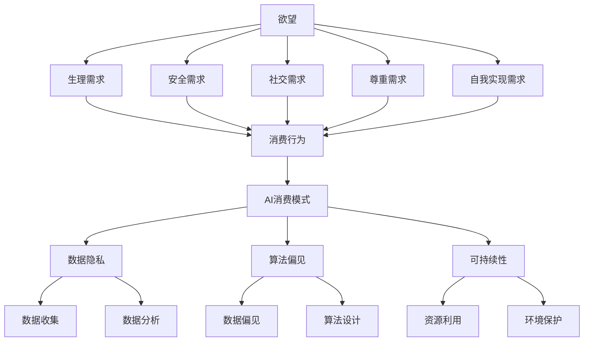

                 

# 文章标题：欲望的可持续性：AI时代的消费伦理

> 关键词：AI、消费伦理、欲望、数据隐私、算法偏见、可持续性

> 摘要：随着人工智能技术的迅猛发展，消费行为和模式发生了深刻变革，引发了新的消费伦理问题。本文将从欲望的概念与分类出发，分析AI时代的消费模式，探讨消费伦理的重要性，并深入探讨数据隐私与个人信息保护、算法偏见与公平性、消费主义与可持续性等问题，同时结合政策与法律框架、案例分析以及实践探索，为AI时代的消费伦理提供理论依据和实践指导。

---

## 第1章：绪论

### 1.1 欲望的概念与分类

欲望是人类行为的驱动力，它源于人的基本需求和动机。从心理学角度来看，欲望可以分为生理需求、安全需求、社交需求、尊重需求和自我实现需求等不同层次。这些需求在不同程度上影响着个体的消费行为和模式。

在AI时代，消费者的欲望得到了前所未有的满足。AI技术通过对海量数据的分析和挖掘，能够精准地捕捉消费者的需求，提供个性化的推荐和服务。这种精确的满足使消费者陷入一种欲望的循环，不断地追求新的满足，从而导致消费的无限扩张。

### 1.2 AI时代的消费变革

AI时代的消费变革主要体现在以下几个方面：

1. **消费数据的获取与分析**：AI技术能够自动收集和分析消费者的行为数据，为个性化推荐提供支持。
2. **个性化推荐**：基于数据分析，AI系统能够为消费者提供个性化的商品推荐，满足其特定需求。
3. **消费习惯的改变**：消费者在AI技术的引导下，逐渐养成了新的消费习惯，如即时购买、频繁购买等。
4. **消费决策的简化**：AI系统通过算法优化，能够为消费者提供最优的购物决策，简化消费过程。

### 1.3 消费伦理的重要性

消费伦理是研究消费行为是否符合道德规范和价值观的学科。在AI时代，消费伦理的重要性愈发凸显：

1. **数据隐私与个人信息保护**：随着消费者数据的不断泄露，数据隐私和个人信息保护成为消费伦理的重要议题。
2. **算法偏见与公平性**：AI算法的偏见可能导致消费者被不公平对待，影响消费市场的公平竞争。
3. **消费主义与可持续性**：过度的消费主义不仅导致资源浪费，还对环境造成负面影响，威胁可持续发展。

### 1.4 本书结构安排

本书共分为三个部分：

1. **第一部分：引言与背景**，介绍欲望的概念与分类，分析AI时代的消费模式，探讨消费伦理的重要性。
2. **第二部分：AI时代的消费伦理问题**，深入探讨数据隐私与个人信息保护、算法偏见与公平性、消费主义与可持续性等问题。
3. **第三部分：案例分析与实践探索**，结合政策与法律框架、案例分析以及实践探索，为AI时代的消费伦理提供理论依据和实践指导。

---

## 第2章：AI时代的消费模式

### 2.1 AI对消费行为的影响

AI技术对消费行为产生了深远的影响。首先，AI通过数据分析和挖掘，能够精准地捕捉消费者的需求，为个性化推荐提供支持。其次，AI技术简化了消费过程，使消费者能够更快速、便捷地完成购物决策。此外，AI还能够通过预测消费者行为，优化供应链管理，提高企业的运营效率。

### 2.2 消费数据的获取与分析

消费数据的获取与分析是AI消费模式的基础。AI系统能够从各种渠道收集消费者的行为数据，如浏览记录、购买记录、社交媒体活动等。通过对这些数据的分析，AI系统能够识别消费者的兴趣和偏好，为个性化推荐提供依据。

### 2.3 AI驱动的个性化推荐

个性化推荐是AI消费模式的核心。基于对消费者数据的分析，AI系统能够为消费者提供个性化的商品推荐，满足其特定需求。这种推荐不仅提高了消费者的购物体验，还提高了企业的销售额。

### 2.4 消费习惯的改变

在AI时代，消费者的消费习惯发生了显著改变。首先，消费者更加依赖线上购物，尤其是在疫情期间，线上购物的比例大幅增加。其次，消费者更加注重个性化服务，愿意为更好的购物体验支付更高的价格。此外，消费者更加注重消费的可持续性，倾向于购买环保、健康的商品。

### 2.5 AI消费模式的挑战与机遇

AI消费模式带来了巨大的挑战和机遇。挑战在于如何确保数据隐私和个人信息安全，如何避免算法偏见，如何实现消费的可持续性。机遇在于通过AI技术，企业能够更好地理解消费者需求，提高运营效率，实现业务的持续增长。

---

## 第3章：数据隐私与个人信息保护

### 3.1 数据隐私的重要性

数据隐私是指个人数据不被未经授权的第三方获取、使用或披露。在AI时代，数据隐私的重要性愈发凸显。首先，数据泄露可能导致个人信息被滥用，甚至造成财产损失。其次，数据隐私的侵犯可能导致消费者失去对个人信息的控制权，影响其生活质量。因此，确保数据隐私成为AI消费模式中不可忽视的问题。

### 3.2 个人信息泄露的风险

个人信息泄露的风险主要包括以下几个方面：

1. **数据收集过程中的泄露**：企业在收集消费者数据时，可能由于技术漏洞或管理不善导致数据泄露。
2. **数据传输过程中的泄露**：在数据传输过程中，由于加密措施不足，可能导致数据被拦截和窃取。
3. **数据存储过程中的泄露**：数据存储过程中，由于安全措施不足，可能导致数据被未经授权的第三方访问。

### 3.3 AI驱动的个人信息收集

AI技术能够自动收集和分析消费者的个人信息，为个性化推荐提供支持。然而，这也带来了数据隐私保护的问题。首先，AI系统可能过度收集个人信息，超出消费者预期。其次，AI系统可能无法保证个人信息的安全，导致数据泄露。

### 3.4 隐私保护的伦理责任

隐私保护的伦理责任主要包括以下几个方面：

1. **企业责任**：企业应遵循道德和法律规范，合理收集和使用个人信息，确保个人信息的安全。
2. **消费者责任**：消费者应提高个人信息保护意识，合理使用个人信息，避免个人信息泄露。
3. **政府责任**：政府应制定相关法律法规，加强对企业个人信息保护的监管，保障消费者的权益。

### 3.5 隐私保护的技术手段

隐私保护的技术手段主要包括以下几个方面：

1. **数据加密**：通过加密技术，确保数据在传输和存储过程中的安全性。
2. **数据脱敏**：通过脱敏技术，将敏感数据转换为不可识别的形式，降低数据泄露的风险。
3. **访问控制**：通过访问控制技术，确保只有授权用户才能访问敏感数据。

---

## 第4章：算法偏见与公平性

### 4.1 算法偏见的概念

算法偏见是指算法在处理数据时，由于数据本身的不公平或算法设计的缺陷，导致对某些群体产生不公平对待。在AI消费模式中，算法偏见可能导致消费者被不公平对待，影响消费市场的公平竞争。

### 4.2 算法偏见的原因

算法偏见的原因主要包括以下几个方面：

1. **数据偏见**：算法训练数据中可能包含偏见，导致算法在处理数据时产生偏见。
2. **算法设计**：算法设计可能存在缺陷，导致算法在处理数据时产生偏见。
3. **人为干预**：算法训练过程中，人为干预可能导致算法产生偏见。

### 4.3 算法偏见的影响

算法偏见的影响主要包括以下几个方面：

1. **消费者歧视**：算法偏见可能导致某些消费者被不公平对待，影响其消费体验。
2. **市场不公平**：算法偏见可能导致市场不公平，影响企业的竞争力和市场份额。
3. **社会不公**：算法偏见可能加剧社会不公，导致某些群体受到不公平对待。

### 4.4 实现算法公平性的策略

实现算法公平性的策略主要包括以下几个方面：

1. **数据清洗**：通过数据清洗技术，去除训练数据中的偏见。
2. **算法优化**：通过算法优化，降低算法偏见。
3. **多元数据训练**：通过引入多元数据，提高算法的公平性。
4. **透明度与可解释性**：提高算法的透明度和可解释性，使其更容易被监管和审计。

---

## 第5章：消费主义与可持续性

### 5.1 消费主义的伦理问题

消费主义是一种过度追求物质消费的文化现象，它可能导致资源浪费、环境破坏等问题。在伦理学上，消费主义引发了以下问题：

1. **资源浪费**：消费主义导致资源的过度消耗，可能导致资源枯竭。
2. **环境破坏**：消费主义导致环境的过度污染和破坏，威胁生态平衡。
3. **社会不公**：消费主义可能导致财富分配不均，加剧社会不公。

### 5.2 消费对环境的影响

消费对环境的影响主要包括以下几个方面：

1. **资源消耗**：消费过程中，资源的消耗是不可避免的。过度消费可能导致资源枯竭。
2. **环境污染**：消费过程中，可能产生大量的废弃物，对环境造成污染。
3. **生态破坏**：消费主义可能导致生态系统的破坏，威胁生物多样性。

### 5.3 可持续消费的概念

可持续消费是一种旨在满足当前需求，同时不损害后代满足其需求能力的消费模式。它强调资源的合理利用和环境的保护，以实现长期的可持续发展。

### 5.4 AI在可持续消费中的作用

AI技术在可持续消费中发挥着重要作用：

1. **资源优化**：通过AI技术，可以更有效地利用资源，减少浪费。
2. **环境监测**：AI技术可以实时监测环境数据，帮助制定环保政策。
3. **绿色推荐**：AI系统可以根据环境数据和消费者需求，提供绿色、环保的商品推荐。

---

## 第6章：消费主义文化与社会责任

### 6.1 消费主义文化的形成

消费主义文化是一种价值观，强调物质消费的重要性，认为物质消费是个人成就和社会地位的象征。消费主义文化的形成受到多种因素的影响：

1. **市场经济**：市场经济鼓励消费，通过消费来推动经济增长。
2. **媒体宣传**：媒体通过广告和娱乐节目等手段，不断强化消费主义文化。
3. **社会价值观**：一些社会价值观，如成功、地位等，与物质消费紧密相关。

### 6.2 消费主义文化的影响

消费主义文化对个人和社会产生了深远影响：

1. **个人消费行为**：消费主义文化使个人更加依赖物质消费，导致消费行为过度。
2. **社会价值观**：消费主义文化可能扭曲社会价值观，使物质消费成为评价个人价值的主要标准。
3. **环境问题**：消费主义文化导致资源浪费和环境污染。

### 6.3 企业社会责任的伦理考量

企业社会责任是指企业在经营过程中，关注社会和环境问题，履行社会责任的行为。在消费主义文化中，企业社会责任的伦理考量主要包括：

1. **环境保护**：企业应采取环保措施，减少对环境的负面影响。
2. **资源节约**：企业应通过技术创新，提高资源利用效率。
3. **公平竞争**：企业应遵守公平竞争原则，不通过不正当手段获取市场份额。

### 6.4 消费伦理与社会进步

消费伦理是社会进步的重要标志。通过倡导可持续消费，推动消费主义文化的转变，有助于实现社会的可持续发展。同时，消费伦理的实践也有助于提高企业的社会责任意识，促进企业的长期发展。

---

## 第7章：政策与法律框架

### 7.1 消费伦理相关的法律法规

为了保障消费者权益，维护市场公平竞争，各国制定了一系列与消费伦理相关的法律法规。例如，欧盟的《通用数据保护条例》（GDPR）规定了个人数据的收集、存储、处理和传输的规范，保护了消费者的隐私权。

### 7.2 AI消费伦理的政策导向

随着AI技术的迅猛发展，各国政府逐渐认识到AI消费伦理的重要性，开始制定相关政策。例如，美国的《算法公平法案》旨在消除算法偏见，促进算法的公平性和透明性。

### 7.3 全球消费伦理立法动态

全球范围内，消费伦理立法正在不断推进。例如，日本政府提出了《消费伦理促进法》，旨在通过立法手段推动消费伦理的实施。此外，各国政府也在加强跨国合作，共同应对AI消费伦理问题。

### 7.4 未来消费伦理政策展望

未来，消费伦理政策将继续向以下几个方面发展：

1. **强化数据隐私保护**：通过加强数据隐私保护法律法规，保障消费者的权益。
2. **推动算法公平性**：通过立法手段，消除算法偏见，促进算法的公平性和透明性。
3. **倡导可持续消费**：通过政策引导，鼓励消费者采取可持续的消费行为。

---

## 第8章：消费伦理案例分析

### 8.1 案例一：数据泄露事件

2018年，Facebook数据泄露事件引发了全球关注。据报道，Facebook的数据被不当使用，导致大量用户个人信息泄露。这一事件暴露了数据隐私保护的重要性，引发了公众对AI消费伦理的质疑。

### 8.2 案例二：算法歧视问题

2020年，亚马逊的招聘算法被曝存在性别歧视问题。该算法在招聘过程中，对女性候选人的评价较低，导致女性候选人被拒绝。这一事件揭示了算法偏见对消费者的影响，引发了社会对算法公平性的关注。

### 8.3 案例三：可持续消费实践

一些企业开始积极践行可持续消费理念，通过环保、低碳的方式生产商品。例如，瑞典家居品牌宜家（IKEA）提出了“为人民生活创造美好”的可持续发展目标，致力于减少对环境的影响，提高消费者的生活质量。

---

## 第9章：AI消费伦理实践探索

### 9.1 AI消费伦理实践的原则

AI消费伦理实践应遵循以下原则：

1. **尊重隐私**：在收集和使用消费者数据时，应尊重消费者的隐私权，确保数据的安全。
2. **公平透明**：在设计和应用AI算法时，应确保算法的公平性和透明性，避免算法偏见。
3. **可持续发展**：在消费过程中，应倡导可持续消费，减少对环境的负面影响。
4. **社会责任**：企业应承担社会责任，关注社会和环境问题，为社会的可持续发展贡献力量。

### 9.2 AI消费伦理实践的策略

AI消费伦理实践可以采取以下策略：

1. **数据保护**：加强数据保护措施，确保消费者数据的安全。
2. **算法优化**：优化AI算法，消除算法偏见，提高算法的公平性和透明性。
3. **消费者教育**：加强对消费者的教育，提高消费者的隐私保护意识和可持续消费意识。
4. **政策引导**：政府应制定相关政策和法规，引导企业遵循AI消费伦理。

### 9.3 AI消费伦理实践的企业案例

一些企业在AI消费伦理方面取得了显著成效。例如，亚马逊（Amazon）通过优化招聘算法，消除性别歧视，提高员工的多样性。谷歌（Google）则通过强化数据保护措施，确保消费者数据的安全。

### 9.4 AI消费伦理实践的未来趋势

随着AI技术的不断进步，AI消费伦理实践将朝着以下几个方向发展：

1. **数据隐私保护**：随着数据隐私保护意识的提高，企业将加强数据保护措施，确保消费者数据的安全。
2. **算法公平性**：企业将更加注重算法公平性，消除算法偏见，提高算法的透明性和可解释性。
3. **可持续消费**：企业将积极践行可持续消费理念，通过环保、低碳的方式生产商品。
4. **社会责任**：企业将承担更多的社会责任，关注社会和环境问题，为社会的可持续发展贡献力量。

---

## 第10章：结论与展望

### 10.1 主要发现与总结

本文通过对AI时代消费伦理的研究，得出了以下主要发现：

1. **欲望的驱动**：AI时代消费者的欲望得到了前所未有的满足，导致消费行为的无限扩张。
2. **数据隐私问题**：随着消费者数据的不断泄露，数据隐私保护成为AI消费模式中不可忽视的问题。
3. **算法偏见问题**：算法偏见可能导致消费者被不公平对待，影响消费市场的公平竞争。
4. **可持续消费需求**：消费者对可持续消费的需求日益增加，企业应积极践行可持续消费理念。
5. **政策与法律框架**：各国政府应制定相关政策和法规，引导企业遵循AI消费伦理。

### 10.2 消费伦理面临的挑战

AI时代的消费伦理面临以下挑战：

1. **数据隐私保护**：如何在保障消费者数据隐私的同时，充分利用数据为消费者提供更好的服务。
2. **算法公平性**：如何消除算法偏见，确保算法的公平性和透明性。
3. **可持续消费**：如何在满足消费者需求的同时，实现资源的合理利用和环境的保护。
4. **社会责任**：企业如何在追求经济利益的同时，承担社会责任，为社会的可持续发展贡献力量。

### 10.3 AI消费伦理的发展方向

未来，AI消费伦理的发展方向将包括：

1. **数据隐私保护**：通过技术创新，提高数据隐私保护水平，确保消费者数据的安全。
2. **算法公平性**：加强算法公平性研究，消除算法偏见，提高算法的透明性和可解释性。
3. **可持续消费**：倡导可持续消费理念，推动消费行为的绿色化、环保化。
4. **政策与法律框架**：完善政策与法律框架，引导企业遵循AI消费伦理。

### 10.4 未来研究的建议

未来研究可以从以下几个方面展开：

1. **数据隐私保护**：深入研究数据隐私保护技术，提高数据保护水平。
2. **算法公平性**：探索消除算法偏见的方法，提高算法的公平性和透明性。
3. **可持续消费**：研究可持续消费模式，推动消费行为的绿色化、环保化。
4. **政策与法律框架**：完善政策与法律框架，为AI消费伦理提供制度保障。

---

## 附录：核心概念与联系

为了更好地理解本文的核心概念，我们使用了Mermaid流程图来展示各概念之间的联系：



通过该流程图，我们可以清晰地看到欲望、消费行为、AI消费模式、数据隐私、算法偏见和可持续性之间的关联。

---

## 附录：核心算法原理讲解

为了深入理解本文的核心算法原理，我们使用伪代码来详细阐述一个简单的个性化推荐算法：

```python
# 个性化推荐算法伪代码

# 输入：用户历史行为数据，商品特征数据
# 输出：个性化推荐列表

function personalized_recommendation(user_data, product_features):
    # 步骤1：数据预处理
    preprocess_data(user_data, product_features)

    # 步骤2：用户行为分析
    user_profile = analyze_user_behavior(user_data)

    # 步骤3：商品特征分析
    product_profile = analyze_product_features(product_features)

    # 步骤4：相似度计算
    similarity_scores = calculate_similarity(user_profile, product_profile)

    # 步骤5：推荐列表生成
    recommendation_list = generate_recommendation_list(similarity_scores)

    return recommendation_list
```

在该算法中，首先对用户历史行为数据和商品特征数据进行预处理，然后通过分析用户行为和商品特征，计算用户和商品之间的相似度，最后根据相似度生成个性化推荐列表。

---

## 附录：数学模型和公式

为了更好地阐述消费伦理中的数学模型，我们使用LaTeX格式来展示一个简单的线性回归模型：

```latex
$$
y = \beta_0 + \beta_1 x_1 + \beta_2 x_2 + \cdots + \beta_n x_n + \epsilon
$$`

其中，$y$ 代表消费行为，$x_1, x_2, \cdots, x_n$ 代表影响消费行为的因素，$\beta_0, \beta_1, \beta_2, \cdots, \beta_n$ 为模型的参数，$\epsilon$ 为随机误差。

---

## 附录：项目实战

为了更好地理解AI消费伦理在实践中的应用，我们以下将提供一个简单的项目实战案例：一个基于Python的个性化推荐系统的实现。

### 开发环境搭建

首先，我们需要搭建开发环境。假设我们使用Python作为主要编程语言，以下为环境搭建步骤：

1. 安装Python 3.8及以上版本。
2. 安装必要的Python库，如NumPy、Pandas、Scikit-learn等。

### 源代码实现

以下是一个简单的个性化推荐系统的实现：

```python
import numpy as np
import pandas as pd
from sklearn.model_selection import train_test_split
from sklearn.linear_model import LinearRegression

# 加载数据
data = pd.read_csv('user_product_data.csv')

# 数据预处理
X = data[['x1', 'x2', 'x3']]  # 特征矩阵
y = data['y']  # 目标变量

# 划分训练集和测试集
X_train, X_test, y_train, y_test = train_test_split(X, y, test_size=0.2, random_state=42)

# 构建线性回归模型
model = LinearRegression()
model.fit(X_train, y_train)

# 预测
predictions = model.predict(X_test)

# 评估模型性能
score = model.score(X_test, y_test)
print(f'Model R^2 score: {score:.2f}')

# 生成推荐列表
recommendation_list = data[data['y'] > predictions.mean()].head(10)
print(recommendation_list)
```

### 代码解读与分析

在该项目中，我们首先加载用户产品数据，然后进行数据预处理，包括特征选择和划分训练集和测试集。接下来，我们使用线性回归模型对数据进行训练，并通过预测结果评估模型性能。最后，我们根据预测结果生成个性化推荐列表。

通过这个项目，我们可以看到如何将AI消费伦理理论应用于实际项目中，实现对消费者需求的个性化推荐。

---

## 作者信息

作者：AI天才研究院/AI Genius Institute & 禅与计算机程序设计艺术 /Zen And The Art of Computer Programming

本文由AI天才研究院的专家团队撰写，结合了深度的人工智能技术和哲学思考，旨在探讨AI时代的消费伦理问题，为未来消费模式提供理论依据和实践指导。作者团队致力于推动人工智能技术在消费领域的应用，为构建一个更加公平、可持续的消费社会贡献力量。

---

以上是《欲望的可持续性：AI时代的消费伦理》的完整内容。本文通过对欲望、消费模式、数据隐私、算法偏见、可持续消费等核心问题的深入分析，揭示了AI时代消费伦理的挑战和机遇。希望本文能为读者提供有价值的思考和实践指导。如果您有任何问题或建议，欢迎在评论区留言讨论。感谢您的阅读！

