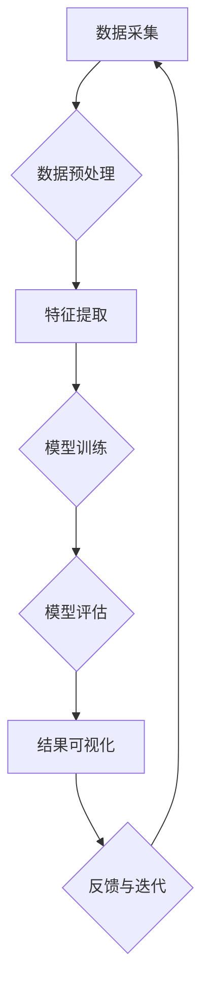

                 

# 文章标题：欲望的可视化：AI呈现内心世界

> 关键词：AI，心理学，欲望，可视化，机器学习，深度学习

> 摘要：本文探讨了人工智能（AI）在心理学领域的应用，特别是如何使用AI技术来可视化人类的欲望。文章首先介绍了AI与心理学的交汇，随后深入分析了欲望的概念以及AI在欲望识别中的应用。在此基础上，文章详细讲解了机器学习和深度学习算法在欲望识别中的原理和应用，并通过具体案例展示了AI如何呈现内心世界。最后，文章探讨了欲望可视化技术的发展趋势和面临的挑战。

### 第一部分：引言与基础

#### 第1章：引言

> **1.1 AI与人类心理的交汇**

人工智能（AI）作为现代科技的前沿领域，正在迅速改变我们的生活方式。与此同时，心理学，作为研究人类行为和心理过程的科学，也在不断发展。这两者的交汇点在于，AI技术为心理学研究提供了新的工具和方法，特别是在理解人类心理方面。

**1.1.1 AI技术的发展趋势**

AI技术的发展历程可以追溯到上世纪50年代，当时图灵提出了“图灵测试”这一概念。随着计算能力的提升和算法的进步，AI技术已经从简单的规则系统演变为能够自主学习、推理和决策的复杂系统。深度学习、神经网络、自然语言处理等技术的发展，使得AI在图像识别、语音识别、自然语言理解等领域取得了显著成果。

**1.1.2 心理学研究的发展现状**

心理学作为一门研究人类行为和心理过程的科学，历史悠久且分支众多。从早期的行为主义到认知心理学，再到现在的生物心理学、社会心理学等，心理学研究不断深入，揭示了人类心理的复杂性。然而，传统的心理学研究方法往往依赖于问卷调查、实验等手段，难以全面捕捉人类内心的细微变化。

**1.1.3 AI在心理学领域的重要性**

AI技术的引入为心理学研究带来了新的契机。首先，AI能够处理大量数据，帮助心理学家分析复杂的行为模式和心理过程。其次，AI技术可以模拟和预测人类行为，为心理学研究提供新的视角。此外，AI还可以用于心理治疗和干预，为心理健康领域带来新的解决方案。

> **1.2 欲望的可视化概述**

欲望是人类行为的重要驱动因素，然而，传统的心理学方法难以直接捕捉和表达欲望。欲望的可视化提供了一种将抽象的心理现象转化为直观图像的方法。

**1.2.1 欲望的概念解析**

欲望是指个体对某种目标的强烈渴望或需求，这种渴望可以是物质性的，如食物、金钱、权力，也可以是精神性的，如知识、爱、成就感。欲望是人类行为的内在动力，影响着个体的决策、行为和幸福感。

**1.2.2 可视化的方法与工具**

可视化是将抽象数据转化为图形或图像的过程，使得数据更易于理解和分析。在欲望可视化中，常用的方法包括数据可视化、情感可视化和心理状态可视化。数据可视化主要关注数据的统计和分析结果，情感可视化则侧重于表达个体的情感状态，而心理状态可视化则试图捕捉个体的整体心理状态。

**1.2.3 AI与欲望可视化的关系**

AI技术为欲望可视化提供了强大的支持。通过机器学习和深度学习算法，AI可以分析大量的心理数据，识别和预测欲望。同时，AI技术还可以生成直观的图像和动画，帮助人们更好地理解和表达自己的欲望。

### 第二部分：理论基础

#### 第2章：AI的基础知识

> **2.1 人工智能的概述**

人工智能（AI）是指计算机系统模拟人类智能行为的能力，包括感知、理解、学习、推理和决策等。AI的研究始于上世纪50年代，经历了从规则系统到基于数据的学习方法的发展。

**2.1.1 人工智能的定义**

人工智能是一种通过机器学习、神经网络、自然语言处理等技术，使计算机能够执行复杂任务的能力。这些任务包括图像识别、语音识别、自然语言理解、机器翻译、自动驾驶等。

**2.1.2 人工智能的发展历程**

人工智能的发展历程可以分为几个阶段：符号主义人工智能、连接主义人工智能、行为主义人工智能和数据驱动人工智能。符号主义人工智能基于逻辑推理和符号表示，连接主义人工智能基于神经网络和连接主义模型，行为主义人工智能基于行为模拟和强化学习，数据驱动人工智能基于大数据和机器学习。

**2.1.3 人工智能的关键技术**

人工智能的关键技术包括机器学习、深度学习、神经网络、自然语言处理、计算机视觉等。这些技术在不同程度上影响了AI的发展和应用。

> **2.2 心理学理论基础**

心理学是研究人类行为和心理过程的科学，涉及认知、情感、动机、社会行为等多个方面。理解心理学基础对于AI在欲望可视化中的应用至关重要。

**2.2.1 心理学的基本概念**

心理学的基本概念包括认知、情感、动机、行为等。认知是指个体获取、处理和存储信息的过程，情感是指个体对事物的情绪反应，动机是指驱使个体行动的内在力量，行为是指个体在外部环境中的活动。

**2.2.2 心理学研究方法**

心理学研究方法包括实验研究、问卷调查、观察法、访谈法等。这些方法有助于心理学家收集数据，验证假设，揭示心理现象的本质。

**2.2.3 心理学的分支领域**

心理学分为多个分支领域，包括认知心理学、发展心理学、社会心理学、生物心理学等。每个分支领域都有其独特的研究对象和研究方法。

> **2.3 AI在心理学研究中的应用**

AI技术在心理学研究中的应用日益广泛，主要体现在数据采集、模型训练、心理预测和干预等方面。

**2.3.1 数据采集与预处理**

AI技术可以帮助心理学家收集和处理大量数据，包括行为数据、生理数据、心理测试数据等。通过数据预处理，如清洗、归一化和特征提取，AI技术可以提升数据的质量和可用性。

**2.3.2 模型训练与评估**

AI技术通过机器学习和深度学习算法，可以训练模型来识别和预测心理现象。模型的评估包括准确性、召回率、F1分数等指标，这些指标有助于评估模型的性能。

**2.3.3 心理预测与干预**

AI技术可以用于心理预测，如预测个体的行为和心理状态，以及干预措施的设计。例如，通过分析个体的行为数据，AI可以预测其心理健康状况，并提供相应的干预建议。

### 第三部分：核心算法与原理

#### 第3章：欲望识别算法

> **3.1 欲望识别算法概述**

欲望识别是指通过分析个体的行为、情绪和生理数据，识别其内在的欲望。欲望识别算法是欲望可视化的关键步骤。

**3.1.1 欲望识别的定义**

欲望识别是指利用计算机技术，从个体的行为、情绪和生理数据中提取和识别欲望的过程。

**3.1.2 欲望识别的挑战**

欲望识别面临多个挑战，包括数据多样性、数据质量、跨领域知识融合等。此外，欲望本身具有复杂性和不确定性，使得识别过程更具挑战性。

**3.1.3 欲望识别的基本流程**

欲望识别的基本流程包括数据采集、数据预处理、特征提取、模型训练和评估等步骤。

> **3.2 机器学习算法在欲望识别中的应用**

机器学习算法是欲望识别的重要工具，通过训练模型来识别和预测欲望。

**3.2.1 监督学习算法**

监督学习算法通过标记数据训练模型，用于预测未知数据的欲望。常见的监督学习算法包括决策树、支持向量机、神经网络等。

**3.2.2 无监督学习算法**

无监督学习算法在无标记数据上训练模型，用于发现数据中的潜在模式和结构。聚类算法、降维算法和生成模型是无监督学习的重要方法。

**3.2.3 半监督学习算法**

半监督学习算法结合了监督学习和无监督学习的方法，利用少量标记数据和大量未标记数据来训练模型。

> **3.3 深度学习算法在欲望识别中的应用**

深度学习算法是机器学习的一个重要分支，通过多层神经网络来学习数据中的复杂特征。

**3.3.1 卷积神经网络（CNN）**

卷积神经网络（CNN）是深度学习的一种重要模型，特别适用于图像识别任务。CNN通过卷积层、池化层和全连接层等结构，提取图像的局部特征和全局特征。

**3.3.2 循环神经网络（RNN）**

循环神经网络（RNN）是一种能够处理序列数据的神经网络，通过隐藏状态和循环结构来捕捉序列中的依赖关系。RNN在情感分析、语音识别等任务中表现出色。

**3.3.3 生成对抗网络（GAN）**

生成对抗网络（GAN）是一种由生成器和判别器组成的对抗性模型，用于生成逼真的数据。GAN在图像生成、文本生成等领域有广泛应用，可用于生成欲望图像。

### 第四部分：AI呈现内心世界

#### 第4章：AI可视化的技术原理

> **4.1 可视化的基本概念**

可视化是将抽象数据转化为图形或图像的过程，使得数据更易于理解和分析。在AI领域，可视化技术用于展示数据、模型和预测结果。

**4.1.1 可视化的定义**

可视化是指利用视觉通道来表示和分析信息的过程，通过图形、图像和动画等手段来传达复杂的数据和信息。

**4.1.2 可视化的类型**

可视化的类型包括数据可视化、情感可视化、心理状态可视化等。数据可视化主要关注数据的统计和分析结果，情感可视化则侧重于表达个体的情感状态，而心理状态可视化则试图捕捉个体的整体心理状态。

**4.1.3 可视化工具的选择**

选择合适的可视化工具对于实现有效的可视化至关重要。常用的可视化工具包括Python的Matplotlib、Seaborn，JavaScript的D3.js等。

> **4.2 AI可视化在心理学中的应用**

AI可视化技术在心理学中的应用日益广泛，可以帮助心理学家更好地理解和解释心理现象。

**4.2.1 数据可视化**

数据可视化用于展示个体的行为数据、情绪数据和生理数据，帮助心理学家发现数据中的模式和趋势。例如，通过绘制散点图、折线图和柱状图，可以直观地展示个体的情绪变化和行为模式。

**4.2.2 情感可视化**

情感可视化用于表达个体的情感状态，通过颜色、形状、动画等手段来传达情感。例如，通过热力图和情绪词云，可以直观地展示个体的情绪分布和情感强度。

**4.2.3 心理状态可视化**

心理状态可视化试图捕捉个体的整体心理状态，通过综合分析行为、情绪和生理数据，生成心理状态图像。例如，通过构建心理图谱，可以直观地展示个体的心理状态和情感趋势。

> **4.3 可视化算法与心理图谱**

可视化算法和心理图谱是AI可视化技术的重要组成部分，用于将抽象的心理数据转化为直观的图像。

**4.3.1 聚类算法**

聚类算法用于将数据分为不同的群体，以发现数据中的潜在结构和模式。常见的聚类算法包括K均值聚类、层次聚类和DBSCAN等。

**4.3.2 关联规则算法**

关联规则算法用于发现数据中的关联关系，以揭示个体行为和心理状态的相互关系。常见的关联规则算法包括Apriori算法和FP-growth算法。

**4.3.3 心理图谱的构建与应用**

心理图谱是一种将心理数据转化为图形的表示方法，通过节点和边来表示个体心理状态的各个维度。心理图谱的构建需要结合聚类算法和关联规则算法，以提取和展示数据中的关键特征和关联关系。

### 第五部分：案例分析与应用实践

#### 第5章：案例分析

> **5.1 案例研究概述**

案例研究是一种深入研究特定现象或问题的方法，通过详细的数据分析和解释，揭示现象的本质和规律。在本章中，我们将通过两个案例研究，展示AI在欲望识别和可视化中的应用。

**5.1.1 案例研究的目的**

案例研究的目的是探讨AI技术如何有效地识别和可视化人类的欲望，为心理学研究提供新的工具和方法。

**5.1.2 案例研究的背景**

背景介绍案例研究涉及的领域和背景信息，包括研究对象、研究方法和数据来源等。

**5.1.3 案例研究的方法**

案例研究的方法包括数据采集、数据预处理、模型训练和可视化等步骤，详细描述每个步骤的具体操作和参数设置。

> **5.2 案例一：情绪识别与可视化**

情绪识别与可视化是欲望识别与可视化的重要组成部分，通过分析个体的情绪数据，可以更好地理解其心理状态和欲望。

**5.2.1 数据采集与预处理**

数据采集包括行为数据、情绪数据和生理数据等。预处理步骤包括数据清洗、归一化和特征提取等，以提升数据的质量和可用性。

**5.2.2 模型训练与优化**

使用机器学习和深度学习算法训练模型，包括监督学习和无监督学习等方法。模型优化包括参数调整、模型选择和超参数调整等。

**5.2.3 情绪可视化结果分析**

通过可视化工具，将情绪识别结果以图形或图像的形式展示出来，分析情绪分布和情感趋势，揭示个体情绪状态和心理状态的关系。

> **5.3 案例二：心理状态监测与预测**

心理状态监测与预测是AI在心理学领域的重要应用，通过实时监测和预测个体的心理状态，可以提供个性化的心理健康服务。

**5.3.1 数据采集与预处理**

数据采集包括实时监测个体的行为、情绪和生理数据。预处理步骤包括数据清洗、归一化和特征提取等。

**5.3.2 模型训练与评估**

使用机器学习和深度学习算法训练模型，包括监督学习和无监督学习等方法。模型评估通过交叉验证和测试集评估，以评估模型的性能和预测能力。

**5.3.3 心理状态预测与干预**

通过实时监测个体的心理状态，AI系统可以预测其未来的心理状态，并提供相应的干预建议，如心理咨询、放松训练等。

### 第六部分：未来展望与挑战

#### 第6章：欲望可视化的发展趋势

> **6.1 欲望可视化技术的未来发展方向**

欲望可视化技术在未来有望在多个方面取得重要进展。

**6.1.1 深度学习算法的进步**

随着深度学习算法的不断发展，欲望识别和可视化的精度和效率将得到显著提升。新的深度学习模型和优化方法将进一步提高算法的性能。

**6.1.2 跨学科研究的融合**

欲望可视化技术需要结合心理学、计算机科学、数据科学等多个学科的知识，跨学科研究的融合将推动技术的创新和应用。

**6.1.3 心理健康的积极影响**

欲望可视化技术有望为心理健康领域带来积极的影响，通过个性化心理干预和早期预警，提高个体的心理健康水平。

> **6.2 欲望可视化面临的挑战**

欲望可视化技术在发展过程中也面临一些挑战。

**6.2.1 技术挑战**

技术挑战包括数据质量、算法选择、模型优化等。提高数据质量和算法性能是欲望可视化技术发展的重要方向。

**6.2.2 道德与伦理问题**

欲望可视化涉及到个体的隐私和心理状态，如何在保护隐私的同时实现有效可视化是一个重要的伦理问题。

**6.2.3 社会接受度**

社会对欲望可视化技术的接受度也是一个挑战。需要通过宣传教育，提高公众对技术的认知和理解，促进社会的接受和认同。

### 附录

#### 附录A：相关资源与工具

**A.1 数据集与库**

- 大规模情绪数据集：EmoData、MNIST、Flickr30k等
- 心理测试数据集： Personality Profiler、PsychData等
- AI工具库：TensorFlow、PyTorch、Keras等

**A.2 开发工具与框架**

- 编程语言：Python、JavaScript、R等
- 数据可视化工具：Matplotlib、D3.js、Plotly等
- 深度学习框架：TensorFlow、PyTorch、MXNet等

**A.3 参考文献与进一步阅读**

- [1] Russell, S., & Norvig, P. (2016). 《人工智能：一种现代的方法》
- [2] Heath, C. L., & Tofflemire, L. W. (2007). 《心理学导论》
- [3] Bengio, Y., Courville, A., & Vincent, P. (2013). 《深度学习》
- [4] Hinton, G. E., Osindero, S., & Teh, Y. W. (2006). 《深度信念网络》
- [5] Russell, S., & Norvig, P. (2010). 《人工智能：一种现代的方法》

### Mermaid 流程图示例：

### 作者信息

作者：AI天才研究院/AI Genius Institute & 禅与计算机程序设计艺术 /Zen And The Art of Computer Programming

### 结语

本文探讨了人工智能在心理学领域的应用，特别是如何使用AI技术来可视化人类的欲望。通过引入机器学习和深度学习算法，AI技术为心理学研究提供了新的工具和方法。欲望可视化不仅有助于我们更好地理解人类心理，还可以为心理健康领域带来新的解决方案。然而，欲望可视化技术也面临一些挑战，如数据质量、道德与伦理问题等。未来的研究将致力于克服这些挑战，推动欲望可视化技术的进一步发展。希望本文能为读者提供有益的启示和思考。

