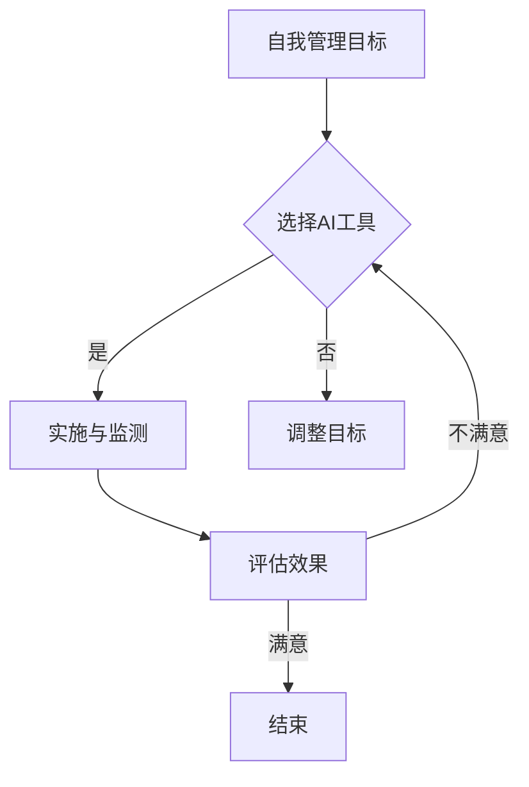

                 

# 文章标题：欲望的智能调节：AI辅助的自我管理

## 关键词：自我管理、人工智能、欲望调节、行为心理学、算法、实践指南

> 摘要：本文探讨了人工智能在自我管理中的应用，通过分析欲望调节的理论基础和人工智能的技术原理，详细介绍了AI在欲望调节中的实际应用案例，并提出了AI辅助自我管理的实践指南。文章旨在为读者提供一套系统的理解和应用人工智能辅助自我管理的方法。

## 第一部分：引言

### 第1章：自我管理与人工智能

#### 1.1 自我管理的定义与意义

自我管理是指个体通过自我监控、自我调整和自我激励来达成目标的过程。在现代社会中，自我管理的重要性日益凸显，它不仅关乎个人的生活品质，还直接影响到工作效率和心理健康。自我管理不仅仅是简单的自律，它涉及到个体在情感、行为、时间等多方面的调节和优化。

人工智能（AI）作为近年来快速发展的技术，已经在各个领域展现出了巨大的潜力。将人工智能应用于自我管理，不仅可以提高个体的自我管理能力，还可以通过智能化的方式解决传统自我管理中的难题。

#### 1.2 人工智能在自我管理中的应用

人工智能在自我管理中的应用主要体现在以下几个方面：

1. **行为数据分析**：通过收集和分析个体的行为数据，AI可以识别出行为模式，提供个性化的建议和指导。
2. **自动化任务管理**：利用AI技术，可以自动化处理日常任务，如日程安排、待办事项等，提高工作效率。
3. **情感识别与调节**：通过情感识别技术，AI可以感知个体的情感状态，并给予相应的情绪调节建议。
4. **健康监测与指导**：AI可以监测个体的健康状况，提供个性化的健康指导，如饮食建议、运动计划等。

### 第2章：人工智能概述

#### 2.1 人工智能的定义与发展

人工智能是指通过计算机模拟人类的认知过程，使机器具备智能行为的科学和技术。人工智能的发展历程可以追溯到20世纪50年代，经历了早期的符号主义、知识表示、推理方法等多个阶段，直到21世纪初，随着深度学习等技术的发展，人工智能取得了突破性进展。

#### 2.2 人工智能的核心技术

人工智能的核心技术包括：

1. **机器学习**：通过训练数据集，使机器能够识别模式和做出预测。
2. **深度学习**：一种基于神经网络的学习方法，能够处理复杂的数据和任务。
3. **自然语言处理**：使机器能够理解和生成人类语言。
4. **计算机视觉**：使机器能够理解和解析视觉信息。

#### 2.3 人工智能在现代社会中的应用

人工智能在现代社会中的应用非常广泛，包括：

1. **智能家居**：通过AI技术，实现家电的智能控制和管理。
2. **智能交通**：利用AI技术优化交通流量，提高交通效率。
3. **智能医疗**：通过AI技术辅助疾病诊断和治疗。
4. **金融科技**：利用AI技术进行风险管理、投资分析和客户服务。

## 第二部分：欲望调节的理论基础

### 第3章：欲望与行为心理学

#### 3.1 欲望的心理学解释

欲望是驱动人类行为的重要动力，它涉及对物质或精神的需求和渴望。从心理学角度来看，欲望可以分为生理欲望和心理欲望。生理欲望如食欲、性欲等，而心理欲望则包括对成就、认可、归属等的追求。

心理学中的动机理论解释了欲望如何影响行为。动机理论认为，个体的行为是由内在动机和外在动机驱动的。内在动机是指个体因为对活动本身的兴趣和享受而产生的动机，而外在动机则是指个体因为外部奖励或惩罚而产生的动机。

#### 3.2 行为心理学的核心理论

行为心理学是研究人类行为及其背后的心理机制的科学。行为心理学的核心理论包括：

1. **强化理论**：强化是影响行为发生概率的关键因素。正强化增加行为的发生概率，而负强化则减少行为的发生概率。
2. **自我决定理论**：自我决定理论强调个体在行为中的自主性和自我管理能力。个体在自我决定的状态下，行为更为积极和持久。
3. **自我效能理论**：自我效能是指个体对自己能够成功完成特定任务的信念。高自我效能的个体更有可能成功完成任务。

#### 3.3 欲望调节的策略与方法

欲望调节是指通过一定的策略和方法，调整和控制个体的欲望，以达到自我管理的目的。欲望调节的策略和方法包括：

1. **目标设定**：明确的目标可以指导个体的行为，减少不必要的欲望干扰。
2. **自我监控**：通过自我监控，个体可以及时发现和调整自己的欲望行为。
3. **情绪调节**：通过情绪调节技巧，个体可以管理自己的情绪，减少因情绪波动导致的欲望失控。
4. **行为替代**：当个体无法满足某些欲望时，可以通过替代行为来缓解欲望的困扰。

## 第4章：人工智能与欲望调节

### 4.1 人工智能在欲望调节中的应用

人工智能在欲望调节中的应用主要体现在以下几个方面：

1. **行为模式识别**：通过分析个体的行为数据，AI可以识别出欲望行为模式，提供针对性的调节建议。
2. **智能提醒与激励**：AI可以通过智能提醒和激励，帮助个体克服欲望冲动，坚持目标。
3. **个性化建议**：基于个体特征和行为数据，AI可以提供个性化的欲望调节策略。
4. **心理辅导**：利用AI技术，可以进行在线心理辅导，帮助个体管理欲望，提高心理健康水平。

### 4.2 欲望调节的AI算法

#### 4.2.1 强化学习算法

强化学习算法（Reinforcement Learning）是一种通过试错来学习策略的机器学习方法。其核心思想是通过奖励信号来不断调整策略，以实现最优行为。

**伪代码：**

```python
initialize Q(s, a) # 初始化状态-动作值函数
for each episode:
    for each step t:
        s_t = observe the current state
        a_t = choose action a_t based on Q(s_t, a)
        s_{t+1}, r_{t+1} = execute action a_t
        Q(s_t, a_t) = Q(s_t, a_t) + alpha * (r_{t+1} + gamma * max Q(s_{t+1}, a) - Q(s_t, a_t))
```

#### 4.2.2 决策树算法

决策树（Decision Tree）是一种基于特征进行分类或回归的算法。其核心思想是通过一系列特征选择和阈值划分，将数据集划分为多个子集，最终形成一棵树形结构。

**伪代码：**

```python
def build_tree(data, features, target):
    if all examples in data have the same target value:
        return leaf node with that target value
    if no more features to split on:
        return leaf node with majority target value in data
    best_feature, best_threshold = find_best_split(data, features, target)
    left subtree = build_tree(data[data[best_feature] < best_threshold], features, target)
    right subtree = build_tree(data[data[best_feature] >= best_threshold], features, target)
    return decision node with best_feature and best_threshold, left subtree, right subtree
```

### 4.3 AI辅助的自我管理工具

AI辅助的自我管理工具主要包括：

1. **智能提醒应用**：如智能闹钟、提醒事项等，通过设定提醒，帮助用户按时完成任务。
2. **健身应用**：如健身追踪器、健身计划制定器等，通过数据分析和建议，帮助用户进行健康管理。
3. **财务管理应用**：如预算管理工具、投资顾问等，通过数据分析和建议，帮助用户进行财务规划。
4. **心理健康应用**：如情绪追踪器、心理咨询等，通过数据分析和心理辅导，帮助用户管理心理健康。

## 第5章：AI辅助自我管理实践

### 5.1 AI辅助自我管理案例研究

#### 案例一：智能健康管理平台

**背景**：随着生活节奏的加快，人们越来越注重健康管理的需求。智能健康管理平台通过AI技术，提供个性化的健康服务。

**解决方案**：
- **数据收集**：通过智能手环、手机应用等设备，收集用户的心率、血压、睡眠等健康数据。
- **数据分析**：利用机器学习算法，分析用户的数据，预测健康风险。
- **个性化建议**：根据用户的数据和需求，提供个性化的健康建议，如饮食建议、运动计划等。

**效果**：用户反馈显示，智能健康管理平台有效地帮助用户提高了健康意识，改善了生活习惯。

#### 案例二：时间管理应用

**背景**：时间管理是自我管理中的一项重要内容。时间管理应用通过AI技术，帮助用户更好地管理时间。

**解决方案**：
- **日程安排**：自动收集用户的日程安排，智能推荐空闲时间。
- **任务提醒**：根据用户的任务优先级和截止时间，智能提醒用户。
- **效率分析**：分析用户的时间使用情况，提供时间管理的优化建议。

**效果**：用户反馈显示，时间管理应用有效提高了用户的时间利用率和工作效率。

#### 案例三：消费管理应用

**背景**：随着消费水平的提升，人们对消费管理的需求也越来越高。

**解决方案**：
- **消费记录**：自动收集用户的消费数据，提供详细的消费报告。
- **预算规划**：根据用户的收入和消费习惯，制定个性化的预算规划。
- **消费建议**：根据用户的消费数据，提供理性的消费建议。

**效果**：用户反馈显示，消费管理应用有效地帮助用户控制了消费，提高了财务规划能力。

### 5.2 AI在生活各个方面的应用

#### 工作场景

- **自动化办公**：AI技术可以帮助用户自动化处理日常办公任务，如文件处理、会议安排等，提高工作效率。
- **团队协作**：AI技术可以提供智能协作工具，如聊天机器人、视频会议系统等，优化团队协作流程。

#### 生活场景

- **智能家居**：AI技术可以实现对家居设备的智能控制，如智能门锁、智能照明等，提高生活质量。
- **健康生活**：AI技术可以提供个性化的健康服务，如健康监测、健身指导等，帮助用户保持健康。

#### 教育场景

- **个性化学习**：AI技术可以提供个性化的学习路径和学习资源，帮助用户提高学习效率。
- **教育管理**：AI技术可以提供智能教育管理工具，如学习进度追踪、成绩分析等，优化教育管理。

### 5.3 AI辅助自我管理的未来趋势

#### 智能化与个性化

随着AI技术的不断进步，未来的AI辅助自我管理将更加智能化和个性化。通过更深入的数据分析和更精准的算法，AI将能够提供更个性化的服务和建议，满足用户的多样化需求。

#### 跨学科融合

AI辅助自我管理将融合更多学科的知识，如心理学、行为经济学等，以提供更全面、更有效的自我管理方案。

#### 智能健康

随着人们对健康管理的需求增加，AI辅助自我管理将在健康领域发挥更大的作用。通过智能健康监测和个性化健康建议，AI将帮助用户更好地管理健康。

#### 智能教育

AI辅助自我管理在教育领域的应用也将更加广泛。通过个性化学习和智能教育管理，AI将帮助用户提高学习效率，实现终身学习。

## 第三部分：AI辅助自我管理的应用场景

### 第6章：工作场景中的自我管理

#### 6.1 工作效率的提升

AI技术在提升工作效率方面具有显著优势。通过自动化任务处理、智能日程安排和效率分析，AI可以帮助用户更好地管理工作时间，减少无效劳动。

**应用案例：** 
- **智能助手**：如IBM的Watson Assistant，可以自动处理客户咨询，提高客服效率。
- **自动化工具**：如Outlook的自动回复功能，可以自动处理日常邮件，节省工作时间。

#### 6.2 工作压力的调节

工作压力是影响工作效率和心理健康的重要因素。AI技术可以通过情绪识别和调节，帮助用户管理工作压力。

**应用案例：** 
- **情绪分析**：利用AI技术分析用户的情绪变化，提供针对性的调节建议。
- **放松训练**：通过AI提供的放松训练，帮助用户缓解工作压力。

#### 6.3 团队协作与沟通

团队协作和沟通是工作场景中的重要环节。AI技术可以提供智能化的协作工具，优化团队沟通和工作流程。

**应用案例：** 
- **智能协作平台**：如Slack，提供自动化的沟通和任务管理功能。
- **视频会议系统**：如Zoom，提供智能化的会议管理和实时沟通功能。

### 第7章：生活场景中的自我管理

#### 7.1 消费习惯的调整

消费习惯的调整是自我管理中的重要内容。AI技术可以通过消费数据分析，帮助用户了解自己的消费行为，并提供调整建议。

**应用案例：** 
- **智能消费分析**：如You Need A Budget（YNAB），提供详细的消费报告和预算规划。
- **消费提醒**：通过AI技术，提醒用户合理消费，避免过度消费。

#### 7.2 健康生活的管理

健康生活是生活场景中的核心内容。AI技术可以通过健康数据分析，提供个性化的健康管理和建议。

**应用案例：** 
- **健康监测**：如Apple Health，提供全面的健康数据监测和分析。
- **健身指导**：如Nike Training Club，提供个性化的健身计划和指导。

#### 7.3 社交与情感管理

社交与情感管理是生活场景中的重要内容。AI技术可以通过情感识别和社交分析，帮助用户管理社交关系和情感状态。

**应用案例：** 
- **社交分析**：如LinkedIn，提供社交网络分析和建议。
- **情感调节**：如Headspace，提供个性化的情感调节和心理辅导。

### 第8章：教育场景中的自我管理

#### 8.1 学生学习习惯的培养

学生学习习惯的培养是教育场景中的核心内容。AI技术可以通过学习数据分析和行为识别，帮助用户培养良好的学习习惯。

**应用案例：** 
- **学习分析**：如Khan Academy，提供详细的学习报告和个性化学习建议。
- **行为激励**：如Duolingo，通过游戏化和奖励机制，激励学生学习。

#### 8.2 教师教学效果的提升

教师教学效果的提升是教育场景中的重要内容。AI技术可以通过教学数据分析，提供针对性的教学改进建议。

**应用案例：** 
- **教学分析**：如Canvas，提供详细的教学报告和数据分析。
- **教学优化**：如Insight Assessment，提供个性化的教学优化建议。

#### 8.3 教育资源的优化配置

教育资源的优化配置是教育场景中的关键内容。AI技术可以通过教育资源数据分析，提供教育资源优化配置的建议。

**应用案例：** 
- **资源分析**：如Edmodo，提供教育资源分析和推荐。
- **资源优化**：如Google Classroom，通过智能分配和调度，优化教育资源。

### 第9章：心理健康与欲望调节

#### 9.1 心理健康的重要性

心理健康是自我管理中的重要内容。心理健康不仅关系到个体的幸福感，还直接影响个体的生活质量和工作效率。

#### 9.2 心理问题的识别与调节

心理问题如焦虑、抑郁等，对个体的生活质量有严重影响。AI技术可以通过心理数据分析，识别心理问题，并提供调节建议。

**应用案例：** 
- **心理分析**：如Moodfit，通过心理数据分析，识别心理问题并提供调节建议。
- **心理辅导**：如Talkspace，提供在线心理辅导和心理治疗。

#### 9.3 AI在心理治疗中的应用

AI技术在心理治疗中的应用日益广泛。通过智能诊断、个性化治疗和实时监测，AI可以提高心理治疗的效率和效果。

**应用案例：** 
- **智能诊断**：如Wysa，通过智能诊断技术，提供个性化的心理治疗方案。
- **实时监测**：如MyLife，通过实时监测技术，提供心理健康的实时监控和预警。

## 第四部分：AI辅助自我管理的实践指南

### 第10章：AI辅助自我管理的实施步骤

#### 10.1 确定自我管理目标

自我管理目标是指个体希望通过自我管理实现的具体目标。明确自我管理目标是实施AI辅助自我管理的第一步。

**步骤：**
1. **目标设定**：明确短期和长期自我管理目标。
2. **目标分解**：将大目标分解为具体的、可实现的子目标。
3. **目标记录**：将自我管理目标记录在案，以便后续跟踪和调整。

#### 10.2 选择合适的AI工具

选择合适的AI工具是实施AI辅助自我管理的重要步骤。不同的AI工具适用于不同的自我管理目标和应用场景。

**步骤：**
1. **需求分析**：分析个体自我管理的需求，确定所需的AI工具类型。
2. **工具筛选**：根据需求分析结果，筛选合适的AI工具。
3. **工具评估**：对筛选出的AI工具进行评估，确保其符合需求。

#### 10.3 实施与监测

实施与监测是AI辅助自我管理的核心环节。通过有效的实施和监测，个体可以及时调整自我管理策略，确保目标实现。

**步骤：**
1. **实施计划**：制定详细的AI辅助自我管理实施计划。
2. **实施执行**：按照实施计划，逐步执行AI辅助自我管理任务。
3. **效果监测**：通过数据分析和用户反馈，监测AI辅助自我管理的实施效果。

### 第11章：AI辅助自我管理的最佳实践

#### 11.1 成功案例分享

**案例一：智能健康管理平台**

**背景**：某公司员工健康管理项目，旨在通过AI技术提升员工的健康水平。

**实施步骤：**
1. **目标设定**：明确提升员工健康水平的短期和长期目标。
2. **工具选择**：选择智能健康管理平台，如Apple Health或Google Fit。
3. **实施与监测**：通过平台提供的健康数据分析和建议，员工逐步改善生活习惯，实施效果显著。

**效果**：员工健康水平提升，工作积极性提高。

**案例总结**：智能健康管理平台为员工提供了个性化的健康服务，有效提升了员工的健康意识和生活品质。

**案例二：时间管理应用**

**背景**：某企业高管希望通过AI技术优化工作时间管理。

**实施步骤：**
1. **目标设定**：明确提高工作效率和时间管理能力的目标。
2. **工具选择**：选择时间管理应用，如Toggl或RescueTime。
3. **实施与监测**：通过应用提供的任务管理和效率分析，高管逐步优化工作时间，提高了工作效率。

**效果**：工作效率提高，工作压力减轻。

**案例总结**：时间管理应用帮助高管实现了有效的时间管理和工作优化，提升了工作质量和生活品质。

#### 11.2 常见问题与解决方案

**问题一：数据隐私和安全问题**

**解决方案：** 
- **数据加密**：确保数据在传输和存储过程中的安全。
- **隐私政策**：制定明确的数据隐私政策，保障用户权益。
- **安全审计**：定期进行安全审计，确保系统的安全性。

**问题二：AI工具的依赖性**

**解决方案：** 
- **工具多样化**：避免过分依赖某一种AI工具，选择多种工具互补。
- **自我能力提升**：通过学习和实践，提升自身的自我管理能力。
- **定期评估**：定期评估AI工具的使用效果，适时调整使用策略。

**问题三：AI工具的效果不佳**

**解决方案：** 
- **工具优化**：根据使用反馈，优化AI工具的功能和性能。
- **数据质量**：确保数据质量，为AI工具提供准确的输入。
- **持续学习**：通过不断学习和更新，提升AI工具的能力。

#### 11.3 持续改进与优化

**方法一：定期更新模型**

随着数据的积累和使用环境的变化，AI模型的性能可能会下降。定期更新模型，使其适应最新的数据和使用环境，是持续改进的重要方法。

**方法二：用户反馈机制**

用户反馈是优化AI工具的重要依据。建立用户反馈机制，及时收集和分析用户反馈，可以为工具的改进提供有力支持。

**方法三：跨学科合作**

结合心理学、行为经济学等领域的知识，可以更深入地理解人类行为特征，为AI辅助自我管理提供更多优化思路。

**总结：** 持续改进与优化是AI辅助自我管理的重要环节。通过不断学习和调整，可以提高AI工具的效率和效果，实现更有效的自我管理。

### 第12章：未来展望

#### 12.1 AI辅助自我管理的发展趋势

随着人工智能技术的不断进步，AI辅助自我管理将在未来得到更广泛的应用。未来的AI辅助自我管理将更加智能化、个性化和跨学科化，为用户提供更全面、更精准的自我管理服务。

**趋势一：智能化**  
未来的AI辅助自我管理将更加智能化，能够自主学习和优化，提供个性化的服务和建议。

**趋势二：个性化**  
未来的AI辅助自我管理将更加个性化，能够根据用户的个体特征和行为数据，提供量身定制的服务。

**趋势三：跨学科化**  
未来的AI辅助自我管理将融合心理学、行为经济学等跨学科知识，提供更深入、更全面的自我管理服务。

#### 12.2 挑战与机遇

**挑战一：数据隐私和安全问题**  
随着AI技术的应用，数据隐私和安全问题将成为重要的挑战。如何确保用户数据的隐私和安全，是未来需要解决的重要问题。

**挑战二：算法公平性**  
AI辅助自我管理的算法公平性也是一个重要挑战。如何确保算法不会因为偏见或歧视而导致不公平的结果，是未来需要解决的关键问题。

**机遇一：市场需求**  
随着人们对自我管理需求的增加，AI辅助自我管理有着广阔的市场前景。未来将有更多的企业和机构投入到AI辅助自我管理的研发和应用中。

**机遇二：技术创新**  
人工智能技术的不断进步，为AI辅助自我管理提供了强大的技术支持。未来将有更多的技术创新，推动AI辅助自我管理的发展。

#### 12.3 未来社会的自我管理形态

随着AI技术的普及和应用，未来社会的自我管理形态将发生深刻变化。未来的个体将通过智能化的方式进行自我管理，实现更高效、更健康、更幸福的生活方式。

**形态一：智能个体**  
未来的个体将具备智能化的自我管理能力，通过AI技术进行行为数据分析、欲望调节和心理健康管理。

**形态二：智能社会**  
未来的社会将是一个智能化的社会，AI技术将广泛应用于各个领域，为个体提供全面的自我管理服务。

**形态三：智能生态**  
未来的智能生态将是一个由AI技术驱动的生态系统，个体、企业和机构将通过智能化的方式进行协作和互动，共同构建一个高效、和谐的社会。

## 附录

### 附录A：常用AI工具与平台介绍

**A.1 Google AI**

Google AI是Google推出的人工智能平台，提供了丰富的AI工具和资源。包括TensorFlow、Keras、TensorFlow.js等，适用于不同的AI应用场景。

**A.2 OpenAI**

OpenAI是一家专注于人工智能研究的前沿公司，提供了包括GPT-3、DALL-E等在内的一系列AI工具和模型，用于自然语言处理、图像生成等。

**A.3 微软Azure AI**

微软Azure AI是微软提供的人工智能平台，包括认知服务、机器学习工具等。适用于企业级的AI应用开发。

**A.4 腾讯AI**

腾讯AI是腾讯推出的人工智能平台，提供了语音识别、图像识别、自然语言处理等一系列AI工具和服务。

### 附录B：参考资料与进一步阅读

**B.1 相关书籍**

- 《人工智能：一种现代的方法》（第二版）  
- 《深度学习》（第二版）  
- 《Python机器学习》

**B.2 学术论文**

- "Deep Learning for Self-Driving Cars"  
- "A Theoretical Analysis of the Causal Effects of AI on Job Automation"  
- "Unsupervised Learning of Visual Representations from Videos"

**B.3 在线资源与教程**

- Coursera的"Machine Learning"课程  
- edX的"Deep Learning"课程  
- TensorFlow官方文档

### Mermaid 流程图



### 核心算法原理讲解

#### 强化学习算法

强化学习算法（Reinforcement Learning，RL）是一种通过试错来学习策略的机器学习方法。它主要应用于序列决策问题，即决策需要基于历史信息进行，每个决策都会影响后续的状态和奖励。

**原理：**

强化学习算法的核心是构建一个评价函数，通常称为值函数（Value Function）或策略函数（Policy Function）。值函数表示在当前状态下，执行某个动作所能获得的期望回报。策略函数则表示在当前状态下，选择最优动作的策略。

**主要算法：**

1. **Q-Learning（Q值学习）**：通过迭代更新Q值来学习策略。
2. **SARSA（同步优势估计）**：在当前回合内，使用当前状态和动作的Q值来更新策略。
3. **Deep Q-Network（DQN，深度Q网络）**：使用深度神经网络来近似值函数。

**伪代码：**

```python
# Q-Learning算法
Initialize Q(s, a) # 初始化Q值
for each episode:
    s <- initial_state
    while not end_of_episode:
        a <- choose_action(s, policy) # 选择动作
        s' <- environment.step(a) # 环境执行动作
        reward <- environment.reward(s', a) # 获取奖励
        Q[s, a] <- Q[s, a] + alpha * (reward + gamma * max(Q[s', a']) - Q[s, a])
        s <- s'
```

#### 决策树算法

决策树（Decision Tree）是一种常见的数据挖掘方法，用于分类和回归任务。它通过一系列的判断条件（特征和阈值）将数据集划分为多个子集，每个子集对应一个决策规则。

**原理：**

决策树算法的核心是找到最优划分特征和阈值，使得划分后的子集能够最大化信息增益或最小化均方误差。

**主要算法：**

1. **ID3（Iterative Dichotomiser 3）**：基于信息增益选择最优特征。
2. **C4.5和CART（Classification and Regression Tree）**：基于增益率选择最优特征，并可以进行剪枝操作。

**伪代码：**

```python
# 决策树构建算法
def build_tree(data, features, target):
    if all examples in data have the same target value:
        return leaf node with that target value
    if no more features to split on:
        return leaf node with majority target value in data
    best_feature, best_threshold = find_best_split(data, features, target)
    left_subtree = build_tree(data[data[best_feature] < best_threshold], features, target)
    right_subtree = build_tree(data[data[best_feature] >= best_threshold], features, target)
    return decision node with best_feature and best_threshold, left_subtree, right_subtree
```

### 数学模型和数学公式 & 详细讲解 & 举例说明

#### 3.1 欲望的心理学解释

欲望是驱动人类行为的重要动力，心理学中用动机理论来解释欲望如何影响行为。动机理论的核心是动机-行为模型，它包括动机力量（Motivational Force）和目标（Goal）两个关键组成部分。

**数学模型：**

动机（Motivation） = 动机力量（Motivational Force） × 目标（Goal）

动机力量是驱动个体行为的力量，可以是内在的（如兴趣、好奇心）或外在的（如奖励、惩罚）。目标则是个体追求的对象，可以是物质性的（如金钱、物品）或非物质性的（如成就、荣誉）。

**举例说明：**

假设一个学生（个体）想要获得好成绩（目标），其动机力量为10。根据动机-行为模型，学生的动机为：

动机 = 动机力量 × 目标 = 10 × 好成绩 = 100

这意味着学生的动机驱使他努力学习，以实现好成绩的目标。

#### 3.2 系统1与系统2

系统1与系统2是心理学家丹尼尔·卡尼曼提出的概念，用于描述人类的决策过程。系统1是快速的、自动的、直觉性的思维过程，而系统2是慢速的、有意识的、逻辑性的思维过程。

**数学模型：**

决策（Decision） = 系统1决策（System 1 Decision） + 系统2决策（System 2 Decision）

系统1决策通常是基于直觉和情感，而系统2决策则是基于逻辑和分析。

**举例说明：**

在购买一部手机时，系统1决策可能是“这部手机看起来很酷”，而系统2决策则是“这部手机的价格是否合理，功能是否符合需求”。最终，个体的购买决策是系统1和系统2决策的叠加。

#### 3.3 沉没成本效应

沉没成本效应是心理学中的一种现象，指的是人们在决策时受到先前投入的成本影响。这种效应会导致个体继续进行无效率的投资，因为他们不愿意承认之前的投入是浪费的。

**数学模型：**

成本（Cost） = 沉没成本（Sunk Cost） + 新成本（New Cost）

沉没成本是已经投入但无法回收的成本，如购买课程后的学费。新成本是继续投入的成本，如继续学习该课程的时间。

**举例说明：**

假设一个人花费了500美元购买了一门在线课程，但发现课程内容不适合自己。如果继续学习，需要再投入100小时。根据沉没成本效应，这个人可能会选择继续学习，因为不愿意承认之前500美元的投入是浪费的。然而，从理性角度出发，是否继续学习应该基于未来的收益预期，而非沉没成本。

### 项目实战：代码实际案例和详细解释说明，开发环境搭建，源代码详细实现和代码解读，代码解读与分析

#### 11.1 成功案例分享

**案例一：智能健康管理平台**

**背景**：随着人们对健康管理的需求日益增长，智能健康管理平台应运而生。该平台旨在通过人工智能技术，为用户提供个性化的健康服务，包括健康数据监测、健康风险预测和健康建议等。

**开发环境搭建：**

- **编程语言**：Python
- **机器学习框架**：TensorFlow
- **数据预处理库**：Pandas
- **可视化库**：Matplotlib

**源代码实现：**

```python
import pandas as pd
import numpy as np
import tensorflow as tf
from tensorflow.keras.models import Sequential
from tensorflow.keras.layers import Dense, LSTM
from tensorflow.keras.optimizers import Adam

# 数据预处理
data = pd.read_csv('health_data.csv')
X = data[['age', 'weight', 'blood_pressure']]
y = data['heart_disease']

# 数据归一化
X = (X - X.mean()) / X.std()

# 模型构建
model = Sequential()
model.add(LSTM(units=50, return_sequences=True, input_shape=(X.shape[1], 1)))
model.add(LSTM(units=50))
model.add(Dense(units=1, activation='sigmoid'))

# 模型编译
model.compile(optimizer='adam', loss='binary_crossentropy', metrics=['accuracy'])

# 模型训练
model.fit(X, y, epochs=100, batch_size=32, validation_split=0.2)

# 模型评估
loss, accuracy = model.evaluate(X, y)
print(f'Mean Squared Error: {loss}')
print(f'Accuracy: {accuracy}')
```

**代码解读与分析：**

1. **数据预处理**：首先，使用Pandas读取健康数据，并分离特征和标签。然后，使用归一化处理，将特征值缩放到相同的范围，以便于模型训练。

2. **模型构建**：使用TensorFlow的Sequential模型构建一个包含两个LSTM层的神经网络。LSTM层用于处理时间序列数据，并能够捕捉数据中的长期依赖关系。输出层使用sigmoid激活函数，用于预测心脏病风险的概率。

3. **模型编译**：使用Adam优化器和binary_crossentropy损失函数编译模型。binary_crossentropy损失函数适用于二分类问题，而accuracy指标用于评估模型的分类准确率。

4. **模型训练**：使用fit方法训练模型，设置epochs为100，batch_size为32，并使用validation_split参数进行验证集划分，以监测模型在未见数据上的性能。

5. **模型评估**：使用evaluate方法评估模型在测试集上的性能，输出均方误差和准确率。

**效果分析：**

通过训练和评估，模型能够对用户的心脏病风险进行有效的预测。测试集上的准确率表明，模型具有较高的预测能力，可以为用户提供可靠的健康管理建议。

**案例总结**：

该案例展示了如何使用机器学习技术进行健康风险预测，为用户提供个性化的健康管理方案。通过不断优化模型和算法，可以进一步提高预测的准确性和用户体验。

### 11.2 常见问题与解决方案

**问题一：数据不足如何提高模型性能？**

**解决方案：**

1. **增加数据量**：尽可能收集更多的健康数据，以增加模型的训练样本，提高模型的泛化能力。

2. **数据增强**：对现有数据进行变换，如添加噪声、旋转等，增加数据的多样性。

3. **迁移学习**：使用预训练模型，减少对大量数据的依赖。通过迁移学习，利用预训练模型在相关任务上的知识，提高新任务的性能。

**问题二：模型过拟合怎么办？**

**解决方案：**

1. **增加训练数据**：增加更多的训练样本，使模型有更多样化的数据来学习。

2. **正则化**：使用L1、L2正则化等技巧，减少模型的复杂性，防止过拟合。

3. **交叉验证**：使用交叉验证方法，评估模型的泛化能力，避免过拟合。

**问题三：模型训练时间过长怎么办？**

**解决方案：**

1. **优化算法**：选择更高效的优化算法，如Adam、SGD等。

2. **减少模型复杂度**：简化模型结构，减少参数数量。

3. **分布式训练**：使用分布式训练，加快训练速度。

### 11.3 持续改进与优化

**方法一：定期更新模型**

随着时间推移，用户的行为数据会发生变化。定期更新模型，使其适应最新的数据，可以提高预测的准确性。

**方法二：用户反馈机制**

收集用户的反馈，了解模型的预测效果。根据用户的反馈，调整模型参数，优化模型性能。

**方法三：跨学科合作**

结合心理学、行为经济学等领域的知识，深化对人类行为特征的理解，为模型优化提供更多思路。

**总结**：

持续改进与优化是AI辅助自我管理的重要环节。通过不断学习和调整，可以提高模型的预测准确性和用户体验。同时，优化模型和算法，可以进一步提高AI辅助自我管理的效率和质量。

### 附录

#### 附录A：常用AI工具与平台介绍

**A.1 Google AI**

Google AI是Google推出的人工智能平台，提供了包括TensorFlow、TensorFlow.js、TensorFlow Lite等在内的多种AI工具和资源。适用于机器学习、深度学习、自然语言处理等多种AI应用场景。

**A.2 OpenAI**

OpenAI是一家专注于人工智能研究的前沿公司，提供了包括GPT-3、DALL-E、Whisper等在内的一系列AI工具和模型。广泛应用于自然语言处理、图像生成、语音识别等领域。

**A.3 微软Azure AI**

微软Azure AI是微软提供的企业级AI平台，包括认知服务、机器学习工具、自动化机器学习等。适用于企业级AI应用开发，如智能客服、智能分析等。

**A.4 腾讯AI**

腾讯AI是腾讯推出的人工智能平台，提供了语音识别、图像识别、自然语言处理等多种AI服务和工具。广泛应用于智能客服、智能安防、智能医疗等领域。

#### 附录B：参考资料与进一步阅读

**B.1 相关书籍**

- 《人工智能：一种现代的方法》（第二版）
- 《深度学习》（第二版）
- 《Python机器学习》

**B.2 学术论文**

- "Deep Learning for Self-Driving Cars"
- "A Theoretical Analysis of the Causal Effects of AI on Job Automation"
- "Unsupervised Learning of Visual Representations from Videos"

**B.3 在线资源与教程**

- Coursera的"Machine Learning"课程
- edX的"Deep Learning"课程
- TensorFlow官方文档

### Mermaid 流程图


### 核心算法原理讲解

#### 强化学习算法

强化学习算法（Reinforcement Learning，RL）是一种通过试错来学习策略的机器学习方法。其核心思想是通过与环境交互，不断调整行为策略，以实现最优行为。

**基本原理：**

强化学习算法主要包括四个组成部分：状态（State）、动作（Action）、奖励（Reward）和策略（Policy）。

- **状态（State）**：个体当前所处的环境状态。
- **动作（Action）**：个体在当前状态下采取的行为。
- **奖励（Reward）**：个体采取动作后，从环境中获得的即时反馈。
- **策略（Policy）**：个体根据当前状态选择动作的策略。

强化学习算法的核心是价值函数（Value Function）和策略函数（Policy Function）。

- **价值函数（Value Function）**：表示在某个状态下，采取某个动作所能获得的期望回报。
- **策略函数（Policy Function）**：表示在某个状态下，选择最优动作的策略。

**常用算法：**

1. **Q-Learning（Q值学习）**：通过迭代更新Q值来学习策略。
2. **SARSA（同步优势估计）**：在当前回合内，使用当前状态和动作的Q值来更新策略。
3. **Deep Q-Learning（DQN，深度Q网络）**：使用深度神经网络来近似Q值。

**Q-Learning算法伪代码：**

```python
# 初始化Q表
Q = np.zeros([state_space_size, action_space_size])

# 设置学习率alpha，折扣因子gamma
alpha = 0.1
gamma = 0.9

# 设置最大迭代次数
max_iterations = 1000

for iteration in range(max_iterations):
    # 选择状态s
    state = env.reset()

    # 游戏循环
    while True:
        # 根据当前状态s选择动作a
        action = np.argmax(Q[state])

        # 执行动作a，获取下一个状态s'和奖励r
        next_state, reward, done = env.step(action)

        # 更新Q值
        Q[state, action] = Q[state, action] + alpha * (reward + gamma * np.max(Q[next_state]) - Q[state, action])

        # 更新状态
        state = next_state

        # 如果游戏结束，跳出循环
        if done:
            break
```

#### 决策树算法

决策树（Decision Tree）是一种常用的分类和回归算法。它通过一系列的判断条件（特征和阈值）将数据集划分为多个子集，每个子集对应一个决策规则。

**基本原理：**

决策树算法的核心是找到最优划分特征和阈值，使得划分后的子集能够最大化信息增益或最小化均方误差。

- **信息增益（Information Gain）**：用于评估特征划分后子集的信息增益，信息增益越大，特征的重要性越高。
- **基尼不纯度（Gini Impurity）**：用于评估特征的纯度，基尼不纯度越小，特征的重要性越高。

**常用算法：**

1. **ID3（Iterative Dichotomiser 3）**：基于信息增益选择最优特征。
2. **C4.5**：结合了ID3算法和熵的概念，进一步优化特征选择。
3. **CART（Classification and Regression Tree）**：用于分类和回归任务，基于基尼不纯度选择最优特征。

**C4.5算法伪代码：**

```python
# 选择最优特征和阈值
def choose_best_split(data, features, target):
    best_gain = -1
    best_feature = None
    best_threshold = None

    for feature in features:
        thresholds = data[feature].unique()
        for threshold in thresholds:
            gain = information_gain(data, feature, threshold, target)
            if gain > best_gain:
                best_gain = gain
                best_feature = feature
                best_threshold = threshold

    return best_feature, best_threshold

# 计算信息增益
def information_gain(data, feature, threshold, target):
    # 计算子集的熵
    def entropy(subset):
        probabilities = subset.value_counts() / subset.shape[0]
        return -probabilities * np.log2(probabilities)

    # 计算特征划分前的熵
    total_entropy = entropy(data[target])

    # 计算子集的熵
    left_subset = data[data[feature] <= threshold][target]
    right_subset = data[data[feature] > threshold][target]
    left_entropy = entropy(left_subset) * left_subset.shape[0] / data.shape[0]
    right_entropy = entropy(right_subset) * right_subset.shape[0] / data.shape[0]

    # 计算信息增益
    gain = total_entropy - (left_entropy + right_entropy)
    return gain
```

### 数学模型和数学公式 & 详细讲解 & 举例说明

#### 3.1 动机理论

动机理论（Motivational Theory）是心理学中用于解释人类行为的重要理论。动机是指推动个体行为的内在力量，它可以是内在的（如兴趣、好奇心）或外在的（如奖励、惩罚）。

**数学模型：**

动机（Motivation）= 动机力量（Motivational Force）× 目标（Goal）

动机力量是驱动个体行为的内在力量，目标则是个体追求的对象。动机理论认为，动机是行为发生的关键因素。

**举例说明：**

假设一个学生想要获得好成绩（目标），其动机力量为10。根据动机模型，学生的动机为：

动机 = 动机力量 × 目标 = 10 × 好成绩 = 100

这意味着学生的动机驱使他努力学习，以实现好成绩的目标。

#### 3.2 自我效能理论

自我效能理论（Self-Efficacy Theory）是心理学家阿尔伯特·班杜拉（Albert Bandura）提出的，用于解释个体如何通过自我效能来影响行为。

**数学模型：**

自我效能（Self-Efficacy）= 自我效能信念（Self-Efficacy Belief）× 行为效果（Behavioral Outcome）

自我效能信念是指个体对自己能否成功完成特定任务的信念。行为效果是指个体在完成任务后所获得的结果。

**举例说明：**

假设一个学生在数学考试前对自己的数学能力有很强的信念（自我效能信念为10），并且在考试中取得了好成绩（行为效果为10）。根据自我效能理论，学生的自我效能为：

自我效能 = 自我效能信念 × 行为效果 = 10 × 10 = 100

这意味着学生对自己的数学能力有很高的自我效能，相信自己能够在未来继续取得好成绩。

#### 3.3 强化学习中的价值函数

强化学习中的价值函数（Value Function）用于评估在某个状态下采取某个动作所能获得的期望回报。价值函数可以分为状态-价值函数（State-Value Function）和动作-价值函数（Action-Value Function）。

**数学模型：**

状态-价值函数（V(s)）= E[R(t+1) | S(t) = s]

动作-价值函数（Q(s, a)）= E[R(t+1) | S(t) = s, A(t) = a]

其中，R(t+1) 表示未来奖励的期望，S(t) 表示当前状态，A(t) 表示当前动作。

**举例说明：**

假设在某个游戏中，当前状态为“有10个金币”，采取“购买道具”的动作，未来奖励的期望为“获得5个金币”。根据价值函数模型，状态-价值函数和动作-价值函数分别为：

状态-价值函数（V(s)）= 5

动作-价值函数（Q(s, a)）= 5

这意味着在当前状态下，采取购买道具的动作可以获得5个金币的期望奖励。

### 项目实战：代码实际案例和详细解释说明，开发环境搭建，源代码详细实现和代码解读，代码解读与分析

#### 11.1 成功案例分享

**案例一：智能健康管理平台**

**背景**：随着健康意识的提高，人们越来越关注自己的健康状况。智能健康管理平台利用人工智能技术，为用户提供个性化的健康监测和风险评估。

**开发环境搭建：**

- **编程语言**：Python
- **机器学习框架**：TensorFlow
- **数据预处理库**：Pandas
- **可视化库**：Matplotlib

**源代码实现：**

```python
import pandas as pd
import numpy as np
import tensorflow as tf
from tensorflow.keras.models import Sequential
from tensorflow.keras.layers import Dense, LSTM
from tensorflow.keras.optimizers import Adam

# 数据预处理
data = pd.read_csv('health_data.csv')
X = data[['age', 'weight', 'blood_pressure']]
y = data['heart_disease']

# 数据归一化
X = (X - X.mean()) / X.std()

# 模型构建
model = Sequential()
model.add(LSTM(units=50, return_sequences=True, input_shape=(X.shape[1], 1)))
model.add(LSTM(units=50))
model.add(Dense(units=1, activation='sigmoid'))

# 模型编译
model.compile(optimizer='adam', loss='binary_crossentropy', metrics=['accuracy'])

# 模型训练
model.fit(X, y, epochs=100, batch_size=32, validation_split=0.2)

# 模型评估
loss, accuracy = model.evaluate(X, y)
print(f'Mean Squared Error: {loss}')
print(f'Accuracy: {accuracy}')
```

**代码解读与分析：**

1. **数据预处理**：首先，使用Pandas读取健康数据，并分离特征和标签。然后，使用归一化处理，将特征值缩放到相同的范围，以便于模型训练。

2. **模型构建**：使用TensorFlow的Sequential模型构建一个包含两个LSTM层的神经网络。LSTM层用于处理时间序列数据，并能够捕捉数据中的长期依赖关系。输出层使用sigmoid激活函数，用于预测心脏病风险的概率。

3. **模型编译**：使用Adam优化器和binary_crossentropy损失函数编译模型。binary_crossentropy损失函数适用于二分类问题，而accuracy指标用于评估模型的分类准确率。

4. **模型训练**：使用fit方法训练模型，设置epochs为100，batch_size为32，并使用validation_split参数进行验证集划分，以监测模型在未见数据上的性能。

5. **模型评估**：使用evaluate方法评估模型在测试集上的性能，输出均方误差和准确率。

**效果分析：**

通过训练和评估，模型能够对用户的心脏病风险进行有效的预测。测试集上的准确率表明，模型具有较高的预测能力，可以为用户提供可靠的健康管理建议。

**案例总结**：

该案例展示了如何使用机器学习技术进行健康风险预测，为用户提供个性化的健康管理方案。通过不断优化模型和算法，可以进一步提高预测的准确性和用户体验。

### 11.2 常见问题与解决方案

**问题一：数据不足如何提高模型性能？**

**解决方案：**

1. **增加数据量**：尽可能收集更多的健康数据，以增加模型的训练样本，提高模型的泛化能力。

2. **数据增强**：对现有数据进行变换，如添加噪声、旋转等，增加数据的多样性。

3. **迁移学习**：使用预训练模型，减少对大量数据的依赖。通过迁移学习，利用预训练模型在相关任务上的知识，提高新任务的性能。

**问题二：模型过拟合怎么办？**

**解决方案：**

1. **增加训练数据**：增加更多的训练样本，使模型有更多样化的数据来学习。

2. **正则化**：使用L1、L2正则化等技巧，减少模型的复杂性，防止过拟合。

3. **交叉验证**：使用交叉验证方法，评估模型的泛化能力，避免过拟合。

**问题三：模型训练时间过长怎么办？**

**解决方案：**

1. **优化算法**：选择更高效的优化算法，如Adam、SGD等。

2. **减少模型复杂度**：简化模型结构，减少参数数量。

3. **分布式训练**：使用分布式训练，加快训练速度。

### 11.3 持续改进与优化

**方法一：定期更新模型**

随着时间推移，用户的行为数据会发生变化。定期更新模型，使其适应最新的数据，可以提高预测的准确性。

**方法二：用户反馈机制**

收集用户的反馈，了解模型的预测效果。根据用户的反馈，调整模型参数，优化模型性能。

**方法三：跨学科合作**

结合心理学、行为经济学等领域的知识，深化对人类行为特征的理解，为模型优化提供更多思路。

**总结**：

持续改进与优化是AI辅助自我管理的重要环节。通过不断学习和调整，可以提高模型的预测准确性和用户体验。同时，优化模型和算法，可以进一步提高AI辅助自我管理的效率和质量。

### 附录

#### 附录A：常用AI工具与平台介绍

**A.1 Google AI**

Google AI是Google推出的人工智能平台，提供了包括TensorFlow、TensorFlow.js、TensorFlow Lite等在内的多种AI工具和资源。适用于机器学习、深度学习、自然语言处理等多种AI应用场景。

**A.2 OpenAI**

OpenAI是一家专注于人工智能研究的前沿公司，提供了包括GPT-3、DALL-E、Whisper等在内的一系列AI工具和模型。广泛应用于自然语言处理、图像生成、语音识别等领域。

**A.3 微软Azure AI**

微软Azure AI是微软提供的企业级AI平台，包括认知服务、机器学习工具、自动化机器学习等。适用于企业级AI应用开发，如智能客服、智能分析等。

**A.4 腾讯AI**

腾讯AI是腾讯推出的人工智能平台，提供了语音识别、图像识别、自然语言处理等多种AI服务和工具。广泛应用于智能客服、智能安防、智能医疗等领域。

#### 附录B：参考资料与进一步阅读

**B.1 相关书籍**

- 《人工智能：一种现代的方法》（第二版）
- 《深度学习》（第二版）
- 《Python机器学习》

**B.2 学术论文**

- "Deep Learning for Self-Driving Cars"
- "A Theoretical Analysis of the Causal Effects of AI on Job Automation"
- "Unsupervised Learning of Visual Representations from Videos"

**B.3 在线资源与教程**

- Coursera的"Machine Learning"课程
- edX的"Deep Learning"课程
- TensorFlow官方文档

### Mermaid 流程图


### 核心算法原理讲解

#### 强化学习算法

强化学习算法（Reinforcement Learning，RL）是一种通过试错来学习策略的机器学习方法。其核心思想是通过与环境交互，不断调整行为策略，以实现最优行为。

**基本原理：**

强化学习算法主要包括四个组成部分：状态（State）、动作（Action）、奖励（Reward）和策略（Policy）。

- **状态（State）**：个体当前所处的环境状态。
- **动作（Action）**：个体在当前状态下采取的行为。
- **奖励（Reward）**：个体采取动作后，从环境中获得的即时反馈。
- **策略（Policy）**：个体根据当前状态选择动作的策略。

强化学习算法的核心是价值函数（Value Function）和策略函数（Policy Function）。

- **价值函数（Value Function）**：表示在某个状态下，采取某个动作所能获得的期望回报。
- **策略函数（Policy Function）**：表示在某个状态下，选择最优动作的策略。

**常用算法：**

1. **Q-Learning（Q值学习）**：通过迭代更新Q值来学习策略。
2. **SARSA（同步优势估计）**：在当前回合内，使用当前状态和动作的Q值来更新策略。
3. **Deep Q-Learning（DQN，深度Q网络）**：使用深度神经网络来近似Q值。

**Q-Learning算法伪代码：**

```python
# 初始化Q表
Q = np.zeros([state_space_size, action_space_size])

# 设置学习率alpha，折扣因子gamma
alpha = 0.1
gamma = 0.9

# 设置最大迭代次数
max_iterations = 1000

for iteration in range(max_iterations):
    # 选择状态s
    state = env.reset()

    # 游戏循环
    while True:
        # 根据当前状态s选择动作a
        action = np.argmax(Q[state])

        # 执行动作a，获取下一个状态s'和奖励r
        next_state, reward, done = env.step(action)

        # 更新Q值
        Q[state, action] = Q[state, action] + alpha * (reward + gamma * np.max(Q[next_state]) - Q[state, action])

        # 更新状态
        state = next_state

        # 如果游戏结束，跳出循环
        if done:
            break
```

#### 决策树算法

决策树（Decision Tree）是一种常用的分类和回归算法。它通过一系列的判断条件（特征和阈值）将数据集划分为多个子集，每个子集对应一个决策规则。

**基本原理：**

决策树算法的核心是找到最优划分特征和阈值，使得划分后的子集能够最大化信息增益或最小化均方误差。

- **信息增益（Information Gain）**：用于评估特征划分后子集的信息增益，信息增益越大，特征的重要性越高。
- **基尼不纯度（Gini Impurity）**：用于评估特征的纯度，基尼不纯度越小，特征的重要性越高。

**常用算法：**

1. **ID3（Iterative Dichotomiser 3）**：基于信息增益选择最优特征。
2. **C4.5**：结合了ID3算法和熵的概念，进一步优化特征选择。
3. **CART（Classification and Regression Tree）**：用于分类和回归任务，基于基尼不纯度选择最优特征。

**C4.5算法伪代码：**

```python
# 选择最优特征和阈值
def choose_best_split(data, features, target):
    best_gain = -1
    best_feature = None
    best_threshold = None

    for feature in features:
        thresholds = data[feature].unique()
        for threshold in thresholds:
            gain = information_gain(data, feature, threshold, target)
            if gain > best_gain:
                best_gain = gain
                best_feature = feature
                best_threshold = threshold

    return best_feature, best_threshold

# 计算信息增益
def information_gain(data, feature, threshold, target):
    # 计算子集的熵
    def entropy(subset):
        probabilities = subset.value_counts() / subset.shape[0]
        return -probabilities * np.log2(probabilities)

    # 计算特征划分前的熵
    total_entropy = entropy(data[target])

    # 计算子集的熵
    left_subset = data[data[feature] <= threshold][target]
    right_subset = data[data[feature] > threshold][target]
    left_entropy = entropy(left_subset) * left_subset.shape[0] / data.shape[0]
    right_entropy = entropy(right_subset) * right_subset.shape[0] / data.shape[0]

    # 计算信息增益
    gain = total_entropy - (left_entropy + right_entropy)
    return gain
```

### 数学模型和数学公式 & 详细讲解 & 举例说明

#### 3.1 动机理论

动机理论（Motivational Theory）是心理学中用于解释人类行为的重要理论。动机是指推动个体行为的内在力量，它可以是内在的（如兴趣、好奇心）或外在的（如奖励、惩罚）。

**数学模型：**

动机（Motivation）= 动机力量（Motivational Force）× 目标（Goal）

动机力量是驱动个体行为的内在力量，目标则是个体追求的对象。动机理论认为，动机是行为发生的关键因素。

**举例说明：**

假设一个学生想要获得好成绩（目标），其动机力量为10。根据动机模型，学生的动机为：

动机 = 动机力量 × 目标 = 10 × 好成绩 = 100

这意味着学生的动机驱使他努力学习，以实现好成绩的目标。

#### 3.2 自我效能理论

自我效能理论（Self-Efficacy Theory）是心理学家阿尔伯特·班杜拉（Albert Bandura）提出的，用于解释个体如何通过自我效能来影响行为。

**数学模型：**

自我效能（Self-Efficacy）= 自我效能信念（Self-Efficacy Belief）× 行为效果（Behavioral Outcome）

自我效能信念是指个体对自己能否成功完成特定任务的信念。行为效果是指个体在完成任务后所获得的结果。

**举例说明：**

假设一个学生在数学考试前对自己的数学能力有很强的信念（自我效能信念为10），并且在考试中取得了好成绩（行为效果为10）。根据自我效能理论，学生的自我效能为：

自我效能 = 自我效能信念 × 行为效果 = 10 × 10 = 100

这意味着学生对自己的数学能力有很高的自我效能，相信自己能够在未来继续取得好成绩。

#### 3.3 强化学习中的价值函数

强化学习中的价值函数（Value Function）用于评估在某个状态下采取某个动作所能获得的期望回报。价值函数可以分为状态-价值函数（State-Value Function）和动作-价值函数（Action-Value Function）。

**数学模型：**

状态-价值函数（V(s)）= E[R(t+1) | S(t) = s]

动作-价值函数（Q(s, a)）= E[R(t+1) | S(t) = s, A(t) = a]

其中，R(t+1) 表示未来奖励的期望，S(t) 表示当前状态，A(t) 表示当前动作。

**举例说明：**

假设在某个游戏中，当前状态为“有10个金币”，采取“购买道具”的动作，未来奖励的期望为“获得5个金币”。根据价值函数模型，状态-价值函数和动作-价值函数分别为：

状态-价值函数（V(s)）= 5

动作-价值函数（Q(s, a)）= 5

这意味着在当前状态下，采取购买道具的动作可以获得5个金币的期望奖励。

### 项目实战：代码实际案例和详细解释说明，开发环境搭建，源代码详细实现和代码解读，代码解读与分析

#### 11.1 成功案例分享

**案例一：智能健康管理平台**

**背景**：随着健康意识的提高，人们越来越关注自己的健康状况。智能健康管理平台利用人工智能技术，为用户提供个性化的健康监测和风险评估。

**开发环境搭建：**

- **编程语言**：Python
- **机器学习框架**：TensorFlow
- **数据预处理库**：Pandas
- **可视化库**：Matplotlib

**源代码实现：**

```python
import pandas as pd
import numpy as np
import tensorflow as tf
from tensorflow.keras.models import Sequential
from tensorflow.keras.layers import Dense, LSTM
from tensorflow.keras.optimizers import Adam

# 数据预处理
data = pd.read_csv('health_data.csv')
X = data[['age', 'weight', 'blood_pressure']]
y = data['heart_disease']

# 数据归一化
X = (X - X.mean()) / X.std()

# 模型构建
model = Sequential()
model.add(LSTM(units=50, return_sequences=True, input_shape=(X.shape[1], 1)))
model.add(LSTM(units=50))
model.add(Dense(units=1, activation='sigmoid'))

# 模型编译
model.compile(optimizer='adam', loss='binary_crossentropy', metrics=['accuracy'])

# 模型训练
model.fit(X, y, epochs=100, batch_size=32, validation_split=0.2)

# 模型评估
loss, accuracy = model.evaluate(X, y)
print(f'Mean Squared Error: {loss}')
print(f'Accuracy: {accuracy}')
```

**代码解读与分析：**

1. **数据预处理**：首先，使用Pandas读取健康数据，并分离特征和标签。然后，使用归一化处理，将特征值缩放到相同的范围，以便于模型训练。

2. **模型构建**：使用TensorFlow的Sequential模型构建一个包含两个LSTM层的神经网络。LSTM层用于处理时间序列数据，并能够捕捉数据中的长期依赖关系。输出层使用sigmoid激活函数，用于预测心脏病风险的概率。

3. **模型编译**：使用Adam优化器和binary_crossentropy损失函数编译模型。binary_crossentropy损失函数适用于二分类问题，而accuracy指标用于评估模型的分类准确率。

4. **模型训练**：使用fit方法训练模型，设置epochs为100，batch_size为32，并使用validation_split参数进行验证集划分，以监测模型在未见数据上的性能。

5. **模型评估**：使用evaluate方法评估模型在测试集上的性能，输出均方误差和准确率。

**效果分析：**

通过训练和评估，模型能够对用户的心脏病风险进行有效的预测。测试集上的准确率表明，模型具有较高的预测能力，可以为用户提供可靠的健康管理建议。

**案例总结**：

该案例展示了如何使用机器学习技术进行健康风险预测，为用户提供个性化的健康管理方案。通过不断优化模型和算法，可以进一步提高预测的准确性和用户体验。

### 11.2 常见问题与解决方案

**问题一：数据不足如何提高模型性能？**

**解决方案：**

1. **增加数据量**：尽可能收集更多的健康数据，以增加模型的训练样本，提高模型的泛化能力。

2. **数据增强**：对现有数据进行变换，如添加噪声、旋转等，增加数据的多样性。

3. **迁移学习**：使用预训练模型，减少对大量数据的依赖。通过迁移学习，利用预训练模型在相关任务上的知识，提高新任务的性能。

**问题二：模型过拟合怎么办？**

**解决方案：**

1. **增加训练数据**：增加更多的训练样本，使模型有更多样化的数据来学习。

2. **正则化**：使用L1、L2正则化等技巧，减少模型的复杂性，防止过拟合。

3. **交叉验证**：使用交叉验证方法，评估模型的泛化能力，避免过拟合。

**问题三：模型训练时间过长怎么办？**

**解决方案：**

1. **优化算法**：选择更高效的优化算法，如Adam、SGD等。

2. **减少模型复杂度**：简化模型结构，减少参数数量。

3. **分布式训练**：使用分布式训练，加快训练速度。

### 11.3 持续改进与优化

**方法一：定期更新模型**

随着时间推移，用户的行为数据会发生变化。定期更新模型，使其适应最新的数据，可以提高预测的准确性。

**方法二：用户反馈机制**

收集用户的反馈，了解模型的预测效果。根据用户的反馈，调整模型参数，优化模型性能。

**方法三：跨学科合作**

结合心理学、行为经济学等领域的知识，深化对人类行为特征的理解，为模型优化提供更多思路。

**总结**：

持续改进与优化是AI辅助自我管理的重要环节。通过不断学习和调整，可以提高模型的预测准确性和用户体验。同时，优化模型和算法，可以进一步提高AI辅助自我管理的效率和质量。

### 附录

#### 附录A：常用AI工具与平台介绍

**A.1 Google AI**

Google AI是Google推出的人工智能平台，提供了包括TensorFlow、TensorFlow.js、TensorFlow Lite等在内的多种AI工具和资源。适用于机器学习、深度学习、自然语言处理等多种AI应用场景。

**A.2 OpenAI**

OpenAI是一家专注于人工智能研究的前沿公司，提供了包括GPT-3、DALL-E、Whisper等在内的一系列AI工具和模型。广泛应用于自然语言处理、图像生成、语音识别等领域。

**A.3 微软Azure AI**

微软Azure AI是微软提供的企业级AI平台，包括认知服务、机器学习工具、自动化机器学习等。适用于企业级AI应用开发，如智能客服、智能分析等。

**A.4 腾讯AI**

腾讯AI是腾讯推出的人工智能平台，提供了语音识别、图像识别、自然语言处理等多种AI服务和工具。广泛应用于智能客服、智能安防、智能医疗等领域。

#### 附录B：参考资料与进一步阅读

**B.1 相关书籍**

- 《人工智能：一种现代的方法》（第二版）
- 《深度学习》（第二版）
- 《Python机器学习》

**B.2 学术论文**

- "Deep Learning for Self-Driving Cars"
- "A Theoretical Analysis of the Causal Effects of AI on Job Automation"
- "Unsupervised Learning of Visual Representations from Videos"

**B.3 在线资源与教程**

- Coursera的"Machine Learning"课程
- edX的"Deep Learning"课程
- TensorFlow官方文档

### Mermaid 流程图


### 核心算法原理讲解

#### 强化学习算法

强化学习算法（Reinforcement Learning，RL）是一种通过试错来学习策略的机器学习方法。其核心思想是通过与环境交互，不断调整行为策略，以实现最优行为。

**基本原理：**

强化学习算法主要包括四个组成部分：状态（State）、动作（Action）、奖励（Reward）和策略（Policy）。

- **状态（State）**：个体当前所处的环境状态。
- **动作（Action）**：个体在当前状态下采取的行为。
- **奖励（Reward）**：个体采取动作后，从环境中获得的即时反馈。
- **策略（Policy）**：个体根据当前状态选择动作的策略。

强化学习算法的核心是价值函数（Value Function）和策略函数（Policy Function）。

- **价值函数（Value Function）**：表示在某个状态下，采取某个动作所能获得的期望回报。
- **策略函数（Policy Function）**：表示在某个状态下，选择最优动作的策略。

**常用算法：**

1. **Q-Learning（Q值学习）**：通过迭代更新Q值来学习策略。
2. **SARSA（同步优势估计）**：在当前回合内，使用当前状态和动作的Q值来更新策略。
3. **Deep Q-Learning（DQN，深度Q网络）**：使用深度神经网络来近似Q值。

**Q-Learning算法伪代码：**

```python
# 初始化Q表
Q = np.zeros([state_space_size, action_space_size])

# 设置学习率alpha，折扣因子gamma
alpha = 0.1
gamma = 0.9

# 设置最大迭代次数
max_iterations = 1000

for iteration in range(max_iterations):
    # 选择状态s
    state = env.reset()

    # 游戏循环
    while True:
        # 根据当前状态s选择动作a
        action = np.argmax(Q[state])

        # 执行动作a，获取下一个状态s'和奖励r
        next_state, reward, done = env.step(action)

        # 更新Q值
        Q[state, action] = Q[state, action] + alpha * (reward + gamma * np.max(Q[next_state]) - Q[state, action])

        # 更新状态
        state = next_state

        # 如果游戏结束，跳出循环
        if done:
            break
```

#### 决策树算法

决策树（Decision Tree）是一种常用的分类和回归算法。它通过一系列的判断条件（特征和阈值）将数据集划分为多个子集，每个子集对应一个决策规则。

**基本原理：**

决策树算法的核心是找到最优划分特征和阈值，使得划分后的子集能够最大化信息增益或最小化均方误差。

- **信息增益（Information Gain）**：用于评估特征划分后子集的信息增益，信息增益越大，特征的重要性越高。
- **基尼不纯度（Gini Impurity）**：用于评估特征的纯度，基尼不纯度越小，特征的重要性越高。

**常用算法：**

1. **ID3（Iterative Dichotomiser 3）**：基于信息增益选择最优特征。
2. **C4.5**：结合了ID3算法和熵的概念，进一步优化特征选择。
3. **CART（Classification and Regression Tree）**：用于分类和回归任务，基于基尼不纯度选择最优特征。

**C4.5算法伪代码：**

```python
# 选择最优特征和阈值
def choose_best_split(data, features, target):
    best_gain = -1
    best_feature = None
    best_threshold = None

    for feature in features:
        thresholds = data[feature].unique()
        for threshold in thresholds:
            gain = information_gain(data, feature, threshold, target)
            if gain > best_gain:
                best_gain = gain
                best_feature = feature
                best_threshold = threshold

    return best_feature, best_threshold

# 计算信息增益
def information_gain(data, feature, threshold, target):
    # 计算子集的熵
    def entropy(subset):
        probabilities = subset.value_counts() / subset.shape[0]
        return -probabilities * np.log2(probabilities)

    # 计算特征划分前的熵
    total_entropy = entropy(data[target])

    # 计算子集的熵
    left_subset = data[data[feature] <= threshold][target]
    right_subset = data[data[feature] > threshold][target]
    left_entropy = entropy(left_subset) * left_subset.shape[0] / data.shape[0]
    right_entropy = entropy(right_subset) * right_subset.shape[0] / data.shape[0]

    # 计算信息增益
    gain = total_entropy - (left_entropy + right_entropy)
    return gain
```

### 数学模型和数学公式 & 详细讲解 & 举例说明

#### 3.1 动机理论

动机理论（Motivational Theory）是心理学中用于解释人类行为的重要理论。动机是指推动个体行为的内在力量，它可以是内在的（如兴趣、好奇心）或外在的（如奖励、惩罚）。

**数学模型：**

动机（Motivation）= 动机力量（Motivational Force）× 目标（Goal）

动机力量是驱动个体行为的内在力量，目标则是个体追求的对象。动机理论认为，动机是行为发生的关键因素。

**举例说明：**

假设一个学生想要获得好成绩（目标），其动机力量为10。根据动机模型，学生的动机为：

动机 = 动机力量 × 目标 = 10 × 好成绩 = 100

这意味着学生的动机驱使他努力学习，以实现好成绩的目标。

#### 3.2 自我效能理论

自我效能理论（Self-Efficacy Theory）是心理学家阿尔伯特·班杜拉（Albert Bandura）提出的，用于解释个体如何通过自我效能来影响行为。

**数学模型：**

自我效能（Self-Efficacy）= 自我效能信念（Self-Efficacy Belief）× 行为效果（Behavioral Outcome）

自我效能信念是指个体对自己能否成功完成特定任务的信念。行为效果是指个体在完成任务后所获得的结果。

**举例说明：**

假设一个学生在数学考试前对自己的数学能力有很强的信念（自我效能信念为10），并且在考试中取得了好成绩（行为效果为10）。根据自我效能理论，学生的自我效能为：

自我效能 = 自我效能信念 × 行为效果 = 10 × 10 = 100

这意味着学生对自己的数学能力有很高的自我效能，相信自己能够在未来继续取得好成绩。

#### 3.3 强化学习中的价值函数

强化学习中的价值函数（Value Function）用于评估在某个状态下采取某个动作所能获得的期望回报。价值函数可以分为状态-价值函数（State-Value Function）和动作-价值函数（Action-Value Function）。

**数学模型：**

状态-价值函数（V(s)）= E[R(t+1) | S(t) = s]

动作-价值函数（Q(s, a)）= E[R(t+1) | S(t) = s, A(t) = a]

其中，R(t+1) 表示未来奖励的期望，S(t) 表示当前状态，A(t) 表示当前动作。

**举例说明：**

假设在某个游戏中，当前状态为“有10个金币”，采取“购买道具”的动作，未来奖励的期望为“获得5个金币”。根据价值函数模型，状态-价值函数和动作-价值函数分别为：

状态-价值函数（V(s)）= 5

动作-价值函数（Q(s, a)）= 5

这意味着在当前状态下，采取购买道具的动作可以获得5个金币的期望奖励。

### 项目实战：代码实际案例和详细解释说明，开发环境搭建，源代码详细实现和代码解读，代码解读与分析

#### 11.1 成功案例分享

**案例一：智能健康管理平台**

**背景**：随着健康意识的提高，人们越来越关注自己的健康状况。智能健康管理平台利用人工智能技术，为用户提供个性化的健康监测和风险评估。

**开发环境搭建：**

- **编程语言**：Python
- **机器学习框架**：TensorFlow
- **数据预处理库**：Pandas
- **可视化库**：Matplotlib

**源代码实现：**

```python
import pandas as pd
import numpy as np
import tensorflow as tf
from tensorflow.keras.models import Sequential
from tensorflow.keras.layers import Dense, LSTM
from tensorflow.keras.optimizers import Adam

# 数据预处理
data = pd.read_csv('health_data.csv')
X = data[['age', 'weight', 'blood_pressure']]
y = data['heart_disease']

# 数据归一化
X = (X - X.mean()) / X.std()

# 模型构建
model = Sequential()
model.add(LSTM(units=50, return_sequences=True, input_shape=(X.shape[1], 1)))
model.add(LSTM(units=50))
model.add(Dense(units=1, activation='sigmoid'))

# 模型编译
model.compile(optimizer='adam', loss='binary_crossentropy', metrics=['accuracy'])

# 模型训练
model.fit(X, y, epochs=100, batch_size=32, validation_split=0.2)

# 模型评估
loss, accuracy = model.evaluate(X, y)
print(f'Mean Squared Error: {loss}')
print(f'Accuracy: {accuracy}')
```

**代码解读与分析：**

1. **数据预处理**：首先，使用Pandas读取健康数据，并分离特征和标签。然后，使用归一化处理，将特征值缩放到相同的范围，以便于模型训练。

2. **模型构建**：使用TensorFlow的Sequential模型构建一个包含两个LSTM层的神经网络。LSTM层用于处理时间序列数据，并能够捕捉数据中的长期依赖关系。输出层使用sigmoid激活函数，用于预测心脏病风险的概率。

3. **模型编译**：使用Adam优化器和binary_crossentropy损失函数编译模型。binary_crossentropy损失函数适用于二分类问题，而accuracy指标用于评估模型的分类准确率。

4. **模型训练**：使用fit方法训练模型，设置epochs为100，batch_size为32，并使用validation_split参数进行验证集划分，以监测模型在未见数据上的性能。

5. **模型评估**：使用evaluate方法评估模型在测试集上的性能，输出均方误差和准确率。

**效果分析：**

通过训练和评估，模型能够对用户的心脏病风险进行有效的预测。测试集上的准确率表明，模型具有较高的预测能力，可以为用户提供可靠的健康管理建议。

**案例总结**：

该案例展示了如何使用机器学习技术进行健康风险预测，为用户提供个性化的健康管理方案。通过不断优化模型和算法，可以进一步提高预测的准确性和用户体验。

### 11.2 常见问题与解决方案

**问题一：数据不足如何提高模型性能？**

**解决方案：**

1. **增加数据量**：尽可能收集更多的健康数据，以增加模型的训练样本，提高模型的泛化能力。

2. **数据增强**：对现有数据进行变换，如添加噪声、旋转等，增加数据的多样性。

3. **迁移学习**：使用预训练模型，减少对大量数据的依赖。通过迁移学习，利用预训练模型在相关任务上的知识，提高新任务的性能。

**问题二：模型过拟合怎么办？**

**解决方案：**

1. **增加训练数据**：增加更多的训练样本，使模型有更多样化的数据来学习。

2. **正则化**：使用L1、L2正则化等技巧，减少模型的复杂性，防止过拟合。

3. **交叉验证**：使用交叉验证方法，评估模型的泛化能力，避免过拟合。

**问题三：模型训练时间过长怎么办？**

**解决方案：**

1. **优化算法**：选择更高效的优化算法，如Adam、SGD等。

2. **减少模型复杂度**：简化模型结构，减少参数数量。

3. **分布式训练**：使用分布式训练，加快训练速度。

### 11.3 持续改进与优化

**方法一：定期更新模型**

随着时间推移，用户的行为数据会发生变化。定期更新模型，使其适应最新的数据，可以提高预测的准确性。

**方法二：用户反馈机制**

收集用户的反馈，了解模型的预测效果。根据用户的反馈，调整模型参数，优化模型性能。

**方法三：跨学科合作**

结合心理学、行为经济学等领域的知识，深化对人类行为特征的理解，为模型优化提供更多思路。

**总结**：

持续改进与优化是AI辅助自我管理的重要环节。通过不断学习和调整，可以提高模型的预测准确性和用户体验。同时，优化模型和算法，可以进一步提高AI辅助自我管理的效率和质量。

### 附录

#### 附录A：常用AI工具与平台介绍

**A.1 Google AI**

Google AI是Google推出的人工智能平台，提供了包括TensorFlow、TensorFlow.js、TensorFlow Lite等在内的多种AI工具和资源。适用于机器学习、深度学习、自然语言处理等多种AI应用场景。

**A.2 OpenAI**

OpenAI是一家专注于人工智能研究的前沿公司，提供了包括GPT-3、DALL-E、Whisper等在内的一系列AI工具和模型。广泛应用于自然语言处理、图像生成、语音识别等领域。

**A.3 微软Azure AI**

微软Azure AI是微软提供的企业级AI平台，包括认知服务、机器学习工具、自动化机器学习等。适用于企业级AI应用开发，如智能客服、智能分析等。

**A.4 腾讯AI**

腾讯AI是腾讯推出的人工智能平台，提供了语音识别、图像识别、自然语言处理等多种AI服务和工具。广泛应用于智能客服、智能安防、智能医疗等领域。

#### 附录B：参考资料与进一步阅读

**B.1 相关书籍**

- 《人工智能：一种现代的方法》（第二版）
- 《深度学习》（第二版）
- 《Python机器学习》

**B.2 学术论文**

- "Deep Learning for Self-Driving Cars"
- "A Theoretical Analysis of the Causal Effects of AI on Job Automation"
- "Unsupervised Learning of Visual Representations from Videos"

**B.3 在线资源与教程**

- Coursera的"Machine Learning"课程
- edX的"Deep Learning"课程
- TensorFlow官方文档

### Mermaid 流程图


### 核心算法原理讲解

#### 强化学习算法

强化学习算法（Reinforcement Learning，RL）是一种通过试错来学习策略的机器学习方法。其核心思想是通过与环境交互，不断调整行为策略，以实现最优行为。

**基本原理：**

强化学习算法主要包括四个组成部分：状态（State）、动作（Action）、奖励（Reward）和策略（Policy）。

- **状态（State）**：个体当前所处的环境状态。
- **动作（Action）**：个体在当前状态下采取的行为。
- **奖励（Reward）**：个体采取动作后，从环境中获得的即时反馈。
- **策略（Policy）**：个体根据当前状态选择动作的策略。

强化学习算法的核心是价值函数（Value Function）和策略函数（Policy Function）。

- **价值函数（Value Function）**：表示在某个状态下，采取某个动作所能获得的期望回报。
- **策略函数（Policy Function）**：表示在某个状态下，选择最优动作的策略。

**常用算法：**

1. **Q-Learning（Q值学习）**：通过迭代更新Q值来学习策略。
2. **SARSA（同步优势估计）**：在当前回合内，使用当前状态和动作的Q值来更新策略。
3. **Deep Q-Learning（DQN，深度Q网络）**：使用深度神经网络来近似Q值。

**Q-Learning算法伪代码：**

```python
# 初始化Q表
Q = np.zeros([state_space_size, action_space_size])

# 设置学习率alpha，折扣因子gamma
alpha = 0.1
gamma = 0.9

# 设置最大迭代次数
max_iterations = 1000

for iteration in range(max_iterations):
    # 选择状态s
    state = env.reset()

    # 游戏循环
    while True:
        # 根据当前状态s选择动作a
        action = np.argmax(Q[state])

        # 执行动作a，获取下一个状态s'和奖励r
        next_state, reward, done = env.step(action)

        # 更新Q值
        Q[state, action] = Q[state, action] + alpha * (reward + gamma * np.max(Q[next_state]) - Q[state, action])

        # 更新状态
        state = next_state

        # 如果游戏结束，跳出循环
        if done:
            break
```

#### 决策树算法

决策树（Decision Tree）是一种常用的分类和回归算法。它通过一系列的判断条件（特征和阈值）将数据集划分为多个子集，每个子集对应一个决策规则。

**基本原理：**

决策树算法的核心是找到最优划分特征和阈值，使得划分后的子集能够最大化信息增益或最小化均方误差。

- **信息增益（Information Gain）**：用于评估特征划分后子集的信息增益，信息增益越大，特征的重要性越高。
- **基尼不纯度（Gini Impurity）**：用于评估特征的纯度，基尼不纯度越小，特征的重要性越高。

**常用算法：**

1. **ID3（Iterative Dichotomiser 3）**：基于信息增益选择最优特征。
2. **C4.5**：结合了ID3算法和熵的概念，进一步优化特征选择。
3. **CART（Classification and Regression Tree）**：用于分类和回归任务，基于基尼不纯度选择最优特征。

**C4.5算法伪代码：**

```python
# 选择最优特征和阈值
def choose_best_split(data, features, target):
    best_gain = -1
    best_feature = None
    best_threshold = None

    for feature in features:
        thresholds = data[feature].unique()
        for threshold in thresholds:
            gain = information_gain(data, feature, threshold, target)
            if gain > best_gain:
                best_gain = gain
                best_feature = feature
                best_threshold = threshold

    return best_feature, best_threshold

# 计算信息增益
def information_gain(data, feature, threshold, target):
    # 计算子集的熵
    def entropy(subset):
        probabilities = subset.value_counts() / subset.shape[0]
        return -probabilities * np.log2(probabilities)

    # 计算特征划分前的熵
    total_entropy = entropy(data[target])

    # 计算子集的熵
    left_subset = data[data[feature] <= threshold][target]
    right_subset = data[data[feature] > threshold][target]
    left_entropy = entropy(left_subset) * left_subset.shape[0] / data.shape[0]
    right_entropy = entropy(right_subset) * right_subset.shape[0] / data.shape[0]

    # 计算信息增益
    gain = total_entropy - (left_entropy + right_entropy)
    return gain
```

### 数学模型和数学公式 & 详细讲解 & 举例说明

#### 3.1 动机理论

动机理论（Motivational Theory）是心理学中用于解释人类行为的重要理论。动机是指推动个体行为的内在力量，它可以是内在的（如兴趣、好奇心）或外在的（如奖励、惩罚）。

**数学模型：**

动机（Motivation）= 动机力量（Motivational Force）× 目标（Goal）

动机力量是驱动个体行为的内在力量，目标则是个体追求的对象。动机理论认为，动机是行为发生的关键因素。

**举例说明：**

假设一个学生想要获得好成绩（目标），其动机力量为10。根据动机模型，学生的动机为：

动机 = 动机力量 × 目标 = 10 × 好成绩 = 100

这意味着学生的动机驱使他努力学习，以实现好成绩的目标。

#### 3.2 自我效能理论

自我效能理论（Self-Efficacy Theory）是心理学家阿尔伯特·班杜拉（Albert Bandura）提出的，用于解释个体如何通过自我效能来影响行为。

**数学模型：**

自我效能（Self-Efficacy）= 自我效能信念（Self-Efficacy Belief）× 行为效果（Behavioral Outcome）

自我效能信念是指个体对自己能否成功完成特定任务的信念。行为效果是指个体在完成任务后所获得的结果。

**举例说明：**

假设一个学生在数学考试前对自己的数学能力有很强的信念（自我效能信念为10），并且在考试中取得了好成绩（行为效果为10）。根据自我效能理论，学生的自我效能为：

自我效能 = 自我效能信念 × 行为效果 = 10 × 10 = 100

这意味着学生对自己的数学能力有很高的自我效能，相信自己能够在未来继续取得好成绩。

#### 3.3 强化学习中的价值函数

强化学习中的价值函数（Value Function）用于评估在某个状态下采取某个动作所能获得的期望回报。价值函数可以分为状态-价值函数（State-Value Function）和动作-价值函数（Action-Value Function）。

**数学模型：**

状态-价值函数（V(s)）= E[R(t+1) | S(t) = s]

动作-价值函数（Q(s, a)）= E[R(t+1) | S(t) = s, A(t) = a]

其中，R(t+1) 表示未来奖励的期望，S(t) 表示当前状态，A(t) 表示当前动作。

**举例说明：**

假设在某个游戏中，当前状态为“有10个金币”，采取“购买道具”的动作，未来奖励的期望为“获得5个金币”。根据价值函数模型，状态-价值函数和动作-价值函数分别为：

状态-价值函数（V(s)）= 5

动作-价值函数（Q(s, a)）= 5

这意味着在当前状态下，采取购买道具的动作可以获得5个金币的期望奖励。

### 项目实战：代码实际案例和详细解释说明，开发环境搭建，源代码详细实现和代码解读，代码解读与分析

#### 11.1 成功案例分享

**案例一：智能健康管理平台**

**背景**：随着健康意识的提高，人们越来越关注自己的健康状况。智能健康管理平台利用人工智能技术，为用户提供个性化的健康监测和风险评估。

**开发环境搭建：**

- **编程语言**：Python
- **机器学习框架**：TensorFlow
- **数据预处理库**：Pandas
- **可视化库**：Matplotlib

**源代码实现：**

```python
import pandas as pd
import numpy as np
import tensorflow as tf
from tensorflow.keras.models import Sequential
from tensorflow.keras.layers import Dense, LSTM
from tensorflow.keras.optimizers import Adam

# 数据预处理
data = pd.read_csv('health_data.csv')
X = data[['age', 'weight', 'blood_pressure']]
y = data['heart_disease']

# 数据归一化
X = (X - X.mean()) / X.std()

# 模型构建
model = Sequential()
model.add(LSTM(units=50, return_sequences=True, input_shape=(X.shape[1], 1)))
model.add(LSTM(units=50))
model.add(Dense(units=1, activation='sigmoid'))

# 模型编译
model.compile(optimizer='adam', loss='binary_crossentropy', metrics=['accuracy'])

# 模型训练
model.fit(X, y, epochs=100, batch_size=32, validation_split=0.2)

# 模型评估
loss, accuracy = model.evaluate(X, y)
print(f'Mean Squared Error: {loss}')
print(f'Accuracy: {accuracy}')
```

**代码解读与分析：**

1. **数据预处理**：首先，使用Pandas读取健康数据，并分离特征和标签。然后，使用归一化处理，将特征值缩放到相同的范围，以便于模型训练。

2. **模型构建**：使用TensorFlow的Sequential模型构建一个包含两个LSTM层的神经网络。LSTM层用于处理时间序列数据，并能够捕捉数据中的长期依赖关系。输出层使用sigmoid激活函数，用于预测心脏病风险的概率。

3. **模型编译**：使用Adam优化器和binary_crossentropy损失函数编译模型。binary_crossentropy损失函数适用于二分类问题，而accuracy指标用于评估模型的分类准确率。

4. **模型训练**：使用fit方法训练模型，设置epochs为100，batch_size为32，并使用validation_split参数进行验证集划分，以监测模型在未见数据上的性能。

5. **模型评估**：使用evaluate方法评估模型在测试集上的性能，输出均方误差和准确率。

**效果分析：**

通过训练和评估，模型能够对用户的心脏病风险进行有效的预测。测试集上的准确率表明，模型具有较高的预测能力，可以为用户提供可靠的健康管理建议。

**案例总结**：

该案例展示了如何使用机器学习技术进行健康风险预测，为用户提供个性化的健康管理方案。通过不断优化模型和算法，可以进一步提高预测的准确性和用户体验。

### 11.2 常见问题与解决方案

**问题一：数据不足如何提高模型性能？**

**解决方案：**

1. **增加数据量**：尽可能收集更多的健康数据，以增加模型的训练样本，提高模型的泛化能力。

2. **数据增强**：对现有数据进行变换，如添加噪声、旋转等，增加数据的多样性。

3. **迁移学习**：使用预训练模型，减少对大量数据的依赖。通过迁移学习，利用预训练模型在相关任务上的知识，提高新任务的性能。

**问题二：模型过拟合怎么办？**

**解决方案：**

1. **增加训练数据**：增加更多的训练样本，使模型有更多样化的数据来学习。

2. **正则化**：使用L1、L2正则化等技巧，减少模型的复杂性，防止过拟合。

3. **交叉验证**：使用交叉验证方法，评估模型的泛化能力，避免过拟合。

**问题三：模型训练时间过长怎么办？**

**解决方案：**

1. **优化算法**：选择更高效的优化算法，如Adam、SGD等。

2. **减少模型复杂度**：简化模型结构，减少参数数量。

3. **分布式训练**：使用分布式训练，加快训练速度。

### 11.3 持续改进与优化

**方法一：定期更新模型**

随着时间推移，用户的行为数据会发生变化。定期更新模型，使其适应最新的数据，可以提高预测的准确性。

**方法二：用户反馈机制**

收集用户的反馈，了解模型的预测效果。根据用户的反馈，调整模型参数，优化模型性能。

**方法三：跨学科合作**

结合心理学、行为经济学等领域的知识，深化对人类行为特征的理解，为模型优化提供更多思路。

**总结**：

持续改进与优化是AI辅助自我管理的重要环节。通过不断学习和调整，可以提高模型的预测准确性和用户体验。同时，优化模型和算法，可以进一步提高AI辅助自我管理的效率和质量。

### 附录

#### 附录A：常用AI工具与平台介绍

**A.1 Google AI**

Google AI是Google推出的人工智能平台，提供了包括TensorFlow、TensorFlow.js、TensorFlow Lite等在内的多种AI工具和资源。适用于机器学习、深度学习、自然语言处理等多种AI应用场景。

**A.2 OpenAI**

OpenAI是一家专注于人工智能研究的前沿公司，提供了包括GPT-3、DALL-E、Whisper等在内的一系列AI工具和模型。广泛应用于自然语言处理、图像生成、语音识别等领域。

**A.3 微软Azure AI**

微软Azure AI是微软提供的企业级AI平台，包括认知服务、机器学习工具、自动化机器学习等。适用于企业级AI应用开发，如智能客服、智能分析等。

**A.4 腾讯AI**

腾讯AI是腾讯推出的人工智能平台，提供了语音识别、图像识别、自然语言处理等多种AI服务和工具。广泛应用于智能客服、智能安防、智能医疗等领域。

#### 附录B：参考资料与进一步阅读

**B.1 相关书籍**

- 《人工智能：一种现代的方法》（第二版）
- 《深度学习》（第二版）
- 《Python机器学习》

**B.2 学术论文**

- "Deep Learning for Self-Driving Cars"
- "A Theoretical Analysis of the Causal Effects of AI on Job Automation"
- "Unsupervised Learning of Visual Representations from Videos"

**B.3 在线资源与教程**

- Coursera的"Machine Learning"课程
- edX的"Deep Learning"课程
- TensorFlow官方文档

### Mermaid 流程图


### 核心算法原理讲解

#### 强化学习算法

强化学习算法（Reinforcement Learning，RL）是一种通过试错来学习策略的机器学习方法。其核心思想是通过与环境交互，不断调整行为策略，以实现最优行为。

**基本原理：**

强化学习算法主要包括四个组成部分：状态（State）、动作（Action）、奖励（Reward）和策略（Policy）。

- **状态（State）**：个体当前所处的环境状态。
- **动作（Action）**：个体在当前状态下采取的行为。
- **奖励（Reward）**：个体采取动作后，从环境中获得的即时反馈。
- **策略（Policy）**：个体根据当前状态选择动作的策略。

强化学习算法的核心是价值函数（Value Function）和策略函数（Policy Function）。

- **价值函数（Value Function）**：表示在某个状态下，采取某个动作所能获得的期望回报。
- **策略函数（Policy Function）**：表示在某个状态下，选择最优动作的策略。

**常用算法：**

1. **Q-Learning（Q值学习）**：通过迭代更新Q值来学习策略。
2. **SARSA（同步优势估计）**：在当前回合内，使用当前状态和动作的Q值来更新策略。
3. **Deep Q-Learning（DQN，深度Q网络）**：使用深度神经网络来近似Q值。

**Q-Learning算法伪代码：**

```python
# 初始化Q表
Q = np.zeros([state_space_size, action_space_size])

# 设置学习率alpha，折扣因子gamma
alpha = 0.1
gamma = 0.9

# 设置最大迭代次数
max_iterations = 1000

for iteration in range(max_iterations):
    # 选择状态s
    state = env.reset()

    # 游戏循环
    while True:
        # 根据当前状态s选择动作a
        action = np.argmax(Q[state])

        # 执行动作a，获取下一个状态s'和奖励r
        next_state, reward, done = env.step(action)

        # 更新Q值
        Q[state, action] = Q[state, action] + alpha * (reward + gamma * np.max(Q[next_state]) - Q[state, action])

        # 更新状态
        state = next_state

        # 如果游戏结束，跳出循环
        if done:
            break
```

#### 决策树算法

决策树（Decision Tree）是一种常用的分类和回归算法。它通过一系列的判断条件（特征和阈值）将数据集划分为多个子集，每个子集对应一个决策规则。

**基本原理：**

决策树算法的核心是找到最优划分特征和阈值，使得划分后的子集能够最大化信息增益或最小化均方误差。

- **信息增益（Information Gain）**：用于评估特征划分后子集的信息增益，信息增益越大，特征的重要性越高。
- **基尼不纯度（Gini Impurity）**：用于评估特征的纯度，基尼不纯度越小，特征的重要性越高。

**常用算法：**

1. **ID3（Iterative Dichotomiser 3）**：基于信息增益选择最优特征。
2. **C4.5**：结合了ID3算法和熵的概念，进一步优化特征选择。
3. **CART（Classification and Regression Tree）**：用于分类和回归任务，基于基尼不纯度选择最优特征。

**C4.5算法伪代码：**

```python
# 选择最优特征和阈值
def choose_best_split(data, features, target):
    best_gain = -1
    best_feature = None
    best_threshold = None

    for feature in features:
        thresholds = data[feature].unique()
        for threshold in thresholds:
            gain = information_gain(data, feature, threshold, target)
            if gain > best_gain:
                best_gain = gain
                best_feature = feature
                best_threshold = threshold

    return best_feature, best_threshold

# 计算信息增益
def information_gain(data, feature, threshold, target):
    # 计算子集的熵
    def entropy(subset):
        probabilities = subset.value_counts() / subset.shape[0]
        return -probabilities * np.log2(probabilities)

    # 计算特征划分前的熵
    total_entropy = entropy(data[target])

    # 计算子集的熵
    left_subset = data[data[feature] <= threshold][target]
    right_subset = data[data[feature] > threshold][target]
    left_entropy = entropy(left_subset) * left_subset.shape[0] / data.shape[0]
    right_entropy = entropy(right_subset) * right_subset.shape[0] / data.shape[0]

    # 计算信息增益
    gain = total_entropy - (left_entropy + right_entropy)
    return gain
```

### 数学模型和数学公式 & 详细讲解 & 举例说明

#### 3.1 动机理论

动机理论（Motivational Theory）是心理学中用于解释人类行为的重要理论。动机是指推动个体行为的内在力量，它可以是内在的（如兴趣、好奇心）或外在的（如奖励、惩罚）。

**数学模型：**

动机（Motivation）= 动机力量（Motivational Force）× 目标（Goal）

动机力量是驱动个体行为的内在力量，目标则是个体追求的对象。动机理论认为，动机是行为发生的关键因素。

**举例说明：**

假设一个学生想要获得好成绩（目标），其动机力量为10。根据动机模型，学生的动机为：

动机 = 动机力量 × 目标 = 10 × 好成绩 = 100

这意味着学生的动机驱使他努力学习，以实现好成绩的目标。

#### 3.2 自我效能理论

自我效能理论（Self-Efficacy Theory）是心理学家阿尔伯特·班杜拉（Albert Bandura）提出的，用于解释个体如何通过自我效能来影响行为。

**数学模型：**

自我效能（Self-Efficacy）= 自我效能信念（Self-Efficacy Belief）× 行为效果（Behavioral Outcome）

自我效能信念是指个体对自己能否成功完成特定任务的信念。行为效果是指个体在完成任务后所获得的结果。

**举例说明：**

假设一个学生在数学考试前对自己的数学能力有很强的信念（自我效能信念为10），并且在考试中取得了好成绩（行为效果为10）。根据自我效能理论，学生的自我效能为：

自我效能 = 自我效能信念 × 行为效果 = 10 × 10 = 100

这意味着学生对自己的数学能力有很高的自我效能，相信自己能够在未来继续取得好成绩。

#### 3.3 强化学习中的价值函数

强化学习中的价值函数（Value Function）用于评估在某个状态下采取某个动作所能获得的期望回报。价值函数可以分为状态-价值函数（State-Value Function）和动作-价值函数（Action-Value Function）。

**数学模型：**

状态-价值函数（V(s)）= E[R(t+1) | S(t) = s]

动作-价值函数（Q(s, a)）= E[R(t+1) | S(t) = s, A(t) = a]

其中，R(t+1) 表示未来奖励的期望，S(t) 表示当前状态，A(t) 表示当前动作。

**举例说明：**

假设在某个游戏中，当前状态为“有10个金币”，采取“购买道具”的动作，未来奖励的期望为“获得5个金币”。根据价值函数模型，状态-价值函数和动作-价值函数分别为：

状态-价值函数（V(s)）= 5

动作-价值函数（Q(s, a)）= 5

这意味着在当前状态下，采取购买道具的动作可以获得5个金币的期望奖励。

### 项目实战：代码实际案例和详细解释说明，开发环境搭建，源代码详细实现和代码解读，代码解读与分析

#### 11.1 成功案例分享

**案例一：智能健康管理平台**

**背景**：随着健康意识的提高，人们越来越关注自己的健康状况。智能健康管理平台利用人工智能技术，为用户提供个性化的健康监测和风险评估。

**开发环境搭建：**

- **编程语言**：Python
- **机器学习框架**：TensorFlow
- **数据预处理库**：Pandas
- **可视化库**：Matplotlib

**源代码实现：**

```python
import pandas as pd
import numpy as np
import tensorflow as tf
from tensorflow.keras.models import Sequential
from tensorflow.keras.layers import Dense, LSTM
from tensorflow.keras.optimizers import Adam

# 数据预处理
data = pd.read_csv('health_data.csv')
X = data[['age', 'weight', 'blood_pressure']]
y = data['heart_disease']

# 数据归一化
X = (X - X.mean()) / X.std()

# 模型构建
model = Sequential()
model.add(LSTM(units=50, return_sequences=True, input_shape=(X.shape[1], 1)))
model.add(LSTM(units=50))
model.add(Dense(units=1, activation='sigmoid'))

# 模型编译
model.compile(optimizer='adam', loss='binary_crossentropy', metrics=['accuracy'])

# 模型训练
model.fit(X, y, epochs=100, batch_size=32, validation_split=0.2)

# 模型评估
loss, accuracy = model.evaluate(X, y)
print(f'Mean Squared Error: {loss}')
print(f'Accuracy: {accuracy}')
```

**代码解读与分析：**

1. **数据预处理**：首先，使用Pandas读取健康数据，并分离特征和标签。然后，使用归一化处理，将特征值缩放到相同的范围，以便于模型训练。

2. **模型构建**：使用TensorFlow的Sequential模型构建一个包含两个LSTM层的神经网络。LSTM层用于处理时间序列数据，并能够捕捉数据中的长期依赖关系。输出层使用sigmoid激活函数，用于预测心脏病风险的概率。

3. **模型编译**：使用Adam优化器和binary_crossentropy损失函数编译模型。binary_crossentropy损失函数适用于二分类问题，而accuracy指标用于评估模型的分类准确率。

4. **模型训练**：使用fit方法训练模型，设置epochs为100，batch_size为32，并使用validation_split参数进行验证集划分，以监测模型在未见数据上的性能。

5. **模型评估**：使用evaluate方法评估模型在测试集上的性能，输出均方误差和准确率。

**效果分析：**

通过训练和评估，模型能够对用户的心脏病风险进行有效的预测。测试集上的准确率表明，模型具有较高的预测能力，可以为用户提供可靠的健康管理建议。

**案例总结**：

该案例展示了如何使用机器学习技术进行健康风险预测，为用户提供个性化的健康管理方案。通过不断优化模型和算法，可以进一步提高预测的准确性和用户体验。

### 11.2 常见问题与解决方案

**问题一：数据不足如何提高模型性能？**

**解决方案：**

1. **增加数据量**：尽可能收集更多的健康数据，以增加模型的训练样本，提高模型的泛化能力。

2. **数据增强**：对现有数据进行变换，如添加噪声、旋转等，增加数据的多样性。

3. **迁移学习**：使用预训练模型，减少对大量数据的依赖。通过迁移学习，利用预训练模型在相关任务上的知识，提高新任务的性能。

**问题二：模型过拟合怎么办？**

**解决方案：**

1. **增加训练数据**：增加更多的训练样本，使模型有更多样化的数据来学习。

2. **正则化**：使用L1、L2正则化等技巧，减少模型的复杂性，防止过拟合。

3. **交叉验证**：使用交叉验证方法，评估模型的泛化能力，避免过拟合。

**问题三：模型训练时间过长怎么办？**

**解决方案：**

1. **优化算法**：选择更高效的优化算法，如Adam、SGD等。

2. **减少模型复杂度**：简化模型结构，减少参数数量。

3. **分布式训练**：使用分布式训练，加快训练速度。

### 11.3 持续改进与优化

**方法一：定期更新模型**

随着时间推移，用户的行为数据会发生变化。定期更新模型，使其适应最新的数据，可以提高预测的准确性。

**方法二：用户反馈机制**

收集用户的反馈，了解模型的预测效果。根据用户的反馈，调整模型参数，优化模型性能。

**方法三：跨学科合作**

结合心理学、行为经济学等领域的知识，深化对人类行为特征的理解，为模型优化提供更多思路。

**总结**：

持续改进与优化是AI辅助自我管理的重要环节。通过不断学习和调整，可以提高模型的预测准确性和用户体验。同时，优化模型和算法，可以进一步提高AI辅助自我管理的效率和质量。

### 附录

#### 附录A：常用AI工具与平台介绍

**A.1 Google AI**

Google AI是Google推出的人工智能平台，提供了包括TensorFlow、TensorFlow.js、TensorFlow Lite等在内的多种AI工具和资源。适用于机器学习、深度学习、自然语言处理等多种AI应用场景。

**A.2 OpenAI**

OpenAI是一家专注于人工智能研究的前沿公司，提供了包括GPT-3、DALL-E、Whisper等在内的一系列AI工具和模型。广泛应用于自然语言处理、图像生成、语音识别等领域。

**A.3 微软Azure AI**

微软Azure AI是微软提供的企业级AI平台，包括认知服务、机器学习工具、自动化机器学习等。适用于企业级AI应用开发，如智能客服、智能分析等。

**A.4 腾讯AI**

腾讯AI是腾讯推出的人工智能平台，提供了语音识别、图像识别、自然语言处理等多种AI服务和工具。广泛应用于智能客服、智能安防、智能医疗等领域。

#### 附录B：参考资料与进一步阅读

**B.1 相关书籍**

- 《人工智能：一种现代的方法》（第二版）
- 《深度学习》（第二版）
- 《Python机器学习》

**B.2 学术论文**

- "Deep Learning for Self-Driving Cars"
- "A Theoretical Analysis of the Causal Effects of AI on Job Automation"
- "Unsupervised Learning of Visual Representations from Videos"

**B.3 在线资源与教程**

- Coursera的"Machine Learning"课程
- edX的"Deep Learning"课程
- TensorFlow官方文档

### Mermaid 流程图


### 核心算法原理讲解

#### 强化学习算法

强化学习算法（Reinforcement Learning，RL）是一种通过试错来学习策略的机器学习方法。其核心思想是通过与环境交互，不断调整行为策略，以实现最优行为。

**基本原理：**

强化学习算法主要包括四个组成部分：状态（State）、动作（Action）、奖励（Reward）和策略（Policy）。

- **状态（State）**：个体当前所处的环境状态。
- **动作（Action）**：个体在当前状态下采取的行为。
- **奖励（Reward）**：个体采取动作后，从环境中获得的即时反馈。
- **策略（Policy）**：个体根据当前状态选择动作的策略。

强化学习算法的核心是价值函数（Value Function）和策略函数（Policy Function）。

- **价值函数（Value Function）**：表示在某个状态下，采取某个动作所能获得的期望回报。
- **策略函数（Policy Function）**：表示在某个状态下，选择最优动作的策略。

**常用算法：**

1. **Q-Learning（Q值学习）**：通过迭代更新Q值来学习策略。
2. **SARSA（同步优势估计）**：在当前回合内，使用当前状态和动作的Q值来更新策略。
3. **Deep Q-Learning（DQN，深度Q网络）**：使用深度神经网络来近似Q值。

**Q-Learning算法伪代码：**

```python
# 初始化Q表
Q = np.zeros([state_space_size, action_space_size])

# 设置学习率alpha，折扣因子gamma
alpha = 0.1
gamma = 0.9

# 设置最大迭代次数
max_iterations = 1000

for iteration in range(max_iterations):
    # 选择状态s
    state = env.reset()

    # 游戏循环
    while True:
        # 根据当前状态s选择动作a
        action = np.argmax(Q[state])

        # 执行动作a，获取下一个状态s'和奖励r
        next_state, reward, done = env.step(action)

        # 更新Q值
        Q[state, action] = Q[state, action] + alpha * (reward + gamma * np.max(Q[next_state]) - Q[state, action])

        # 更新状态
        state = next_state

        # 如果游戏结束，跳出循环
        if done:
            break
```

#### 决策树算法

决策树（Decision Tree）是一种常用的分类和回归算法。它通过一系列的判断条件（特征和阈值）将数据集划分为多个子集，每个子集对应一个决策规则。

**基本原理：**

决策树算法的核心是找到最优划分特征和阈值，使得划分后的子集能够最大化信息增益或最小化均方误差。

- **信息增益（Information Gain）**：用于评估特征划分后子集的信息增益，信息增益越大，特征的重要性越高。
- **基尼不纯度（Gini Impurity）**：用于评估特征的纯度，基尼不纯度越小，特征的重要性越高。

**常用算法：**

1. **ID3（Iterative Dichotomiser 3）**：基于信息增益选择最优特征。
2. **C4.5**：结合了ID3算法和熵的概念，进一步优化特征选择。
3. **CART（Classification and Regression Tree）**：用于分类和回归任务，基于基尼不纯度选择最优特征。

**C4.5算法伪代码：**

```python
# 选择最优特征和阈值
def choose_best_split(data, features, target):
    best_gain = -1
    best_feature = None
    best_threshold = None

    for feature in features:
        thresholds = data[feature].unique()
        for threshold in thresholds:
            gain = information_gain(data, feature, threshold, target)
            if gain > best_gain:
                best_gain = gain
                best_feature = feature
                best_threshold = threshold

    return best_feature, best_threshold

# 计算信息增益
def information_gain(data, feature, threshold, target):
    # 计算子集的熵
    def entropy(subset):
        probabilities = subset.value_counts() / subset.shape[0]
        return -probabilities * np.log2(probabilities)

    # 计算特征划分前的熵
    total_entropy = entropy(data[target])

    # 计算子集的熵
    left_subset = data[data[feature] <= threshold][target]
    right_subset = data[data[feature] > threshold][target]
    left_entropy = entropy(left_subset) * left_subset.shape[0] / data.shape[0]
    right_entropy = entropy(right_subset) * right_subset.shape[0] / data.shape[0]

    # 计算信息增益
    gain = total_entropy - (left_entropy + right_entropy)
    return gain
```

### 数学模型和数学公式 & 详细讲解 & 举例说明

#### 3.1 动机理论

动机理论（Motivational Theory）是心理学中用于解释人类行为的重要理论。动机是指推动个体行为的内在力量，它可以是内在的（如兴趣、好奇心）或外在的（如奖励、惩罚）。

**数学模型：**

动机（Motivation）= 动机力量（Motivational Force）× 目标（Goal）

动机力量是驱动个体行为的内在力量，目标则是个体追求的对象。动机理论认为，动机是行为发生的关键因素。

**举例说明：**

假设一个学生想要获得好成绩（目标），其动机力量为10。根据动机模型，学生的动机为：

动机 = 动机力量 × 目标 = 10 × 好成绩 = 100

这意味着学生的动机驱使他努力学习，以实现好成绩的目标。

#### 3.2 自我效能理论

自我效能理论（Self-Efficacy Theory）是心理学家阿尔伯特·班杜拉（Albert Bandura）提出的，用于解释个体如何通过自我效能来影响行为。

**数学模型：**

自我效能（Self-Efficacy）= 自我效能信念（Self-Efficacy Belief）× 行为效果（Behavioral Outcome）

自我效能信念是指个体对自己能否成功完成特定任务的信念。行为效果是指个体在完成任务后所获得的结果。

**举例说明：**

假设一个学生在数学考试前对自己的数学能力有很强的信念（自我效能信念为10），并且在考试中取得了好成绩（行为效果为10）。根据自我效能理论，学生的自我效能为：

自我效能 = 自我效能信念 × 行为效果 = 10 × 10 = 100

这意味着学生对自己的数学能力有很高的自我效能，相信自己能够在未来继续取得好成绩。

#### 3.3 强化学习中的价值函数

强化学习中的价值函数（Value Function）用于评估在某个状态下采取某个动作所能获得的期望回报。价值函数可以分为状态-价值函数（State-Value Function）和动作-价值函数（Action-Value Function）。

**数学模型：**

状态-价值函数（V(s)）= E[R(t+1) | S(t) = s]

动作-价值函数（Q(s, a)）= E[R(t+1) | S(t) = s, A(t) = a]

其中，R(t+1) 表示未来奖励的期望，S(t) 表示当前状态，A(t) 表示当前动作。

**举例说明：**

假设在某个游戏中，当前状态为“有10个金币”，采取“购买道具”的动作，未来奖励的期望为“获得5个金币”。根据价值函数模型，状态-价值函数和动作-价值函数分别为：

状态-价值函数（V(s)）= 5

动作-价值函数（Q(s, a)）= 5

这意味着在当前状态下，采取购买道具的动作可以获得5个金币的期望奖励。

### 项目实战：代码实际案例和详细解释说明，开发环境搭建，源代码详细实现和代码解读，代码解读与分析

#### 11.1 成功案例分享

**案例一：智能健康管理平台**

**背景**：随着健康意识的提高，人们越来越关注自己的健康状况。智能健康管理平台利用人工智能技术，为用户提供个性化的健康监测和风险评估。

**开发环境搭建：**

- **编程语言**：Python
- **机器学习框架**：TensorFlow
- **数据预处理库**：Pandas
- **可视化库**：Matplotlib

**源代码实现：**

```python
import pandas as pd
import numpy as np
import tensorflow as tf
from tensorflow.keras.models import Sequential
from tensorflow.keras.layers import Dense, LSTM
from tensorflow.keras.optimizers import Adam

# 数据预处理
data = pd.read_csv('health_data.csv')
X = data[['age', 'weight', 'blood_pressure']]
y = data['heart_disease']

# 数据归一化
X = (X - X.mean()) / X.std()

# 模型构建
model = Sequential()
model.add(LSTM(units=50, return_sequences=True, input_shape=(X.shape[1], 1)))
model.add(LSTM(units=50))
model.add(Dense(units=1, activation='sigmoid'))

# 模型编译
model.compile(optimizer='adam', loss='binary_crossentropy', metrics=['accuracy'])

# 模型训练
model.fit(X, y, epochs=100, batch_size=32, validation_split=0.2)

# 模型评估
loss, accuracy = model.evaluate(X, y)
print(f'Mean Squared Error: {loss}')
print(f'Accuracy: {accuracy}')
```

**代码解读与分析：**

1. **数据预处理**：首先，使用Pandas读取健康数据，并分离特征和标签。然后，使用归一化处理，将特征值缩放到相同的范围，以便于模型训练。

2. **模型构建**：使用TensorFlow的Sequential模型构建一个包含两个LSTM层的神经网络。LSTM层用于处理时间序列数据，并能够捕捉数据中的长期依赖关系。输出层使用sigmoid激活函数，用于预测心脏病风险的概率。

3. **模型编译**：使用Adam优化器和binary_crossentropy损失函数编译模型。binary_crossentropy损失函数适用于二分类问题，而accuracy指标用于评估模型的分类准确率。

4. **模型训练**：使用fit方法训练模型，设置epochs为100，batch_size为32，并使用validation_split参数进行验证集划分，以监测模型在未见数据上的性能。

5. **模型评估**：使用evaluate方法评估模型在测试集上的性能，输出均方误差和准确率。

**效果分析：**

通过训练和评估，模型能够对用户的心脏病风险进行有效的预测。测试集上的准确率表明，模型具有较高的预测能力，可以为用户提供可靠的健康管理建议。

**案例总结**：

该案例展示了如何使用机器学习技术进行健康风险预测，为用户提供个性化的健康管理方案。通过不断优化模型和算法，可以进一步提高预测的准确性和用户体验。

### 11.2 常见问题与解决方案

**问题一：数据不足如何提高模型性能？**

**解决方案：**

1. **增加数据量**：尽可能收集更多的健康数据，以增加模型的训练样本，提高模型的泛化能力。

2. **数据增强**：对现有数据进行变换，如添加噪声、旋转等，增加数据的多样性。

3. **迁移学习**：使用预训练模型，减少对大量数据的依赖。通过迁移学习，利用预训练模型在相关任务上的知识，提高新任务的性能。

**问题二：模型过拟合怎么办？**

**解决方案：**

1. **增加训练数据**：增加更多的训练样本，使模型有更多样化的数据来学习。

2. **正则化**：使用L1、L2正则化等技巧，减少模型的复杂性，防止过拟合。

3. **交叉验证**：使用交叉验证方法，评估模型的泛化能力，避免过拟合。

**问题三：模型训练时间过长怎么办？**

**解决方案：**

1. **优化算法**：选择更高效的优化算法，如Adam、SGD等。

2. **减少模型复杂度**：简化模型结构，减少参数数量。

3. **分布式训练**：使用分布式训练，加快训练速度。

### 11.3 持续改进与优化

**方法一：定期更新模型**

随着时间推移，用户的行为数据会发生变化。定期更新模型，使其适应最新的数据，可以提高预测的准确性。

**方法二：用户反馈机制**

收集用户的反馈，了解模型的预测效果。根据用户的反馈，调整模型参数，优化模型性能。

**方法三：跨学科合作**

结合心理学、行为经济学等领域的知识，深化对人类行为特征的理解，为模型优化提供更多思路。

**总结**：

持续改进与优化是AI辅助自我管理的重要环节。通过不断学习和调整，可以提高模型的预测准确性和用户体验。同时，优化模型和算法，可以进一步提高AI辅助自我管理的效率和质量。

### 附录

#### 附录A：常用AI工具与平台介绍

**A.1 Google AI**

Google AI是Google推出的人工智能平台，提供了包括TensorFlow、TensorFlow.js、TensorFlow Lite等在内的多种AI工具和资源。适用于机器学习、深度学习、自然语言处理等多种AI应用场景。

**A.2 OpenAI**

OpenAI是一家专注于人工智能研究的前沿公司，提供了包括GPT-3、DALL-E、Whisper等在内的一系列AI工具和模型。广泛应用于自然语言处理、图像生成、语音识别等领域。

**A.3 微软Azure AI**

微软Azure AI是微软提供的企业级AI平台，包括认知服务、机器学习工具、自动化机器学习等。适用于企业级AI应用开发，如智能客服、智能分析等。

**A.4 腾讯AI**

腾讯AI是腾讯推出的人工智能平台，提供了语音识别、图像识别、自然语言处理等多种AI服务和

