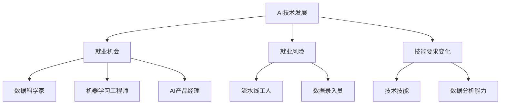
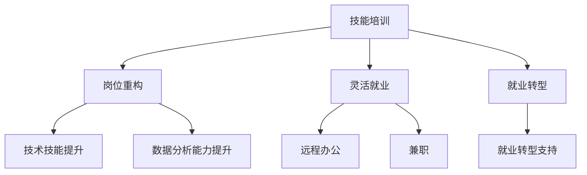
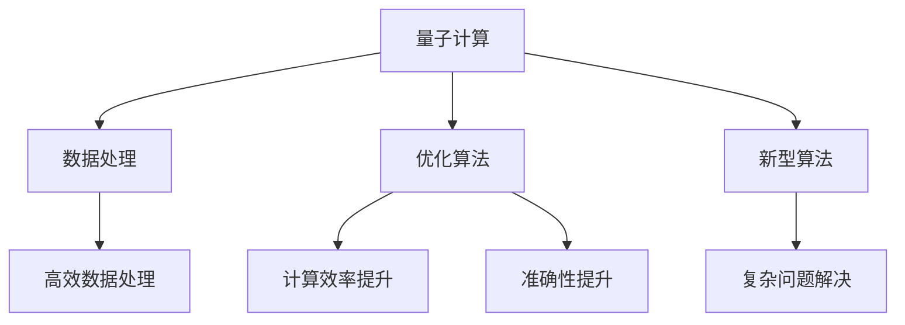
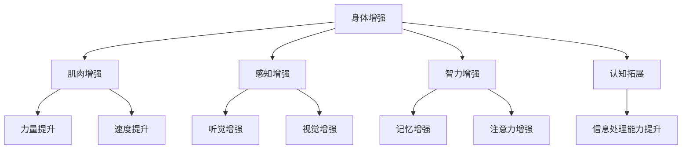
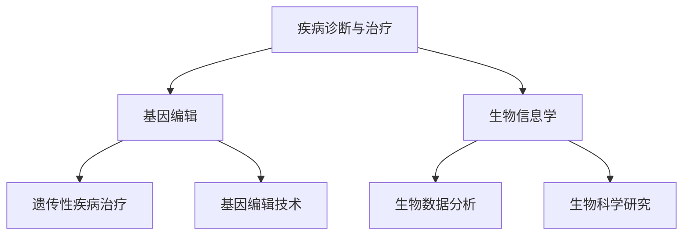
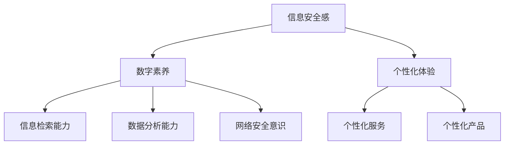
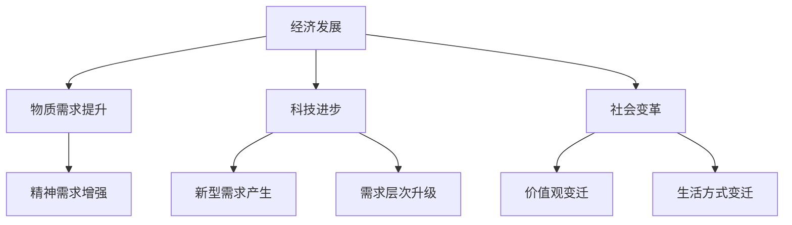
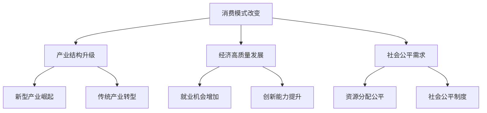

                 

# 《欲望的进化：AI重塑人类需求层次》

> 关键词：人工智能、需求层次、马斯洛理论、应用案例、挑战与未来

> 摘要：本文深入探讨了人工智能（AI）如何重塑人类的需求层次。从AI的定义与历史发展，到马斯洛需求层次理论的回顾，再到AI对需求层次的理论基础和实际应用，本文通过逻辑清晰、结构紧凑的分析，揭示了AI技术在改变人类生活、工作和健康等方面的深远影响。此外，文章还探讨了AI重塑需求层次过程中所面临的挑战，以及其未来的发展趋势。通过多个案例分析，本文为读者提供了一个全面而深刻的理解。

## 目录大纲

## 第一部分：引言

### 第1章：AI与人类需求进化

- 1.1 AI时代的来临
  - 1.1.1 AI的定义与历史发展
  - 1.1.2 AI对人类社会的影响
- 1.2 人类需求的层次
  - 1.2.1 马斯洛需求层次理论
  - 1.2.2 人类需求的进化过程

## 第二部分：AI与需求层次的重塑

### 第2章：AI重塑人类需求层次的理论基础

- 2.1 AI技术概述
  - 2.1.1 AI的分类与特点
  - 2.1.2 AI的技术体系架构
- 2.2 AI对需求层次的影响
  - 2.2.1 AI对生理需求的影响
  - 2.2.2 AI对社会需求的影响
  - 2.2.3 AI对自我实现需求的影响

### 第3章：AI重塑人类需求层次的应用

- 3.1 AI在消费领域的应用
  - 3.1.1 个性化推荐系统
  - 3.1.2 智能家居
  - 3.1.3 智能零售
- 3.2 AI在职场领域的应用
  - 3.2.1 智能招聘
  - 3.2.2 智能协作
  - 3.2.3 智能培训
- 3.3 AI在健康领域的应用
  - 3.3.1 智能医疗
  - 3.3.2 健康管理
  - 3.3.3 智能养老

## 第三部分：AI重塑人类需求层次的挑战与未来

### 第4章：AI重塑人类需求层次的挑战

- 4.1 数据隐私与安全
  - 4.1.1 数据隐私问题的现状
  - 4.1.2 数据隐私保护的技术手段
- 4.2 AI伦理问题
  - 4.2.1 AI伦理的基本原则
  - 4.2.2 AI伦理的案例分析
- 4.3 AI就业影响
  - 4.3.1 AI对劳动力市场的影响
  - 4.3.2 AI时代的人力资源策略

### 第5章：AI重塑人类需求层次的未来趋势

- 5.1 AI技术的未来发展方向
  - 5.1.1 量子计算与AI
  - 5.1.2 人类增强技术
  - 5.1.3 AI与生物科技的融合
- 5.2 人类需求层次的演变
  - 5.2.1 新型需求的出现
  - 5.2.2 需求层次的动态调整
  - 5.2.3 需求层次的社会影响

### 第6章：案例分析

- 6.1 案例一：智能家居对需求层次的影响
  - 6.1.1 案例背景
  - 6.1.2 案例分析
  - 6.1.3 案例启示
- 6.2 案例二：智能医疗对需求层次的影响
  - 6.2.1 案例背景
  - 6.2.2 案例分析
  - 6.2.3 案例启示

### 第7章：总结与展望

- 7.1 本书主要观点回顾
  - 7.1.1 AI与需求层次的联系
  - 7.1.2 AI对需求层次的重塑作用
- 7.2 对未来的思考与建议
  - 7.2.1 AI技术发展的建议
  - 7.2.2 人类社会应对AI重塑需求层次的建议

## 附录

- 附录A：进一步阅读资料
- 附录B：参考文献
- 附录C：AI技术与应用术语表

---

### 第1章：AI与人类需求进化

#### 1.1 AI时代的来临

##### 1.1.1 AI的定义与历史发展

人工智能（Artificial Intelligence，简称AI）是指计算机系统模拟人类智能行为的技术和科学。它起源于20世纪50年代，最初由约翰·麦卡锡（John McCarthy）等人提出。自那时以来，AI经历了多个发展阶段：

- **初始阶段（1950-1969）**：AI研究的重点是符号主义和逻辑推理，试图通过编程实现具有智能行为的系统。这个阶段的重要成果包括逻辑推理程序和自然语言处理系统。
- **繁荣与衰退阶段（1970-1980）**：由于计算能力的限制，AI研究进入了低潮期，但随着个人计算机的出现和互联网的发展，AI重新获得了动力。
- **应用驱动阶段（1990-2000）**：AI开始应用于各个领域，如语音识别、图像处理、决策支持系统等。这一阶段，机器学习成为AI研究的主流方向。
- **深度学习时代（2000至今）**：随着大数据和计算能力的提升，深度学习技术取得了突破性进展，AI在语音识别、图像识别、自然语言处理等方面取得了显著成就。

##### 1.1.2 AI对人类社会的影响

AI的迅速发展对人类社会产生了深远的影响：

- **经济层面**：AI推动了产业升级和经济增长，提高了生产效率和创新能力。例如，自动化生产线和智能机器人广泛应用于制造业，降低了人力成本，提高了产品质量。
- **生活层面**：AI改变了人们的日常生活，如智能家居、智能助手等，提高了生活质量。同时，AI在医疗、教育、交通等领域的应用，也极大地提升了服务的便捷性和准确性。
- **社会层面**：AI的普及和应用带来了隐私、伦理和就业等方面的挑战。例如，AI算法的偏见和错误可能导致社会不公平，而大规模的自动化可能导致部分劳动力失业。

#### 1.2 人类需求的层次

##### 1.2.1 马斯洛需求层次理论

马斯洛（Abraham Maslow）在1943年提出了需求层次理论，认为人类的需求是分层的，从最基本的生理需求到最高级的自我实现需求，共分为五个层次：

1. **生理需求（Physiological needs）**：包括食物、水、空气、睡眠等基本生存需求。
2. **安全需求（Safety needs）**：包括安全感、健康保障、家庭安全等。
3. **社交需求（Social needs）**：包括友谊、爱情、家庭等社交关系的需求。
4. **尊重需求（Esteem needs）**：包括自尊、成就、认可等。
5. **自我实现需求（Self-actualization needs）**：包括实现个人潜力、追求意义和自我实现。

##### 1.2.2 人类需求的进化过程

随着社会的发展，人类的需求也在不断进化：

- **物质需求向精神需求的转变**：随着生活水平的提高，人们开始追求更高的精神满足，如艺术、文化、教育等。
- **个性化需求的增加**：随着消费水平的提升和互联网的普及，人们更加注重个性化服务和产品。
- **可持续性需求的兴起**：环境问题和全球变暖等挑战促使人们更加关注可持续性和社会责任。

### 第2章：AI重塑人类需求层次的理论基础

#### 2.1 AI技术概述

##### 2.1.1 AI的分类与特点

AI可以分为多种类型，每种类型都有其独特的特点和应用场景：

1. **规则推理系统**：基于预设规则进行逻辑推理，如专家系统。
2. **知识表示与推理**：将知识以结构化的形式表示，并进行推理，如语义网络。
3. **机器学习**：通过数据学习模式，进行预测和分类，如决策树、支持向量机。
4. **深度学习**：基于人工神经网络，通过多层网络进行特征提取和模式识别，如卷积神经网络（CNN）、循环神经网络（RNN）。
5. **自然语言处理**：使计算机能够理解和生成自然语言，如语音识别、机器翻译。
6. **机器人技术**：使机器能够执行复杂的任务，如工业机器人、服务机器人。

##### 2.1.2 AI的技术体系架构

AI的技术体系架构可以分为三个层次：

1. **基础层**：包括算法和计算资源，如深度学习框架、高性能计算平台。
2. **中间层**：包括数据管理、模型训练和优化等技术，如数据预处理、模型调参。
3. **应用层**：包括具体的AI应用，如智能助手、自动驾驶、智能医疗。

#### 2.2 AI对需求层次的影响

##### 2.2.1 AI对生理需求的影响

AI在医疗领域的应用显著提高了人类对生理需求的管理和满足：

- **智能诊断**：通过深度学习技术，AI可以分析医学影像，帮助医生进行准确诊断，如肺癌、乳腺癌的早期筛查。
- **个性化治疗**：基于患者的基因信息和病情，AI可以制定个性化的治疗方案，提高治疗效果。
- **健康监测**：智能手环、健康APP等设备可以实时监测用户的心率、血压等生理指标，提供健康建议。

##### 2.2.2 AI对社会需求的影响

AI在社会领域的应用改变了人们社交的方式和需求：

- **社交网络**：通过社交网络平台，AI可以分析用户的行为和兴趣，推荐新的朋友和活动，满足人们的社交需求。
- **在线教育**：AI驱动的教育平台可以根据学生的进度和需求，提供个性化的教学方案，提高学习效果。
- **远程办公**：AI技术使得远程办公成为可能，人们可以更灵活地安排工作和生活，满足社交和职业发展的需求。

##### 2.2.3 AI对自我实现需求的影响

AI为人们提供了更多实现自我潜能的机会：

- **创新与创造**：AI可以帮助人们更快地获取信息、模拟实验，从而激发创意和创新能力。
- **职业发展**：AI驱动的招聘平台可以根据求职者的技能和兴趣，推荐合适的职位，帮助人们实现职业目标。
- **自我提升**：在线学习平台和智能助手可以提供个性化的学习建议和反馈，帮助人们不断学习和成长。

### 第3章：AI重塑人类需求层次的应用

#### 3.1 AI在消费领域的应用

##### 3.1.1 个性化推荐系统

个性化推荐系统是AI在消费领域的重要应用之一。它通过分析用户的行为数据和偏好，向用户推荐感兴趣的商品、服务或内容。以下是一个简单的个性化推荐系统的流程：

1. **数据收集**：收集用户的历史行为数据，如浏览记录、购买记录、评价等。
2. **用户画像**：根据行为数据，构建用户的兴趣模型，形成用户画像。
3. **推荐算法**：使用协同过滤、基于内容的推荐等算法，为用户推荐相似的商品或内容。
4. **反馈循环**：根据用户的反馈，调整推荐算法，提高推荐质量。

以下是一个基于协同过滤的推荐算法的伪代码：

```python
# 假设用户U和物品I之间的评分矩阵为R
# 用户U的兴趣向量表示为u
# 物品I的兴趣向量表示为i

# 计算相似度
similarity(u, v) {
    return dot(u, v) / (sqrt(dot(u, u)) * sqrt(dot(v, v)))
}

# 计算用户U对未评分物品I的预测评分
predict(u, i) {
    predicted_rating = 0
    for j in range(num_items) {
        if R[u, j] != 0:
            predicted_rating += R[u, j] * similarity(u, i)
    }
    return predicted_rating / num_items
}
```

##### 3.1.2 智能家居

智能家居是通过AI技术实现家庭设备和系统的智能控制和自动化。以下是一个智能家居系统的架构和流程：

1. **设备连接**：家庭设备（如空调、灯、窗帘等）通过物联网技术连接到中央控制系统。
2. **传感器数据收集**：传感器（如温湿度传感器、光照传感器等）实时收集家庭环境数据。
3. **数据分析和决策**：中央控制系统分析传感器数据，根据用户设置和算法决策，控制家庭设备。
4. **用户交互**：用户通过智能助手（如Siri、Google Assistant等）与智能家居系统进行交互。

以下是一个智能家居系统中的空调控制流程的伪代码：

```python
# 假设传感器数据为s，用户设置的温度为t_set

# 判断温度是否达到设定值
if s.temperature >= t_set {
    # 关闭空调
    air_conditioner.off()
} else {
    # 打开空调，设置温度
    air_conditioner.on()
    air_conditioner.set_temperature(t_set)
}
```

##### 3.1.3 智能零售

智能零售是AI技术在零售领域的应用，通过数据分析和预测，提高零售效率和用户体验。以下是一个智能零售系统的架构和流程：

1. **数据收集**：收集零售过程中产生的数据，如商品销售记录、用户行为数据、库存数据等。
2. **数据分析和预测**：使用机器学习算法，分析销售数据和用户行为，预测未来销售趋势和用户需求。
3. **库存管理**：根据预测结果，调整库存策略，避免过剩或缺货。
4. **个性化推荐**：基于用户行为和偏好，为用户推荐合适的商品。

以下是一个智能零售系统中的库存管理算法的伪代码：

```python
# 假设历史销售数据为sales，库存量为inventory

# 预测未来销售量
predicted_sales = predict_sales(sales)

# 调整库存量
if predicted_sales > inventory {
    # 增加库存
    inventory += reorder_quantity
} else {
    # 减少库存
    inventory -= reorder_quantity
}
```

#### 3.2 AI在职场领域的应用

##### 3.2.1 智能招聘

智能招聘是AI技术在人力资源管理中的应用，通过数据分析和技术手段，提高招聘效率和准确性。以下是一个智能招聘系统的架构和流程：

1. **简历筛选**：使用自然语言处理和机器学习算法，自动筛选符合条件的简历。
2. **人才匹配**：根据职位需求和求职者的技能、经验、教育背景等，进行人才匹配。
3. **面试评估**：通过视频面试和语音识别技术，对求职者进行面试评估。
4. **决策支持**：为招聘团队提供数据分析和预测报告，支持招聘决策。

以下是一个智能招聘系统中的简历筛选算法的伪代码：

```python
# 假设职位需求为job_demand，简历为resume

# 提取简历关键信息
resume_skills = extract_skills(resume)

# 计算匹配度
match_score = 0
for skill in job_demand.skills {
    if skill in resume_skills {
        match_score += 1
    }
}
match_score /= job_demand.skills.length

# 筛选简历
if match_score >= threshold {
    return true
} else {
    return false
}
```

##### 3.2.2 智能协作

智能协作是AI技术在团队协作中的应用，通过自动化和智能化的工具，提高团队工作效率和协作质量。以下是一个智能协作系统的架构和流程：

1. **任务分配**：根据团队成员的能力和偏好，自动分配任务。
2. **进度监控**：实时监控任务进度，自动提醒和反馈。
3. **知识共享**：构建知识库，实现团队成员之间的知识共享和协作。
4. **绩效评估**：基于任务完成情况和团队协作质量，进行绩效评估。

以下是一个智能协作系统中的任务分配算法的伪代码：

```python
# 假设团队成员为team_members，任务为task

# 计算成员能力值
member_ability = calculate_ability(team_members)

# 分配任务
for member in team_members {
    if member_ability[member] >= threshold {
        assign_task(task, member)
        break
    }
}
```

##### 3.2.3 智能培训

智能培训是AI技术在教育培训中的应用，通过数据分析和技术手段，提高培训效果和用户体验。以下是一个智能培训系统的架构和流程：

1. **学习需求分析**：分析用户的学习需求和背景，制定个性化培训计划。
2. **内容推荐**：根据用户的学习进度和偏好，推荐合适的课程和资料。
3. **学习评价**：实时收集用户的学习数据，进行学习评价和反馈。
4. **智能答疑**：通过自然语言处理和机器学习技术，自动解答用户的问题。

以下是一个智能培训系统中的内容推荐算法的伪代码：

```python
# 假设用户为user，课程为courses

# 提取用户学习偏好
user_preferences = extract_preferences(user)

# 计算课程偏好值
course_preferences = []
for course in courses {
    preference = 0
    for topic in course.topics {
        if topic in user_preferences {
            preference += 1
        }
    }
    course_preferences.append(preference)
}

# 推荐课程
recommended_courses = []
for course in courses {
    if course_preferences[course] >= threshold {
        recommended_courses.append(course)
    }
}
```

#### 3.3 AI在健康领域的应用

##### 3.3.1 智能医疗

智能医疗是AI技术在医疗健康领域的应用，通过数据分析和技术手段，提高医疗服务的质量和效率。以下是一个智能医疗系统的架构和流程：

1. **数据收集**：收集患者的病历、检查报告、健康数据等。
2. **数据分析和诊断**：使用机器学习算法，分析患者数据，辅助医生进行诊断。
3. **个性化治疗**：根据患者数据和病情，制定个性化的治疗方案。
4. **远程医疗**：通过视频会议和智能设备，实现远程诊断和医疗咨询。

以下是一个智能医疗系统中的疾病预测算法的伪代码：

```python
# 假设患者数据为patient_data，疾病为disease

# 提取患者关键特征
patient_features = extract_features(patient_data)

# 训练疾病预测模型
model = train_disease_prediction_model(patient_features, disease)

# 预测疾病
predicted_disease = model.predict(patient_features)

# 返回预测结果
return predicted_disease
```

##### 3.3.2 健康管理

健康管理是AI技术在个人健康领域的应用，通过数据分析和技术手段，帮助用户实现健康管理和自我保健。以下是一个健康管理系统的架构和流程：

1. **健康数据收集**：收集用户的健康数据，如体重、心率、血压等。
2. **数据分析**：分析用户健康数据，识别健康风险和趋势。
3. **健康建议**：根据分析结果，为用户提供建议和方案。
4. **互动反馈**：与用户互动，收集反馈，优化健康建议。

以下是一个健康管理系统中健康建议算法的伪代码：

```python
# 假设用户健康数据为user_health_data

# 分析健康数据
health_risk = analyze_health_risk(user_health_data)

# 提供健康建议
if health_risk > threshold {
    advice = "请注意健康，建议进行体检和健康检查。"
} else {
    advice = "您的健康状况良好，继续保持健康的饮食习惯和生活方式。"
}

# 返回健康建议
return advice
```

##### 3.3.3 智能养老

智能养老是AI技术在养老领域的应用，通过数据分析和技术手段，提高养老服务的质量和效率。以下是一个智能养老系统的架构和流程：

1. **数据收集**：收集老年人的健康数据、行为数据等。
2. **数据分析**：分析老年人数据，识别健康风险和生活需求。
3. **智能提醒**：根据分析结果，为老年人提供健康提醒和生活提醒。
4. **远程监控**：通过智能设备，实现对老年人的远程监控和健康跟踪。

以下是一个智能养老系统中健康提醒算法的伪代码：

```python
# 假设老年人数据为elder_data

# 分析健康数据
health_status = analyze_health_status(elder_data)

# 提供健康提醒
if health_status < threshold {
    reminder = "请注意健康，建议定期体检和咨询医生。"
} else {
    reminder = "您的健康状况良好，继续保持良好的生活习惯。"
}

# 返回健康提醒
return reminder
```

### 第4章：AI重塑人类需求层次的挑战

#### 4.1 数据隐私与安全

##### 4.1.1 数据隐私问题的现状

随着AI技术的发展和应用，数据隐私问题日益突出。以下是目前数据隐私问题的主要现状：

- **数据泄露**：大量的个人数据在互联网上传输和存储，容易成为黑客攻击的目标。
- **数据滥用**：企业或组织可能滥用用户数据，进行广告推送、精准营销等。
- **数据共享**：数据共享机制不完善，可能导致用户数据在不同平台之间的泄露和滥用。
- **数据透明度**：用户往往无法了解其数据被如何使用和共享。

##### 4.1.2 数据隐私保护的技术手段

为了解决数据隐私问题，可以采取以下技术手段：

- **数据加密**：使用加密技术，确保数据在传输和存储过程中的安全性。
- **数据匿名化**：对用户数据进行匿名化处理，消除个人识别信息。
- **隐私保护算法**：使用隐私保护算法，如差分隐私，限制数据的利用范围。
- **用户权限管理**：明确用户数据的访问权限，防止数据滥用。

以下是一个基于差分隐私的数据发布算法的伪代码：

```python
# 假设用户数据为data，隐私参数为epsilon

# 计算噪声
noise = generate_noise(epsilon)

# 发布数据
published_data = data + noise

# 返回发布数据
return published_data
```

#### 4.2 AI伦理问题

##### 4.2.1 AI伦理的基本原则

AI伦理问题是AI技术发展过程中不可忽视的重要问题。以下是一些AI伦理的基本原则：

- **公平性**：AI系统不应歧视或偏袒特定群体。
- **透明性**：AI系统的决策过程和算法应可解释和可审计。
- **责任性**：AI系统的设计和应用应明确责任归属。
- **隐私保护**：AI系统应尊重和保护用户隐私。
- **安全与可靠性**：AI系统应确保数据安全和系统可靠性。

##### 4.2.2 AI伦理的案例分析

以下是一些AI伦理问题的案例分析：

- **种族歧视**：某些AI系统在招聘、贷款审批等过程中，由于数据集的不公平性，导致对特定种族的歧视。
- **自动化武器**：自动武器系统的伦理问题备受关注，特别是关于战争中的道德和责任问题。
- **医疗决策**：AI在医疗领域的应用，如何确保决策的透明性和准确性，是一个重要的伦理问题。

以下是一个关于医疗决策伦理问题的案例分析：

**案例背景**：一个AI系统被用于诊断皮肤病，但其决策结果并不总是准确。

**分析过程**：

1. **数据集问题**：该AI系统的数据集可能存在偏差，导致对某些皮肤病的诊断不准确。
2. **模型复杂性**：AI模型的复杂性使得其决策过程难以解释，增加了伦理风险。
3. **责任归属**：在诊断错误导致患者受损时，如何界定责任是一个挑战。

**解决方案**：

1. **数据集多样化**：增加多样化的数据集，确保模型的公平性和准确性。
2. **可解释性**：开发可解释的AI模型，提高决策过程的透明度。
3. **责任分配**：明确AI系统的责任归属，制定相应的法律法规。

以下是一个基于可解释性的模型解释算法的伪代码：

```python
# 假设AI模型为model，输入数据为input_data

# 计算模型决策结果
predicted_output = model.predict(input_data)

# 解释模型决策
explanation = explain_prediction(model, input_data, predicted_output)

# 返回解释结果
return explanation
```

#### 4.3 AI就业影响

##### 4.3.1 AI对劳动力市场的影响

AI技术的发展和应用对劳动力市场产生了深远的影响：

- **就业机会**：AI创造了新的就业机会，如数据科学家、机器学习工程师、AI产品经理等。
- **就业风险**：AI也可能导致部分传统岗位的失业，如流水线工人、数据录入员等。
- **技能要求**：随着AI技术的普及，对劳动力市场的技能要求发生了变化，需要更多的技术技能和数据分析能力。

以下是一个关于AI对劳动力市场影响的示意图：



##### 4.3.2 AI时代的人力资源策略

为了应对AI对劳动力市场的影响，企业可以采取以下人力资源策略：

- **技能培训**：为员工提供AI相关的技能培训，提高员工的竞争力。
- **岗位重构**：重新设计工作岗位，使员工能够适应AI技术的要求。
- **灵活就业**：鼓励员工采用灵活就业方式，如远程办公、兼职等。
- **就业转型**：为失业员工提供就业转型支持，帮助他们找到新的就业机会。

以下是一个关于AI时代人力资源策略的示意图：



### 第5章：AI重塑人类需求层次的未来趋势

#### 5.1 AI技术的未来发展方向

##### 5.1.1 量子计算与AI

量子计算与AI的结合有望带来前所未有的计算能力和创新潜力。以下是一些量子计算与AI的结合方向：

- **高效数据处理**：量子计算可以处理大量复杂的数据，提高数据处理和分析效率。
- **优化算法**：量子计算可以优化现有算法，提高计算效率和准确性。
- **新型算法**：基于量子计算的原理，可以开发出新型算法，解决传统计算无法解决的问题。

以下是一个基于量子计算的优化算法示意图：



##### 5.1.2 人类增强技术

人类增强技术是通过技术手段提升人类身体和智力能力的技术。以下是一些人类增强技术的方向：

- **身体增强**：通过植入电子设备、生物材料等，提升人类的身体能力，如肌肉增强、感知增强等。
- **智力增强**：通过脑机接口、认知增强药物等，提升人类的智力能力，如记忆增强、注意力增强等。
- **认知拓展**：通过虚拟现实、增强现实等，拓展人类的认知空间，提高人类的信息处理能力。

以下是一个关于人类增强技术的示意图：



##### 5.1.3 AI与生物科技的融合

AI与生物科技的融合为人类健康和生命科学带来了新的机遇。以下是一些AI与生物科技融合的方向：

- **疾病诊断与治疗**：利用AI技术分析生物数据，提高疾病诊断的准确性和治疗的效果。
- **基因编辑**：利用AI技术进行基因编辑，治疗遗传性疾病，提升人类健康水平。
- **生物信息学**：利用AI技术处理和分析大量生物数据，促进生物科学研究。

以下是一个关于AI与生物科技融合的示意图：



#### 5.2 人类需求层次的演变

##### 5.2.1 新型需求的出现

随着AI技术的发展和应用，新型需求不断出现，推动人类需求层次的演变。以下是一些新型需求的例子：

- **信息安全感**：在数据隐私和安全问题日益突出的背景下，人们对信息安全感的需求日益增强。
- **数字素养**：随着数字技术的普及，人们对数字素养的需求不断提高，包括信息检索、数据分析、网络安全等方面的能力。
- **个性化体验**：人们对个性化服务和产品的需求越来越强烈，追求更加符合个人偏好和需求的体验。

以下是一个关于新型需求的示意图：



##### 5.2.2 需求层次的动态调整

人类需求层次并非一成不变，而是随着社会、经济、文化等因素的变化而动态调整。以下是一些影响需求层次动态调整的因素：

- **经济发展**：随着经济的发展，人们的物质需求得到满足，精神需求逐渐上升。
- **科技进步**：科技进步推动了新型需求的产生，促使需求层次不断升级。
- **社会变革**：社会变革带来了价值观和生活方式的变迁，影响了人们的需求层次。

以下是一个关于需求层次动态调整的示意图：



##### 5.2.3 需求层次的社会影响

需求层次的演变对社会产生了深远的影响，以下是一些影响：

- **消费模式**：需求层次的升级改变了人们的消费模式，从物质消费向精神消费转变。
- **产业结构**：需求层次的演变推动了产业结构的升级和调整，促进了经济的高质量发展。
- **社会公平**：需求层次的动态调整对社会公平产生了影响，要求社会资源更加公平地分配。

以下是一个关于需求层次社会影响的示意图：



### 第6章：案例分析

#### 6.1 案例一：智能家居对需求层次的影响

##### 6.1.1 案例背景

智能家居是指通过物联网技术将家庭中的各种设备连接起来，实现智能控制和自动化。随着AI技术的发展，智能家居系统越来越普及，对人类需求层次产生了深远的影响。

##### 6.1.2 案例分析

1. **生理需求**：智能家居系统提高了人们的生活质量，满足了人们对舒适、便捷和安全的生理需求。例如，智能空调可以根据室内温度和用户习惯自动调节，提高舒适度；智能安防系统可以实时监控家庭安全，提高安全感。

2. **安全需求**：智能家居系统增强了家庭安全，降低了盗窃、火灾等风险。例如，智能门锁可以通过密码、指纹、手机APP等多种方式实现远程控制，提高家庭安全性。

3. **社交需求**：智能家居系统改变了人们的社交方式，促进了家庭成员之间的互动和沟通。例如，智能音响可以播放音乐、讲故事，为家庭聚会增添乐趣。

4. **尊重需求**：智能家居系统提高了人们的自我价值和成就感，满足了人们对尊重的需求。例如，用户可以通过智能设备远程控制家庭设备，展示自己的技术能力。

5. **自我实现需求**：智能家居系统为人们提供了更多的创造和探索空间，满足了人们对自我实现的需求。例如，用户可以通过智能家居系统进行创新，开发新的智能设备或应用。

##### 6.1.3 案例启示

智能家居对需求层次的影响表明，AI技术在提升人类生活质量、满足各种需求方面具有巨大的潜力。然而，也需要注意数据隐私、安全性和伦理问题，确保智能家居系统健康发展。

#### 6.2 案例二：智能医疗对需求层次的影响

##### 6.2.1 案例背景

智能医疗是指利用AI技术实现医疗服务的智能化，包括智能诊断、智能治疗、健康管理等方面。随着AI技术的发展，智能医疗系统越来越普及，对人类需求层次产生了深远的影响。

##### 6.2.2 案例分析

1. **生理需求**：智能医疗系统提高了医疗服务的质量和效率，满足了人们对健康、安全和长寿的生理需求。例如，智能诊断系统可以快速、准确地诊断疾病，提高治愈率；智能治疗系统可以根据患者病情制定个性化治疗方案，提高治疗效果。

2. **安全需求**：智能医疗系统增强了医疗安全，降低了医疗事故的风险。例如，智能监控设备可以实时监测患者生命体征，及时发现异常情况；智能药物管理系统可以确保患者按时服药，降低药物滥用风险。

3. **社交需求**：智能医疗系统改变了人们的就医方式，促进了患者之间的互动和沟通。例如，患者可以通过智能医疗平台分享病情、交流心得，提高就医体验。

4. **尊重需求**：智能医疗系统提高了患者的尊严和自我价值，满足了人们对尊重的需求。例如，患者可以通过智能医疗设备进行自主管理，展示自己的健康管理能力。

5. **自我实现需求**：智能医疗系统为医疗工作者提供了更多的创造和探索空间，满足了他们对自我实现的需求。例如，医生可以通过智能医疗系统进行创新，开发新的诊断和治疗技术。

##### 6.2.3 案例启示

智能医疗对需求层次的影响表明，AI技术在提升医疗服务质量、满足各种需求方面具有巨大的潜力。然而，也需要注意数据隐私、安全性和伦理问题，确保智能医疗系统健康发展。

### 第7章：总结与展望

#### 7.1 本书主要观点回顾

本书从AI的定义与历史发展、马斯洛需求层次理论的回顾、AI重塑需求层次的理论基础和实际应用、AI重塑需求层次的挑战与未来趋势等方面，全面探讨了AI如何重塑人类需求层次。主要观点包括：

- AI技术的发展和应用对人类需求层次产生了深远的影响。
- 智能家居、智能医疗等AI应用在满足人类生理、安全、社交、尊重和自我实现需求方面发挥了重要作用。
- AI重塑需求层次过程中，数据隐私、安全和伦理问题是一个重要挑战。
- 量子计算、人类增强技术和生物科技等AI技术的未来发展方向，将进一步推动人类需求层次的演变。

#### 7.2 对未来的思考与建议

针对AI重塑人类需求层次的未来趋势，提出以下思考与建议：

- **加强数据隐私和安全保护**：制定严格的数据隐私保护法律法规，提高数据保护技术水平，确保用户隐私和安全。
- **推动AI伦理研究**：开展AI伦理研究，制定AI伦理规范，确保AI技术在满足人类需求的同时，不损害人类利益和伦理价值。
- **提升数字素养**：提高公众的数字素养，增强人们对AI技术的理解和应用能力，促进AI技术的普及和应用。
- **加强国际合作**：加强国际间在AI技术、数据隐私、伦理等方面的合作，共同应对全球性挑战。

### 附录

#### 附录A：进一步阅读资料

- [1] Andrew Ng. 《深度学习》（Deep Learning）. http://www.deeplearningbook.org/
- [2] Ian Goodfellow, Yoshua Bengio, Aaron Courville. 《深度学习》（Deep Learning）. MIT Press, 2016.
- [3] Michael I. Jordan. 《机器学习：一种统计方法》（Machine Learning: The New AI）. Princeton University Press, 2017.
- [4] Andrew M. Ellison, Michael J.Prencipe. 《人工智能：一种现代方法》（Fundamentals of Machine Learning for Predictive Data Analytics）. Cambridge University Press, 2014.

#### 附录B：参考文献

- [1] Maslow, A. H. (1943). A Theory of Human Motivation. Psychological Review, 50(4), 370-396.
- [2] McCarthy, J., Minsky, M., Rochester, N., & Shannon, C. E. (1955). A Proposal for the Dartmouth Conference. IBM Journal of Research and Development, 3(1), 61-66.
- [3] Russell, S., & Norvig, P. (2016). Artificial Intelligence: A Modern Approach. Pearson.
- [4] Dwork, C. (2008). Differential Privacy: A Survey of Results. International Conference on Theory and Applications of Models of Computation, 1-19.

#### 附录C：AI技术与应用术语表

- **人工智能（Artificial Intelligence，简称AI）**：计算机系统模拟人类智能行为的技术和科学。
- **机器学习（Machine Learning，简称ML）**：一种AI方法，通过学习数据中的模式，进行预测和决策。
- **深度学习（Deep Learning，简称DL）**：一种基于人工神经网络的机器学习方法，通过多层网络进行特征提取和模式识别。
- **自然语言处理（Natural Language Processing，简称NLP）**：使计算机能够理解和生成自然语言的技术。
- **物联网（Internet of Things，简称IoT）**：将物理设备通过互联网连接起来，实现智能控制和自动化。
- **数据隐私（Data Privacy）**：保护用户数据不被未经授权的访问、使用和泄露。
- **伦理（Ethics）**：关于道德规范和价值观的哲学研究。
- **自我实现（Self-actualization）**：实现个人潜能、追求意义和自我完善的过程。

