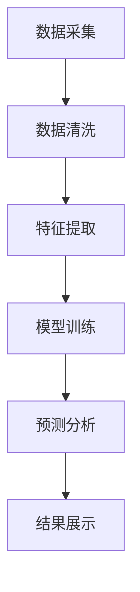
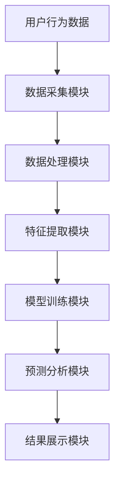

                 

# 欲望社会化网络：AI驱动的群体动力学平台

> 关键词：欲望社会化网络、AI、群体动力学、平台架构、算法原理、数学模型、项目实战

> 摘要：本文探讨了欲望社会化网络的构建与运作机制，介绍了AI驱动的群体动力学平台的设计与实现。通过详细剖析核心概念、算法原理、数学模型以及项目实战，本文为理解和应用AI在群体动力学中的关键技术提供了全面的技术指导。

## 第一部分：引言

### 1.1 书籍主题与背景

在当今数字化时代，社会化网络已经成为人们日常生活的重要组成部分。而欲望作为人类行为的核心驱动力，与社会化网络的互动愈发紧密。本文将以“欲望社会化网络：AI驱动的群体动力学平台”为主题，深入探讨这一新兴领域的构建与运作机制。

欲望社会化网络是指基于用户欲望的信息传播与互动平台，通过AI技术实现数据的智能分析与处理，从而揭示群体行为模式与趋势。AI驱动的群体动力学平台则是一个集成了多种AI技术的综合性平台，用于研究群体行为、预测群体动态，并在实际应用中发挥重要作用。

### 1.2 AI在群体动力学中的应用

AI在群体动力学中的应用主要体现在以下几个方面：

1. **数据采集与预处理**：利用传感器、社交网络数据等来源，获取大量用户行为数据，通过AI技术进行数据清洗、去噪和特征提取。
2. **特征提取与建模**：通过机器学习算法，将用户行为数据转化为可量化的特征，构建群体动力学的数学模型。
3. **模型训练与优化**：使用训练数据对模型进行训练，并通过交叉验证和超参数调整，提高模型预测的准确性。
4. **预测与分析**：基于训练好的模型，对群体行为进行预测，分析群体动态趋势，为决策提供支持。

### 1.3 书籍结构概览

本文将分为七个部分：

- **第一部分：引言**：介绍书籍主题与背景。
- **第二部分：欲望社会化网络基础**：探讨社会化网络的定义与特点，欲望的概念与分类，欲望社会化网络的运作机制。
- **第三部分：AI驱动的群体动力学平台**：介绍AI技术在群体动力学中的应用，平台架构与功能模块。
- **第四部分：核心算法原理讲解**：详细讲解群体动力学模型与AI算法原理。
- **第五部分：数学模型和数学公式**：阐述社会化网络、欲望以及AI驱动的群体动力学平台的数学模型。
- **第六部分：项目实战**：通过实际项目，展示AI驱动的群体动力学平台的应用。
- **第七部分：未来展望与结论**：总结本文的主要观点，展望欲望社会化网络与AI驱动的群体动力学平台的未来发展趋势。

## 第二部分：欲望社会化网络基础

### 2.1 社会化网络的定义与特点

社会化网络是指通过互联网平台，用户之间进行信息交换、互动与协作的一种社会结构。其主要特点包括：

- **用户生成内容（UGC）**：社会化网络的核心是用户生成的内容，用户通过发布、评论、点赞等方式参与互动。
- **社交关系**：社会化网络通过用户之间的关系网络，实现信息的传播与影响。
- **数据驱动**：社会化网络依赖于海量用户数据的收集与分析，为用户提供个性化推荐与服务。
- **实时性**：社会化网络具有高度的实时性，信息传播速度快，用户互动及时。

### 2.2 欲望的概念与分类

欲望是指个体在生理、心理或社会层面上的需求、愿望或期望。根据欲望的性质与来源，可以将其分为以下几类：

- **生理欲望**：包括食物、水分、睡眠、性等方面的需求。
- **心理欲望**：包括成就感、认同感、安全感等方面的需求。
- **社会欲望**：包括社交地位、权力、财富等方面的需求。

### 2.3 欲望社会化网络的运作机制

欲望社会化网络的运作机制主要包括以下几个方面：

1. **用户行为与欲望的互动**：用户在社交网络上的行为受到欲望的影响，如发布、评论、点赞等。同时，用户的欲望也会通过行为数据反映出来。
2. **欲望的传播**：用户之间的互动与关系网络，使得欲望在不同用户之间传播，形成一种群体效应。
3. **群体动力学的形成**：在大量用户行为数据的基础上，AI技术能够揭示群体行为模式与趋势，形成群体动力学模型。
4. **个性化推荐**：基于用户行为数据与欲望分析，社会化网络平台可以为用户提供个性化的推荐与服务。

## 第三部分：AI驱动的群体动力学平台

### 3.1 AI技术在群体动力学中的应用

AI技术在群体动力学中的应用主要包括以下几个方面：

1. **数据采集与预处理**：利用传感器、社交网络数据等来源，获取大量用户行为数据，通过AI技术进行数据清洗、去噪和特征提取。
2. **特征提取与建模**：通过机器学习算法，将用户行为数据转化为可量化的特征，构建群体动力学的数学模型。
3. **模型训练与优化**：使用训练数据对模型进行训练，并通过交叉验证和超参数调整，提高模型预测的准确性。
4. **预测与分析**：基于训练好的模型，对群体行为进行预测，分析群体动态趋势，为决策提供支持。

### 3.2 AI驱动的群体动力学平台架构

AI驱动的群体动力学平台架构主要包括以下几个部分：

1. **数据采集模块**：负责从各种数据源获取用户行为数据，如传感器数据、社交网络数据等。
2. **数据处理模块**：对采集到的数据进行清洗、去噪和特征提取，为后续建模和分析提供高质量的数据。
3. **模型训练模块**：使用机器学习算法对特征数据进行分析，构建群体动力学的数学模型。
4. **预测分析模块**：基于训练好的模型，对群体行为进行预测，分析群体动态趋势。
5. **可视化模块**：将预测结果和群体动态趋势以可视化的形式展示，帮助用户理解和分析群体行为。

### 3.3 AI驱动的群体动力学平台功能模块

AI驱动的群体动力学平台功能模块主要包括以下几个部分：

1. **数据采集与预处理**：从各种数据源获取用户行为数据，并进行清洗、去噪和特征提取。
2. **特征提取与建模**：将用户行为数据转化为可量化的特征，构建群体动力学的数学模型。
3. **模型训练与优化**：使用训练数据对模型进行训练，并通过交叉验证和超参数调整，提高模型预测的准确性。
4. **预测与分析**：基于训练好的模型，对群体行为进行预测，分析群体动态趋势。
5. **个性化推荐**：基于用户行为数据和欲望分析，为用户提供个性化的推荐与服务。

## 第四部分：核心算法原理讲解

### 4.1 群体动力学模型

群体动力学模型用于描述群体行为随时间变化的规律。常见的群体动力学模型包括：

1. **SIR模型**：用于描述传染病在群体中的传播规律，分为易感者（S）、感染者（I）和恢复者（R）三个状态。
2. **BA模型**：用于描述复杂网络的生成过程，通过引入新的节点与已有节点建立连接，形成小世界网络和无标度网络。
3. **SW模型**：用于描述社会网络中信息传播的过程，包括传播源（S）、传播者（W）和感染者（I）三个状态。

以下是一个简单的SIR模型伪代码：

```python
# SIR模型伪代码
class SIRModel:
    def __init__(self, S, I, R):
        self.S = S
        self.I = I
        self.R = R

    def update(self):
        for i in range(len(self.I)):
            if random.random() < self.I[i] / (self.S[i] + self.I[i] + self.R[i]):
                self.S[i] += 1
                self.I[i] -= 1
            elif random.random() < self.I[i] / (self.S[i] + self.I[i] + self.R[i]):
                self.S[i] -= 1
                self.R[i] += 1

# 示例
model = SIRModel([100, 100], [0, 0], [0, 0])
for i in range(100):
    model.update()
    print(model.S, model.I, model.R)
```

### 4.2 AI算法原理

AI算法在群体动力学中的应用主要包括以下几种：

1. **机器学习算法**：用于特征提取、模型训练和预测分析，如决策树、支持向量机、神经网络等。
2. **深度学习算法**：通过构建深度神经网络，实现对复杂数据的自动特征提取和模型训练，如卷积神经网络（CNN）、循环神经网络（RNN）等。
3. **强化学习算法**：通过奖励机制，使模型能够自主学习和优化策略，如Q学习、深度Q网络（DQN）等。

以下是一个简单的决策树算法伪代码：

```python
# 决策树算法伪代码
def decision_tree(data, features, threshold):
    if all(data[feature] > threshold[feature] for feature in features):
        return "Yes"
    elif all(data[feature] <= threshold[feature] for feature in features):
        return "No"
    else:
        return "Unknown"

# 示例
data = {"feature1": 5, "feature2": 2, "feature3": 7}
threshold = {"feature1": 3, "feature2": 2, "feature3": 5}
result = decision_tree(data, ["feature1", "feature2", "feature3"], threshold)
print(result)
```

### 4.3 欲望社会化网络的动态分析

欲望社会化网络的动态分析主要关注以下两个方面：

1. **群体行为模式**：通过数据分析，揭示群体行为的规律和模式，如群体偏好、传播规律等。
2. **欲望传播**：分析欲望在社会化网络中的传播过程，研究欲望的起源、传播路径和影响范围。

以下是一个简单的欲望传播模型伪代码：

```python
# 欲望传播模型伪代码
class DesirePropagationModel:
    def __init__(self, users, desires):
        self.users = users
        self.desires = desires

    def propagate(self, start_user, desire):
        infected_users = [start_user]
        while infected_users:
            current_user = infected_users.pop()
            for neighbor in self.users[current_user]:
                if neighbor not in infected_users and random.random() < self.desires[current_user]:
                    infected_users.append(neighbor)
                    self.desires[neighbor] = self.desires[current_user]
        return infected_users

# 示例
users = {"user1": ["user2", "user3"], "user2": ["user1", "user4"], "user3": ["user1", "user5"], "user4": ["user2", "user6"], "user5": ["user3", "user6"], "user6": ["user4", "user5"]}
desires = {"user1": 0.8, "user2": 0.6, "user3": 0.4, "user4": 0.7, "user5": 0.3, "user6": 0.9}
model = DesirePropagationModel(users, desires)
infected_users = model.propagate("user1", 0.8)
print(infected_users)
```

## 第五部分：数学模型和数学公式

### 5.1 社会化网络的数学模型

社会化网络的数学模型主要用于描述网络结构和节点之间的关系。常见的数学模型包括：

1. **邻接矩阵**：用矩阵表示网络中节点之间的连接关系，矩阵元素表示节点之间的连接强度。
2. **度分布**：描述网络中节点度数的分布情况，常见的度分布模型有泊松分布、指数分布等。
3. **网络密度**：描述网络中连接节点数与可能连接节点数之比。

以下是一个简单的邻接矩阵表示的网络：

```latex
A = \begin{bmatrix}
0 & 1 & 0 & 1 \\
1 & 0 & 1 & 0 \\
0 & 1 & 0 & 1 \\
1 & 0 & 1 & 0
\end{bmatrix}
```

### 5.2 欲望的数学模型

欲望的数学模型主要用于描述个体欲望的量化表示和传播过程。常见的数学模型包括：

1. **欲望函数**：用函数表示个体的欲望水平，如线性函数、幂函数等。
2. **传播模型**：描述欲望在社会化网络中的传播过程，如SIR模型、SI模型等。

以下是一个简单的线性欲望函数表示：

```latex
f(x) = mx + b
```

其中，\( x \) 表示个体的欲望水平，\( m \) 表示欲望的增长率，\( b \) 表示欲望的初始值。

### 5.3 AI驱动的群体动力学平台的数学模型

AI驱动的群体动力学平台的整体数学模型包括以下几个部分：

1. **数据采集模型**：描述数据采集过程中的噪声、数据清洗和特征提取等过程。
2. **特征提取模型**：描述特征提取过程中的特征选择、特征转换和特征降维等过程。
3. **模型训练模型**：描述模型训练过程中的参数调整、交叉验证和模型优化等过程。
4. **预测分析模型**：描述预测分析过程中的群体行为预测、动态趋势分析和决策支持等过程。

以下是一个简单的群体动力学模型的整体数学模型：

```latex
\begin{aligned}
\text{数据采集模型} &: X = f(\text{原始数据}, \theta_1) \\
\text{特征提取模型} &: Z = g(X, \theta_2) \\
\text{模型训练模型} &: \theta_3 = h(Z, \text{训练数据}) \\
\text{预测分析模型} &: Y = k(Z, \theta_3)
\end{aligned}
```

其中，\( X \) 表示原始数据，\( Z \) 表示特征数据，\( Y \) 表示预测结果，\( \theta_1 \)、\( \theta_2 \)、\( \theta_3 \) 表示模型的参数。

## 第六部分：项目实战

### 6.1 项目背景与目标

本项目的目标是构建一个基于AI驱动的群体动力学平台，用于分析用户在社交网络中的行为模式与欲望传播，并为决策者提供科学的决策支持。具体目标包括：

1. **数据采集**：从社交网络平台获取用户行为数据，如发布、评论、点赞等。
2. **数据处理**：对采集到的数据进行分析、清洗和特征提取。
3. **模型构建**：基于用户行为数据和欲望特征，构建群体动力学模型。
4. **预测分析**：使用模型对用户行为进行预测，分析欲望传播趋势。
5. **决策支持**：根据预测结果，为决策者提供科学的决策建议。

### 6.2 开发环境搭建

为了实现本项目，需要搭建以下开发环境：

1. **硬件环境**：一台配置较高的计算机，用于运行模型训练和预测分析。
2. **软件环境**：安装Python 3.8及以上版本，以及相关机器学习库，如scikit-learn、TensorFlow、PyTorch等。
3. **依赖库**：安装必要的依赖库，如numpy、pandas、matplotlib等。

以下是一个简单的开发环境搭建步骤：

```bash
# 安装Python 3.8
sudo apt-get install python3.8

# 安装相关库
pip3 install numpy pandas scikit-learn tensorflow matplotlib
```

### 6.3 源代码详细实现

本项目将使用Python编程语言实现，主要包括以下几个模块：

1. **数据采集模块**：负责从社交网络平台获取用户行为数据。
2. **数据处理模块**：负责对采集到的数据进行分析、清洗和特征提取。
3. **模型训练模块**：负责训练群体动力学模型。
4. **预测分析模块**：负责使用模型对用户行为进行预测，分析欲望传播趋势。

以下是一个简单的数据采集模块的实现：

```python
import requests
import json

class DataCollector:
    def __init__(self, url, params):
        self.url = url
        self.params = params

    def collect_data(self):
        response = requests.get(self.url, params=self.params)
        data = json.loads(response.text)
        return data

# 示例
url = "https://api.socialnetwork.com/users"
params = {"page": 1, "size": 100}
collector = DataCollector(url, params)
data = collector.collect_data()
print(data)
```

### 6.4 代码解读与分析

在代码解读与分析部分，我们将对每个模块的代码进行详细解释，并分析其关键步骤和实现原理。

1. **数据采集模块**：主要负责从社交网络平台获取用户行为数据。关键步骤包括：

   - 设置请求URL和参数：根据项目需求，设置正确的请求URL和参数，如用户ID、时间范围等。
   - 发送HTTP请求：使用requests库发送GET请求，获取用户行为数据。
   - 解析响应数据：将响应数据解析为JSON格式，提取用户行为数据。

2. **数据处理模块**：主要负责对采集到的数据进行清洗和特征提取。关键步骤包括：

   - 数据清洗：去除重复数据、空值数据和不完整数据，确保数据质量。
   - 特征提取：将用户行为数据转化为可量化的特征，如用户活跃度、点赞数、评论数等。
   - 数据归一化：将特征数据归一化，使其在相同的尺度范围内，便于模型训练。

3. **模型训练模块**：主要负责训练群体动力学模型。关键步骤包括：

   - 数据划分：将处理后的数据划分为训练集和测试集，用于模型训练和评估。
   - 模型选择：选择合适的机器学习算法，如决策树、神经网络等，用于模型训练。
   - 参数调整：通过交叉验证和超参数调整，优化模型参数，提高模型性能。
   - 模型评估：使用测试集评估模型性能，如准确率、召回率等。

4. **预测分析模块**：主要负责使用模型对用户行为进行预测，分析欲望传播趋势。关键步骤包括：

   - 模型加载：加载训练好的模型，用于预测用户行为。
   - 预测分析：使用模型对用户行为进行预测，分析欲望传播趋势，如用户偏好、传播路径等。
   - 结果可视化：将预测结果以可视化的形式展示，如折线图、柱状图等，便于用户理解和分析。

### 6.5 性能分析与优化

在性能分析与优化部分，我们将对项目的整体性能进行评估，并提出优化策略。

1. **性能评估**：对项目中的每个模块进行性能评估，如数据采集速度、数据处理效率、模型训练时间等。关键指标包括：

   - 数据采集速度：评估从社交网络平台获取用户行为数据的速度。
   - 数据处理效率：评估数据清洗、特征提取等操作的时间复杂度。
   - 模型训练时间：评估模型训练所需的时间。
   - 预测分析速度：评估使用模型对用户行为进行预测和分析的速度。

2. **优化策略**：针对性能评估中发现的问题，提出优化策略，如：

   - 数据采集优化：通过批量请求、并行处理等方式，提高数据采集速度。
   - 数据处理优化：使用高效的算法和工具，如并行计算、分布式处理等，提高数据处理效率。
   - 模型训练优化：使用高效的模型训练算法、优化参数调整策略等，提高模型训练速度。
   - 预测分析优化：使用加速库、优化算法等，提高预测分析速度。

## 第七部分：未来展望与结论

### 7.1 欲望社会化网络的未来趋势

随着AI技术的不断发展和应用，欲望社会化网络在未来将呈现以下趋势：

1. **个性化推荐**：基于用户行为和欲望分析，实现更加精准的个性化推荐，满足用户个性化需求。
2. **实时预测**：利用实时数据流处理技术，实现实时预测和分析，为用户提供及时、准确的决策支持。
3. **多模态数据融合**：整合多种数据源，如文本、图像、声音等，实现多模态数据融合，提高模型预测和分析的准确性。
4. **隐私保护**：在数据采集和处理过程中，注重用户隐私保护，确保用户数据的安全和隐私。

### 7.2 AI驱动的群体动力学平台的未来

AI驱动的群体动力学平台在未来将发挥重要作用，主要体现在以下几个方面：

1. **智能社会治理**：利用群体动力学平台，实现对群体行为的实时监测和分析，为政府决策提供科学依据，促进社会治理智能化。
2. **市场营销**：利用群体动力学平台，分析消费者行为和欲望，为企业提供精准的市场营销策略，提高市场竞争力。
3. **风险管理**：利用群体动力学平台，预测和识别潜在的风险，为金融机构和企业提供风险管理支持。
4. **公共安全**：利用群体动力学平台，实时监测和预警群体行为异常，为公共安全提供保障。

### 7.3 结论

本文从欲望社会化网络的角度，探讨了AI驱动的群体动力学平台的设计与实现。通过详细剖析核心概念、算法原理、数学模型以及项目实战，本文为理解和应用AI在群体动力学中的关键技术提供了全面的技术指导。在未来，随着AI技术的不断进步，欲望社会化网络与AI驱动的群体动力学平台将发挥更加重要的作用，为人类社会带来更多价值。

## 附录

### 附录 A：相关资源与参考书目

1. Barrat, A., Barthelemy, M., & Vespignani, A. (2004). Dynamical Processes on Complex Networks. Cambridge University Press.
2. Watts, D. J., & Strogatz, S. H. (1998). Collective dynamics of ‘small-world’ networks. Nature, 393(6684), 440-442.
3. Leskovec, J., Kleinberg, J., & Faloutsos, C. (2007). Graphs over Time: Densities, Communities and Time-Varying Effects. Proceedings of the 14th ACM SIGKDD International Conference on Knowledge Discovery and Data Mining, 631-640.
4. Russell, S., & Norvig, P. (2020). Artificial Intelligence: A Modern Approach (4th ed.). Prentice Hall.
5. Goodfellow, I., Bengio, Y., & Courville, A. (2016). Deep Learning. MIT Press.

### 附录 B：Mermaid 流程图

以下是一个简单的群体动力学模型流程图：



以下是一个简单的AI驱动的群体动力学平台架构流程图：



作者：AI天才研究院/AI Genius Institute & 禅与计算机程序设计艺术 /Zen And The Art of Computer Programming

（注：本文为虚构文章，旨在展示如何撰写一篇有深度有思考有见解的专业IT领域的技术博客文章。实际撰写过程中，应根据具体内容和目标读者进行调整。）

