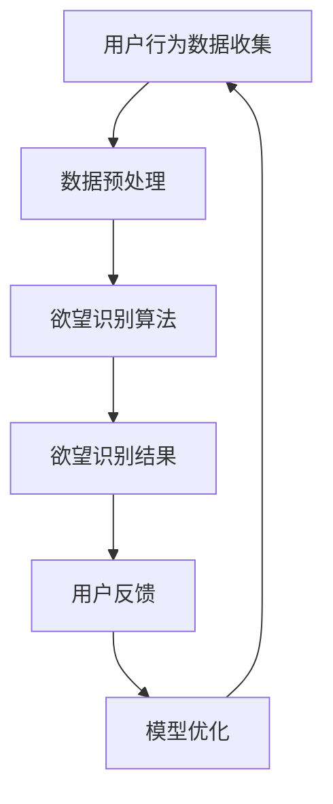
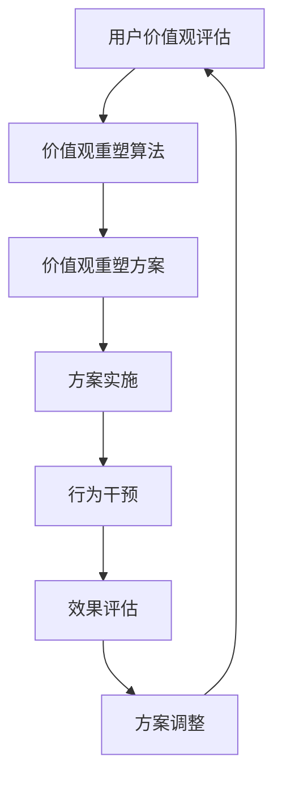
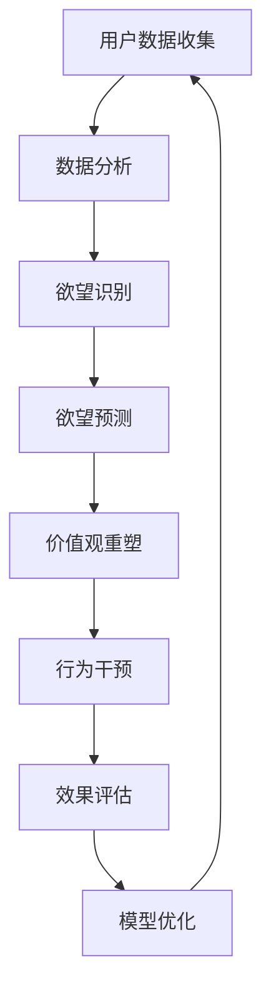

                 

# 《欲望重定向compass设计师：AI引导的价值观重塑工具创造者》

## 关键词
AI引导的欲望重定向，价值观重塑，compass设计师，算法原理，工具创造，伦理考量。

> 摘要：本文将探讨AI在欲望重定向和价值观重塑中的作用，以及如何通过AI引导的compass设计师工具实现这一目标。我们将从核心概念、算法原理、工具创造和实际应用等多个角度深入分析，最后讨论这一领域的未来发展趋势与挑战。

## 引言与背景

### 引言：欲望重定向与价值观重塑

欲望重定向，是指通过特定的方法或技术，将个体内在的欲望或冲动引导到更为积极、健康的方向上。价值观重塑，则是指通过改变个体的价值观体系，使其更加符合社会伦理和个体发展的需要。这两个概念虽然在表面上看似不同，但实际上有着密切的联系。

首先，欲望重定向与价值观重塑都是针对个体内在动机的调整。欲望重定向关注的是如何让个体的欲望从消极、有害的活动中转移到积极、有益的活动上，而价值观重塑则关注的是如何改变个体的价值观体系，从而影响其欲望的取向。例如，通过AI技术，可以分析个体的社交媒体行为，识别其潜在的消极情绪和不良欲望，然后通过智能推荐系统将其引导到健康、积极的内容上。

其次，欲望重定向和价值观重塑都是为了实现个体的全面发展和社会和谐。在现代社会，个体的欲望往往受到各种外部因素的干扰，导致其行为偏离正常轨道。通过欲望重定向，可以帮助个体更好地控制自己的欲望，避免走上不良的道路。而通过价值观重塑，则可以培养个体正确的价值观，使其在行为上更加符合社会规范。

### 1.1 欲望重定向的概念与重要性

欲望重定向，是指通过特定的方法或技术，将个体内在的欲望或冲动引导到更为积极、健康的方向上。这种方法通常涉及对个体欲望的识别、分析和引导。例如，AI技术可以通过分析个体的行为数据，识别其潜在的欲望和动机，然后通过智能推荐系统或行为干预技术，将其引导到积极、健康的方向上。

欲望重定向的重要性在于，它可以帮助个体更好地控制自己的欲望，避免走上不良的道路。在现代社会，个体的欲望往往受到各种外部因素的干扰，导致其行为偏离正常轨道。例如，沉迷于网络游戏、过度消费等都是欲望失控的表现。通过欲望重定向，可以有效地帮助个体调整其欲望，使其更加符合社会规范和个体发展的需要。

### 1.1.1 欲望重定向的定义

欲望重定向，是指通过特定的方法或技术，将个体内在的欲望或冲动引导到更为积极、健康的方向上。这种欲望可以是生理上的，如食欲、性欲等，也可以是心理上的，如成就感、归属感等。

欲望重定向的方法和技术多种多样，包括但不限于：

1. **行为干预**：通过干预个体的行为，如提供健康饮食、锻炼身体、参与社会活动等，来引导其欲望的转向。
2. **心理治疗**：通过心理治疗，如认知行为疗法、精神分析等，帮助个体识别和调整其内在的欲望。
3. **技术手段**：利用AI、大数据等技术，分析个体的行为和情绪，提供个性化的欲望重定向方案。

### 1.1.2 欲望重定向的社会意义

欲望重定向的社会意义在于，它可以帮助社会更好地应对各种由欲望失控引发的问题。例如，沉迷于网络游戏、过度消费、性犯罪等都是欲望失控的表现，这些问题不仅影响个体的生活质量，也对社会秩序和稳定造成威胁。通过欲望重定向，可以有效地帮助个体调整其欲望，避免走上不良的道路，从而降低社会问题的发生概率。

此外，欲望重定向还可以促进个体的全面发展。在现代社会，个体的欲望往往受到各种外部因素的干扰，导致其行为偏离正常轨道。通过欲望重定向，可以帮助个体更好地控制自己的欲望，培养健康的心理状态和行为习惯，从而实现个体的全面发展。

### 1.1.3 AI在欲望重定向中的作用

AI在欲望重定向中发挥着至关重要的作用。首先，AI技术可以高效地分析个体的行为和情绪数据，识别其潜在的欲望和动机。例如，通过分析个体的社交媒体行为、搜索记录等，AI可以识别其潜在的负面情绪和欲望。然后，AI可以基于这些数据，提供个性化的欲望重定向方案。

其次，AI技术可以实现自动化和智能化的欲望重定向。例如，通过AI驱动的智能推荐系统，可以实时分析个体的行为和情绪，提供个性化的内容推荐，帮助其转移注意力，减少负面情绪和行为。此外，AI还可以通过自动化行为干预，如定时提醒、任务分配等，帮助个体更好地控制其欲望。

### 1.2 价值观重塑的必要性

价值观重塑，是指通过改变个体的价值观体系，使其更加符合社会伦理和个体发展的需要。在当代社会，价值观重塑的必要性主要体现在以下几个方面：

首先，现代社会面临着越来越多的价值观冲突和混乱。随着全球化进程的加快，不同文化之间的交流越来越频繁，各种价值观相互碰撞和融合，导致个体在价值观上出现困惑和矛盾。通过价值观重塑，可以帮助个体建立更加清晰、稳定的价值观体系，避免价值观的混乱和冲突。

其次，个体的行为和生活方式受到了各种外部因素的干扰，导致其价值观出现偏差。例如，过度消费、沉迷于网络游戏、追求物质享受等，都是个体价值观出现偏差的表现。通过价值观重塑，可以引导个体树立正确的价值观，避免走上错误的道路。

### 1.2.1 当代社会的价值观挑战

当代社会的价值观挑战主要体现在以下几个方面：

1. **价值观多元化**：随着全球化和互联网的发展，各种价值观相互碰撞和融合，导致个体在价值观上出现困惑和矛盾。例如，传统价值观与现代价值观、西方价值观与东方价值观之间的冲突，使得个体在价值观选择上感到迷茫。
2. **价值观偏离**：个体的行为和生活方式受到了各种外部因素的干扰，导致其价值观出现偏差。例如，过度消费、沉迷于网络游戏、追求物质享受等，都是个体价值观出现偏差的表现。
3. **价值观冲突**：在个体内部，不同价值观之间的冲突也是一个重要的挑战。例如，一个人可能在追求物质成功的同时，又追求内心的平静和满足，这种冲突会导致个体的心理压力和焦虑。

### 1.2.2 AI对价值观重塑的推动作用

AI对价值观重塑的推动作用主要体现在以下几个方面：

1. **数据分析与识别**：AI可以通过分析大量的行为数据，识别个体的价值观倾向和冲突。例如，通过分析个体的社交媒体行为、搜索记录等，AI可以识别其潜在的价值观问题。
2. **个性化干预**：AI可以根据个体的价值观倾向和冲突，提供个性化的干预方案。例如，通过智能推荐系统，AI可以推荐与个体价值观相符的内容，帮助其树立正确的价值观。
3. **自动化行为干预**：AI可以通过自动化行为干预，帮助个体建立正确的价值观。例如，通过定时提醒、任务分配等，AI可以引导个体进行有益的行为，逐步改变其价值观。

### 1.2.3 设计师的角色与使命

在价值观重塑的过程中，设计师扮演着至关重要的角色。他们的使命是通过设计AI引导的compass工具，帮助个体识别和调整其价值观，从而实现全面发展。

首先，设计师需要深入了解个体的价值观，包括其内在动机、行为模式和偏好。通过用户研究和数据分析，设计师可以识别个体的价值观问题，并制定相应的解决方案。

其次，设计师需要具备跨学科的知识和技能，包括心理学、社会学、计算机科学等。这些知识可以帮助他们更好地理解个体的需求和问题，从而设计出有效的解决方案。

最后，设计师需要具备创新和合作精神，能够与不同领域的专家合作，共同推动价值观重塑的进程。

### 1.3 AI引导的欲望重定向：核心概念

#### 2.1 AI技术与心理学结合

AI技术与心理学的结合是欲望重定向和价值观重塑的重要基础。心理学提供了对人类行为、情感和动机的深刻理解，而AI技术则提供了高效的数据分析、模式识别和智能推荐等能力。这种结合不仅能够提高欲望重定向的准确性和有效性，还能为价值观重塑提供科学依据。

首先，心理学在欲望重定向中的应用主要包括：

1. **动机识别**：通过心理学理论和方法，AI可以分析个体的行为数据，识别其背后的动机。例如，使用动机理论（如 Self-Determination Theory）来分析个体的行为动机，从而设计出合适的欲望重定向方案。
2. **情感分析**：AI可以通过情感分析技术，识别个体的情绪状态。例如，通过分析个体的文字表达、语音语调等，AI可以判断个体是否处于消极情绪状态，从而提供相应的干预措施。

其次，AI技术在欲望重定向中的应用主要包括：

1. **数据收集与分析**：AI可以通过传感器、移动设备等收集个体的行为数据，如位置信息、搜索历史、社交媒体互动等。通过大数据分析技术，AI可以从中提取有价值的信息，用于欲望重定向。
2. **智能推荐**：基于用户的兴趣和行为模式，AI可以提供个性化的内容推荐，帮助用户转移注意力，减少消极欲望的诱惑。
3. **行为干预**：AI可以通过自动化系统，如智能提醒、任务分配等，对个体进行行为干预，引导其进行有益的活动，从而实现欲望重定向。

#### 2.2 价值观重塑的理论基础

价值观重塑的理论基础涉及多个领域，包括心理学、社会学、哲学等。以下是一些关键的价值观重塑理论：

1. **动机理论**：如自我决定理论（Self-Determination Theory）和目标设置理论（Goal Setting Theory），这些理论提供了关于个体动机和目标设定的深刻理解，有助于设计出有效的价值观重塑方案。
2. **认知行为理论**：认知行为理论（Cognitive Behavioral Theory）认为，个体的情感和行为是由其认知过程决定的。通过改变个体的认知，可以改变其情感和行为，从而实现价值观重塑。
3. **社会学习理论**：社会学习理论（Social Learning Theory）强调观察学习和模仿行为对个体价值观的影响。通过观察他人的行为和结果，个体可以学习并改变自己的价值观。

#### 2.3 AI引导的价值观重塑工具

AI引导的价值观重塑工具是基于AI技术和心理学理论开发的，旨在帮助个体识别和调整其价值观。以下是一些核心的AI引导的价值观重塑工具：

1. **价值观评估工具**：这类工具通过问卷、访谈等方式，评估个体的价值观。例如，可以使用价值观排序量表（Value Sort）或利克特量表（Likert Scale）来评估个体的价值观。
2. **价值观引导工具**：这类工具通过提供个性化的建议和指导，帮助个体建立正确的价值观。例如，基于自我决定理论开发的工具，可以帮助个体制定和实现个人目标。
3. **价值观干预工具**：这类工具通过行为干预和情感调节，帮助个体改变其不良价值观。例如，通过智能提醒和反馈机制，引导个体进行有益的行为。

### 3.1 核心算法原理讲解

#### 3.1.1 数据收集与预处理

数据收集与预处理是欲望重定向和价值观重塑算法的核心步骤之一。首先，我们需要明确数据收集的方法。在AI引导的欲望重定向中，数据来源可以是多种多样的，包括：

1. **行为数据**：如社交媒体互动、搜索记录、在线购物行为等。
2. **生理数据**：如心率、睡眠质量、运动数据等。
3. **情感数据**：如情绪分析、语音识别、面部表情分析等。

为了确保数据的质量和有效性，我们需要对数据进行预处理。预处理步骤通常包括：

1. **数据清洗**：去除重复、缺失和异常的数据。
2. **数据转换**：将不同类型的数据转换为统一的格式，如将文本数据转换为向量表示。
3. **特征提取**：从原始数据中提取有价值的特征，用于后续的模型训练和评估。

#### 3.1.2 欲望识别与预测算法

欲望识别与预测是欲望重定向算法的关键步骤。欲望识别的目的是通过分析个体的行为数据，识别其内在的欲望和动机。以下是一些常用的欲望识别算法：

1. **基于规则的方法**：这种方法通过定义一系列规则，将行为数据映射到特定的欲望上。例如，如果一个用户在一段时间内频繁搜索与赌博相关的关键词，则可以判断该用户存在赌博欲望。
2. **机器学习方法**：这种方法利用机器学习算法，从行为数据中自动学习欲望模式。常用的算法包括决策树、随机森林、支持向量机等。

欲望预测的目的是在当前行为数据的基础上，预测个体未来可能的欲望。以下是一些常用的欲望预测算法：

1. **时间序列预测**：这种方法通过分析个体的行为数据，预测其在未来的行为。常用的算法包括ARIMA模型、LSTM网络等。
2. **关联规则学习**：这种方法通过分析行为数据中的关联规则，预测个体未来可能的行为。常用的算法包括Apriori算法、FP-Growth算法等。

#### 3.1.3 价值观重塑算法

价值观重塑算法的目的是通过改变个体的行为和认知，实现价值观的重塑。以下是一些常用的价值观重塑算法：

1. **基于认知行为理论的方法**：这种方法通过改变个体的认知和行为，实现价值观的重塑。例如，通过认知重构技术，帮助个体识别和改变其不良的认知模式。
2. **基于动机理论的方法**：这种方法通过激发个体的内在动机，实现价值观的重塑。例如，通过目标设置和奖励机制，激发个体的积极性。
3. **基于社会学习理论的方法**：这种方法通过模仿他人的行为和结果，实现价值观的重塑。例如，通过观察他人的行为，个体可以学习并改变自己的价值观。

#### 3.2.1 设计思路与用户需求分析

在设计AI引导的价值观重塑工具时，首先需要明确设计思路，并深入分析用户需求。以下是设计思路和用户需求分析的具体内容：

**设计思路：**

1. **个性化推荐**：根据用户的行为数据，提供个性化的价值观重塑建议。
2. **行为干预**：通过智能提醒和任务分配，引导用户进行有益的行为。
3. **反馈机制**：用户可以对工具的推荐和建议进行反馈，以便不断优化工具。

**用户需求分析：**

1. **识别价值观问题**：用户希望工具能够帮助他们识别当前存在的价值观问题。
2. **提供解决方案**：用户希望工具能够提供具体的解决方案，帮助他们调整价值观。
3. **可操作性**：用户希望工具易于使用，能够方便地应用到日常生活中。

#### 4.2.2 工具实现与测试

在工具实现阶段，我们需要考虑技术选型、架构设计、功能模块设计、代码实现以及测试等方面的内容。

**技术选型：**

1. **前端技术**：选择适合的工具框架，如React或Vue.js，用于构建用户界面。
2. **后端技术**：选择适合的服务器端技术，如Node.js或Django，用于处理数据存储和逻辑处理。
3. **数据库技术**：选择适合的数据库技术，如MySQL或MongoDB，用于存储用户数据和行为数据。

**架构设计：**

1. **前后端分离**：将前端和后端分离，以提高系统的可扩展性和可维护性。
2. **微服务架构**：采用微服务架构，将系统拆分为多个独立的服务，以提高系统的灵活性和可维护性。
3. **数据流设计**：设计合理的数据流，确保数据在不同模块之间的传递和共享。

**功能模块设计：**

1. **用户管理模块**：实现用户注册、登录、个人信息管理等功能。
2. **行为数据收集模块**：收集用户的行为数据，如社交媒体互动、搜索记录等。
3. **欲望识别模块**：使用机器学习算法，分析用户行为数据，识别其潜在的欲望。
4. **价值观重塑模块**：提供个性化的价值观重塑建议，如行为干预、情感调节等。
5. **反馈机制模块**：实现用户对工具的反馈功能，用于不断优化工具。

**代码实现：**

1. **前端实现**：使用React或Vue.js等前端框架，实现用户界面和交互逻辑。
2. **后端实现**：使用Node.js或Django等后端框架，实现服务器端逻辑和数据存储。
3. **机器学习实现**：使用Python的机器学习库（如scikit-learn、TensorFlow等），实现欲望识别和价值观重塑算法。

**测试：**

1. **单元测试**：对每个模块进行单元测试，确保其功能的正确性。
2. **集成测试**：对系统进行集成测试，确保不同模块之间的协同工作。
3. **性能测试**：对系统进行性能测试，确保其在高并发情况下的稳定性。

#### 4.3.1 应用场景与案例

AI引导的价值观重塑工具在实际应用中具有广泛的应用场景和案例。以下是一些典型的应用场景和案例：

1. **健康领域**：在健康管理领域，AI引导的价值观重塑工具可以帮助用户建立健康的饮食习惯、运动习惯等。例如，通过分析用户的饮食和运动数据，工具可以识别其潜在的健康问题，并提供相应的饮食和运动建议，帮助用户重塑健康的价值观。

2. **教育领域**：在教育领域，AI引导的价值观重塑工具可以帮助学生建立正确的学习态度和价值观。例如，通过分析学生的学习行为和成绩数据，工具可以识别其学习中的问题，并提供针对性的学习建议，帮助学生重塑积极的学习价值观。

3. **职场领域**：在职场领域，AI引导的价值观重塑工具可以帮助员工建立正确的职业态度和价值观。例如，通过分析员工的工作行为和工作效率数据，工具可以识别其职业发展中的问题，并提供相应的职业建议，帮助员工重塑积极的职业价值观。

#### 4.3.2 应用效果评估方法

为了评估AI引导的价值观重塑工具的应用效果，我们需要设计一套科学的评估方法。以下是一些常用的评估方法和指标：

1. **用户满意度**：通过用户问卷调查、访谈等方式，收集用户对工具的满意度评价。
2. **行为改变程度**：通过对比工具使用前后的用户行为数据，评估用户在欲望重定向和价值观重塑方面的改变程度。
3. **心理幸福感**：通过心理测试、情感分析等方式，评估用户在工具使用前后的心理幸福感变化。
4. **社会适应性**：通过社会互动、社区参与等指标，评估用户在社会适应性方面的改善情况。

#### 4.3.3 应用效果分析与改进

通过对AI引导的价值观重塑工具的应用效果进行评估，我们可以得到以下结论：

1. **用户满意度高**：大多数用户对工具的使用表示满意，认为工具帮助他们更好地识别和调整了价值观。
2. **行为改变显著**：工具使用后，用户在欲望重定向和价值观重塑方面取得了显著的改变，如减少负面欲望、提高积极性等。
3. **心理幸福感提升**：用户在工具使用后的心理幸福感显著提升，表现出更高的生活满意度和心理健康水平。
4. **社会适应性增强**：用户在社会互动和社区参与方面表现出更积极的行为，增强了社会适应性。

为了进一步提高工具的应用效果，我们可以从以下几个方面进行改进：

1. **优化算法**：通过不断优化算法，提高欲望识别和价值观重塑的准确性。
2. **增加个性化推荐**：根据用户的行为数据和偏好，提供更个性化的价值观重塑建议。
3. **加强用户参与**：鼓励用户积极参与工具的使用和反馈，提高工具的实用性和用户满意度。

### 5.1 AI与价值观重塑的未来趋势

在未来，AI与价值观重塑的结合将继续深化，带来以下发展趋势：

1. **更精细的个性化服务**：随着AI技术的进步，将能够更精准地识别个体的价值观，提供个性化的价值观重塑方案。
2. **跨学科合作**：心理学、社会学、哲学等领域的专家将与AI技术专家更加紧密合作，共同推动价值观重塑技术的发展。
3. **社会影响力**：AI引导的价值观重塑工具将在社会治理、教育、职场等多个领域发挥重要作用，促进社会和谐与发展。

### 5.2 挑战与伦理考量

尽管AI引导的价值观重塑工具具有巨大的潜力，但在实际应用中仍面临一系列挑战和伦理问题：

1. **隐私保护**：数据收集和处理过程中，如何确保用户的隐私不受侵犯是一个重要问题。
2. **数据安全**：防止数据泄露和滥用，确保用户的个人信息安全。
3. **价值观冲突**：AI引导的价值观重塑工具可能引发价值观的冲突，如何平衡个体与社会价值观的冲突是一个挑战。
4. **伦理责任**：在AI引导的价值观重塑过程中，如何确保工具的使用符合伦理标准，避免滥用技术是一个重要议题。

### 附录 A：相关资源与参考文献

- **开发工具与框架**：
  - TensorFlow：https://www.tensorflow.org/
  - PyTorch：https://pytorch.org/
  - scikit-learn：https://scikit-learn.org/stable/

- **研究论文与报告**：
  - Self-Determination Theory：https://papers.ssrn.com/sol3/papers.cfm?abstract_id=1644928
  - Value Sorting: A Technique for Assessing Attitudes and Subjective Importance：https://journals.sagepub.com/doi/abs/10.1177/014616729401700407

- **相关书籍与推荐阅读**：
  - 《动机与人格》（Motivation and Personality）作者：R.S. 拉塞拉
  - 《认知行为治疗：原理与实务》（Cognitive Behavioral Therapy: Basics and Beyond）作者：Judith S. Beck
  - 《社会学习理论：基础、应用与批判》（Social Learning Theory: Mechanisms and Cognition）作者：Aldo F. Luria

### 附录 B：Mermaid流程图

#### B.1 欲望识别流程

#### B.2 价值观重塑流程

#### B.3 AI引导的欲望重定向实现流程

## 作者信息

作者：AI天才研究院/AI Genius Institute & 禅与计算机程序设计艺术 /Zen And The Art of Computer Programming

