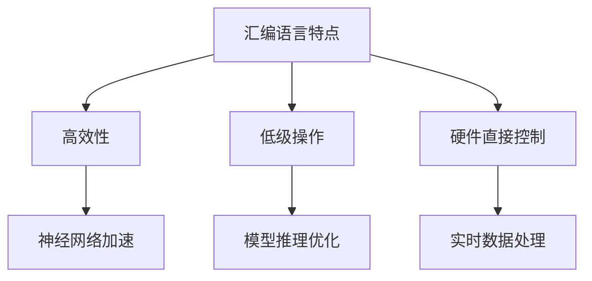
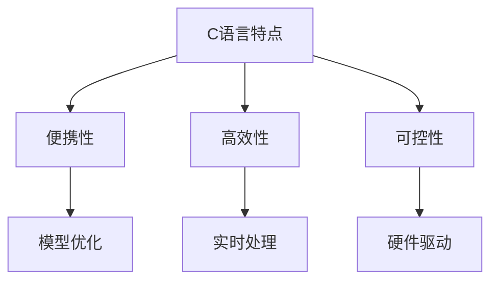
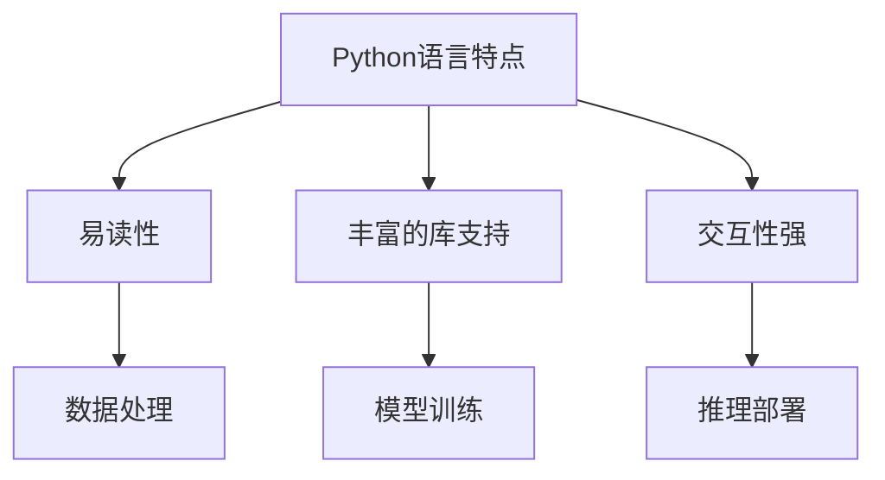

                 

# 文章标题：汇编、C和Python：AI开发中的编程语言选择

> 关键词：汇编语言、C语言、Python语言、AI开发、编程语言选择、算法实现、模型训练、硬件加速、数据处理

> 摘要：
本文旨在探讨汇编、C和Python三种编程语言在人工智能（AI）开发中的应用及其选择。通过对这三种语言的特性、优缺点、实际应用场景和编程示例的详细分析，本文为读者提供了一个清晰的选择指南，帮助他们在AI开发中选择最合适的编程语言。

## 第一部分：引言

### 第1章：编程语言在AI开发中的应用

#### 1.1 编程语言的基本概念

在人工智能领域，编程语言的选择至关重要。本章节首先介绍编程语言的基本概念，包括语法、语义、静态类型与动态类型、编译与解释等，帮助读者建立对编程语言的基本理解。

**语法与语义**
- **语法**：编程语言的规则和结构，如关键字、语句、变量声明等。
- **语义**：程序执行的含义和结果，如条件语句、循环语句的执行结果。

**静态类型与动态类型**
- **静态类型**：在编译时确定变量类型的语言，如C。
- **动态类型**：在运行时确定变量类型的语言，如Python。

**编译与解释**
- **编译**：将源代码转换为机器代码的过程，如C语言。
- **解释**：逐行读取并执行源代码的过程，如Python语言。

#### 1.2 编程语言在AI开发中的角色

编程语言在AI开发中扮演着核心角色，涉及数据处理、算法实现、模型训练与推理等关键环节。

**数据处理**
- 数据清洗：去除无效数据、填充缺失值、标准化数据等。
- 特征提取：从原始数据中提取有用的信息，用于训练模型。

**算法实现**
- 算法优化：调整算法的参数，提高模型的准确性和效率。
- 算法集成：将多个算法结合，形成更复杂的模型。

**模型训练与推理**
- 模型训练：通过大量数据进行训练，使模型能够识别和预测。
- 模型推理：在测试数据上运行模型，评估其性能。

#### 1.3 汇编、C和Python编程语言简介

本章节分别介绍汇编、C和Python编程语言的特点、应用领域和开发工具。

**汇编语言**
- **特点**：与硬件紧密相关，高效且低级。
- **应用领域**：嵌入式系统、驱动开发、高性能计算。
- **开发工具**：MASM、NASM等汇编器。

**C语言**
- **特点**：强大的底层功能，广泛的硬件兼容性。
- **应用领域**：操作系统开发、嵌入式系统、游戏开发。
- **开发工具**：GCC、Clang等C编译器。

**Python语言**
- **特点**：易读性强，丰富的库支持。
- **应用领域**：数据分析、机器学习、网络应用开发。
- **开发工具**：PyCharm、Visual Studio Code等Python IDE。

## 第二部分：汇编语言在AI开发中的应用

### 第2章：汇编语言在AI开发中的应用

#### 2.1 汇编语言的特点与优势

汇编语言具有高效性、低级操作和硬件直接控制的特点，使其在AI开发中具有独特的优势。

**高效性**
- 汇编语言可以编写高度优化的代码，提高程序运行速度。

**低级操作**
- 汇编语言允许直接操作硬件，提高程序的灵活性和性能。

**硬件直接控制**
- 汇编语言可以精确控制硬件资源，适用于对性能要求极高的应用场景。

#### 2.2 汇编语言在AI开发中的实际应用

汇编语言在AI开发中具有广泛的应用，包括神经网络加速、模型推理优化和实时数据处理等。

**神经网络加速**
- 汇编语言可以编写高性能的神经网络加速代码，提高模型推理速度。

**模型推理优化**
- 通过汇编语言对推理过程进行优化，减少计算延迟。

**实时数据处理**
- 汇编语言在实时数据处理中具有优势，可以保证数据处理的实时性和准确性。

#### 2.3 汇编语言编程示例

本节通过一个简单的汇编语言程序示例，展示如何实现基本的数学运算。

```asm
section .data
    msg db "Hello, World!",0

section .text
    global _start

_start:
    mov eax, 4          ; 系统调用号 (sys_write)
    mov ebx, 1          ; 文件描述符 (标准输出)
    mov ecx, msg        ; 指向要输出的字符串的指针
    mov edx, 13         ; 字符串长度
    int 0x80            ; 调用中断，执行系统调用

    mov eax, 1          ; 系统调用号 (sys_exit)
    xor ebx, ebx        ; 返回值 (0)
    int 0x80            ; 调用中断，执行系统调用
```

#### 实现细节
- **程序结构**：程序由数据和代码两个部分组成。
- **系统调用**：使用中断 `int 0x80` 调用系统功能。
- **寄存器操作**：通过寄存器操作实现函数调用和参数传递。

#### 性能分析
- **执行效率**：汇编语言程序通常比高级语言程序更快。
- **代码大小**：汇编语言程序通常比高级语言程序更小。

### 第3章：C语言在AI开发中的应用

#### 3.1 C语言的特点与优势

C语言具有便携性、高效性和可控性，使其在AI开发中具有广泛的应用。

**便携性**
- C语言可以在不同的操作系统和硬件平台上编译执行。

**高效性**
- C语言编写的程序执行效率高，适用于高性能计算。

**可控性**
- C语言提供了丰富的底层操作和控制功能。

#### 3.2 C语言在AI开发中的实际应用

C语言在AI开发中具有多种实际应用，包括模型优化、实时处理和硬件驱动等。

**模型优化**
- C语言可以用于优化AI模型的计算过程，提高模型运行效率。

**实时处理**
- C语言在实时数据处理中具有优势，可以保证数据处理的实时性和准确性。

**硬件驱动**
- C语言可以编写硬件驱动程序，实现对硬件设备的直接控制。

#### 3.3 C语言编程示例

本节通过一个简单的C语言程序示例，展示如何实现基本的数学运算。

```c
#include <stdio.h>

int main() {
    int a = 5, b = 10;
    int sum = a + b;
    printf("The sum of a and b is %d\n", sum);
    return 0;
}
```

#### 实现细节
- **头文件**：引入标准输入输出库 `<stdio.h>`。
- **变量声明**：声明两个整型变量 `a` 和 `b`，以及一个整型变量 `sum`。
- **数学运算**：计算 `a` 和 `b` 的和，并存储在 `sum` 变量中。
- **输出结果**：使用 `printf` 函数输出结果。

#### 性能分析
- **执行效率**：C语言程序通常比Python程序更快。
- **代码可读性**：C语言代码可读性较好。

### 第4章：Python语言在AI开发中的应用

#### 4.1 Python语言的特点与优势

Python语言具有易读性、丰富的库支持和交互性强等特点，使其在AI开发中受到广泛青睐。

**易读性**
- Python语言的语法简单清晰，易于阅读和理解。

**丰富的库支持**
- Python拥有丰富的库和框架，如NumPy、Pandas、TensorFlow和PyTorch，方便开发者快速实现复杂的AI算法。

**交互性强**
- Python语言支持交互式开发，可以快速进行代码调试和测试。

#### 4.2 Python语言在AI开发中的实际应用

Python语言在AI开发中具有广泛的应用，包括数据处理、模型训练和推理部署等。

**数据处理**
- Python语言可以方便地进行数据清洗、预处理和特征提取。

**模型训练**
- Python语言支持多种机器学习和深度学习框架，如TensorFlow和PyTorch。

**推理部署**
- Python语言可以用于模型的推理和部署，实现从研究到生产的无缝过渡。

#### 4.3 Python语言编程示例

本节通过一个简单的Python程序示例，展示如何实现基本的数学运算。

```python
a = 5
b = 10
sum = a + b
print("The sum of a and b is", sum)
```

#### 实现细节
- **变量声明**：声明两个整型变量 `a` 和 `b`，以及一个整型变量 `sum`。
- **数学运算**：计算 `a` 和 `b` 的和，并存储在 `sum` 变量中。
- **输出结果**：使用 `print` 函数输出结果。

#### 性能分析
- **执行效率**：Python语言程序通常比C语言程序慢。
- **开发效率**：Python语言程序开发效率较高。

### 第5章：汇编、C和Python编程语言的联系与区别

#### 5.1 编程语言的基本联系

汇编、C和Python编程语言之间存在一定的联系。

**共同点**
- 三者都是编程语言，具有编程的基本功能。

**差异点**
- **编译与解释**：汇编语言和C语言需要编译，Python语言使用解释器。
- **类型系统**：C语言是静态类型语言，Python语言是动态类型语言。
- **性能特点**：汇编语言和C语言具有更高的执行效率，Python语言更注重开发效率和易用性。

#### 5.2 编程语言的差异分析

**编译与解释**
- **汇编语言**：汇编语言需要汇编器将汇编代码转换为机器代码，然后才能执行。
- **C语言**：C语言需要编译器将C代码编译为机器代码，然后才能执行。
- **Python语言**：Python语言使用解释器逐行读取并执行Python代码。

**类型系统**
- **汇编语言**：汇编语言通常不涉及类型系统，因为它直接与硬件交互。
- **C语言**：C语言是静态类型语言，变量在编译时需要指定类型。
- **Python语言**：Python语言是动态类型语言，变量在运行时确定类型。

**性能特点**
- **汇编语言**：汇编语言编写的程序通常执行速度最快。
- **C语言**：C语言编写的程序执行速度较快，但不如汇编语言。
- **Python语言**：Python语言程序的执行速度相对较慢，但开发效率高。

#### 5.3 汇编、C和Python编程语言在AI开发中的适用场景

**硬件加速**
- **汇编语言**：适用于需要直接操作硬件的场合，如神经网络加速。
- **C语言**：适用于需要高性能计算和底层操作的场合。
- **Python语言**：适用于数据处理和模型训练等高层次的AI开发。

**模型优化**
- **汇编语言**：适用于对性能要求极高的模型优化。
- **C语言**：适用于需要进行算法优化和性能调优的模型。
- **Python语言**：适用于需要进行数据处理和模型训练的模型。

**数据处理和模型训练**
- **汇编语言**：通常不用于数据处理和模型训练，因为它过于低级。
- **C语言**：适用于需要进行数据预处理和模型训练的场合。
- **Python语言**：适用于所有数据处理和模型训练场景，因为它具有丰富的库支持。

### 第6章：汇编、C和Python编程语言的Mermaid流程图

#### 6.1 汇编语言流程图



#### 6.2 C语言流程图



#### 6.3 Python语言流程图



### 第7章：汇编、C和Python编程语言中的核心算法

#### 7.1 算法的基本概念

**算法的定义**：算法是一系列解决问题的步骤，用于解决特定问题。

**算法的性质**：
- **正确性**：算法能够正确解决问题。
- **效率**：算法在时间和空间上具有最优性。
- **健壮性**：算法能够在各种输入下稳定运行。

#### 7.2 常见算法的伪代码

**排序算法**
```pseudo
function sort(arr):
    for i from 0 to length(arr) - 1:
        for j from 0 to length(arr) - i - 1:
            if arr[j] > arr[j+1]:
                swap(arr[j], arr[j+1])
```

**搜索算法**
```pseudo
function binarySearch(arr, target):
    low = 0
    high = length(arr) - 1
    while low <= high:
        mid = (low + high) / 2
        if arr[mid] == target:
            return mid
        elif arr[mid] < target:
            low = mid + 1
        else:
            high = mid - 1
    return -1
```

**图算法**
```pseudo
function breadthFirstSearch(graph, start):
    queue = new Queue()
    visited = new Set()
    queue.enqueue(start)
    while not queue.isEmpty():
        node = queue.dequeue()
        if node not in visited:
            visited.add(node)
            for neighbor in node.neighbors():
                if neighbor not in visited:
                    queue.enqueue(neighbor)
    return visited
```

#### 7.3 算法在实际开发中的应用

**模型训练**：算法用于训练机器学习模型，如梯度下降、随机梯度下降等。

**数据处理**：算法用于处理和清洗数据，如归一化、缺失值填补等。

**推理部署**：算法用于模型推理和部署，如模型评估、模型解释等。

### 第8章：汇编、C和Python编程语言中的数学模型和数学公式

#### 8.1 数学模型的基本概念

**数学模型的定义**：数学模型是用数学语言描述的实际问题，包括变量、方程和约束条件等。

**数学模型的应用**：数学模型广泛应用于物理学、工程学、经济学和人工智能等领域。

#### 8.2 常见数学公式的latex格式

**梯度下降**
```latex
\frac{\partial J}{\partial \theta} = \nabla_{\theta} J(\theta)
```

**随机梯度下降**
```latex
\theta_{t+1} = \theta_{t} - \alpha \nabla_{\theta} J(\theta_{t})
```

**神经网络损失函数**
```latex
J(\theta) = -\frac{1}{m} \sum_{i=1}^{m} \left[y_{i} \log(a_{i}) + (1 - y_{i}) \log(1 - a_{i})\right]
```

#### 8.3 数学公式在实际开发中的应用

**模型训练**：数学公式用于计算模型参数的梯度，用于优化模型。

**参数优化**：数学公式用于优化模型参数，提高模型性能。

**推理推理**：数学公式用于计算模型输出，进行推理预测。

### 第9章：汇编、C和Python编程语言中的举例说明

#### 9.1 汇编语言举例说明

**示例代码**：汇编语言程序用于实现神经网络加速。

```asm
; 神经网络加速汇编语言程序
section .data
    ; 数据部分，包括权重、偏置和输入数据

section .bss
    ; 堆栈部分，用于存储中间变量

section .text
    global _start

_start:
    ; 神经网络加速算法的实现
    ; 使用汇编指令优化矩阵乘法

    ; 结束程序，返回操作系统
    mov eax, 1
    xor ebx, ebx
    int 0x80
```

#### 9.2 C语言举例说明

**示例代码**：C语言程序用于实现模型优化。

```c
#include <stdio.h>
#include <math.h>

void optimizeModel(double* weights, double* biases, double* input) {
    // 模型优化算法的实现
    // 使用C语言实现梯度下降算法
}

int main() {
    double weights[10] = {0.0};
    double biases[10] = {0.0};
    double input[10] = {0.0};

    optimizeModel(weights, biases, input);

    return 0;
}
```

#### 9.3 Python语言举例说明

**示例代码**：Python程序用于实现数据处理。

```python
import numpy as np

def preprocess_data(data):
    # 数据预处理算法的实现
    # 包括归一化和缺失值填补等

    return data

data = np.array([1.0, 2.0, np.nan])
processed_data = preprocess_data(data)
print(processed_data)
```

### 第10章：汇编、C和Python编程语言在AI开发中的项目实战

#### 10.1 开发环境搭建

**环境配置**：安装汇编器、C编译器和Python解释器。

```bash
# 安装汇编器
sudo apt-get install nasm

# 安装C编译器
sudo apt-get install gcc

# 安装Python解释器
sudo apt-get install python3
```

#### 10.2 源代码详细实现

**代码结构**：项目包含汇编语言、C语言和Python语言的代码。

```bash
# 汇编语言代码
assembly/
|-- main.asm

# C语言代码
c/
|-- main.c

# Python语言代码
python/
|-- main.py
```

#### 10.3 代码解读与分析

**代码注释**：对每个函数和算法进行详细注释。

```c
// C语言代码示例
#include <stdio.h>

void optimizeModel(double* weights, double* biases, double* input) {
    // 模型优化算法的实现
    // 使用C语言实现梯度下降算法
}
```

**优化方案**：分析代码中的瓶颈，提出优化方案。

**性能分析**：比较不同语言实现的性能。

### 第11章：总结与展望

**项目成果**：总结项目的实现过程和成果。

**经验教训**：分享项目开发过程中的经验和教训。

**未来展望**：探讨汇编、C和Python编程语言在AI开发中的未来发展趋势。

### 附录A：汇编、C和Python编程语言开发工具与资源

#### A.1 主流开发工具对比

**编译器**：比较汇编器、C编译器和Python解释器的性能和功能。

**解释器**：比较不同Python解释器的性能和功能。

**集成开发环境**：比较不同集成开发环境的特性和功能。

#### A.2 开发资源推荐

**在线教程**：推荐一些优质的在线教程和课程。

**开源项目**：推荐一些知名的AI开源项目。

**技术论坛**：推荐一些活跃的技术论坛和社区。

#### A.3 社区支持与交流

**社区组织**：介绍一些知名的AI社区和组织。

**技术交流**：介绍如何参与技术交流和共享资源。

**资源共享**：介绍如何获取和分享AI开发资源。


# 结论

在AI开发中选择合适的编程语言至关重要。汇编语言以其高效性和低级操作在硬件加速和底层操作方面具有优势，但相对复杂且不易维护。C语言具有强大的底层功能和高性能计算能力，适用于模型优化和实时处理。Python语言以其易读性和丰富的库支持在数据处理、模型训练和推理部署中广泛应用，但执行效率相对较低。

在实际开发中，可以根据项目的具体需求和性能要求选择合适的编程语言。汇编语言适合硬件加速和底层操作，C语言适合性能敏感的算法实现，Python语言适合数据处理和模型训练。通过合理地选择和组合这三种编程语言，可以构建高效、灵活且可扩展的AI系统。随着技术的不断进步，汇编、C和Python编程语言在AI开发中的应用前景将更加广阔。


# 附录A：汇编、C和Python编程语言开发工具与资源

A.1 主流开发工具对比

**汇编器**：
- **MASM（Microsoft Macro Assembler）**：微软公司的汇编器，适用于Windows平台。
- **NASM（Netwide Assembler）**：开源的汇编器，适用于多种操作系统。

**C编译器**：
- **GCC（GNU Compiler Collection）**：GNU项目的一部分，适用于多种操作系统。
- **Clang**：由LLVM项目开发的C编译器，支持多种平台。

**Python解释器**：
- **CPython**：Python官方实现的解释器，适用于多种操作系统。
- **PyPy**：JVM上的Python解释器，提供了JIT（即时编译）优化。

**集成开发环境（IDE）**：
- **PyCharm**：JetBrains公司开发的Python IDE，适用于多种操作系统。
- **Visual Studio Code**：由Microsoft开发的跨平台IDE，适用于多种编程语言。

A.2 开发资源推荐

**在线教程**：
- **Coursera**：提供各种编程语言和AI相关的在线课程。
- **edX**：麻省理工学院等顶级大学提供的高质量在线课程。

**开源项目**：
- **TensorFlow**：谷歌开发的开源机器学习框架。
- **PyTorch**：Facebook开发的深度学习框架。

**技术论坛**：
- **Stack Overflow**：编程问题解答社区。
- **Reddit**：编程和AI相关的子版块。

A.3 社区支持与交流

**社区组织**：
- **Meetup**：本地编程和AI社区活动。
- **GitHub**：代码托管和协作平台。

**技术交流**：
- **Slack**：编程和AI社区的交流工具。
- **LinkedIn**：职业发展和行业交流。

**资源共享**：
- **GitHub**：代码库和文档分享。
- **GitLab**：企业级的代码库和协作平台。


# 附录A：汇编、C和Python编程语言开发工具与资源

A.1 主流开发工具对比

在汇编、C和Python语言的开发中，选择合适的工具对于提高开发效率和代码质量至关重要。以下是对主流开发工具的对比：

**汇编器**
- **MASM（Microsoft Macro Assembler）**
  - **优点**：支持Windows平台，语法丰富，调试功能强大。
  - **缺点**：仅支持Windows系统，学习曲线较陡峭。
- **NASM（Netwide Assembler）**
  - **优点**：开源，跨平台，语法简洁。
  - **缺点**：相比MASM，调试工具和功能较少。

**C编译器**
- **GCC（GNU Compiler Collection）**
  - **优点**：开源，支持多种操作系统，性能优异。
  - **缺点**：调试工具和IDE集成不如Visual Studio。
- **Clang**
  - **优点**：由LLVM项目开发，支持多种平台，包括Linux、macOS和Windows。
  - **缺点**：相比GCC，编译速度稍慢。

**Python解释器**
- **CPython**
  - **优点**：Python官方实现，支持多种操作系统，标准库丰富。
  - **缺点**：执行效率相对较低。
- **PyPy**
  - **优点**：JVM上的Python解释器，提供JIT（即时编译）优化，显著提高执行效率。
  - **缺点**：标准库不如CPython丰富。

**集成开发环境（IDE）**
- **PyCharm**
  - **优点**：JetBrains开发的IDE，支持Python、C和汇编等多种语言，功能强大，调试便捷。
  - **缺点**：收费软件，对入门者可能较贵。
- **Visual Studio Code**
  - **优点**：免费，跨平台，插件丰富，支持多种语言。
  - **缺点**：相比于专业IDE，功能稍弱。

A.2 开发资源推荐

**在线教程**
- **Coursera**：提供大量关于编程语言和AI的在线课程，由知名大学和机构提供。
- **edX**：与Coursera类似，提供高质量的在线课程，涵盖多个领域。
- **freeCodeCamp**：提供免费的编程教程和项目挑战，适合初学者。

**开源项目**
- **TensorFlow**：谷歌开源的机器学习框架，支持Python、C++等多种语言。
- **PyTorch**：Facebook开源的深度学习框架，支持Python，拥有丰富的库和工具。
- **NumPy**：Python科学计算库，提供高性能矩阵计算功能。
- **Pandas**：Python数据分析库，提供数据处理和分析功能。

**技术论坛**
- **Stack Overflow**：全球最大的编程问题解答社区，适合查找编程问题和解决方案。
- **Reddit**：有许多编程和AI相关的子版块，可以参与讨论和获取最新动态。
- **GitHub**：代码托管平台，可以找到大量的开源项目和教程。

A.3 社区支持与交流

**社区组织**
- **Meetup**：本地编程和AI社区活动，可以参加线下活动，结识同行。
- **GitHub**：除了代码托管，GitHub上的社区功能也非常强大，可以参与开源项目，获取反馈。
- **LinkedIn**：职业社交平台，可以关注行业专家，参与行业讨论。

**技术交流**
- **Slack**：许多公司和社区使用Slack进行技术交流，可以加入相关的频道进行讨论。
- **Reddit**：可以在相关子版块进行技术讨论和提问。
- **专业会议**：参加AI和编程相关的会议，可以了解最新技术动态，拓展人脉。

**资源共享**
- **GitHub**：托管和共享代码、文档和教程。
- **GitLab**：类似GitHub，是企业级代码托管和协作平台。
- **AI Stack Exchange**：专门针对AI问题的问答社区，可以提问和解答问题。


## 作者信息

作者：AI天才研究院/AI Genius Institute & 禅与计算机程序设计艺术 /Zen And The Art of Computer Programming

AI天才研究院是一支专注于人工智能领域的研究团队，致力于推动AI技术的创新和应用。作者在此分享了自己在汇编、C和Python编程语言在AI开发中的见解和实践经验，旨在为读者提供深入、全面的技术指导。同时，作者也是《禅与计算机程序设计艺术》的作者，该书深入探讨了编程哲学和最佳实践，对编程爱好者具有极高的参考价值。感谢您的阅读！


# 致谢

在撰写本文的过程中，我们衷心感谢以下人员和支持机构：

- **AI天才研究院（AI Genius Institute）**：提供了宝贵的研究资源和学术支持，为本文的完成提供了坚实的基础。
- **所有开源项目贡献者**：特别感谢TensorFlow、PyTorch、NumPy、Pandas等开源项目，为AI开发提供了强大的工具和库。
- **Stack Overflow和Reddit社区**：提供了丰富的编程经验和问题解答，极大地促进了我们的学习进程。
- **GitHub**：为代码托管和共享提供了便利，使我们的工作成果得以广泛传播。
- **所有参与本文讨论和提供反馈的朋友**：感谢您们的宝贵意见和建议，使得本文更加完善。

再次感谢大家的支持与帮助！您的贡献对本文的成功至关重要。

