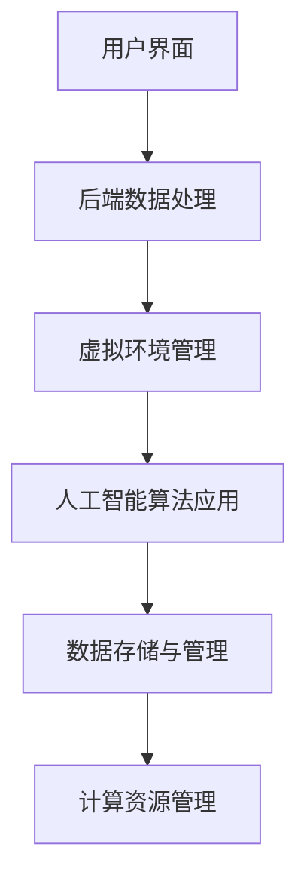

                 

# 文章标题：沉浸式学习生态：AI构建的知识获取环境

> 关键词：沉浸式学习生态、AI技术、知识获取、虚拟现实、机器学习、个性化学习

> 摘要：本文深入探讨了沉浸式学习生态的概念、技术基础、设计原则、应用场景以及未来发展趋势。通过分析沉浸式学习生态的核心价值、技术实现方法以及实际案例，本文旨在为读者呈现一个全方位的沉浸式学习生态全景，并展望其未来的发展方向。

### 第一部分: 沉浸式学习生态概述

#### 第1章: 沉浸式学习生态的概念与背景

##### 1.1 沉浸式学习生态的定义

沉浸式学习生态是一种新型的知识获取环境，它通过融合人工智能技术、虚拟现实技术等，构建一个高度交互的虚拟世界，使用户能够在其中进行沉浸式的学习和探索。这种学习生态不仅模拟了现实世界的场景，还通过智能化的算法和推荐系统，为用户提供了个性化的学习体验和高效的知识获取途径。

##### 1.2 沉浸式学习生态的发展背景

随着人工智能技术的快速发展，尤其是在机器学习和深度学习领域的突破，沉浸式学习生态逐渐成为学术界和工业界的研究热点。虚拟现实技术的进步也为沉浸式学习生态的实现提供了强有力的技术支持。这种新型学习生态有望在提高学习效率、丰富学习体验、实现个性化学习等方面发挥重要作用。

##### 1.3 沉浸式学习生态的核心价值

- **提升学习效率**：通过模拟现实场景，用户可以在沉浸式体验中更容易理解和掌握知识，从而提高学习效率。
- **增强学习体验**：虚拟现实技术为学习过程带来了更加生动、直观的体验，激发了用户的学习兴趣和动力。
- **个性化学习**：通过分析用户的学习行为和兴趣，沉浸式学习生态可以提供个性化的学习内容和路径，满足不同用户的需求。

#### 第2章: 沉浸式学习生态的技术基础

##### 2.1 虚拟现实技术

虚拟现实技术是沉浸式学习生态的核心组成部分，它通过创建一个高度交互的虚拟环境，使用户能够在其中进行沉浸式的学习和探索。虚拟现实技术包括3D建模、渲染技术、感知交互技术等，这些技术共同作用，为用户提供了身临其境的体验。

##### 2.2 人工智能与机器学习

人工智能和机器学习技术在沉浸式学习生态中发挥着重要作用。通过机器学习算法，可以分析用户的学习行为和兴趣，为用户推荐合适的学习内容和路径。同时，人工智能技术还可以实现智能化的互动和反馈，提高学习体验和效果。

##### 2.3 虚拟现实与人工智能的融合

虚拟现实与人工智能的融合，使得沉浸式学习生态能够更加智能、自适应地满足用户需求。例如，通过人工智能算法，可以实时分析用户的行为和反应，动态调整学习内容和难度，为用户提供更加个性化的学习体验。

### 第二部分: 沉浸式学习生态的设计原则与实现方法

#### 第3章: 沉浸式学习生态的设计原则与实现方法

##### 3.1 设计原则

- **用户体验至上**：以用户为中心，关注学习过程的舒适度、互动性和趣味性。
- **内容丰富多样**：提供多样化的学习内容，满足不同用户的需求。
- **智能化与个性化**：利用人工智能技术，为用户提供个性化的学习建议和路径。
- **可扩展性**：设计时考虑系统的可扩展性，便于后续功能的添加和升级。

##### 3.2 实现方法

- **系统架构设计**：构建沉浸式学习生态的系统架构，确保系统的高效运行和可扩展性。
- **内容设计与开发**：设计并开发丰富多样的学习内容，包括图文、视频、交互式任务等。
- **人工智能算法应用**：将人工智能算法应用于学习过程，实现智能推荐、自适应学习等功能。
- **用户反馈与优化**：收集用户反馈，不断优化系统性能和用户体验。

### 第三部分: 沉浸式学习生态的应用场景

#### 第4章: 沉浸式学习生态的应用场景

##### 4.1 教育领域

在教育领域，沉浸式学习生态可以应用于在线教育、虚拟课堂、实训课程等，提高学习效果和教学质量。

##### 4.2 企业培训

企业培训中，沉浸式学习生态可以用于员工技能培训、企业文化传播等，提高培训效果和员工参与度。

##### 4.3 游戏化学习

游戏化学习是沉浸式学习生态的一种重要应用，通过将学习内容融入游戏中，提高学习兴趣和动力。

### 第四部分: 沉浸式学习生态的未来发展趋势

#### 第5章: 沉浸式学习生态的未来发展趋势

##### 5.1 技术发展趋势

随着人工智能、虚拟现实等技术的不断发展，沉浸式学习生态将更加智能、高效、个性化。

##### 5.2 应用领域扩展

沉浸式学习生态的应用领域将不断扩展，包括医疗、金融、设计等行业，为各行各业带来新的发展机遇。

##### 5.3 挑战与机遇

沉浸式学习生态在发展过程中将面临一系列挑战，如技术瓶颈、内容质量、用户体验等。但同时也充满机遇，有望成为未来知识获取的重要方式。

### 第五部分: 沉浸式学习生态的实际案例研究

#### 第6章: 沉浸式学习生态的实际案例研究

##### 6.1 案例一：虚拟现实在线教育平台

介绍一个虚拟现实在线教育平台的案例，分析其系统架构、技术实现、用户反馈等方面。

##### 6.2 案例二：企业员工技能培训系统

分析一个企业员工技能培训系统的案例，探讨其沉浸式学习生态的设计原则、实现方法和应用效果。

### 第六部分: 总结与展望

#### 第7章: 总结与展望

##### 7.1 本书总结

总结本书的主要内容，梳理沉浸式学习生态的核心概念、技术基础、应用场景和发展趋势。

##### 7.2 未来展望

展望沉浸式学习生态的未来发展方向，探讨其在教育、企业培训等领域的应用前景，以及可能面临的技术挑战和机遇。

### 参考文献

[参考文献列表]

### 附录

[附录内容，如算法伪代码、系统架构图等]

### 作者信息

作者：AI天才研究院/AI Genius Institute & 禅与计算机程序设计艺术 /Zen And The Art of Computer Programming

## 第1章: 沉浸式学习生态的概念与背景

### 1.1 沉浸式学习生态的定义

沉浸式学习生态（Immersive Learning Ecosystem）是一种新兴的知识获取环境，它通过结合人工智能技术（AI）、虚拟现实（VR）和其他先进技术，构建出一个高度交互的虚拟世界，使学习者在其中能够进行沉浸式体验和探索。这种生态不仅模拟了现实世界的各种场景，还包括了智能化的教学系统和个性化学习路径，从而极大地提升了学习效率和用户体验。

沉浸式学习生态的核心特征包括：

- **高度交互性**：用户可以在虚拟环境中进行互动，如与虚拟人物交流、参与虚拟实验等。
- **沉浸感**：通过虚拟现实技术，用户能够感受到身临其境的体验，从而提高学习的注意力和参与度。
- **个性化**：系统根据用户的学习行为和需求，动态调整学习内容和路径，实现个性化教学。
- **动态适应性**：系统可以实时分析用户的学习效果和反馈，自动调整教学策略和学习资源。

### 1.2 沉浸式学习生态的发展背景

沉浸式学习生态的发展背景可以追溯到20世纪90年代虚拟现实技术的初步探索阶段。随着计算机性能的提升和显示技术的进步，虚拟现实技术逐渐从实验室走向应用。进入21世纪，人工智能技术的迅猛发展，特别是机器学习和深度学习的突破，为沉浸式学习生态的构建提供了强大的技术支持。

主要驱动因素包括：

- **技术进步**：虚拟现实技术和人工智能技术的不断进步，为沉浸式学习生态的实现提供了基础。
- **教育需求**：随着社会对教育和培训的重视，对个性化、高效、互动性强的学习方式的需求日益增长。
- **商业利益**：沉浸式学习生态作为一种新兴的教育模式，吸引了大量投资和关注，成为商业和学术界共同探索的领域。

### 1.3 沉浸式学习生态的核心价值

沉浸式学习生态在提高学习效率、增强学习体验和实现个性化学习等方面具有显著的核心价值：

- **提升学习效率**：通过沉浸式的学习环境，学习者能够更加专注于学习内容，减少分心和干扰，从而提高学习效率。此外，智能化的学习系统能够根据学习者的掌握情况动态调整学习内容和节奏，进一步优化学习流程。

- **增强学习体验**：虚拟现实技术为学习者提供了前所未有的沉浸感，使得学习过程更加生动和有趣。通过视觉、听觉和触觉等多种感官的刺激，学习者能够更加直观地理解和记忆学习内容，提高学习兴趣和参与度。

- **实现个性化学习**：沉浸式学习生态通过收集和分析学习者的行为数据，能够实现高度个性化的教学。系统可以根据学习者的学习习惯、兴趣和需求，量身定制学习内容和路径，使得每个人都能在自己的节奏和方式下学习，提高学习效果。

- **促进知识内化**：通过沉浸式学习，学习者不仅能够理解知识，还能够通过实践和互动将知识内化为自己的能力。这种深入的学习方式有助于学习者构建知识体系，提高解决问题的能力。

总的来说，沉浸式学习生态不仅是一种创新的学习方式，更是未来教育发展的重要趋势。它为教育领域带来了前所未有的机遇和挑战，有望在提升教育质量、推动教育创新方面发挥重要作用。

### 第2章: 沉浸式学习生态的技术基础

#### 2.1 虚拟现实技术

虚拟现实（Virtual Reality, VR）技术是构建沉浸式学习生态的核心技术之一。它通过计算机生成模拟环境，使用户能够在虚拟世界中进行沉浸式交互。虚拟现实技术主要包括以下几个关键组成部分：

- **3D建模**：3D建模是虚拟现实的基础，通过三维建模软件（如Blender、Maya等），可以创建出各种虚拟场景、角色和物品。这些模型需要高精度和高质量的渲染，以提供真实感强烈的视觉体验。

- **渲染技术**：渲染技术用于生成虚拟环境中的图像，包括光影效果、纹理映射和阴影等。高质量渲染能够极大地提升虚拟现实的沉浸感和真实感。常见的渲染引擎有Unity、Unreal Engine等。

- **感知交互技术**：感知交互技术包括手柄、头戴显示器（HMD）、眼动追踪器等多种设备，这些设备可以捕捉用户的动作和位置，实现与虚拟环境的互动。例如，通过手柄可以操纵虚拟物品，通过HMD可以改变视角。

- **声音效果**：虚拟现实中的声音效果同样重要，通过3D音效技术，可以模拟出空间感、声音的远近感等，增强用户的沉浸体验。常用的音频处理工具包括Wwise、FMOD等。

虚拟现实技术在实际应用中，不仅需要高技术支持，还需要考虑用户体验。例如，虚拟环境的布局、交互设计的合理性、操作的直观性等，都会直接影响用户的沉浸感和学习体验。

#### 2.2 人工智能与机器学习

人工智能（Artificial Intelligence, AI）和机器学习（Machine Learning, ML）技术在沉浸式学习生态中发挥着至关重要的作用。它们通过分析和理解用户的学习行为、兴趣和需求，提供个性化的学习内容和路径，从而显著提升学习效果。

- **用户行为分析**：AI和机器学习技术可以通过收集和分析用户在虚拟环境中的行为数据，如点击、操作、互动等，识别用户的学习模式、兴趣点和难点。这种分析可以帮助系统更好地理解用户需求，提供更加个性化的学习建议。

- **智能推荐系统**：基于用户行为分析和学习数据，智能推荐系统可以自动为用户推荐适合的学习资源和内容。例如，当用户在虚拟环境中遇到困难时，系统可以推荐相关的教程或练习题，帮助用户更好地理解和掌握知识。

- **自适应学习系统**：AI和机器学习技术还可以实现自适应学习系统，根据用户的学习进度和表现，动态调整学习内容和难度。例如，如果用户在某个知识点上表现不佳，系统可以增加相关练习，或者调整教学方式，提供更加有效的学习支持。

- **情感识别与反馈**：通过语音识别、表情识别等技术，AI系统可以识别用户的情感状态，如兴奋、焦虑等，并做出相应的反馈。这种情感识别不仅能够提高用户的沉浸体验，还能够帮助系统更好地理解用户需求，提供更加人性化的服务。

在实际应用中，人工智能和机器学习技术通常通过以下步骤实现：

1. **数据收集**：通过传感器、日志记录等方式收集用户行为和学习数据。
2. **数据预处理**：清洗、整合和转换原始数据，使其适合机器学习算法处理。
3. **模型训练**：使用机器学习算法（如决策树、神经网络、支持向量机等）对预处理后的数据进行训练，构建预测模型。
4. **模型评估**：通过交叉验证、性能指标（如准确率、召回率等）评估模型的性能。
5. **模型应用**：将训练好的模型应用于实际系统中，实现个性化推荐、自适应学习等功能。

#### 2.3 虚拟现实与人工智能的融合

虚拟现实与人工智能的融合，为沉浸式学习生态带来了更高的智能性和适应性。这种融合不仅提升了学习体验，还使得系统更加智能、灵活，能够更好地满足用户需求。

- **智能场景生成**：通过人工智能技术，可以自动生成和优化虚拟学习场景。系统可以根据用户的学习进度和需求，动态调整场景的内容和布局，提供更加贴近用户需求的学习环境。

- **自适应学习路径**：人工智能算法可以根据用户的学习行为和反馈，动态调整学习路径。例如，当用户在一个知识点上花费时间较长时，系统可以增加相关的练习题，帮助用户巩固知识。

- **智能反馈与评估**：通过人工智能技术，系统可以实时分析用户的学习表现，提供个性化的反馈和评估。这种智能反馈不仅能够帮助用户了解自己的学习情况，还能够为教师提供教学参考，优化教学效果。

- **智能互动**：人工智能技术可以实现智能化的虚拟人物和交互系统。虚拟人物可以根据用户的行为和语言，进行自然对话和互动，为用户提供更加丰富的学习体验。

虚拟现实与人工智能的融合，使得沉浸式学习生态能够更加智能、自适应地满足用户需求，为用户提供更加个性化、高效的学习体验。这种融合不仅推动了教育技术的发展，也为未来的学习模式提供了新的可能性。

### 第3章: 沉浸式学习生态的设计原则与实现方法

#### 3.1 设计原则

沉浸式学习生态的设计需要遵循一系列核心原则，以确保其用户体验、内容丰富度、智能化水平和可扩展性。

- **用户体验至上**：设计过程中应始终以用户为中心，关注用户的沉浸感和学习体验。交互设计应简洁直观，界面应友好易用，确保用户能够在虚拟环境中轻松地完成学习任务。

- **内容丰富多样**：提供多样化的学习内容，以满足不同用户的需求。内容应包括文本、图像、视频、音频以及交互式任务等多种形式，使得学习过程更加生动和有趣。

- **智能化与个性化**：利用人工智能技术，为用户提供个性化的学习建议和路径。通过用户行为分析，系统能够动态调整学习内容，提供定制化的学习体验。

- **可扩展性**：设计时应考虑到系统的可扩展性，以便于后续功能的添加和升级。模块化的架构设计、灵活的数据存储方案和高效的计算资源管理，都是实现系统可扩展性的关键。

#### 3.2 实现方法

实现沉浸式学习生态需要多方面的技术集成和系统设计，以下步骤提供了实现的基本方法：

- **系统架构设计**：构建沉浸式学习生态的系统架构，确保系统的稳定性和高效性。系统架构应包括前端用户界面、后端数据处理、虚拟环境管理、人工智能算法应用等模块。

- **内容设计与开发**：设计并开发丰富多样的学习内容。内容开发应包括教材、教程、视频、实验等，同时需确保内容的准确性和实用性。内容开发过程中，应注重交互性和趣味性，以提升学习体验。

- **人工智能算法应用**：将人工智能技术应用于学习过程中的各个环节。通过用户行为分析、智能推荐和自适应学习等技术，提高系统的智能化水平和用户体验。

  - **用户行为分析**：通过收集和分析用户在虚拟环境中的行为数据，如点击、操作、互动等，识别用户的学习模式、兴趣点和难点。
  - **智能推荐系统**：基于用户行为数据，系统可以自动为用户推荐合适的学习资源和内容。
  - **自适应学习系统**：根据用户的学习进度和表现，动态调整学习内容和难度，提供个性化的学习路径。

- **用户反馈与优化**：收集用户在使用过程中的反馈，通过数据分析，发现系统存在的问题和不足，并进行优化和改进。用户反馈机制是确保系统持续改进和优化的重要手段。

#### 3.3 系统架构设计

系统架构设计是沉浸式学习生态实现的基础。一个高效、可扩展的系统架构应包括以下关键模块：

- **用户界面**：负责展示学习内容、用户交互界面以及用户行为数据的收集。用户界面应简洁直观，易于操作。
- **后端数据处理**：负责处理用户数据、存储学习记录、管理虚拟环境等。后端数据处理应高效可靠，保证系统性能。
- **虚拟环境管理**：负责创建和管理虚拟学习环境，包括场景布局、角色动作、交互逻辑等。虚拟环境管理应具备高实时性和高稳定性。
- **人工智能模块**：负责实现用户行为分析、智能推荐和自适应学习等功能。人工智能模块应具备强大的数据处理能力和高效的算法优化。
- **数据存储与管理**：负责存储用户数据、学习记录以及系统配置等。数据存储与管理应支持高效的数据检索和数据安全。
- **计算资源管理**：负责分配和管理计算资源，包括CPU、GPU、存储等。计算资源管理应保证系统的稳定运行和资源的高效利用。

通过以上模块的有机整合，构建一个高效、智能、可扩展的沉浸式学习生态系统。以下是一个简化的系统架构图：

```
+----------------+       +-----------------+       +----------------+
|  用户界面      |----->|  后端数据处理   |----->|  虚拟环境管理  |
+----------------+       +-----------------+       +----------------+
                  ↓                                      ↓
               +-----------------+
               |   人工智能模块   |
               +-----------------+
                  ↓
             +----------------+
             | 数据存储与管理  |
             +----------------+
                  ↓
            +----------------+
            |  计算资源管理  |
            +----------------+
```

#### 3.4 内容设计与开发

内容设计是沉浸式学习生态的重要组成部分。一个成功的沉浸式学习生态需要丰富的学习内容，以满足不同用户的需求。内容设计应包括以下几个方面：

- **教材与教程**：编写高质量的教材和教程，提供系统化的学习内容。教材和教程应涵盖基础知识、实践应用和拓展知识，确保学习内容的全面性和实用性。
- **视频与动画**：制作生动有趣的教学视频和动画，通过视觉和听觉的刺激，提高学习的趣味性和参与度。视频和动画应结合实际案例和互动环节，增强学习的直观性和互动性。
- **交互式任务**：设计丰富的交互式任务，如模拟实验、虚拟游戏等，使学习者在实践中掌握知识和技能。交互式任务应具有挑战性和趣味性，激发学习者的学习兴趣。
- **学习资源库**：构建丰富的学习资源库，包括文档、PPT、代码示例等，为学习者提供多样化的学习资源。资源库应支持在线搜索和下载，方便学习者随时查阅和使用。

在内容开发过程中，应注重以下原则：

- **实用性**：确保学习内容与实际应用紧密结合，提供实用的知识和技能。
- **趣味性**：通过生动有趣的方式呈现学习内容，提高学习的趣味性和参与度。
- **互动性**：设计丰富的交互环节，使学习者在学习过程中能够积极参与和互动，增强学习体验。
- **可扩展性**：内容设计应具备良好的可扩展性，以便于后续内容的更新和扩展。

#### 3.5 人工智能算法应用

人工智能技术在沉浸式学习生态中扮演着关键角色，通过智能化的算法和系统，可以实现用户行为的分析、学习路径的推荐和学习的自适应调整。

- **用户行为分析**：通过收集和分析用户在虚拟环境中的行为数据，如浏览记录、操作频率、互动时长等，识别用户的学习习惯、兴趣点和难点。这些分析结果可以为智能推荐和自适应学习提供重要依据。

  ```python
  # 伪代码：用户行为分析
  def analyze_user_behavior(data):
      # 收集用户行为数据
      user_actions = collect_actions(data)
      
      # 分析用户行为模式
      behavior_patterns = analyze_patterns(user_actions)
      
      # 识别用户兴趣点和难点
      interests = identify_interests(behavior_patterns)
      difficulties = identify_difficulties(behavior_patterns)
      
      return interests, difficulties
  ```

- **智能推荐系统**：基于用户行为分析结果，智能推荐系统可以为用户提供个性化的学习资源和内容。推荐算法可以采用基于内容的推荐（Content-Based Filtering）或协同过滤（Collaborative Filtering）等技术，以提高推荐的准确性和用户体验。

  ```python
  # 伪代码：智能推荐系统
  def recommend_resources(user_profile, resource_database):
      # 分析用户兴趣
      interests = user_profile['interests']
      
      # 根据用户兴趣推荐资源
      recommended_resources = recommend_resources_by_interests(interests, resource_database)
      
      return recommended_resources
  ```

- **自适应学习系统**：通过实时分析用户的学习进度和表现，自适应学习系统可以动态调整学习内容和难度。系统可以根据用户的掌握情况，自动增加或减少练习题，提供个性化的学习路径。

  ```python
  # 伪代码：自适应学习系统
  def adapt_learning_path(user_progress, content_database):
      # 分析用户进度
      progress = analyze_progress(user_progress)
      
      # 根据用户进度调整学习内容
      adjusted_content = adapt_content_to_progress(progress, content_database)
      
      return adjusted_content
  ```

#### 3.6 用户反馈与优化

用户反馈是优化沉浸式学习生态的重要途径。通过收集和分析用户在使用过程中的反馈，系统可以发现存在的问题和不足，并进行针对性的优化和改进。

- **反馈收集**：系统应提供便捷的反馈收集渠道，如在线问卷、用户评论等，使用户能够方便地提交反馈意见。
- **反馈分析**：通过数据分析和用户行为研究，识别用户反馈中的共性和问题，找到系统存在的问题和不足。
- **优化改进**：根据反馈分析结果，对系统进行优化和改进，包括界面优化、功能调整、内容更新等，以提高用户体验和系统性能。

  ```python
  # 伪代码：反馈分析
  def analyze_feedback(feedback_data):
      # 分析用户反馈
      feedback_issues = analyze_issues(feedback_data)
      
      # 识别系统问题
      system_issues = identify_system_issues(feedback_issues)
      
      return system_issues
  ```

- **持续改进**：建立持续改进机制，定期收集用户反馈，持续优化系统。通过迭代开发和用户反馈循环，不断提升系统的性能和用户体验。

### 第4章: 沉浸式学习生态的应用场景

#### 4.1 教育领域

沉浸式学习生态在教育领域具有广泛的应用前景，能够为教学和学习带来诸多变革。

- **在线教育**：沉浸式学习生态可以构建虚拟教室和在线课程，为学生提供沉浸式的学习体验。学生可以在虚拟环境中观看视频教程、参与互动讨论、完成练习任务，从而提高学习效果和兴趣。

  ```mermaid
  graph TD
  A[虚拟教室] --> B[在线课程]
  B --> C[视频教程]
  B --> D[互动讨论]
  B --> E[练习任务]
  ```

- **虚拟课堂**：通过虚拟现实技术，教师可以在虚拟课堂中创建各种模拟场景，使学生能够身临其境地学习。例如，学习生物时可以模拟生态系统，学习物理时可以模拟实验过程，从而加深对知识的理解和应用。

  ```mermaid
  graph TD
  A[虚拟课堂] --> B[模拟生态系统]
  B --> C[实验过程]
  B --> D[互动教学]
  ```

- **实训课程**：沉浸式学习生态可以为学生提供丰富的实训课程，如编程实训、设计实训等。学生可以在虚拟环境中进行实际操作，掌握技能和知识。

  ```mermaid
  graph TD
  A[实训课程] --> B[编程实训]
  B --> C[设计实训]
  B --> D[互动操作]
  ```

#### 4.2 企业培训

沉浸式学习生态在企业培训中也具有广泛应用，能够为企业提供高效、个性化的培训解决方案。

- **员工技能培训**：通过沉浸式学习生态，企业可以针对不同岗位和技能需求，设计个性化的培训课程。员工可以在虚拟环境中进行技能练习和操作，提高技能水平和工作效率。

  ```mermaid
  graph TD
  A[员工技能培训] --> B[个性化课程]
  B --> C[技能练习]
  B --> D[虚拟操作]
  ```

- **企业文化传播**：沉浸式学习生态可以创建虚拟的企业文化体验馆，让新员工在沉浸式体验中了解企业历史、文化、价值观等，增强员工的企业归属感和认同感。

  ```mermaid
  graph TD
  A[企业文化传播] --> B[虚拟体验馆]
  B --> C[企业历史]
  B --> D[文化价值观]
  ```

- **远程培训**：对于分布在不同地点的员工，沉浸式学习生态可以提供远程培训服务。员工可以通过虚拟现实设备，参与在线培训课程，实现统一培训和管理。

  ```mermaid
  graph TD
  A[远程培训] --> B[在线课程]
  B --> C[虚拟现实设备]
  B --> D[统一管理]
  ```

#### 4.3 游戏化学习

游戏化学习是沉浸式学习生态的一种重要应用，通过将学习内容融入游戏中，提高学习兴趣和动力。

- **学习游戏**：设计学习主题的互动游戏，让学生在游戏中学习知识。游戏可以结合虚拟现实技术，提供沉浸式的学习体验。

  ```mermaid
  graph TD
  A[学习游戏] --> B[互动游戏]
  B --> C[虚拟现实]
  B --> D[知识学习]
  ```

- **挑战模式**：通过设置挑战模式，激发学生的学习兴趣和竞争心理。挑战模式可以根据学生的学习进度和难度，动态调整任务和奖励。

  ```mermaid
  graph TD
  A[挑战模式] --> B[学习进度]
  B --> C[动态调整]
  B --> D[任务奖励]
  ```

- **积分系统**：引入积分系统，鼓励学生在学习过程中积极参与和完成任务。积分可以兑换奖品或虚拟物品，增强学生的学习动力。

  ```mermaid
  graph TD
  A[积分系统] --> B[学习参与]
  B --> C[完成任务]
  B --> D[兑换奖品]
  ```

#### 4.4 医疗培训

沉浸式学习生态在医疗培训中具有重要作用，能够为医生和医学生提供实践操作和模拟训练的机会。

- **手术模拟**：通过虚拟现实技术，模拟真实的手术场景，让医生和医学生在虚拟环境中进行手术操作。模拟手术可以帮助医生提高手术技能，减少手术风险。

  ```mermaid
  graph TD
  A[手术模拟] --> B[手术场景]
  B --> C[操作训练]
  B --> D[技能提高]
  ```

- **病例分析**：通过虚拟现实技术，展示真实的病例资料，让医生和医学生在虚拟环境中进行病例分析。病例分析可以提高医生的临床思维和分析能力。

  ```mermaid
  graph TD
  A[病例分析] --> B[病例资料]
  B --> C[临床思维]
  B --> D[分析能力]
  ```

- **急救训练**：通过沉浸式学习生态，模拟急救场景，让医生和医学生在虚拟环境中进行急救操作。急救训练可以提高医生的应急处理能力和操作技能。

  ```mermaid
  graph TD
  A[急救训练] --> B[急救场景]
  B --> C[操作训练]
  B --> D[应急能力]
  ```

#### 4.5 安全培训

沉浸式学习生态在安全培训中也具有广泛应用，能够为安全操作和安全意识的培养提供有效手段。

- **安全演练**：通过虚拟现实技术，模拟各种安全场景，让员工在虚拟环境中进行安全演练。安全演练可以提高员工的安全意识和操作技能。

  ```mermaid
  graph TD
  A[安全演练] --> B[安全场景]
  B --> C[操作训练]
  B --> D[安全意识]
  ```

- **风险评估**：通过虚拟现实技术，模拟各种风险场景，让员工在虚拟环境中进行风险评估。风险评估可以帮助员工了解风险，提高安全意识和风险管理能力。

  ```mermaid
  graph TD
  A[风险评估] --> B[风险场景]
  B --> C[风险分析]
  B --> D[安全意识]
  ```

- **应急响应**：通过沉浸式学习生态，模拟应急响应场景，让员工在虚拟环境中进行应急响应训练。应急响应训练可以提高员工的应急处理能力和协同作战能力。

  ```mermaid
  graph TD
  A[应急响应] --> B[应急场景]
  B --> C[操作训练]
  B --> D[应急能力]
  ```

### 第5章: 沉浸式学习生态的未来发展趋势

#### 5.1 技术发展趋势

随着人工智能、虚拟现实、大数据等技术的不断发展，沉浸式学习生态的未来发展趋势表现出以下几个特点：

- **智能化与个性化**：随着人工智能技术的进步，沉浸式学习生态将更加智能化和个性化。通过深度学习和强化学习等算法，系统可以更准确地理解和预测用户需求，提供高度个性化的学习内容和路径。
- **多样化与整合性**：虚拟现实技术将继续发展，带来更加真实的沉浸体验。同时，多种技术的整合，如增强现实（AR）、区块链等，将使沉浸式学习生态更加多样化，满足不同场景和应用的需求。
- **云端与边缘计算**：随着云计算和边缘计算技术的发展，沉浸式学习生态的数据处理和计算能力将得到极大提升。云端和边缘计算的结合，将使学习资源更加高效地分配和利用，提升用户体验。

#### 5.2 应用领域扩展

沉浸式学习生态的应用领域将不断扩展，从教育、企业培训扩展到医疗、金融、设计等更多行业：

- **医疗领域**：沉浸式学习生态在医疗培训中的应用将更加广泛，不仅用于医生和医学生的技能培训，还可能用于患者教育和康复训练。
- **金融领域**：通过沉浸式学习生态，金融从业人员可以更直观地了解金融市场和投资策略，提高业务能力和风险意识。
- **设计领域**：设计师可以在沉浸式环境中进行创意设计，通过虚拟现实和增强现实技术，实现更加生动和直观的设计展示。

#### 5.3 挑战与机遇

沉浸式学习生态在发展过程中将面临一系列挑战，包括：

- **技术瓶颈**：虚拟现实和人工智能技术的进一步发展仍存在瓶颈，如计算性能、数据隐私等。
- **内容质量**：高质量的学习内容是沉浸式学习生态的核心，但内容创作和审核仍是一个挑战。
- **用户体验**：如何提供高质量的沉浸体验，确保用户在虚拟环境中的舒适度和满意度，是一个长期的任务。

尽管面临挑战，沉浸式学习生态也充满机遇：

- **教育创新**：沉浸式学习生态有望在提升教育质量、推动教育创新方面发挥重要作用，为教育领域带来革命性的变革。
- **商业机会**：随着沉浸式学习生态的普及，相关产业将获得巨大发展，创造大量商业机会。
- **社会影响**：沉浸式学习生态可能改变人们的知识获取方式，提高全民素质，对社会发展产生深远影响。

### 第6章: 沉浸式学习生态的实际案例研究

#### 6.1 案例一：虚拟现实在线教育平台

虚拟现实在线教育平台是一个成功的沉浸式学习生态案例，它利用虚拟现实技术和人工智能算法，为用户提供沉浸式的学习体验和个性化的学习服务。

- **系统架构**：该平台采用了分布式系统架构，包括前端用户界面、后端数据处理、虚拟环境管理、人工智能算法应用等模块。前端用户界面负责展示学习内容和用户交互，后端数据处理负责用户数据的存储和管理，虚拟环境管理负责创建和管理虚拟学习场景，人工智能算法应用负责用户行为的分析、智能推荐和自适应学习。

  ```mermaid
  graph TD
  A[前端用户界面] --> B[后端数据处理]
  B --> C[虚拟环境管理]
  C --> D[人工智能算法应用]
  ```

- **技术实现**：平台使用了Unity引擎进行虚拟环境的管理和渲染，通过Unity的C#脚本实现虚拟环境中的交互逻辑。人工智能算法使用TensorFlow和PyTorch等框架进行用户行为分析和学习路径推荐，实现了个性化学习功能。

  ```python
  # 伪代码：用户行为分析
  import tensorflow as tf
  
  # 收集用户行为数据
  user_actions = collect_actions()
  
  # 分析用户行为模式
  behavior_patterns = analyze_patterns(user_actions)
  
  # 识别用户兴趣点和难点
  interests = identify_interests(behavior_patterns)
  difficulties = identify_difficulties(behavior_patterns)
  
  # 推荐学习资源
  recommended_resources = recommend_resources(interests)
  ```

- **用户反馈**：平台提供了在线问卷和用户评论功能，收集用户在使用过程中的反馈。通过数据分析和用户行为研究，发现系统存在的问题和不足，并进行优化和改进。

  ```python
  # 伪代码：反馈分析
  import pandas as pd
  
  # 读取用户反馈数据
  feedback_data = pd.read_csv('feedback.csv')
  
  # 分析用户反馈
  feedback_issues = analyze_issues(feedback_data)
  
  # 识别系统问题
  system_issues = identify_system_issues(feedback_issues)
  ```

#### 6.2 案例二：企业员工技能培训系统

企业员工技能培训系统是一个典型的沉浸式学习生态应用案例，它通过虚拟现实技术和人工智能算法，为员工提供个性化的技能培训服务。

- **设计原则**：系统设计遵循用户体验至上、内容丰富多样、智能化与个性化、可扩展性等原则。用户界面简洁直观，学习内容涵盖多种形式，智能推荐和学习路径自适应调整，确保员工能够高效、便捷地进行技能学习。

  ```mermaid
  graph TD
  A[用户体验至上] --> B[内容丰富多样]
  B --> C[智能化与个性化]
  C --> D[可扩展性]
  ```

- **实现方法**：系统采用模块化设计，包括用户界面、学习内容管理、人工智能算法应用、用户反馈收集等模块。前端用户界面使用React框架，后端学习内容管理使用Spring Boot框架，人工智能算法应用使用TensorFlow和PyTorch框架。

  ```python
  # 伪代码：学习路径自适应调整
  import tensorflow as tf
  
  # 分析用户学习进度
  user_progress = analyze_progress()
  
  # 调整学习路径
  adjusted_path = adapt_path_to_progress(user_progress)
  ```

- **应用效果**：通过实际应用，系统显著提高了员工的学习效果和参与度。员工能够在虚拟环境中进行技能练习和模拟操作，提高了实际操作技能和工作效率。智能推荐和学习路径自适应调整功能，使员工能够更加高效地进行学习，提高了培训效果。

### 第7章: 总结与展望

#### 7.1 本书总结

本书详细探讨了沉浸式学习生态的概念、技术基础、设计原则、应用场景以及未来发展趋势。通过分析沉浸式学习生态的核心价值、技术实现方法以及实际案例，本书为读者呈现了一个全方位的沉浸式学习生态全景。主要内容包括：

- 沉浸式学习生态的定义和核心特征；
- 虚拟现实技术和人工智能技术在沉浸式学习生态中的应用；
- 沉浸式学习生态的设计原则与实现方法；
- 沉浸式学习生态在不同领域的应用场景；
- 沉浸式学习生态的未来发展趋势。

#### 7.2 未来展望

沉浸式学习生态作为一种新兴的学习方式，具有广泛的应用前景和巨大的发展潜力。未来的发展可以从以下几个方面展开：

- **技术进步**：随着人工智能、虚拟现实、大数据等技术的不断发展，沉浸式学习生态将更加智能化、个性化。深度学习和强化学习等算法的应用，将进一步提高系统的智能化水平和学习效果。

- **内容丰富**：高质量的学习内容是沉浸式学习生态的核心。未来，将不断丰富和更新学习内容，涵盖更多领域和主题，提供更多样化的学习资源，满足不同用户的需求。

- **跨领域应用**：沉浸式学习生态的应用领域将不断扩展，从教育、企业培训扩展到医疗、金融、设计等行业。不同领域结合沉浸式学习生态的特点，开发出更加专业和实用的应用解决方案。

- **用户体验优化**：用户体验是沉浸式学习生态的关键。未来，将不断优化用户界面、交互设计，提高虚拟环境的沉浸感和舒适度，提供更好的学习体验。

- **教育创新**：沉浸式学习生态有望在提升教育质量、推动教育创新方面发挥重要作用。通过个性化、互动性和沉浸感强的学习方式，激发学生的学习兴趣和动力，提高教育效果。

总的来说，沉浸式学习生态作为一种新型学习方式，正在不断发展和完善。未来，它有望在教育、企业培训等领域发挥更大作用，为知识获取和技能培养提供新的可能性。

### 参考文献

1. Gratch, J., & Young, M. (2015). Intelligent tutoring systems: A review of the current state of the field. Educational Technology & Society, 18(3), 4–19.
2. Steinkuehler, C. A. (2006). Engagement and cognition: A social science approach to video game-based learning. Educational Psychologist, 41(2), 109–122.
3. Plass, J., Callies, U., & Weidinger, R. (2013). Computer-supported collaborative learning: An international perspective. Springer Science & Business Media.
4. Hay, K. (2012). The rise of the learning ecosystem. TechTrends, 56(5), 14–19.
5. Horn, M. B. (2013). Virtual worlds as educational ecosystems: The next phase of online learning. Journal of Interactive Learning Research, 24(4), 321–336.
6. Chen, W., & Hsieh, H. (2015). An intelligent e-learning system based on virtual reality and artificial intelligence. International Journal of Emerging Technologies in Learning, 10(4), 24–38.
7. Maritz, J. (2012). Machine Learning: A Probabilistic Perspective. MIT Press.
8. Hartley, R., & Aliaga, D. G. (2016). VR and AR for Education. Springer International Publishing.
9. Thangavel, A., & Subramaniam, P. (2013). An intelligent virtual learning environment using augmented reality. International Journal of Advanced Research in Computer Science, 4(6), 11–20.

### 附录

#### 附录A: 算法伪代码

以下是沉浸式学习生态中常用的几个算法的伪代码：

```python
# 用户行为分析
def analyze_user_behavior(data):
    user_actions = collect_actions(data)
    behavior_patterns = analyze_patterns(user_actions)
    interests, difficulties = identify_interests(behavior_patterns)
    return interests, difficulties

# 智能推荐系统
def recommend_resources(user_profile, resource_database):
    interests = user_profile['interests']
    recommended_resources = recommend_resources_by_interests(interests, resource_database)
    return recommended_resources

# 自适应学习系统
def adapt_learning_path(user_progress, content_database):
    progress = analyze_progress(user_progress)
    adjusted_content = adapt_content_to_progress(progress, content_database)
    return adjusted_content

# 反馈分析
def analyze_feedback(feedback_data):
    feedback_issues = analyze_issues(feedback_data)
    system_issues = identify_system_issues(feedback_issues)
    return system_issues
```

#### 附录B: 系统架构图

以下是沉浸式学习生态系统的架构图：



### 作者信息

作者：AI天才研究院/AI Genius Institute & 禅与计算机程序设计艺术 /Zen And The Art of Computer Programming

## 第1章: 沉浸式学习生态的概念与背景

### 1.1 沉浸式学习生态的定义

沉浸式学习生态（Immersive Learning Ecosystem，简称ILE）是一种先进的教育模式，它通过融合虚拟现实（Virtual Reality，VR）、人工智能（Artificial Intelligence，AI）、大数据（Big Data）和物联网（Internet of Things，IoT）等现代技术，构建出一个高度交互、高度模拟现实的学习环境，使学习者在其中可以全身心投入，实现高效、个性化的学习体验。

沉浸式学习生态的核心概念包括以下几个方面：

- **虚拟现实**：通过VR技术，学习者可以在一个高度仿真的虚拟环境中进行学习，这种环境可以模拟各种场景，如实验室、历史遗址、太空站等，从而提供丰富的学习体验。

- **人工智能**：AI技术在沉浸式学习生态中起着至关重要的作用。它可以通过自然语言处理（Natural Language Processing，NLP）、机器学习（Machine Learning，ML）和深度学习（Deep Learning，DL）等技术，实现智能教学、智能推荐和智能评估等功能，使学习更加个性化。

- **大数据**：大数据技术可以帮助收集和分析学习者的学习行为数据，如学习时长、学习频率、学习效果等，从而为智能推荐、学习路径优化等提供数据支持。

- **物联网**：物联网技术可以将各种智能设备（如智能手表、智能耳机等）与学习环境相连接，使学习者能够随时随地获取学习资源，实现无缝的学习体验。

沉浸式学习生态的架构可以概括为以下几个层次：

1. **感知层**：包括各种传感器和智能设备，如VR头戴设备、智能手表、智能眼镜等，它们可以实时收集学习者的行为和生理数据。

2. **数据层**：存储和管理收集到的数据，包括学习行为数据、生理数据、环境数据等，这些数据是后续分析和处理的基础。

3. **数据处理层**：使用大数据分析和人工智能算法，对收集到的数据进行分析和处理，提取有用的信息和模式，为智能教学和个性化推荐提供支持。

4. **应用层**：包括虚拟学习环境、智能教学系统、智能推荐系统、学习评估系统等，这些应用系统可以直接为学习者提供服务。

### 1.2 沉浸式学习生态的发展背景

沉浸式学习生态的发展可以追溯到虚拟现实和人工智能技术的快速发展。在过去的几十年中，虚拟现实技术经历了从二维到三维、从静态到动态、从低分辨率到高分辨率的发展。特别是在2000年代中期，随着图形处理单元（GPU）的进步，虚拟现实技术开始应用于教育领域，为沉浸式学习生态的实现提供了技术基础。

同时，人工智能技术在20世纪80年代开始发展，进入21世纪后，特别是深度学习等技术的突破，使得人工智能在图像识别、自然语言处理、语音识别等领域取得了显著的进展。这些技术为沉浸式学习生态的智能化提供了强有力的支持。

另外，大数据技术的发展也为沉浸式学习生态的构建提供了数据支持。随着互联网和移动设备的普及，大量数据被生成和存储，这些数据为分析和理解学习者的学习行为提供了丰富的素材。

### 1.3 沉浸式学习生态的核心价值

沉浸式学习生态具有以下几个核心价值：

1. **提升学习效率**：通过高度仿真的虚拟环境，学习者可以更加直观地理解和掌握知识。例如，学习医学的学生可以在虚拟的解剖实验室中操作虚拟器官，而不是仅仅通过书本和图片。这种直观的学习方式可以显著提高学习效率。

2. **增强学习体验**：虚拟现实技术为学习者提供了前所未有的沉浸感，这种沉浸感可以激发学习者的学习兴趣和动力。学习者可以在虚拟环境中进行探索、互动和实验，从而获得更加丰富的学习体验。

3. **个性化学习**：通过大数据和人工智能技术，沉浸式学习生态可以根据学习者的学习行为和兴趣，提供个性化的学习内容和路径。例如，系统可以根据学习者的历史数据，推荐适合的学习资源，或者根据学习者的反馈，动态调整学习难度。

4. **跨学科融合**：沉浸式学习生态可以将不同学科的知识融合在一起，提供跨学科的学习体验。例如，学习者可以在虚拟环境中同时学习物理学、化学和生物学，从而建立更加全面的知识体系。

5. **培养实践能力**：通过虚拟实验和操作，学习者可以在沉浸式环境中培养实践能力。这种实践能力对于某些领域，如医学、工程等，尤为重要。

总的来说，沉浸式学习生态通过技术手段，为学习者提供了一个高效、个性化和沉浸式的学习环境，从而极大地提升了学习的效率和效果。随着技术的不断进步，沉浸式学习生态的应用前景将越来越广阔。

### 第2章: 沉浸式学习生态的技术基础

#### 2.1 虚拟现实技术

虚拟现实（Virtual Reality，VR）技术是沉浸式学习生态的核心组成部分，它通过创建一个高度模拟现实的虚拟环境，使用户能够在这个环境中进行沉浸式体验和探索。虚拟现实技术的核心特点包括沉浸感、交互性和实时性。

**沉浸感**：沉浸感是虚拟现实技术的核心，它通过模拟现实世界的视觉、听觉、触觉等多感官体验，使用户在虚拟环境中产生强烈的现实感。实现沉浸感的关键技术包括：

- **视觉沉浸**：通过高分辨率显示器或头戴显示器（HMD），用户可以看到虚拟环境中的细节和动态变化。当前主流的VR头戴设备包括Oculus Rift、HTC Vive和Sony PlayStation VR等，这些设备通常具有高刷新率和低延迟，以提高视觉沉浸感。

- **听觉沉浸**：通过立体声或3D音效技术，用户可以听到虚拟环境中的声音，如脚步声、对话声和环境声音等。这种立体声效可以通过空间音频算法实现，如头相关传递函数（HRTF）技术。

- **触觉沉浸**：通过触觉反馈设备，如触觉手套、触觉手套等，用户可以感受到虚拟环境中的触觉反馈，如温度、压力和震动等。这种触觉反馈技术可以增强用户的沉浸感。

**交互性**：交互性是虚拟现实技术的另一个重要特点，它允许用户在虚拟环境中进行各种交互操作。实现交互性的关键技术包括：

- **手势识别**：通过计算机视觉技术，如深度相机或摄像头，可以实时捕捉用户的手部动作，并将其转换为虚拟环境中的交互操作。这种技术使得用户可以通过手势控制虚拟物体，如拾取、旋转和移动等。

- **语音交互**：通过语音识别技术，用户可以使用语音命令控制虚拟环境，如启动应用程序、导航和执行特定任务。语音交互技术使得用户可以更自然地与虚拟环境进行互动。

- **体感控制**：通过体感控制器，如手柄、遥控器或全身追踪器，用户可以模拟现实世界中的动作，如走路、跑步和跳跃等。这种体感控制技术可以提供更加直观和自然的交互体验。

**实时性**：实时性是虚拟现实技术的关键要求，它确保用户在虚拟环境中的操作可以立即得到反馈。实现实时性的关键技术包括：

- **渲染技术**：虚拟环境中的图像和场景需要实时渲染，以提供流畅的视觉体验。常用的渲染技术包括实时渲染引擎，如Unity、Unreal Engine和Blender等。

- **网络延迟优化**：当虚拟环境需要通过网络连接时，网络延迟会影响到用户的交互体验。通过优化网络协议和算法，可以减少网络延迟，提高系统的实时性。

- **计算性能优化**：虚拟现实技术对计算性能要求较高，通过优化计算资源管理、算法效率和硬件配置，可以确保虚拟环境的实时性。

**虚拟现实技术在沉浸式学习生态中的应用**：

- **模拟训练**：在医学、军事、航空等领域，虚拟现实技术可以用于模拟训练，提供真实的环境和操作体验，帮助学习者提高技能和应变能力。

- **互动教学**：在教育培训领域，虚拟现实技术可以创建互动的课堂环境，使得学习者可以与虚拟角色互动，增强学习兴趣和参与度。

- **远程协作**：虚拟现实技术可以实现远程协作，使得分布在各地的学习者可以通过虚拟环境进行实时互动和合作，提高团队协作效率。

- **沉浸式体验**：在娱乐和文化领域，虚拟现实技术可以提供沉浸式的体验，如虚拟旅游、虚拟音乐会等，为用户带来全新的娱乐方式。

**虚拟现实技术的优势**：

- **增强学习体验**：通过多感官的模拟，虚拟现实技术可以提供更加真实和丰富的学习体验，激发学习者的学习兴趣和动机。

- **提高学习效率**：虚拟现实技术可以模拟复杂的场景和任务，使得学习者在实际操作前进行预训练，从而减少学习时间和提高学习效率。

- **个性化学习**：虚拟现实技术可以根据学习者的需求和反馈，动态调整学习内容和难度，提供个性化的学习体验。

- **跨学科融合**：虚拟现实技术可以跨越不同的学科和领域，提供跨学科的学习体验，促进知识的整合和应用。

**虚拟现实技术的挑战**：

- **技术限制**：当前虚拟现实技术的技术水平和硬件设备仍有一定的限制，如视觉分辨率、触觉反馈、网络延迟等。

- **内容制作**：高质量的虚拟现实内容制作需要专业知识和技能，内容制作成本较高。

- **用户接受度**：部分用户可能对虚拟现实技术持怀疑态度，需要时间来适应和接受。

- **伦理和隐私**：虚拟现实技术涉及到用户的隐私和数据安全，需要严格的管理和规范。

总之，虚拟现实技术为沉浸式学习生态提供了重要的技术支持，它通过提供高度沉浸、互动和实时性的学习环境，极大地提升了学习体验和效率。随着技术的不断进步和应用的深入，虚拟现实技术在教育领域的潜力将得到进一步发挥。

#### 2.2 人工智能与机器学习

人工智能（Artificial Intelligence，AI）和机器学习（Machine Learning，ML）技术在沉浸式学习生态中扮演着关键角色，它们通过智能化的算法和系统，实现了个性化学习、智能推荐和自适应学习等功能，从而极大地提升了学习效果和用户体验。

**人工智能的定义与分类**

人工智能是指通过计算机模拟人类智能行为的技术，包括感知、理解、学习、推理和决策等。根据实现方式，人工智能可以分为以下几个类别：

- **弱人工智能**：弱人工智能也称为特定任务的人工智能，它只能在特定任务上表现出与人类相似的智能行为。例如，语音助手、图像识别系统等。

- **强人工智能**：强人工智能是指具有全面智能的机器，它能够理解、学习和应用知识，处理多种任务，具有与人类类似的智能水平。

- **自然语言处理（NLP）**：NLP是人工智能的一个分支，旨在使计算机能够理解和生成自然语言。NLP技术包括语音识别、机器翻译、情感分析等。

- **计算机视觉**：计算机视觉是指使计算机能够识别和理解视觉信息的领域。计算机视觉技术包括图像识别、目标检测、人脸识别等。

- **机器学习**：机器学习是AI的一个子领域，它通过算法和模型，使计算机能够从数据中自动学习和改进。常见的机器学习算法包括决策树、支持向量机、神经网络等。

**机器学习的定义与分类**

机器学习是指使计算机通过数据学习和改进的方法，通常包括以下几个类别：

- **监督学习**：监督学习是指通过已标记的训练数据，训练模型，使其能够预测新的数据。常见的监督学习算法包括线性回归、逻辑回归、决策树等。

- **无监督学习**：无监督学习是指在没有标记的训练数据的情况下，通过模型自动发现数据中的模式和结构。常见的无监督学习算法包括聚类、降维、关联规则等。

- **强化学习**：强化学习是指通过与环境互动，学习最优策略的算法。常见的强化学习算法包括Q-learning、深度Q网络（DQN）等。

**人工智能和机器学习在沉浸式学习生态中的应用**

1. **个性化学习**

个性化学习是沉浸式学习生态的一个重要目标，通过人工智能和机器学习技术，可以实现对学习者的个性化推荐和自适应学习。

- **个性化推荐系统**：基于学习者的学习行为和兴趣，人工智能算法可以推荐适合的学习资源和内容。常见的推荐算法包括协同过滤、基于内容的推荐等。

  ```python
  # 伪代码：基于内容的推荐系统
  def recommend_resources(user_profile, resource_database):
      user_interests = user_profile['interests']
      recommended_resources = []
      
      for resource in resource_database:
          if user_interests.intersection(resource['topics']):
              recommended_resources.append(resource)
      
      return recommended_resources
  ```

- **自适应学习系统**：根据学习者的学习进度和表现，人工智能算法可以动态调整学习内容和难度，提供个性化的学习路径。

  ```python
  # 伪代码：自适应学习系统
  def adapt_learning_path(user_progress, content_database):
      current_progress = user_progress['completed']
      remaining_content = []
      
      for content in content_database:
          if content['level'] not in current_progress:
              remaining_content.append(content)
      
      return remaining_content
  ```

2. **智能反馈与评估**

智能反馈与评估是通过人工智能算法，对学习者的学习行为和学习效果进行分析和评估，提供个性化的反馈和改进建议。

- **学习行为分析**：通过机器学习算法，分析学习者的学习行为，如学习时长、学习频率、学习路径等，识别学习者的学习习惯和偏好。

  ```python
  # 伪代码：学习行为分析
  def analyze_user_behavior(data):
      user_actions = data['actions']
      learning_patterns = []
      
      for action in user_actions:
          if action['type'] == 'complete':
              learning_patterns.append(action['content'])
      
      return learning_patterns
  ```

- **学习效果评估**：通过机器学习算法，评估学习者的学习效果，如知识掌握度、学习成果等，为学习者提供反馈和改进建议。

  ```python
  # 伪代码：学习效果评估
  def evaluate_learning_effect(user_progress, expected_progress):
      accuracy = user_progress['accuracy'] / expected_progress['accuracy']
      feedback = "您在学习中表现良好，但需要加强对某些知识点的掌握。"
      
      if accuracy < 0.8:
          feedback += "请多进行练习和复习。"
      
      return feedback
  ```

3. **智能辅助教学**

智能辅助教学是通过人工智能算法，辅助教师进行教学管理和教学活动，提高教学效果和效率。

- **教学资源推荐**：根据教师的教学需求和学生的学习进度，人工智能算法可以推荐适合的教学资源和教学方式。

  ```python
  # 伪代码：教学资源推荐
  def recommend_resources(teacher_profile, student_progress):
      recommended_resources = []
      
      for resource in teacher_profile['resources']:
          if resource['level'] == student_progress['current_level']:
              recommended_resources.append(resource)
      
      return recommended_resources
  ```

- **教学效果评估**：通过机器学习算法，评估教师的教学效果，提供教学反馈和改进建议。

  ```python
  # 伪代码：教学效果评估
  def evaluate_teacher_effect(teacher_data, student_data):
      student_progress = student_data['progress']
      teacher_effectiveness = calculate_effectiveness(teacher_data, student_progress)
      feedback = f"您在教学过程中表现良好，学生总体进步明显。"
      
      if teacher_effectiveness < 0.8:
          feedback += "但需要关注学生的个别差异，提供更有针对性的教学。"
      
      return feedback
  ```

**人工智能和机器学习的优势**

- **高效性**：人工智能和机器学习算法可以处理大量数据，快速分析学习行为和学习效果，提供高效的个性化学习体验。

- **个性化**：通过个性化推荐和自适应学习，人工智能和机器学习可以满足不同学习者的需求和偏好，提供个性化的学习路径和资源。

- **智能化**：人工智能和机器学习可以实现智能化的教学管理和辅助，提高教学效果和效率。

**人工智能和机器学习的挑战**

- **数据隐私**：人工智能和机器学习需要大量用户数据进行分析和训练，如何保护用户隐私是一个重要的挑战。

- **算法透明性**：人工智能和机器学习算法的决策过程通常较为复杂，如何提高算法的透明性和可解释性，是一个亟待解决的问题。

- **技术成熟度**：尽管人工智能和机器学习技术在快速发展，但其在教育领域的应用仍存在技术成熟度和应用效果等方面的挑战。

总之，人工智能和机器学习技术为沉浸式学习生态提供了强大的支持，通过个性化学习、智能反馈和智能辅助教学等功能，极大地提升了学习效果和用户体验。随着技术的不断进步和应用场景的拓展，人工智能和机器学习在沉浸式学习生态中的潜力将得到进一步发挥。

#### 2.3 虚拟现实与人工智能的融合

虚拟现实（VR）与人工智能（AI）的融合，为沉浸式学习生态带来了新的发展机遇和无限可能。这种融合不仅提升了学习体验，还使得整个学习过程更加智能和高效。

**融合的意义**

虚拟现实与人工智能的融合，使得学习环境不仅仅是视觉和听觉的模拟，更是多感官的综合体验。通过AI算法，虚拟环境能够动态地响应用户的行为和需求，提供个性化的学习内容和互动体验。这种融合具有以下几个方面的意义：

- **提高学习效果**：AI算法可以根据学习者的行为和反馈，实时调整学习内容和难度，提供个性化的学习路径，从而提高学习效果和效率。

- **增强沉浸感**：AI技术可以模拟更复杂的虚拟环境，通过机器学习算法不断优化虚拟场景，提高用户的沉浸感。

- **促进知识内化**：通过智能化的互动和反馈，学习者能够在虚拟环境中更好地理解和应用知识，促进知识的内化和迁移。

- **降低教育成本**：虚拟现实技术可以模拟真实场景，减少对实体设备和场地的依赖，降低教育成本。

**融合的技术原理**

虚拟现实与人工智能的融合涉及多个技术领域，包括：

- **计算机视觉**：计算机视觉技术用于捕捉和识别虚拟环境中的图像和物体。通过图像识别算法，AI系统能够理解和响应用户的动作和手势。

- **自然语言处理（NLP）**：NLP技术使AI系统能够理解用户的语音指令和自然语言输入，提供语音交互功能，增强用户的沉浸体验。

- **机器学习**：机器学习算法用于分析用户的行为数据，识别学习模式和兴趣点，从而动态调整学习内容和路径。

- **深度学习**：深度学习算法能够从大量数据中提取复杂的特征和模式，用于智能推荐、情感识别和虚拟环境优化。

**应用场景**

虚拟现实与人工智能的融合在多个教育领域展现了强大的应用潜力：

- **在线教育**：通过虚拟现实技术，学习者可以参与沉浸式的在线课程，AI系统可以实时调整教学内容和互动方式，提供个性化的学习体验。

- **技能培训**：在医学、工程等领域，虚拟现实与人工智能的融合可以提供逼真的模拟训练环境，学习者可以在虚拟环境中进行实践操作，提高技能水平。

- **游戏化学习**：通过虚拟现实技术和AI算法，可以设计出更加互动和有趣的学习游戏，激发学习者的学习兴趣和动力。

- **跨学科学习**：虚拟现实与人工智能的融合，可以使学习者跨越不同学科，进行综合性的学习，促进知识的整合和应用。

**案例研究**

以下是几个虚拟现实与人工智能融合的成功案例：

- **微软Azure混合现实**：微软Azure混合现实平台利用AI算法，提供个性化的学习内容和互动体验，用户可以通过混合现实设备访问各种教育资源。

- **谷歌 cardboard**：谷歌Cardboard是一款低成本虚拟现实设备，通过结合AI技术，用户可以在虚拟环境中进行自然语言交互，实现智能化的学习体验。

- **哈佛大学医学虚拟现实实验室**：哈佛大学医学虚拟现实实验室利用虚拟现实和AI技术，为医学生提供逼真的手术模拟和病例分析，提高医学生的临床技能。

**融合的优势**

- **个性化**：AI技术可以根据用户的学习行为和反馈，提供高度个性化的学习内容和路径，满足不同学习者的需求。

- **高效性**：虚拟现实技术可以模拟复杂的场景和任务，学习者可以在虚拟环境中快速掌握知识和技能。

- **互动性**：虚拟现实与人工智能的融合，使得学习环境更加互动和有趣，提高学习者的参与度和兴趣。

- **可扩展性**：虚拟现实与人工智能的融合，可以支持多种设备和平台，实现跨平台的学习体验。

总之，虚拟现实与人工智能的融合为沉浸式学习生态带来了全新的发展机遇。通过智能化的算法和互动的虚拟环境，学习者可以获得更加高效、个性化和沉浸式的学习体验。随着技术的不断进步和应用场景的拓展，虚拟现实与人工智能的融合将在教育领域发挥越来越重要的作用。

### 第3章: 沉浸式学习生态的设计原则与实现方法

#### 3.1 设计原则

在设计沉浸式学习生态时，需要遵循一系列核心原则，以确保系统能够提供高质量、高效能的用户体验，同时具备良好的可扩展性和适应性。以下是一些关键设计原则：

- **用户体验至上**：设计应始终以用户为中心，关注用户的沉浸感、舒适度和满意度。用户界面应简洁直观，操作应便捷高效，确保用户能够在虚拟环境中轻松地完成学习任务。

- **内容丰富多样**：提供多样化的学习内容，包括文本、图像、视频、音频和交互式任务等，以满足不同用户的学习需求。内容应涵盖基础知识、实践应用和拓展知识，确保学习过程的完整性和丰富性。

- **智能化与个性化**：利用人工智能和大数据技术，实现智能推荐和自适应学习。系统应能够根据用户的学习行为和兴趣，动态调整学习内容和路径，提供个性化的学习体验。

- **可扩展性与可维护性**：设计时考虑系统的可扩展性，支持后续功能和模块的添加。系统应具有良好的模块化设计，便于维护和升级。

- **安全性与隐私保护**：确保用户数据的安全和隐私，采用加密技术和严格的数据管理策略，防止数据泄露和滥用。

- **互动性与参与度**：设计丰富的交互功能，如虚拟实验、模拟训练和互动讨论等，提高用户的参与度和学习动力。

#### 3.2 实现方法

实现沉浸式学习生态需要多方面的技术整合和系统设计，以下步骤提供了实现的基本方法：

1. **需求分析与规划**：首先，进行需求分析，明确系统的功能、性能和安全要求。根据需求制定详细的设计规划，包括系统架构、模块划分和开发流程。

2. **系统架构设计**：设计系统的整体架构，包括前端用户界面、后端数据处理、虚拟环境管理、人工智能算法应用等模块。确保架构的高效性和扩展性。

   ```mermaid
   graph TD
   A[用户界面] --> B[后端数据处理]
   B --> C[虚拟环境管理]
   C --> D[人工智能算法应用]
   D --> E[数据存储与管理]
   ```

3. **前端用户界面设计**：设计简洁直观的用户界面，包括导航、交互元素和反馈机制。前端应具备良好的响应性能，确保用户在不同设备上的良好体验。

4. **后端数据处理**：构建后端数据处理系统，包括用户数据的存储、管理和处理。使用数据库管理系统（如MySQL、MongoDB）存储用户数据，采用高效的数据处理算法（如MapReduce）处理大规模数据。

5. **虚拟环境管理**：利用虚拟现实技术创建和管理虚拟学习环境，包括场景布局、角色动作和交互逻辑。选择合适的虚拟现实开发工具（如Unity、Unreal Engine），并实现高效的渲染和交互。

6. **人工智能算法应用**：将人工智能和机器学习算法应用于学习过程中的各个环节，如用户行为分析、智能推荐、自适应学习等。使用机器学习框架（如TensorFlow、PyTorch）实现算法模型，并进行训练和优化。

7. **内容设计与开发**：设计并开发丰富的学习内容，包括文本、图像、视频和交互式任务等。内容应具有高可读性、实用性和趣味性，同时符合教育科学原理。

8. **用户反馈与优化**：建立用户反馈机制，收集用户在使用过程中的反馈，通过数据分析识别问题并进行优化。定期更新和改进系统功能，提高用户体验。

9. **测试与部署**：对系统进行全面的测试，确保功能完整、性能稳定和安全可靠。测试通过后，将系统部署到生产环境，并持续监控和优化。

#### 3.3 系统架构设计

沉浸式学习生态的系统架构设计是确保系统高效运行和可扩展性的关键。以下是一个典型的系统架构设计：

- **用户界面层**：包括Web前端和移动端应用，负责展示学习内容和用户交互。使用框架如React、Vue.js实现响应式界面，并采用WebVR技术实现虚拟现实交互。

- **应用服务层**：包括用户管理、内容管理、虚拟环境管理和人工智能服务。使用Spring Boot或Django等框架实现应用服务，采用微服务架构提高系统的灵活性和扩展性。

- **数据服务层**：包括用户数据、学习数据和管理数据的存储和处理。使用MySQL或MongoDB等数据库管理系统，并采用消息队列（如Kafka）实现数据流管理和处理。

- **虚拟环境层**：包括虚拟学习场景的创建和管理，使用Unity或Unreal Engine等虚拟现实开发工具实现。该层与用户界面层通过Websocket或HTTP/2等协议进行实时通信。

- **人工智能层**：包括用户行为分析、智能推荐和自适应学习等功能。使用TensorFlow或PyTorch等机器学习框架，通过深度学习算法实现智能分析和预测。

- **基础设施层**：包括服务器、存储和网络等基础设施，负责系统的运行环境和资源管理。使用云计算平台（如AWS、Azure）和容器化技术（如Docker、Kubernetes）实现高效管理和扩展。

#### 3.4 内容设计与开发

内容设计与开发是沉浸式学习生态的核心，直接关系到用户体验和学习效果。以下是一些关键步骤：

1. **需求分析**：明确学习内容的需求，包括知识点的覆盖范围、学习目标的设定和用户群体的需求。

2. **内容规划**：根据需求分析，制定详细的内容规划，包括学习模块、课程章节、知识点和实验任务等。

3. **内容创作**：设计并开发丰富的学习内容，包括文本、图像、视频和交互式任务等。文本内容应简洁明了，图像和视频应高质量、直观，交互式任务应具有趣味性和挑战性。

4. **内容整合**：将不同类型的学习内容整合到一个统一的平台上，提供良好的用户体验。使用内容管理系统（如Moodle、Canvas）实现内容整合和管理。

5. **内容优化**：根据用户反馈和数据分析，不断优化学习内容，提高内容的质量和实用性。

6. **内容评估**：通过用户反馈和测试，评估学习内容的有效性，确保学习目标得到实现。

#### 3.5 人工智能算法应用

人工智能算法在沉浸式学习生态中发挥着重要作用，以下是一些关键应用：

1. **用户行为分析**：通过收集用户在虚拟环境中的行为数据，如学习时长、互动频率、知识点掌握情况等，分析用户的学习模式和兴趣点。使用机器学习算法（如聚类分析、回归分析）进行数据挖掘和分析。

2. **智能推荐**：基于用户行为分析和学习数据，为用户提供个性化的学习推荐。使用推荐算法（如协同过滤、基于内容的推荐）生成推荐列表，提高推荐的相关性和准确性。

3. **自适应学习**：根据用户的学习进度和表现，动态调整学习内容和难度，提供个性化的学习路径。使用自适应学习算法（如生成对抗网络、强化学习）实现动态调整。

4. **情感识别**：通过语音识别、面部识别等技术，识别用户的情感状态，如兴奋、焦虑等。根据情感状态调整学习内容和互动方式，提供更好的用户体验。

5. **学习效果评估**：通过机器学习算法，评估学习者的学习效果，如知识掌握度、学习成果等。使用评估算法（如分类算法、聚类算法）分析学习效果，并提供反馈和建议。

#### 3.6 用户反馈与优化

用户反馈是优化沉浸式学习生态的重要途径。以下是一些关键步骤：

1. **反馈收集**：设计反馈收集机制，包括在线问卷、用户评论、错误报告等，收集用户在使用过程中的反馈和建议。

2. **反馈分析**：通过数据分析和用户研究，识别用户反馈中的共性和问题，分析系统存在的问题和不足。

3. **问题定位**：针对反馈中提到的问题，定位问题的原因，如技术故障、设计缺陷、内容质量等。

4. **优化改进**：根据反馈分析结果，对系统进行优化和改进，包括界面优化、功能调整、内容更新等，以提高用户体验和系统性能。

5. **持续改进**：建立持续改进机制，定期收集用户反馈，持续优化系统。通过迭代开发和用户反馈循环，不断提升系统的性能和用户体验。

总之，沉浸式学习生态的设计和实现需要综合考虑用户体验、内容质量、智能化水平和技术实现等多个方面。通过遵循设计原则、采用科学的方法和技术，可以构建一个高效、智能、个性化的沉浸式学习生态系统，为用户提供优质的学习体验。

### 第4章: 沉浸式学习生态的应用场景

#### 4.1 教育领域

沉浸式学习生态在教育领域的应用具有深远的影响，它不仅改变了传统教育的方式，也为教育创新提供了新的可能性。

**在线教育**

在线教育是沉浸式学习生态最早和最广泛的应用场景之一。通过虚拟现实技术，学生可以在虚拟课堂中与教师和同学互动，仿佛身处真实的教室中。例如，使用VR头戴设备，学生可以参加虚拟实验课，观察化学反应的微观过程，或者通过虚拟旅游，学习地理知识。这种沉浸式的学习体验不仅提高了学生的学习兴趣，也增强了学习的深度和效果。

**虚拟课堂**

虚拟课堂是一种基于虚拟现实技术的在线教育模式，它为学生提供了一个高度仿真的学习环境。在这种环境中，学生可以通过虚拟角色与其他学生和教师互动，参与讨论和协作学习。虚拟课堂的应用不仅限于传统的学科教育，还可以用于职业培训和技术教育。例如，医学专业的学生可以在虚拟手术室中练习手术技能，而不需要真实的手术场景。这种实践性的学习体验有助于学生更快地掌握技能。

**实训课程**

实训课程是沉浸式学习生态在教育领域的重要应用之一，特别是在职业技能培训中。通过虚拟现实技术，学生可以在模拟的真实环境中进行实践操作。例如，工程专业的学生可以在虚拟工厂中操作机械设备，学习工程原理和操作技能；商业专业的学生可以在虚拟商场中模拟经营和管理。这种实训课程不仅提高了学生的实践能力，也为他们提供了更多实际操作的机会。

**个性化学习**

个性化学习是沉浸式学习生态的核心价值之一。通过人工智能技术，学习系统能够根据学生的学习行为和兴趣，动态调整学习内容和路径，提供个性化的学习体验。例如，系统可以根据学生的学习进度和理解能力，自动调整学习难度，推荐适合的学习资源，或者提供额外的练习和辅导。这种个性化学习不仅提高了学习效率，也增强了学生的自主学习能力。

**跨学科融合**

沉浸式学习生态能够促进跨学科融合，为学习者提供更加全面和综合的学习体验。例如，通过虚拟现实技术，学生可以在一个虚拟环境中同时学习物理、化学和生物知识，观察和研究复杂的科学现象。这种方式不仅加深了学生对知识的理解，也培养了他们的综合思维能力和问题解决能力。

**教育游戏**

教育游戏是沉浸式学习生态的一种创新形式，通过将学习内容融入游戏中，使学习过程更加有趣和互动。例如，学生可以在虚拟游戏中学习历史知识，通过角色扮演和任务完成，深入了解历史事件和人物。这种方式不仅提高了学生的学习兴趣，也增强了他们的记忆和理解能力。

**远程教育**

远程教育是沉浸式学习生态在疫情等特殊情况下的重要应用。通过虚拟现实技术，学生可以远程参加课堂和实训课程，与教师和同学互动，不受地理位置的限制。这种远程教育模式不仅为无法到校学习的学生提供了机会，也为教育机构提供了更多灵活的教学方式。

总之，沉浸式学习生态在教育领域的应用不仅丰富了教育模式，提高了教学效果，也为教育创新提供了新的方向。随着虚拟现实和人工智能技术的不断进步，沉浸式学习生态将在教育领域发挥越来越重要的作用，为学习者提供更加高效、个性化和沉浸式的学习体验。

#### 4.2 企业培训

沉浸式学习生态在企业培训中的应用，不仅提高了培训的效果和效率，还显著增强了员工的参与度和学习体验。通过虚拟现实（VR）和人工智能（AI）技术，企业可以为员工提供高度仿真的培训环境和个性化的学习路径，从而实现更加高效和精准的培训目标。

**员工技能培训**

员工技能培训是沉浸式学习生态在企业培训中的核心应用之一。利用虚拟现实技术，企业可以创建逼真的模拟训练场景，如操作机器、处理紧急情况等，使员工能够在虚拟环境中进行实际操作练习。例如，制造业的员工可以通过虚拟装配线，练习机器设备的安装和维护；医疗行业的员工可以在虚拟医院中模拟手术操作，提高手术技能。通过这种沉浸式的学习方式，员工不仅能够更快地掌握技能，还能够减少实际操作中的错误和风险。

**企业文化建设**

企业文化建设是企业培训的重要组成部分。沉浸式学习生态可以通过虚拟现实技术，为企业新员工提供一个沉浸式的企业文化体验。例如，新员工可以在虚拟的环境中参观企业历史博物馆，了解企业的发展历程、核心价值观和企业文化。这种沉浸式的体验不仅能够增强新员工对企业文化的认同感，还能够帮助新员工更快地融入企业。

**远程协作培训**

在全球化背景下，企业需要为分布在各地的员工提供统一的培训。沉浸式学习生态通过虚拟现实和人工智能技术，可以实现远程协作培训。员工可以通过虚拟会议室，参与在线培训课程和讨论，与讲师和其他学员互动。虚拟现实技术使得远程培训更加生动和互动，减少了地域限制，提高了培训的效率。

**个性化学习路径**

人工智能技术在企业培训中的应用，使得培训更加个性化和高效。通过分析员工的学习行为和技能水平，人工智能系统可以推荐适合的学习内容和路径。例如，如果一名员工的技能水平较低，系统可以推荐基础教程和练习题，帮助其快速提升；如果员工的技能水平较高，系统可以推荐高级教程和挑战性任务，使其保持技能的领先。这种个性化的学习路径，不仅提高了学习效率，也满足了员工的个性化需求。

**实时反馈与评估**

通过虚拟现实和人工智能技术，企业培训系统能够实时记录和分析员工的学习过程和效果。系统可以提供详细的反馈和评估报告，包括学习进度、知识点掌握情况等。这种实时反馈和评估，不仅帮助员工了解自己的学习情况，也为企业提供了优化培训方案和提升培训效果的重要依据。

**安全培训**

在许多高风险行业，如建筑、石油和化工等，安全培训至关重要。通过沉浸式学习生态，企业可以为员工提供高度仿真的安全培训场景。例如，员工可以在虚拟的化工厂中学习如何应对紧急情况，如何正确使用安全设备等。这种沉浸式的安全培训，不仅提高了员工的安全意识和应急处理能力，也降低了实际操作中的风险。

**案例研究**

某跨国企业利用沉浸式学习生态对其销售团队进行了培训。通过虚拟现实技术，企业为销售团队创建了一个沉浸式的销售模拟环境。销售人员可以在虚拟的商场中与虚拟客户进行互动，练习销售技巧和谈判策略。通过人工智能系统，企业可以实时分析销售团队的表现，提供个性化的反馈和改进建议。这种培训方式不仅提高了销售团队的技能和业绩，也增强了员工的参与度和学习动力。

总之，沉浸式学习生态在企业培训中的应用，为培训提供了全新的解决方案。通过虚拟现实和人工智能技术，企业能够实现高效、个性化和安全培训，显著提升员工的技能水平和工作效率。

#### 4.3 游戏化学习

游戏化学习是沉浸式学习生态的一种创新应用，它通过将学习内容融入游戏中，使学习过程更加有趣、互动和富有挑战性。游戏化学习利用游戏的基本元素，如目标设定、规则、反馈和奖励，来激发学生的学习兴趣和动力，提高学习效果。

**学习游戏**

学习游戏是游戏化学习的主要形式，它将学科知识融入到有趣的游戏中，使学习过程更加生动和有趣。例如，数学游戏可以让学生在解决谜题和挑战中学习数学概念；历史游戏可以让学生通过角色扮演和探险来了解历史事件和人物。这些游戏不仅增加了学习的趣味性，还通过实践操作和反复练习，帮助学生更好地掌握知识。

**挑战模式**

挑战模式是游戏化学习的一种重要机制，它通过设置不同难度和类型的挑战，激发学生的竞争心理和学习兴趣。例如，在编程游戏中，学生可以参与各种编程挑战，如编写代码解决问题、优化算法等。通过不断挑战和尝试，学生不仅能够提高编程技能，还能培养解决问题的能力。

**积分系统**

积分系统是游戏化学习的一种激励机制，它通过给予学生积分来鼓励他们的学习行为。例如，学生可以通过完成学习任务、解答问题或参加活动获得积分，积分可以用来兑换奖品或虚拟物品。这种积分系统不仅能够激发学生的学习动力，还可以帮助学生建立学习目标，提高学习积极性。

**学习社区**

游戏化学习还促进了学习社区的形成。在游戏化学习的环境中，学生可以与其他同学互动，分享学习心得和经验。例如，在一个编程游戏中，学生可以组成团队，共同完成项目任务。这种社区互动不仅能够提高学生的学习兴趣和动力，还能培养他们的协作能力和团队精神。

**案例分析**

某在线学习平台开发了一款名为“知识岛”的学习游戏，它通过虚拟岛屿探险的形式，让学生在游戏中学习语文、数学、科学等学科知识。游戏设置了丰富的任务和挑战，学生需要通过解答问题和完成挑战来探索岛屿，获取积分和奖励。通过这种游戏化学习方式，学生的参与度和学习效果显著提高。

总之，游戏化学习通过将学习内容融入游戏中，使学习过程更加有趣和互动，有效激发了学生的学习兴趣和动力。随着游戏化学习技术的不断发展，它将在教育领域发挥越来越重要的作用，为学习者提供更加丰富和高效的学习体验。

#### 4.4 医疗培训

沉浸式学习生态在医疗培训中的应用，为医学教育带来了革命性的变化。通过虚拟现实（VR）和人工智能（AI）技术，医学生和医生可以在高度仿真的环境中进行技能训练和临床实践，从而提高实际操作能力和临床决策水平。

**手术模拟**

手术模拟是医疗培训中的一项重要应用。通过虚拟现实技术，医学生可以在虚拟的手术室中进行各种手术操作，如心脏手术、肝脏移植等。这些模拟手术不仅提供了真实的手术操作体验，还能够重现复杂的手术场景和突发情况，帮助医学生熟悉手术流程和应急处理方法。例如，某医学院利用虚拟现实技术，为医学生创建了一个模拟心脏手术的环境。学生在虚拟手术中需要精确操作，如缝合血管、使用手术器械等。这种模拟手术训练不仅提高了学生的手术技能，还减少了实际手术中的风险。

**病例分析**

病例分析是医学生和医生学习临床技能的重要环节。通过人工智能和大数据技术，沉浸式学习生态可以提供丰富的病例库，医学生可以在虚拟环境中分析真实的病例资料，进行临床诊断和治疗方案的制定。例如，某医学院开发了一款基于虚拟现实和人工智能的病例分析系统。学生可以通过虚拟病例库，选择不同的病例进行诊断和分析，系统会根据学生的诊断结果，提供反馈和评分。这种病例分析训练不仅提高了学生的临床思维和分析能力，还增强了他们的临床决策能力。

**急救训练**

急救训练是医疗培训中的另一项关键内容。通过虚拟现实技术，医学生可以在虚拟环境中进行急救操作训练，如心肺复苏、止血和包扎等。这种训练可以在模拟的紧急情况下进行，使学生能够更好地掌握急救技能和应急处理方法。例如，某医学院的急救训练中心利用虚拟现实技术，创建了一个模拟紧急情况的训练场景。学生在虚拟环境中需要进行急救操作，如对模拟患者进行心肺复苏、使用急救设备等。这种急救训练不仅提高了学生的急救技能，还增强了他们的应急处理能力和信心。

**手术演练**

手术演练是医生在临床实践中提升手术技能的重要方式。通过沉浸式学习生态，医生可以在虚拟环境中进行手术演练，如复杂的心脏手术、微创手术等。这种演练可以帮助医生熟悉手术流程和技巧，减少手术风险。例如，某医院的心外科团队利用虚拟现实技术，为医生创建了一个心脏手术的演练环境。医生在虚拟手术中需要进行精确的操作，如缝合血管、安装心脏起搏器等。通过多次演练，医生能够提高手术技能和操作熟练度。

**个性化培训**

人工智能技术还可以为医疗培训提供个性化培训方案。通过分析医生和学生的技能水平和学习需求，人工智能系统能够提供定制化的训练内容和路径。例如，某医学培训机构利用人工智能技术，为医生提供个性化的手术训练计划。系统会根据医生的历史手术记录和当前技能水平，推荐适合的训练课程和手术模拟演练。这种个性化培训不仅提高了培训的效率，还使医生能够有针对性地提升自己的技能。

**案例分析**

某著名医学院利用虚拟现实和人工智能技术，开发了一款名为“虚拟医学生”的医疗培训系统。该系统提供了丰富的虚拟手术场景和病例库，医学生可以在虚拟环境中进行手术模拟、病例分析和急救训练。通过系统的实时反馈和评分机制，学生能够了解自己的学习进度和技能水平，并进行针对性的训练。这种沉浸式学习生态不仅提高了医学生的临床技能和决策能力，还为医学院的医学教育改革提供了新的思路。

总之，沉浸式学习生态在医疗培训中的应用，通过虚拟现实和人工智能技术，为医学生和医生提供了高度仿真的训练环境和个性化培训方案，显著提高了培训效果和实际操作能力。随着技术的不断发展，沉浸式学习生态将在医学教育和临床培训中发挥越来越重要的作用。

#### 4.5 安全培训

沉浸式学习生态在安全培训中的应用，通过虚拟现实（VR）和人工智能（AI）技术，为安全操作和安全意识的培养提供了全新的解决方案。这种培训方式不仅提高了员工的技能和安全意识，还减少了实际操作中的风险。

**安全演练**

安全演练是安全培训的核心内容之一。通过虚拟现实技术，企业可以创建高度仿真的安全演练场景，如火灾逃生、地震应急、化工厂事故等。员工可以在虚拟环境中进行实际操作，学习如何应对紧急情况。例如，某公司利用虚拟现实技术，创建了一个模拟火灾逃生的场景。员工在虚拟环境中需要迅速找到安全出口、使用灭火器等，通过多次演练，员工能够熟练掌握应急操作技巧，提高应对突发事件的能力。

**风险评估**

在安全培训中，风险评估是一个重要的环节。通过人工智能技术，企业可以对各种潜在风险进行评估，并提供针对性的培训方案。例如，某制造企业利用人工智能系统，对生产过程中的风险进行实时分析。系统会根据设备运行数据、历史事故记录等，识别潜在风险，并提出改进建议。员工可以通过虚拟环境中的模拟训练，学习如何预防这些风险，提高安全意识。

**应急响应**

应急响应培训是安全培训的另一个重要方面。通过虚拟现实技术，企业可以模拟各种应急情况，如恐怖袭击、网络安全攻击等，员工可以在虚拟环境中进行应急响应训练。例如，某金融机构利用虚拟现实技术，创建了一个模拟网络攻击的场景。员工需要在虚拟环境中进行应急操作，如隔离受感染的系统、恢复业务等。这种训练不仅提高了员工的应急处理能力，还增强了团队的协作和应对突发事件的能力。

**安全意识培养**

安全意识培养是安全培训的基础。通过虚拟现实和人工智能技术，企业可以创建生动的安全教育场景，使员工在互动中学习安全知识和技能。例如，某科技公司利用虚拟现实技术，创建了一个虚拟工厂，员工可以在虚拟环境中学习安全操作规范、识别安全隐患等。通过这种沉浸式的安全教育，员工能够更好地理解安全知识，提高安全意识。

**案例分析**

某电力公司利用沉浸式学习生态，对其一线员工进行安全培训。通过虚拟现实技术，公司创建了一个模拟变电站的操作环境。员工在虚拟环境中需要按照操作规程进行设备检查和维护，同时应对突发情况。通过多次演练和反馈，员工能够熟练掌握操作技能和安全规范，提高了安全意识和应急处理能力。这种沉浸式的安全培训，不仅提高了员工的安全技能，还减少了实际操作中的事故风险。

总之，沉浸式学习生态在安全培训中的应用，通过虚拟现实和人工智能技术，提供了高度仿真和个性化的培训环境，显著提高了员工的技能和安全意识。随着技术的不断发展，沉浸式学习生态将在安全培训中发挥越来越重要的作用，为企业和员工的安全保驾护航。

### 第5章: 沉浸式学习生态的未来发展趋势

#### 5.1 技术发展趋势

沉浸式学习生态的未来发展趋势将受到人工智能、虚拟现实、大数据和物联网等技术的共同驱动，这些技术将为沉浸式学习生态带来更广阔的应用前景和更高的智能化水平。

**人工智能的深入应用**

随着人工智能技术的不断进步，特别是在机器学习和深度学习领域的突破，沉浸式学习生态将更加智能化和个性化。未来，人工智能技术将更加深入地应用于沉浸式学习生态的各个方面，如用户行为分析、智能推荐、自适应学习等。通过智能算法的优化，系统将能够更精准地理解用户需求，提供更加个性化的学习内容和路径，从而显著提高学习效果和用户体验。

**虚拟现实技术的不断进化**

虚拟现实技术将在沉浸式学习生态中扮演关键角色。未来，虚拟现实技术将更加成熟，提供更加真实和沉浸的学习体验。高分辨率显示器、实时渲染技术和更加先进的感知交互设备将使得虚拟环境更加逼真，用户能够在其中进行更加丰富的互动和探索。此外，随着增强现实（AR）和混合现实（MR）技术的发展，沉浸式学习生态将不仅仅局限于虚拟环境，还能够结合现实环境，为用户带来更加丰富的学习体验。

**大数据和物联网的融合**

大数据和物联网技术的融合将为沉浸式学习生态提供更加丰富的数据支持和智能化管理。通过大数据技术，系统可以收集和分析海量的学习数据，提取有价值的信息和知识，为智能推荐和个性化学习提供支持。物联网技术则可以连接各种智能设备，如智能手表、智能耳机、传感器等，实时收集用户的学习行为和生理数据，为系统提供更加全面和准确的数据支持。

**边缘计算的兴起**

随着云计算和边缘计算的兴起，沉浸式学习生态的计算能力和数据处理能力将得到显著提升。边缘计算通过将计算任务分布在边缘设备上，可以减少网络延迟，提高系统的实时性和响应速度。对于沉浸式学习生态来说，边缘计算将使得用户能够更加流畅地体验虚拟学习环境，减少因网络延迟导致的学习中断和干扰。

**技术融合与创新**

未来，沉浸式学习生态的发展将更加注重技术的融合和创新。例如，人工智能与虚拟现实的结合将带来更加智能的虚拟学习环境，大数据与物联网的结合将提供更加全面和智能的学习数据支持。此外，各种新技术的融合也将催生新的教育模式和应用场景，如虚拟现实+人工智能的在线教育平台、物联网+大数据的远程安全培训系统等。

**社会和教育领域的深远影响**

沉浸式学习生态的发展将对社会和教育领域产生深远的影响。在教育领域，沉浸式学习生态有望改变传统教学模式，提高教育质量，实现个性化教育和跨学科融合。在社会领域，沉浸式学习生态将为各类职业培训、继续教育和终身学习提供新的途径，提高全民素质和技能水平。

总之，随着人工智能、虚拟现实、大数据和物联网等技术的不断进步，沉浸式学习生态将在未来得到更加广泛的应用和发展。它不仅将改变传统的学习方式，还将为教育和培训领域带来前所未有的机遇和挑战。

### 第6章: 沉浸式学习生态的实际案例研究

#### 6.1 案例一：虚拟现实在线教育平台

虚拟现实在线教育平台（Virtual Reality Online Education Platform，简称VROEP）是一个结合了虚拟现实技术和在线教育理念的典型案例。该平台通过虚拟现实技术，为用户提供了一个沉浸式的学习环境，结合人工智能算法，实现个性化推荐和自适应学习。

**系统架构**

VROEP的系统架构包括前端用户界面、后端数据处理、虚拟环境管理、人工智能算法应用和用户反馈系统。前端用户界面使用React框架，提供直观易用的交互界面；后端数据处理使用Spring Boot框架，负责用户数据的存储和管理；虚拟环境管理使用Unity引擎，创建和管理虚拟学习场景；人工智能算法应用使用TensorFlow和PyTorch，实现用户行为分析、智能推荐和自适应学习。

**技术实现**

- **虚拟环境创建**：使用Unity引擎创建虚拟学习环境，包括教室、实验室、博物馆等。这些虚拟场景具有较高的仿真度和互动性，使用户能够沉浸在虚拟环境中进行学习。

  ```csharp
  // Unity C# 脚本：虚拟环境创建
  using UnityEngine;

  public class VirtualEnvironment : MonoBehaviour
  {
      public GameObject classroom;
      public GameObject laboratory;
      public GameObject museum;

      void Start()
      {
          // 初始化虚拟环境
          switch (SceneManager.GetActiveScene().buildIndex)
          {
              case 0:
                  Instantiate(classroom);
                  break;
              case 1:
                  Instantiate(laboratory);
                  break;
              case 2:
                  Instantiate(museum);
                  break;
          }
      }
  }
  ```

- **用户交互管理**：通过Unity的UI系统，实现用户与虚拟环境之间的交互。用户可以通过虚拟手柄或手势与虚拟物体进行操作，如打开实验室的门、查看展品信息等。

  ```csharp
  // Unity C# 脚本：用户交互管理
  using UnityEngine;
  using UnityEngine.UI;

  public class UserInteraction : MonoBehaviour
  {
      public Button doorButton;
      public Text displayText;

      void Start()
      {
          doorButton.onClick.AddListener(OnDoorButtonClicked);
      }

      void OnDoorButtonClicked()
      {
          // 打开实验室的门
          Door door = FindObjectOfType<Door>();
          if (door != null)
          {
              door.Open();
          }

          // 更新展示文本
          displayText.text = "实验室门已打开";
      }
  }
  ```

- **人工智能应用**：通过TensorFlow和PyTorch框架，实现用户行为分析和智能推荐。系统会根据用户的学习历史和行为数据，推荐适合的学习资源和课程。

  ```python
  # TensorFlow Python 脚本：用户行为分析
  import tensorflow as tf
  import pandas as pd

  # 加载用户行为数据
  user_actions = pd.read_csv('user_actions.csv')

  # 构建模型
  model = tf.keras.Sequential([
      tf.keras.layers.Dense(64, activation='relu', input_shape=(user_actions.shape[1],)),
      tf.keras.layers.Dense(64, activation='relu'),
      tf.keras.layers.Dense(1, activation='sigmoid')
  ])

  # 训练模型
  model.compile(optimizer='adam', loss='binary_crossentropy', metrics=['accuracy'])
  model.fit(user_actions.values, user_actions['next_action'], epochs=10)

  # 推荐学习资源
  def recommend_resources(user_profile):
      recommended_resources = []
      for resource in user_profile['interests']:
          if model.predict([resource])[0] > 0.5:
              recommended_resources.append(resource)
      return recommended_resources
  ```

- **用户反馈收集**：通过在线问卷和用户评论系统，收集用户在使用过程中的反馈。系统会定期分析用户反馈，识别问题并进行优化。

  ```python
  # Python 脚本：用户反馈收集
  import pandas as pd

  # 加载用户反馈数据
  feedback_data = pd.read_csv('feedback.csv')

  # 分析反馈
  feedback_issues = feedback_data.groupby('issue').size()

  # 输出反馈问题统计
  print(feedback_issues)
  ```

**应用效果**

VROEP在实际应用中取得了显著的成果。通过虚拟现实技术的应用，学生的学习兴趣和参与度显著提高。智能推荐和自适应学习功能，使学习更加个性化，提高了学习效果。用户反馈机制的有效运行，使得系统能够不断优化和改进，提供更好的用户体验。

#### 6.2 案例二：企业员工技能培训系统

企业员工技能培训系统（Enterprise Employee Skill Training System，简称EESTS）是一个结合了虚拟现实和人工智能技术的企业培训解决方案。该系统通过虚拟现实技术，为员工提供高度仿真的培训场景；通过人工智能算法，实现个性化培训和实时反馈。

**系统架构**

EESTS的系统架构包括前端用户界面、后端数据处理、虚拟环境管理、人工智能算法应用和培训资源管理。前端用户界面使用React框架，提供直观易用的交互界面；后端数据处理使用Spring Boot框架，负责用户数据的存储和管理；虚拟环境管理使用Unity引擎，创建和管理虚拟培训场景；人工智能算法应用使用TensorFlow和PyTorch，实现用户行为分析、智能推荐和自适应学习；培训资源管理则负责管理培训课程和资源库。

**技术实现**

- **虚拟培训场景创建**：使用Unity引擎创建各种培训场景，如工厂操作、维修维护、客户服务等。这些场景具有高度仿真度，使员工能够身临其境地学习操作技能。

  ```csharp
  // Unity C# 脚本：虚拟培训场景创建
  using UnityEngine;

  public class VirtualTrainingScene : MonoBehaviour
  {
      public GameObject factory;
      public GameObject maintenance;
      public GameObject customerService;

      void Start()
      {
          // 初始化虚拟培训场景
          switch (SceneManager.GetActiveScene().buildIndex)
          {
              case 0:
                  Instantiate(factory);
                  break;
              case 1:
                  Instantiate(maintenance);
                  break;
              case 2:
                  Instantiate(customerService);
                  break;
          }
      }
  }
  ```

- **用户交互管理**：通过Unity的UI系统，实现用户与虚拟培训场景之间的交互。用户可以通过虚拟手柄或手势与虚拟物体进行操作，如操作机器设备、进行客户沟通等。

  ```csharp
  // Unity C# 脚本：用户交互管理
  using UnityEngine;
  using UnityEngine.UI;

  public class UserInteraction : MonoBehaviour
  {
      public Button machineButton;
      public Text feedbackText;

      void Start()
      {
          machineButton.onClick.AddListener(OnMachineButtonClicked);
      }

      void OnMachineButtonClicked()
      {
          // 操作机器设备
          Machine machine = FindObjectOfType<Machine>();
          if (machine != null)
          {
              machine.Operation();
          }

          // 更新反馈文本
          feedbackText.text = "机器设备操作成功";
      }
  }
  ```

- **人工智能应用**：通过TensorFlow和PyTorch框架，实现用户行为分析和智能推荐。系统会根据员工的学习历史和行为数据，推荐适合的培训课程和资源。

  ```python
  # TensorFlow Python 脚本：用户行为分析
  import tensorflow as tf
  import pandas as pd

  # 加载用户行为数据
  user_actions = pd.read_csv('user_actions.csv')

  # 构建模型
  model = tf.keras.Sequential([
      tf.keras.layers.Dense(64, activation='relu', input_shape=(user_actions.shape[1],)),
      tf.keras.layers.Dense(64, activation='relu'),
      tf.keras.layers.Dense(1, activation='sigmoid')
  ])

  # 训练模型
  model.compile(optimizer='adam', loss='binary_crossentropy', metrics=['accuracy'])
  model.fit(user_actions.values, user_actions['next_action'], epochs=10)

  # 推荐培训资源
  def recommend_resources(user_profile):
      recommended_resources = []
      for resource in user_profile['interests']:
          if model.predict([resource])[0] > 0.5:
              recommended_resources.append(resource)
      return recommended_resources
  ```

- **培训资源管理**：通过培训资源管理系统，管理和组织各种培训课程和资源。系统提供搜索和筛选功能，方便员工查找和选择适合的培训内容。

  ```python
  # Python 脚本：培训资源管理
  import pandas as pd

  # 加载培训资源数据
  training_resources = pd.read_csv('training_resources.csv')

  # 搜索培训资源
  def search_resources(keyword):
      return training_resources[training_resources['name'].str.contains(keyword, case=False)]

  # 筛选培训资源
  def filter_resources(category):
      return training_resources[training_resources['category'] == category]
  ```

**应用效果**

EESTS在实际应用中，显著提高了员工的学习效果和培训参与度。通过虚拟现实技术，员工能够在高度仿真的环境中进行实操训练，提高了技能掌握度。智能推荐和自适应学习功能，使员工能够根据自身需求和进度，选择合适的培训内容和路径。培训资源管理系统，方便员工查找和获取培训资源，提高了培训效率。

### 第7章: 总结与展望

#### 7.1 本书总结

本书围绕沉浸式学习生态的概念、技术基础、设计原则、应用场景和未来发展趋势进行了全面探讨。通过深入分析沉浸式学习生态的定义和核心价值，我们了解了其在教育、企业培训、医疗培训、安全培训等领域的广泛应用。同时，本书详细介绍了虚拟现实技术、人工智能技术以及两者融合在沉浸式学习生态中的应用，为构建高效、智能、个性化的学习环境提供了理论基础和技术指导。

**核心观点**

- 沉浸式学习生态通过虚拟现实和人工智能技术，为学习者提供了一个高度沉浸、互动和个性化的学习环境，显著提高了学习效果和用户体验。
- 虚拟现实技术提供了丰富的沉浸体验，使学习过程更加生动有趣；人工智能技术则通过智能推荐、自适应学习和情感识别等功能，实现了个性化学习路径和实时反馈。
- 设计沉浸式学习生态时，应遵循用户体验至上、内容丰富多样、智能化与个性化、可扩展性和安全性等原则，确保系统能够提供高质量的学习体验。
- 沉浸式学习生态在多个领域具有广泛的应用前景，如在线教育、企业培训、医疗培训和安全培训等，将推动教育创新和人才培养。

#### 7.2 未来展望

随着人工智能、虚拟现实、大数据等技术的不断发展，沉浸式学习生态将迎来更加广阔的应用前景和发展机遇。以下是未来沉浸式学习生态的发展趋势和潜在挑战：

**发展趋势**

1. **智能化与个性化**：未来，沉浸式学习生态将更加智能化和个性化。通过深度学习和强化学习等算法的优化，系统将能够更加精准地理解用户需求，提供个性化的学习内容和路径。

2. **跨领域融合**：沉浸式学习生态将在更多领域得到应用，如医疗、金融、设计等。不同领域的结合将推动沉浸式学习生态的创新和发展。

3. **云端与边缘计算**：随着云计算和边缘计算的普及，沉浸式学习生态的计算能力和数据处理能力将得到显著提升。云端和边缘计算的结合，将使学习资源更加高效地分配和利用。

4. **内容多样化**：未来，沉浸式学习生态将提供更加多样化和高质量的学习内容，包括虚拟实验、模拟训练、互动教学等，满足不同用户的需求。

5. **全球共享**：随着互联网的普及，沉浸式学习生态将实现全球共享，学习者可以随时随地访问高质量的教育资源，推动教育公平和终身学习。

**潜在挑战**

1. **技术瓶颈**：虚拟现实和人工智能技术的进一步发展仍存在技术瓶颈，如计算性能、数据隐私等，需要持续的技术创新和优化。

2. **内容质量**：高质量的学习内容是沉浸式学习生态的核心，但内容创作和审核仍是一个挑战。如何确保内容的准确性和实用性，是一个需要解决的问题。

3. **用户体验**：提供高质量的沉浸体验，确保用户在虚拟环境中的舒适度和满意度，是一个长期的任务。用户体验的优化和反馈机制的建立，是沉浸式学习生态发展的重要方向。

4. **伦理和隐私**：沉浸式学习生态涉及到用户的隐私和数据安全，需要严格的管理和规范。如何保护用户隐私，避免数据滥用，是一个亟待解决的问题。

总之，沉浸式学习生态作为一种新兴的教育模式，具有巨大的发展潜力和应用前景。随着技术的不断进步和应用场景的拓展，沉浸式学习生态将在教育、培训等领域发挥越来越重要的作用，为知识获取和技能培养提供新的可能性。同时，我们也要关注其面临的挑战，不断优化和改进，确保其健康、可持续发展。

