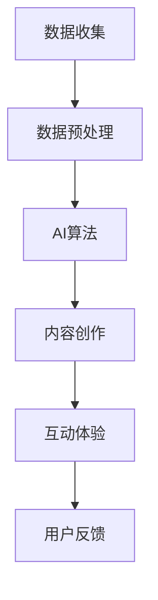
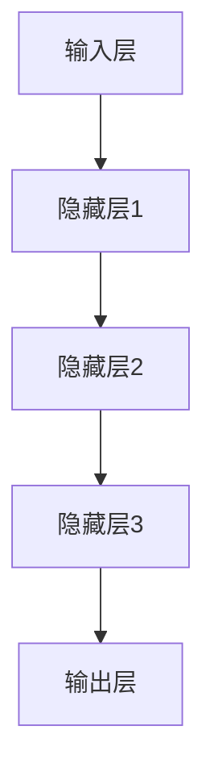
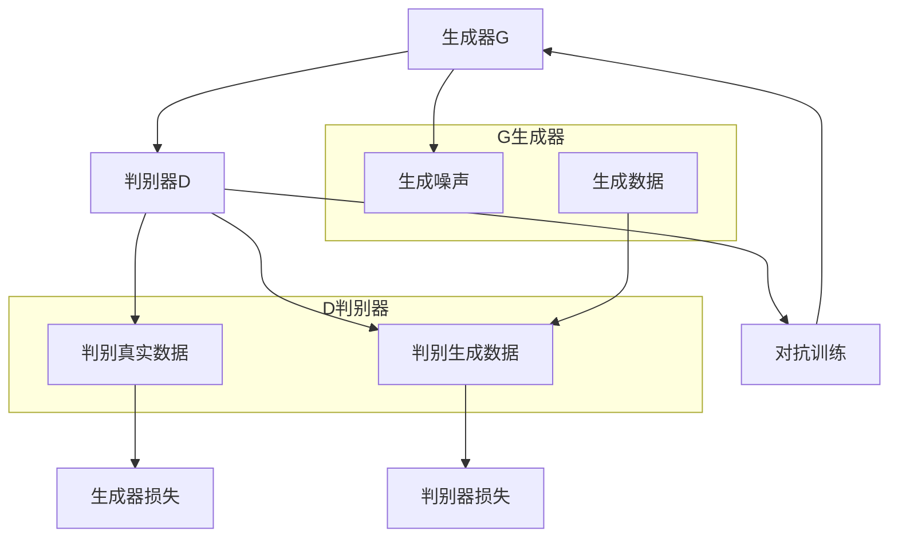
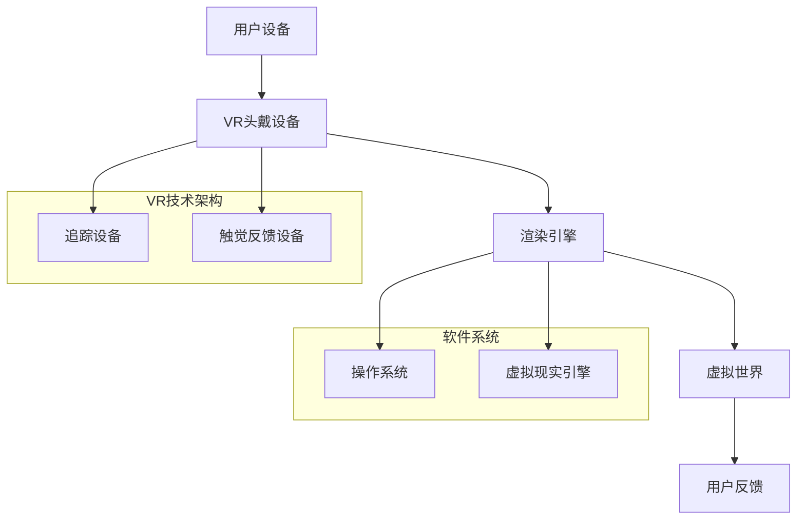
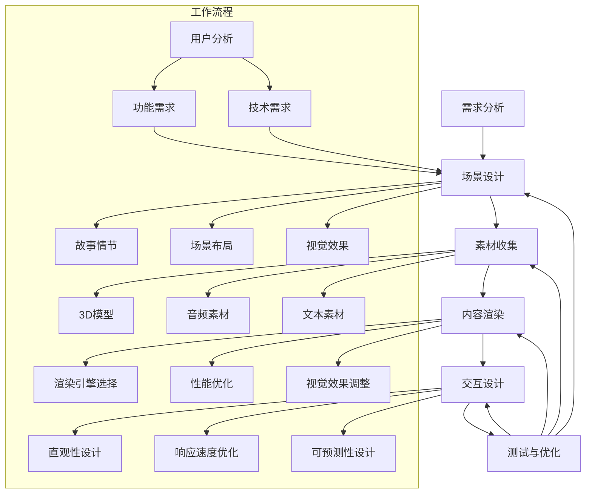
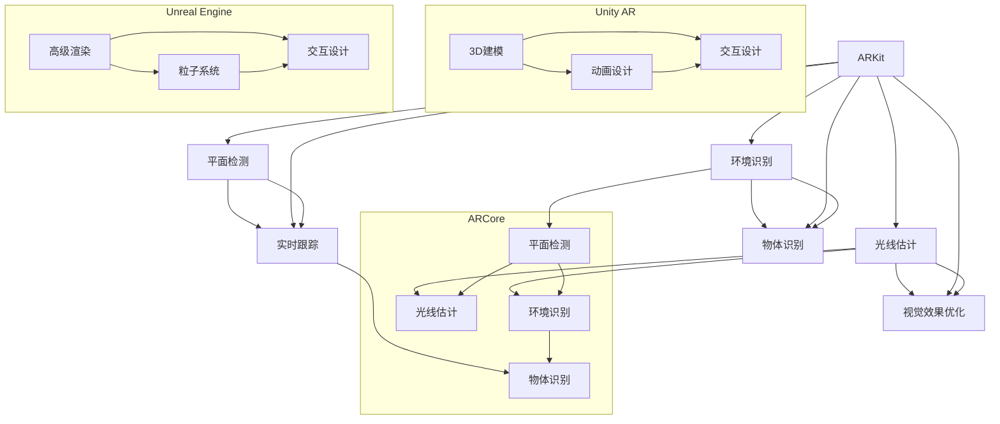
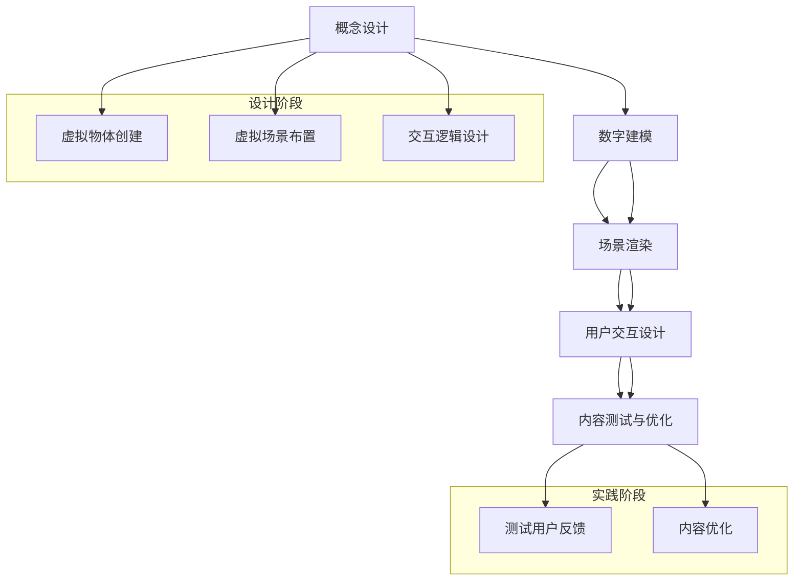
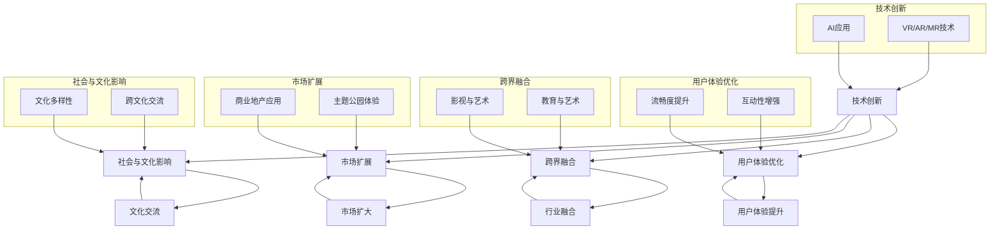

                 

# 《沉浸式艺术：AI驱动的创作与欣赏》

## 关键词

沉浸式艺术、AI驱动、创作与欣赏、虚拟现实、增强现实、混合现实、数据生成、GAN算法、用户体验、审美评价、市场与产业分析

## 摘要

本文旨在探讨AI驱动的沉浸式艺术，从基础理论到应用实践，详细分析沉浸式艺术的定义、AI的应用、沉浸式艺术中的数据生成与创作、虚拟现实与增强现实技术、混合现实艺术创作，以及人工智能在沉浸式艺术中的应用创新。同时，文章还将分析沉浸式艺术作品的审美评价、市场与产业现状以及未来发展方向，为读者提供一个全面而深入的沉浸式艺术与AI结合的视角。

### 《沉浸式艺术：AI驱动的创作与欣赏》目录大纲

#### 第一部分：AI驱动的沉浸式艺术基础

**第1章：沉浸式艺术的概述**

- **1.1 沉浸式艺术的定义与起源**
- **1.2 AI在沉浸式艺术中的应用**

**第2章：人工智能的核心概念与架构**

- **2.1 人工智能的定义与历史**
- **2.2 AI的核心算法原理**

**第3章：沉浸式艺术中的数据生成与创作**

- **3.1 数据生成技术在沉浸式艺术中的应用**
- **3.2 GAN算法原理与实现**

#### 第二部分：AI驱动的沉浸式艺术创作实践

**第4章：虚拟现实与沉浸式体验**

- **4.1 虚拟现实技术概述**
- **4.2 VR内容创作流程与技巧**

**第5章：增强现实与艺术创作**

- **5.1 增强现实技术概述**
- **5.2 AR内容创作工具与技巧**

**第6章：混合现实与艺术表达**

- **6.1 混合现实技术概述**
- **6.2 混合现实艺术创作案例与实践**

**第7章：人工智能在沉浸式艺术中的应用**

- **7.1 人工智能在沉浸式艺术中的创新**
- **7.2 案例分析：AI驱动的沉浸式艺术项目**

#### 第三部分：沉浸式艺术的欣赏与评价

**第8章：沉浸式艺术作品的审美评价**

- **8.1 沉浸式艺术作品的审美标准**
- **8.2 案例分析：沉浸式艺术作品的评价案例**

**第9章：沉浸式艺术的市场与产业分析**

- **9.1 沉浸式艺术的市场现状**
- **9.2 沉浸式艺术的发展趋势**

**第10章：未来展望：沉浸式艺术的未来发展方向**

- **10.1 沉浸式艺术的发展挑战与机遇**
- **10.2 沉浸式艺术在未来的应用前景**

#### 附录

**附录A：沉浸式艺术创作工具与资源**

- **A.1 开源工具与框架**
- **A.2 商业工具与平台**

---

### 第一部分：AI驱动的沉浸式艺术基础

#### 第1章：沉浸式艺术的概述

### 1.1 沉浸式艺术的定义与起源

沉浸式艺术是一种通过综合运用多种艺术形式和技术手段，营造高度逼真的艺术体验环境，使观众身临其境的艺术形式。这种艺术形式的出现可以追溯到20世纪末期，随着计算机技术和虚拟现实技术的发展而逐渐成熟。

沉浸式艺术的核心在于为观众提供一个全方位、多感官的沉浸体验。通过使用虚拟现实（VR）、增强现实（AR）和混合现实（MR）等技术，沉浸式艺术不仅包括视觉和听觉的刺激，还涉及触觉、嗅觉等感官的互动。例如，在虚拟现实环境中，观众可以进入一个完全虚拟的世界，感受到与现实世界不同的景象和氛围；而在增强现实环境中，虚拟物体可以叠加在真实世界中，与真实环境互动。

沉浸式艺术的起源可以追溯到20世纪80年代，当时虚拟现实技术的初步发展促使艺术家和科学家开始探讨如何利用这种技术创造全新的艺术形式。最早的沉浸式艺术作品之一是“阿凡达”计划，它通过头戴式显示器和立体声音频设备，让观众进入一个虚拟的三维空间，体验到与虚拟角色互动的乐趣。

随着时间的推移，沉浸式艺术逐渐发展成为一个独立的领域，吸引了越来越多的艺术家、设计师和技术开发者的关注。如今，沉浸式艺术已经广泛应用于博物馆展览、主题公园、娱乐体验、教育培训等多个领域，成为现代艺术的重要组成部分。

### 1.2 AI在沉浸式艺术中的应用

人工智能（AI）在沉浸式艺术中的应用使得创作和欣赏过程更加智能化和个性化学。AI的应用主要体现在数据生成、内容创作、互动体验等方面。

首先，在数据生成方面，AI可以自动生成大量的虚拟场景、角色和物体，为沉浸式艺术提供丰富的素材。通过生成对抗网络（GAN）等算法，AI可以创造出高度逼真的虚拟图像，使得虚拟世界的视觉表现更加真实。例如，在虚拟现实游戏中，AI可以实时生成复杂的场景和角色，为玩家提供逼真的游戏体验。

其次，在内容创作方面，AI可以帮助艺术家和设计师快速生成创意作品。通过使用深度学习算法，AI可以分析大量的艺术作品，学习其中的风格和特点，然后根据用户的需求生成新的作品。例如，AI可以根据用户提供的主题和风格要求，自动创作出相应的音乐、绘画和动画作品。这种自动化创作不仅提高了创作效率，也为艺术家提供了更多的创作灵感。

最后，在互动体验方面，AI可以实时分析用户的反馈和行为，为用户提供个性化的互动体验。例如，在增强现实应用中，AI可以识别用户的面部表情和身体动作，根据用户的情绪和行为调整虚拟物体的表现和互动方式。这种个性化的互动体验使得沉浸式艺术更加贴近用户的内心需求，提高了用户的满意度和参与度。

总的来说，AI在沉浸式艺术中的应用极大地丰富了创作手段和欣赏体验，为沉浸式艺术的发展带来了新的机遇和挑战。随着AI技术的不断进步，我们可以期待沉浸式艺术在未来会呈现出更加多样化和创新性的发展趋势。

---

### 1.2 AI在沉浸式艺术中的应用

AI在沉浸式艺术中的应用不仅限于数据的生成和内容的创作，更在互动体验和用户体验方面发挥了重要作用。具体来说，AI通过以下几个方面的应用，为沉浸式艺术带来了全新的可能性和体验。

首先，AI在互动体验中的应用极大地提升了用户的沉浸感。通过机器学习和深度学习算法，AI可以实时分析用户的反馈和行为，动态调整虚拟环境的视觉效果和互动方式。例如，在虚拟现实游戏中，AI可以根据玩家的游戏数据和行为模式，实时生成个性化的游戏任务和挑战，使得游戏体验更加生动有趣。此外，AI还可以根据用户的生理和心理状态，如心率、面部表情等，智能调节虚拟环境的亮度和音量，以增强用户的沉浸感。

其次，AI在用户体验方面的应用使得沉浸式艺术更加个性化和智能化。通过分析用户的历史数据和行为模式，AI可以为用户提供个性化的内容推荐和互动体验。例如，在博物馆的虚拟展览中，AI可以根据用户的兴趣和偏好，推荐相关的展品和展览内容，并提供个性化的导览服务。这不仅提升了用户的参观体验，也增加了展览的互动性和趣味性。

再者，AI在情感分析方面的应用为沉浸式艺术注入了情感元素。通过分析用户的语音、文本和面部表情，AI可以识别用户的情感状态，并相应地调整虚拟角色的行为和语言。例如，在一个互动式故事体验中，AI可以根据用户的情绪反应，调整故事的情节和角色的表现，使得用户体验更加深入和丰富。

此外，AI还在艺术创作过程中发挥了辅助作用。例如，通过自然语言处理技术，AI可以理解用户对艺术作品的需求和描述，自动生成相应的艺术作品。这种创作方式不仅提高了创作效率，也为艺术家提供了新的创作手段和灵感来源。

总之，AI在沉浸式艺术中的应用不仅丰富了艺术创作的手段和形式，也提升了用户的互动体验和沉浸感。随着AI技术的不断进步，我们可以期待沉浸式艺术在未来会迎来更多创新和发展的机遇。

### 1.2 AI在沉浸式艺术中的应用

为了更清晰地展示AI在沉浸式艺术中的应用流程，我们可以用Mermaid图来表示。以下是一个简单的流程图，展示从数据收集到互动体验的全过程：



- **A[数据收集]**：沉浸式艺术首先需要收集大量的数据，包括场景数据、用户行为数据、艺术素材数据等。
- **B[数据预处理]**：收集到的数据需要进行预处理，如去噪、标准化、特征提取等，以便于后续的AI处理。
- **C[AI算法]**：利用AI算法，如生成对抗网络（GAN）、自然语言处理（NLP）、深度学习等，对预处理后的数据进行处理和分析，生成新的艺术内容。
- **D[内容创作]**：基于AI处理的结果，创作出新的艺术作品，如虚拟场景、角色、音乐等。
- **E[互动体验]**：将创作的艺术内容嵌入沉浸式环境中，用户可以通过VR、AR、MR设备与之互动，体验艺术作品的魅力。
- **F[用户反馈]**：用户在互动过程中产生的反馈会被收集并再次用于AI的优化和改进，形成一个闭环系统，不断优化用户体验。

通过这个流程图，我们可以更直观地理解AI在沉浸式艺术中的应用方式和各个环节之间的关联。

---

### 2.1 人工智能的定义与历史

人工智能（Artificial Intelligence，简称AI）是指通过计算机模拟人类智能行为和思考能力的科学和技术。人工智能的研究可以追溯到20世纪50年代，当时计算机科学家和哲学家开始探索机器是否能够模拟人类的智能。这一时期，人工智能的定义主要集中在符号主义（Symbolic AI）和推理（Reasoning）方面，希望通过符号处理和逻辑推理来实现智能。

在20世纪60年代，人工智能经历了第一个发展阶段，即“黄金时期”。这一时期，人工智能研究取得了显著的进展，例如开发出第一批专家系统（Expert Systems），这些系统能够在特定领域内模拟专家的决策能力。然而，由于计算资源和算法的局限性，人工智能在70年代遭遇了第一次“寒冬”。

20世纪80年代，随着计算机技术的进步，特别是微处理器的性能提升，人工智能开始进入新的发展阶段。这一时期，人工智能的研究重点转向了机器学习（Machine Learning）和专家系统（Expert Systems）。机器学习通过算法使计算机能够从数据中学习并做出预测和决策，而专家系统则通过模拟专家的推理过程来解决复杂问题。

20世纪90年代，人工智能迎来了另一个重要的发展阶段，即“认知革命”。这一时期，人工智能开始尝试模拟人类认知过程的各个方面，包括感知、学习、记忆、推理等。同时，计算视觉（Computer Vision）和自然语言处理（Natural Language Processing）等领域取得了突破性进展。

进入21世纪，人工智能进入了深度学习（Deep Learning）和强化学习（Reinforcement Learning）时代。深度学习通过多层神经网络结构，使计算机能够在图像、语音、文本等复杂数据上实现高效的处理和识别。强化学习则通过智能体与环境交互，不断学习优化策略，从而实现决策的智能化。

人工智能的发展历程不仅见证了计算技术和算法的进步，也推动了各个领域的技术创新和应用。如今，人工智能已经成为推动社会进步和产业变革的重要力量，其应用范围涵盖了从医疗、金融到教育、娱乐等多个领域。

### 2.2 AI的核心算法原理

#### 2.2.1 神经网络与深度学习

神经网络（Neural Networks）是人工智能领域的重要基础，特别是深度学习（Deep Learning）的核心技术。神经网络模仿人脑神经元的工作方式，通过多层神经元结构对数据进行学习和处理。

**神经网络的基本结构**

一个简单的神经网络包括三个主要部分：输入层、隐藏层和输出层。输入层接收外部数据，隐藏层通过权重和偏置进行数据变换，输出层生成最终的预测结果。

- **输入层（Input Layer）**：接收输入数据，每个输入节点对应数据的一个特征。
- **隐藏层（Hidden Layer）**：对输入数据进行加权求和处理，并通过激活函数进行非线性变换。
- **输出层（Output Layer）**：产生最终预测结果。

**神经网络的工作原理**

1. **前向传播（Forward Propagation）**：输入数据从输入层流向隐藏层，再从隐藏层流向输出层。每一层节点对数据进行加权求和处理，并应用激活函数进行非线性变换。

2. **反向传播（Backpropagation）**：计算输出层的误差，然后反向传播到隐藏层，通过梯度下降算法更新权重和偏置，以减少误差。

**激活函数（Activation Function）**

激活函数是神经网络中不可或缺的部分，用于引入非线性特性。常见的激活函数包括：
- **Sigmoid函数**：\( \sigma(x) = \frac{1}{1 + e^{-x}} \)，将输入映射到\( (0, 1) \)区间。
- **ReLU函数**：\( \text{ReLU}(x) = \max(0, x) \)，对正数保持不变，负数变为零。
- **Tanh函数**：\( \tanh(x) = \frac{e^x - e^{-x}}{e^x + e^{-x}} \)，将输入映射到\( (-1, 1) \)区间。

**深度学习**

深度学习是神经网络的一种扩展，通过增加隐藏层的数量，使得神经网络能够捕捉到更复杂的数据特征。深度学习的核心思想是层次化特征提取，每一层神经网络都提取了更高层次的特征。

**深度学习的基本结构**

一个深度学习模型通常包括以下组成部分：
- **输入层（Input Layer）**：接收原始数据。
- **隐藏层（Hidden Layers）**：通过多个隐藏层对数据进行变换和特征提取。
- **输出层（Output Layer）**：生成最终的预测结果。

**深度学习的优势**

- **特征自动提取**：通过多层网络结构，自动提取数据的特征，无需人工设计特征。
- **高表达力**：多层网络能够捕捉到更复杂和抽象的特征，从而在各类任务中表现出色。
- **高效性**：相比于传统机器学习方法，深度学习模型能够在较少的人工干预下实现更高的性能。

总之，神经网络和深度学习为人工智能提供了强大的工具，通过层次化特征提取和复杂模式识别能力，深度学习在图像识别、自然语言处理、语音识别等领域取得了显著成果，推动了人工智能技术的快速发展。

### 2.2.1 神经网络与深度学习

为了更加直观地理解神经网络和深度学习的基本结构，我们可以借助Mermaid图来展示其层次化的架构。



- **A[输入层]**：接收外部输入数据，例如图像、文本或声音信号。
- **B[隐藏层1]**：对输入数据进行初步的加工和处理，提取基本的特征。
- **C[隐藏层2]**：进一步对隐藏层1提取的特征进行复杂加工，生成更高层次的特征。
- **D[隐藏层3]**：继续加深特征提取的过程，生成更加抽象和复杂的特征。
- **E[输出层]**：将提取到的特征用于生成最终的预测或决策。

通过这种层次化的结构，神经网络能够自动学习到输入数据的复杂特征，从而实现从简单到复杂的模式识别和预测任务。

### 2.2.1 神经网络与深度学习

在深入探讨神经网络和深度学习的具体实现时，我们使用伪代码来描述其基本架构和过程。以下是一个简单的神经网络模型，包括输入层、隐藏层和输出层，以及前向传播和反向传播算法。

```python
# 伪代码：神经网络的基本结构

class NeuralNetwork:
    def __init__(self):
        self.inputs = []
        self.outputs = []
        self.biases = []
        self.weights = []

    def forward(self, input_data):
        # 前向传播
        # 输入数据通过权重和偏置进行处理，并应用激活函数
        output = self.apply_activation(np.dot(input_data, self.weights) + self.biases)
        return output

    def backward(self, error):
        # 反向传播
        # 根据误差计算梯度，并更新权重和偏置
        dweights = np.dot(self.inputs.T, error * self.apply_derivative(self.outputs))
        dbiases = np.sum(error * self.apply_derivative(self.outputs), axis=0)
        self.weights -= dweights
        self.biases -= dbiases

    def apply_activation(self, x):
        # 激活函数，例如ReLU函数
        return np.maximum(0, x)

    def apply_derivative(self, x):
        # 激活函数的导数，例如ReLU函数的导数
        return np.where(x > 0, 1, 0)

# 使用神经网络进行前向传播和反向传播
nn = NeuralNetwork()
input_data = np.array([1, 0, 1])  # 输入数据
expected_output = np.array([1])    # 预期输出

# 前向传播
output = nn.forward(input_data)

# 计算误差
error = expected_output - output

# 反向传播
nn.backward(error)
```

在这段伪代码中，`NeuralNetwork`类定义了一个简单的神经网络，包含输入层、隐藏层和输出层。`forward`方法实现前向传播，将输入数据通过加权求和处理和激活函数得到输出。`backward`方法实现反向传播，计算误差并更新权重和偏置。通过这两个方法，神经网络能够不断优化其参数，以减少预测误差。

通过这种伪代码的描述，我们可以清晰地看到神经网络的工作原理和实现过程，从而更好地理解深度学习的核心技术。

### 3.1 数据生成技术在沉浸式艺术中的应用

数据生成技术是沉浸式艺术中不可或缺的一部分，它为艺术家提供了丰富的素材和创作灵感。在沉浸式艺术中，数据生成技术主要用于生成虚拟场景、角色、物体以及音效等元素，这些元素共同构建出一个高度逼真的艺术体验环境。具体来说，数据生成技术在沉浸式艺术中的应用主要体现在以下几个方面。

首先，虚拟场景的生成是沉浸式艺术的基础。通过数据生成技术，艺术家可以创建复杂的虚拟场景，从自然环境到城市景观，从虚拟现实游戏世界到艺术展览空间。生成对抗网络（GAN）是一种常用的数据生成方法，它通过生成器和判别器的对抗训练，能够生成高质量的图像和场景。例如，在虚拟现实游戏中，GAN可以用于生成实时渲染的场景，为玩家提供一个沉浸式的游戏体验。

其次，角色的生成也是沉浸式艺术的重要组成部分。通过数据生成技术，艺术家可以生成各种类型的虚拟角色，从动漫形象到现实人物，从静态模型到动态动画。这种技术不仅提高了创作的效率，还使得角色的逼真度和多样性得到了显著提升。例如，在虚拟现实电影中，数据生成技术可以用于生成具有高度细节和表情的虚拟演员，使观众感受到真实的人物互动。

再次，物体的生成是沉浸式艺术中不可或缺的一环。艺术家可以利用数据生成技术创建各种虚拟物体，从日常用品到艺术装置，从静态物体到动态物体。这些虚拟物体不仅可以丰富虚拟环境的视觉效果，还可以增加互动性。例如，在增强现实（AR）应用中，数据生成技术可以用于生成虚拟植物、动物等物体，与真实环境互动，为用户带来全新的体验。

此外，音效的生成也是沉浸式艺术的重要部分。通过数据生成技术，艺术家可以生成各种音效，从自然界的鸟鸣、风声到人工制造的音效，这些音效与虚拟场景和角色的动作紧密结合，增强用户的沉浸感。例如，在虚拟现实音乐表演中，数据生成技术可以用于实时生成与表演动作同步的音效，使得观众仿佛置身于现场。

总之，数据生成技术在沉浸式艺术中的应用不仅丰富了艺术创作的手段，也为观众带来了更加生动、逼真的艺术体验。随着技术的不断发展，我们可以期待数据生成技术在沉浸式艺术中的表现将更加出色。

### 3.2 GAN算法原理与实现

生成对抗网络（Generative Adversarial Network，简称GAN）是深度学习领域中的一种重要算法，主要用于生成逼真的数据。GAN的核心思想是通过两个对抗网络——生成器和判别器的交互训练，使得生成器能够生成接近真实数据的高质量图像。

#### GAN的基本结构

GAN由两个主要部分组成：生成器（Generator）和判别器（Discriminator）。

- **生成器（Generator）**：生成器的目标是生成类似于真实数据的样本。它将随机噪声作为输入，通过多层神经网络处理，生成模拟数据的输出。
  
- **判别器（Discriminator）**：判别器的目标是区分输入数据是真实数据还是生成器生成的数据。它将输入数据（真实数据和生成器生成的数据）作为输入，通过多层神经网络判断输入数据的真假。

GAN的训练过程可以看作是一场对抗游戏。生成器试图生成尽可能真实的数据来欺骗判别器，而判别器则试图准确区分真实数据和生成数据。在这个过程中，两个网络相互竞争，共同进步，最终生成器能够生成高质量的数据，判别器能够准确识别数据。

#### GAN的训练过程

GAN的训练过程主要包括以下几个步骤：

1. **初始化生成器和判别器**：首先初始化生成器和判别器，通常两者都是多层神经网络。生成器将随机噪声映射到数据空间，判别器将数据映射到一个二分类输出。

2. **生成器生成样本**：生成器接收随机噪声，生成模拟数据的样本。这些样本与真实数据混合，作为判别器的输入。

3. **判别器训练**：判别器在看到混合数据后，学习区分真实数据和生成数据。通过反向传播算法，判别器更新其参数，以提高分类能力。

4. **生成器更新**：生成器在判别器的反馈下，学习生成更真实的数据。通过最小化生成数据被判别器判为假数据的概率，生成器不断优化其参数。

5. **迭代训练**：上述步骤反复进行，生成器和判别器相互竞争，生成器的生成质量逐渐提升，判别器的识别能力也不断增强。

#### GAN的实现

以下是一个简单的GAN实现示例，使用了Python和TensorFlow框架。

```python
import tensorflow as tf
from tensorflow.keras.layers import Dense, Flatten
from tensorflow.keras.models import Sequential

# 定义生成器模型
def create_generator():
    model = Sequential()
    model.add(Dense(128, input_shape=(100,), activation='relu'))
    model.add(Dense(128, activation='relu'))
    model.add(Dense(784, activation='tanh'))
    return model

# 定义判别器模型
def create_discriminator():
    model = Sequential()
    model.add(Flatten(input_shape=(28, 28)))
    model.add(Dense(128, activation='relu'))
    model.add(Dense(1, activation='sigmoid'))
    return model

# 实例化生成器和判别器
generator = create_generator()
discriminator = create_discriminator()

# 编写GAN训练过程
optimizer = tf.keras.optimizers.Adam(0.0001)

# 训练循环
for epoch in range(num_epochs):
    # 准备训练数据
    noise = np.random.normal(0, 1, (batch_size, 100))
    real_images = ...  # 加载真实图像数据

    # 训练判别器
    with tf.GradientTape() as disc_tape:
        real_predictions = discriminator(real_images, training=True)
        fake_predictions = discriminator(generator(noise, training=True), training=True)
        disc_loss = -tf.reduce_mean(tf.reduce_sum(tf.math.log(real_predictions + 1e-9), axis=1) - tf.reduce_sum(tf.math.log(1 - fake_predictions + 1e-9), axis=1))

    disc_gradients = disc_tape.gradient(disc_loss, discriminator.trainable_variables)
    optimizer.apply_gradients(zip(disc_gradients, discriminator.trainable_variables))

    # 训练生成器
    with tf.GradientTape() as gen_tape:
        fake_predictions = discriminator(generator(noise, training=True), training=True)
        gen_loss = -tf.reduce_mean(tf.reduce_sum(tf.math.log(1 - fake_predictions + 1e-9), axis=1))

    gen_gradients = gen_tape.gradient(gen_loss, generator.trainable_variables)
    optimizer.apply_gradients(zip(gen_gradients, generator.trainable_variables))

    # 打印训练信息
    if epoch % 100 == 0:
        print(f"Epoch {epoch}: Gen Loss = {gen_loss.numpy()}, Disc Loss = {disc_loss.numpy()}")

# 保存模型
generator.save('generator.h5')
discriminator.save('discriminator.h5')
```

在这个实现中，我们定义了生成器和判别器的模型结构，并使用TensorFlow的优化器进行训练。训练过程中，我们首先训练判别器，使其能够准确区分真实图像和生成图像。然后，我们训练生成器，使其生成更逼真的图像来欺骗判别器。通过这种对抗训练，生成器逐渐提高生成质量，最终生成出高质量的图像。

总的来说，GAN算法通过生成器和判别器的对抗训练，能够在多种数据生成任务中取得优异的效果。GAN不仅在图像生成方面表现出色，还可以应用于音频、视频和其他类型的数据生成任务，为人工智能和沉浸式艺术的发展提供了强有力的支持。

---

### 3.2 GAN算法原理与实现

为了更好地理解GAN（生成对抗网络）的算法原理，我们可以通过一个简化的结构图来展示其核心组件和工作机制。



- **A[生成器G]**：生成器生成虚拟数据，这些数据旨在欺骗判别器。
- **B[判别器D]**：判别器用于判断输入数据是真实数据还是生成器生成的数据。
- **C[对抗训练]**：生成器和判别器通过对抗训练不断优化，生成器试图生成更真实的数据，判别器试图更准确地识别数据。
- **G1[生成噪声]**：生成器从随机噪声中生成虚拟数据。
- **G2[生成数据]**：生成器生成虚拟数据，这些数据被传递给判别器。
- **D1[判别真实数据]**：判别器判断输入的真实数据。
- **D2[判别生成数据]**：判别器判断生成器生成的虚拟数据。
- **C1[生成器损失]**：生成器的损失函数，用于衡量生成数据的质量。
- **C2[判别器损失]**：判别器的损失函数，用于衡量判别器的准确性。

通过这个结构图，我们可以清晰地看到生成器和判别器在对抗训练中的交互作用，以及它们如何通过不断优化来生成高质量的虚拟数据。这个动态过程不仅展示了GAN的核心原理，也为理解其在各种应用中的工作方式提供了直观的视觉帮助。

### 3.2 GAN算法原理与实现

在深入探讨GAN（生成对抗网络）的算法原理和实现时，我们需要详细讨论GAN的训练过程以及如何利用GAN生成高质量的虚拟数据。以下是GAN算法的训练过程的详细解释：

#### 3.2.1 GAN的训练过程

GAN的训练过程是一个动态的对抗训练过程，涉及两个主要步骤：生成器（Generator）的训练和判别器（Discriminator）的训练。

1. **初始化参数**：

   在训练开始时，首先需要初始化生成器和判别器的参数。生成器G的输入通常是随机噪声z，输出是生成的人工数据G(z)。判别器D的输入是真实数据x和生成器生成的数据G(z)，输出是一个概率值，表示输入数据是真实数据的可能性。

2. **生成器训练**：

   生成器的目标是生成尽可能真实的数据，以欺骗判别器。在每次训练迭代中，生成器会生成一批新的虚拟数据G(z)。然后，将这些虚拟数据与真实数据混合，作为判别器的输入。

   具体来说，训练过程中，生成器G的目标是最小化判别器D对其生成数据的判别概率，即最大化判别器对真实数据的判别概率。因此，生成器的损失函数G通常定义为：

   \[
   L_G = -\log(D(G(z)))
   \]

   其中，z是随机噪声，D(G(z))是判别器对生成数据的判断概率。

3. **判别器训练**：

   判别器的目标是准确区分真实数据和生成数据。在每次训练迭代中，判别器会同时接收真实数据x和生成器生成的数据G(z)。判别器的目标是最大化其对真实数据的判断概率，同时最小化对生成数据的判断概率。因此，判别器的损失函数D通常定义为：

   \[
   L_D = -[\log(D(x)) + \log(1 - D(G(z))]
   \]

   其中，x是真实数据，G(z)是生成器生成的数据。

4. **交替训练**：

   生成器和判别器是交替训练的。首先固定判别器的参数，优化生成器的参数；然后固定生成器的参数，优化判别器的参数。这个过程反复进行，直到生成器生成的数据质量达到预期。

5. **优化过程**：

   在训练过程中，生成器和判别器的优化过程是一个动态的博弈过程。生成器试图生成更加真实的数据，而判别器试图更加准确地识别真实数据和生成数据。通过这种对抗训练，生成器逐渐提高生成数据的质量，判别器逐渐增强对真实数据和生成数据的区分能力。

#### 3.2.2 GAN的实现

以下是一个简化的GAN实现示例，用于生成手写数字的图像。该示例使用TensorFlow框架，展示了生成器和判别器的构建以及训练过程。

```python
import tensorflow as tf
from tensorflow.keras.layers import Dense, Flatten
from tensorflow.keras.models import Sequential

# 定义生成器模型
def create_generator():
    model = Sequential()
    model.add(Dense(256, input_shape=(100,), activation='relu'))
    model.add(Dense(512, activation='relu'))
    model.add(Dense(1024, activation='relu'))
    model.add(Flatten())
    model.add(Dense(784, activation='tanh'))
    return model

# 定义判别器模型
def create_discriminator():
    model = Sequential()
    model.add(Flatten(input_shape=(28, 28)))
    model.add(Dense(512, activation='relu'))
    model.add(Dense(1024, activation='relu'))
    model.add(Dense(1, activation='sigmoid'))
    return model

# 实例化生成器和判别器
generator = create_generator()
discriminator = create_discriminator()

# 编写GAN训练过程
optimizer = tf.keras.optimizers.Adam(0.0001)
cross_entropy = tf.keras.losses.BinaryCrossentropy(from_logits=True)

@tf.function
def train_step(images, noise):
    with tf.GradientTape() as gen_tape, tf.GradientTape() as disc_tape:
        generated_images = generator(noise)
        disc_real = discriminator(images)
        disc_generated = discriminator(generated_images)

        real_loss = cross_entropy(tf.ones_like(disc_real), disc_real)
        generated_loss = cross_entropy(tf.zeros_like(disc_generated), disc_generated)

        disc_loss = real_loss + generated_loss

    gradients_of_gen = gen_tape.gradient(generated_loss, generator.trainable_variables)
    gradients_of_disc = disc_tape.gradient(disc_loss, discriminator.trainable_variables)

    optimizer.apply_gradients(zip(gradients_of_gen, generator.trainable_variables))
    optimizer.apply_gradients(zip(gradients_of_disc, discriminator.trainable_variables))

    return real_loss, generated_loss, disc_loss

@tf.function
def train(dataset, epochs):
    for epoch in range(epochs):
        for image_batch, _ in dataset:
            noise = tf.random.normal([image_batch.shape[0], 100])

            real_loss, generated_loss, disc_loss = train_step(image_batch, noise)

        print(f"Epoch {epoch + 1}, Discriminator Loss: {disc_loss}, Generator Loss: {generated_loss}")

# 加载MNIST数据集
mnist = tf.keras.datasets.mnist
(train_images, _), (_, _) = mnist.load_data()
train_images = train_images / 255.0

# 创建数据集
BUFFER_SIZE = 60000
BATCH_SIZE = 256
train_dataset = tf.data.Dataset.from_tensor_slices(train_images).shuffle(BUFFER_SIZE).batch(BATCH_SIZE)

# 训练模型
EPOCHS = 50
train(train_dataset, EPOCHS)

# 保存模型
generator.save('generator.h5')
discriminator.save('discriminator.h5')
```

在这个实现中，我们首先定义了生成器和判别器的模型结构，并使用TensorFlow的优化器进行训练。训练过程中，我们首先训练判别器，使其能够准确区分真实图像和生成图像。然后，我们训练生成器，使其生成更真实的图像来欺骗判别器。通过这种对抗训练，生成器逐渐提高生成图像的质量，判别器逐渐增强对真实图像和生成图像的区分能力。

总的来说，GAN算法通过生成器和判别器的对抗训练，能够在多种数据生成任务中取得优异的效果。GAN不仅在图像生成方面表现出色，还可以应用于音频、视频和其他类型的数据生成任务，为人工智能和沉浸式艺术的发展提供了强有力的支持。

---

### 第4章：虚拟现实与沉浸式体验

#### 4.1 虚拟现实技术概述

虚拟现实（Virtual Reality，简称VR）是一种通过计算机技术模拟出三维虚拟环境，使用户在视觉、听觉、触觉等多个感官上感受到沉浸式体验的技术。VR技术的核心是通过头戴式显示器（HMD）、追踪设备、触觉反馈设备等硬件，结合高性能的计算设备和软件，为用户提供一个完全虚拟的交互空间。

**VR技术架构**

VR技术的架构主要包括以下几个部分：

1. **硬件设备**：
   - **头戴式显示器（HMD）**：提供虚拟环境的视觉显示，常见的HMD设备有Oculus Rift、HTC Vive、PlayStation VR等。
   - **追踪设备**：用于跟踪用户的头部和手部位置，实现虚拟环境中的空间定位和交互，如外置摄像头、红外传感器等。
   - **触觉反馈设备**：通过触觉反馈技术，增强用户的沉浸体验，如虚拟现实手套、触觉手套等。

2. **计算设备**：
   - **主机**：运行虚拟现实应用程序和图形渲染的计算机，要求高性能的计算能力。
   - **GPU**：用于加速三维图形渲染和物理计算，提高虚拟环境的流畅度和真实感。

3. **软件系统**：
   - **虚拟现实引擎**：如Unity、Unreal Engine等，提供虚拟环境建模、交互设计、图形渲染等功能。
   - **操作系统**：为虚拟现实设备提供运行环境，如Windows Mixed Reality、Oculus Home等。

**VR技术的关键特点**

1. **沉浸感**：通过头戴式显示器等设备，用户可以完全沉浸在虚拟环境中，感受到与现实世界的隔离。

2. **交互性**：用户可以通过手部追踪和触觉反馈设备与虚拟环境进行交互，实现空间定位和虚拟物体的操作。

3. **多样性**：虚拟现实技术可以应用于多个领域，如游戏、娱乐、教育培训、医疗康复等。

4. **安全性**：虚拟现实技术通过软件和硬件的组合，确保用户在虚拟环境中的安全性和稳定性。

**VR技术的历史与发展**

VR技术的发展可以追溯到20世纪60年代。1968年，美国计算机科学家伊凡·苏瑟兰（Ivan Sutherland）发明了世界上第一个头戴式显示器（HMD），这是虚拟现实技术的雏形。20世纪90年代，随着计算机图形学和计算能力的提升，VR技术逐渐走向成熟，出现了如VRML（Virtual Reality Modeling Language）等早期的虚拟现实标准。进入21世纪，随着高性能计算设备和硬件技术的进步，VR技术得到了快速发展和广泛应用。近年来，随着5G、人工智能等新技术的融入，VR技术正向更加智能化、互动化和高度沉浸化的方向发展。

#### 4.2 VR内容创作流程与技巧

虚拟现实（VR）内容创作的流程与技巧是一个复杂而细致的过程，涉及多个阶段，包括需求分析、场景设计、素材收集、内容渲染、交互设计以及测试与优化。以下是VR内容创作的详细流程与技巧：

**1. 需求分析**

在VR内容创作之前，明确需求是非常重要的。需求分析阶段主要包括以下任务：

- **目标用户分析**：了解目标用户的年龄、性别、兴趣、需求等，确保内容设计能够吸引并满足目标用户。
- **功能需求**：明确VR内容的功能，例如是否需要导航、互动、教育、娱乐等。
- **技术需求**：确定所需的硬件设备和技术平台，如VR头戴设备、开发引擎、操作系统等。

**2. 场景设计**

场景设计是VR内容创作的重要环节，决定了用户体验的质量。以下是场景设计的核心技巧：

- **故事情节**：设计一个引人入胜的故事情节，有助于提升用户的沉浸感和参与度。
- **场景布局**：合理规划场景布局，确保视觉、听觉和交互效果的协调一致。
- **视觉效果**：通过高质量的3D建模、贴图和照明效果，增强场景的视觉真实感。
- **交互设计**：设计直观、易用的交互界面，使用户能够轻松操作。

**3. 素材收集**

素材收集是VR内容创作的基础，包括以下几种素材：

- **3D模型**：收集或创建高质量的3D模型，用于场景中的虚拟物体和角色。
- **音频素材**：包括环境音效、背景音乐、声音效果等，增强用户的听觉体验。
- **文本素材**：包括说明文字、引导语、互动文本等，辅助用户理解和使用VR内容。

**4. 内容渲染**

内容渲染是将设计好的场景和素材在虚拟环境中实时展示的过程。以下是内容渲染的关键技巧：

- **渲染引擎**：选择合适的渲染引擎，如Unity、Unreal Engine等，这些引擎提供丰富的渲染工具和优化选项。
- **性能优化**：优化渲染性能，包括降低图形复杂度、优化纹理和贴图、减少计算负载等，确保内容的流畅运行。
- **视觉效果**：调整光照、阴影、颜色等视觉效果，提升场景的视觉吸引力。

**5. 交互设计**

交互设计是VR内容创作中至关重要的一环，决定了用户的体验质量。以下是交互设计的关键技巧：

- **直观性**：确保交互界面直观易用，避免复杂操作和冗余步骤。
- **响应速度**：优化交互响应速度，确保用户的动作能够快速得到反馈。
- **可预测性**：设计具有可预测性的交互效果，使用户能够预期和理解系统的响应。

**6. 测试与优化**

在VR内容创作完成后，需要进行严格的测试与优化，以确保内容的稳定性和用户体验。以下是测试与优化的关键步骤：

- **功能测试**：测试VR内容的各项功能是否正常，确保没有明显的错误或漏洞。
- **性能测试**：测试VR内容的运行性能，包括帧率、加载时间、资源消耗等，优化性能瓶颈。
- **用户体验测试**：邀请用户进行试玩，收集用户反馈，并根据反馈进行改进和优化。

通过以上详细的内容创作流程与技巧，我们可以创作出高质量的VR内容，为用户带来身临其境的沉浸式体验。

### 4.1 虚拟现实技术概述

为了更好地展示虚拟现实（VR）技术的架构，我们可以使用Mermaid图来描绘其核心组成部分和交互过程。



- **A[用户设备]**：指用户使用的VR设备，如智能手机、平板电脑或VR头戴设备。
- **B[VR头戴设备]**：提供用户与虚拟世界交互的硬件设备，包括头戴显示器、追踪设备和触觉反馈设备。
- **C[渲染引擎]**：负责虚拟世界的图形渲染和计算，常见的渲染引擎有Unity、Unreal Engine等。
- **D[虚拟世界]**：由渲染引擎生成的三维虚拟环境，包括场景、角色、物体等。
- **E[用户反馈]**：用户通过VR头戴设备提供的交互反馈，如头部运动、手势等。

通过这个结构图，我们可以清晰地看到VR技术的架构和各部分之间的互动关系，从而更好地理解虚拟现实技术的运作原理。

### 4.2 VR内容创作流程与技巧

为了更直观地理解VR内容创作的流程与技巧，我们可以用Mermaid图来展示VR内容创作的主要步骤和各个环节之间的关联。



- **A[需求分析]**：确定项目的目标用户、功能需求和技术需求。
- **B[场景设计]**：设计故事情节、场景布局和视觉效果。
- **C[素材收集]**：收集和创建3D模型、音频素材和文本素材。
- **D[内容渲染]**：选择合适的渲染引擎，优化性能和视觉效果。
- **E[交互设计]**：设计直观、响应速度快的交互界面。
- **F[测试与优化]**：对内容进行功能测试、性能测试和用户体验测试，并进行相应的优化。

通过这个流程图，我们可以清晰地看到VR内容创作从需求分析到测试优化的各个环节，以及它们之间的紧密关联。

---

### 第5章：增强现实与艺术创作

#### 5.1 增强现实技术概述

增强现实（Augmented Reality，简称AR）是一种通过计算机技术和传感器设备将虚拟信息叠加到现实世界中，提供增强视觉体验的技术。与虚拟现实（VR）不同，AR不是将用户完全沉浸在一个虚拟环境中，而是在现实环境中提供增强的信息和交互体验。

**AR技术的核心组成部分**

AR技术主要包括以下几个核心组成部分：

1. **硬件设备**：
   - **智能手机或平板电脑**：大多数AR应用依赖于智能手机或平板电脑的摄像头和处理器。
   - **头戴显示器**：如Microsoft HoloLens、Google Glass等，提供更加沉浸式的AR体验。
   - **AR眼镜**：如Vuzix Blade、Oculus Quest等，为用户提供便捷的AR交互体验。

2. **软件系统**：
   - **AR开发平台**：如ARKit、ARCore、Unity AR等，提供AR内容开发所需的工具和库。
   - **AR应用软件**：包括各种AR应用，如导航、游戏、教育、医疗等。

3. **传感器**：
   - **摄像头**：用于捕捉现实世界的图像。
   - **运动传感器**：如加速度计、陀螺仪等，用于检测用户的移动和姿态。
   - **深度传感器**：如结构光传感器、激光雷达等，用于获取现实世界的深度信息。

**AR技术的工作原理**

AR技术的基本工作原理是将计算机生成的虚拟图像与现实世界的图像进行叠加。具体来说，包括以下几个步骤：

1. **图像捕捉**：摄像头捕捉现实世界的图像。
2. **图像处理**：通过图像处理算法识别现实环境中的特征点，如纹理、颜色、形状等。
3. **虚拟图像生成**：根据识别的特征点和用户的位置、姿态，生成虚拟图像。
4. **图像叠加**：将生成的虚拟图像叠加到现实世界的图像上，形成增强现实的视觉效果。

**AR技术的应用领域**

AR技术广泛应用于多个领域，包括：

1. **娱乐**：如增强现实游戏、虚拟现实主题公园等。
2. **教育**：如虚拟实验室、历史重现等。
3. **医疗**：如手术指导、医学影像增强等。
4. **零售**：如虚拟试衣、产品展示等。
5. **导航**：如增强现实导航、位置标注等。

随着技术的不断发展，AR的应用领域将进一步扩大，为人们的生活带来更多便利和乐趣。

---

### 5.2 AR内容创作工具与技巧

增强现实（AR）内容创作工具是进行AR应用开发的关键，这些工具提供了丰富的功能，使得开发者可以轻松创建和部署AR应用。以下是几种常用的AR内容创作工具及其主要特点：

**1. ARKit**

ARKit是苹果公司开发的增强现实开发框架，广泛应用于iOS平台。ARKit提供了一系列强大的AR功能，包括环境识别、实时跟踪、光线估计和增强现实界面。以下是ARKit的主要特点：

- **环境识别**：ARKit能够识别和跟踪平面和空间中的特定对象。
- **实时跟踪**：ARKit提供了高精度的运动跟踪和姿态估计，确保虚拟物体与真实世界的动态同步。
- **光线估计**：ARKit能够根据环境光线自动调整虚拟物体的亮度和颜色，提升视觉效果的真实感。
- **增强现实界面**：ARKit支持创建交互式的增强现实界面，如按钮、滑动条等。

**2. ARCore**

ARCore是谷歌开发的AR开发平台，支持Android和Unity平台。ARCore提供了一系列先进的AR功能，包括环境识别、平面检测、光线估计和运动跟踪。以下是ARCore的主要特点：

- **环境识别**：ARCore能够检测和跟踪平面、图像和物体，支持多种环境场景的识别。
- **平面检测**：ARCore能够实时检测和跟踪平面，为虚拟物体的放置提供准确的参考。
- **光线估计**：ARCore根据环境光线自动调整虚拟物体的亮度和颜色，确保视觉效果的真实性。
- **运动跟踪**：ARCore提供了高精度的运动跟踪和姿态估计，使虚拟物体能够与现实世界无缝交互。

**3. Unity AR**

Unity AR是Unity引擎的一部分，支持多种平台（包括iOS和Android）的AR开发。Unity AR提供了一个强大的开发平台，包括3D建模、动画、交互设计等工具。以下是Unity AR的主要特点：

- **3D建模和动画**：Unity提供了一个直观的3D建模和动画工具集，开发者可以轻松创建高质量的虚拟物体和场景。
- **交互设计**：Unity支持丰富的交互设计功能，包括手势识别、语音控制和物理交互等。
- **跨平台支持**：Unity AR支持多种平台，开发者可以一次性开发，部署到多个操作系统和设备。
- **性能优化**：Unity提供了多种性能优化工具，帮助开发者提高应用的流畅度和运行效率。

**4. Unreal Engine**

Unreal Engine是Epic Games开发的强大游戏和AR开发引擎，以其高效的图形渲染和丰富的功能而著称。以下是Unreal Engine的主要特点：

- **高级图形渲染**：Unreal Engine提供了先进的图形渲染技术，支持复杂的光照、阴影和物理效果。
- **粒子系统**：Unreal Engine内置强大的粒子系统，可以创建逼真的烟雾、火焰、雨等效果。
- **交互设计**：Unreal Engine支持高度灵活的交互设计，包括触摸、手势、语音等。
- **VR/AR集成**：Unreal Engine同时支持VR和AR开发，提供了一致的开发体验和工具。

总之，这些AR内容创作工具为开发者提供了丰富的功能和技术支持，使得AR应用的开发变得更加简单和高效。无论是对初学者还是有经验的专业开发者，这些工具都为增强现实内容的创作提供了强大的支持。

### 5.2 AR内容创作工具与技巧

为了更好地展示增强现实（AR）内容创作工具，我们可以用Mermaid图来描绘几个主要的AR内容创作工具及其功能。



- **A[ARKit]**：提供了平面检测、环境识别、光线估计等核心功能。
- **B[平面检测]**：用于检测和跟踪现实世界中的平面，以便虚拟物体的放置。
- **C[环境识别]**：用于识别和跟踪特定的对象和场景。
- **D[光线估计]**：用于根据环境光线自动调整虚拟物体的亮度和颜色。
- **E[实时跟踪]**：确保虚拟物体与现实世界保持同步。
- **F[物体识别]**：识别和跟踪现实世界中的物体。
- **G[视觉效果优化]**：通过光线估计等手段优化视觉效果。
- **H[ARCore]**：谷歌开发的AR开发平台，与ARKit类似，提供了平面检测、环境识别、光线估计和物体识别等功能。
- **I[环境识别]**：与ARKit类似，ARCore用于识别和跟踪特定的对象和场景。
- **J[光线估计]**：与ARKit和ARCore类似，ARCore用于根据环境光线自动调整虚拟物体的亮度和颜色。
- **K[物体识别]**：用于识别和跟踪现实世界中的物体。
- **L[Unity AR]**：Unity引擎的AR功能，提供了3D建模、动画设计和交互设计等功能。
- **M[3D建模]**：用于创建和设计虚拟物体和场景。
- **N[动画设计]**：用于创建和设计虚拟物体的动画效果。
- **O[Unreal Engine]**：提供了高级渲染、粒子系统和交互设计等功能。
- **P[高级渲染]**：提供了复杂的图形渲染技术，如光照、阴影和物理效果。
- **Q[交互设计]**：提供了丰富的交互设计功能，包括触摸、手势和语音控制。

通过这个结构图，我们可以清晰地看到每个AR内容创作工具的核心功能及其之间的关联，从而更好地理解它们在AR内容创作中的应用。

---

### 第6章：混合现实与艺术表达

#### 6.1 混合现实技术概述

混合现实（Mixed Reality，简称MR）是一种将虚拟物体与现实世界融合在一起，提供更加丰富和交互性的用户体验的技术。与虚拟现实（VR）和增强现实（AR）相比，MR不仅将虚拟物体叠加到现实世界中，还能与现实环境进行深度融合，使虚拟物体与现实物体互动，创造出一个全新的混合空间。

**MR技术的核心组成部分**

混合现实技术主要包括以下几个核心组成部分：

1. **硬件设备**：
   - **头戴显示器**：如Microsoft HoloLens、Magic Leap等，提供用户与混合现实环境的交互。
   - **手柄和追踪器**：用于用户在混合现实环境中的交互和导航。
   - **传感器**：包括摄像头、运动传感器、深度传感器等，用于捕捉和识别现实环境。

2. **软件系统**：
   - **MR开发平台**：如Unity MR、Unreal Engine等，提供MR内容的开发工具和API。
   - **操作系统**：如Windows Holographic、Android等，为MR设备提供运行环境。

3. **算法与计算**：
   - **场景理解**：通过计算机视觉和图像处理技术，识别和重建现实环境的三维模型。
   - **运动跟踪**：通过传感器数据，实时跟踪用户的动作和姿态，确保虚拟物体与现实环境的同步。

**MR技术的工作原理**

MR技术的基本工作原理包括以下几个步骤：

1. **环境捕捉**：摄像头和其他传感器捕捉现实环境的图像和深度信息。
2. **场景重建**：通过计算机视觉算法，将捕捉到的图像和深度信息转换为三维模型。
3. **虚拟物体生成**：根据用户需求，生成虚拟物体并放置在重建的现实环境中。
4. **实时交互**：用户通过头戴显示器和手柄与虚拟物体进行交互，实现混合现实体验。

**MR技术的应用领域**

混合现实技术广泛应用于多个领域，包括：

1. **娱乐与游戏**：如混合现实游戏、虚拟主题公园等，提供全新的娱乐体验。
2. **教育培训**：如虚拟实验室、历史重现等，提供互动式的教学工具。
3. **医疗**：如远程手术指导、医学影像增强等，提供高效的医疗解决方案。
4. **设计与应用**：如建筑设计与规划、产品展示等，提供直观的设计和展示工具。

随着技术的不断发展，MR的应用领域将进一步扩大，为人们的工作和生活带来更多便利和创新。

---

#### 6.2 混合现实艺术创作案例与实践

混合现实（MR）艺术创作提供了一个全新的艺术表达平台，它不仅融合了虚拟现实和增强现实的优势，还创造了一个与现实世界互动的混合空间。下面通过几个具体的案例和实践，展示混合现实艺术创作的独特魅力和实际应用。

**案例1：虚拟美术馆**

虚拟美术馆是一个结合了传统美术馆和混合现实技术的创新项目。在这个项目中，艺术家可以通过混合现实技术，将虚拟的画作、雕塑等艺术品叠加到现实美术馆的空间中。观众不仅可以在现实空间中欣赏这些艺术作品，还可以通过头戴显示器（如HoloLens）进入一个虚拟的艺术展览馆，与虚拟作品进行互动。例如，观众可以点击虚拟画作，查看画家的创作灵感或历史背景，或者将艺术品进行旋转、放大，获得更细致的观赏体验。

**实践步骤**：
1. **需求分析**：明确美术馆的展览需求和目标观众。
2. **虚拟艺术作品创建**：使用3D建模软件创建高质量的虚拟艺术作品。
3. **场景布置**：在现实美术馆中布置好虚拟作品的位置，确保与现实环境的融合。
4. **交互设计**：设计互动界面，如触摸屏或手势识别，以增强观众的参与感。
5. **测试与优化**：对虚拟美术馆进行测试，收集用户反馈，并进行优化。

**案例2：互动艺术装置**

互动艺术装置是一种通过用户与虚拟物体互动，创造动态艺术效果的混合现实艺术形式。例如，一位艺术家创作了一组由虚拟花朵构成的互动装置，这些花朵可以根据观众的接近、触摸和声音产生不同的反应。当观众靠近花朵时，它们会绽放或变化颜色；当观众触摸花朵时，它们会播放音乐或发出声音。

**实践步骤**：
1. **创意构思**：确定互动艺术装置的主题和效果。
2. **虚拟物体创建**：使用3D建模软件创建虚拟花朵和其他互动元素。
3. **环境布置**：在现实空间中布置虚拟花朵，确保其与现实环境的融合。
4. **编程实现**：编写程序，使虚拟花朵能够根据用户的交互进行响应。
5. **测试与优化**：对互动艺术装置进行测试，调整交互效果和用户体验。

**案例3：虚拟角色表演**

虚拟角色表演是一种将虚拟角色与现实演员相结合的艺术形式。在这个案例中，艺术家使用混合现实技术，将虚拟角色叠加到现实舞台剧中，实现虚拟角色与真实演员的互动。例如，在一部科幻题材的舞台剧中，虚拟外星人角色可以在现实舞台上与人类演员互动，共同演绎故事情节。

**实践步骤**：
1. **剧本创作**：编写剧本，确定虚拟角色和现实演员的互动方式。
2. **虚拟角色创建**：使用3D建模和动画软件创建高质量的虚拟角色。
3. **场景布置**：在现实舞台上布置虚拟角色的位置，确保与演员的配合。
4. **交互设计**：设计虚拟角色与演员的交互逻辑，如动作、对话和情感表达。
5. **表演训练**：进行虚拟角色和演员的表演训练，确保表演的流畅性和真实性。
6. **测试与优化**：对虚拟角色表演进行测试，收集观众反馈，并进行优化。

通过这些案例和实践，我们可以看到混合现实技术为艺术创作提供了无限的可能性和创新空间。艺术家们通过巧妙地结合虚拟与现实，创造出了丰富多彩的混合现实艺术作品，为观众带来了全新的艺术体验。

---

### 6.2 混合现实艺术创作案例与实践

为了更直观地展示混合现实（MR）艺术创作的流程，我们可以使用Mermaid图来描述一个典型的MR艺术创作项目从概念设计到内容测试与优化的各个步骤。



- **A[概念设计]**：艺术家和设计师开始项目，构思艺术作品的主题和风格。
- **B[数字建模]**：使用3D建模和动画软件创建虚拟物体和场景，包括细节处理和纹理贴图。
- **C[场景渲染]**：将数字建模的物体和场景渲染到虚拟环境中，确保视觉效果的真实性和连贯性。
- **D[用户交互设计]**：设计用户的交互方式，如手势、语音、触控等，确保用户体验的流畅性和互动性。
- **E[内容测试与优化]**：在测试环境中对艺术作品进行测试，收集用户反馈，并根据反馈进行内容的优化和调整。

通过这个流程图，我们可以清晰地看到混合现实艺术创作从概念设计到内容测试与优化的全流程，每个阶段的关键步骤和目标，从而更好地理解混合现实艺术创作的复杂性及其实现过程。

---

### 7.1 人工智能在沉浸式艺术中的创新

人工智能（AI）在沉浸式艺术中的应用正在引发一系列创新，这些创新不仅改变了艺术创作的模式，也提升了观众的沉浸体验。以下是AI在沉浸式艺术中的一些创新应用：

首先，AI在数据生成方面的应用显著提升了艺术创作的效率和质量。通过生成对抗网络（GAN）和变分自编码器（VAE）等算法，AI可以自动生成高度逼真的虚拟场景、角色和物体，为艺术家提供丰富的素材。例如，在虚拟现实（VR）游戏中，AI可以实时生成复杂的场景和角色，为玩家提供沉浸式的游戏体验。此外，AI还可以根据用户的行为和偏好，动态生成个性化的内容，使得每次体验都独一无二。

其次，AI在内容创作方面的应用为艺术家提供了强大的辅助工具。通过自然语言处理（NLP）和计算机视觉（CV）技术，AI可以理解和分析用户的需求和描述，自动生成相应的艺术作品。例如，艺术家可以通过简单的文字描述，让AI自动创作出一幅绘画或一首音乐。这种自动化创作不仅节省了艺术家的时间和精力，还为艺术创作带来了更多的可能性。

再次，AI在互动体验方面的应用极大地提升了用户的沉浸感。通过机器学习和深度学习算法，AI可以实时分析用户的反馈和行为，为用户提供个性化的互动体验。例如，在增强现实（AR）应用中，AI可以识别用户的情绪变化，并相应地调整虚拟角色的行为和语言，使得用户在互动过程中感受到更加真实的情感交流。此外，AI还可以根据用户的身体动作和环境变化，动态调整虚拟环境的视觉效果，增强用户的沉浸感。

此外，AI在情感分析方面的应用也为沉浸式艺术注入了情感元素。通过分析用户的语音、文本和面部表情，AI可以识别用户的情感状态，并相应地调整虚拟环境中的视觉效果和音效。例如，在一个互动式故事体验中，AI可以根据用户的情绪反应，调整故事的情节和角色的表现，使得用户体验更加深入和丰富。

最后，AI在艺术创作过程中的辅助作用也值得关注。AI可以辅助艺术家进行图像处理、音频编辑和视频剪辑等任务，提高创作的效率和质量。例如，AI可以自动识别和修复图像中的缺陷，自动剪辑音频和视频文件，为艺术家提供便捷的工具和资源。

总的来说，AI在沉浸式艺术中的应用不仅丰富了创作手段和欣赏体验，也为艺术创作带来了新的机遇和挑战。随着AI技术的不断进步，我们可以期待沉浸式艺术在未来会呈现出更加多样化和创新性的发展趋势。

### 7.2 案例分析：AI驱动的沉浸式艺术项目

为了更好地展示AI在沉浸式艺术项目中的应用，我们将分析一个实际的AI驱动的沉浸式艺术项目——谷歌艺术与灵感项目（Google Arts & Culture）。

**项目概述**

谷歌艺术与灵感项目是一个基于AR和AI技术的沉浸式艺术体验平台，旨在让全球用户随时随地欣赏世界各地的艺术作品。该平台利用了多种AI技术，包括计算机视觉、自然语言处理和生成对抗网络（GAN），为用户提供了一种全新的艺术欣赏和互动体验。

**项目核心功能**

1. **虚拟展览**：用户可以通过手机或平板电脑的摄像头扫描艺术品，进入一个虚拟展览馆。系统会自动识别艺术作品，并提供相关信息，如作品的背景、艺术家的生平以及相关展览。

2. **个性化推荐**：通过分析用户的历史浏览记录和偏好，AI算法会为用户推荐类似的或用户可能感兴趣的艺术作品。这种个性化推荐不仅提高了用户体验，还促进了艺术作品的广泛传播。

3. **艺术修复**：AI技术被用于修复受损的艺术作品。例如，通过GAN算法，AI可以生成缺失或损坏部分的艺术作品，使其恢复到原始状态。这种技术不仅保护了珍贵的历史遗产，也为观众提供了一个更加完整和真实的艺术体验。

4. **艺术创作**：AI还参与了部分艺术创作过程。例如，AI可以根据用户提供的主题或风格，自动生成新的艺术作品。用户可以选择这些作品作为背景或装饰，为自己创建一个个性化的艺术空间。

**项目实施过程**

1. **需求分析**：谷歌艺术与灵感项目的团队首先分析了用户的需求，确定了项目的目标功能和技术要求。

2. **技术选型**：团队选择了ARKit和TensorFlow等工具，以确保平台在不同设备和操作系统上的兼容性和高效性。

3. **数据收集与处理**：项目团队收集了大量的艺术作品数据，包括图像、音频和文本信息。随后，通过数据预处理和特征提取，为AI算法提供了高质量的数据集。

4. **模型训练与优化**：团队使用GAN和计算机视觉模型进行训练，优化了图像生成和识别的准确性和效率。通过不断的迭代和测试，模型逐渐成熟，可以提供高质量的服务。

5. **平台开发与测试**：开发团队根据设计文档，使用Unity和ARKit开发了虚拟展览平台，并在多个设备和操作系统中进行了严格的测试，确保平台的稳定性和用户体验。

**项目效果评估**

1. **用户反馈**：通过用户调研和反馈，谷歌艺术与灵感项目得到了高度评价。用户称赞平台提供的个性化推荐和互动体验，以及AI修复技术的精湛。

2. **市场表现**：项目上线后，迅速吸引了大量的用户和关注。截至2022年，平台已拥有超过3000家博物馆和画廊的合作，吸引了数亿用户访问。

3. **艺术价值**：通过AI驱动的沉浸式艺术项目，更多的艺术作品得以展示和传播，为全球艺术爱好者提供了丰富的精神食粮。

总之，谷歌艺术与灵感项目是一个成功的AI驱动的沉浸式艺术案例，它不仅展示了AI技术在艺术领域的广泛应用，也为未来的艺术创作和欣赏模式提供了新的方向。

### 7.2 案例分析：AI驱动的沉浸式艺术项目

为了更好地展示AI驱动的沉浸式艺术项目，我们可以通过一个具体的案例——谷歌艺术与灵感项目（Google Arts & Culture）——来分析其项目启动、需求分析、技术选型、开发与测试、上线与推广以及效果评估的各个阶段。

**项目启动**

谷歌艺术与灵感项目的启动源于谷歌公司的愿景，即通过创新技术，让全球用户能够随时随地欣赏世界各地的艺术作品。项目的目标是创建一个集成了人工智能、增强现实（AR）和虚拟现实（VR）技术的平台，让用户能够以全新的方式体验艺术。

**需求分析**

在项目启动后，团队首先进行了详细的需求分析。分析内容包括用户需求、市场趋势、技术可行性等。通过调研发现，用户对个性化推荐、互动体验、艺术修复等功能有较高的需求。同时，团队确定了项目的关键需求，包括跨平台兼容性、高图像识别准确性、用户隐私保护等。

**技术选型**

基于需求分析的结果，团队选择了多种技术进行整合。首先，使用了ARKit和Unity进行AR和VR内容的开发，以确保平台在不同设备和操作系统上的兼容性和高效性。此外，采用了TensorFlow和GAN算法进行图像生成和修复，通过机器学习和深度学习技术实现艺术作品的个性化推荐。

**开发与测试**

开发阶段，团队按照需求和技术选型进行了详细的规划。首先，开发团队开发了虚拟展览馆的功能，使用户可以通过摄像头扫描艺术品进入虚拟展览空间。接着，团队开发了AI算法，用于识别艺术作品、提供相关信息和个性化推荐。在开发过程中，团队进行了多次测试和优化，确保平台的稳定性和用户体验。

**上线与推广**

在平台开发完成后，谷歌艺术与灵感项目正式上线。为了推广该项目，团队采取了多种营销策略，包括与全球多家博物馆和画廊合作、通过社交媒体宣传、举办线上线下活动等。此外，团队还利用SEO和SEM等搜索引擎优化技术，提高了平台的知名度和访问量。

**效果评估**

项目上线后，通过用户反馈和市场数据，团队对项目效果进行了评估。用户调研显示，大部分用户对平台的个性化推荐和互动体验给予了高度评价。同时，平台吸引了大量的用户和合作伙伴，进一步扩大了影响力。市场数据显示，项目上线后，平台的访问量迅速增长，吸引了数亿用户访问。

**项目总结**

谷歌艺术与灵感项目是一个成功的AI驱动的沉浸式艺术案例。通过该项目，谷歌展示了AI技术在艺术领域的广泛应用，不仅提升了用户的艺术欣赏体验，也为艺术创作和推广提供了新的途径。项目的成功经验为未来的AI驱动艺术项目提供了宝贵的参考。

### 第8章：沉浸式艺术作品的审美评价

#### 8.1 沉浸式艺术作品的审美标准

沉浸式艺术作品的审美评价是一个复杂且多维的过程，它需要综合考虑艺术性、技术性、互动性和情感表达等多方面因素。以下是沉浸式艺术作品的审美标准框架，以及每个标准的具体内容和评价方法。

**艺术性（Artistic Value）**

艺术性是沉浸式艺术作品的核心评价标准，它涉及到作品的形式美、创意性和美学价值。评价方法包括：

- **形式美**：评估作品的形式美感，如色彩搭配、线条运用、空间布局等。高质量的艺术作品在这些方面表现出较高的和谐与统一。
- **创意性**：评估作品的创新程度和创意表现，是否打破了传统艺术形式，为观众带来了全新的视觉和感官体验。
- **美学价值**：评估作品所传达的美学理念，如作品的深层含义、情感表达和社会意义等。

**技术性（Technical Excellence）**

技术性评价标准主要关注沉浸式艺术作品的技术实现和视觉效果。评价方法包括：

- **视觉效果**：评估作品的视觉真实感和视觉效果，如光影效果、细节表现和画面流畅度等。高质量的视觉效果能够增强观众的沉浸感。
- **技术实现**：评估作品在技术层面的实现难度和水平，如算法应用、硬件设备的使用和系统稳定性等。

**互动性（Interactivity）**

互动性是沉浸式艺术作品的重要特点，它涉及到观众与作品之间的互动方式和效果。评价方法包括：

- **互动方式**：评估作品的互动方式是否丰富多样，如触摸、声音、手势等。多样化的互动方式能够增强观众的参与感和体验感。
- **互动效果**：评估互动效果是否自然、流畅，是否能够有效提升观众的沉浸感。良好的互动效果能够使观众更深入地体验作品。

**情感表达（Emotional Expression）**

情感表达是沉浸式艺术作品能否引起观众共鸣的重要因素。评价方法包括：

- **情感共鸣**：评估作品是否能够引起观众的情感共鸣，如是否能够激发观众的喜悦、悲伤、愤怒等情感。
- **情感深度**：评估作品所传达的情感是否深刻、有意义，是否能够触及观众的内心。

**用户体验（User Experience）**

用户体验是评价沉浸式艺术作品的重要标准，它涉及到观众在整个欣赏过程中的感受和满意度。评价方法包括：

- **使用便捷性**：评估作品的使用是否便捷，如操作是否简单易懂，是否需要额外设备等。
- **参与感**：评估观众在欣赏过程中的参与程度，如是否积极参与互动，是否能够沉浸在作品中。

通过以上审美标准框架，我们可以对沉浸式艺术作品进行全面而系统的评价，从而更好地理解和欣赏这些作品的艺术价值和技术魅力。

### 8.2 案例分析：沉浸式艺术作品的评价案例

为了具体说明沉浸式艺术作品的审美评价方法，我们可以分析一个具体的案例：谷歌艺术与灵感项目的“巴黎圣母院”沉浸式展览。

**作品展示**

“巴黎圣母院”沉浸式展览是谷歌艺术与灵感项目中的一个亮点。该展览通过虚拟现实（VR）技术，将巴黎圣母院这座历史悠久的教堂复原到观众眼前。展览分为多个区域，每个区域都通过不同的VR体验展示了教堂的历史、建筑特点和艺术价值。

**观众反馈**

观众对该展览的反馈总体积极。以下是一些具体反馈：

- “沉浸感很强，仿佛真的置身于巴黎圣母院中。”
- “展览内容丰富，不仅展示了教堂的建筑美，还介绍了其历史和艺术价值。”
- “互动体验很有趣，通过VR设备可以自由探索教堂的各个角落。”

**专家评价**

专家对“巴黎圣母院”沉浸式展览的评价也非常高。以下是一些具体评价：

- “该展览在技术实现上达到了很高的水平，视觉效果非常逼真。”
- “展览不仅展示了巴黎圣母院的美丽，还深入挖掘了其历史和文化内涵，具有较高的艺术性。”
- “互动体验设计巧妙，使观众能够更深入地了解和欣赏这座伟大的建筑。”

**评价总结**

综合观众和专家的反馈，我们可以得出以下评价总结：

1. **艺术性**：展览具有很高的艺术性，通过逼真的视觉效果和丰富的历史介绍，成功展现了巴黎圣母院的建筑美和文化价值。
2. **技术性**：展览在技术实现方面表现出色，采用了先进的VR技术，提供了高质量的沉浸体验。
3. **互动性**：展览的互动设计新颖有趣，使观众能够自由探索教堂，增强了参与感。
4. **情感表达**：展览通过丰富的历史和艺术内容，成功激发了观众的情感共鸣，使观众对巴黎圣母院这座伟大的建筑有了更深刻的认识和情感联系。

总之，“巴黎圣母院”沉浸式展览是一个成功的沉浸式艺术作品，其在艺术性、技术性、互动性和情感表达等方面都达到了较高的水平，为观众提供了一个难忘的艺术体验。

### 9.1 沉浸式艺术的市场现状

沉浸式艺术作为一种新兴的艺术形式，正逐步在市场中获得广泛的认可和关注。随着技术的不断进步，沉浸式艺术在多个领域中的应用日益丰富，市场前景也显得愈发广阔。

**市场规模**

根据市场研究公司的数据，全球沉浸式艺术市场规模在过去几年中持续增长。据统计，2020年全球沉浸式艺术市场规模约为70亿美元，预计到2025年将超过150亿美元。这一快速增长主要得益于虚拟现实（VR）、增强现实（AR）和混合现实（MR）技术的普及和应用。

**市场趋势**

1. **技术创新**：随着人工智能（AI）、大数据和物联网（IoT）等新技术的不断涌现，沉浸式艺术的技术手段和创作手段也在不断升级。例如，AI技术的应用使得数据生成和内容创作更加高效和智能化，提升了艺术作品的品质和用户体验。

2. **市场需求**：沉浸式艺术在娱乐、教育、医疗、设计等多个领域的应用需求日益增加。特别是在娱乐和教育培训领域，沉浸式艺术提供了独特的体验和学习方式，深受用户喜爱。

3. **跨界融合**：沉浸式艺术与影视、游戏、旅游等行业的融合趋势日益明显。例如，许多主题公园和旅游景点引入了VR和AR技术，为游客提供了全新的娱乐和旅游体验。

4. **消费升级**：随着消费水平的提升，用户对艺术体验的需求也在逐渐升级。越来越多的用户愿意为高质量的沉浸式艺术体验支付溢价，这为市场提供了巨大的潜力。

**主要市场参与者**

在全球沉浸式艺术市场中，主要的市场参与者包括大型科技公司、初创企业和艺术机构。例如，谷歌、苹果、微软等科技巨头在VR、AR和MR领域进行了大量的投资和研发，推出了多个沉浸式产品和解决方案。同时，许多初创企业也通过技术创新和跨界合作，在市场中占据了一席之地。艺术机构则通过举办沉浸式艺术展览和活动，吸引了大量观众和用户。

**地区分布**

全球沉浸式艺术市场在不同地区的分布也存在差异。北美和欧洲是沉浸式艺术市场的主要地区，其中美国和欧洲国家在技术和应用方面具有领先优势。亚洲市场，尤其是中国和日本，随着科技发展和消费者购买力的提升，也表现出了巨大的增长潜力。

总之，沉浸式艺术市场正处于快速发展阶段，市场前景广阔。随着技术的不断进步和应用的拓展，沉浸式艺术有望在未来的市场中发挥更大的作用，为用户带来更加丰富和多样的艺术体验。

### 9.2 沉浸式艺术的发展趋势

沉浸式艺术作为一种新兴的艺术形式，正随着技术的不断进步和应用的拓展，呈现出快速发展的趋势。以下是沉浸式艺术在未来的几个关键发展趋势：

**1. 技术创新**

随着人工智能（AI）、虚拟现实（VR）、增强现实（AR）和混合现实（MR）等新技术的不断发展，沉浸式艺术将迎来更多的创新机会。例如，AI技术可以用于自动化艺术创作和内容生成，提升创作效率和作品质量。VR和AR技术将进一步拓展沉浸式体验的范围，使艺术家能够创造出更加真实和互动的艺术作品。MR技术则有望实现虚拟与现实的高度融合，为观众带来前所未有的艺术体验。

**2. 用户体验优化**

未来，沉浸式艺术将更加注重用户体验的优化。艺术家和技术开发者将致力于提升沉浸式体验的流畅度和互动性，使观众能够更加自然地与艺术作品互动。此外，随着5G网络的普及，低延迟和高带宽的网络环境将为沉浸式艺术提供更好的支持，使艺术体验更加无缝和流畅。

**3. 跨界融合**

沉浸式艺术与影视、游戏、旅游、教育等行业的融合趋势将进一步加强。例如，电影和电视剧可以通过VR和AR技术提供更加沉浸式的观影体验；游戏开发者可以利用沉浸式技术创造更加逼真的游戏世界；旅游行业可以通过AR技术为游客提供虚拟导览和互动体验；教育领域则可以利用沉浸式艺术进行更加生动有趣的教学。这种跨界融合将为沉浸式艺术带来更多的应用场景和市场机会。

**4. 市场扩展**

随着沉浸式艺术技术的成熟和市场认知度的提升，其应用范围将进一步扩大。除了传统的博物馆、画廊和艺术展览外，沉浸式艺术还将在商业地产、主题公园、广告营销、虚拟音乐会等领域得到广泛应用。市场扩展将带动沉浸式艺术产业的快速增长，为艺术家和技术公司带来巨大的商业潜力。

**5. 社会与文化影响**

沉浸式艺术作为一种新兴的艺术形式，将对社会和文化产生深远的影响。它不仅为观众提供了全新的艺术体验，还推动了文化多样性和跨文化交流。通过沉浸式艺术，人们可以更直观地感受到不同文化的历史和艺术魅力，促进不同文化之间的相互理解和尊重。

总之，沉浸式艺术在未来将继续保持快速发展的态势，技术创新、用户体验优化、跨界融合、市场扩展和社会文化影响将是其主要发展趋势。随着这些趋势的深入发展，沉浸式艺术将为人们带来更加丰富和多样化的艺术体验，成为文化艺术领域的重要组成部分。

### 9.2 沉浸式艺术的发展趋势

为了更直观地展示沉浸式艺术的发展趋势，我们可以用Mermaid图来描绘几个关键的发展方向及其相互关系。



- **A[技术创新]**：包括AI应用和VR/AR/MR技术，是沉浸式艺术发展的基础。
- **B[用户体验优化]**：通过提升流畅度和互动性，优化观众的沉浸体验。
- **C[跨界融合]**：与影视、教育等行业融合，开拓新的应用场景。
- **D[市场扩展]**：在商业地产、主题公园等领域扩展，增加市场机会。
- **E[社会与文化影响]**：促进文化多样性和跨文化交流，对社会产生深远影响。

通过这个结构图，我们可以清晰地看到沉浸式艺术的发展趋势及其各个方向之间的关联，从而更好地理解沉浸式艺术的未来发展方向。

### 10.1 沉浸式艺术的发展挑战与机遇

在沉浸式艺术的发展过程中，既面临诸多挑战，也蕴含着丰富的机遇。以下是沉浸式艺术面临的主要挑战与机遇，以及相应的应对策略。

**挑战1：技术瓶颈**

沉浸式艺术的发展依赖于VR、AR、MR等前沿技术的支持，而技术瓶颈是当前沉浸式艺术发展的主要障碍之一。例如，VR设备的高延迟、低帧率以及眩晕感等问题，限制了用户的沉浸体验。此外，AR设备的视野范围和识别精度也有待提升。

**应对策略**：持续投入研发，推进技术突破。通过加大研发投入，探索更高效、低延迟的渲染技术，提高设备的性能和用户体验。同时，与硬件制造商合作，优化设备设计和制造工艺，提高设备的稳定性和舒适度。

**挑战2：市场认知度不足**

尽管沉浸式艺术具有独特的艺术魅力和用户体验，但其市场认知度相对较低，尤其是在大众市场中。这导致沉浸式艺术作品的传播和推广面临困难，影响了市场的发展。

**应对策略**：加强宣传和推广，提高市场认知度。通过举办沉浸式艺术展览、活动，邀请媒体和KOL参与，提高公众对沉浸式艺术的认知和兴趣。同时，利用社交媒体和互联网平台，开展线上线下结合的推广活动，扩大沉浸式艺术的受众范围。

**挑战3：内容创作难度大**

沉浸式艺术作品的创作需要跨学科的知识和技术，包括艺术、设计、编程、计算机科学等。这对于创作者来说是一个巨大的挑战，特别是在内容创意和互动设计方面。

**应对策略**：培养复合型人才，提升创作能力。通过教育培训和跨学科合作，培养既懂艺术又懂技术的复合型人才。此外，鼓励创作者与专业团队合作，充分利用各自的优势，提高创作效率和作品质量。

**机遇1：技术进步**

随着人工智能、大数据、5G等新技术的不断进步，沉浸式艺术的发展迎来了新的机遇。这些技术为沉浸式艺术提供了更多创新的可能性，如自动化内容创作、实时交互体验等。

**应对策略**：积极拥抱新技术，拓展应用场景。艺术家和技术开发者应关注新技术的发展动态，积极探索其在沉浸式艺术中的应用，拓展新的艺术形式和体验方式。

**机遇2：市场潜力**

沉浸式艺术在娱乐、教育、医疗、设计等多个领域具有广泛的应用潜力，市场前景广阔。随着消费者对高质量艺术体验的需求增加，沉浸式艺术市场将迎来快速增长。

**应对策略**：拓展应用领域，开发多样化产品。企业应针对不同领域的需求，开发多样化的沉浸式艺术产品和服务，满足不同用户群体的需求。同时，加强与行业合作伙伴的合作，共同开拓市场。

**机遇3：文化多样性**

沉浸式艺术作为一种新兴的艺术形式，具有促进文化多样性和跨文化交流的潜力。通过沉浸式艺术，人们可以更直观地感受到不同文化的独特魅力，增进相互理解和尊重。

**应对策略**：推动文化多样性，提升艺术价值。艺术家和策展人应关注不同文化的艺术元素，通过沉浸式艺术作品展现多元文化的魅力。同时，组织文化交流活动，促进艺术家之间的合作与交流，共同提升艺术价值。

总之，沉浸式艺术在发展过程中既面临挑战，也充满机遇。通过积极应对挑战和把握机遇，沉浸式艺术有望在未来实现更广阔的发展，为人们带来更加丰富和多元的艺术体验。

### 10.2 沉浸式艺术在未来的应用前景

随着技术的不断进步和市场需求的日益增长，沉浸式艺术在未来的应用前景将更加广阔。以下是沉浸式艺术在各个领域的具体应用前景以及其对相关行业的影响。

**1. 娱乐领域**

沉浸式艺术在娱乐领域具有巨大的潜力，未来将广泛应用于电影、游戏、主题公园和虚拟音乐会等。通过VR和AR技术，观众可以沉浸在虚拟场景中，享受更加真实和互动的娱乐体验。例如，虚拟现实电影院和游戏平台将提供全新的观影和游戏体验，观众可以进入一个完全虚拟的世界，与电影或游戏中的角色互动。主题公园和虚拟音乐会的沉浸式体验也将成为吸引游客的重要手段，提升游客的参与感和满意度。

**2. 教育领域**

沉浸式艺术在教育领域具有广泛应用前景，特别是在远程教育和虚拟课堂中。通过VR和AR技术，学生可以进入虚拟的实验室、博物馆和历史场景，获得更加直观和互动的学习体验。例如，虚拟实验室可以模拟真实的实验过程，学生可以亲自操作仪器和实验设备，提高实验技能和知识理解。虚拟博物馆和历史场景则提供了更加生动和沉浸的学习环境，使学生能够更好地理解和感受历史文化的魅力。此外，沉浸式艺术还可以用于在线教育和培训，通过虚拟现实技术，教师和学生可以实时互动，提高教学效果和学生的学习积极性。

**3. 医疗领域**

沉浸式艺术在医疗领域的应用前景也十分广阔。通过VR和AR技术，医生可以进行虚拟手术演练，提高手术技能和应对复杂情况的能力。虚拟现实还可以用于医疗康复，帮助患者进行虚拟运动训练，增强康复效果。此外，AR技术在手术指导中的应用也具有重要意义，通过将虚拟影像叠加到患者的实际身体上，医生可以更加精准地进行手术操作，减少手术风险和并发症。沉浸式艺术在医学教育和患者教育中也有广泛应用，通过虚拟现实技术，医生和患者可以更直观地了解疾病和治疗过程，提高医疗效果和患者满意度。

**4. 设计领域**

沉浸式艺术在设计领域具有重要作用，特别是在建筑设计和产品设计方面。通过VR和AR技术，设计师可以创建虚拟的三维模型，进行空间布局和细节调整。虚拟现实技术可以提供更加直观的设计方案，帮助设计师更好地理解和表达设计理念。此外，AR技术还可以用于产品设计和制造过程，通过虚拟叠加技术，设计师可以实时查看产品在不同角度和状态下的效果，优化设计。沉浸式艺术还可以用于用户体验设计，通过虚拟现实技术，设计师可以模拟用户的使用场景，优化产品的交互设计和用户体验。

**5. 文化领域**

沉浸式艺术在文化领域的应用前景也非常广阔，特别是在博物馆、艺术展览和文化遗产保护方面。通过VR和AR技术，博物馆和艺术展览可以提供更加生动和沉浸的展示方式，吸引更多观众。例如，虚拟博物馆可以提供虚拟参观体验，观众可以通过VR设备进入博物馆，近距离观赏和了解展品。文化遗产保护中，VR和AR技术可以用于虚拟修复和展示，保护珍贵文物和文化遗产。此外，沉浸式艺术还可以用于文化交流和传播，通过虚拟现实技术，人们可以更直观地感受到不同文化的魅力，促进文化交流和互鉴。

总之，沉浸式艺术在未来的应用前景非常广阔，将在娱乐、教育、医疗、设计和文化等领域发挥重要作用。随着技术的不断进步和市场需求的增长，沉浸式艺术将为人们带来更加丰富和多元的艺术体验，推动相关行业的创新和发展。

### 附录A：沉浸式艺术创作工具与资源

为了支持沉浸式艺术创作，开发者可以利用多种开源工具和商业平台。以下列举了几个常用的沉浸式艺术创作工具和资源，包括开源工具和商业平台，以及它们的主要特点和适用场景。

**A.1 开源工具与框架**

1. **Unity**：Unity是一款广泛使用的游戏和应用程序开发引擎，支持VR、AR和MR开发。它提供了丰富的3D建模、动画和物理引擎功能，适合创建复杂的沉浸式场景和交互式体验。

2. **Unreal Engine**：Unreal Engine由Epic Games开发，是一款功能强大的游戏和应用程序开发引擎，支持高质量的图形渲染和物理模拟。它特别适合创建大型、高细节的虚拟现实和增强现实项目。

3. **Blender**：Blender是一款免费的3D建模、动画和渲染软件，支持VR和AR开发。它提供了强大的建模、雕刻和动画工具，适合创建高质量的3D模型和场景。

4. **OpenFrameworks**：OpenFrameworks是一个轻量级的C++库，用于创建交互式媒体和图形应用程序。它支持VR和AR开发，特别适合快速原型设计和小型项目。

5. **ARCore**：ARCore是由Google开发的一套AR开发工具和API，支持Android平台的AR应用开发。它提供了环境识别、平面检测和光线估计等功能，适用于移动设备的AR应用开发。

6. **ARKit**：ARKit是苹果公司开发的AR开发框架，支持iOS平台。它提供了强大的AR功能，包括环境识别、平面检测和物体识别，适用于iOS设备的AR应用开发。

**A.2 商业工具与平台**

1. **HoloLens**：HoloLens是由Microsoft开发的混合现实头戴设备，提供了强大的AR和VR功能。它支持Unity和Unreal Engine的开发工具，适用于商业级混合现实应用。

2. **Magic Leap**：Magic Leap是一款先进的混合现实头戴设备，支持高质量的AR和VR体验。它提供了独特的光学设计和软件平台，适用于复杂和交互性强的AR应用。

3. **Meta Quest**：Meta Quest（原Oculus Quest）是由Facebook开发的VR头戴设备，支持高质量的VR体验。它提供了丰富的VR内容和应用，适用于游戏、娱乐和教育等领域。

4. **Vuforia**：Vuforia是由Pegrus开发的AR开发平台，支持iOS和Android平台。它提供了强大的AR功能，包括图像识别和物体跟踪，适用于各种AR应用开发。

5. **Qualcomm VRSDK**：Qualcomm VRSDK是Qualcomm开发的VR开发工具包，支持Android平台的VR应用开发。它提供了高性能的VR渲染和物理模拟功能，适用于高性能VR应用。

通过这些开源工具和商业平台，开发者可以根据项目需求选择合适的工具，高效地创建各种沉浸式艺术作品，为观众带来丰富多彩的视觉和互动体验。

---

### 附录A：沉浸式艺术创作工具与资源

为了满足沉浸式艺术创作的多样性和复杂性需求，开发者和艺术家们可以借助多种开源工具和商业平台。以下是几个主要的开源工具和商业平台，以及它们在沉浸式艺术创作中的具体应用。

**A.1 开源工具与框架**

1. **Unity**
   - **应用场景**：Unity是一个跨平台的游戏和应用程序开发引擎，广泛用于VR、AR和MR项目。其强大的3D引擎和实时渲染功能，使得艺术家可以创建复杂的虚拟场景和交互式内容。
   - **主要特点**：支持丰富的3D建模和动画工具，提供强大的物理引擎和碰撞检测系统，易于集成各种第三方插件和资源库。

2. **Unreal Engine**
   - **应用场景**：Unreal Engine是一款高端的游戏和应用程序开发引擎，特别适合创建高品质的虚拟现实和增强现实体验。其高效的图形渲染和物理模拟能力，使其成为大型项目的不二选择。
   - **主要特点**：提供了先进的图形渲染技术，如光线追踪和全局照明，支持复杂的环境模拟和物理交互。

3. **Blender**
   - **应用场景**：Blender是一款功能全面的3D建模、动画和渲染软件，适用于沉浸式艺术项目的初期原型制作和细节处理。
   - **主要特点**：开源且免费，提供了强大的建模、雕刻和动画工具，支持插件扩展，适用于各种艺术创作需求。

4. **ARCore**
   - **应用场景**：ARCore是谷歌开发的AR开发平台，适用于Android设备的AR应用开发。其强大的环境识别和物体跟踪功能，使得开发者可以轻松创建AR体验。
   - **主要特点**：提供了简化的开发流程，支持平面识别、光线估计和物体跟踪，易于集成到现有项目中。

5. **ARKit**
   - **应用场景**：ARKit是苹果开发的AR开发框架，适用于iOS设备的AR应用开发。其高效的性能和强大的环境识别能力，使得开发者能够快速构建高质量的AR应用。
   - **主要特点**：支持平面检测、物体识别和增强现实界面，提供了丰富的API和工具，易于上手。

**A.2 商业工具与平台**

1. **HoloLens**
   - **应用场景**：HoloLens是由微软开发的混合现实头戴设备，特别适合创建交互性强、沉浸感高的混合现实项目。其独特的设计和强大的硬件性能，使得开发者可以创造出独特的沉浸式体验。
   - **主要特点**：支持360度全视角体验，提供了丰富的开发工具和API，适用于商业级混合现实应用。

2. **Magic Leap**
   - **应用场景**：Magic Leap是一款先进的混合现实头戴设备，适用于创建高度沉浸的AR和VR体验。其独特的光场显示技术和强大的处理能力，使得开发者能够创造出逼真的虚拟场景。
   - **主要特点**：支持光场渲染、自然交互和物理仿真，提供了丰富的开发工具和平台支持。

3. **Meta Quest**
   - **应用场景**：Meta Quest（原Oculus Quest）是一款独立的VR头戴设备，适用于创建各种类型的虚拟现实应用，如游戏、教育和娱乐等。
   - **主要特点**：提供了高质量的VR体验，支持外部传感器和控制器，提供了丰富的VR内容和应用。

4. **Vuforia**
   - **应用场景**：Vuforia是由Peguarus开发的AR开发平台，适用于Android和iOS设备的AR应用开发。其强大的图像识别和物体跟踪功能，使得开发者可以创建各种创新的AR体验。
   - **主要特点**：提供了强大的AR功能，包括图像识别、物体跟踪和增强现实界面，支持多种开发工具和API。

5. **Qualcomm VRSDK**
   - **应用场景**：Qualcomm VRSDK是适用于Android平台的VR开发工具包，适用于创建高性能的VR应用。其优化的图形渲染和物理模拟功能，使得开发者可以轻松构建高质量的VR体验。
   - **主要特点**：提供了高性能的VR渲染和物理模拟工具，支持多种VR设备和传感器，适用于商业级VR应用开发。

通过这些开源工具和商业平台，开发者可以根据项目需求和预算选择合适的工具，高效地创建各种沉浸式艺术作品，为观众带来丰富多彩的视觉和互动体验。

