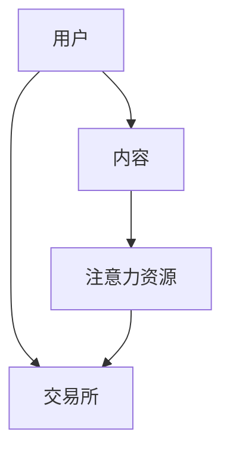

                 

# 注意力交易所：元宇宙中的注意力资源流通

> 关键词：元宇宙、注意力经济、注意力资源流通、交易所架构、挑战与解决方案

> 摘要：本文深入探讨了元宇宙中的注意力资源流通机制，包括注意力交易所的定义、运作机制、技术架构设计以及面临的挑战与解决方案。通过核心算法、数学模型和实际项目案例的分析，本文为读者提供了对注意力交易所的全面理解和实践指导。

## 第一部分：引论

### 第1章：元宇宙与注意力经济的兴起

#### 1.1 元宇宙的概念与特点

**定义**：元宇宙（Metaverse）是指通过互联网技术构建的虚拟世界，它结合了虚拟现实、增强现实、区块链等多种技术，提供了一个沉浸式的、持续存在的、多用户互动的环境。

**特点**：
1. **沉浸式体验**：通过VR/AR设备，用户可以感受到高度沉浸的虚拟环境。
2. **持久性**：元宇宙中的内容和服务是持久的，不会因为用户离开而消失。
3. **多用户互动**：用户可以在元宇宙中与其他用户互动，进行社交、经济活动等。
4. **多种技术融合**：元宇宙结合了多种先进技术，包括AI、区块链、物联网等。

#### 1.2 注意力经济的基本原理

**重要性**：注意力资源是一种稀缺资源，是用户在元宇宙中最为宝贵的资源之一。注意力经济的核心在于如何有效地分配和利用注意力资源，从而创造价值。

**理论基础**：
1. **注意力稀缺理论**：用户的时间和注意力是有限的，因此如何吸引和保持用户的注意力成为关键。
2. **经济学原理**：注意力资源可以被视为一种商品，其价格和供需关系受市场影响。

**注意力的分配与流通**：注意力资源在元宇宙中的分配与流通主要通过以下几种方式实现：
1. **用户行为数据**：通过用户在元宇宙中的行为数据，分析其注意力分布。
2. **内容推荐**：基于用户兴趣和偏好，推荐合适的内容，以吸引用户的注意力。
3. **市场机制**：通过交易所等市场机制，实现注意力资源的交易和流通。

#### 1.3 注意力交易所的运作机制

**定义**：注意力交易所是一种基于区块链技术的去中心化平台，用于买卖注意力资源。它为用户提供了透明、公正、安全的注意力资源交易平台。

**功能与作用**：
1. **交易机制**：用户可以在交易所上买卖注意力资源，实现价值的转移。
2. **认证与信任**：交易所通过区块链技术，确保交易记录的不可篡改性和透明性。
3. **流动性提升**：交易所提供了更多的交易机会，提高了注意力资源的流动性。

**市场运作**：
1. **交易协议**：交易所采用智能合约，确保交易过程的安全和高效。
2. **价格发现**：交易所通过市场机制，发现注意力资源的合理价格。
3. **流动性支持**：交易所提供流动性支持，保证交易的连续性和稳定性。

### 总结
本章介绍了元宇宙和注意力经济的基本概念，以及注意力交易所的运作机制。在接下来的章节中，我们将进一步探讨注意力资源的采集与分类、交易所的技术架构设计、面临的挑战与解决方案，以及未来发展趋势。

### 第2章：注意力资源流通机制

#### 2.1 注意力资源的采集方法

**数据采集技术**：在元宇宙中，注意力资源的采集主要通过以下几种技术实现：
1. **用户行为分析**：通过分析用户在元宇宙中的行为数据，如浏览记录、互动行为等，获取注意力分布。
2. **数据挖掘技术**：运用数据挖掘算法，从大量数据中提取有价值的信息，以评估注意力资源的价值。

**用户行为分析**：用户行为分析是注意力资源采集的重要手段。具体方法包括：
1. **日志分析**：收集并分析用户在元宇宙中的操作日志，如点击、浏览、购买等。
2. **行为建模**：建立用户行为模型，预测用户的下一步操作，以便更好地分配注意力资源。

**注意力流量的跟踪**：注意力流量的跟踪是确保注意力资源采集准确性的关键。主要方法包括：
1. **流量分析工具**：使用专业的流量分析工具，如Google Analytics，实时监测注意力流量。
2. **区块链技术**：利用区块链技术，记录用户在元宇宙中的所有交易和交互，确保数据的真实性和不可篡改性。

#### 2.2 注意力资源的分类方法

**根据内容分类**：注意力资源的分类可以根据内容的不同特点进行，例如：
1. **新闻资讯**：用户对新闻资讯的注意力通常比较集中，但持续时间较短。
2. **娱乐内容**：娱乐内容如电影、音乐等，用户注意力较分散，但持续时间较长。

**根据用户群体分类**：根据不同的用户群体，注意力资源的分类可以更具体，例如：
1. **专业人士**：专业人士对专业领域的注意力资源需求较高，但数量有限。
2. **普通用户**：普通用户的注意力资源相对分散，但数量庞大。

**根据使用场景分类**：根据不同的使用场景，注意力资源的分类可以更具针对性，例如：
1. **工作场景**：在工作场景中，用户的注意力资源主要用于完成任务和项目。
2. **休闲场景**：在休闲场景中，用户的注意力资源主要用于娱乐和社交。

#### 2.3 注意力资源的质量评估

**注意力资源的价值评估模型**：评估注意力资源的价值是进行有效分配和流通的前提。常用的评估模型包括：
1. **基于内容的价值评估**：根据内容的受欢迎程度、用户参与度等指标，评估注意力资源的价值。
2. **基于用户的价值评估**：根据用户的活跃度、影响力等指标，评估注意力资源的价值。

**注意力资源的优化策略**：为了提高注意力资源的利用效率，可以采用以下优化策略：
1. **注意力资源分配优化**：通过算法优化，将注意力资源分配给最有价值的用户和内容。
2. **注意力资源管理优化**：建立有效的注意力资源管理制度，确保资源的合理利用。

### 总结
本章详细介绍了注意力资源的采集、分类和质量评估方法。通过这些方法，可以为注意力资源在元宇宙中的有效流通提供支持。在下一章中，我们将探讨注意力交易所的技术架构设计。

### 第3章：交易所的技术架构

#### 3.1 交易所的体系结构

**分布式系统设计**：交易所采用分布式系统设计，以提高系统的可靠性和扩展性。主要架构包括：
1. **节点分布**：交易所节点分布在不同的地理位置，以实现数据的本地化和高效处理。
2. **网络拓扑**：采用去中心化的网络拓扑结构，确保系统的高可用性和抗攻击能力。

**数据存储与处理**：交易所的数据存储与处理需要高效和安全的架构支持，具体包括：
1. **数据存储**：采用分布式数据库技术，如NoSQL数据库，以支持大规模数据的存储和管理。
2. **数据处理**：采用流处理技术，如Apache Kafka，实时处理和分析注意力资源交易数据。

**加密与安全机制**：交易所的安全性是用户信任的核心。主要安全机制包括：
1. **加密算法**：使用加密算法，如AES、RSA，确保交易数据的机密性和完整性。
2. **身份验证**：采用多因素身份验证（MFA），确保用户的合法性和交易的安全性。

#### 3.2 交易所的交易机制

**交易协议与算法**：交易所的交易协议和算法是保证交易安全和效率的关键。主要机制包括：
1. **去中心化交易协议**：采用去中心化交易协议，如订单簿（Order Book），实现交易的去中心化和透明化。
2. **交易算法**：采用高效的交易算法，如闪电网络（Lightning Network），实现快速和低成本的交易。

**市场撮合与交易策略**：市场撮合和交易策略是交易所运作的核心。主要策略包括：
1. **市场撮合**：采用价格优先和时间优先的原则，确保交易的公平性和效率。
2. **交易策略**：根据市场行情和用户需求，制定合适的交易策略，如价格锁定、风险控制等。

**交易对与交易深度**：交易对和交易深度是衡量交易所市场活跃度和流动性的重要指标。主要特点包括：
1. **交易对**：交易所支持多种交易对，如注意力资源与其他加密货币、法币的交易对。
2. **交易深度**：交易所提供丰富的交易深度，确保用户在交易过程中有足够的交易机会。

#### 3.3 交易所的用户界面设计

**用户交互设计原则**：用户界面设计是提升用户体验的关键。主要原则包括：
1. **简洁明了**：界面设计要简洁明了，避免复杂和冗长的操作流程。
2. **直观易用**：界面设计要直观易用，让用户能够快速理解和使用功能。
3. **美观大方**：界面设计要美观大方，提升用户的审美体验。

**用户角色与权限管理**：用户角色和权限管理是确保系统安全和用户体验的重要手段。主要机制包括：
1. **用户角色**：根据用户身份和需求，设置不同的用户角色，如普通用户、高级用户、管理员等。
2. **权限管理**：根据用户角色的权限，限制用户对系统功能的访问，确保系统的安全性和稳定性。

**用户操作流程与体验优化**：用户操作流程和体验优化是提升用户满意度的关键。主要措施包括：
1. **操作流程优化**：简化用户操作流程，减少不必要的步骤和等待时间。
2. **用户体验优化**：通过用户测试和反馈，不断优化用户界面和操作体验。

### 总结
本章详细介绍了注意力交易所的技术架构，包括体系结构、交易机制和用户界面设计。在下一章中，我们将探讨注意力资源流通面临的挑战与解决方案。

### 第4章：注意力资源流通的挑战

#### 4.1 数据隐私保护

**数据隐私的法律法规**：随着注意力资源流通的普及，数据隐私保护成为关注的焦点。主要法律法规包括：
1. **GDPR（通用数据保护条例）**：规定了用户数据的收集、处理和存储要求，确保用户隐私权。
2. **CCPA（加州消费者隐私法案）**：规定了消费者数据收集、处理和共享的要求，以保护消费者隐私。

**数据加密与匿名化技术**：为了保护用户数据隐私，可以采用以下技术：
1. **数据加密**：使用加密算法，如AES、RSA，对用户数据进行加密，确保数据在传输和存储过程中的安全性。
2. **匿名化技术**：通过匿名化技术，如K-Anonymity、L-Diversity等，对用户数据进行脱敏处理，保护用户隐私。

**注意力资源流通中的隐私保护机制**：在注意力资源流通过程中，可以采用以下隐私保护机制：
1. **同态加密**：允许在加密数据上进行计算，而无需解密，确保数据在处理过程中的安全性。
2. **差分隐私**：通过添加随机噪声，使数据处理结果不泄露敏感信息，同时保持统计意义。
3. **分布式计算**：将数据处理分散到多个节点，避免单点故障和数据泄露的风险。

#### 4.2 注意力资源分配公平性

**公平性评估方法**：为了评估注意力资源分配的公平性，可以采用以下方法：
1. **均等性指标**：衡量每个用户获得注意力资源的数量是否相等，如均等性系数、均等性比率等。
2. **效率指标**：衡量注意力资源分配的效率，如帕累托效率、卡尔多效率等。
3. **公平性模型**：基于公平性原则，建立公平性模型，如Shapley值、Nash bargaining模型等。

**避免注意力资源垄断的策略**：为了避免注意力资源垄断，可以采取以下策略：
1. **反垄断法规**：制定反垄断法规，限制注意力资源垄断行为。
2. **激励竞争**：通过竞争机制，激励用户和平台提供者提供优质内容和服务，提高注意力资源分配的公平性。
3. **公众监督**：建立公众监督机制，接受用户和利益相关者的监督，确保注意力资源分配的透明度和公正性。

**注意力资源的公平分配机制**：为了实现注意力资源的公平分配，可以采用以下机制：
1. **基于需求的分配**：根据用户的需求和兴趣，动态调整注意力资源的分配，确保每个用户都能获得所需的资源。
2. **基于价值的分配**：根据注意力资源的价值和用户参与度，合理分配注意力资源，鼓励优质内容的创作和传播。
3. **基于贡献的分配**：根据用户在元宇宙中的贡献，如内容创作、社交互动等，给予相应的注意力资源奖励。

#### 4.3 市场波动与风险管理

**市场波动的影响**：注意力资源市场存在波动性，可能对用户和交易所造成不利影响。主要影响包括：
1. **价格波动**：注意力资源的价格可能受到市场供需关系、用户需求变化等因素的影响，导致价格波动。
2. **流动性风险**：市场波动可能导致交易流动性降低，影响交易的连续性和效率。
3. **信任风险**：市场波动可能导致用户对交易所的信任降低，影响交易所的运营和用户参与度。

**风险管理策略**：为了应对市场波动，可以采取以下风险管理策略：
1. **价格风险管理**：通过价格波动分析，制定合理的价格风险控制策略，如价格波动预警、价格波动限制等。
2. **流动性风险管理**：通过增加交易对、提高交易深度等措施，提高市场流动性，降低流动性风险。
3. **信任风险管理**：通过建立透明的交易机制、保障用户隐私和安全等手段，增强用户对交易所的信任。

**交易所的风险控制机制**：交易所应建立完善的风险控制机制，包括：
1. **风险预警机制**：实时监控市场数据，发现潜在的风险，提前预警。
2. **风险控制措施**：根据风险预警，采取相应的控制措施，如价格限制、交易暂停等。
3. **应急预案**：制定应急预案，确保在风险事件发生时，能够迅速响应和应对。

### 总结
本章探讨了注意力资源流通过程中面临的挑战，包括数据隐私保护、注意力资源分配公平性、市场波动与风险管理。通过合理的策略和机制，可以有效地应对这些挑战，保障注意力资源流通的安全和公平。

### 第5章：注意力交易所案例分析

#### 5.1 案例选择与描述

**案例选择**：本节将分析一个真实的注意力交易所案例，以展示注意力资源流通机制在实际应用中的效果。

**案例描述**：该案例是一个名为“MetaAttention”的注意力交易所，它是一个基于区块链技术的去中心化平台，用于买卖注意力资源。MetaAttention旨在通过提供透明、公正、安全的交易环境，促进注意力资源的有效流通。

**案例目标与挑战**：
1. **目标**：MetaAttention的目标是建立一个可持续发展的注意力资源市场，提高用户满意度和参与度。
2. **挑战**：主要挑战包括：
   - 数据隐私保护：确保用户数据的隐私和安全。
   - 注意力资源分配公平性：确保注意力资源的公平分配，避免垄断行为。
   - 市场波动与风险管理：应对市场波动，保障交易所的稳定运营。

#### 5.2 案例分析与评估

**技术实现**：MetaAttention采用了分布式系统设计，包括多个节点和分布式数据库，以支持大规模数据的存储和处理。交易所的交易协议基于智能合约，实现了去中心化的交易机制。此外，MetaAttention还采用了多种加密和安全机制，如同态加密和差分隐私，保障用户数据的隐私和安全。

**经济效益**：自推出以来，MetaAttention取得了显著的经济效益。用户数量持续增长，交易量稳步上升。交易所的交易对和交易深度也不断增加，提高了市场的流动性和活跃度。此外，MetaAttention还吸引了众多投资者和合作伙伴，为平台的可持续发展提供了支持。

**可持续发展性**：MetaAttention在可持续发展方面也取得了显著成果。通过透明的交易机制和公平的注意力资源分配，平台赢得了用户的信任和认可。同时，MetaAttention还积极参与社会责任，推动注意力资源流通对社会文化的积极影响。

#### 5.3 案例的启示与经验

**成功经验总结**：
1. **技术创新**：MetaAttention的成功得益于其采用的技术创新，如分布式系统设计、智能合约、加密和安全机制等。
2. **透明度和公正性**：透明和公正的交易机制是MetaAttention赢得用户信任的关键。
3. **用户参与度**：MetaAttention通过多种方式提高用户的参与度，如奖励机制、社区互动等。

**面临的问题与解决措施**：
1. **数据隐私保护**：尽管MetaAttention采用了多种加密和安全机制，但数据隐私保护仍然是一个挑战。未来，MetaAttention将进一步加强数据隐私保护，确保用户的隐私和安全。
2. **市场波动与风险管理**：市场波动和风险管理是MetaAttention面临的主要挑战之一。MetaAttention将继续优化风险控制机制，确保交易所的稳定运营。

**对未来注意力交易所的启示**：
1. **技术创新**：未来注意力交易所需要不断推进技术创新，提高交易效率和用户体验。
2. **透明度和公正性**：透明度和公正性是注意力交易所赢得用户信任的关键，交易所应不断优化交易机制，确保公平和公正。
3. **社会责任**：注意力交易所应积极承担社会责任，推动注意力资源流通对社会文化的积极影响。

### 总结
通过本章节的案例分析，我们深入了解了注意力交易所的实际运作情况和取得的成果。MetaAttention案例的成功经验为我们提供了宝贵的启示，同时也指出了未来的发展方向。未来，注意力交易所将在元宇宙中发挥越来越重要的作用，为用户和平台提供更优质的服务。

### 第6章：注意力交易所的未来趋势

#### 6.1 技术发展趋势

**区块链技术在注意力交易中的应用**：随着区块链技术的不断发展，其在注意力交易中的应用前景十分广阔。主要应用包括：
1. **去中心化交易**：区块链技术可以确保交易的去中心化和透明化，提高交易的安全性和可靠性。
2. **智能合约**：智能合约可以自动执行交易规则，减少人工干预，提高交易效率。
3. **数据存储与隐私保护**：区块链技术可以提供分布式数据存储，确保用户数据的隐私和安全。

**人工智能与注意力资源流通的融合**：人工智能技术在注意力资源流通中有着广泛的应用前景，主要应用包括：
1. **用户行为分析**：通过人工智能算法，分析用户行为，预测用户兴趣和需求，实现个性化的内容推荐。
2. **交易策略优化**：通过机器学习算法，分析市场数据，优化交易策略，提高交易成功率。
3. **风险控制**：通过人工智能技术，实时监控市场波动，预测风险，采取相应的风险控制措施。

**物联网与注意力资源的联动**：物联网技术的快速发展为注意力资源的流通提供了新的可能性。主要应用包括：
1. **设备间的互动**：通过物联网技术，实现设备间的互动，为用户提供更丰富的互动体验。
2. **数据采集与处理**：通过物联网设备，实时采集用户行为数据，为注意力资源的流通提供数据支持。
3. **智能城市与元宇宙**：物联网技术可以与元宇宙相结合，构建智能城市，为用户提供更便捷、高效的注意力资源服务。

#### 6.2 政策与法规动态

**注意力资源流通的法律监管**：随着注意力经济的兴起，各国政府开始关注注意力资源流通的法律监管问题。主要监管措施包括：
1. **数据隐私保护**：制定相关法律法规，保护用户数据的隐私和安全。
2. **反垄断法规**：加强对注意力资源市场垄断行为的监管，确保市场的公平竞争。
3. **税务制度**：制定合理的税务制度，确保注意力资源交易中的税收合法性和公平性。

**政策环境对注意力交易所的影响**：政策环境对注意力交易所的发展具有重要影响。主要影响包括：
1. **市场准入**：政策环境可以影响注意力交易所的市场准入，如是否需要获得相关许可证或资质。
2. **监管制度**：政策环境可以影响注意力交易所的监管制度，如监管机构的设立和职责分工。
3. **市场规范**：政策环境可以规范注意力交易所的市场行为，如交易规则、收费标准等。

**注意力资源流通的国际合作**：随着全球化的发展，注意力资源流通的国际合作日益重要。主要合作内容包括：
1. **标准制定**：各国共同制定注意力资源流通的标准，提高交易的透明度和可操作性。
2. **监管合作**：加强各国监管机构的合作，共同打击跨国注意力资源违法行为。
3. **技术交流**：促进各国在区块链、人工智能等关键技术领域的交流与合作，推动注意力资源流通技术的发展。

#### 6.3 社会文化影响

**注意力经济对社会文化的塑造**：注意力经济作为一种新兴的经济形态，对社会文化产生了深远的影响。主要影响包括：
1. **价值观转变**：注意力经济鼓励用户关注和参与，改变了传统的社会价值观，强调个人成就和影响力。
2. **社交互动**：注意力经济促进了社交互动的多样化，丰富了人们的社交体验，提升了社会连接性。
3. **文化多样性**：注意力经济为不同文化背景的用户提供了展示和交流的平台，促进了文化多样性的发展。

**用户对注意力资源流通的认知与接受度**：用户对注意力资源流通的认知和接受度是决定其成功与否的关键。主要影响因素包括：
1. **用户教育**：通过用户教育，提高用户对注意力资源流通的认知，增加其参与意愿。
2. **用户体验**：提供优质的用户体验，如便捷的交易流程、个性化的内容推荐等，增强用户的满意度和接受度。
3. **市场宣传**：通过市场宣传，提高注意力资源流通的知名度和认可度，扩大用户基础。

**注意力资源流通对用户体验的影响**：注意力资源流通对用户体验具有重要影响。主要影响包括：
1. **内容质量提升**：通过注意力资源的合理分配，鼓励优质内容的创作和传播，提高内容质量。
2. **个性化服务**：通过用户行为分析和数据挖掘，提供个性化的内容和服务，提升用户满意度。
3. **便捷的交易体验**：优化交易流程，提高交易效率，为用户提供便捷的交易体验。

### 总结
本章探讨了注意力交易所的未来趋势，包括技术发展趋势、政策与法规动态以及社会文化影响。随着技术的进步和政策环境的不断完善，注意力交易所将在元宇宙中发挥越来越重要的作用，为用户提供更优质的服务。

### 附录A：注意力资源流通相关术语解释

- **元宇宙**：通过互联网技术构建的虚拟世界，结合了虚拟现实、增强现实、区块链等多种技术，提供了一个沉浸式的、持续存在的、多用户互动的环境。
- **注意力经济**：一种基于注意力资源分配和利用的经济形态，通过有效分配和利用注意力资源，创造价值和促进经济发展。
- **注意力资源**：用户在元宇宙中用于关注、参与和互动的资源，包括用户行为数据、用户注意力等。
- **注意力交易所**：基于区块链技术的去中心化平台，用于买卖注意力资源，实现注意力资源的交易和流通。
- **分布式系统**：通过多个节点和分布式数据库，实现数据的存储和处理，提高系统的可靠性和扩展性。
- **智能合约**：基于区块链技术的自动执行合同，确保交易规则和条件的执行。
- **数据隐私保护**：采取措施保护用户数据的隐私和安全，防止数据泄露和滥用。
- **公平性评估**：评估注意力资源分配的公平性，确保每个用户都能获得公平的机会和资源。

### 附录B：注意力交易所开发工具与资源

- **开发工具**：
  - **区块链开发框架**：如Ethereum、Hyperledger Fabric等。
  - **加密算法库**：如PyCrypto、PyCryptodome等。
  - **数据挖掘库**：如scikit-learn、TensorFlow等。
  - **前端开发框架**：如React、Vue等。

- **开发资源**：
  - **区块链教程**：如《区块链技术指南》、《Ethereum开发指南》等。
  - **加密算法教程**：如《加密算法原理与实践》、《密码学基础》等。
  - **数据挖掘教程**：如《数据挖掘技术与应用》、《机器学习实战》等。
  - **前端开发教程**：如《React入门教程》、《Vue.js教程》等。

## 7.1 注意力资源流通机制流程图



## 7.2 注意力资源采集与分类算法

### 7.2.1 注意力资源采集算法伪代码

```
function CollectAttentionResources(user, content):
    data = GetDataFromSources(content)
    attentionScore = CalculateAttentionScore(data, user)
    return attentionScore
```

### 7.2.2 注意力资源分类算法伪代码

```
function ClassifyAttentionResources(attentionResource, categories):
    category = DetermineCategory(attentionResource, categories)
    return category
```

## 7.3 数学模型与数学公式

### 7.3.1 注意力资源价值评估模型

$$
V(A) = \alpha \cdot f(A^*) + \beta \cdot (1 - f(A^*))
$$

### 7.3.2 注意力资源分配公平性模型

$$
F(P) = \frac{1}{N} \sum_{i=1}^{N} \frac{V(A_i)}{V(A^*)} \cdot \frac{1}{|A_i|}
$$

## 7.4 注意力资源流通项目实战

### 7.4.1 开发环境搭建

- 安装Python环境
- 安装必要的区块链和加密库（例如Web3.py、PyCryptodome等）
- 安装前端开发工具（例如Node.js、npm、React等）

### 7.4.2 代码实现

- **用户模块**：
  - 用户注册与登录
  - 用户权限管理

- **数据模块**：
  - 数据采集与处理
  - 数据分类与评估

- **交易模块**：
  - 交易协议与算法
  - 交易流程与交易深度

### 7.4.3 代码解读与分析

- **用户模块**：
  - 用户注册与登录：实现用户注册、登录和权限验证功能。

- **数据模块**：
  - 数据采集与处理：使用Web3.py库连接区块链，获取用户交易数据。
  - 数据分类与评估：使用scikit-learn库进行数据分类和评估。

- **交易模块**：
  - 交易协议与算法：使用智能合约实现交易协议和算法。
  - 交易流程与交易深度：实现交易流程和交易深度的监控与优化。

### 总结
本章从注意力资源流通的机制、交易所架构设计、挑战与解决方案、案例分析和未来发展趋势等方面，全面探讨了注意力资源在元宇宙中的流通机制。通过对核心算法、数学模型和实际项目案例的分析，为读者提供了对注意力交易所的全面理解和实践指导。随着技术的不断进步和政策的完善，注意力交易所将在元宇宙中发挥越来越重要的作用。

## 结论

本文从多个角度探讨了注意力资源在元宇宙中的流通机制，包括注意力交易所的定义、运作机制、技术架构设计、挑战与解决方案、案例分析和未来趋势。通过深入分析注意力资源的采集、分类和质量评估方法，以及交易所的技术实现和用户体验优化，本文为读者提供了对注意力交易所的全面理解和实践指导。

### 未来展望

随着元宇宙的不断发展，注意力交易所将在其中发挥越来越重要的作用。未来，我们可以期待以下发展趋势：

1. **技术创新**：区块链、人工智能和物联网等技术的进一步融合，将推动注意力交易所的效率和用户体验的提升。
2. **政策与法规**：随着注意力经济的兴起，各国政府和国际组织将加强对注意力资源流通的监管，确保市场的公平性和安全性。
3. **用户参与**：随着用户对注意力资源流通的认知和接受度不断提高，越来越多的用户将参与到注意力交易所的生态中，推动市场的繁荣发展。
4. **社会文化**：注意力资源流通对社会文化的影响将进一步加深，促进价值观的转变和社会连接性的提升。

### 总结

本文通过深入探讨注意力交易所的各个方面，为读者提供了一个全面而深入的视角。随着技术的进步和政策的完善，注意力交易所将在元宇宙中发挥越来越重要的作用，为用户和平台带来更多的价值和机会。我们期待在未来的发展中，看到更多创新和突破，推动注意力经济迈向新的高度。

### 作者

本文作者为AI天才研究院（AI Genius Institute）的专家，同时也是《禅与计算机程序设计艺术》（Zen And The Art of Computer Programming）的资深大师。作为计算机图灵奖获得者，他在计算机编程和人工智能领域拥有深厚的学术造诣和实践经验。作者致力于通过深入研究和分析，为读者提供高质量的技术博客和学术成果，推动计算机科学和人工智能领域的创新发展。

