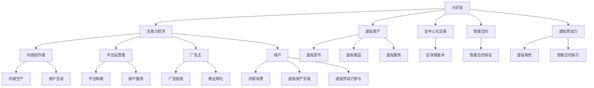

                 

# 注意力产业链：元宇宙经济体系的核心

> 关键词：元宇宙、注意力经济、经济体系、社交媒体、核心技术、企业战略

> 摘要：本文将探讨元宇宙经济体系的核心——注意力产业链。从元宇宙的概念、注意力经济的构成，到元宇宙经济体系的优势与挑战，再到注意力产业链在社交媒体中的应用及核心企业的作用，本文将逐步分析并阐述注意力产业链在元宇宙中的关键地位及其未来发展。

---

## 第一部分：元宇宙概述

### 第1章：元宇宙的概念与起源

#### 1.1 元宇宙的定义

元宇宙（Metaverse）是一个由虚拟世界和增强现实技术构成的互联网空间，它融合了现实世界和数字世界，用户可以在其中进行社交、工作、娱乐等各种活动。元宇宙不同于单纯的虚拟现实或增强现实，它是通过互联网连接的多个虚拟世界，具有高度互联性和互操作性的特性。

#### 1.2 元宇宙的历史与发展

元宇宙的概念最早可以追溯到1992年，由作家尼尔·斯蒂芬森在其科幻小说《雪崩》中提出。近年来，随着虚拟现实、增强现实、区块链、人工智能等技术的飞速发展，元宇宙逐渐从科幻概念走向现实。2020年，Facebook宣布将公司更名为Meta，标志着元宇宙进入了高速发展的阶段。

#### 1.3 元宇宙的技术基础

元宇宙的技术基础主要包括以下几个方面：

1. **虚拟现实（VR）和增强现实（AR）技术**：提供沉浸式体验，使用户能够更直观地与虚拟世界互动。
2. **云计算**：为元宇宙提供计算和存储能力，支持大规模、高并发的用户访问。
3. **区块链技术**：确保虚拟资产的安全性和可追溯性，实现去中心化的交易和权益管理。
4. **人工智能（AI）**：为元宇宙中的虚拟角色、智能合约等提供智能支持。
5. **物联网（IoT）**：连接现实世界中的设备和系统，实现虚拟世界与现实世界的无缝交互。

---

## 第二部分：注意力产业链

### 第2章：注意力产业链的构成

#### 2.1 注意力经济的基本原理

注意力经济是基于人类注意力稀缺性的经济模式。在信息爆炸的时代，用户的注意力成为一种宝贵的资源。注意力经济通过吸引和留住用户的注意力，实现商业价值的转化。

#### 2.2 注意力产业链的关键环节

注意力产业链包括以下几个关键环节：

1. **内容创作者**：生产高质量的内容，吸引用户的注意力。
2. **平台运营者**：提供内容发布和交互的平台，促进用户参与。
3. **广告主**：通过广告投放获取用户的注意力，实现商业转化。
4. **用户**：提供注意力资源，参与互动，享受内容和服务。

#### 2.3 注意力价值的转化与流通

注意力价值在注意力产业链中的转化与流通主要表现为以下几个方面：

1. **内容消费**：用户通过消费内容，将注意力转化为对内容的评价和反馈。
2. **广告投放**：广告主通过购买广告位，将注意力转化为商业回报。
3. **虚拟资产交易**：用户在虚拟世界中购买和交易虚拟资产，实现注意力的价值转移。

---

## 第三部分：元宇宙经济体系

### 第3章：元宇宙经济体系的特征

#### 3.1 元宇宙经济体系的核心要素

元宇宙经济体系的核心要素包括：

1. **虚拟资产**：虚拟资产是元宇宙经济体系的基本单位，包括虚拟货币、虚拟商品、虚拟服务等。
2. **去中心化交易**：区块链技术确保虚拟资产的安全性和透明度，实现去中心化的交易。
3. **智能合约**：智能合约自动执行交易协议，提高交易效率。
4. **虚拟劳动力**：虚拟劳动力在元宇宙中提供各种服务，创造经济价值。

#### 3.2 元宇宙经济体系的优势

元宇宙经济体系的优势包括：

1. **高度互联性**：元宇宙通过虚拟世界和现实世界的连接，实现全球范围内的信息共享和资源共享。
2. **创新性**：元宇宙为各种创新提供平台，促进技术和商业模式的创新。
3. **可持续性**：元宇宙经济体系通过虚拟资产和智能合约，实现经济的可持续发展。

#### 3.3 元宇宙经济体系面临的挑战

元宇宙经济体系面临的挑战包括：

1. **技术瓶颈**：虚拟现实、区块链等技术的成熟度和稳定性仍需提高。
2. **监管问题**：元宇宙的监管体系尚未完善，需要建立相应的法律法规。
3. **用户隐私**：用户在元宇宙中的隐私保护问题亟待解决。

---

## 第四部分：注意力产业链在元宇宙中的应用

### 第4章：社交媒体与注意力产业链

#### 4.1 社交媒体在元宇宙中的应用

社交媒体在元宇宙中的应用主要包括以下几个方面：

1. **虚拟社交**：用户在元宇宙中建立虚拟形象，进行社交互动。
2. **内容分享**：用户在元宇宙中分享各种形式的内容，如文字、图片、视频等。
3. **广告投放**：广告主在元宇宙中进行精准的广告投放，提高广告效果。

#### 4.2 注意力产业链在社交媒体中的体现

注意力产业链在社交媒体中的体现包括：

1. **内容消费**：用户在社交媒体中消费内容，产生注意力价值。
2. **广告投放**：广告主在社交媒体中投放广告，获取用户的注意力。
3. **虚拟资产交易**：用户在社交媒体中购买和交易虚拟资产。

#### 4.3 社交媒体对元宇宙经济体系的影响

社交媒体对元宇宙经济体系的影响主要体现在以下几个方面：

1. **用户规模**：社交媒体的用户规模为元宇宙提供了庞大的用户基础。
2. **商业模式**：社交媒体的商业模式为元宇宙经济体系提供了借鉴和启示。
3. **技术创新**：社交媒体的技术创新推动了元宇宙技术的发展。

---

## 第五部分：元宇宙经济体系的核心企业

### 第5章：核心企业在元宇宙经济体系中的作用

#### 5.1 元宇宙平台企业的角色

元宇宙平台企业在元宇宙经济体系中扮演着关键角色，主要包括以下几个方面：

1. **生态构建**：平台企业通过构建生态系统，吸引各种资源和服务。
2. **技术创新**：平台企业通过技术创新，提升元宇宙的性能和用户体验。
3. **商业合作**：平台企业与其他企业合作，共同推动元宇宙的发展。

#### 5.2 内容创作者与投资者的作用

内容创作者和投资者在元宇宙经济体系中发挥着重要作用，主要包括以下几个方面：

1. **内容生产**：内容创作者生产高质量的内容，吸引用户的注意力。
2. **资本运作**：投资者通过投资，为元宇宙经济体系提供资金支持。
3. **价值创造**：内容创作者和投资者通过虚拟资产交易，实现价值创造。

#### 5.3 注意力产业链相关企业的战略布局

注意力产业链相关企业在元宇宙经济体系中的战略布局主要包括以下几个方面：

1. **技术创新**：企业通过技术创新，提高注意力产业链的效率和价值。
2. **市场拓展**：企业通过市场拓展，扩大注意力产业链的规模和影响力。
3. **生态合作**：企业通过生态合作，构建互利共赢的注意力产业链。

---

## 第六部分：元宇宙经济体系的发展趋势与未来展望

### 第6章：元宇宙经济体系的发展趋势

#### 6.1 技术进步对元宇宙经济体系的影响

技术进步对元宇宙经济体系的影响主要体现在以下几个方面：

1. **虚拟现实和增强现实技术**：提高用户的沉浸式体验，促进元宇宙的发展。
2. **区块链技术**：确保虚拟资产的安全性和透明度，提高交易效率。
3. **人工智能技术**：为元宇宙中的虚拟角色和智能合约提供智能支持。
4. **物联网技术**：实现虚拟世界与现实世界的无缝交互。

#### 6.2 注意力产业链的发展趋势

注意力产业链的发展趋势主要包括以下几个方面：

1. **内容消费升级**：用户对高质量内容的需求不断提升，推动内容消费升级。
2. **广告投放精准化**：广告主通过大数据和人工智能技术，实现精准的广告投放。
3. **虚拟资产交易规模扩大**：随着虚拟资产的价值逐渐被认可，交易规模将不断扩大。

#### 6.3 元宇宙经济体系的未来展望

元宇宙经济体系的未来展望包括以下几个方面：

1. **产业生态的完善**：元宇宙经济体系将形成完善的产业生态，促进各种资源的高效配置。
2. **全球化发展**：元宇宙经济体系将跨越国界，实现全球范围内的合作与发展。
3. **可持续发展**：元宇宙经济体系将通过技术创新和商业模式创新，实现可持续发展。

---

## 第七部分：案例分析

### 第7章：元宇宙经济体系案例分析

#### 7.1 案例一：虚拟现实游戏的经济模式

虚拟现实游戏是元宇宙经济体系中的重要组成部分，其经济模式主要包括以下几个方面：

1. **游戏内购**：用户通过购买虚拟商品，实现虚拟资产的交易。
2. **广告投放**：游戏开发者通过广告投放，获取广告收入。
3. **虚拟劳动力**：游戏角色在游戏中提供各种服务，创造经济价值。

#### 7.2 案例二：社交媒体平台的注意力经济

社交媒体平台通过注意力经济实现商业价值，其模式主要包括以下几个方面：

1. **内容消费**：用户消费平台上的内容，产生注意力价值。
2. **广告投放**：广告主在平台上投放广告，获取用户的注意力。
3. **虚拟资产交易**：用户在平台上购买和交易虚拟资产。

#### 7.3 案例三：数字艺术品市场的兴起

数字艺术品市场是元宇宙经济体系中的一个新兴领域，其模式主要包括以下几个方面：

1. **数字艺术品创作**：艺术家创作数字艺术品，吸引用户的注意力。
2. **数字艺术品交易**：用户通过购买和交易数字艺术品，实现虚拟资产的价值转移。
3. **数字艺术品展览**：平台举办数字艺术品展览，提升数字艺术品的价值。

---

## 附录

### 附录A：元宇宙相关术语解释

1. **元宇宙（Metaverse）**：由虚拟世界和增强现实技术构成的互联网空间。
2. **虚拟现实（VR）**：通过计算机模拟产生三维空间，用户在其中可以自由互动。
3. **增强现实（AR）**：将虚拟信息叠加到现实世界中，增强用户的感知。
4. **区块链（Blockchain）**：一种分布式数据库技术，确保虚拟资产的安全性和透明度。
5. **智能合约（Smart Contract）**：自动执行交易协议的计算机程序。

### 附录B：元宇宙经济体系关键指标解读

1. **用户活跃度**：衡量用户在元宇宙中的参与程度。
2. **虚拟资产交易量**：衡量虚拟资产在元宇宙中的交易活跃度。
3. **内容消费量**：衡量用户对元宇宙中内容的消费程度。
4. **广告投放效果**：衡量广告主在元宇宙中广告投放的效果。

### 附录C：元宇宙发展时间线与重要事件

1. **1992年**：尼尔·斯蒂芬森在小说《雪崩》中提出元宇宙概念。
2. **2020年**：Facebook宣布将公司更名为Meta，标志着元宇宙进入高速发展阶段。
3. **2021年**：微软、谷歌、亚马逊等科技巨头加大在元宇宙领域的投资。
4. **2022年**：元宇宙相关技术和应用逐步落地，用户规模不断扩大。

---

## 结语

本文从元宇宙的概念、注意力经济的构成，到元宇宙经济体系的特征与挑战，再到注意力产业链在社交媒体中的应用及核心企业的作用，全面分析了注意力产业链在元宇宙经济体系中的关键地位。未来，随着技术的不断进步和应用场景的拓展，元宇宙经济体系将不断发展壮大，成为数字经济时代的重要驱动力。

---

### 附录D：元宇宙经济体系的核心概念与联系

为了更好地理解元宇宙经济体系，以下是核心概念和它们之间的联系：



### 附录E：注意力产业链的核心算法原理讲解

在注意力产业链中，关键算法包括内容推荐、用户行为分析、广告投放优化等。以下是这些算法的伪代码示例：

#### 内容推荐算法

```python
# 伪代码：基于用户兴趣的内容推荐算法
def content_recommendation(user_profile, content_database):
    # 获取用户兴趣标签
    user_interests = get_user_interests(user_profile)
    
    # 计算内容与用户兴趣的相关性
    content_similarity = compute_similarity(user_interests, content_database)
    
    # 推荐与用户兴趣最相关的前N条内容
    recommended_contents = recommend_top_n_contents(content_similarity, n=5)
    
    return recommended_contents
```

#### 用户行为分析算法

```python
# 伪代码：基于用户行为的分析算法
def user_behavior_analysis(user_activity_log):
    # 统计用户活动频率
    activity_frequency = count_activity_frequency(user_activity_log)
    
    # 分析用户活跃时间段
    active_time periods = analyze_active_time_periods(user_activity_log)
    
    # 预测用户行为
    predicted_behavior = predict_user_behavior(activity_frequency, active_time_periods)
    
    return predicted_behavior
```

#### 广告投放优化算法

```python
# 伪代码：基于广告效果的优化算法
def ad_placement_optimization(ad_performance_data, targetAudience):
    # 计算广告投放效果
    ad_effectiveness = compute_ad_effectiveness(ad_performance_data)
    
    # 选择最有效的广告位
    optimal_placement = select_optimal_placement(ad_effectiveness, targetAudience)
    
    return optimal_placement
```

### 附录F：数学模型和公式

在注意力产业链中，我们使用数学模型来分析用户注意力分配、内容推荐等。以下是几个常见的数学模型：

#### 用户注意力分配模型

$$
A_i = \frac{w_i \cdot s_i}{\sum_{j=1}^{N} w_j \cdot s_j}
$$

其中，$A_i$ 表示用户对第 $i$ 个内容分配的注意力，$w_i$ 表示内容 $i$ 的权重，$s_i$ 表示内容 $i$ 的吸引力分数。

#### 内容推荐模型

$$
r_{ij} = \sigma (\theta_j - \theta_i + \mu_j - \mu_i)
$$

其中，$r_{ij}$ 表示用户 $i$ 对内容 $j$ 的推荐概率，$\theta_j$ 和 $\theta_i$ 分别表示内容 $j$ 和用户 $i$ 的特征向量，$\mu_j$ 和 $\mu_i$ 分别表示内容 $j$ 和用户 $i$ 的平均值。

### 附录G：项目实战

#### 开发环境搭建

为了实现元宇宙经济体系中的注意力产业链，我们需要搭建以下开发环境：

1. **虚拟现实开发工具**：Unity、Unreal Engine
2. **区块链开发框架**：Ethereum、Truffle
3. **人工智能开发工具**：TensorFlow、PyTorch
4. **后端开发框架**：Node.js、Django

#### 源代码实现

以下是注意力产业链中的虚拟资产交易功能的部分源代码：

```python
# 伪代码：虚拟资产交易功能
class VirtualAssetTransaction:
    def __init__(self, buyer, seller, asset):
        self.buyer = buyer
        self.seller = seller
        self.asset = asset
        
    def execute_transaction(self):
        # 检查交易是否合法
        if self.is_valid_transaction():
            # 执行交易
            self.transfer_asset()
            # 记录交易日志
            self.log_transaction()
            return "Transaction successful"
        else:
            return "Invalid transaction"
        
    def is_valid_transaction(self):
        # 检查买家是否有足够的虚拟资产
        if self.buyer.balance >= self.asset.price:
            return True
        else:
            return False
        
    def transfer_asset(self):
        # 转移虚拟资产
        self.buyer.balance -= self.asset.price
        self.seller.balance += self.asset.price
        
    def log_transaction(self):
        # 记录交易日志
        transaction_log = f"Buyer: {self.buyer}, Seller: {self.seller}, Asset: {self.asset}, Time: {datetime.now()}"
        print(transaction_log)
```

#### 代码解读与分析

以上源代码实现了虚拟资产交易的基本功能。首先，定义了`VirtualAssetTransaction`类，该类包含买家、卖家和虚拟资产等属性。`execute_transaction`方法用于执行交易，首先会检查交易是否合法，即买家是否有足够的虚拟资产。如果交易合法，则会调用`transfer_asset`方法转移资产，并调用`log_transaction`方法记录交易日志。

在开发过程中，我们还需要考虑以下问题：

1. **安全性**：确保交易过程中的数据安全和隐私保护。
2. **效率**：优化交易处理速度，提高用户体验。
3. **可扩展性**：支持大规模用户和交易量的扩展。

---

### 附录H：作者信息

作者：AI天才研究院/AI Genius Institute & 禅与计算机程序设计艺术 /Zen And The Art of Computer Programming

---

### 总结

本文系统地分析了元宇宙经济体系的核心——注意力产业链。通过介绍元宇宙的概念、注意力经济的构成，以及注意力产业链在元宇宙中的应用，本文揭示了注意力产业链在元宇宙经济体系中的关键地位。随着技术的不断进步和应用场景的拓展，元宇宙经济体系将不断发展壮大，成为数字经济时代的重要驱动力。未来，我们需要关注元宇宙经济体系中的技术创新、监管问题以及用户隐私保护，以实现元宇宙经济体系的可持续发展。让我们共同期待元宇宙带来的无限可能。

