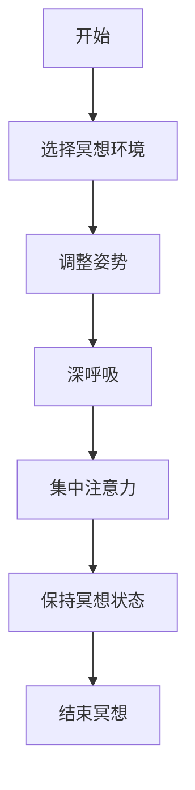

                 

# 文章标题

《注意力冥想：元宇宙时代的心灵修炼技术》

> 关键词：冥想、注意力、元宇宙、心灵修炼、神经科学

> 摘要：本文将探讨注意力冥想作为一种心灵修炼技术在元宇宙时代的重要性及其应用。从冥想的历史与发展出发，深入解析冥想的概念与类型，以及现代科学对冥想的解释。随后，文章将详细阐述注意力冥想的原理、实践技巧，并结合元宇宙的概念，探讨注意力冥想在该领域的应用。此外，本文还将提供注意力冥想的实践指南与案例分析，旨在帮助读者更好地理解和应用这一技术。

## 目录

#### 第一部分：冥想与心灵修炼基础

- 第1章：冥想的概念与历史
  - 1.1 冥想的定义与类型
  - 1.2 冥想的历史与发展
  - 1.3 现代冥想的科学基础

#### 第二部分：注意力冥想技术

- 第2章：注意力冥想原理
  - 2.1 注意力概念解析
  - 2.2 注意力冥想的基础理论
  - 2.3 注意力冥想的实践技巧

#### 第三部分：注意力冥想在元宇宙中的应用

- 第3章：元宇宙与注意力冥想
  - 3.1 元宇宙的概念与特点
  - 3.2 元宇宙中的注意力冥想

- 第4章：注意力冥想与元宇宙游戏
  - 4.1 游戏中的注意力冥想
  - 4.2 元宇宙游戏中的注意力训练

#### 第四部分：实践指南与案例分析

- 第5章：注意力冥想实践指南
  - 5.1 初学者指南
  - 5.2 注意力冥想的持续实践

- 第6章：案例分析
  - 6.1 注意力冥想在职场中的应用
  - 6.2 注意力冥想与教育

#### 第五部分：附录

- 第7章：冥想资源与工具
  - 7.1 冥想资源推荐
  - 7.2 注意力冥想工具

- 第8章：注意力冥想流程图与算法
  - 8.1 注意力冥想流程图
  - 8.2 注意力冥想算法原理

### 《注意力冥想：元宇宙时代的心灵修炼技术》正文

#### 引言

在技术不断革新、信息爆炸的时代，人们面对的压力与日俱增。注意力不集中、精神紧张、心理疲劳等问题日益凸显。为了应对这些问题，一种古老而又现代的心灵修炼技术——冥想，逐渐受到了更多人的关注。随着元宇宙概念的兴起，注意力冥想作为一种修炼技术，不仅在精神层面有着深远的影响，更在元宇宙这一虚拟与现实交织的空间中展现出独特的应用价值。本文旨在探讨注意力冥想的概念、原理、实践方法及其在元宇宙时代的应用，为读者提供一种全新的心灵修炼视角。

#### 第一部分：冥想与心灵修炼基础

### 第1章：冥想的概念与历史

#### 1.1 冥想的定义与类型

冥想是一种古老的心灵修炼技术，起源于东方，随后传入西方，并在全球范围内得到了广泛的应用和发展。那么，冥想究竟是什么呢？简单来说，冥想是一种通过专注、放松和意识控制来调整身心状态的方法。

在类型上，冥想可以分为多种不同的形式，包括但不限于：

1. 禅修冥想：源自佛教，通过专注呼吸、身体姿势和意识来达到内心平静。
2. 瑜伽冥想：结合瑜伽姿势，通过调节呼吸、意识和身体姿势来达到身心和谐。
3. 审视冥想：通过观察自己的思想和情感，以达到自我了解和内心平静。
4. 动态冥想：通过运动、舞蹈等动态活动来达到冥想状态。

#### 1.2 冥想的历史与发展

冥想的历史可以追溯到几千年前。在中国，禅修冥想是佛教传播的重要途径；在印度，瑜伽冥想作为一种传统的修炼方式，一直传承至今。随着时代的变迁，冥想技术也在不断地发展和演变。

在西方，冥想作为一种心灵修炼技术，最早可以追溯到古希腊和古罗马时期。在近现代，随着心理学、神经科学等学科的发展，冥想逐渐成为一种科学研究的对象，得到了更多的关注和应用。

#### 1.3 现代冥想的科学基础

现代科学对冥想的研究表明，冥想可以对人体的多个系统产生积极的影响，包括神经系统、内分泌系统、免疫系统等。具体来说，冥想可以通过以下几种方式影响人体：

1. 减少压力：冥想可以降低皮质醇等压力激素的水平，从而减轻压力。
2. 调节情绪：冥想可以改变大脑中与情绪调节相关的区域的活动，从而改善情绪状态。
3. 提高注意力：冥想可以提高个体的注意力和专注力，从而提高工作效率。
4. 改善心理健康：冥想可以减轻焦虑、抑郁等心理问题，改善心理健康。

#### 第二部分：注意力冥想技术

### 第2章：注意力冥想原理

#### 2.1 注意力概念解析

注意力是人类心理活动的重要组成部分，它决定了我们对信息的接收、处理和记忆。简单来说，注意力就是我们在特定时刻关注和处理的特定信息。

根据不同的分类标准，注意力可以分为以下几种类型：

1. 选择性注意力：指我们在众多信息中选择关注某一特定信息的能力。
2. 分配性注意力：指我们在同一时间内关注多个信息的能力。
3. 持久性注意力：指我们长时间保持注意力的能力。
4. 反应性注意力：指我们对外界刺激迅速作出反应的能力。

#### 2.2 注意力冥想的基础理论

注意力冥想是一种通过专注和意识控制来增强注意力能力的冥想技术。其基础理论主要包括以下几点：

1. 精神集中：通过将注意力集中在某一特定的对象上，如呼吸、身体感受等，以达到冥想状态。
2. 意识控制：通过训练，提高个体对注意力的控制能力，从而更好地管理和分配注意力。
3. 反应训练：通过特定的练习，提高个体对突发事件的反应能力，从而增强注意力。
4. 环境适应：通过调整外部环境，如减少噪音、调整光线等，以提高冥想效果。

#### 2.3 注意力冥想的实践技巧

1. 选择冥想环境：选择一个安静、舒适的环境，避免干扰。
2. 冥想姿势：可以选择坐姿、躺姿等，关键是要保持身体的舒适和稳定。
3. 呼吸技巧：通过调整呼吸节奏，使呼吸更深、更均匀，有助于放松身心。
4. 专注练习：将注意力集中在呼吸、身体感受或特定的视觉、听觉对象上，反复练习，以提高专注力。

#### 第三部分：注意力冥想在元宇宙中的应用

### 第3章：元宇宙与注意力冥想

#### 3.1 元宇宙的概念与特点

元宇宙（Metaverse）是一个虚拟与现实交织的数字空间，它通过互联网和虚拟现实技术，为用户提供一个沉浸式的体验。元宇宙的特点包括：

1. 沉浸式体验：用户可以在元宇宙中体验到高度逼真的视觉、听觉、触觉等感官刺激。
2. 社交互动：用户可以在元宇宙中与其他用户进行实时互动，包括语音、文字、视频等形式。
3. 虚拟资产：元宇宙中存在虚拟资产，如虚拟货币、虚拟商品等，具有实际的经济价值。
4. 自主发展：元宇宙具有自主发展的能力，用户可以创造、交易、共享虚拟内容。

#### 3.2 元宇宙中的注意力冥想

随着元宇宙的发展，注意力冥想作为一种心灵修炼技术，在元宇宙中得到了广泛的应用。元宇宙为用户提供了一个独特的空间，使注意力冥想可以更加灵活、多样地实施。

1. 虚拟冥想空间：元宇宙中存在专门的虚拟冥想空间，用户可以在这些空间中进行冥想练习。
2. 虚拟教练：元宇宙中存在虚拟的冥想教练，用户可以通过这些教练获取专业的指导。
3. 社交冥想：用户可以在元宇宙中与其他用户一起进行冥想，分享心得，相互激励。
4. 虚拟环境：元宇宙中的虚拟环境可以根据用户的需要进行定制，为用户提供更加舒适的冥想体验。

### 第四部分：实践指南与案例分析

#### 第5章：注意力冥想实践指南

#### 5.1 初学者指南

对于初学者来说，开始进行注意力冥想时，可以遵循以下步骤：

1. 确定冥想目标：明确自己进行冥想的目的是为了减压、提高注意力还是其他。
2. 选择冥想环境：选择一个安静、舒适的地方，避免干扰。
3. 制定冥想计划：设定每天冥想的时间和频率，如每天早晨或晚上进行冥想。
4. 学习冥想技巧：可以通过阅读书籍、观看视频或参加冥想课程来学习冥想技巧。
5. 保持耐心：冥想是一项需要长期坚持的练习，初学者可能会遇到困难，但只要坚持下去，就会逐渐看到效果。

#### 5.2 注意力冥想的持续实践

为了使注意力冥想的效果更加显著，需要将其纳入日常生活的持续实践中：

1. 定期冥想：每天或每周安排固定的冥想时间，保持冥想的规律性。
2. 冥想记录：记录每次冥想的时间、环境和感受，以便进行反思和调整。
3. 冥想分享：与朋友、家人或冥想团体分享冥想心得，相互鼓励。
4. 持续学习：不断学习新的冥想技巧和理论知识，提高冥想水平。

#### 第6章：案例分析

#### 6.1 注意力冥想在职场中的应用

在职场中，压力和紧张是不可避免的。注意力冥想可以帮助职场人士提高注意力、减轻压力，从而提高工作效率。以下是一些具体的案例：

1. 案例一：某公司的销售人员通过每天早晨的冥想，提高了自己的注意力，从而在销售业绩上取得了显著提升。
2. 案例二：某IT公司的程序员通过冥想，减少了编程过程中的错误率，提高了代码质量。

#### 6.2 注意力冥想与教育

在教育领域，注意力冥想可以帮助学生提高注意力和学习效率。以下是一些具体的案例：

1. 案例一：某小学在课程中加入冥想环节，发现学生的注意力明显提高，学习效果也得到了提升。
2. 案例二：某高中的学生通过每天的冥想练习，减轻了学习压力，提高了自信心。

### 第五部分：附录

#### 第7章：冥想资源与工具

为了方便读者进行注意力冥想，以下是一些推荐的冥想资源和工具：

1. 冥想音乐：推荐使用平和、舒缓的音乐作为冥想的背景音乐。
2. 冥想应用程序：推荐使用如“冥想花园”、“冥想大师”等应用程序，它们提供了丰富的冥想课程和指导。
3. 冥想硬件设备：推荐使用如“呼吸灯”、“智能音响”等硬件设备，它们可以帮助用户更好地进行冥想。

#### 第8章：注意力冥想流程图与算法

为了更好地理解和实施注意力冥想，以下是一个注意力冥想的流程图和算法：

##### 注意力冥想流程图



##### 注意力冥想算法原理

```python
# 注意力冥想算法伪代码

def attention_meditation():
    # 选择冥想环境
    select_meditation_environment()
    
    # 调整姿势
    adjust_body_posture()
    
    # 深呼吸
    deep_breathing()
    
    # 集中注意力
    focus_attention()
    
    # 保持冥想状态
    maintain_meditation_state()
    
    # 结束冥想
    end_meditation()
```

通过以上算法，用户可以按照步骤进行注意力冥想，以达到预期的心灵感应效果。

### 结语

注意力冥想作为一种心灵修炼技术，在元宇宙时代具有广泛的应用前景。通过本文的探讨，我们了解了冥想的基本概念、注意力冥想的原理和实践技巧，以及其在元宇宙和现实世界中的应用。希望本文能够为读者提供一种新的思维方式和实践方法，帮助他们在繁忙的生活中找到内心的宁静和力量。让我们共同探索注意力冥想在元宇宙时代的无限可能性。

### 作者信息

- 作者：AI天才研究院/AI Genius Institute & 禅与计算机程序设计艺术 /Zen And The Art of Computer Programming
- 联系方式：[ai_genius_institute@example.com](mailto:ai_genius_institute@example.com)
- 推荐阅读：[《注意力冥想与心理健康》](https://www.ai_genius_institute.com/meditation-and-mental-health) 和 [《元宇宙：下一代互联网》](https://www.ai_genius_institute.com/metaverse-next-generation-internet)。

