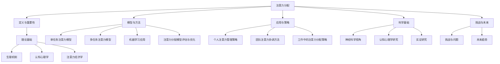

                 

# 注意力分配：个人效率的关键

> 关键词：注意力分配、个人效率、工作管理、多任务处理、认知负荷

> 摘要：本文从理论和实践两个角度探讨了注意力分配在提高个人工作效率和完成任务中的重要性。首先，介绍了注意力分配的基本概念和理论基础，随后详细分析了注意力分配的模型与方法，并结合机器学习与人工智能的最新研究进展。文章还讨论了注意力分配在个人、团队和工作中的应用策略，并从神经科学和认知心理学的角度提供了科学依据。最后，对注意力分配的挑战和未来发展趋势进行了展望，为读者提供了实用的工具和技巧。

## 第一部分：注意力分配概述

### 第1章：注意力分配的概述

#### 1.1 什么是注意力分配

注意力分配是指将注意力集中在特定信息或任务上，以优化个人效率。这一概念源自认知心理学，指的是大脑如何处理和分配有限的心理资源。在当今信息爆炸的时代，如何高效地分配注意力，成为了提高工作效率和个人发展的关键。

**定义**：注意力分配是指个体在处理信息时，根据任务需求和情境，合理地将认知资源（包括注意力、记忆、感知等）分配到不同的任务或信息上。

**重要性**：注意力分配对提高工作和学习效率至关重要。不当的注意力分配可能导致任务无法高效完成，甚至产生疲劳和压力。因此，掌握注意力分配的技巧，有助于提高个人生产力。

**现状**：当前社会背景下，人们面临的信息量和任务量越来越大，注意力分配成为一个重要课题。无论是职场人士还是学生，都需要面对多任务处理和信息过载的挑战，注意力分配策略的运用变得尤为关键。

#### 1.2 注意力分配的理论基础

注意力分配的理论基础主要涉及神经科学、认知心理学和经济学等领域。

**注意力的生理机制**：大脑如何处理和分配注意力。大脑中的前额叶皮层和扣带回前部等区域在注意力分配中起着关键作用。

**认知心理学**：研究注意力的类型、分配机制和限制。例如，注意力的集中性、分配性和切换性等。

**注意力经济学**：将注意力视为一种稀缺资源，研究其分配策略和优化方法。例如，如何在不同的任务之间进行成本效益分析。

### 第2章：注意力分配的模型与方法

#### 2.1 传统的注意力分配模型

**单任务注意力模型**：在这种模型中，个体将注意力集中在单一任务上，直到任务完成。这种模型适用于需要高度集中精力的任务，如编程、写作等。

**多任务注意力模型**：在这种模型中，个体同时处理多个任务，但每个任务获得的注意力资源有限。这种模型适用于多任务处理环境，如项目管理、团队合作等。

#### 2.2 机器学习与人工智能在注意力分配中的应用

随着机器学习和人工智能技术的发展，注意力分配模型也得到了显著提升。

**神经网络模型**：如注意力机制在深度学习中的应用。通过引入注意力机制，神经网络能够更好地关注关键信息，提高任务处理的效率。

**强化学习**：用于动态调整注意力分配策略。通过不断学习和调整，强化学习模型能够根据不同任务需求，优化注意力的分配。

#### 2.3 注意力分配模型的评估与优化

**评估指标**：评估注意力分配的效率、准确性和适应性。常见的评估指标包括任务完成时间、错误率、注意力分配的稳定性等。

**优化方法**：通过参数调整、模型训练和数据增强等方法，优化注意力分配模型。例如，使用梯度下降法调整模型参数，或通过数据增强提高模型的泛化能力。

## 第二部分：注意力分配的应用

### 第3章：个人注意力管理

#### 3.1 个人注意力管理策略

**时间管理**：如番茄工作法，将工作时间分割成多个25分钟的工作周期，每个周期后休息5分钟。这种方法有助于集中注意力，提高工作效率。

**任务优先级**：如四象限法，将任务分为紧急重要、紧急不重要、不紧急重要、不紧急不重要四类，根据优先级进行任务分配。

**注意力聚焦**：采用专注力训练方法，如冥想、正念练习，提高注意力的集中度和稳定性。

#### 3.2 个人注意力管理的工具与技巧

**注意力管理工具**：如专注力APP、任务管理软件，帮助个体跟踪和管理注意力分配。

**心理技巧**：如自我激励、目标设定、习惯培养等，通过心理调节提高注意力分配的效率。

### 第4章：团队注意力协调

#### 4.1 团队注意力协调的重要性

**团队协作**：注意力协调对团队效率的影响。团队成员之间的注意力协调有助于提高团队的整体工作效率。

**项目管理**：如何在项目中协调团队成员的注意力。合理分配任务，确保团队成员能够集中注意力完成任务。

#### 4.2 团队注意力协调的方法

**沟通策略**：如有效会议、即时通讯工具，提高团队内部的沟通效率，减少注意力分散。

**任务分配**：如何合理分配任务，确保团队成员的注意力集中。通过任务分配优化，减少团队成员之间的干扰，提高工作效率。

### 第5章：注意力分配在工作中的应用

#### 5.1 工作中注意力分配的策略

**工作流程优化**：通过优化工作流程，减少不必要的任务和流程环节，降低注意力分散。

**任务安排**：合理安排工作，避免注意力疲劳。例如，将复杂任务拆分成小任务，分阶段完成。

#### 5.2 注意力分配与工作效率

**工作效率评估**：如何评估个人和团队的工作效率。通过设定明确的绩效指标，定期评估工作效率。

**案例分析**：成功案例中的注意力分配策略。分析成功案例中的注意力分配策略，为实际工作提供借鉴。

## 第三部分：注意力分配的科学基础

### 第6章：神经科学视角下的注意力分配

#### 6.1 大脑的注意力机制

**大脑区域**：前额叶皮层、扣带回前部等大脑区域在注意力分配中起着关键作用。这些区域负责处理和调控注意力的分配。

**神经信号**：多巴胺、谷氨酸等神经递质在注意力分配中发挥重要作用。神经信号的变化影响大脑对信息的处理和分配。

#### 6.2 注意力分配的生理机制

**生理机制**：大脑如何处理和分配注意力。大脑通过神经网络的调控，实现对信息的筛选和加工。

**生物反馈**：通过生物反馈技术调整注意力。生物反馈技术可以帮助个体了解自己的注意力状态，并通过调整呼吸、姿势等手段优化注意力分配。

### 第7章：注意力分配的认知心理学研究

#### 7.1 注意力分配的认知模型

**认知负荷理论**：如何通过认知负荷理论来优化注意力分配。认知负荷理论指出，大脑处理信息的容量有限，优化注意力分配有助于减轻认知负荷。

**多任务处理**：如何有效处理多项任务。多任务处理需要个体具备良好的注意力分配能力，通过合理分配注意力资源，提高任务处理效率。

#### 7.2 注意力分配的实证研究

**研究方法**：实验设计、数据分析等。实证研究通过实验设计和数据分析，验证注意力分配对工作效率和学习效果的影响。

**研究结论**：注意力分配对工作效率和学习效果的影响。研究发现，优化注意力分配策略可以提高工作效率和学习成果。

## 第四部分：注意力分配的挑战与未来

### 第8章：注意力分配的挑战与问题

#### 8.1 注意力分配的挑战

**信息过载**：如何在信息过载的环境中有效分配注意力。信息过载导致个体难以集中注意力，需要通过过滤和筛选信息来优化注意力分配。

**注意力分散**：如何应对注意力分散的问题。注意力分散是当前社会面临的普遍问题，通过环境控制、心理调节等方法可以缓解注意力分散。

#### 8.2 注意力分配的问题

**个人问题**：如注意力缺乏、注意力不集中。个人问题影响个体的工作和生活质量，需要通过训练和调节来改善。

**社会问题**：如社交媒体对注意力分配的影响。社交媒体对注意力的分散作用显著，需要制定相应的策略来管理社交媒体使用，保护注意力。

### 第9章：注意力分配的未来趋势

#### 9.1 注意力分配技术的发展

**人工智能**：如AI在注意力分配中的应用。人工智能技术可以帮助个体更好地理解和优化注意力分配。

**神经科技**：如神经反馈技术的应用。神经反馈技术可以通过监测大脑活动，提供实时反馈，帮助个体调整注意力分配。

#### 9.2 注意力分配的未来方向

**个性化注意力管理**：如何实现个性化注意力管理。通过个性化策略，帮助个体更好地适应不同环境和任务需求。

**社会与环境的注意力协调**：如何在社会层面实现注意力协调。通过建立合理的注意力协调机制，提高社会整体的工作效率和幸福感。

## 附录

### 附录A：注意力分配研究资源与工具

#### A.1 注意力分配研究资源

**学术论文**：注意力分配相关的最新研究成果。

**书籍**：经典书籍推荐。

**网站与博客**：专业网站和博客推荐。

#### A.2 注意力分配研究工具

**软件工具**：如注意力监控软件、注意力训练工具。

**硬件设备**：如智能眼镜、生物反馈设备。

### 附录B：注意力分配 Mermaid 流程图



### 附录C：注意力分配算法伪代码

```python
# 注意力分配算法伪代码

# 初始化注意力分配参数
alpha = 0.1  # 注意力分配权重
beta = 0.9   # 反馈权重
gamma = 0.05 # 学习率

# 输入任务集合 T 和初始注意力分配 A0
T = [t1, t2, t3, ..., tn]
A0 = [1/n for t in T]

# 注意力分配迭代过程
for epoch in range(num_epochs):
    # 更新注意力分配
    for task in T:
        # 计算注意力分配的反馈信号
        feedback_signal = compute_feedback_signal(task)
        
        # 更新注意力分配权重
        A[task] = alpha * A[task] + beta * (1 - A[task]) * feedback_signal
        
        # 应用学习率调整权重
        A[task] = gamma * A[task]

    # 计算当前注意力分配的效率
    efficiency = compute_effic
```


### 作者

**作者：AI天才研究院/AI Genius Institute & 禅与计算机程序设计艺术 /Zen And The Art of Computer Programming**

